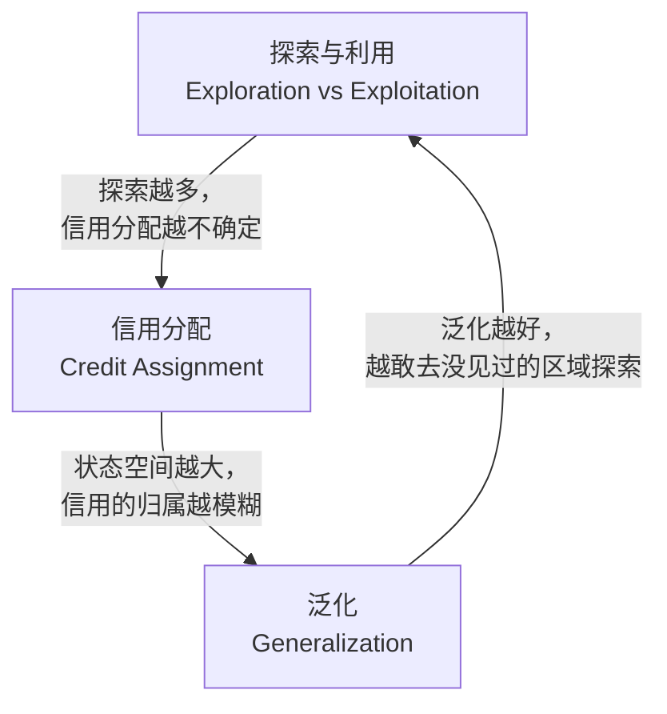
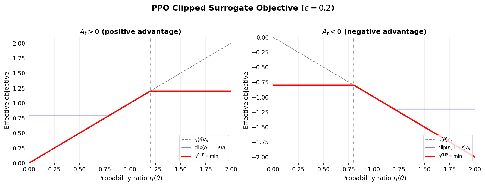
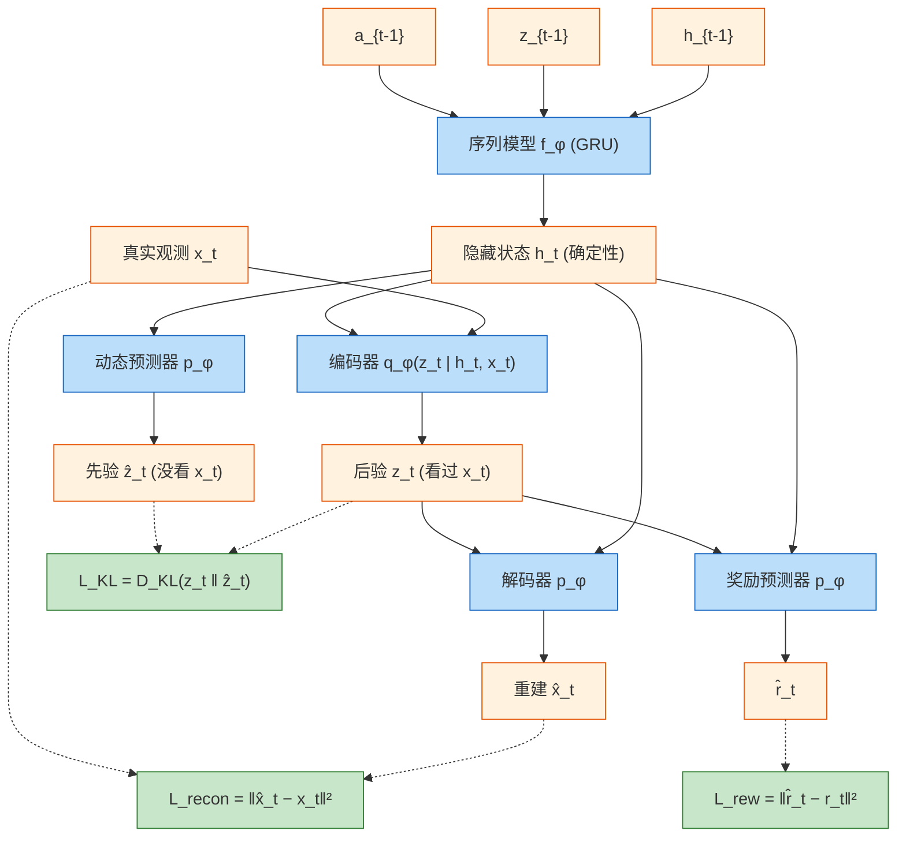

# 强化学习：从贝尔曼方程到人类偏好对齐
[← 回到首页](..)

> **Reinforcement Learning: From Bellman Equations to Human Preference Alignment**
>
> 覆盖 2013–2025，24 篇核心论文，9 个主线节点
>
> 撰写于 2026 年 7 月

---

## 符号表

### 环境与智能体

| 符号 | 含义 | 首次出现 |
|------|------|---------|
| $\mathcal{S}$ | 状态空间 | §0.1 |
| $\mathcal{A}$ | 动作空间 | §0.1 |
| $s_t$, $a_t$, $r_t$ | 时刻 $t$ 的状态、动作、奖励 | §0.1 |
| $\pi(a\|s)$ | 策略：给定状态 $s$，选择动作 $a$ 的概率 | §0.1 |
| $p(s',r\|s,a)$ | MDP 动态：从 $(s,a)$ 转移到 $s'$ 并获得奖励 $r$ 的概率 | §0.1 |
| $\gamma$ | 折扣因子，$0 \le \gamma \le 1$ | §0.2 |

### 价值函数

| 符号 | 含义 | 首次出现 |
|------|------|---------|
| $G_t$ | 回报：$G_t = \sum_{k=0}^{\infty} \gamma^k R_{t+k+1}$ | §0.2 |
| $v_\pi(s)$ | 状态价值函数：$v_\pi(s) = \mathbb{E}_\pi[G_t\|S_t=s]$ | §0.2 |
| $q_\pi(s,a)$ | 动作价值函数：$q_\pi(s,a) = \mathbb{E}_\pi[G_t\|S_t=s, A_t=a]$ | §0.2 |
| $v_*(s), q_*(s,a)$ | 最优价值函数 | §0.2 |
| $V(s)$, $Q(s,a)$ | 带参数的价值函数近似 | §1.1 |

### TD 学习与 Q-Learning

| 符号 | 含义 | 首次出现 |
|------|------|---------|
| $\alpha$ | 学习率 | §0.3 |
| $\delta_t$ | TD 误差：$\delta_t = R_{t+1} + \gamma V(S_{t+1}) - V(S_t)$ | §0.3 |
| $\theta$ | 在线 Q 网络参数 | §1.1 |
| $\theta^{-}$ | 目标 Q 网络参数（冻结） | §1.1 |
| $\mathcal{D}$ | 经验回放池 | §1.1 |

### 策略梯度

| 符号 | 含义 | 首次出现 |
|------|------|---------|
| $\pi_\theta(a\|s)$ | 参数化策略 | §2.1 |
| $A(s,a)$ | 优势函数：$A(s,a) = Q(s,a) - V(s)$ | §2.1 |
| $r_t(\theta)$ | 概率比：$r_t(\theta) = \frac{\pi_\theta(a_t\|s_t)}{\pi_{\theta_{\text{old}}}(a_t\|s_t)}$ | §2.3 |
| $\epsilon$ | PPO 截断范围 | §2.3 |
| $D_{\text{KL}}$ | KL 散度 | §2.2 |

### Actor-Critic

| 符号 | 含义 | 首次出现 |
|------|------|---------|
| $\mu(s\|\theta^\mu)$ | 确定性策略（DDPG） | §3.1 |
| $\tau$ | 软更新系数 | §3.1 |
| $H(\pi(\cdot\|s))$ | 策略熵 | §3.3 |
| $\alpha$ | 熵温度系数（SAC） | §3.3 |

### 规划与搜索

| 符号 | 含义 | 首次出现 |
|------|------|---------|
| $N(s,a)$ | 节点 $(s,a)$ 在 MCTS 中的访问次数 | §5.1 |
| $Q(s,a)$ | MCTS 中边 $(s,a)$ 的平均行动值 | §5.1 |
| $P(s,a)$ | 先验概率（来自策略网络） | §5.1 |
| $c_{\text{puct}}$ | PUCT 探索常数 | §5.1 |
| $h_\theta, g_\theta, f_\theta$ | MuZero 的表征/动力学/预测函数 | §5.3 |

### 人类偏好

| 符号 | 含义 | 首次出现 |
|------|------|---------|
| $\hat{r}$ | 学习到的奖励函数 | §6.1 |
| $\sigma^1, \sigma^2$ | 待比较的轨迹片段 | §6.1 |
| $\pi_{\text{SFT}}$ | 监督微调策略 | §6.2 |
| $\pi_{\text{RL}}$ | RL 微调后的策略 | §6.2 |
| $\beta$ | KL 惩罚系数（RLHF） | §6.2 |

### GRPO

| 符号 | 含义 | 首次出现 |
|------|------|---------|
| $G$ | 每组采样输出数量 | §7.1 |
| $o_i$ | 第 $i$ 个采样输出 | §7.1 |
| $\tilde{r}_i$ | 组内标准化后的奖励 | §7.1 |
| $\hat{A}_{i,t}$ | 第 $i$ 个输出第 $t$ 个 token 的组内相对优势 | §7.1 |
| $\pi_{\text{ref}}$ | 参考策略（用于 KL 正则） | §7.1 |

### 扩散模型 RL

| 符号 | 含义 | 首次出现 |
|------|------|---------|
| $x_T, x_{T-1}, \ldots, x_0$ | 去噪轨迹（$x_T$ 为纯噪声，$x_0$ 为干净输出） | §8.1 |
| $p_\theta(x_{t-1}\|x_t, c)$ | 去噪策略：以条件 $c$ 从 $x_t$ 去噪一步得到 $x_{t-1}$ | §8.2 |
| $\varepsilon_\theta$ | 噪声预测网络 | §8.1 |
| $v_\theta$ | 流匹配速度场 | §8.3 |
| $T$ | 去噪总步数 | §8.1 |

---

## 0. 第零章：什么是强化学习？

> 本章不要求任何预备知识。我们的目标只有一个：**先理解强化学在解决什么问题，然后再谈怎么解决。** 如果你对 MDP、贝尔曼方程已经很熟悉，可以跳到 §1。

### 0.1 强化学习在机器学习谱系中的位置

机器学习通常被分成三大范式。理解 RL 的最快方式，就是看它和其他两种有什么不同。

**监督学习（Supervised Learning）**：给你一堆标注好的数据。每张猫的图片都标了「猫」，模型学的是「输入 → 标签」的映射。学完之后，模型自己不做任何决策——它只是被动地输出预测。

**无监督学习（Unsupervised Learning）**：给你一堆没有标签的数据。模型自己去找结构——聚类、降维、生成。没有「正确答案」，只有「数据本身的结构」。

**强化学习（Reinforcement Learning）**：没有标注数据，也没有静态数据集。只有一个**可以与之交互的环境**。你做一个动作，环境给你一个**奖励**（可能对，可能错，可能延迟很久），然后进入新状态。你从这些奖励中学习：什么样的行为能带来更多的累计奖励？

用一个简单的比喻：

| 范式 | 类比 | 信号来源 |
|------|------|---------|
| 监督学习 | 学生做练习题，每道题都有标准答案 | 标注好的 (输入, 正确输出) 对 |
| 无监督学习 | 学生自己翻课本，找知识之间的关联 | 数据本身的结构 |
| 强化学习 | 学生参加一场没有标准答案的考试，做完后老师只说「及格」或「不及格」 | 环境反馈的标量奖励 |

**强化学习的独特之处在于**：智能体的行为**影响它未来看到的数据**。你选择走左边，你就永远不知道走右边会怎样。你的当前决策不仅决定了当前的奖励，还决定了你未来会在什么样的处境中做下一个决策。这是监督学习和无监督学习都没有的反馈循环。

### 0.2 一个例子贯穿始终：让机器人学会走路

在进入任何数学形式化之前，我们先盯住一个具体问题。这个例子会贯穿整个第零章。

想象你有一个双足机器人，它的任务是**学会向前走**。

- 它能感知到的东西（**状态**）：关节角度、身体倾角、当前速度、脚底压力传感器读数
- 它能做的事情（**动作**）：给每个关节马达施加多大的力矩
- 它做完之后能得到什么（**奖励**）：往前走多远。走得远 = 正奖励，摔倒 = 负奖励

现在，这个机器人对物理世界一无所知——它不知道「抬左脚」会让重心右移，「膝盖弯曲」会让身体下降。它只能**试**：随机动一下，看看发生了什么。如果动了之后还没摔倒，而且往前走了一点——好，记住这个感觉。如果摔倒了——坏，下次别这样了。

这就是强化学习的交互循环：

```
机器人观察当前状态 → 选择动作 → 执行动作 →
环境反馈新状态 + 奖励 → 机器人更新认知 → 重复
```

形式化地说，这被称为**智能体-环境交互循环（Agent-Environment Loop）**。每一个时间步 $t$：

1. 智能体观察到状态 $s_t$
2. 智能体选择一个动作 $a_t$
3. 环境返回奖励 $r_{t+1}$ 和新状态 $s_{t+1}$
4. 智能体根据这个经验调整自己的行为

从开始到结束（机器人启动 → 走过 10 米或摔倒），一整条经验链条称为一个 **episode（幕）**：

$$s_0, a_0, r_1, s_1, a_1, r_2, s_2, \ldots, s_T$$

在机器人走路的例子中，每个 episode 可能持续几百步。机器人的目标不是每一步都得到最多的奖励，而是让**整个 episode 的累积奖励最大**——有时需要暂时后退一步（负奖励），才能绕开障碍，最终走得更远。

### 0.3 核心要素逐一拆解

上面那个机器人的例子包含了强化学习的所有核心概念。我们一个一个拆开看。

#### 状态（State）：智能体感知到的世界

状态 $s$ 是智能体做决策时能看到的**全部信息**。在理想情况下，状态包含对未来决策有用的所有东西——这就是**马尔可夫性质**：未来只和现在有关，和过去无关。

$$\Pr\{S_{t+1} \mid S_t\} = \Pr\{S_{t+1} \mid S_1, S_2, \ldots, S_t\}$$

**例子**：在围棋中，当前的棋盘局面就是完整的马尔可夫状态——你不需要知道这盘棋怎么下到这个局面的，你知道当前哪里还有空就够了。在 Atari 游戏中，单帧画面缺失运动信息（不知道球往哪个方向飞），所以我们通常**堆叠连续 4 帧**作为状态，近似满足马尔可夫性质。在机器人走路中，如果传感器只能读到关节角度（但没有脚底压力），那么状态就**不是**完整的——这叫做**部分可观测（Partial Observability）**。教程中大部分方法默认状态是完整的，但到了现实世界的应用（如自动驾驶），部分可观测性是一个核心挑战。

#### 动作（Action）：智能体能做什么

动作空间可以分为两类：

- **离散动作**：可以枚举。Atari 手柄有 18 个按钮组合；围棋有 361 个落子位置。第一章讲的 DQN 和 Rainbow 就是为离散动作设计的。
- **连续动作**：不可枚举。机器人马达的力矩是连续值——1.53 N·m 和 1.54 N·m 是不同动作。第二、三章讲的策略梯度、Actor-Critic 方法就是为连续动作设计的。

#### 奖励（Reward）：唯一的老师

奖励 $r$ 是一个**标量**（一个数）。正数代表「好」，负数代表「坏」。这就是智能体能从环境中获得的全部教学信号。

**奖励是 RL 中最重要也最容易被误用的概念。** 以下几个事实值得现在就记住：

1. **奖励是目标的量化描述。** 你说「我希望机器人学会走路」，你需要把「会走路」这个模糊目标翻译成一个可以计算的奖励函数——比如「往前走的速度 × 10 − 摔倒惩罚 100」。你翻译得不好（比如奖励「站得高」而非「走得远」），机器人就会学到奇怪的行为。
2. **奖励可以是稀疏的。** 在围棋中，你下 200 步才得到一个奖励（赢了 +1，输了 −1）。前面 199 步都没有任何信号。这叫做**信用分配问题**——你赢了，但哪一步的贡献最大？教程第五章（MCTS）会给出一个漂亮的解决方案。
3. **奖励是唯一的锚点。** 没有奖励信号，就不可能学到「好」和「坏」的区分。你可以从人类偏好中**构造**一个奖励函数（教程第六章），但你不能凭空从状态转移中推断出「好」——没有奖励，$v(s)$ 就没有意义。

#### 策略（Policy）：智能体的行为准则

策略 $\pi$ 是智能体的「大脑」——给定状态，该做什么。策略可以是：

- **确定性策略**：$\pi(s) = a$，在状态 $s$ 下一定做动作 $a$（DDPG 用这个，第三章）
- **随机策略**：$\pi(a|s)$ 是一个概率分布——在同一个状态下，有 70% 的概率抬右脚，30% 的概率抬左脚（PPO、SAC 用这个，第二、三章）

**直觉。** 策略本质上就是「直觉」——不经过深思熟虑，看到情况就直接反应。你走路时不会在每一步计算关节力矩，不会想「左脚抬 15 度会不会让我摔倒」——你的大脑在毫秒级别内就做出了决定，这就是直觉。你骑自行车时不会解微分方程来保持平衡，你只是在「感觉」要倒了的时候微微调整方向——那些「感觉」就是你的策略。实际上，人类绝大多数日常行为都是靠直觉驱动的：接住飞来的球、在人群中穿行、说话时的措辞选择——这些都不经过显式的价值计算，而是被多年训练出来的「策略网络」直接输出。

RL 的大部分方法（从第二章的 PPO 到第七章的 GRPO）学的就是这种直觉型的策略——输入状态，直接输出动作，中间没有显式的规划步骤。第五章（AlphaGo / MuZero）则引入了另一种模式：在关键时刻，停下来用搜索树显式地「想几步」，这类似于你面对重大决策时不再靠直觉而开始列利弊清单。两种模式各有适用场景——直觉快但可能出错，搜索准确但昂贵——好的 RL 系统往往同时使用两者。

#### 回报（Return）：不只是眼前的奖励

如果机器人只看眼前的奖励，它永远会选择「现在爽」而非「以后更爽」——就像考试前选择打游戏而非学习。为了防止这种短视，RL 使用**折扣累积奖励**作为优化目标：

$$G_t = r_{t+1} + \gamma r_{t+2} + \gamma^2 r_{t+3} + \cdots = \sum_{k=0}^{\infty} \gamma^k r_{t+k+1}$$

其中 $\gamma \in [0,1]$ 是折扣因子。$\gamma = 0$ 意味着「只看眼前」；$\gamma = 0.99$ 意味着「今天的 1 分和明天的 0.99 分一样重要」；$\gamma = 1$ 意味着「长远和眼前完全一样重要」。大多数应用使用 $\gamma = 0.99$。

### 0.4 MDP：把这些要素装进一个数学框架

我们把上面讲的所有概念收拢成一个统一的数学语言——**马尔可夫决策过程（Markov Decision Process, MDP）**。它是一个五元组：

| 符号 | 名称 | 含义 | 在机器人例子中 |
|------|------|------|-------------|
| $\mathcal{S}$ | 状态空间 | 所有可能状态的集合 | 所有可能的关节角度、速度、倾角组合 |
| $\mathcal{A}$ | 动作空间 | 所有可能动作的集合 | 所有可能的马达力矩输出 |
| $p(s',r \mid s,a)$ | 动态函数 | 在 $s$ 做 $a$ 后，到 $s'$ 且得 $r$ 的概率 | 物理定律——但机器人不知道 |
| $r(s,a)$ | 奖励函数 | 期望即时奖励 | 往前走的速度 × 10 |
| $\gamma$ | 折扣因子 | 未来奖励的衰减率 | 0.99——今天和明天基本一样重要 |

**MDP 的核心假设是马尔可夫性质**——当前状态 $s_t$ 包含了未来决策所需的全部信息。这个假设在大棋盘游戏中严格成立，在 Atari 中通过堆叠 4 帧来近似满足，在真实机器人中因为传感器不完美而只是近似成立。不满足这个假设的问题可以用 **POMDP（Partially Observable MDP）** 来建模，但那是另一个话题了——本教程中的所有方法默认 MDP 假设成立或在近似意义上成立。

**为什么 MDP 是有用的抽象？** 因为几乎任何序列决策问题——下棋、打游戏、自动驾驶、对话生成、蛋白质折叠——都可以塞进这个五元组的框架里。不同的只是 $\mathcal{S}$ 和 $\mathcal{A}$ 的维度、$p$ 是否已知、$r$ 从何而来。MDP 是强化学习的「普通话」——不同领域的 RL 研究者说的都是这套语言。

### 0.5 为什么强化学习是困难的：三个根问题

现在你知道了 RL 在做什么，也知道了它用了什么形式语言。在进入解法之前，我们先直面**为什么它难**。这三个问题贯穿了整个教程——每当你觉得「这个方法好像解决了问题」，后面就会发现它其实只处理了其中一个，另外两个依然存在。

#### 根问题 1：探索与利用（Exploration vs. Exploitation）

机器人走了几步，发现「小步挪」很安全，从来没摔倒过。但它也发现「大步跨」虽然偶尔会摔，但走得快很多。该怎么选？

- **利用（Exploit）**：选已知最好的——小步挪，稳定但慢
- **探索（Explore）**：尝试未知的——大步跨，可能更快，也可能直接摔

这个矛盾是 RL 最核心的张力。**只知道利用 = 永远停在第一个还算不错的方案上。只知道探索 = 永远学不会任何稳定的行为。** 教程中每个算法都在以不同的方式处理这个权衡——从最原始的 $\varepsilon$-greedy（第一章）到用最大熵主动鼓励探索的 SAC（第三章），到让神经网络自己学会何时探索的 Noisy Nets（§1.1 Rainbow 段落）。

#### 根问题 2：信用分配（Credit Assignment）

机器人走了 200 步，走到第 187 步时绊了一下，但在第 200 步成功到达终点。问题是：**第 187 步的那个「绊脚」是好事还是坏事？** 也许正是那一绊让它调整了重心，才避免了摔倒。也许没有那一绊它能早 3 步到达。

这叫做**时间信用分配（Temporal Credit Assignment）**——一个远在 episode 末尾的奖励信号，要如何公平地分配给沿途的每一个决策？这是一个跨越几十甚至几千个时间步的因果推断问题。教程第五章的 MCTS 给出了一种方案（在搜索树中显式向前看），第七章的 GRPO 给出了另一种（组内互相比较，无需逐步分配）。

#### 根问题 3：泛化（Generalization）

机器人学会了在平坦的水泥地上走路。现在你把它放在草地上——它还走得稳吗？

状态空间大到无法枚举时（围棋有 $3^{361}$ 种局面，Atari 有 $256^{84 \times 84 \times 4}$ 种画面），智能体必须能**从见过的状态推广到没见过但相似的状态**。这就是深度神经网络介入的地方——它们天然提供泛化。但深度网络也给 RL 带来了新问题：训练不稳定、灾难性遗忘、非平稳分布。教程第一章的 DQN 就是专门解决「深度网络 + RL」稳定性问题的第一份成功答卷。

**这三个问题的纠缠关系**，是理解 RL 算法演化最好的线索：



没有任何一个算法能同时完美解决这三个问题。每个方法都是对特定应用场景下**哪个问题最紧迫**的回应。带着这个视角去读第一章到第八章，你会看到每个方法背后的动机。

### 0.6 两种思考「好」的方式：价值与策略

面对一个 RL 问题，我们有两条根本不同的思路。这个选择定义了整个算法的方向。

#### 思路一：先学会评价，再从中导出行为

「这个局面值多少分？」——如果能用一个函数 $V(s)$ 给每个状态打个分，那策略就很简单：**往分高的状态走就行了**。

这个「打分函数」叫做**价值函数（Value Function）**。它有两种形式：

- **状态价值函数** $v_\pi(s)$：从状态 $s$ 开始，之后一直按策略 $\pi$ 走，期望能拿多少累计奖励
- **动作价值函数** $q_\pi(s,a)$：从状态 $s$ 先做动作 $a$，之后按策略 $\pi$ 走，期望能拿多少累计奖励

两者的关系很直观：$v_\pi(s)$ 就是 $q_\pi(s,a)$ 按策略 $\pi$ 在动作上的加权平均——**$v(s) = \mathbb{E}_{a \sim \pi}[q(s,a)]$**。也就是说，$q$ 是更底层的信息——它评估了每一个可能动作的好坏；$v$ 是对 $q$ 的汇总——它告诉你「总的来说这个状态好不好」。在实际决策中，$q$ 直接有用（告诉你选哪个动作），$v$ 则用来做基线、降方差、或者引导搜索树。两者在教程中交替出现，核心区别只有五个字：**$q$ 看动作，$v$ 看平均**。

这些价值函数有一个极其精妙的递归结构——贝尔曼方程：

$$v_\pi(s) = \sum_a \pi(a|s) \sum_{s', r} p(s', r \mid s, a)\big[r + \gamma v_\pi(s')\big]$$

$q_\pi$ 也有对应的贝尔曼方程，而且形式上更简洁——因为动作已经选定，不需要对外层求和：

$$q_\pi(s, a) = \sum_{s', r} p(s', r \mid s, a)\big[r + \gamma \sum_{a'} \pi(a'|s') q_\pi(s', a')\big]$$

两式的结构完全对偶：$v$ 在外层对动作取平均（因为还不知道会选哪个动作），$q$ 在内层对下一步的动作取平均（因为当前动作已定，但下一步的策略仍然决定后续价值）。实际中 $q$ 的贝尔曼方程用得更多——DQN 和 Q-Learning 都建立在它的基础上。

**直觉**：状态 $s$ 的价值 = 从这个状态出发的所有可能下一步的加权平均。不需要看到无限远——只需看一步，加上下一步的价值。这就像站在山顶看风景：你不需要走遍整个山脉才知道哪条路最好，你只需要知道每个邻居山顶上的视野，然后选最亮的那条路。

一旦学到了比较准的价值函数，策略就呼之欲出了——**给每个动作打一个 Q 分，选分最高的那个就行了**：$\pi(s) = \arg\max_a q_\pi(s,a)$。这正是第一章 DQN 做的事：训练一个神经网络来精确估计 $q(s,a)$，决策时只需比较所有合法动作的 Q 分数，取最大值。

但这暴露了价值方法的致命弱点：**$\arg\max$ 只在动作可枚举时才有意义**。Atari 手柄只有 18 个动作，遍历一遍几乎是免费的。但如果动作空间是连续的——比如机器人马达的力矩，有无限多种可能——要在每个时间步解一个非凸优化问题来找 $\max_a q(s,a)$，计算上不现实。

#### 思路二：直接学「做什么」，不评价

「别管这个局面值多少分——直接告诉我该怎么做。」这就是**策略梯度方法**（教程第二、三章），它直接输出动作：$\pi_\theta(a|s)$。

它的优点是不需要 $\arg\max$——在连续动作空间中直接输出关节力矩；缺点是需要一个叫 **Critic** 的辅助网络来降低方差，这就引出了 **Actor-Critic 架构**（教程第三章）。

**价值方法和策略方法不是互斥的。** Actor-Critic 是最经典的融合——Actor 负责选动作（策略），Critic 负责打分（价值）。第三章会展示这个融合如何演化为现代最稳定、最高效的 RL 算法。

### 0.7 从理解问题到解决问题：教程全景

让我们回到最初那个「教机器人走路」的例子。你带着三个根问题和两种思路的视角去看，整个教程的结构就清晰了：

```
机器人学走路的故事

「我连摔倒是什么都不知道，怎么学？」
    │
    ├── 第零章（本章）：MDP 框架 + 三个根问题 + 两种思路
    │   你知道了问题长什么样，接下来，一步步看怎么解
    │
    ├── 第一、二、三章：价值、策略、Actor-Critic
    │   从「给局面打分」到「直接说该做什么」再到「两者合体」
    │   DQN → PPO → SAC
    │
    ├── 第四章：世界模型 —— 在梦中训练
    │   现实中走一步摔一步太贵了——先在想象中练
    │   DreamerV3
    │
    ├── 第五章：规划与搜索 —— 向前看
    │   围棋不是「做对一步就有奖励」——需要显式规划
    │   AlphaGo → MuZero
    │
    ├── 第六章：从人类偏好中学习
    │   人类给出偏好对比 → 学到奖励 → PPO 优化
    │   RLHF → ChatGPT
    │
    ├── 第七章：GRPO —— PPO 太贵了，砍掉 Critic
    │   组内互相对比就行了，不需要额外学一个「裁判」
    │   GRPO → DeepSeek-R1
    │
    └── 第八章：扩散模型遇见 RL
        去噪 = 决策，生成图像 = 学会审美
        Diffusion Policy / DDPO / Flow-GRPO
```

回到 §0.1 那张成功案例表，现在你可以读懂它了：

| 里程碑 | 做了什么 | 攻克的根问题 | 用的思路 |
|--------|---------|-------------|---------|
| **DQN (2013/2015)** | CNN 从原始像素学会 49 款 Atari，3 款超人类 | 泛化 | 价值方法 |
| **AlphaGo (2016)** | 击败人类围棋冠军 | 泛化 + 信用分配 | 价值 + 搜索 |
| **PPO (2017)** | 机器人跑步、后空翻；LLM 对齐 | 探索/利用 | 策略梯度 |
| **SAC (2018)** | 固定超参稳定达到最优控制 | 探索/利用 | Actor-Critic |
| **DreamerV3 (2023)** | Minecraft 从零找到钻石 | 全部三个 | 世界模型 |
| **ChatGPT (2022)** | RLHF 让 LLM 安全有用 | 泛化 + 信用分配 | 策略 + 偏好 |
| **DeepSeek-R1 (2025)** | 纯 RL 涌现推理和反思 | 信用分配 | GRPO |
| **Flow-GRPO (2025)** | RL 微调扩散模型——图像对齐 | 泛化 | GRPO + 扩散 |

你的阅读不需要完全按章节顺序。如果你对 LLM 对齐感兴趣，可以先读第六、七章再回头看第二章的 PPO；如果你对游戏 AI 感兴趣，可以从第一、四章切入。唯一真正的依赖是**看完第零章**——理解问题永远应走在理解解法之前。

> **主线节点 0。** 强化学习用一个统一的数学框架（MDP）描述了所有序列决策问题；它用一个单一的标量信号（奖励）驱动所有学习；它面对三个互相纠缠的根问题（探索/利用、信用分配、泛化）；它衍生了两条互补的攻击路径（价值 v.s. 策略）。从下一个节点开始，我们逐一拆解每条路径上的里程碑。

---

## 1. 第一章：价值学习 —— 从表格到深度网络 (2013–2018)

### 1.0 问题引入

第零章告诉我们，价值函数 $q_\pi(s,a)$ 给每个「状态-动作对」打分。如果能算出最优的 $q_*(s,a)$，那么最优策略就是 $\arg\max_a q_*(s,a)$——在每个状态选得分最高的动作。

**如果状态很少**（比如几十个），可以把所有 $(s,a)$ 的 Q 值塞进一张表格，用 **Q-Learning** 算法来填这张表。Q-Learning 的核心是一条简洁到只有一行的更新规则：

$$Q(s, a) \leftarrow Q(s, a) + \alpha\big[r + \gamma \max_{a'} Q(s', a') - Q(s, a)\big]$$

每走一步，把 Q 值（Q 即 Quality，动作-状态对的「质量」评分）往「刚拿到的奖励 + 下一步最优 Q 值的折扣值」的方向挪一点——这就是著名的 **TD 更新**（Temporal-Difference update）。Sutton & Barto 教材的前八章就是围绕表格方法展开的。

> **▸ 小专题：一个最简单的 Q-Learning 实现**
>
> 假设一个只有 5 个状态、2 个动作的迷你世界。智能体每次从状态 2 出发，右走到底（状态 4）得 +1 分，左走到底（状态 0）没分。注意到达边界（s=0 或 s=4）后无法继续——这和 Atari 游戏的「死亡/通关」一样。训练 100 个 episode 后，Q 表就已经在告诉智能体「往右走」。
>
>```python
>import numpy as np
>
># 5 个状态, 2 个动作 (0=左, 1=右)
>Q = np.zeros((5, 2))
>alpha = 0.1      # 学习率
>gamma = 0.9      # 折扣因子
>epsilon = 0.1    # 探索概率
>
>for episode in range(100):
>    s = 2         # 每局从中间开始
>    done = False
>    while not done:
>        # epsilon-greedy，但边界处只允许合法动作
>        valid = [0] if s == 4 else ([1] if s == 0 else [0, 1])
>        if np.random.random() < epsilon:
>            a = np.random.choice(valid)
>        else:
>            a = valid[np.argmax(Q[s][valid])]
>
>        # 环境：左=减1, 右=加1
>        s_next = s - 1 if a == 0 else s + 1
>        r = 1 if s_next == 4 else 0  # 到达最右侧得 1 分
>        done = (s_next == 0 or s_next == 4)
>
>        # 核心：Q-Learning 更新公式
>        Q[s, a] = Q[s, a] + alpha * (
>            r + gamma * np.max(Q[s_next]) - Q[s, a]
>        )
>        s = s_next
>
># 训练后的 Q 表（按绝对值归一化，便于阅读）
>Q_norm = Q / np.max(np.abs(Q))
># 从状态 2 出发：Q_norm[2] ≈ [0.65, 1.00] — 往右的 Q 值更高 √
>```
>
>这就是整篇教程所有深度 RL 算法的**共同祖先**。Q 表现在只有 5×2=10 个格子，但 Q-Learning 更新公式本身不加修改就能装进一个卷积神经网络（第一章 DQN 做的事），唯一的代价是稳定性问题——也就是 §1.1 要解决的。

**但现实世界没有这么小的状态空间。** Atari 游戏有 $256^{84 \times 84 \times 3}$ 个可能的画面——你需要一个神经网络来替代表格：$Q(s,a;\theta) \approx q_*(s,a)$。

问题来了：**将非线性函数近似（神经网络）与 Q-Learning 和 off-policy 学习结合，理论上被证明会导致灾难性发散**（Tsitsiklis & Van Roy, 1997）。TD-Gammon（Tesauro, 1995）用单隐层 MLP 在西洋双陆棋上成功了，但此后二十年无人能复制到其他游戏。

为什么这么难？三个原因：
1. **数据高度相关**：连续帧几乎一样，不满足 SGD 的 i.i.d. 假设
2. **非平稳分布**：策略一变，数据分布跟着变——追移动靶
3. **稀疏延迟的奖励**：第 100 步得分，第一步的哪个动作贡献了它？

2013 年，DeepMind 的一篇 NIPS 论文用三个技术创新同时解决了这三个问题。

### 1.1 DQN (2013/2015)：CNN + Q-Learning + Experience Replay

> **Mnih et al. (2013).** *Playing Atari with Deep Reinforcement Learning.* NIPS Workshop.
> **Mnih et al. (2015).** *Human-level control through deep reinforcement learning.* Nature.

**核心贡献**：Deep Q-Network（DQN）是第一个成功将深度神经网络与 Q-Learning 结合，从原始像素端到端学习控制策略的工作。

#### DQN 的设计

在讲三项创新之前，先看 DQN 到底长什么样——输入什么、输出什么、怎么训练、沿用 Q-Learning 的哪里。

**输入与预处理。** DQN 的输入是 Atari 游戏机的原始画面——210×160 像素的 RGB 图像。经过三步预处理：转灰度图 → 下采样到 110×84 → 裁剪中心 84×84 区域。然后**堆叠连续 4 帧**，形成 84×84×4 的张量作为最终输入。堆叠 4 帧的原因是单帧缺少运动信息——你只看一帧不知道球往哪飞，连续 4 帧给出了运动方向。

**输出。** 输出层有 $|\mathcal{A}|$ 个神经元，每个对应一个合法动作（根据不同游戏，4 到 18 个）。每个神经元直接输出该动作的**预测 Q 值** $Q(s, a; \theta)$。

这里有一个容易忽略的关键点：**$Q(s, a; \theta)$ 中的 $s$ 就是上面那张 84×84×4 的像素张量本身**。DQN 不做手工特征提取——$s$ 不是「球的位置 + 球的速度 + 挡板坐标」这类特征向量，而是堆叠的原始游戏画面。整个网络做的工作就是把 84×84×4=28224 个像素值映射到 $|\mathcal{A}|$ 个 Q 分数。这个设计在原始 DQN 论文的 Methods 部分有明确描述，后续所有开源实现（如 OpenAI Baselines 的 `deepq`、Stable-Baselines3 的 `DQN`）都沿用了「原始像素进 → Q 值出」的端到端架构。一次前向传播就能拿到所有动作的 Q 值——这是 DQN 架构最关键的设计，因为决策时需要对所有动作比较 Q 值。

**网络结构。** 三层卷积 + 两层全连接。所有游戏使用**完全相同的架构和超参数**：

```
输入: 84×84×4 (堆叠4帧灰度)
  ↓
Conv1: 16个 8×8 滤波器, stride=4, ReLU
  ↓
Conv2: 32个 4×4 滤波器, stride=2, ReLU
  ↓
FC: 256 个 ReLU 单元
  ↓
输出: |A| 个线性单元 → Q(s, a₁), Q(s, a₂), ...
```

**训练目标：沿用 Q-Learning，但替换表格为神经网络。** DQN 的核心训练逻辑和表格 Q-Learning（§0.3 的小专题）完全一致——用 TD 误差去修正预测。区别仅在于：用 CNN 的权重 $\theta$ 代替了 Q 表里的格子。损失函数是均方误差：

$$L(\theta) = \mathbb{E}_{(s,a,r,s') \sim \mathcal{D}}\Big[\big(r + \gamma \max_{a'} Q(s', a'; \theta) - Q(s, a; \theta)\big)^2\Big]$$

和 Q-Learning 更新公式对比：$Q(s,a) \leftarrow Q(s,a) + \alpha[r + \gamma\max_{a'}Q(s',a') - Q(s,a)]$——结构完全相同，只是把「查表+加减」换成了「神经网络+SGD」。

这里的 $s'$ 是怎么来的？来自真实游戏交互，但有一个关键细节——

**数据收集时**：在当前画面 $s$ 上做一次前向传播，网络输出所有 $|\mathcal{A}|$ 个动作的 Q 值。然后智能体只**选其中一个动作**（比如按 $\varepsilon$-greedy），提交给游戏引擎。游戏引擎返回这一帧的得分 $r$，并渲染出下一帧画面 $s'$。就这样——**一次前向传播，一次游戏交互，产生一个 $(s, a, r, s')$**，存入回放池。其他 $|\mathcal{A}|-1$ 个动作选了之后画面会变成什么样？不知道——你在这一局里只选了其中一个，剩下的后果永远看不到。这正是 RL 的「反事实」本质：你只能学到自己走过的路，无法得知未选路径的风景。

**训练时**：从回放池随机采样一批 $(s, a, r, s')$，对每条数据分别前向传播两次——一次在 $s$ 上得到 $Q(s,a;\theta)$，一次在 $s'$ 上得到 $\max_{a'}Q(s',a';\theta)$（这第二次前向传播只是网络算一下，**不需要再碰游戏**）。两条结果相减算 TD 误差，更新权重。所以训练阶段完全离线——游戏引擎早就关了。

这里暴露了 DQN 和表格 Q-Learning 最本质的区别。表格 Q-Learning（§0.3 的小专题）维护了一张 $|\mathcal{S}| \times |\mathcal{A}|$ 的大表——每个格子就是一个 $(s,a)$ 对，更新时只动一个格子，完全独立于其他格子。但在 Atari 中，$|\mathcal{S}| = 256^{84 \times 84 \times 4}$——**一张表不可能放得下**，而且绝大多数画面智能体永远看不到。DQN 的解决方案是用 CNN 把 28224 个像素值**压缩映射**到 $|\mathcal{A}|$ 个 Q 分数：共享卷积层参数，让「形状类似的画面」自动获得相似的 Q 值估计。代价是：更新一个 $(s,a)$ 的权重时，所有 $(s',a')$ 的 Q 估计也会被同时改变（因为共享参数）。这就是 §0.5 说的「泛化」问题的具体形态——Q-Learning 表格里每个格子互不干扰，DQN 里一动全身都动。三项创新本质上都是在给这个「一动全身」的连锁反应装上安全阀。

**那为什么还需要三项创新？** 因为上述设计放在一起，理论上会发散。原因正是 §1.0 末尾列的三个问题——数据相关、非平稳分布、奖励稀疏。三项创新分别针对这三个问题。

#### 创新一：经验回放（Experience Replay）

不直接从在线交互数据中学习。将每一步经验 $e_t = (s_t, a_t, r_t, s_{t+1})$ 存入容量为 $N = 1{,}000{,}000$ 的回放池 $\mathcal{D}$。训练时从中**均匀随机采样** mini-batch。

**解决的问题**：打破连续帧之间的相关性（近似 i.i.d. 采样）、提高数据效率（每步经验被多次使用）、平滑数据分布（平均过去多个策略的行为分布，避免参数震荡）。

**代价**：Q-Learning 必须是 off-policy 的（回放池中的经验来自旧策略）。

#### 创新二：目标网络（Target Network）

损失函数的目标项中使用一套**冻结**的参数 $\theta^{-}$（而非正在更新的 $\theta$）：

$$L(\theta) = \mathbb{E}_{(s,a,r,s') \sim \mathcal{D}}\Big[\big(r + \gamma \max_{a'} Q(s', a'; {\color{red}\theta^{-}}) - Q(s, a; \theta)\big)^2\Big]$$

$\theta^{-}$ 每隔 $C$ 步从 $\theta$ 复制一次，在此期间保持不变。

**解决的问题**：标准 Q-Learning 中，TD 目标 $r + \gamma \max_{a'} Q(s', a'; \theta)$ 依赖正在优化的 $\theta$——参数一动，目标跟着动，形成正反馈导致发散。将目标网络冻结在旧参数上，让目标在若干步内保持稳定。

#### 创新三：奖励裁剪

所有正奖励钳制为 $+1$，负奖励为 $-1$，零不变。

**解决的问题**：不同 Atari 游戏的得分尺度差异巨大——有的几分，有的几万分。裁剪让同一套超参数（尤其是学习率）可以在所有游戏上工作。

**核心实验结果**：DQN 在 6/7 个测试游戏上超越了所有先前方法，在 Breakout、Enduro、Pong 上超过人类专家。所有 7 个游戏使用**完全相同的架构和超参数**。

**直觉。** DQN 的核心就是 Q-Learning 套了一层 CNN，但直接套会发散。经验回放解决了「数据不 i.i.d.」的问题，目标网络解决了「目标在移动」的问题，奖励裁剪解决了「游戏之间尺度不同」的问题。三项技术让深度网络和 Q-Learning 的婚姻稳定了下来。

DQN 成功后，RL 社区在它的框架上提出了大量改进：Double DQN（解耦动作选择与评估以减少高估偏差）、Prioritized Experience Replay（优先回放 TD 误差大的经验）、Dueling Networks（将 Q 网络拆分为状态价值 $V(s)$ 和动作优势 $A(s,a)$ 两个流）、Multi-step Learning（n 步回报加速信号传播）、Distributional RL（学习回报的完整分布而非仅期望值）、Noisy Nets（用参数化噪声替代 $\varepsilon$-greedy 探索）。**Rainbow**（Hessel et al., 2018）将这六大改进全部集成进一个智能体，在 Atari 57 上达到 223% 人类归一化中位数评分——其中 Prioritized ER 和 Multi-step 贡献最大。更重要的是，Rainbow 验证了一个深层原则：**这些改进之所以能共存，是因为它们解决的是正交问题**——偏差、数据效率、信号传播、归纳偏置、信息丰富度、探索，六者互补可累加。

### 1.2 痛点：确定性策略 vs 连续动作空间

价值学习方法有一个根本局限：要选出最优动作，你需要计算 $\arg\max_a Q(s,a)$。在离散动作空间（如 Atari 的 4-18 个动作）中，遍历所有动作即可。但在**连续动作空间**（如机器人关节角度），要找到 $\max_a Q(s,a)$ 需要在每个时间步解一个非凸优化问题——计算上不切实际。

这就引出了下一个大问题：**能不能直接学一个策略函数，而不是先学 Q 值再从中导出策略？**

> **主线节点 1。** DQN 解决了深度网络 + Q-Learning 的稳定性问题，Rainbow 证明了六大改进可以协同工作，将 Atari 上的中位数人类归一化评分推到了 223%。但价值方法的 $\arg\max$ 瓶颈让它无法处理连续动作空间。我们需要一种新范式——直接优化策略。

---

## 2. 第二章：策略梯度 —— 直接优化行为 (2015–2017)

### 2.0 问题引入

如果我们不学 Q 值，而是**直接学一个策略函数** $\pi_\theta(a|s)$——输入状态，直接输出该做什么（或动作的概率分布）——那 $\arg\max$ 问题就不存在了：在连续空间中，策略可以直接输出一个实数值（如关节力矩）。

策略梯度方法正是为了这个目的而设计的。

### 2.1 策略梯度定理

策略梯度方法的核心思想很直接：**直接对策略的参数做梯度上升**，沿着让期望回报变大的方向更新。

那梯度长什么样？策略梯度定理（Policy Gradient Theorem, Sutton et al., 1999）给出了一个优雅的答案：

$$\nabla_\theta J(\theta) = \mathbb{E}_{s \sim \mu_\pi, a \sim \pi_\theta}\big[\nabla_\theta \log \pi_\theta(a|s) \cdot q_\pi(s,a)\big]$$

其中 $J(\theta)$ 是策略 $\pi_\theta$ 的**期望回报**——从初始状态出发，沿 $\pi_\theta$ 走完整条轨迹后获得的折扣累积奖励的期望：$J(\theta) = \mathbb{E}_{\tau \sim \pi_\theta}[G_0]$。这里的 $\tau = (s_0, a_0, r_1, s_1, a_1, r_2, \ldots)$ 是 §0.2 定义的一条完整 episode 轨迹，$G_0 = r_1 + \gamma r_2 + \gamma^2 r_3 + \cdots$ 是从 $t=0$ 开始整条轨迹的折扣累积奖励（§0.3 的 Return 定义）。这是 RL 里最高层级的优化目标。与之相对的，监督学习里我们最小化损失函数 $L(\theta)$；在策略梯度中，「损失」其实就是 $-J(\theta)$——因为框架习惯做梯度下降，而我们要最大化回报，把目标取个负号就能无缝对接任何自動微分庫。
逐项拆解：
- **$\nabla_\theta \log \pi_\theta(a|s)$**：一个指向让动作 $a$ 更可能被选中的方向的向量。它在「动作概率的对数空间」里计算梯度——效果等价于：如果 $q_\pi(s,a) > 0$，就把参数往「多做 $a$」的方向推；如果 $q_\pi(s,a) < 0$，就往「少做 $a$」的方向推。
- **$q_\pi(s,a)$**：动作 $a$ 的真实价值。它为上面的更新方向提供了**强度和正负号**——好的动作大力加强，坏的动作大力抑制。
- **$s \sim \mu_\pi, a \sim \pi_\theta$**：期望是在「当前策略访问的状态分布」和「当前策略选的动作分布」上取的——这意味着你只能优化你实际会遇到的局面和你实际会做的动作。

**直觉。** 策略梯度定理让训练一个策略网络变得和训狗一样简单：狗（策略）做对了（$q > 0$），给零食（沿着 $\nabla_\theta \log \pi_\theta$ 加强）；狗做错了（$q < 0$），不给（抑制）。不需要先猜「哪个动作是正确答案」再算 loss——策略自己生成动作，环境给出回报，梯度自动分配功劳。

#### REINFORCE：策略梯度定理的最简单实现

**REINFORCE** 是 Williams (1992) 提出的经典算法，它的名字是一个缩写（**RE**ward **I**ncrement = **N**onnegative **F**actor × **O**ffset **R**einforcement × **C**haracteristic **E**ligibility），和「Reinforcement Learning」没有直接关系——只是碰巧都含有 "Reinforce" 这个英文词根。

REINFORCE 做的事情非常朴素：既然我们不知道真实的 $q_\pi(s,a)$，那就用一整条轨迹跑完后实际观测到的回报 $G_t$ 来替代它：

$$\theta \leftarrow \theta + \alpha \,\gamma^t G_t \,\nabla_\theta \log \pi_\theta(A_t|S_t)$$

这就是**蒙特卡洛策略梯度**——跑完一整局，用最终总分来评价这一局里每一个动作的好坏。

**问题**：REINFORCE 的数据是「一次性」的——更新一次后，数据就来自旧策略了，不能再用。所以它只做一步更新，样本效率极低；如果强行做多步更新，新旧策略之间的鸿沟会导致策略崩溃。

### 2.2 TRPO (2015)：信任区域约束

> **Schulman et al. (2015).** *Trust Region Policy Optimization.* ICML.

REINFORCE 的根本困境是：**同一个策略采样的数据，只能用来更新这个策略一次**——更新后策略变了，旧数据立刻作废。那有没有办法让同一批数据被安全地复用多次？或者说——**在不破坏策略的前提下，我们能迈出多大一步？**

这就是 TRPO 要回答的问题。它的切入点非常数学化：如果能证明一个「安全步长」——在这个范围内更新、策略的表现一定会变好——那一批数据就能被反复利用直到触及安全边界。

TRPO 从理论上证明了，如果新旧策略之间的最大 KL 散度不超过 $\delta$，那么期望回报的下降量是有严格上界的：

$$\eta(\tilde{\pi}) \ge L_\pi(\tilde{\pi}) - C \cdot D_{\text{KL}}^{\max}(\pi, \tilde{\pi})$$

这条不等式是 TRPO 的理论基石，逐符号拆解：$\eta(\tilde{\pi})$ 是新策略 $\tilde{\pi}$ 的真实期望回报（我们想最大化的东西）；$L_\pi(\tilde{\pi})$ 是仅在旧策略 $\pi$ 访问过的状态上计算出的**代理目标**（surrogate objective）——因为我们只收集了旧策略的采样数据，只能在这个有限采样范围内评估新策略；$D_{\text{KL}}^{\max}$ 是新旧策略在所有状态上的最大 KL 散度（步长有多大的度量）；$C$ 是个常数。不等式说的是：**只要步长（KL 散度）不超限，新策略的真实回报就掉不到代理目标估计值减去某个固定量以下**。最大化右边这个下界，左边的真实目标 $\eta$ 一定单调不减——这就是 **minorization-maximization (MM)** 保证。

理论上很美，但直接用这个惩罚系数 $C$ 会导致步长极小（学得太慢）。TRPO 的实用方案是把惩罚变成**硬约束**：

$$\max_\theta \; \mathbb{E}_{s \sim \rho_\pi, a \sim \pi}\left[\frac{\pi_\theta(a|s)}{\pi_{\theta_{\text{old}}}(a|s)} \cdot A(s,a)\right] \quad \text{s.t.} \quad \mathbb{E}\big[D_{\text{KL}}(\pi_{\theta_{\text{old}}} \| \pi_\theta)\big] \le \delta$$


其中 $A(s,a) = Q(s,a) - V(s)$ 是**优势函数（Advantage Function）**，衡量动作 $a$ 比当前策略下平均表现好多少。用 $A$ 替代 $Q$ 可以在不改变梯度期望的同时大幅降低方差——因为减掉了底噪 $V(s)$。理论上和策略梯度定理（§2.1）的 $q_\pi$ 等价，但实践中用 $A$ 训练稳定得多。

逐项拆解：
- **目标函数** $\frac{\pi_\theta(a|s)}{\pi_{\theta_{\text{old}}}(a|s)} \cdot A(s,a)$：这个比值叫**重要性采样比率**——如果新策略比旧策略更可能选 $a$（比率 > 1），且 $a$ 是好的（$A > 0$），则鼓励；如果 $a$ 是坏的（$A < 0$），则抑制。整个期望就是「在新旧策略采样数据的重叠区域内，加权强化好的、弱化坏的」。
- **约束条件** $D_{\text{KL}} \le \delta$：新旧策略的 KL 散度不能超过阈值 $\delta$。KL 散度衡量两个概率分布的差异——这里要求策略的「输出分布」不能突变，步子迈太大数据就不可信了。
- **求解方法**：自然梯度（用 Fisher 信息矩阵的逆对普通梯度做旋转）+ 共轭梯度法（高效求解 $F^{-1}g$ 而不显式构造 $F$）+ 回溯线搜索（沿更新方向找到满足 KL 约束的最大可行步长）。

**为什么用比值而不是 log 梯度形式？** REINFORCE 的 $\nabla_\theta \log \pi_\theta(a|s)$ 是精确梯度，但它算的是**在当前参数 $\theta$ 处的瞬时方向**——参数一动，旧样本就不再代表新策略了。比值 $\frac{\pi_\theta(a|s)}{\pi_{\theta_{\text{old}}}(a|s)}$ 是一种**重要性采样**技巧：它允许你在新策略的参数 $\theta$ 上评估期望，但只用到旧策略 $\pi_{\theta_{\text{old}}}$ 采样的数据——因为比值为每个旧样本加权，修正了分布偏移。代价是比值离 1 越远（策略变化越大），加权后的估计方差越大——这正是 KL 约束 $\delta$ 要限制的。一句话：log 梯度只能指方向，ratio 让你能**多用几次**旧数据。

**效果**：在 MuJoCo 连续控制任务上，TRPO 学会了人类般的步态（游泳、跳跃、行走），远超同时期的 CEM、CMA、自然梯度等基线方法。

**问题**：实现极其复杂——需要计算 Fisher 矩阵、共轭梯度、线搜索。而且与 dropout、参数共享等常用技术不兼容。

### 2.3 PPO (2017)：Clip 就够了

> **Schulman et al. (2017).** *Proximal Policy Optimization Algorithms.* OpenAI.

**核心贡献**：PPO 用一个极其简洁的设计——**截断概率比**——实现了 TRPO 的信任区域效果，但只需要一阶优化（SGD/Adam）。

定义概率比 $r_t(\theta) = \frac{\pi_\theta(a_t|s_t)}{\pi_{\theta_{\text{old}}}(a_t|s_t)}$。在每个训练循环的开头，$\pi_{\theta_{\text{old}}}$ 被同步为最新的 $\pi_\theta$——此时两个网络完全相同，所有 $r_t$ 恒为 1。一轮 K 次梯度更新后，$\pi_\theta$ 逐渐偏离 $\pi_{\theta_{\text{old}}}$，$r_t$ 开始在 1 附近波动，clip 开始发挥作用。下一轮数据收集前，再次同步，$r_t$ 回到 1，如此循环。PPO 的截断目标函数是：

$$\mathcal{J}^{\text{CLIP}}(\theta) = \mathbb{E}_t\Big[\min\big(r_t(\theta) A_t,\; \operatorname{clip}(r_t(\theta), 1-\epsilon, 1+\epsilon) A_t\big)\Big]$$

这里用 $\mathcal{J}$ 和策略梯度定理中的 $J(\theta)$（§2.1）保持一致的命名：$\mathcal{J}^{\text{CLIP}}$ 是一个要**最大化**的代理目标，不是要最小化的损失函数。实践中框架代码里会对它取负号转为 `loss` 再优化，但数学上它对应的是期望回报的下界。

这是整个 PPO 算法里**唯一的核心公式**。逐成分理解：

- **$\min(\cdot, \cdot)$**：取两者的最小值，形成一个**悲观下界**
- **$r_t(\theta) A_t$**：标准策略梯度项。如果优势 $A_t > 0$，增大 $r_t$（即多做这个动作）；如果 $A_t < 0$，减小 $r_t$（少做这个动作）
- **$\operatorname{clip}(r_t, 1-\epsilon, 1+\epsilon) A_t$**：将 $r_t$ 限制在 $[1-\epsilon, 1+\epsilon]$ 范围内，截断过大的更新

clip 函数的作用可以从下图直观看出。两幅子图分别展示了 $A_t > 0$（好动作）和 $A_t < 0$（坏动作）的情况。

**看图方法**：三条线中，红色实线是 PPO 实际用于梯度更新的有效值 $\mathcal{J}^{\text{CLIP}} = \min(r_t A_t,\; \operatorname{clip}(r_t)A_t)$。蓝色线是 clip 的硬边界——不管 $r_t$ 如何，clip 把目标钳在 $[1-\epsilon, 1+\epsilon] \cdot A_t$。黑色虚线是如果不做 clip 的原始目标。在信任区域 $r_t \in [1-\epsilon, 1+\epsilon]$ 内，三条线重合——PPO 完全信任旧数据。一旦越界，红线照着 $\min$ 选更保守的那条：左图（好动作）钳死在蓝色水平线上，右图（坏动作）沿着黑色虚线继续下探——这两个方向上的保守决策恰好是对称的：好动作不盲目鼓励，坏动作则充分惩罚。


**直觉。** 分两种情况理解 `min` 的作用：

- **$A_t > 0$（好动作）**：min 防止 $r_t$ 超过 $1+\epsilon$——如果当前策略已经比旧策略更偏好这个好动作，不要再加强了。数据来自旧策略，过度吹捧不可信。
- **$A_t < 0$（坏动作）**：min 防止 $r_t$ 低于 $1-\epsilon$——如果当前策略已经在压低这个坏动作，不要再压了。同样，来自旧策略的数据没有资格过度批评。

clip 之外的更新不影响目标，clip 之内的更新才生效。这就是「悲观」的含义——PPO 选择相信**保守的方向**。

#### PPO 的完整训练流程

上面是目标函数的数学形式。搞懂它，再看 PPO 实际怎么训练——每条 line 都很简单：

1. **收集数据**：用当前策略 $\pi_{\theta_{\text{old}}}$ 在环境中跑 $T$ 步（如 $T=2048$），收集一批 $(s_t, a_t, r_t)$。可以先不更新——PPO 是 **on-policy** 算法，数据必须来自当前策略（这一点和 DQN 的离线回放池形成鲜明对比，第三章会展示 off-policy 如何绕开这个限制）。
2. **计算优势**：用 GAE 估计每一步的 $A_t$（见下文）。
3. **多轮复用**：在这一批**固定**数据上，做 $K$ 轮（如 $K=10$）小批量 SGD 更新。每次从这批数据里随机抽 mini-batch，算 $\mathcal{J}^{\text{CLIP}}$，梯度上升。概率比 $r_t(\theta)$ 会随着参数更新而变化——clip 保证 $K$ 轮内策略不会跑偏到数据失效。
4. **丢掉旧数据，重新收集**：$K$ 轮更新后，这批数据作废。用更新后的策略重新跑环境，回到步骤 1。

这就是「vanilla policy gradient 多了几行代码」的真正含义：vanilla policy gradient 就是**只有步骤 1，不做步骤 3**（数据用一次就扔）。PPO 的核心价值就是步骤 3——同样的 2048 步数据被安全复用了 10 次。

#### GAE：不只看一步，也不看到底

优势函数 $A_t$ 可以用不同方式估计。REINFORCE（§2.1）用的是完整轨迹回报 $G_t$——看到底，无偏但方差巨大。TD(0) 只看一步——方差低但偏差大。**GAE（Generalized Advantage Estimation）** 用一个参数 $\lambda \in [0,1]$ 在两者之间平滑插值：

$$A_t^{\text{GAE}} = \delta_t + (\gamma\lambda)\delta_{t+1} + (\gamma\lambda)^2\delta_{t+2} + \cdots$$

其中 $\delta_t = r_t + \gamma V(s_{t+1}) - V(s_t)$ 是单步 TD 误差。$\lambda=0$ 退化为 TD(0)（一步，低方差高偏差）；$\lambda=1$ 退化为 MC（到底，无偏高方差）。PPO 使用 $\lambda=0.95$——非常接近 MC 但包含了一些 TD 的信号，在不引入太多偏差的前提下大幅压制了方差。

**为什么降低方差这么重要？** 策略梯度是 Monte Carlo 估计——方差大了，同一个 $(s,a)$ 在不同 episode 里可能得到完全相反的优劣判断，梯度方向摇摆不定，训练收敛极慢。GAE 削减方差后，梯度方向更一致，每一步学得更有效率。

#### 完整的 PPO 目标函数

实践中 PPO 不只优化 $\mathcal{J}^{\text{CLIP}}$，而是优化一个三合一目标：

$$\mathcal{J}^{\text{PPO}} = \mathcal{J}^{\text{CLIP}} - c_1 \underbrace{(V_\theta(s_t) - V_t^{\text{target}})^2}_{\text{价值函数损失}} + c_2 \underbrace{H(\pi_\theta(\cdot|s_t))}_{\text{策略熵奖励}}$$

- **价值函数损失**：让 Critic 网络 $V_\theta(s)$ 拟合真实的折扣回报（就是做回归，让价值估计更准）。$c_1$ 控制这个回归有多重要。
- **策略熵奖励**：$H(\pi_\theta(\cdot|s_t))$ 是策略在状态 $s_t$ 的输出分布的熵。高熵 = 动作分散 = 还在探索；低熵 = 动作集中 = 过早收敛。加上这个项就是在说「尽量多探索一下，别急着专一」。$c_2$ 控制探索强度。

> **▸ 小专题：一个最简 PPO 的训练循环**
>
> 实际使用的 PPO 是 Actor-Critic 架构——除了策略网络 $\pi_\theta$（Actor），还有一个独立的价值网络 $V_\phi$（Critic），结构通常和策略网络共享底层参数、只差最后一层。$V_\phi$ 的职责是：输入状态 $s$，输出一个标量预测 $V_\phi(s)$，用来估计从这个状态出发的期望回报。它是 GAE 计算优势 $A_t$ 的必需品（见上文 GAE 公式中的 $V(s_{t+1})$），也是完整 PPO 目标中价值损失项的优化对象——价值损失就是在让 $V_\phi$ 的预测逼近真实的折扣回报。下面的代码省略了 $V_\phi$ 的网络定义，只展示训练循环中它被调用的位置。
>
>```python
># 假设已有: policy_net π_θ, old_policy_net π_θold, value_net V
># 超参: T=2048, K=10, mini_batch=64, ε=0.2, γ=0.99, λ_gae=0.95
>
>for iteration in range(max_iterations):
>    # --- 阶段1: 用旧策略收集 T 步数据 ---
>    states, actions, rewards, dones = [], [], [], []
>    for _ in range(T):
>        a = old_policy_net.sample(s)           # 从 π_θold 采样动作
>        s_next, r, done = env.step(a)
>        states.append(s); actions.append(a)
>        rewards.append(r); dones.append(done)
>        s = env.reset() if done else s_next
>
>    # --- 阶段2: GAE 计算优势 ---
>    advantages = compute_gae(rewards, values, dones, γ, λ_gae)
>
>    # --- 阶段3: 同一批数据做 K 轮更新 ---
>    for _ in range(K):
>        for batch in sample_minibatches(states, actions, advantages):
>            # 核心：PPO clip loss
>            logp_new = policy_net.log_prob(batch.s, batch.a)
>            logp_old = old_policy_net.log_prob(batch.s, batch.a)
>            ratio = (logp_new - logp_old).exp()      # r_t(θ)
>            clip_adv = ratio.clamp(1-ε, 1+ε) * batch.A
>            J_clip = torch.min(ratio * batch.A, clip_adv).mean()
>
>            # 完整目标 = clip项 - 价值损失 + 熵奖励
>            loss = -J_clip + c1*(V(s) - returns)^2 - c2*policy_net.entropy(s)
>            optimizer.zero_grad(); loss.backward(); optimizer.step()
>
>    # --- 阶段4: 同步旧策略，开始下一轮 ---
>    old_policy_net.load_state_dict(policy_net.state_dict())
>```
>
> 注意核心公式 `ratio.clamp(1-ε, 1+ε) * A` 只有一行——这就是 PPO 的全部魔力。

**实验结果**：PPO 在所有 7 个 MuJoCo 连续控制任务上击败 TRPO、A2C、CEM；在 49 个 Atari 游戏上与 ACER 相当但简单得多；在 3D 人形机器人任务上成功学会了跑步、目标追踪、被击倒后重新站起。

> **主线节点 2。** 策略梯度方法从 REINFORCE（一更新就崩）走到 TRPO（理论保证了单调改进，但太复杂）再到 PPO（clip 一下够了，简单好用）。PPO 至今仍是实验中最广泛使用的 RL 算法——但它是 **on-policy** 的：每次更新后旧数据作废，必须用新策略重新收集。和第一章 DQN 那种用回放池随便复用的 **off-policy** 方法相比，样本效率差很多。而且单纯的策略梯度方差太高——需要一个 Critic 来稳定训练。

---

## 3. 第三章：Actor-Critic —— 价值与策略的联姻 (2015–2018)

### 3.0 问题引入

策略梯度方法的方差很大：同一个动作可能在一条轨迹中得到+100分，在另一条中得-100分，完全因为环境随机性或后续决策的不同。我们需要一个「评论家」（Critic）来告诉「演员」（Actor）：这个动作到底好不好，不去管那些超出你控制的随机因素。

这就是 **Actor-Critic** 架构：Actor 用策略梯度更新，但用 Critic 估计的优势函数 $A(s,a) = Q(s,a) - V(s)$ 替代 REINFORCE 中的原始回报 $G_t$。减掉 baseline $V(s)$ 大幅降低了方差。

### 3.1 DDPG (2015)：DQN 思想进入连续空间

> **Lillicrap et al. (2015).** *Continuous Control with Deep Reinforcement Learning.* ICLR.

**DDPG（Deep Deterministic Policy Gradient）** 的核心贡献：将 DQN 的两大稳定性创新（经验回放 + 目标网络）与确定性策略梯度定理结合，使 Actor-Critic 能够处理连续动作空间。

#### 架构

DDPG 包含四个网络——两个在线、两个目标：

- **Actor（在线）** $\mu(s|\theta^\mu)$：确定性策略，直接将状态映射为一个连续动作向量
- **Critic（在线）** $Q(s,a|\theta^Q)$：评估 $(s,a)$ 的 Q 值，和 DQN 中的 Q 网络角色完全相同
- **Actor（目标）** $\mu(s|\theta^{\mu^{-}})$：Actor 的目标网络，用于计算 Critic 的目标值中的下一步动作
- **Critic（目标）** $Q(s,a|\theta^{Q^{-}})$：Critic 的目标网络，和 DQN 中的目标网络（§1.1）角色完全相同

这里 $\theta^{-}$ 记号和 DQN 中的目标网络记号保持一致——上标负号表示「冻结的旧参数」。

#### 训练过程

DDPG 的训练循环融合了 DQN 的离线回放和 Actor-Critic 的双网络——共六个组分：

1. **收集数据**：Actor 在线网络 $\mu(s|\theta^\mu)$ 输出动作，加上 Ornstein-Uhlenbeck 探索噪声后执行。环境返回 $(s, a, r, s')$，存入回放池 $\mathcal{D}$。**和 DQN 一样，DDPG 是 off-policy 的**——回放池里的旧经验可以被反复使用，无需丢弃。

2. **采样**：从 $\mathcal{D}$ 随机取一个 mini-batch。

3. **更新 Critic**：最小化 TD 误差。和 DQN 的 loss（§1.1）结构完全相同，只是下一步的动作不由 $\arg\max$ 产生，而由 Actor 目标网络产生：

$$L(\theta^Q) = \frac{1}{N}\sum_i \big(Q(s_i, a_i|\theta^Q) - \underbrace{(r_i + \gamma Q(s_i', \mu(s_i'|\theta^{\mu^{-}})|\theta^{Q^{-}}))}_{\text{TD 目标}}\big)^2$$

4. **更新 Actor**：沿着确定性策略梯度定理（Deterministic Policy Gradient Theorem, Silver et al., 2014）给出的方向更新。DDPG 的目标也是最大化期望回报——和 §2.1 的策略梯度定理同一家族，但形式上更简单。DDPG 的期望回报定义为一个嵌套函数：

$$J(\theta^\mu) = \mathbb{E}_{s \sim \rho^\mu}\big[Q(s, \mu(s|\theta^\mu)|\theta^Q)\big]$$

其中 $\rho^\mu$ 是确定性策略 $\mu$ 诱导的状态访问分布。这个形式看起来和 §2.1 的 $J(\theta) = \mathbb{E}_{\tau \sim \pi_\theta}[G_0]$ 完全不同——一个是对轨迹取期望，一个是对状态取期望再套上 Q 函数。它们等价吗？

**等价，但形式不同的根源在于「动作是怎么来的」。** §2.1 的随机策略 $\pi_\theta(a|s)$ 是一个概率分布——给定状态，动作是**采样**出来的。这意味着轨迹 $\tau$ 的联合概率里包含了每一步的策略概率 $\pi_\theta(a_t|s_t)$。所以 $J$ 必须写成对整条轨迹的期望，用对数概率梯度技巧 $\nabla_\theta \log \pi_\theta \cdot q_\pi$ 才能把梯度透进采样操作。

DDPG 的确定性策略 $\mu(s|\theta^\mu)$ 完全不同——动作是参数的**确定函数**，没有采样。给定 $s$，$\mu(s)$ 是唯一确定的输出。所以期望只需要对 $s$ 取（$s$ 的分布仍然依赖环境动态，有随机性），不需要对 $a$ 取。而 $Q(s, \mu(s))$ 中的 Q 函数已经通过贝尔曼方程递归地**内化了从这个状态出发、之后一直按 $\mu$ 走的所有未来奖励的期望**。所以 $\mathbb{E}_s[Q(s, \mu(s))]$ 等价于 $\mathbb{E}_\tau[G_0]$——不是近似的等价，而是按 Q 的定义严格的等价。

**形式简化带来了梯度的简化。** 因为动作不再通过采样产生，链式法则可以直透到底：

$$\frac{\partial}{\partial \theta^\mu} Q(s, \mu(s|\theta^\mu)) = \underbrace{\frac{\partial Q}{\partial a}\Big|_{a=\mu(s)}}_{\nabla_a Q} \cdot \underbrace{\frac{\partial \mu}{\partial \theta^\mu}}_{\nabla_{\theta^\mu} \mu}$$

没有 $\log$、没有概率比、不需要似然梯度的数学技巧。随机策略梯度需要 $\nabla_\theta \log \pi_\theta$ 是因为概率密度把参数藏在指数里；确定性策略梯度直接用链式法则是因为动作是参数的显函数——中学复合函数求导。确定性策略梯度公式就是对这个嵌套表达式直接应用链式法则的结果：

$$\nabla_{\theta^\mu} J \approx \frac{1}{N}\sum_i \nabla_a Q(s, a|\theta^Q)\big|_{s=s_i, a=\mu(s_i)} \cdot \nabla_{\theta^\mu} \mu(s|\theta^\mu)\big|_{s=s_i}$$
> **▸ 小专题：确定性策略梯度的推导**
>
> DPG 定理的推导只有一步链式法则。取期望 $J(\theta^\mu) = \mathbb{E}_{s \sim \rho^\mu}[Q(s, \mu(s|\theta^\mu)|\theta^Q)]$，忽略 $\rho^\mu$ 对策略参数的间接依赖（标准近似，和随机策略梯度中忽略状态分布梯度同理），对 $\theta^\mu$ 求导：
>
> $$\nabla_{\theta^\mu} J \approx \mathbb{E}_{s \sim \rho^\mu}\Big[ \underbrace{\nabla_a Q(s, a|\theta^Q)\big|_{a=\mu(s)}}_{\text{Critic: Q 随动作变化的敏感方向}} \cdot \underbrace{\nabla_{\theta^\mu} \mu(s|\theta^\mu)}_{\text{Actor: 参数如何移动动作输出}} \Big]$$
>
> 两项做内积的含义：**Critic 通过 Actor 的参数路径反向传播梯度**。"Actor 你把第三个关节再调高 0.3，Q 值还会涨"——这就是 DPG 的全部。把它和 §2.1 的随机策略梯度对比一下会很有启发：
>
> | 方法 | 梯度公式 | 为什么这个形式 |
> |------|---------|--------------|
> | 随机 PG (§2.1) | $\nabla_\theta \log \pi_\theta(a\|s) \cdot q_\pi(s,a)$ | 动作是**采样**的 → 只能通过调概率间接优化 |
> | 确定性 PG (DDPG) | $\nabla_a Q \cdot \nabla_{\theta^\mu} \mu$ | 动作是参数**函数** → 梯度可穿透动作直达参数 |
>
> 确定性策略的优点就是少了一层采样的方差——链式法则一条线到底，不需要对数概率。代价是丧失了随机性：策略不再天然探索，必须人为加噪声（DDPG 用 OU 过程，TD3 用高斯噪声）。
>
> **实践中 $\nabla_a Q$ 怎么算？** 不需要手写偏导数——自动微分框架全搞定。在 PyTorch 里只有两步：$a = \mu(s|\theta^\mu)$ 前向算出动作，然后 `critic(s, a).mean().backward()`。`.backward()` 沿计算图自动回溯——因为 $a$ 是 Actor 的输出、Critic 的输入，它在计算图上是个中间节点，PyTorch 自动算出 $\nabla_a Q$ 再乘以 $\nabla_{\theta^\mu} \mu$，Actor 参数的 `.grad` 里直接就是 DPG 定理的完整梯度。这就是为什么 DDPG 实现起来比公式看起来简单——框架替你把唯一的数学工作做了。

5. **软更新目标网络**：DDPG 不照搬 DQN 的周期性硬拷贝，而是每次更新后让目标网络往在线网络的方向滑一小步：

$$\theta^{Q^{-}} \leftarrow \tau\theta^Q + (1-\tau)\theta^{Q^{-}},\qquad \theta^{\mu^{-}} \leftarrow \tau\theta^\mu + (1-\tau)\theta^{\mu^{-}},\qquad \tau \ll 1 \;(\text{如 }0.001)$$

这类似于 DQN 的 $\theta^{-}$ 每隔 $C$ 步硬拷贝，但更平滑——目标网络像影子一样缓慢追踪在线网络，进一步提升了训练稳定性。

**结果**：在 20+ MuJoCo 连续控制任务上，使用**完全相同的超参数**取得良好表现——包括倒立摆、灵巧操作、腿足运动、车辆驾驶。

> **▸ 小专题：一个最简 DDPG 的训练循环**
>
> 和 PPO（§2.3 小专题）类似，DDPG 的训练骨架也不长。要点：四个网络（Actor/Critic × 在线/目标）、回放池、软更新。一个容易混淆的细节——两个 optimizer 各自管各自的参数：`actor_optimizer = Adam(actor.parameters())` **只**包含 Actor 的权重，`critic_optimizer = Adam(critic.parameters())` **只**包含 Critic 的权重，两者互不重合。
>
>```python
># 网络: actor μ(s|θμ), critic Q(s,a|θQ)
># 目标网络: actor_target, critic_target
># 两个 optimizer 各管各的!
>actor_optimizer = Adam(actor.parameters(), lr=1e-4)
>critic_optimizer = Adam(critic.parameters(), lr=1e-3)
>replay_buffer = ReplayBuffer(capacity=1_000_000)
>
>for episode in range(max_episodes):
>    s = env.reset()
>    for t in range(max_steps):
>        # 1. 选动作 + OU 噪声探索
>        a = actor(s) + ou_noise.sample()
>        s_next, r, done = env.step(a)
>        replay_buffer.add(s, a, r, s_next, done)
>        s = s_next
>
>        # 2. 从回放池采样
>        batch = replay_buffer.sample(batch_size)
>
>        # 3. 更新 Critic：最小化 TD 误差
>        #    critic_optimizer 只动 critic 的参数
>        a_next = actor_target(batch.s_next)
>        y = batch.r + γ * critic_target(batch.s_next, a_next) * (1 - batch.done)
>        critic_loss = ((critic(batch.s, batch.a) - y.detach()) ** 2).mean()
>        critic_optimizer.zero_grad()
>        critic_loss.backward()
>        critic_optimizer.step()   # ← 只更新 critic.parameters()
>
>        # 4. 更新 Actor：最大化 Q(s, μ(s))
>        #    actor_optimizer 只动 actor 的参数
>        #    注意：actor_loss.backward() 也会给 critic 算梯度（计算图穿过 critic），
>        #    但这部分梯度不被任何 optimizer 消费——下一轮 critic_optimizer.zero_grad() 清掉
>        actor_loss = -critic(batch.s, actor(batch.s)).mean()
>        actor_optimizer.zero_grad()
>        actor_loss.backward()
>        actor_optimizer.step()   # ← 只更新 actor.parameters()
>
>        # 5. 软更新目标网络
>        for target, online in [(actor_target, actor), (critic_target, critic)]:
>            for tp, op in zip(target.parameters(), online.parameters()):
>                tp.data.copy_(τ * op.data + (1-τ) * tp.data)
>```
>
> 注意第 4 步——`-critic(s, actor(s)).mean()` 取负号是因为 optimizer 做的是**梯度下降**，而我们想最大化 Q 值。和 §2.3 PPO 的 `loss = -J_clip` 是同一逻辑。`actor_loss.backward()` 沿计算图回溯时**会穿过 Critic 给 Critic 的参数也算一份梯度**（因为 `critic(batch.s, actor(batch.s))` 的计算图以 Critic 为中间节点），但这份梯度只停留在 `.grad` 里——`actor_optimizer.step()` 不会碰 Critic 的参数，下一轮 `critic_optimizer.zero_grad()` 会立刻清零，不会有任何副作用。

**问题**：DDPG 极其敏感——超参数稍有变化性能就崩溃。而且 Q 值被系统性**高估**。

### 3.2 TD3 (2018)：双 Q + 延迟更新 + 目标平滑

> **Fujimoto et al. (2018).** *Addressing Function Approximation Error in Actor-Critic Methods.* ICML.

**TD3（Twin Delayed DDPG）** 的核心贡献：诊断出 DDPG 的三大失效模式，用三个针对性 trick 修复。**训练流程和 DDPG 完全相同**（回放池采样 → 更新 Critic → 更新 Actor → 软更新目标网络），差异只在三个 trick 对应的具体计算上。

**Trick 1：Clipped Double Q-Learning**

维护两个独立的在线 Critic $Q(\cdot,\cdot|\theta^{Q_1})$、$Q(\cdot,\cdot|\theta^{Q_2})$，以及两个对应的目标 Critic（带 $\theta^{-}$ 记号）。TD 目标取两者的最小值：

$$y = r + \gamma \min_{i=1,2} Q(s', \mu(s'|\theta^{\mu^{-}})|\theta^{Q_i^{-}})$$

取 min 抵消 Q-Learning 的高估偏差——宁可低估也不错估。

**Trick 2：延迟策略更新**

Critic 每步更新，Actor 和目标网络每 $d$ 步才更新一次（$d=2$）。让价值估计更准确之后再更新策略。

**Trick 3：目标策略平滑**

在计算 TD 目标时，给 Actor 目标网络输出的动作加上裁剪过的高斯噪声：
$$y = r + \gamma \min_{i=1,2} Q(s',\; \mu(s'|\theta^{\mu^{-}}) + \epsilon\;|\;\theta^{Q_i^{-}}), \quad \epsilon \sim \operatorname{clip}(\mathcal{N}(0, \sigma), -c, c)$$

类似于「相似的动作应该产生相似的价值」的正则化——强制 Q 函数在动作空间的一个小邻域内不要突变。

**结果**：在 MuJoCo 基准上显著超越 DDPG，且训练更稳定、对超参数更鲁棒。

### 3.3 SAC (2018)：最大熵强化学习

> **Haarnoja et al. (2018).** *Soft Actor-Critic: Off-Policy Maximum Entropy Deep RL.*

**核心贡献**：将**最大熵**目标与 off-policy Actor-Critic 结合，达到当时最好的样本效率和训练稳定性。

SAC 的目标函数不再是单纯的期望回报，而是加入了熵项：

$$J(\pi) = \sum_t \mathbb{E}_{(s_t, a_t) \sim \rho_\pi}\big[r(s_t, a_t) + \alpha H(\pi(\cdot|s_t))\big]$$

**为什么最大化熵有帮助？**
- **探索**：策略被鼓励广泛尝试，同时自动放弃明显无望的方向
- **鲁棒性**：最大熵策略对模型和估计误差不敏感——它在所有「差不多好」的动作之间均匀分配概率，不会因为噪声固执于某个特定动作
- **多模态**：当多个动作同样优秀时，策略给它们相似的概率

SAC 的网络结构和 DDPG/TD3 有本质区别——策略从确定性变成**随机**的（输出高斯分布的均值和对数标准差），用重参数化技巧让梯度能通过采样传播。训练同样沿袭 off-policy Actor-Critic 的五步框架，但每一步的细节都因为最大熵目标而有所不同：

1. **收集数据**：从回放池 $\mathcal{D}$ 采样 mini-batch。和 DDPG/TD3 一样是 off-policy，旧经验可复用。
2. **更新 Soft Q 网络**（两个，取 min 如 TD3）：
   $$J_Q(\theta^Q) = \mathbb{E}\big[(Q(s,a|\theta^Q) - (r + \gamma V(s'|\psi^{-})))^2\big]$$
   注意目标用的是 **Soft Value** $V$，不是直接用 Q——这正是最大熵框架的要求。
3. **更新 Soft Value 网络**：
   $$J_V(\psi) = \mathbb{E}\big[(V(s|\psi) - \mathbb{E}_{a \sim \pi_\phi}[Q(s,a|\theta^Q) - \alpha \log \pi_\phi(a|s)])^2\big]$$
   $V$ 的 target 中包含 $-\alpha \log \pi(a|s)$ 项——这就是熵奖励，鼓励策略在高熵区域行动。
4. **更新策略网络**：用重参数化技巧，使梯度能穿透随机采样；策略目标是最小化 KL 散度到 Q 函数的指数分布。
5. **更新温度 $\alpha$**（自动调节）：设置目标熵 $\bar{H}$，每步用梯度下降让 $\alpha$ 自动跟随——熵太高就降 $\alpha$（多关注奖励），熵太低就升 $\alpha$（多探索）。

**结果**：在 MuJoCo 基准上，SAC 的最终性能和样本效率均超越 DDPG、TD3、PPO、TRPO。在极难的 Humanoid 任务（21 维动作空间）上，DDPG 经常失败，SAC 稳定成功。

### 3.4 痛点：样本效率的根本困境

Actor-Critic 方法将样本效率推到了极致——SAC 作为 off-policy 方法，利用率远超 on-policy 的 PPO。但所有这些方法都面临一个根本瓶颈：**必须在真实环境中大量交互**。Atari 上通常是 1000 万到 2 亿帧，MuJoCo 上是 100 万到 300 万步。

这就引出了一个问题：**能不能先在「想象」中训练，只在必要时才回到现实？**

> **主线节点 3。** Actor-Critic 将策略梯度（低方差，学得快）与价值函数（降方差，引导学习）结合在一起。DDPG 打开了连续控制的大门，TD3 修复了它的稳定性问题，SAC 用最大熵将探索和鲁棒性推到了新高度。但所有这些方法都需要与真实环境海量交互——样本效率的瓶颈迫使我们去思考：如果能在想象中训练，效率会有多大的飞跃？

---
## 4. 第四章：世界模型 —— 在梦境中学习 (2018–2024)

### 4.0 承上启下

第三章留下的痛点很明确：Actor-Critic 方法把样本效率推到极致（SAC 只消几百万步就能学会走路），但仍然需要在真实环境中步步试错。试错在仿真（MuJoCo）中廉价，在 Minecraft 中就昂贵，在现实世界的机器人上更是**每步都有成本**——摔倒一次可能意味着硬件损坏。

Actor-Critic、DQN、PPO 都是 **model-free** 方法：它们直接学习策略或价值函数，不尝试理解世界如何运转。但人类不是这样学习的——你计划明天去哪吃饭时，不需要真的出门走一遍：「在心中模拟走两条街到面馆」和「真的走两条街到面馆」消耗的资源差了几个数量级。这个「在心中模拟」的能力，就是**世界模型**——智能体学到的环境动态的近似，可以让策略在不碰真实环境的情况下安全地进行想象训练。

本章覆盖这条路线上的关键里程碑：从 Ha & Schmidhuber (2018) 的开创性工作「在 VAE 潜空间中用 RNN 做梦」，到 DreamerV3 (2023) 的「用固定超参数在 150+ 任务上达到专家级性能」，以及后续 JEPA 方向的发展。[世界模型专题文章](world-models-survey-article.md) 以 7 个主线节点串起了 24 篇核心论文，涵盖从像素预测到 JEPA 表征学习再到自动驾驶世界模型的完整图景——本章聚焦于和本教程 RL 主线最直接相关的部分。

### 4.1 世界模型的核心架构：RSSM

世界模型要回答的问题只有一条：**给定当前状态和动作，预测下一刻会发生什么以及能拿到多少奖励。** 但它不能直接在高维像素空间里做这个——84×84×3 的 Atari 画面有 21168 个值，预测下一个画面的每一个像素不仅计算昂贵，而且大部分像素（背景天空的颜色）与决策无关。

解决方案是引入一个**潜状态（latent state）** $s_t$——一个低维向量，原则上包含影响未来奖励和状态转移的全部关键信息。Dreamer 系列使用的 **RSSM（Recurrent State-Space Model）** 是整个架构的核心。下面这张图和[世界模型专题文章](world-models-survey-article.md)中的 RSSM 架构图完全一致——它展示了**单个时间步内**数据的流动，从上到下依次是编码、序列模型、解码、预测四条路径：



RSSM 将高维观测 $x_t$ 压缩为两个互补的潜表示：**确定性隐藏状态** $h_t$（RNN 输出，负责记忆长期上下文和建模可预测的动态）和**随机潜状态** $z_t$（编码器输出，负责捕捉视觉细节中的不可预测成分——如敌方位置、突然出现的障碍物）。完整的世界模型状态是 $s_t = \{h_t, z_t\}$。

RSSM 要优化的损失函数是三个项的组合：

$$\mathcal{L}_{\text{WM}} = \underbrace{\|\hat{x}_t - x_t\|^2}_{\text{重建损失}} + \underbrace{D_{\text{KL}}\big(p_\phi(z_t \mid h_t, x_t) \;\|\; p_\phi(z_t \mid h_t)\big)}_{\text{KL 散度}} + \underbrace{\|\hat{r}_t - r_t\|^2}_{\text{奖励损失}}$$

- **重建损失**：确保潜状态保留了足够的信息来还原观测——这是唯一的「监督信号」，逼着潜在空间学会压缩
- **KL 散度**：后验（看过真实 $x_t$ 编码出的 $z_t$）和先验（纯靠 $h_t$ 预测的 $\hat{z}_t$）之间的 KL 散度——训练时让两者尽量对齐，推理时编码器被关闭，模型完全靠先验驱动想象
- **奖励损失**：确保世界模型同时学到了奖励动态——这在后续想象训练阶段至关重要，策略靠模型预测的 $\hat{r}_t$ 来获得训练信号


### 4.2 DreamerV3：鲁棒化让一个超参适配一切

> **Hafner et al. (2024).** *Mastering Diverse Domains through World Models.*（DreamerV3 论文）

Dreamer 系列前两代已经证明潜空间想象训练是可行的，但它们有一个致命缺陷：**换一个环境就要重新调超参**。Atari 上好的学习率在 DMLab 上可能完全不行，Minecraft 的稀疏奖励需要独立的探索策略。DreamerV3 用三项鲁棒化技术解决了这个问题——使单一超参集合能在 150+ 个任务上稳定工作。

但在讲三项技术之前，先看清 DreamerV3 的**完整训练过程**——因为鲁棒化只有在理解数据怎么流动之后才有意义。DreamerV3 同时训练五个组件：编码器 $\text{Enc}_\phi$、RSSM 的 RNN + 预测器（合称世界模型）、解码器 $\text{Dec}_\phi$、Actor $\pi_\theta$、Critic $V_\psi$。它们在三个交替执行的阶段中各司其职：

#### 三阶段训练循环

**阶段 1：收集（与环境交互）**

智能体用当前策略在真实环境中走几步。每一步只涉及三个组件：
- 编码器将观测 $x_t$ 压缩为后验 $z_t$（**只用不训**）
- RSSM 将 $\{h_{t-1}, z_{t-1}, a_{t-1}\}$ 更新为 $\{h_t, z_t\}$（**只用不训**）
- Actor 从 $s_t = \{h_t, z_t\}$ 输出动作 $a_t$

执行 $a_t$ 后，环境返回 $x_{t+1}$ 和 $r_t$。这一整条经验 $(x_t, a_t, r_t, x_{t+1})$ 存入回放池，训练组件一个没动。收集阶段的目标只有一个：**给世界模型喂新鲜的、真实的交互数据**。

**阶段 2：更新世界模型（从真实数据学动态）**

从回放池随机采样一批轨迹片段。这次五个组件全都动，但只有三个被优化：
- 编码器 + 解码器 + 预测器：展开 RSSM，计算 §4.1 的三项损失——重建 $x_t$、对齐后验与先验的 KL、回归奖励——然后反向传播更新它们的参数
- Actor + Critic：在此阶段**不参与训练**——它们的任务是提供动作让 RSSM 能展开，但梯度不流经它们

这个阶段让世界模型学会「给定 $s_t$ 和 $a_t$，真实环境会怎么响应」。训练的驱动力全部来自真实观测的监督信号——像素重建和奖励回归。

**阶段 3：想象训练（在梦境中训策略）**

世界模型**完全冻结**。从回放池中挑一些起始状态，对每个起始状态展开一条几百步的想象轨迹：
- 起始状态来自真实经验（保证起点合理）
- 之后的每一步都靠预测器生成：$s_t \xrightarrow{a_t \sim \pi_\theta}  ( \hat{z}_{t+1}, \hat{r}_t ) \rightarrow$ 新的 $s_{t+1}$
- Actor 和 Critic 在这条想象的轨迹上用 PPO 类目标训练（和 §2.3 几乎同构——Actor 用 clip 目标最大化 $\hat{r}$，Critic 回归价值估计，只是所有的 $s$ 和 $r$ 都由世界模型生成而非来自真实环境）

这个阶段的妙处：**不消耗一个真实环境交互步**。世界模型免费生成任意长的想象轨迹，Actor-Critic 在里头练到满意为止。三条线程异步运转——收集线程填池子，模型线程交替跑阶段 2 和阶段 3，策略在真实和想象之间不断迭代。

有了这个训练框架的理解，再看三项鲁棒化技术就清楚它们各自修了哪个环节的 bug。

#### 鲁棒化技术一：Symlog 预测

不同任务的奖励尺度天差地别——Atari 是 $[-1, +1]$，DMLab 的导航任务可达 $10^3$，Minecraft 中收集一个钻石涉及数十个子目标的累积奖励。Symlog 变换将所有尺度统一：

$$\text{symlog}(x) = \operatorname{sign}(x) \cdot \ln(|x| + 1)$$

它的效果：对接近于 0 的值保持线性敏感（小奖励也能被分辨），对绝对值很大的值自动对数压缩（大奖励不会淹没训练信号）。世界模型的奖励预测和 Actor-Critic 的价值估计都使用 symlog 空间——让同一个学习率在奖励跨度达 $10^6$ 的任务上都有效。

#### 鲁棒化技术二：Two-Hot 离散回归

DreamerV2 已经将连续的价值回归替换为离散分类（和 Rainbow 中的 C51 一脉相承——§1.1）。DreamerV3 进一步优化：使用 two-hot 编码——用两个相邻 bin 的加权混合来表示一个标量值，而不是用一个 one-hot bin。这使得离散化后的表示对 bin 边界不敏感，训练的梯度信号更加平滑。

#### 鲁棒化技术三：KL 平衡

RSSM 的 KL 散度损失连接着两条路径——后验（从真实观测编码的 $z_t$）和先验（纯靠预测的 $\hat{z}_t$）。直接最小化 $D_{\text{KL}}(\text{posterior} \;\|\; \text{prior})$ 会平等地拉动两端。KL 平衡的做法是：用不同的系数缩放编码器侧和预测器侧的梯度——让预测器（先验）更快地追赶后验，把「靠近对方」的主要负担放在不需要真实观测的那一侧。这保证在想象阶段（闭眼时不经过编码器），模型也有准确的状态预测，误差不会在长程想象中累积。

#### 关键结果

- DreamerV3 用**单一超参集合**在 150+ 任务上超越或匹配专家手工调参的算法（DQN、Rainbow、PPO、SAC 在各种环境中的最佳调参版本）
- 在 Atari 100K（仅 10 万帧训练）上超越专门为此设计的方法（SimPLe、SPR）
- **首个从零开始在 Minecraft 中收集钻石的算法**——不需人类演示、不需课程学习、不需分层 RL。此前这被广泛认为是 AI 的重大挑战
- 在 DMLab、ProGen、Crafter、BSuite 等视觉复杂和奖励稀疏的任务上同样达到或超越 SOTA

> **直觉。** DreamerV3 把一个世界模拟器塞进了回放池的上方。DQN 的回放池只是「把旧经验多放几遍」；DreamerV3 的回放池之上还有一个可运转的虚拟环境——收集 100 万帧真实经验之后，可以在想象中生成任意多帧。收集阶段的真实验证保证了世界模型不会偏离太远；想象阶段的零成本仿真给了策略近乎无限的数据。

### 4.3 JEPA 与下一代表征学习

像素重建是 RSSM 的核心训练信号——但「重建多少像素」和「做出好的决策」并不等同。在赛车游戏中，重建背景观众的脸对驾驶没任何帮助，却吞噬了模型参数和训练时间。**JEPA（Joint Embedding Predictive Architecture）** 是 LeCun (2022) 提出的替代方案：不再重建像素，只在表征空间中做预测——损失仅仅是两个嵌入向量之间的 L2 距离。

JEPA 的优势：不需要为与决策无关的像素分配模型容量；用 EMA 更新的目标编码器防止表征坍缩。I-JEPA (2023) 在图像理解上首次大规模验证了 JEPA；V-JEPA (2024) 扩展到视频；IWM (2024) 提出用 JEPA 式训练构建通用世界模型。详见[世界模型专题文章](world-models-survey-article.md)。

### 4.4 痛点与展望

世界模型解决了 model-free RL 最致命的样本效率问题。但它暴露了新瓶颈：**奖励从哪来？** 世界模型只预测环境动态和奖励，但不定义什么是好的。Minecraft 中钻石是内建目标；现实中我们需要能定义或学习奖励信号的方式。这就自然地通向第六章——当奖励函数写不出来时，让人类偏好来填补空白。

> **主线节点 4。** 世界模型通过 RSSM 将高维观测压缩为紧凑的潜状态，让策略在潜空间的「梦境」中零成本训练。Ha & Schmidhuber (2018) 建立了范式，DreamerV3 (2023) 用 Symlog + Two-Hot + KL 平衡三项鲁棒化技术让单一超参适配 150+ 任务——包括从零收集 Minecraft 钻石。世界模型是 model-based RL 的集大成者：每一帧真实经验在想象中被扩充成百上千帧，从根本上改变了样本效率的方程。但奖励的源头仍然是环境——第六章将展示如何从人类偏好中构造奖励信号。

## 5. 第五章：规划与搜索 —— 向前看一步 (2016–2019)

### 5.0 问题引入

围棋的搜索空间约 $250^{150} \approx 10^{360}$——比宇宙中的原子数多出不计其数的数量级。在这样巨大的搜索空间中，单纯的深度网络（像 DQN 那样直接输出 Q 值）是不够的——需要对未来进行系统性的**显式规划**。

而围棋提供了完美的测试平台：规则明确、胜负分明、有大量人类对局数据、且有客观的 Elo 评分来衡量进步。

### 5.1 AlphaGo (2016)：MCTS + 深度网络

> **Silver, Huang et al. (2016).** *Mastering the Game of Go with Deep Neural Networks and Tree Search.* Nature.

**核心贡献**：首次将深度神经网络与蒙特卡洛树搜索（MCTS）结合，在完整 19×19 围棋上击败人类职业选手。

#### 双网络架构

- **策略网络** $p_\sigma(a|s)$：13 层 CNN，输入 $19\times19\times48$（含棋子颜色、气数、征子等围棋专用特征），输出 361 个落子点的概率
- **价值网络** $v_\theta(s)$：相似结构，但输出标量 $v_\theta(s) \in [-1, 1]$，预测当前局面下当前玩家的期望胜率

#### 训练三阶段

1. **SL 策略网络**：用 3000 万人类对局做监督学习，达到 57% 的落子预测准确率
2. **RL 策略网络**：用策略梯度做自我对弈微调，以 80%+ 胜率击败 SL 版本
3. **价值网络**：用 RL 策略网络自我对弈生成 3000 万局面，训练价值网络预测最终胜负

#### MCTS 的四个步骤

每次搜索模拟包含四步：

1. **选择（Selection）**：从根节点开始，用 **PUCT 公式**选择最有希望的动作：
   $$a^* = \arg\max_a \left[ Q(s,a) + c_{\text{puct}} \cdot P(s,a) \cdot \frac{\sqrt{\sum_b N(s,b)}}{1 + N(s,a)} \right]$$
   第一项 $Q(s,a)$ 偏好高价值的走法（exploitation），第二项偏好高先验概率、低访问次数的走法（exploration）。

2. **扩展（Expansion）**：当某条边被访问超过 40 次时，将后继局面加入搜索树，用策略网络给出所有合法动作的先验概率 $P(s', a)$

3. **评估（Evaluation）**：叶节点用价值网络（快但粗糙）和快速走子（慢但准确）混合评估：
   $$V(s_L) = (1-\lambda) v_\theta(s_L) + \lambda z_L$$

4. **回溯（Backup）**：将评估结果沿搜索路径向上传播，更新每条边的 $N(s,a)$ 和 $Q(s,a)$

**结果**：分布式 AlphaGo 以 5:0 击败欧洲围棋冠军樊麾，成为首个在无让子完整围棋中击败人类职业选手的计算机程序。

### 5.2 AlphaZero (2017)：扔掉人类知识

> **Silver et al. (2017).** *Mastering Chess and Shogi by Self-Play with a General Reinforcement Learning Algorithm.* Science.

**核心区别**：
- **零人类数据**：完全从随机初始化开始，通过自我对弈学习
- **零手工特征**：仅以原始棋盘状态的空间平面编码为输入
- **单一网络**：$f_\theta(s) = (\mathbf{p}, v)$，同时输出策略概率向量和价值标量
- **简化 MCTS**：无快速走子（rollout），纯靠神经网络评估
- **单一算法**：不加修改地应用于围棋、国际象棋、日本将棋

**训练循环**：自我对弈 → 收集 $(s, \boldsymbol{\pi}, z)$ → 训练网络 → 新网络对弈 → 重复

**联合损失函数**：
$$l = (z - v)^2 - \boldsymbol{\pi}^{\mathsf{T}} \log \mathbf{p} + c \|\theta\|^2$$

**震撼结果**：
- 国际象棋：4 小时超越 Stockfish（当时的世界最强引擎）
- AlphaZero vs Stockfish 百局对抗赛：28 胜 72 和 0 负
- Stockfish 每秒评估 7000 万局面，AlphaZero 只评估 8 万——但神经网络让 AlphaZero **更聪明地聚焦于最有希望的变化**

> **直觉。** AlphaZero 用「质量」打败了「数量」。Stockfish 靠蛮力搜索数十亿局面，AlphaZero 用神经网络学会了「直觉」——就像人类大师只需要看几步，因为他们知道哪些变化值得看。AlphaZero 证明了：在搜索质量和搜索数量之间，质量 >> 数量。

### 5.3 MuZero (2019)：连规则都不需要

> **Schrittwieser et al. (2019).** *Mastering Atari, Go, Chess and Shogi by Planning with a Learned Model.* Nature.

**核心贡献**：在**完全不知道环境规则**的情况下，学习一个可以进行规划的抽象世界模型。

AlphaZero 需要一个**完美的环境模拟器**（即游戏引擎）来进行 MCTS。MCTS 的每一步展开都需要调用模拟器：把当前局面和候选动作喂进去，模拟器返回下一局面和是否终局。这在围棋和象棋中免费（规则已知），但在 Atari 或现实世界中模拟器不存在——你不知道按下 A 键之后下一帧画面会是什么。

MuZero 的突破：**完全不用模拟器，从零学一个等价物。** 这个等价物就是三个函数——表征 $h_\theta$、动力学 $g_\theta$、预测 $f_\theta$——全部由一个神经网络参数化，端到端训练。

#### 三函数架构

这三个函数定义了 MuZero 如何「看」「想」「判」三个核心动作：

$$\begin{aligned}
\text{表征（Encode）：} \quad s^0 &= h_\theta(o_1, \ldots, o_t) &&\text{将过去观测压缩为一个初始隐藏状态} \\
\text{动力学（Imagine）：} \quad r^k, s^k &= g_\theta(s^{k-1}, a^k) &&\text{从一个隐藏状态和假想动作，预测下一步的隐藏状态和即时奖励} \\
\text{预测（Evaluate）：} \quad \mathbf{p}^k, v^k &= f_\theta(s^k) &&\text{从隐藏状态直接输出策略概率向量和价值标量}
\end{aligned}$$

注意 $s^k$ 的意义和以前学的都不同——它不是真实环境状态，甚至不是对真实状态的近似。**$s^k$ 是一个纯抽象的隐藏向量，唯一的评价标准是：用它做规划，能得到好的策略。** 它长什么样、对应哪个物理量、是否可解释——都不重要。实际上 $s^k$ 和真实状态之间没有任何显式的对应关系。MuZero 从不像 DreamerV3（§4）那样尝试重建观测——它的隐藏空间是纯粹「为规划而生的」。

#### 训练：自对弈生成数据，同时学习所有三件事

MuZero 的训练循环和 AlphaZero 一样是**自对弈**——但它多了一个学习模型的步骤。每一轮迭代包含两个阶段：

**阶段 1：自对弈（产生训练目标）。** 用当前的 $h_\theta, g_\theta, f_\theta$ 在隐藏空间中执行 MCTS（下一节详解），为每个真实观测 $o_t$ 产生一个 MCTS 搜索策略 $\pi_t$（根节点各动作的访问次数分布）和一个价值目标 $z_t$（可以从最终胜负获得，也可以用 n 步引导值）。同时，把真实环境交互中观测到的即时奖励 $u_t$ 记录下来，作为动力学函数的奖励监督信号。

**阶段 2：训练（更新所有参数）。** 从自对弈产生的数据中采样一条长度为 $K$ 的轨迹（$K=5$）。从真实观测编码出初始隐藏状态 $s^0 = h_\theta(o_1, \ldots, o_t)$。然后让动力学函数在隐藏空间中沿着实际执行的动作序列 $a_t, a_{t+1}, \ldots$ 展开 $K$ 步：每一步输入 $s^{k-1}$ 和 $a^{k-1}$，输出 $s^k$ 和预测奖励 $r^{k-1}$。同时在展开的每一步，用预测函数从 $s^k$ 输出策略 $\mathbf{p}^k$ 和价值 $v^k$。所有预测值和对应的自对弈目标值之间计算损失：

$$\ell_t(\theta) = \sum_{k=0}^{K} \underbrace{\ell^r(u_{t+k}, r_t^k)}_{\text{奖励：预测 vs 实际}} + \underbrace{\ell^v(z_{t+k}, v_t^k)}_{\text{价值：预测 vs 目标}} + \underbrace{\ell^p(\pi_{t+k}, \mathbf{p}_t^k)}_{\text{策略：预测 vs MCTS}}$$

三项损失全是交叉熵（离散动作/离散价值 bin）或 MSE（连续奖励），没有重建损失——MuZero 从不需要知道真实画面长什么样。梯度沿展开轨迹通过 BPTT 反传，同时更新 $h_\theta, g_\theta, f_\theta$ 的所有参数。

#### 在隐藏空间中的 MCTS

MuZero 的搜索和 AlphaZero（§5.2）完全相同——PUCT 公式选择动作、展开到叶节点、回溯统计量——唯一区别是搜索**不在真实棋盘中**进行。每一步展开不调用游戏引擎，而是调用动力学函数 $g_\theta(s, a)$：

```
传统 MCTS (AlphaGo/AlphaZero):
  状态 s → 选动作 a → 调用游戏引擎 → 得到下一局面 s'
  （需要知道围棋/象棋规则）

MuZero MCTS:
  隐藏状态 s^k → 选动作 a^k → 调用 g_θ(s^k, a^k) → 得到 s^{k+1}, r^k
  （完全不需要任何规则——g_θ 本身就是规则）
```

每次搜索从**根节点**出发，根节点的隐藏状态 $s^0$ 由表征函数从真实观测编码得到——这是搜索树中唯一一次接触真实环境。之后的所有展开都完全在隐藏空间中完成。唯一的例外是根节点处**合法动作的获取**——MuZero 可以查环境获取当前可用的合法动作（避免让网络预测哪些动作合法这种与规划无关的琐事），但搜索树内部的任何节点都不再接触环境。

**为什么 BPTT 展开只需要 5 步？** 三条理由：(1) 训练时 BPTT 展开 $K=5$ 步已经足够让梯度穿透动力学函数，学到短期因果——如果模型展开 50 步才接触 MCTS 的深度，梯度会消散；(2) 推理时 MCTS 可以搜 200 步——因为推理时不需要梯度，计算极其廉价（和 AlphaZero 一样是纯前向）；(3) 这形成了 MuZero 的核心哲学：**短程学习 + 长程规划**——训练时用短展开高效学习动态，推理时用深搜索弥补学习的不足。

#### 关键结果与和 DreamerV3 的对比

- 围棋：MuZero 略超 AlphaZero（尽管使用更小的网络）——暗示学习到的模型在搜索中「缓存了更深的计算」
- Atari 57：在不了解任何游戏规则的情况下，达到 SOTA，超过所有 model-free 和 model-based 方法
- MuZero Reanalyze 版本在 2 亿帧达到 731% 人类归一化中位数评分

MuZero 和 DreamerV3（§4）是 model-based RL 的两条路：

| 维度 | DreamerV3 (§4) | MuZero (§5.3) |
|------|---------------|-------------|
| 模型学什么 | 重建像素 + 预测奖励 | 只预测策略/价值/奖励，不重建像素 |
| 模型用来干什么 | 想象训练（数据增强） | 推理时规划（搜索增强） |
| 推理时要不要模型？ | 不需要——策略网络就够了 | **需要**——每步都用 MCTS 展开 |
| 训练/推理不对称 | ✅（训时用模型，推理不用） | ❌（训和推理都依赖模型） |
| 表达力来源 | 像素重建提供丰富监督 | MCTS 搜索提供深度思考 |

两者没有谁压过谁——DreamerV3 在样本效率上无敌（Minecraft 钻石），MuZero 在最终决策质量上更高（Atari 超人类级别的中位数）。最前沿的工作已经在探索把两者合并：用 DreamerV3 的方式训练世界模型，用 MuZero 的方式在模型中推理时展开搜索。

> **▸ 小专题：一个最简 MuZero 训练循环**

> 下面的代码展示了 MuZero 训练的核心骨架——注意三个函数（表征/动力学/预测）共享一个 backbone，MCTS 在隐藏空间中完成。
>
>```python
># 网络：三个函数共享的 backbone
>#   h_θ(o₁,...,o_t) → s⁰           (表征：观测→隐藏状态)
>#   g_θ(s^{k-1}, a^k) → s^k, r^k   (动力学：假想动作→下一隐藏状态+奖励)
>#   f_θ(s^k) → p^k, v^k            (预测：隐藏状态→策略+价值)
>
>class MuZeroNet(nn.Module):
>    def __init__(self, obs_dim, act_dim, hidden_dim=256):
>        super().__init__()
>        # 表征网络：从原始观测到隐藏状态
>        self.representation = nn.Sequential(
>            nn.Linear(obs_dim, hidden_dim),
>            nn.ReLU(), nn.Linear(hidden_dim, hidden_dim))
>        # 动力学网络：从 (隐藏状态, 动作) 预测下一隐藏状态和奖励
>        self.dynamics_state = nn.Sequential(
>            nn.Linear(hidden_dim + act_dim, hidden_dim),
>            nn.ReLU(), nn.Linear(hidden_dim, hidden_dim))
>        self.dynamics_reward = nn.Linear(hidden_dim, 1)
>        # 预测网络：从隐藏状态预测策略和价值
>        self.policy_head = nn.Linear(hidden_dim, act_dim)      # 策略 logits
>        self.value_head = nn.Linear(hidden_dim, 1)             # 价值标量
>
>    def initial_inference(self, obs):
>        """编码观测 → 隐藏状态 + 策略 + 价值（用于 MCTS 根节点）"""
>        s0 = self.representation(obs)                          # h_θ(o) → s⁰
>        p0 = self.policy_head(s0)                              # f_θ(s⁰) → p⁰
>        v0 = self.value_head(s0)                               # f_θ(s⁰) → v⁰
>        return s0, p0, v0
>
>    def recurrent_inference(self, s, a):
>        """从隐藏状态假想一个动作 → 新隐藏状态 + 奖励 + 策略 + 价值"""
>        sa = torch.cat([s, a], dim=-1)
>        s_next = self.dynamics_state(sa)                       # g_θ(s,a) → s'
>        r = self.dynamics_reward(sa)                           # g_θ(s,a) → r
>        p = self.policy_head(s_next)                           # f_θ(s') → p
>        v = self.value_head(s_next)                            # f_θ(s') → v
>        return s_next, r, p, v
>
># ============ 训练循环 ============
>model = MuZeroNet(obs_dim=96, act_dim=6, hidden_dim=256)
>opt = Adam(model.parameters(), lr=1e-3)
>replay_buffer = []
>
>for iteration in range(max_iterations):
>    # ==== 阶段 1: 自对弈（用 MCTS + 模型收集经验）====
>    obs = env.reset()
>    trajectory = []
>    for t in range(max_steps):
>        s0, p0, v0 = model.initial_inference(obs)              # 编码观测
>        # 在隐藏空间中执行 MCTS（用 recurrent_inference 展开搜索树）
>        root = MCTS(s0, p0, v0)
>        pi = root.search(num_simulations=50)                   # 搜索策略
>        a = sample_action(pi)                                  # 采样或选最优
>        obs_next, r, done = env.step(a)
>        trajectory.append((obs, a, r, pi, obs_next, done))
>        obs = obs_next if not done else env.reset()
>    replay_buffer.extend(trajectory)
>
>    # ==== 阶段 2: 从回放池采样，展开 K 步，端到端训练 ====
>    batch = random.sample(replay_buffer, batch_size=256)
>    for (o, a, r, pi_target, o_next, done) in batch:
>        s0, _, _ = model.initial_inference(o)                 # 表征：观测→s⁰
>        total_loss = 0
>        s = s0
>        for k in range(K):  # K=5，展开 5 步
>            _, r_pred, p_pred, v_pred = model.recurrent_inference(
>                s, one_hot(a, act_dim))
>            total_loss += F.mse_loss(r_pred, r)                # 奖励损失
>            total_loss += F.kl_div(F.log_softmax(p_pred, -1),
>                                    pi_target, reduction='sum') # 策略损失
>            total_loss += F.mse_loss(v_pred, compute_v_target(trajectory, k))
>            s = model.representation(o_next)  # 为下一步重新编码真实观测
>        opt.zero_grad(); total_loss.backward(); opt.step()
>```
>
> 关键细节：阶段 2 的 BPTT 展开（`for k in range(K)`）每一步都需要**真实的下一观测**来重新编码隐藏状态——这是训练特有的奢侈（算梯度需要真实目标），推理时纯靠 $g_\theta$ 预测下一步隐藏状态、无需真实观测。这和 DreamerV3 的方式不同——DreamerV3 的想象轨迹完全脱离真实观测（用先验 $\hat{z}$ 替代后验 $z$），而 MuZero 的训练展开每一步都回到真实观测重新编码——这是「短程学习」的本质。

### 5.4 痛点：模型误差的累积

规划的优势（效率、零样本泛化）和风险（模型不完美，误差累积）是一体两面。在隐藏空间中做 MCTS 的每一步都会引入模型误差，而搜索树的深度和广度将这个误差放大。MuZero 通过端到端训练和 BPTT 部分化解了这个问题——模型学习的是「对规划有用的」而非「对重建真实的」表征——但在更复杂的环境中（如自动驾驶），这个问题仍然是核心挑战。

> **主线节点 5。** AlphaGo 证明了神经网络+MCTS 可以攻克人类最复杂的完美信息博弈，AlphaZero 扩展到多游戏并去掉了人类数据，MuZero 连环境规则都不需要了——学到一个足够好的抽象世界模型就能规划。但所有这些都依赖「奖励函数已知」这一前提。现实世界中，如何定义什么是好的行为？


## 6. 第六章：从偏好中学习 —— RL 遇上大语言模型 (2017–至今)

### 6.0 问题引入

很多现实任务没有明确的奖励函数。什么是「好的文本摘要」？什么是「有帮助的 AI 回复」？什么是「安全的对话」？你无法写一段代码来精确计算这些奖励——但你**可以**让人类比较两个方案说「这个更好」。

这就是 RLHF（Reinforcement Learning from Human Feedback）的核心洞察：**将人类偏好转化为奖励信号，再用 RL 优化这个奖励。**

### 6.1 RLHF 的起源 (2017)

> **Christiano et al. (2017).** *Deep Reinforcement Learning from Human Preferences.* NeurIPS.

**核心问题**：许多任务无法定义奖励函数（如「让机器人打扫房间」），但人类可以判断「A 比 B 好」。

**三步循环**：
1. **收集偏好**：展示两个轨迹片段 $(\sigma^1, \sigma^2)$ 给人类，人类选择哪个更好。结果记为一个偏好分布——如果人类选 $\sigma^1$，则分布为 $(1, 0)$；如果觉得两个差不多，可能是 $(0.5, 0.5)$。
2. **学习奖励函数**：将人类的偏好对比转化为一个可计算的奖励函数 $\hat{r}(o, a)$。核心想法来自 **Bradley-Terry 模型**（1952 年提出的经典统计模型，Elo 评分的数学基础）：两个选手比赛，评分高的选手获胜概率为 $\frac{e^{\text{评分}_A}}{e^{\text{评分}_A} + e^{\text{评分}_B}}$。RLHF 将轨迹片段的总奖励视为「评分」——哪个片段累积了更多奖励，哪个就更可能被人类选中：

   $$\hat{P}[\sigma^1 \succ \sigma^2] = \frac{\exp\big(\sum_t \hat{r}(o_t^1, a_t^1)\big)}{\exp\big(\sum_t \hat{r}(o_t^1, a_t^1)\big) + \exp\big(\sum_t \hat{r}(o_t^2, a_t^2)\big)}$$

   逐符号拆解：$\hat{P}[\sigma^1 \succ \sigma^2]$ 是模型预测的「人类偏好 $\sigma^1$ 而非 $\sigma^2$」的概率（$\succ$ 读作「被偏好于」）。分子是 $\sigma^1$ 累积奖励的指数；分母是两个片段累积奖励的指数之和——和 softmax 完全同构。奖励越高的片段，被选中的概率越大。

   然后最小化交叉熵——让模型预测的偏好概率去拟合人类的真实偏好：

   $$\operatorname{loss}(\hat{r}) = -\sum \big[\mathbb{1}[\sigma^1 \succ \sigma^2]\cdot \log \hat{P}[\sigma^1 \succ \sigma^2] + \mathbb{1}[\sigma^2 \succ \sigma^1]\cdot \log \hat{P}[\sigma^2 \succ \sigma^1]\big]$$

   其中 $\mathbb{1}[\sigma^1 \succ \sigma^2]$ 是示性函数——人类选 $\sigma^1$ 时为 1、选 $\sigma^2$ 时为 0。如果人类无偏好（觉得两个差不多），两个示性函数各取 0.5。这等价于 §2.3 PPO 截断目标背后的交叉熵——一样的公式，只是这里分类的标签是人类偏好、预测来自 Bradley-Terry 模型。

3. **策略优化**：用学到的 $\hat{r}$ 作为奖励函数，TRPO/PPO 训练策略。这和 §2.3 的 PPO 训练完全同构，唯一区别是奖励信号不是环境给的，而是 Bradley-Terry 模型预测的。

**所以 RLHF 的核心是什么？** 就是上面三步的闭环：用人类偏好对比来训练一个**独立的奖励模型** $\hat{r}$，然后把这个 $\hat{r}$ 当成环境来训策略。奖励模型和策略网络是两个独立的网络，前者从人类反馈中学习什么是好的，后者从奖励模型中学习如何做好的行为。这和 Atari 中直接用游戏得分做奖励的本质区别在于：**奖励函数是被人类偏好数据训练出来的，而非程序员手写的。**

**核心发现**：
- **偏好比示范和评分更高效**：人类做比较比给绝对分数容易得多、一致得多。实际操作中，人类坐在屏幕前看两个约 1-2 秒的轨迹片段（如机器人走了两段路），点一下鼠标选「左边更好」即可。每点一下鼠标就是一个训练标签——不需要写代码、不需要给出关节角度的参考轨迹。**大约 700 次点击**（约 30 分钟）就足以训练 MuJoCo 机器人任务达到接近真奖励函数的性能水平。
- **在线收集反馈至关重要**：如果在训练前一次性收集好所有偏好数据、然后用这批数据训练 $\hat{r}$ 就不再更新（离线模式），策略会找到 $\hat{r}$ 的漏洞来刷分而并非真正完成目标。例如 Pong 中的智能体学会「不丢分也不得分」让比赛永远不结束——$\hat{r}$ 给它打高分，但人类一眼看出这不是在打乒乓球。**RLHF 的在线模式**（每一步交互后都向人类问新的偏好）恰好能避免这种漏洞——因为策略变聪明了，$\hat{r}$ 也在同一时刻被更新，没有静态靶可以被利用。
- **新颖行为涌现**：Hopper 机器人在约 900 次人类点击后学会了连续后空翻，Half-Cheetah 学会单腿站立移动——这些行为从未在人类示范数据中出现过。为什么会涌现？因为 $\hat{r}$ 是从人类偏好中**学习**的，而不是从示范中**复制**的。人类从未说「你应该后空翻」——人类只是在机器人尝试的无数种随机动作中反复说「这个看起来更好」「那个不行」。策略被 $\hat{r}$ 引导着在动作空间里自主探索，最终收敛到了人类自己也写不出来但能认出来的舞蹈。这揭示了 RLHF 的核心哲学：**指定标准比指定示范更强大**——定下「什么叫好」，算法自己去找「怎么做更好」。

### 6.2 InstructGPT (2022)：ChatGPT 背后的 RL

> **Ouyang et al. (2022).** *Training Language Models to Follow Instructions with Human Feedback.* NeurIPS.

**核心贡献**：将 RLHF 框架应用于大语言模型的对齐，创建了 InstructGPT——ChatGPT 的直接前身。三段式训练管道和 §6.1 的三步循环完全同构，但每一步的对象都从「轨迹片段」换成了「文本回复」。

#### Step 1：监督微调（SFT）

标注员为 13K 个 prompt 手写示范回复，在 (prompt, 理想回复) 对上用交叉熵监督微调 GPT-3，得到 $\pi_{\text{SFT}}$。

#### Step 2：训练奖励模型（RM）

SFT 模型对每个 prompt 采样 4-9 个候选回复，标注员从好到差排序。用 Bradley-Terry 模型从排序数据中训练 $r_\phi(x, y)$——输入 prompt $x$ 和回复 $y$，输出标量奖励：

$$\operatorname{loss}(\phi) = -\mathbb{E}_{(x, y_w, y_l)}\big[\log \sigma(r_\phi(x, y_w) - r_\phi(x, y_l))\big]$$

其中 $(x, y_w, y_l)$ 是偏好三元组——$x$ 是 prompt，$y_w$ 是被偏好的回复（winner），$y_l$ 是被拒绝的回复（loser）。$\sigma(z) = 1/(1+e^{-z})$ 是 sigmoid 函数，把任意实数压缩到 $(0,1)$ 之间。括号里是两个回复的奖励差——如果 winner 得分远高于 loser，$\sigma$ 趋近 1，$\log$ 趋近 0，损失小；反之损失大。这和 §6.1 的 Bradley-Terry 公式取 log 后等价——两个候选的 pairwise 比较退化为 sigmoid 二分类。

#### Step 3：PPO 微调

环境是 bandit——随机给 prompt，模型生成回复，RM 打分，立刻结束。核心目标函数：

$$\mathcal{J}_{\text{RLHF}}(\theta) = \mathbb{E}_{(x,y) \sim \pi_{\text{RL}}}\big[r_\phi(x,y) - \beta \cdot \log\frac{\pi_{\text{RL}}(y|x)}{\pi_{\text{SFT}}(y|x)}\big] + \gamma \cdot \mathbb{E}_{x \sim \mathcal{D}_{\text{pretrain}}}\big[\log \pi_{\text{RL}}(x)\big]$$

逐项拆解（$\pi_{\text{RL}}$ 是正在优化的策略，参数 $\theta$，和 PPO §2.3 一致；$\pi_{\text{SFT}}$ 是 Step 1 的模型，此阶段冻结）：

- **$r_\phi(x,y)$**：Step 2 训好的 RM 打分——鼓励生成符合人类偏好的输出
- **$-\beta \cdot \log\frac{\pi_{\text{RL}}(y|x)}{\pi_{\text{SFT}}(y|x)}$**：KL 惩罚项。当 $\pi_{\text{RL}}$ 输出 $\pi_{\text{SFT}}$ 几乎不会说的内容（比值 > 1），$\log$ 为正 → 乘 $-\beta$ 后惩罚。当 $\pi_{\text{RL}}$ 冷落 $\pi_{\text{SFT}}$ 常用的词（比值 < 1），$\log$ 为负 → 乘 $-\beta$ 后看似奖励，但因为期望 $\mathbb{E}_{y \sim \pi_{\text{RL}}}$ 按 $\pi_{\text{RL}}$ 采样——冷落的 token 几乎采不到，贡献 ≈ 0。因此期望下这一项严格等于 $-\beta \cdot D_{\text{KL}}(\pi_{\text{RL}} \|\ \pi_{\text{SFT}}) \le 0$，宏观上永远是罚。$\beta$ 控制惩罚强度
- **$\gamma \cdot \mathbb{E}_{x \sim \mathcal{D}_{\text{pretrain}}}[\log \pi_{\text{RL}}(x)]$**：可选——在预训练数据上的对数似然，缓解模型在 RL 微调中遗忘预训练知识的「对齐税」。注意这里的 $\pi_{\text{RL}}(x)$ 和 $\pi_{\text{RL}}(y|x)$ 是**同一个模型、同组参数**——只是两次调用的模式不同。$\pi_{\text{RL}}(y|x)$ 是以 prompt $x$ 为条件生成回复 $y$；$\pi_{\text{RL}}(x)$ 是让模型对一段预训练文本 $x$（如一段维基百科）逐 token 算自回归对数概率 $\sum_t \log \pi_{\text{RL}}(x_t | x_{<t})$。这和 GPT-3 预训练阶段的 loss 完全一致——把预训练 loss 混进 RL 目标，相当于告诉模型：「你可以在奖励模型鼓励的方向上优化，但也别把 GPT-3 时代学到的语言知识给忘了。」这也不是策略熵 $H(\pi_{\text{RL}}) = -\mathbb{E}_{y \sim \pi_{\text{RL}}}[\log \pi_{\text{RL}}(y|x)]$（§3.3 SAC）——熵衡量策略自身的随机程度，预训练项衡量策略对固定语料的拟合程度，一个向内看、一个向外看。

> **▸ 小专题：为什么需要 KL 惩罚？**
>
> 如果不用 KL 惩罚，PPO 会过度优化 RM——找到 RM 打分高但人类看起来不正常的输出。这叫做 **reward hacking**（Goodhart's law：当指标变成目标，它就不再是好指标了）。
>
> KL 惩罚等于在说：「你可以优化奖励，但不能偏离原始语言模型太远。」这保证了优化后的模型仍然能说人话。如果你读到这里想起了 TRPO 的 KL 散度硬约束和 PPO 的 clipped surrogate objective——是的，这是同一个思想的三种实现：TRPO 用硬约束，PPO 用软 clip，RLHF 用奖励惩罚。核心不变：**步子不要迈得太大。**

#### 关键结果

| 指标 | 表现 |
|------|------|
| 1.3B InstructGPT vs 175B GPT-3 | **小 100 倍的模型更受人类偏好** |
| 175B InstructGPT vs 175B GPT-3 | 85 ± 3% 的偏好率 |
| 幻觉（封闭域编造） | 从 41% 降至 **21%** |
| TruthfulQA 真实回答率 | **翻倍** |
| 对齐成本 | 仅为预训练计算量的 ~2% |

### 6.3 PPO 在 RLHF 中的角色：一条跨越八年的红线

从第二章到第六章，PPO 一直是我们手中的核心工具。在 RLHF 中，PPO 承担的是最后一步——用 RM 的奖励信号来微调 SFT 模型。为什么选 PPO 而不是其他 RL 算法？

但在讲原因之前，先补一个 §2.3 没有展开但 RLHF 必须用到的细节：**Critic（价值网络）。** §2.3 的 PPO 小专题代码里出现了 `value_net` 和 `compute_gae`，但当时我们只关注 clip 机制本身，没深入讨论 Critic 的角色。实际训练中，PPO 需要同时维护两个网络：Actor（策略网络 $\pi_\theta$，输出动作概率）和 Critic（价值网络 $V_\psi$，输入状态输出一个标量，估计从该状态出发的期望回报）。Critic 的职责只有一个——为 GAE（§2.3）提供每个状态的基线值 $V(s)$，从而算出低方差的优势估计 $A_t$。在 RLHF 中，这个 Critic 通常从 RM 初始化（RM 本身就是用 GPT-3 的 backbone 加一个标量头），和 Policy 规模相当——两个 7B 模型同时训练。

这解释了 RLHF 的高昂成本：四个模型（Policy、Critic、Reference、Reward Model）全部驻留在显存里，其中三个（Policy、Critic、RM）共享同一个 transformer backbone 的不同头部。

1. **稳定性**：相对 TRPO，PPO 实现简单得多，且与大规模 Transformer 架构兼容
2. **信任区域**：clip 机制 + KL 惩罚双重约束，防止策略崩溃或偏离太远
3. **经验丰富**：PPO 在连续控制、Atari、多智能体等场景都有成熟验证
4. **可扩展性**：PPO 可以跨数千 GPU 分布式训练（如 OpenAI Five）

### 6.4 痛点与后续

RLHF 是当前 LLM 对齐的主流方法，但它远非完美：
- **人类偏好矛盾**：不同人群、不同文化、不同情境的偏好不一致——「对齐谁？」
- **RM 的局限**：RM 只在训练分布内有意义，面临分布外泛化问题
- **DPO 等替代方案**：直接偏好优化（DPO, Rafailov et al., 2023）通过闭式求解消除了显式 RM 训练和 PPO 微调的需要，用一对偏好数据直接更新策略

> **主线节点 6。** RLHF 将强化学习的整个工具箱——从策略梯度到 PPO 到信任区域——应用于对齐人类偏好。它证明了 RL 不只是一个「玩游戏」的算法族，而是人类意图与 AI 行为之间最核心的桥梁。从贝尔曼方程到 RLHF，我们走了 65 年。故事仍在继续。

---

## 7. 第七章：GRPO —— 扔掉 Critic (2024–2025)

### 7.0 问题引入

回顾第六章的 RLHF 流程，PPO 需要四个模型同时驻留在显存中：Policy Model（策略）、Critic Model（价值网络，§6.3）、Reference Model（KL 参考）、Reward Model（奖励）。其中 Critic 需要与 Policy 规模相当——两个 7B 模型同时训练，显存翻倍。

更关键的是，在 LLM 的长文本生成中，**每个 token 位置的 value function 极其难以训练**。在数学推理题中，LLM 可能在生成 500 个 token 后突然说「等等，我前面想错了」，然后修正方向——那么在 token 200 的位置，你要怎么预测最终的 reward？几乎不可能。

**直觉。** PPO 的 Critic 告诉你「这个 token 平均能带来多少价值」。但如果我们同时生成多个回答，让它们**互相比较**——高于平均分的获得正优势，低于的获得负优势——我们就不再需要一个显式的 Critic 了。就像是在一场考试中，不需要预先知道「80 分是好成绩」，只需要知道「你比全班平均分高 10 分」就足够判断你的相对水平。

这就是 DeepSeekMath (2024) 提出的 **GRPO（Group Relative Policy Optimization）** 的核心思想。

### 7.1 GRPO 的核心公式

> **Shao et al. (2024).** *DeepSeekMath: Pushing the Limits of Mathematical Reasoning in Open Language Models.*（GRPO 原始论文）

#### 基于组的优势估计（扔掉 Critic 的关键）

对每个问题 $q$，从旧策略采样 $G$ 个输出 $\{o_1, o_2, \ldots, o_G\}$，分别获得奖励 $\{r_1, r_2, \ldots, r_G\}$，然后**在组内**做 z-score 标准化：

$$\hat{A}_{i,t} = \tilde{r}_i = \frac{r_i - \operatorname{mean}(\{r_1, \ldots, r_G\})}{\operatorname{std}(\{r_1, \ldots, r_G\})}$$

这就是全部。不需要 GAE，不需要 Value Network，不需要 $\lambda$ 调参。**组内的相对排序就是优势**。

对于输出 $o_i$，它所有 token 的优势等于同一个 $\tilde{r}_i$（outcome supervision）——好的输出整体加固，差的输出整体抑制。

#### GRPO 完整目标函数

GRPO 的目标函数和 PPO（§2.3）高度同构——从外到内逐层拆开：

$$\mathcal{J}_{\text{GRPO}}(\theta) = \underbrace{\mathbb{E}_{q \sim P(Q)}}_{\text{对问题集采样}}\; \underbrace{\mathbb{E}_{\{o_i\}_{i=1}^G \sim \pi_{\theta_{\text{old}}}(\cdot|q)}}_{\text{对每个问题，从旧策略采样 G 个输出}}\; \underbrace{\frac{1}{G} \sum_{i=1}^G}_{\text{G 个输出的经验平均}}\; \underbrace{\frac{1}{|o_i|} \sum_{t=1}^{|o_i|}}_{\text{输出内所有 token 的平均}}\; \Big[ \underbrace{\min\big(\rho_{i,t} \hat{A}_{i,t},\; \operatorname{clip}(\rho_{i,t}, 1-\varepsilon, 1+\varepsilon) \hat{A}_{i,t}\big)}_{\text{和 PPO 完全相同的 clip 项}} - \underbrace{\beta \; d_{\text{KL}}\big(\pi_\theta(o_{i,t}|q, o_{i,<t}) \;\|\; \pi_{\text{ref}}(o_{i,t}|q, o_{i,<t})\big)}_{\text{per-token KL 项，期望下 = } \beta \cdot D_{\text{KL}}(\pi_\theta \| \pi_{\text{ref}})} \Big]$$

逐符号拆解：

- **$\mathbb{E}_{q \sim P(Q)}$** 和 **$\mathbb{E}_{\{o_i\} \sim \pi_{\theta_{\text{old}}}}$**：两层嵌套期望——外层从训练问题集中随机抽 prompt $q$，内层对每个 $q$ 用旧策略 $\pi_{\theta_{\text{old}}}$ 独立采样 $G$ 个完整的候选输出。注意外层和内层都是**用采样近似**的（实践中每步取一个 batch 的 $q$，每个 $q$ 采样 $G$ 个输出即实现）
- **$\frac{1}{G}\sum_i \frac{1}{|o_i|}\sum_t$**：经验平均——先对 $G$ 个输出取平均（组内维度，GRPO 的核心：$G$ 个兄弟互相比较），再对每个输出的 token 序列取平均（token 维度，和 PPO 的 $\mathbb{E}_t$ 对应）
- **$\rho_{i,t} = \frac{\pi_\theta(o_{i,t}|q, o_{i,<t})}{\pi_{\theta_{\text{old}}}(o_{i,t}|q, o_{i,<t})}$**：token 级别的概率比，和 PPO 的 $r_t(\theta)$（§2.3）完全同义——只是换了个字母避免和奖励 $r_i$ 冲突
- **$\hat{A}_{i,t}$**：组内标准化的优势估计（上一节公式），关键创新——替代了 PPO 中由 Critic 和 GAE 算出的 $A_t$
- **$d_{\text{KL}}$**：per-token KL 的无偏估计器 $d_{\text{KL}} = \frac{\pi_{\text{ref}}}{\pi_\theta} - \log\frac{\pi_{\text{ref}}}{\pi_\theta} - 1$，**恒为正值**。为什么不用 RLHF 中更简单的 $\log(\pi_\theta/\pi_{\text{ref}})$？因为前者在期望下直接等于 $D_{\text{KL}}(\pi_\theta \|\ \pi_{\text{ref}})$ 且始终 $\ge 0$——负值被自动截断，优化更稳定；后者的期望也是 $D_{\text{KL}}$，但单个 token 的值有正有负（当 $\pi_\theta$ 小于 $\pi_{\text{ref}}$ 时 $\log$ 为负 → 变成奖励），虽在期望下等价，却不保证每步符号正确，对有大量尾部 token（概率低的 token 占绝大多数）的文本生成场景来说方差更大。更多细节：Schulman et al. 2020 的 KL 散度无偏估计器专题
- **$\beta$**：控制 KL 惩罚强度的超参数

**KL 期望嵌套的物理意义。** GRPO 目标中，$d_{\text{KL}}$ 放在 per-token 求和里，前面还有 $\mathbb{E}_{q, \{o_i\}}$ 管着——这形成三层嵌套：**先按采样问题 $q$ 取平均，再按采样的 $G$ 个输出取平均，再按输出的每个 token 取平均**。$d_{\text{KL}}$ 的每一层的期望都是 $D_{\text{KL}}$（因为它是无偏估计器），所以最终这三层期望的联合效果就是 $\beta \cdot D_{\text{KL}}(\pi_\theta \|\ \pi_{\text{ref}})$——和在 RLHF 的 reward 里加 KL 惩罚没有任何理论区别。唯一的工程差异是**梯度流不同**：RLHF 的 KL 通过 reward → advantage → clip ratio 间接影响策略梯度，GRPO 的 KL 直接在 loss 里影响策略梯度，路径更短、不会经过 $G$ 个输出的组内标准化。这就是为什么 GRPO 的 KL 不惩罚长文本——因为无论在 $o_i$ 第几个 token，$d_{\text{KL}}$ 的期望始终 = $D_{\text{KL}}$，不随文本长度累积。

**结构对比**：把 GRPO 和 PPO 的目标函数并排看，差异一目了然：

| 维度 | PPO (§2.3) | GRPO |
|------|-----------|------|
| 数据来源 | 单条轨迹 $(s_t, a_t, r_t)$ | 同一问题的 $G$ 条输出 |
| 优势估计 | $A_t$ = GAE($r$, $V_\psi$) | $\hat{A}_{i,t}$ = z-score($r_i$, group) |
| Critic | 需要 $V_\psi$ | **不需要** |
| KL 位置 | 在 reward 中：$r - \beta \log(\pi_\theta/\pi_{\text{SFT}})$ | 在 loss 中：$\min(\cdots) - \beta d_{\text{KL}}$ |
| 概率比符号 | $r_t(\theta)$ | $\rho_{i,t}$（换字母以避免和奖励 $r$ 冲突） |

#### GRPO 的 KL 散度：不在 reward 里，在 loss 里

GRPO 与 PPO-RLHF 的第二个关键区别是 **KL 的位置**：

- **PPO-RLHF**：KL 惩罚加在 reward 中——`reward = RM_score - β * log(π_θ/π_SFT)`。这意味着生成越长的文本，KL 惩罚累积越多——PPO **隐式惩罚长文本**。
- **GRPO**：KL 散度直接加在 loss 函数中，使用上文定义的 per-token 无偏估计器 $d_{\text{KL}}$（保证恒为正值）。KL 不影响 $\hat{A}_{i,t}$ 的计算，因此**不会因为思考链变长而惩罚模型**。

这解释了为什么 DeepSeek-R1 中模型的平均响应长度能自然地从约 1000 tokens 增长到超过 10,000 tokens——GRPO 的 loss 设计不阻碍「想得更多」。

### 7.2 DeepSeek-R1：GRPO 的大规模验证

> **Guo et al. (2025).** *DeepSeek-R1: Incentivizing Reasoning Capability in LLMs via Reinforcement Learning.*

DeepSeek-R1 将 GRPO 的潜力推到了极致——不仅扔掉了 Critic，还扔掉了**神经网络 Reward Model**，用纯粹的**规则奖励**驱动训练。

#### 规则奖励（不需要 Reward Model）

两种奖励，等权重相加：

- **准确率奖励（Accuracy Reward）**：数学题用规则验证答案（如 `\boxed{}` 中的内容），编程题用编译器跑测试用例
- **格式奖励（Format Reward）**：要求模型将推理放在 `<think>...</think>`、答案放在 `<answer>...</answer>` 中

$$Reward = Reward_{acc} + Reward_{format}$$

为什么不用神经网络 Reward Model？因为 RM 在大规模 RL 中容易产生 reward hacking——模型学会给 RM 「打高分」的文本而非真正正确的文本。并且重新训练 RM 的计算和人力成本都很高。

#### DeepSeek-R1-Zero：纯 RL，不做 SFT

直接从 **DeepSeek-V3-Base**（预训练基座模型）出发，**不做任何监督微调**，仅用 GRPO + 规则奖励训练。每个问题采样 $G=16$ 个输出做组内比较。

**最惊人的发现——涌现的推理行为**：
- AIME 2024 Pass@1 从 15.6% 飙升至 **77.9%**
- 模型**自主学会了**自我验证（检查计算结果）、反思（否定并修正之前的推理）、替代方案探索
- 训练过程中出现「Aha Moment」：模型突然在思考中说 "Wait, wait. Wait. That's an aha moment I can flag here." 然后重新评估解法
- 平均响应长度**自主增长**（1000 → 10,000+ tokens），没有人告诉它「想久一点」

> **直觉。** DeepSeek-R1-Zero 的「Aha Moment」是 RL 历史上一个令人震撼的瞬间——模型没有被教过「你应该反思」，但 GRPO 的奖励机制自然地鼓励了它去做反思。因为反思 → 更准确的答案 → 更高的奖励，GRPO 强化了这个行为。这验证了 RL 的核心信条：**奖励足够时，复杂行为会自然涌现**。

#### DeepSeek-R1：多阶段训练

R1-Zero 的问题是可读性差、语言混合。DeepSeek-R1 用四阶段训练解决：
1. **Cold-start SFT**：数千条高质量长 CoT 数据做初始微调
2. **推理 RL**：GRPO + 规则奖励 + 语言一致性奖励
3. **Rejection Sampling + SFT**：用 RL 模型采样 → 筛选 → 加入非推理数据做大 SFT
4. **全面对齐 RL**：混合推理（规则奖励）和通用（模型奖励）数据做最终 RL

| Benchmark | R1-Zero | R1 |
|-----------|---------|-----|
| AIME 2024 Pass@1 | 77.9% | **79.8%** |
| MATH-500 Pass@1 | 95.9% | **97.3%** |
| Codeforces Rating | 1444 | **2029** |
| ArenaHard | 53.6% | **92.3%** |

### 7.3 GRPO vs PPO：为什么 GRPO 更好

| 维度 | PPO (RLHF) | GRPO |
|------|-----------|------|
| **Critic Model** | 需要，与 Policy 规模相当 | **不需要** |
| **优势估计** | GAE + Value Network | 组内 z-score 标准化 |
| **KL 位置** | 加在 reward 中（per-token） | 直接加在 loss 中 |
| **长文本影响** | 隐式惩罚长输出 | **不惩罚**——思考链可自然变长 |
| **Reward Model** | 必须（神经网络） | 可选（DeepSeek-R1 用规则） |
| **显存开销** | ~2×（Policy + Critic + Ref + RM） | ~1.4×（Policy + Ref，无 Critic） |
| **超参敏感度** | 高（GAE 的 λ 需精调） | **低** |

> **主线节点 7。** GRPO 用一个简单的观察——组内相对比较——同时解决了 PPO 的 Critic 训练开销、KL 惩罚对长文本的压制、以及价值函数在长上下文中不准确的问题。DeepSeek-R1-Zero 进一步证明了纯规则奖励 + GRPO 足以让模型涌现出自我验证和反思。RL 的训练效率从此提升了一个台阶。

---

## 8. 第八章：扩散模型遇见强化学习 (2023–2025)

### 8.0 问题引入

前面七章的所有方法都在**离散动作空间**（token 选择）或**低维连续动作空间**（机器人关节）中操作。如果我们想在**高维连续输出空间**——比如生成一张 1024×1024 的图像或一段 3D 动作序列——中应用 RL，该怎么做？

扩散模型（Diffusion Models）和流匹配（Flow Matching）恰恰擅长生成这类高维输出——从纯噪声开始，经过 $T$ 步迭代去噪，生成高质量的图像、视频、或动作序列。但标准扩散模型的训练目标是最大化似然，而非优化下游目标（如美学评分或任务成功率）。

这一章的核心动作是：**将扩散去噪过程形式化为 MDP，然后用我们前七章学到的所有 RL 工具去优化它。**

### 8.1 Diffusion Policy：扩散模型作为策略

> **Chi et al. (2023).** *Diffusion Policy: Visuomotor Policy Learning via Action Diffusion.* RSS / IJRR.

**核心问题**：机器人行为克隆中，人类演示存在天然多模态——避障时左绕或右绕都正确，但高斯分布的平均值在两个模态中间（「直走撞墙」）。

**解决方案**：用扩散模型的去噪过程**表达**策略。从高斯噪声开始，经 $K$ 步去噪生成动作序列：

$$A_t^{k-1} = \alpha\big(A_t^k - \gamma \,\varepsilon_\theta(O_t, A_t^k, k) + \mathcal{N}(0, \sigma^2 I)\big)$$

**关键洞察**：噪声预测网络 $\varepsilon_\theta$ 学的其实是动作分布的 score function（梯度场）： $\varepsilon_\theta(a, o) \approx -\nabla_a \log p(a|o)$。每一步去噪等价于沿着这个梯度场爬向高概率区域。

**为什么优于传统行为克隆**：
- 多模态动作自然表达（随机初始化 → 不同模态）
- 可一次性生成整个动作序列的 $T_p$ 步（而非逐步预测）
- 训练稳定（与需要估计配分函数的能量模型不同）

在 4 个基准 15 个任务上的平均成功率提升 46.9%。

### 8.2 DDPO：用 RL 微调扩散模型

> **Black et al. (2023).** *Training Diffusion Models with Reinforcement Learning.*

**核心贡献**：将扩散去噪过程形式化为 **MDP**，从而直接应用策略梯度方法（教程第二章！）来最大化任意奖励函数。

#### 去噪过程的形式化 MDP

| MDP 元素 | 去噪过程对应 | 说明 |
|----------|-------------|------|
| **状态** $s_t$ | $(c, t, x_t)$ | 条件（文字提示）+ 时间步 + 当前噪声图像 |
| **动作** $a_t$ | $x_{t-1}$ | 去噪一步后的（更清晰的）图像 |
| **策略** $\pi_\theta$ | $p_\theta(x_{t-1}\|x_t, c)$ | 去噪网络 = 高斯策略！ |
| **状态转移** | $s_{t+1} = (c, t-1, x_{t-1})$ | 确定性转移 |
| **初始状态** | $s_T = (c, T, x_T)$ | $x_T \sim \mathcal{N}(0, I)$ |
| **奖励** | $r(x_0, c)$ if $t=0$, else 0 | 仅在最终图像完成后给奖励（稀疏奖励！）|

一次完整去噪 = 一个 episode：

```
纯噪声 x_T  →  x_{T-1}  →  x_{T-2}  →  ...  →  干净图像 x_0
奖励 = 0        0            0          ...    r(x_0, c)
```

#### DDPO 的策略梯度（直接套用 REINFORCE！）

$$\nabla_\theta J(\theta) = \mathbb{E}_{\tau \sim p_\theta}\left[\sum_{t=0}^{T} \nabla_\theta \log p_\theta(x_{t-1}|x_t, c) \cdot r(x_0, c)\right]$$

和第二章 REINFORCE 的唯一区别是：「动作」变成了去噪一步后的图像，「episode」固定为 $T$ 步，「奖励」只在最后一步有。但策略梯度的结构完全一致。

**DDPO-IS 变体**：使用重要性采样比率 $\frac{p_\theta(x_{t-1}|x_t, c)}{p_{\theta_{\text{old}}}(x_{t-1}|x_t, c)}$，本质上就是 PPO 在去噪 MDP 上的特化。

**为什么标准微调不行**：监督微调只在高奖励样本上最大化似然——等价于「复制」已有好样本，缺乏探索。DDPO 从当前策略在线采样，能发现超出训练分布的好图像。

### 8.3 Flow-GRPO：流匹配 + GRPO

> **Liu et al. (2025).** *Flow-GRPO: Training Flow Matching Models via Online RL.* NeurIPS.

**核心问题**：流匹配（Flow Matching）已是图像生成主流架构（Stable Diffusion 3、FLUX），但它是**确定性 ODE**——没有随机性，无法做在线探索。Flow-GRPO 解决了这个矛盾，并将 GRPO（教程第七章！）引入扩散模型微调。

#### ODE → SDE：注入随机性

流匹配的采样是确定性的 $dx_t = v_t(x_t)dt$。Flow-GRPO 将其转为等价的随机 SDE：

$$dx_t = \big[v_t(x_t) + \tfrac{\sigma_t^2}{2t}(x_t + (1-t)v_t(x_t))\big]dt + \sigma_t dw$$

离散化后的 $\epsilon \sim \mathcal{N}(0, I)$ 项注入了可控的随机探索。**策略变为各向同性高斯**，可以方便计算概率比和 KL 散度。

#### GRPO 在流匹配中的应用

对同一文本提示采样 $G$ 张图像 $\{x_0^i\}$，组内标准化奖励，然后优化：

$$\mathcal{J} = \mathbb{E}_{c, \{x^i\}}\Big[\frac{1}{G}\sum_{i=1}^G \frac{1}{T}\sum_{t=0}^{T-1} \min\big(\rho_{t}^i \hat{A}^i,\; \operatorname{clip}(\rho_{t}^i, 1-\varepsilon, 1+\varepsilon) \hat{A}^i\big) - \beta D_{\text{KL}}\Big]$$

$$\hat{A}^i = \frac{R(x_0^i, c) - \operatorname{mean}(\{R^j\})}{\operatorname{std}(\{R^j\})}$$

与 DeepSeekMath 中的 GRPO 完全同构！唯一的区别是概率比从 token 级别变为 denoising step 级别。

**Denoising Reduction**：训练时用 $T=10$ 步去噪（快速低质量图像足够用于相对比较），推理时恢复 $T=40$ 步（高质量输出），训练速度提升 4 倍。

**关键结果**：在组合图像生成（GenEval）任务上，Flow-GRPO 将 SD3.5-M 从 63% 提升至 **95%**；视觉文本渲染从 59% 提升至 **92%**。

### 8.4 统一视角：前八章的大融合

以下是整个教程最核心的对应表——去噪 MDP 完全映射到我们学过的标准 RL：

| 标准 RL 概念 | 扩散/流匹配 RL | 教程章节 |
|-------------|---------------|---------|
| 策略 $\pi_\theta(a\|s)$ | 去噪网络 $p_\theta(x_{t-1}\|x_t, c)$ | §2.1 ↔ §8.2 |
| Episode（从 $s_0$ 到终止） | 去噪轨迹（从 $x_T$ 到 $x_0$） | §0.1 ↔ §8.2 |
| 稀疏奖励（只在终止给） | 仅在 $x_0$ 给 $r(x_0, c)$ | §0.3 ↔ §8.2 |
| PPO clipped objective | DDPO-IS 的概率比 clip | §2.3 ↔ §8.2 |
| GRPO 组内标准化优势 | Flow-GRPO 的 $\hat{A}^i$ | §7.1 ↔ §8.3 |

**直觉。** 扩散模型 + RL 的本质是：把去噪的每一步当成环境的一步交互，去噪网络就是策略，最终图像的质量就是奖励。这个框架的美在于——它完全在**学习的表示空间**中运行，不需要真实世界环境，不需要 MCTS，只需要一个能评分的奖励函数。它是 tutorial 所有概念的集大成：第二章的 REINFORCE → PPO → 第七章的 GRPO → 在这里全部汇集在一条去噪轨迹上。

**关键设计模式**：在去噪 MDP 中训练，但不改变推理——训练时的随机探索（SDE / 多步采样）仅用于收集多样化的在线样本；推理时可以使用更快的确定性方法（DDIM / 少步采样）。这种「训练-推理不对称」与 §4.1 的世界模型（在潜空间做梦训练，在真实环境执行）如出一辙。

> **主线节点 8。** 将扩散去噪形式化为 MDP 后，我们前七章学到的所有 RL 工具——从 REINFORCE 到 PPO 到 GRPO——都可以无缝应用于高维连续输出空间。Diffusion Policy 展示扩散是天然的生成式策略，DDPO 证明可以像训练 Atari 智能体一样微调扩散模型，Flow-GRPO 将 GRPO 带入流匹配时代。RL 工具箱的泛化能力，从未如此宽广。

---

## 总结与展望

### 九个主线节点的回顾

1. **贝尔曼方程 (1957)**：MDP 给出了问题的形式语言，贝尔曼方程揭示了价值函数的递归结构，Q-Learning 和 TD 提供了无需模型的求解框架。但高维状态空间让表格方法束手无策。

2. **DQN → Rainbow (2013–2018)**：经验回放、目标网络、奖励裁剪三项稳定化技术打破了深度网络与 Q-Learning 的隔阂。Rainbow 证明了六大改进的互补性，将 Atari 性能推到 223% 人类中位数。

3. **PPO (2015–2017)**：策略梯度方法绕开了连续动作空间的 argmax 困境。TRPO 理论保证了单调改进，PPO 用 clipped objective 做到了几乎同样的事却简单得多。PPO 至今仍是最广泛使用的 RL 算法。

4. **Actor-Critic (2015–2018)**：DDPG 打开了连续控制大门，TD3 修复了它的稳定性，SAC 用最大熵将探索和鲁棒性推到新高度。Off-policy Actor-Critic 在样本效率上远超 on-policy 方法。

6. **AlphaGo → MuZero (2016–2019)**：MCTS + 深度网络攻克了围棋。AlphaZero 去人类数据、去手工特征、跨游戏泛化。MuZero 连规则都不需要——学到一个足够好的抽象模型就能规划。

5. **世界模型 (2018–2024)**：DreamerV3 在潜空间的「梦境」中训练策略，以固定超参数统治 150+ 任务。详见[世界模型专题文章](world-models-survey-article.md)。

6. **AlphaGo → MuZero (2016–2019)**：从人类偏好比较中学习奖励函数，用 PPO 优化策略。InstructGPT/ChatGPT 证明了这个框架可以将强大但不可控的 LLM 转化为有用且安全的 AI 助手。

8. **GRPO (2024–2025)**：用组内相对比较替代 Critic 网络，大幅降低了训练开销。DeepSeek-R1-Zero 证明了纯 RL + 规则奖励足以让模型涌现出自我验证和反思——ChatGPT 背后是 RLHF，GPT-5 级别推理的背后是 GRPO。

9. **扩散模型遇见 RL (2023–2025)**：将扩散去噪形式化为 MDP，使得从 REINFORCE 到 PPO 到 GRPO 的所有 RL 工具都能应用于高维连续生成空间。DDPO 和 Flow-GRPO 证明了标准 RL 算法可以直接优化「生成一张好图」这一目标。

### 学习路径建议

如果你想系统性地学习强化学习，建议按以下顺序：

1. **Sutton & Barto** 教材 Part I（第 1-8 章）：表格方法——MDP、DP、MC、TD、Q-Learning。这是所有后续学习的根基。
2. **DQN 论文** + 本章 §1：理解为什么深度 RL 困难，以及三项创新如何解决它
3. **PPO 论文** + 本章 §2-3：理解策略梯度 → TRPO → PPO → Actor-Critic 的演化
4. **AlphaGo / AlphaZero / MuZero** + 本章 §4：理解 MCTS 为什么在棋类中如此强大
5. **世界模型专题**：理解 model-based RL 的现状
6. **RLHF 论文** + 本章 §6：理解 RL 如何成为 AI 对齐的核心工具
7. **GRPO + DeepSeek-R1** + 本章 §7：理解现代 LLM 推理训练的前沿方法
8. **DDPO + Flow-GRPO** + 本章 §8：理解 RL 工具箱如何扩展到高维连续生成

### 开放问题

- **样本效率**：model-free RL 仍然需要数百万交互步；model-based RL 面临模型误差累积
- **泛化与迁移**：一个环境中学到的策略如何在另一个环境中复用？
- **安全探索**：如何保证智能体在探索过程中不做出危险动作？
- **奖励设计**：如何为复杂现实任务定义奖励函数？RLHF 前进了一大步，但偏好数据的成本和一致性仍是瓶颈
- **多智能体**：多个智能体同时学习时，环境从 MDP 变成随机博弈——现有理论的保证大多失效

---

## 参考文献

### 教材

1. Sutton, R.S. & Barto, A.G. (2018). *Reinforcement Learning: An Introduction* (2nd ed.). MIT Press.

### 价值学习

2. Mnih, V. et al. (2013). *Playing Atari with Deep Reinforcement Learning.* NIPS Workshop. [arXiv:1312.5602]
3. Mnih, V. et al. (2015). *Human-level control through deep reinforcement learning.* Nature 518, 529–533.
4. Hessel, M. et al. (2018). *Rainbow: Combining Improvements in Deep Reinforcement Learning.* AAAI 2018. [arXiv:1710.02298]
5. van Hasselt, H. et al. (2016). *Deep Reinforcement Learning with Double Q-learning.* AAAI 2016.
6. Schaul, T. et al. (2015). *Prioritized Experience Replay.* ICLR 2016.
7. Wang, Z. et al. (2016). *Dueling Network Architectures for Deep RL.* ICML 2016.
8. Bellemare, M.G. et al. (2017). *A Distributional Perspective on Reinforcement Learning.* ICML 2017.
9. Fortunato, M. et al. (2017). *Noisy Networks for Exploration.* ICLR 2018.

### 策略梯度

10. Schulman, J. et al. (2015). *Trust Region Policy Optimization.* ICML 2015. [arXiv:1502.05477]
11. Schulman, J. et al. (2017). *Proximal Policy Optimization Algorithms.* [arXiv:1707.06347]
12. Schulman, J. et al. (2016). *High-Dimensional Continuous Control Using Generalized Advantage Estimation.* ICLR 2016.

### Actor-Critic

13. Mnih, V. et al. (2016). *Asynchronous Methods for Deep Reinforcement Learning.* ICML 2016. [arXiv:1602.01783]
14. Lillicrap, T.P. et al. (2015). *Continuous Control with Deep Reinforcement Learning.* ICLR 2016. [arXiv:1509.02971]
15. Fujimoto, S. et al. (2018). *Addressing Function Approximation Error in Actor-Critic Methods.* ICML 2018. [arXiv:1802.09477]
16. Haarnoja, T. et al. (2018). *Soft Actor-Critic: Off-Policy Maximum Entropy Deep RL.* ICML 2018. [arXiv:1801.01290]

### 规划与搜索

17. Silver, D. et al. (2016). *Mastering the Game of Go with Deep Neural Networks and Tree Search.* Nature 529, 484–489.
18. Silver, D. et al. (2017). *Mastering Chess and Shogi by Self-Play with a General Reinforcement Learning Algorithm.* [arXiv:1712.01815]
19. Schrittwieser, J. et al. (2019). *Mastering Atari, Go, Chess and Shogi by Planning with a Learned Model.* Nature 588, 604–609. [arXiv:1911.08265]

### 世界模型

20. Hafner, D. et al. (2024). *Mastering Diverse Domains through World Models.* [arXiv:2301.04104]
21. 世界模型专题文章：*世界模型：从像素之梦到表征理解（2018–2026）.* 参见[世界模型专题文章](world-models-survey-article.md)

### 人类偏好与对齐

22. Christiano, P. et al. (2017). *Deep Reinforcement Learning from Human Preferences.* NeurIPS 2017. [arXiv:1706.03741]
23. Ouyang, L. et al. (2022). *Training Language Models to Follow Instructions with Human Feedback.* NeurIPS 2022. [arXiv:2203.02155]

### GRPO 与推理

24. Shao, Z. et al. (2024). *DeepSeekMath: Pushing the Limits of Mathematical Reasoning in Open Language Models.* [arXiv:2402.03300] — **GRPO 原始论文**
25. Guo, D. et al. (2025). *DeepSeek-R1: Incentivizing Reasoning Capability in LLMs via Reinforcement Learning.* [arXiv:2501.12948]

### 扩散模型 RL

26. Chi, C. et al. (2023). *Diffusion Policy: Visuomotor Policy Learning via Action Diffusion.* RSS / IJRR. [arXiv:2303.04137]
27. Black, K. et al. (2023). *Training Diffusion Models with Reinforcement Learning.* [arXiv:2305.13301] — **DDPO 论文**
28. Liu, J. et al. (2025). *Flow-GRPO: Training Flow Matching Models via Online RL.* NeurIPS 2025.

[← 回到首页](..)
