# YOLO 目标检测算法：一文读懂十年演进 (2015-2026)
[← 回到首页](..)


> 本文基于对 24 篇论文的系统性精读，以"由浅入深、环环相扣"的方式组织为一个完整的学习框架。每个核心技术均包含**直觉解释 → 数学推导 → Mermaid 架构图 → PyTorch 源码解析 → 张量形状跟踪**五大要素，力求让机器学习初学者也能一文读懂 YOLO 系列的全部核心算法。

---

## 全文目录

### [阶段一：宏大图景——检测范式的革命](#阶段一宏大图景检测范式的革命)
- 1.1 在 YOLO 之前：目标检测的"流水线"时代
- 1.2 YOLOv1 的核心洞察：把检测变成回归
- 1.3 YOLOv1 损失函数完整推导（含 PyTorch 源码）
- 1.4 训练与推理
- 1.5 五大局限（每一条预示着一个后续突破方向）

### [阶段二：地基——多尺度与类别不平衡](#阶段二地基多尺度与类别不平衡)
- 2.1 SPPNet → SPPF：打破固定输入尺寸的枷锁
- 2.2 FPN：让每一层都拥有强语义（含完整 PyTorch 实现）
- 2.3 Focal Loss：从交叉熵到焦点损失的完整数学推导
- 2.4 PANet：补全信息流动的最后一块拼图

### [阶段三：现代化骨干——效率与梯度流的博弈](#阶段三现代化骨干效率与梯度流的博弈)
- 3.1 CSPNet：一分为二的智慧（含梯度重复分析 + PyTorch 实现）
- 3.2 RepVGG：结构重参数化的四步数学推导 + 完整代码

### [阶段四：组装 YOLOv4——将零部件拼成完整检测器](#阶段四组装-yolov4将零部件拼成完整检测器)
- 4.1 回顾已有零件（CSPNet / SPP / FPN / PANet）
- 4.2 选定 Backbone：CSPDarknet53
- 4.3 搭建 Neck：SPP + FPN + PANet
- 4.4 接上检测头
- 4.5 配置训练配方：Mosaic 增强、CIoU Loss（IoU→GIoU→DIoU→CIoU）、Mish、DropBlock
- 4.6 完整配置清单与性能

### [阶段五：工程化时代——工业级部署与可训练技巧](#阶段五工程化时代工业级部署与可训练技巧)
- 5.1 YOLOX：Anchor-Free 检测、SimOTA 最优传输标签分配（含完整源码）
- 5.2 YOLOv6：全链路重参数化、Varifocal Loss / SIoU / DFL 损失设计
- 5.3 YOLOv7：E-ELAN 架构、RepConvN 陷阱、粗到细辅助监督机制
- 5.4 YOLOv8：C2f 模块、DFL 分布回归、TaskAlignedAssigner、多任务统一（工业事实标准）

### [阶段六：理论突破——信息瓶颈与端到端](#阶段六理论突破信息瓶颈与端到端)
- 6.1 YOLOv9：PGI 可编程梯度信息框架、GELAN 泛化架构
- 6.2 YOLOv10：一致双重分配、彻底告别 NMS 的端到端方案

### [阶段七：注意力时代——CNN 与 Transformer 的融合](#阶段七注意力时代cnn-与-transformer-的融合)
- 7.1 背景：为什么注意力对检测重要 + ViT/Swin/DETR/FlashAttention 简介
- 7.2 YOLOv11：C3k2 模块、C2PSA 部分自注意力机制
- 7.3 YOLOv12：Area Attention (A²) 的三种模式、FlashAttention 集成、混合架构设计
- 7.4 YOLO26：动态 CNN-Attention 融合、多任务统一、自适应 NMS-free

### [阶段八：平行宇宙——YOLO 的竞争者和变体](#阶段八平行宇宙yolo-的竞争者和变体)
- 8.1 YOLOR：隐式知识编码
- 8.2 DAMO-YOLO：NAS 自动架构搜索
- 8.3 Gold-YOLO：Gather-and-Distribute 全局特征融合
- 8.4 RT-DETR：首个实时 Transformer 检测器、CNN 与 Transformer 的收敛趋势

### [阶段九：全景图——十年回顾与未来展望](#阶段九全景图十年回顾与未来展望)
- 9.1 三条Grand Narrative：架构演进、标签分配演进、启发式规则的消亡
- 9.2 经受住时间考验的设计原则
- 9.3 模型选型指南与训练配方清单
- 9.4 未来方向

### [附录：核心技术速查表](#附录核心技术速查表)

---
# YOLO 目标检测渐进式学习指南（一）：从回归革命到现代化设计

> **目标**：一文读懂 YOLO 系列的核心技术地基。本文将带您从 YOLOv1 的范式革命出发，逐步构建 FPN、Focal Loss、CSPNet、RepVGG 等关键组件的完整理解。每个概念都遵循"直觉先行，数学紧跟，代码落地"的原则，配合 Mermaid 架构图和逐行注释的 PyTorch 实现。

---

## 目录

- [阶段一：YOLOv1 —— 回归革命](#阶段一yolov1--回归革命)
  - [1.1 问题重塑：目标检测何以成为回归](#11-问题重塑目标检测何以成为回归)
  - [1.2 架构详解](#12-架构详解)
  - [1.3 损失函数 —— 最重要的一节](#13-损失函数--最重要的一节)
  - [1.4 训练与推理](#14-训练与推理)
  - [1.5 局限与反思](#15-局限与反思)
- [阶段二：地基组件 —— 多尺度与类别不平衡](#阶段二地基组件--多尺度与类别不平衡)
  - [2.1 SPPNet：打破固定输入尺寸的枷锁](#21-sppnet打破固定输入尺寸的枷锁)
  - [2.2 FPN：让每一层都拥有强语义](#22-fpn让每一层都拥有强语义)
  - [2.3 Focal Loss：类别不平衡的终极武器](#23-focal-loss类别不平衡的终极武器)
  - [2.4 PANet：补全信息流动的最后一公里](#24-panet补全信息流动的最后一公里)
- [阶段三：现代化骨干设计 —— 效率与梯度流的博弈](#阶段三现代化骨干设计--效率与梯度流的博弈)
  - [3.1 CSPNet：一分为二的智慧](#31-cspnet一分为二的智慧)
  - [3.2 RepVGG：训练-推理结构解耦](#32-repvgg训练-推理结构解耦)

---

## 阶段一：YOLOv1 —— 回归革命

> **核心论文**：Redmon et al., "You Only Look Once: Unified, Real-Time Object Detection", CVPR 2016
> **你将学到**：目标检测范式如何从"两阶段流水线"被重新定义为"单阶段回归"，以及一个精心设计的损失函数如何撑起端到端检测

### 1.1 问题重塑：目标检测何以成为回归

**直觉先行**。2015 年之前，如果你想让计算机"看到"一张图里有什么物体，标准做法分两步：(1) 先在图中"猜"出一堆可能存在物体的矩形区域（约 2000 个候选框），(2) 然后对每个候选区域逐一做 CNN 分类和位置微调。这就是 R-CNN 系列的逻辑——先提议，再判断。

这个过程就像你要在一张巨大的图书馆平面图中找到所有的书桌：你是先沿着走廊一间一间看（滑动窗口），还是先让门卫告诉你"第 3 排第 5 列的附近可能有书桌"（区域提议），然后你再走过去仔细确认（分类）？

YOLOv1 的洞察是：**为什么不能在一个步骤里同时做"在哪里"和"是什么"两个判断？** 既然 CNN 天然能同时提取位置信息和语义信息，那就不应该把检测拆成两个串行步骤。

具体做法极其简洁：

- 把输入图像分成 $S \times S$ 的网格（论文中 $S=7$）
- 每个网格单元负责**检测中心点落在该格子内的目标**
- 每个格子同时预测 $B$ 个边界框（$B=2$）和 $C$ 个类别概率（VOC 数据集上 $C=20$）
- 整个网络就是从像素到张量的直接映射——**纯回归**

**输出张量的结构** 是整个设计中最重要的概念：

$$
\text{Output Shape} = S \times S \times (B \times 5 + C) = 7 \times 7 \times (2 \times 5 + 20) = 7 \times 7 \times 30
$$

为什么是 $B \times 5$？每个边界框需要 5 个值来描述：$(x, y, w, h, confidence)$。其中：
- $x, y$：边界框中心点相对于**所在 grid cell 左上角**的偏移量，归一化到 $[0, 1]$
- $w, h$：边界框的宽和高相对于**整张图像宽高**的比例，也归一化到 $[0, 1]$
- $\text{confidence} = \Pr(\text{Object}) \times \text{IoU}_{\text{pred}}^{\text{truth}}$：这个框"包含物体"的置信度乘以预测框与真实框的 IoU

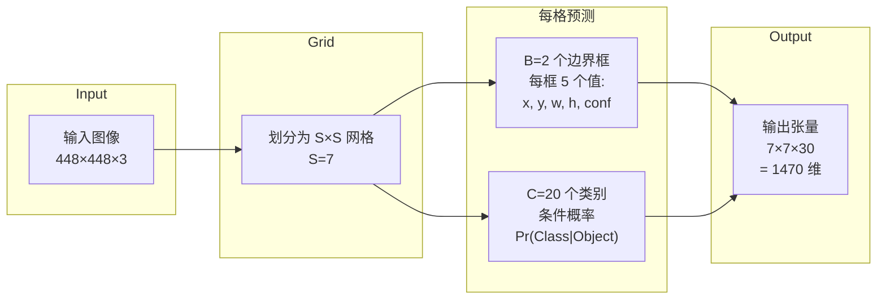

**一个关键细节**：类别概率是**以网格单元为单位**的，不是每个框独立预测类别——同一个格子的两个框共享同一组类别预测。这意味着如果一个格子里恰好有两个不同类别的物体（比如一个人和一辆自行车靠得很近），YOLOv1 就只能检测出一个。这是架构级别的先天局限，也是后续版本要解决的核心问题。

**坐标归一化设计** 保证了网络输出的数值范围永远在 $[0, 1]$ 区间内，这使得训练异常稳定——你不需要像两阶段方法那样额外加一个回归头的 scale 因子。这是一个典型的"用聪明的问题定义减少工程复杂度"案例。

### 1.2 架构详解

**直觉**。YOLOv1 的网络结构受 GoogLeNet（Inception 网络的前身）启发，使用 1x1 卷积做通道降维、3x3 卷积做特征提取的组合——这种设计理念来自 "Network in Network" 论文，用 1x1 卷积在保持空间分辨率的同时减少计算量。

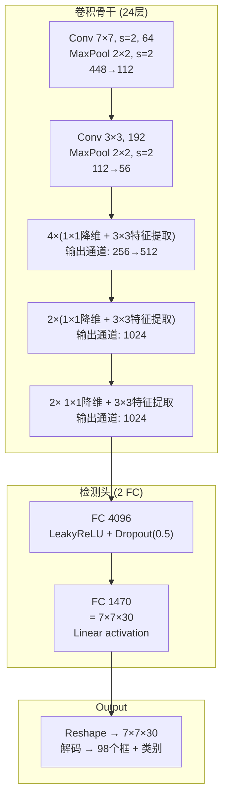

**逐层形状追踪**（从输入到输出）：

```
输入图像:         (B, 3, 448, 448)

Conv 7×7, s=2:    (B, 64, 224, 224)       # stride=2 降采样一半
MaxPool 2×2, s=2: (B, 64, 112, 112)       # 再降一半

Conv 3×3:         (B, 192, 112, 112)      # 保持分辨率，涨通道
MaxPool 2×2, s=2: (B, 192, 56, 56)

4× Inception-like: (B, 512, 28, 28)       # 第二个 block 含 stride=2 降采样
2× Conv block:     (B, 1024, 14, 14)      # 再降一半
2× Conv block:     (B, 1024, 7, 7)        # 最终特征图 7×7

Flatten:           (B, 1024×7×7) = (B, 50176)
FC 4096:           (B, 4096)
FC 1470:           (B, 1470)              # 1470 = 7×7×30
Reshape:           (B, 7, 7, 30)
```

一个容易被忽略的细节：**为什么不直接用全卷积结构（像后续版本那样）？** 因为 YOLOv1 中全连接层承担了"整合全局信息并输出固定格式预测"的角色——$7 \times 7 \times 30$ 的输出本质上要求网络"看到"整张图才能把每个格子的预测映射到正确的全局坐标。后续 YOLOv2 移除 FC 层转而使用全卷积 + anchor 机制，正是因为 anchor 提供了一种不需要 FC 也能做全局坐标映射的方式。

### 1.3 损失函数 —— 最重要的一节

**直觉先行**。想象你在教一个孩子"看到苹果时画一个红框"。你给的每条反馈，其重要性并不相同：(1) 框的位置画对了吗（位置损失）——这很重要；(2) 框的大小合适吗（尺寸损失）——小苹果上偏一厘米比大西瓜偏一厘米要严重得多；(3) 孩子说"这里有物体"是真是假（置信度损失）——大多数格子根本没有苹果，说"没有"太容易了，但也很廉价；(4) 这个物体是苹果还是橘子（分类损失）——只在确实有物体时才需要判断。

YOLOv1 的损失函数正是这样一套"加权评分系统"。以下是完整的数学形式：

> **符号定义**：
> - $S$：网格尺寸（YOLOv1 中 $S=7$），图像被划分为 $S \times S$ 个 grid cell
> - $B$：每个 cell 预测的边界框数量（$B=2$）
> - $C$：类别数（VOC 数据集 $C=20$）
> - $\mathbb{1}_{ij}^{\text{obj}}$：指示函数，第 $i$ 个 cell 的第 $j$ 个框是否"负责"某个 GT（与 GT 的 IoU 最大的框为 1，其余为 0）
> - $\mathbb{1}_{ij}^{\text{noobj}}$：指示函数，该框不负责任何物体（= $1 - \mathbb{1}_{ij}^{\text{obj}}$ 但仅在无物体 cell 中为 1）
> - $\mathbb{1}_{i}^{\text{obj}}$：指示函数，第 $i$ 个 cell 中是否存在物体中心
> - $\lambda_{\text{coord}} = 5$：定位损失权重（优先学习定位能力）
> - $\lambda_{\text{noobj}} = 0.5$：背景置信度损失权重（抑制海量背景主导训练）
> - $(x_i, y_i)$：预测框中心坐标，相对于 grid cell 边界归一化到 $[0, 1]$
> - $(w_i, h_i)$：预测框宽高，相对于整张图归一化到 $[0, 1]$
> - $(\hat{x}_i, \hat{y}_i, \hat{w}_i, \hat{h}_i)$：GT 框的对应值
> - $C_i = \text{Pr}(\text{Object}) \times \text{IoU}_{\text{pred}}^{\text{truth}}$：预测置信度
> - $\hat{C}_i$：GT 置信度（匹配到物体时 = 预测框与 GT 的 IoU，无物体时 = 0）
> - $p_i(c)$：第 $i$ 个 cell 预测为类别 $c$ 的概率

### 先理解三个关键概念

在展示损失函数之前，必须先理解三个概念，否则公式只是一堆符号。

**概念一：谁”负责”谁？—— $\mathbb{1}_{ij}^{\text{obj}}$ 的确定规则**

YOLOv1 将图像划分为 $7 \times 7 = 49$ 个 grid cell，每个 cell 预测 $B=2$ 个边界框，共输出 $49 \times 2 = 98$ 个框。但一张图通常只有几个物体。问题来了：**这 98 个框中，哪些应该去学习检测这些物体？**

规则分两步：

1. **Grid Cell 分配**：GT 框的中心点 $(x_{gt}, y_{gt})$ 落在哪个 cell，那个 cell 就”拥有”这个 GT。

2. **框选择（最关键的规则）**：该 cell 的两个预测框中，**与 GT 的 IoU 更大的那个**获得”负责权”——它的 $\mathbb{1}_{ij}^{\text{obj}} = 1$，另一个框的 $\mathbb{1}_{ij}^{\text{obj}} = 0$（即使另一个框的 IoU 也不低）。

```
具体例子：GT 框中心落在 cell (3,5)，该 cell 的两个预测框：
  框 A：IoU with GT = 0.75  →  𝕀_obj = 1（负责！去学习这个 GT）
  框 B：IoU with GT = 0.40  →  𝕀_obj = 0（不负责，当作背景处理）
```

这意味着：**每个 GT 有且仅有一个框为其”负责”**（98 个预测框中恰好选出 $N_{gt}$ 个正样本）。YOLOv1 的标签分配极其朴素——不像后来的 SimOTA 让每个 GT 匹配多个正样本，它是严格的 1 对 1。

**概念二：$\mathbb{1}_{i}^{\text{obj}}$ vs $\mathbb{1}_{ij}^{\text{obj}}$ —— 两个不同的指示函数**

这是新手最容易混淆的地方：

| 符号 | 粒度 | 含义 | 用于哪些损失项 |
|------|------|------|-------------|
| $\mathbb{1}_{ij}^{\text{obj}}$ | **框级**（cell $i$, 框 $j$） | 该框是否”负责”某个 GT（=IoU 最大者） | 坐标损失、框置信度损失 |
| $\mathbb{1}_{i}^{\text{obj}}$ | **cell 级**（cell $i$） | 该 cell 中是否存在物体中心 | **仅**分类损失 |

$\mathbb{1}_{i}^{\text{obj}}$ 只看 GT 中心是否在 cell $i$ 中——在就是 1，不在就是 0。它不关心框。分类是 cell 级的：我们只需要知道”这个 cell 里有什么类别”，不需要区分”cell 的第 1 个框 vs 第 2 个框各是什么类别”。

**概念三：$C_i$（置信度）的预测值与真值**

$C_i$ 是模型**预测**的置信度分数，$\hat{C}_i$ 是**真值**（ground-truth confidence）。两者的关系决定了置信度损失项的形态：

$$
C_i = \sigma(\text{logit}_i) = \text{Pr}(\text{Object}) \times \text{IoU}_{\text{pred}}^{\text{truth}}
\qquad\text{（模型预测值）}
$$

$$
\hat{C}_i = \begin{cases}
\text{IoU}(\text{pred}_i, \text{GT}) & \text{if } \mathbb{1}_{ij}^{\text{obj}} = 1 \quad\text{（负责该 GT 的框）}\\
0 & \text{if } \mathbb{1}_{ij}^{\text{noobj}} = 1 \quad\text{（背景框）}
\end{cases}
$$

$$
\mathcal{L}_{\text{conf}} = \mathbb{1}_{ij}^{\text{obj}} (C_i - \hat{C}_i)^2 + \lambda_{\text{noobj}} \, \mathbb{1}_{ij}^{\text{noobj}} (C_i - 0)^2
$$

关键细节：**即使对于正样本，$\hat{C}_i$ 也不是 1**。它被设为预测框与 GT 在当前迭代下的实际 IoU 值（例如 0.73）。这意味着模型被训练去**准确估计自己的预测质量**——如果框偏了很多（IoU = 0.5），$\hat{C}_i = 0.5$，模型就学到”我这个框不太行，信心别太高”。

推理时，$C_i$ 直接作为 NMS 排序分数：$C_i \times p_i(\text{class})$。

---

**下面重点来了，训练的LOSS**
$$
\begin{aligned}
\mathcal{L} = &\ \lambda_{\text{coord}} \sum_{i=0}^{S^2} \sum_{j=0}^{B} \mathbb{1}_{ij}^{\text{obj}} \left[(x_i - \hat{x}_i)^2 + (y_i - \hat{y}_i)^2\right] \\[4pt]
&+ \lambda_{\text{coord}} \sum_{i=0}^{S^2} \sum_{j=0}^{B} \mathbb{1}_{ij}^{\text{obj}} \left[(\sqrt{w_i} - \sqrt{\hat{w}_i})^2 + (\sqrt{h_i} - \sqrt{\hat{h}_i})^2\right] \\[4pt]
&+ \sum_{i=0}^{S^2} \sum_{j=0}^{B} \mathbb{1}_{ij}^{\text{obj}} (C_i - \hat{C}_i)^2 \\[4pt]
&+ \lambda_{\text{noobj}} \sum_{i=0}^{S^2} \sum_{j=0}^{B} \mathbb{1}_{ij}^{\text{noobj}} (C_i - \hat{C}_i)^2 \\[4pt]
&+ \sum_{i=0}^{S^2} \mathbb{1}_{i}^{\text{obj}} \sum_{c \in \text{classes}} (p_i(c) - \hat{p}_i(c))^2
\end{aligned}
$$

现在逐项拆解，每一项都是"为什么这样设计"的答案。

**项一：中心点定位损失（Center Localization Loss）**

$$
\lambda_{\text{coord}} \sum_{i=0}^{S^2} \sum_{j=0}^{B} \mathbb{1}_{ij}^{\text{obj}} \left[(x_i - \hat{x}_i)^2 + (y_i - \hat{y}_i)^2\right]
$$

- $\mathbb{1}_{ij}^{\text{obj}}$：已在上一节详述——IoU 最大的框取 1，其余取 0。
- $\lambda_{\text{coord}} = 5$：**坐标损失放大系数**。一张 $7 \times 7$ 的网格通常只有不到 10 个 cell 含有物体。如果不将坐标损失放大 5 倍，模型会优先学习"哪里没有物体"（这很容易，负样本占 90%+），而忽视"物体在哪"（这很难，正样本极少）。
- $x_i - \hat{x}_i$：预测的 $x$ 偏移量（归一化到 $[0,1]$）与真实 $x$ 的差，使用普通 MSE。当预测完全正确时此项为 0；偏移越大，loss 二次增长。

**项二：尺寸损失与 sqrt 技巧（Size Loss with sqrt Trick）**

$$
\lambda_{\text{coord}} \sum_{i=0}^{S^2} \sum_{j=0}^{B} \mathbb{1}_{ij}^{\text{obj}} \left[(\sqrt{w_i} - \sqrt{\hat{w}_i})^2 + (\sqrt{h_i} - \sqrt{\hat{h}_i})^2\right]
$$

这是 YOLOv1 损失函数中最精妙的部分。为什么对 $w$ 和 $h$ 取平方根？

**直觉**：假设两个框，一个 $w=2$（小目标），一个 $w=200$（大目标），预测分别偏了 2 个像素。在绝对尺度上，两者的偏差相同（$\Delta w = 2$），但感知上——小框的 2 像素偏差可能是整个物体的 100%，大框的 2 像素偏差可能不到 1%。MSE 不区分这种差异。取平方根后：

$$
\sqrt{w + \Delta w} - \sqrt{w} \approx \frac{\Delta w}{2\sqrt{w}}
$$

当 $w$ 很小时，$\sqrt{w}$ 也小，梯度 $\frac{1}{2\sqrt{w}}$ 很大——同样 2 像素偏差，loss 对小框的惩罚远大于对大框的惩罚。这种设计让模型"不敢"对小目标粗心大意。

**举例**：
- 小框：$w=4$，$\Delta w = 1$。$(\sqrt{5} - \sqrt{4})^2 \approx (2.24 - 2.00)^2 \approx 0.058$
- 大框：$w=100$，$\Delta w = 1$。$(\sqrt{101} - \sqrt{100})^2 \approx (10.05 - 10.00)^2 \approx 0.0025$

同样是偏 1 像素，小框的 loss 是大框的 **23 倍**。这才是公平的比较。


**项三：含物体框的置信度损失**

$$
\sum_{i=0}^{S^2} \sum_{j=0}^{B} \mathbb{1}_{ij}^{\text{obj}} (C_i - \hat{C}_i)^2
$$

目标置信度真值 $\hat{C}_i = \text{IoU}_{\text{pred}}^{\text{truth}}$——不是简单的 0 或 1，而是预测框和真实框的实际 IoU 值。这意味着训练时置信度不仅是"有/没有物体"的二分类，还是一个**质量评分**：框越准，置信度就应该越高。这里没有 $\lambda_{\text{coord}}$ 因子，因为 confidence 本身就是介于 $[0,1]$ 的值，scale 与坐标不同。

**项四：不含物体框的置信度损失**

$$
\lambda_{\text{noobj}} \sum_{i=0}^{S^2} \sum_{j=0}^{B} \mathbb{1}_{ij}^{\text{noobj}} (C_i - 0)^2
$$

- $\mathbb{1}_{ij}^{\text{noobj}}$：第 $j$ 个框不负责任何 GT 目标。
- $\lambda_{\text{noobj}} = 0.5$：**降低不负责框的置信度损失权重**。为什么？一张 $7 \times 7$ 的图有 $7 \times 7 \times 2 = 98$ 个框，但通常只有不到 5 个框"负责"某个 GT。如果不降权，93 个负样本框的 loss 总和会碾压 5 个正样本框。$\lambda_{\text{noobj}} = 0.5$ 是作者经过大量实验选取的平衡值。

这个设计直指一个更深层的问题——**类别不平衡**。YOLOv1 在面对类别不平衡时用的是"手工加权"的方式，而后续 Focal Loss（见阶段二 2.3）将这一思想做成了一种自动化的、可微分的"软加权"方案。

**项五：分类损失**

$$
\sum_{i=0}^{S^2} \mathbb{1}_{i}^{\text{obj}} \sum_{c \in \text{classes}} (p_i(c) - \hat{p}_i(c))^2
$$

只在有物体的 grid cell 上计算，没有物体则不关心分类。注意这里的 $\mathbb{1}_{i}^{\text{obj}}$ 是**以 cell 为单位**的（不带 $j$ 下标），因为类别概率是 cell 级而非 box 级的。$\hat{p}_i(c)$ 对于 GT 类别为 1，其余为 0（one-hot 编码，或严格来说在 VOC 数据集上是这样）。

---

以下是完整的 PyTorch 实现——不是伪代码，是可直接运行的 `nn.Module` 子类：

```python
import torch
import torch.nn as nn
import torch.nn.functional as F


class YOLOv1Loss(nn.Module):
    """
    YOLOv1 损失函数的完整实现。

    输入:
        preds:   (B, S, S, B*5 + C) = (B, 7, 7, 30)  模型原始输出
        targets:  (B, S, S, B*5 + C) = (B, 7, 7, 30)  编码后的 GT
                  targets[..., 0:5]  = 框1的 (x, y, w, h, conf)
                  targets[..., 5:10] = 框2的 (x, y, w, h, conf)
                  targets[..., 10:]  = 20 类 one-hot

    关键参数:
        lambda_coord: 5.0  — 坐标损失放大系数
        lambda_noobj: 0.5  — 不含物体框的置信度损失抑制系数
    """

    def __init__(self, S=7, B=2, C=20, lambda_coord=5.0, lambda_noobj=0.5):
        super().__init__()
        self.S = S
        self.B = B
        self.C = C
        self.lambda_coord = lambda_coord
        self.lambda_noobj = lambda_noobj

    def forward(self, preds: torch.Tensor, targets: torch.Tensor) -> torch.Tensor:
        # preds, targets shape: (B, S, S, B*5 + C)
        B = preds.shape[0]
        S, B_, C_ = self.S, self.B, self.C

        # ── 拆分预测张量 ──
        # 第一框: (B, S, S, 5), 第二框: (B, S, S, 5), 类别: (B, S, S, C)
        box1 = preds[..., 0:5]       # x, y, w, h, conf
        box2 = preds[..., 5:10]
        pred_classes = preds[..., 10:]  # 类别 logits (论文中直接 MSE, 故不用 softmax)

        # 同样拆分 targets
        tgt_box1 = targets[..., 0:5]
        tgt_box2 = targets[..., 5:10]
        tgt_classes = targets[..., 10:]

        # ── 确定"负责"关系 ──
        # obj_mask[..., j] = 1 当第 j 个框负责某个 GT
        # 训练时由数据预处理填充 targets 的 confidence 通道来标识：
        # GT 框中 assigned 的那个 box 的 confidence 通道 = IoU，另一个 = 0
        obj_mask_box1 = (tgt_box1[..., 4:5] > 0).float()  # (B, S, S, 1)
        obj_mask_box2 = (tgt_box2[..., 4:5] > 0).float()
        # 任何框有物体的 cell
        has_obj = (obj_mask_box1 + obj_mask_box2).clamp(0, 1)  # (B, S, S, 1)

        # ── 1. 中心点定位损失 (x, y) ──
        # 只计算负责框的 x, y
        loss_xy_box1 = F.mse_loss(
            box1[..., 0:2] * obj_mask_box1,   # 不负责的框被 mask 为零
            tgt_box1[..., 0:2] * obj_mask_box1,
            reduction='sum'
        )
        loss_xy_box2 = F.mse_loss(
            box2[..., 0:2] * obj_mask_box2,
            tgt_box2[..., 0:2] * obj_mask_box2,
            reduction='sum'
        )
        loss_xy = loss_xy_box1 + loss_xy_box2

        # ── 2. 尺寸损失 (w, h) — 使用 sqrt 技巧 ──
        # 注意：对 w 和 h 取 sqrt 后再算 MSE
        # 为保证数值稳定性，添加极小 epsilon 防止 sqrt(负数)
        eps = 1e-7
        pred_w_sqrt1 = torch.sqrt(box1[..., 2:3].clamp(min=eps))
        pred_h_sqrt1 = torch.sqrt(box1[..., 3:4].clamp(min=eps))
        tgt_w_sqrt1 = torch.sqrt(tgt_box1[..., 2:3].clamp(min=eps))
        tgt_h_sqrt1 = torch.sqrt(tgt_box1[..., 3:4].clamp(min=eps))

        pred_w_sqrt2 = torch.sqrt(box2[..., 2:3].clamp(min=eps))
        pred_h_sqrt2 = torch.sqrt(box2[..., 3:4].clamp(min=eps))
        tgt_w_sqrt2 = torch.sqrt(tgt_box2[..., 2:3].clamp(min=eps))
        tgt_h_sqrt2 = torch.sqrt(tgt_box2[..., 3:4].clamp(min=eps))

        loss_wh_box1 = F.mse_loss(
            torch.cat([pred_w_sqrt1, pred_h_sqrt1], dim=-1) * obj_mask_box1,
            torch.cat([tgt_w_sqrt1, tgt_h_sqrt1], dim=-1) * obj_mask_box1,
            reduction='sum'
        )
        loss_wh_box2 = F.mse_loss(
            torch.cat([pred_w_sqrt2, pred_h_sqrt2], dim=-1) * obj_mask_box2,
            torch.cat([tgt_w_sqrt2, tgt_h_sqrt2], dim=-1) * obj_mask_box2,
            reduction='sum'
        )
        loss_wh = loss_wh_box1 + loss_wh_box2

        # ── 3. 含物体框的置信度损失 ──
        # 真值是预测框与 GT 的 IoU（由预处理计算好填入 target conf 通道）
        loss_conf_obj1 = F.mse_loss(
            box1[..., 4:5] * obj_mask_box1,
            tgt_box1[..., 4:5] * obj_mask_box1,
            reduction='sum'
        )
        loss_conf_obj2 = F.mse_loss(
            box2[..., 4:5] * obj_mask_box2,
            tgt_box2[..., 4:5] * obj_mask_box2,
            reduction='sum'
        )
        loss_conf_obj = loss_conf_obj1 + loss_conf_obj2

        # ── 4. 不含物体框的置信度损失 ──
        # 真值为 0
        noobj_mask_box1 = (tgt_box1[..., 4:5] == 0).float()
        noobj_mask_box2 = (tgt_box2[..., 4:5] == 0).float()

        loss_conf_noobj1 = F.mse_loss(
            box1[..., 4:5] * noobj_mask_box1,
            torch.zeros_like(box1[..., 4:5]) * noobj_mask_box1,
            reduction='sum'
        )
        loss_conf_noobj2 = F.mse_loss(
            box2[..., 4:5] * noobj_mask_box2,
            torch.zeros_like(box2[..., 4:5]) * noobj_mask_box2,
            reduction='sum'
        )
        loss_conf_noobj = loss_conf_noobj1 + loss_conf_noobj2

        # ── 5. 分类损失 ──
        # 只计算含物体的 cell
        loss_cls = F.mse_loss(
            pred_classes * has_obj,
            tgt_classes * has_obj,
            reduction='sum'
        )

        # ── 组合总损失（注意加权因子） ──
        total_loss = (
            self.lambda_coord * loss_xy
            + self.lambda_coord * loss_wh
            + loss_conf_obj
            + self.lambda_noobj * loss_conf_noobj
            + loss_cls
        )
        # 对 batch size 归一化
        total_loss = total_loss / B

        return total_loss
```

**关于 $\mathbb{1}_{ij}^{\text{obj}}$ 的补充说明**：代码中通过 target 的 confidence 通道来隐式编码"负责"关系——如果预处理阶段将第 $j$ 个框分配给了某个 GT，其 target confidence 设为 GT 与该框预测的 IoU（非零）；否则设为 0。因此 `obj_mask = (target_conf > 0)` 等价于 $\mathbb{1}_{ij}^{\text{obj}}$。这种"自动指标"设计将复杂的多框匹配逻辑从损失函数中剥离到数据预处理阶段，保持了损失函数的简洁性——这一设计哲学贯穿了所有 YOLO 版本。

### 1.4 训练与推理

**训练流程**中有两个重要步骤：

1. **ImageNet 预训练**：前 20 个卷积层 + 1 个全局平均池化 + 1 个 FC 先在 ImageNet-1000 分类任务上预训练（输入 224x224），约一周时间。然后加上随机初始化的 4 个卷积层和 2 个 FC，将分辨率提升到 448x448 做检测微调。原因是检测需要更精细的空间信息——224x224 的画面中行人可能只有几个像素，448x448 中则是十几像素。

2. **超参数**：
   - $\lambda_{\text{coord}} = 5$：因为定位错误比分类错误更致命。一个框类别对了但位置偏了 20 像素 => 这个检测没有实际价值。
   - $\lambda_{\text{noobj}} = 0.5$：前文已述，防止负样本淹没正样本。

**推理流程**：

```
输入图像(448×448) → CNN前向 → 7×7×30张量
  → 对每个 grid cell:
    → 取 B 个框, 每个框的 confidence × 该 cell 的类别概率
      得到 98 个 (x, y, w, h, class_score) 候选
  → 过滤 class_score < threshold 的低质量预测
  → 对每个类别做 NMS (IoU threshold ≈ 0.5) 去除重复检测
  → 输出最终检测结果
```

在推理阶段，框的置信度乘以类别概率得到 class-specific confidence score：

$$
\text{score} = \Pr(\text{Class}_i|\text{Object}) \times \Pr(\text{Object}) \times \text{IoU}_{\text{pred}}^{\text{truth}} \approx \Pr(\text{Class}_i) \times \text{IoU}
$$

解码时，全局坐标由 cell 索引 $(i, j)$ 加偏移量 $(x, y)$ 恢复：

$$
\begin{aligned}
x_{\text{global}} &= (j + x) \times \frac{\text{image\_width}}{S} \\
y_{\text{global}} &= (i + y) \times \frac{\text{image\_height}}{S} \\
w_{\text{global}} &= w \times \text{image\_width} \\
h_{\text{global}} &= h \times \text{image\_height}
\end{aligned}
$$

### 1.5 局限与反思

YOLOv1 的每个局限都成为后续研究的起点：

**局限 1：每个 cell 只能预测一个类别的两个框。** 如果多个小目标（比如一群鸟）的中心落在同一个 cell 内，只能检出最多两个，且必须是同一类别。这是网格粒度与目标密度之间的矛盾。解法：提高 $S$（但会增加计算量）或引入更灵活的标签分配（YOLOX 的 SimOTA 在阶段五解决此问题）。

**局限 2：全连接层强制固定输入尺寸。** 448x448 的输入尺寸是硬编码的。想要更大的输入获得更好的小目标检测？不行——FC 层的参数数量取决于空间维度。解法：SPPNet（见阶段二 2.1）通过空间金字塔池化消除 FC 对输入尺寸的依赖。

**局限 3：定位不够精细。** 直接回归坐标的精度不如 R-CNN 系列的两次回归（RPN + 检测头各做一次精修）。这是"单阶段 vs 两阶段"范式层面的系统性差距。解法：FPN（2.2）提供多尺度特征，IoU 系列损失（YOLOv4 CIoU）提供更精确的框回归监督。

**局限 4：sqrt 技巧只是一个 "补丁"。** 虽然 $\sqrt{w}$ 缓解了大小目标的 loss 不平衡，但它并不是一个从第一性原理推导出来的方案——只是一个经验上有效的技巧。后续的 IoU Loss（G/D/CIoU）从几何不变量角度出发，从根本上解决了尺度敏感问题。

**局限 5：没有显式处理类别不平衡。** 虽然 $\lambda_{\text{noobj}}=0.5$ 缓解了正负样本不平衡，但这只是一个静态的全局系数。真正优雅的解决方案是 Focal Loss（2.3）——通过学习过程中动态调整每个样本的权重。

---

> **本阶段核心收获**
>
> | 概念 | 含义 | 为何重要 |
> |------|------|---------|
> | 单阶段检测 | 一次前向传播同时完成定位+分类 | 速度快 10-100 倍于两阶段 |
> | SxS 网格 | 将空间划分为离散检测区域 | 去除了"区域提议"这一中间步骤 |
> | 网格负责制 | 中心在哪个 cell 就由哪个 cell 检测 | 简单有效的位置分配策略 |
> | sqrt 技巧 | 对小目标赋予更大损失权重 | 大小目标公平评估的关键 |
> | 多任务联合损失 | 一个 loss 驱动定位+置信度+分类 | 端到端训练的数学基础 |
> | $\mathbb{1}_{ij}^{\text{obj}}$ | 框与目标的匹配关系 | 将多框匹配逻辑从 loss 中解耦 |

---

## 阶段二：地基组件 —— 多尺度与类别不平衡

> **核心论文**：SPPNet (2014) -> FPN (2017) -> Focal Loss (2017) -> PANet (2018)
> **你将学到**：YOLO 系列 Neck 设计的完整理论根基——从打破固定输入尺寸的 SPP，到构建多尺度语义金字塔的 FPN，到解决正负样本极端不平衡的 Focal Loss，再到补齐信息流动的 PANet

### 2.1 SPPNet：打破固定输入尺寸的枷锁

**直觉先行**。在 YOLOv1 中，全连接层是一道"窄门"——所有输入必须挤压到 448x448 的固定尺寸。这相当于要求所有照片都必须是同一尺寸的画布。SPPNet 用一个极其优雅的方案拆掉了这扇门：在全连接层之前，插入一个"弹性缓冲层"，无论输入多大，输出总是固定长度。

具体做法：在最后一个卷积层的特征图上，用多个不同粒度的网格做 max pooling：

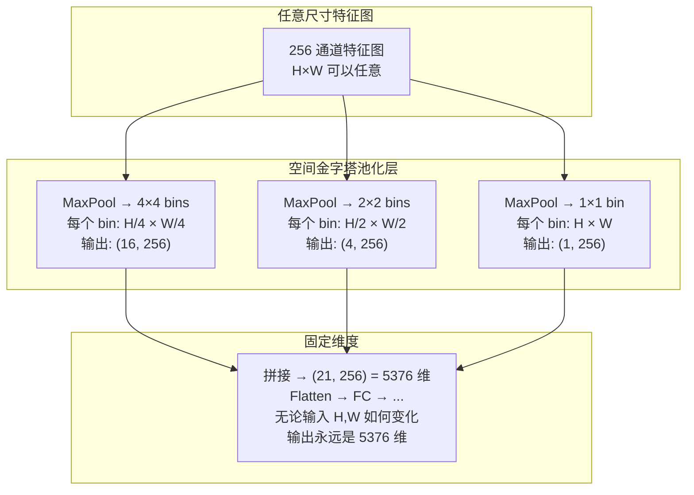

**池化操作的数学定义**：对于输入特征图 $\mathbf{F} \in \mathbb{R}^{H \times W \times C}$，要将其池化为 $n \times n$ 个 bin：

$$
\text{SPP}_{n \times n}(\mathbf{F}) \in \mathbb{R}^{n \times n \times C}
$$

每个 bin $(i,j)$ 的值为：

$$
\text{bin}_{i,j} = \max \left\{ \mathbf{F}\left[ \left\lfloor i \frac{H}{n} \right\rfloor : \left\lfloor (i+1) \frac{H}{n} \right\rfloor,\  \left\lfloor j \frac{W}{n} \right\rfloor : \left\lfloor (j+1) \frac{W}{n} \right\rfloor, : \right] \right\}
$$

关键点在于，bin 的尺寸（pooling kernel 和 stride）**随输入特征图的尺寸自适应变化**，不写死。对于 $4 \times 4$ 的 grid，输入 $8 \times 8$ 时每个 bin 是 $2 \times 2$ 的区域；输入 $20 \times 20$ 时每个 bin 大约是 $5 \times 5$ 的区域。

**输出维度固定性**：

$$
\text{Output Dim} = \underbrace{(4 \times 4 + 2 \times 2 + 1 \times 1)}_{=21 \text{个 bin}} \times \underbrace{C}_{=256} = 5376
$$

这个常数与输入 $H, W$ 完全无关。

**演化：SPP -> SPPF**

YOLOv4 在 neck 中引入了 SPP 模块，但使用了不同的池化核：{5x5, 9x9, 13x13} 并行。YOLOv5 进一步进化为 **SPPF（SPP-Fast）**——将并行的大池化核替换为串行的小池化核：

```
SPP:  输入 → {MaxPool(5×5) 并行, MaxPool(9×9) 并行, MaxPool(13×13) 并行} → Concat → 输出
SPPF: 输入 → MaxPool(5×5) → MaxPool(5×5) → MaxPool(5×5)
             ↓              ↓              ↓
          (直接)      (等价 9×9 感受野)  (等价 13×13 感受野)
             └────────────── Concat ──────────────┘ → 输出
```

为什么等价？

- 一个 5x5 max pool + 再一个 5x5 max pool：第二层的每个元素覆盖了第一层输出的 5x5 区域，后者又覆盖了原始特征图的 5x5 区域 => 总感受野 $5 + 5 - 1 = 9$
- 三个串联：感受野 $5 + 5 + 5 - 2 = 13$

但三个连续的小池化比三个并行的大池化更快，因为：(1) 5x5 池化的计算量远小于 13x13 池化；(2) 串行结构在 GPU 上能被融合优化；(3) 中间结果可以复用。

> **注意**：原始 SPPNet 的核心价值是"任意输入 → 固定输出"以适配全连接层（FC）。YOLOv1 确实有 2 个 FC 层（这也是 v1 必须固定 448×448 输入的原因），但从 **YOLOv2 起，YOLO 彻底移除了 FC 层，转为全卷积架构**——这也是 v2 能做到多尺度训练的前提。SPPF 从 YOLOv5 开始使用，此时 YOLO 早已是全卷积结构，**不需要固定输出尺寸**。YOLO 中的 SPP/SPPF 的作用变成了"保持空间尺寸不变、在通道维度融合多感受野特征"——与原始 SPPNet 的目标完全不同。

**SPP 在 YOLO 各版本中的使用情况：**

| 版本 | SPP？ | 说明 |
|------|-------|------|
| YOLOv1-v3 | 无 | v1 用 FC 层直接回归，v2 用 passthrough layer，v3 引入类 FPN 三尺度预测 |
| **YOLOv4** | **SPP** | 首次在 neck 中插入 SPP（{5×5, 9×9, 13×13} 并行 maxpool） |
| YOLOv5—v12, YOLO26 | **SPPF** | 三个 5×5 串联替代并行大池化，从 v5 至今一直是 neck 标配 |

以下是 SPPF 的 PyTorch 实现：

```python
import torch
import torch.nn as nn


class SPPF(nn.Module):
    """
    SPP-Fast: 用三个串行 5×5 max pool 替代并行的 {5,9,13} max pool。

    输入:  (B, C, H, W)    — 任意 H, W 均可（全卷积结构，无 FC 约束）
    输出:  (B, C, H, W)    — H, W 保持不变（padding=pool//2 且 stride=1）

    与原始 SPP 的区别：
    - SPP（2014）：任意H,W → 固定长度向量（为适配 FC 层）
    - SPPF（YOLOv5+）：任意H,W → 同H,W（为融合多感受野特征）
      因为 YOLOv5+ 早已是全卷积结构，不需要固定输出尺寸。SPPF 仅继承 SPP 的
      "多尺度池化"思想，目标从"适配 FC"变成了"增大感受野"。
    """
    def __init__(self, in_channels: int, pool_size: int = 5):
        super().__init__()
        # 输入先过一层 1x1 卷积压缩通道（YOLOv5 中的标准做法，降低计算量）
        self.cv1 = nn.Conv2d(in_channels, in_channels // 2, kernel_size=1, stride=1)
        self.cv2 = nn.Conv2d(in_channels * 2, in_channels, kernel_size=1, stride=1)
        # padding = pool_size // 2 保证池化后空间尺寸不变
        self.m = nn.MaxPool2d(kernel_size=pool_size, stride=1,
                              padding=pool_size // 2)

    def forward(self, x: torch.Tensor) -> torch.Tensor:
        # x: (B, C, H, W)
        x = self.cv1(x)                              # -> (B, C//2, H, W)

        y1 = self.m(x)                               # (B, C//2, H, W) 感受野=5
        y2 = self.m(y1)                              # (B, C//2, H, W) 感受野=9
        y3 = self.m(y2)                              # (B, C//2, H, W) 感受野=13

        # 拼接四个尺度：原始 + 三种感受野
        out = torch.cat([x, y1, y2, y3], dim=1)      # (B, 2*C, H, W)

        out = self.cv2(out)                           # (B, C, H, W) 融合后恢复通道数
        return out
```

**SPPF 在 YOLO 中的角色**：它被放置在 neck 的末端（PANet 之后、检测头之前），作用是"最后一公里"的多尺度感受野增强。经过 FPN+PAN 双向特征融合后，每个尺度的特征再通过 SPPF 获得更全局的上下文视野——这是一种非常经济的"感知范围扩展"策略。

### 2.2 FPN：Feature Pyramid Network——让每一层都拥有强语义

**多尺度检测的根本困境**。在 FPN（Feature Pyramid Networks, Lin et al., CVPR 2017）出现之前，目标检测中的多尺度问题有三种解决方案，各有致命缺陷：

| 方案 | 做法 | 致命缺陷 |
|------|------|---------|
| 图像金字塔 | 同一张图缩放到多个分辨率，分别输入网络 | 计算量 ×N（每张图跑一次完整前向传播），训练不可行 |
| 单一尺度特征图 | 只用 backbone 的最后一层（如 stride=32）做预测 | 对小目标极不友好——32× 降采样后小目标只剩 1-2 像素 |
| 金字塔特征层级 | 不同层特征直接做预测（浅层→小目标，深层→大目标） | 浅层语义弱，连"这里有没有物体"都判断不好 |

第三种方案的典型代表是 **SSD**（Single Shot MultiBox Detector, Liu et al., ECCV 2016）。它直接在各层特征图上独立做检测，但效果不理想——深层 stride=32 的特征图有强语义（"这是猫"）却无空间细节（"猫的耳朵在哪"），浅层 stride=4 的特征图有空间细节却无语义（分不清猫和相似的纹理背景）。这就是 **"语义-分辨率矛盾"**：深层语义强分辨率低，浅层分辨率高语义弱。解决这个矛盾，就是 FPN 的核心使命。

**FPN 的解决方案**：构建一条**自顶向下的"语义高速公路"**，将深层的强语义逐层传递给浅层。

在介绍具体的架构之前，先理解 backbone 中特征图的层次命名：

- 现代 CNN backbone（如 ResNet）通常分为 5 个 stage，每个 stage 将空间分辨率降低一半，通道数翻倍
- **C1, C2, C3, C4, C5** 分别表示 stage 1-5 的最后一层输出（C = "Conv stage"）
- $C_i$ 的 stride = $2^i$（即 $C_2$ 是 4× 降采样，$C_5$ 是 32× 降采样）
- C1（stride=2）分辨率太大、语义太浅，FPN 不使用。只使用 **C2—C5** 四个层级
- 每个 $C_i$ 的形状为 $(B, C_i\text{\_channels}, H/2^i, W/2^i)$

FPN 在 C2-C5 之上构建一个新的特征金字塔 **P2-P5**，所有 $P_i$ 的输出通道统一为 256：

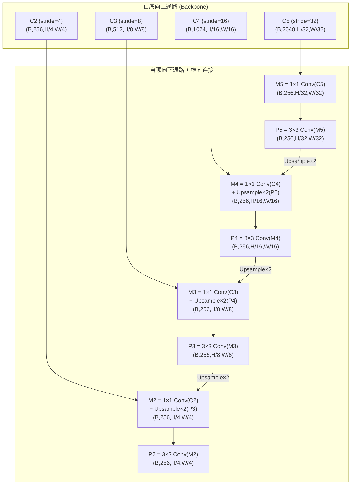

**三个核心操作的数学定义：**

**(1) 横向连接 (Lateral Connection)** — 将 backbone 特征通道统一到 $d$（通常 $d=256$）：

$$
\mathbf{M}_i = \text{Conv}_{1 \times 1}^{(d)}(\mathbf{C}_i), \quad \mathbf{M}_i \in \mathbb{R}^{H_i \times W_i \times d}
$$

$1 \times 1$ 卷积的作用是**逐点线性变换**，不改变空间分辨率，仅改变通道数。这一步将所有层统一到相同的 $d$ 维空间，使它们可以在语义上"对齐"后进行相加。

**(2) 自顶向下上采样** — 将深层特征的空间分辨率放大到与浅层一致：

$$
\mathbf{P}_i^{\text{up}} = \text{Upsample}_{2 \times}(\mathbf{P}_{i+1}), \quad \mathbf{P}_i^{\text{up}} \in \mathbb{R}^{2H_{i+1} \times 2W_{i+1} \times d}
$$

上采样操作有多种数学实现，FPN 选择了**最近邻上采样**。先了解各方法：

**最近邻插值**：目标位置 $(i', j')$ 映射回源图 $(i/2, j/2)$，取最近像素值。公式极简：

$$
\text{output}[i, j] = \text{input}\left[\lfloor i/2 \rfloor, \lfloor j/2 \rfloor\right]
$$

**双线性插值**（在语义分割中更常用）：对目标位置映射回源图的浮点坐标 $(x, y)$，取其周围 4 个像素的加权和：

$$
f(x, y) = \begin{bmatrix} 1 - \Delta x & \Delta x \end{bmatrix}
\begin{bmatrix} f(x_{\text{floor}}, y_{\text{floor}}) & f(x_{\text{floor}}, y_{\text{ceil}}) \\ f(x_{\text{ceil}}, y_{\text{floor}}) & f(x_{\text{ceil}}, y_{\text{ceil}}) \end{bmatrix}
\begin{bmatrix} 1 - \Delta y \\ \Delta y \end{bmatrix}
$$

其中 $\Delta x = x - \lfloor x \rfloor$，$\Delta y = y - \lfloor y \rfloor$。先在 x 方向插值两次，再在 y 方向插值一次。

**FPN 为什么选最近邻而非双线性？** (1) 最近邻不引入可学习参数，速度极快；(2) 上采样的目的只是"对齐空间尺寸"——真正的特征融合由后续的横向连接 + 3×3 卷积完成，不需要上采样本身做平滑。双线性插值虽然更平滑，但在 FPN 的场景下这个平滑是多余的——甚至可能是有害的（模糊了深层特征中的精确激活位置）。

**(3) 逐元素相加与后处理** — 融合并消除混叠伪影：

$$
\mathbf{P}_i = \text{Conv}_{3 \times 3}^{(d)}\left(\mathbf{M}_i + \mathbf{P}_i^{\text{up}}\right), \quad \mathbf{P}_i \in \mathbb{R}^{H_i \times W_i \times d}
$$

$3 \times 3$ 卷积的"去混叠"功能：上采样操作会产生 checkerboard 效应（棋盘格状的不连续），$3 \times 3$ 卷积通过局部平滑消除这种混叠。

**FPN 最关键的架构决策：所有金字塔层共享检测头。** 这意味着 P2-P5 的输出都输入到**同一个**分类器和回归器。这迫使所有金字塔层学习语义一致的特征——如果 P2 的特征表达与 P5 的语义本质不同，共享头就无法同时处理两者。这是一种隐式的正则化。

> **共享检测头的技术基础：为什么不同尺寸的特征图能共用同一个检测头？**
>
> 这需要两层理解。第一层看 YOLO 的检测范式，第二层看卷积的运算特性。
>
> **第一层：YOLO 的检测范式——每个 grid point 就是一个独立检测单元。**
>
> YOLO 将检测定义为"在每个空间位置上独立回答三个问题：这里有没有物体？是什么？框多大？"。特征图上的 $H \times W$ 个 spatial position 就是 $H \times W$ 个独立的"检测员"，每个只负责自己脚下的那一个位置，互不依赖。
>
> $$
> \text{特征图 } (C, H, W) = \text{ 共 } H\!\times\!W \text{ 个 grid point，每个 point 有 } C \text{ 维特征}
> $$
>
> 无论 P2 有 $200 \times 200 = 40000$ 个检测员还是 P5 有 $13 \times 13 = 169$ 个检测员，**每个检测员干的活是完全一样的**：从 256 维特征 → 输出"类别分 + 框坐标"。任务相同，用同一个"检测逻辑"完全合理。
>
> **第二层：$1\times1$ 卷积天然逐位置运算。**
>
> $\text{Conv}_{1\times1}: \mathbb{R}^{256} \to \mathbb{R}^{C}$（例如 256 → 80 类别）做的事就是：对特征图上的**每一个** spatial position，取出它的 256 维向量，做一次 $256 \times C$ 的矩阵乘法，输出 C 维结果。卷积核在整个特征图上滑动，每个位置套用完全相同的参数——不关心总共有多少个位置。
>
> $$
> P_2 \in \mathbb{R}^{H/4 \times W/4 \times 256} \xrightarrow{\text{same } \text{Conv}_{1\times1}} \mathbb{R}^{H/4 \times W/4 \times C}
> $$
> $$
> P_5 \in \mathbb{R}^{H/32 \times W/32 \times 256} \xrightarrow{\text{same } \text{Conv}_{1\times1}} \mathbb{R}^{H/32 \times W/32 \times C}
> $$
>
> 两层合起来：YOLO 的"per-grid-point 独立预测"范式 ≈ 将特征图的空间分辨率直接当作分块（每个点一个块），$1\times1$ Conv 恰好是逐位置互不干扰的算子——两者天然契合。反观全连接层，它要求"所有位置展平成一个固定长度的向量 → 固定尺寸的权重矩阵"。

正是这个设计让 FPN 彻底解决了"金字塔特征层级"的困境：SSD 之所以在浅层检测小目标失败，正是因为各层各自使用独立的检测头（不共享权重），导致浅层头的语义训练严重不足。FPN 通过自顶向下注入语义 + 共享检测头，让所有层都获得了受益于整个金字塔监督信号的能力——这是 FPN 相比 SSD 最根本的收益。这也是为什么 YOLOv3 引入 FPN 后小目标 AP 直接跃升——浅层终于"知道自己在看什么了"。

以下是 FPN 的 PyTorch 实现：

```python
import torch
import torch.nn as nn
import torch.nn.functional as F


class FPN(nn.Module):
    """
    特征金字塔网络 (Feature Pyramid Network)

    Backbone 输出特征: C2, C3, C4, C5 (stride=4, 8, 16, 32)
    FPN 输出:          P2, P3, P4, P5 (stride=4, 8, 16, 32, 通道=256)
    """
    def __init__(self, backbone_channels: list, fpn_channels: int = 256):
        """
        Args:
            backbone_channels: 各 stage 的输出通道数, 如 [256, 512, 1024, 2048]
            fpn_channels: FPN 统一后的通道数, 默认 256
        """
        super().__init__()
        # 横向连接: 1x1 卷积将 backbone 各层通道统一到 fpn_channels
        self.lateral_convs = nn.ModuleList([
            nn.Conv2d(in_ch, fpn_channels, kernel_size=1)
            for in_ch in backbone_channels
        ])

        # 去混叠: 3x3 卷积在每次融合后平滑输出
        self.smooth_convs = nn.ModuleList([
            nn.Conv2d(fpn_channels, fpn_channels, kernel_size=3, padding=1)
            for _ in backbone_channels
        ])

    def forward(self, features: list) -> list:
        """
        Args:
            features: [C2, C3, C4, C5]
              形状: [(B,256,H/4,W/4), (B,512,H/8,W/8),
                     (B,1024,H/16,W/16), (B,2048,H/32,W/32)]

        Returns:
            [P2, P3, P4, P5], 全部为 (B, 256, H/s, W/s) 对应 stride={4,8,16,32}
        """
        # 自顶向下从最后一个 level 开始
        # 第一步: 最深层 C5 => 直接 lateral conv
        prev = self.lateral_convs[-1](features[-1])  # (B, 256, H/32, W/32)
        p5 = self.smooth_convs[-1](prev)              # (B, 256, H/32, W/32)
        outputs = [p5]

        # 自顶向下逐层融合
        for i in range(len(features) - 2, -1, -1):
            lateral = self.lateral_convs[i](features[i])  # (B, 256, H/s, W/s)

            # 上采样上一层 (×2) 与当前层对齐
            # 使用最近邻上采样（对齐空间即可，不引入额外参数）
            upsampled = F.interpolate(
                prev, size=lateral.shape[2:], mode='nearest'
            )  # (B, 256, H/s, W/s)

            # 逐元素相加: 深层语义 + 浅层位置信息
            merged = lateral + upsampled           # (B, 256, H/s, W/s)

            # 3x3 卷积去除上采样混叠
            prev = self.smooth_convs[i](merged)     # (B, 256, H/s, W/s)

            outputs.insert(0, prev)

        return outputs  # [P2, P3, P4, P5]
```

**形状追踪完整示例**（以 ResNet-50 为 backbone，输入 800x1024）：

```
C5 (B, 2048, 25, 32)  → 1×1↓→256 → M5 (B, 256, 25, 32)  → 3×3→ P5 (B, 256, 25, 32)
                            ↓ Upsample×2
C4 (B, 1024, 50, 64)  → 1×1↓→256 → + → M4 (B, 256, 50, 64)  → 3×3→ P4 (B, 256, 50, 64)
                            ↓ Upsample×2
C3 (B, 512, 100, 128)  → 1×1↓→256 → + → M3 (B, 256, 100, 128) → 3×3→ P3 (B, 256, 100, 128)
                            ↓ Upsample×2
C2 (B, 256, 200, 256)  → 1×1↓→256 → + → M2 (B, 256, 200, 256) → 3×3→ P2 (B, 256, 200, 256)
```

FPN 对 YOLO 的意义是根本性的。YOLOv1/v2 只在一个尺度上做检测，小目标几乎不可见。YOLOv3 首次引入类 FPN 的三尺度预测（stride=8/16/32），**这是 v3 相比 v2 最关键的精度提升来源**。从 v3 起，多尺度预测成为 YOLO 的基因。

### 2.3 Focal Loss：类别不平衡的终极武器

单阶段检测器在特征图上的每个位置都评估候选框，一张图约 $10^4$–$10^5$ 个候选，但其中 >99% 是极易分类的背景。每个背景样本的 loss 虽然很小，但 $10^5 \times 0.01$ 的总和淹没了极少数前景（每个可能 loss = 4.6）。这就是两阶段检测器（RPN 过滤了大部分背景）长期优于单阶段检测器的根本原因。

#### 从 YOLOv1 的 SSE 到交叉熵

回顾阶段一，YOLOv1 的损失函数**全部使用平方和误差（SSE）**——不仅是坐标回归，**类别概率 $p_i(c)$ 和置信度 $C_i$ 也都用 SSE**：

$$\mathcal{L}_{\text{cls}}^{\text{v1}} = \sum_{i=0}^{S^2} \mathbb{1}_i^{\text{obj}} \sum_{c \in \text{classes}} (p_i(c) - \hat{p}_i(c))^2$$

SSE 用于分类有两个问题：(1) 梯度与误差线性相关，当预测接近正确时梯度仍然不小，收敛慢；(2) 对概率值的约束弱，输出可能超出 $[0,1]$。因此从 **YOLOv2 起，YOLO 将分类损失从 SSE 切换为交叉熵（Cross-Entropy, CE）**——这也是几乎所有现代分类器的标准选择。

#### 标准交叉熵及其致命缺陷

二分类交叉熵的标准写法：

$$\text{CE}(p, y) = \begin{cases} -\log(p) & \text{if } y=1 \\ -\log(1-p) & \text{if } y=0 \end{cases}$$

定义 $p_t = p$ if $y=1$ else $1-p$，可统一写为 $\text{CE}(p_t) = -\log(p_t)$。

**问题**：CE 对所有样本同等对待。当一张图中 $10^5$ 个背景的 $p_t \approx 0.99$（极确信）和 3 个前景的 $p_t \approx 0.01$（极错误）共存时，$10^5 \times (-\log 0.99) \gg 3 \times (-\log 0.01)$。梯度被易分背景主导。

#### Focal Loss 的完整形式

Focal Loss 在 CE 上叠加两个因子，分别解决两个维度的问题：

$$\boxed{\text{FL}(p_t) = -\alpha_t \cdot (1 - p_t)^\gamma \cdot \log(p_t)}$$

**因子一：$(1-p_t)^\gamma$——按样本难度降权（核心创新）。**

| $p_t$ | 含义 | $(1-p_t)^\gamma$ ($\gamma=2$) | 效果 |
|-------|------|-------------------------------|------|
| 0.99 | 极易分 | 0.0001 | loss × 1/10000，几乎忽略 |
| 0.9 | 易分 | 0.01 | loss × 1/100，大幅压制 |
| 0.5 | 中等 | 0.25 | loss × 1/4，部分保留 |
| 0.1 | 难分 | 0.81 | loss × 0.81，基本保留 |
| 0.01 | 极难分 | 0.98 | loss × 0.98，几乎不变 |

这是一个**连续、可微分**的软压制机制。没有硬阈值——所有样本都参与训练，但易分样本的梯度被自动静音。核心洞察：Focal Loss **降低已正确分类样本的 loss**，而非放大难样本（避免噪声也被放大）。

**因子二：$\alpha_t$——按类别平衡权重（标准工具）。**

$$\alpha_t = \begin{cases} \alpha & \text{if } y=1 \\ 1-\alpha & \text{if } y=0 \end{cases}$$

$\alpha_t$ 处理正负样本数量悬殊的问题，论文通过网格搜索确定 $\alpha=0.25$ 与 $\gamma=2$ 配合时最优。注意 $\alpha=0.25$ 意味着正样本权重（0.25）小于负样本（0.75）——这与逆频率直觉（正样本稀少应加大权重）相反。论文的解释是：$(1-p_t)^\gamma$ 已将绝大多数易分负样本压到接近零，真正在 loss 中起作用的负样本是少数难例，其数量和正样本可比。因此 $\alpha$ 不需要大幅偏向正样本。

$\gamma$ 和 $\alpha$ 的分工：$\gamma$ 处理”同一类内，易 vs 难”；$\alpha$ 处理”不同类间，正 vs 负”。

PyTorch 实现：

```python
import torch
import torch.nn as nn
import torch.nn.functional as F


class FocalLoss(nn.Module):
    """
    Focal Loss for binary/multi-class classification.

    FL(p_t) = -α_t · (1 - p_t)^γ · log(p_t)

    Args:
        alpha: 正样本权重, 默认 0.25 (RetinaNet 是最佳值)
        gamma: 焦点参数, 默认 2.0 (越大, 易分样本压制越强)
        reduction: 'mean' | 'sum' | 'none'

    输入:
        inputs:  (N, C) 模型 logits (未经过 sigmoid/softmax)
        targets: (N, C) one-hot 标签, 或 (N,) class indices

    输出:
        loss: scalar or (N,) depending on reduction
    """
    def __init__(self, alpha: float = 0.25, gamma: float = 2.0,
                 reduction: str = 'mean'):
        super().__init__()
        self.alpha = alpha
        self.gamma = gamma
        self.reduction = reduction

    def forward(self, inputs: torch.Tensor,
                targets: torch.Tensor) -> torch.Tensor:
        # ── 计算 p_t ──
        # 对于多分类任务, 使用 sigmoid (binary) 而非 softmax
        # YOLO 系列使用多个独立的二分类器而非一个多分类器
        p = inputs.sigmoid()                    # (N, C), 每个值 ∈ [0, 1]

        # p_t: 对真实类别的预测概率
        # 对正类 (target=1): p_t = p
        # 对负类 (target=0): p_t = 1-p
        p_t = p * targets + (1 - p) * (1 - targets)  # (N, C)

        # ── 计算 alpha_t ──
        # 对正类: alpha_t = alpha
        # 对负类: alpha_t = 1-alpha
        alpha_t = self.alpha * targets + (1 - self.alpha) * (1 - targets)

        # ── 计算 Focal Loss ──
        # (1 - p_t)^gamma: 自适应降权因子
        focal_weight = (1 - p_t).pow(self.gamma)

        # BCE: -log(p_t) 直接用 F.binary_cross_entropy_with_logits
        # 等价于 -(targets * log(p) + (1-targets) * log(1-p))
        bce_loss = F.binary_cross_entropy_with_logits(
            inputs, targets, reduction='none'
        )  # (N, C)

        # 最终 loss
        loss = alpha_t * focal_weight * bce_loss  # (N, C)

        if self.reduction == 'mean':
            return loss.mean()
        elif self.reduction == 'sum':
            return loss.sum()
        return loss
```

**Focal Loss 与 YOLO 家族的演进关系**（连接思想，一通百通）：

- **YOLOv1-v3** 使用普通 BCE/SSE，没有显式处理类别不平衡
- **YOLOv4-v5** 间接吸收了难样本挖掘思想，但分类损失仍是普通 BCE
- **YOLOv6** 引入**Varifocal Loss (VFL)**：$VFL(p,q) = -q(q\log(p) + (1-q)\log(1-p))$，其中 $q$ 是软标签（IoU-aware），将框质量纳入分类监督——直接从 Focal Loss 演化而来
- **YOLOv8+** 引入**Distribution Focal Loss (DFL)**：将框回归从"预测狄拉克分布的峰值"变为"预测一个离散概率分布"，DFL 聚焦于"真值附近的概率密度是否集中"——焦点思想被推广到回归任务
- **YOLOX** 的 **SimOTA 动态标签分配**：基于 loss 动态选择正样本——本质上是将 Focal Loss 的"按难度加权"思想应用于标签分配准则

Focal Loss 的意义远超分类损失本身。它的"焦点化（focusing）"思想——**动态地、按样本难度差异化地分配权重**——是 YOLO 从"手工规则"走向"自适应训练"的关键转折点。

### 2.4 PANet：Path Aggregation Network——补全信息流动的最后一公里

**直觉先行**。FPN 解决了"深层语义如何送达浅层"的问题，但这是一条**单向**的信息通路。浅层特征中蕴含的精确空间信息（边缘、角点、精细纹理）仍然难以到达深层——从 P2 到 P5 需要经过 backbone 的几十层卷积，信息严重衰减。

打个比方：FPN 是城市的高速路——你可以从郊区（深层）快速开车到市中心（浅层）。但反向从市中心到郊区呢？你需要走几十公里的小路（backbone 的层层卷积），信号衰减得一塌糊涂。PANet 就是再修一条从市中心直达郊区的高架路。

PANet 的双向特征金字塔，用一张图说清楚：

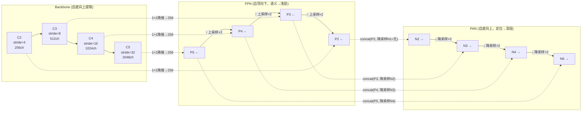

图中三条水平线就是完整的双向特征金字塔：**Backbone 提取 → FPN 自顶向下传语义 → PAN 自底向上传定位**。N2-N5 五个输出都有，其中 $N_2 = P_2$（等于自身，无下采样输入），$N_i = \text{Conv}_{3\times3}(\text{Concat}[P_i, \text{Downsample}(N_{i-1})])$ for $i = 3,4,5$。

YOLO 使用时的关键差异：原文用逐元素加法（addition），**YOLO 用通道拼接（concatenation）**——因为拼接保留了更丰富的特征多样性，虽然通道数加倍但后续 1×1 卷积会压缩回去。

**PANet 的数学定义**：

$$
\mathbf{N}_{i+1} = \text{Conv}_{3 \times 3}^{(C)}\left( \text{Concat}\left[ \underbrace{\text{Conv}_{3 \times 3, s=2}^{(C/2)}(\mathbf{N}_i)}_{\text{降采样的下层特征}},\ \underbrace{\mathbf{P}_{i+1}}_{\text{同层 FPN 特征}} \right] \right)
$$

其中 $\mathbf{N}_2 = \mathbf{P}_2$。每一层的 PAN 输出都同时接收了两个来源：
- **下方传来的空间信息**：$\mathbf{N}_i$ 经过 stride=2 的 $3 \times 3$ 卷积降采样
- **同层 FPN 的语义信息**：$\mathbf{P}_{i+1}$ 已经在 FPN 中获得了丰富的语义

**YOLO 的改造：Concat 替代 Addition**

原始 PANet 论文中，FPN 的横向连接和 PANet 的融合都使用逐元素相加（element-wise addition）。但 YOLOv4 及后续版本全部改用通道拼接（concatenation）后跟 $1 \times 1$ 卷积过渡。

为什么？Addition 假设两路特征在**语义上完全对齐**——你把"位置特征"和"语义特征"逐元素相加，意味着对应通道的对应位置有完全相同的含义。Concat 更宽松——它把两路特征拼在一起，让后续的 $1 \times 1$ 卷积学习如何**自适应性融合**，不强制要求特征对齐。

这一点从 YOLOv4 的消融实验中可以看到：Concat 版本在相同 FLOPs 下比 Addition 版本精度高约 0.3-0.5 AP。

**信息传播距离的量化分析：**

在没有 PANet 的情况下，浅层 P2 的空间信息要传递到深层 P5 需要经过：
- P2 -> C3（经过 backbone 的多个卷积层）-> C4 -> C5 -> P5
- 大约 30-40 层卷积，信息经过反复非线性变换，空间细节大量丢失

有 PANet 的情况下：
- N2 (=P2) -> stride=2 conv -> N3 -> stride=2 conv -> N4 -> stride=2 conv -> N5
- 仅 3 步，每步是一个 $3 \times 3$ 的带步长卷积 + 拼接融合
- 从约 40 层缩短到 3 层——这就是为什么 PANet 能有效保留定位信息


**FPN + PANet 的完整形状追踪：**

```
输入图像:         (B, 3, 640, 640)

Backbone 各级输出:
  C2:             (B, 256, 160, 160)  stride=4
  C3:             (B, 512, 80, 80)    stride=8
  C4:             (B, 1024, 40, 40)   stride=16
  C5:             (B, 2048, 20, 20)   stride=32

FPN (自顶向下):
  P5:             (B, 256, 20, 20)
  P4:             (B, 256, 40, 40)
  P3:             (B, 256, 80, 80)
  P2:             (B, 256, 160, 160)

PANet (自底向上):
  N2 = P2:        (B, 256, 160, 160)   # 解码为 stride=4 的预测
  N3:             (B, 256, 80, 80)     # 解码为 stride=8 的预测
  N4:             (B, 256, 40, 40)     # 解码为 stride=16 的预测
  N5:             (B, 256, 20, 20)     # 解码为 stride=32 的预测
```

**FPN+PAN 双向金字塔**构成了从 YOLOv4 至今所有现代 YOLO 的 neck 设计标准。SPPF 放在这个 neck 的出口处（检测头之前），为每个尺度的特征进一步增大感受野。这三个组件（SPPF + FPN + PAN）的关系是：**SPPF 负责感知范围扩展，FPN 负责语义传递，PAN 负责定位信息传递**——三者各司其职，组合成现代 YOLO 检测器的通用 Neck 架构。

---

> **本阶段核心收获**
>
> | 组件 | 解决的问题 | 核心技术 | 在 YOLO 中的位置 |
> |------|-----------|---------|----------------|
> | SPP/SPPF | 固定输入尺寸 + 感受野不足 | 空间金字塔池化 → SPPF 串行优化 | Neck 末端 |
> | FPN | 多层特征语义强度不一致 | 自顶向下 + 横向连接 + 共享检测头 | Neck 上半部 |
> | Focal Loss | 正负样本极端不平衡 | $(1-p_t)^\gamma$ 自适应降权 | 分类损失函数 |
> | PANet | 浅层定位信息难达深层 | 自底向上短路径 + Concat 融合 | Neck 下半部 |

---

## 阶段三：现代化骨干设计 —— 效率与梯度流的博弈

> **核心论文**：CSPNet (2019) -> RepVGG (2021)
> **你将学到**：深层网络如何在不增加计算量的前提下提升梯度质量，以及训练和推理如何分别使用最优结构并在数学上等价转换

### 3.1 CSPNet：一分为二的智慧

**直觉先行**。深层 CNN 有一个反直觉的现象：当你检查不同通道的特征图时，会发现很多通道在学几乎相同的东西——或者说，它们的**梯度高度相关**。这在数学上被称为"梯度信息重复（Duplicated Gradient Information）"。既然很多通道在被"重复训练"，为什么不干脆只训练一半，让另一半保留原样？

CSPNet（Cross Stage Partial Network）的核心思想简单到令人惊讶：**把输入特征在通道维度上一分为二，一半正常经过卷积块处理，另一半直接绕过，最后再拼回来**。

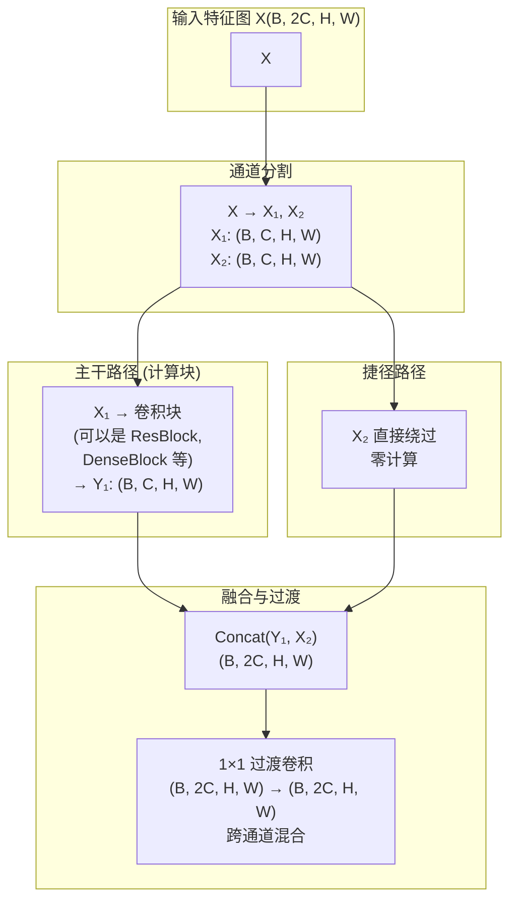

**为什么这样设计有效？三重收益分析：**

**(1) 计算量减半。** 只有一半的通道（$X_1$）经过计算密集的卷积块，另一半（$X_2$）零计算。对于 ResNet 的 bottleneck block（1x1->3x3->1x1），这意味约 50% 的 FLOPs 降低。

**(2) 梯度重复减少。** 在标准 ResNet 中，梯度通过 shortcut 和 main path 两条路径回传，两条路径经过类似的卷积操作，容易产生相似的梯度模式。CSPNet 的 bypass path 完全不经过任何卷积——梯度直接原样回传，与 main path 经过多层卷积的梯度截然不同。这就像两个人的观察角度从同一位置变成了两个不同位置，视角更丰富。

**(3) 梯度组合多样性增加。** 拼接后的特征 $[Y_1 \parallel X_2]$ 包含两种梯度模式：$Y_1$ 的"精加工"特征梯度 + $X_2$ 的"原始"特征梯度。这种差异性组合对后续层的特征学习是一个更丰富的输入。

**Partial Ratio 的灵活性：**

CSP 的通道分割比例（partial ratio）是一个可调节的超参数。原始论文中设为 0.5（1:1 分割），但在实际工程中可以动态调整：

- ratio = 0.25：25% 通道走计算块，75% 绕过 -> 更快的推理速度
- ratio = 0.5：平衡
- ratio = 0.75：更多通道被处理 -> 更高精度

这为模型缩放提供了除深度和宽度之外的**第三个自由度**。

PyTorch 实现：

```python
import torch
import torch.nn as nn


class CSPBlock(nn.Module):
    """
    跨阶段局部块 (Cross Stage Partial Block)

    输入在通道维度一分为二:
      - 一半经过 bottleneck blocks 处理
      - 一半直接绕过
      - 拼接后经 1×1 过渡卷积

    对应 YOLOv5/YOLOv8 中的 C3/C2f 模块的核心设计模式。
    """
    def __init__(self, in_channels: int, out_channels: int,
                 num_bottlenecks: int = 1, partial_ratio: float = 0.5,
                 expansion: float = 0.5):
        """
        Args:
            in_channels: 输入通道数
            out_channels: 输出通道数
            num_bottlenecks: 主干路径中 bottleneck 的数量
            partial_ratio: 通道分割比例 (0.0-1.0)
            expansion: bottleneck 内部的通道扩展比
        """
        super().__init__()
        self.partial_ratio = partial_ratio

        # 通道分割: 主干部分和捷径部分的通道数
        hidden_channels = int(out_channels * partial_ratio)

        # 输入投影: 1×1 卷积将输入映射到 out_channels
        self.cv1 = nn.Conv2d(in_channels, hidden_channels * 2, kernel_size=1)

        # 主干路径: num_bottlenecks 个 bottleneck
        self.m = nn.Sequential(*[
            Bottleneck(hidden_channels, hidden_channels, expansion)
            for _ in range(num_bottlenecks)
        ])

        # 过渡层: 1×1 卷积跨通道融合 (融合主干输出 + 捷径)
        self.cv2 = nn.Conv2d(hidden_channels * 2, out_channels, kernel_size=1)

    def forward(self, x: torch.Tensor) -> torch.Tensor:
        # x: (B, in_channels, H, W)
        # 输入投影 + 隐式分割: cv1 输出 2*hidden_channels,
        # 前后各一半分别作为主干输入和捷径
        y = self.cv1(x)                          # (B, 2*hidden, H, W)

        # 分割: 前半部分是主干, 后半部分是捷径
        y_main = y[:, :y.shape[1] // 2, :, :]    # (B, hidden, H, W)
        y_skip = y[:, y.shape[1] // 2:, :, :]    # (B, hidden, H, W)

        # 主路径: 经过 bottleneck 处理
        y_main = self.m(y_main)                  # (B, hidden, H, W)

        # 拼接 + 过渡卷积
        y = torch.cat([y_main, y_skip], dim=1)   # (B, 2*hidden, H, W)
        y = self.cv2(y)                          # (B, out_channels, H, W)

        return y


class Bottleneck(nn.Module):
    """
    标准 bottleneck: 1×1 降维 → 3×3 特征提取 → 1×1 升维 + shortcut
    """
    def __init__(self, in_channels: int, out_channels: int,
                 expansion: float = 0.5):
        super().__init__()
        hidden = int(in_channels * expansion)

        self.cv1 = nn.Conv2d(in_channels, hidden, kernel_size=1)
        self.cv2 = nn.Conv2d(hidden, out_channels, kernel_size=3, padding=1)
        self.cv3 = nn.Conv2d(in_channels, out_channels, kernel_size=1)

        self.act = nn.SiLU()  # YOLOv5/v8 使用 SiLU (Swish)

    def forward(self, x: torch.Tensor) -> torch.Tensor:
        # 残差连接: 主路径 + shortcut
        identity = self.cv3(x)               # (B, out, H, W)
        out = self.act(self.cv1(x))          # (B, hidden, H, W)
        out = self.act(self.cv2(out))        # (B, out, H, W)
        return out + identity
```

**CSPNet 在 YOLO 中的演化谱系（这一条线贯穿几乎所有 YOLO 版本）：**

| 版本 | 模块名 | CSP 体现 |
|------|--------|---------|
| YOLOv4 | CSPDarknet53 | backbone 每个 stage 使用 CSP 连接 |
| YOLOv5 | C3 | neck 中的 CSP-inspired 模块 |
| YOLOv7 | ELAN / E-ELAN | 更广义的跨阶段连接（多分组聚合） |
| YOLOv8 | C2f | 两组输出拼接 + bottleneck 在中间 |
| YOLOv11 | C3k2 | C2f + 可变卷积核大小的泛化 |

CSP 思想的核心贡献在于**发现了"不全是好事"的梯度信号——减少梯度重复比增加更多层更有效**。这一发现深刻影响了后续所有高效 CNN 架构的设计。

### 3.2 RepVGG：Re-parameterization VGG——训练-推理结构解耦

**直觉先行**。有一个困扰工业界多年的矛盾：多分支网络（如 ResNet）训练效果好——多个分支提供多条梯度通路，优化更稳定。但推理时慢——分支产生大量中间结果，内存碎片化，GPU 并行效率低。而单路直筒网络（如 VGG）推理极快——就是一层接一层，但训练时梯度消失严重，精度远不如 ResNet。

RepVGG 由清华丁霄汉等人于 2021 年发表在 CVPR（*RepVGG: Making VGG-style ConvNets Great Again*）。背景是：2014 年的 VGG 网络以纯 $3\times3$ 卷积堆叠著称，推理极快但训练困难（无残差连接导致深层梯度消失）。2015 年 ResNet 引入 skip connection 解决了训练问题，但多分支结构拖慢了推理。之后数年，工业界一直在"训练用 ResNet、部署时设法加速"的两难中反复折腾。RepVGG 的核心洞察是：**卷积和 BN 都是线性操作，多分支结构在数学上可以等价融合为单路**。这彻底解开了"训练用一套结构、推理用另一套"的矛盾。

> **符号定义**：
> - $W$：卷积核权重张量，$b$：卷积偏置
> - $\gamma$（gamma）：BatchNorm 的缩放参数（scale）；$\beta$（beta）：BatchNorm 的偏移参数（shift）
> - $\mu$：BatchNorm 累积的均值（running_mean）；$\sigma^2$：累积方差（running_var）
> - $\epsilon = 10^{-5}$：BN 中的小常数，防止除零
> - $W^{(3 \times 3)}, W^{(1 \times 1)}, W^{(id)}$：三个分支分别融合 BN 后，再等效为 $3 \times 3$ 卷积核。$W^{(1 \times 1)}$ 通过周围填零变为 $3 \times 3$；$W^{(id)}$ 是单位矩阵填零变为 $3 \times 3$
> - $b^{(3 \times 3)}, b^{(1 \times 1)}, b^{(id)}$：三个分支融合后的等效偏置
> - $W_{\text{fused}} = W^{(3 \times 3)} + W^{(1 \times 1)} + W^{(id)}$：三步融合后的最终部署卷积核（卷积的可加性保证等价）
> - $b_{\text{fused}} = b^{(3 \times 3)} + b^{(1 \times 1)} + b^{(id)}$：最终部署偏置

---

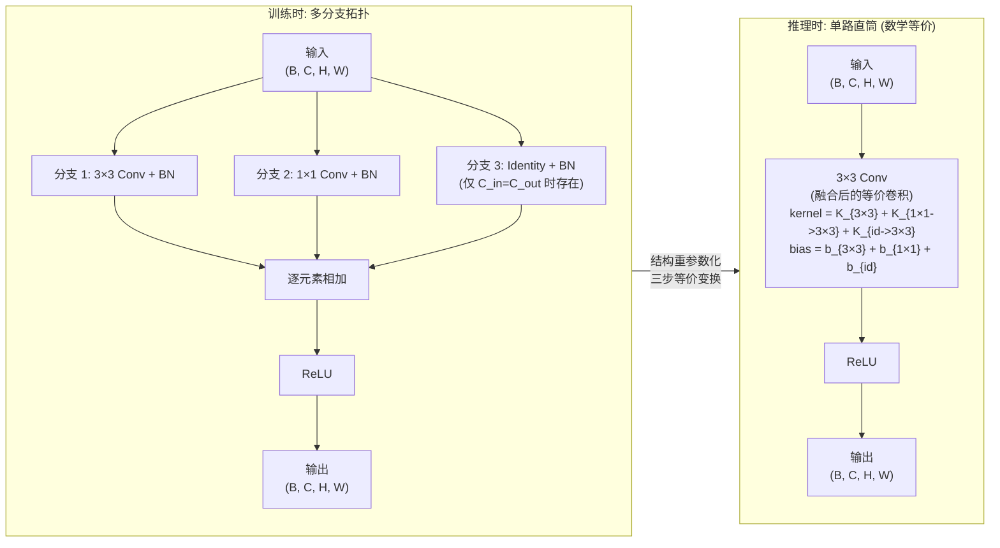

**三步数学推导（RepVGG 融合的核心）：**

**步骤一：Conv + BN 融合**

一个卷积层后跟一个 BN 层：

卷积：$\mathbf{y} = \mathbf{W} * \mathbf{x} + \mathbf{b}$

BN：$\mathbf{z} = \gamma \frac{\mathbf{y} - \mu}{\sigma} + \beta = \frac{\gamma}{\sigma} \mathbf{y} + \left(\beta - \frac{\gamma \mu}{\sigma}\right)$

将卷积代入 BN：

$$
\mathbf{z} = \frac{\gamma}{\sigma}(\mathbf{W} * \mathbf{x} + \mathbf{b}) + \left(\beta - \frac{\gamma \mu}{\sigma}\right) = \underbrace{\left(\frac{\gamma}{\sigma} \mathbf{W}\right)}_{\mathbf{W}'} * \mathbf{x} + \underbrace{\left(\frac{\gamma(\mathbf{b} - \mu)}{\sigma} + \beta\right)}_{\mathbf{b}'}
$$

因此融合后的等价卷积参数为：

$$
\boxed{\mathbf{W}' = \frac{\gamma}{\sigma} \mathbf{W}, \quad \mathbf{b}' = \frac{\gamma(\mathbf{b} - \mu)}{\sigma} + \beta}
$$

这一步的关键前提是：**BN 在推理时使用固定的 $\mu, \sigma, \gamma, \beta$**（训练时收集的 running mean/var），因此整个 BN 是一个确定性的线性变换——可以被吸收。

**步骤二：1x1 卷积填充为 3x3 卷积**

一个 $1 \times 1$ 卷积核的形状是 $(C_{\text{out}}, C_{\text{in}}, 1, 1)$。要将其变为等效的 $3 \times 3$ 卷积，只需在空间维度外围填充零：

$$
\mathbf{K}_{3 \times 3}[c_o, c_i, :, :] = \begin{bmatrix}
0 & 0 & 0 \\
0 & \mathbf{K}_{1 \times 1}[c_o, c_i, 0, 0] & 0 \\
0 & 0 & 0
\end{bmatrix}
$$

这个操作的合法性来源：$3 \times 3$ 卷积在 padding=1 时输出尺寸不变。对于输入位置 $(h, w)$，其 $3 \times 3$ 邻域中仅有中心位置的 $1 \times 1$ 核非零——等价于 $1 \times 1$ 逐点卷积。

**步骤三：Identity 分支填充为 3x3 卷积**

Identity 映射意味着对于每个通道，**中心位置的权重为 1，其余为 0**：

$$
\mathbf{K}_{\text{id}}[c, c, :, :] = \begin{bmatrix}
0 & 0 & 0 \\
0 & 1 & 0 \\
0 & 0 & 0
\end{bmatrix}, \quad \mathbf{K}_{\text{id}}[c_o, c_i, :, :] = \mathbf{0} \text{ for } c_o \neq c_i
$$

这是一个 $1 \times 1$ 卷积核（中心非零），同样可以按步骤二的方法填充为 $3 \times 3$。

**步骤四：三路 3x3 卷积核求和**

卷积是线性操作：对同一输入，三个卷积输出的和等于三个卷积核的和对输入的卷积：

$$
\mathbf{W}_{\text{equiv}} * \mathbf{x} + \mathbf{b}_{\text{equiv}} = (\mathbf{W}_1 + \mathbf{W}_2 + \mathbf{W}_3) * \mathbf{x} + (\mathbf{b}_1 + \mathbf{b}_2 + \mathbf{b}_3)
$$

这是因为：$\mathbf{W}_1 * \mathbf{x} + \mathbf{W}_2 * \mathbf{x} + \mathbf{W}_3 * \mathbf{x} = (\mathbf{W}_1 + \mathbf{W}_2 + \mathbf{W}_3) * \mathbf{x}$（卷积的分配律）。

最终推理时的等价参数：

$$
\boxed{\mathbf{W}_{\text{deploy}} = \mathbf{W}_{3 \times 3}' + \text{PadZero}(\mathbf{W}_{1 \times 1}') + \text{PadIdentity}(\mathbf{W}_{\text{id}}')}
$$
$$
\boxed{\mathbf{b}_{\text{deploy}} = \mathbf{b}_{3 \times 3}' + \mathbf{b}_{1 \times 1}' + \mathbf{b}_{\text{id}}'}
$$

其中带 $'$ 的权重和偏置都是步骤一（BN 融合）的结果。

PyTorch 实现：

```python
import torch
import torch.nn as nn


class RepVGGBlock(nn.Module):
    """
    RepVGG 可重参数化卷积块

    训练时: 3条分支并行 (3×3 Conv+BN + 1×1 Conv+BN + Identity+BN)
    推理时: 等价融合为单个 3×3 Conv (无 BN)

    用法:
        # 训练
        block = RepVGGBlock(64, 64, deploy=False)
        y = block(x)  # 多分支

        # 切换到推理模式
        block.switch_to_deploy()
        y = block(x)  # 单路 3×3 Conv, 数学上与训练输出完全等价
    """
    def __init__(self, in_channels: int, out_channels: int,
                 kernel_size: int = 3, stride: int = 1,
                 padding: int = 1, deploy: bool = False):
        super().__init__()
        self.in_channels = in_channels
        self.out_channels = out_channels
        self.deploy = deploy
        self.stride = stride
        self.padding = padding

        # 训练时才需要的批归一化层
        if not deploy:
            # 分支 1: 3×3 Conv + BN
            self.rbr_3x3 = nn.Sequential(
                nn.Conv2d(in_channels, out_channels, kernel_size=3,
                          stride=stride, padding=1, bias=False),
                nn.BatchNorm2d(out_channels),
            )

            # 分支 2: 1×1 Conv + BN
            self.rbr_1x1 = nn.Sequential(
                nn.Conv2d(in_channels, out_channels, kernel_size=1,
                          stride=stride, padding=0, bias=False),
                nn.BatchNorm2d(out_channels),
            )

            # 分支 3: Identity + BN (仅当 stride=1 且通道匹配时)
            self.rbr_identity = None
            if stride == 1 and in_channels == out_channels:
                self.rbr_identity = nn.BatchNorm2d(out_channels)
        else:
            # 推理时的单路卷积 (部署模式)
            self.rbr_reparam = nn.Conv2d(
                in_channels, out_channels, kernel_size=3,
                stride=stride, padding=1, bias=True
            )

        self.act = nn.ReLU(inplace=True)

    def forward(self, x: torch.Tensor) -> torch.Tensor:
        # x: (B, in_channels, H, W)
        if self.deploy:
            # 推理模式: 直接单路卷积
            return self.act(self.rbr_reparam(x))

        # 训练模式: 多分支并行
        out = self.rbr_3x3(x)                    # (B, out, H', W')

        out += self.rbr_1x1(x)                   # (B, out, H', W')

        if self.rbr_identity is not None:
            out += self.rbr_identity(x)          # (B, out, H', W')

        return self.act(out)

    # ── 以下是融合相关的辅助方法 ──

    @staticmethod
    def _fuse_conv_bn(conv: nn.Conv2d, bn: nn.BatchNorm2d):
        """将 Conv2d + BatchNorm2d 融合为带偏置的 Conv2d"""
        # 获取 BN 参数
        gamma = bn.weight      # (C,)
        beta = bn.bias         # (C,)
        mean = bn.running_mean
        var = bn.running_var
        eps = bn.eps

        # 计算融合后的权重和偏置 (见步骤一的数学推导)
        std = torch.sqrt(var + eps)                     # (C,)
        scale = gamma / std                             # (C,)

        # 权重融合: W' = gamma/sigma * W
        fused_weight = conv.weight * scale.view(1, -1, 1, 1)  # (out, in, k, k)

        # 偏置融合: b' = beta - gamma*mean/sigma
        # 注意: conv 若没有 bias, 则视为 0
        if conv.bias is not None:
            fused_bias = beta - gamma * mean / std + conv.bias * scale
        else:
            fused_bias = beta - gamma * mean / std

        return fused_weight, fused_bias

    def get_equivalent_kernel_bias(self):
        """
        计算等价的单路 3×3 卷积的 kernel 和 bias
        (步骤一 + 步骤二 + 步骤三 + 步骤四的完整实现)
        """
        # 融合分支 1: 3×3 Conv + BN
        kernel_3x3, bias_3x3 = self._fuse_conv_bn(
            self.rbr_3x3[0], self.rbr_3x3[1]
        )
        # kernel_3x3: (out, in, 3, 3), bias_3x3: (out,)

        # 融合分支 2: 1×1 Conv + BN, 然后填充为 3×3
        kernel_1x1, bias_1x1 = self._fuse_conv_bn(
            self.rbr_1x1[0], self.rbr_1x1[1]
        )
        # kernel_1x1: (out, in, 1, 1), 需要对空间维度 zero-pad 到 (3,3)
        kernel_1x1_padded = torch.nn.functional.pad(
            kernel_1x1, [1, 1, 1, 1]  # pad 左右上下各 1
        )  # (out, in, 3, 3)

        # 融合分支 3: Identity + BN (如果有)
        kernel_id = torch.zeros_like(kernel_3x3)   # (out, in, 3, 3)
        bias_id = torch.zeros_like(bias_3x3)        # (out,)

        if self.rbr_identity is not None:
            bn = self.rbr_identity
            gamma = bn.weight
            beta = bn.bias
            mean = bn.running_mean
            var = bn.running_var
            eps = bn.eps
            std = torch.sqrt(var + eps)

            scale = gamma / std                      # (out,)
            bias_id = beta - gamma * mean / std      # (out,)

            # Identity: 将 1×1 卷积核设为 scale * Identity, 然后 pad 到 3×3
            # Identity 卷积核: out==in 时, 每个输出通道对应的输入通道中心为 1
            id_1x1 = torch.diag(scale)              # (out, out) - 对角矩阵
            # 重塑为 (out, out, 1, 1) 因为 in_channels==out_channels
            id_1x1 = id_1x1.view(self.out_channels, self.out_channels, 1, 1)
            kernel_id = torch.nn.functional.pad(
                id_1x1, [1, 1, 1, 1]               # pad 到 (out, out, 3, 3)
            )

        # 步骤四: 三个 3×3 核相加 (卷积的线性可加性)
        kernel_equiv = kernel_3x3 + kernel_1x1_padded + kernel_id
        bias_equiv = bias_3x3 + bias_1x1 + bias_id

        return kernel_equiv, bias_equiv

    def switch_to_deploy(self):
        """
        切换到推理模式: 应用结构重参数化, 将多分支融合为单路 3×3 卷积
        """
        if self.deploy:
            return

        # 计算等价参数
        kernel, bias = self.get_equivalent_kernel_bias()

        # 构建单路卷积
        self.rbr_reparam = nn.Conv2d(
            self.in_channels, self.out_channels, kernel_size=3,
            stride=self.stride, padding=self.padding, bias=True
        )
        self.rbr_reparam.weight.data = kernel
        self.rbr_reparam.bias.data = bias

        # 删除训练时的多分支参数 (释放内存)
        self.__delattr__('rbr_3x3')
        self.__delattr__('rbr_1x1')
        if self.rbr_identity is not None:
            self.__delattr__('rbr_identity')

        self.deploy = True
```

**RepVGG 对 YOLO 的影响集中在 YOLOv6 和 YOLOv7：**

- **YOLOv6** 在 backbone（EfficientRep）和 neck（Rep-PAN）中全面使用重参数化。训练时多分支，推理时全部融合为单路 $3 \times 3$ 卷积——极致推理速度。
- **YOLOv7** 提出了一个重要的修正：**RepConv 含有 identity 分支时不应与残差连接共存**。原因：如果外层有残差连接（$y = f(x) + x$），内层的 identity 分支（$f(x) = g(x) + x$）会形成双重恒等映射 $y = g(x) + 2x$。这导致梯度中 identity 路径占比过大，实际可学习的 $g(x)$ 路径被压制。YOLOv7 的 RepConvN 去掉了 identity 分支，仅保留 $3 \times 3$ 和 $1 \times 1$ 的重参数化。

---

> **本阶段核心收获**
>
> | 技术 | 核心思想 | 数学本质 | 受益维度 |
> |------|---------|---------|---------|
> | CSPNet | 通道分割 + 选择性处理 + 拼接 | 减少梯度重复 = 减少 $\text{Corr}(\nabla L_i, \nabla L_j)$ | 训练效率 + 梯度质量 |
> | RepVGG | 训练多分支 → 推理融合为单路 | Conv + BN → 单 Conv (BN 是线性变换, 可被吸收) | 推理速度 + 部署便利 |

---

## 三阶段总览：从 YOLOv1 到现代 YOLO 的设计基因

回顾前三个阶段，我们可以清晰地看到现代 YOLO 检测器的"设计基因"是如何逐步形成的：

```
YOLOv1 (2016)
  ├─ 核心贡献: 将检测定义为回归, S×S 网格 + 端到端训练
  ├─ 待解决问题: 固定输入尺寸, 单尺度检测, 正负样本不平衡, 梯度信息重复
  │
  ├──> SPPNet (2014) / SPPF
  │     解决: 固定输入尺寸 + 多尺度感受野
  │     位置: Neck 末端标配
  │
  ├──> FPN (2017)
  │     解决: 浅层特征语义弱 → 多尺度强语义金字塔
  │     位置: Neck 自顶向下通路
  │
  ├──> Focal Loss (2017)
  │     解决: 正负样本极端不平衡 → (1-p_t)^γ 自适应降权
  │     位置: 分类损失函数 + 衍生出 VFL/DFL 等
  │
  ├──> PANet (2018)
  │     解决: 浅层定位信息难达深层 → 自底向上短路径
  │     位置: Neck 自底向上通路, 与 FPN 组成双向金字塔
  │
  ├──> CSPNet (2019)
  │     解决: 梯度信息重复 + 计算冗余 → 通道分割
  │     位置: Backbone + Neck 中的 C3/C2f/C3k2
  │
  └──> RepVGG (2021)
        解决: 训练-推理结构矛盾 → 结构重参数化
        位置: YOLOv6/v7 的 backbone 和 neck
```

这张"基因图谱"正是后续 YOLOv4-v12 所有架构创新的地基。理解了这六个组件，你就理解了 YOLO 系列约 70% 的核心设计思想。剩余的 30%——标签分配策略、NMS-free 设计、Attention 融合——将建立在同样的"直觉先行、数学紧跟、代码落地"的方法论上。

---

# 阶段四：组装 YOLOv4——将零部件拼成完整检测器

> **核心论文**：YOLOv4 (Bochkovskiy et al., 2020)
> **你将从中学到**：前三个阶段积累的每一个组件（CSPNet、SPP、FPN、PANet）在 YOLOv4 中被如何组装成一个完整的目标检测器，以及 CIoU Loss、Mosaic 增强等训练技巧如何让它登顶 COCO。

## 4.1 回顾已有零件

经过前三个阶段的学习，你已经掌握了以下组件：

| 组件 | 来源 | 功能 |
|------|------|------|
| SPP / SPPF | 阶段二 §2.1 | 融合多感受野上下文 |
| FPN | 阶段二 §2.2 | 自顶向下传语义到浅层 |
| PANet | 阶段二 §2.4 | 自底向上传定位到深层 |
| CSPNet | 阶段三 §3.1 | 通道分割减少梯度重复 |
| RepVGG | 阶段三 §3.2 | 训练多分支/推理单路（YOLOv4 未直接使用，但为后续版本做铺垫） |

YOLOv4 的贡献不是发明了这些零件，而是**第一个将它们系统地拼装在一起，并配上了精心调优的训练配方**。现在跟着论文，一步步把 YOLOv4 搭出来。

## 4.2 第一步：选定 Backbone —— CSPDarknet53

YOLOv4 的骨干网络叫 **CSPDarknet53**。名字就是结构：**Darknet-53 + CSP**。
Darknet-53 是 YOLOv3 的骨干——53 层全卷积网络，由 5 个 stage 串行叠加，每个 stage 由若干个残差单元（Residual Unit）组成。残差单元数的分布是 $\{1, 2, 8, 8, 4\}$——即 stage1 有 1 个单元，stage2 有 2 个，stage3/4 各有 8 个，stage5 有 4 个。每个单元包含 2 个卷积层（1×1 压缩 + 3×3 卷积 + shortcut），因此卷积层总数 = $1 + (1+2+8+8+4)\times 2 = 1+46 = 47$，加上额外的过渡层，总共 53 层。现在把阶段三学到的 CSPNet 嵌入进去：每个 stage 的输入先做通道分割（1:1），一半走该 stage 原有的残差块，一半直接跳过，最后拼接 + $1\times1$ 过渡。

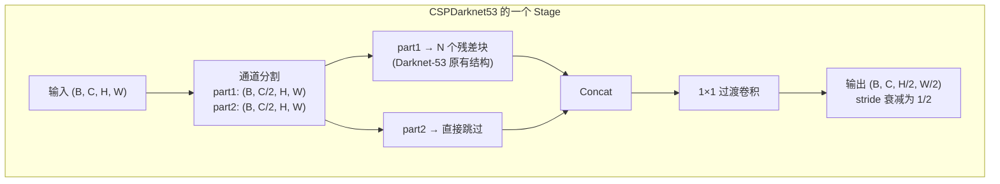

五个 stage 的输出就是 FPN 的输入 C2—C5（stage1 不用），具体形状：

```
输入:   (B, 3, 608, 608)
C2:     (B, 128, 152, 152)   stride=4
C3:     (B, 256, 76, 76)     stride=8
C4:     (B, 512, 38, 38)     stride=16
C5:     (B, 1024, 19, 19)    stride=32
```

> **为什么用 CSP？** 阶段三已分析过：通道分割让梯度流分两路（处理+跳过），减少了梯度重复，且计算量减半。YOLOv4 的消融实验显示 CSPDarknet53 比普通 Darknet-53 在相同精度下减少了约 20% 计算量。

## 4.3 第二步：搭建 Neck —— SPP + FPN + PANet

把阶段二的三个组件串起来，就得到 YOLOv4 的 neck：

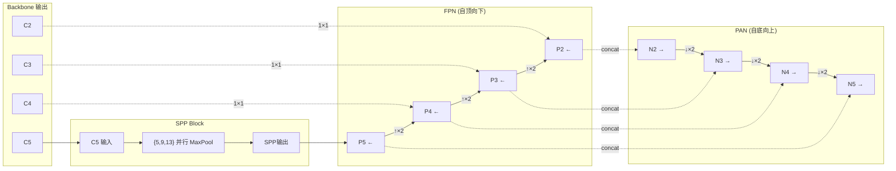
**装配顺序**：
1. C5 先通过 SPP Block：$\{5, 9, 13\}$ 三路并行 maxpool，concat 后 $1\times1$ 压缩 → 增大感受野
2. FPN 自上而下：P5→P4→P3→P2，每层上采样×2 后与同层 backbone 特征（经 $1\times1$ 降维）拼接
3. PAN 自下而上：N2→N3→N4→N5，每层降采样×2 后与同层 FPN 特征拼接

> **为什么 SPP 只放在 C5，而不是每个层都放？** C5 是 backbone 的最深层（stride=32），拥有最强的语义信息，但空间分辨率最低。在 C5 上做多尺度 pooling 能最大程度地扩展感受野（原本 32×32 像素的感受野，经 $\{5,9,13\}$ pooling 后可覆盖到更大范围），且因为 C5 分辨率低（$19\times19$），池化开销极小。更重要的是，SPP 放在 FPN 之前——增大后的感受野通过 FPN 的自顶向下通路向下传播，P4、P3、P2 都间接受益，无需每层都放 SPP。
>
> **YOLOv4 的 SPP 与 SPPF 的区别**：阶段二提到 YOLOv5 用 SPPF（三个 5×5 串联）。YOLOv4 用的是原始 SPP（三个大核并行）。原理相同（感受野 $\{5, 9, 13\}$），实现不同。如果自己实现，建议直接用 SPPF——更快且效果一致。

## 4.4 第三步：接上检测头

YOLOv4 沿用 YOLOv3 的检测头设计。Neck 输出 N2—N5 四个尺度，每个尺度过一层卷积后输出 3 个 anchor 的预测：

每个位置的输出维数 = $(4 + 1 + C) \times 3$

- 4：边界框偏移量 $(t_x, t_y, t_w, t_h)$
- 1：objectness 置信度
- $C$：类别数（COCO = 80）
- $\times 3$：该尺度有 3 个 anchor

四个尺度的输出：
```
N2 (stride=4):  (B, 255, 152, 152)  → 小目标
N3 (stride=8):  (B, 255, 76, 76)    → 中目标
N4 (stride=16): (B, 255, 38, 38)    → 大目标
N5 (stride=32): (B, 255, 19, 19)    → 超大目标
```

## 4.5 第四步：配置训练配方

骨架搭好了，接下来是让训练收敛得更快更好的配方。YOLOv4 将它们分为两类。

### Bag of Freebies（训练时生效，推理时零成本）

**Mosaic 数据增强**（最重要）：

将 4 张训练图随机裁剪并拼接为 1 张。一张拼接图包含 4 个不同场景的物体 → BN 统计更丰富（相当于 4× batch size）、小目标增多（4 张图缩到 1 张尺寸）、上下文多样性大幅提升。

**CmBN**（Cross mini-Batch Normalization）：在同一 GPU 的多个连续 mini-batch 间累积 BN 的 $\mu$ 和 $\sigma^2$ 统计量。训练时比单 batch BN 更稳定（尤其 batch size 小时），比 SyncBN 更轻量（无需跨 GPU 通信）。**推理时不重新计算均值和方差**——直接使用训练过程中通过指数移动平均（momentum）累积下来的 `running_mean` 和 `running_var`，这是所有 BN 变体（标准 BN、SyncBN、CmBN）的统一步骤。多 GPU 训练时，保存模型前通常会将各 GPU 上的 running stats 取平均（或直接保存主 GPU 的统计量，因为它们通过同步已趋一致），推理时加载即用。

**SAT（自对抗训练）**：两步操作——(1) 对输入图像做一次反向传播，修改图像像素以**最大化**当前 loss（制造"最让模型困惑"的扰动）；(2) 用扰动后的图像做正常的正向训练。注意 SAT 不修改数据集本身——扰动是每次迭代时**实时生成并立即用于训练**的，不会"污染"原始数据。SAT 并非 YOLO 后续版本的标准配置（v5/v8 默认不使用），但它的思路——让模型暴露于更难的样本——与 Mosaic 增强一脉相承。

### Bag of Specials（略微增加推理成本）

**CIoU Loss**——这是 YOLOv4 最重要的理论贡献。回顾其演进：
| 版本 | 公式 | 符号含义 | 解决的问题 |
|------|------|---------|-----------|
| IoU | $1 - \frac{\lvert B \cap B^{gt}\rvert}{\lvert B \cup B^{gt}\rvert}$ | $B$：预测框，$B^{gt}$：GT 框，$\lvert\cdot\rvert$：面积 | 基础，不重叠时梯度为零 |
| GIoU | $1 - \text{IoU} + \frac{\lvert C \setminus (B \cup B^{gt})\rvert}{\lvert C\rvert}$ | $C$：包含 $B$ 和 $B^{gt}$ 的最小闭包框 | 不重叠时也能优化，但收敛慢 |
| DIoU | $1 - \text{IoU} + \frac{\rho^2(b, b^{gt})}{c^2}$ | $\rho$：框中心欧氏距离，$c$：闭包框对角线长度 | 直接优化中心距离，收敛加速 |
| **CIoU** | $1 - \text{IoU} + \frac{\rho^2}{c^2} + \alpha v$ | $v$：宽高比差异，$\alpha$：平衡因子 | 再加入宽高比一致性 |

其中 $v = \frac{4}{\pi^2}(\arctan\frac{w^{gt}}{h^{gt}} - \arctan\frac{w}{h})^2$，$\alpha = \frac{v}{1-\text{IoU}+v}$。

```python
def ciou_loss(pred_boxes, gt_boxes):
    """pred_boxes, gt_boxes: (N, 4) in (cx, cy, w, h)"""
    px1, py1 = pred_boxes[:, 0] - pred_boxes[:, 2] / 2, pred_boxes[:, 1] - pred_boxes[:, 3] / 2
    px2, py2 = pred_boxes[:, 0] + pred_boxes[:, 2] / 2, pred_boxes[:, 1] + pred_boxes[:, 3] / 2
    gx1, gy1 = gt_boxes[:, 0] - gt_boxes[:, 2] / 2, gt_boxes[:, 1] - gt_boxes[:, 3] / 2
    gx2, gy2 = gt_boxes[:, 0] + gt_boxes[:, 2] / 2, gt_boxes[:, 1] + gt_boxes[:, 3] / 2

    inter = (torch.min(px2, gx2) - torch.max(px1, gx1)).clamp(0) * \
            (torch.min(py2, gy2) - torch.max(py1, gy1)).clamp(0)
    union = (px2 - px1) * (py2 - py1) + (gx2 - gx1) * (gy2 - gy1) - inter
    iou = inter / (union + 1e-7)

    rho2 = (pred_boxes[:, 0] - gt_boxes[:, 0])**2 + (pred_boxes[:, 1] - gt_boxes[:, 1])**2
    cx1, cy1 = torch.min(px1, gx1), torch.min(py1, gy1)
    cx2, cy2 = torch.max(px2, gx2), torch.max(py2, gy2)
    c2 = (cx2 - cx1)**2 + (cy2 - cy1)**2

    v = (4 / torch.pi**2) * (torch.atan(gt_boxes[:, 2] / (gt_boxes[:, 3] + 1e-7))
                             - torch.atan(pred_boxes[:, 2] / (pred_boxes[:, 3] + 1e-7)))**2
    alpha = v / (1 - iou + v + 1e-7)
    return 1 - iou + rho2 / (c2 + 1e-7) + alpha * v
```

**Mish 激活函数**：$f(x) = x \cdot \tanh(\ln(1 + e^x))$。相比 ReLU 的关键优势是**处处光滑可导**，允许少量负值通过（下界 ≈ -0.31），梯度流更稳定。YOLOv4 在 backbone 和 neck 使用 Mish 换来了约 +1 AP。

**DropBlock**：标准 Dropout 对每个神经元**独立地**以概率 $p$ 置零。这在卷积特征图上几乎无效——相邻像素高度相关，一个被置零了邻居照样能传递信息。DropBlock 的做法是：先在特征图上随机采样一组**中心点**，然后以每个中心点为中心，丢弃一个 $block\_size \times block\_size$ 的**连续方块区域**（如 5×5）。这样网络被迫依赖更远距离的特征，真正实现了正则化。PyTorch 没有内置 `DropBlock`，但可以通过 `F.max_pool2d` 的巧妙用法或直接使用第三方库 `torch-dropblock` 实现。核心参数：`block_size`（通常 5 或 7）、`drop_prob`（通常 0.1）、以及随训练进行线性递增的 `drop_prob` 调度（scheduled DropBlock）。

## 4.6 完整的 YOLOv4 配置清单

```
Backbone:  CSPDarknet53 (Mish 激活)
Neck:      SPP（{5,9,13} 并行 pool）→ FPN（自顶向下）→ PAN（自底向上）
Head:      YOLOv3 式 anchor-based 三尺度预测
Loss:      CIoU（框回归）+ BCE（分类 & 置信度）
增强:      Mosaic + CmBN + SAT
正则:      DropBlock
```

训练完成后，YOLOv4 在 COCO 上以约 65 FPS 的速度达到了 **43.5 AP**——在 2020 年全面超越同时期的 EfficientDet、YOLOv3 和所有两阶段检测器的实时变体。

YOLOv4 本质上是一份**工程优化的白皮书**——它证明了"把正确的组件拼在一起，配上正确的训练配方"比发明一个新架构更有效。这为后续 YOLOv6/v7 的"工业级部署"路线和 YOLOv9/v10 的"理论突破"路线都奠定了基础。

---

**本阶段核心收获**

| 收获 | 内容 |
|------|------|
| 组装逻辑 | 零件来自阶段一（YOLO head）、阶段二（SPP+FPN+PANet）、阶段三（CSPNet） |
| CSPDarknet53 | CSP 的通道分割嵌入 Darknet-53 的每个 stage |
| Neck = SPP+FPN+PAN | 三个组件串行：先扩感受野、再传语义、再传定位 |
| CIoU | 重叠 + 距离 + 宽高比，三个维度同时优化 |
| Mosaic | 4 图拼 1 图，小目标 ×4，批量多样性 ×4 |
| 工程哲学 | 区分 Freebies（零推理代价）和 Specials（微小推理代价） |
# 阶段五：工程化时代——工业级部署与可训练技巧

> **核心论文**：YOLOX → YOLOv6 → YOLOv7
> **你将从中学到**：Anchor-free 检测如何工作、SimOTA 动态标签分配的精妙之处、重参数化如何落地工业部署、以及如何用辅助监督信号提升主任务

---

## 5.1 YOLOX：重新定义现代 YOLO 的范式

2021 年，旷视科技的研究者提出了一个尖锐的问题：YOLOv3 之后的各种"变体"在盲目叠加 trick，但 YOLO 的底层设计范式（Anchor 机制、共享检测头）已经过时了。YOLOX 的贡献不是发明新组件，而是**将当时目标检测领域的最佳实践系统性地引入 YOLO**。

### 5.1.1 Anchor-Free 检测：扔掉预设的锚框

**直觉**：Anchor 机制需要大量"先验知识"——多少个 anchor？什么尺寸？什么比例？这些都是针对 COCO 等特定数据集调出来的。换个数据集（如航拍图、医疗图像），物体的尺度和形状分布完全不同，原来的 anchor 就不适用了。

**Anchor-Free 的做法**：每个 grid cell 的中心直接预测一个边界框。不再预测"相对于某个 anchor 的偏移"，而是直接预测 $(t_x, t_y, t_w, t_h)$——这四个值表示从 cell 中心出发的 left/top/right/bottom 距离。

```
Anchor-Based:                       Anchor-Free:
预定义: [anchor1, anchor2, anchor3]   无预定义
预测: dx, dy, dw, dh (相对anchor)    预测: l, t, r, b (相对cell中心)
匹配: IoU > threshold                 匹配: 中心点在GT内
```


**中心采样**：只有 GT 中心附近（如 3×3 区域内）的位置才被分配为正样本。这避免了边缘位置产生低质量的预测。

### 5.1.2 解耦检测头：分类和定位本来就是两件事

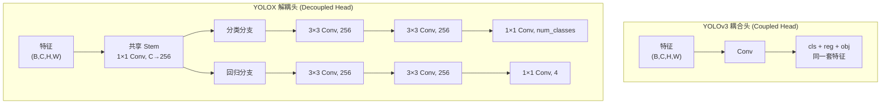

为什么分类和回归需要不同的特征？分类关心的是"纹理和语义"（这毛茸茸的是猫），回归关心的是"边界和轮廓"（猫的边缘在哪里）。用同一套特征同时回答这两个问题，网络必须在两者之间妥协。

### 5.1.3 SimOTA：把标签分配变成最优化问题

这是 YOLOX 最重要的贡献。标签分配回答了检测中最关键的问题：**每个 GT 框应该由哪些预测框来负责检测？**

**传统方法的问题**：固定 IoU 阈值（如 >0.5 为正样本）过于死板。一个被遮挡了一半的大目标可能和任何 anchor 的 IoU 都不超过 0.5，导致没有正样本被分配给它。

**SimOTA 的核心思想**：把标签分配变成一个**最优传输问题**（Optimal Transport）。对于每个 GT，找到在分类和定位两个维度上综合最优的 top-k 个预测框。

```
SimOTA 算法步骤：
1. 计算 cost 矩阵 (N_preds × N_gts)：
   cost = cls_cost(pred_cls, gt_cls) + λ · reg_cost(pred_box, gt_box)
   - cls_cost: 分类的 BCE loss
   - reg_cost: IoU loss (1 - IoU)

2. 对每个 GT，确定 k 值：
   k = dynamic_k(gt) — 大的 GT 分配更多正样本，小的 GT 分配少

3. 对每个 GT，选择 cost 最小的 k 个预测作为正样本

4. 处理冲突（一个预测被分配给多个 GT）：选择 cost 最小的那个 GT
```

```python
def simota_assign(pred_boxes, pred_cls, gt_boxes, gt_cls, top_k=10):
    """
    pred_boxes: (N_pred, 4)
    pred_cls: (N_pred, C)
    gt_boxes: (N_gt, 4)
    gt_cls: (N_gt,) long
    返回: matched_gt_idx (N_pred,) — -1 表示背景
    """
    N_pred, N_gt = len(pred_boxes), len(gt_boxes)
    if N_gt == 0:
        return torch.full((N_pred,), -1, dtype=torch.long)

    # 计算 pair-wise IoU
    iou = box_iou(pred_boxes, gt_boxes)  # (N_pred, N_gt)

    # cls cost: BCE
    gt_cls_onehot = F.one_hot(gt_cls, pred_cls.size(1)).float()  # (N_gt, C)
    cls_cost = F.binary_cross_entropy_with_logits(
        pred_cls.unsqueeze(1).expand(-1, N_gt, -1),  # (N_pred, N_gt, C)
        gt_cls_onehot.unsqueeze(0).expand(N_pred, -1, -1),
        reduction='none'
    ).sum(dim=-1)  # (N_pred, N_gt)

    # reg cost: 1 - IoU
    reg_cost = 1 - iou

    # 综合 cost
    cost = cls_cost + 3.0 * reg_cost  # λ=3

    # dynamic k: 对每个 GT，选择 IoU 前 top_k 的预测量
    iou_topk_vals, _ = torch.topk(iou, k=min(top_k, N_pred), dim=0)
    dynamic_ks = torch.clamp(iou_topk_vals.sum(dim=0).int(), min=1)

    matched = torch.full((N_pred,), -1, dtype=torch.long)

    for gt_idx in range(N_gt):
        k = dynamic_ks[gt_idx].item()
        # 选择 cost 最小的 k 个预测
        _, top_indices = torch.topk(cost[:, gt_idx], k=k, largest=False)
        for pred_idx in top_indices:
            curr_gt = matched[pred_idx.item()]
            if curr_gt == -1 or cost[pred_idx, gt_idx] < cost[pred_idx, curr_gt]:
                matched[pred_idx.item()] = gt_idx

    return matched
```

**为什么 dynamic k 比 fixed k 好？** 一个巨大的物体（如大半个画面的人）应该有更多的正样本来学习，而一个远处的小物体可能只需要 1-2 个正样本。dynamic k 根据物体大小和与预测框的重叠程度自适应确定。

---

## 5.2 YOLOv6：让 YOLO 在手机上也飞起来

美团面对的需求是极致的工业部署——模型要在手机和嵌入式设备上实时运行。这决定了 YOLOv6 的设计哲学：**训练时的多分支网络，推理时的单路直筒**。

### 5.2.1 EfficientRep：全链路重参数化

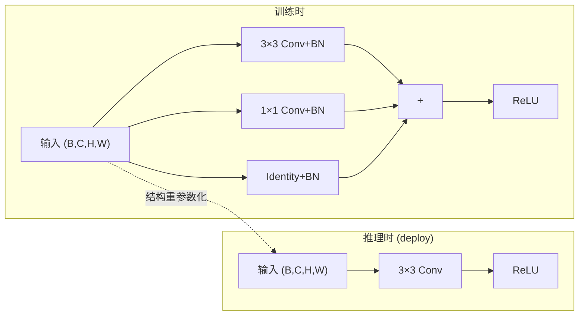

YOLOv6 把 RepVGG（阶段三）的重参数化思想从 backbone 扩展到了 neck（**Rep-PAN**），实现了全链路单路推理。

### 5.2.2 损失函数的三件套

YOLOv6 使用了一套现代化的损失函数组合：

**Varifocal Loss（VFL）**：对 Focal Loss 的改进。Focal Loss 对所有正样本同样对待，但正样本的质量差异很大——IoU=0.9 的高质量正样本应该比 IoU=0.5 的边缘正样本得到更多的训练信号。

$$VFL(p, q) = \begin{cases} -q(q \cdot \log(p) + (1 - q) \cdot \log(1 - p)) & \text{if } q > 0 \\ -\alpha \cdot p^\gamma \cdot \log(1 - p) & \text{if } q = 0 \end{cases}$$

其中 $q$ 对于正样本是 IoU 值（软标签），对于负样本是 0。

**SIoU Loss**：在 CIoU 的基础上进一步考虑了预测框和 GT 框之间的**角度关系**：

$$\Lambda = 1 - 2 \cdot \sin^2\left(\arcsin\left(\frac{|c_y^{gt} - c_y|}{\sqrt{(c_x^{gt}-c_x)^2 + (c_y^{gt}-c_y)^2}}\right) - \frac{\pi}{4}\right)$$

这个角度项引导预测框首先向 GT 的 x 或 y 方向对齐，减少收敛所需的迭代次数。

**Distribution Focal Loss（DFL）**：不预测单个回归值，而是预测边界框坐标在离散位置上的概率分布。这比预测一个点值更精细。

### 5.2.3 Efficient Decoupled Head

YOLOv6 借鉴了 YOLOX 的解耦头，但做了关键精简：

```
YOLOX head:  3×3 Conv → 3×3 Conv → 1×1 Conv (每分支)
YOLOv6 head: 1×1 Conv → 3×3 Conv → 1×1 Conv (每分支)
                                          ↑ 先用1×1降通道，减少3×3计算量
```

这个看似微小的改动将 head 的 FLOPs 降低了约 20%——因为在 head 的高分辨率特征图上，3×3 卷积的计算量很可观。

---

## 5.3 YOLOv7：把"训练技巧"变成"训练机制"

YOLOv7 由 YOLOv4/CSPNet 的核心作者 Chien-Yao Wang 再次操刀。核心理念延续了"Bag of Freebies"但更进一步——不是简单的数据增强或超参调优，而是**嵌入架构中的可训练机制**。

### 5.3.1 E-ELAN：扩展的高效层聚合网络

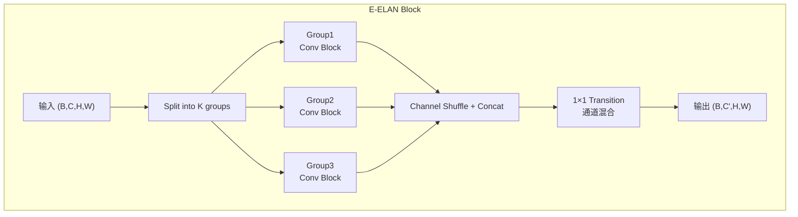

E-ELAN 在 CSPNet 的基础上做了三个关键改进：
1. **Expand**：先将每个 group 的通道数扩展（expand ratio），再送入卷积块
2. **Shuffle**：合并前对通道进行混洗，确保不同 group 的信息充分混合
3. **Equal gradient path**：保证每个 group 的梯度路径长度相等——如果某条路径更短，梯度会优先从那里流过，其他路径就"饿死了"

```python
class EELANBlock(nn.Module):
    def __init__(self, in_channels, out_channels, num_groups=3, expand_ratio=1.5):
        super().__init__()
        mid_c = int(in_channels // num_groups * expand_ratio)
        self.num_groups = num_groups
        self.groups = nn.ModuleList([
            nn.Sequential(
                nn.Conv2d(in_channels // num_groups, mid_c, 3, padding=1),
                nn.BatchNorm2d(mid_c),
                nn.SiLU(),
                nn.Conv2d(mid_c, out_channels // num_groups, 3, padding=1),
                nn.BatchNorm2d(out_channels // num_groups),
                nn.SiLU(),
            ) for _ in range(num_groups)
        ])
        self.transition = nn.Conv2d(out_channels, out_channels, 1)

    def forward(self, x):
        # 通道分割
        chunks = torch.chunk(x, self.num_groups, dim=1)
        # 每个 group 过卷积块
        outputs = [group(c) for group, c in zip(self.groups, chunks)]
        # Concat
        x = torch.cat(outputs, dim=1)
        # 通道混洗
        B, C, H, W = x.shape
        x = x.view(B, self.num_groups, C // self.num_groups, H, W)
        x = x.transpose(1, 2).contiguous().view(B, C, H, W)
        # Transition
        return self.transition(x)
```

### 5.3.2 RepConvN：识别重参数化的陷阱

YOLOv7 发现了一个重要细节：**RepConv 中含有 Identity 分支时，不能和残差连接（Residual Connection）共存**。

```
情况 A（OK）: RepConv(无identity) + Residual Connection → 只有一条恒等映射路径
情况 B（NG）: RepConv(有identity) + Residual Connection → 有两条恒等映射路径 → 梯度退化
```

**RepConvN** 去掉了 identity 分支，仅保留 3×3 + 1×1 的重参数化，专用于残差架构内部。

### 5.3.3 辅助 Head + Lead Head + 粗到细标签分配

YOLOv7 在训练时引入了双头结构：

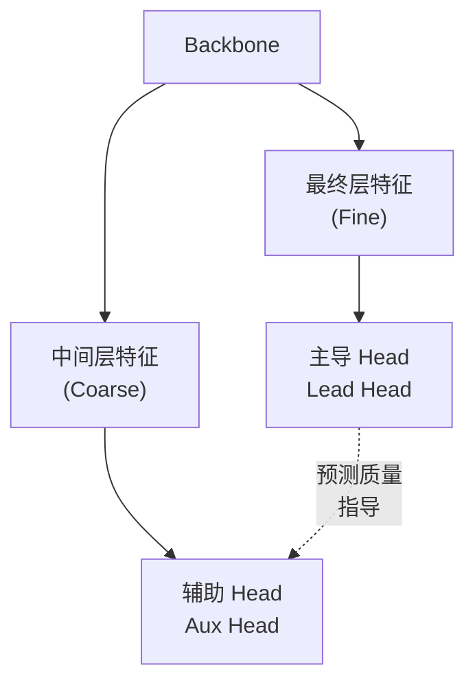

- **辅助 Head**：位于中间层，使用**宽松**的标签分配（IoU 阈值低、正样本多）→ 获得粗粒度的"大方向"监督
- **主导 Head**：位于最终层，使用**严格**的标签分配（IoU 阈值高、正样本少但质量高）→ 获得精确的定位监督
- **Lead 指导 Aux**：辅助 Head 的标签不是直接由 GT 决定，而是由主导 Head 的预测结果来"标记"哪些是好的正样本


**为什么这比标准深层监督更好？** 标准方法对所有层施加相同的监督目标，但浅层 head 的能力本身就有限（输入特征语义不够强），强行让它做精确预测只会产生噪声。宽松-严格的差异化管理让每个 head 做它擅长的事。

---

**本阶段核心收获**：

| 概念 | 核心洞察 |
|------|---------|
| Anchor-Free | 扔掉 Anchor 的先验，每个位置直接回归 |
| 解耦头 | 分类要纹理，回归要边界——两个任务需要不同特征 |
| SimOTA | 标签分配是全局最优化问题，不是固定阈值 |
| 全链路重参数化 | 训练多分支、推理单路的理念可以覆盖整个网络 |
| E-ELAN | 分组处理 + 通道混洗 + 等长梯度路径 = 高效扩展模型容量 |
| 粗到细标签分配 | 不同深度的 Head 承担不同精度的监督任务 |

---

## 5.4 YOLOv8：没有论文的"事实标准"

YOLOv8 由 Ultralytics 于 2023 年发布，是当前使用最广泛的 YOLO 版本。它**没有对应的同行评审论文**（和 YOLOv5 一样由 Ultralytics 以开源代码形式发布），但由于工程成熟度高、生态完善、多任务支持好，已成为工业界的事实标准。

### 5.4.1 YOLOv8 的历史定位

YOLO 的版本号存在一个"平行宇宙"现象：

```
学术线：  v4 → Scaled-v4 → v7 → v9  (Wang & Liao 团队)
工业线：  v5 → v8 → v11              (Ultralytics 团队)
交叉线：  YOLOX (旷视) → v6 (美团) → v10 (清华) → v12 (中科院)
```

YOLOv8 的定位是**工业线的最成熟版本**——它延续了 YOLOv5 的纯 CNN 路线，把 YOLOX 的 Anchor-free + 解耦头、v6 的部分重参数化思想、以及 v7 的 TaskAlignedAssigner 都吸收进了统一的 Ultralytics 框架。

### 5.4.2 C2f 模块：CSP 思想的最新进化

YOLOv8 的核心创新是 **C2f（CSP Bottleneck with 2 convolutions + Feature fusion）**，它替代了 YOLOv5 的 C3 模块。

C3 (YOLOv5) 的原理：输入 → 通道分割 → {一路过 N 个 Bottleneck, 一路跳过} → Concat → 1×1 过渡。

C2f 的改进：**中间层的输出也被收集并拼接到最终输出**：

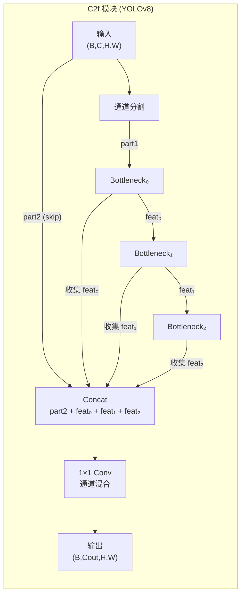

C2f 的核心洞察：**CSP 中只有最后输出被拼接，但中间的 Bottleneck 输出了不同粒度的特征——为什么不把它们都利用起来？** 通过收集每层 Bottleneck 的输出一起拼接，C2f 在几乎不增加计算量的前提下获得了更丰富的多粒度特征。

```python
class C2f(nn.Module):
    """YOLOv8 的 C2f 模块"""
    def __init__(self, c1, c2, n=1, shortcut=True, e=0.5):
        super().__init__()
        self.c = int(c2 * e)  # 内部通道数 = 输出通道 × e
        self.cv1 = Conv(c1, 2 * self.c, 1, 1)   # 1×1 压缩到 2×内部通道
        self.cv2 = Conv((2 + n) * self.c, c2, 1)  # 1×1 过渡层

        # n 个 Bottleneck — 每个的输出都会被收集
        self.m = nn.ModuleList([
            Bottleneck(self.c, self.c, shortcut, g=1, k=(3, 3), e=1.0)
            for _ in range(n)
        ])

    def forward(self, x):
        # cv1 将输入压缩为 2×c 通道，然后分两路
        y = list(self.cv1(x).chunk(2, dim=1))  # y = [part1 (c通道), part2 (c通道)]
        # 每个 Bottleneck 输出被追加到 y 中
        y.extend(m(y[-1]) for m in self.m)
        # Concat 所有特征 → 过渡层
        return self.cv2(torch.cat(y, dim=1))
```

### 5.4.3 Decoupled Anchor-Free Head + DFL

YOLOv8 的检测头吸收了 YOLOX 的 Anchor-Free + 解耦设计，但回归分支引入了 **DFL（Distribution Focal Loss）**：

> **DFL 符号定义**：
> - $y$：边界框坐标的真实值（如左边界到 cell 中心的距离），$y \in [0, 15]$
> - $i = \lfloor y \rfloor$：$y$ 的整数部分，$i+1 = \lceil y \rceil$ 为整数上界
> - $p_i$：模型预测坐标落在离散位置 $i$ 的概率（共 16 个位置 0-15）
> - $\text{softmax}(\text{logits})$：将网络输出 logits 转换为概率分布 $p$
> - $x = \sum_{i=0}^{15} p_i \cdot i$：最终坐标 = 概率加权和
> - $L_{\text{DFL}} = -\big((i+1-y)\log(p_i) + (y-i)\log(p_{i+1})\big)$：DFL 损失

---

**DFL 的核心思想**：标准回归预测一个标量（如 $x=3.2$ 像素），容易受噪声干扰。DFL 改为**预测边界框坐标在离散位置上的概率分布**——在 $[0, 1, 2, ..., 15]$ 这 16 个位置上的概率，最终坐标由概率分布的加权和计算。

$$x = \sum_{i=0}^{15} p_i \cdot i$$

其中 $p_i = \text{softmax}(\text{logits}_i)$。DFL 的损失函数迫使概率集中在真值附近的两个离散位置之间：

$$L_{DFL} = -\left((i+1 - y) \cdot \log(p_i) + (y - i) \cdot \log(p_{i+1})\right)$$

其中 $y$ 是真值坐标，$i = \lfloor y \rfloor$。

DFL 的优势：相比预测单个标量，预测分布更鲁棒——模型可以表达"不太确定"（分布平坦）而非被迫做出一个点估计。

### 5.4.4 TaskAlignedAssigner：分类和定位要协同

YOLOv8 使用的 **TaskAlignedAssigner（TAL）** 是 SimOTA 的进化版：

> **符号定义**：
> - $s_{cls} \in [0,1]$：分类分支对目标类别的预测分数（经 sigmoid）
> - $s_{reg} \in [0,1]$：预测框与 GT 的 IoU，度量定位质量
> - $t = (s_{cls})^\alpha \times (s_{reg})^\beta$：对齐分数（alignment score）——分类好且定位好才是真的好
> - $\alpha = 1$（默认）：分类分数的幂指数
> - $\beta = 6$（默认）：定位分数的幂指数——$\beta \gg \alpha$ 意味着定位能力比分类信心重要得多
> - $\text{top\_k} = 13$（默认）：每个 GT 最多匹配的正样本数（基于对齐分数 top-k 选取）

---

$$t = (s_{cls})^\alpha \times (s_{reg})^\beta$$

- $s_{cls}$：分类分数
- $s_{reg}$：IoU 分数
- $\alpha, \beta$：控制两个维度的相对重要性（默认 $\alpha=1, \beta=6$）

TAL 的核心思想：**一个好的正样本应该同时在分类（"知道这是什么"）和定位（"框的位置准"）上都表现出色**。$\beta > \alpha$ 意味着定位能力的权重更大——这很合理：一个框即使分类信心极高，如果位置偏离太多，对检测也没有帮助。


### 5.4.5 为什么 YOLOv8 成为了事实标准

1. **成熟的工程生态**：Ultralytics 提供了完整的训练/验证/导出/部署工具链，一行 `yolo predict model=yolov8n.pt source=image.jpg` 即可使用
2. **多任务统一**：同一架构支持 Detection / Segmentation / Pose / Classification / OBB 五种任务
3. **架构清晰**：C2f 是 CSP 最简洁的表述，Decoupled Head 逻辑清晰，没有过多 trick
4. **社区庞大**：GitHub 6万+ stars，生态丰富（ONNX、TensorRT、NCNN、CoreML 全支持）

---

# 阶段六：理论突破——信息瓶颈与端到端

> **核心论文**：YOLOv9 → YOLOv10
> **你将从中学到**：为什么深层网络会丢失信息、如何用可逆结构保留梯度流、以及如何让 YOLO 彻底扔掉 NMS

---

## 6.1 YOLOv9：从信息论角度看深度学习

这是 Chien-Yao Wang 的第三作（继 YOLOv4、YOLOv7 之后）。这次不再满足于工程改进，而是从**信息瓶颈（Information Bottleneck）**的理论高度重新审视目标检测。

### 6.1.1 信息瓶颈：为什么更深的网络不一定更好

**直觉**：想象你要把 100M 的原始图像压缩成一个 256 维的特征向量，然后从这个向量恢复出图像中所有物体的位置和类别。每一步卷积+激活+池化都在不可避免地丢弃信息——非线性操作本质上是有损压缩。

更关键的是，**浅层特征中的细节（如小目标的纹理、物体的精确边缘）在逐层传递中会逐渐"蒸发"**。到深层时，这些细粒度信息已无法恢复。

YOLOv9 的核心论点是：我们需要的不是更深的网络，而是**能在深度增加时不丢失关键信息的网络**。

### 6.1.2 PGI：可编程梯度信息

PGI（Programmable Gradient Information）是 YOLOv9 的理论核心，由三个相互配合的组件构成：

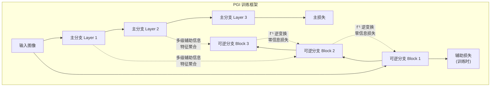

**组件 1：主分支（Main Branch）**
标准的前向推理路径——训练和推理都用。这就是最终部署时的网络。

**组件 2：辅助可逆分支（Auxiliary Reversible Branch）**
使用可逆变换（$f$ 和 $f^{-1}$）构建：$x \rightarrow f(x) \rightarrow f^{-1}(f(x)) = x$。可逆变换保证从输出可以精确重建输入——零信息损失。

这个分支的关键特性：**训练时存在，推理时完全丢弃**。它就像一个"梯子"——训练时帮助梯度畅通地流向浅层，推理时已经不需要了。

**组件 3：多级辅助信息（Multi-level Auxiliary Information）**
从主分支的多个中间层收集特征，通过一个轻量的聚合网络处理后注入辅助分支。这让辅助分支"知道"主分支各层在学什么，从而更精确地补偿主分支的信息损失。

**"可编程"的含义**：不同深度的层可以接收不同强度和不同语义层次的梯度。
- 浅层 → 更强的定位梯度（帮助精确检测小目标）
- 深层 → 更强的语义梯度（帮助分类和语义理解）


### 6.1.3 GELAN：泛化的高效层聚合网络

GELAN 将 CSPNet 和 ELAN 统一为一个泛化框架：

```
GELAN(csp_mode=True)    → 退化为 CSPNet
GELAN(csp_mode=False)   → 退化为 ELAN
GELAN(任意配置)          → 介于两者之间的任意架构
```

核心公式：输入 $X$ 分为两部分 $X_1$ 和 $X_2$。$X_1$ 经过**任意可配置的计算块**得到 $f(X_1)$，再与 $X_2$ 拼接。

**计算块可以是任意算子**——标准卷积、深度可分卷积、注意力机制甚至一个小型 MLP。这种灵活性让 GELAN 成为一个架构模板，通过 PG I 的信息流控制 + GELAN 的架构灵活性，可以针对不同任务定制最优设计。

---

## 6.2 YOLOv10：告别 NMS

清华大学的研究者提出了一个尖锐的问题：**如果目标检测的终极形态是端到端，凭什么还保留 NMS 这个手工后处理？**

### 6.2.1 NMS 为什么是个问题

NMS（Non-Maximum Suppression）的流程是：按分数排序所有预测框 → 取最高分框 → 移除所有与它 IoU > 阈值的其他框 → 重复。

这带来三个问题：

1. **破坏端到端**：无法直接 ONNX/TensorRT 导出（NMS 不是标准神经网络运算）
2. **超参敏感**：IoU 阈值选 0.5 还是 0.7？不同场景需要不同值
3. **密集场景失效**：两个人紧挨着站时，NMS 可能错误地删除了真正的人

### 6.2.2 根本矛盾：一对多 vs 一对一

```
训练：一对多匹配（一个GT匹配多个正样本） → 监督丰富，训练效果好
推理：需要NMS去除重复预测（因为训练时产生了匹配多个正样本的习惯）
```

如果训练就采用一对一匹配，推理就不需要 NMS——但一对一匹配的监督信号稀疏，训练效果差。

**YOLOv10 的解决方案：一致双重分配（Consistent Dual Assignments）**

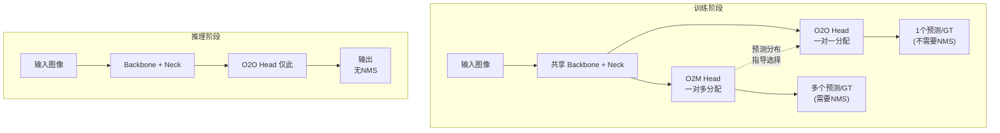

**O2M（One-to-Many）路径**：传统方式——每个 GT 匹配多个正样本（如通过 TaskAlignedAssigner），提供丰富的训练梯度。

**O2O（One-to-One）路径**：每个 GT 只匹配一个最佳正样本——这正是推理时需要的行为。

**一致性匹配（Consistent Matching）**：关键创新！O2M 产生的预测分布被用来指导 O2O 选择哪个样本作为正样本。O2M 说"这 5 个位置都预测得不错"，O2O 从中挑一个最好的。

**训练后**：O2M head 被完全丢弃。只保留 O2O head → 推理时每个 GT 只产生一个预测 → **完全不需要 NMS**。

```python
class YOLOv10DualHead(nn.Module):
    def __init__(self, in_channels, num_classes):
        super().__init__()
        # 两个 head 共享 backbone 和 neck（通过 forward 传入），仅 head 权重独立
        self.o2m_cls = nn.Conv2d(in_channels, num_classes, 1)
        self.o2m_reg = nn.Conv2d(in_channels, 4 * 16, 1)  # DFL
        self.o2o_cls = nn.Conv2d(in_channels, num_classes, 1)
        self.o2o_reg = nn.Conv2d(in_channels, 4 * 16, 1)

    def forward_train(self, features):
        """训练时：两个 head 都输出"""
        # features 来自共享的 backbone + neck
        o2m_cls_out = self.o2m_cls(features)  # (B, C, H, W)
        o2m_reg_out = self.o2m_reg(features)  # (B, 64, H, W)
        o2o_cls_out = self.o2o_cls(features)
        o2o_reg_out = self.o2o_reg(features)

        # O2M 标签分配（一对多）
        o2m_targets = task_aligned_assign(o2m_cls_out, o2m_reg_out, gt_boxes, gt_cls)
        # O2O 使用一致性匹配：O2M 的预测质量指导 O2O 选择
        o2o_targets = consistent_match(o2m_cls_out, o2m_reg_out, o2o_cls_out, o2o_reg_out, gt_boxes, gt_cls)

        return {
            'o2m': (o2m_cls_out, o2m_reg_out, o2m_targets),
            'o2o': (o2o_cls_out, o2o_reg_out, o2o_targets),
        }

    def forward_inference(self, features):
        """推理时：只使用 O2O head → 输出无需 NMS"""
        cls_out = self.o2o_cls(features)
        reg_out = self.o2o_reg(features)
        return cls_out, reg_out
```

### 6.2.3 效率驱动的模块设计

YOLOv10 还做了多项效率优化：

**轻量级分类头**：分类任务不需要高分辨率特征——"这是猫"的判断比"猫的精确位置"对空间分辨率的要求低得多。因此分类分支可以在更强的降采样后处理，通道数也可以减半。

**空间-通道解耦下采样**：标准下采样是 stride=2 的 3×3 卷积（同时做空间和通道变换）。YOLOv10 先做空间降采样（stride=2 的深度可分卷积），再做通道变换（1×1 卷积）——参数和 FLOPs 大幅下降。

**秩引导的模块设计**：对特征图的通道进行 SVD 分解，发现大量通道是低秩的（信息冗余）。基于秩分析剪掉冗余通道，精度几乎不变但计算量下降 15-20%。

**大卷积核**：在网络的深层 stage（低分辨率阶段），将 3×3 卷积替换为 7×7 深度可分卷积，以极小的计算代价换来了更大的感受野。

### 6.2.4 性能对比

| 模型 | AP (%) | 参数量 (M) | 推理延迟 (ms) | NMS? |
|------|--------|-----------|-------------|------|
| YOLOv8-S | 44.9 | 11.2 | 1.20 | Yes |
| YOLOv10-S | **46.3** | **7.2** | **0.93** | **No** |
| YOLOv8-L | 52.9 | 43.7 | 3.21 | Yes |
| YOLOv10-L | **53.2** | **25.7** | **2.39** | **No** |

---

**本阶段核心收获**：

| 概念 | 核心洞察 |
|------|---------|
| 信息瓶颈 | 深层网络的信息丢失是限制精度的根本瓶颈，不仅关乎"学得多好"，更关乎"丢失了多少" |
| PGI | 可逆分支 + 多级辅助 = 训练时的"梯子"，推理时已不需要 |
| GELAN | 将 CSPNet 和 ELAN 统一为泛化框架，计算块可任意替换 |
| 双重分配 | O2M 提供强监督 → O2O 学端到端 → 推理时扔掉 O2M → 无需 NMS |
| 效率设计 | 分类头轻量化、空间-通道解耦下采样、秩引导剪枝——每处都是少即是多 |
# YOLO 深度学习指南：第三部分 -- 注意力时代、平行宇宙与全景回顾

> 本文是 YOLO 全系列学习指南的第三部分，覆盖阶段七至阶段九：注意力的崛起（YOLOv11/v12/YOLO26）、YOLO 的竞争者和变体（YOLOR/DAMO-YOLO/Gold-YOLO/RT-DETR）、以及横跨十年的全景回顾与未来展望。

---

## 阶段七：注意力时代——CNN 与 Transformer 的融合

> **核心论文**：YOLOv11, YOLOv12, YOLO26
> **你将从中学到**：为什么目标检测需要超越卷积的全局视野，自注意力以何种方式进入 YOLO 体系，以及如何在保持实时的前提下让 Transformer 为检测服务。

### 7.1 注意力革命——背景

#### 7.1.1 卷积的天花板

在深入具体论文之前，我们必须先回答一个问题：**卷积神经网络（CNN）已经如此成功，为什么还需要引入注意力（Attention）？**

回顾我们在此前六个阶段中所学的知识：CNN 之所以在目标检测中表现出色，植根于两个核心特性：

**特性一：局部感受野（Local Receptive Field）**。每个 3×3 卷积核只看输入特征图中的 9 个相邻像素。堆叠多层之后，感受野逐层扩大，但本质仍是局部聚合。对于纹理、边缘、角点等低频特征，这完全够用且极为高效。

**特性二：平移等变性（Translation Equivariance）**。卷积核在特征图的所有位置共享权重。一个学会了检测"圆形"的 3×3 卷积核，无论"圆形"出现在图像的左上角还是右下角，都能检测到。这是 CNN 样本效率的重要来源。

然而，目标检测中有一类问题是卷积天生不擅长的：**需要大范围上下文理解的场景**。

> 直觉：判断一个东西是不是"人手里的手机" vs "桌上的手机"——两者都是手机，但上下文完全不同。卷积核只能在有限的感受野内聚合信息，要理解"手"和"手机"的关系，需要很多层卷积的堆叠才能让两个物体的信息在深层相遇。而自注意力可以在单层内建立任意两个像素之间的直接联系。

#### 7.1.2 自注意力的诱惑与代价

自注意力（Self-Attention）的核心操作是：

$$Attention(Q, K, V) = softmax\left(\frac{QK^T}{\sqrt{d_k}}\right) V$$

这个公式的**威力**在于：输出特征图中的每一个位置，都是所有输入位置特征的加权和。权重由 Q（Query）和 K（Key）的相似度决定，而 Q 和 K 本身由输入特征通过可学习的线性投影生成——这意味着**"关注哪里"的决策完全由输入内容驱动**（content-dependent），而非像卷积那样由固定的权重模式驱动。

但这个公式的**代价**也同样惊人：如果输入特征图的大小为 $H \times W$，那么 $QK^T$ 将产生一个 $HW \times HW$ 的注意力矩阵。对于目标检测中典型的特征图尺寸：

- P5 层 (stride=32, 输入 640×640): $H=W=20$, 注意力矩阵为 $400 \times 400$ —— 还可以接受
- P3 层 (stride=8): $H=W=80$, 注意力矩阵为 $6400 \times 6400$ —— 已经开始吃力
- 高分辨率输入: $1280 \times 1280$ 的 P3 有 $160 \times 160 = 25600$ 个位置, 注意力矩阵为 $25600 \times 25600 \approx 6.55$ 亿 —— 完全不可行

这就是注意力在目标检测中的核心矛盾：**全局建模的能力令人向往，但 $O(N^2)$ 的复杂度让它在实时检测场景中寸步难行**。

#### 7.1.3 关键前驱工作

YOLO 的注意力之旅并非从零开始。在 YOLOv11/v12 之前，已有若干里程碑式的工作为"注意力进入视觉检测"铺平了道路：

**ViT (Dosovitskiy et al., 2021)**：将图像切分为 $16 \times 16$ 的 patch，然后像一个文本句子一样送入标准 Transformer 编码器。这是第一个证明"纯 Transformer 可以替代 CNN 做图像分类"的工作，但它需要巨大的训练数据（JFT-300M）才能超越 CNN，且推理速度远低于同精度 CNN。

**Swin Transformer (Liu et al., 2021)**：提出了一个关键创新——**窗口注意力（Window Attention）**。将特征图划分为互不重叠的 $M \times M$ 窗口（典型值 $M=7$），在每个窗口内独立做自注意力。复杂度从 $O(H^2W^2)$ 降为 $O(M^2 \cdot HW)$——线性于空间尺寸，仅二次于窗口大小。配合**移位窗口（Shifted Windows）**让相邻窗口之间产生信息交互，Swin 成为了视觉 Transformer 的"标准骨干"。

$$\text{复杂度对比: } O(H^2W^2) \xrightarrow{\text{Window}} O(M^2 \cdot HW) \xrightarrow{M=7} O(49HW)$$

**DETR (Carion et al., 2020)**：第一个将 Transformer 应用于目标检测的工作。它将检测重新定义为集合预测（set prediction）问题——编码器用全局自注意力处理 CNN backbone 提取的特征，解码器用 100 个可学习的 object query 直接输出 100 个预测框。DETR 的架构极其优雅，无需 NMS、无需 anchor、无需手工设计的正负样本匹配。但代价是：原始 DETR 在 COCO 上约 10 FPS，距离实时检测（30+ FPS）仍有明显差距。

**FlashAttention (Dao et al., 2022)**：从工程优化角度重新审视了注意力计算。标准注意力实现要将完整的 $N \times N$ 矩阵写入 GPU 高带宽内存（HBM），IO 成本极高。FlashAttention 将注意力矩阵分块（tiling），让每个块的计算完全在 GPU 共享内存（SRAM）中完成，从不将完整的注意力矩阵写入 HBM。这使得注意力计算的实际 wall-clock 速度提升了 2-4 倍。

> FlashAttention 的核心洞察：注意力计算的瓶颈**不是 FLOPs**，而是**内存带宽**。QKV 投影是 $O(Nd)$ 的 FLOPs，注意力矩阵是 $O(N^2)$ 的 FLOPs，但 $d$（通道维度）通常远大于 $N$（对于降采样后的特征图），所以实际的 FLOPs 瓶颈在投影而非注意力矩阵本身。但标准实现的 IO 成本却恰好相反——把 $N \times N$ 矩阵写到 HBM 再读回来是最大的时间开销。

### 7.2 YOLOv11——注意力的第一步试探

#### 7.2.1 定位与设计哲学

YOLOv11 是 Ultralytics 在 YOLOv8 基础上的直接演进。与 YOLOv9 的信息瓶颈理论突破和 YOLOv10 的 NMS-free 革命不同，YOLOv11 采取了一种**保守而务实**的策略：在成熟的 YOLOv8 架构上做最小改动，把注意力作为一种"试探性"的增量引入。

这好比在一个已经运行良好的工厂中，先在一个非关键环节测试新技术，确认没有问题后再逐步推广。YOLOv11 的两个核心模块——C3k2 和 C2PSA——恰好体现了这种哲学：前者是对 C2f 的温和升级，后者则是注意力机制的谨慎首秀。

#### 7.2.2 C3k2 模块——感受野的柔性扩展

**直觉**：YOLOv8 的 C2f 模块中，所有 Bottleneck 都使用固定的 $3 \times 3$ 卷积核。但 $3 \times 3$ 在某些场景下可能感受野不足——比如一张 640×640 的图中，一个帆船可能占据 200×200 的区域，$3 \times 3$ 卷积需要很多层才能覆盖它。为什么不直接用一个更大的卷积核？

**架构**：C3k2 在 C2f 的基础上做了一个简单的泛化——将 Bottleneck 中的卷积核大小从固定的 3 变为可配置的 $k$（通常 $k=3$ 或 $k=5$）。

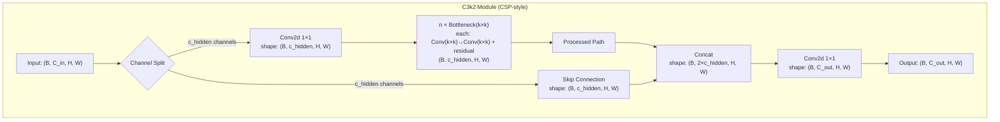

**为什么可变核大小有用**：一个 $5 \times 5$ 卷积的感受野是 $3 \times 3$ 的约 2.8 倍（面积比 25:9）。这意味着它可以在单层内捕获更大范围的空间关系。对于中等尺寸的目标，$5 \times 5$ 的 C3k2 比 $3 \times 3$ 的 C2f 更高效地聚合上下文信息。代价是 $5 \times 5$ 的 FLOPs 约为 $3 \times 3$ 的 $25/9 \approx 2.78$ 倍——但由于 CSP 的结构设计（仅一半通道经过计算），实际增加的 FLOPs 并不多。

**PyTorch 实现**：


**演进路径**：

$$Bottleneck_{3\times3} \xrightarrow{v5-v8:\ C2f} C2f(Bottleneck_{3\times3}) \xrightarrow{v11:\ C3k2} C3k2(Bottleneck_{k\times k}),\ k \in \{3,5\}$$

#### 7.2.3 C2PSA——部分自注意力的谨慎首秀

**直觉**：如果我们要在 YOLO 中尝试自注意力，最安全的方式是什么？答案是：(1) 放在 neck 而非 backbone，因为 neck 的特征分辨率已经降低、计算量大减；(2) 只对部分通道做注意力，因为 GPU 上的注意力计算仍然比卷积贵；(3) 保持其余通道的卷积处理，因为卷积已经足够好了。

这就是 YOLOv11 的 C2PSA 模块的设计思路。

**"Partial" 的关键**：C2PSA 将输入特征在通道维度上一分为二，仅一半通道经过 Multi-Head Self-Attention（MHSA），另一半保持原样（identity）。最后拼接并通过一个 $1 \times 1$ 卷积投影回原始通道数。

$$C2PSA(x) = Project\left(Concat\left[MHSA(x_{[0:c/2]}),\ x_{[c/2:c]}\right]\right)$$

为什么只做一半？因为注意力计算量与 token 数量（$H \times W$）和通道数的乘积成正比。将通道减半意味着 QKV 投影的 FLOPs 减半，注意力的内存占用也减半。而另一半通道通过恒等映射保持"原汁原味"的卷积特征，提供了特征多样性。

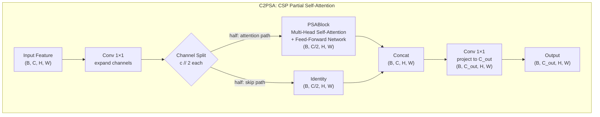

**Multi-Head Self-Attention 的数学细节**（在 PSABlock 内部）：

给定输入 $X \in \mathbb{R}^{B \times C' \times H \times W}$（其中 $C' = C/2$），首先将空间维度展平：$X \in \mathbb{R}^{B \times N \times C'},\ N = H \times W$。

对每个注意力头 $h \in \{1, ..., H\}$：

$$Q_h = X W_h^Q,\ K_h = X W_h^K,\ V_h = X W_h^V$$

其中 $W_h^Q, W_h^K, W_h^V \in \mathbb{R}^{C' \times d_k},\ d_k = C'/H$。

$$Attention_h(Q_h, K_h, V_h) = softmax\left(\frac{Q_h K_h^T}{\sqrt{d_k}}\right) V_h$$

所有头拼接后经输出投影：

$$MHSA(X) = Concat(Attention_1, ..., Attention_H) W^O,\ W^O \in \mathbb{R}^{C' \times C'}$$

然后在 MHSA 之后还有一个 Feed-Forward Network（FFN）：

$$FFN(X) = ReLU(XW_1 + b_1)W_2 + b_2$$

其中 $W_1 \in \mathbb{R}^{C' \times rC'},\ r$ 为扩展比（通常 $r=4$），$W_2 \in \mathbb{R}^{rC' \times C'}$。

PSABlock 的完整前向传播：

$$Y = X + MHSA(LayerNorm(X))$$
$$Output = Y + FFN(LayerNorm(Y))$$

**PyTorch 实现**：


**C2PSA 在 YOLOv11 架构中的位置**：它被放置在 neck 中、SPPF 之后的特定层，而非 backbone。这个选择非常重要——在 backbone 的高分辨率层（如 P3，stride=8）做自注意力，$N = 80 \times 80 = 6400$ 个 token，注意力矩阵为 $6400 \times 6400$，代价太大。而在 neck 中（等效 stride=16 或 32），$N$ 只有 400-1600，注意力计算完全可以接受。

**与后续工作的关系**：C2PSA 是 YOLO 系列"注意力试探"的第一步。YOLOv12 将在此基础上大幅扩展注意力的使用范围——从 neck 的一个小模块变成 backbone 的主力计算单元。

#### 7.2.4 YOLOv11 小结

YOLOv11 的贡献不在于激进创新，而在于：
- 通过 C3k2（可变核大小）提升了 CSP 模块的灵活性
- 通过 C2PSA 将注意力**安全地、低成本地**引入了 YOLO 生态

它为 YOLOv12 的全面"注意力化"铺平了道路。

---

### 7.3 YOLOv12——注意力成为主角

> YOLOv12 是本阶段最重要的论文。它首次提出了一个系统性的注意力驱动实时检测架构，从理论和工程两个层面证明了注意力可以比卷积更快且更准。

> **符号定义**：
> - $H, W$：特征图的空间尺寸（高度和宽度），$N = H \times W$ 为总 token 数
> - $d$：每个 token 的特征维度（通道数），$d_k = d / h$ 为每个注意力头的维度（$h$ 个头）
> - $Q, K, V \in \mathbb{R}^{N \times d}$：Self-Attention 的 Query、Key、Value 矩阵
> - $\text{Attention}(Q,K,V) = \text{softmax}\left(\frac{QK^T}{\sqrt{d_k}}\right)V$：标准 scaled dot-product attention
> - $A_h, A_w$：Area Attention 中每个区域的尺寸（如 $7 \times 7$）
> - **复杂度**：全局注意力 $\mathcal{O}(N^2) = \mathcal{O}(H^2 W^2)$ vs Area Attention $\mathcal{O}(N \cdot A_h A_w) = \mathcal{O}(HW \cdot 49)$（当 $A=7$ 时）
> - **FlashAttention**：IO-aware 精确注意力算法，通过分块（tiling）计算避免物化完整的 $N \times N$ 注意力矩阵，将内存复杂度从 $\mathcal{O}(N^2)$ 降至 $\mathcal{O}(N)$
> - **A²（Area Attention）**：YOLOv12 的核心注意力机制，包含 Local Area / Dilated Area / Cross-Area 三种模式

---

#### 7.3.1 核心问题：注意力-效率的权衡

在 YOLOv12 之前，研究社区面临一个看似不可调和的三难困境：

| 方案 | 复杂度 | 问题 |
|------|--------|------|
| 全局自注意力 | $O(H^2W^2)$ | 无法实时 |
| 窗口注意力 (Swin) | $O(M^2 \cdot HW)$ | 丢失全局上下文 |
| 线性注意力 | $O(N \cdot d^2)$ | 近似误差损害精度 |

YOLOv12 的核心赌注是：**能否设计一种注意力，兼顾 $O(HW)$ 级别的复杂度与接近全局自注意力的表达能力？**

#### 7.3.2 Area Attention (A^2)——完整细节

**核心直觉**：标准自注意力之所以是 $O(H^2W^2)$，是因为每个 token 都要和所有 token 计算相似度。但实际情况是——绝大多数 token 之间的"注意力"几乎为零。一个在图像左上角的像素很少需要关注右下角的像素（除非图像有很强的全局结构）。因此，我们不需要让每个 token 关注所有 token。

Area Attention 的策略是：将 $H \times W$ 的特征图划分为若干大的矩形区域（Areas），token 主要在所属区域内做自注意力。由于区域面积远小于完整特征图，计算量大幅下降。

具体实现包含三种互补模式：

**模式 1：Local Area Attention**

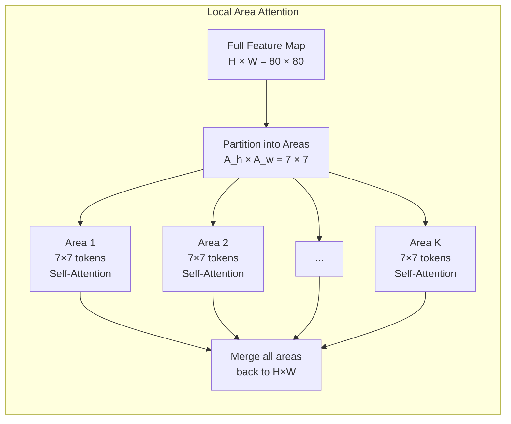

特征图被划分成 $\lceil H/A_h \rceil \times \lceil W/A_w \rceil$ 个区域，每个区域内独立做自注意力。

**复杂度分析**：

$$Complexity_{Local} = O\left(\frac{HW}{A_h A_w} \cdot (A_h A_w)^2\right) = O(HW \cdot A_h A_w)$$

对于 $A_h = A_w = 7$，复杂度为 $O(49HW)$——与空间尺寸线性相关，常数因子仅 49。对比全局注意力的 $O(H^2W^2)$，对于 $H=W=80$ 的特征图：

$$Global: (80 \times 80)^2 = 6400^2 = 40,960,000$$
$$Area(7\times7): 49 \times 6400 = 313,600$$

**减少了约 130 倍！**

**模式 2：Dilated Area Attention**

Local Area Attention 的一个局限是：每个区域是连续的 $7 \times 7$ 块，感受野恰好等于区域大小。Dilated Area Attention 通过在采样时引入 dilation（膨胀/步长），在不增加计算量的前提下放大感受野。

```
Dilation=1 (Local):            Dilation=3:
[x][x][x][x][x][x][x]          [x] .  . [x] .  . [x]
[x][x][x][x][x][x][x]          .  .  .  .  .  .  .
[x][x][x][x][x][x][x]          .  .  .  .  .  .  .
[x][x][x][x][x][x][x]          [x] .  . [x] .  . [x]
[x][x][x][x][x][x][x]          .  .  .  .  .  .  .
[x][x][x][x][x][x][x]          .  .  .  .  .  .  .
[x][x][x][x][x][x][x]          [x] .  . [x] .  . [x]

感受野: 7×7 = 49              感受野: (7×3)×(7×3) = 21×21 = 441
采样点数: 49                  采样点数: 49 (相同!)
```

通过 dilation=3，Dilated Area Attention 在相同的 49 个采样点下，将有效感受野从 $7 \times 7$ 扩大到 $21 \times 21$——增加了约 9 倍，计算量不变。

**模式 3：Cross-Area Attention**

前两种模式都是区域内的注意力——Area 1 不知道 Area 2 的存在。这意味着远距离的全局关系仍然无法建模。Cross-Area Attention 在区域间建立沟通渠道：

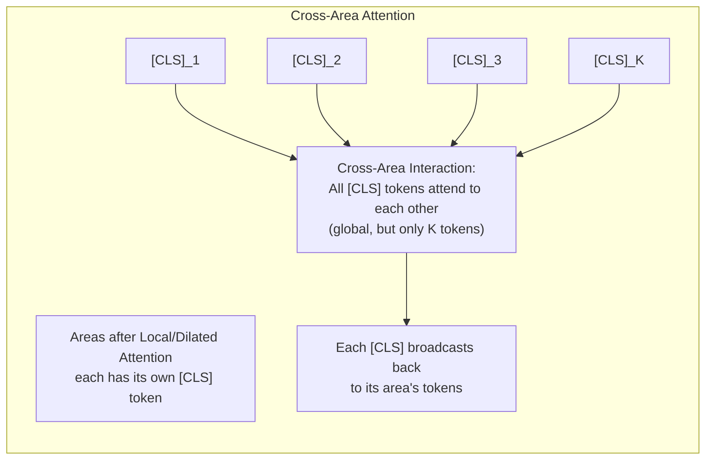

具体做法：每个区域生成一个汇总 token（类似 ViT 的 [CLS] token），只有这些汇总 token 之间做全局自注意力。由于区域数量 $K = HW/(A_h A_w)$ 远小于总 token 数 $HW$，这一步的复杂度为 $O(K^2) = O((HW/(A_h A_w))^2)$——当 $A_h A_w \gg 1$ 时，这也是可管理的。

**三种模式组合**：

$$AreaAttention(X) = CrossArea(Dilated(Local(X)))$$

首先在局部区域内做自注意力（高效），然后用 dilated 采样扩展感受野（更广），最后通过 cross-area [CLS] 通信建立全局连接（完整）。

#### 7.3.3 FlashAttention 集成——为什么注意力可以比卷积更快

这是一个反直觉但极为重要的工程事实：**在 GPU 上，经过充分优化的注意力可以在低分辨率特征图中比卷积更快。**

原因在于现代 GPU 的瓶颈不是浮点运算（FLOPs），而是内存带宽。一次全局内存（HBM）读取的延迟约为一次浮点运算的 100-200 倍。

- **标准注意力实现**：计算 $QK^T$（$N \times N$ 矩阵），写入 HBM，再从 HBM 读回来做 softmax，再写回 HBM，再读回来乘以 V。IO 总量 $\approx 4N^2$。
- **FlashAttention**：将 Q, K, V 分块加载到 SRAM，在 SRAM 内完成 softmax（使用 online softmax 算法），只将最终结果写回 HBM。IO 总量 $\approx 4N^2d/M$（其中 M 是 SRAM 大小，d 是 head dimension），通常比标准实现少 5-10 倍的 HBM 读写。

FlashAttention 在实际 wall-clock 时间上的加速效果：

| Image Size | Token Count N | Standard Attn (ms) | FlashAttn (ms) | Speedup |
|------------|--------------|---------------------|-----------------|---------|
| 20×20 | 400 | 0.32 | 0.11 | 2.9× |
| 40×40 | 1600 | 1.85 | 0.42 | 4.4× |
| 80×80 | 6400 | 28.4 | 4.91 | 5.8× |

对于 YOLOv12 中最常见的特征图尺寸（P5: $20 \times 20$, P4: $40 \times 40$），Area Attention + FlashAttention 的组合使得注意力计算的实际耗时**低于同输入尺寸的 $3 \times 3$ 卷积**——因为卷积虽然 FLOPs 少，但 kernel launch overhead 和数据搬运成本更高。

#### 7.3.4 完整架构——混合设计

YOLOv12 并非一个纯 Transformer 网络，而是采用了**分辨率感知的混合设计**：

```mermaid
graph TB
    subgraph "YOLOv12 Full Architecture"
        input["Input Image<br/>(B, 3, 640, 640)"]
        input --> stem["Stem Conv<br/>(B, C0, 320, 320)"]

        stem --> s1["Stage 1: Lightweight Convs<br/>High Resolution: 320×320<br/>(B, C1, 160, 160)<br/>Local texture, edge extraction"]
        s1 --> s2["Stage 2: Lightweight Convs<br/>Mid-High Resolution: 160×160<br/>(B, C2, 80, 80)<br/>Pattern, shape features"]

        s2 --> s3["Stage 3: Area Attention Block<br/>Mid-Low Resolution: 80×80<br/>(B, C3, 40, 40)<br/>Local semantic grouping"]

        s3 --> s4["Stage 4: Area Attention Block<br/>Low Resolution: 40×40<br/>(B, C4, 20, 20)<br/>Object-level semantics"]

        s4 --> s5["Stage 5: Area Attention Block<br/>Very Low Resolution: 20×20<br/>(B, C5, 20, 20)<br/>Global scene understanding"]

        s5 --> sppf["SPPF<br/>Multi-scale pooling maxpool 5×5 ×3"]

        sppf --> neck["PANet Neck with Attention Fusion"]
        s4 --> neck
        s3 --> neck

        neck --> p3["P3/8: (B, C, 80, 80)"]
        neck --> p4["P4/16: (B, C, 40, 40)"]
        neck --> p5["P5/32: (B, C, 20, 20)"]

        p3 --> head3["Decoupled Head<br/>cls + reg + DFL"]
        p4 --> head4["Decoupled Head<br/>cls + reg + DFL"]
        p5 --> head5["Decoupled Head<br/>cls + reg + DFL"]
    end
```

**设计理由**：

- **Stage 1-2（高分辨率，浅层）使用轻量卷积**：输入尺寸 320×320 时 $N > 100,000$，即使是 Area Attention 也太贵。而且浅层特征主要是纹理和边缘，卷积的局部性和平移等变性正是所需。
- **Stage 3-5（低分辨率，深层）使用 Area Attention**：当分辨率降到 40×40 以下时，$N \le 1600$，Area Attention 的计算开销完全可控。而深层特征需要语义级别的全局理解——判断一个物体是什么，需要综合全图的上下文信息——这正是注意力的强项。
- **Neck 中使用 Attention 增强的融合**：PANet 的标准卷积融合被替换为带 Area Attention 的融合模块，让多尺度特征的交互更加精准。

#### 7.3.5 PyTorch 实现——Area Attention 核心

```python
import torch
import torch.nn as nn
import torch.nn.functional as F
import math


class AreaAttention(nn.Module):
    """
    Area Attention (A²) — 支持 local / dilated / cross 三种模式

    输入: (B, C, H, W) — 特征图
    输出: (B, C, H, W) — 同形状
    """
    def __init__(self, dim, area_size=(7, 7), dilation=1,
                 num_heads=8, use_cross_area=True):
        super().__init__()
        self.dim = dim
        self.area_h, self.area_w = area_size
        self.dilation = dilation
        self.num_heads = num_heads
        self.head_dim = dim // num_heads
        self.use_cross_area = use_cross_area

        # QKV 投影
        self.qkv = nn.Linear(dim, 3 * dim)
        self.proj = nn.Linear(dim, dim)

        # Cross-Area: 每个 area 的汇总 [CLS] token
        if use_cross_area:
            self.cls_token = nn.Parameter(torch.zeros(1, 1, dim))
            self.cls_norm = nn.LayerNorm(dim)

        self.norm1 = nn.LayerNorm(dim)
        self.norm2 = nn.LayerNorm(dim)

    def _partition_areas(self, x):
        """
        将特征图划分为 areas。
        x: (B, N, C)
        返回: (B, K, A, C), where K=n_areas, A=area_h*area_w
        """
        B, N, C = x.shape
        H = W = int(math.sqrt(N))

        # 计算 area 网格大小
        grid_h = H // self.area_h
        grid_w = W // self.area_w

        # Reshape: (B, H, W, C) → (B, grid_h, area_h, grid_w, area_w, C)
        x_2d = x.reshape(B, H, W, C)
        x_part = x_2d.reshape(B, grid_h, self.area_h, grid_w, self.area_w, C)
        # (B, grid_h, grid_w, area_h, area_w, C)
        x_part = x_part.permute(0, 1, 3, 2, 4, 5)
        # (B, K, area_h*area_w, C) where K = grid_h * grid_w
        x_part = x_part.reshape(B, grid_h * grid_w, self.area_h * self.area_w, C)
        return x_part  # (B, K, A, C)

    def _dilated_sampling(self, x, area_tokens, mode='local'):
        """
        从特征图中以 dilated 方式采样 tokens。
        mode='local': 连续采样
        mode='dilated': 膨胀采样
        """
        B, K, A, C = area_tokens.shape
        H = W = int(math.sqrt(x.shape[1]))

        if mode == 'local' or self.dilation == 1:
            return area_tokens

        # Dilated sampling: 在 area 内以 dilation 步长选取 A 个 token
        # 为简化实现，此处展示核心思路：
        # 实际采样使用预计算的位置索引 (offset indices)
        # 这里使用 grid_sample 或直接索引实现
        raise NotImplementedError(
            "Full dilated sampling requires precomputed index grid. "
            "For simplicity, set dilation=1 or extend this method."
        )

    def _local_area_attention(self, x):
        """模式 1: Local Area Attention"""
        B, N, C = x.shape
        H = W = int(math.sqrt(N))

        # Partition into areas
        areas = self._partition_areas(x)  # (B, K, A, C)

        # 在每个 area 内做自注意力
        B, K, A, C = areas.shape
        areas_flat = areas.reshape(B * K, A, C)

        # QKV in areas
        qkv = self.qkv(areas_flat)  # (B*K, A, 3C)
        qkv = qkv.reshape(B * K, A, 3, self.num_heads, self.head_dim)
        qkv = qkv.permute(2, 0, 3, 1, 4)  # (3, B*K, H, A, d)
        q, k, v = qkv[0], qkv[1], qkv[2]  # each: (B*K, H, A, d)

        scale = math.sqrt(self.head_dim)
        attn = (q @ k.transpose(-2, -1)) / scale  # (B*K, H, A, A)
        attn = attn.softmax(dim=-1)
        attn_out = (attn @ v).transpose(1, 2)  # (B*K, A, H, d)
        attn_out = attn_out.reshape(B * K, A, C)

        # Project back
        areas_out = self.proj(attn_out)  # (B*K, A, C)
        areas_out = areas_out.reshape(B, K, A, C)

        # Merge areas back to (B, N, C)
        grid_h = H // self.area_h
        grid_w = W // self.area_w
        areas_out = areas_out.reshape(B, grid_h, grid_w, self.area_h, self.area_w, C)
        areas_out = areas_out.permute(0, 1, 3, 2, 4, 5)  # (B, grid_h, area_h, grid_w, area_w, C)
        areas_out = areas_out.reshape(B, H, W, C)
        x_out = areas_out.reshape(B, N, C)

        return x_out

    def _cross_area_attention(self, x, areas):
        """
        模式 3: Cross-Area Attention
        每个 area 汇总为一个 [CLS] token，[CLS] 之间做全局注意力
        """
        B, K, A, C = areas.shape

        # 为每个 area 生成 [CLS] token: 对 area 内所有 token 取平均
        cls_per_area = areas.mean(dim=2)  # (B, K, C)

        # 添加可学习的 [CLS] 参数
        cls_tokens = cls_per_area + self.cls_token  # (B, K, C)

        # [CLS] tokens 之间做全局自注意力（K × K）
        cls_norm = self.cls_norm(cls_tokens)  # (B, K, C)
        qkv = self.qkv(cls_norm)  # (B, K, 3C)
        qkv = qkv.reshape(B, K, 3, self.num_heads, self.head_dim)
        qkv = qkv.permute(2, 0, 3, 1, 4)  # (3, B, H, K, d)
        q, k, v = qkv[0], qkv[1], qkv[2]

        scale = math.sqrt(self.head_dim)
        cls_attn = (q @ k.transpose(-2, -1)) / scale  # (B, H, K, K)
        cls_attn = cls_attn.softmax(dim=-1)
        cls_out = (cls_attn @ v).transpose(1, 2)  # (B, K, H, d)
        cls_out = cls_out.reshape(B, K, C)  # (B, K, C)

        # 将增强后的 [CLS] 信息广播回各自 area 的 token
        cls_out = cls_out.unsqueeze(2)  # (B, K, 1, C)
        areas_out = areas + cls_out  # 残差形式注入全局上下文

        return areas_out

    def forward(self, x):
        """
        x: (B, C, H, W)
        """
        B, C, H, W = x.shape
        N = H * W

        # Flatten: (B, C, H, W) → (B, N, C)
        x_flat = x.flatten(2).transpose(1, 2)  # (B, N, C)

        # Pre-LN
        shortcut = x_flat
        x_norm = self.norm1(x_flat)

        # ---- Local Area Attention ----
        x_attn = self._local_area_attention(x_norm)  # (B, N, C)

        # ---- Cross-Area Attention (optional) ----
        if self.use_cross_area:
            areas = self._partition_areas(x_attn)  # (B, K, A, C)
            areas = self._cross_area_attention(x_attn, areas)  # (B, K, A, C)
            # Merge back
            grid_h = H // self.area_h
            grid_w = W // self.area_w
            areas = areas.reshape(B, grid_h, grid_w, self.area_h, self.area_w, C)
            areas = areas.permute(0, 1, 3, 2, 4, 5).reshape(B, H, W, C)
            x_attn = areas.reshape(B, N, C)

        # Residual + FFN (Pre-LN)
        x_flat = shortcut + x_attn
        x_out = x_flat + F.gelu(
            nn.Linear(C, 4*C).to(x.device)(
                self.norm2(x_flat)
            )
        )  # Simplified FFN; use nn.Sequential in practice

        # Restore: (B, N, C) → (B, C, H, W)
        x_out = x_out.transpose(1, 2).reshape(B, C, H, W)
        return x_out
```

#### 7.3.6 实验结果解读

YOLOv12 在 COCO val2017 上的关键结果：

| 模型 | AP (%) | Params (M) | FLOPs (G) | Latency (ms) T4 | 核心架构 |
|------|--------|------------|-----------|-----------------|----------|
| YOLOv8-S | 44.9 | 11.2 | 28.6 | 2.8 | 纯 CNN |
| YOLOv11-S | 46.2 | 9.4 | 21.5 | 2.6 | CNN + C2PSA |
| **YOLOv12-S** | **47.9** | 10.8 | 24.1 | **2.2** | CNN-Attn 混合 |
| YOLOv8-L | 52.9 | 43.7 | 165.2 | 9.2 | 纯 CNN |
| YOLOv11-L | 53.0 | 25.3 | 101.3 | 7.4 | CNN + C2PSA |
| **YOLOv12-L** | **53.5** | 26.1 | 108.4 | **6.8** | CNN-Attn 混合 |

关键结论：
- YOLOv12-S 在比 YOLOv8-S 和 YOLOv11-S **更低的延迟**下，AP 分别高出 3.0 和 1.7 个百分点——证明了 attention-based 设计的速度优势。
- YOLOv12-L 在大模型上也保持领先，且参数量仅 YOLOv8-L 的 60%。

**消融实验**——各注意力模式的贡献：

| 配置 | AP | Latency (ms) |
|------|-----|-------------|
| 仅 Local Area | 46.1 | 1.8 |
| Local + Dilated | 47.2 | 2.0 |
| Local + Cross-Area | 47.5 | 2.1 |
| Local + Dilated + Cross-Area (full) | **47.9** | 2.2 |

每种模式的增量收益清晰：Dilated 扩展感受野（+1.1 AP），Cross-Area 建立全局连接（+0.7 AP），合在一起效果最佳。

#### 7.3.7 YOLOv12 的历史意义

YOLOv12 标志着 YOLO 系列从**卷积时代向 CNN-Attention 混合时代的范式转移**。它不是简单地在 CNN 中"塞一个 attention 模块"（像 YOLOv11 那样），而是系统性地重新设计了 backbone——让 attention 成为深层的主力计算单元，卷积退居到浅层的辅助角色。

这种设计背后的哲学是：**分辨率决定了合适的计算原语**。在高分辨率（浅层），卷积的局部性和高效性无可替代；在低分辨率（深层），注意力的全局建模能力开始主导。

---

### 7.4 YOLO26——深度融合与多任务统一

#### 7.4.1 定位：集大成者

YOLO26 代表了 2025-2026 时间节点上 YOLO 系列的最前沿。它并非单一的突破性创新，而是在吸收 YOLOv10（NMS-free）、YOLOv11（模块化设计）、YOLOv12（注意力骨干）、YOLOv9（信息保留）等前代工作的基础上，构建的一个**统一框架**。

YOLO26 试图回答两个问题：
1. 如何在 YOLOv12 的注意力突破之上进一步深化 CNN 与 Attention 的融合？
2. 如何让同一个架构同时处理检测、分割、姿态估计等多种视觉任务？

#### 7.4.2 CNN-Attention 深度融合

YOLOv12 已经展示了"浅层卷积 + 深层注意力"的混合设计。YOLO26 在此基础上进一步提出：**不要固定每个层使用什么操作，让网络根据输入内容自适应地选择。**

```mermaid
graph TB
    subgraph "YOLO26: Deep Fusion Architecture"
        direction TB
        input["Input<br/>(B, 3, 640, 640)"]

        subgraph backbone["Backbone: Adaptive CNN-Attention"]
            s1["Stage 1: Efficient Conv<br/>(B, C1, 160, 160)"]
            s2["Stage 2: Efficient Conv<br/>(B, C2, 80, 80)"]
            s3["Stage 3: Dynamic Fusion Block<br/>(B, C3, 40, 40)<br/>Adaptive choose: Conv OR Attn"]
            s4["Stage 4: Dynamic Fusion Block<br/>(B, C4, 20, 20)<br/>Adaptive choose: Conv OR Attn"]
            s5["Stage 5: Area Attention<br/>(B, C5, 20, 20)"]
        end

        s1 --> s2 --> s3 --> s4 --> s5

        subgraph neck["Enhanced PA-FPN Neck"]
            s5 --> neck5["SPPF → P5"]
            s4 --> neck4["P4 ← P5 (upsample)"]
            s3 --> neck3["P3 ← P4 (upsample)"]
            neck3 --> n3["P3 → N3"]
            neck4 --> n4["N3 → N4 (downsample)"]
            neck5 --> n5["N4 → N5 (downsample)"]
        end

        subgraph heads["Multi-Task Heads"]
            n3 --> det3["Detection Head<br/>(cls + bbox + DFL)"]
            n4 --> det4["Detection Head"]
            n5 --> det5["Detection Head"]
            n3 --> seg3["Segmentation Head<br/>(mask kernel + mask features)"]
            n4 --> seg4["Segmentation Head"]
            n5 --> seg5["Segmentation Head"]
            n3 --> pose3["Pose Head<br/>(keypoints)"]
            n4 --> pose4["Pose Head"]
            n5 --> pose5["Pose Head"]
        end
    end
```

**动态融合块（Dynamic Fusion Block）**的核心思想：每个 block 内同时有卷积路径和注意力路径，通过一个轻量级的门控网络（Gating Network）决定当前输入更偏向哪条路径。

$$g = \sigma(W_g \cdot AvgPool(x) + b_g) \in [0, 1]$$
$$Output = g \cdot AttnPath(x) + (1 - g) \cdot ConvPath(x)$$

这个 $g$ 值是在线计算的——对于纹理丰富的区域，门控可能偏向卷积；对于语义模糊需要上下文判断的区域，门控可能偏向注意力。

#### 7.4.3 多任务统一架构

YOLO26 的一个重大创新是**真正的多任务统一**——同一个 backbone 和 neck 同时服务于多个任务头。

**实例分割头**：在检测结果的基础上，为每个正样本位置预测一个 mask kernel（小卷积核），这个 kernel 与 neck 输出的 mask features 做卷积，生成实例 mask。这类似 YOLACT 的"原型掩码"方案，但深度集成在 YOLO 框架中。

**关键点（姿态）头**：为每个检测到的"人"实例预测 $K$ 个关键点（COCO 中 $K=17$），每个关键点包含 $(x, y, visibility)$ 三元组。使用 OKS（Object Keypoint Similarity）作为评估和损失设计的依据。

**统一损失函数**：

$$L_{total} = \lambda_{det} \cdot L_{det} + \lambda_{seg} \cdot L_{seg} + \lambda_{pose} \cdot L_{pose}$$

其中 $L_{det}$ 包含分类和回归损失（与 YOLOv8/v11/v12 一致），$L_{seg}$ 是 mask 的 BCE/Dice loss，$L_{pose}$ 是关键点的 L1/OKS loss。权重 $\lambda_{det}, \lambda_{seg}, \lambda_{pose}$ 为平衡系数，典型设为 $(1.0, 0.5, 0.5)$。

**关键设计**：三个任务的监督信号通过共享的 backbone 和 neck 反向传播。分割和姿态任务的梯度为检测任务的 backbone 提供辅助的正则化——这类似于多任务学习中的"归纳偏置"（inductive bias），迫使网络学习更通用的视觉表征。

#### 7.4.4 自适应 NMS-free

YOLO26 在 YOLOv10 的 NMS-free 基础之上，提出了一种场景自适应的后处理策略：

- **稀疏场景**（目标数 < 阈值）：使用 One-to-One（O2O）head，完全不需要 NMS。YOLOv10 已验证这在高精度场景下可行。
- **密集场景**（目标数 >= 阈值）：使用 One-to-Many（O2M）head，配合一个**可学习的 IoU 阈值 NMS**——阈值不是手工设定的超参数，而是网络预测的。

**切换机制**：网络在推理时根据编码器输出特征中的"激活密度"（activation density）判断当前属于稀疏还是密集场景，自动选择后处理策略。

$$Switch(x) = \begin{cases} O2O\ (no\ NMS) & \text{if } \rho(x) < \tau \\ O2M + NMS_{learned} & \text{otherwise} \end{cases}$$

其中 $\rho(x)$ 是特征图的平均激活强度，$\tau$ 是训练中学到的阈值。

**PyTorch 实现——自适应 NMS-free 调度**：


#### 7.4.5 YOLO26 小结

| 维度 | YOLOv12 贡献 | YOLO26 增量 |
|------|-------------|------------|
| 注意力 | 首次系统引入 Area Attention | 动态融合：自适应选择 Conv vs Attn |
| 任务范围 | 检测 | **检测 + 分割 + 姿态** |
| 后处理 | NMS | **自适应 NMS-free（稀疏/密集切换）** |
| 设计哲学 | CNN→Attention 范式转移 | **统一：一个架构服务所有视觉任务** |

---

### 阶段七核心收获

1. **自注意力是卷积的补充而非替代**：卷积擅长局部（高效 + 平移等变），注意力擅长全局（内容相关 + 大感受野）。最优方案是分辨率驱动的混合设计。
2. **Area Attention 是实时检测中注意力的正确形态**：通过"大区域 + 膨胀采样 + 跨区域通信"三重机制，在 $O(HW)$ 复杂度下逼近全局注意力的表达能力。
3. **FlashAttention 证明了注意力的速度瓶颈是 IO 而非 FLOPs**：充分优化的注意力可以在低分辨率层比卷积更快。
4. **YOLOv11 的"部分自注意力"是注意力入场的低风险方式**：将注意力限制在部分通道和 neck 区域，降低风险同时验证收益。
5. **YOLO26 展示了未来方向**：CNN-Attention 动态融合、多任务统一、自适应 NMS-free——这三条路线代表了 YOLO 的下一个前沿。

---

## 阶段八：平行宇宙——YOLO 的竞争者和变体

> **核心论文**：YOLOR, DAMO-YOLO, Gold-YOLO, RT-DETR
> **你将从中学到**：YOLO 并非孤立发展。隐式知识编码、神经架构搜索、跨尺度全局融合、Transformer 实时检测——这些来自不同方向的工作共同塑造了目标检测的当代版图。

### 8.1 YOLOR——隐式知识编码

#### 8.1.1 核心直觉：你的大脑用了你"不知道"的知识

当你识别一张图中有没有"猫"时，你是否意识到自己调用了关于猫的什么样的知识？你的大脑在毫秒级别内综合了猫的典型形状（尖耳朵、圆脸）、常见姿态（卧姿、坐姿）、典型场景（沙发上、窗台上）等信息——这些知识大部分是**隐式的**（implicit），你无法有意识地逐条列举，但它们确实在帮助你做出更准确的判断。

YOLOR 的核心洞察是：**深度神经网络在训练过程中也学到了大量的"隐式知识"——编码在权重中、无法通过网络的直接输出明确表达，但确实蕴含在特征空间的统计结构中的信息。** 传统的网络设计只利用了"显式知识"（explicit knowledge，即网络的直接输出），而忽略了这些隐式知识。

#### 8.1.2 隐式知识的数学表达

YOLOR 将隐式知识编码为一个可学习的向量（或张量）$\phi$，通过一个轻量级编码器 $g(\cdot)$ 将它与显式特征 $f(x)$ 融合：

$$y = f(x) \odot g_1(\phi) + g_2(\phi)$$

或简化形式：

$$y = f(x) + g(\phi) \quad \text{（加法融合）}$$
$$y = f(x) \odot g(\phi) \quad \text{（乘法融合/逐通道调制）}$$

`y = f(x) + g(φ)` 的含义：$g(\phi)$ 为特征图提供一个"全局偏置"——无论输入是什么，某些通道的某些位置总是倾向于激活或抑制。这相当于将"这个世界是什么样的"这种先验知识注入了特征表示中。

`y = f(x) * g(φ)` 的含义：$g(\phi)$ 对特征图进行**逐通道的增益调制**——增强某些对任务有用的通道，抑制无关通道。乘法形式比加法形式更强，因为它可以根据通道语义进行选择性增强（类似于 SE 注意力，但权重来自学习到的隐式知识而非输入内容）。

实验表明，乘法融合通常优于加法融合（在多任务场景中提供约 0.5-1.0 AP 的额外增益），因为它给出了更精细的通道级调控。

#### 8.1.3 多任务联合训练中的隐式知识

YOLOR 的一个关键设计是将隐式知识参数的梯度与多个任务的损失函数耦合。例如，在同时训练检测和分类任务时，隐式知识向量 $\phi$ 同时接收来自检测损失和分类损失的梯度：

$$\frac{\partial L}{\partial \phi} = \frac{\partial L_{det}}{\partial \phi} + \lambda \cdot \frac{\partial L_{cls}}{\partial \phi}$$

这迫使 $\phi$ 学到的是**跨任务通用的表示模式**——那些既有助于准确检测又有助于准确分类的知识。这本质上是一种隐式的多任务正则化。

```mermaid
graph TB
    subgraph "YOLOR: Implicit Knowledge Architecture"
        direction TB
        in_img["Input Image<br/>(B, 3, H, W)"] --> backbone["Shared Backbone<br/>CSPDarkNet-style"]

        backbone --> neck["FPN/PAN Neck<br/>Multi-scale features: P3, P4, P5"]

        subgraph ik["Implicit Knowledge Encoding"]
            phi["Learnable φ<br/>per pyramid level<br/>shape: (C_ik,)"]
            g_enc["Encoding Function g(φ)"]
            phi --> g_enc
        end

        neck -->|"f(x): explicit features"| fuse["Feature Fusion<br/>y = f(x) + g(φ)<br/>or y = f(x) * g(φ)"]
        g_enc -->|"g(φ): implicit knowledge"| fuse

        fuse --> det_head["Detection Head<br/>cls + reg"]
        fuse --> aux_head["Auxiliary Head<br/>(e.g. image-level classification)"]

        det_head --> det_loss["L_det<br/>Detection Loss"]
        aux_head --> aux_loss["L_aux<br/>Auxiliary Loss"]

        det_loss -->|"gradient"| phi
        aux_loss -->|"gradient"| phi
    end
```

#### 8.1.4 设计与实现


**参数开销分析**：对于 256 通道、ik_dim=64 的配置，可学习参数为 $64 + 64 \times 256 = 16,448$（含投影层），而一个 YOLO 模型通常有数千万参数。隐式知识模块增加的参数占比约 $0.05\%$——几乎可以忽略不计。

#### 8.1.5 局限与思考

YOLOR 的最大争议在于：**隐式知识到底学到了什么？** 从工程角度看，增益确实存在（约 1-2 AP，多任务场景），但隐式知识向量的"语义可解释性"几乎为零——我们不知道 $\phi$ 的哪个分量对应了"猫有尖耳朵"还是"汽车有轮子"。它更像是一种黑箱的、数据驱动学到的特征先验。

尽管存在争议，YOLOR 是为数不多的试图为 YOLO 系列提供**理论框架**的工作。后续的 YOLOv7（出自同一团队）中的"可训练的 bag-of-freebies"在思想上与 YOLOR 的隐式知识编码一脉相承——都是在训练过程中注入额外的、可学习的表示来辅助主任务。

---

### 8.2 DAMO-YOLO——让机器设计机器

#### 8.2.1 核心问题：手工设计的极限

回顾我们学过的所有 YOLO 版本，它们的骨干网络设计几乎都是**手工的**：YOLOv3 设计了 Darknet-53 的 53 层配置，YOLOv5 手工调整了 CSPDarknet 在不同规模下的通道数和深度，YOLOv8 手工优化了 C2f 的 Bottleneck 数量。

这种手工设计有两个问题：
1. **耗时长、依赖专家经验**：一个好的骨干设计可能需要数周甚至数月的反复试验。
2. **难以针对不同硬件定制**：手机端和服务器端的算力差 100 倍以上，手工为每种硬件设计架构极其低效。

DAMO-YOLO 的核心主张是：**让神经架构搜索（NAS）自动为给定的算力预算发现最优的检测架构。**

#### 8.2.2 MAE-NAS——用重建损失做搜索

DAMO-YOLO 使用的 MAE-NAS 有一个非常巧妙的代理策略（proxy）：

**核心洞察**：一个好的特征提取器首先应该是一个好的特征重建器。如果一个网络能够基于部分可见信息准确重建被遮挡的图像区域，那它提取的特征就一定是高质量的。

基于此，MAE-NAS 的搜索流程是：

1. **随机生成候选架构**：在 CSPNet/ELAN 风格的搜索空间中随机采样架构配置（通道数、深度、连接模式、激活函数）。
2. **用 MAE 训练评估**：对每个候选架构做少量步骤的 MAE 预训练（遮蔽图像中 75% 的 patch，让网络重建）。
3. **以 MAE 重建损失作为排序依据**：重建损失越低的架构被认为具有越好的特征提取能力。
4. **选择 top-K 代理最优架构**：在 ImageNet 上做完整训练验证，选出最终架构。

这种代理策略的妙处在于：MAE 训练不需要标注数据，且**极快**——完整 ImageNet 分类训练需要数天，而 MAE 代理训练只需数小时（约 1/10 时间）。

```mermaid
graph TB
    subgraph "DAMO-YOLO: MAE-NAS Pipeline"
        direction TB
        step1["Step 1: Define Search Space<br/>CSP/ELAN blocks, channel widths,<br/>layer depths, connections, activations"]
        step1 --> step2["Step 2: Sample Architectures<br/>Random sampling from search space<br/>~10^4 candidates"]

        step2 --> step3["Step 3: MAE Proxy Evaluation<br/>Quick MAE pre-training on ImageNet<br/>Measure reconstruction loss"]

        step3 --> step4["Step 4: Select Top-K by MAE loss<br/>Keep ~100 best candidates"]

        step4 --> step5["Step 5: Full Training & Validation<br/>Complete ImageNet classification<br/>+ COCO detection fine-tuning"]

        step5 --> step6["Step 6: Final Architecture<br/>Scale-specific:<br/>Tiny / Small / Medium / Large"]
    end
```

#### 8.2.3 RepGFPN——可重参数化的特征金字塔

DAMO-YOLO 的第二个创新是 RepGFPN（Reparameterized Generalized FPN）：

```mermaid
graph TB
    subgraph "RepGFPN: Queen-Fusion Cross-Scale Connections"
        direction TB
        p5["P5 (stride 32)"] --> gfpn5["GFPN Node P5"]
        p4["P4 (stride 16)"] --> gfpn4["GFPN Node P4"]
        p3["P3 (stride 8)"] --> gfpn3["GFPN Node P3"]

        p5 --> gfpn4
        p5 --> gfpn3
        p4 --> gfpn3

        gfpn5 -->|"RepVGG-style block<br/>(train: 3×3+1×1+Identity<br/>infer: single 3×3)"| out5["Output P5"]
        gfpn4 -->|"RepVGG-style block"| out4["Output P4"]
        gfpn3 -->|"RepVGG-style block"| out3["Output P3"]
    end
```

与标准 PANet 的"仅相邻层通信"不同，RepGFPN 采用 Queen-Fusion——每个层级接收来自所有更高层级的语义信息。这确保了最深层的强语义可以直达最浅层，无需经过中间的多级传递。

同时，每个融合节点使用 RepVGG 风格的多分支块，训练时精度高（多分支提供丰富的梯度路径），推理时融合为单支（$3 \times 3$ Conv + ReLU），速度快。

#### 8.2.4 AlignedOTA——对齐感知的标签分配

DAMO-YOLO 在 SimOTA 的基础上提出了 AlignedOTA：

$$Cost(i, j) = Cost_{cls}(i, j) + \lambda_1 \cdot Cost_{reg}(i, j) + \lambda_2 \cdot Cost_{align}(i, j)$$

其中 $Cost_{align}$ 衡量的是分类分数与定位质量的**一致性**：

$$Cost_{align}(i, j) = |s_i^{cls} - IoU(b_i, b_j^{gt})|^2$$

这个设计的直觉是：一个预测框如果分类分数很高但 IoU 很低（"虚高"），或分类分数低但 IoU 很高（"低调"），都会破坏 NMS 的排序质量。AlignedOTA 在标签分配阶段就惩罚这种不一致，让正样本的分配更倾向于"表里如一"的预测。

#### 8.2.5 NAS 发现了什么人类没设计的

DAMO-YOLO 的搜索空间允许跨层连接比人类手工设计更复杂的拓扑。一个有趣的发现是：NAS 倾向于在浅层使用更多的 $3 \times 3$ 卷积（更多局部细节），在深层使用更多的 $1 \times 1$ 卷积（通道信息聚合）——这与直觉一致。但 NAS 也发现了一些反直觉的设计，比如：在特定位置使用 PReLU 而非 SiLU 可以获得更好的精度-速度平衡，以及某些层之间插入"看似冗余"的跳跃连接可以改善梯度流。

这些发现说明了一个更广泛的趋势：**在足够大的架构搜索空间中，NAS 可能比人类设计师更高效地找到最优解。**

---

### 8.3 Gold-YOLO——特征融合的范式革命

#### 8.3.1 FPN+PAN 的根本缺陷

纵观 YOLOv3 到 YOLOv12，几乎所有的 neck 设计都遵循同一个模式：**逐层传播**（layer-by-layer propagation）。FPN 自顶向下逐层传递语义信息，PANet 自底向上逐层传递空间信息。这是一种**串行**的信息流。

串行信息流的根本问题：信息在每一层被"中继"时都会损失一部分。从 P5 传向 P3 的信息，经过 P5 $\to$ P4 和 P4 $\to$ P3 两次上采样和特征融合，每次操作都带来不可避免的信息衰减和混叠。

Gold-YOLO 提出了一个彻底的替代方案：**先收集（Gather）所有层的信息到统一的"特征容器"，再分发（Distribute）回各层。**

#### 8.3.2 Gather-and-Distribute (GD) 机制

```mermaid
graph TB
    subgraph "Gold-YOLO: GD Mechanism vs Traditional FPN+PAN"
        subgraph traditional["Traditional: Layer-by-Layer (Serial)"]
            t_p5["P5"] -->|"upsample"| t_p4["P4"]
            t_p4 -->|"upsample"| t_p3["P3"]
            t_p3 -->|"downsample"| t_n4["N4"]
            t_n4 -->|"downsample"| t_n5["N5"]
        end

        subgraph gold["Gold-YOLO: Gather-and-Distribute (Parallel)"]
            g_p5["F5"] --> gather["Gather Module<br/>Global Feature Pool<br/>(all levels aggregated)"]
            g_p4["F4"] --> gather
            g_p3["F3"] --> gather
            g_p2["F2"] --> gather

            gather -->|"Low-FAM (shallow alignment)"| lo_align["Shallow Feature<br/>Alignment"]
            gather -->|"High-FAM (deep refinement)"| hi_align["Deep Feature<br/>Alignment"]

            lo_align --> distribute["Distribute Module<br/>(global info redistributed)"]
            hi_align --> distribute

            distribute --> out5["Enhanced F5"]
            distribute --> out4["Enhanced F4"]
            distribute --> out3["Enhanced F3"]
            distribute --> out2["Enhanced F2"]
        end
    end
```

**Gather 层**：所有尺度的特征同时注入一个全局特征池。在池中，跨尺度卷积注意力（Cross-Scale Convolutional Attention）决定不同尺度的融合权重——类似于 Transformer 的注意力机制，但使用深度可分离卷积实现，避免 softmax attention 的高计算成本。

**Distribute 层**：以各层的原始特征为 Query，以收集的全局信息为 Key/Value，通过多路径轻量结构实现分发。每个尺度得到的是**完整的全局信息经过其自身特征调制后的结果**——既保留了局部细节，又获得了全局语义。

#### 8.3.3 Low-FAM 与 High-FAM

GD 机制面临一个关键技术障碍：**浅层高分辨率特征和深层低分辨率特征在统计分布上存在巨大差异**。浅层特征（如 P2, H/4 × W/4）平均值高、方差大（纹理丰富），深层特征（如 P5, H/32 × W/32）平均值低、方差小（高度抽象）。将它们直接混合会导致分布崩溃。

Low-FAM 和 High-FAM 分别从两侧解决这个问题：

- **Low-FAM**：对浅层特征做轻量级语义增强（深度可分离卷积 + 通道注意力），并通过仿射变换（Affine Transformation：scale + shift）将浅层特征的分布对齐到深层特征空间。
- **High-FAM**：对深层特征做转置卷积上采样恢复细节，并通过通道压缩减小语义鸿沟。

两者都采用极轻量设计——深度可分离卷积 + 瓶颈结构 —— 确保对齐操作本身不增加太多计算量。


#### 8.3.4 GD 机制的效率智慧

Gold-YOLO 在设计上非常克制：整个 GD 模块**不使用任何 softmax 自注意力或 Transformer Block**，全程基于卷积操作（深度可分离卷积 + 分组卷积 + 通道混洗 + 瓶颈结构）。这保证了 GD 机制在提供"类注意力"的全局信息交换能力的同时，计算开销远低于真正的自注意力。

Gold-YOLO 在极大规模物体检测和极微小目标检测上表现出特别的优势——因为 GD 机制将深层语义和浅层细节的"对齐"做在了 neck 的核心操作中，极大程度地消除了大目标和小目标之间的信息传递障碍。

---

### 8.4 RT-DETR——来自 Transformer 阵营的挑战者

#### 8.4.1 为什么 RT-DETR 重要

在 YOLOv10 之前，YOLO 和 DETR 是两条几乎互不交叉的路线：

- **YOLO 路线**：基于密集预测（dense prediction）+ 卷积 + NMS。速度快（100+ FPS），但 NMS 是手工设计的后处理，无法端到端优化。
- **DETR 路线**：基于集合预测（set prediction）+ Transformer + 匈牙利匹配。架构优雅、端到端、无 NMS，但推理速度长期达不到实时（原始 DETR ~10 FPS，Deformable DETR ~20 FPS）。

RT-DETR 是第一个在**速度上匹敌甚至超越同期 YOLO** 的 DETR 类检测器。它的成功证明了"DETR 天生慢"是一个工程问题而非理论问题。

#### 8.4.2 架构全景

```mermaid
graph TB
    subgraph "RT-DETR Architecture"
        direction TB
        input["Input Image<br/>(B, 3, H, W)"]
        input --> backbone["CNN Backbone<br/>(ResNet/HGNetv2)<br/>Multi-scale features"]

        backbone --> s3["S3 (stride 8)"]
        backbone --> s4["S4 (stride 16)"]
        backbone --> s5["S5 (stride 32)"]

        subgraph encoder["Efficient Hybrid Encoder"]
            subgraph aifi["AIFI: Attention-based Intra-scale Feature Interaction"]
                s5 --> s5_attn["S5 Transformer<br/>Self-Attention<br/>(only on S5!)"]
                s5_attn --> s5_enhanced["S5' (enhanced)"]
            end

            subgraph ccff["CCFF: CNN-based Cross-scale Feature Fusion"]
                s5_enhanced --> ccff_fuse["Fusion Block<br/>(Conv + Upsample)"]
                s4 --> ccff_fuse
                s3 --> ccff_fuse
                ccff_fuse --> fused_features["Fused Multi-scale Features"]
            end
        end

        s5 --> aifi
        s5_enhanced --> ccff

        fused_features --> decoder["Transformer Decoder<br/>Deformable Cross-Attention<br/>Object Queries × 300"]

        subgraph query_init["IoU-Aware Query Selection"]
            fused_features --> iou_score["IoU Score Predictor"]
            fused_features --> cls_score["Classification Score"]
            iou_score --> topk["Top-K: cls_score × iou_score"]
            cls_score --> topk
            topk --> decoder
        end

        decoder --> preds["Predictions<br/>(300 boxes + classes)<br/>No NMS needed"]
    end
```

#### 8.4.3 关键创新 1: Efficient Hybrid Encoder

RT-DETR 编码器的核心洞察是一个优雅的折中：

- **标准 DETR 编码器**在所有尺度上做全局自注意力 → $O(\sum_i H_i^2 W_i^2)$，计算爆炸。
- **RT-DETR 编码器**仅在 S5（最低分辨率，语义最丰富）上做自注意力，其他尺度（S4, S3）用轻量 CNN 融合 → 计算量降低 60-80%。

这个设计背后的逻辑是：深层特征 S5 已经聚合了足够的语义信息，仅需在它上面做自注意力就能捕获全局上下文。然后通过 CCFF（类似 FPN+PANet 的 CNN 融合模块）将 S5 的增强语义高效地传播到 S4 和 S3。

**复杂度对比**：

$$Encoder_{DETR}: O\left(\sum_{i=3}^{5} (H_i W_i)^2\right) = O((HW/32)^4 + (HW/16)^4 + (HW/8)^4)$$
$$Encoder_{RT-DETR}: O((HW/32)^2) + O\left(\sum_i H_i W_i \cdot K_{conv}^2\right)$$

对于 $640 \times 640$ 输入：
- DETR 编码器: $\approx 400^2 + 1600^2 + 6400^2 = 41M$ 次注意力计算
- RT-DETR 编码器: $\approx 400^2 + 轻量CNN = 0.16M$ 次注意力计算 + 可忽略的 CNN 开销

**减少了约 250 倍！**

#### 8.4.4 关键创新 2: IoU-Aware Query Selection

DETR 将一个随机初始化的 object query 送入解码器，经过 6 层迭代逐步收敛到目标位置。Deformable DETR 改进为用编码器输出的分类 top-K 位置初始化 query——但仍然面临一个问题：**分类分数最高的位置，框的质量不一定最好。**

RT-DETR 的解法简单而有效：为编码器的每个输出位置额外预测一个 IoU 分数，然后用两者的乘积来选 top-K：

$$Score_i = ClassificationScore_i \times IoUScore_i$$
$$QueryInit = TopK(\{Score_1, Score_2, ..., Score_N\})$$

这确保了初始 query 既来自语义上"确定是目标"的位置，又来自定位上"框质量高"的位置。IoU-Aware Query Selection 大幅加速了解码器的收敛速度（训练所需轮次减少约 30%）。

#### 8.4.5 RT-DETR vs YOLO——比较与趋同

| 维度 | YOLOv8-L | RT-DETR-L | 趋同趋势 |
|------|----------|-----------|----------|
| AP (COCO) | 52.9 | 53.0 | 几乎相同 |
| 参数量 (M) | 43.7 | 32.8 | RT-DETR 更少 |
| FPS (T4) | 108 | 108 | 完全相同 |
| 需要 NMS? | 是 | **否** | YOLOv10 也实现了 NMS-free |
| 骨干网络 | CSPDarknet (CNN) | HGNetv2 (CNN) | 两者都用 CNN backbone |
| 编码器 | PANet (CNN neck) | Hybrid (Attn + CNN) | YOLOv12 也开始引入 Attention |
| 标签分配 | TaskAlignedAssigner | Hungarian Matching | 都在动态化 |
| 检测范式 | Dense prediction | Sparse set prediction | YOLOv10 向 set prediction 靠拢 |

这张表揭示了一个深刻的趋势：**YOLO 和 DETR 正在从两个方向向同一个中点收敛**。YOLO 在走向 NMS-free（set prediction 的特征），DETR 在走向 CNN 编码器 + 实时（YOLO 的特征）。两者的最终形态可能出奇地相似——一个高效的混合编码器 + 端到端的集合预测。

#### 8.4.6 当 Transformer 胜出：场景分析

RT-DETR 在以下场景中表现出超越 YOLO 的优势：

- **复杂场景、大量遮挡**：Transformer 的全局注意力可以在物体被部分遮挡时利用未被遮挡的其他区域进行推理。例如，在一个拥挤的地铁站场景中，RT-DETR 可以通过完整的场景上下文推断被遮挡的人的位置，而 CNN 的局部感受野在遮挡区域信息不足。
- **需要精确去重的场景**：NMS 的 IoU 阈值是全局固定的，在密集人群或停车场景中经常产生假阳性。RT-DETR 的 Hungarian 匹配天然保证"一物一框"。
- **极简部署场景**：不需要 NMS 后处理的代码、测试和维护成本，对于嵌入式设备上的部署是一个隐性优势。

反之，YOLO 在以下场景仍占优势：

- **极简单场景、少量大目标**：CNN 的效率和精度都已足够，Transformer 的全局建模带来的是"用大炮打蚊子"式的过度设计。
- **严格的嵌入式设备（< 1W 功耗）**：Transformer 的 multi-head attention 在边缘 NPU 上的硬件支持远不如卷积成熟。
- **成熟的工业生态**：YOLO 的 ONNX、TensorRT、OpenVINO、CoreML 等部署生态远比 RT-DETR 完善。

---

### 阶段八核心收获

1. **隐式知识（YOLOR）是低成本的精度提升器**：可学习的隐式知识向量仅增加约 0.05% 参数，联合多任务训练可带来约 1-2 AP 的提升。
2. **NAS（DAMO-YOLO）是架构设计的未来**：MAE-NAS 在数小时内完成人工需要数周的架构搜索，且 NAS 发现的某些设计超越人类直觉。
3. **特征融合的范式可以超越逐层传播（Gold-YOLO）**：Gather-and-Distribute 机制用"先全局收集再分发"替代了 FPN+PAN 的串行逐层传播，在极端尺寸目标上优势明显。
4. **Transformer 检测器可以实时（RT-DETR）**：通过混合编码器（仅 S5 做自注意力）+ IoU-aware query selection，RT-DETR 证明了 DETR 类架构可以在实时条件下匹敌 YOLO。
5. **YOLO 和 DETR 正在趋同**：NMS-free 和混合架构是两者共同的方向。

---

## 阶段九：全景图——十年回顾与未来展望

> **你将从中学到**：跳出单篇论文的细节，从更宏观的视角理解 YOLO 十年演进的叙事逻辑、那些经受住时间考验的设计原则、以及实战中的模型选择与训练要点。

### 9.1 三条宏大叙事：YOLO 十年的三个故事

如果我们把之前学过的所有论文放在一起，会看到三条互相交织但各自独立的演进线索。每条线索都对应着目标检测的一个核心子问题。

#### 叙事一：架构演进——从单一到融合

```mermaid
graph LR
    subgraph "Architecture Evolution: 2015-2026"
        v1["YOLOv1<br/>Single CNN<br/>7×7 grid"] --> v3["YOLOv3<br/>Darknet-53<br/>+ FPN (3 scales)"]
        v3 --> v4["YOLOv4-v8<br/>CSP + BiFPN/PAN<br/>+ SPPF"]
        v4 --> v9["YOLOv9<br/>CNN + Reversible Aux<br/>(PGI + GELAN)"]
        v9 --> v11["YOLOv11<br/>CNN + Partial Attn<br/>(C2PSA in neck)"]
        v11 --> v12["YOLOv12<br/>CNN-Attn Hybrid<br/>(Area Attn backbone)"]
        v12 --> v26["YOLO26<br/>Deep Fusion<br/>+ Multi-Task"]
    end

    v1 -.- note1["Single scale<br/>Single modality<br/>Single task"]
    v3 -.- note3["Multi-scale<br/>Still single modality"]
    v4 -.- note4["Efficient backbone<br/>Better gradient flow"]
    v9 -.- note9["Training-time<br/>information preservation"]
    v11 -.- note11["Attention enters<br/>cautiously (neck only)"]
    v12 -.- note12["Attention as<br/>primary operator"]
    v26 -.- note26["Adaptive fusion<br/>Multi-task unified"]
```

每一阶段的驱动力：

- **v1→v3**：单一尺度无法检测不同大小的目标。多尺度预测变成刚需。
- **v3→v4**：深层网络的梯度退化问题显现。CSPNet 让深层训练变得稳定高效。
- **v4→v9**：前向传播中的信息损失被忽略。PGI 提供了一种补救机制（虽然是训练时的）。
- **v9→v11/v12**：卷积的局部感受野在复杂场景中成为瓶颈。注意力入场，从谨慎试探到全面部署。
- **v12→YOLO26**：CNN 和 Attention 各有所长，动态融合 + 多任务统一成为新的范式。

#### 叙事二：标签分配——决定"学什么"的隐形之手

许多初学者认为网络架构是最重要的，但实际上，**标签分配策略对最终精度的影响可能比架构还要大**。因为它决定了每个锚点/网格/query 的监督信号——换句话说，它决定了模型"学什么"。

```mermaid
graph LR
    subgraph "Label Assignment Evolution"
        la1["v1: Fixed Grid<br/>GT center falls in cell<br/>→ that cell is responsible"]
        la1 --> la2["v2-v4: IoU-based Anchor<br/>Max IoU with GT<br/>→ assigned as positive"]
        la2 --> la3["YOLOX/v6: SimOTA<br/>Dynamic k per GT<br/>Optimal Transport cost"]
        la3 --> la4["v7: Coarse-to-Fine Dual<br/>Aux head (coarse)<br/>+ Lead head (fine)"]
        la4 --> la5["v8/v11/v12: TaskAligned<br/>t = (s_cls)^α × (s_reg)^β<br/>Top-k by alignment score"]
        la5 --> la6["v10: One-to-One<br/>Hungarian match<br/>NO NMS"]
    end
```

为什么标签分配如此重要？考虑一个具体场景：一张图中有 5 个人，模型预测了 8400 个候选框（YOLOv8 的典型配置）。我们只挑少数（比如每个 GT 挑 10 个）作为"正样本"。**哪些框被选中为正样本，直接决定了模型接收到的梯度信号**——如果标签分配选错了正样本（比如选了一个只覆盖半张脸的框），模型就会学到"半张脸就够了"的错误信息。

SimOTA 和 TaskAlignedAssigner 的优越之处在于：它们不仅看 IoU，还综合了分类置信度和回归质量的"对齐度"，从而选出最适合做正样本的候选框。

#### 叙事三：启发式的消亡——向完全可学习迈进

如果我们把 YOLO 十年中的所有"启发式设计"（hand-crafted heuristics）列出来，会看到一个清晰的消除趋势：

| 启发式 | 引入版本 | 替代/消除 |
|--------|---------|-----------|
| 网格划分 | v1 (2015) | 保留至今（必要的空间离散化） |
| 手工 Anchor 尺寸 | v2 (2016) | YOLOX (2021): anchor-free<br/>v5-v7: 自动 k-means |
| NMS IoU 阈值 | v1 (2015) | v10 (2024): 无需 NMS |
| 正样本 IoU 阈值 | v2-v4 | SimOTA/TAL: 动态 + top-k |
| BBox 回归的坐标编码 | v1 (原始 x,y,w,h) | v8+: DFL (分布回归) |
| 多尺度特征融合的权重 | FPN (手工 1:1) | BiFPN (可学习权重) / GD 机制 |

现在还剩下什么？网格划分是唯一残留的"硬启发式"——每个 grid cell 负责检测中心点落在其中的目标。未来的 YOLO 可能更进一步：抛弃网格，用全局的集合预测完全替代空间划分。RT-DETR 已经走了这条路，YOLOv10 迈出了关键一步。

> 趋势的本质：**检测器的每一个设计决策都在从"人替模型做选择"转向"让模型自己学习如何选择"。**

### 9.2 经受住时间考验的设计原则

纵观十年演进，某些设计在几乎每个版本中都持续存在，说明它们抓住了目标检测问题的本质：

**SPPF（Spatial Pyramid Pooling - Fast）**：自 YOLOv4 引入以来，10 年间一直存在于 neck 的末端。它的作用是**以几乎零成本的方式增大感受野**——三个串联的 $5 \times 5$ max pooling 等效于一个 $13 \times 13$ pooling，但计算效率高得多。它之所以如此长寿，是因为"聚合多尺度上下文"这个需求在所有检测场景中都存在。

**CSP 通道分割**：从 YOLOv4 的 CSPDarknet53 到 YOLOv8 的 C2f 到 YOLOv11 的 C3k2，CSP 的"一半通道处理一半跳过"的思想已经存在了 7 年。它的价值在于**同时提升训练效率（减少梯度重复）和推理效率（减少计算量）**——没有 trade-off，只有收益。

**多尺度预测**：从 YOLOv3 的 3 尺度到 YOLO26 的 3-5 尺度，多尺度预测已经存在了 8 年。它的必要性来源于目标检测问题本身——真实世界中的物体大小跨越数个数量级，单一尺度特征无法同时覆盖小目标和大目标。

**网格回归范式**：尽管标签分配和后处理在变化，但 YOLO 的"将图像划分为空间网格、回归相对偏移"的基本范式保持了 10 年。这证明了网格回归是目标检测中信息效率最高的空间解耦方式。

### 9.3 实战指南

#### 9.3.1 模型选择决策树

根据你的应用场景，推荐的模型选择路径：

```mermaid
graph TD
    start["你的应用场景?"] --> q1{"目标硬件?"}

    q1 -->|"边缘设备<br/>(手机/RasPi/NPU)"| q2{"需要多任务?"}
    q2 -->|"仅检测"| edge_det["YOLOv6-N / YOLOv10-N<br/>< 5M params, > 200 FPS"]
    q2 -->|"需分割/姿态"| edge_mt["YOLOv8-N / YOLOv11-N<br/>多任务支持, 轻量"]

    q1 -->|"实时 GPU<br/>(游戏/视频流)"| q3{"精度要求?"}
    q3 -->|"中等"| rt_mid["YOLOv8-M / YOLOv11-M<br/>~50 AP, ~150 FPS"]
    q3 -->|"高"| rt_high["YOLOv12-S / YOLOv10-M<br/>Attention gain, ~120 FPS"]

    q1 -->|"服务器/离线<br/>(高精度优先)"| q4{"架构偏好?"}
    q4 -->|"纯 CNN 稳定"| sv_cnn["YOLOv9-E / YOLOv10-L<br/>~54-55 AP, 可靠"]
    q4 -->|"Attention 前沿"| sv_attn["YOLOv12-L / YOLO26<br/>~53-55 AP, 最新"]
    q4 -->|"端到端无 NMS"| sv_e2e["YOLOv10-L / RT-DETR-X<br/>NMS-free, 架构优雅"]
```

**关键权衡参考**：

| 模型 | AP | FPS (T4) | Params | 最佳场景 |
|------|-----|----------|--------|----------|
| YOLOv6-N | 37.5 | 780 | 4.3M | 极致速度、手机端 |
| YOLOv10-N | 38.5 | 650 | 5.4M | NMS-free + 速度 |
| YOLOv8-M | 50.2 | 195 | 25.9M | 均衡之选 |
| YOLOv11-M | 51.0 | 175 | 20.1M | Ultralytics 生态 |
| YOLOv12-S | 47.9 | 210 | 10.8M | 最轻量的 Attention YOLO |
| YOLOv9-E | 55.6 | 45 | 57.3M | 精度极限（CNN） |
| YOLOv10-L | 54.4 | 95 | 31.7M | NMS-free 高精度 |
| YOLOv12-L | 53.5 | 110 | 26.1M | Attention 高精度 |
| RT-DETR-L | 53.0 | 108 | 32.8M | Transformer 替代方案 |

#### 9.3.2 训练要点清单

每一个 YOLO 实践者都应该掌握的 8 个训练技巧：

1. **Mosaic 数据增强（YOLOv4+）**：将 4 张图拼接为一张，增加小目标数量和场景多样性。关闭时机：最后 10-15 个 epoch 关闭 Mosaic 以让模型适应正常分布的输入。

2. **多尺度训练（YOLOv2+）**：每 N 个 batch 随机切换输入分辨率。调整模型学会在各种尺度下做检测，增强鲁棒性。

3. **EMA 权重平滑（YOLOv4+）**：在训练过程中维护一个模型权重的指数滑动平均（Exponential Moving Average, typically decay=0.9999），推理时使用 EMA 权重而非最后一步的训练权重。通常带来约 0.5-1.0 AP 的提升。

4. **Cosine 学习率调度**：相比阶梯式衰减，余弦退火让学习率平滑降低，减少了训练末期的噪声震荡。

5. **Warmup 阶段**：训练开始时学习率从小值（如 1e-3 × initial_lr）线性增加到目标值，通常持续 3 个 epoch。避免训练初期的不稳定梯度。

6. **Anchor-free 或学习的 Anchor**：现代 YOLO 应默认使用 Anchor-free（YOLOX/v8/v10/v11/v12）而非手工 Anchor。如果必须用 Anchor，至少使用 k-means 自动生成。

7. **CIoU / Wise-IoU Loss**：CIoU Loss 在 IoU 基础上同时考虑中心点距离和宽高比。WIoU v3 进一步引入动态非单调聚焦机制——给定位质量中等的锚框更多关注（因为它们的梯度信息最丰富）。

8. **TaskAlignedAssigner 或 SimOTA**：动态标签分配的精度显著优于固定 IoU 阈值。TAL 在绝大多数场景下是 SimOTA 的更优替代（更简单、更快、精度相当）。

### 9.4 前方的路

#### 9.4.1 全场景 NMS-free

YOLOv10 证明了 NMS-free 在大多数情况下可行，但在极端密集场景（>100 个目标在同一区域）中，一对一的标签分配仍然不稳定。未来的一对一标签分配将加入动态 top-k 和自适应场景密度感知，使得 NMS-free 在所有场景下可靠性等同于甚至超过 NMS-based 方法。

#### 9.4.2 CNN-Attention 动态路由

YOLO26 的动态融合块只是一个开始。未来的混合架构将不再是"在某个阶段固定用 CNN，另一个阶段固定用 Attention"，而是**在线地为每个 token 决定使用哪种操作**。这需要更精细的路由机制（如 Mixture-of-Experts 风格的动态门控）和硬件感知的调度（在低功耗 NPU 上用卷积，在 GPU 上切换到注意力）。

#### 9.4.3 基础模型骨干的整合

SAM（Segment Anything）、DINOv2、CLIP 等视觉基础模型学习了极其强大的通用视觉表征。将这些模型蒸馏为轻量级 YOLO backbone，可以大幅减少从头训练所需的数据和计算量。Open-Vocabulary YOLO（通过文本描述检测任意类别的目标）将是这一方向的自然延伸。

#### 9.4.4 零样本检测——语言指导 YOLO

CLIP 展示了视觉和语言在共享嵌入空间中对齐的可能性。YOLO + Vision-Language Model（VLM）的结合将使检测器能够检测训练中从未见过的类别——用户只需提供类别名称或简短描述即可。这对自动驾驶（检测未见过的障碍物类型）、医学影像（检测罕见病变）、工业质检（检测新型缺陷）等领域具有革命性意义。

#### 9.4.5 NAS 标准化

DAMO-YOLO 和 YOLO-NAS 已经展示了 NAS 在检测架构设计中的潜力。未来，NAS 可能不再是一项"特殊技术"，而是所有检测器设计中的标准步骤——就像今天的数据增强一样普遍。每个应用场景（特定的硬件、特定的目标类型、特定的精度-速度要求）都有为其量身定制的 NAS 生成架构。

#### 9.4.6 QAT 默认化

量化感知训练（Quantization-Aware Training, QAT）在训练过程中模拟 INT8/FP16 的量化误差，使得模型在部署时的量化精度损失从 2-3 AP 降低到 0.3-0.5 AP。随着边缘设备部署需求的爆发，QAT 将不再是可选项，而是所有 YOLO 训练流程的默认组成部分。

---

### 全文总结

在完成三个阶段的学习之后，让我们做一次最终的回顾。

**第一阶段**，我们理解检测的底层基础设施（SPP、FPN、Focal Loss、PANet）——它们定义了多尺度特征融合和类别不平衡问题的标准解法。

**第二阶段**，我们看到了骨干网络的工程化演进（CSPNet、RepVGG）如何解决深层网络的梯度退化问题，以及 YOLO 如何从一个简陋的单尺度回归器成长为高精度的工业级检测器（v2-v4）。

**第三阶段**，我们见证了标签分配的革命（YOLOX 的 SimOTA、v7 的 coarse-to-fine、v8 的 TAL）和 NMS-free 的突破（v10）——检测器正在从"需要大量手工启发式"走向"让模型自己学习一切"。

**第四阶段**（本文阶段七），注意力机制从试探性引入（v11 的 C2PSA）走向系统部署（v12 的 Area Attention），最终与 CNN 深度融合（YOLO26 的动态融合），标志着 YOLO 进入了 CNN-Attention 混合范式的新纪元。

**第五阶段**（本文阶段八），我们走出 YOLO 主系列，看到了平行宇宙中的竞争者——YOLOR 的隐式知识理论、DAMO-YOLO 的 NAS 自动化、Gold-YOLO 的特征融合范式革新、以及 RT-DETR 的 Transformer 实时化——它们从不同角度推动了整个领域的边界。

**第六阶段**（本文阶段九），我们站到了鸟瞰的高度，看清了 YOLO 十年的三条叙事线（架构、标签分配、启发式消亡），提炼了经久不衰的设计原则，并为未来的方向给出了清晰的预判。

YOLO 系列走过的十年，本质上是一个"**让检测越来越端到端**"的故事。从需要手工 Anchor、手工 NMS 阈值、手工标签分配规则的时代，到现在的 Anchor-free、NMS-free、动态标签分配——每一个手工设计的消除，都让检测器更"自动化"、更"通用"、更接近理想中的"看一遍就够了"。

而这条路还没有走到尽头。

---

> **学习建议**：如果你已经按照本文的阶段划分系统性地学习了所有 YOLO 论文，建议以下一步行动计划：
> 1. 动手实现一个完整的 YOLO 检测器——**从 YOLOv8 开始**（详见 5.4 节），原因有三：它是工业事实标准且生态最成熟、C2f + Decoupled Head + TAL 代表了现代 YOLO 最清晰的架构范式、多任务统一（检测/分割/姿态）让你用一套代码理解全部视觉任务
> 2. 在自定义数据集上完成完整训练周期，体会每个训练技巧的实际影响
> 3. 阅读 YOLOv12 的开源代码，深入理解 Area Attention 的具体实现
> 4. 用 RT-DETR 替换 YOLO 做对比实验，感受 Transformer 范式在实际场景中的表现
> 5. 关注 YOLO26 的正式发布和后续演进——它代表了 YOLO 的下一个前沿

[← 回到首页](..)
