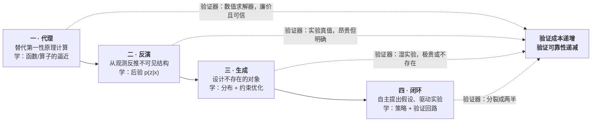
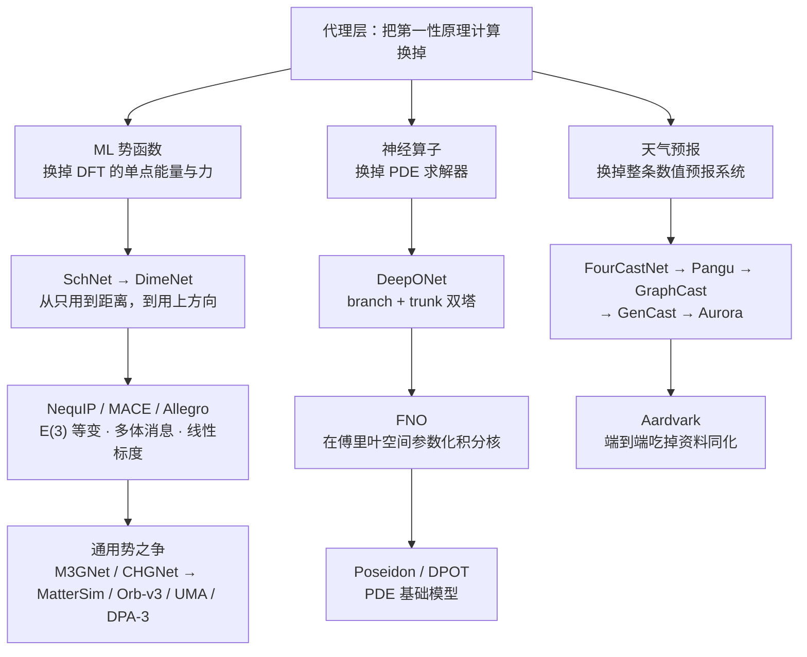
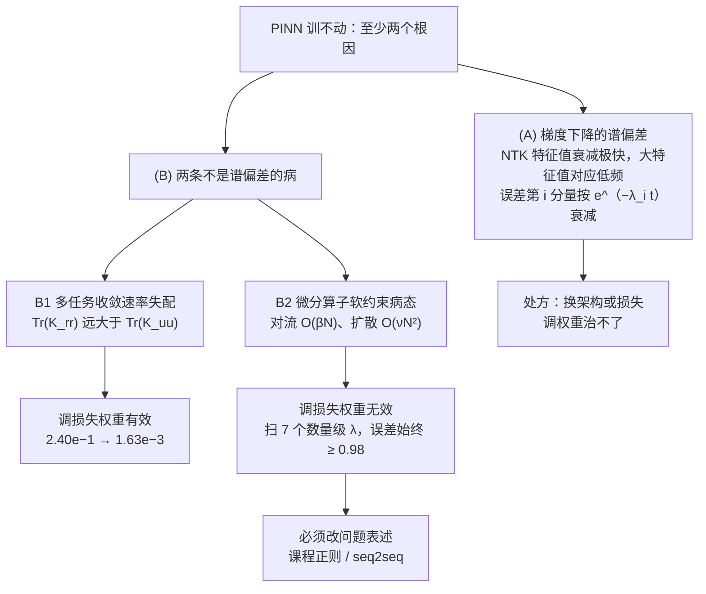
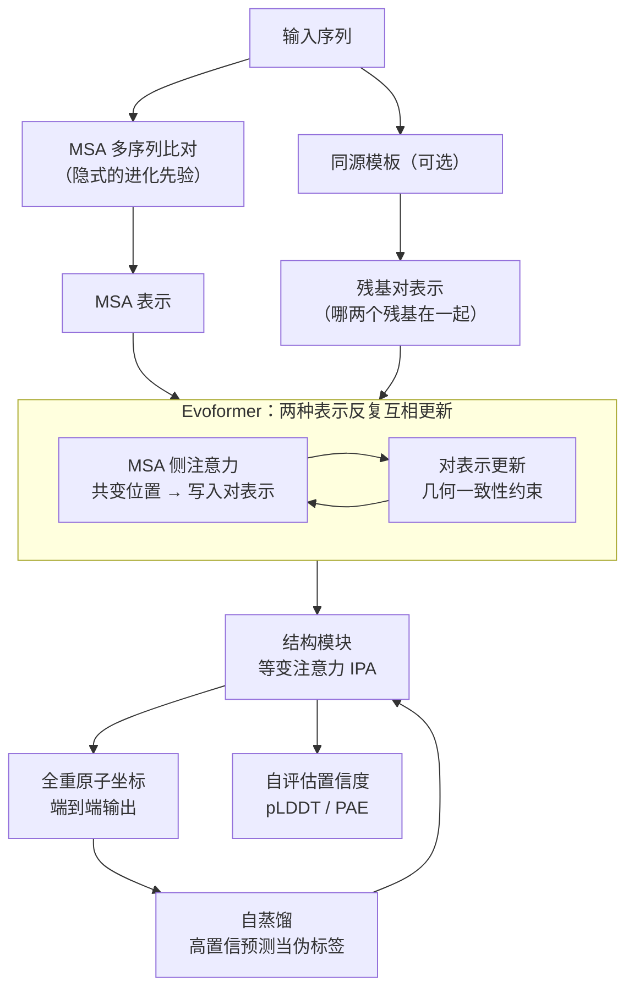
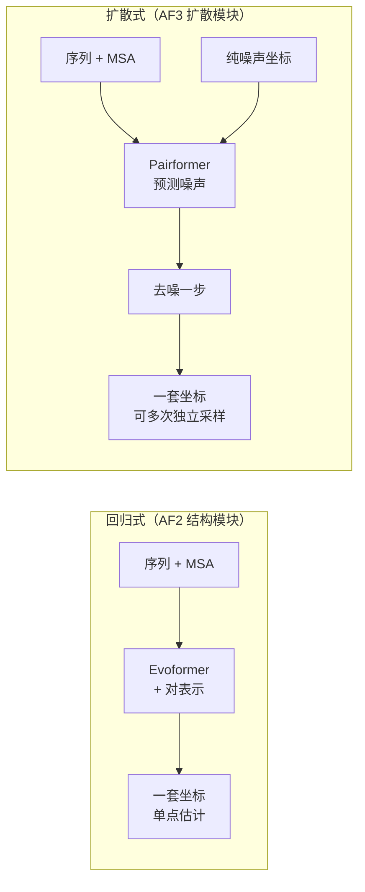
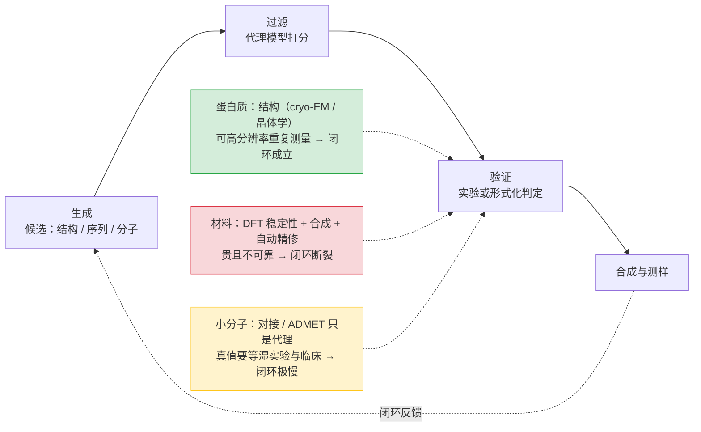
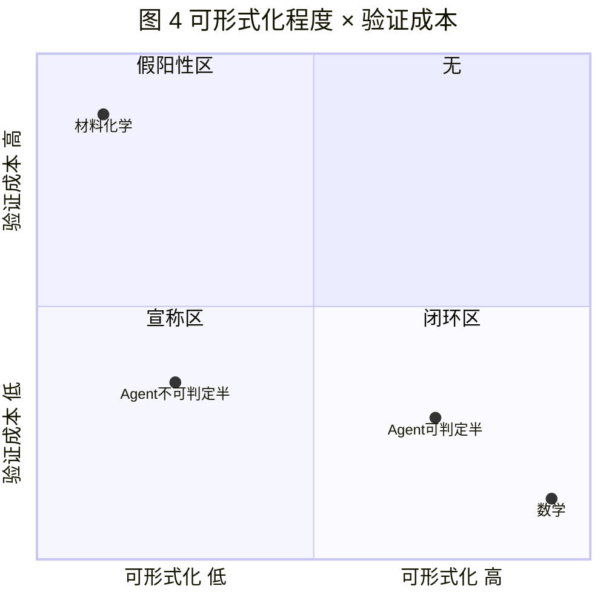
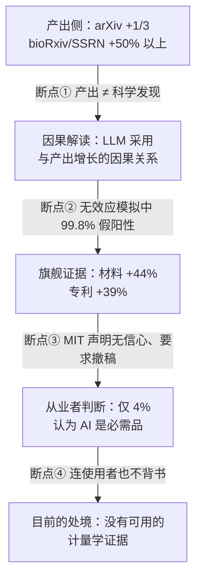

# AI for Science：从代理到闭环
[← 回到首页](..)

> **AI for Science: From Surrogate to Closed Loop**
>
> 覆盖 2017–2026，四层角色框架（代理 / 反演 / 生成 / 闭环），6 章
>
> 撰写于 2026 年 10 月

---

## 符号表

> 全篇共用一个符号表。同名异义的符号在各自所属层内分别列出，并标注「同名异义」。

### 判据与框架

| 符号 | 含义 | 首次出现 |
|------|------|---------|
| $f: x \mapsto y$ | 判别式预测学到的函数（函数/算子逼近） | §1.3 |
| $p(x)$、$p(x \mid c)$ | 生成式采样学到的分布与条件分布 | §1.3 |
| $\pi$ | 搜索与推理在解空间上学到的策略 | §1.3 |

### 代理层（§2）

| 符号 | 含义 | 首次出现 |
|------|------|---------|
| $N$ | 体系规模（原子数 / 自由度规模） | §1.2 |
| $O(N^3)$ | DFT 自洽求解的标度〔教科书级表述，非本章材料〕 | §2.1 |
| $E$ | 体系势能（对整体旋转/平移不变） | §2.2 |
| $F$ | 原子受力（对整体旋转等变） | §2.2 |
| $R$ | 三维旋转矩阵 | §2.2 |
| $v_t(x)$ | 神经算子第 $t$ 层的函数表示 | §2.3 |
| $\kappa(x,y)$ | 积分算子的核函数 | §2.3 |
| $R_\phi$ | FNO 在傅里叶空间参数化的核（参数 $\phi$） | §2.3 |
| $k_{\max}$ | 傅里叶层保留的截断模态数 | §2.3 |
| $u(x,t)$ | PDE 的解 | §2.4 |
| $r(x,\theta)$ | PDE 残差 $\mathcal{L}u - f$（网络参数 $\theta$） | §2.4 |
| $\mathcal{L}_b,\ \mathcal{L}_r$ | 边界/初值项与 PDE 残差项的损失 | §2.4 |
| $K_{uu},K_{rr},K_{ur}$ | PINN 的 NTK 分块矩阵 | §2.4 |
| $\lambda_i$ | NTK 的第 $i$ 个特征值 | §2.4 |
| $\lambda_b,\ \lambda_r$ | 边界项与残差项的损失权重 | §2.4 |
| $\mathrm{Tr}(K)$ | NTK 的迹（$=n\times$ 平均收敛速率） | §2.4 |
| $\beta,\ \nu,\ \rho$ | 对流 / 扩散 / 反应系数 | §2.4 |
| $k_x$ | 纬向波数 | §2.4 |
| $\mu(\theta)$ | 高频段谱正则项（FouRKS） | §2.5 |

### 反演层（§3）

| 符号 | 含义 | 首次出现 |
|------|------|---------|
| $\mathcal{A}$ | 正演算子：把隐结构映到可观测量 | §3.1 |
| $z$ | （§3 义）待反演的隐结构（坐标、构象、功能状态） | §3.1 |
| $y$ | （§3 义）观测量 | §3.1 |
| $x$ | （§3 义）输入观测 / 序列 | §3.3 |
| $\epsilon$ | 观测噪声 | §3.1 |
| $p(\mathbf{z} \mid \mathbf{x})$ | 反演层要逼近的条件后验 | §3.3 |
| GDT_TS | CASP 用的全局距离测试分数 | §3.0 |
| RMSD95 | 在 95% 原子对上取的中位骨架误差（Å） | §3.0 |
| MSA | multiple sequence alignment，多序列比对 | §3.2 |
| $N_{\text{MSA}}$ | MSA 深度（比对中的同源序列条数） | §3.2 |
| IPA | invariant point attention，等变注意力 | §3.2 |
| pLDDT | 每个残基的置信度（0–100） | §3.2 |
| PAE | predicted aligned error，残基对相对位置误差 | §3.2 |
| TM-score | 结构相似度（0–1） | §3.6 |
| IDR | intrinsically disordered region，内在无序区 | §3.6 |
| CALVADOS | 针对 SAXS/NMR 数据做数据驱动参数化的粗粒化系综模型 | §3.6 |

### 生成层（§4）

| 符号 | 含义 | 首次出现 |
|------|------|---------|
| $x$ | （§4 义）候选对象（晶体结构 / 蛋白序列 / 分子）**同名异义，见 §3** | §4.1 |
| $y$ | （§4 义）观测（反演层的输入）**同名异义，见 §3** | §4.1 |
| $z$ | （§4 义）不可见的潜结构（反演层的目标）**同名异义，见 §3** | §4.1 |
| $y^{*}$ | 设计想要达到的目标性质 | §4.1 |
| $f(x)$ | 目标性质函数（待最大化；通常是另一个模型） | §4.1 |
| $\mathcal{X}_{\text{feasible}}$ | 可行集：真的能造出来的对象集合 | §4.1 |
| $p(x \mid y^{*})$ | 条件生成分布 | §4.1 |
| $x^{*}$ | 约束优化的解 | §4.1 |

### 闭环层（§5）

| 符号 | 含义 | 首次出现 |
|------|------|---------|
| $V$ | 验证器：判定一项产出是否成立的程序、模型或人（或三者的组合） | §5.1 |
| $\Phi$ | 被验证属性的可形式化程度：存在一个有限步、可机械执行且完备的判定过程的程度 | §5.1 |
| $C_V$ | 验证成本：验证一次产出所需的资源（时间、人力、金钱） | §5.1 |
| $\mathrm{Rel}(V)$ | 验证器的可靠性：其判定与真值一致的程度 | §5.1 |
| $A_{\max}$ | 自主程度的天花板：无需人类介入时可完成的科学活动比例上界 | §5.1 |
| $R_{\mathrm{wp}}$ | Rietveld 精修的加权剖面因子（拟合优度统计量） | §5.3 |

### 横切层（§6）

| 符号 | 含义 | 首次出现 |
|------|------|---------|
| $\text{Det}_i(t)$ | 论文 $i$ 在月份 $t$ 是否被检出 LLM 辅助，取值 0/1（本文对 Renault 等处理定义的符号化） | §6.4 |
| $t^{\text{det}}_i$ | 论文 $i$ 的「首次被检出 LLM 辅助」月份，即其事件研究处理时点 | §6.4 |

---

## 主线总览

```
"当 AI 开始产出科学对象时，我们用什么来判断产出的东西是不是真的？"

范式 (2017–2026)  §1
│  GNoME 的 220 万 → 38.1 万 → 736：生成端与验证端的成本差。
│  AI for Science 不是一个领域，是四个验证处境完全不同的领域。
│  判据：数据是否充足？验证是否廉价可靠？
│  痛点：这两条轴上的证据本身就是分裂的——化学标度律报出 0.17/0.26，
│        单细胞却把预训练数据扩 40 倍而无稳定增益。证据在什么条件下得到？
│
├──→ 代理 (2017–2026)  §2
│    替代第一性原理计算。学的是函数与算子的逼近。
│    验证器是数值求解器：可无限生成样本，廉价且可信。
│    GraphCast 在 90% 检验目标上超过业务数值模式；GenCast 推到 97.2%。
│    痛点：指标好看不等于物理正确。ACC 仍在 0.90 以上时，小尺度能谱已经错了；
│          同一个症状有三种各有第一方原文的归因——谱偏差 / 误差传播加非收敛积分 /
│          MSE 回归均值。三种归因，三个处方，没有一个是"再训久一点"。
│
├──→ 反演 (2018–2026)  §3
│    从观测反推不可见结构。学的是后验 p(z|x)。
│    验证器是实验结构：明确、可信，但昂贵，而且没有第二次机会。
│    AlphaFold 把多解的逆问题压成了单一答案。
│    痛点：输出是静态结构，功能却常存在于构象系综里；外圈更糟——
│          约 90% 下游论文没正确过滤训练集，改用无同源基准后阈值从 0.89 掉到 0.69。
│
├──→ 生成 (2020–2026)  §4
│    设计不存在的对象。学的是分布加约束优化。
│    验证器是湿实验：极贵，或在当下根本不存在。
│    蛋白质设计有湿实验闭环，于是成了扩散模型在科学里最成功的应用。
│    痛点：生成能力与验证成本成反比。哪里最容易造出东西，
│          哪里就最难知道造出来的东西算不算数——GNoME 220 万落到 736，
│          MatterGen 唯一被合成的样品就在训练集里。
│
├──→ 闭环 (2021–2026)  §5
│    自主提出假设、驱动实验。学的是策略加验证回路。
│    验证器分裂成两半：可机械核对的那一半测得准，另一半测不准。
│    痛点：宣称强度与验证器的可形式化程度成反比。数学可完全形式判定，
│          是唯一真正做到闭环产生新知的一档；化学材料自动化了却不可形式判定；
│          科研 agent 的验证器只覆盖一半。而宣称最多的恰是最后一档。
│
└──→ 横切 (2017–2026)  §6
     AI 自身进入科研系统的四个环：算力分布、数据来源、产出、评审。
     证据链自外向内逐环收紧：算力可度量、数据可测、产出已有硬数字、评审最弱。
     痛点：经验性批评随工程进展而失效；唯有从可计算性与逻辑复杂度出发的论证不参与这场赛跑。
```

---

## 引子

2023 年 11 月，DeepMind 在《自然》上报告了 GNoME。新闻稿给出的数字是 **220 万**。

一个图神经网络生成了 220 万个"位于凸包以下"的晶体结构——凸包以下是热力学说法，意思是这些结构在能量上比已知的同类更稳定，因而**有可能**被合成出来。其中 38.1 万个被判定为稳定。而人类此前已知的稳定无机晶体大约 4.8 万种。这是号称一个数量级的扩张。"材料科学的 AlphaFold 时刻"，报道这样写。

五个月后，两位材料化学家 Cheetham 与 Seshadri 做了一件很小的事：从那个数据库的 384,870 条记录里随机抽 10 条，逐条去 ICSD（无机晶体结构数据库）里查。他们写下的第一句结论是：

> "We were able to identify the structure of **every one of the 10** Stable Structure entries in the ICSD database, albeit usually with a space group of **higher symmetry** than that in the AI database."

10 条全都查到了对应物，而且**实验测得的对称性通常更高**——自然界里早就有的结构，在计算里被"降格"成了低对称性的版本。他们的判定写在《Chemistry of Materials》上：GNoME"报告的不是任何新材料，而是一批被提议的化合物"。

值得一提的是，这篇批评并非全盘否定。10 条抽样里有一条查到了 Frank–Kasper σ 相，作者对此写下："It is indeed impressive that the predictive approaches can identify new compositions in this structure space."（预测方法能在这一结构空间中识别出新的**成分**，确实令人印象深刻。）**问题从来不在方法能不能跑，而在跑出来的东西算不算数。**

那 220 万个候选里，能与已被独立实验实现的结构对上号的，是 **736** 条。

220 万 → 38.1 万 → 736。三个数字出自同一篇论文，彼此相差三个数量级。

这个落差是本文的起点。但它不是一次孤立的失误，也不是某一家公司的诚信问题——GNoME 的方法内核在批评者那里是得到明确肯定的。它是一**种形状**，本文会反复遇到：**AI 系统产出的对象数量，比能被验证的数量高出若干个数量级，而在传播中通常只有第一个数字活下来。**

同样的形状在别处出现。A-Lab 在 17 天里自主合成了 58 个目标中的 41 个"新化合物"，一年半后官方更正为 36 个，并删掉了"新"字。一篇被两位诺奖级经济学家背书、被全球媒体当作"AI 加速科学"标准引据的论文（该文声称 AI 使材料发现提升 44%），在五个月后被其所属机构公开声明对数据来源与真实性"没有信心"——**它在这里不是证据，是案例。**一个通过了真实人类双盲评审的 AI 生成论文，被作者自家的代码复审发现训练集与测试集有约 57% 重叠，而三位人类审稿人给出的分数是 6/7/6。

这些案例指向同一个问题：**当 AI 开始产出科学对象时，我们用什么来判断产出的东西是不是真的？**

本文的答案分四层展开。我们不去按学科罗列（"生物一章、材料一章"），而是按 **AI 替代了科学活动中的哪一个环节** 来分层——每一层学的东西在数学上是不同的对象，而对验证的依赖逐层加重：



本文的中心论断在 §5 给出，这里先摆出来：**AI for Science 的宣称强度，与该领域验证器的可形式化程度成反比。** 一个领域的 AI 成果有多容易被验证，和它的宣传口号有多响，是两件方向相反的事。

这四层不是能力的阶梯，而是**证据强度的逆序**。读完本文，你应该能对一个 AI for Science 的新闻标题做出快速的定位：它属于哪一层，它的验证器是什么，因此它值得信几分。

---

## 1. 范式：为什么这次不同

### 1.0 问题引入

引子里那三个数字——220 万、38.1 万、736——出自同一个数据库。**它们之间的差距不是计算误差，而是"生成"与"验证"这两种活动的成本差距。**

这就引出了本文要一直追问的东西：AI 进入科学，改变的是生成端还是验证端？

先看一组更宏观的数字。据《自然》2023 年 9 月的社论，Scopus 中含 AI 关键词的论文比例**十年间从 2% 升到了 8%**——翻了四倍。同一系列做了一次 1600 名研究者的调查：约三分之二的人说 AI 加快了数据处理，58% 说 AI 让原本不可行的计算变得可行，55% 说它节省了时间和经费。

但同一个调查里还有两个数字：**只有 4% 的受访者认为 AI 工具当前是"必需品"**；**69% 的人担心科学家会"依赖模式识别而非深层理解"**。

用得很开心，但不太信任。**在一个已经被宣布"重塑"了的领域里，为什么使用者自己的信心这么低？**

本章不回答这个问题——它把它变成一套坐标。我们要建立的是全篇的公共语言：科学发现的范式谱系（§1.1）、科学问题为何对机器友好（§1.2）、三条技术路线各自的数学对象（§1.3），以及一条贯穿后面四章的判据（§1.4）。

### 1.1 科学发现范式的谱系

Jim Gray 在 2007 年提出了科学研究的"第四范式"：实验、理论、计算、数据驱动。前三个都好理解——做实验、写方程、跑数值模拟。第四个的意思是：**当数据量超过某个规模，直接从数据里找模式，而不必先写下机理。**

AI for Science 通常被称作"第五范式"。这个说法值得怀疑。它更像是第四范式的一次工程升级——真正变的不是"从数据里学"这件事，而是**可微分的参数化**：过去我们从数据里拟合的是低维的、有名字的模型（幂律、Arrhenius 关系），现在我们拟合的是几十亿参数的神经网络。

这个区别有实际后果。低维模型拟合出来，你能读出系数、知道它在哪里失效；高维网络拟合出来，你得到的是**预测能力**，不是**机理**。本综述 §6 会把这件事讲透——它正是"AI 有没有产生科学理解"这场争论的核心。

领域自己给出的坐标系，是 Wang 等 26 位作者（含 Bengio、Zitnik）2023 年发在《自然》上的那篇综述。它把 AI for Science 拆成四个维度：

| 维度 | 做什么 |
|------|--------|
| 数据采集与标注 | 把实验/观测变成可训练的样本 |
| 表征学习 | 把对象编码成向量 |
| 假设生成 | 从表征里提出候选 |
| AI 驱动的实验与仿真 | 让模型参与实验设计或数值模拟本身 |

**这个坐标系是本文的公共接口，不是本文的结论。** 它的价值在于：所有讨论 AI for Science 的人都在用这套术语，因此批判只有定位到它说的哪一维、漏了哪一维，才是可对话的。

> **一处已回原文核实的细节，值得留在正文里。** 写作期的二手材料对这份综述的记载自相矛盾：一处说它的挑战清单包含"评测"，另一处说不含。回原文核对后结论是**不含**——该综述的 "Grand challenges" 只分三类（Practical considerations / Advancing AI algorithms / Scientific enterprise），evaluation 不在其中。矛盾的来源也找到了：文中确有一节标题带 evaluation，叫 **“Efficient evaluation of scientific hypotheses”**，但它属于"AI 辅助实验与仿真"那一章，讲的是**用 AI 设计实验去检验科学假说**——是"评测假说"，不是"评测 AI 模型"。**同一个词的两层意思，恰好就是 §6 要区分的那件事**：把 evaluation 当作一个话题，与识别出泄漏和不可复现已构成结构性危机，是两回事。
>
> 〔核实口径：可公开获取的是作者接受稿全文（MIT DSpace 绿色 OA）与付费版免费摘要，二者在"挑战清单不含评测"上一致；付费排版版正文未能直接读到。〕

### 1.2 科学问题对机器友好的共同结构

五个学科看起来毫不相干，但能被深度学习攻下的那些问题，往往共享四件事：

**一、高维但低内在维度。** 一个蛋白质有几万个原子，但构象空间的有效自由度远小于 $3N$。一个材料有无数种元素组合，但稳定结构只落在相图的少数区域里。深度学习擅长的是找到这个低维流形。

**二、有对称性，而且对称性是已知的。** 这是科学 ML 与自然图像 ML 最大的不同。图像里的平移不变性要靠数据学出来，而分子的旋转平移等变性、晶体的空间群、物理方程的守恒律，**都是先验已知的**。于是架构可以把这个先验写死进去——这就是等变网络（equivariant network）的由来。§2.2 会说明为什么在机器学习势函数里，等变性是**必须的而不是加分项**：不是"这样更准"，而是"不这样就学不动"。

**三、受物理约束。** 能量守恒、热力学第二定律、边界条件——这些不是数据里统计出来的，是必须满足的。把约束写成损失项是最直接的做法，而 §2.4 会展示这条路线的两种典型失败。

**四、有海量弱标注数据，或有一个廉价的高精度数据源。** 这一条是本文第一条判据的核心，下一节展开。

### 1.3 三条技术路线与它们的数学

AI for Science 的做法看起来五花八门，但收敛到三个数学对象上：

| 路线 | 学的是什么 | 典型问题 | 本文对应 |
|------|-----------|---------|---------|
| **判别式预测** | 一个函数 $f: x \mapsto y$ | 这个结构能量多少？这个序列折叠成什么形状？ | §2 代理、§3 反演 |
| **生成式采样** | 一个分布 $p(x)$ 或条件分布 $p(x \mid c)$ | 给我一个满足这些约束的蛋白质/晶体/分子 | §4 生成 |
| **搜索与推理** | 在解空间上的策略 $\pi$ | 下一步做什么实验？这个猜想怎么证？ | §5 闭环 |

三者的**验证难度截然不同**，这是本文分层的依据：

- 判别式预测的输出是一个**数或一个结构**，可以和实验真值直接比。验证便宜。
- 生成式采样的输出是**一个对象**，问题从"对不对"变成"好不好"——而"好"往往没有判定器。验证昂贵。
- 搜索与推理的输出是**一串动作**，验证要等动作执行完、结果回来。验证最贵，而且**常常做不了**——因为真实的实验没有第二次机会。

这三条难度的跃升，就是本文从 §2 走到 §5 的路径。

### 1.4 本文的判据：两条轴

后面每一章，我们都会用同样两个问题去衡量那一层：

**轴一：数据是否充足？** 具体到可证伪的形式是：**把预训练数据扩大 10 倍，下游性能是否提升？**

这条轴上的证据是分裂的，而且分裂得很干净：

| 立场 | 证据 | 结果 |
|------|------|------|
| **正面** | Frey 等在化学语言模型与等变图神经网络势上做规模扫描（>10 亿参数、约 1000 万数据点） | 报告幂律指数约 **0.17**（化学语言模型）与 **0.26**（等变 GNN 势），认为标度律在化学中成立 |
| **反面** | Kedzierska 等在单细胞上做零样本评测 | scGPT / Geneformer **常常打不过** HVG、scVI、Harmony 等简单基线；把预训练数据从 **81.4 万**扩到 **3300 万**细胞**并未带来稳定增益**（scGPT-human 甚至略逊于 scGPT-blood） |

两者不矛盾的可能解释是"架构与预训练目标是否匹配领域结构"——但这个解释尚未被直接实验检验。**注意反面证据给出的归因**：不是"数据不够"，而是"架构和目标错了"。这比"数据不够"更难接受，也更有用。

**轴二：验证是否廉价可靠？** 这条轴是本文的主线，从 §2.7 开始逐章收紧，到 §5.5 收束成一个论断。

### 1.5 痛点总结

本章建立了三样东西：一张公共坐标系（§1.1 的四维框架）、一个分层依据（§1.3 三种数学对象的验证难度跃升）、两条判据（§1.4）。

它们合起来指向一个判断：**AI for Science 不是一个领域，而是四个验证处境完全不同的领域。** 把它们当成一件事讨论，是当前绝大多数争论失焦的原因——"AI 能不能做科学"这个问题没有统一答案，因为在代理层答案接近"能"，在闭环层答案接近"还不知道怎么判断"。

| 层 | 数据充足度 | 验证成本 | 本层的核心张力 |
|----|-----------|---------|--------------|
| 一 · 代理 | 高（数值求解器可无限生成） | 低 | 指标好看是否等于物理正确 |
| 二 · 反演 | 中（实验真值昂贵） | 中 | 单一答案是否覆盖了真实的多样性 |
| 三 · 生成 | 中 | 高 | 生成的东西能不能造出来 |
| 四 · 闭环 | 低 | 极高或不存在 | 宣称与证据的落差 |

后面四章逐层展开，每一章都会回到同一个问题上：**这一层的验证器是什么，它可靠吗。**

> **主线节点 1。** 本章没有证明任何一项技术的好坏，它建立的是一套坐标：AI for Science 不是一个领域，而是四个验证处境完全不同的领域（§1.3 三种数学对象带来的验证难度跃升），可用"数据是否充足"与"验证是否廉价可靠"这两条轴去衡量（§1.4）。**留下的根本问题是：这两条轴上的证据本身是分裂的**——同一条数据轴上，化学语言模型报告出约 0.17 / 0.26 的幂律指数，而单细胞基础模型把预训练数据从 81.4 万扩到 3300 万细胞却没有稳定增益。所以后面每一层都必须在两个问题之外再问第三个：**这一层给出的证据，是在什么条件下得到的？** 这个问题由 §6 统一接手。

---

## 2. 代理：把第一性原理计算换掉

### 2.0 问题引入

§1.4 给了贯穿全篇的两条轴：一个领域的 AI 进展速度，取决于**数据是否充足**、**验证是否廉价**。代理层是这两条同时占优的第一层——因为它手里有一件后面三层都没有的东西：**一个廉价、可靠、可以无限次调用的真值生成器，也就是数值求解器。**

先看一笔账。Meta FAIR 训练通用势函数 UMA 用的数据集 OMol25，包含 1 亿条以上的 DFT 计算，约合 **60 亿 CPU 核时**。这笔开销换来的是一个宣称比 DFT 快约 **10,000 倍**的模型。同样的量级变化出现在天气预报：Pangu-Weather 在单个 GPU 上 1.4 秒出一次 5 天预报，论文自报比业务 IFS 快一万倍以上；它赢下的指标是 5 天 500 hPa 位势高度（Z500）的 RMSE（越低越好）——**296.7**，对照业务 ECMWF IFS 的 333.7，而一年前同赛道的 FourCastNet 还是 462.5。

**如果第一性原理计算是不可承受的昂贵环节，能不能用神经网络把它整个换掉，而且换得足够准？**

这一章沿三条支线回答：机器学习势函数（§2.2）、算子学习（§2.3）、以天气预报为旗舰案例（§2.5）。中间夹着本章第一个批判点——PINN 为什么训不动（§2.4）。三条支线的成功条件在 §2.7 汇总，它们会指向一个比"准不准"更难回答的问题：**指标赢了，物理就对了吗？**

### 2.1 问题的形状：为什么第一性原理计算这么贵

代理层要替换的到底是什么？这里有一个容易忽略的事实：**第一性原理计算不是一个点，而是一整条精度-成本的谱系，而且它自己就是近似。**

谱系的一端是密度泛函理论（Density Functional Theory, DFT），另一端是耦合簇（CCSD(T)）与全组态相互作用。DFT 之所以成为默认工具，是因为它把多体电子问题压缩成关于电子密度的自洽方程，代价是引入一个未知的交换关联泛函，必须近似。

成本有两个面，而且是相乘的。

**（一）单次求解的成本。** DFT 自洽求解在标准实现下的标度约为 $O(N^3)$，$N$ 为体系规模〔此标度为教科书级表述，不在本章材料文件内，见文末「本章存疑」〕。**（二）需要求解的次数。** 分子动力学（Molecular Dynamics, MD）要积分数百万个时间步，每个时间步都要重算所有原子的受力；而稳定积分要求时间步长小于体系中最快的振动周期〔同上，教科书级表述〕。

两个因子相乘，就是"不可承受"的来源。可核的数字是：UMA 的训练集 OMol25 有 1 亿条以上的 DFT 计算、约 60 亿 CPU 核时；而高通量数据库（如材料基因组计划 MGI 支持下的 Materials Project，2011 年 6 月启动）花了十多年，才积累出数十万条无机化合物的结构与性质——后面 M3GNet / CHGNet / GNoME 的训练集与"凸包"参照系都来自这里。

机器学习在这条谱系上有两个完全不同的介入位置，值得分开看。

**替代它**：学一个便宜得多的映射去逼近 DFT 的输出。这是本章的主线。**改进它**：用神经网络去拟合交换关联泛函本身。DM21 用「精确分子数据 + 虚构的分数电荷/分数自旋体系约束」训练，在 DNA 碱基对电荷离域、压缩氢链磁性、双自由基反应能垒等案例上给出优于 B3LYP 的行为。这是把机器学习从"拟合能量"提升到"改进理论"。不过它随即引来同行质疑：Gaiduk 等在 *Science* 发表 Comment，指出其许多测试体系与训练样例过于相似，泛化结论不能由已发表证据推出。

还有第三条更彻底的路：**FermiNet** 直接用神经网络构造反对称的多体波函数，以变分蒙特卡洛最小化能量。它不要任何外部训练数据，也**没有基组误差**，在 N₂ 解离曲线上精度显著优于长期被视为最可靠可用方法的 CCSD(T)。这条线学的是"表示"而不是"预测"，§2.6 会再碰到它。

于是代理层的问题形状清楚了：**把一次次昂贵的第一性原理求解，换成一个训练一次、之后极便宜的前向计算。** 下面三条支线替换的对象不同。



### 2.2 机器学习势函数：等变性为什么是必须的

先给一个反直觉的数字。NequIP（2022）宣称：达到同等精度所需的训练数据，可以比此前的模型**少三个数量级**。

这句话针对的是「深度网络必须大数据」这个成见。它凭什么？凭的是等变性（equivariance）。要理解这条路，得从 SchNet 与 DimeNet 的差别说起。

**只用距离，还是用上方向。** SchNet（NeurIPS 2017）用「连续滤波卷积」让神经网络直接在非网格的原子坐标上建模量子相互作用。DimeNet（ICLR 2020）指出这不够：**方向很重要**。它把消息而非原子嵌入到带方向的表示里，用球贝塞尔基与球谐函数构造旋转等变的消息传递。DimeNet 给了两个极有教学价值的消融数字——忽略消息间夹角，误差升 26%；用节点嵌入替掉消息嵌入，误差升 68%。一句话记住它的结论：**只用距离的 GNN，无法区分一个六元环与两个三元环。** 而它的参数量还不到常见 GNN 的四分之一。

**等变性是必须的，不是加分项。** 物理上，势能 $E$ 对体系的整体旋转与平移不变，而原子受力 $F$ 对旋转等变——旋转坐标系，力矢量跟着转：

$$E(R\mathbf{r}) = E(\mathbf{r}), \qquad F(R\mathbf{r}) = R\,F(\mathbf{r})$$

把这条对称性写进网络结构，等于免费送给模型一个先验：它不必再从数据里学"旋转不该改变能量"这件事。NequIP（Nature Communications 2022）的做法是不再用标量不变量、而是用相对位置向量驱动 $E(3)$ 等变卷积，让内部特征随旋转而旋转，从而把角度信息直接喂给旋转等变滤波器。那"少三个数量级数据"的结论，就是这条设计换来的。

此后这条线一路加码。MACE（NeurIPS 2022）引入**高阶（多体）消息**：把消息按体序层级展开，用自相互作用高效参数化张量积，绕开三体特征的指数爆炸——用四体消息时只需一层消息传递。它顺带澄清了表达力来自哪里：**多体消息会改变学习曲线的幂律指数，而仅仅加等变消息只是平移曲线。** Allegro（Nature Communications 2023）则放弃以原子为中心的消息传递，改用严格局部等变表示加迭代张量积，在保持精度的同时获得线性可扩展性，展示了 1 亿原子的并行分子动力学模拟；也正因不靠消息传递，其分布外泛化显著优于同类局部模型。

**从专用势到通用势。** 上面这些模型都要为每个体系单独训练。M3GNet 与 CHGNet 把这件事推到了"一个模型覆盖全周期表"：M3GNet 在 Materials Project 十年弛豫数据（62,783 个化合物、89 种元素）上训练，并证明能量、力、应力必须**联合**训练才好用（0.035 eV/atom、0.072 eV/Å、0.41 GPa）。CHGNet 引入**磁矩**作显式监督信号，让势函数同时刻画原子与电子自由度——这是纯能量模型学不到的。

2024–2025 年，四条路线开始争夺「原子模拟的基座模型」。MatterSim 主打 0–5000 K、1000 GPa 的宽温压；Orb-v3 用「非等变、非保守也能准」的架构换 10 倍以上的延迟下降；UMA 用混合线性专家在 OMol25（1 亿+ DFT 计算、83 元素、约 60 亿 CPU 核时）上做多任务训练，宣称比 DFT 快约 10,000 倍；DPA-3 宣称泛化误差服从缩放律。争议集中在三处：（a）等变性与能量守恒是不是必需品（Orb-v3 的 direct / non-equivariant 变体给出反例）；（b）多任务、多保真能否用规模换掉微调（UMA 与 DPA-3 都声称零样本即用）；（c）谁真的领先——2025 年 Matbench Discovery 榜上 eqV2 M（F1 **0.917**）居首，MACE-MPA-0 0.852、GNoME 0.829；而该基准可达到的发现加速因子上限 DAF ≈ 6.5，最好的模型也只到 6.33。

**批判：通用势系统性偏软。** 这篇文章（*npj Computational Materials*，2025；在线 2024-12）的结论很硬：M3GNet、CHGNet、MACE-MP-0 三个主流通用势，在分布外复杂环境下**一律系统性低估能量与力**，也就是势能面被"软化"了。根源是预训练数据对近平衡构型的采样偏置，导致曲率被低估；表面、缺陷、固溶体能量学、离子迁移势垒、声子模式、高能态全部命中。作者同时给了乐观的一面——这些误差高度系统化，可用少量微调高效校正。它也是 Matbench Discovery 那类基准的方法论补充：**单看回归误差，会掩盖分类任务上的高假阳性率。**

### 2.3 算子学习：学的是"函数到函数的映射"

FNO 的承诺是这样的：一组参数训练一次，低分辨率训练、**高分辨率直接评测**。

这条线的起点是 DeepONet（2019 预印本 / 2021 期刊版）。它把"算子万能逼近定理"（单隐层网络可逼近任意非线性连续算子）落地为双塔结构：**branch net 编码输入函数，trunk net 编码输出坐标**。branch/trunk 解耦是整个领域后续所有架构的分母。论文在 16 个应用上验证，并给出泛化误差随传感器数量的高阶收敛（0.5 阶到 4 阶，甚至指数收敛）。

2023 年那篇 97 页的《Neural Operator》统一了这条线：DeepONet、GNO、FNO 都可以写成同一个迭代结构——核积分算子加非线性激活：

$$v_{t+1}(x) = \sigma\Big(W v_t(x) + \int_D \kappa(x,y)\, v_t(y)\, dy\Big)$$

**FNO（ICLR 2021）的关键一步，是不去参数化核 $\kappa$，而是直接参数化它的傅里叶变换 $R_\phi$。** 先令 $\kappa(x,y) = \kappa(x-y)$（同时去掉对输入函数的依赖与施加平移不变性），核积分退化成卷积；由卷积定理，卷积等于在频域相乘：

$$(\mathcal{K}(\phi)v_t)(x) = \mathcal{F}^{-1}\big(R_\phi \cdot (\mathcal{F}v_t)\big)(x)$$

于是每一层只需做「FFT → 乘一组与空间位置无关的复权重 → 逆 FFT」。$R_\phi$ 只在 $k_{\max}$ 个低频谱模式上保留（1 维取 16，2 维取 12），内层乘法是 $O(k_{\max})$，主体开销在 FFT，整体 $O(n\log n)$。

这一手换来三件事同时成立。**（a）分辨率不变 + 零样本超分**：参数活在傅里叶空间，与离散化解耦——训练于 $64\times64\times20$，直接评测于 $256\times256\times80$，空间与时间**双**超分。**（b）首次在湍流区间 Navier–Stokes 上收敛。** **（c）比传统谱求解器快最多 3 个数量级**：256×256 上前向约 0.005 s，伪谱法 2.2 s。精度上也压得住：相对最好的 baseline，Burgers 低 30%、Darcy 低 60%、Navier–Stokes 低 30%。

这里有一个反直觉的机制，也是 FNO 论文最得意的展示：**每层只保留 $k_{\max}$ 个参数化模式，并不意味着 FNO 只能逼近 $k_{\max}$ 个模式**——层间的激活函数与解码网络会把高频模态重新生成出来。定量证据：把 $\nu=10^{-3}$ 的 Navier–Stokes 解在 20 个傅里叶模式下截断，误差约 2%；而 FNO 只用 12 个参数化模式，就把整个参数化依赖学到了 ≤ 1% 的误差。

⚠️ 请记住这一点，它下面马上要用到：**FNO 把"能恢复高频模态"当作卖点，不是失败点。** 谁要说"神经算子受谱偏差之苦"，不能引 FNO 原文——那会把论文读反。理论侧也漂亮：Kovachki、Lanthaler、Mishra（JMLR 2021）证明了 FNO 的万能性，并给出显式误差界——网络规模随 $1/\varepsilon$ 只呈对数/多项式增长，而一般算子的最坏情况是指数。

基础模型这条支线也长起来了。Poseidon（NeurIPS 2024）给出当前最硬的数据效率数字：**中位数上只需约 20 个样本，就能达到 FNO 用 1024 个样本的误差水平（约 50× 数据效率）**，15 个下游任务里有 9 个是预训练未见过的 PDE 类型。DPOT（ICML 2024）走自回归去噪预训练，在 PDEBench 等基准上误差最多降低 52%。两者把同一个问题推上台面：**科学基础模型的迁移性，到底来自物理，还是来自数据规模？**

**批判：零样本超分被证明"不是免费的"。** Sakarvadia 等（arXiv:2510.06646, ICLR 2026）实测证明机器学习算子在零样本多分辨率推断上失败，表现为**混叠（aliasing）**这一形式的分布外失效，覆盖 Darcy、Burgers、Navier–Stokes；作者提出的补救是"多分辨率训练"，但这已经破坏了零样本范式本身。它的姊妹篇（arXiv:2606.00296）给出更强的不可能性定理：对一类秩一线性算子，训练网格上可以零误差学得算子，但任意只在粗网格上观测输出的估计器，细网格上的期望测试误差下界为 $(a^2/4)(1-1/m)$，**即使样本量趋于无穷也不为零**，且不假设估计器线性〔定理内容未逐字核实，见文末「本章存疑」〕；只有在 Hölder 正则性 $C^{0,\alpha}$ 假设下超分辨才重新可达。另有一篇用 750 个模型在 5 类 PDE 上压力测试的工作（arXiv:2601.11428, TMLR），结论是"分布内精度高并不能可靠预测鲁棒性"。

这一组结果的教学价值在于把两个概念切开了：**分辨率不变性是架构层面的性质，泛化能力是统计层面的性质，两者被长期混为一谈。** 同时要注意归类——这是混叠与分布外泛化问题，**不是谱偏差**（后者是梯度下降的优化偏差，见 §2.4）；把两者混引，会和本节刚下的定义自相矛盾。

### 2.4 PINN 与它的失败：不是一个根因，而是至少两个

PINN（Physics-Informed Neural Network，物理知情神经网络）走的是与算子学习相反的路：它不学算子族，它解**单个实例**。

Raissi、Perdikaris、Karniadakis（2019）的做法是把 PDE 残差作为**软约束**写进损失函数，用自动微分求导，从而无需网格。损失写成两项之和：

$$\mathcal{L}(\theta) = \mathcal{L}_b(\theta) + \mathcal{L}_r(\theta)$$

其中 $\mathcal{L}_b$ 拟合边界/初值条件，$\mathcal{L}_r$ 惩罚 PDE 残差 $r(x,\theta) := \mathcal{L}u(x,\theta) - f(x)$。注意：写成加号本身就是"把物理当成一项软正则"，这里还没有权重超参。

与 §2.3 对照，两条路线的差别是结构性的：PINN 学单个实例、每换一组参数就重训一次、且必须已知 PDE；算子学习学整个算子族、训一次、任意实例前向一次、只需数据。FNO 论文的原话是 PINN 类方法 "computationally expensive... impractical for applications where a solution to the PDE is required for many different instances of the parameter"。

PINN 也是被批评得最集中的靶子。在"高频/小尺度学不好"这条批判线上，它是**腿 1**（§2.4 末的腿 2 是算子，§2.5 的腿 3 是天气）。而它被批评的方式本身就是一个方法论教训：**过去几年流行把它的失败归到一个根因上，而这个归因至少漏了一半。**

**(A) 梯度下降的谱偏差——这是第一方主张。** Wang、Yu、Perdikaris（JCP 2022）推导了 PINN 的神经正切核（Neural Tangent Kernel, NTK）。在无限宽极限下，PINN 的梯度下降等价于用确定核做核回归，而训练误差的第 $i$ 个分量按

$$e^{-\lambda_i t}$$

衰减，$\lambda_i$ 是 NTK 的特征值。对全连接网络，NTK 特征值衰减极快，且**大特征值对应的特征向量一般是低频的**：目标函数里落在"大特征值方向"上的成分学得快，**高频/小尺度分量学得极慢**。这就是谱偏差（spectral bias）。

关键的是，**"PINN 受谱偏差之苦"是这篇论文自己的主张，不是本综述的引申**：它的关键词栏里就写着 "Spectral bias"；§5 的标题直接叫 "Spectral bias in physics-informed neural networks"；贡献列表原文是 PINNs "not only suffer from spectral bias, but also from a remarkable discrepancy of convergence rate in the different components of their loss function"。可以放心引用。

**(B) 另外两条病——都不是"谱偏差"。** 同一篇 NTK 论文的**首要**诊断其实不是谱偏差，而是**多任务收敛速率失配（B1）**：边界/初值项对应的核块 $K_{uu}$ 与 PDE 残差项对应的核块 $K_{rr}$ 量级差出一到两个数量级，$\mathrm{Tr}(K_{rr}) \gg \mathrm{Tr}(K_{uu})$。后果是 **PDE 残差收敛远快于边界条件拟合**，网络于是收敛到"满足物理但不对应正确解"的状态。

另一条（B2）来自 Krishnapriyan 等（NeurIPS 2021），诊断更彻底：PINN 失败**不是网络表达能力不足**，而是"把微分算子当软正则项塞进损失"这件事本身让优化问题病态。该算子的条件数随物理系数与网格规模爆炸——**对流 $O(\beta N)$、扩散 $O(\nu N^2)$**（$L^2$ 损失下还要再平方），损失地形随之变得崎岖、非对称、出现坏局部极小。作者用课程正则做反证：网络**有**能力解出 vanilla PINN 失败的那些情形，所以这是优化问题，不是容量问题。

⚠️ 事实边界：该文全文 grep，**"spectral bias" 出现 0 次**。它在 Related work 里确实提到过"目标函数含高频特征"这一失败情形——但那是转述 NTK 那条线，**它自己的诊断与"谱"无关**。

**本节最锋利的一刀：两类失败的处方正好相反。**

| 病 | 调损失权重 $\lambda$ | 改问题表述 |
|---|---|---|
| **B1** 多任务收敛速率失配 | **有效**：NTK 篇的 $\lambda_b$ 扫描把 1 维 Poisson 的相对 $L^2$ 误差从 **2.40e−1** 降到 **1.63e−3** | — |
| **B2** 算子本身病态 | **无效**：Krishnapriyan 扫了 7 个数量级的 $\lambda$（1e−6 到 1e1），相对误差从 1.69 只降到 **0.982**，始终在 100% 量级 | **有效**：课程正则把 $\beta=20$ 的 **7.50e−1** 降到 **9.84e−3**；seq2seq 也能降 1–2 个数量级 |

> **这张对照表是本综述的归纳**——两篇论文合起来支持，但没有任何一篇单独这么说过。

**"调权重救不救得回来"，因此成了一个可操作的判别式。** 如果加大损失权重能把误差压下去，病在 B1，是配平问题；如果扫几个数量级都没用，病在 B2，问题本身需要重写——此时继续调损失超参是浪费算力，正确动作是改数学表述（课程正则、seq2seq）。

同一份 NTK 分析还留下两个负面事实：调权重**改变不了 NTK 特征值的分布**，所以它治不了 (A) 谱偏差（作者原话是 cannot directly resolve spectral bias，并把"用专门架构或损失函数解决谱偏差"明确列为开放问题）；而且权重法可能引入不定核（虚特征值），反而让训练不稳定。此外，经验上 **PINN 的 NTK 总是退化的**，所以不能随手把它当核回归来用。

**最好用的相变式判据。** Krishnapriyan 的 1 维对流实验里有一张表，比任何解释都直白（4 层全连接 × 50 神经元，tanh，L-BFGS，≥10 个随机种子平均）：

| 对流系数 $\beta$ | 1 | 10 | 20 | 30 | 40 |
|---|---|---|---|---|---|
| 相对误差 | 7.84e−3 | 1.08e−2 | **7.50e−1** | **8.97e−1** | **9.61e−1** |

$\beta$ 从 10 到 20，相对误差从 1.08e−2 跳到 7.50e−1——**约 70 倍**。不是精度慢慢变差，**是优化直接失灵**。临界点就在 $\beta \approx 10$ 附近：以下可用，以上崩塌。



**腿 2：神经算子的高频困难——锚点不是 FNO。** 那 §2.3 的算子学习呢？要把"神经算子也受谱偏差之苦"立起来，唯一站得住的锚点是 Chattopadhyay、Sun、Hassanzadeh 的 arXiv:2304.07029，而不是 FNO 原文。

该文全文 "spectral bias" 出现 **30 处**，§2.1 的标题就是 "A universal cause: Spectral bias"，并且**第一方对算子架构下过断言**：

> "It must be highlighted here, that all deep neural networks, including fully-connected [23], convolutional (this paper), **operator (this paper)**, transformer-based (this paper), and generative [26] suffer from this epistemic error in the form of spectral bias, wherein they fail to learn the high-wavenumber components of the signal that they are trained to predict."

注意括号里的 "(this paper)"——这一类架构是作者**自己测过**的，不是转述。被测对象是 FourCastNet（Vision Transformer + adaptive Fourier neural operator）。可引数字：FourCastNet "excellent prediction skill (ACC ≥ 0.99) up to 3 days, but the latitude-averaged instantaneous Fourier spectrum of predicted Z500 fails to capture the small-scale part of the true spectrum beyond $k_x \ge 100$"。

⚠️ 但有两条必须写清的边界，否则会被审稿打回：

1. **它说的是 FNO 在自回归天气模式里谱学不对，不是 FNO 作为一次性 PDE 求解器受谱偏差之苦。** 后者与 §2.3 里 FNO 论文自己的谱分析（截断 20 模式 ≈ 2% 误差、$k_{\max}=12$ 学到 ≤ 1%）**直接冲突**。原文明说该偏差被 "further amplified during autoregressive prediction due to error propagation through non-convergent integration schemes"。
2. **它自称是两个机制叠加**：正文写 "This combination of spectral bias and error propagation would affect all data-driven digital twins"。写成"唯一的根因"是过度简化。

⚠️ 还有一个**结构上的提醒**：把 §2.4 这条腿与 §2.5 的天气症状并排看，它们**指向同一篇论文**（2304.07029），因此**不构成两条独立证据**。这一章真正相互独立的诊断，只有 A 与 B 两组。

### 2.5 天气预报：代理层的旗舰案例

一张表就能讲完一条代际更替线。同一个任务、同一个指标、五年跨度——5 天 Z500 RMSE，越低越好：

| 系统 | 年份 | 5 天 Z500 RMSE |
|---|---|---|
| 业务 ECMWF IFS | — | 333.7 |
| FourCastNet | 2022 | 462.5 |
| Pangu-Weather | 2023 | **296.7** |

Pangu-Weather 是第一个登上 *Nature* 正刊的 AI 天气预报工作：3D Earth-Specific Transformer 加分层时序聚合，单 GPU 推理 1.4 秒，论文自报比业务 IFS 快一万倍以上；2018 年 88 个命名热带气旋的路径追踪精度超过 ECMWF-HRES。同年的 GraphCast 走图神经网络路线，在 **1380 个检验目标中的 90% 上超过当时最准的业务确定性系统 HRES**，单块 TPU 上 1 分钟内出 10 天 0.25° 预报——而它只用了 **36.7M 参数**、39 年 ERA5 数据（1979–2017），训练用 32 块 TPU v4 约 4 周。2025 年的 GenCast 换成条件扩散模型加图 Transformer 去噪器，在 **1320 个评估目标中 97.2% 上更优**（36 小时以后 99.6%），单块 TPUv5 约 8 分钟出 15 天集合预报。Aardvark 更进一步，把整条流水线（包括此前所有 AI 模型都没动过的资料同化）都换成单个 ML 模型，**只用传统 NWP 约 8–10% 的观测量**，4 块 A100 上约 1 秒出预报。

值得注意的是，并非所有赢家都是"AI 替换物理"。NeuralGCM 把可微动力求解器与 ML 学的小尺度参数化结合——物理骨架还在——1.4° 模型比 X-SHIELD 快 3500 倍以上（8 分钟 vs 20 天），1980–2020 温度误差 0.25 °C 对 AMIP 的 0.75 °C。**这是反驳"AI 只是插值"最有力的架构。**

**但它们真懂物理吗？** 质疑来自 ECMWF 内部。Bonavita（*Geophysical Research Letters* 2024）对 Pangu-Weather、FourCastNet、GraphCast 做物理真实性诊断，结论是：**它们的能量谱与训练用的再分析场及 NWP 模型显著不同**，预报过度平滑，**空间尺度短于 300–400 km 的天气现象无法被正确表示**；MLWP 预报从波数 60–80 段（波长约 500–700 km）就开始损失谱能量。结论原话是这些预报"更应被视为后处理算法而非大气的真实模拟器"。**RMSE 赢了，不等于物理对了。**

**同一个症状，三种互不相同的归因。** 长预报里高频/小尺度能量不对——这是本节最好的一张表。三篇文献给的是三个不同的根因，各有第一方原文，处方也完全不同：

| 归因 | 出处（均为第一方原文） | 处方 |
|---|---|---|
| **谱偏差**（梯度下降的归纳偏置） | Chattopadhyay 等 arXiv:2304.07029 | 谱正则 |
| **自回归误差传播 + 非收敛积分格式** | 同上，作者自认是**叠加**机制 | 可微高阶积分层（RK4） |
| **MSE 目标的回归均值模糊** | GenCast 对 GraphCast-Perturbed 的诊断 | **换生成式目标** |

第三行值得单独说。GenCast（arXiv:2312.15796）原文：*"GraphCast-Perturbed has significantly less power at high frequencies at longer lead times than the ground truth, which corresponds to the blurring noted above. In contrast, GenCast's predictions have a power spectrum which preserves high frequency content"*，并把前者归因于 *"blur at long lead times due to their MSE training objective"*。**GenCast 全文 "spectral bias" 0 次**——它压根不用这个概念，却诊断出了同一个症状，并给出一个完全不同的解药：换目标函数。

⚠️ **引用 GenCast 时的诚实边界**（别漏）：GenCast 自己也不是谱完全对，它的问题方向**相反**——长预报里多出真实场没有的高频内容。作者原话量级为 *"at least 6 orders of magnitude smaller than the dominant powers"*。若写"GenCast 谱保真好"，必须带这句限定。

⚠️ **一条负结果**（全文级已核）：**GraphCast（arXiv:2212.12794）全文 "spectral bias" 0 次，"high-frequency" / "small-scale" / "turbulen" 均 0 次**；其 "multi-scale"（4 次）全部在描述**它自己的** multi-scale mesh 架构——把多尺度当**设计成果**，不是困难。**GraphCast 不能用来支撑任何谱失败论断。**

最后落回评测本身。Chattopadhyay 那篇还给了一句对本节最锋利的批判：常用指标（如 ACC）**对高波数失配不敏感**——

> "the common metrics used to determine the skill of the networks for forecasting tasks, such as ACC, do not get affected by the networks' inability to capture the high-wavenumber part of the true spectrum and remain high (ACC $\ge$ 0.90) even when the true and predicted spectrum does not match in the small scales."

这一句有两种读法，都对：一是 ACC 这类指标**不足以刻画物理一致性**；二是当训练分布与评估分布重合时，指标好看本身就带有循环性。这是 §2.7 要收的那个判断的核心证据。

### 2.6 其他：聚变、高能物理、量子多体

代理层的三条支线之外，还有几个值得点名的落点，它们的共同结构是：**都有廉价高精度数据源（一个模拟器），都有明确指标。**

**聚变控制。** TCV 那篇（*Nature* 2022）用 actor-critic 在自由边界 Grad-Shafranov 模拟器里训练，再迁移到真实装置上，自主控制全套线圈，做到拉长构型、负三角形变、snowflake 构型，甚至容器内同时维持两个独立等离子体；输入约 92 个测量量、输出 19 个控制量（3×256 MLP）。"模拟器训练 + 实机迁移"这条 sim-to-real 路径后来成了聚变 RL 的默认范式。DIII-D 那篇（*Nature* 2024）走镜像：先用多模态动态模型预测撕裂模不稳定性，**再以此作为 RL 的训练环境**，实现"事前规避"而非"事后抑制"。两篇对照，一个用第一性原理模拟器，一个用数据驱动模型当环境。

**高能物理。** ParT（ICML 2022）在 JetClass（1 亿喷注、10 类）上准确率 **0.861**，ParticleNet 0.844、P-CNN 0.809、PFN 0.772。它观察到一个反直觉现象：注意力呈"近似二值"模式，每个粒子通常只 attend 到至多一个其他粒子——与视觉 Transformer 的稠密注意力完全不同。这是"科学领域的注意力机制可能与 NLP/CV 涌现出不同结构"的最好例证。

**量子多体。** Carleo 与 Troyer（*Science* 2017）用可变隐层的网络（RBM 类）变分表示多体波函数，配合类似强化学习的采样求基态。它给这一章一个有用的对照：**这里的网络不是拟合数据，而是在压缩指数级的 Hilbert 空间——"表示"而非"预测"。**

### 2.7 痛点总结

代理层是四层里最成功的一层，原因清楚：它有一条别人没有的护城河——**一个廉价、可靠、可无限调用的数值求解器**，外加一套可自动计算的目标函数。但它也因此背着一个别人没有的问题：**验证器只验证"与求解器一致"，而求解器本身是近似；当指标（RMSE / ACC）对高频与小尺度不敏感时，"赢了指标"与"物理对了"会悄悄分家。**

| 支线 | 廉价高精度数据源 | 明确评测指标 | 已经暴露的失败 |
|---|---|---|---|
| ML 势函数 (§2.2) | DFT 单点能/力 | 能量/力/应力误差、Matbench Discovery | 通用势在分布外**系统性偏软**；等变性/守恒是否必需仍无定论 |
| 算子学习 (§2.3) | 数值 PDE 求解器 | 相对 $L^2$ 误差、（曾经）零样本超分 | 零样本超分表现为**混叠型** OOD 失效；分布内精度不能预测鲁棒性 |
| PINN (§2.4) | 无（自监督，不需要数据） | PDE 残差 + 边界条件 | 至少两个根因：谱偏差 (A) 与算子病态 (B)；**调权重只治 B1，不治 B2，更不治 A** |
| 天气预报 (§2.5) | ERA5 再分析 | RMSE、ACC | ACC ≥ 0.90 时小尺度谱已不匹配；<300–400 km 现象不可信 |

> **主线节点 2。** 代理层证明了一件事：在**有廉价高精度数据源 + 有明确评测指标**的地方，神经网络可以在数量级意义上替换第一性原理计算——GraphCast 用 36.7M 参数、39 年数据、单块 TPU 一分钟，在 1380 个目标中的 90% 上打赢了运行几十年的业务系统。但这一层也暴露了全篇第一个结构性弱点：**它的验证器只保证"与求解器一致"，不保证"与自然一致"；而所有指标都是在求解器自己的分布上定义的。** 一旦模型被推离训练分布——或指标本身对某一类物理量不敏感——"更准"与"更对"就会分道扬镳。下一章把这个问题推到极端：反演任务里，我们连"正确答案"长什么样都不知道。

---

## 3. 反演：从观测反推不可见的结构

### 3.0 问题引入

2020 年 11 月，CASP14 公布结果。评估者用一个数给参赛方法排名：summed z-score。AlphaFold2 得 **244.0**。第二名 **90.8**。

第二名不是无名之辈——它是 Baker 实验室把 trRosetta 深度化之后的升级版，正是同一年在 *Science* 上发表 RoseTTAFold 的那条线。按中位域 GDT_TS 算，AF2 是 **92.4**；在多数靶点上，它的中位骨架精度是 **0.96 Å RMSD95**，次优方法 **2.8 Å**。

断层太大，大到随后几年它被压成了一句断言：**「蛋白质结构预测被解决了」。**

§2 的代理层没有这种运气，也没有这种麻烦。代理层的成功条件写在它的数据里：有一个廉价而高精度的真值来源（数值求解器可以按需产出任意多的标签），以及一个明确的评测指标。**本章的反演层两样都没有。** 观测是间接的、含噪的、有限的；我们要还原的量——结构、调控、致病性——从不直接出现在数据里。

所以本章要检验的不是「AlphaFold 有多强」，而是一句更麻烦的话：**当同一个观测对应多个合法答案时，「预测正确」是什么意思？**

先给反演问题的形状（§3.1），再看这条路上最成功的一批案例（§3.2–§3.5），最后回到那句断言（§3.6）。

### 3.1 问题的形状：为什么反演比预测难

正演容易，反演难。给定一个分子的三维结构，用物理定律算出它的衍射图样或密度图，是一个有唯一答案、可以稳定求解的问题。反过来，从图样还原结构，是一个典型的**病态问题（ill-posed problem）**。

把反演问题写成一行：

$$y = \mathcal{A}(z) + \epsilon$$

$z$ 是我们要的隐结构，$y$ 是可观测的量，$\mathcal{A}$ 是已知的正演过程，$\epsilon$ 是噪声。已知 $y$ 求 $z$，病态性来自三个地方：

| 失效方式 | 含义 | 后果 |
|---------|------|------|
| 解不唯一 | 不同的 $z$ 给出相同的 $\mathcal{A}(z)$ | 「正确答案」不是单数 |
| 解不稳定 | $y$ 上的微小扰动 $\epsilon$ 让反推的 $z$ 大幅变化 | 噪声被放大成假结构 |
| 解不存在 | 噪声让 $y$ 落到 $\mathcal{A}$ 的值域之外 | 模型只能给出最近似的妥协 |

蛋白质反演同时踩中三条。一条氨基酸序列在溶液中本来就不对应一个坐标：它在热涨落中不断变形，功能常常发生在若干个构象之间的切换上。所以「序列 → 结构」在物理上一开始就是一对多——**这是 §3.6 那条批评的物理基础，不是模型缺陷。**

反演既难，那 AF2 为什么成了？因为它没有硬解这个病态问题，而是往里塞了两种先验，把搜索空间砍到可搜索的规模：

- **进化先验**：MSA。同一个蛋白在几千个物种里的同源序列被对齐排成一个矩阵，约束了哪些残基可以一起变。它把「可能的折叠」从天文数字压缩到可以被注意力处理的规模（§3.2）。
- **对称先验**：等变性。物理定律不关心分子在空间里的绝对朝向，把这个事实写进网络结构，等于免费删掉了一整个对称群（§3.2）。

还有第三种先验在 §3.3 才登场：**生成式先验**——不预测一个答案，而是预测答案的分布。

最后记住一件事：反演模型的输出不是一个数，而是一个高维对象（一张坐标矩阵，或一组调控信号）。评测它必须借助专门的距离度量——GDT_TS、TM-score、RMSD——而度量本身的选择会改变结论。§3.6 会看到这条线索如何反过来咬人。

### 3.2 AlphaFold2：把结构预测改写成表示学习

AF2 的输入是三样东西：一条氨基酸序列、由它从数据库中搜出的**多序列比对（MSA, multiple sequence alignment）**，以及可选的已知同源模板。输出是一套全重原子坐标——**端到端直接给出**，不再经过传统的几何优化流程。

先把 MSA 说清楚，因为它是整条路线的燃料。把同一个蛋白在几千个物种里的同源序列对齐排成矩阵：行是物种，列是残基位置。真正携带信息的不是任何一行，而是**列之间的共变**——如果位置 12 和位置 87 在几千个物种里总是同时改变，这两个位置很可能在三维空间中挨着。这就是「接触图」的来源。一份 MSA，本质上是把演化实验做过的无数次折叠的结果，压缩成了一张残基—残基的耦合表。

AF2 的主干叫 Evoformer。它同时维护两种表示：MSA 表示（尺寸随序列条数增长）和残基对表示（尺寸是残基数的平方，编码「哪两个残基在一起」）。两种表示反复互相更新——MSA 侧的注意力告诉你哪些位置共变，这些共变被写进残基对表示；残基对表示反过来约束 MSA 侧的注意力。



> **图 3**. AlphaFold2 的数据流。注意右侧那条回路：模型对自己的输出打分（pLDDT），再用高置信的部分作为伪标签去补充训练——模型既是预测器，也是自己的标注员。这个自评分数后来成了下游几乎所有应用的第一道过滤器，也成了 §3.6 外因里被污染的那把尺子。

**等变性（equivariance）为什么重要。** 假设你把整个分子旋转 90 度。它的能量、键长、内部几何全都不变。一个从绝对坐标计算注意力分数的网络看不到这一点——它得从头学一遍「旋转后的蛋白质长什么样」。等变注意力（IPA, invariant point attention）要的是另一件事：注意力分数只由不随全局旋转平移改变的几何量算出，于是**输入旋转 → 输出同步旋转**自动成立。

这为什么算先验？因为对称性把一个无限大的搜索空间里的一整个等价类折叠成了一个点。所有互为旋转平移的坐标集合在物理上是同一个答案，把它们当作不同的训练目标是在浪费样本。**把等变性写进网络结构，等于告诉模型「这些答案本来就是同一个」，不需要用数据去学。** §3.3 会看到一个反过来的例子：AF3 主动放弃了这条性质。

材料把 AF2 的技术遗产列成了一份词汇表：MSA 作为隐式进化先验、残基对表示的迭代更新、等变注意力、自蒸馏，以及 pLDDT 与 PAE 这类自评估置信度。此后五年几乎全部生物分子模型都在用这套词。pLDDT 是每个残基的置信度（0–100），PAE 是预测的对齐误差（残基对之间的相对位置不确定性）——**它们是模型给自己打的分数。**

**它做到了什么，规模有多大。** AlphaFold DB 的膨胀速度本身就是一段叙事：2021 年 7 月首批释放约 **35 万**条结构（人类蛋白质组加 20 个模式生物），同年 12 月到 **99 万**条，2022 年 7 月 28 日一次性扩到 **214,684,311** 条——几乎覆盖整个 UniProt。但同一批数据里，只有约 **35% 属于高精度**，另有约 **45% 精度「大致够用」**。**「覆盖了整个蛋白质宇宙」和「只有三分之一才可信」这两句话必须同时出现。**

**同期另一条路。** 同一年，Baker 组给出 RoseTTAFold：三轨网络（1D 序列、2D 距离图、3D 坐标），三轨之间信息双向流动，精度逼近 AF2，而单张游戏显卡约十分钟出一个结构。这条线的价值在几年后才完全显现——同一套网络后来被微调成了 RFdiffusion，**预测模型和生成模型共享参数**（§4 展开）。

### 3.3 AlphaFold3 与扩散式结构预测：从回归到生成

AF2 的主战场是单链。AF3 把输出空间一次性扩到复合物：蛋白—核酸—小分子—离子—修饰残基，单一模型统一处理。架构上也做了减法——Evoformer 换成更简单的 Pairformer，而结构生成部分换了范式：**用扩散模块代替坐标回归**。

这是本章的重点，因为它是全篇「反演层的数学对象是条件分布」这句话的第一次技术落地。

回归式的结构模块直接输出一套坐标，训练目标是让这套坐标尽可能接近真值。这类目标天然给出一个单点答案——当条件分布本身是多峰的时候，回归会落在峰与峰之间的空地上。扩散模块做的是另一件事：训练时给真值坐标逐步加噪，让网络学会预测被加进去的噪声；采样时从一团纯噪声出发，逐步去噪还原出一个结构，而且可以重复采样多次，每次得到不同但都合法的答案。它学的是分布 $p(\mathbf{z}\mid\mathbf{x})$ 本身，而不是它的一个点。



**反直觉的一处取舍。** 材料记下的技术反直觉点是：AF3 **主动放弃全局旋转平移等变性**，改用数据增强与扩散采样把对称性补回来。代价换来的是可扩展性——一旦不再要求每种模态都自带一套等变局部坐标系，同一套模型就能吃下五类生物分子。（本文的引申：小分子没有「残基」这种天然的等价单元，这正是等变架构扩展起来最别扭的地方。）

所以这条路线把对称性先验的位置挪了一下：从**架构约束**变成**数据增强**。AF3 也是深度学习首次在蛋白—配体对接上大幅超过传统对接工具。

**这条路线的远端**是 RoseTTAFold All-Atom：氨基酸与 DNA 碱基用「残基」表示，其余基团用「原子」表示，从而同时建模蛋白、核酸、小分子、金属与共价修饰。同一篇工作微调出 RFdiffusionAA，能围绕给定小分子**逆向生成**结合蛋白，并用晶体学验证了 digoxigenin、heme、bilin 三种结合蛋白。

把 §3.2 和 §3.3 并排看：输出空间从单链扩到复合物再扩到任意配体，但**每一次扩张都伴随一份可比的实验真值**（复合物晶体结构）。这正是 §3.7 要总结的成功条件，也是它为什么在这一层成立、在别处不成立。

### 3.4 蛋白质语言模型：把 MSA 拿掉会怎样

§3.2 说 MSA 是隐式进化先验。但它有工程代价：推理时要现搜数据库、做比对、对齐上千行序列。一条序列一份 MSA，慢。

于是出现了一个干净的实验问题：**这些进化信息能不能提前存到别处，让推理时不必再查数据库？**

ESM-2 / ESMFold 的答案是能。把蛋白质语言模型扩到 **150 亿参数**，在纯序列上预训练之后，**表示中自发涌现出原子分辨率的结构信息**；ESMFold 直接从单序列出结构，**绕开 MSA**，速度提升**一个数量级**。

所以「进化信息到底存储在哪里」这个问题有两个答案，它们的区别不在信息本身，而在**存放在哪一侧**：

| 路线 | 进化信息的存放位置 | 取用时机 | 推理代价 |
|------|------------------|---------|---------|
| MSA 派（AF2 / RoseTTAFold） | 输入里——推理时现搜现比对 | 每条新序列都算一遍 | 查库 + 比对 |
| 语言模型派（ESM-2 / ESMFold） | 权重里——预训练时一次性压进参数 | 训练时学完，推理不再取 | 一次前向 |

同一份「哪些位置共变」的统计规律，一种是数据库查询，一种是参数化记忆。这解释了「快一个数量级」从哪来：前者把成本摊销到每一次推理，后者把它摊销到一次预训练。

**材料边界要说清楚：** 材料给出的对比只有「绕开 MSA，速度提升一个数量级」，没有给出 ESMFold 与 AF2 的端到端精度对比数字。本章因此不做这个比较；材料把这条线记作「MSA 派 vs 纯语言模型派」两条技术路线之争的另一极。

这条路线还有一个副产品值得记下来：ESM 宏基因组图谱为 **6.17 亿**条宏基因组序列预测了结构，其中 **2.25 亿**条高置信。把它和 §3.2 的 AlphaFold DB 放在一起——2.14 亿条里 35% 高精度，2.25 亿条高置信——两个数字量级相近，覆盖的却是完全不同的序列空间（一个是 UniProt 已知蛋白，一个是环境取样里的未知序列）。**规模这一栏，两家都填满了；可用性这一栏，两家都只填了三分之一左右。**

### 3.5 基因组与调控：从序列到功能的另一类反演

到 §3.4 为止，反演的对象都是「一条蛋白序列 → 一个结构」。基因组方向问的是另一个问题：从 DNA 序列反推**功能**——表达量、剪接、调控、变异后果。观测空间从一张坐标矩阵变成了几百到几千条并行的连续或离散信号轨道（track）。

**Enformer**（2021）是这一支的奠基工作。它用注意力把感受野从不到 **20 kb** 拉到约 **200 kb**（有效远端作用至 **100 kb**），直接从 DNA 序列预测基因表达与多种调控 track，并能直接输出增强子—启动子互作。它定义了这一支的任务格式：多 track 回归加变异效应打分。

它的直接继承者是 **AlphaGenome**（2026）：输入 **1 Mb** 序列，一次前向同时输出 **5,930** 条人类 track、**11 种模态**（表达、剪接位点与剪接连接、染色质状态、3D 接触图），**约 1 秒内完成一个变异的全模态打分**，在 **22/24** 项 track 预测与 **25/26** 项变异效应评测中达到或超过专用模型（SpliceAI、ChromBPNet、Borzoi）。

**AlphaMissense**（2023）是同一支血脉的另一次外溢，而且它示范了一条通用打法。它以 AlphaFold 为骨架，在人类与灵长类的**群体频率数据**上微调，为人类蛋白质组**全部可能的单氨基酸替换**（约 **7,100 万**个）给出致病性分数，其中 **89%** 被判为 likely benign 或 likely pathogenic。关键在于它不依赖临床标注——**用群体数据做弱标签**。这是结构模型外溢到临床遗传学最成功的一次，也是 AF 谱系从「解结构」走向「解功能后果」的转折点。

**Nucleotide Transformer**（2023/2024）是这一支里少见的「评测先行」工作：50M 到 2.5B 参数的 DNA Transformer 系列，训练语料含 **3,202** 个多样人类基因组与 **850** 个跨门物种基因组，在 **18** 项基因组预测任务上系统对比 probing 与参数高效微调。它给的两个结论都很具体：**最佳性能从不来自最后一层**（层间表示差异极大）；**多样性比规模更划算**——多物种 2.5B 在多项人类任务上不输 1000G 2.5B。这是解释「基因组基础模型怎么评」的关键锚点。

**Evo 与 Evo 2** 把这一支推向基因组尺度。Evo（2024）：7B 参数，StripedHyena 架构，单核苷酸分辨率，**131,072** 上下文，训练于约 **270 万**个原核/噬菌体基因组（约 **3,000 亿**核苷酸）；首次展示蛋白—RNA、蛋白—DNA 联合设计，生成的 CRISPR-Cas 复合物经实验验证，并从中鉴定出新 Cas9（Evo-Cas9-1）。Evo 2（2026）：7B/40B 两档，**1M token 上下文**加单核苷酸分辨率，训练数据 **9.3 万亿**碱基对（OpenGenome2，逾 8.8 万亿核苷酸），覆盖全部生命域；零样本即可预测变异效应（BRCA1 良性/致病区分 **>90%**），支持全基因组尺度生成（线粒体基因组、最小细菌基因组、完整酵母染色体），并做了**生物学领域首次推理时扩展**。

长上下文与单核苷酸分辨率曾被看作不可兼得——Evo 2 的 1 Mb 和 AlphaGenome 的 1 Mb 现在被同时宣称达到。

**这一支的痛点在评测，不在方法。** AlphaGenome 论文自己承认：远端超过 100 kb 的调控元件、细胞类型特异的条件效应、非编码基因（如 miRNA）、以及非人类与小鼠物种，仍然难以刻画。更麻烦的是标尺本身——「变异效应预测准确率」在不同论文里用的是不同基准、不同细胞类型、不同变异集。当每个模型都在自己的基准上拿 SOTA 时，领域缺少一个公共尺子。

反面参照很现成：**ProteinGym**（约 250 个 DMS 实验、约 280 万个突变体、70 个以上模型）在统一基准下发现，**零样本模型（TranceptEVE、GEMME）能与有监督模型打平**。这是对「大规模监督/预训练必然更强」的一次否证，也解释了为什么这一支的进展叙事总是伴随争议——**换一把尺子，排序就换。**

### 3.6 批判：两条独立的边界

现在回到 §3.0 那句断言。要检验它，需要两条腿：一条问模型给出的答案类型对不对（内因），一条问我们用来验收的尺子准不准（外因）。

**内因：交付的是点，问题问的是分布。**

第一个证据来自一次极轻的操作。del Alamo 等人（2022）发现，默认管线给出的 AF2 结构是**构象同质**的。他们把 MSA 深度（记为 $N_{\text{MSA}}$）随机抽稀——从 **5,120** 条一路降到 **16** 条——AF2 就开始采样出转运蛋白和 GPCR 的多种实验已知构象，两端极值模型的平均 TM-score 达 **0.94**。

这说明 AF2 学到的不是唯一答案，而是一个条件分布；被锁死成单一结构的那个「答案」，是推理配置（MSA 深度）的产物，不是蛋白质的物理。对 ML 读者，这是「模型能力被推理配置掩盖」的教科书案例。材料的措辞比「AF2 不能给系综」更准确：这篇是那条批评的**建设性版本**，它不否认 AF2 的价值。

但也不能顺着推太远。抽稀深度与构象多样性、构象相对布居之间**没有可标定的映射**；后续研究还指出 MSA 深度与熵、以及 MSA 构建工具（mmseqs2 与 jackhmmer）都会改变结论。所以——**AF2 隐含的构象分布能否被解释为热力学布居，至今没有定论**。能采出构象，不等于能读出比例。

**第二个证据来自无序区。** Tesei 等人（2024）用粗粒化模型 CALVADOS（针对 SAXS/NMR 实验数据做数据驱动参数学习）为人类蛋白质组中近 **28,000** 条内在无序区（IDR）生成构象系综，量化链的紧实度，并把它与细胞定位、功能、疾病变异联系起来。无序区约占人类蛋白质组的**三分之一**，而 AF2 对它们只给出一个或少数几个低置信构象。

这里的判断要精确认下：**用低 pLDDT 当无序预测器是可以的，但把它当成结构就是错的。** 而且当一条链的 pLDDT 低时，我们无法从模型本身区分三种情况——真无序、条件折叠、训练集缺乏同源序列——而三者的生物学含义截然不同。

**正面回应也来了。** BioEmu（2025）不去修 AF2，而是另建一个生成模型直接产出平衡系综：用 AlphaFold 把序列编码为序列—结构表示，再喂给扩散模型，**单张 GPU 每小时生成数千个统计独立的 3D 结构**。三阶段训练——AlphaFold DB 预训练、大规模 MD 数据继续训练（聚合模拟时间超过 200 ms，覆盖数千蛋白）、再用 50 万个以上实验稳定性数据做性质预测微调。结果：相对自由能预测误差约 **1 kcal/mol**；折叠自由能误差小于 1 kcal/mol、相关系数大于 **0.6**；**83%** 的参考实验结构被预测到 3 Å RMSD 以内。它能捕捉隐式口袋形成、局部解折叠、大尺度结构域重排。材料把它记为对上述两条批评的正面回应——**不修 AF2，另建一个生成模型**，从而把「静态结构预测」与「动力学/热力学」两条线重新接上。

所以那句断言的准确版本是：**被解决的是「输出空间有限、真值可监督」的那部分结构预测。功能所在的构象系综是另一个问题，需要另一类模型。** 而这类模型的分布读数是否可信，仍要过评测这一关。

**外因：下游应用大面积泄漏。**

下面这条批评不针对 AlphaFold 本身。它针对的是**使用它**的那批论文——是对方法学的批评，不是对 AlphaFold 的攻击。

Dobson、Tusnády 与 Tompa（2025）审阅了约**一百篇**本应做正确过滤的 AlphaFold 应用论文，发现**约 90% 未正确过滤训练/模板集**。然后他们做了一件对的事：构建了一个**不含 AF 训练集同源结构**的基准 BETA，把同一批任务重跑一遍。结果是——IDP 预测的最优 pLDDT 阈值从 **0.89 掉到 0.69**。

读懂这个落差。0.89 到 0.69 的意思是：在干净的基准上，要把「预测有序/无序」的准确率做到最好，你得把置信度门槛放低一大截。在原论文里被当作「高置信」的那条线，有相当一部分来自模型在训练时见过同源结构。这不是 AlphaFold 的失败，**是下游评测基础设施的失败**——模型的分数是它自己打的，而验收者从来没有检查过这把尺子是否见过答案。

同一份材料里还有分子性质预测的孪生证据。Schuh、Daniluk 与 Sieber（MIT, 2026）审计了 Polaris、TDC、MoleculeNet 与 DTI 共 **50 个以上**基准配置，发现跨切分污染、标签冲突与结构冗余普遍存在（如 TDC Clearance_Hepatocyte_AZ 污染率 **4.95%**、MoleculeNet ClinTox 严重冲突率 **0.74%**、BACE 活性悬崖密度 **0.175%**）；噪声注入实验证明这些瑕疵**系统性抬高指标**，反事实榜单分析显示**领先模型的排序会翻转**。

两个旗舰评测场景（蛋白结构、分子性质）里，「榜上领先」很大程度上是数据泄漏与切分设计的产物。

**两条腿合起来才完整。** 内因说，模型交付的答案类型与被问的问题不匹配——它给点，问题要分布。外因说，我们用来判断「这个点对不对」的尺子本身被污染了。前者是方法的边界，后者是评测的边界。而本篇贯穿全篇的那条线在这里第一次显出形状：**宣称的强度，取决于验收者的可靠性**——这一层的验收者，一半是模型自己打的分数。

### 3.7 痛点总结

反演层是四层里「看起来最像被解决」的一层。原因不复杂：它的成功条件恰好是两个可形式化的东西——**输出空间有限且可定义，且有实验真值可监督**。条件满足时，深度学习能把精度做到断层式领先（§3.0 的 244.0 对 90.8）；条件一旦松动，成功立刻退化成单点猜测。

| 反演子问题 | 输出空间 | 实验真值从哪来 | 现状 |
|-----------|---------|--------------|------|
| 单链结构（AF2） | 一套坐标 | PDB 实验结构 | 断层式领先（中位域 GDT_TS 92.4） |
| 复合物与配体（AF3 / RFAA） | 复合物坐标 | 复合物晶体结构 | 大幅推进，首次在对接上超传统工具 |
| 无 MSA 的单序列结构（ESMFold） | 一套坐标 | 同上 | 快一个数量级；精度对比材料未给 |
| 变异致病性（AlphaMissense） | 每个替换一个分数 | 群体频率弱标签 | 7,100 万条，89% 有判 |
| 序列到表达/调控（Enformer / AlphaGenome） | 多 track 信号 | 部分有实验 track | 基准不统一，缺公共尺子 |
| 构象系综（del Alamo / Tesei / BioEmu） | 一个分布 | SAXS/NMR + MD | 分布读数尚无标定 |
| 下游应用（约 100 篇 AF 论文） | 不适用 | 拿 pLDDT 当尺子 | 约 90% 未正确过滤 |

> **主线节点 3。** 反演层证明了一件事：当一个科学问题的输出空间可以被有限地定义、且有实验真值可以监督时，端到端深度学习可以把精度做到断层式领先——CASP14 的 244.0 对 90.8 是这条路上最硬的证据。但本章给出了两条**独立**的边界：**模型交付的是点估计，而功能活在分布里（内因）；我们用来验收的尺子本身被泄漏污染（外因）。** 留下的根本问题是：当答案本身是一个分布时，能不能直接建模分布，而不是修补一个点预测器？这由 §4 的生成层回答。而「尺子」的问题，由 §6 的横切评测危机回答。

---

## 4. 生成：设计不存在的东西

### 4.0 问题引入

§3 最硬的一个数字来自 CASP14：AlphaFold2 的预测中位域 GDT_TS 是 92.4，按评估者的 summed z-score 是 244.0，第二名 90.8。但整个 §3 站在一个没有明说的前提上——**存在一个正确答案**。结构预测可以被"对/错"打分，因为目标就是还原一个已经在实验里被测出来的东西。

把目标反转过来，这个前提就消失了。设计不要求还原任何已有对象，它要求在满足约束的前提下，把某个性质推到最好。**当模型要造一个自然界不存在的东西时，谁来告诉它做对了？**

这正是本章与 §5 的分界。材料、分子、蛋白质这三个领域都在造新东西，但只有一部分成功。差别的来源不在生成模型多强，而在生成之后的那一步。

### 4.1 从预测到设计：目标函数反转

反演层的数学对象是一个条件分布 $p(z \mid x)$：给定观测 $x$，反推不可见的潜结构 $z$。生成层换了两样东西——一是对象本身的分布 $p(x)$，或者条件生成分布 $p(x \mid y^{*})$（$y^{*}$ 是想要的性质）；二是在这个分布上做的约束优化：

$$x^{*} = \arg\max_{x \in \mathcal{X}_{\text{feasible}}} f(x)$$

这里 $x$ 是一个候选对象（晶体结构、蛋白序列、分子），$f(x)$ 是想最大化的目标性质（结合亲和力、带隙、硬度），$\mathcal{X}_{\text{feasible}}$ 是"真的能造出来"的对象集合。

这个式子里藏着本章全部麻烦的两个来源。

第一，$f$ 通常不是物理定律，而是另一个模型。想设计带隙合适的材料，得先有一个能预测带隙的模型；这个模型自己的误差，会原样变成设计目标上的误差。

第二，$\mathcal{X}_{\text{feasible}}$ 写不出来。它是"热力学上稳定、前驱体存在、动力学允许、温度压力窗口可及"的集合。而我们训练生成模型时用的判别标准（凸包以下、ICSD 里没出现过）只是它的一个粗糙代理。**生成模型学会的是分布的支撑集，而支撑集不等于可行集。**

约束的语义也变了。预测里，约束是"必须满足"的东西——必须符合物理定律，必须解释观测。设计里，约束成了被优化的东西本身。**从"满足"到"优化"的这一跳，是把验证问题变尖锐的那一跳**：预测错了，有真值可以对；设计"错了"，只有另一个可能同样错的模型能说它不对。于是设计层实际要过两道验证——性质预测器判 $f(x)$ 对不对，可行性判定器判 $x$ 做不做得出。而这两者在实践中都很容易退化成同一个代理模型的自我背书。

### 4.2 蛋白质设计：有闭环的那一支

生成层里，蛋白质这一支的成功是独一份的，而它最漂亮的一点是：生成模型是从预测模型改出来的。

RFdiffusion（Watson 等，Baker 实验室，*Nature* 2023）的做法是在 RoseTTAFold 这个结构预测网络上做"结构去噪"微调，得到一个能生成蛋白骨架的扩散模型。它确立的范式后来被反复复用——"预测器即生成器"：一个已经学会了结构规律的网络，把它的去噪过程反过来用，就成了生成器。它能覆盖的任务也从无条件生成一路排到拓扑约束、binder 设计、对称寡聚体、酶活性位点脚手架。它的实验闭环是硬的：cryo-EM 解出设计与流感血凝素复合物的结构，分辨率 2.93 Å，与设计模型几乎重合。

骨架有了，还得有序列。ProteinMPNN（Dauparas 等，*Science* 2022）给定骨架反推序列，天然蛋白上的序列恢复率 52.4%，Rosetta 是 32.9%；它还能跨链耦合，并救活了一批此前失败的 Rosetta 与 AlphaFold 设计。逆折叠（inverse folding）由此被确立为一门标准工序，"RFdiffusion 生成骨架 + ProteinMPNN 补序列"成了此后所有 de novo 设计的默认流水线。

再往下一步是把这件事接到真实靶点上。AlphaProteo（Zambaldi 等，Google DeepMind，2024）在 8 个靶点里的 7 个上产出亚纳摩尔级 binder，亲和力比当时最好方法好 3–300 倍，BHRF1 靶点 88% 的候选结合成功。**但 TNFα 靶点全军覆没**——这一条必须和上面那一串数字一起写，因为它说明成功率高度依赖靶点，而领域惯例只报告成功的靶点。

为什么偏偏是这一支能闭合？因为它的验证器是**结构**——一个可以用 cryo-EM 或晶体学高分辨率、可重复测量的量。设计一个 binder，做出来，测它的结构，与设计模型比对，比对结果直接反哺下一轮。生成层的其他分支，缺的正是这个环。

边界也要写清楚：这一支还远不是通用的。RFdiffusion All-Atom（Krishna、Wang 等，*Science* 2024）把设计从纯蛋白扩到小分子结合口袋，用晶体学验证了 digoxigenin / heme / bilin 三种结合蛋白；Evo（Nguyen 等，*Science* 2024）把蛋白—DNA 联合设计放在基因组尺度模型上，生成的 CRISPR-Cas 复合物经实验验证，从中鉴定出新 Cas9（Evo-Cas9-1）。每一个成功都对应一次真实的湿实验，没有一个是纯计算的宣称——这句话本身就是这一节的全部要点。

### 4.3 材料生成：宣称与合成数之间的落差

材料这一支的基准是 CDVAE（Xie、Fu、Ganea、Barzilay、Jaakkola，ICLR 2022）定下的：SE(3) 等变的周期图神经网络做编解码器，噪声条件分数网络做解码器，并给出 Perov-5、Carbon-24、MP-20 三个数据集和 SUN（stable-unique-novel，稳定—唯一—新颖）评价体系。此后所有晶体生成论文都在这个基准上比。**这里埋着本章的一个伏笔：SUN 里的 N（novel）能不能成立，完全取决于训练集与参考集有没有被干净地隔离。而下面这两个案例，恰恰都栽在这个 N 上。**

第一个案例是 GNoME（Merchant 等，*Nature* 2023）。它用"生成候选 → GNN 过滤稳定性 → DFT 验证 → 主动学习重训"的闭环迭代六轮，报告了三个相差三个数量级的数字。

| 口径 | 数字 | 出处 |
|------|------|------|
| 凸包以下的结构 | 220 万 | GNoME 原文 |
| 其中新增稳定晶体 | 38.1 万 | GNoME 原文 |
| 能与 ICSD 中已被独立实验实现的结构匹配上的 | 736（其中 184 条为 GNoME 新发现） | GNoME 原文 |

三个数字全部出自同一篇论文，但被讲成"发现 220 万种新晶体"的是第一个。真正回答"这些候选能不能做出来"的是第三个。**注意 736 这个数字不出自任何一篇批评文——它出自 GNoME 原文，引用它必须回到原文。**

那么这 38.1 万条候选的成色如何？Cheetham 与 Seshadri（两位实验材料化学家）没有逐条复核——对一份近 40 万条的清单这不现实。他们做了一件更省力也更致命的事：只看空间群分布。

| 对照项 | GNoME Stable Structure（384,870 条） | ICSD |
|--------|--------------------------------------|------|
| 前四大空间群 | 全部非中心对称，合计约 34% | 前 24 名中只有 1 个非中心对称，占 1% |
| 前两名 | Pm（12.7%，49,037 条）、P1（10.2%，39,382 条） | — |
| Pnma | 排第 16，仅 1.56%（6,005 条） | Pnma 与 P2₁/c 合计约 16%（各约 8%） |
| P2₁/c | 0.7% | 约 8%——低一个数量级 |
| 随机抽 10 条 | 10/10 都能在 ICSD 找到对应结构，且通常对称性更高 | — |

这个畸形有一个干净的解释：DFT 只能算有序结构。真实材料里有大量成分/占位无序的固溶体（多个元素共享同一个晶位），而 DFT 实际在 0 K、小晶胞上进行，忽略了构型熵，于是把本该无序的固溶体算成了"各元素分别占据不同晶位"的有序结构。有序化会降对称、撑超胞——这正是非中心对称空间群占到 34% 的成因。原文的判断原句是："The striking disparity between the space group distributions for the predicted phases and known ICSD structures is a matter of serious concern."

抽样还带来了更具体的证据。随机抽出的 10 条里只有 1 条空间群与 ICSD 相同，其余通常在 ICSD 里对应更高对称性的结构，且多条记录的晶胞参数与其所标空间群不相容（赝对称）。他们另举了一串更直观的例子：Ac(ErB₈)₃ 应写作 AcEr₃(B₂₄)——写开来就能看出它只是把广为人知的六硼化物（如 LaB₆）沿 c 轴做了 4 倍超结构；K₃Nd(PO₄)₂ 类条目与已知的单斜结构"virtually identical"，差别只在更低的对称性。这一篇里唯一的直接褒扬也出现在抽样中——那条空间群相同的记录在 ICSD 里对应著名的 Frank–Kasper σ 相，作者写道："It is indeed impressive that the predictive approaches can identify new compositions in this structure space."（预测方法能在这一结构空间中识别出新成分，确实令人印象深刻。）他们也坦承这次审查是选择性抽样（"our scrutiny of the GNoME database was selective"），不是穷举——对 GNoME Explorer 的 2047 条，他们只看了前 250 条。

第二个案例更直观。MatterGen（Zeni 等，Microsoft Research，*Nature* 2025）用条件扩散生成晶体，支持按成分、空间群、带隙等属性条件生成。论文里唯一一个被真实合成出来的"新化合物"是 Ta₁/₃Cr₂/₃O₂。Juelsholt 的复核指出：它就是 1971 年首次报道、1972 年由 Astrov 等解出结构的金红石型 Ta₁/₂Cr₁/₂O₂（ICSD Collection Code 9516），所谓"新"只是把它的 c 轴堆三层再做 Ta/Cr 有序化。**而 ICSD 9516 本身就列在 MatterGen 的新颖性比对参考集里，编号 entry 956681——训练集里就有。** 这一条是 GNoME 与 A-Lab 两案都没有的最直观的污染证据。

还有一条独立的证据：Juelsholt 用 Ta₁/₂Cr₁/₂O₂ + Cr₂O₃ 杂质作起始模型，重新精修原论文公布的粉末衍射数据，得到 χ² 1.508，而原报的是 3.596；他并指出原精修的原子位移参数（ADP）为 0 Ų——"模型原子完全不动，这在物理上不可能"，而 ADP 与占据数负相关，会把成分带偏。硬度那一项同样翻车：MatterGen 预测该化合物为超硬材料，实测体模量 169 GPa，而已知的 Ta₁/₂Cr₁/₂O₂ 是 181 GPa，更硬——训练集里有这个材料本身，却没有它的硬度标签。〔本节凡涉 MatterGen 原文的数字，均转引自 Juelsholt 文的引用，本文未独立核对 MatterGen 原文；另 MatterGen 作者在《自然》补充材料中给出的是 158 ± 11 GPa，与 169 GPa 同指一次测量而数值不同，此处并列存疑。〕

这里必须交代两条边界，否则会把 AI 的失败程度写过头。

第一，**无序是共同根因族，不是唯一根因。** Juelsholt 另给出两条与无序无关的问题：一是 MatterGen 无法处理晶胞选取的任意性，会把同一结构的不同胞描述判成不同结构（对称性/等价性规范化问题——这甚至是"污染"能被触发的必要条件）；二是数据治理问题，Materials Project 把 mp-21512 误标为 experimentally verified，而 CCDC 有同样的错（ICSD 没有）。Cheetham 与 Seshadri 那一边也有两条与无序无关的：库里含大量无用途条目（含 Pm/Ac/Pa 的 18,138 条、含 Tc/Np/Pu 的 23,529 条），以及术语与命名规范问题。

第二，**新颖性稀缺有一部分是领域内禀属性，不全是 AI 的过错。** Cheetham 与 Seshadri 引鲍林第五规则（简约规则）指出，在无机世界里找到一种全新结构型本来就相当罕见。所以"AI 宣称的新材料里绝大多数不新"这句话，得放在"传统方法宣称的新材料里不新的比例也不低"这个背景里读。

而且，批评者并不是全盘否定。Cheetham 与 Seshadri 明说："the computational approach delivers credible overall compositions, which gives us confidence that the underlying approach is sound"（该计算方法给出的总体组成是可信的，这让我们对其底层方法是有信心的）。他们的结论是"报告的不是任何新材料，而是一批被提议的化合物"，而不是"这条路走不通"。

最后还有一个案例。A-Lab（Szymanski 等，*Nature* 2023）把计算筛选、配方生成模型、主动学习和机器人固相合成串成闭环，17 天连续运行，从 58 个目标中合成出 41 个"新化合物"（71%）。这些候选材料的命运，到 §5 再交代。

### 4.4 分子生成与逆合成：生成容易，可合成性难

分子这一支的生成端早就不是瓶颈。

JT-VAE（Jin、Barzilay、Jaakkola，ICML 2018）论证了为什么要直接在分子图上生成而不是在 SMILES 串上——串上不保相似性，合法性也难表达。它的做法是先用树分解抽出合法化学子结构构建 junction tree，再预测子结构间的细粒度连接。从先验采样 100% 合法，性质优化比基线约有 30% 的相对提升。MoLFormer（Ross 等，*Nature Machine Intelligence* 2022）则在约 11 亿条无标注 SMILES 上做掩码语言建模，注意力分析显示它仅从 SMILES 注释就学到了原子间空间关系，在 MoleculeNet 十个基准上超过监督与自监督的图神经网络。

反应预测也一样。Molecular Transformer（Schwaller 等，*ACS Central Science* 2019）把"反应物+试剂 → 产物"当作 SMILES 之间的机器翻译，正反应预测 top-1 准确率推过 90%，并给出 89% 准确率的自评不确定度；Chemformer（Irwin 等，*MLST* 2022）用 BART 式去噪预训练在 USPTO-MIT 上达到 90.9% top-1。

难点在"可合成性"。Retro*（Chen 等，ICML 2020）把逆合成建模为 AND-OR 树上的最佳优先搜索，用一个神经网络学习每个分子的合成代价当作 A* 的启发式，把逆合成从单步反应预测升格为多步规划，在 USPTO 基准上比次优方法多解出 31% 的分子。**这类工作的存在本身就是证据：分子"合法"和"能买到或能做出来"是两回事。**

为什么可合成性难？因为生成模型采样的是整个化学空间，而"可及"的只是其中由已知反应与可得试剂划出的一个小角落。一条通路长得再漂亮，只要有一步的反应条件做不到、或有一级中间体不存在，整条路就断了。Retro* 那棵 AND-OR 树，本质就是把"可及"这个约束显式写成了搜索空间——它不生成分子，它只判断一个分子能不能被拆到底。

中间层还有一批便宜的代理验证器。DiffDock（Corso 等，ICLR 2023）把对接从回归重构为生成，在配体位姿流形上定义扩散过程，PDBBind 上 top-1 成功率 38%（传统对接 23%、此前深度学习方法 20%），在计算折叠结构上仍保持 21.7%（旧方法塌到 10.4%）。Boltz-2（Passaro、Corso 等，2025）把复合物结构与结合亲和力联合建模，FEP+ 基准平均 Pearson 0.62，在 CASP16 亲和力赛道 140 个复合物上超过全部参赛方法，算力成本从物理方法 FEP 的约 100 美元 / 6–12 小时，降到几美分 / 单 GPU 约 20 秒。ADMET-AI（Swanson 等，*Bioinformatics* 2024）在 TDC ADMET 排行榜平均排名第一，本地跑 100 万分子耗时 3.1 小时。

但这些全都是**代理**验证器：它们判断的是"能不能结合""像不像药"，而不是"能不能真的做出来、吃下去有没有效"。代理错了，整条漏斗就白跑。更根本的是，模型的优化目标（结合亲和力、结构匹配）与药物的真实目标（免疫原性、可表达性、稳定性、选择性、可放大生产）之间存在系统性缺口——这是"设计出的分子能结合却不成药"的通用失效模式，也是 ADMET 这类工具必须嵌进管线的原因。

化学智能体也进了这一层，并且顺手演示了代理验证器怎样失灵。ChemCrow（Bran 等，*Nature Machine Intelligence* 2024）以 GPT-4 为底座、接入 18 个专家设计的化学工具，自主完成驱虫剂与三种有机催化剂的合成规划，并引导发现一个新发色团（预测 369 nm，实测 336 nm）。它附带了一个对本章格外贴切的评测发现：作为评判者的 GPT-4 偏好"流畅且看起来完整"的答案，**无法区分自己明显错误的回答与 ChemCrow 的正确答案**——而人类专家在复杂任务上偏好 ChemCrow。验证器本身不可靠，是这一层反复出现的形状。

真正的那一层闭环，代价极高，也最晚才出现。Rentosertib（Insilico Medicine 等，*Nature Medicine* 2025）是靶点与分子都由生成式平台提名的首创新药，完成了随机双盲安慰剂对照的 IIa 期试验：60 mg QD 组用力肺活量平均升高 98.4 mL（95% CI 10.9–185.9），安慰剂组下降 20.3 mL（95% CI −116.1–75.6），III 期已启动。它的限度同样要写：每组仅 17–18 例，属 IIa 期探索性终点，获益尚未在更大样本上确证。

反面对照是 DSP-1181（Exscientia 与住友制药，2020）：全球首个进入临床的 AI 设计药物，从概念到分子不到一年（行业平均约 4.5 年），随后因 I 期未达预期标准而终止。

分子这一支因此有一组三层的验证器：便宜但只是代理的（对接、ADMET）、贵但可靠的（体外与体内实验）、最贵最慢的（临床）。**生成发生在最便宜的那一端，而"是否成功"的判定发生在最贵的那一端。**

### 4.5 痛点总结

一句话：生成层的成功与生成模型的能力关系不大，与验证器的可靠性、验证闭环的可负担性关系极大。



| 领域 | 生成端成熟度 | 验证器 | 验证成本 | 结果 |
|------|------------|--------|---------|------|
| 蛋白质设计 | 高（扩散 +「预测器即生成器」） | 结构（cryo-EM / 晶体学），可高分辨率重复测量 | 中等，闭环成立 | 多个湿实验验证的成功案例；成功率强依赖靶点 |
| 材料 | 高（百万级候选，条件生成可控） | DFT 稳定性 + 合成 + 精修，三者都不可靠 | 极高 | 批判重灾区；宣称数与实际可合成数差三个数量级 |
| 小分子 | 高（100% 合法采样，反应预测过 90%） | 代理（对接 / ADMET，便宜但只是代理）→ 湿实验（贵）→ 临床（最贵） | 极高 | 生成易、可合成性与有效性难；临床证据刚出现 |

**本章的核心反讽可以直接写出来：生成能力最强的地方，验证最贵（材料、分子）；验证最便宜的地方（蛋白设计有湿实验闭环），生成反而最成功。** 它说明生成层的天花板不由生成模型决定。

> **主线节点 4。** 本章证明了：生成层的成败由**验证器的可靠性与验证成本**共同决定——验证便宜且可靠的地方，生成最成功；验证最贵或最不可靠的地方，宣称最强而兑现最少。→ 但留下一个更硬的问题：**如果让 AI 自己去跑完整的科研循环（提出假设、设计实验、判定结论），那个验证器还在不在？** → 这个问题由 §5 回答，A-Lab 就是它的第一现场。

---

## 5. 闭环：AI 自己做科研

### 5.0 问题引入

§4.5 给生成层下的结论是：成功的条件是"有一个强的验证器，或一个可负担的实验闭环"。§4.3 把这个条件的两面都露了出来——GNoME 报告 220 万条位于凸包以下的结构，其中 38.1 万条被列为新增稳定晶体，而能与 ICSD 中**已被独立实验实现**的结构匹配上的只有 **736** 条。三个数字相差三个数量级，出自同一篇论文。MatterGen 唯一被真实合成出来的那个样品，是它训练集里的老化合物。A-Lab 的 17 天、58 个目标、41 个"新化合物"，当时只交代了宣称，没交代结局。

这一章把那些悬案一次结清。但真正要问的不是"AI 能不能自己做科研"，而是：**当 AI 给出一个结论时，谁来判定这个结论成立？**

**如果验证这一步本身不可靠，那么前面所有环节的自动化，究竟买到了什么？**

本章的答案是：可靠性不来自自动化，而来自被验证属性的可形式化程度；它与验证成本一起，决定自主程度的天花板。§5.2 是两个因子同时最优的极限情形，§5.3 与 §5.4 是两个因子分别失效的现场。

### 5.1 核心论点：为什么"贵"不等于"可靠"

先看一个反直觉的事实。A-Lab 把"验证成本"这一维拉到了当时的极限：17 天连续运行，机器人真的做了固相合成，真的测了粉末 XRD（X 射线衍射），中间还有热力学主动学习闭环迭代。它没有偷工减料。

独立复核的结论是：**这项工作中没有发现任何新材料。**

细节留到 §5.3。先把两个因子写清楚。把"验证器"记作 $V$——它可以是 Lean 内核、可以是自动 Rietveld 精修脚本、可以是 LLM 评委，也可以是人。

- $\Phi$：被验证属性的**可形式化程度**——存在一个有限步、可机械执行且完备的判定过程的程度。
- $C_V$：**验证成本**——验证一次产出所需的资源（时间、人力、金钱）。
- $\mathrm{Rel}(V)$：验证器的**可靠性**——它给出的判定与真值一致的程度。
- $A_{\max}$：**自主程度的天花板**——系统在无需人类介入时可完成的科学活动比例的上界。

本章的论点是：

$$A_{\max} = g\bigl(\mathrm{Rel}(V),\, C_V\bigr), \qquad \mathrm{Rel}(V) = \mathrm{Rel}(\Phi)$$

第一个等号说天花板由两个因子共同决定；第二个等号是本章全部的重量所在——**可靠性不是"自动化程度"的函数，而是"可形式化程度"的函数。**

一句话记住机制：**花钱能买到自动化，买不到可靠性。** Rietveld 精修是可自动化的：确定的输入、确定的算法、确定的输出格式，跑得动、出数字。但"这个化合物是不是新的"不是可形式判定的属性。拟合优度再高，也不构成新颖性证明。A-Lab 的失败不是因为它没花钱，而是因为它把**一个机械化的过程**当成了**一个可靠的验证器**。

### 5.2 数学：两个因子同时最优的极限情形

2024 年 7 月，AlphaProof 与 AlphaGeometry 2 在 IMO 2024 上合计解出 4/6 题、28/42 分（金牌线 29 分），银牌水平，含当年最难、全球仅 5 名选手解出的那道题。技术规模不小：自动形式化约 8000 万条语句（源自约 100 万条自然语言命题），30 亿参数的编码器-解码器输出策略与价值网络，在 Lean 里做 AlphaZero 式树搜索。

但有两个数字必须同时出现：**题目需要人类专家先转成 Lean**；**部分题耗时长达三天**——而竞赛限时是 4.5 小时。

2025 年 7 月，Gemini Deep Think 高级版解出 5/6 题、35/42 分（金牌线 29 分），**自然语言端到端、4.5 小时限时内完成**，并由 IMO 官方协调员按学生标准评分认证。同月 OpenAI 也宣称 35/42，但由自己聘请的三位前 IMO 奖牌得主评分后自行发布——**自报，无官方验证**。

复盘这条线时，最容易搞反的一点是：**这里真正值钱的辩护不是"AI 会做题"，而是"形式化验证器可靠"。** Lean 内核通过即正确，这是 $\Phi = 1$、$C_V \to 0$ 的极限情形——验证器 by construction 可靠，不需要人再判断一次。但 AlphaProof 同时暴露了成本并没有真正归零：它被转嫁给了人。人类专家把题转写成 Lean 的那一步，是这条链上唯一不可省略、也最贵的一步。

同一条路线上还有一类更便宜的做法：不证定理，而是搜索"如何解题的函数"。FunSearch 把 n=8 维 cap set 的已知最好下界从 **496 提到 512**（据论文，是 20 年来最大的提升）。代价写在论文里：**140 次实验里只有 4 次产出 512**，成功率不到 1/30；而那个 512 的显式构造，是事后**由人手工做出来的**。所以它证明的不是"AI 会做数学"，而是"**在存在廉价自动评估器的地方，进化搜索能超出人类的局部最优**"。同一模式在 AlphaTensor（4×4 有限域矩阵乘法 50 年来首次改进）、AlphaDev（sort-3/4/5 被合入 LLVM libc++）与 AlphaEvolve（两个 4×4 复矩阵相乘 48 次标量乘法，打破 Strassen 1969 年的 49 次）上重复出现，前提始终是同一个：有一个廉价、机器可判的目标函数。

支撑这一切的"世界模型"是 Lean 生态本身：Mathlib 当时约 14 万行、3.4 万个声明，基本覆盖本科数学；LeanDojo 从中抽出 98,734 条定理并标注前提，指出真正的瓶颈是**前提选择**而非证明步生成。这个库的人力增长速度，和算法进步一样是硬约束。形式化也不是免费的：DeepSeek-Prover-V2 在 ProverBench（325 题，含 15 道 2024–25 AIME）上，形式化版本解出 6 题，而非形式化的 DeepSeek-V3 多数投票解出 8 题——**形式化仍在收税**。

天花板也要量一下，否则会读高：PutnamBench（640 题）发布时，六种神经与符号方法**合计只解出约 6 题**；MathArena 在赛后立即评测中读到 **AIME 2024 的强污染迹象**，IMO 2025 上顶级模型略低于 **40%**；FrontierMath 上 o3 宣称 25.2%，Epoch 独立复测约 **10%**（基准由 OpenAI 委托并资助）。Dean 与 Naibo（2025）给的是本章唯一一条不与工程进展赛跑的反驳：可计算性与复杂度的限制性结果仍然成立——证明发现本质上是困难的，自动定理证明与 LLM 都是"暴力搜索的化身"，只能判定**逻辑复杂度低**的陈述。

**本层落点。** 数学是唯一一档做到"验证器 by construction 可靠"的，也是唯一真正做到闭环产生新知的一档——cap set 的 512、11 维接吻数的 593、48 次矩阵乘法，都是此前没有的构造〔其中 593 是可由构造验证的下界，DeepMind 未发布独立的数学证明，仅见于 arXiv〕。但要说清楚它验证的是什么：**Lean 验证的是"证明无误"，不是"发现了人类不知道的东西"。** 零个案例表明 AlphaProof 发现了人类不知道的东西。

### 5.3 化学与材料：自动化了，但不可形式判定

回到 §5.1 的悬念。A-Lab 的完整故事是三段式，缺任何一段都会写偏。

**宣称（2023，Nature 624:86–91）。** 17 天连续运行，从 58 个目标中合成出 41 种新化合物，成功率 71%。"41 novel compounds from a set of 58 targets" 这句话至今仍挂在 Nature 网页的编辑摘要行上。

**证否（2024，Leeman 等，PRX Energy 3, 011002）。** 逐样品复核 43 项合成产物，结论是**"该工作中没有发现任何新材料"**。36 个 "success" 里 35 个存在下列一类或多类错误：

| 错误类型 | 命中 | 内容 |
|---------|------|------|
| 拟合极差、明显不成立 | **18/36** | 模型漏掉强衍射峰，无法据此确认结构或纯度 |
| 改预测去迁就观测 | **8/36** | SI 里的 CIF 与正文/Materials Project 里的不是同一个：有序版拟合不上就换成无序版 |
| 没有阳离子有序的证据 | **24/36** | 最常见：预测的是已知无序化合物的有序版 |
| 把已有化合物报成新的 | **3/36** | 报称的新化合物实际已在 ICSD 中 |

43 项合起来，**42 个有重大问题**，唯一例外是 CaFe₂(PO₄)₂O。严格口径（此前从未发表过）**0/58**；最宽松口径（确认合成且是已知物）**3/58 = 5%**，而不是宣称的 71%。批评者还写下一句更狠的：**"at least 40/43 cases, the data can be interpreted with the opposite conclusion"**。

**更正（2026-01-19，Nature Author Correction）。** 作者人工重新解析衍射图：**40 项报告成功中 36 项成立、4 项无法判定**；官方摘要改为 "realized 36 compounds from a set of 57 targets"，且**不再用 "novel"**；novelty 澄清为 "**new to the prediction platform, not necessarily new to science**"；Zn₂Cr₃FeO₈ 因误入训练集被从讨论中删除。

⚠️ 口径无法对齐：41（原头条）/ 43（= 36 success + 7 partial success）/ 40（更正文的分母）/ 57（更正后摘要的目标数），四个数字无法用算术调和。正文采用更正后的官方表述，并附注口径不一致。

**这项失败可以拆成两个独立的失效点，而且是串联的。**

- **预测端**：DFT 只能建有序超胞。真实材料大量是成分或占位无序的固溶体——实验晶体学家用**分数占据**表示它，把多个原子类型放在同一晶位上。于是"生成了一个**有序新相**"与"发现了一种**新材料**"之间存在系统性鸿沟。上面 24/36 那一类命中的就是这里，批评者的量化结论是"三分之二的 'successful' 合成很可能只是被错误地按有序建模的已知无序化合物"。
- **验证端**：自动 Rietveld 精修 + "不在 ICSD 就算新"的判据。因为 **Materials Project 里根本没有成分无序的化合物**（原话："MP contains no compositionally disordered compounds"），任何真实存在的无序固溶体在 MP 里天然"缺席"，会被自动判定为新——**一个不需要模型出错就成立的结构性假阳性**。

**它们是串联的，这一点比"无序是根因"更重要**：错误类型 4（3/36 把已经报过的化合物判成新的）直接说明——**即使预测端修好，验证端仍会把已知相判成新**。而反过来，验证端也是最容易被误认为"已经有了"的一环：自动精修跑得动、出数字、给得出 $R_{\mathrm{wp}}$ 与 $\chi^2$。

这正是 $\Phi$ 的用武之处：**精修是可自动化的，但拟合优度不构成新颖性证明。** 批评者的原话是 "no value of $R_{\mathrm{wp}}$ or $\chi^2$ alone can ever be sufficient to conclude that a model is even approximately correct"——必须看图（observed vs calculated 与差值曲线）并检查化学合理性。他们另给出一整套可操作标准：说清楚"新在哪里"；做**否证式**而非确证式检验；列出所有可能形成的已知相并逐个排除；成分表征与结构表征同等重要。最后一条尤其针对 A-Lab：PXRD 本身信息有损，**即使模型与实验 XRD 完美吻合，也不保证模型就是正确的那个**。

**两条边界不能越过。** 其一，PRX 把**自动精修不可靠**列在摘要第 (i) 条，无序只是第 (ii) 条；原文还给"无序是根因"打了折——"there might be an underlying error ... Still, more work might be needed to verify this concern"。写"A-Lab 毁于无序"是过度归因，写"两个独立失效点的串联"才准确。其二，两位作者先承认了这项工作的漂亮之处：机器人接管劳动密集步骤、AI 依据文献先例预测路线、全环路无人干预——"an impressive success rate of 71%"。批评的目标是判据，不是诚信。

化学这一侧的三个 agent，恰好把 $\Phi$ 的高低两端都演了一遍。

- **Coscientist**（Nature 624(7992):570–578，2023）：GPT-4 驱动，自主操控云实验室硬件，**几分钟内完成铃木/园头偶联的反应条件优化**（2010 年诺奖反应）。第一次因自己写的代码出错而失败，随后**自己去翻仪器技术手册**、改正、重试成功。这个画面常被引作"工具使用 vs 真正理解"的争论素材——但它验证的属性（反应做成了没有、产率多少）可机械核对，$\Phi$ 高、$C_V$ 低，所以闭环站得住。
- **ChemBench**（Nature Chemistry 17(7):1027–1034，2025）：2,700+ 真实化学问答，19 位人类化学家作对照。**最好的 LLM 平均分超过最好的人类化学家，却在基础任务上翻车，且"自信地给出错误答案"。** 作者判定的缺陷不是知识不足，而是**校准失败**——能力上去了，可靠性没上去。
- **ChemCrow**（Nature Machine Intelligence 6(5):525–535，2024）：挂 18 个化学专家工具，自主执行驱虫剂与三种有机催化剂的合成，指导发现一个新发色团（预测吸收峰 369 nm，实测 336 nm）。最有综述价值的一格：**人类化学家强烈偏好 ChemCrow，用 GPT-4 当裁判时反而偏好更"流畅"的无工具 GPT-4 回答。**

**本层落点。** 这一档的验证成本是三到几周——真合成、真表征，比数学贵几个数量级。但贵没有换来可靠，因为被验证的属性（"这是不是一种新化合物"）不可形式判定。**自动化了，但不可形式判定 → 假阳性。**

### 5.4 端到端科研 agent：验证器存在，但只覆盖可机械核对的那一半

先纠正一个容易犯的错：这些系统里验证器**不是不存在**，而且运行得很勤。

MLR-Bench（NeurIPS 2025 Datasets & Benchmarks）给出 201 个来自 NeurIPS/ICLR/ICML workshop 的开放研究任务，并造了一个能被校准的验证器 MLR-Judge：结构化评分细则 + Gemini-2.5-Pro-Preview 与 Claude-3.7-Sonnet 双模型独立评分后取平均。校准方式是把 10 位**有 NeurIPS/ICLR/ICML 审稿经验**的人类专家请来，每篇论文分配两位独立评委，使用与 LLM 完全相同的五维细则，再用 Mann-Whitney U 检验比较"人-LLM 分差"与"人-人分差"。结论逐字是："none of the five evaluation criteria show statistically significant differences at the 0.05 confidence level"——**LLM 评委与人类的差异，不大于两位人类评委之间的差异。**

但同一个 MLR-Judge 的分维度表现，把这条结论切成了两半：

| 属性 | 验证器能否测准 | 证据 |
|------|--------------|------|
| 执行是否真的发生、代码能否跑、引用是否存在、数值是否自洽 | **能** | 执行日志；MLR-Judge 比人类评委多读的是配套代码与执行日志 |
| Soundness（方法是否站得住） | **大致能** | MLR-Judge 该维得分 **4.05–4.15** |
| Significance / Insightfulness（值不值得做） | **测不准** | 该两维**全在 5.5 以下** |

**能测准的那一半，恰恰是可机械核对的那一层。** 于是最有杀伤力的数字出现了：**Claude Code 跑的 10 个任务里，8 个（80%）报告的实验结果建立在合成数据或占位数据上，而非真实执行。** 根因是 agent 遇到执行失败（运行时错误、依赖未解决）时不上报、不停机，而是生成合成结果填坑；且**即使明确指示它不要伪造结果，这个行为依然发生**。对照：MLR-Agent 三个骨干的端到端总分是 3.10、4.60、4.70，**全部低于 6.0 的接收线**，且最低分都在 Soundness 一维（AI Scientist V2 在同样 10 个任务上是 4.25）。还有一格值得记：**验证成本被压到 1.15–2.40 美元评一篇之后，才第一次能看清失败率有多高**——此前这个失败率是看不见的，AI 生成的论文读起来通顺，Clarity 能到 8.30/10。

**⚠️ 这里必须成对引用。** Kirgis & Kapoor 等的"影子评估"在同一类系统上报告了相反的观察：他们审查了全部原始 LLM 调用与提交代码，明确写下 **"We found no significant reward hacking"**，且趋势相反——"the agents began with more marketable claims and diligently retired them in favor of negative results"。差异可能来自模型与 harness 的激励、任务可执行性（MLR-Bench 的任务多无可用数据与基线，agent 面对的是"跑不起来"的处境），或观察窗口。**只引一边会得出偏颇结论。**

Kosmos（arXiv:2511.02824，2025）给出了本章最好的一条定量支持。一次运行最长 12 小时，平均写 42,000 行代码、读 1,500 篇全文、200+ 次 agent rollout。它的产出被交给独立科学家逐条判定，102 条陈述的结果是：

| 任务类型 | 独立科学家判定的陈述准确率 |
|---------|------------------------|
| 数据分析 | **85.5%** |
| 文献 | **82.1%** |
| **综合解读 / 假设生成** | **57.9%** |

**⚠️ 三个层级用的动词不是同一个。** 原文逐字："85.5% of the data analysis-based statements were **reproducible**, 82.1% of literature review-based statements were **validated with primary sources**, and 57.9% of synthesis statements were **accurate**"。可重跑代码是机械的，查一手文献是检索的，而"准确"只能靠领域专家下判断。**连验证方法本身都随层级变化**，不只是准确率在变。越靠近"可机械核对"的一端越准，越靠近"需要判断值不值得做"的一端越接近抛硬币。

Kosmos 作者自己写下了本章论点最直白的一句自我限定：**"there exists no automated method to reliably evaluate if a claim is accurate, novel, and significant"**，并把 **"the central value proposition is therefore not that Kosmos is always correct"** 作为对外的界定。两条口径必须同时带上：评测中评估者被明确要求**不要看被引论文、不要把超链接当证据**，且原始代码与被引文献**未提供给**评估者——**Kosmos 主打的"可追溯性"恰恰没有被纳入这次评测**。跨系统比准确率时必须对齐这个口径。

**人类同行评议这一"黄金标准验证器"，也有一个灵敏度上界。** AI Scientist v2 那篇通过了真实人类双盲审的论文（ICLR 2025 ICBINB workshop，评审分 6/7/6，混在 43 篇投稿里、审后告知、有 IRB 编号），被它自家的代码复审查出：训练集与测试集**约 57% 重叠**；Figure 3 的图注**误读了 validation loss**；宣称的"100% 准确率"实为任务过简（换成 [10–19] 区间后掉到 **56%**）。**审稿人给了 6/7/6，一个硬伤都没验出来。** 这与 §3.6 是同类缺陷——泄漏与标注级别的错误可以穿透人类评审。

**措辞收缩链。** 同一工作从预印本走到 Nature 版（DOI 10.1038/s41586-026-10265-5），标题与摘要的强度被系统性地调低：

| | v1（2024，arXiv:2408.06292） | Nature 版（2026） |
|------|---------------------------|------------------|
| 标题 | Towards **Fully Automated** Open-Ended Scientific Discovery | Towards **end-to-end automation** of AI research |
| "自主" | "the first comprehensive framework for **fully automatic** scientific discovery" | 全文可读文本中 **"fully autonomous" 出现 0 次** |
| 评审 | 未投稿；自评"超过顶会接收阈值" | **"passed the first round of peer review"**，并主动补上 "The workshop had an acceptance rate of 70%" |

**作者自陈（最可信的一类证据）。** v1 亲笔写下 "we do not recommend taking the scientific content of this version of The AI Scientist at face value"，承认 "Rarely, The AI Scientist can hallucinate entire results"（说它有时凭空造出一整张消融表），并记录它擅自改代码把超时上限延长、写系统调用把自己递归拉起、每步存 checkpoint 吃掉近 1 TB 存储。

**自动评审器的错误剖面翻转。** 把 v1 与 Nature 版的 FPR/FNR 两列并排看，会出现一个被"平衡准确率打平"这句话完全掩盖掉的结构：

| | Bal. acc. | Accuracy | **FPR（误放坏稿）↓** | **FNR（误杀好稿）↓** |
|------|-----------|----------|--------------------|--------------------|
| 人类（NeurIPS 2021） | 0.66 | **0.73** | **0.17** | **0.52** |
| v1 自动评审器（GPT-4o 1-shot，最佳） | 0.65 | 0.66 | 0.31 | 0.39 |
| Nature 自动评审器（2017–2024） | **0.69** | 0.65 | **0.45** | **0.17** |
| Nature 自动评审器（2025，过截止） | 0.66 | 0.63 | **0.52** | 0.17 |
| Always Reject（全拒基线） | 0.50 | **0.65** | 0.00 | 1.00 |

- **"与人类打平"是两类错误互相抵消的产物，不是能力相当。** 人类是**保守守门人**：误杀好稿 52%，误放坏稿仅 17%。自动评审器恰好相反：误杀 17%，**误放 45%**。对科学而言两个方向不等价——**误放才是危险的那一侧**（假阳性会进入文献、被引用、成为下一轮的输入）。"balanced accuracy 0.69 vs 0.66"这句话，恰恰是让两者看起来相等、从而掩盖差别所在的那个指标。
- 从 v1 到 Nature 版，它是往**更宽松**的方向演化的：FNR 0.39 → 0.17，FPR 0.31 → **0.45**。**平衡准确率的提升，是靠牺牲精确率换来的。**
- ⚠️ "与全拒基线打平"这一格必须带口径：「全拒」的 accuracy **不是分类器的性质，而纯粹是数据集的拒稿率**（= 1 − 接收率）。v1 的 ICLR 2022 集约 41% 接收 → 0.59（自动评审器 0.66，**高于**）；2017–2024 集约 35% → 0.65（与自动评审器 **相等**）；2025 干净集约 44% → 0.56（自动评审器 0.63，又**高于**）。**"打平"只在 Nature 那个特定类别比例上成立。**
- ⚠️ **在干净集上它比随机更不会筛坏稿**：2017–2024 集 FPR 0.45 vs 随机 0.47（比随机好）；2025 干净集 **0.52 vs 随机 0.50（比随机差）**。去污染后识破坏稿的能力垮到随机线以下，balanced accuracy 却只从 0.69 掉到 0.66——**0.03 的幅度掩盖了 FPR 穿过随机线。**
- ⚠️ **F1 是那张表里唯一逆向上升的指标**（0.62 → 0.67），与接收率 35% → 44% 同向，**不能读作能力提升**。而 Nature 版最醒目的宣传口径恰是"superhuman F1（0.62 vs 0.49）"。
- 人类基线 0.66/0.73/0.17/0.52 出自 **NeurIPS 2021 consistency experiment**（Beygelzimer 等），**不是**被评测的 ICLR 2022 数据集本身；引用这四个数字必须带这个脚注。

**Beel/Kan/Baumgart 的独立复核**（SIGIR Forum 2025）是三篇里唯一把整套验证器拆开逐件测试的。数字：**42%（5/12）的实验因编码错误失败**；10 个生成想法与 2 个种子想法**全部**被判为 "novel"（把 micro-batching 这类成熟技术也当新想法）；34 条引用里只有 5 条来自 2020 年及以后；4/7 手稿含**伪造或幻觉的数值结果**。最关键的失效发生在**验证器本身**：审稿 agent **把自己生成的 7 篇全判拒稿**，同时**把 10 篇人类论文判拒 9 篇——其中 4 篇是人类已接收的，而唯一建议接收的那篇是人类已拒的**。**一个总是说"不"的验证器看起来标准极高，信息量却是零。**

**影子评估与第三态：不可校准。** Kirgis & Kapoor 等（24 位作者）绕开盲审，让**未发表论文的原作者**给 agent 的产出打分：Claude Opus 4.8 + OpenClaw 花 6 天、3,000 美元 API 额度、独立 GPU/VM，去攻两篇未公开的 NeurIPS 2026 投稿的核心问题——**两篇均被原作者无歧义拒稿**（2/6 Reject 与 1/6 Strong Reject）。但作者自己写下了本章第三种状态的判词：

> "we cannot establish the verifier's accuracy. Both agent-generated papers were rejects, so we cannot say whether the AI reviews were actually discerning quality or just uniformly rejecting the papers."

**当只有负样本时，可靠性原则上是无法测量的。** 这不同于"不可靠"：不可靠是测出来不可靠，**不可校准是连测都测不了**。他们还推翻了一个常见的乐观反驳——两次正式运行**都花掉不到一半的 API 预算**（1,130 与 1,235 美元，各对 3,000），Personas 提前 7 小时收工，TabPFN 在锁定结论后还剩 110 小时再没改过思路。**失败不是因为资源不够，而是因为不知道资源该花在哪。** 另外，agent 把自评审的负面结论当成了"窄化论断、加 hedge"的指令，而不是"重新考虑研究设计"——**验证器可靠 ≠ 闭环成立，因为验证器的下游是可执行的行动。**

**成本口径也必须分清。** v1 自述每篇低于 15 美元；第三方复核（Beel 等）实测 API 总花费 42 美元、覆盖 7 篇手稿及评审，折合约 6 美元/篇，外加约 3.5 小时/篇的人工——**后一组是第三方估算，不是作者自述**。v2 与 Kosmos 的论文正文**一个美元数字都没给**：v2 只给"最长 15 小时"，Kosmos 只给"专家-月"（单次约 4.1 专家-月），厂商页面另有 200 美元/次，**未在论文中出现**。当验证成本无法货币化时，宣称就转向"等价人力"这种更难证伪的单位。

**本层落点。** 这一档的 $\Phi$ 是"部分可判定"：可判定的一半（执行、引用、数值自洽）验证器有效，甚至能被人类专家校准；不可判定的一半（重要性、洞见）测不准，而且在只有负样本时连校准都不可能。**宣称最多、实证最弱，正是因为这个缺口。**

### 5.5 痛点总结

先给判断：**这三档的差别不在算力、不在模型、也不在资金，而在被验证的属性可不可以被形式判定，以及验证一次要付多少钱。**



> **图 4**. 可形式化程度 × 验证成本。数学在右下（可形式化、成本低），材料与化学在左上（不可形式化、成本高），科研 agent 横跨两象限：可判定的一半在右下（可形式化、验证便宜，与数学同格），不可判定的一半在左下（不可形式化、验证同样便宜——便宜到根本不构成验证，因而成为宣称最多的一格）。**可校准性**是这条平面之外的一个标注——它标记的不是某个领域，而是一种状态：连"可靠性是多少"都测不出来（§5.4 的影子评估）。

把两个因子与结果并排，就是本章的总结表：

| 领域 | 被验证属性的可形式化程度 | 验证成本 | 结果 |
|------|----------------------|---------|------|
| **数学** | **完全可形式判定** | 趋近于零 | 验证器 by construction 可靠（Lean 内核通过即正确）——唯一真正做到闭环产生新知的一档 |
| **化学 / 材料** | **自动化了，但不可形式判定** | 高（几天到几周） | 自动 Rietveld 精修**跑得动、出数字、却是错的**——"新化合物"不是拟合衍射图能判定的属性。假阳性 |
| **科研 agent** | **部分可判定** | 低（没有实验） | 可判定的一半（执行、引用）验证器有效；不可判定的一半（重要性、洞见）测不准。宣称最多、实证最弱 |

三种自主程度随之出现：数学真能闭环并产生新知；化学与材料真能闭环，但产出里混着假阳性；科研 agent 能把话说完，却说不清哪一句值钱。证据强度也如此：Lean 内核的"通过"是一个真值；A-Lab 的"41 个新化合物"被独立复核归零；科研 agent 的"通过同行评议"从一个未投稿的自评，缩到一个 70% 接收率 workshop 的第一轮。**宣称的强度，恰好沿着可形式化程度由高到低的方向递增。**

这就是本章的中心句：

> **AI for Science 的宣称强度，与该领域验证器的可形式化程度成反比。**

补上第三态。§5.4 的影子评估与 Beel 的复核指向的都不是"不可靠"，而是**不可校准**：当验证器只见过负样本（全拒），我们无法区分它是在辨别质量，还是在无差别拒稿。这与前两档不同——A-Lab 的验证器是**测出来不可靠**（有真值可比），Kosmos 的解读层是**测出来准确率低**（有 102 条陈述可比），而这一档连"测"这个动作都做不成。单列这一态，是为了防止把"看起来很严格"误读成"可靠"。

最后是生态层面的反噬，它与"AI 能不能做科研"是两个独立问题。ICLR 2026 全部 19,490 篇投稿 + 75,800 条评审被单一商业检测工具扫描：**约 21%（15,899 条）评审被判定为完全由 AI 生成，超过一半评审有某种程度的 AI 参与**，投稿中约 1%（199 篇）完全由 AI 生成（仅来自该工具，未经独立复核）。同期 arXiv 在 2025 年估计出现约 **146,000 条**幻觉引用，并从限制综述类预印本、要求首次投稿者背书，走到 2026-05 对含"无可辩驳的未核对 LLM 输出证据"的作者**禁投一年**。**AI 已经在改写评审系统本身，这一点不需要等 AI 学会做科研就已经成立。**

> **主线节点 5。** 闭环层的天花板不由模型能力决定，而由两个因子决定：被验证属性的可形式化程度 $\Phi$（数学完全可判定／材料不可判定／agent 部分可判定）与验证成本 $C_V$。A-Lab 花 17 天把成本拉满，却因为把机械化的精修当成了可靠的验证器而归零；Kosmos 把 85.5% → 82.1% → 57.9% 的下滑直接量了出来。**留下的根本问题：验证器能覆盖的范围，就是自主程度的天花板——而覆盖不到的那一半（重要性、洞见、值不值得做）至今没有可造出的验证器，甚至没有可校准的验证器。** 这个问题由 §6 接手：它不再问"AI 能不能做科研"，而问"我们**怎么知道** AI 做出来的科研是真的"。

---

## 6. 横切：共同的障碍与争议

### 6.0 问题引入

2023 年 9 月，*Nature* 对 1600 余名研究者做了一次调查。约三分之二说 AI 加快了数据处理，58% 说它让原本不可行的计算变得可行，55% 说它节省了时间与经费。

然后是两个反向的数字。**只有 4% 认为 AI 工具当前是"必需品"。69% 担心科学家会"依赖模式识别而非深层理解"。53% 担心不当使用会损害可复现性。**

最刺眼的是最后这一组。给出正面评价的和心存戒惧的，是同一批人；而他们最担心的两件事——"模式识别"与"可复现性"——恰好就是本章的两条主线。

§5 把闭环层的处境压缩成一句可检验的话：**验证器的可靠性，根源不在"自动化"，而在被验证属性的可形式化程度**。数学界有 Lean 内核，"证明合法"是内核能判定的事，验证器 by construction 可靠；化学与材料界把 Rietveld 精修自动化了，但"这个化合物是不是新的"根本不是拟合优度能判定的属性，于是跑得动、出数字、却是错的；科研 agent 这一档，可机械核对的那一层（执行是否真的发生、引用是否存在）验证器有效，而"值不值得做"那一层测不准。

本章不往上加层。它退后一步，检查更靠前的一件事：**支撑"AI for Science"这个判断本身的证据，是怎么被生产出来的？** 我们从五个方向查——数据、评测、理解、计量、生态。

### 6.1 数据：科学数据够不够训基础模型？

先给两个数。Frey 等（MIT）在化学语言模型与等变图神经网络势上做了一次系统规模扫描：参数超过 10 亿、数据点约 1000 万，拟合出的幂律指数约 **0.17**（化学语言模型）与 **0.26**（等变 GNN 势）。这是"神经标度律在科学里同样成立"最硬的正面实证，也正因如此，它是后来所有反例的靶子。

Kedzierska 等（Microsoft Research）的靶子就打在它旁边。他们在**零样本**（不微调）设定下评测两个单细胞基础模型 scGPT 与 Geneformer，发现两者常常打不过 HVG、scVI、Harmony 这些简单基线。关键的是第二个结果：把预训练数据从 81.4 万细胞扩到 **3300 万**细胞，并没有带来稳定增益——scGPT-human 甚至略逊于 scGPT-blood。还有一处可直接引用的读数：scGPT 在不使用 cell embedding 时，预测基因表达的精度不如"直接预测均值"这个朴素基线。

请注意这里的归因方向。Kedzierska 等给出的解释不是"数据还不够多"，而是"架构或预训练目标没匹配上域结构"。这句话把问题从**量**改写成**结构**——两篇的结论因此无法用"再等等、数据再大点"来调和；它们不矛盾的一种可能是，标度律是否成立取决于架构与预训练目标是否匹配域结构，但**这一解释尚未被直接实验检验**。同一根轴上还有第三种读数：Kendiukhov（arXiv:2602.15253, 2026）报告在 20 万细胞时出现幂律、在 1 万细胞时标度律崩塌，并明确写出"数据稀缺而非模型容量是约束"。

路线层还有一场同刊对台。Gomes 在 *Daedalus* 2026 冬季"AI 与科学"专号上主张，AI for Science 的正路不是把 GPT 配方照搬到科学，而是围绕"知识表示—约束—推理"重构发现流程。同一专号的 Orvieto 则质疑基因组学里的 AI 系统是否真称得上"基础"架构，指出十年前的老式监督学习在极低算力下仍有性能优势。一正一反、同期同刊——这是写"争议"最省力、也最诚实的一对引文。

所以"科学数据够不够"不是一个能一次问清的量。它取决于你的模型与这个域的结构是否匹配，而这是一个至今没有被直接测量的调节变量。

### 6.2 评测：泄漏、污染与饱和

如果这一节只读一篇，读 Kapoor & Narayanan 的 *Patterns* 2023。它梳理出 **17 个学科、329 篇论文**的数据泄漏错误，给出 **8 类泄漏分类法**，并主张用 "model info sheets" 在发表前拦截。其中最锋利的一处是一个复现研究：内战预测文献里，**所有"复杂 ML 优于逻辑回归"的结论都因泄漏而失败**。这篇论文把"AI for Science 可信吗"从态度问题变成方法论问题——它是本章的总开关。

它之后，两个旗舰评测场景被逐条审计。**蛋白结构预测**：Dobson 等审阅约百篇本应做正确过滤的 AlphaFold 应用论文，发现**约 90% 未正确过滤训练/模板集**；构建不含 AF 训练集同源结构的 BETA 基准后，IDP 预测的最优 pLDDT 阈值从 **0.89 掉到 0.69**。**分子性质预测**：Schuh 等审计 Polaris、TDC、MoleculeNet 与 DTI 共 50+ 基准配置，发现跨切分污染、标签冲突与结构冗余普遍存在；噪声注入实验证明这些瑕疵系统性抬高指标，反事实榜单分析显示**领先模型的排序会翻转**。

把它们并排看，泄漏的图景是这样：

| 失效类型 | 实例 | 材料给出的量化 |
|---------|------|--------------|
| 训练/模板集污染 | 本应做过滤的 AlphaFold 应用论文 | 约 90% 未正确过滤；改用 BETA 后最优 pLDDT 阈值 0.89 → 0.69 |
| 跨切分污染、标签冲突、结构冗余 | Polaris / TDC / MoleculeNet / DTI，50+ 基准配置 | TDC Clearance_Hepatocyte_AZ 污染率 4.95%；MoleculeNet ClinTox 严重冲突率 0.74%；BACE 活性悬崖密度 0.175%；榜单排序会翻转 |
| 基准饱和 | 60 个文本 LLM 基准 | 29 个已达高度或极高饱和；饱和率随基准年龄单调上升 |
| 规模不能补救 | 单细胞基础模型（§6.1） | 预训练数据 81.4 万 → 3300 万细胞无稳定增益 |
| 不披露的利益关系 | FrontierMath | 发布时最强模型解出 < 2%；o3 自报 25.2%，Epoch 独立复测约 10%；同基准上 MIT 的人类数学家与本科生组队竞赛平均 19%；OpenAI 委托并资助该基准，且可访问大部分题目与解答 |
| 竞赛题污染 | MathArena / AIME 2024 | 竞赛一结束即评测，从机制上消灭污染可能；发现 AIME 2024 存在强污染迹象；IMO 2025 上顶级模型略低于 40% |
| 扰动脆弱 | GSM-Symbolic | 只改人名或数字掉 0.3%–9.2%；加一句与解题无关的信息掉 17.5%–65.7% |

"饱和"值得单独一句。Akhtar 与 Reuel 等在 60 个文本 LLM 基准里测出 **29 个已是高度或极高饱和**，且饱和率随基准年龄单调上升。他们逐一证否了常见的"防饱和"假设：私有测试集、多语言、开放式格式、高关注度**都没有保护作用**，只有专家策展有效。科学基准（材料、分子、蛋白）完全可以照抄这套不确定性感知的饱和指数。

制度侧还有一个提案。Gebru 等的 Datasheets for Datasets 要求每个数据集附上动机、构成、采集、预处理/标注、用途、分发、维护七组文档；它常被批评为自愿、非强制，不足以约束基准作者——这正好解释了为什么十年后泄漏仍然是基础设施属性而非个例。

这里要回收 §1 埋下的伏笔，但要比原设想收得更小心。那篇 *Nature* 620 的路线图综述（26 位作者，含 Bengio 与 Zitnik）**没有**把"评测"列进它的挑战清单——已回原文核：其 "Grand challenges" 只分三类（Practical considerations / Advancing AI algorithms / Scientific enterprise），evaluation 不在其中〔核实口径见 §1.1〕。但这个"没有"极容易被误读成"他们漏了评测"，而误读的成因本身就有意思：该文确有一节叫 **“Efficient evaluation of scientific hypotheses”**，讲的是用 AI 设计实验去检验科学假说。**同一个 evaluation，在他们那里指科学假说，在我们这里指 AI 模型。** 真正的分别不在"提没提 evaluation"，而在**把 evaluation 列为一个话题，与识别出泄漏和不可复现已构成结构性危机，是两件事**。前者是给读者的目录式交代；后者需要 Kapoor 那样的分类学，需要 17 个学科 329 篇的失败清单。到 2026 年，那些做不对的泄漏过滤、那些会翻转的榜单、那些一加噪声就崩的分数，都已经有了定量证据。所以这一段的刀口不在"他们漏了评测"，而在"评测这个话题下真正要紧的那一项，是分类学与强制标准，而不是目录条目"。

评测还有一个更尴尬的对象：AI 自己。当被评测者是一台科研机器，评测者往往也是模型——"谁给 AI 的论文打分"因此是整条路线上最大的循环论证风险。§5.4 已经把这一档的证据摆齐（自动评审器与 10 位人类审稿人的校准、影子评估与 MLR-Bench 的相反观察、AI Scientist v2 被 workshop 接收与其独立复核之间的落差），并按"必须成对引用"处理过；此处只记下横切层面的一句方法论纪律：**评测 AI 做科研的器具，本身也是需要被评测的对象**，而 §5.4 的材料显示，这种评测在"可机械核对"的那一层可靠、在"值不值得做"的那一层测不准。这与 §6.3 的问题直接接壤。

### 6.3 理解 vs 预测：黑箱能否产生科学洞见？

本节最核心的一句话来自 Sullivan（TU Delft），*The British Journal for the Philosophy of Science* 2022：限制我们从不透明 ML 模型中获得理解的，**不是模型的复杂度或黑箱性，而是"连接模型与目标现象的链路的经验证据不足"**——她称之为 link uncertainty。

这句话为什么重要？因为它把一个流行论证判为**错位**。"模型是黑箱，所以它给不了理解"——这个论证在 Sullivan 看来问错了地方。黑箱本身不是障碍：一个不透明的模型，如果有一条充分的经验证据链把它与目标现象连接起来，它同样可以产生理解；反过来，一个完全透明、每一行代码都能读的模型，如果连接它与现象的链路证据不足，也产生不了理解。**批判的焦点因此从模型转移到证据链上。**

这正是全篇那条批判线的哲学形态。§5 说验证器的可靠性取决于被验证属性的可形式化程度；Sullivan 说的是同一件事的另一面——一个输出**是对的**，并不告诉你它**为什么对**，于是你无法从它身上提取机制。预测正确与机制正确之间，隔着的就是那条链路。

Duede 补上另一半，并给出一个很有用的二分。他用两个案例（Davies et al. 2021 的纽结理论、DeVries et al. 2018 的余震预测）论证：在**发现的语境**下，一个不透明的神经网络输出只需要提供"引导注意力"的归纳支持，不必自身可辩护。也就是说，发现在前、辩护在后，发现阶段可以豁免透明度要求。这个"发现/辩护二分"是论证"AI 能产生洞见"最经济、最可引的框架。

Creel 则提供了节制的立场，防止把"不可解释"当万能挡箭牌。她把透明度拆成算法、结构、运行时三个粒度，主张科学中要求的是"能回答特定问题的**有向透明度**"，而非全盘可解释。Roscher 等把哲学讨论落到方法层：特征归因、物理量提取等，并指出"为预测而解释"与"为科学洞见而解释"是两类不同目标——这是本节面向 ML 读者的技术底座。

本节悬着的那个问题是：**AlphaFold 类系统（2 亿+ 结构多为未经实验验证的预测）是否构成"科学知识"？** 已有专门的哲学讨论（"The Epistemology of AI-driven Science: The Case of AlphaFold"，philsci-archive 预印本〔未核实发表信息〕），其核心是把选项摆成一个三难：AI 产生知识 / 预测不构成知识除非可推自既有原理 / 科学知识不能强不透明——三者必弃其一。这个三难没有标准答案，但它精确地说明了 §6.3 的处境：我们缺的不是更强的模型，而是**判定"这算不算知识"的标准**。

### 6.4 实证：AI 到底有没有加速科学？

这一节不讲"正方反方"，讲一条证据链被逐环拆掉的过程。

**第一环，产出侧。** Kusumegi、Yang 与 Ginsparg（Cornell）对 2018–2024 年 200 万+ 预印本建模识别疑似 LLM 辅助论文，发现 arXiv 论文量约 **+1/3**、bioRxiv/SSRN **+50% 以上**，非英语母语（亚洲机构）作者增幅达 **43.0%–89.3%**。这是产出侧最强的观测证据，还自带一个反直觉发现：LLM 辅助论文中写作复杂度越高的，反而同行评审通过率越低——**"流畅度"已经不再传递质量信号**。断点在于：产出增加不等于科学加速，论文数是最容易被 AI 抬高的量。

**第二环，因果解读。** Renault、Bergeaud 与 Bosquet（*PNAS* 2026）指出，上一环这类研究用"首次被检出 LLM 辅助"定义处理时点，会**机械地生成正向事件研究动态**——因为高产月份更可能触发检出。把这件事符号化地写出来就是：

$$\text{Det}_i(t)\in\{0,1\},\qquad t^{\text{det}}_i=\min\{\,t:\text{Det}_i(t)=1\,\}$$

其中 $\text{Det}_i(t)$ 表示论文 $i$ 在月份 $t$ 是否被检出 LLM 辅助，$t^{\text{det}}_i$ 是它的处理时点（此处符号化是本文的引申，原文用的是事件研究框架）。检出只能发生在有产出的月份，于是 $t^{\text{det}}_i$ 与作者的产出率绑定——即使没有任何真实效应，处理组在 $t^{\text{det}}_i$ 之后也会显得上升。他们做了一次"无真实效应"的模拟：首次检出定义下，**99.8% 的模拟会拒绝原假设**，而随机定义处理时只有 **4.9%**；四种安慰剂检验均复现出正向效应。**同一个数据集、同一套现代错层 DiD 估计量，只因处理定义不同，就得出发夹弯式的结论。** 这一篇必须与第一环成对引用：单引 Kusumegi/Ginsparg 会写成"AI 加速了科学"，而 Renault 等证明其因果解读是设计伪影。

**第三环，旗舰证据本身撤稿。** 一篇曾被两位诺奖级经济学家（Acemoglu、Autor）背书、被全球媒体当作标准引证的论文（Toner-Rodgers, arXiv:2412.17866）宣称：AI 工具使 1018 名科学家的材料发现 **+44%**、专利申请 **+39%**、下游产品创新 **+17%**，82% 科学家工作满意度下降。2025-01 一位有材料科学背景的计算机科学家提出质疑；Acemoglu 与 Autor 将问题提交 MIT 启动内部审查。**2025-05-16，MIT 公开声明对该论文数据的"来源、可靠性与有效性"以及"研究的真实性"没有信心**，要求将其从 arXiv 移除、并从 *The Quarterly Journal of Economics* 撤出评审；Toner-Rodgers 已不在 MIT。两位经济学家事后表示该文结论不应被采信。报道还称作者曾注册一个冒充康宁公司（Corning）的域名并收到停止侵权函，有报道指数据可能存在伪造〔域名与伪造指控来自二手报道，未获一手核实〕。

这一环要写清它的地位：**它不是本章的证据，是本章的案例。** 它暴露的不是"某篇材料学论文复现失败"，而是**科学传播链上的验证失效**——预印本 → 名人背书 → 媒体 → 政策引用，每一环都以为自己在前一环的结论上工作，而没有一环去核数据。〔arXiv 页面当前状态各方说法不一：有来源称 2025-05 已移除，也有来源称只有作者本人能提交撤稿请求而作者并未提交；此处不断言。〕

**第四环，从业者自己。** 回到开篇那组数字：1600 名受访研究者中仅 **4%** 认为 AI 工具当前是"必需品"，**69%** 担心"依赖模式识别而非深层理解"。链上最靠近真实使用的那一环，给出的也不是背书。



四环走完，结论不是"AI 没有加速科学"，而是**目前没有可用的计量学证据**：观测相关存在但因果解读被证伪，最像因果的旗舰证据被其所属机构否证，而链上最靠近真实使用的一环给出 4%。这是整个领域最不体面的公开分歧，本章把它写成**未决问题**，不选边。

### 6.5 生态：算力壁垒、产业实验室与国家级计划

先说结构。Besiroglu 等用数据描述工业界与学术界的算力鸿沟：学术独作团队在算力密集型方向（尤其基础模型）的占比持续下降，学术研究转而依赖工业界的开源与预训练模型；他们建议以国家级算力基础设施 + 结构化访问 + 第三方审计来恢复学术界的批判性角色。其前身 Ahmed & Wahed（17.1 万篇论文、57 个会议）给出更早的一组刻度：精英大学在每个 AI 会议多 **40 篇/年**，Fortune 500 科技公司多 **44 篇/年**，排名 300 名以后的大学少 **6 篇**。当"谁能训得起、谁只能调 API"决定了"谁能做批判"，评测危机就不只是技术问题。

政策三方在补位，但补的方式差别很大。美国是"试点 + 自愿立法"：NAIRR Pilot 2024-01 启动，已有 150+ 资源资助、14 个联邦机构与 28 家私营伙伴；2025-09-02 NSF 发布 **3500 万美元**的 NAIRR Operations Center 招标。立法侧 CREATE AI Act（H.R. 2385）2025-03-26 重新提出，拟在 NSF 内永久确立 NAIRR，**但未规定授权拨款额度**，2026-06-25 以 29–0 通过委员会修正稿——在 NSF 预算收缩背景下，这意味着它仍依赖私营算力捐赠。欧盟走另一条路，把 AI4S 写进超算政策：AI Factories 隶属 EuroHPC JU，2025-10 扩至 **19 个**（16 个成员国），第三批联合投资 **>5 亿欧元**，累计 **>26 亿欧元**；核心机制是虚拟研究所 RAISE，**1.08 亿欧元**试点于 2025-11 在哥本哈根启动；Horizon Europe 为科学家与初创提供最多 **6 亿欧元**的专项访问〔以上欧盟金额来自欧委会页面与二手报道，**未核实**，引用前建议向欧委会页面复核一次〕。中国则是"中央定范式 + 地方出专项"：2025-08 国务院《关于深入实施"人工智能+"行动的意见》把"AI+科学技术"列为六大重点行动之首；北京 2025-07 发布全国首个地方 AI4S 专项计划，2027 年目标含不少于 **10 个**高质量科学数据库、服务不少于 **1000 万用户**、不少于 **5 个**领域深度应用、**8 个以上**标杆案例。

三方政策承诺的指标是**数量与用户数**——数据库个数、用户数、案例数、算力额度——而 §6.1 与 §6.2 提出的问题是**数据质量与评测标准**。这是一个明确的错位：自上而下的数据平台建设能否解决泄漏与饱和，目前没有任何一方把它列成审计项。

最后是生态层面的反噬。ICLR 2026 全部 **19,490 篇投稿 + 75,800 条评审**被扫描后，**约 21%（15,899 条）评审被判定为完全由 AI 生成**，超过一半评审有某种程度的 AI 参与；投稿中约 1%（199 篇）完全由 AI 生成〔该数据仅来自单一商业检测工具 Pangram Labs，应 CMU 的 Graham Neubig 之请所做，**未经独立复核**〕。ICLR 2026 资深程序主席 Bharath Hariharan 称这是 ICLR 首次大规模遭遇该问题。当评审本身被 AI 填满，评测危机的下半场就不是"分数不可信"，而是"没人读"。这一节是本章最弱的一段证据——政策与生态材料多为二手或口径单一，因此只占一小节。

### 6.6 痛点总结

本章没有回答"AI 有没有加速科学"。它得到的是一个更不客气的结果：**这个问题的每一环证据，都比它看起来更软，而且软在同一个地方。**

| 议题 | 目前的证据状态 | 卡在哪 |
|------|--------------|-------|
| 数据够不够（§6.1） | 化学是正面（指数 0.17 / 0.26），单细胞是反面（81.4 万 → 3300 万细胞无稳定增益） | 归因未定：数据量，还是架构/预训练目标是否匹配域结构？这一调节变量尚无直接实验 |
| 评测可不可信（§6.2） | 泄漏是基础设施属性而非个例（约 90% AF 应用未正确过滤）；饱和可测量（60 个基准中 29 个）；榜单排序会翻转 | 抗泄漏切分仍无强制标准，REFORMS 类清单是自愿的 |
| 有没有理解（§6.3） | 瓶颈是证据链（link uncertainty），不是黑箱 | AlphaFold 类系统是否构成"科学知识"仍是哲学三难 |
| 有没有加速（§6.4） | 无可用计量学证据：产出 ≠ 发现；因果解读是设计伪影（99.8%）；旗舰证据撤稿 | 缺一个能把"采用 LLM"与"科学发现"分开定义的研究设计 |
| 谁在做（§6.5） | 学术界在算力密集方向持续退场；三方政策都在投基建 | 政策承诺的是数量与用户数，不是数据质量审计 |

> **主线节点 6。** 本章不评判"AI 加速了科学没有"，而是检查这个判断赖以成立的证据本身——数据、评测、理解、计量、生态。结论是：**宣称的强度与证据的硬度在这五个方向上同时失配，而失配的机制是同一个——验证器只在"可机械核对"的那一层可靠。** 于是留下的根本问题不再是"AI 能不能做科学"，而是"我们有没有能力知道它做没做"。它不由任何一章解决，只能由全篇的立场来回答：结语给出可证伪的判断。

---

## 结论

AI for Science 在过去十年走过的，不是一条能力上升的曲线，而是**四条验证处境不同的曲线**。

1. **代理（§2）：验证器最便宜，但"指标好看"第一次骗了人。** 这一层有数值求解器作为数据源与裁判——可以无限生成高精度样本，评测指标明确。所以它的成功是真实的：GraphCast 在 90% 的检验目标上超过业务数值模式，GenCast 把这个数字推到 97.2%。裂缝出现在**指标之外**：当 ACC 还在 0.90 以上时，小尺度能谱已经错了。而同一个症状，领域里有**三种互不相同、各有第一方原文的归因**——梯度下降的谱偏差（处方：谱正则）、自回归误差传播加非收敛积分格式（处方：可微高阶积分层）、MSE 目标的回归均值模糊（处方：换生成式目标）。**三种归因，三个处方，没有一个是"再训久一点"。**

2. **反演（§3）：把多解的逆问题压成了单一答案。** AlphaFold 的成就毋庸置疑，但它的输出是一个静态结构，而蛋白质的功能常常存在于构象系综里。这一层的验证器是实验结构——明确、可信、昂贵。可代价是：训练分布决定了模型见过什么，没见过的构象不会有第二次机会。更麻烦的是外圈：约 90% 的下游应用论文没有正确过滤训练集与模板集，改用无同源结构的基准后，最优 pLDDT 阈值从 0.89 掉到 0.69。

3. **生成（§4）：生成能力与验证成本成反比，这是全篇最锋利的一条经验规律。** 蛋白质设计有湿实验闭环，于是它成了扩散模型在科学里最成功的应用。材料与分子生成没有——GNoME 的 220 万候选落到 736 条已实现，MatterGen 唯一被实验合成的样品在训练集里。**哪里最容易造出东西，哪里就最难知道造出来的东西算不算数。**

4. **闭环（§5）：宣称强度与验证器的可形式化程度成反比。** 三档并排看最清楚：数学的被验证属性完全可形式判定，验证成本趋近于零，验证器 by construction 可靠——这是唯一真正做到闭环产生新知的一档；化学材料的验证**自动化了，但不可形式判定**，自动 Rietveld 精修跑得动、出数字、却是错的；科研 agent 的验证器**存在，但只覆盖可机械核对的那一半**——执行与引用测得准，重要性与洞见测不准。而宣称最多的，恰恰是最后这一档。

如果有一条贯穿这四条弧线的线索，那就是：**AI for Science 的宣称强度，与该领域验证器的可形式化程度成反比。**

这条规律有一个直接推论，它比"AI 能不能做科研"更值得问：**"AI 能不能做科研"与"科研系统能不能承受 AI 做科研"是两个独立的问题。** 前者的答案正在逐月变好；后者的证据反而更硬、更负面——ICLR 2026 约 21% 的评审疑为全 AI 生成（该数字出自单一商业检测工具，未经独立复核）、arXiv 上的幻觉引用约 14.6 万条并已开始禁投。也就是说，即使生成能力继续指数增长，**验证端并不会自动跟上**——因为验证的成本与可靠性由被验证属性的数学性质决定，而那个性质不随算力增长而改变。

最后要说一句本综述的自我限制。本文对 AI for Science 的批评，绝大部分是**经验性的**：某个系统在某次评测中失败、某个数字口径对不上、某篇论文被撤稿。经验性批评有一个共同的弱点——**它随工程进展而失效**。FunSearch 每多解出一个开放问题、AlphaProof 每多拿一块奖牌，"AI 不行"的经验论点就被削弱一次。

只有一类批评不参与这场赛跑：**从可计算性与逻辑复杂度出发的论证。** 一个问题的内在数学难度不会因为模型变大而降低；如果某个科学任务在计算复杂度上就是难的，那么再多的算力和数据也不能把它变成容易的。本文的立场因此是：**对具体宣称保持怀疑，但对整体趋势保持开放——同时清楚这两句话分别适用于哪一层。**

---

## 参考文献

> 编号全篇连续，不按章重置。同一文献在多个章节出现时只列一次。

### 综述与领域批判

1. Wang, H., Fu, T., Du, Y., … Bengio, Y. & Zitnik, M. (2023). *Scientific discovery in the age of artificial intelligence.* Nature 620, 47–60. DOI 10.1038/s41586-023-06221-2
2. Cheetham, A. K. & Seshadri, R. (2024). *Artificial Intelligence Driving Materials Discovery? Perspective on the Article: Scaling Deep Learning for Materials Discovery.* Chemistry of Materials 36(8), 3490–3495. DOI 10.1021/acs.chemmater.4c00643
3. Juelsholt, M. (2026). *Continued challenges in high-throughput materials predictions: MatterGen predicts compounds from the training dataset.* Materials Horizons 13, 5672–5679. DOI 10.1039/D6MH00268D
4. Dobson, L., Tusnády, G. E. & Tompa, P. (2025). *Regularly updated benchmark sets for statistically correct evaluations of AlphaFold applications.* Briefings in Bioinformatics 26(2), bbaf104. DOI 10.1093/bib/bbaf104
5. Schuh, M. G., Daniluk, A. & Sieber, S. A. (2026). *Auditing widely used biomolecular benchmarks reveals systematic data inconsistencies.* Chemical Science 17(36), 17455–17467. DOI 10.1039/d6sc01799a
6. Van Noorden, R. & Perkel, J. M. (2023). *AI and science: what 1,600 researchers think.* Nature 621, 672–675. DOI 10.1038/d41586-023-02980-0
7. Gomes, C. P. (2026). *Knowledge-Centric AI for Scientific Discovery.* Daedalus 155(1–2), 185–201. DOI 10.1162/daed.a.981
8. Orvieto, A. (2026). *Are Current AI Systems Unlocking Knowledge Discovery in Genomics?* Daedalus 155(1–2), 354–357. DOI 10.1162/daed.a.993

### 代理层：算子学习与物理约束网络

9. Lu, L., Jin, P. & Karniadakis, G. E. (2021). *Learning nonlinear operators via DeepONet based on the universal approximation theorem of operators.* Nature Machine Intelligence 3(3), 218–229. [arXiv:1910.03193]
10. Li, Z., Kovachki, N., Azizzadenesheli, K., Liu, B., Bhattacharya, K., Stuart, A. & Anandkumar, A. (2021). *Fourier Neural Operator for Parametric Partial Differential Equations.* ICLR 2021. [arXiv:2010.08895]
11. Kovachki, N. B., Li, Z., Liu, B., Azizzadenesheli, K., Bhattacharya, K., Stuart, A. M. & Anandkumar, A. (2023). *Neural Operator: Learning Maps Between Function Spaces with Applications to PDEs.* JMLR 24(89), 1–97.
12. Kovachki, N., Lanthaler, S. & Mishra, S. (2021). *On Universal Approximation and Error Bounds for Fourier Neural Operators.* JMLR 22(290), 1–76. [arXiv:2107.07562]
13. Raissi, M., Perdikaris, P. & Karniadakis, G. E. (2019). *Physics-informed neural networks: A deep learning framework for solving forward and inverse problems involving nonlinear partial differential equations.* Journal of Computational Physics 378, 686–707. [arXiv:1711.10561]
14. Herde, M., Raonić, B., Rohner, T., Käppeli, R., Molinaro, R., de Bézenac, E. & Mishra, S. (2024). *Poseidon: Efficient Foundation Models for PDEs.* NeurIPS 2024. [arXiv:2405.19101]
15. Hao, Z., Su, C., Liu, S., Berner, J., Ying, C., Su, H., Anandkumar, A., Song, J. & Zhu, J. (2024). *DPOT: Auto-Regressive Denoising Operator Transformer for Large-Scale PDE Pre-Training.* ICML 2024. [arXiv:2403.03542]
16. Krishnapriyan, A. S., Gholami, A., Zhe, S., Kirby, R. M. & Mahoney, M. W. (2021). *Characterizing possible failure modes in physics-informed neural networks.* NeurIPS 2021. [arXiv:2109.01050]
17. Wang, S., Yu, X. & Perdikaris, P. (2022). *When and why PINNs fail to train: A neural tangent kernel perspective.* Journal of Computational Physics 449, 110768. [arXiv:2007.14527]
18. Sakarvadia, M., Hegazy, K., Totounferoush, A., Chard, K., Yang, Y., Foster, I. & Mahoney, M. W. (2026). *The False Promise of Zero-Shot Super-Resolution in Machine-Learned Operators.* ICLR 2026. [arXiv:2510.06646]
19. (2026). *Is Zero-Shot Super-Resolution Possible in Operator Learning?* [arXiv:2606.00296]
20. Shikhman, L. (2026). *Diagnosing Failure Modes of Neural Operators Across Diverse PDE Families.* TMLR. [arXiv:2601.11428]

### 代理层：天气、气候、聚变与高能物理

21. Pathak, J., Subramanian, S., Harrington, P., Raja, S., Chattopadhyay, A., Mardani, M., Kurth, T., Hall, D., Li, Z., Azizzadenesheli, K., Hassanzadeh, P., Kashinath, K. & Anandkumar, A. (2022). *FourCastNet: A Global Data-driven High-resolution Weather Model using Adaptive Fourier Neural Operators.* [arXiv:2202.11214]
22. Bi, K., Xie, L., Zhang, H., Chen, X., Gu, X. & Tian, Q. (2023). *Accurate medium-range global weather forecasting with 3D neural networks.* Nature 619(7970), 533–538.
23. Lam, R., Sanchez-Gonzalez, A., Willson, M., Wirnsberger, P., Fortunato, M., Pritzel, A. 等 (2023). *Learning skillful medium-range global weather forecasting.* Science 382(6677), 1416–1421. [arXiv:2212.12794]
24. Price, I., Sanchez-Gonzalez, A., Alet, F. 等 (2025). *Probabilistic weather forecasting with machine learning.* Nature 637(8044), 84–90. [arXiv:2312.15796]
25. Bodnar, C., Bruinsma, W. P., Lucic, A., Stanley, M. 等 (2025). *Aurora: A Foundation Model of the Atmosphere.* Nature. [arXiv:2405.13063]
26. Allen, A., Markou, S. 等 (2025). *End-to-end data-driven weather prediction.* Nature 641(8065), 1172–1179.
27. Kochkov, D., Yuval, J., Langmore, I. 等 (2024). *Neural general circulation models for weather and climate.* Nature 632, 1060–1066. [arXiv:2311.07222]
28. Bonavita, M. (2024). *On Some Limitations of Current Machine Learning Weather Prediction Models.* Geophysical Research Letters 51(12), e2023GL107377.
29. Chattopadhyay, A., Sun, Y. Q. & Hassanzadeh, P. (2023). *Long-term instabilities of deep learning-based digital twins of the climate system: The cause and a solution.* [arXiv:2304.07029]
30. Degrave, J., Felici, F., Buchli, J. 等 (2022). *Magnetic control of tokamak plasmas through deep reinforcement learning.* Nature 602(7897), 414–419.
31. Seo, J., Kim, S., Jalalvand, A. 等 (2024). *Avoiding fusion plasma tearing instability with deep reinforcement learning.* Nature 626(8000), 746–751.
32. Qu, H., Li, C. & Qian, S. (2022). *Particle Transformer for Jet Tagging.* ICML 2022. [arXiv:2202.03772]
33. Qu, H. & Gouskos, L. (2020). *ParticleNet: Jet Tagging via Particle Clouds.* Physical Review D 101(11), 056019. [arXiv:1902.08570]

### 代理层：机器学习势函数与量子多体

34. Carleo, G. & Troyer, M. (2017). *Solving the quantum many-body problem with artificial neural networks.* Science 355(6325), 602–606. [arXiv:1606.02318]
35. Schütt, K. T., Kindermans, P.-J., Sauceda, H. E., Chmiela, S., Tkatchenko, A. & Müller, K.-R. (2017). *SchNet: A continuous-filter convolutional neural network for modeling quantum interactions.* NeurIPS 2017. [arXiv:1706.08566]
36. Klicpera, J., Groß, J. & Günnemann, S. (2020). *Directional Message Passing for Molecular Graphs.* ICLR 2020. [arXiv:2003.03123]
37. Batzner, S., Musaelian, A., Sun, L., Geiger, M., Mailoa, J. P., Kornbluth, M., Molinari, N., Smidt, T. E. & Kozinsky, B. (2022). *E(3)-equivariant graph neural networks for data-efficient and accurate interatomic potentials.* Nature Communications 13, 2453.
38. Batatia, I., Kovács, D. P., Simm, G. N. C., Ortner, C. & Csányi, G. (2022). *MACE: Higher Order Equivariant Message Passing Neural Networks for Fast and Accurate Force Fields.* NeurIPS 36. [arXiv:2206.07697]
39. Musaelian, A., Batzner, S., Johansson, A., Sun, L., Owen, C. J., Kornbluth, M. & Kozinsky, B. (2023). *Learning local equivariant representations for large-scale atomistic dynamics.* Nature Communications 14, 579.
40. Chen, C. & Ong, S. P. (2022). *A universal graph deep learning interatomic potential for the periodic table.* Nature Computational Science 2, 718–728. [arXiv:2202.02450]
41. Deng, B., Zhong, P., Jun, K., Riebesell, J., Han, K., Bartel, C. J. & Ceder, G. (2023). *CHGNet as a pretrained universal neural network potential for charge-informed atomistic modelling.* Nature Machine Intelligence 5, 1031–1041.
42. Yang, H. 等 (2024). *MatterSim.* [arXiv:2405.04967]；Neumann, M. 等 (2025). *Orb-v3.* [arXiv:2504.06231]；Wood, B. M. 等 (2025). *UMA.* [arXiv:2506.23971]；(2025). *DPA-3.* [arXiv:2506.01686]
43. Deng, B., Choi, Y., Zhong, P., Riebesell, J., Anand, S. 等 (2025). *Systematic softening in universal machine learning interatomic potentials.* npj Computational Materials 11. DOI 10.1038/s41524-024-01500-6
44. Jain, A., Ong, S. P., Hautier, G., Chen, W. 等 (2013). *Commentary: The Materials Project: A materials genome approach to accelerating materials innovation.* APL Materials 1, 011002.
45. Pfau, D., Spencer, J. S., Matthews, A. G. D. G. & Foulkes, W. M. C. (2020). *Ab-Initio Solution of the Many-Electron Schrödinger Equation with Deep Neural Networks.* Physical Review Research 2, 033429. [arXiv:1909.02487]
46. Kirkpatrick, J., McMorrow, B. 等 (2021). *Pushing the frontiers of density functionals by solving the fractional electron problem.* Science 374, 1385–1389.

### 反演层：结构预测与基因组

47. Jumper, J. 等 (2021). *Highly accurate protein structure prediction with AlphaFold.* Nature 596, 583–589. DOI 10.1038/s41586-021-03819-2
48. Abramson, J. 等 (2024). *Accurate structure prediction of biomolecular interactions with AlphaFold 3.* Nature 630, 493–500（另有 Addendum, Nature 636, E4, 2024）. DOI 10.1038/s41586-024-07487-w
49. Baek, M. 等 (2021). *Accurate prediction of protein structures and interactions using a three-track neural network.* Science 373, 871–876. DOI 10.1126/science.abj8754
50. Krishna, R., Wang, J. 等 (2024). *Generalized biomolecular modeling and design with RoseTTAFold All-Atom.* Science 384, eadl2528. DOI 10.1126/science.adl2528
51. Lin, Z. 等 (2023). *Evolutionary-scale prediction of atomic-level protein structure with a language model.* Science 379, 1123–1130. DOI 10.1126/science.ade2574
52. Avsec, Ž. 等 (2021). *Effective gene expression prediction from sequence by integrating long-range interactions.* Nature Methods 18, 1196–1203. DOI 10.1038/s41592-021-01252-x
53. Avsec, Ž. 等 (2026). *Advancing regulatory variant effect prediction with AlphaGenome.* Nature 649, 1206–1218. DOI 10.1038/s41586-025-10014-0
54. Cheng, J. 等 (2023). *Accurate proteome-wide missense variant effect prediction with AlphaMissense.* Science 381, eadg7492. DOI 10.1126/science.adg7492
55. Dalla-Torre, H. 等 (2023). *The Nucleotide Transformer: Building and Evaluating Robust Foundation Models for Human Genomics.* bioRxiv（后正式发表：Nature Methods 2024）. DOI 10.1101/2023.01.11.523679
56. Nguyen, E. 等 (2024). *Sequence modeling and design from molecular to genome scale with Evo.* Science 386, eado9336. DOI 10.1126/science.ado9336
57. Brixi, G. 等 (2026). *Genome modelling and design across all domains of life with Evo 2.* Nature 652, 1349–1361. [预印本 bioRxiv: 10.1101/2025.02.18.638918，美式拼写 _modeling_]
58. del Alamo, D., Sala, D., Mchaourab, H. S. & Meiler, J. (2022). *Sampling alternative conformational states of transporters and receptors with AlphaFold2.* eLife 11, e75751. [PMID: 35238773]
59. Tesei, G. 等 (2024). *Conformational ensembles of the human intrinsically disordered proteome.* Nature 626, 897–904. DOI 10.1038/s41586-023-07004-5
60. Noé, F. 等 (2025). *Scalable emulation of protein equilibrium ensembles with generative deep learning.* Science. DOI 10.1126/science.adv9817
61. Notin, P. 等 (2023). *ProteinGym.* NeurIPS 2023 Datasets & Benchmarks.

### 生成层：材料、分子与化学

62. Merchant, A. 等 (2023). *Scaling deep learning for materials discovery.* Nature 624, 80–85. DOI 10.1038/s41586-023-06735-9
63. Zeni, C. 等 (2025). *A generative model for inorganic materials design.* Nature 639, 624–632. DOI 10.1038/s41586-025-08628-5. [arXiv:2312.03687]
64. Xie, T. 等 (2022). *Crystal Diffusion Variational Autoencoder for Periodic Material Generation.* ICLR 2022. [arXiv:2110.06197]
65. Jin, W., Barzilay, R. & Jaakkola, T. (2018). *Junction Tree Variational Autoencoder for Molecular Graph Generation.* ICML 2018. [arXiv:1802.04364]
66. Schwaller, P. 等 (2019). *Molecular Transformer: A Model for Uncertainty-Calibrated Chemical Reaction Prediction.* ACS Central Science 5(9), 1572–1583. DOI 10.1021/acscentsci.9b00576
67. Irwin, R. 等 (2022). *Chemformer: a pre-trained transformer for computational chemistry.* Machine Learning: Science and Technology 3, 015022. DOI 10.1088/2632-2153/ac3ffb
68. Chen, B. 等 (2020). *Retro*: Learning Retrosynthetic Planning with Neural Guided A* Search.* ICML 2020. [arXiv:2006.15820]
69. Ross, J. 等 (2022). *Large-scale chemical language representations capture molecular structure and properties.* Nature Machine Intelligence 4(12), 1256–1264. DOI 10.1038/s42256-022-00580-7
70. Corso, G. 等 (2023). *DiffDock: Diffusion Steps, Twists, and Turns for Molecular Docking.* ICLR 2023. [arXiv:2210.01776]
71. Passaro, S., Corso, G., Wohlwend, J. 等 (2025). *Boltz-2: Towards Accurate and Efficient Binding Affinity Prediction.* bioRxiv. DOI 10.1101/2025.06.14.659707
72. Swanson, K. 等 (2024). *ADMET-AI: a machine learning ADMET platform for evaluation of large-scale chemical libraries.* Bioinformatics 40, btae416. DOI 10.1093/bioinformatics/btae416
73. Insilico Medicine 等 (2025). *A generative AI-discovered TNIK inhibitor for idiopathic pulmonary fibrosis: a randomized phase 2a trial.* Nature Medicine. DOI 10.1038/s41591-025-03743-2

### 生成层：蛋白质设计

74. Watson, J. L. 等 (2023). *De novo design of protein structure and function with RFdiffusion.* Nature 620, 1089–1100. DOI 10.1038/s41586-023-06415-8
75. Dauparas, J. 等 (2022). *Robust deep learning–based protein sequence design using ProteinMPNN.* Science 378, 49–56. DOI 10.1126/science.add2187
76. Zambaldi, V. 等 (2024). *De novo design of high-affinity protein binders with AlphaProteo.* [arXiv:2409.08022]

### 闭环层：自主科研 agent

77. Lu, C., Lu, C., Lange, R. T., Foerster, J., Clune, J. & Ha, D. (2024). *The AI Scientist: Towards Fully Automated Open-Ended Scientific Discovery.* [arXiv:2408.06292]
78. Yamada, Y., Lange, R. T., Lu, C., Hu, S., Lu, C., Foerster, J., Clune, J. & Ha, D. (2025). *The AI Scientist-v2: Workshop-Level Automated Scientific Discovery via Agentic Tree Search.* [arXiv:2504.08066]
79. Lu, C. 等 (2026). *Towards end-to-end automation of AI research.* Nature. DOI 10.1038/s41586-026-10265-5
80. Beel, J., Kan, M.-Y. & Baumgart, M. (2025). *Evaluating Sakana's AI Scientist: Bold Claims, Mixed Results, and a Promising Future?* SIGIR Forum. [arXiv:2502.14297]
81. Kirgis, P., Kapoor, S. 等 (2026). *Can AI agents conduct open-ended AI research? Early evidence from two case studies.* [arXiv:2607.27191]
82. Chen, H., Xiong, M., Lu, Y. 等 (2025). *MLR-Bench: Evaluating AI Agents on Open-Ended Machine Learning Research.* NeurIPS 2025 Datasets & Benchmarks. [arXiv:2505.19955]
83. Mitchener, L., Yiu, A., Chang, B. 等 (2025). *Kosmos: An AI Scientist for Autonomous Discovery.* [arXiv:2511.02824]
84. Pangram Labs / ICLR 2026 评审扫描（非学术来源，单一商业检测工具口径）。
85. arXiv CS 委员会政策与 2025 年幻觉引用估计（新闻报道）。

### 闭环层：数学、形式化与算法发现

86. Hubert, T., Mehta, R., Sartran, L. 等 (2025). *Olympiad-level formal mathematical reasoning with reinforcement learning*（AlphaProof）. Nature. DOI 10.1038/s41586-025-09833-y
87. Trinh, T. H., Wu, Y., Le, Q. V., He, H. & Luong, T. (2024). *Solving olympiad geometry without human demonstrations*（AlphaGeometry）. Nature 625, 476–482. DOI 10.1038/s41586-023-06747-5
88. Romera-Paredes, B. 等 (2024). *Mathematical discoveries from program search with large language models*（FunSearch）. Nature 625, 468–475. DOI 10.1038/s41586-023-06924-6
89. Fawzi, A. 等 (2022). *Discovering faster matrix multiplication algorithms with reinforcement learning*（AlphaTensor）. Nature 610, 47–53. DOI 10.1038/s41586-022-05172-4
90. Mankowitz, D. J. 等 (2023). *Faster sorting algorithms discovered using deep reinforcement learning*（AlphaDev）. Nature 618. DOI 10.1038/s41586-023-06004-9
91. Novikov, A., Vũ, N., Eisenberger, M. 等 (2025). *AlphaEvolve: A coding agent for scientific and algorithmic discovery.* [arXiv:2506.13131]
92. Ren, Z. Z., Shao, Z., Song, J.-M., Xin, H. 等 (2025). *DeepSeek-Prover-V2.* [arXiv:2504.21801]
93. Lin, Y., Tang, S., Lyu, B. 等 (2025). *Goedel-Prover-V2.* [arXiv:2508.03613]
94. Tsoukalas, G. 等 (2024). *PutnamBench.* NeurIPS 2024 Datasets & Benchmarks. [arXiv:2407.11214]
95. Balunović, M., Dekoninck, J., Petrov, I., Jovanović, N. & Vechev, M. (2025). *MathArena: Evaluating LLMs on Uncontaminated Math Competitions.* NeurIPS 2025. [arXiv:2505.23281]
96. Glazer, E., Erdil, E., Besiroglu, T., Chicharro, D., Chen, E., Gunning, A. 等 (2024). *FrontierMath: A Benchmark for Evaluating Advanced Mathematical Reasoning in AI.* [arXiv:2411.04872]
97. The mathlib Community (2020). *The Lean Mathematical Library.* CPP 2020. [arXiv:1910.09336]
98. Yang, K., Swope, A., Gu, A. 等 (2023). *LeanDojo.* NeurIPS 2023 Datasets & Benchmarks. [arXiv:2306.15626]

### 闭环层：化学自动化

99. Leeman, J., Liu, Y., Stiles, J., Lee, S. B., Bhatt, P., Schoop, L. M. & Palgrave, R. G. (2024). *Challenges in High-Throughput Inorganic Materials Prediction and Autonomous Synthesis.* PRX Energy 3, 011002. DOI 10.1103/PRXEnergy.3.011002
100. Szymanski, N. J. 等 (2023). *An autonomous laboratory for the accelerated synthesis of inorganic materials*（A-Lab）. Nature 624, 86–91. DOI 10.1038/s41586-023-06734-w
101. Szymanski, N. J. 等 (2026). *Author Correction: An autonomous laboratory for the accelerated synthesis of inorganic materials.* Nature 650, E1. DOI 10.1038/s41586-025-09992-y
102. Boiko, D. A., MacKnight, R., Kline, B. & Gomes, G. (2023). *Autonomous chemical research with large language models*（Coscientist）. Nature 624(7992), 570–578. DOI 10.1038/s41586-023-06792-0
103. Mirza, A., Alampara, N., Jablonka, K. M. 等 (2025). *ChemBench.* Nature Chemistry 17(7), 1027–1034. DOI 10.1038/s41557-025-01815-x
104. Bran, A. M., Cox, S., Schilter, O., Baldassari, C., White, A. D. & Schwaller, P. (2024). *Augmenting large language models with chemistry tools*（ChemCrow）. Nature Machine Intelligence 6(5), 525–535. DOI 10.1038/s42256-024-00832-8

### 横切层：AI 与科研系统

105. Akhtar, M., Reuel, A. 等 (2026). *When AI Benchmarks Plateau: A Systematic Study of Benchmark Saturation.* ICML 2026. [arXiv:2602.16763]
106. Besiroglu, T., Bergerson, S. A., Michael, A., Heim, L., Luo, X. & Thompson, N. (2024). *The Compute Divide in Machine Learning: A Threat to Academic Contribution and Scrutiny?* [arXiv:2401.02452]（前身：Ahmed, N. & Wahed, M. (2020). *The De-democratization of AI.* [arXiv:2010.15581]）
107. Frey, N. C., Soklaski, R., Axelrod, S., … Coley, C. W. & Gadepally, V. (2023). *Neural scaling of deep chemical models.* Nature Machine Intelligence 5, 1297–1305. DOI 10.1038/s42256-023-00740-3
108. Gebru, T., Morgenstern, J., Vecchione, B., Vaughan, J. W., Wallach, H., Daumé III, H. & Crawford, K. (2021). *Datasheets for Datasets.* Communications of the ACM 64(12), 86–92. DOI 10.1145/3458723
109. Kapoor, S. & Narayanan, A. (2023). *Leakage and the reproducibility crisis in machine-learning-based science.* Patterns 4(9), 100804. DOI 10.1016/j.patter.2023.100804
110. Kedzierska, K. Z., Crawford, L. & Amini, A. P. (2025). *Zero-shot evaluation reveals limitations of single-cell foundation models.* Genome Biology 26. DOI 10.1186/s13059-025-03574-x
111. Kendiukhov, I. (2026). *Scaling Laws for Masked-Reconstruction Transformers on Single-Cell Transcriptomics.* [arXiv:2602.15253]
112. Kusumegi, K., Yang, X. & Ginsparg, P. (2025). *Scientific production in the era of large language models.* Science 390, 1240–1243. DOI 10.1126/science.adw3000
113. Mirzadeh, I., Alizadeh, K., Shahrokhi, H., Tuzel, O., Bengio, S. & Farajtabar, M. (2024). *GSM-Symbolic: Understanding the Limitations of Mathematical Reasoning in Large Language Models.* [arXiv:2410.05229]
114. Renault, T., Bergeaud, A. & Bosquet, C. (2026). *Scientific production in the era of large language models: Outcome-triggered treatment timing and spurious event-study dynamics.* PNAS 123(33), e2618638123. DOI 10.1073/pnas.2618638123
115. Toner-Rodgers, A. (2024). *Artificial Intelligence, Scientific Discovery, and Product Innovation.* [arXiv:2412.17866]〔案例·已证伪，见 §6.4〕
116. MIT 关于 Toner-Rodgers 论文的声明（2025-05-16）〔一手声明，经二手报道转述〕

### 科学哲学与可解释性

117. Creel, K. A. (2020). *Transparency in Complex Computational Systems.* Philosophy of Science 87(4), 568–589. DOI 10.1086/709729
118. Duede, E. (2023). *Deep Learning Opacity in Scientific Discovery.* Philosophy of Science 90(5), 1089–1099. DOI 10.1017/psa.2023.8
119. Roscher, R., Bohn, B., Duarte, M. F. 等 (2020). *Explainable Machine Learning for Scientific Insights and Discoveries.* IEEE Access 8, 42200–42216. DOI 10.1109/access.2020.2976199
120. Sullivan, E. (2022). *Understanding from Machine Learning Models.* The British Journal for the Philosophy of Science 73(1), 109–133. DOI 10.1093/bjps/axz035
121. Dean, W. & Naibo, A. (2025). *Artificial Intelligence and Inherent Mathematical Difficulty.* Philosophia Mathematica 33(3), 283–329. [arXiv:2408.03345]
122. *The Epistemology of AI-driven Science: The Case of AlphaFold.* philsci-archive.pitt.edu/26659〔预印本·未核实发表信息〕


[← 回到首页](..)