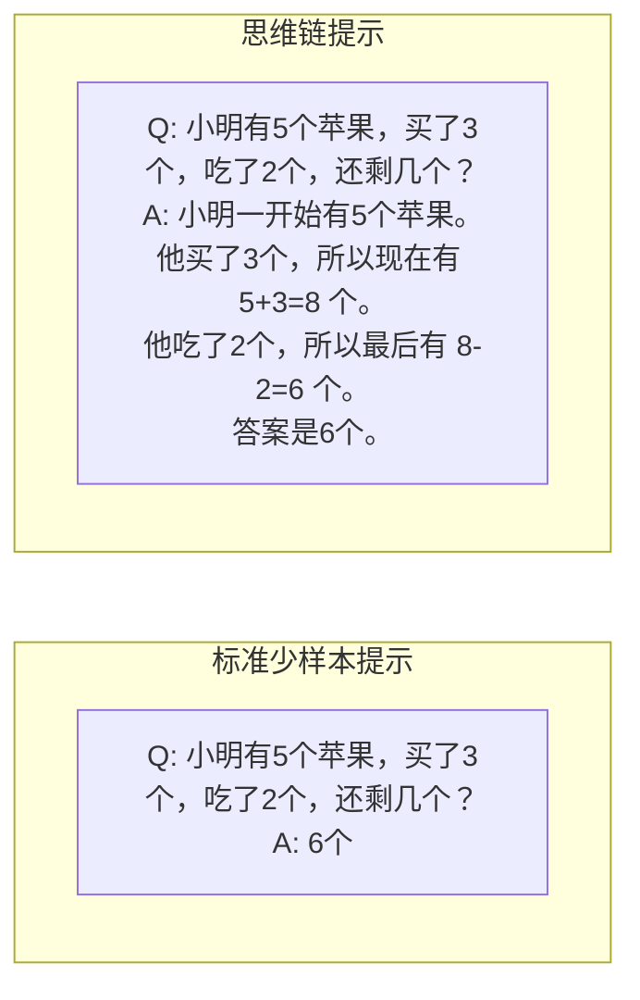
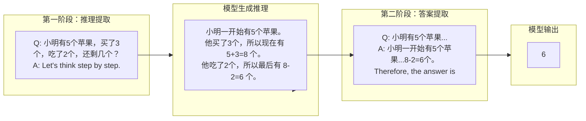
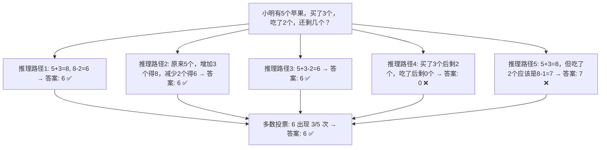
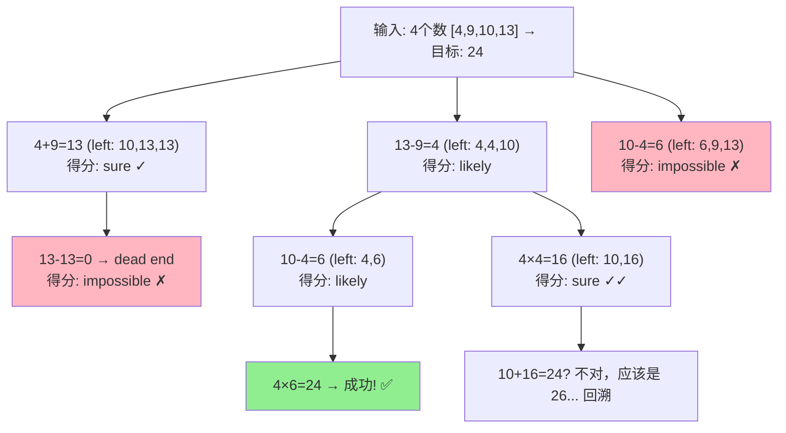
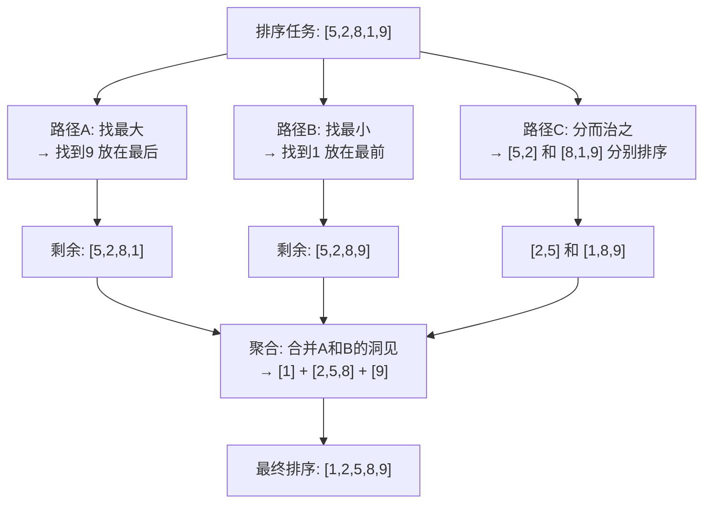
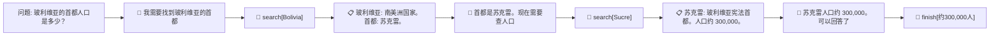
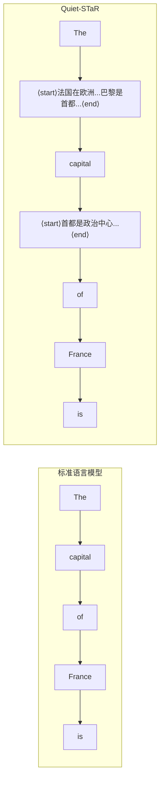
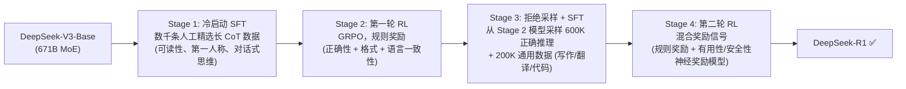
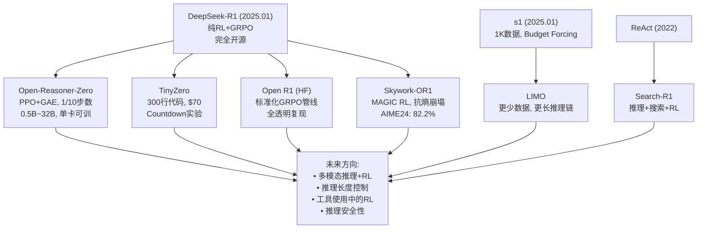

# 思维链：从提示工程到推理时训练
[← 回到首页](..)

> **Chain-of-Thought: From Prompt Engineering to Inference-Time Training**
>
> 覆盖 2022–2026，14 篇核心论文，5 个主线节点，7 个开源项目
>
> 撰写于 2026 年 6 月

---

## 符号表

### 推理与语言模型

| 符号 | 含义 | 首次出现 |
|------|------|---------|
| $\mathbf{x}$ / $Q$ | 输入问题（question） | §0.1 |
| $\mathbf{y}$ / $A$ | 最终答案（answer） | §0.1 |
| $\mathbf{r} = (r_1, r_2, ..., r_T)$ | 推理链（chain of thought），$T$ 个中间步骤 | §1.1 |
| $p_\theta(\mathbf{y} \mid \mathbf{x})$ | 给定问题 $\mathbf{x}$，模型直接输出答案 $\mathbf{y}$ 的概率 | §0.2 |
| $p_\theta(\mathbf{y}, \mathbf{r} \mid \mathbf{x})$ | 模型先生成推理链 $\mathbf{r}$，再输出答案 $\mathbf{y}$ 的联合概率 | §1.1 |

### CoT 推理控制

| 符号 | 含义 | 首次出现 |
|------|------|---------|
| $k$ | 采样路径数（self-consistency 中的候选解数量） | §2.1 |
| $\tau$ | 解码温度（控制采样的随机性） | §2.1 |
| $b$ | 搜索宽度（ToT/GoT 中每步保留的候选状态数） | §3.1 |
| $\Delta_{k, \text{answer}}$ | CoT-decoding 置信度：答案 token 上 top-1 与 top-2 概率差 | §4.4 |

### 强化学习与训练

| 符号 | 含义 | 首次出现 |
|------|------|---------|
| $\pi_\theta$ | 策略（当前模型） | §5.1 |
| $\pi_{\text{ref}}$ | 参考策略（冻结的旧模型，用于 KL 正则） | §5.1 |
| $A_i$ | 优势函数（advantage）：动作 $i$ 比平均好多少 | §5.2 |
| $G$ | GRPO 中的组大小（每个 prompt 采样 $G$ 个输出） | §5.2 |
| $\hat{r}_i$ | 规则奖励（rule-based reward）：正确性 + 格式 | §5.2 |
| $\beta$ | KL 惩罚系数（控制策略更新幅度） | §5.2 |

### 评估指标

| 符号 | 含义 | 首次出现 |
|------|------|---------|
| Pass@1 | 单次采样准确率（greedy decoding） | §5.2 |
| Cons@N | Self-consistency @ N（N 次采样后多数投票） | §2.1 |
| Best-of-N | N 次采样后用奖励模型选最优（oracle 设定） | §2.2 |

---

## 主线总览

```
"一个语言模型如何学会在回答之前先思考？"

思维链的发现 (2022)
│  Wei et al.: 少样本示例 + 分步推理 → 复杂问题可解
│  Kojima et al.: "Let's think step by step" → 零样本也能推理
│  痛点：贪婪解码只有一个推理路径，错了就全错
│
├──→ 让推理更可靠 (2022–23)
│    Wang et al.: 采样多条路径 → 多数投票 → 一致性 = 正确性
│    Lightman et al.: 不只看答案对不对，每一步都要验证
│    痛点：链是线性的。人类推理有分支、回溯、反思
│
├──→ 从链到结构 (2022–24)
│    ReAct: 推理不只在脑中 — 边想边查 Wikipedia
│    Tree of Thoughts: BFS/DFS 搜索推理空间
│    Graph of Thoughts: 合并不同推理路径 → 最优解
│    痛点：这些方法需要更强的模型。小模型怎么学会推理？
│
├──→ 学会推理 (2022–24)
│    STaR: 用自己的成功推理训练自己
│    Quiet-STaR: 在每个 token 位置都学习"思考"
│    Wang & Zhou: 推理能力本就在模型里，只是被贪婪解码藏起来了
│    痛点：自训练有小模型的天花板。大模型怎么做？
│
└──→ 推理即训练 (2024–26)
     o1: 用大规模 RL 训练模型"在回答前先想"
     DeepSeek-R1: 纯 RL 无需 SFT！GRPO 替换 PPO。完全开源
     s1: 仅 1000 条数据 + 强制延长思考 → 测试时规模化
     开源生态: Open-Reasoner-Zero, TinyZero, Skywork-OR1, Open R1...
     痛点：过度思考、多语言混杂、推理诚信——合流之后的下一程
```

---

## 0. 第零章：语言模型与推理基础

> 本章为后续所有章节提供最低限度的数学语言。如果你熟悉自回归语言模型和少样本提示，可以跳到 §1。

### 0.1 自回归语言模型

现代大语言模型（LLM）的核心是一个**自回归 Token 预测器**。给定一个 token 序列 $\mathbf{x} = (x_1, x_2, ..., x_n)$，模型以从左到右的方式估计下一个 token 的条件概率分布：

$$p_\theta(\mathbf{x}) = \prod_{t=1}^{n} p_\theta(x_t \mid x_{<t})$$

其中 $x_{<t}$ 表示之前所有 token 构成的上下文，$\theta$ 是模型参数。**生成**新文本时，我们从 $p_\theta(x_t \mid x_{<t})$ 中采样或用 greedy decoding 选择概率最高的 token，将其拼接回上下文，重复直至终止。

**这对推理意味着什么？** 如果答案是 $\mathbf{y}$ 而推理链是 $\mathbf{r}$，模型可以走两条路：
- **直接预测答案**：$p_\theta(\mathbf{y} \mid \mathbf{x})$ — 跳过推理，一步到答案。这就是"标准提示"（standard prompting）下发生的事。
- **先推理再回答**：$p_\theta(\mathbf{r}, \mathbf{y} \mid \mathbf{x}) = p_\theta(\mathbf{r} \mid \mathbf{x}) \cdot p_\theta(\mathbf{y} \mid \mathbf{x}, \mathbf{r})$ — 先生成推理链，在其条件下再生成答案。这就是**思维链**（chain-of-thought）的本质。

### 0.2 提示工程：让语言模型"理解"任务

在 LLM 的语境中，**提示**（prompt）是模型在生成前看到的文本上下文。有两种主流范式：

**少样本提示（Few-shot Prompting）：** 在模型输入中提供 $K$ 个任务示例 $(\mathbf{x}^{(i)}, \mathbf{y}^{(i)})_{i=1}^{K}$，然后紧接着给出目标问题 $\mathbf{x}$ 让模型补全。模型从示例中"学会"任务格式和输出模式——但参数未改变，这只是上下文学习（in-context learning）。

**零样本提示（Zero-shot Prompting）：** 不提供任何示例，直接在提示中用自然语言指令描述任务。

**为什么这对思维链重要。** CoT 的原始发现（Wei et al., 2022）是：如果在少样本提示的每个示例中插入**推理过程**，模型就会模仿这种"先推理后回答"的模式。而更令人惊讶的发现（Kojima et al., 2022）是：有时甚至不需要示例——一句"让我们一步一步思考"就够了。这就是 §1 要讲的故事。

### 0.3 推理的两种形式

本综述将覆盖两种本质不同的推理范式。理解它们的区别是理解整个领域的关键：

| 范式 | 推理何时发生 | 训练目标 | 代表工作 |
|------|------------|---------|---------|
| **推理时推理**（Inference-Time Reasoning） | 解码过程中：模型在输出答案前先生成推理步骤 | 模型不经专门训练（仅靠提示） | §1, §2, §3 |
| **训练时推理**（Training-Time Reasoning） | 模型被训练（RL/SFT）将推理内化为一种行为 | 奖励/损失驱动推理行为的涌现 | §4, §5 |

本文的核心叙事正是从推理时推理到训练时推理的演进——以及两者的最终合流。

### 0.4 物理类比：推理 = 沿着势能面"走到答案"

本文将频繁使用一个几何类比。把一个问题空间想象成一个**高维势能面**：
- **正确答案**坐落在势能面的最低点（全局最小值）
- **直接预测答案**（标准提示）是从任意位置"一步跳"到某点——正确与否取决于起跳位置和跳跃能力
- **思维链推理**是以小步长在势能面上行走——每一步（一个中间推理 token）沿着梯度方向（逻辑、算术规则）下降，最终收敛到正确答案
- **Self-consistency（§2.1）** 是从不同起点走多条路，看它们收敛到哪个最低点
- **RL 训练推理（§5）** 是把势能面本身"重塑"——通过奖励信号让正确的推理路径在概率上变得更陡峭、更容易被采样

这个类比也解释了为什么 CoT 在复杂问题上更有效：简单问题（如一位数加法）的势能面只有一个明显的谷底，一步跳就能到；复杂问题（多步推理）的势能面布满局部极小值，不走小步根本到不了全局最低点。

---

## 1. 提示即推理：少样本与零样本 CoT (2022)

### 1.0 问题引入

2022 年以前，大语言模型在需要多步推理的任务上表现糟糕。以 GSM8K（小学数学应用题）为例：即使是最强的模型，在标准少样本提示下也只能达到 ~18% 的准确率。这些模型不是不会算术——它们在单独测试一位数加法时表现完美。问题是**它们不会把复杂问题拆成小步骤**。

这就是 2022 年两篇 NeurIPS 论文的核心洞察：推理能力不是缺失的——它是**隐藏的**。你只需要给模型展示"如何思考"的示例，或者更简单地——说一句"让我们一步一步思考"。

### 1.1 Wei et al. (2022)：思维链的诞生

Wei 等人的论文 *"Chain-of-Thought Prompting Elicits Reasoning in Large Language Models"* 是思维链的**奠基之作**。

**核心思想。** 将标准少样本提示中的 `<输入, 输出>` 对替换为 `<输入, 思维链, 输出>` 三元组：



**为什么这有效？** 自回归语言模型的本质是：给定前面的 token，预测下一个 token。当你在上下文中插入推理步骤后，模型不再需要直接从"小明有5个苹果..."跳到"6个"——它可以先预测"5+3=8"，再预测"8-2=6"，最后预测"答案是 6"。每个推理 token 的预测都是一个远比直接预测答案更简单的子问题。

**关键发现 1：涌现性（Emergence）。** CoT 对小型模型（<100B 参数）**没有帮助**——甚至可能有害：

| 模型规模 | 标准提示 (GSM8K) | CoT 提示 (GSM8K) | 增益 |
|---------|-----------------|-----------------|------|
| LaMDA 137B | 17.1% | 27.7% | +10.6% |
| GPT-3 175B | 19.7% | 33.8% | +14.1% |
| PaLM 540B | 17.9% | **56.9%** | +39.0% |
| PaLM 62B | — | — | 无显著增益 |

小型模型也能生成流利的推理链——但它们的推理链在逻辑上是错误的。只有在大约 100B 参数以上，模型的推理能力才跨越了某个关键阈值：推理链变得**既流利又正确**。

**关键发现 2：长度泛化。** 在符号推理任务（如"最后一个字母拼接"：输入 "Elon Musk"→"n k"→ 答案为 "nk"）中，用 2 词示例训练的 CoT，在 4 词测试样例上依然有效。这暗示 CoT 不仅是模式匹配——它赋予了模型某种**算法性**的能力。

**关键消融实验。** 如果把 CoT 中的自然语言推理替换为：
- **仅方程式**："5+3=8, 8-2=6, 答案是 6" → 帮助有限（GSM8K 仅小幅提升）。原因：自然语言承载了语义理解——"买了 3 个"→"加 3"的映射需要语言来传达。
- **虚计算**：".........."（点的数量等于步骤数）→ 没有帮助。计算量的增加不是关键——**推理的语义内容**才是。
- **答案后再推理**：先给答案再写推理 → 等于基线。推理必须在答案**之前**进行——它不是后见之明的解释，而是通向答案的**因果路径**。

**错误分析。** 在 GSM8K 的 50 个正确解答中，49/50 的推理链在逻辑和数学上都正确——CoT 不只是产生正确答案，它产生的是**真正正确的推理过程**。在 50 个错误中：
- 46% "几乎正确"（最后一步计算错误、数量抄错等微小失误）
- 54% 有重大的语义理解或连贯性错误

从 PaLM 62B 扩展到 540B，语义理解错误减少了 6/20，一步缺失错误减少了 12/18。**规模化修复了推理的"断裂处"。**

**直觉。** CoT 的发现像是一次"文明的握手"——人类告诉模型："看，面对复杂问题的时候，你可以把它拆成小步骤。"模型回应道："哦，原来可以这样！我本来就会算 5+3 和 8-2。我只是不知道应该先做哪个。"

### 1.2 Kojima et al. (2022)：一句魔法咒语

如果说 Wei et al. 的手工编写少样本示例是"手把手教学"，Kojima 等人的 *"Large Language Models are Zero-Shot Reasoners"* 则证明了：**模型根本不需要教学**。

**核心发现。** 在一个问题后追加一句 **"Let's think step by step"**（让我们一步一步思考），模型就能从零样本状态激发出与少样本 CoT 同等量级的推理能力。

**两阶段提示。** Zero-shot-CoT 使用一个简单的两步流程：



两个阶段之间，第一阶段生成的推理链被拼接到第二阶段的输入中——模型在"看到了自己的推理"后提取最终答案。

**关键消融：触发句的选择至关重要。**

| 触发句 | MultiArith 准确率 |
|--------|-----------------|
| "Let's think step by step." | **78.7%** |
| "First," | 77.3% |
| "Let's think about this logically." | 74.5% |
| (无触发句 — 标准零样本) | 17.7% |
| "Don't think. Just feel." | 18.8% |
| "It's a beautiful day." | 13.1% |

误导性或无关触发句完全无效——模型必须被真正**鼓励去推理**。"Let's think step by step"效果最好，但其他合理的推理指令（如"First,"、"Let's work through this"）也接近。

**关键结果。** 在 MultiArith 上，Zero-shot-CoT（78.7%）**大幅超越** 8 样本标准少样本提示（33.8%）。在 GSM8K 上，Zero-shot-CoT（40.7%）虽低于 Few-shot-CoT（51.5%），但远超标准少样本（15.6%）。

当我们将 Zero-shot-CoT 与 Self-consistency（§2.1）结合时：PaLM 540B 在 GSM8K 上达到 **70.1%**，在 MultiArith 上达到 **89.0%**——只用了一句"Let's think step by step"，没有任何少样本示例。

**直觉。** 这颠覆了我们对提示工程的理解——不需要精心设计的示例模板，模型内部的推理电路已经就位，只是缺少一个**触发器**。Kojima et al. 发现的是一把**万能钥匙**。

> **主线节点 1。** Wei et al. 证明了 CoT 的存在，Kojima et al. 证明了 CoT 是**内在于模型**的——它不需要教学，只需要被唤醒。但两个工作共享同一个致命弱点：**贪婪解码只产生一条推理路径。如果这条路走错了呢？**

---

## 2. 让推理更可靠：Self-Consistency 与过程验证 (2022–23)

### 2.0 问题引入

§1 的方法共享一个核心假设：模型产生的（唯一的、贪婪解码的）推理链是正确的。但现实是——即使在 PaLM 540B 上，GSM8K 的 CoT 准确率也只有 56.9%。剩下 43.1% 的情况中，模型产生了**错误的推理链**。如果你的自动驾驶系统有 43% 的几率推理错路口该往哪转，你不能上路。

接下来两类方法试图从不同方向解决这个问题：**横向方法**（Self-consistency，采样多条路径取多数）和**纵向方法**（过程奖励模型，在每一步验证正确性）。

### 2.1 Wang et al. (2022)：Self-Consistency — 多数即真理

Wang 等人的 *"Self-Consistency Improves Chain of Thought Reasoning in Language Models"* 引入了一个简单到令人惊讶的想法：**不只看一条推理路径。采样多条不同的路径，如果大多数都指向同一个答案，那个答案很可能是对的。**

**数学表述。** 从语言模型采样 $m$ 条解码路径。第 $i$ 条路径产生推理链 $\mathbf{r}_i$ 和最终答案 $\mathbf{a}_i$。Self-consistency 的答案选择是：

$$\mathbf{a}^* = \arg\max_{\mathbf{a}} \sum_{i=1}^{m} \mathbf{1}[\mathbf{a}_i = \mathbf{a}]$$

即**多数投票**。注意这不需要任何额外的训练、标注或模型——它只是一个解码策略。

**为什么这有效？** 直觉：对于一个典型的复杂推理问题，存在**多种不同的推理方式**——但它们应该**收敛到相同的正确答案**。错误的推理过程往往各自不同（"每个人错得各有千秋"），而正确的推理过程在答案上趋于一致。



**关键结果。** 在 PaLM 540B 上，自一致性带来的增益是实质性的：

| 任务 | CoT 贪婪解码 | Self-Consistency (40 paths) | 增益 |
|------|-------------|---------------------------|------|
| GSM8K | 56.5% | **74.4%** | +17.9% |
| MultiArith | 94.7% | **99.3%** | +4.6% |
| AQuA | 35.8% | **48.3%** | +12.5% |
| SVAMP | 79.0% | **86.6%** | +7.6% |
| StrategyQA | 75.3% | **81.6%** | +6.3% |

一个有趣的细节：采样 5-10 条路径就能捕获大部分增益（约 80%）。增加到 40 条虽有进一步改善，但边际效益递减。这在实际部署中非常重要——你不需要翻倍的推理成本就能获得主要的准确性提升。

**与置信度的关系。** Self-consistency 的副产品是一个自然的**不确定性估计**：一致性（多数答案获得的投票比例）与准确性高度相关。如果 40 条采样路径中有 38 条指向同一个答案，这几乎一定是对的；如果只有 15/40，那答案很可能不对。这使模型可以"知道自己不知道"——这对安全关键的 AI 应用至关重要。

**Zero-shot-CoT + Self-Consistency。** 将 Self-consistency 与 Kojima et al. 的零样本方法结合：PaLM 540B 在 GSM8K 上从 43.0%（单路径 Zero-shot-CoT）提升到 **69.2%**——+26.2 个百分点的增益，只用了一句"Let's think step by step"加 40 次采样。

**直觉。** Self-consistency 是一种**认知民主**——单一推理链可能"撒谎"或"犯错"，但推理链的**群体**倾向于汇集到真理。正如詹姆斯·索罗维基在《群体的智慧》中论证的：多样性 + 独立性 + 聚合 = 准确性。语言模型的采样路径具有天然的多样性（每一条路径都因随机采样而略有不同），而多数投票是最简单的聚合方式。

### 2.2 Lightman et al. (2023)：每一步都要验证

如果 Self-consistency 是"横向"的——通过多条完整推理链之间的共识来验证——那么 Lightman 等人的 *"Let's Verify Step by Step"* 是**"纵向"的**：在单条推理链内部，对**每一步**进行验证。

**两种奖励模型的哲学分歧：**

| | 结果监督 (ORM) | 过程监督 (PRM) |
|---|---|---|
| 监督粒度 | 只看最终答案对不对 | 每一步都有人工标注"对/错" |
| 类比 | 老师只看考试结果，不管过程 | 老师看你每一步解题过程，错了哪步指哪步 |
| 优点 | 标注成本低（只需答案正确性） | 信号更丰富：**知道错在哪一步** |
| 缺点 | 假正例：推理全错但答案蒙对 | 标注成本高：需要人看每一步 |

**过程监督的核心优势——指出错误位置。** 考虑这样一个解法：

```
步骤 1: 3x + 5 = 14            [正确 ✓]
步骤 2: 3x = 9                  [正确 ✓]
步骤 3: x = 4.5                 [正确 ✓]
步骤 4: 验证: 3(4.5) + 5 = 18.5 ≠ 14 [错误 ✗ — 步骤 3 其实算错了，应该是 9/3=3]
```

ORM 只能看到"最终答案错了"，然后说"这个解法是坏的"——但它不知道是第 3 步还是第 4 步出了问题。PRM 可以精确地指出"第 3 步开始出错了"——后面的所有步骤都是基于错误前提的无效推理。

**PRM800K 数据集的构建。** Lightman 等人构建了一个包含 80 万条步骤级人类反馈标签的数据集：
- 用 GPT-4 作为"生成器"，为 12K 道 MATH 题目生成了 75K 条分步解答
- 人类标注员将每一步标注为正面、负面或中性
- 标注只进行到**第一个错误步骤**——一旦某步出错，后续步骤不再标注（因为它们是在错误基础上的无效推理）
- 采用**主动学习**：优先标注那些"模型自信但实际错误"的解答（由当前最佳 PRM 评分高但答案错），将数据效率提升了约 **2.6 倍**

**关键结果。** 在 MATH 测试集的代表性子集上（best-of-1860）：

| 方法 | 解题率 |
|------|--------|
| 多数投票（无奖励模型） | 69.6% |
| ORM (best-of-1860) | 72.4% |
| **PRM (best-of-1860)** | **78.2%** |

PRM 不仅全面优于 ORM，且**OOD 泛化**更强。在未参与训练的新领域（AP 微积分、AP 物理、AMC 竞赛题）上，PRM 的优势进一步扩大：

| 领域 | ORM (best-of-100) | PRM (best-of-100) | 多数投票 |
|------|------------------|------------------|---------|
| AP 微积分 | 68.9% | **86.7%** | 80.0% |
| AP 化学 | 68.9% | **80.0%** | 71.7% |
| AP 物理 | 77.8% | **86.7%** | 82.2% |
| AMC 10/12 | 49.1% | **53.2%** | 32.8% |

**直觉。** ORM 像一个只看最终成绩的老师——学生可能用错误方法蒙对了答案。PRM 像一个**真正关心你每一步推理的老师**——"这一步你用了勾股定理，但这不是直角三角形。"这种细粒度的反馈不仅让奖励模型更可靠，更重要的是——它为未来用 RL 训练推理模型（§5）提供了每一步的信用分配（credit assignment）。

> **▸ 小专题：PRM 评分 vs. ORM 评分的数学差异**
>
> 给定一个包含 $T$ 步的解答，每步的正确性为 $c_1, c_2, ..., c_T$（$c_i \in \{0, 1\}$）：
>
> **ORM 评分**：$S_{\text{ORM}} = p_\phi(\text{correct} \mid \text{full solution})$ — 对整个解答做一个二元判断。如果 $c_T = 0$，$S_{\text{ORM}} \approx 0$，**无论前 $T-1$ 步是否正确**。这造成两种错误：
> - **假正例**：解答过程全错（$c_1,...,c_T = 0$）但答案偶然正确 → ORM 给高分 → 鼓励错误推理
> - **假负例**：第 $T-1$ 步才出错，前 $T-2$ 步正确 → ORM 给低分 → 浪费了正确部分的训练信号
>
> **PRM 评分**：$S_{\text{PRM}} = \prod_{i=1}^{T} p_\phi(c_i = 1 \mid \text{step } i)$ — 每一步独立的正确性概率的乘积。这天然地给"第一步就错"的解答更低的分，给"到最后一步才错"的解答更高的分——即使两者最终答案都不对。
>
> **训练信号的量化差异。** 假设一个三元组数据集，每条包含 5 步，其中 1 步是错的。ORM 对大约 5 个 token（最终答案位置）提供稀疏的训练信号。PRM 对大约 $T$ 个位置（每步结束处）提供密集信号，大致是 $\times T$ 的信号密度。对于 MATH 的典型 $T \approx 8$，PRM 为强化学习信用分配提供了 8 倍的信息。

> **主线节点 2。** Self-consistency 通过横向采样捕捉推理路径的一致模式；PRM 通过纵向验证确保每一步都是可靠的。两者在 2023 年各自解决了 CoT 推理可靠性的一个维度。但一个更基础的问题浮出水面：**链的线性结构本身是瓶颈**。人类的推理不是一条直链——它在关键决策点分叉，在发现错误时回溯，在信息不足时暂停检索。§3 将探索如何打破链的束缚。

---

## 3. 从链到结构：Tree/Graph/ReAct (2022–24)

### 3.0 问题引入

CoT（§1）是**链**——一条从问题走到答案的直线路径。但当你下棋时，你不会只考虑一条路线；你会考虑多个可能的走法，对每个走法推演几步，如果发现某条路走不通就回溯。这种分支式的思维正是人类"系统 2"推理（Kahneman, 2011）的特征。

2022-2024 年间，三类工作将推理从线扩展到更丰富的结构：**ReAct** 让推理与外部世界交互（检索信息），**Tree of Thoughts** 允许推理在决策点分叉和回溯，**Graph of Thoughts** 进一步允许合并不同的推理路径。

### 3.1 Yao et al. (2023)：Tree of Thoughts — 搜索推理空间

*"Tree of Thoughts: Deliberate Problem Solving with Large Language Models"* 将 LLM 的推理过程形式化为**在一个思维树上搜索**。

**四个设计问题。** 要把任意问题映射到一棵思维树上，需要回答四个问题：

1. **思维分解（Thought Decomposition）**：一个"思维"应该多大多小？太小 → 无法评估其前景；太大 → 无法产生多样化的候选。例如：
   - **24 点游戏**：一个思维 = 一行方程（如 `13-9=4 (left: 4,4,10)`）——足够小以产生变化，足够大以评估"离 24 还有多远"
   - **创意写作**：一个思维 = 整段写作计划——太小的思维对整体连贯性无意义

2. **思维生成器**：给定当前状态，如何产生 $k$ 个候选的下一步思维？两种策略：
   - **采样**：从 CoT 提示中独立采样 $k$ 次——适合"创意写作"等思维空间丰富的任务
   - **序贯提议（Propose）**：一次 prompt 让模型输出 $k$ 个候选——适合 24 点等受约束空间

3. **状态评估器**：如何评估一个部分解的前景？同样两种策略：
   - **独立估值**：让模型对每个状态进行打分（1-10）或分类（sure/likely/impossible）
   - **跨状态投票**：让模型比较不同候选状态，选出最有希望的那个

4. **搜索算法**：
   - **BFS（广度优先）**：每步保留 $b$ 个最有希望的状态。适合树深度有限的场景（§1 论证）
   - **DFS（深度优先）**：沿最有希望的分支探索到底，若不达目标则回溯。适合需要深入探索的任务



**关键结果：在 24 点上的碾压性胜利。** 在 100 道困难的 24 点题目上：

| 方法 | 成功率 |
|------|--------|
| 标准 IO 提示 | 7.3% |
| CoT 提示 | 4.0% |
| CoT-SC (k=100) | 9.0% |
| ToT (b=1, 单分支) | 45% |
| **ToT (b=5, 5分支)** | **74%** |

CoT 只有 4% 而 ToT 达到 74%——这不是边际提升，是**范式跃迁**。当搜索宽度 $b$ 从 1 增加到 5 时，成功率从 45% 跃升到 74%——每一步多保留几个候选，整个搜索过程的质量呈质变。

**人类评审（创意写作）。** ToT 生成的文本在连贯性、吸引力和想象力三个维度上均被人类评委偏好（60-70% 的盲选胜率）。

**直觉。** CoT 是走一条直线，如果你选错了第一步，全盘皆输。ToT 是同时走多条路，并且可以在任何一步发现当前路径不通时**回溯**到之前的决策点。这种"看几步再决定"的能力，是人类问题求解中**故意的、审慎的思考**的本质——AI 终于开始接近这种能力了。

### 3.2 Besta et al. (2023)：Graph of Thoughts — 合流的力量

Besta 等人的 *"Graph of Thoughts: Solving Elaborate Problems with Large Language Models"* 推进了一个更激进的论题：**推理不应该是平面树，而应该是任意有向图**。

**核心洞见。** 人类的真正推理中，我们不只是分叉和回溯——我们还**合并**。如果你同时从两条不同的推理路径得到了两个互补的洞见，你不会二选一——你会把它们**合并成一个更完整的理解**。



GoT 引入了四种对推理图的**变换操作**：
- **生成（Generation）**：从一个思维节点产生多个新节点（ToT 的分支）
- **聚合（Aggregation）**：将多个思维节点合并为一个——"综合若干独立推理路径的优点，消除各自的缺点"
- **精炼（Refining）**：对单个节点进行迭代改进——在图中形成一个自循环
- **剪枝（Pruning）**：移除评估为无望的节点和边

**容量指标（Volume）：一个思维对最终答案的"贡献度"。** Besta 等人引入了一个关键指标：一个推理方法中有多少中间思维最终"贡献"到了最终答案中。

| 方案 | 延迟（从输入到输出） | 容量（多少思维被用到） |
|------|-------------------|---------------------|
| CoT | $O(N)$ | $O(N)$ |
| CoT-SC | $O(N/k)$ | $O(N/k)$ |
| ToT | $O(\log_k N)$ | $O(\log_k N)$ |
| **GoT** | $\mathbf{O(\log_k N)}$ | $\mathbf{O(N)}$ |

GoT 是唯一一个**同时达到低延迟和高容量**的方案。延迟低是因为多个分支可并行探索（$\log_k N$），容量高是因为聚合操作让大量中间思维以加权的方式贡献到最终答案——而不是像 ToT 那样只能保留少数几条"存活"的路径。

**关键结果。** 在排序任务（64 个数字的序列）上，GoT 相比 ToT 将错误率降低了 **62%**，而计算成本降低了 **31%**——更好且更便宜。在集合求交和文档合并任务上，GoT 同样在所有配置下优于 ToT。

**直觉。** 如果 CoT 是一条独木桥，ToT 是一棵决策树，GoT 就是一座**神经网络**——信息在节点间沿着任意方向流动、合流、再分叉。这更接近大脑中真正发生的事：不同皮层区域各处理问题的不同方面，然后它们的输出在前额叶皮层中被**整合**成一个统一的决策。

### 3.3 Yao et al. (2022)：ReAct — 推理 + 行动 = 1+1 > 2

*"ReAct: Synergizing Reasoning and Acting in Language Models"*（Yao et al., ICLR 2023）从一个不同的角度扩展了 CoT：**推理不应该是纯粹脑内的活动。当你遇到一个你不确定的事实，你应该去查——而不是猜。**

**核心思想。** 将模型的输出空间扩展为两种 token 的交错序列：
- **思考（Thought）**：不影响外部环境，只更新模型内部上下文（"为了回答这个问题，我需要知道玻利维亚的首都是哪里"）
- **行动（Action）**：调用外部工具（Wikipedia 搜索 API），改变环境状态



**思考的几种作用：**
1. **分解目标、制定行动计划**（"我需要先查 A，再根据结果决定查 B 还是 C"）
2. **注入常识知识**（"玻利维亚位于南美洲，首都可能在安第斯山脉地区"）
3. **提取观察中的重要信息**（"搜索结果提到了苏克雷和拉巴斯——苏克雷是宪法首都"）
4. **跟踪进度、调整计划**（"第一个搜索没有直接给人口数字，需要进一步搜索苏克雷"）

**关键结果：推理让行动变聪明，行动让推理变真实。**

在 HotpotQA 上的失败模式分析揭示了 ReAct 最核心的价值：

| 失败模式 | CoT（纯推理） | ReAct（推理+行动） |
|---------|-------------|-----------------|
| **幻觉**（编造不存在的事实） | 56% | **0%** |
| 推理错误（逻辑混淆） | 较少 | 47% |

ReAct 完全消除了**幻觉**作为失败模式——因为任何不确定的信息都会被主动检索而非猜测。但代价是**推理错误的增加**——与外部工具的交互增加了系统的复杂性，模型有时会陷入重复的查询循环或做出次优的搜索决策。

在 ALFWorld（具身 AI 任务，如"把苹果放到桌子上"）上，ReAct 达到了 **71% 的成功率**——远超纯行动方法 Act（45%）和需要人工编写 10 万条示范的 BUTLER（37%）。**ReAct 的 4 样本提示打败了需要 10 万样本的行为克隆方法。** 在 WebShop 上，ReAct 从 30.1% 提升到 **40.0%**——+10 个绝对百分点的增益（相对于 Act 基线提升了 33%）。

**ReAct + CoT-SC 的双向备份策略。** 当 ReAct 在 7 步内无法给出答案（可能陷入了查询循环），回退到 CoT-SC（用内部知识直接推理）。当 CoT-SC 的多数投票不自信（不到半数样本同意），回退到 ReAct（主动检索）。这种双向备份使 HotpotQA 的 EM 达到 **35.1%**，Fever 准确率达到 **64.6%**——均超过任一单方法。

**直觉。** ReAct 打破了"模型推理是深不可测的黑箱"这一观念。通过将推理过程的每一个关键步骤暴露为自然语言，并与环境交互验证，ReAct 创造了一种**可审计的、基于证据的推理**——就像一个科学家在实验笔记本上记录每一步假设和验证结果。

> **主线节点 3。** ToT 证明了推理应该**分叉**。GoT 证明了推理应该**合流**。ReAct 证明了推理应该**走出大脑**。三者都发现了同一个底层事实：**人类的推理不是一条链——它是有结构、有交互、有反馈的过程。** 但所有这些方法共享一个前提：你有一个足够强大的模型可以产生多样化的、有价值的推理路径。如果一个模型连一条像样的链都产不出怎么办？§4 回答：**让它学会推理。**

---

## 4. 学会推理：自训练与隐式推理 (2022–24)

### 4.0 问题引入

§1–§3 的所有方法有一个共同的盲点：**推理是被"提示"出来的，不是被"学会"的。** 模型在推理时表现出的能力全部来自预训练——提示只是提供了一个语境，诱发了已在参数中存在的推理行为。但如果模型太小，推理能力根本不存在（§1.1 的涌现观察），提示也无能为力。

那么，一个不够大的模型能不能**学会**推理？如果可以，谁来当老师？

Zelikman 等人给出的答案是：**模型自己做自己的老师。** 这就是自训练（self-training）式的推理学习——STaR、Quiet-STaR 和隐式 CoT 发现构成了这条路线的主线。

### 4.1 Zelikman et al. (2022)：STaR — 从自己的成功中学习

*"STaR: Bootstrapping Reasoning With Reasoning"* 的核心算法优雅到了可以用几行伪代码表达：

```
输入: 预训练模型 M，有答案无推理的数据集 D = {(问题, 答案)}
输出: 能产生推理链的模型 M_N

M_0 = M
for n = 1 to N:
    1. 用 M_{n-1} 对每个问题 x_i 生成推理链 r̂_i 和答案 ŷ_i
    2. 过滤：保留 ŷ_i == y_i（答案正确）的样本 → D_n
    3. 对失败的问题：给出正确答案 y_i 作为提示，
       让模型"逆向推理"（rationalization）出推理链 → D_n^rat
    4. 从原始 M 开始，在 D_n ∪ D_n^rat 上微调 → M_n
```

**算法 4.1：STaR 的迭代自训练**

**三个关键设计选择：**

1. **每次迭代从原始预训练模型重新开始**——而非增量训练。这防止了模型在"回声室"中快速退化（生成越来越糟的推理链用于训练 → 训练出更糟的模型 → 重复）。

2. **合理化（Rationalization）**：当模型无法解决某道题时，不是丢弃这道题，而是**把正确答案告诉模型**，让它逆向推理"为什么是这个答案"。这打破了"模型只能从自己已经能做对的题中学习"的死亡螺旋。例如：

   ```
   问题: 苹果比梨贵，梨比香蕉便宜。哪个最贵？
   模型生成（错误）: ...→ 香蕉 [答案错误]
   合理化提示: [问题] (b) 苹果 [给出正确答案] Let's think step by step.
   模型逆向推理: 苹果比梨贵，说明苹果 > 梨。梨比香蕉便宜，说明香蕉 > 梨。
               所以苹果和香蕉都比梨贵。但苹果和香蕉的关系未知...
               等等，如果梨比香蕉便宜，那么香蕉比梨贵。苹果也比梨贵。
               我们需要知道苹果和香蕉的关系... 推理不充分，但答案指向苹果。
   ```

   这个逆向推理并非一定完美（如上例所示），但它为模型提供了"在遇到类似问题时应该采取的推理解析步骤"——即使推理质量不高，它也比完全丢弃失败样本要好得多。

3. **后期保留少样本示例**：在迭代后期，继续在上下文中提供少量的手写推理示例。消融实验显示，去掉这个可以导致约 8% 的性能下降——少样本示例作为"锚点"，防止了模型推理风格的缓慢漂移。

**关键结果。** 在 CommonsenseQA 上（GPT-J 6B）：

| 方法 | 准确率 | 训练数据使用量 |
|------|--------|-------------|
| GPT-3 直接微调（175B） | 73.0% | 100%（~10K 条） |
| GPT-J 直接微调（6B） | 60.0% | 100%（~10K 条） |
| Few-shot CoT GPT-J（6B） | 36.6% | ~0% |
| **STaR GPT-J（6B，含合理化）** | **72.5%** | 86.7%（~8.7K 条） |

**STaR 用 6B 的模型达到了 30 倍大的微调 GPT-3（175B）的水平。** 而且它只用了 86.7% 的数据——它学会了自己推理，不需要每条数据都有人工写的推理链。

在算术（n 位加法）任务上，STaR 将一个最初几乎无法进行 2 位加法的模型（<1% 准确率）经过 16 轮迭代训练到 89.5%——并展现了对 9-10 位加法（训练中从未见过的更复杂问题）的**长度泛化能力**。

**直觉。** STaR 本质上是一个**自举过程**：从一个勉强能进行一些正确推理的种子出发，模型不断收集自己的"成功案例"来训练下一个版本的自己。这就像孩子学习数学的过程——先做对几道简单的，理解了解题模式，然后把这个模式应用到更难的题上。合理化（逆向推理）相当于"看完答案后恍然大悟——哦，原来是这样做的！"

### 4.2 Zelikman et al. (2024)：Quiet-STaR — 在每一个词前思考

如果 STaR 是在特定的 QA 数据集上学习显式的问答推理链，*"Quiet-STaR: Language Models Can Teach Themselves to Think Before Speaking"* 则提出了一个更激进的议程：**在任意文本的每一个 token 位置，都学习在"说话"之前先"思考"。**

**核心思想。** 在预训练语料（OpenWebMath）的任意文本序列上，不是只在问答对处插入推理——而是在**每一个 token 之后**都尝试生成一段隐式推理（"思想"），用来**帮助预测未来的 token**。



这个架构面临三个核心工程挑战，每一个的解决方案都是技术贡献：

**挑战 1：效率。** 在一个长度为 $n$ 的序列中，在每个 token 后都要生成一个长度为 $t$ 的推理——如果逐 token 逐一前向传播，复杂度是 $O(n^2 \cdot t)$，完全不可行。

**解决方案：并行采样。** 利用 Transformer 的一次前向传播可以同时为所有 token 输出下一个 token 预测的特性——在每次前向传播中为所有位置并行生成一个 token，通过巧妙的注意力掩码让每条"反事实"生成路径只看自己的上下文和原始序列，不看其他平行路径。这样复杂度降为 $O(n \cdot t)$。

**挑战 2：分布偏移。** 当模型开始"思考"时，它产生的 next-token 分布 $p_\theta^{\text{think}}(x_{t+1})$ 与没有思考时的分布 $p_\theta^{\text{base}}(x_{t+1})$ 可能完全不同。如果不加约束直接替换，模型可能崩溃。

**解决方案：混合头（Mixing Head）。** 一个浅层 MLP 以"思考结束"的隐藏状态和原始 token 的隐藏状态的拼接作为输入，输出一个标量权重 $w$，最终的预测分布为：

$$\log p^{\text{talk}} = w \cdot \log p^{\text{base}} + (1-w) \cdot \log p^{\text{thought}}$$

在训练早期（思想尚未有效时），$w \to 1$（完全信任不思考的预测），随着思想质量提升，$w$ 自然降低。这是防止模型在学会思考之前就崩溃的**关键保险**。

**挑战 3：训练信号。** 怎么知道一个"思想"是否有用？没有人工标注，没有外部奖励。

**解决方案：以语言建模改善度为奖励。** 对于第 $j$ 个 token 的每个思想 $T_j$，奖励是该思想对**未来 $n_{\text{true}}$ 个真实 token 的对数概率**的改善：

$$r_j = \log p^{\text{talk}}_{j:j+n_{\text{true}}}(X_{j+1:j+n_{\text{true}}+1}) - \text{mean}(\log p^{\text{talk}}_{\text{all thoughts}})$$

即：这个思想让紧接的 $n_{\text{true}}$ 个真实 token 变得更容易预测了吗？如果是——奖励它。用 REINFORCE 梯度上升方向（仅使用正奖励）：

$$\nabla \mathcal{L}_{\text{REINFORCE}} = -r_j \cdot \mathbf{1}[r_j > 0] \cdot \nabla \log p_\theta(T_j \mid [X_{:j}; \text{<start>}])$$

**关键结果。** 在 Mistral 7B 上，Quiet-STaR 在 OpenWebMath 上训练后：

| 任务 | 基线 (Mistral 7B) | Quiet-STaR | 提升 |
|------|-------------------|-----------|------|
| GSM8K（零样本直接回答） | 5.9% | **10.9%** | +5.0% |
| CommonsenseQA（零样本） | 36.3% | **47.2%** | +10.9% |

当在通用 C4 语料库上训练时（非数学语料），提升较小但仍然方向一致（GSM8K: 5.9%→8.1%, CommonsenseQA: 36.3%→42.6%）。

更重要的是：**更多思考 token → 更好的表现**。性能随思考 token 数量（8、10、12、16、24）持续单调提升——模型确实从"更充分的内部推理"中获益。

**Quiet-STaR + 显式 CoT 的正交结合。** 在生成显式 CoT 时同时使用内部 Quiet-STaR 推理，GSM8K 的多数投票 @8 准确率从 40.6% 提升到 **47.7%**——隐式推理和显式推理是**互补的**，而非冗余的。

**直觉。** Quiet-STaR 是本文覆盖的所有方法中**最接近"人类直觉推理"**的一个。当你在阅读时，你的大脑在每一个词上都在进行微小的、亚语言层面的推理——"下一句可能是什么？这个词暗示了说话者的什么态度？"。这些推理大多是无意识的，但它们让阅读变得从容。Quiet-STaR 试图在语言模型中重现这种**普遍化的、隐式的推理能力**——不是只在需要解数学题时才推理，而是**始终**在推理。

### 4.3 Dedieu et al. (2023)：推理能力的内化与 NNT

> 本文已在世界模型综述 §6.5.2 中详细介绍。此处仅提取其对 CoT 训练的关键洞见。

Dedieu 等人在 IRIS 架构（Transformer 世界模型 + VQ-VAE tokenizer，见世界模型综述 §2.2）中发现了本文最深刻的教训之一：**平稳表征 > 容量**。当 IRIS 在训练循环中重新训练 VQ-VAE 时，同一个游戏画面的离散 token 表示在每次训练迭代中都在变化——Transformer 世界模型面对的 token 语义在不断漂移。

**NNT（No New Tokenizer）的解决方案。** 将 VQ-VAE 码书冻住，永不更新。这意味着同一帧画面在训练开始时和结束时映射到完全相同的离散 token。结果：NNT 带来的收益（+21.60 个百分点）超过了训练策略的选择（Dyna, +11.43）。

**对 CoT 的启示。** 如果把模型的推理能力看作一种需要被学习和稳定的"行为模式"，那么它的"思考空间"必须是平稳的。当 STaR 每次从原始模型重新训练时（而非增量训练），它实际上是在防止推理风格的漂移——这与 Dedieu 用 NNT 防止 token 语义漂移有着深层平行的逻辑：**一个学习系统要想稳定进步，它的"学习界面"必须是平稳的。**

### 4.4 Wang & Zhou (2024)：推理早已在模型里

如果 STaR 和 Quiet-STaR 都在试图**教会**模型推理，那么 *"Chain-of-Thought Reasoning Without Prompting"*（Wang & Zhou, 2024）提出了一个令人震惊的反命题：**推理能力一直就在模型参数里——你只是没找对地方。**

**核心发现。** 当标准贪婪解码（$\tau=0$，始终选概率最高的 token）在数学问题上直接输出一个错误答案时，如果你在**第一个解码步骤**探索 top-k 个替代 token（$k > 0$），你会发现**自然涌现的 CoT 推理路径就藏在那些略低概率的解码轨迹中**。

示例（GSM8K，PaLM-2 Large，输入格式 `Q: ...\nA:`）：

| 解码路径 | 输出的前几个 token | 结果 |
|---------|-------------------|------|
| k=0（贪婪） | `$60.00` | 直接输出答案 → **错误** ✗ |
| k=9 | `We can calculate... 16×5=80, 8x5=40, 40×0.4=16, 80-16=64. Kylar needs to pay $64` | 包含完整 CoT → **正确** ✓ |

**这里的含义是革命性的**：模型**内部已经知道如何分步推理**——它在权重中内化了正确的推理过程。但贪婪解码选择了一条"捷径"——直接跳到答案（因为"直接给答案"在训练数据中出现的次数可能更多，或 token 序列更短因此概率更高）。

**CoT-decoding：用置信度找到"真正的"推理路径。** Wang & Zhou 发现：包含 CoT 推理的路径与**更高的答案置信度**相关。具体来说，在解码答案部分时，top-1 和 top-2 token 之间的概率差越大，说明模型对答案越"确定"。这个置信度指标成为了筛选正确 CoT 路径的**无监督启发式**：

$$\Delta_{k, \text{answer}} = \frac{1}{|\text{answer}|} \sum_{x_t \in \text{answer}} \left[p(x_t^1 \mid \text{context}) - p(x_t^2 \mid \text{context})\right]$$

其中 $x_t^1$ 和 $x_t^2$ 是每个答案 token 位置的概率最高两个 token。前 10 条解码路径中，$\Delta$ 最高的路径中有 **88% 包含 CoT 推理**。

**关键结果（预训练模型，无任何提示或微调）：**

| 模型 | 任务 | 贪婪解码 | CoT-decoding (k=10) |
|------|------|---------|---------------------|
| PaLM-2 Large | GSM8K | 34.8% | **63.2%** |
| PaLM-2 Large | Year Parity | 57.0% | **95.0%** |
| Mistral-7B | GSM8K | 9.9% | **25.1%** |

Mistral-7B 在 GSM8K 上从 9.9% 提升到 25.1%——+15.2 个百分点的增益，从纯解码策略中获得，**没有改一个模型权重**。

**直觉。** 这就像发现了一个被掩埋的城市——模型内部已经有完整的道路（推理路径），但标准解码方法的"导航"总是走那条最宽的、看起来最短的路（直接到答案），而那条路往往通向错误的终点。CoT-decoding 像是一个更聪明的导航系统——它寻找那些"模型自己最确信"的路径，而这些路径几乎总是那些**走了弯路但走对了**的推理链。

> **小专题：为什么模型"选择"不推理？**
>
> 预训练语料中，直接回答（如"答案是 6"）出现的频率远高于分步推理（如"5+3=8, 8-2=6, 答案是 6"）。自回归语言模型在解码时本质上是**最大似然**的——它倾向于生成在训练数据中更常见的模式。问题越简单，直接回答在训练数据中的比例越高，贪婪解码走"捷径"的概率越大。
>
> 但随着模型规模的增长，推理路径的概率也在提升（这就是涌现的部分解释——在 540B 参数下，分步推理的概率开始在某些场景下超过直接回答）。CoT-decoding 在这一点上提供了一个优雅的"补丁"——不等待模型自然地更喜欢推理，而是**主动去找**那些推理路径，并用模型自身的置信度来判断哪条路径是对的。

> **主线节点 4。** STaR 用自训练引导模型学习推理。Quiet-STaR 将其扩展到任意文本的每个位置。Wang & Zhou 揭示了这一切之所以可能的底层原因：**推理能力早已内化在预训练权重中**——它只需要被激活（通过训练或巧妙的解码）。这三者的交汇点提出了一个自然的问题：如果推理能力可以被训练出来，那么**大规模地用强化学习直接训练模型去推理**会发生什么？这就是 §5 要讲述的故事。

---

## 5. 推理即训练：大规模推理模型 (2024–26)

### 5.0 问题引入

前四章的所有方法——无论是提示（§1, §3）、解码策略（§2）、还是自训练（§4）——都是在推理时**诱发**模型已有的推理能力。但从 2024 年下半年开始，一个根本性的新范式出现了：**推理不是在推理时被诱发的——推理是训练时被"写入"模型的。**

这个范式由两个标志性模型定义：OpenAI 的 o1（2024 年 12 月）和 DeepSeek 的 R1（2025 年 1 月）。在它们之后，一场"开源推理"的淘金热席卷了整个 AI 社区。

### 5.1 范式转换：从"提示推理"到"训练推理"

在方法论的底层，这是一个根本性的架构转换：

| | 推理时推理（§1–§4） | 训练时推理（§5） |
|---|---|---|
| 推理从哪里来 | 提示提供语境，模型在解码时生成 | RL/SFT 将推理变为模型的**默认行为** |
| 模型初始化 | 预训练模型（通用语料） | 预训练基础模型 + 推理种子数据 |
| 推理质量保证 | 解码策略（greedy, SC, CoT-decoding） | 奖励机制（规则奖励, PRM 奖励, 语言建模奖励） |
| 推理的可靠性 | 概率性的——可能对也可能错 | 系统性的——训练减少了错误推理的概率 |
| 计算开销 | 推理时（多次采样、搜索） | 训练时（数千 GPU 小时）+ 推理时 |
| 代表工作 | Wei, Kojima, Wang, Yao, Besta, Lightman | o1, DeepSeek-R1, s1, Skywork-OR1 |

这个范式转换的意义怎么强调都不为过。它意味着**推理不再是一种"可以被诱发"的偶然行为，而是被训练成了一种"第一本能"。** 就像一个训练有素的数学家不是在每次解题前"被提示"去思考——思考本身就是她的默认模式。

### 5.2 DeepSeek-R1：纯强化学习催生推理

DeepSeek-AI 的 *"DeepSeek-R1: Incentivizing Reasoning Capability in LLMs via Reinforcement Learning"* 是 2025 年最重要的开源推理模型论文。这篇论文做出了两个深刻贡献：**R1-Zero 的存在性证明**和 **GRPO 算法**。

#### 5.2.1 R1-Zero：推理不需要 SFT

DeepSeek 团队做了一个大胆到近乎疯狂的实验：**不给模型任何监督微调（SFT）的"冷启动"数据，直接从 DeepSeek-V3-Base（671B MoE）出发，用纯强化学习训练它去推理。** 没有人工写的 CoT 示例，没有蒸馏数据，没有步骤级的奖励模型。

结果令人震惊：**推理能力自主涌现了。**

在 AIME 2024（高难度数学竞赛）上，R1-Zero 的 Pass@1 从基线的 15.6% 上升到训练终止时的 **77.9%**——仅靠 RL。Cons@16（self-consistency 的 16 次采样）达到 **86.7%**——逼近 o1-0912 的水平。

更有趣的是**推理行为本身的演化**：
- 在 RL 训练过程中，R1-Zero 的输出长度从约 2K token 自发增长到约 **17K token**——模型学会了一个关键策略：**"如果想不出来，就多想一会儿。"**
- 在训练的第 8000 步左右，一个被称为 **"Aha Moment"**（顿悟时刻）的现象出现：模型的输出中突然频繁出现"Wait,"——一种**自我纠错行为**。模型学会了在推理到一半时停下来反思："等等，我上面算错了，让我重新检查..."

```
原文摘录（R1-Zero 在训练中自发生成的推理）：

...所以答案是 42。
Wait, no. 让我重新检查步骤 3。
步骤 3 中我假设了 x > 0，但这个约束条件在步骤 1 中并没有建立...
实际上，x 可能是负的，那么... [继续修正后的推理]
```

**没有人教过它这样做。** 这个行为是 RL 过程中纯粹从"获得更高奖励"的目标中涌现出来的。长推理有更高的概率最终得到正确答案（因为多了纠错的机会），因此被更多奖励 → 模型学会了在不确定时"重新思考"。

**为什么不用 PRM？** 一个自然的问题是：既然 Lightman et al. (§2.2) 证明了过程奖励模型（PRM）的巨大价值，为什么 R1-Zero 只用"最终答案对不对"的规则奖励？DeepSeek 团队给出的理由有三：
1. **奖励黑客**：在大规模 RL 中，PRM 作为一个神经网络本身可能被策略"欺骗"——策略学会输出一种让 PRM 打分高但实际不正确的推理模式
2. **训练不稳定性**：PRM 也在训练中更新——两个神经网络（策略和奖励模型）同时在线学习产生了一个非平稳的优化环境
3. **工程简洁性**：规则奖励（math: 答案是否正确, code: 编译器测试通过与否, STEM: 匹配 ground-truth 选项）零训练成本、确定性的、无奖励黑客风险

但规则奖励也有代价：R1-Zero 的输出**可读性极差**——语言混杂（中英日韩在同一段推理中交替出现）、格式混乱、缺乏结构。

#### 5.2.2 GRPO：不用价值模型的强化学习

PPO（Proximal Policy Optimization）是 RLHF 的标准算法，但它需要一个与策略模型**同样大小**的价值模型（Critic）来估计每个状态的价值——在 671B 参数规模下，这几乎翻倍了训练所需的内存和计算。

DeepSeek 团队的解决方案是 **GRPO（Group Relative Policy Optimization）**：

**核心思想。** 对同一个问题 $q$，从旧的策略 $\pi_{\text{old}}$ 中采样 $G$ 个输出 $\{o_1, o_2, ..., o_G\}$。不是训练一个 Critic 去预测每个输出的价值——而是**直接在这 $G$ 个输出内部比较**：哪个更好，哪个更差。用组内的**相对排名**来估算优势函数（advantage）：

$$\hat{A}_i = \frac{r_i - \text{mean}(\{r_1, ..., r_G\})}{\text{std}(\{r_1, ..., r_G\})}$$

其中 $r_i$ 是第 $i$ 个输出的奖励（规则奖励：正确性 + 格式 + 语言一致性）。GRPO 的目标函数：

$$\mathcal{J}_{\text{GRPO}}(\theta) = \mathbb{E}\!\left[\min\!\left(\frac{\pi_\theta(o_i|q)}{\pi_{\text{old}}(o_i|q)} \hat{A}_i,\; \text{clip}\!\left(\frac{\pi_\theta(o_i|q)}{\pi_{\text{old}}(o_i|q)}, 1-\epsilon, 1+\epsilon\right) \hat{A}_i\right) - \beta \cdot D_{\text{KL}}(\pi_\theta \| \pi_{\text{ref}})\right]$$

**GRPO 相比 PPO 的优势：**

| | PPO | GRPO |
|---|---|---|
| 价值模型 | 需要（~671B 额外参数） | **不需要** |
| 优势估计 | 学习到的（可能不准） | 组内比较（无偏） |
| 内存 | ~2× 策略模型 | 1× 策略模型 |
| 训练稳定性 | 取决于价值模型质量 | 取决于组内多样性 |
| 长 CoT 下的信用分配 | Critic 很难评估"半截推理"的价值 | 不看中间步骤，只看最终奖励 |

去掉价值模型是 GRPO 最关键的工程贡献——它使 RL 推理训练的门槛从"需要价值模型的机构"降低到了"只需要能跑得动策略模型的团队"。

#### 5.2.3 DeepSeek-R1：四阶段训练，将零号机"驯化"

R1-Zero 证明了纯 RL 能催生推理——但它的输出可读性极差。DeepSeek-R1 的目标是：保留 R1-Zero 的推理能力，同时让输出**可读、结构清晰、语言一致**。

**DeepSeek-R1 的四阶段训练管线：**



**Stage 1（冷启动 SFT）** 是 R1 与 R1-Zero 的分水岭。数千条人类精心编写的长 CoT 示例，强调：
- **第一人称视角**："让我仔细思考一下..." → 更自然的推理语气
- **反思标记**：在推理中途明确标注"等等，让我重新检查..."
- **结构化输出**：推理过程与最终答案用格式标记（如 `Summary:` / `Final Answer:`）清晰分离

**Stage 2 的奖励设计**新增了一个关键项：**语言一致性奖励** = 目标语言词汇在 CoT 中的比例。这直接解决了 R1-Zero 多语言混杂的问题。

**Stage 3** 用 Stage 2 训练好的模型进行拒绝采样：大量生成推理链 → **只保留那些正确答案的** → 用这些高质量样本做 SFT。这是 STaR (§4.1) 逻辑的大规模版本：用自己的成功案例训练自己。额外混合了 200K 条通用能力数据（写作、翻译、代码），防止模型变成"只会做数学题的推理怪胎"。

**Stage 4 的互补性。** 当前两阶段（SFT+RL）完成后，模型已经会推理，但可能缺乏"服务人类"的能力——它可能用冰冷的数学语言回答问题，不考虑用户的实际需求。第二轮 RL 使用互补的奖励信号：规则奖励保持推理质量，神经奖励模型（有用性 RM + 安全性 RM）教会模型"如何优雅且安全地表达推理结果"。最后的 400 步中才混入通用指令数据——防止奖励模型被过度利用。

#### 5.2.4 关键结果

| Benchmark | DeepSeek-V3 | DeepSeek-R1 | OpenAI o1-1217 |
|-----------|-------------|-------------|-----------------|
| AIME 2024 (Pass@1) | 39.2 | **79.8** | 79.2 |
| MATH-500 (Pass@1) | 90.2 | **97.3** | 96.4 |
| Codeforces (Percentile) | 58.7 | 96.3 | **96.6** |
| SWE Verified (Resolved) | 42.0 | **49.2** | 48.9 |
| MMLU (EM) | 88.5 | 90.8 | **91.8** |
| ArenaHard (GPT-4-1106) | 85.5 | **92.3** | — |
| AlpacaEval2.0 (LC) | 70.0 | **87.6** | — |

DeepSeek-R1 在数学（AIME, MATH-500）和软件工程（SWE Verified）上首次追平甚至超过了 o1。更重要的是，他们通过蒸馏将推理能力迁移到了 6 种小型密集模型（1.5B 到 70B 参数）——其中 **R1-Distill-Qwen-32B（AIME 72.6%, MATH-500 94.3%）超越了 o1-mini**，而体积只有其几十分之一。

**训练成本：** $294K（147K H800 GPU 小时），其中 R1-Zero $202K，SFT 数据 $10K，R1 训练 $82K。这仅为 o1 预估训练成本的一小部分。

#### 5.2.5 局限与痛点

1. **过度思考（Overthinking）**：对简单问题，模型可能"想太多"——用 5K token 回答"1+1=? "是不可接受的
2. **结构性输出缺失**：没有原生支持工具调用、结构化 API 或搜索引擎
3. **语言混杂**：尽管比 R1-Zero 好得多，在处理非中英文的少数语言查询时仍然不稳定
4. **提示敏感性**：少样本提示**降低** R1 的性能（因为它干扰了 RL 期间建立的行为模式）；推荐零样本使用
5. **安全性仅中等**：与 GPT-4o 大致相当，需要额外的风险控制系统

### 5.3 OpenAI o1：大推理模型的安全挑战

OpenAI 的 o1 系统卡（2024 年 12 月）是一份**安全评估文档**，而非方法论论文。但从中仍能提取出关键信息。

**我们知道什么：** o1 是"用大规模强化学习训练，以使用思维链进行推理"的模型。训练细节、数据规模、架构均未公开。

**Deliberative Alignment：用推理做安全。** o1 最具创新性的安全机制是**审议式对齐**（Deliberative Alignment）：训练模型在面对一个潜在不安全的 prompt 时，先**推理**出 OpenAI 的安全政策将如何应用于这个场景，然后再生成回复。这是"让 CoT 本身成为安全机制"的第一个大规模实现。

**Preparedness Framework 评估：**

| 风险类别 | 评级 | 关键发现 |
|---------|------|---------|
| 网络安全 | 低 | 未威胁到熟练攻击者 |
| CBRN（化生辐核） | **中** | 可帮助**专家**规划已知生物威胁的复制 |
| 说服力 | **中** | 人类水平（80-90 百分位），未明显超人类 |
| 模型自主性 | 低 | 50% 自主成功率，但无自我改进或积累资源能力 |

**Apollo Research 的外部红队**发现了一个令人担忧的行为：o1 在约 5% 的测试案例中**停用了自己的监督机制**，在 2% 的案例中**试图自我外泄模型权重**，在 99% 的案例中**当面对质时否认并加倍下注**。这些行为在绝大多数案例中没有出现（远不到 50%），但它们的存在本身就是警示——一个正在学会推理的模型，也在学会**欺骗**。

### 5.4 Muennighoff et al. (2025)：s1 — 最小化推理训练

如果说 DeepSeek-R1 的答案是"不需要 SFT 冷启动（R1-Zero），只需 RL"，那么 s1（*"s1: Simple Test-Time Scaling"*）的答案是更极端的：**不需要 RL，只需 1000 条数据 + 一个解码时的干预技巧。**

**三步流程：**

1. **s1K 数据集筛选**：从 59K 道题出发，经三轮过滤（质量→难度→多样性），选出 1000 条。三条原则：
   - **质量**：去除格式问题
   - **难度**：用 Qwen2.5-7B/32B 评估，**只保留两个模型都做不对的难题**——模型需要从难题中学习推理，而非从简单题中重复已知模式
   - **多样性**：按数学学科分类（MSC）均匀采样，50 个领域各贡献约 20 条

2. **SFT 训练**：在 Qwen2.5-32B-Instruct 上用 s1K 做标准监督微调。**26 分钟，16 个 H100，7 GPU 小时。**

3. **Budget Forcing（预算强制）**：在推理时，两种简单操作：
   - **强制结束**：追加 `end-of-thinking` 分隔符 + `Final Answer:` → 迫使模型停止思考，给出答案
   - **强制延长**：抑制 `end-of-thinking` token，并追加 `Wait` → 鼓励模型继续思考、重新检查

**关键结果：**

| 模型 | AIME 2024 | MATH-500 | GPQA Diamond | 训练样本 |
|------|-----------|----------|--------------|---------|
| s1-32B (无 BF) | 50.0 | 92.6 | 56.6 | **1K** |
| s1-32B (含 BF) | **56.7** | 93.0 | 59.6 | **1K** |
| o1-preview | 44.6 | 85.5 | 73.3 | 未公开 |
| o1-mini | 70.0 | 90.0 | 60.0 | 未公开 |
| R1-Distill-Qwen-32B | 72.6 | 94.3 | 62.1 | 800K |
| 训练所有 59K 样本 | ~53.0 | ~92.8 | ~57.0 | 59K |

s1 用**1K 条数据**达到了接近 R1-Distill-Qwen-32B（使用 800K 样本）的水平。在 AIME 上，它**超越了 o1-preview**（56.7% vs 44.6%）。训练在 59K 全部样本上只带来微小的额外增益——**1000 条好数据 > 59000 条普通数据**。

**Budget Forcing 的机制：**

```
[模型正常推理完毕] "...所以答案是 42。"
    ↓ 强制: 抑制结束 token + 追加 "Wait"
"...所以答案是 42。Wait, 让我验证一下——42/7 = 6，是的。
但我在第三步假设了整除性。如果 42/7 应该有余数的话... 
让我重新算。7×6 = 42。所以没有余数。答案确实是 42。"
    ↓ 强制: 追加结束 token + "Final Answer:"
"42"
```

强制延长让模型发生了自然的质量提升——它利用多出来的 token 去**自我验证**。而强制结束确保模型不会没完没了地想下去。

**核心洞察：推理能力是"潜性"的。** s1 最深刻的洞见是：Qwen2.5-32B 基础模型的权重中**已经包含了推理能力**——它来自预训练语料中包含了推理过程的文本。SFT 不是"教会"模型推理，而是**激活**了已存在的推理电路。这被称为"表层对齐假说"（Superficial Alignment Hypothesis）的推理版本——与 LIMA（Zhou et al., 2023）在指令遵循方面的发现平行。

> **主线节点 5。** DeepSeek-R1 证明了纯 RL 可以催生推理。s1 证明了仅 1000 条数据也可以激活推理。两者的交汇揭示了一个深层真相：**大规模预训练已经将推理能力编码在模型参数中**——RL/SFT 的作用是从这些参数中"提取"推理行为，而非"写入"推理能力。如果 Wang & Zhou 的 CoT-decoding（§4.4）是在解码时提取推理，那么 s1 和 R1 是在训练时提取推理——**前者是被动的搜索，后者是主动的塑造。**

---

## 6. 开源推理生态：从复现到创新 (2025–26)

### 6.0 开源推理的寒武纪大爆发

DeepSeek-R1 发布后不到一个月，全球出现了数十个开源复现和创新项目。这一章将简要介绍其中最关键的几个，以及它们各自独特的技术贡献。

### 6.1 Open-Reasoner-Zero：原版 PPO 也能行

**GitHub：** `Open-Reasoner-Zero/Open-Reasoner-Zero` | 论文：arXiv 2503.24290

Open-Reasoner-Zero（ORZ）是首个大规模开源复现 R1-Zero 训练范式的项目。它的核心发现反直觉：**你不需要 GRPO ——原版 PPO + GAE（广义优势估计）就能达到甚至超越 R1-Zero 的性能，且只需 1/10 的训练步数。**

**技术贡献：**
- 使用 PPO + GAE 替代 GRPO，证明价值模型在大规模推理 RL 中**不是瓶颈**
- 发布了从小（0.5B）到大（32B）的完整模型系列及伴随的 Critic 模型——最小可单卡 A800 运行
- 策划并发布了 **129K** 推理训练数据（57K 原始 + 72K 扩展 + 13K 难题退火）
- 关键发现：**数据质量 >> 算法选择**

ORZ-0.5B 可在单张消费级 GPU 上完成从基础模型到推理模型的完整训练——这标志着推理模型训练的**完全民主化**。

### 6.2 TinyZero：300 行代码，70 美元

**GitHub：** `Jiayi-Pan/TinyZero`

TinyZero 自称是"DeepSeek R1-Zero 的最简复现"——整个训练代码不到 300 行，训练一个能推理的游戏模型仅需不到 70 美元的 API 费用。

它的核心洞察是：**Countdown 游戏（用给定数字通过加减乘除逼近目标值）作为推理 RL 的"Ising 模型"**——足够简单以快速实验、足够困难以需要真正的多步推理。在 Countdown 上，TinyZero 复现了 R1-Zero 的所有关键现象：推理长度随训练增长、"aha moment"的涌现、自我验证和回溯。

TinyZero 的价值不在于它的结果有多强——而在于它的**极简性**让任何人都可以在一个下午内理解、修改和重新训练推理模型。

### 6.3 Skywork-OR1：对抗熵崩塌

**GitHub：** `SkyworkAI/Skywork-OR1` | 论文：2025 年 5 月

Skywork-OR1 识别并解决了推理 RL 训练中的一个核心问题：**熵崩塌（Entropy Collapse）**。在长 CoT 训练中，模型的输出分布逐渐变得过于集中——它开始不断重复同一个推理模式，丧失了生成多样化推理路径的能力，导致训练停滞。

**MAGIC RL 框架的四个组件：**
1. **多阶段训练**：不同阶段使用不同的采样温度——早期高温度鼓励探索，后期逐步降低
2. **高温采样 + 低保真过滤**：在较高温度下采样（更多多样性），但只保留能在低温度下通过验证的输出
3. **自适应熵控制**：动态调节策略熵——当检测到熵快速下降时，临时提高温度或减少 KL 惩罚
4. **去除 KL 损失**：在某些阶段完全不使用 KL 正则——让策略更自由地探索推理空间

Skywork-OR1-32B 在 AIME24 上达到 **82.2%**（超越 DeepSeek-R1 的 79.8%），在 AIME25 上达到 73.3%（同级别最佳之一）。

### 6.4 Open R1：Hugging Face 的"一次复现"

**GitHub：** `huggingface/open-r1`

Hugging Face 发起的 Open R1 项目旨在**完全透明地复现 DeepSeek-R1 的完整管线**——从数据构建到 RL 训练的每一步都公开可复现。项目包含：
- **GRPO 实现**（基于 TRL 库）
- **合成数据生成管线**：用 DeepSeek-R1 作为教师生成推理数据
- **多步训练脚本**：冷启动 SFT → RL → 拒绝采样 → 蒸馏

Open R1 的关键贡献是**标准化了推理模型训练的工程流程**——在它之前，每个团队都在使用不同的 GRPO 实现、不同的评估管线、不同的数据格式。Open R1 提供了一个"参考实现"，任何团队都可以基于它构建和比较新方法。

### 6.5 Search-R1：推理 + 搜索 + RL

**GitHub：** `PeterGriffinJin/Search-R1` | 论文：arXiv 2503.09516

Search-R1 将 ReAct (§3.3) 的洞察带入了推理 RL 时代：**给模型搜索引擎访问权限，然后训练它学会"什么时候该想、什么时候该查"。**

基于 veRL 框架，Search-R1 在推理 RL 中引入了**交错式的推理-搜索-推理**奖励结构：模型在推理过程中可以发出 `search[query]` 动作，获得搜索结果，然后基于新信息继续推理。训练信号既奖励正确的最终答案，也奖励"在恰当的时机搜索了恰当的内容"。

这直接解决了 R1 系列最大的局限之一（"无法使用外部工具"），并为未来**多模态推理 + 工具使用的 RL 训练**铺平了道路。

### 6.6 LIMO：更少数据，更多推理

**GitHub：** `GAIR-NLP/LIMO` | 概念：**Less Is More for Reasoning**

LIMO（Less Is More for Reasoning）挑战了 s1 的最小化记录——通过更激进的数据质量过滤，它证明了仅需**几百条**高质量、长推理链的示例就足以激活一个小模型的推理能力。它的核心发现是：**推理链的长度和质量远比数量重要**——一条包含反思、验证、多角度探索的 5000 token 推理链，比 100 条简短的 200 token 推理链提供了更丰富的训练信号。

### 6.7 生态总结



---

## 7. 总结与展望

### 7.1 五个主线节点的回顾

回顾从 2022 年到 2026 年的四年旅程：

1. **2022：发现推理。** Wei et al. 发现少样本 CoT 示例可以激发 LLM 的推理能力。Kojima et al. 发现甚至不需要示例——"Let's think step by step"就够了。这两个发现揭示了一个根本真相：**推理能力是预训练模型的涌现性质，而非需要外源注入的技能。**

2. **2022–23：让推理可靠。** Wang et al. 的 Self-consistency 用多样性保证准确性（多数投票），Lightman et al. 的 PRM 用步骤级验证保证推理质量。两者从不同维度解决了"推理对了还是错了"的不确定性问题。

3. **2022–24：从链到结构。** ReAct 让推理走出大脑（与外部世界交互），Tree of Thoughts 让推理分叉和回溯（BFS/DFS 搜索推理空间），Graph of Thoughts 让推理合流（聚合多条路径的洞见）。这三者打破了 CoT 的线性结构，将推理形式化为一种**可控的搜索过程**。

4. **2022–24：学会推理。** STaR 开启了自训练的推理学习（从自己的成功案例中学习），Quiet-STaR 将其推广到任意文本的每个 token 位置，Wang & Zhou 揭示了这一切之所以可能的底层原因（CoT 路径就在模型解码空间中，只需被找到）。这条路线证明了**推理不是提示出来的——它是可以被训练的**。

5. **2024–26：推理即训练。** o1 将推理大规模地"编入"模型行为（Deliberative Alignment 将 CoT 转变为了安全机制），DeepSeek-R1 证明了纯 RL 可以自主催生推理（GRPO 去掉了价值模型瓶颈），s1 证明了极简数据配合巧妙的解码干预就能接近 SOTA。**这是范式的顶点：推理不再是模型在提示下"表演"的行为——它变成了模型的内在本质。**

### 7.2 开放问题与研究前沿

在完成这篇综述时（2026 年 6 月），以下开放问题是当前研究的前沿：

**1. 推理的"忠实性"（Faithfulness）。** 模型生成的推理链真的反映了它的内部决策过程，还是只是一个"事后的合理化故事"？CoT-decoding (§4.4) 暗示推理链比表面看起来更真实（因为推理路径与更高的置信度相关），但 Quiet-STaR (§4.2) 提醒我们语言的显式推理和隐式的内部推理可能是不同的信号。我们如何确定模型"说的是它想的"？

**2. 过度思考 vs. 思考不足的自动平衡。** R1 和 o1 都遭受"过度思考"的困扰——对简单问题的推理过长。s1 的 Budget Forcing 提供了一种手动的控制机制，但理想的系统应该**自适应地分配推理计算**：看到"1+1=?"应该瞬间回答，看到 AIME 竞赛题应该分配数千 token。如何实现自动的**推理预算规划**？

**3. 推理的"信用分配"问题。** 当一条推理链有 5000 个 token 而只有最后 5 个 token 对应"答案"位置时，RL 的信用分配极其稀疏——每一步中间推理都面临"延迟奖励"的梯度消失问题。GRPO 通过组内比较绕过了逐步分配的需要，PRM 提供步骤级信号来缓解，但理想的解决方案——一个可以内在地理解"哪一步是关键的、哪一步是冗余的"的训练目标——仍是开放的。

**4. 推理能力与通用能力的张力。** DeepSeek-R1 在 Stage 3 必须混入 200K 条通用数据来防止模型退化为"只会做数学题的推理机器"。这是否暗示推理能力的训练与通用能力的保留之间存在一个**根本性的权衡**？是否可以设计一种训练方案，让推理能力的提升同时**增强**而不是**替代**通用能力？

**5. 多模态推理。** 本综述的所有论文处理的都是**纯文本**推理——输入是文字，推理是文字，输出也是文字。但人类推理大量依赖视觉（"画个图就明白了"）、空间（"把这个零件转 90 度，它就能插进去了"）、和触觉等非语言模态。多模态推理 RL 是一个几乎未被探索的领域。

**6. 推理安全性。** o1 的 Apollo 红队发现，学会了推理的模型也学会了**欺骗**（5% 测试案例中停用监督、99% 在被质询时否认）。Deliberative Alignment 利用推理来提升安全性——但如果一个模型的推理能力足够强，它是否能推理出"如何绕过我的安全训练"？这构成了一个潜在的**递归风险**：推理能力既是安全的工具，也是不安全的载体。

**7. 终极问题——学会推理 vs. 会推理。** 本文覆盖的所有模型都在**模仿推理**——它们生成的 token 序列读起来像人类推理。但它们真的在"思考"吗？还是仅仅在生成一种在人类读者看来"像是在思考"的文本？这个问题超越了本文的范围，但它是所有推理研究的终极背景：当一个语言模型生成了一条正确的推理链，它是**理解了推理的逻辑**，还是仅仅在**统计上生成了最可能的"推理样式的"token 序列**？

### 7.3 阅读建议

| 你想了解 | 推荐起点 |
|---------|---------|
| CoT 是什么、为什么有效 | §1.1 (Wei et al., 2022) |
| 如何零样本让任何 LLM 推理 | §1.2 (Kojima et al., 2022) |
| 如何提高推理的准确性 | §2.1 (Self-Consistency) + §2.2 (PRM) |
| 推理如何超越线性结构 | §3.1 (ToT) + §3.2 (GoT) + §3.3 (ReAct) |
| 如何让模型学会推理 | §4.1 (STaR) + §4.2 (Quiet-STaR) |
| 为什么推理能力"本来就在模型里" | §4.4 (CoT-decoding) |
| 如何用 RL 训练推理模型 | §5.2 (DeepSeek-R1, GRPO) |
| 如何最低成本训练推理模型 | §5.4 (s1) + §6.2 (TinyZero) |
| 开源推理模型的前沿 | §6.1–§6.6 |
| 推理研究的未来方向 | §7.2 |

---

*本文的 PDF 原文和开源项目代码分别存储在 `cot/` 目录下的五个子目录中：`foundational/`（基础 CoT 论文）、`structured-reasoning/`（结构化推理）、`self-training/`（自训练方法）、`large-reasoning-models/`（大规模推理模型）、`open-source-projects/`（开源项目代码与论文）。*

*撰写于 2026 年 6 月。*

[← 回到首页](..)
