[← 回到首页](../README)

# Diffusion 模型的数学主线：从马尔可夫链到概率流

> 本文梳理 2015–2025 年间 34 篇 Diffusion 核心论文的数学框架，找到一条贯穿始终的数学主线。
>
> **目标读者**：已学习概率论基础（随机变量、期望、高斯分布）的学生。第零章补充了理解扩散模型所需的所有进阶数学知识。

---

## 符号表

### 数据和模型

| 符号 | 含义 | 首次出现 |
|------|------|---------|
| $\mathbf{x}_0 \in \mathbb{R}^d$ | 原始数据点（干净图像） | §1.1 |
| $\mathbf{x}_t \in \mathbb{R}^d$ | 第 $t$ 步的噪声数据 | §1.1 |
| $\mathbf{x}_T$ | 纯噪声（扩散终点，$T$ 足够大时近似 $\mathcal{N}(0,\mathbf{I})$） | §1.1 |
| $q(\mathbf{x}_0)$ | 真实数据分布 | §1.1 |
| $p_\theta$ | 参数化的模型分布 | §1.1 |
| $\boldsymbol{\epsilon} \sim \mathcal{N}(0,\mathbf{I})$ | 标准高斯噪声 | §1.2 |
| $\hat{\mathbf{x}}_0$ | 从 $\mathbf{x}_t$ 估计的干净数据 | §2.1 |
| $\mathbf{c}$ | 条件（文本、类别等） | §4.2 |

### 噪声调度

| 符号 | 含义 | 首次出现 |
|------|------|---------|
| $\beta_t \in (0,1)$ | 第 $t$ 步的噪声方差 | §1.1 |
| $\alpha_t = 1 - \beta_t$ | 单步信号保留率 | §1.2 |
| $\bar{\alpha}_t = \prod_{s=1}^t \alpha_s$ | 累积信号保留率 | §1.2 |
| $\sigma_t$ | 第 $t$ 步的噪声标准差（VDM / EDM 记法） | §3.1 |
| $\text{SNR}(t) = \alpha_t^2 / \sigma_t^2$ | 信噪比 | §3.1 |
| $\lambda_t = \log(\alpha_t / \sigma_t)$ | 对数 SNR | §5.2 |

### SDE / ODE 框架

| 符号 | 含义 | 首次出现 |
|------|------|---------|
| $t \in [0, T]$ | 连续时间参数 | §2.2 |
| $\mathbf{w}_t$ | 标准布朗运动（Wiener 过程） | §2.2 |
| $\mathbf{f}(\mathbf{x}, t)$ | SDE 的漂移系数 | §2.2 |
| $g(t)$ | SDE 的扩散系数 | §2.2 |
| $\nabla_{\mathbf{x}}\log p_t(\mathbf{x})$ | **得分函数**（score function） | §2.2 |
| $\boldsymbol{\epsilon}_\theta(\mathbf{x}_t, t)$ | 噪声预测网络 | §1.2 |
| $\mathbf{s}_\theta(\mathbf{x}_t, t)$ | 得分网络 | §1.2 |
| $D_\theta(\mathbf{x}; \sigma)$ | 去噪网络 | §5.1 |
| $v_\theta(\mathbf{x}, t)$ | 向量场网络（Flow Matching） | §6.1 |

### 训练与损失

| 符号 | 含义 | 首次出现 |
|------|------|---------|
| $\mathcal{L}_{\text{simple}}$ | DDPM 简化噪声预测损失 | §1.2 |
| $D_{\text{KL}}(q \| p)$ | KL 散度 | §0.2 |
| $\mathbb{E}_{q}[\,\cdot\,]$ | 在分布 $q$ 下的期望 | §1.1 |
| $\theta$ | 神经网络参数 | §1.1 |
| $\mathcal{N}(\mathbf{x}; \boldsymbol{\mu}, \boldsymbol{\Sigma})$ | 均值为 $\boldsymbol{\mu}$、协方差为 $\boldsymbol{\Sigma}$ 的高斯分布 | §0.1 |

### 流匹配与一致性

| 符号 | 含义 | 首次出现 |
|------|------|---------|
| $\phi_t: \mathbb{R}^d \to \mathbb{R}^d$ | 流映射（flow map） | §6.1 |
| $u_t(\mathbf{x})$ | 目标向量场 | §6.1 |
| $p_t(\mathbf{x})$ | 概率密度路径 | §6.1 |
| $f_\theta(\mathbf{x}_t, t)$ | 一致性函数 | §7 |

---

## 第零章：数学基础

> 本章为已有概率论基础（随机变量、期望、方差、高斯分布的基本定义）的读者补充理解扩散模型所需的进阶数学知识。若对某个概念已熟悉可跳过。

### 0.1 多元高斯分布

$d$ 维高斯分布 $\mathcal{N}(\boldsymbol{\mu}, \boldsymbol{\Sigma})$ 的概率密度函数为：

$$p(\mathbf{x}) = \frac{1}{(2\pi)^{d/2}|\boldsymbol{\Sigma}|^{1/2}}\exp\!\left(-\frac{1}{2}(\mathbf{x}-\boldsymbol{\mu})^\top\boldsymbol{\Sigma}^{-1}(\mathbf{x}-\boldsymbol{\mu})\right)$$

其中 $\boldsymbol{\mu} \in \mathbb{R}^d$ 是均值向量，$\boldsymbol{\Sigma} \in \mathbb{R}^{d \times d}$ 是协方差矩阵。

**各向同性高斯**（isotropic Gaussian）是扩散模型中最常用的形式：

$$\mathcal{N}(\boldsymbol{\mu}, \sigma^2\mathbf{I}) = \boldsymbol{\mu} + \sigma \cdot \mathcal{N}(0,\mathbf{I})$$

即每个维度独立同分布，方差相同。它的密度函数简化为 $p(\mathbf{x}) = \frac{1}{(2\pi\sigma^2)^{d/2}}\exp(-\frac{\|\mathbf{x}-\boldsymbol{\mu}\|^2}{2\sigma^2})$.

**条件高斯的封闭性**：若 $\mathbf{x}$ 和 $\mathbf{y}$ 的联合分布是高斯，则条件分布 $p(\mathbf{x}|\mathbf{y})$ 也是高斯。这是扩散模型前向/逆向过程全部用高斯分布建模的数学基础。

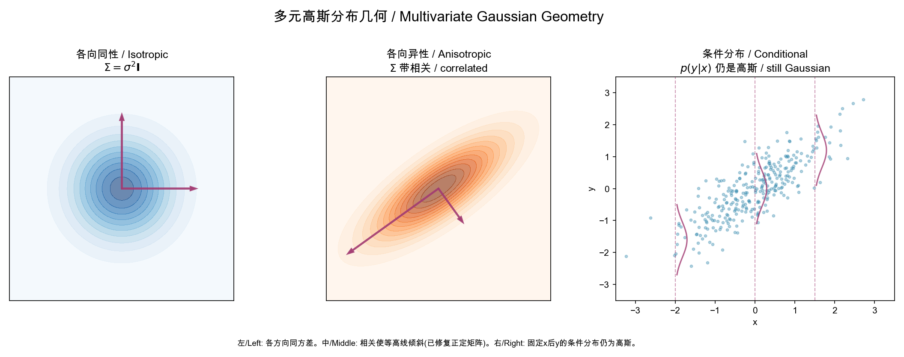

**几何直观**：左图是各向同性高斯——等高线是完美的圆，所有方向的方差相同（特征值相等）。在扩散模型中，每一步加的就是这种"球形"噪声。中图展示相关高斯——协方差矩阵的非对角元素使等高线倾斜，特征向量（箭头）标示了数据变化的主方向。右图展示**条件高斯**的关键性质：固定 $x$ 的值（虚线），$y$ 的条件分布仍然是高斯——这就是为什么扩散模型每步的去噪可以用单一的高斯条件分布来描述。

> **直觉**：如果联合分布是"椭球形"的（高斯），那么任何"切片"（条件分布）也是椭球形的。扩散模型的推理过程就是一个大高斯分布上的逐维切片。

### 0.2 KL 散度

Kullback-Leibler (KL) 散度衡量两个概率分布 $q$ 和 $p$ 的"距离"：

$$D_{\text{KL}}(q \| p) = \int q(\mathbf{x})\log\frac{q(\mathbf{x})}{p(\mathbf{x})}\,d\mathbf{x} = \mathbb{E}_{\mathbf{x}\sim q}\left[\log q(\mathbf{x}) - \log p(\mathbf{x})\right]$$

**性质**：
- $D_{\text{KL}}(q \| p) \geq 0$，等于 $0$ 当且仅当 $q = p$（几乎处处）
- **非对称**：$D_{\text{KL}}(q \| p) \neq D_{\text{KL}}(p \| q)$
- 扩散模型中 $q$（前向过程）是已知的简单分布，$p_\theta$（逆向过程）被训练去逼近它

**两个高斯分布之间的 KL 散度**（有闭式解）：

$$D_{\text{KL}}\big(\mathcal{N}(\boldsymbol{\mu}_q,\boldsymbol{\Sigma}_q)\,\big\|\,\mathcal{N}(\boldsymbol{\mu}_p,\boldsymbol{\Sigma}_p)\big) = \frac{1}{2}\!\left[\log\frac{|\boldsymbol{\Sigma}_p|}{|\boldsymbol{\Sigma}_q|} - d + \text{tr}(\boldsymbol{\Sigma}_p^{-1}\boldsymbol{\Sigma}_q) + (\boldsymbol{\mu}_p-\boldsymbol{\mu}_q)^\top\boldsymbol{\Sigma}_p^{-1}(\boldsymbol{\mu}_p-\boldsymbol{\mu}_q)\right]$$

当 $\boldsymbol{\Sigma}_q = \boldsymbol{\Sigma}_p = \sigma^2\mathbf{I}$ 时简化为 $\frac{1}{2\sigma^2}\|\boldsymbol{\mu}_p - \boldsymbol{\mu}_q\|^2$. 这是 DDPM 将 ELBO 中的 KL 项转化为简单的 $\ell_2$ 回归的关键。

> **几何直觉**：当两个高斯的协方差相同时，KL 散度退化为**均值之间的欧几里得距离平方**（除以 $2\sigma^2$）。这意味着最小化 KL 等价于让模型的均值 $\boldsymbol{\mu}_p$ 尽可能接近真实均值 $\boldsymbol{\mu}_q$——这正是 MSE 回归。当协方差不同时，KL 散度还惩罚方向性的不匹配（通过 $\log\frac{|\Sigma_p|}{|\Sigma_q|}$ 和 $\text{tr}(\Sigma_p^{-1}\Sigma_q)$ 项）。详见第四章的 [fig-kl-geometry.png] 分析。

### 0.3 重参数化技巧

重参数化技巧是深度学习中使用随机变量的标准方法。核心思想：将**带参数的随机性**拆分为**确定性变换 + 无参数噪声**。

**示例**：抽样 $\mathbf{x} \sim \mathcal{N}(\boldsymbol{\mu}_\theta, \sigma_\theta^2\mathbf{I})$ 等价于：

$$\mathbf{x} = \boldsymbol{\mu}_\theta + \sigma_\theta \cdot \boldsymbol{\epsilon}, \quad \boldsymbol{\epsilon} \sim \mathcal{N}(0,\mathbf{I})$$

$\boldsymbol{\epsilon}$ 不依赖参数 $\theta$，因此梯度可以穿过 $\boldsymbol{\mu}_\theta$ 和 $\sigma_\theta$ 反向传播。

在扩散模型中，前向过程 $\mathbf{x}_t = \sqrt{\bar{\alpha}_t}\mathbf{x}_0 + \sqrt{1-\bar{\alpha}_t}\boldsymbol{\epsilon}$ 就是重参数化的一次应用：这使得 $\mathbf{x}_t$ 可以在一步中直接从 $\mathbf{x}_0$ 采样，无需模拟 $t$ 步链。

### 0.4 得分函数 (Score Function)

**定义**：分布 $p(\mathbf{x})$ 的得分函数是其对数概率密度对输入的梯度：

$$\mathbf{s}(\mathbf{x}) = \nabla_{\mathbf{x}}\log p(\mathbf{x})$$

**直观理解**：得分函数是指向更高密度区域的向量场——告诉你如何微调 $\mathbf{x}$ 来增加 $\log p(\mathbf{x})$.

**关键性质**：得分函数**不依赖于**概率密度的归一化常数。设 $p(\mathbf{x}) = \frac{\tilde{p}(\mathbf{x})}{Z}$，其中 $Z = \int\tilde{p}(\mathbf{x})d\mathbf{x}$，则：

$$\nabla_{\mathbf{x}}\log p(\mathbf{x}) = \nabla_{\mathbf{x}}\log\tilde{p}(\mathbf{x}) - \underbrace{\nabla_{\mathbf{x}}\log Z}_{=0} = \nabla_{\mathbf{x}}\log\tilde{p}(\mathbf{x})$$

这是"去噪得分匹配"可行的数学基础——我们不需要知道 $p_t(\mathbf{x})$ 的归一化常数也能估计其得分函数。

**高斯条件分布的得分**：对于 $\mathbf{x}_t|\mathbf{x}_0 \sim \mathcal{N}(\alpha_t\mathbf{x}_0, \sigma_t^2\mathbf{I})$：

$$\nabla_{\mathbf{x}_t}\log q(\mathbf{x}_t|\mathbf{x}_0) = -\frac{\mathbf{x}_t - \alpha_t\mathbf{x}_0}{\sigma_t^2} = -\frac{\boldsymbol{\epsilon}}{\sigma_t}$$

这解释了为什么噪声预测等价于得分估计。

> **几何直觉**：得分函数在 1D 情形中就是 $\frac{d}{dx}\log p(x)$。想象一个钟形曲线（高斯密度）——在曲线左侧，$\log p$ 随 $x$ 增大而增大，所以得分是**正的**（指向右，朝峰顶）；在右侧，得分是**负的**（指向左，朝峰顶）；在峰顶，得分为零（已达最高点）。详见第二章的 [fig-score-field.png]。

### 0.5 ELBO 与变分推断

对于隐变量模型 $p_\theta(\mathbf{x}) = \int p_\theta(\mathbf{x},\mathbf{z})d\mathbf{z}$，对数似然 $\log p_\theta(\mathbf{x})$ 通常无法直接计算（积分不可解）。

**证据下界**（Evidence Lower BOund, ELBO）提供了一种可优化的近似：

$$\log p_\theta(\mathbf{x}) \geq \mathbb{E}_{q(\mathbf{z}|\mathbf{x})}\left[\log\frac{p_\theta(\mathbf{x},\mathbf{z})}{q(\mathbf{z}|\mathbf{x})}\right] =: \text{ELBO}$$

**间隙**：$\log p_\theta(\mathbf{x}) - \text{ELBO} = D_{\text{KL}}(q(\mathbf{z}|\mathbf{x}) \| p_\theta(\mathbf{z}|\mathbf{x})) \geq 0$.

在扩散模型中：
- $\mathbf{z} = \mathbf{x}_{1:T}$ 是隐变量序列
- $q(\mathbf{z}|\mathbf{x}) = q(\mathbf{x}_{1:T}|\mathbf{x}_0)$ 是固定的前向过程（不需要学习）
- $p_\theta(\mathbf{x},\mathbf{z}) = p_\theta(\mathbf{x}_{0:T})$ 是学习的逆向过程

训练目标就是最大化 ELBO。

> **几何直觉**：ELBO 可以理解为"代理目标"。真正想优化的是 $\log p(\mathbf{x})$（数据的对数似然），但这无法直接计算（需要积分所有可能的隐变量路径）。ELBO 是它的**下界**（lower bound）——总是小于或等于真实值。两个量之间的差距恰好是 $D_{KL}(q\|p)$。训练就是同时做两件事：(1) **提升 ELBO**（让模型更好），(2) **缩小 KL 差距**（让近似更紧）。详见 [fig-elbo-geometry.png]。

### 0.6 马尔可夫链

**定义**：随机过程 $\{\mathbf{x}_t\}_{t=0}^T$ 是马尔可夫链，如果：

$$p(\mathbf{x}_t | \mathbf{x}_{t-1}, \mathbf{x}_{t-2}, \ldots, \mathbf{x}_0) = p(\mathbf{x}_t | \mathbf{x}_{t-1})$$

即未来状态只依赖于当前状态，与历史无关。

**转移核**：$p(\mathbf{x}_t | \mathbf{x}_{t-1})$ 完全描述了一个马尔可夫链的动力学。

**扩散模型**：前向过程是人为设计的马尔可夫链（每步加高斯噪声），逆向过程是神经网络学习的另一个马尔可夫链（每步去噪）。

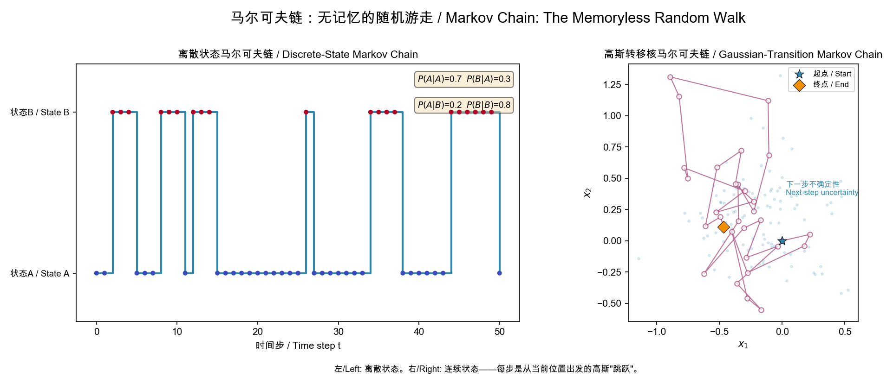

**几何直观**：左图是两状态离散马尔可夫链——未来状态只取决于当前所在位置，转移概率矩阵 $P$ 完全定义了动力学。右图展示了连续状态空间中的马尔可夫随机游走：每个位置的"下一步"是一个以当前位置为中心的高斯分布（淡蓝色云），这意味着**给定当前位置，下一位置的条件分布被完全确定**——无论你是如何到达当前点的。

> **直觉**：马尔可夫链就像**喝醉的人走路**——下一步往哪走只取决于现在站在哪里，不记得怎么来的。扩散模型的前向过程就是醉汉向着噪声方向走，逆向过程是神经网络引导他反向走回原点。

### 0.7 随机微分方程 (SDE) 基础

#### 布朗运动（Wiener 过程）

$\mathbf{w}_t$ 是一个连续时间随机过程，满足：
- $\mathbf{w}_0 = 0$
- $\mathbf{w}_{t+\Delta} - \mathbf{w}_t \sim \mathcal{N}(0, \Delta \cdot \mathbf{I})$（增量独立且高斯）
- 样本路径连续但**处处不可微**

**直观**：布朗运动是随机游走的连续极限——每个无穷小时间段内有一个微小的随机位移。

#### Itô SDE

一个 Itô 随机微分方程的形式为：

$$d\mathbf{x}_t = \mathbf{f}(\mathbf{x}_t, t)\,dt + g(t)\,d\mathbf{w}_t$$

- $\mathbf{f}(\mathbf{x}_t, t)\,dt$：**漂移项**，描述确定性的运动方向
- $g(t)\,d\mathbf{w}_t$：**扩散项**，注入随机噪声
- $d\mathbf{w}_t$ 是布朗运动的无穷小增量

**直观理解**：SDE 描述了在确定性"推力"和随机"噪声"共同作用下的粒子运动。

#### 逆向时间 SDE（Anderson, 1982）

如果前向 SDE 为 $d\mathbf{x} = \mathbf{f}dt + g d\mathbf{w}$，则存在一个逆向 SDE：

$$d\mathbf{x} = \big[\mathbf{f}(\mathbf{x}, t) - g(t)^2\nabla_{\mathbf{x}}\log p_t(\mathbf{x})\big]dt + g(t)\,d\bar{\mathbf{w}}$$

其中 $\bar{\mathbf{w}}$ 是**逆向时间**的布朗运动。

**这是整个扩散模型领域的核心定理**。它告诉我们：如果知道每个时间点的得分函数 $\nabla\log p_t$，就可以将噪声"倒带"回数据。

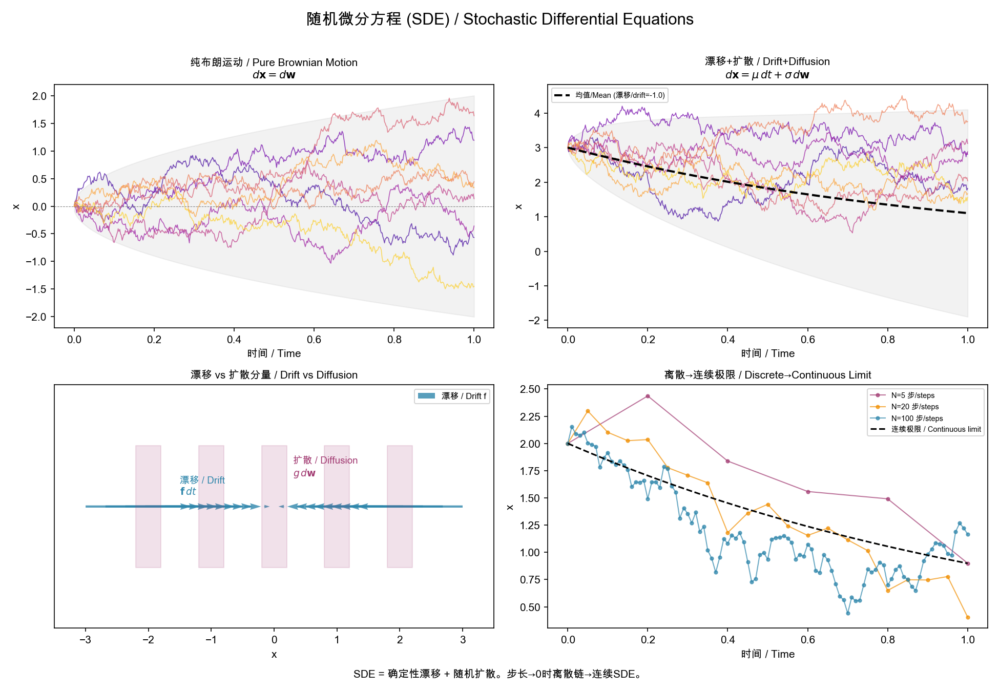

**几何直观**：

**左上（纯布朗运动）**：粒子完全随机游走，没有确定性方向。灰色包络 $\pm 2\sqrt{t}$ 显示标准差随 $\sqrt{t}$ 增长——这是扩散过程的特征行为。每条路径是连续但处处不可微的（锯齿状）。

**右上（漂移 + 扩散）**：粒子在随机游走的同时被一个向下的力（$\mu=-1$）拉向负方向。黑色虚线是确定性部分（$\mu t$），灰色包络是叠加的随机扩散（$\pm 2\sigma\sqrt{t}$）。

**左下（漂移 vs 扩散的对比）**：漂移 $\mathbf{f}$（蓝色箭头）确定方向，扩散（红色区域）添加随机扰动。在实际扩散模型中，**正向 SDE** 的 $\mathbf{f}$ 指向噪声（数据→噪声），**逆向 SDE** 的 $\mathbf{f} - g^2\nabla\log p_t$ 指向数据（噪声→数据）。

**右下（离散→连续极限）**：步数越多（$N$ 越大），离散马尔可夫链越接近连续 SDE 的轨迹。扩散模型的 $T=1000$ 步离散化就是对连续 SDE 的精细近似。

> **直觉**：SDE 就像**河上的落叶**——河水流动（漂移）推动叶子沿确定方向运动，同时水的湍流（扩散）使叶子随机晃动。Anderson 定理说：**如果你知道每个位置的"得分"（哪个方向更可能是数据），你可以逆流而上，把叶子推回源头**。

### 0.8 常微分方程 (ODE) 与概率流

#### 流 (Flow) 的基本概念

给定向量场 $v_t(\mathbf{x})$，一个流 $\phi_t(\mathbf{x})$ 由以下 ODE 定义：

$$\frac{d}{dt}\phi_t(\mathbf{x}) = v_t(\phi_t(\mathbf{x})), \quad \phi_0(\mathbf{x}) = \mathbf{x}$$

$\phi_t$ 将初始点 $\mathbf{x}$ 沿着向量场 $v_t$ 从时间 0 运送到时间 $t$。

#### Probability Flow ODE

从 Score SDE 论文中推导出的**概率流 ODE**（PF-ODE）：

$$d\mathbf{x} = \left[\mathbf{f}(\mathbf{x}, t) - \frac{1}{2}g(t)^2\nabla_{\mathbf{x}}\log p_t(\mathbf{x})\right]dt$$

**关键性质**：这个 ODE 的边缘分布与对应的 SDE **完全相同**。也就是说，从同一个初始分布出发，ODE 和 SDE 在时刻 $t$ 产生的样本服从相同的分布。

**这意味着确定性生成是可能的**——不需要随机噪声也能生成高质量样本。

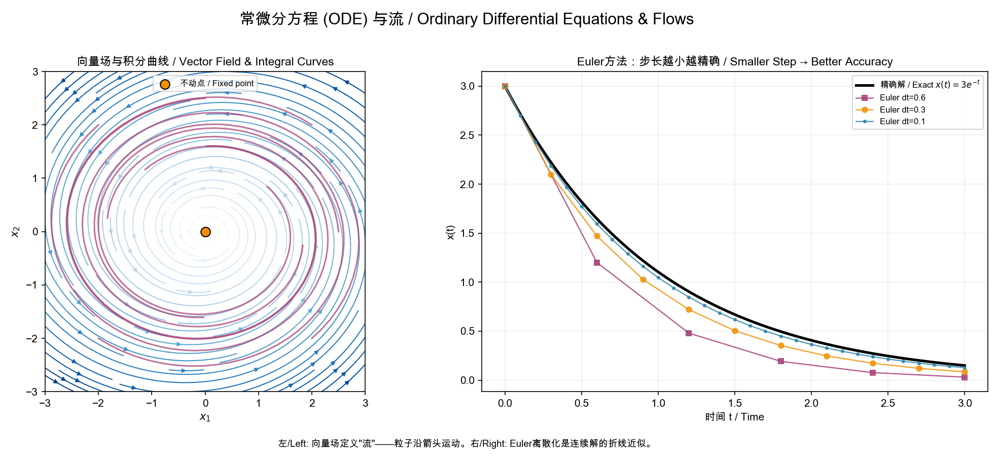

**左图（向量场与积分曲线）**：每个箭头是 $d\mathbf{x}/dt$ 的方向和大小。从任意起点出发，沿着箭头连续移动形成一条"积分曲线"（品红色）。中心不动点是 $d\mathbf{x}/dt = 0$ 的位置。所有这些积分曲线共同构成了一个**流 (flow)**——把空间中每个点映射到它未来的位置。

**右图（Euler 离散化）**：数值求解就是用折线逼近光滑曲线。步长 $dt$ 越大，误差越大。这就是为什么扩散模型用 1000 步（小步长）效果好，但 ODE 的确定性允许更智能的高阶方法（如 DPM-Solver）用大得多的步长达到同样的精度。

> **直觉**：ODE 流就像**天气预报的风场图**——每个点有一个确定的风向和风速（向量场）。一片叶子放在任意位置都会沿积分曲线飞行。PF-ODE 的"风"设计得如此精妙，以至于从任何噪声点出发，最终都会吹到数据分布中。

#### ODE 的数值求解

给定 $d\mathbf{x}/dt = h(\mathbf{x}, t)$，用 **Euler 方法** 从 $\mathbf{x}_t$ 近似 $\mathbf{x}_{t-\Delta t}$：

$$\mathbf{x}_{t-\Delta t} \approx \mathbf{x}_t - h(\mathbf{x}_t, t) \cdot \Delta t$$

高阶方法（如 Heun 的二阶方法，Runge-Kutta 4 阶方法）使用更多的中间评估来获得更高的精度，是 DPM-Solver 和 EDM 快速采样的基础。

### 0.9 变量替换与 Push-forward

对于一个可逆变换 $\phi: \mathbb{R}^d \to \mathbb{R}^d$，若 $\mathbf{z} \sim p(\mathbf{z})$ 且 $\mathbf{x} = \phi(\mathbf{z})$，则 $\mathbf{x}$ 的分布为：

$$p_{\mathbf{x}}(\mathbf{x}) = p_{\mathbf{z}}(\phi^{-1}(\mathbf{x}))\left|\det\frac{\partial\phi^{-1}}{\partial\mathbf{x}}(\mathbf{x})\right|$$

这个操作称为将分布 $p_{\mathbf{z}}$ **前推 (push-forward)** 为 $p_{\mathbf{x}}$。

在连续归一化流（CNF）和 Flow Matching 中，流映射 $\phi_t$ 将简单先验 $p_0$ 连续地变换为目标分布 $p_t$。

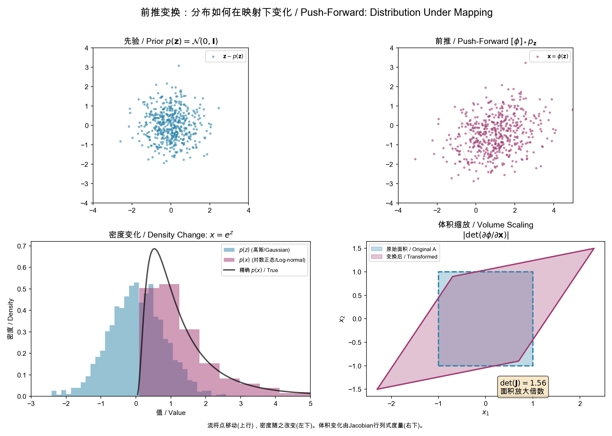

**左上→右上**：500 个高斯噪声点（$\mathbf{z} \sim \mathcal{N}(0,\mathbf{I})$）经过仿射变换 $\phi(\mathbf{z}) = \mathbf{W}\mathbf{z} + \mathbf{b}$ 后，云团被拉伸、旋转和平移。每个灰线连接了变换前后的对应点。

**左下（密度变化）**：当 $x = e^z$ 将高斯压缩时，密度也发生变化——$p(x)$ 不再是高斯，而是对数正态分布。Push-forward 公式 $p_x(x) = p_z(\phi^{-1}(x))|\det \partial\phi^{-1}/\partial x|$ 中的 Jacobian 因子精确地补偿了这种体积变化。

**右下（体积缩放）**：雅可比矩阵 $\mathbf{J} = \partial\phi/\partial\mathbf{z}$ 的行列式 $\det(\mathbf{J})$ 度量了变换 $\phi$ 对小体积元的放大倍数。蓝色正方形被拉伸为红色平行四边形，面积放大了 $\det(\mathbf{J}) = 1.56$ 倍。

> **直觉**：Push-forward 就像**揉面团**——初始均匀分布的面团（先验）被各种拉伸、旋转、折叠（流映射 $\phi_t$），最终变成我们想要的形状（数据分布）。Flow Matching 训练的就是这个揉面团的"手法"。

### 0.10 期望和 L2 范数记号

- $\mathbb{E}_{q(\mathbf{x})}[f(\mathbf{x})] = \int f(\mathbf{x})q(\mathbf{x})d\mathbf{x}$：在分布 $q$ 下的期望。实际训练中用 Monte Carlo 估计（小批量平均）。
- $\|\mathbf{x}\|^2 = \mathbf{x}^\top\mathbf{x} = \sum_i x_i^2$：向量的平方 $\ell_2$ 范数。
- $\|\boldsymbol{\epsilon} - \hat{\boldsymbol{\epsilon}}\|^2$ 形式的目标函数本质上是回归任务的均方误差 (MSE)。

---

## 主线总览

```
离散马尔可夫链 (2015)
    │
    └→ 噪声预测 + 得分匹配 (2020)
         │
         ├→ 非马尔可夫泛化 → ODE 确定性采样 (2021)
         ├→ 连续时间 SDE → PF-ODE 统一 (2021)
         ├→ SNR 参数化 → VLB 简洁形式 (2021)
         │
         ├→ 引导数学 (2021-2022)
         ├→ 设计空间统一 (2022)
         ├→ 半线性 ODE 快速求解 (2022)
         │
         └→ 向量场 / 流范式 (2023)
              │
              ├→ 直线流 + Reflow (2023)
              ├→ 自洽性 → 一步生成 (2023)
              │
              └→ Transformer 扩展律 (2023-2025)
```

**核心数学对象**：生成概率路径的**向量场**。

这个向量场在不同语言中有不同名称——它是得分函数 $\nabla\log p_t$，是噪声预测器 $\boldsymbol{\epsilon}_\theta$，是去噪器 $D_\theta$，是流速场 $v_t$——但它们描述的是**同一个东西**：如何从噪声分布移动到数据分布。

---

## 第一章：离散扩散——马尔可夫链的变分框架

### 1.1 起源 (Sohl-Dickstein, 2015)

一切从非平衡统计物理开始。给定数据分布 $q(\mathbf{x}_0)$，定义一个**前向扩散过程**：

$$q(\mathbf{x}_{1:T}|\mathbf{x}_0) = \prod_{t=1}^T q(\mathbf{x}_t|\mathbf{x}_{t-1})$$

$$q(\mathbf{x}_t|\mathbf{x}_{t-1}) = \mathcal{N}\left(\mathbf{x}_t; \sqrt{1-\beta_t}\,\mathbf{x}_{t-1}, \beta_t\mathbf{I}\right)$$

其中 $0 < \beta_1 < \cdots < \beta_T < 1$ 是噪声调度。

**关键性质**：当 $\beta_t$ 足够小，逆向条件分布 $q(\mathbf{x}_{t-1}|\mathbf{x}_t)$ 也是高斯的（尽管显式形式需要 $\mathbf{x}_0$）——这来自 §0.1 中高斯条件分布的封闭性。

定义一个参数化的**逆向马尔可夫链**：

$$p_\theta(\mathbf{x}_{0:T}) = p(\mathbf{x}_T)\prod_{t=1}^T p_\theta(\mathbf{x}_{t-1}|\mathbf{x}_t)$$

训练最大化数据似然，利用 §0.5 中的**变分下界 (ELBO)**：

$$\log p_\theta(\mathbf{x}_0) \geq \mathbb{E}_q\left[\log p_\theta(\mathbf{x}_0|\mathbf{x}_1) - \sum_{t=2}^T D_{\text{KL}}\big(q(\mathbf{x}_{t-1}|\mathbf{x}_t,\mathbf{x}_0)\,\big\|\,p_\theta(\mathbf{x}_{t-1}|\mathbf{x}_t)\big)\right]$$

### 1.2 实用化转机：噪声预测 (DDPM, Ho et al., 2020)

DDPM 做了两个关键简化。

**一、重参数化边缘分布**。利用 §0.3 的重参数化技巧，令 $\bar{\alpha}_t = \prod_{s=1}^t(1-\beta_s)$，则：

$$\mathbf{x}_t = \sqrt{\bar{\alpha}_t}\,\mathbf{x}_0 + \sqrt{1-\bar{\alpha}_t}\,\boldsymbol{\epsilon}$$

由此可以闭合形式地写出（使用 §0.1 的条件高斯公式）：

$$q(\mathbf{x}_{t-1}|\mathbf{x}_t,\mathbf{x}_0) = \mathcal{N}\left(\mathbf{x}_{t-1}; \frac{\sqrt{\bar{\alpha}_{t-1}}\beta_t}{1-\bar{\alpha}_t}\mathbf{x}_0 + \frac{\sqrt{\alpha_t}(1-\bar{\alpha}_{t-1})}{1-\bar{\alpha}_t}\mathbf{x}_t,\; \tilde{\beta}_t\mathbf{I}\right)$$

其中 $\tilde{\beta}_t = \frac{1-\bar{\alpha}_{t-1}}{1-\bar{\alpha}_t}\beta_t$.

**二、从预测 $\mathbf{x}_0$ 转向预测 $\boldsymbol{\epsilon}$**。代入 ELBO 的 KL 项，利用 $\mathbf{x}_0 = (\mathbf{x}_t - \sqrt{1-\bar{\alpha}_t}\,\boldsymbol{\epsilon})/\sqrt{\bar{\alpha}_t}$。根据 §0.2，当两个高斯有相同协方差时，KL 散度正比于均值差的平方。由此得到：

$$\mathcal{L}_{\text{simple}} = \mathbb{E}_{t,\mathbf{x}_0,\boldsymbol{\epsilon}}\left[\big\|\boldsymbol{\epsilon} - \boldsymbol{\epsilon}_\theta\big(\sqrt{\bar{\alpha}_t}\mathbf{x}_0 + \sqrt{1-\bar{\alpha}_t}\boldsymbol{\epsilon},\,t\big)\big\|^2\right]$$

这个简洁的形式与**去噪得分匹配**是等价的。利用 §0.4：

$$\nabla_{\mathbf{x}_t}\log q(\mathbf{x}_t|\mathbf{x}_0) = -\frac{\boldsymbol{\epsilon}}{\sqrt{1-\bar{\alpha}_t}} \implies \mathbf{s}_\theta(\mathbf{x}_t, t) = -\frac{\boldsymbol{\epsilon}_\theta(\mathbf{x}_t, t)}{\sqrt{1-\bar{\alpha}_t}}$$

#### 几何直观：前向扩散的视觉效果

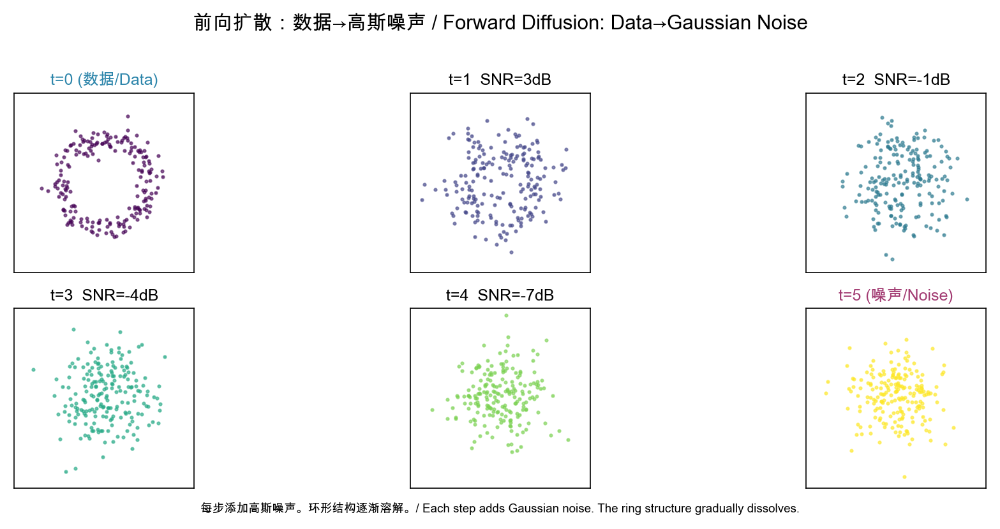

上图展示了一个 2D 环形数据分布（t=0）如何在 5 步扩散中逐渐被高斯噪声淹没。SNR 从 ∞ dB 衰减到接近 0 dB——信息被系统性地抹去。

**重参数化的几何意义**：$\mathbf{x}_t = \sqrt{\bar{\alpha}_t}\mathbf{x}_0 + \sqrt{1-\bar{\alpha}_t}\boldsymbol{\epsilon}$ 是一个**凸组合**（convex combination）——更准确地说，是 $\mathbf{x}_0$ 和 $\boldsymbol{\epsilon}$ 的加权和，权重平方和为 1。在几何上，$\mathbf{x}_t$ 位于连接 $\mathbf{x}_0$ 和某个高斯噪声样本的线段上的某处，越接近 $t=T$ 越靠近纯噪声。

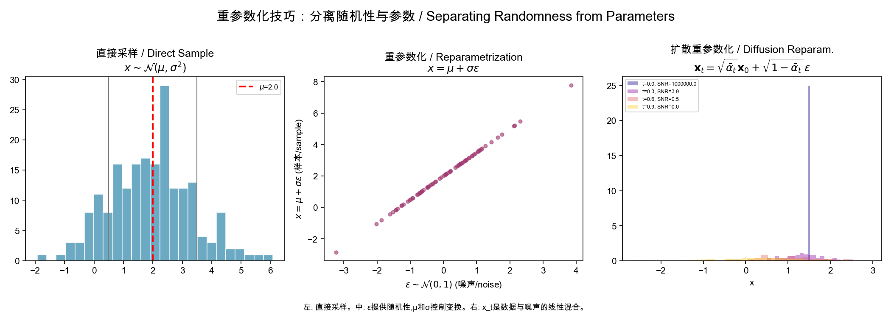

左图：直接抽样 $\mathcal{N}(\mu,\sigma^2)$。中图：$\epsilon \sim \mathcal{N}(0,1)$ 独立于 $\mu,\sigma$，梯度可以穿过参数。右图：$\mathbf{x}_t$ 是数据和噪声的线性混合。

> **直觉练习**：想象一张猫的照片（$\mathbf{x}_0$）。前向过程就像往照片上倒牛奶——最初牛奶很淡，猫清晰可见；随着倒入的牛奶增多，画面越来越模糊；最终只剩一片白色（纯噪声）。逆向过程就是网络学习**如何把牛奶从照片中分离出来**。

**主线节点 1**：从 ELBO 到 $\mathcal{L}_{\text{simple}}$，扩散模型与得分匹配建立了第一座桥梁。

---

## 第二章：从离散到连续——SDE 统一

### 2.1 打破马尔可夫锁链 (DDIM, Song et al., 2021)

DDIM 的关键观察：**DDPM 的损失只依赖于边缘分布 $q(\mathbf{x}_t|\mathbf{x}_0)$，不依赖于联合分布的具体形式**。

构建一族**非马尔可夫**前向过程，参数化为 $\sigma \in \mathbb{R}_{\geq 0}^T$：

$$q_\sigma(\mathbf{x}_{t-1}|\mathbf{x}_t, \mathbf{x}_0) = \mathcal{N}\left(\sqrt{\bar{\alpha}_{t-1}}\mathbf{x}_0 + \sqrt{1-\bar{\alpha}_{t-1} - \sigma_t^2}\,\frac{\mathbf{x}_t - \sqrt{\bar{\alpha}_t}\mathbf{x}_0}{\sqrt{1-\bar{\alpha}_t}},\; \sigma_t^2\mathbf{I}\right)$$

当 $\sigma_t = 0$，采样变为**确定的**——利用 §0.3 的思想，设噪声为零：

$$\mathbf{x}_{t-1} = \sqrt{\bar{\alpha}_{t-1}}\underbrace{\left(\frac{\mathbf{x}_t - \sqrt{1-\bar{\alpha}_t}\,\boldsymbol{\epsilon}_\theta}{\sqrt{\bar{\alpha}_t}}\right)}_{\hat{\mathbf{x}}_0} + \sqrt{1-\bar{\alpha}_{t-1}}\,\boldsymbol{\epsilon}_\theta$$

这个确定性映射可以看作是某个 **ODE** 的 Euler 离散化（§0.8）——但当时尚未被严格阐明。

### 2.2 连续时间 SDE 统一 (Score SDE, Song et al., 2021)

将离散步推到连续极限 $T \to \infty$。利用 §0.7 的 SDE 框架，噪声扰动由随机微分方程描述：

$$d\mathbf{x} = \mathbf{f}(\mathbf{x}, t)\,dt + g(t)\,d\mathbf{w}$$

**Anderson (1982)** 的逆 SDE 定理（§0.7）给出：

$$d\mathbf{x} = \big[\mathbf{f}(\mathbf{x}, t) - g(t)^2\nabla_\mathbf{x}\log p_t(\mathbf{x})\big]dt + g(t)\,d\bar{\mathbf{w}}$$

这是整个领域的**核心方程**。生成方向（噪声→数据）的动力学完全由**得分函数** $\nabla_\mathbf{x}\log p_t(\mathbf{x})$ 决定。

### 2.3 Probability Flow ODE

利用 §0.8 的 PF-ODE 理论，去除 SDE 的随机项得到等价的 ODE：

$$d\mathbf{x} = \left[\mathbf{f}(\mathbf{x}, t) - \frac{1}{2}g(t)^2\nabla_\mathbf{x}\log p_t(\mathbf{x})\right]dt$$

此 ODE 与 SDE 共享相同的边缘分布 $p_t(\mathbf{x})$。**这证明了确定性生成是可能的**——所有后续的快速采样、流匹配、一致性模型都从此出发。

### 2.4 DDPM 和 NCSN 的统一

- **VP-SDE**（对应 DDPM）：$\mathbf{f} = -\frac{1}{2}\beta(t)\mathbf{x}$, $g(t) = \sqrt{\beta(t)}$
- **VE-SDE**（对应 NCSN）：$\mathbf{f} = 0$, $g(t) = \sqrt{\frac{d[\sigma^2(t)]}{dt}}$

两个看似不同的方法被发现是**同一个框架在两种 SDE 下的特例**。

#### 几何直观：得分函数是指向数据的"罗盘"

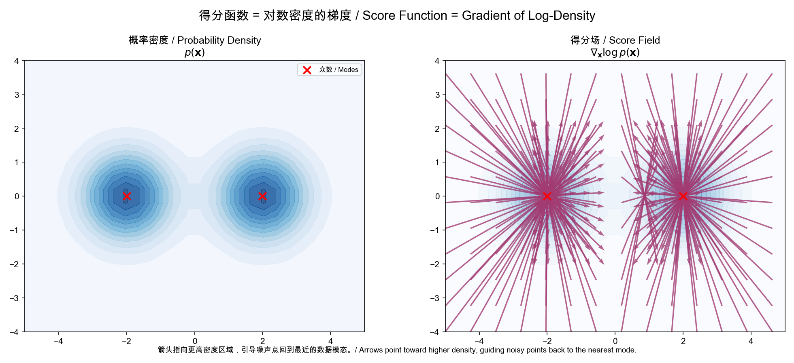

左图显示了一个双峰分布 $p(\mathbf{x})$（两个高斯混合）。右图的箭头是**得分函数** $\nabla_{\mathbf{x}}\log p(\mathbf{x})$——每个箭头指向最近的高密度区域。注意：

- **箭头的方向**指向密度增长最快的方向（the direction of steepest ascent in probability）
- **箭头的长度**表示密度变化的陡峭程度——在分布边缘长，在峰值附近短（在峰值处趋近于零）
- 每个 mode 像"吸引子"一样吸引周围的点

**物理类比**：将 $-\log p(\mathbf{x})$ 看作"势能"（potential energy），则得分函数 $-\nabla\log p$ 就是指向势能最低处的力（force）。扩散模型的逆向过程就像是**粒子在势能场中向低势能区滑动的运动**。

#### SDE vs ODE：随机路径与确定路径

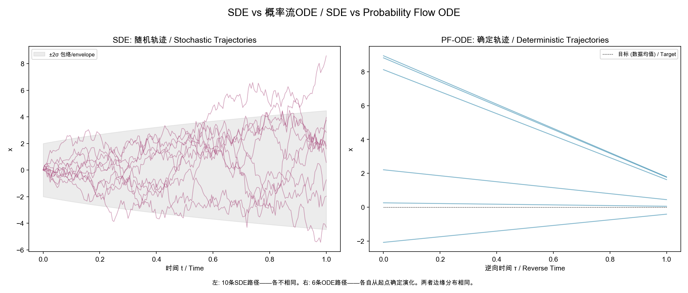

左图：SDE 从同一个起点出发的 10 条路径——每条不同（随机性）。右图：PF-ODE 从 6 个不同起点出发的确定路径——每个起点唯一确定一条轨迹。

两者的**边缘分布**在所有时间点上完全相同——这意味着 ODE 可以替代 SDE 进行采样。ODE 的优势在于**确定性和可逆性**：给定 $\mathbf{x}_0$ 和 $\mathbf{x}_T$，噪声和图像之间存在一对一的映射——这就是 DDIM 反演和图像编辑的数学基础。

**主线节点 2**：离散扩散 → 连续时间 SDE → PF-ODE，得分函数 $\nabla\log p_t$ 是统一核心。

---

## 第三章：信号噪声比——变分视角的统一语言

### 3.1 SNR 参数化 (VDM, Kingma et al., 2021)

VDM 引入了整个领域最有用的数学语言。不再分别处理 $\alpha_t$ 和 $\sigma_t$，而是使用它们的比值——**信噪比**：

$$\text{SNR}(t) = \frac{\alpha_t^2}{\sigma_t^2}, \qquad \mathbf{x}_t = \alpha_t\mathbf{x}_0 + \sigma_t\boldsymbol{\epsilon}$$

连续时间 VLB 可写成极简形式：

$$-\text{VLB} = \frac{1}{2}\mathbb{E}_{t,\boldsymbol{\epsilon}}\left[\frac{d\log\text{SNR}}{dt}\big\|\boldsymbol{\epsilon} - \hat{\boldsymbol{\epsilon}}_\theta(\mathbf{x}_t, t)\big\|^2\right]$$

### 3.2 关键定理：VLB 的噪声调度不变性

**连续时间 VLB 只依赖于端点 SNR 值——而不依赖于具体的噪声调度路径。**

这意味着：只要 $\text{SNR}(t=0) \gg 1$（数据端几乎无噪声）且 $\text{SNR}(t=T) \ll 1$（噪声端几乎纯高斯），任何单调递减的 SNR 函数都给出相同的生成模型。

这个定理铺垫了 EDM 的 $\sigma$-参数化设计空间，以及后续 Flow Matching 中"任意概率路径均可"的结论。

#### 几何直观：SNR 调度与 KL 散度的几何意义

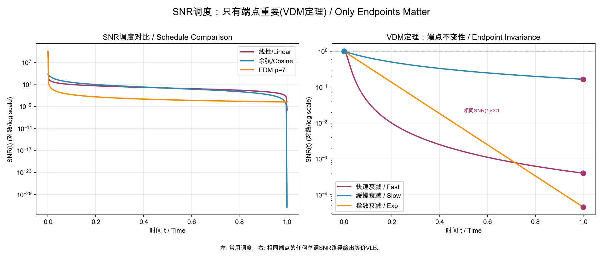

左图比较了三种 SNR 调度。**核心洞察**：只要 SNR(0) >> 1 且 SNR(1) << 1，所有调度等价。这就像爬山——不管走哪条路，只要从山脚（噪声）爬到山顶（数据），终点是一样的。中间的路径选择只影响**训练效率**而非最终结果。

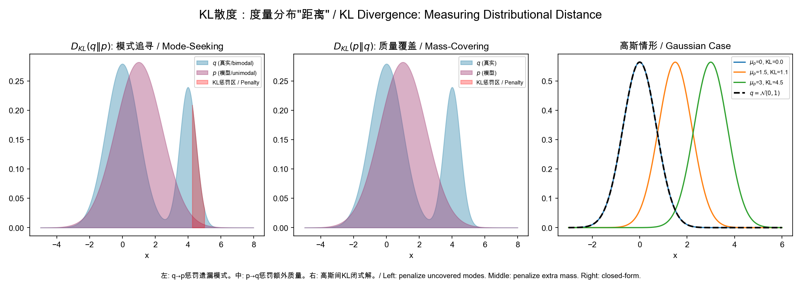

左图：$D_{KL}(q\|p)$ 是"mode-seeking"的——当真实分布 $q$ 有概率但模型 $p$ 没有时，惩罚极大（红色区域）。这解释了为什么扩散模型的逆向过程要以**精确匹配数据分布模式**为目标。

中图：$D_{KL}(p\|q)$ 是"mass-covering"的——当模型 $p$ 产生 $q$ 没有的样本时受惩罚。右图：两个高斯之间 KL 的闭式解：$D_{KL} = \frac{1}{2}\frac{\|\boldsymbol{\mu}_p-\boldsymbol{\mu}_q\|^2}{\sigma^2}$.

**为什么扩散模型用 $D_{KL}(q\|p)$？** 因为 $q$ 是已知的前向过程（简单的高斯条件分布），$p_\theta$ 是我们学习的逆向过程。我们想让 $p_\theta$ 精确覆盖 $q$ 的每个模式（即每个 $t$ 处的真实去噪方向）。

**主线节点 3**：SNR 是比 $\alpha_t$/$\sigma_t$ 更本质的变量。噪声调度的具体形式不重要，端点 SNR 才重要。

---

## 第四章：引导与控制——得分空间的贝叶斯规则

### 4.1 Classifier Guidance (Dhariwal & Nichol, 2021)

在采样时利用贝叶斯规则修改得分（§0.4）：

$$\nabla_{\mathbf{x}}\log p_w(\mathbf{x}|y) = \nabla_{\mathbf{x}}\log p(\mathbf{x}) + w\cdot\nabla_{\mathbf{x}}\log p(y|\mathbf{x})$$

$w > 1$ 放大条件信号，$w = 1$ 为标准贝叶斯，$w = 0$ 为无条件。

使用噪声预测的语言（利用 $\mathbf{s}_\theta$ 与 $\boldsymbol{\epsilon}_\theta$ 的关系 §1.2）：

$$\hat{\boldsymbol{\epsilon}}_\theta(\mathbf{x}_t, y) = \boldsymbol{\epsilon}_\theta(\mathbf{x}_t) - w\sqrt{1-\bar{\alpha}_t}\,\nabla_{\mathbf{x}_t}\log p_\phi(y|\mathbf{x}_t)$$

### 4.2 Classifier-Free Guidance (Ho & Salimans, 2021)

不显式需要 $p(y|\mathbf{x})$。训练时以概率 $p_{\text{uncond}}$ 丢弃条件：

$$\tilde{\boldsymbol{\epsilon}}_\theta(\mathbf{x}, c) = (1+w)\boldsymbol{\epsilon}_\theta(\mathbf{x}, c) - w\,\boldsymbol{\epsilon}_\theta(\mathbf{x}, \varnothing)$$

这隐式实现了得分空间的贝叶斯外推：

$$\nabla_{\mathbf{x}}\log\tilde{p}_w(\mathbf{x}|c) \approx \nabla_{\mathbf{x}}\log p(\mathbf{x}) + w\big[\nabla_{\mathbf{x}}\log p(\mathbf{x}|c) - \nabla_{\mathbf{x}}\log p(\mathbf{x})\big]$$

CFG 成为后续一切文生图/文生视频模型的**标准采样策略**。

#### 几何直观：引导是分布空间的"锐化"操作

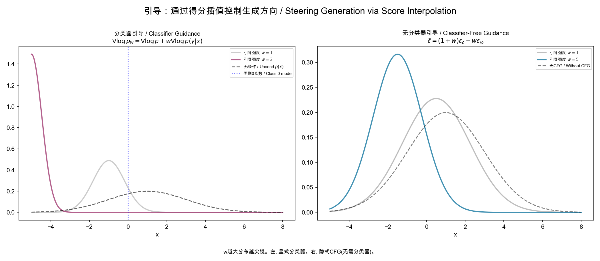

两幅图展示了 $w$ 增加时的效果——分布变得更尖锐、更集中在条件模式附近。**直观理解**：

- $w = 1$：标准贝叶斯后验——条件信号的"诚实"表示
- $w > 1$：放大条件信号——"更确定地朝特定类别方向走"
- $w \to \infty$：坍缩到条件分布的单一模式（失去多样性）

在得分空间中，引导相当于从无条件得分的末端出发，沿着"条件得分 - 无条件得分"的方向**继续向外走**。这个方向就是条件信息所指示的"更符合描述"的方向。

**主线节点 4**：引导是**得分空间的线性插值**（贝叶斯外推），不需要重新训练。

---

## 第五章：设计空间统一与快速采样

### 5.1 EDM——以 $\sigma$ 为中心的全新设计 (Karras et al., 2022)

EDM 将扩散模型从 SDE 推导的繁重理论中解放出来，转向以**噪声标准差 $\sigma$** 为自变量的实用 ODE 框架（§0.8）。

**概率流 ODE**（简化形式）：

$$d\mathbf{x} = -\sigma\,\nabla_{\mathbf{x}}\log p(\mathbf{x};\sigma)\,d\sigma$$

**Preconditioning**（预条件）——利用 §0.3 的思路，对网络输入/输出缩放以稳定训练：

$$D_\theta(\mathbf{x};\sigma) = c_{\text{skip}}(\sigma)\,\mathbf{x} + c_{\text{out}}(\sigma)F_\theta\big(c_{\text{in}}(\sigma)\,\mathbf{x};\,c_{\text{noise}}(\sigma)\big)$$

其中去噪器 $D_\theta$ 与得分的关系（利用 §0.4）：

$$\nabla_{\mathbf{x}}\log p(\mathbf{x};\sigma) = \frac{D_\theta(\mathbf{x};\sigma) - \mathbf{x}}{\sigma^2}$$

$c_{\text{skip}}$, $c_{\text{out}}$, $c_{\text{in}}$ 的选取使得网络输入 $c_{\text{in}}\mathbf{x}$ 和输出目标 $(D - c_{\text{skip}}\mathbf{x})/c_{\text{out}}$ 在所有 $\sigma$ 水平上保持单位方差。

### 5.2 DPM-Solver——利用半线性结构 (Lu et al., 2022)

DPM-Solver 揭示了扩散 ODE 的**半线性结构**（§0.8）：

$$\frac{d\mathbf{x}_t}{dt} = f(t)\mathbf{x}_t + \underbrace{\frac{g(t)^2}{2\sigma_t}\boldsymbol{\epsilon}_\theta(\mathbf{x}_t, t)}_{\text{非线性项}}$$

线性部分 $d\mathbf{x}_t/dt - f(t)\mathbf{x}_t = 0$ 有精确解。通过**指数积分**（将 §0.7 的 ODE 求解器思想与扩散 ODE 的特殊结构结合），只对非线性项做数值近似：

$$\mathbf{x}_s = \frac{\alpha_s}{\alpha_t}\mathbf{x}_t + \alpha_s\int_{\lambda_t}^{\lambda_s} e^{-\lambda}\,\hat{\boldsymbol{\epsilon}}_\theta(\hat{\mathbf{x}}_\lambda, \lambda)\,d\lambda$$

其中 $\lambda_t = \log(\alpha_t/\sigma_t)$ 是对数 SNR。这使得 **15-20 步达到 1000 步的质量**。

**主线节点 5**：扩散 ODE 有可利用的数学结构（半线性、指数积分），专用求解器远超通用 ODE 求解器。

---

## 第六章：概率流范式——从去噪得分到向量场

### 6.1 Flow Matching (Lipman et al., 2023)

Flow Matching 是范式转移。它不再把扩散模型看作"SDE 的逆向"（§0.7），而是直接定义和回归**概率路径的向量场**（§0.8）。

**核心对象**：目标向量场 $u_t(\mathbf{x})$，生成概率路径 $p_t(\mathbf{x})$：
$$d\mathbf{x}_t = u_t(\mathbf{x}_t)\,dt$$

**问题**：$u_t$ 通常是未知的。Flow Matching 的关键技巧（类似 §0.5 中变分推断使用条件分布的思想）是用**条件向量场**来引导训练：

$$u_t(\mathbf{x}) = \int u_t(\mathbf{x}|\mathbf{x}_1)\,\frac{p_t(\mathbf{x}|\mathbf{x}_1)q(\mathbf{x}_1)}{p_t(\mathbf{x})}\,d\mathbf{x}_1$$

**决定性定理**：条件目标与无条件目标有相同梯度：
$$\nabla_\theta\mathcal{L}_{\text{FM}}(\theta) = \nabla_\theta\mathcal{L}_{\text{CFM}}(\theta)$$

条件 Flow Matching 损失——纯回归任务：

$$\mathcal{L}_{\text{CFM}}(\theta) = \mathbb{E}_{t,q(\mathbf{x}_1),p_t(\mathbf{x}|\mathbf{x}_1)}\Big[\|v_\theta(\mathbf{x}, t) - u_t(\mathbf{x}|\mathbf{x}_1)\|^2\Big]$$

**扩散路径是特例**。更重要的是，可以选择**最优传输 (OT) 路径**——利用 §0.3 将条件概率路径设计为直线：

$$p_t(\mathbf{x}|\mathbf{x}_1) = \mathcal{N}(\mathbf{x}; t\mathbf{x}_1, (1-(1-\sigma_{\min})t)^2\mathbf{I})$$

OT 路径是**直线**——比扩散路径更简单、训练更快、采样更高效。

### 6.2 Rectified Flow (Liu et al., 2023)

Rectified Flow 从另一个角度达到同一结论。给定 $X_0 \sim \pi_0$, $X_1 \sim \pi_1$，直接学习直线插值的向量场——利用 §0.3 和 §0.8：

$$X_t = tX_1 + (1-t)X_0$$

训练——来自 §0.10 的 MSE 回归：
$$\min_v \mathbb{E}_{(X_0,X_1),t}\Big[\|(X_1 - X_0) - v(X_t, t)\|^2\Big]$$

**Reflow** 是让流变直的关键机制：反复用前一次的流生成配对样本，再重新训练（利用 §0.9 的 push-forward 思想）。理论上保证：
1. 每一步 Reflow 不增加任意凸代价下的传输代价
2. 两步 Reflow 后流几乎完全直线
3. 直线流只需 1 次 Euler 步（§0.8）即可精准模拟

### 6.3 扩散与流的统一视角 (SiT, Ma et al., 2024)

SiT 在**插值框架**下系统比较了两种范式——这个框架本身就是 §0.3 重参数化技巧的直接推广：

$$\mathbf{x}_t = \alpha_t\mathbf{x}_* + \sigma_t\boldsymbol{\epsilon}$$

| 预测目标 | 表达式 | 来源 |
|---------|--------|------|
| $\epsilon$ | 预测噪声 | DDPM (§1.2) |
| $x_0$ | 预测干净数据 | EDM (§5.1) |
| $v$ | $v = \alpha_t\epsilon - \sigma_t x_0$ | Salimans & Ho (2022) |

**结论**：Flow Matching + $v$-prediction + ODE 采样在 ImageNet 上全面超越扩散模型。

#### 几何直观：概率路径的演化与直线流

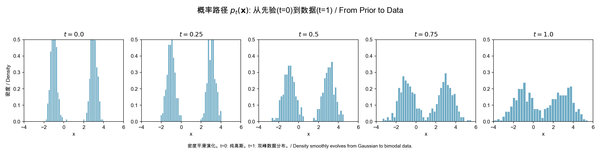

从 $t=0$（标准高斯先验）到 $t=1$（双峰数据分布），概率密度平滑地变形。Flow Matching 的核心任务是学习一个向量场 $v_t$，使得沿着它移动的概率密度恰好按照这个路径演化。这就像**引导一滴墨水在流动的水中按照预定路径扩散**——$v_t$ 就是水流的速度场。

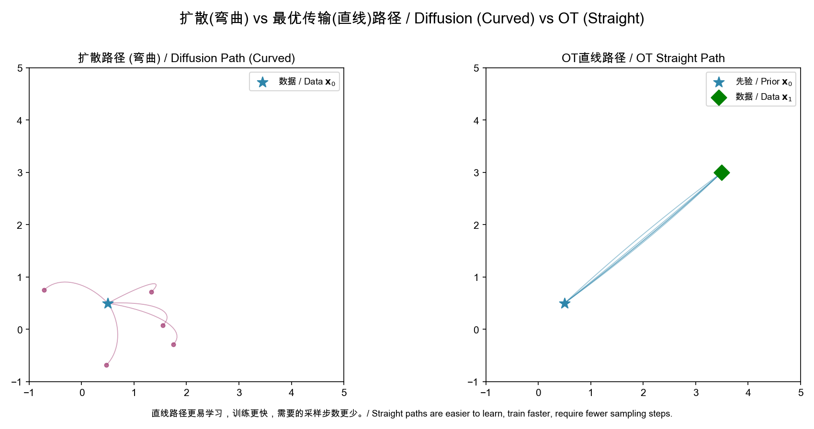

**左图（扩散路径）**：从先验（星形）到数据的路径是弯曲的。扩散过程天然倾向于走"弯路"，因为随机布朗运动不是最短路径。

**右图（OT 直线路径）**：路径尽可能直——$\mathbf{x}_t = t\mathbf{x}_1 + (1-t)\mathbf{x}_0$。直线路径可以用**更少的离散化步数**精确模拟——欧拉方法对直线是精确的，但对曲线会产生累积误差。

**传输代价的直观**：想象从 A 点开车到 B 点。扩散路径像在城市中绕行（弯弯曲曲），OT 路径像走高速公路（直线）。Reflow 就像不断用 GPS 优化路线——每次迭代都找到更直的路线。

**主线节点 6**：从去噪得分 $\nabla\log p$ 到向量场 $v$ 是自然的进化。扩散是概率路径的特例，OT 直线路径是更优的选择。

---

## 第七章：一步生成——从 PF-ODE 到自洽性

### Consistency Models (Song et al., 2023)

最终目标：让一步就够了。从 PF-ODE（§2.3）出发，使用 Karras 设置（§5.1）：

$$d\mathbf{x}_t = -\frac{1}{2}\sigma(t)^2\nabla_{\mathbf{x}}\log p_t(\mathbf{x}_t)\,dt$$

定义**一致性函数** $f(\mathbf{x}_t, t) \to \mathbf{x}_0$——利用 §0.4 中得分函数的思想，但直接映射到干净数据：

$$\forall t, t' \in [0, T]: \quad f(\mathbf{x}_t, t) = f(\mathbf{x}_{t'}, t') = \mathbf{x}_0$$

**蒸馏**（有预训练模型）——§0.8 的 ODE 求解器用于生成配对训练数据：

$$\mathcal{L} = \mathbb{E}\Big[d\big(f_\theta(\mathbf{x}_{t_{n+1}}, t_{n+1}),\; f_{\theta^-}(\hat{\mathbf{x}}_{t_n}, t_n)\big)\Big]$$

**独立训练**（从零开始）——利用 §0.3 的重参数化直接生成同一轨迹上的相邻点：

$$\mathcal{L} = \mathbb{E}\Big[d\big(f_\theta(\mathbf{x}_0 + t_{n+1}\mathbf{z},\,t_{n+1}),\; f_{\theta^-}(\mathbf{x}_0 + t_n\mathbf{z},\,t_n)\big)\Big]$$

采样极简：$\hat{\mathbf{x}}_0 = f_\theta(\mathbf{x}_T, T)$，一次网络前向。

#### 几何直观：自洽性——轨迹上的所有点汇于同一原点

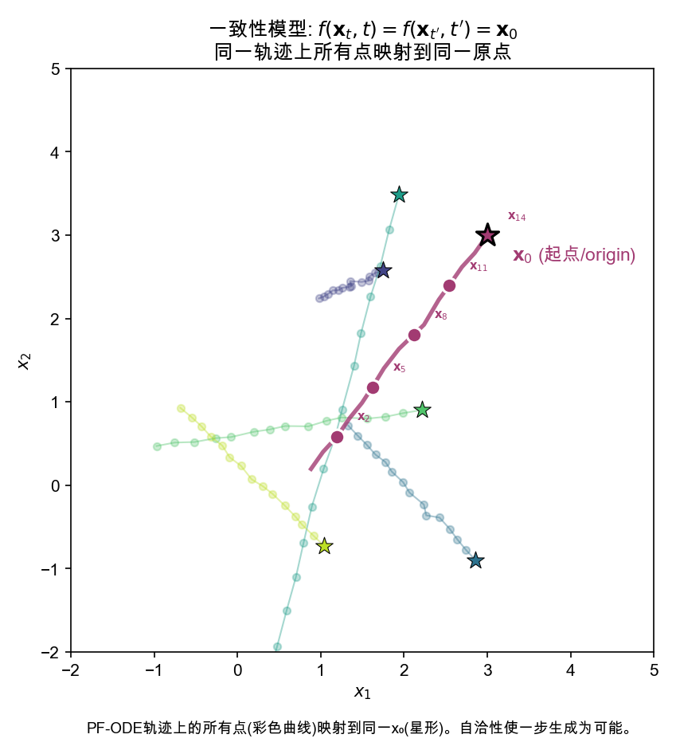

图中展示了 5 条 PF-ODE 轨迹（彩色曲线）。**自洽性**的要求是：每条轨迹上的**所有点**都映射到同一个终点（星形标记的 $\mathbf{x}_0$）。

高亮的品红色轨迹展示了关键洞察——标记为 $\mathbf{x}_2, \mathbf{x}_5, \mathbf{x}_8, \mathbf{x}_{11}, \mathbf{x}_{14}$ 的五个点被一致性函数 $f_\theta$ 映射到同一个 $\mathbf{x}_0$。训练时，通过在**相邻时间步**之间施加这种一致性来逐步学习：

$$f_\theta(\mathbf{x}_{t_{n+1}}, t_{n+1}) \approx f_{\theta^-}(\mathbf{x}_{t_n}, t_n)$$

从 $t_{n+1}$ 到 $t_n$ 的小步一致性一旦建立，就可以**链式传播**到全轨迹——$t_T$ 的点可以通过一连串中间点最终映射到 $t_0$。一次前向就够了。

**物理类比**：一致性模型像**时间反演对称性**——给定粒子在任一时刻的位置，你都能推断出它的初始位置。就像看到一个弹道轨迹上的任意一点，就立刻知道发射点在哪里。

**主线节点 7**：如果 PF-ODE 轨迹上的所有点映射到同一原点，那么从噪声到数据只需一步。这是扩散模型推理加速的极致。

---

## 第八章：从 U-Net 到 Transformer——通往规模化之路

### 8.1 DiT (Peebles & Xie, 2023)

$$\text{Image} \xrightarrow{\text{Patchify}} \text{Tokens} \xrightarrow{\text{Transformer Blocks + AdaLN}} \text{Denoised Patches}$$

条件注入（adaLN-Zero）——利用类似 §0.2 中约束优化的思想，零初始化保证训练稳定性：

$$\text{adaLN}(h, c) = \gamma(c) \cdot h + \beta(c), \quad \gamma_{\text{init}} = 0$$

与 Transformer 语言模型相似，DiT 展示了**扩展律**：更大的模型→更低的 FID。

### 8.2 SD3 (Esser et al., 2024)

SD3 将一切整合在一起——前七章的数学在此汇聚：

$$\text{SD3} = \underbrace{\text{MM-DiT}}_{\text{§8.1 架构}} + \underbrace{\text{Rectified Flow}}_{\text{§6.2 直线路径}} + \underbrace{\text{大规模训练}}_{\text{§0.10 Monte Carlo 估计在亿级数据上}}$$

MM-DiT 用分离的文本/图像注意力权重实现跨模态交互。训练使用 Rectified Flow 的直线路径和 ln-SNR 加权（§3.1）。

**核心经验**：Scaling Works。更大的模型在文本理解、视觉质量、拼写准确率上全面改善。

**主线节点 8**：扩散模型的扩展律与 LLM 相似——Transformer 骨干 + 大规模训练 → 单调改善。

---

## 总结：一条主线，三个方程

贯穿 34 篇论文的数学主线可以通过**三个演变阶段的方程**来总结：

### 阶段 I：离散扩散 (2015-2020)

$$\mathcal{L} = \mathbb{E}_{t,\mathbf{x}_0,\boldsymbol{\epsilon}}\Big[\|\boldsymbol{\epsilon} - \boldsymbol{\epsilon}_\theta(\sqrt{\bar{\alpha}_t}\mathbf{x}_0 + \sqrt{1-\bar{\alpha}_t}\boldsymbol{\epsilon},\,t)\|^2\Big]$$

### 阶段 II：连续时间 SDE/ODE (2021-2022)

$$d\mathbf{x} = \underbrace{\big[\mathbf{f}(\mathbf{x},t) - \frac{1}{2}g(t)^2\nabla_{\mathbf{x}}\log p_t(\mathbf{x})\big]dt}_{\text{概率流 ODE}}$$

$$\nabla_{\mathbf{x}}\log p(\mathbf{x};\sigma) = \frac{D_\theta(\mathbf{x};\sigma) - \mathbf{x}}{\sigma^2}$$

### 阶段 III：概率流 / 向量场 (2023-2025)

$$\min_{v} \mathbb{E}_{(X_0, X_1), t}\Big[\|(X_1 - X_0) - v_\theta(X_t, t)\|^2\Big]$$

$$f_\theta(\mathbf{x}_T, T) \to \mathbf{x}_0 \quad \text{(一步生成)}$$

---

这三个方程讲的是同一个故事：**找到一条从噪声到数据的路径，并沿着它移动**。

- **阶段 I** 用小步马尔可夫链（§0.6）逼近，每一步预测噪声（§0.3）
- **阶段 II** 发现整个过程由一个 ODE（§0.8）描述，核心是得分函数（§0.4），并利用 Anderson 逆向 SDE 定理（§0.7）
- **阶段 III** 认识到可以直接学习这个 ODE 的向量场（§0.9），且直线路径是最优的，一步生成是终极目标

数学语言从 KL 散度 → SDE → ODE → 向量场回归，但**核心问题从未改变：如何最有效地从 $\mathcal{N}(0,\mathbf{I})$ 走到 $p_{\text{data}}$**。

---

## 附录：各章涉及的基础知识索引

| 数学概念 | 首次使用章节 | 详见 § |
|----------|------------|-------|
| 高斯分布及条件高斯 | 第一章 | 0.1 |
| KL 散度 | 第一章 | 0.2 |
| 重参数化技巧 | 第一章 | 0.3 |
| 得分函数 | 第一、二章 | 0.4 |
| ELBO / 变分推断 | 第一章 | 0.5 |
| 马尔可夫链 | 第一、二章 | 0.6 |
| SDE / 逆向 SDE | 第二、三章 | 0.7 |
| ODE / PF-ODE / Euler 求解 | 第二、五章 | 0.8 |
| Push-forward / 变量替换 | 第六、七章 | 0.9 |
| 期望 / L2 范数 | 全文 | 0.10 |

[← 回到首页](../README)
