# DeepSeek-V4 注意力机制深度解析
[← 回到首页](..)


> 从标准 Attention 到 MLA、DSA、CSA/HCA 的完整演化路径

---

## 目录

1. [单头注意力：Q/K/V 的直觉与数学](#1-单头注意力qkv-的直觉与数学)
2. [标准多头注意力（MHA）](#2-标准多头注意力mha)
3. [多查询注意力（MQA）与分组查询注意力（GQA）](#3-多查询注意力mqa与分组查询注意力gqa)
4. [多头潜在注意力（MLA）](#4-多头潜在注意力mla)
5. [DeepSeek 稀疏注意力（DSA）](#5-deepseek-稀疏注意力dsa)
6. [压缩稀疏注意力（CSA）](#6-压缩稀疏注意力csa)
7. [重度压缩注意力（HCA）](#7-重度压缩注意力hca)
8. [混合注意力架构：CSA + HCA 的协同设计](#8-混合注意力架构csa--hca-的协同设计)
9. [全链路对比总结](#9-全链路对比总结)

---

## 1. 单头注意力：Q/K/V 的直觉与数学

在深入 MLA 等进阶架构之前，先用一章把最简单的**"单头注意力"**讲透。后面的所有变体（多头、MLA、CSA/HCA）本质上都是在这一章的公式上做改造。

### 1.1 直觉：从"查字典"说起

想象你读一句话：**"The cat sat on the mat because it was tired."**

当你读到最后一个词 "it" 时，大脑会自动判断它指代 "cat" 还是 "mat"。这个过程可以抽象为三步：

1. 对当前位置 "it" 形成一个**查询 Query**：「我需要找一个单数名词的指代」
2. 对之前每个词打一个**标签 Key**：「我是单数名词 cat」「我是复数名词 cats」...
3. 根据 Query 和每个 Key 的匹配程度，从对应词那里**读取 Value**（语义信息）

- **Query（查询）** = "我想找什么" —— 由当前位置发出
- **Key（键）** = "我是什么" —— 由每个历史位置发出
- **Value（值）** = "我存了什么信息" —— 被 Query×Key 匹配后加权读出

这就是 Attention 的核心隐喻：**一次可微分的字典查询**。

### 1.2 数学公式

设序列长度为 $L$，隐藏维度为 $d$（例如 $d=1024$）。第 $t$ 个位置的输入向量为 $\mathbf{h}_t \in \mathbb{R}^d$。

**符号约定**：

| 符号 | 含义 | 维度 |
|------|------|------|
| $\mathbf{h}_t$ | 第 $t$ 个位置的输入向量 | $\mathbb{R}^d$ |
| $\mathbf{q}_t$ | 第 $t$ 个位置的 Query 向量 | $\mathbb{R}^{d_k}$ |
| $\mathbf{k}_t$ | 第 $t$ 个位置的 Key 向量 | $\mathbb{R}^{d_k}$ |
| $\mathbf{v}_t$ | 第 $t$ 个位置的 Value 向量 | $\mathbb{R}^{d_v}$ |
| $\mathbf{W}^Q$ | Query 投影矩阵 | $\mathbb{R}^{d_k \times d}$ |
| $\mathbf{W}^K$ | Key 投影矩阵 | $\mathbb{R}^{d_k \times d}$ |
| $\mathbf{W}^V$ | Value 投影矩阵 | $\mathbb{R}^{d_v \times d}$ |

本章暂不引入多头概念。$d_k$ 和 $d_v$ 可以等于 $d$（不做降维），也可以是任意维度。

**Step 1：投影生成 Q、K、V**

将同一个输入 $\mathbf{h}_t$ 分别通过三个可学习的矩阵，投影到三个不同的子空间：

$$
\boxed{\mathbf{q}_t = \mathbf{W}^Q \,\mathbf{h}_t} \qquad
\boxed{\mathbf{k}_t = \mathbf{W}^K \,\mathbf{h}_t} \qquad
\boxed{\mathbf{v}_t = \mathbf{W}^V \,\mathbf{h}_t}
$$

**为什么要三个投影而不是一个？** 如果直接用 $\mathbf{h}_t$ 自己做内积（$\mathbf{h}_t^\top \mathbf{h}_s$），同一个向量既当"提问者"又当"被提问者"——这类似于让同一个学生既出考卷又答题，能力被对称性锁死。三个投影解除这种约束：Q 学习"如何提问"，K 学习"如何被检索"，V 学习"传递什么信息"，三者各司其职。

**Step 2：计算相关性分数**

对当前位置 $t$，让它对每一个历史位置 $j$（$j=1,2,\ldots,t$）计算 Query 和 Key 的内积，得到相关性分数。除以 $\sqrt{d_k}$ 是为了防止内积值过大导致 Softmax 梯度消失：

$$
\boxed{\alpha_{t,j} = \frac{\mathbf{q}_t^\top \mathbf{k}_j}{\sqrt{d_k}}}
$$

**Step 3：Softmax 归一化**

将分数转为概率分布（所有权重之和为 1）：

$$
\boxed{a_{t,j} = \text{Softmax}_j(\alpha_{t,:}) = \frac{\exp(\alpha_{t,j})}{\sum_{s=1}^{t} \exp(\alpha_{t,s})}}
$$

**Step 4：加权聚合 Value**

以归一化后的注意力权重 $a_{t,j}$ 为系数，对所有历史位置的 $\mathbf{v}_j$ 做加权求和，得到位置 $t$ 的注意力输出：

$$
\boxed{\mathbf{o}_t = \sum_{j=1}^{t} a_{t,j} \,\mathbf{v}_j}
$$

这四步合起来写成一行，就是单头注意力的完整公式：

$$
\boxed{\mathbf{o}_t = \sum_{j=1}^{t} \text{Softmax}_j\!\left(\frac{\mathbf{q}_t^\top \mathbf{k}_j}{\sqrt{d_k}}\right) \mathbf{v}_j}
$$

### 1.3 每一步的物理含义

| Step | 公式 | 物理含义 |
|------|------|----------|
| ① 投影 | $\mathbf{q}_t = \mathbf{W}^Q\mathbf{h}_t,\; \mathbf{k}_t = \mathbf{W}^K\mathbf{h}_t,\; \mathbf{v}_t = \mathbf{W}^V\mathbf{h}_t$ | 同一个输入分裂为三个角色：提问者、被检索者、信息载体 |
| ② 打分 | $\alpha_{t,j} = \mathbf{q}_t^\top \mathbf{k}_j \,/\, \sqrt{d_k}$ | Query 与 Key 的匹配度：位置 $t$ 对位置 $j$ 有多"感兴趣" |
| ③ 归一化 | $a_{t,j} = \text{Softmax}_j(\alpha_{t,:})$ | 将匹配度转为概率权重，确保总和为 1 |
| ④ 聚合 | $\mathbf{o}_t = \sum_j a_{t,j}\,\mathbf{v}_j$ | 按权重"读取"各位置的 Value，汇总为输出 |

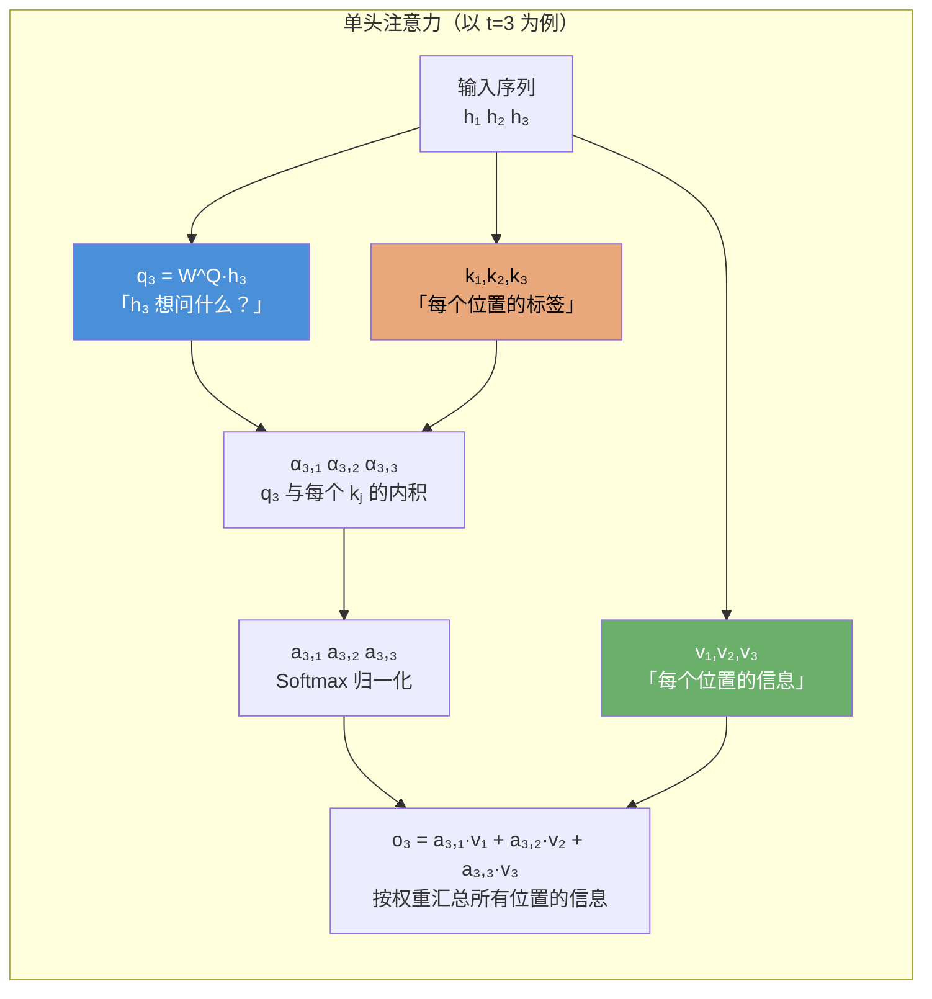

**单头 → 多头**：下一章将看到，把 $d$ 维切分为 $n_h$ 个独立的低维子空间（每个子空间一组 $\mathbf{W}^Q, \mathbf{W}^K, \mathbf{W}^V$），让它们并行执行上述计算，就是多头注意力（MHA）。每个头可以关注不同的模式（语法、语义、位置等），最后拼接融合。

---

## 2. 标准多头注意力（MHA）

### 2.1 符号约定

| 符号 | 含义 | 维度 |
|------|------|------|
| $\mathbf{h}_t$ | 第 $t$ 个 token 的输入向量 | $\mathbb{R}^d$ |
| $\mathbf{W}_i^Q, \mathbf{W}_i^K, \mathbf{W}_i^V$ | 第 $i$ 个头的 Q/K/V 投影矩阵 | $\mathbb{R}^{d_h \times d}$ |
| $\mathbf{q}_{t,i}, \mathbf{k}_{t,i}, \mathbf{v}_{t,i}$ | 第 $i$ 个头在第 $t$ 个位置的 Q/K/V | $\mathbb{R}^{d_h}$ |
| $\mathbf{W}^O$ | 输出投影矩阵 | $\mathbb{R}^{d \times n_h d_h}$ |

### 2.2 数学定义

MHA 将输入 $\mathbf{h}_t$ 分别投影到 $n_h$ 个独立的子空间，每个子空间维度为 $d_h = d / n_h$。

以 $d = 4096, n_h = 16$ 为例，则每头维度 $d_h = 4096 / 16 = 256$。DeepSeek-V3 中 $d = 7168, n_h = 128$，若使用标准 MHA 则 $d_h = 7168 / 128 = 56$。

**Step 1：Q/K/V 投影（每个头独立）**

$$
\boxed{\mathbf{q}_{t,i} = \mathbf{W}_i^Q \mathbf{h}_t} \qquad
\boxed{\mathbf{k}_{t,i} = \mathbf{W}_i^K \mathbf{h}_t} \qquad
\boxed{\mathbf{v}_{t,i} = \mathbf{W}_i^V \mathbf{h}_t}
$$

其中 $i = 1, \ldots, n_h$，$\mathbf{W}_i^Q, \mathbf{W}_i^K, \mathbf{W}_i^V \in \mathbb{R}^{d_h \times d}$。三个投影矩阵总参数量为 $3 \times n_h \times d_h \times d = 3d^2$，每 token 计算量为 $O(d^2)$。

**Step 2：缩放点积注意力（每个头独立）**

$$
\boxed{\mathbf{o}_{t,i} = \sum_{j=1}^{t} \text{Softmax}_j\!\left(\frac{\mathbf{q}_{t,i}^\top \mathbf{k}_{j,i}}{\sqrt{d_h}}\right) \mathbf{v}_{j,i}}
$$

- **内积 $\mathbf{q}_{t,i}^\top \mathbf{k}_{j,i}$**：对每个 query 需与 $t$ 个 key 计算 → $O(L \cdot d_h)$ 每头，全部 $n_h$ 头为 $O(L \cdot n_h d_h) = O(L \cdot d)$。对全部 $L$ 个 query 则为 $O(L^2 d)$。
- **Softmax + 加权求和**：$O(L^2 d_h)$ 每头，总计 $O(L^2 d)$。

**Step 3：多头拼接 + 输出投影**

$$
\boxed{\mathbf{u}_t = \mathbf{W}^O \cdot [\mathbf{o}_{t,1}; \mathbf{o}_{t,2}; \ldots; \mathbf{o}_{t,n_h}]}
$$

这一步的计算量为 $d \times n_h d_h = d^2$ FLOPs/token。

### 2.3 复杂度对照表

| Step | 操作 | 每 Token 复杂度 | 全序列复杂度 |
|------|------|----------------|-------------|
| ① QKV 投影 | $\mathbf{W} \cdot \mathbf{h}_t$（矩阵-向量乘） | $O(d^2)$ | $O(L d^2)$ |
| ② 注意力分数 | $\mathbf{q}_{t,i}^\top \mathbf{k}_{j,i}$（内积） | $O(L d)$ | $O(L^2 d)$ |
| ② 加权求和 | $\sum \text{softmax} \cdot \mathbf{v}_{j,i}$ | $O(L d)$ | $O(L^2 d)$ |
| ③ 输出投影 | $\mathbf{W}^O \cdot [\mathbf{o}_1; \ldots]$ | $O(d^2)$ | $O(L d^2)$ |

**核心瓶颈**：第②步的 $O(L^2 d)$ 是长序列推理的根本障碍。当 $L = 128\text{K}$ 时，$L^2 \approx 1.7 \times 10^{10}$，单层单 token 就需要数十 GFLOPs。

### 2.4 KV Cache 分析

自回归推理时，每个新 token 都需要与所有历史 token 的 K 和 V 交互。为避免每步重复计算历史投影，将所有历史 K/V 缓存：

$$
\text{每 token KV cache} = n_h \times d_h \times 2\;\text{(K和V)} \times 2\;\text{bytes (BF16)} = 4d\;\text{bytes}
$$

以 $d = 4096$ 为例：每 token $4096 \times 4 = 16\text{ KB}$。

对于 $L = 128\text{K}$ 序列，**单层注意力**的 KV cache：

$$
16\text{ KB} \times 131072 \approx 2.1\text{ GB}
$$

若 60 层全量缓存：$2.1 \times 60 \approx 126\text{ GB}$——远超单 GPU 显存。这就是 KV cache 成为瓶颈的根本原因，也是 MLA 要解决的核心问题。

### 2.5 精简参考代码与流程图

以下代码是 MHA 推理（单 token 自回归）的核心逻辑，去除了 batch、mask、dropout 等细节：

```python
import torch
import torch.nn.functional as F

def mha_forward(h_t, past_kv, W_qkv, W_o):
    """
    标准 MHA 单 token 自回归推理（简化版，无 batch/mask/dropout）
    
    h_t:      当前 token 输入, shape [d]
    past_kv:  历史 KV 缓存, List of (K_i, V_i), 每个 shape [seq_len, d_h]
    返回:     output u_t, 更新后的 past_kv
    
    示例参数: d=1024, n_heads=16, d_h=64
    """
    n_heads, d_h = 16, 64
    d = n_heads * d_h  # 1024

    # ════ Step ①: Q/K/V 投影 ════
    q = W_qkv['q'] @ h_t        # [d] → 切分为 [n_heads, d_h]
    k = W_qkv['k'] @ h_t        # [d] → 切分为 [n_heads, d_h]
    v = W_qkv['v'] @ h_t        # [d] → 切分为 [n_heads, d_h]

    q = q.view(n_heads, d_h)    # [n_heads, d_h]
    k = k.view(n_heads, d_h)
    v = v.view(n_heads, d_h)

    # ──── 追加当前 k, v 到缓存 ────
    for i in range(n_heads):
        past_kv[i]['k'] = torch.cat([past_kv[i]['k'], k[i:i+1]])  # [t+1, d_h]
        past_kv[i]['v'] = torch.cat([past_kv[i]['v'], v[i:i+1]])

    # ════ Step ②: 缩放点积注意力（每头独立） ════
    o_list = []
    for i in range(n_heads):
        K_i = past_kv[i]['k']                       # [t, d_h]
        V_i = past_kv[i]['v']                       # [t, d_h]
        scores = (q[i] @ K_i.T) / (d_h ** 0.5)      # [t]  ← O(t·d_h)
        attn_w = F.softmax(scores, dim=-1)           # [t]
        o_i = attn_w @ V_i                           # [d_h] ← 加权求和
        o_list.append(o_i)

    # ════ Step ③: 拼接 + 输出投影 ════
    o = torch.cat(o_list)                           # [n_heads * d_h] = [d]
    u_t = W_o @ o                                    # [d]
    return u_t, past_kv
```

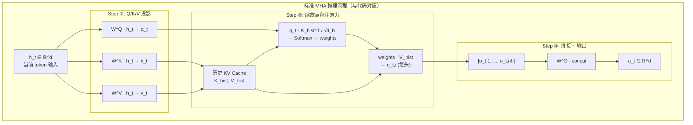

---

## 3. 多查询注意力（MQA）与分组查询注意力（GQA）

### 3.1 符号约定

| 符号 | 含义 |
|------|------|
| $n_h$ | Query 头数 |
| $g$ | KV 共享组数（GQA） |
| $d_h$ | 每头维度 |

### 3.2 MQA（Multi-Query Attention, 2019）

**核心思路**：所有 $n_h$ 个 Query 头共享同一组 Key 和 Value，将 KV cache 压缩 $n_h$ 倍。

- **MHA**：每个 Q 有独立 KV → $\mathbf{Q}_1 \rightarrow \mathbf{K}_1, \mathbf{V}_1,\; \mathbf{Q}_2 \rightarrow \mathbf{K}_2, \mathbf{V}_2,\; \ldots,\; \mathbf{Q}_{n_h} \rightarrow \mathbf{K}_{n_h}, \mathbf{V}_{n_h}$
- **MQA**：所有 Q 共享一组 KV → $\mathbf{Q}_1, \mathbf{Q}_2, \ldots, \mathbf{Q}_{n_h} \rightarrow \mathbf{K}, \mathbf{V}$

- **优点**：KV cache 缩减为原来的 $1/n_h$（从 $4d$ 字节/token 降至 $4d_h$ 字节/token）
- **缺点**：多头多样性丧失，某些需要不同注意力模式的场景下性能下降

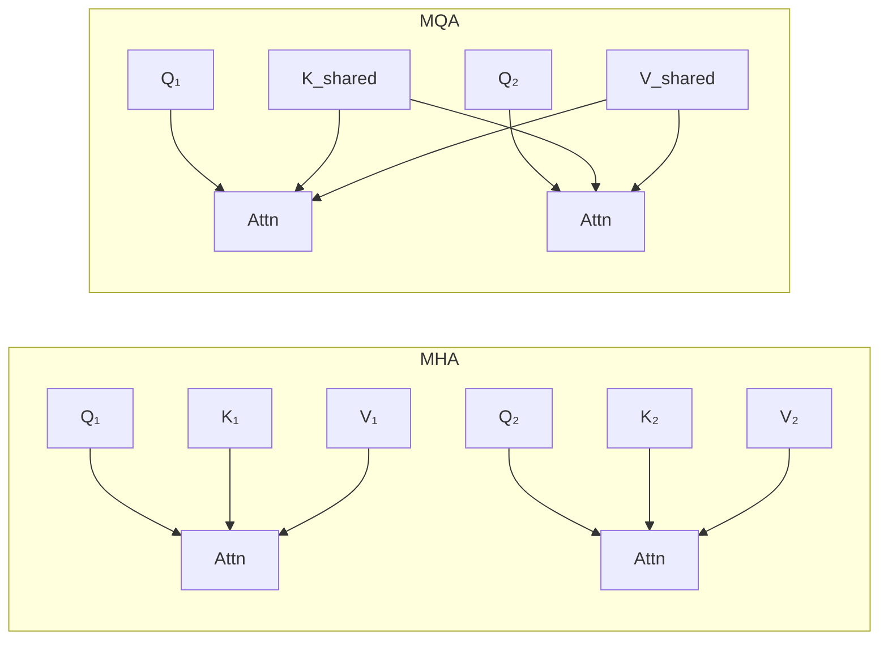

### 3.3 GQA（Grouped-Query Attention, 2023）

**核心思路**：折中方案。将 $n_h$ 个 Query 头分为 $g$ 组，每组共享一对 KV。

$$
\text{KV 缓存量} = g \times d_h \times 2\;\text{元素/token}
$$

| $g$ 取值 | 等价于 | KV Cache |
|----------|--------|----------|
| $g = n_h$ | MHA | $n_h \cdot d_h \times 2$ |
| $g = 1$ | MQA | $d_h \times 2$ |
| $1 < g < n_h$ | GQA | $g \cdot d_h \times 2$ |

GQA 的思想启发了 MLA 的 MQA/MHA 双模式设计：**在 MHA 精度和 MQA 效率之间，可以按需切换**。

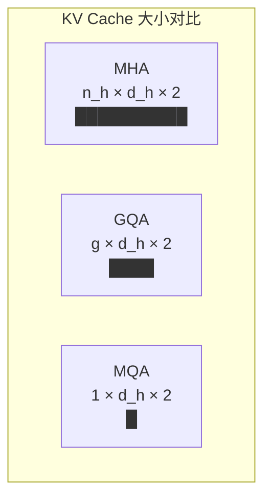

---

## 4. 多头潜在注意力（MLA）

### 4.1 符号约定

| 符号 | 含义 | DeepSeek-V3 典型值 |
|------|------|-------------------|
| $d$ | 模型隐藏维度 | 7168 |
| $n_h$ | 注意力头数 | 128 |
| $d_h$ | 每头内容维度（MLA 中**不受** $d/n_h$ 约束） | 128 |
| $d_h^R$ | 每头 RoPE（位置）维度 | 64 |
| $d_c$ | KV 联合压缩维度，$d_c \ll n_h d_h$ | 512 |
| $d_c'$ | Query 压缩维度 | 1536 |
| $\mathbf{c}_t^{KV}$ | 压缩后的 KV 潜在向量 | $\mathbb{R}^{d_c}$ |
| $\mathbf{c}_t^Q$ | 压缩后的 Q 潜在向量 | $\mathbb{R}^{d_c'}$ |

**关键差异**：标准 MHA 中 $d_h = d / n_h$ 是硬约束（维度匹配要求）。MLA 中 K/V 从 $\mathbf{c}^{KV}$ 通过 $\mathbf{W}^{UK}$ 上投影解压得到，$d_h$ 是独立可选的超参数，不再受 $d/n_h$ 制约。DeepSeek 选择 $d_h=128$，此时 $n_h d_h = 128 \times 128 = 16384 \gg d = 7168$。输出投影 $\mathbf{W}^O$ 将 $n_h d_h = 128 \times 128 = 16384$ 维映射回 $d=7168$ 维（每头输出仅含内容 Value $\mathbf{v}^C$ 的加权和，RoPE 只参与 Q·K 打分，不进入输出维度）。

### 4.2 核心思路：先理解"为什么要压缩"再看公式

MLA 的出发点是一个关键观察：**标准 MHA 的 Key 和 Value 存在极大的冗余**。

每个 token 的 KV 向量由 $n_h \times d_h = d$ 维张成，但 $d$ 维空间中大部分方向对注意力的实际贡献极低——KV 矩阵的有效秩远小于 $d$。这意味着我们可以用一个远小于 $d$ 的维度来近似表示 KV 信息。

MLA 的做法类似 JPEG：**训练时学习压缩-解压的参数，推理时只缓存压缩表示，并通过矩阵吸收技术在压缩空间内直接完成注意力计算，无需显式解压**。下面从 KV 联合压缩开始，逐步展开完整的 MLA 公式。

### 4.3 KV 联合压缩

MLA 将 Key 和 Value **联合**压缩到一个低维潜在向量（而非分别压缩），因为 Key 和 Value 共享了大量语义信息。

**下投影矩阵** $\mathbf{W}^{DKV} \in \mathbb{R}^{d_c \times d}$ 将 $d$ 维输入压缩到 $d_c$ 维：

$$
\boxed{\mathbf{c}_t^{KV} = \mathbf{W}^{DKV} \mathbf{h}_t} \in \mathbb{R}^{d_c}, \quad d_c \ll n_h d_h
$$

**上投影矩阵** 分别将压缩表示恢复到完整的 Key 和 Value 空间：

$$
\boxed{\mathbf{k}_t^C = \mathbf{W}^{UK} \mathbf{c}_t^{KV}} \in \mathbb{R}^{n_h d_h} \qquad
\boxed{\mathbf{v}_t^C = \mathbf{W}^{UV} \mathbf{c}_t^{KV}} \in \mathbb{R}^{n_h d_h}
$$

其中 $\mathbf{k}_t^C = [\mathbf{k}_{t,1}^C; \ldots; \mathbf{k}_{t,n_h}^C]$ 是拼合的所有头内容 Key，$\mathbf{v}_t^C$ 同理。

**关键收益**：推理时只需缓存 $d_c$ 维的 $\mathbf{c}_t^{KV}$，而非 $n_h d_h$ 维的全量 KV。

### 4.4 解耦 RoPE：为什么 RoPE 与低秩压缩不兼容

#### RoPE 的工作原理

RoPE（旋转位置编码）的核心公式是：

$$
\begin{pmatrix} x_{2k}^{\text{new}} \\ x_{2k+1}^{\text{new}} \end{pmatrix} =
\begin{pmatrix} \cos m\theta_k & -\sin m\theta_k \\ \sin m\theta_k & \cos m\theta_k \end{pmatrix}
\begin{pmatrix} x_{2k} \\ x_{2k+1} \end{pmatrix}
$$

它在 **每一对相邻维度上施加位置 $m$ 决定的旋转变换**，使用位置在第 $k$ 对维度上旋转角度 $m\theta_k$。

RoPE 的应用位置在 **每个注意力头的 Key 和 Query 向量上**，在注意力内积 $\mathbf{q}^\top \mathbf{k}$ 之前：

$$
\mathbf{h}_t \xrightarrow{\mathbf{W}^K} \mathbf{k}_t \xrightarrow{\text{RoPE}(\cdot, t)} \mathbf{k}_t^{\text{roped}} \longrightarrow \text{参与注意力}
$$
$$
\mathbf{h}_t \xrightarrow{\mathbf{W}^Q} \mathbf{q}_t \xrightarrow{\text{RoPE}(\cdot, t)} \mathbf{q}_t^{\text{roped}} \longrightarrow \text{参与注意力}
$$

#### 不兼容的根源

MLA 压缩方案期望的流程是：

$$
\mathbf{h}_t \xrightarrow{\mathbf{W}^{DKV}} \mathbf{c}_t^{KV}\;(\text{压缩存储}) \xrightarrow{\mathbf{W}^{UK}} \mathbf{k}_t\;(\text{解压后使用})
$$

问题在于：如果 RoPE 作用在解压后的 $\mathbf{k}_t$ 上，那么 **$\mathbf{c}_t^{KV}$ 中不包含位置信息**，而自回归解码时我们需要对历史 key 重新应用 RoPE（每次位置角不同）。但 RoPE 的旋转矩阵只对每头内相邻维度对有意义——如果 $W^{UK}$ 混合了不同头的维度，先解压再 RoPE 会导致旋转作用在错误的维度对上。

简单说：**RoPE 要求 K 在解压后、按头切分后才能施加，但这要求缓存时保存未解压的完整 K（或找到别的方式插入位置信息）**。

#### 解决方案：解耦 RoPE

额外引入一组**独立于压缩路径**、专门携带位置信息的 key 和 query：

- **内容路径（可压缩）**：$\mathbf{h}_t \xrightarrow{\mathbf{W}^{DKV}} \mathbf{c}_t^{KV} \xrightarrow{\mathbf{W}^{UK}} \mathbf{k}_t^C$
- **位置路径（不压缩）**：$\mathbf{h}_t \xrightarrow{\mathbf{W}^{KR}} \xrightarrow{\text{RoPE}} \mathbf{k}_t^R$
- **最终 Key**：$\mathbf{k}_{t,i} = [\mathbf{k}_{t,i}^C; \mathbf{k}_t^R]$

$$
\boxed{\mathbf{k}_t^R = \text{RoPE}\left(\mathbf{W}^{KR} \mathbf{h}_t\right)} \in \mathbb{R}^{d_h^R}
$$

$$
\boxed{\mathbf{q}_{t,i}^R = \text{RoPE}\left(\mathbf{W}^{QR}_i \mathbf{c}_t^Q\right)} \in \mathbb{R}^{d_h^R}
$$

最终每头的完整 Key/Query 由内容部分和位置部分沿维度拼接：

$$
\boxed{\mathbf{k}_{t,i} = [\mathbf{k}_{t,i}^C; \mathbf{k}_t^R]} \in \mathbb{R}^{d_h + d_h^R} \qquad
\boxed{\mathbf{q}_{t,i} = [\mathbf{q}_{t,i}^C; \mathbf{q}_{t,i}^R]} \in \mathbb{R}^{d_h + d_h^R}
$$

**推理时仅需缓存两个向量**：$\mathbf{c}_t^{KV}$（内容，$d_c$ 维）和 $\mathbf{k}_t^R$（位置，$d_h^R$ 维）。

### 4.5 Query 压缩

Query 同样做低秩压缩，主要为节省**训练时**的激活内存（前向激活需保留到反向传播）：

$$
\boxed{\mathbf{c}_t^Q = \mathbf{W}^{DQ} \mathbf{h}_t} \in \mathbb{R}^{d_c'} \qquad
\boxed{\mathbf{q}_t^C = \mathbf{W}^{UQ} \mathbf{c}_t^Q} \in \mathbb{R}^{n_h d_h}
$$

### 4.6 注意力计算

$$
\boxed{\mathbf{o}_{t,i} = \sum_{j=1}^{t} \text{Softmax}_j\!\left(\frac{\mathbf{q}_{t,i}^\top \mathbf{k}_{j,i}}{\sqrt{d_h + d_h^R}}\right) \mathbf{v}_{j,i}^C}
$$

$$
\boxed{\mathbf{u}_t = \mathbf{W}^O [\mathbf{o}_{t,1}; \ldots; \mathbf{o}_{t,n_h}]}
$$

注意：Value 仅使用内容部分 $\mathbf{v}_{j,i}^C$（位置信息在 Value 中不必要）。

### 4.7 MHA 模式与 MQA 模式

MLA 可以在两种模式间无缝切换：

| 模式 | 使用场景 | Key/Value 粒度 | 注意力方式 |
|------|----------|----------------|-----------|
| **MHA 模式** | 训练 & 预填充 | 每头独立解压 `k^C` 和 `v^C` | 每头独立注意力 |
| **MQA 模式** | 自回归解码 | 所有头共享 `c^{KV}` | 多查询注意力（经矩阵吸收） |

**表面差异 vs 实质等价**：MHA 模式每头有独立的 $\mathbf{k}_i^C = \mathbf{W}_i^{UK} \mathbf{c}^{KV}$，而 MQA 模式所有头共享同一个 $\mathbf{c}^{KV}$。直觉上似乎"Key 的多样性"丢失了，但通过**矩阵吸收**技术，MHA 的完整计算可以在不显式展开 K/V 的情况下精确复现。利用矩阵乘法的结合律将 $\mathbf{W}^{UK}$ 吸收到 Q 侧、$\mathbf{W}^{UV}$ 延迟到加权和之后：

$$
(\mathbf{q}_i^C)^\top \cdot (\mathbf{W}_i^{UK} \mathbf{c}^{KV}) = \underbrace{(\mathbf{q}_i^C)^\top \mathbf{W}_i^{UK}}_{\text{吸收到 Q 侧}} \cdot \;\mathbf{c}^{KV}, \qquad
\mathbf{W}_i^{UV} \cdot \left(\sum_j a_{t,j} \cdot \mathbf{c}_j^{KV}\right) = \sum_j a_{t,j} \cdot \mathbf{W}_i^{UV} \mathbf{c}_j^{KV}
$$

**两种模式在数学上严格等价**（详见 [MLA 双模式深度专题](mla_modes_deep_dive.md) 第 5.3 节的代数证明）。实际推理中可观测的微小差异（< 0.1%）纯粹来自 BF16 浮点运算中求和顺序不同导致的舍入误差。

### 4.8 训练与推理的完整流水线

前面分别介绍了 KV 压缩、解耦 RoPE、Query 压缩和 MHA/MQA 双模式，现在把它们串起来。MLA 的下投影矩阵 $\mathbf{W}^{DKV}$ 和上投影矩阵 $\mathbf{W}^{UK}, \mathbf{W}^{UV}$ **都是在训练中端到端学习得到的**，训练和推理使用相同的参数但走不同的数据路径：

|  | 训练时（MHA 模式） | 推理时（MQA Absorb 模式） |
|---|---|---|
| **KV 路径** | $\mathbf{h}_t \xrightarrow{\mathbf{W}^{DKV}} \mathbf{c}_t^{KV} \xrightarrow{\mathbf{W}^{UK}} \mathbf{k}_t^C$ | $\mathbf{h}_t \xrightarrow{\mathbf{W}^{DKV}} \boxed{\mathbf{c}_t^{KV}}\;\text{(缓存!)}$ |
| | $\mathbf{c}_t^{KV} \xrightarrow{\mathbf{W}^{UV}} \mathbf{v}_t^C$ | $\mathbf{h}_t \xrightarrow{\mathbf{W}^{KR}} \text{RoPE} \xrightarrow{} \boxed{\mathbf{k}_t^R}\;\text{(缓存!)}$ |
| **Key/Value 粒度** | 每头独立 $\mathbf{k}_{t,i}^C, \mathbf{v}_{t,i}^C$（128 个独立 K/V） | Q 侧吸收 $\mathbf{W}_i^{UK}$ + V 侧延迟升维 |
| **数学等价** | ✅ 展开路径 | ✅ 吸收路径 — 代数恒等（见 4.7 节） |
| **梯度** | 反向传播更新全部投影矩阵 | 参数已冻结，仅前向推理 |

**训练时（MHA 模式）**：走完整的上投影路径，梯度通过 $\mathbf{W}^{UK}, \mathbf{W}^{UV}$ 回传到 $\mathbf{W}^{DKV}$，为每个参数提供独立的梯度路径。

**推理时（MQA Absorb 模式）**：$\mathbf{W}^{UK}$ 预先乘到 Query 侧、$\mathbf{W}^{UV}$ 延迟到加权和之后。**这不是近似——矩阵吸收保证了与 MHA 模式严格等价**（证明见 [MLA 双模式深度专题](mla_modes_deep_dive.md) 第 5.3 节）。

**为什么不在训练时也走 MQA 模式？** 训练需要每头独立的梯度流来充分训练 $\mathbf{W}^{UK}$ 和 $\mathbf{W}^{UV}$ 的全部 512 × 16384 个参数。MQA Absorb 模式把这些参数"折叠"进计算图中，虽然前向输出等价，但梯度路径被压缩，不利于大矩阵的充分训练。

### 4.9 KV Cache 分析

| 注意力类型 | 缓存内容 | 每 token 字节数（BF16） | 公式 |
|-----------|----------|------------------------|------|
| MHA | $n_h$ 组 $(\mathbf{k}_i, \mathbf{v}_i)$ | $4d$ | $4 \cdot n_h \cdot d_h$ |
| GQA | $g$ 组 $(\mathbf{k}_i, \mathbf{v}_i)$ | $4g \cdot d_h$ | $4 \cdot g \cdot d_h$ |
| MQA | 1 组 $(\mathbf{k}, \mathbf{v})$ | $4d_h$ | $4 \cdot d_h$ |
| **MLA** | $\mathbf{c}^{KV}$（$d_c$ 维）+ $\mathbf{k}^R$（$d_h^R$ 维） | $2(d_c + d_h^R)$ | — |

以 DeepSeek-V3 真实参数为例（$d=7168, n_h=128, d_h=128, d_c=512, d_h^R=64$）：

**若用标准 MHA**（$d_h = d/n_h = 7168/128 = 56$）：

$$\text{每 token KV cache} = 4 \times 7168 = 28672\;\text{字节} \approx 28\;\text{KB}$$

**MLA 实际**（仅缓存 $\mathbf{c}^{KV}$ 和 $\mathbf{k}^R$）：

$$\text{每 token KV cache} = 2 \times (512 + 64) = 1152\;\text{字节} \approx 1.13\;\text{KB}$$

$$
\text{压缩比} = \frac{28672}{1152} \approx 24.9\times
$$

注意：MLA 的 $d_h=128$ 远大于标准 MHA 约束下的 $d_h=56$，这使得上投影 $\mathbf{W}^{UK}: d_c(512) \rightarrow n_h d_h(16384)$ 成为一个**升维映射**——从压缩空间恢复到高维表示空间。但推理时完全不需要存储展开后的高维 K/V，只需存压缩的 $\mathbf{c}^{KV}$。

对于 $L = 128\text{K}$ 序列，60 层模型：

$$\text{MHA: } 28\;\text{KB} \times 131072 \times 60 \approx 220\;\text{GB} \quad \text{(无法放入单 GPU)}$$
$$\text{MLA: } 1.13\;\text{KB} \times 131072 \times 60 \approx 8.9\;\text{GB} \quad \text{(可放入单 GPU)}$$

### 4.10 精简参考代码与流程图

以下代码展示 MLA 推理（MQA naive 模式）的核心逻辑。注意：**实际部署的 DeepSeek-V3 使用更高效的 Absorb 模式**（矩阵吸收），但其逻辑较复杂；下面的代码展示的是等效但更直观的"缓存压缩 KV + 逐头解压 V"方案。两种方案的数学等价性和完整 Absorb 代码见 [MLA 双模式深度专题](mla_modes_deep_dive.md)。

```python
import torch
import torch.nn.functional as F

def mla_forward_mqa_mode(h_t, past_c_kv, past_k_r, params):
    """
    MLA 推理（MQA 模式，自回归解码）
    DeepSeek-V3 参数: d=7168, d_c=512, d_h^R=64, d_c'=1536, n_h=128, d_h=128

    h_t:        当前 token 输入 [d]
    past_c_kv:  历史压缩 KV, List of [d_c]    ← 仅缓存 {c_s^KV}
    past_k_r:   历史位置 Key,  List of [d_h^R]  ← 仅缓存 {k_s^R}
    返回:       output u_t, 更新后的缓存
    """
    d, d_c, d_h_R, d_c_prime = 7168, 512, 64, 1536
    n_heads, d_h = 128, 128  # MLA 中 d_h 不受 d/n_h 约束

    # ════ Query 分支: 压缩 → 解压 → 拼接位置 ════
    c_q = params['W_DQ'] @ h_t                    # [d_c'] = [1536]
    q_c = params['W_UQ'] @ c_q                     # [n_heads*d_h] = [16384]
    q_c = q_c.view(n_heads, d_h)                  # [128, 128]
    q_r = params['W_QR'] @ c_q                     # [n_heads*d_h^R] = [8192]
    q_r = rope(q_r.view(n_heads, d_h_R))           # [128, 64]
    q = torch.cat([q_c, q_r], dim=-1)             # [128, 192]  ← d_h+d_h^R

    # ════ Key 分支: 仅缓存压缩向量 ════
    c_kv = params['W_DKV'] @ h_t                  # [d_c] = [512]  ← 压缩！
    k_r = rope(params['W_KR'] @ h_t)               # [d_h^R] = [64]  ← 位置 Key

    past_c_kv.append(c_kv)                         # 缓存压缩表示
    past_k_r.append(k_r)                           # 缓存位置 Key

    K_c_kv = torch.stack(past_c_kv)               # [t, 512]
    K_r    = torch.stack(past_k_r)                 # [t, 64]

    # ════ MQA 模式: 所有头共享 c^KV，但每头独立展开 K/V ════
    t = K_c_kv.shape[0]
    o_list = []
    for i in range(n_heads):
        # Key 内容部分: 从压缩 c^KV 逐头展开到 d_h 维
        K_c_i = (params['W_UK_i'] @ K_c_kv.T).T     # [t, d_h] = [t, 128]
        # 拼接内容 Key 与位置 Key → 维度匹配 q[i]
        K_i = torch.cat([K_c_i, K_r], dim=-1)       # [t, d_h+d_h^R] = [t, 192]
        scores = (q[i] @ K_i.T) / ((d_h + d_h_R) ** 0.5)  # [t]
        attn_w = F.softmax(scores, dim=-1)          # [t]

        # Value: 从头 i 的上投影矩阵解压 c^KV → v_i^C
        V_i = params['W_UV_i'] @ K_c_kv.T           # [d_h, t]
        o_i = attn_w @ V_i.T                        # [d_h] = [128]
        o_list.append(o_i)

    o = torch.cat(o_list)                           # [n_heads*d_h] = [16384]
    u_t = params['W_O'] @ o                         # [d] = [7168]
    return u_t, past_c_kv, past_k_r
```

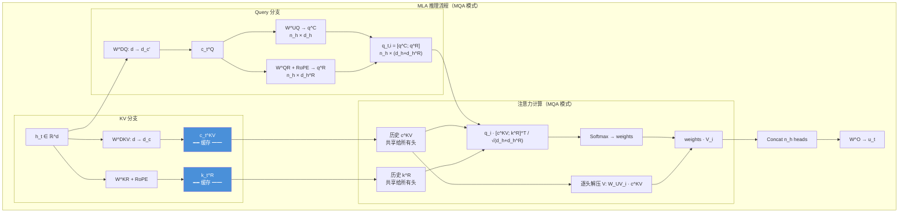

---

## 5. DeepSeek 稀疏注意力（DSA）

### 5.1 符号约定

| 符号 | 含义 | 典型维度 |
|------|------|----------|
| $H_I$ | Indexer 头数 | 16 |
| $d_I$ | Indexer 每头维度 | 64 |
| $k$ | 每 Query 选中的 **token** 数（对比：CSA 用 $k$ 表示块数，需 $\times r$ 才得到对应的 token 覆盖量） | 2048 |
| $\mathbf{q}_{t,j}^I, \mathbf{k}_s^I$ | Indexer 的 Query/Key | $\mathbb{R}^{d_I}$ |
| $w_{t,j}^I$ | Indexer 标量权重 | $\mathbb{R}$ |
| $I_{t,s}$ | 第 $t$ 个 Query 对第 $s$ 个 Key 的索引分数 | $\mathbb{R}$ |
| $\mathcal{S}_t$ | 第 $t$ 个 Query 选中的 token 集合 | $\|\mathcal{S}_t\| = k$ |

### 5.2 核心思路

DSA 解决一个朴素问题：**真要所有 token 都参与注意力吗？**

在长序列中，大多数 token 对当前 query 的注意力权重接近零。如果能预先筛选出最相关的 $k$ 个 token（$k \ll L$），就可以将注意力复杂度从 $O(L^2)$ 降至 $O(Lk)$。

关键挑战：如何快速筛选？——用极轻量级的 Lightning Indexer。

### 5.3 Lightning Indexer

Indexer 是一个比主注意力小约 100 倍的打分网络。其公式为：

$$
\boxed{I_{t,s} = \sum_{j=1}^{H_I} w_{t,j}^I \cdot \text{ReLU}\left(\mathbf{q}_{t,j}^I \cdot \mathbf{k}_s^I\right)}
$$

逐项拆解：

**① Query 侧**：$\mathbf{q}_{t,j}^I \in \mathbb{R}^{d_I}$ 和 $w_{t,j}^I \in \mathbb{R}$

从当前 token $\mathbf{h}_t$ 派生出 Indexer 的 query。每个 Indexer 头 $j$ 有两个可学习参数：
- 一个向量投影 $\mathbf{q}_{t,j}^I = \mathbf{W}_j^{IQ} \mathbf{h}_t$：负责与历史 token 的 key 做匹配
- 一个标量权重 $w_{t,j}^I = \text{Sigmoid}(\mathbf{w}_j^{IW} \cdot \mathbf{h}_t)$：控制该头在最终分数中的贡献程度。不同头可能对不同类型的关系敏感（如有的头关注局部上下文，有的关注远距离依赖），标量权重让模型动态决定各头的重要性

**② Key 侧**：$\mathbf{k}_s^I \in \mathbb{R}^{d_I}$

从历史 token $\mathbf{h}_s$ 派生：$\mathbf{k}_s^I = \mathbf{W}^{IK} \mathbf{h}_s$。所有 Indexer 头共享同一个 Key 投影（类似 MQA 思想），大幅减少 Indexer 的参数量。

**③ ReLU 而非 Softmax**：

内积 $\mathbf{q}_{t,j}^I \cdot \mathbf{k}_s^I$ 经过 ReLU 后，负值被清零、正值保留。这有两个好处：
- **硬件效率**：ReLU 是逐元素操作，吞吐远高于 Softmax（Softmax 需要全局 max 归约 + 指数 + 归一化）
- **保序性足够**：Indexer 输出最终只需取 top-k，ReLU 保持正值的相对顺序不变（因为 ReLU 是单调递增函数）

**④ 实际计算量对比**：

以 DeepSeek-V3.2 为例（$H_I = 16$, $d_I = 64$, FP8），单次 Indexer 打分：

$$
\text{Indexer FLOPs} = H_I \times d_I \times 2 = 16 \times 64 \times 2 = 2048 \text{ FLOPs/token-pair}
$$

主注意力（$n_h = 128$, $d_h = 128$，MQA 模式下 $d_c = 512$）：

$$
\text{Attention FLOPs} \approx 128 \times 512 \times 2 = 131072 \text{ FLOPs/token-pair}
$$

Indexer 计算量不到主注意力的 **2%**。

| 对比维度 | Lightning Indexer | 主注意力（MLA） |
|----------|------------------|----------------|
| 头数 | $H_I \approx 16$ | $n_h = 128$ |
| 每头维度 | $d_I \approx 64$ | $d_h = 128$ |
| Key 共享 | 所有头共享一组 Key | 按模式（MHA/MQA） |
| 精度 | FP8 | BF16 / FP8 |
| 激活函数 | ReLU（硬件友好） | Softmax（需指数运算） |
| 单 token-pair FLOPs | ~2K | ~131K |
| 可学习参数 | 极小（$H_I(d_I \cdot d + d)$） | 大（MLA 全套投影矩阵） |

### 5.4 细粒度 Token 选择

根据 Indexer 分数，对每个 Query token 选出 top-k 个历史 token：

$$
\boxed{\mathcal{S}_t = \left\{ s \;\middle|\; I_{t,s} \in \text{Top-k}\big(\{I_{t,s'}\}_{s'=1}^{t}\big) \right\}}
$$

然后在稀疏集合上执行 MLA 注意力：

$$
\boxed{\mathbf{u}_t = \text{Attn}\left(\mathbf{h}_t, \{\mathbf{c}_s^{KV}\}_{s \in \mathcal{S}_t}\right)}
$$

**复杂度**：注意力从 $O(L^2 d)$ 降为 $O(L k d)$，其中 $k \ll L$。

### 5.5 DSA × MLA 实例化

DSA 基于 MLA 的 MQA 模式实现（见图 4 of V3.2 paper）。所有 Query 头共享同一组 KV entry，因此一次 top-k 选择即可为所有头确定稀疏集合。

DSA 的完整流程以当前 token $\mathbf{h}_t$ 为中心，分为两条路径：

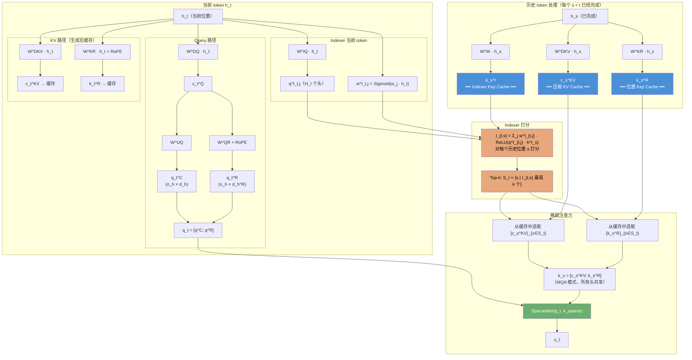

图中清晰展示了三个缓存（蓝色框）：压缩 KV cache $\mathbf{c}_s^{KV}$、位置 Key cache $\mathbf{k}_s^R$、Indexer Key cache $\mathbf{k}_s^I$。推理时逐 token 追加写入，Indexer 利用缓存的所有历史 $\mathbf{k}_s^I$ 打分后，Top-k 选择器仅从缓存中取出对应的 $\mathbf{c}_s^{KV}$ 和 $\mathbf{k}_s^R$ 参与稀疏注意力。

### 5.6 两阶段训练

DSA 的训练不能直接在全参数上从头开始——因为随机初始化的 Indexer 会给出毫无意义的分数，导致主模型在错误的稀疏集合上训练，产生灾难性的反馈循环。因此需要两阶段渐进式训练。

**阶段一：Dense Warm-up（Indexer 初始化）**

核心问题：如何让 Indexer 学会"打分"？需要提供一个目标分布来监督 Indexer。

**$p_{t,:}$ 是什么？** $p_{t,:} \in \mathbb{R}^t$ 是主注意力（稠密 MLA）在第 $t$ 个位置上的**真实注意力分布**。计算方式：将所有注意力头的分数求和（$\sum_{i=1}^{n_h} \mathbf{q}_{t,i}^\top \mathbf{k}_{j,i} / \sqrt{d_h}$），然后沿序列维度做 L1 归一化。$p_{t,s}$ 可以理解为"在稠密注意力下，第 $t$ 个位置对第 $s$ 个位置的真实关注程度"。

训练目标——让 Indexer 的 Softmax 分布逼近这个真实分布：

$$
\mathcal{L}_I = \sum_t D_{KL}\!\left(p_{t,:} \;\middle\|\; \text{Softmax}(I_{t,:})\right)
$$

此时只训练 Indexer 参数，**冻结主模型全部参数**（否则主模型会随着 Indexer 的随机初始状态而跑偏）。仅需 1000 步（约 2.1B tokens），Indexer 就能给出大致合理的分数。

| 阶段 | 训练内容 | 数据量 | 学习率 | Indexer 损失 | 主模型参数 |
|------|---------|--------|--------|-------------|-----------|
| ① Dense Warm-up | 仅训练 Indexer | ~2.1B tokens | $10^{-3}$ | $D_{KL}(p_{t,:} \| \text{Softmax}(I_{t,:}))$ | 冻结 |
| ② Sparse Training | 全参数 | ~943.7B tokens | $7.3 \times 10^{-6}$ | $D_{KL}(p_{t,\mathcal{S}_t} \| \text{Softmax}(I_{t,\mathcal{S}_t}))$ | 训练 |

**阶段二：Sparse Training（全参数适应）**

Indexer 已能给出大致合理的排序，此时引入 Top-k 选择、解冻主模型进行稀疏训练。有两个关键设计：

**① 梯度隔离**：Indexer 输入从计算图 **detach**，即主模型的语言模型损失 $\mathcal{L}_{LM}$ 不会通过 Indexer 路径回传。Indexer 仅通过 $\mathcal{L}_I$ 优化，主模型仅通过 $\mathcal{L}_{LM}$ 优化。原因：如果 $\mathcal{L}_{LM}$ 也能更新 Indexer，Indexer 可能会"作弊"——不是学会找出真正相关的 token，而是学会给那些"让 LM loss 下降"的 token 打高分，导致稀疏选择过拟合到 LM 目标而丢失语义相关性。

**② Indexer 损失限定在选中集合**：阶段二的 $\mathcal{L}_I$ 仅计算被选中 token 的 KL 散度（$p_{t,\mathcal{S}_t}$ 而非 $p_{t,:}$），因为未选中的 token 不参与注意力，无需关心 Indexer 对它们的分数。

**为什么梯度隔离如此重要？** 如果不 detach，Indexer 会遇到一个"鸡生蛋蛋生鸡"问题：Indexer 选哪些 token → 主模型只在这些 token 上计算注意力 → LM loss 回传更新 Indexer → Indexer 选不同的 token → 下一轮又变。这会导致训练不稳定，收敛困难。

### 5.7 效果

DSA 将注意力核心复杂度从 $O(L^2)$ 降至 $O(Lk)$，128K 序列下解码提速 2~3×，且 benchmark 性能与稠密版本几乎持平（差异 < 1%）。

**遗留问题**：Indexer 本身仍是 $O(L^2)$ 复杂度（虽极轻量），当 $L \rightarrow 1\text{M}$ 时也开始成为瓶颈——这正是 V4 引入 CSA/HCA 的动机。

---

## 6. 压缩稀疏注意力（CSA）

### 6.1 符号约定

| 符号 | 含义 | DeepSeek-V4 典型值 |
|------|------|-------------------|
| $r$ | 序列压缩率（窗口大小） | 8 |
| $M$ | 压缩后的块数，$M = L / r$ | 1M/8 = 125K |
| $\tilde{\mathbf{c}}_m^{KV}$ | 第 $m$ 个压缩块的 KV 表示 | $\mathbb{R}^{d_c}$，$d_c = 512$ |
| $\tilde{I}_{t,m}$ | Query $t$ 对压缩块 $m$ 的 Indexer 分数 | $\mathbb{R}$ |
| $k$ | 每 Query 选择的压缩**块**数（注意与 DSA 的 $k$ 单位不同：此处为块数，展开后覆盖 $k \times r \approx 2048$ 个原始 token） | ~256 |

> **$d_c$ 取值**：CSA 中 KV 压缩维度 $d_c$ 与 MLA 保持一致（DeepSeek-V3/V4 均为 512）。这是因为 CSA 的压缩发生在**序列维度**（$L \to L/r$），而非**特征维度**（$d_c$ 已经是 MLA 压缩后的结果，无需再压）。$d_c=512$ 是 DeepSeek 经过消融实验选出的平衡点——再小会丢失信息，再大则 KV cache 收益递减。

### 6.2 核心思路

DSA 的 Indexer 仍要对 $L$ 个 token 逐一打分（$O(L^2)$）。CSA 的思路是：**先压缩再打分**。

将每 $r$ 个连续 token 压缩为一个块表示，Indexer 在 $L/r$ 个块上打分，选 top-k 个块，然后映射回原始 token 范围做细粒度注意力。

- **DSA**：$\text{Indexer}(\text{每个 token}) \to \text{选 top-k 个 token} \to \text{稀疏注意力}$
- **CSA**：$\text{压缩}(\text{每 }r\text{ 个 token 合并为一个块}) \to \text{Indexer}(\text{每个块}) \to \text{选 top-k 个块} \to \text{映射回原始 token} \to \text{稀疏注意力}$

**Indexer 复杂度从 $O(L^2)$ 降至 $O(L \cdot L/r) = O(L^2/r)$**。

### 6.3 序列压缩

将历史序列分为 $M = \lceil t / r \rceil$ 个块：

$$
\boxed{\tilde{\mathbf{c}}_m^{KV} = \text{Aggregate}\left(\{\mathbf{c}_s^{KV}\}_{s \in \text{block}_m}\right)} \quad m = 1, \ldots, M
$$

聚合函数通常为平均池化或可学习的线性投影。

### 6.4 Indexer 在压缩表示上打分

$$
\boxed{\tilde{I}_{t,m} = \sum_{j=1}^{H_I} w_{t,j}^I \cdot \text{ReLU}\left(\tilde{\mathbf{q}}_{t,j}^I \cdot \tilde{\mathbf{k}}_m^I\right)}
$$

### 6.5 块选择 → 映射回原始 Token

选出 top-k 个压缩块，展开为原始 token 范围：

$$
\boxed{\mathcal{S}_t^{\text{CSA}} = \bigcup_{m \in \text{Top-k}(\{\tilde{I}_{t,m}\})} \text{block}_m}
$$

然后在集合 $\mathcal{S}_t^{\text{CSA}}$ 上执行标准 MLA 稀疏注意力（MHA 模式，逐头解压）。

### 6.6 效果

| | DSA | CSA |
|---|---|---|
| Indexer 打分对象 | $L$ 个 token | $L/r$ 个压缩块 |
| Indexer 复杂度 | $O(L^2 \cdot H_I d_I)$ | $O(L^2/r \cdot H_I d_I)$ |
| 注意力复杂度 | $O(L \cdot k \cdot d)$ | $O(L \cdot k \cdot d)$ |
| 有效感受野 | $k$ 个 token | $k \cdot r$ 个 token（更广） |

压缩率 $r=8$ 时，CSA 的 Indexer 比 DSA 快约 8 倍，同时有效感受野扩大 $r$ 倍。

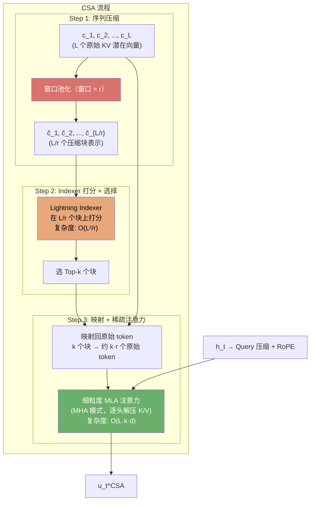

---

## 7. 重度压缩注意力（HCA）

### 7.1 符号约定

| 符号 | 含义 | DeepSeek-V4 典型值 |
|------|------|-------------------|
| $r_1$ | 一级压缩率（块内池化窗口） | 8 |
| $r_2$ | 二级压缩率（跨块注意力池化窗口） | 8 |
| $N_{\text{comp}}$ | 压缩后的总 token 数，$N_{\text{comp}} = L/r_1 + L/(r_1 r_2)$ | 1M 时约 140K |
| $\hat{\mathbf{c}}_m^{(1)}$ | 一级压缩表示（块内池化） | $\mathbb{R}^{d_c}$，$d_c=512$ |
| $\hat{\mathbf{c}}_p^{(2)}$ | 二级压缩表示（跨块注意力池化） | $\mathbb{R}^{d_c}$，$d_c=512$ |

> **参数设计逻辑**：$r_1 = r_2 = 8$ 是经验选择。$r_1$ 控制一级压缩后保留的局部块数（$L/8$），$r_2$ 控制全局摘要的粒度（$L/64$）。两级总压缩比约为 $L / (L/8 + L/64) \approx 7.1\times$——在 1M 上下文下，HCA 每层的 KV 从 1M 压缩到约 140K，稠密注意力计算量从 $O(L^2)$ 降至 $O(L \cdot N_{\text{comp}}) \approx O(L \cdot 140\text{K})$。

### 7.2 核心思路

HCA 采用与 CSA 完全相反的策略：**不做稀疏选择，而是将 KV 极度压缩，然后所有压缩表示参与稠密注意力**。

- CSA = 压缩打分 + 稀疏选择 + 细粒度注意力（可能丢失信息）
- HCA = 多级激进压缩 + 稠密注意力（无遗漏，但粒度粗）

### 7.3 多级压缩

HCA 的核心操作是将 $L$ 个原始 KV 向量压缩为 $N_{\text{comp}} \ll L$ 个多尺度表示。以下图为例，取 $L = 32$, $r_1 = 4$, $r_2 = 2$：

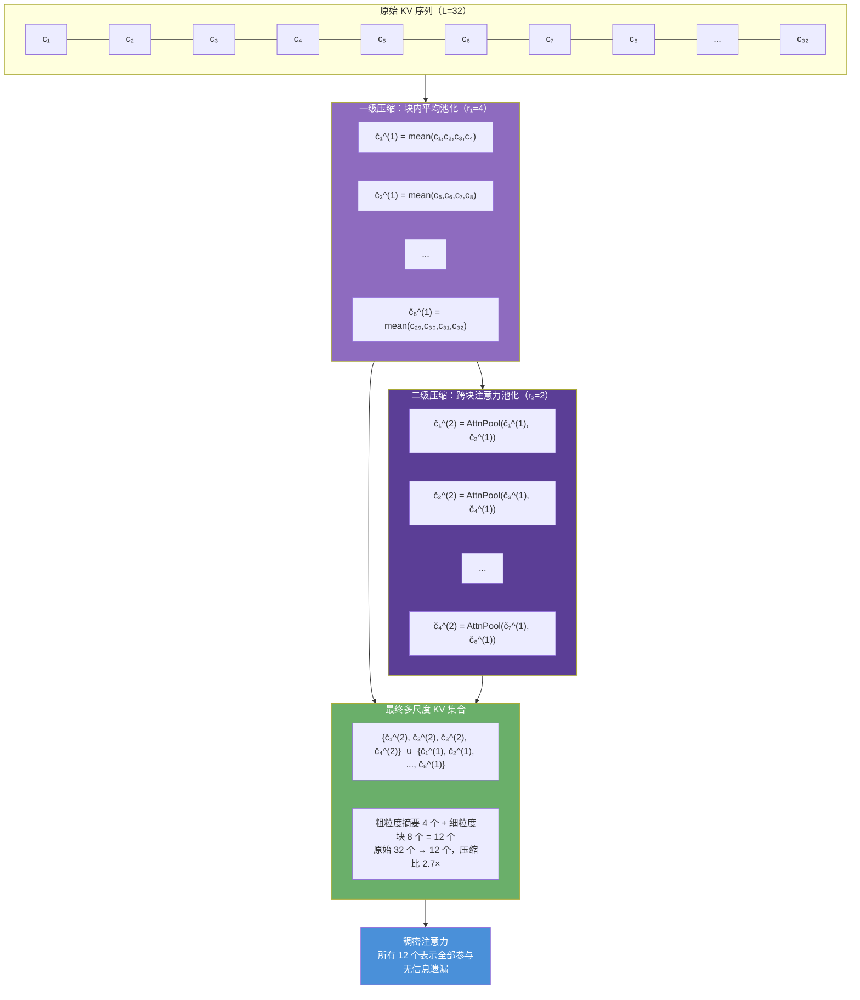

**第一级：块内平均池化**（保留局部模式）

$$
\boxed{\hat{\mathbf{c}}_m^{(1)} = \frac{1}{r_1} \sum_{s \in \text{block}_m} \mathbf{c}_s^{KV}} \quad m = 1, \ldots, L/r_1
$$

每个窗口内的原始 KV 取均值，得到 $L/r_1$ 个局部块表示。这一步类似于卷积神经网络中的池化——压缩了空间分辨率但保留了局部特征。

**第二级：跨块注意力池化**（提取全局摘要）

$$
\boxed{\hat{\mathbf{c}}_p^{(2)} = \text{AttentionPool}\left(\{\hat{\mathbf{c}}_m^{(1)}\}_{m \in \text{superblock}_p}\right)} \quad p = 1, \ldots, L/(r_1 r_2)
$$

用一个可学习的 Query 向量对每个 superblock 内的一级表示做注意力加权聚合（而非简单平均），产生 $L/(r_1 r_2)$ 个粗粒度全局摘要。注意力池化比平均池化更灵活——模型可以学会对不同位置赋予不同权重。

### 7.4 多尺度 KV 集合

最终 HCA 的 KV 集合包含多级压缩表示：

$$
\boxed{\{\tilde{\mathbf{c}}_s^{\text{HCA}}\} = \{\hat{\mathbf{c}}_p^{(2)}\} \cup \{\hat{\mathbf{c}}_m^{(1)}\}}
$$

推理时，所有压缩表示参与稠密注意力：

$$
\boxed{\mathbf{u}_t^{\text{HCA}} = \sum_{s=1}^{N_{\text{comp}}} \text{Softmax}_s\!\left(\frac{\mathbf{q}_t^\top \tilde{\mathbf{k}}_s}{\sqrt{d}}\right) \tilde{\mathbf{v}}_s}
$$

其中 $N_{\text{comp}} = L/r_1 + L/(r_1 r_2)$。例如 $L=1\text{M}, r_1=8, r_2=8$ 时，$N_{\text{comp}} = 125\text{K} + 15.6\text{K} \approx 140.6\text{K}$，远小于原始 1M。

### 7.5 为什么 HCA 适合浅层/深层

| 层深度 | 信息需求 | HCA 适配性 |
|--------|---------|-----------|
| 浅层 | 局部低级特征（词法、短程语法） | 高度压缩后局部模式仍然保留 |
| 中间层 | 精细跨 token 交互（长程依赖、语义组合） | 压缩会丢失细粒度信息 → **不适合，用 CSA** |
| 深层 | 全局抽象表示 | 压缩反而有助于去噪，聚焦高级语义 |

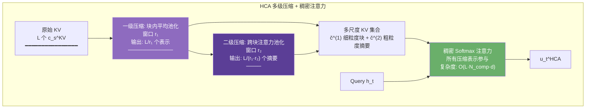

---

## 8. 混合注意力架构：CSA + HCA 的协同设计

### 8.1 层分配策略

DeepSeek-V4 不对所有层使用统一的注意力机制，而是**根据层在模型深度中的位置，分配不同类型的注意力**：

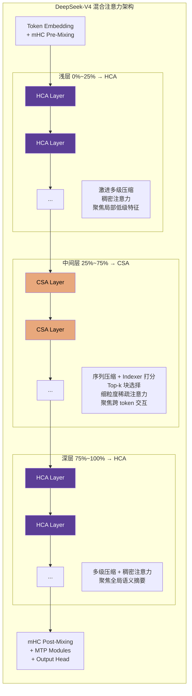

### 8.2 各层计算逻辑

**HCA 路径（浅层 & 深层）**：

1. 对历史 $\{\mathbf{c}_s^{KV}\}$ 执行多级压缩
2. 得到 $N_{\text{comp}}$ 个多尺度压缩表示
3. $\mathbf{h}_t \rightarrow$ Query 压缩 + RoPE $\rightarrow \mathbf{q}_t$
4. $\mathbf{u}_t = \text{DenseSoftmaxAttention}(\mathbf{q}_t,\; \text{所有压缩表示})$

**CSA 路径（中间层）**：

1. 沿序列维度压缩 KV（窗口池化，$r=8$）
2. Lightning Indexer 在压缩块上打分
3. 选出 Top-k 个压缩块，映射回原始 token
4. 逐头解压 $\mathbf{k}^C$ 和 $\mathbf{v}^C$（MHA 模式）
5. $\mathbf{u}_t = \text{SparseAttention}(\mathbf{q}_t,\; \text{选中的细粒度 KV})$

### 8.3 效率全貌（1M Token 场景）

| 指标 | DeepSeek-V3.2 | DeepSeek-V4-Pro | DeepSeek-V4-Flash |
|------|:------------:|:-------------:|:----------------:|
| 单 Token FLOPs（1M 上下文） | 100%（基准） | **27%** | **10%** |
| KV Cache 大小（1M 上下文） | 100%（基准） | **10%** | **7%** |
| 路由专家精度 | FP8 | FP4 | FP4 |

V4-Pro 虽然激活参数为 V3.2 的近 2 倍，但得益于 CSA/HCA 混合架构，其单 token 推理成本反而降至 V3.2 的 27%。

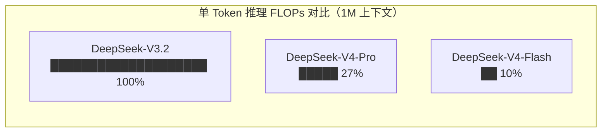

---

## 9. 全链路对比总结

### 9.1 演化图谱

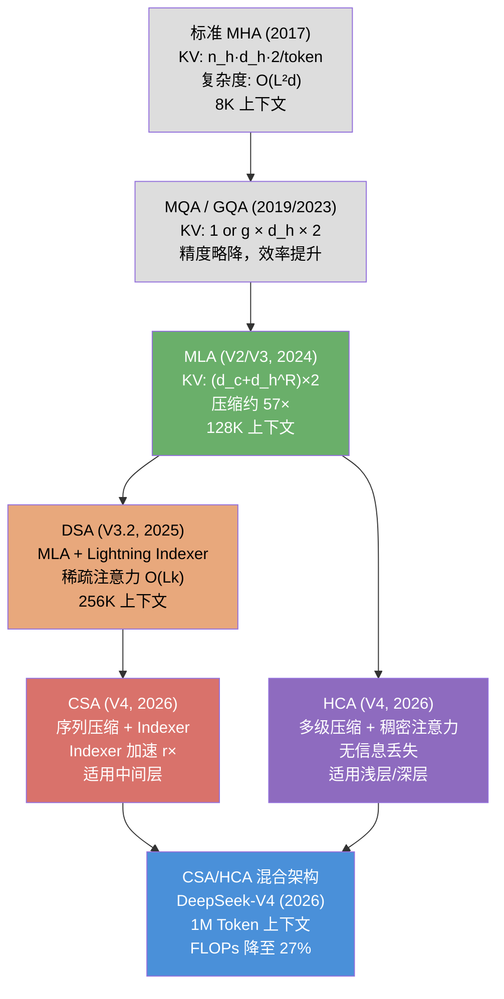

### 9.2 关键指标对比

以下将参数固定为 DeepSeek 系列实际值（$d=7168$, $n_h=128$, $d_h=128$, $d_h^R=64$, $d_c=512$, $k=2048$, $r=8$, $N_{\text{comp}} \approx 140\text{K}$ @ 1M 长度）。KV Cache 按 BF16 精度计算。

| 技术 | KV Cache 每 token（精确值） | 1M 序列单层缓存 | 注意力复杂度 | 适用长度 |
|------|---------------------------|---------------|-------------|---------|
| MHA | $4d = 28672$ 字节 (28 KB) | 28 GB | $O(L^2 d)$ | < 8K |
| MQA | $4d_h = 512$ 字节 | 512 MB | $O(L^2 d)$ | < 32K |
| **MLA** | $2(d_c + d_h^R) = 1152$ 字节 (1.13 KB) | 1.13 GB | $O(L^2 d)$ | < 128K |
| **DSA** | 同 MLA：1152 字节 | 1.13 GB | $O(L k d)$ | < 256K |
| **CSA** | 同 MLA：1152 字节 | 1.13 GB | $O(L^2/r + L k d)$ | < 1M |
| **HCA** | $2(d_c + d_h^R) \times 7.1^{-1} \approx 162$ 字节 | 162 MB | $O(L \cdot N_{\text{comp}} \cdot d)$ | < 1M |
| **CSA/HCA 混合** | 分层加权 ~750 字节 | ~750 MB | 分层混合 | **1M+** |

> 60 层全模型 1M 序列 KV Cache 总量估算见 [2.4 节](#24-kv-cache-分析)（MHA）和 [4.9 节](#49-kv-cache-分析)（MLA）。混合架构单卡 80GB H100 即可容纳。

> 推理 FLOPs 对比（V3.2 vs V4-Pro vs V4-Flash = 100%/27%/10%）及分析见 [8.3 节](#83-效率全貌1m-token-场景)。

### 9.3 核心公式对照（差异卡片）

完整公式见对应章节（MHA→[§2](#2-标准多头注意力mha), MLA→[§4](#4-多头潜在注意力mla), DSA→[§5](#5-deepseek-稀疏注意力dsa), CSA→[§6](#6-压缩稀疏注意力csa), HCA→[§7](#7-重度压缩注意力hca)），以下仅列出每步演化的**关键差异**：

| 演化阶段 | 关键创新 | 对 KV Cache 的影响 |
|----------|---------|-------------------|
| MHA → MQA/GQA | 多头共享 KV，减少缓存头数 | $\times 1/n_h$ 或 $\times g/n_h$ |
| MQA/GQA → MLA | 低秩压缩 KV（$d \to d_c$）+ 解耦 RoPE | $\times d/(d_c+d_h^R) \approx 24.9\times$ |
| MLA → DSA | Lightning Indexer 稀疏选择 top-k 个 token | 同 MLA（缓存不变，计算量降） |
| MLA → CSA | 序列压缩（$L \to L/r$）+ Indexer 打块分 | 同 MLA（Indexer 加速 $r\times$） |
| MLA → HCA | 多级池化（块内平均 + 跨块注意力）→ 稠密注意力 | $\times (d_c+d_h^R)/N_{\text{comp}} \approx 7.1\times$（仅缓存压缩表示） |
| CSA+HCA → 混合 | 按层深度分配不同注意力策略 | 分层加权，整体约 10% 的 MHA 基线 |

**核心逻辑链**：

1. **压缩是高效推理的前提** — MLA 证明 KV 的低秩压缩几乎无损性能，将缓存缩减 50 倍以上
2. **稀疏性是压缩的自然延伸** — DSA 证明通过轻量打分可大幅减少实际参与注意力的 token 数
3. **分层不对称策略** — 不同深度对信息粒度需求不同：浅层要局部（HCA）、中层要精细（CSA）、深层要全局（HCA）
4. **协同互补** — CSA（压缩 → 稀疏 → 精细）和 HCA（压缩 → 稠密 → 粗放）各司其职，覆盖全模型深度

最终结果：**在 100 万 token 上下文下，V4-Pro 的推理 FLOPs 仅为 V3.2 的 27%，KV cache 仅为 10%**。

---

> **参考文献**
>
> - Vaswani et al., "Attention Is All You Need", NeurIPS 2017
> - Shazeer, "Fast Transformer Decoding: One Write-Head Is All You Need", 2019
> - Ainslie et al., "GQA: Training Generalized Multi-Query Transformer Models", EMNLP 2023
> - Su et al., "RoFormer: Enhanced Transformer with Rotary Position Embedding", 2024
> - DeepSeek-AI, "DeepSeek-V2: A Strong, Economical, and Efficient Mixture-of-Experts Language Model", 2024
> - DeepSeek-AI, "DeepSeek-V3 Technical Report", 2024
> - DeepSeek-AI, "DeepSeek-V3.2-Exp: Boosting Long-Context Efficiency with DeepSeek Sparse Attention", 2025
> - DeepSeek-AI, "DeepSeek-V4: Towards Highly Efficient Million-Token Context Intelligence", 2026
> - Xie et al., "Manifold-Constrained Hyper-Connections", 2026

[← 回到首页](..)
