# 用闭环超声脑机接口解码运动计划
[← 回到首页](..)

- **原题**：Decoding motor plans using a closed-loop ultrasonic brain–machine interface
- **著者**：Whitney S. Griggs1,2,14, Sumner L. Norman1,14, Thomas Deffieux3,4, Florian Segura3,4, Bruno-Félix Osmanski5, Geeling Chau1, Vasileios Christopoulos6,7, Charles Liu1,8,9,10, Mickael Tanter3,4, Mikhail G. Shapiro11,12,13 & Richard A. Andersen1,6　（上标 14：Whitney S. Griggs 与 Sumner L. Norman 为同等贡献者；通讯作者为 W.S.G. 与 S.L.N.）
- **通讯作者**：wsgriggs@gmail.com (W.S.G.); sumner.norman@gmail.com (S.L.N.)
- **期刊**：Nature Neuroscience 27, 196–207 (2024)
- **DOI**：[10.1038/s41593-023-01500-7](https://doi.org/10.1038/s41593-023-01500-7)
- **日期**：投稿 2023-01-17 · 接收 2023-10-16 · 在线发表 2023-11-30
- **版权**：© The Author(s) 2023；本文按 Creative Commons Attribution 4.0 International License 开放获取（Open Access）发布。
- **单位**：
  - 1 Division of Biology and Biological Engineering, California Institute of Technology, Pasadena, CA, USA（加州理工学院 生物学与生物工程系）
  - 2 David Geffen School of Medicine at UCLA, Los Angeles, CA, USA（加州大学洛杉矶分校 David Geffen 医学院）
  - 3 Physics for Medicine Paris, INSERM, CNRS, ESPCI Paris, PSL Research University, Paris, France（巴黎 医学物理研究所（Physics for Medicine Paris），INSERM、CNRS、ESPCI Paris、PSL 研究型大学）
  - 4 INSERM Technology Research Accelerator in Biomedical Ultrasound, Paris, France（INSERM 生物医学超声技术研究加速器）
  - 5 Iconeus, Paris, France（Iconeus 公司）
  - 6 T&C Chen Brain-Machine Interface Center, California Institute of Technology, Pasadena, CA, USA（加州理工学院 T&C Chen 脑机接口中心）
  - 7 Department of Bioengineering, University of California, Riverside, Riverside, CA, USA（加州大学河滨分校 生物工程系）
  - 8 Department of Neurological Surgery, Keck School of Medicine of USC, Los Angeles, CA, USA（南加州大学 Keck 医学院 神经外科）
  - 9 USC Neurorestoration Center, Keck School of Medicine of USC, Los Angeles, CA, USA（南加州大学 Keck 医学院 神经修复中心）
  - 10 Rancho Los Amigos National Rehabilitation Center, Downey, CA, USA（Rancho Los Amigos 国家康复中心）
  - 11 Division of Chemistry & Chemical Engineering, California Institute of Technology, Pasadena, CA, USA（加州理工学院 化学与化学工程系）
  - 12 Andrew and Peggy Cherng Department of Medical Engineering, California Institute of Technology, Pasadena, CA, USA（加州理工学院 Andrew and Peggy Cherng 医学工程系）
  - 13 Howard Hughes Medical Institute, Pasadena, CA, USA（霍华德·休斯医学研究所）
  - 14 These authors contributed equally: Whitney S. Griggs, Sumner L. Norman.（同等贡献者说明）

---

> **本系列**：六篇核心论文的完整译文，逐一独立成篇。另见 [清醒灵长类的 fUS 脑活动传播（Dizeux 2019）](fusi-primate-propagation) · [单试次运动意图解码（Norman 2021）](fusi-single-trial-decoding) · [经颅窗人脑 fUS 成像（Rabut 2024）](fusi-human-cranial-window) · [LIP 扫视的介观组织（Griggs 2025）](fusi-mesoscopic-lip) · [移动中的人脑 fUS 成像（Soloukey 2025）](fusi-mobile-human)

## 摘要

脑机接口（brain–machine interface，BMI）使患有慢性瘫痪的人仅凭思维就能控制计算机、机器人等设备。现有脑机接口在侵入性、性能、空间覆盖范围与时空分辨率之间存在取舍。功能超声（functional ultrasound，fUS）神经成像是一项新兴技术，能够平衡上述各项属性，并可能对现有的脑机接口记录技术形成补充。本研究利用 fUS 成功实现了一套闭环超声脑机接口。我们在两只恒河猴执行眼动与手部运动时，从其后顶叶皮层流式传输 fUS 数据。经过训练后，猴子可利用该脑机接口控制最多八个运动方向。我们还开发了一种利用既往会话数据预训练脑机接口的方法。这使其在随后的测试日（即使相隔数月）即可立即实现控制，而无需大量重新校准。这些发现确立了超声脑机接口的可行性，为新一代侵入性更低（硬膜外，epidural）的接口开辟了道路——这类接口可跨长时间尺度保持泛化能力，并有望恢复神经系统损伤患者的功能。

## 引言

脑机接口（BMI）将复杂的脑信号转化为计算机指令，是恢复瘫痪患者能力的一种颇具前景的方法[[1]](#ref-1)。用于此类脑机接口的脑信号记录方法众多，包括皮层内多电极阵列（multielectrode array，MEA）、皮层脑电图（electrocorticography，ECoG）、功能近红外光谱（functional near-infrared spectroscopy，fNIRS）、脑电图（electroencephalography，EEG）和功能磁共振成像（functional magnetic resonance imaging，fMRI）（扩展数据图 1）。这些方法在性能、侵入性、空间覆盖范围、时空分辨率、便携性以及解码器跨会话稳定性之间存在不同的取舍（补充表 1）。例如，皮层内 MEA 已被用于以每分钟最多 62 个词的速度解码[[2]](#ref-2)，并能控制机械臂[[3]](#ref-3)，但每个阵列只能从位于脑回冠部的一小块皮层（约 4 × 约 4 mm）采样。相反，fMRI 无创且可对整个大脑采样，但基于 fMRI 的脑机接口目前仅被证明能以每分钟约 1 个字符的速度解码[[4]](#ref-4)，或控制最多四个运动方向[[5]](#ref-5)。

功能超声（fUS）成像是近年发展起来的技术，有望催生一类新型硬膜外脑机接口——它能够从大脑的大范围区域记录信号，并解码具有时空精细结构的活动模式。fUS 神经成像利用超快脉冲回波成像，同时感知多个脑区的脑血容量（cerebral blood volume，CBV）变化[[6]](#ref-6)。这些 CBV 变化与单神经元活动和局部场电位高度相关[[7,8]](#ref-7)。它对慢速血流（速度约 1 mm s−1）具有高灵敏度，并在良好的时空分辨率（100 μm；<1 s）与大而深的视野（约 2 cm；扩展数据图 1）之间取得平衡。fUS 能够成功穿透硬脑膜以及数毫米厚的肉芽组织成像[[9]](#ref-9)（扩展数据图 2a）。然而，由于超声信号会被骨骼严重衰减[[11]](#ref-11)，目前大型动物的 fUS 成像仍需开颅或建立声学窗（acoustic window）[[10]](#ref-10)。

此前，我们已证明 fUS 神经成像具备足够的灵敏度与视野，可在单试次（single-trial）基础上同时解码两个方向（左/右）、两种效应器（手/眼）和任务状态（go/no-go）的运动意图[[9]](#ref-9)。但该分析是使用预先记录的数据事后（离线）完成的。本研究展示了一套在线的闭环功能超声脑机接口（functional ultrasound brain–machine interface，fUS-BMI）。此外，我们还提出了若干在既往 fUS 神经成像研究基础上的关键进展，包括解码八个运动方向以及设计在 >40 天内保持稳定的解码器。

## 结果

我们使用一台微型化 15.6 MHz 超声换能器，配合实时超快超声采集系统，在两只猴子执行记忆引导眼动任务时以 2 Hz 流式传输 fUS 图像（图 1 和扩展数据图 2a）。实验前，我们对两只猴子的左侧后顶叶皮层（posterior parietal cortex，PPC）实施了开颅。在每个实验会话中（n = 24 个会话；扩展数据表 1），我们将换能器以垂直于脑表面的方向置于硬脑膜上方（图 1a 和扩展数据图 2b），并从左侧 PPC 的冠状面记录信号——PPC 是一个对目标导向运动和注意至关重要的感觉运动联合区[[12]](#ref-12)。该技术实现了大视野（宽 12.8 mm、深 16 mm、层面厚度约 400 μm），同时保持高空间分辨率（平面内 100 μm × 100 μm）。这使我们能够同时流式获取多个 PPC 区域的高分辨率血流动力学变化，包括外侧顶内沟皮层（lateral intraparietal cortex，LIP）与内侧顶内沟皮层（medial intraparietal cortex，MIP）（图 1a）。LIP 与 MIP 分别参与眼动与伸取运动的规划[[9,13,14]](#ref-9)，这使 PPC 成为记录效应器特异性运动信号的理想区域。

我们将实时 fUS 图像流式输入一个脑机接口解码器，该解码器使用主成分分析（principal component analysis，PCA）与线性判别分析（linear discriminant analysis，LDA）预测计划中的运动方向。脑机接口的输出随后直接控制行为任务（图 1c）。为构建解码器的初始训练集，每只猴子先按要求对随机呈现的两个或八个外周目标执行眼动。我们使用成功眼动之前延迟期内的 fUS 活动来训练解码器。在此初始训练阶段，成功试次定义为猴子正确地将眼动指向目标并获得液体奖赏。在 100 个成功训练试次后，我们切换到闭环脑机接口模式，此时预期运动由 fUS-BMI 给出（图 1e）。在此闭环脑机接口模式下，猴子需持续注视中央提示直至奖赏发放。在成功试次与随后试次之间的间隔内，我们重新训练解码器，随着每只猴子使用 fUS-BMI 而持续更新解码器模型。在闭环 fUS-BMI 模式下，成功试次定义为预测正确且猴子在奖赏发放前一直保持注视中央提示。

> **【译者注】** 本文所称"闭环"须按实际时序设计理解：解码只在试次末（记忆期最后 1.5 s，即 3 帧 fUS 图像）做一次离散的方向预测，用于决定该试次"运动阶段"的目标方向；系统本身不含对脑的刺激/反馈回路，猴子在奖赏发放前始终注视中央提示。主材料 §7.1.2 记录的"读 CBV 响应延迟约 1–2 s"与本文自报的约 800 ms 实时延迟一致；§7.3.1 也据此指出"真正用 fUS 自身做闭环反馈的完整系统"与本文这类"解码即控制"的闭环在含义上并不等同。

### 在线解码两个眼动方向

为验证 fUS-BMI 的可行性，我们首先对两个运动方向进行了在线、闭环解码（图 2）。每只猴子先成功地完成 100 次记忆引导扫视，指向提示的左或右目标（图 1b），同时我们从左侧 PPC 流式采集 fUS 图像。100 个试次后，我们切换到闭环解码，此时猴子通过其运动意图来控制任务方向，即由 fUS-BMI 在记忆期最后三帧 fUS 图像中检测到的脑活动（图 1c,e）。在每个闭环解码试次结束时，猴子会收到关于 fUS-BMI 预测结果的视觉反馈。我们将每个成功试次的 fUS 图像加入训练集，并在每个试次后重新训练解码器（图 1c）。我们用累计正确率（cumulative percent correct）评估解码器在整个训练期间（20–100 试次；蓝线）和闭环解码期间（101+ 试次；绿线）的表现（图 2a）。在初始训练期（20–100 试次），解码器的预测对猴子不可见，即在第 100 试次后闭环解码开始之前不显示绿点。

在第二个闭环双方向会话中，解码器在 55 个训练试次后达到显著准确率（P < 0.05；单侧二项检验），并持续提升，在第 114 试次达到 82% 的峰值准确率（图 2a）。解码器对两个方向的预测均显著高于随机水平，但对向右运动的预测表现更好（图 2b）。为理解哪些脑区对解码器表现最为重要，我们以 200 μm（即 2 个体素）为半径进行了搜索光（searchlight）分析（图 2c）。背侧 LIP 与 7a 区包含了对于解码预期运动方向最具信息量的体素。

理想的脑机接口所需训练数据极少，且无需跨会话重新训练。使用皮层内电极的脑机接口通常需要为每个后续会话重新校准，因为跨天存在非平稳性，包括难以在连续多天记录到同一批神经元[[15,16]](#ref-15)。得益于其大视野，fUS 神经成像能够在不同时间对相同脑区成像，因此可能是实现跨多个会话稳定解码的理想技术。超声成像同样存在神经元群体识别问题，包括会话之间大脑相对于超声换能器的位移。为检验"可跨多个会话稳定解码"这一假设，我们用既往会话的数据预训练 fUS-BMI，随后在在线闭环实验中测试该解码器。为此，我们首先将既往会话成像平面的数据与当前会话的成像平面对齐（扩展数据图 3）。这通过使我们能够跨不同会话追踪同一批神经血管群体，解决了神经元群体识别问题。我们使用半自动刚体对齐求取既往与当前成像平面之间的变换，将该二维（two-dimensional，2D）图像变换应用于既往会话的每一帧，并保存对齐后的数据。该半自动对齐过程耗时 <1 min。完成图像对齐后，fUS-BMI 自动加载该对齐数据集并预训练初始解码器。与无预训练的模型一样，我们继续使用实时再训练以纳入最近的成功试次。这种在每个成功试次后对脑机接口进行的自适应再训练，使脑机接口能够纳入会话特有的变化（行为、解剖、神经血管等），并可能使其获得更好的表现。使用预训练后，fUS-BMI 显著更快地达到有效表现（图 2d）。fUS-BMI 在第 7 试次即达到显著准确率，比无预训练的示例会话快约 15 min。

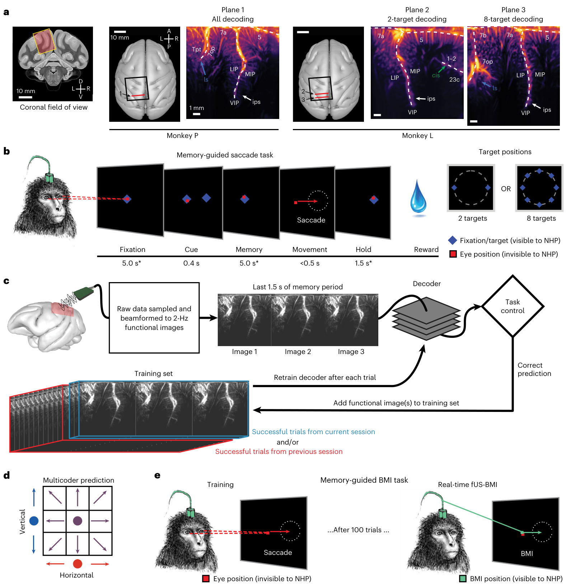

> **图 1** | 解剖记录平面与行为任务。a，用于猴子 P 与 L 的冠状 fUS 成像平面。近似 fUS 视野叠加在冠状 MRI 切片上。记录腔以垂直于颅骨表面的方向置于开颅处上方（黑色方块）。超声换能器被定位为在不同会话中采集一致的冠状平面（红线）。血管图显示单次成像会话的平均功率多普勒图像。不同脑区以白色文字标注，带标注的箭头指向脑沟。D，背侧；V，腹侧；L，左；R，右；A，前；P，后；ls，外侧沟；ips，顶内沟；cis，扣带沟。解剖标注依据文献 63。b，记忆引导扫视任务。* 注视期与记忆期为 ±1,000 ms 抖动；保持期为 ±500 ms 抖动。外周提示依据具体实验从两个或八个可能目标位置中选取。红色方块，猴子的眼位（猴子不可见）。NHP，非人灵长类，即猴子。c，fUS-BMI 算法。实时 2 Hz 功能图像被流式传输至控制行为任务的线性解码器。解码器使用记忆期最后三帧 fUS 图像做出预测。若预测正确，该次预测的数据即被加入训练集。解码器在每个成功试次后重新训练。训练集由来自当前会话和/或既往 fUS-BMI 会话的试次组成。d，多编码器算法。为预测八个运动方向，垂直分量（蓝色）与水平分量（红色）分别预测，再组合形成每一次 fUS-BMI 预测（紫色）。e，记忆引导脑机接口任务。该脑机接口任务与 b 相同，区别在于运动期由脑活动（经 fUS-BMI）控制，而非眼动。在 100 个成功眼动试次后，fUS-BMI 接管运动预测（闭环控制）。在闭环模式下，猴子必须在奖赏发放前一直注视中央注视提示。红色方块，猴子的眼位（猴子不可见）；绿色方块，脑机接口控制的游标（猴子可见）。

| 图内标签 | 中文 |
| --- | --- |
| Monkey P / Monkey L | 猴子 P / 猴子 L |
| Coronal field of view | 冠状视野 |
| Plane 1 / All decoding | 平面 1 / 全部解码 |
| Plane 2 / 2-target decoding | 平面 2 / 双目标解码 |
| Plane 3 / 8-target decoding | 平面 3 / 八目标解码 |
| ips | 顶内沟 |
| cis | 扣带沟 |
| ls | 外侧沟 |
| LIP | 外侧顶内沟区 |
| MIP | 内侧顶内沟区 |
| VIP | 腹侧顶内沟区 |
| 7a / 7b / 7op | 7a 区 / 7b 区 / 7op 区 |
| 5 | 5 区 |
| 23c | 23c 区 |
| 1–2 | 1–2 区 |
| Tpt | 颞顶联合区（Tpt） |
| D / V / L / R / A / P | 背侧 / 腹侧 / 左 / 右 / 前 / 后 |
| Target positions | 目标位置 |
| 2 targets / 8 targets | 2 个目标 / 8 个目标 |
| Cue | 提示 |
| Fixation | 注视 |
| Memory | 记忆 |
| Movement | 运动 |
| Hold | 保持 |
| Reward | 奖赏 |
| 0.4 s / 5.0 s* / <0.5 s / 1.5 s* / 5.0 s* | 各阶段时长（提示 0.4 s / 注视 5.0 s* / 眼动 <0.5 s / 保持 1.5 s* / 记忆 5.0 s*） |
| Memory-guided saccade task | 记忆引导扫视任务 |
| Memory-guided BMI task | 记忆引导脑机接口任务 |
| Saccade | 扫视 |
| Fixation/target (visible to NHP) | 注视点/目标（猴子可见） |
| Eye position (invisible to NHP) | 眼位（猴子不可见） |
| BMI position (visible to NHP) | 脑机接口游标位置（猴子可见） |
| Training | 训练 |
| BMI | 脑机接口 |
| Real-time fUS-BMI | 实时 fUS-BMI |
| ...After 100 trials ... | ……100 个试次后…… |
| Multicoder prediction | 多编码器预测 |
| Vertical / Horizontal | 垂直分量 / 水平分量 |
| Raw data sampled and beamformed to 2-Hz functional images | 原始数据经采样与波束合成，生成 2 Hz 功能图像 |
| Decoder | 解码器 |
| Task control | 任务控制 |
| Training set | 训练集 |
| Successful trials from previous session | 既往会话的成功试次 |
| Successful trials from current session | 当前会话的成功试次 |
| and/or | 和/或 |
| Add functional image(s) to training set | 将功能图像加入训练集 |
| Retrain decoder after each trial | 每个试次后重新训练解码器 |
| Correct prediction | 正确预测 |
| Last 1.5 s of memory period | 记忆期最后 1.5 s |
| Image 1 / Image 2 / Image 3 | 图像 1 / 图像 2 / 图像 3 |
| 10 mm / 1 mm | 比例尺（10 mm / 1 mm） |

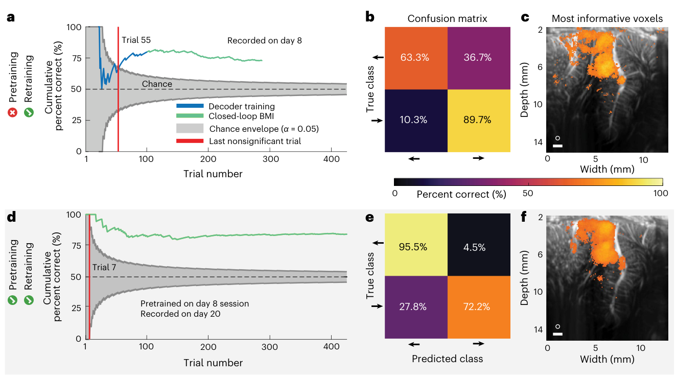

> **图 2** | 解码两个扫视方向的示例会话（猴子 P）。a，累计解码准确率随试次数的变化。蓝色表示 fUS-BMI 训练阶段，猴子用外显眼动控制任务；蓝色所示的脑机接口表现是事后生成的，对实时行为没有影响。绿色表示由 fUS-BMI 控制的试次，此时猴子保持注视中央提示，运动方向由 fUS-BMI 决定。灰色随机包络，90% 二项分布；红线，最后一个不显著试次。b，整个会话最终解码准确率的混淆矩阵，以百分比表示（各行之和为 100%）。c，搜索光分析显示解码准确率最高的 10% 体素（阈值为 q ≤ 1.66×10−6）。白色圆圈，200 μm 搜索光半径。比例尺，1 mm。d–f，格式与 a–c 相同。fUS-BMI 使用既往会话采集的数据进行预训练。d，累计解码准确率随试次数的变化。e，最终解码准确率的混淆矩阵。f，搜索光分析显示解码准确率最高的 10% 体素（阈值为 q ≤ 2.07 × 10−13）。白色圆圈，200 μm 搜索光半径。比例尺，1 mm。

| 图内标签 | 中文 |
| --- | --- |
| Cumulative percent correct (%) | 累计正确率（%） |
| Percent correct (%) | 正确率（%） |
| Trial number | 试次数 |
| Trial 7 | 第 7 试次 |
| Trial 55 | 第 55 试次 |
| Decoder training | 解码器训练 |
| Closed-loop BMI | 闭环脑机接口 |
| Chance envelope (α = 0.05) | 随机包络（α = 0.05） |
| Last nonsignificant trial | 最后一个不显著试次 |
| Chance | 随机水平 |
| Confusion matrix | 混淆矩阵 |
| True class | 真实类别 |
| Predicted class | 预测类别 |
| Most informative voxels | 最具信息量的体素 |
| Pretraining | 预训练 |
| Retraining | 再训练 |
| Pretrained on day 8 session | 用第 8 天会话预训练 |
| Recorded on day 8 | 记录于第 8 天 |
| Recorded on day 20 | 记录于第 20 天 |
| Width (mm) / Depth (mm) | 宽度（mm）/ 深度（mm） |
| 1 mm | 比例尺 1 mm |

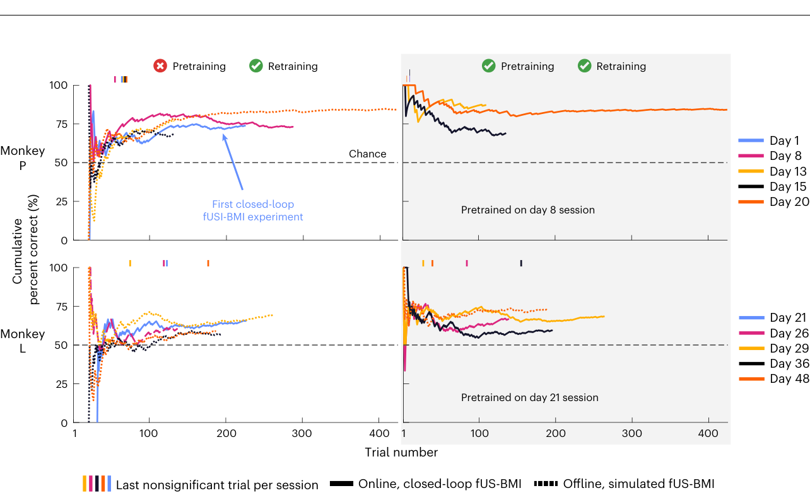

> **图 3** | 解码两个扫视方向的跨会话表现。猴子 P 与 L 在每个会话中的累计解码器准确率。实线为实时结果，细虚线为对实时 fUS 成像数据进行事后分析所得的模拟会话。每幅图上方的竖线标记表示该会话最后一个不显著试次。天数为相对于首次 fUS-BMI 实验的天数。粗虚线水平黑线表示随机水平表现。

| 图内标签 | 中文 |
| --- | --- |
| Monkey P / Monkey L | 猴子 P / 猴子 L |
| Cumulative percent correct (%) | 累计正确率（%） |
| Trial number | 试次数 |
| Day 1 / Day 8 / Day 13 / … | 第 1 天 / 第 8 天 / 第 13 天 / …… |
| Last nonsignificant trial per session | 每个会话的最后一个不显著试次 |
| Pretrained on day 8 session | 用第 8 天会话预训练 |
| Pretrained on day 21 session | 用第 21 天会话预训练 |
| Chance | 随机水平 |
| First closed-loop fUSI-BMI experiment | 首次闭环 fUSI-BMI 实验 |
| Offline, simulated fUS-BMI | 离线模拟 fUS-BMI |
| Online, closed-loop fUS-BMI | 在线闭环 fUS-BMI |
| Pretraining | 预训练 |
| Retraining | 再训练 |

为量化预训练对 fUS-BMI 训练时间与表现的影响，我们比较了所有会话中 fUS-BMI 的表现：（1）仅使用当前会话的数据，与（2）用既往会话的数据进行预训练（图 3）。对于所有使用预训练的实时会话，我们还事后（离线）模拟了不使用预训练的 fUS-BMI 结果。对于这些未使用预训练的模拟会话，所记录数据经过与实时 fUS-BMI 相同的分类算法处理，但不使用任何既往会话的数据。

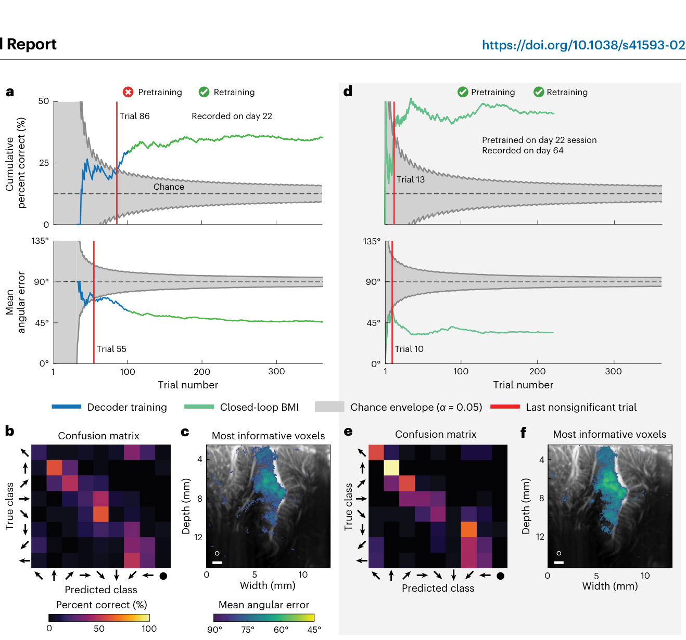

> **图 4** | 猴子 P 解码八个扫视方向的示例会话。a，累计解码准确率与平均角度误差随试次数的变化。蓝色表示 fUS-BMI 训练阶段，猴子用外显眼动控制任务；此处所示的脑机接口表现是事后生成的，并在每个新试次上进行测试，对实时行为没有影响。绿色表示由 fUS-BMI 控制的试次，此时猴子保持注视中央提示，运动任务方向由 fUS-BMI 决定。灰色随机包络，90% 二项或置换检验分布；红线，最后一个不显著试次。b，整个会话最终解码准确率的混淆矩阵，以百分比表示（各行之和为 100%）。横轴为预测的运动（预测类别），纵轴为与之对应的方向提示（真实类别）。c，搜索光分析显示平均角度误差最低的 10% 体素（阈值为 q ≤ 2.98 × 10−3）。白色圆圈，200 μm 搜索光半径。比例尺，1 mm。d–f，格式与 a–c 相同。fUS-BMI 用第 22 天的数据进行预训练，并在每个成功试次后更新。d，累计解码准确率与平均角度误差随试次数的变化。e，整个会话最终解码准确率的混淆矩阵，以百分比表示。f，搜索光分析显示平均角度误差最低的 10% 体素（阈值为 q ≤ 8 × 10−5）。

| 图内标签 | 中文 |
| --- | --- |
| Cumulative percent correct (%) | 累计正确率（%） |
| Percent correct (%) | 正确率（%） |
| Mean angular error | 平均角度误差 |
| Trial number | 试次数 |
| Trial 10 / Trial 13 / Trial 55 / Trial 86 | 第 10 试次 / 第 13 试次 / 第 55 试次 / 第 86 试次 |
| 0° / 45° / 90° / 135° | 0° / 45° / 90° / 135°（角度误差刻度） |
| Confusion matrix | 混淆矩阵 |
| True class | 真实类别 |
| Predicted class | 预测类别 |
| Most informative voxels | 最具信息量的体素 |
| Decoder training | 解码器训练 |
| Closed-loop BMI | 闭环脑机接口 |
| Chance envelope (α = 0.05) | 随机包络（α = 0.05） |
| Last nonsignificant trial | 最后一个不显著试次 |
| Chance | 随机水平 |
| Pretraining | 预训练 |
| Retraining | 再训练 |
| Pretrained on day 22 session | 用第 22 天会话预训练 |
| Recorded on day 22 | 记录于第 22 天 |
| Recorded on day 64 | 记录于第 64 天 |
| Width (mm) / Depth (mm) | 宽度（mm）/ 深度（mm） |

**仅使用当前会话的数据。** 每个在线闭环记录会话（猴子 P：2/2 个会话；猴子 L：1/1 个会话）以及大多数离线模拟记录会话（猴子 P：3/3 个会话，猴子 L：3/4 个会话）在结束时累计解码准确率均达到显著（P < 0.05；单侧二项检验）（图 3，左）。猴子 P 的解码器准确率达到 75.43 ± 2.56%（均值 ± 标准误），达到显著所需试次数为 40.20 ± 2.76。猴子 L 的解码器准确率达到 62.30 ± 2.32%，达到显著所需试次数为 103.40 ± 23.63。

**使用既往会话数据进行预训练。** 每个在线闭环记录会话在结束时累计解码准确率均达到显著（猴子 P：3/3 个会话，猴子 L：4/4 个会话）（图 3，右）。使用既往数据缩短了达到显著表现所需的时间（100% 的会话更快达到显著：猴子 P 快 36–43 个试次；猴子 L 快 15–118 个试次）。会话结束时的表现与同一批会话在无预训练条件下的表现无统计学差异（配对 t 检验，P < 0.05）。猴子 P 的准确率达到 80.21 ± 5.61%，达到显著所需试次数为 9 ± 1。猴子 L 的准确率达到 66.78 ± 2.79%，达到显著所需试次数为 71.00 ± 28.93。假设无缺失试次，预训练解码器将训练时间缩短了 10–45 min。我们还模拟了完全不用当前会话训练数据的效果，即仅使用预训练模型（扩展数据图 4a）。无论是否纳入当前会话的训练数据，两只猴子的表现（最终准确率或达到显著表现所需试次数）均未观察到统计学显著差异。

这些结果证明了三点：（1）我们能够从 fUS 信号中在线解码两个方向的运动意图；（2）猴子学会了使用 fUS-BMI 控制任务；（3）使用既往会话数据进行预训练，大幅减少甚至消除了新会话所需的新训练数据量。

### 在线解码八个眼动方向

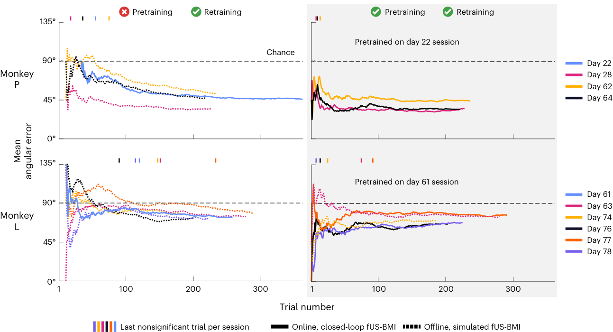

> **图 5** | 解码八个扫视方向的跨会话表现。猴子 P 与 L 在每个会话中的平均角度误差。实线为实时结果，细虚线为对实时 fUS 数据进行事后分析所得的模拟会话。竖线标记表示每个会话最后一个不显著试次。天数为相对于首次 fUS-BMI 实验的天数。粗虚线水平黑线表示随机水平表现。

| 图内标签 | 中文 |
| --- | --- |
| Mean angular error | 平均角度误差 |
| Monkey P / Monkey L | 猴子 P / 猴子 L |
| Trial number | 试次数 |
| Day 22 / Day 28 / Day 61 / … | 第 22 天 / 第 28 天 / 第 61 天 / …… |
| 0° / 45° / 90° / 135° | 0° / 45° / 90° / 135°（角度误差刻度） |
| Pretrained on day 22 session | 用第 22 天会话预训练 |
| Pretrained on day 61 session | 用第 61 天会话预训练 |
| Offline, simulated fUS-BMI | 离线模拟 fUS-BMI |
| Online, closed-loop fUS-BMI | 在线闭环 fUS-BMI |
| Last nonsignificant trial per session | 每个会话的最后一个不显著试次 |
| Chance | 随机水平 |
| Pretraining | 预训练 |
| Retraining | 再训练 |

在证明了我们能够取得与既往离线解码研究[[9]](#ref-9)相似、但是在线与闭环的表现之后，我们通过实时解码八个运动方向扩展了 fUS-BMI 的能力（图 4）。我们采用了一种"多编码器"（multicoder）架构，分别预测预期运动的垂直分量（上、中、下）与水平分量（左、中、右），再将这两个独立预测组合成最终预测（例如右上）（图 1d）。这种多编码器架构使解码器能够纳入我们的先验知识：PPC 神经元对相邻运动方向的响应相似，而对角度间隔较大的运动方向响应不同[[17]](#ref-17)。换言之，该多编码器方法纳入了相邻方向之间的神经表征相似性，而不是将八个方向视为八个相互独立的类别。

在第一个八方向实验中，解码器在 86 个训练试次后达到显著准确率（P < 0.05；单侧二项检验），随后继续提升，直至在 34–37% 准确率处趋于平台（图 4a，上图），而随机水平为 12.5%；大多数错误都指向与提示方向相邻的方向（图 4b）。为量化每个预测与真实方向的接近程度，我们考察了平均角度误差。fUS-BMI 在第 55 试次达到显著，并稳步下降，至会话结束时平均角度误差降至 45°（图 4a，下图）。与双目标眼动解码器的最具信息量体素相比，解码八个运动方向时，LIP 中更大的部分（包括腹侧 LIP）包含了最具信息量的体素（图 4c）。

> **【译者注】** 本段的 34–37% 八方向解码准确率（随机水平 12.5%）常被转述为"已经能解码八个方向"。主材料 §8.2.2 对这一数字有专门提示：须注意大多数错误落在与提示方向相邻的方向上，且会话结束时平均角度误差仍有 45°；把"能解码"等同于"能用"是本领域最常见的过度宣称。译文保留原文数值，不作放大。

我们接下来检验预训练是否能像帮助双目标解码那样帮助八目标解码。与无预训练的模型一样，我们在每个成功预测后的试次间期实时重新训练 fUS-BMI。与之前相同，预训练减少了达到显著解码所需的试次数（图 4d）。fUS-BMI 在第 13 试次达到显著准确率，比仅使用当前会话数据快约 25 min。累计解码准确率达到 45%，最终平均角度误差为 34°，优于无预训练示例会话的表现。搜索光分析表明，无论是有预训练还是无预训练的示例会话，LIP 内相同区域都提供了最具信息量的体素（图 4f）。值得注意的是，我们使用的是当前会话之前 42 天的数据对 fUS-BMI 进行预训练。这表明 fUS-BMI 至少可在 42 天内保持稳定。它进一步表明，我们能够一致地定位到同一成像平面，并且介观尺度的 PPC 群体在 >1 个月的时间跨度内一致地编码相同的方向。

**仅使用当前会话的数据。** 所有实时（2/2）和模拟（8/8）会话在结束时累计解码准确率均达到显著（图 5，左）。猴子 P 的平均角度误差达到 45.26 ± 3.44°，fUS-BMI 达到显著所需试次数为 30.75 ± 12.11。猴子 L 的平均角度误差达到 75.06 ± 1.15°，fUS-BMI 达到显著所需试次数为 132.33 ± 20.33。

**使用既往会话数据进行预训练。** 所有实时（6/6）和模拟（2/2）会话在结束时累计解码准确率均达到显著（图 5，右）。与模拟的事后数据相比，fUS-BMI 在大多数会话中更早达到显著解码：猴子 L 为 5/5 更快；猴子 P 为 2/3 更快（第三个会话达到显著的速度相同）。猴子 P 的预训练解码器达到显著快 0–51 个试次，猴子 L 快 66–132 个试次。对大多数会话而言，这将训练缩短最多 45 min。每个会话结束时的表现与同一会话在无预训练条件下的表现无统计学差异（配对 t 检验，P < 0.05）。猴子 P 的平均角度误差达到 37.82° ± 2.86°，fUS-BMI 达到显著所需试次数为 10.67 ± 1.76。猴子 L 的平均角度误差达到 71.04° ± 2.29°，fUS-BMI 达到显著所需试次数为 42.80 ± 17.05。我们还模拟了完全不用当前会话训练数据的效果，即仅使用预训练模型（扩展数据图 4b）。无论是否纳入当前会话的训练数据，两只猴子的表现（最终准确率、最终平均角度误差或达到显著表现所需试次数）均未观察到统计学显著差异。

这些结果证明，可以从 fUS 信号中在线解码出八个方向的运动意图，这相对于仅解码对侧与同侧运动是重大进展。这些结果还表明，PPC 介观群体内的方向编码在 >1 个月的时间跨度内保持稳定，从而使我们能够减少甚至消除对新训练数据的需求。

### 在线解码两个手部运动方向

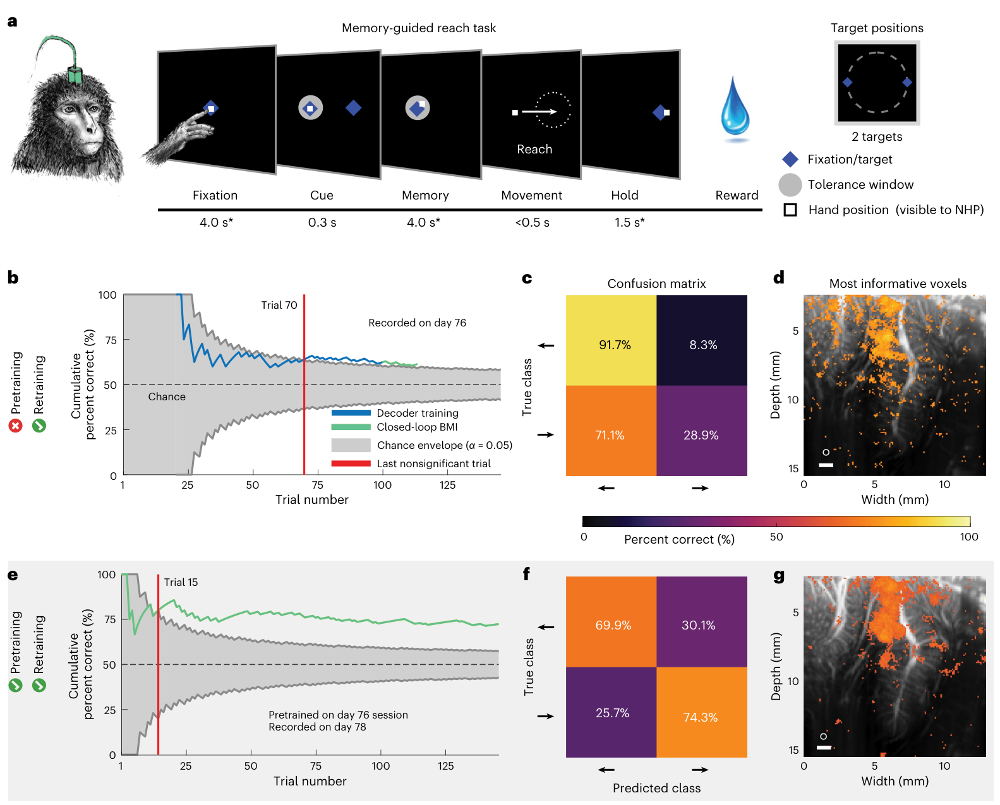

> **图 6** | 解码两个伸取方向的示例会话（猴子 P）。a，猴子 P 的记忆引导伸取任务。与图 1b 的记忆引导扫视任务相同，只是所有注视或眼动分别替换为在屏幕上保持触摸和伸取运动。* 注视期与记忆期为 ±1,000 ms 抖动；保持期为 ±500 ms 抖动。外周提示从两个外周目标中选取其一。白色方块表示猴子的手部位置，猴子可见。b–d，仅用当前会话数据训练的示例会话结果。格式同……整个会话最终解码准确率的混淆矩阵，以百分比表示。d，搜索光分析显示解码准确率最高的 10% 体素（阈值为 q ≤ 3.05 × 10−3）。e–g，用第 76 天数据预训练、并在每个成功试次后重新训练的第 78 天示例会话结果。格式与图 2d–f 相同。e，累计解码准确率随试次数的变化。f，整个会话最终解码准确率的混淆矩阵，以百分比表示。g，搜索光分析显示解码准确率最高的 10% 体素（阈值为 q ≤ 6.47 × 10−3）。

| 图内标签 | 中文 |
| --- | --- |
| Decoder training | 解码器训练 |
| Closed-loop BMI | 闭环脑机接口 |
| Chance envelope (α = 0.05) | 随机包络（α = 0.05） |
| Last nonsignificant trial | 最后一个不显著试次 |
| Cumulative percent correct (%) | 累计正确率（%） |
| Percent correct (%) | 正确率（%） |
| Trial number | 试次数 |
| Trial 15 / Trial 70 | 第 15 试次 / 第 70 试次 |
| Memory-guided reach task | 记忆引导伸取任务 |
| Reach | 伸取 |
| Target positions | 目标位置 |
| 2 targets | 2 个目标 |
| Fixation | 注视 |
| Cue | 提示 |
| Memory | 记忆 |
| Movement | 运动 |
| Hold | 保持 |
| Reward | 奖赏 |
| 0.3 s / 4.0 s* / <0.5 s / 1.5 s* / 4.0 s* | 各阶段时长（提示 0.3 s / 注视 4.0 s* / 伸取 <0.5 s / 保持 1.5 s* / 记忆 4.0 s*） |
| Fixation/target | 注视点/目标 |
| Hand position (visible to NHP) | 手部位置（猴子可见） |
| Tolerance window | 容差窗口 |
| Confusion matrix | 混淆矩阵 |
| True class / Predicted class | 真实类别 / 预测类别 |
| Most informative voxels | 最具信息量的体素 |
| Pretrained on day 76 session | 用第 76 天会话预训练 |
| Recorded on day 76 / Recorded on day 78 | 记录于第 76 天 / 记录于第 78 天 |
| Width (mm) / Depth (mm) | 宽度（mm）/ 深度（mm） |
| Pretraining / Retraining | 预训练 / 再训练 |
| Chance | 随机水平 |

fUS 神经成像的另一个优势是其大视野，能够感知来自多个功能各异脑区的活动，包括编码不同运动效应器（例如手和眼）的脑区。为检验这一点，我们解码了指向两个目标方向的预期手部运动（猴子 P 向左/右伸取）（图 6）。猴子执行记忆引导伸取任务，训练期间须将手指保持在中央圆点上，并触摸外周目标（图 6a）。在此情形下，我们不再约束猴子的眼位，而是记录手部运动来训练 fUS-BMI。训练期结束后，猴子在将手保持在中央注视提示上的同时，用 fUS-BMI 控制任务。值得注意的是，我们使用了与眼动解码相同的成像平面，该平面同时包含 LIP（对眼动重要）与 MIP（对伸取运动重要）。在一个仅使用当前会话数据的示例会话中（图 6b），解码器在 70 个试次后达到显著，累计解码准确率为 61.3%。解码器主要猜测"向左"（图 6c）。背侧 LIP 内的两个焦点，以及分散于 7a 区和颞顶联合区（area tpt）的体素，构成了解码两个伸取方向时最具信息量的体素（图 6d）。

我们在一个示例会话中评估了预训练 fUS-BMI 的效果（图 6e–g）。与扫视解码器一样，预训练显著缩短了训练时间。在某些情况下，预训练"挽救"了一个糟糕的模型。例如，仅使用当前数据的示例会话（图 6c）表现出严重的"向左"偏好。几天后我们用这同一个示例会话去预训练 fUS-BMI 时，新模型给出的预测变得均衡（图 6f）。该示例会话的搜索光分析显示，无预训练示例会话中的同一背侧 LIP 区域包含了大部分最具信息量的体素（图 6g）。MIP 与 5 区也包含成片的高信息量体素。

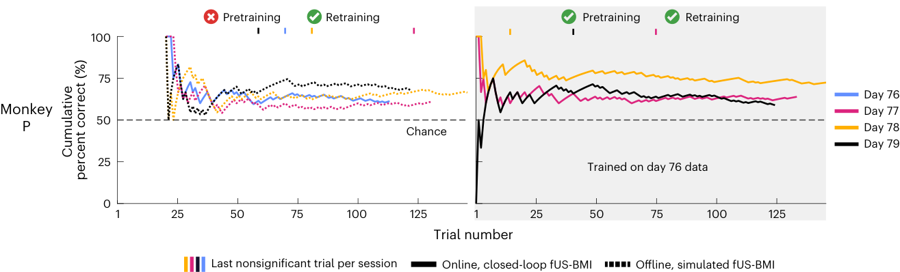

> **图 7** | 解码两个伸取方向的跨会话表现。猴子 P 的跨会话表现。格式与图 3 相同。

| 图内标签 | 中文 |
| --- | --- |
| Monkey P | 猴子 P |
| Cumulative percent correct (%) | 累计正确率（%） |
| Trial number | 试次数 |
| Day 76 / Day 77 / Day 78 / Day 79 | 第 76 天 / 第 77 天 / 第 78 天 / 第 79 天 |
| Trained on day 76 data | 用第 76 天数据训练 |
| Chance | 随机水平 |
| Pretraining / Retraining | 预训练 / 再训练 |
| Offline, simulated fUS-BMI | 离线模拟 fUS-BMI |
| Online, closed-loop fUS-BMI | 在线闭环 fUS-BMI |
| Last nonsignificant trial per session | 每个会话的最后一个不显著试次 |

**仅使用当前会话的数据。** 每个会话（1 个实时、3 个模拟）结束时累计解码准确率均达到显著。表现达到 65 ± 2% 正确率，达到显著所需试次数为 67.67 ± 18.77（图 7，左）。

**使用既往会话数据进行预训练。** 每个会话（3 个实时）结束时累计解码准确率均达到显著（图 7，右）。猴子 P 的表现达到 65 ± 4% 正确率，达到显著所需试次数为 43.67 ± 17.37。在三个实时会话中的两个，达到显著所需试次数因预训练而减少（快 2–46 个试次；快 0–16 min）。有预训练与无预训练的会话之间表现无统计学差异（配对 t 检验，P < 0.05）。我们还模拟了完全不用当前会话训练数据的效果，即仅使用预训练模型（扩展数据图 4c）。无论是否纳入当前会话的训练数据，表现（准确率或达到显著表现所需试次数）均未观察到统计学显著差异。

这些结果与既往研究的结果[[9]](#ref-9)一致：我们不仅能够解码眼动，也能解码伸取运动。与眼动解码器一样，我们可以用既往会话数据预训练 fUS-BMI，从而减少甚至消除对新训练数据的需求。

## 讨论

本工作成功实现了一套闭环、在线的超声脑机接口，并另有两项为下一代超声脑机接口奠定基础的关键进展：解码更多运动方向，以及使解码器在超过一个月的时间内保持稳定。

### 解码更多运动方向

我们成功实时解码了八个运动方向，这相对于此前使用预先记录数据解码两个扫视方向和两个伸取方向的工作[[9]](#ref-9)是一大进展。具体而言，我们用实时在线数据复现了双方向的结果（图 2、3、6 和 7），随后将解码器扩展至可处理八个运动方向（图 4 和 5）。

### 使解码器跨时间稳定

使用皮层内电极（如 Utah 阵列）的脑机接口，特别擅长在行为或刺激期间感知来自空间局限区域（<1 cm）的快速变化（毫秒尺度）神经活动——前提是该活动与这些空间特异区域（例如运动任务中的 M1、视觉任务中的 V1）的活动相关。然而，皮层内电极难以在较长时间内（例如相邻记录会话之间）追踪同一批神经元[[15,16]](#ref-15)。因此，解码器通常每天都要重新训练[[15]](#ref-15)。超声设备也存在类似的神经元群体识别问题，包括实验会话之间视野的位移。在本研究中，我们展示了一种对齐方法，可使基于图像的脑机接口在超过一个月的时间内保持稳定，并且在极少甚至无需重新训练的情况下从同一批神经血管群体中解码。这是一项关键进展，它使数天前的模型能够便捷地对齐到新一天的数据，并允许在极少甚至没有新训练数据的情况下开始解码。已有大量工作致力于在不依赖大量新数据的前提下跨天重新校准皮层内脑机接口[[18-23]](#ref-18)。这些方法大多需要识别流形（manifold）和/或潜在动力学参数，并采集新的神经与行为数据以对齐到这些流形/参数。迄今为止，这些技术都是针对各研究组的具体应用而定制的，且要求各异，例如模型的超参数调优[[23]](#ref-23)或数据具有一致的时间结构[[22]](#ref-22)。除解剖变化之外，它们也易受功能变化的影响。例如，"流形之外"的学习/可塑性会以许多对齐技术难以应对的方式改变流形[[24]](#ref-24)。最后，部分算法计算开销大，且/或难以在在线场景中实现[[22]](#ref-22)。

与这些基于流形的方法不同，我们的解码器对齐算法利用 fUS 神经成像固有的空间分辨率与视野来实现解码器稳定化，方式直观、可重复且性能良好。我们使用单帧 fUS 图像（约 500 ms）生成当前会话解剖结构的图像，并将既往会话的视野对齐到这一单帧图像上。值得注意的是，该对齐过程不需要任何额外的行为任务。由于我们只依赖解剖结构，我们的解码器对齐稳健可靠，可使用任何现成的对齐工具；并且只要会话之间解剖结构与相关变量的介观编码不发生剧烈变化，该方法就是有效的。

每个会话中超声换能器的精确定位对解码器表现有多大影响，尤其是平面外位移或旋转，仍是一个未决问题。在当前的实验中，我们使用的线性解码器假定：在所有已对齐的数据会话中，给定的图像像素对应同一个脑体素。为尽量减少对该像素–体素关系的破坏，我们在 2D 平面内进行图像对齐。由于我们只能对 2D 记录平面成像，因此没有校正会话之间任何会破坏像素–体素映射假设的脑平面外位移。未来的 fUS-BMI 解码器或可受益于神经血管的三维（three-dimensional，3D）模型，例如将 2D 视野配准到 3D 体数据[[25-27]](#ref-25)，以更好地维持一致的像素–体素映射。

### 提升表现

目前，使用硬膜下 ECoG 或皮层内电极的最先进脑机接口能够以高准确率解码 >15–60 词/分钟、>29–90 字符/分钟以及单个手指的运动[[2,28-30]](#ref-2)（补充表 1）。无创头皮 EEG 是另一种常用作脑机接口系统控制神经基础的技术。现代 EEG 脑机接口的表现因使用者不同而差异极大[[31]](#ref-31)，但使用 EEG 解码运动想象或运动意图通常可实现两个自由度、70–90% 的准确率[[32]](#ref-32)。这一表现与本文使用 fUS 所报道的表现相当。然而，作为一种仍在演进中的神经成像技术，fUS 的表现正在迅速提升。我们有若干改进 fUS-BMI 表现的设想。

第一，将超声换能器沿顶内沟轴向重新对齐，将允许我们从 LIP 与 MIP 的更大范围采样。本文中，我们将记录腔与探头置于冠状方向，以利于解剖学上的可解释性。然而，我们成像平面的大部分并未对解码器表现有所贡献（图 2c,f、4c,f 和 6d,g）。既往研究发现，LIP 内的感受野沿前后轴梯度进行解剖学组织[[17]](#ref-17)。在未来的研究中将记录腔重新对齐为垂直于顶内沟，我们就能从 LIP 更大的前后范围采样，获得更多样的方向调谐范围。

第二，我们受限于 2D 平面成像。基于矩阵阵列或行列阵列技术的 3D 超快容积成像的出现，将能够感知目前与成像平面正交的血管中的 CBV 变化[[26,27]](#ref-26)。此外，3D 容积成像可以完整覆盖整个功能区域，并同时感知多个功能区域。有许多区域可以容纳在单个 3D 探头的视野内并为运动脑机接口做出贡献，例如后顶叶皮层（PPC）、初级运动皮层（primary motor cortex，M1）、背侧前运动皮层（dorsal premotor cortex，PMd）和辅助运动区（supplementary motor area，SMA）。这些区域编码运动的不同方面，包括目标、序列和动作的预期价值[[33-36]](#ref-33)。这仅仅是跨脑区同步数据将使多种脑机接口解码策略成为可能的众多例子之一。目前，由于带宽、内存和算力的限制，高质量、低延迟的实时 3D fUS 成像尚不可行。然而，硬件与算法的持续进步很可能不久就能实现 3D fUS-BMI。

第三，另一条提升表现的路径可能是使用更先进的解码器模型来替代本研究中使用的线性解码器。卷积神经网络专为识别图像特征而设计，且对 fUS 图像中常见的空间扰动（例如与呼吸或心率相关的脑搏动）具有稳健性。循环神经网络与 Transformer 采用"记忆"机制，可能特别擅长刻画 fUS 时间序列数据的时间结构。这类人工神经网络（artificial neural network，ANN）的一个潜在缺点是它们需要明显更多的训练数据。本文提出的跨会话图像对齐方法，使得既往记录的数据可以被聚合并组织成一个大型数据语料库。这样的数据语料库可能足以训练许多人工神经网络。除了训练人工神经网络所需的数据量之外，近期工作还指出了为闭环运动脑机接口控制训练深度学习模型的其他挑战[[37]](#ref-37)，尤其是避免模型对既往记录数据中的时间结构过拟合。尽管使用人工神经网络进行训练与推理超出了当前实验的范围，但这可能成为未来更复杂 fUS-BMI 的一个重要研究方向[[38]](#ref-38)。

### fUS 相对于现有脑机接口技术的优势

与现有脑机接口技术相比，fUS 具有若干优势。这些优势包括：

（1）大而深的视野与介观空间分辨率：我们使用的 15.6 MHz 超声换能器提供了大而深的视野（12.8 mm × 20 mm），使我们能够可靠地同时记录多个皮层区域的介观尺度（100 μm）活动。运动变量的空间表征往往定位于不同的脑区。因此，能够并行地从众多此类区域记录信号极具优势。此外，许多用于脑机接口应用的技术仅限于记录大脑表面数毫米以内的浅层皮层（补充表 1）。在本研究中，解码眼动时最具信息量的体素位于 LIP 的中层至深层，约在大脑表面以下 5–9 mm（图 2c,f 和 4c,f），超出了 ECoG、Utah 阵列和钙成像的可及范围。

既往研究发现，随着空间分辨率变差，PPC 的离线 fUS 解码准确率会迅速下降[[9]](#ref-9)。这表明，具有宏观（≥1 mm）空间分辨率的脑机接口技术（如 EEG、fNIRS 和 fMRI）将继续难以有效解码微观与介观神经群体内部变化的信息，例如本研究所用的 PPC 亚区。

（2）易于重新定位：使用 fUS 时，定位并记录特定感兴趣区域十分容易。超声换能器可以在固定到位之前多次定位、测试和重新定位。侵入性电极阵列通常只植入一次，且常因定位不佳或为避免刺穿主要血管而被置于次优位置。已植入的电极阵列难以重新定位，因为这样做需要额外的手术。

（3）可穿透软组织成像：组织反应会降低硬膜下与皮层内慢性电极的性能[[39,40]](#ref-39)，而 fUS 原则上可以无限期地穿透硬脑膜工作，从而实现长时间慢性成像，且信号质量几乎不下降（若有下降也极小）。在此前的一项猴子研究中，fUS 神经成像能够穿透硬脑膜成像，包括硬脑膜上方形成的肉芽组织（约数毫米），在 2.5 年内的灵敏度损失极小[[9]](#ref-9)。与 fUS 能够穿透增厚的硬脑膜和肉芽组织成像这一能力不同，未来还需要开展工作来表征并优化植入式超声换能器的使用寿命。

（4）易于跨会话对齐数据：在本技术报告中，我们展示了 fUS 的一项新收益，即解码器可在数天甚至数月内保持稳定。使用常规图像对齐方法，我们可以在不同会话之间对齐解码器，并在会话开始时就进行解码，而无需采集额外的训练数据（扩展数据图 4）。这与基于 ECoG 的脑机接口所展现的优势相似——后者可以在极少甚至无需重新校准的情况下跨会话良好工作[[41-43]](#ref-41)。这在一定程度上可能归因于：与皮层内电极记录的单神经元相比，ECoG 与 fUS 所测量的介观神经群体的表征漂移更小[[44]](#ref-44)。

### fUS 相对于现有脑机接口技术的劣势

与现有脑机接口技术相比，fUS 也有若干弱点。这些弱点包括：

（1）时间分辨率：电生理脑机接口具有极佳的时间分辨率（常为 20–40 KHz），可采用单锋电位（single-spike）解码方法[[45-47]](#ref-45)。本研究中，我们使用的是 2 Hz 的 fUS，实时延迟约 800 ms。fUS 本质上受限于介观神经血管耦合的时间常数（秒级）。尽管这种神经血管响应相当于对每个体素的信号施加了一个低通滤波器，但更快的 fUS 采集速率仍可测量体素间低至 10 ms 分辨率的时间变化[[48]](#ref-48)。Dizeux 等人[[48]](#ref-48)以 100 Hz 进行了离线 fUS 成像，追踪了局部血流动力学变化在皮层各层之间以及单一视野内功能区域之间的快速（10 ms）传播。使用我们现有的设备与软件，在线的 100 Hz fUS 成像在技术上尚不可行。不过，我们对既往采集的离线 fUS 数据进行了时滞相关分析，以近似 100 Hz fUS 成像的结果（补充图 1）。对于我们的种子体素，浅层皮层与脑表面内的相关活动比种子体素活动提前约 10–50 ms，而较深层皮层内的相关活动则滞后种子体素 10–50 ms。这与 Dizeux 等人[[48]](#ref-48)的结果一致，支持 fUS 成像能够在 10 ms 时间分辨率上检测时空模式。随着硬件与软件的改进使实时 fUS 成像的时间分辨率与延迟得到改善，追踪这些快速血流动力学信号的传播可能带来脑机接口表现与响应时间的提升。此外，就本研究以及许多脑机接口应用而言，尽管介观血流动力学响应较慢，动作目标仍可被提取，且不需要提取更快信号（如预期运动轨迹）所需的那样短的延迟。除运动之外，大脑中的许多其他信号可能更适合 fUS 的空间与时间优势，例如监测神经精神疾病的生物标志物（详见下文）。

（2）间接测量神经活动：fUS 测量的是 CBV 的局部变化[[6]](#ref-6)，并与局部神经元活动高度相关[[7,8,49]](#ref-7)。由于颅内电生理与钙光学成像直接测量单个神经元或小群神经元的活动，它们是更好的脑机接口控制信号。随着神经活动的声学指示器（acoustic indicator）被开发出来[[50]](#ref-50)，fUS 或能更直接地测量神经元活动。

### 植入物的侵入性

我们的 fUS 神经成像属于硬膜外操作，且由于超声信号穿透骨骼时衰减显著，需要开颅[[11]](#ref-11)（扩展数据图 2）。尽管 fUS-BMI 是一项颅内技术，但它不需要穿透硬脑膜，也不会造成脑组织损伤。与硬膜下 ECoG 和皮层内电极相比，这降低了手术风险与感染风险。穿透硬脑膜会增加严重感染的风险，例如脑膜炎、脑炎和硬膜下积脓[[51-53]](#ref-51)。

> **【译者注】** 原文把 fUS-BMI 表述为"less-invasive (epidural)"（侵入性更低的硬膜外接口）。主材料 §1.2.1 的结论是：现阶段的 fUS-BCI 是**半侵入**（硬膜外或经颅窗），而非无创；"侵入性更低"是相对于皮层内电极而言，不等于"无创"。阅读时请勿把 epidural 等同于非侵入。

本研究中，我们使用了一个为其他探索多个脑区的实验而开的较大颅骨开口（约 24 mm × 约 24 mm）[[9]](#ref-9)。对于未来的超声脑机接口，颅骨开口只需达到超声换能器透镜的尺寸（本研究所用换能器约为 13 mm × 4 mm；扩展数据图 2b）。神经外科医生所做的骨孔（burr hole）直径通常为 14 mm，这意味着未来版本的 fUS-BMI 可以植入到目标区域上方的单个骨孔内。此外，也有工作致力于使用新型超声序列[[54]](#ref-54)或通过可透声的颅骨替代材料[[10]](#ref-10)来实现经颅 fUS 神经成像。

### 解码手部运动与眼动

解码眼动时，背侧与腹侧 LIP 包含最具信息量的体素（图 2c,f 和 4c,f）。这与既往文献一致：LIP 对空间特异性的眼动意图和注意很重要[[12]](#ref-12)。在伸取运动期间，背侧 LIP、MIP、5 区和 7 区包含最具信息量的体素（图 6d,g）。LIP 内的体素与双方向扫视解码的最具信息量体素高度吻合，提示我们的 fUS-BMI 可能在利用眼动计划来构建其运动方向模型。MIP 与 5 区内成片的高信息量体素则提示，fUS-BMI 可能也在利用伸取特异性信息[[13,55,56]](#ref-13)。未来的实验对于厘清 LIP、MIP、5 区及其他 PPC 区域在 fUS-BMI 准确预测效应器中的介观贡献将至关重要。其中一项实验是：在猴子执行分离的眼动与伸取运动时记录并最终解码 PPC 的 fUS 信号[[13]](#ref-13)。随着该 fUS-BMI 向人类应用转化，也可以通过指示受试者执行分离的效应器任务，来更清晰地研究这些效应器特异性信号。

在本技术报告中，我们展示了 fUS-BMI 在运动应用中的实用性，以便更便捷地与现有脑机接口技术进行比较。由于 fUS 神经成像能够同时记录多个皮层与皮层下脑区，一个令人兴奋的未来方向是探索 fUS-BMI 如何在新型脑机接口范式中同时解码感觉与运动活动。

### 超越运动脑机接口

绝大多数脑机接口都聚焦于恢复瘫痪患者丧失的运动功能。近来，人们开始关注开发闭环脑机接口以恢复其他人群的功能，包括因神经精神疾病而失能的患者[[1]](#ref-1)。全球约 12% 的人患有抑郁、焦虑或其他心境障碍，而一线治疗仅对约 33% 的患者有效[[57]](#ref-57)。对于一线治疗失败的患者，神经精神脑机接口可能是一条有前景的路径。举一个例子：脑机接口测量与不同心境状态高度相关的脑信号；当检测到异常心境状态时，脑机接口可以调整治疗，例如精确刺激特定脑区[[58]](#ref-58)。

fUS-BMI 可能是一个非常适合神经精神脑机接口的平台（补充表 1）。它能够从分布式的脑区记录信号；它所测量的血流动力学信号以秒级变化，因而快于心境的时间尺度；它能够跨月追踪相同的解剖体积；并且它可以被做成便携式[[59]](#ref-59)。一种可能的方案是将 fUS 成像与超声神经调控（ultrasound neuromodulation，UNM）配对使用。fUS 神经成像可以追踪神经调控引起的局部网络响应，从而使神经调控不仅可为每位患者精确调整，还可针对每一种特定的心境异常进行精确调整。若在空间、时间和频率上过于接近，UNM 与 fUS 成像可能相互干扰。频分或时分复用很可能能在不牺牲整体带宽的前提下解决该问题。目前证据表明，UNM 仅需 0.5–2.0 min 的刺激，其效应即可持续数小时至数月[[60-62]](#ref-60)，这意味着 fUS 非常适合追踪 UNM 的局部效应，并精确地把控达到预期临床效果所需的 UNM 剂量。

## 结论

本文所呈现的成果证明了在线闭环 fUS-BMI 的可行性。该技术仍处于早期阶段，将其转化为临床可用的脑机接口还有大量工作要做。但我们相信，本工作为新一代脑机接口奠定了基础——它们具有高分辨率、跨时间稳定，并可扩展至感知大脑大面积深部区域的活动。这些进展使 fUS-BMI 向更广泛的应用迈出了一步，包括恢复瘫痪患者或患有严重神经精神疾病患者的功能。

## 在线内容

任何方法、补充参考文献、Nature Portfolio 报告摘要、源数据、扩展数据、补充信息、致谢、同行评议信息；作者贡献与利益冲突详情；以及数据与代码可用性声明，均可在 https://doi.org/10.1038/s41593-023-01500-7 获取。

## 参考文献

> 以下为原文文献表，**保留英文不翻译**；正文角标 `[n]` 即指向此表。

1. Shanechi, M. M. Brain–machine interfaces from motor to mood. Nat. Neurosci. 22, 1554–1564 (2019).
2. Willett, F. R. et al. A high-performance speech neuroprosthesis. Nature 620, 1031–1036 (2023).
3. Collinger, J. L. et al. High-performance neuroprosthetic control by an individual with tetraplegia. Lancet 381, 557–564 (2013).
4. Sorger, B., Reithler, J., Dahmen, B. & Goebel, R. A real-time fMRIbased spelling device immediately enabling robust motor-independent communication. Curr. Biol. 22, 1333–1338 (2012).
5. Yoo, S.-S. et al. Brain–computer interface using fMRI: spatial navigation by thoughts. NeuroReport 15, 1591–1595 (2004).
6. Macé, E. et al. Functional ultrasound imaging of the brain. Nat. Methods 8, 662–664 (2011).
7. Claron, J. et al. Co-variations of cerebral blood volume and single neurons discharge during resting state and visual cognitive tasks in non-human primates. Cell Rep. 42, 112369 (2023).
8. Nunez-Elizalde, A. O. et al. Neural correlates of blood flow measured by ultrasound. Neuron 110, 1631–1640 (2022).
9. Norman, S. L. et al. Single-trial decoding of movement intentions using functional ultrasound neuroimaging. Neuron 109, 1554–1566 (2021).
10. Rabut, C. et al. A window to the brain: ultrasound imaging of human neural activity through a permanent acoustic window. Preprint at bioRxiv https://doi.org/10.1101/2023.06.14.544094 (2023).
11. Pinton, G. et al. Attenuation, scattering, and absorption of ultrasound in the skull bone. Med. Phys. 39, 299–307 (2012).
12. Andersen, R. A. & Cui, H. Intention, action planning, and decision making in parietal-frontal circuits. Neuron 63, 568–583 (2009).
13. Snyder, L. H., Batista, A. P. & Andersen, R. A. Coding of intention in the posterior parietal cortex. Nature 386, 167–170 (1997).
14. Christopoulos, V. N., Kagan, I. & Andersen, R. A. Lateral intraparietal area (LIP) is largely effector-specific in free-choice decisions. Sci. Rep. 8, 8611 (2018).
15. Downey, J. E., Schwed, N., Chase, S. M., Schwartz, A. B. & Collinger, J. L. Intracortical recording stability in human brain-computer interface users. J. Neural Eng. 15, 046016 (2018).
16. Santhanam, G. et al. HermesB: a continuous neural recording system for freely behaving primates. IEEE Trans. Biomed. Eng. 54, 2037–2050 (2007).
17. Patel, G. H., Kaplan, D. M. & Snyder, L. H. Topographic organization in the brain: searching for general principles. Trends Cogn. Sci. 18, 351–363 (2014).
18. Sussillo, D., Stavisky, S. D., Kao, J. C., Ryu, S. I. & Shenoy, K. V. Making brain–machine interfaces robust to future neural variability. Nat. Commun. 7, 13749 (2016).
19. Pandarinath, C. et al. Latent factors and dynamics in motor cortex and their application to brain–machine interfaces. J. Neurosci. 38, 9390–9401 (2018).
20. Degenhart, A. D. et al. Stabilization of a brain–computer interface via the alignment of low-dimensional spaces of neural activity. Nat. Biomed. Eng. 4, 672–685 (2020).
21. Wilson, G. H. et al. Long-term unsupervised recalibration of cursor BCIs. Preprint at bioRxiv https://doi.org/10.1101/ 2023.02.03.527022 (2023).
22. Karpowicz, B. M. et al. Stabilizing brain-computer interfaces through alignment of latent dynamics. Preprint at bioRxiv https:// doi.org/10.1101/2022.04.06.487388 (2022).
23. Ma, X. et al. Using adversarial networks to extend brain computer interface decoding accuracy over time. eLife 12, e84296 (2023).
24. Oby, E. R. et al. New neural activity patterns emerge with long-term learning. Proc. Natl Acad. Sci. USA 116, 15210–15215 (2019).
25. Demené, C. et al. 4D microvascular imaging based on ultrafast Doppler tomography. NeuroImage 127, 472–483 (2016).
26. Rabut, C. et al. 4D functional ultrasound imaging of whole-brain activity in rodents. Nat. Methods 16, 994–997 (2019).
27. Brunner, C. et al. A platform for brain-wide volumetric functional ultrasound imaging and analysis of circuit dynamics in awake mice. Neuron 108, 861–875.e7 (2020).
28. Metzger, S. L. et al. Generalizable spelling using a speech neuroprosthesis in an individual with severe limb and vocal paralysis. Nat. Commun. 13, 6510 (2022).
29. Willett, F. R., Avansino, D. T., Hochberg, L. R., Henderson, J. M. & Shenoy, K. V. High-performance brain-to-text communication via handwriting. Nature 593, 249–254 (2021).
30. Guan, C. et al. Compositional coding of individual finger movements in human posterior parietal cortex and motor cortex enables ten-finger decoding. Preprint at medRxiv https://doi.org/ 10.1101/2022.12.07.22283227 (2022).
31. Ahn, M. & Jun, S. C. Performance variation in motor imagery brain–computer interface: a brief review. J. Neurosci. Methods 243, 103–110 (2015).
32. Huang, D., Lin, P., Fei, D.-Y., Chen, X. & Bai, O. Decoding human motor activity from EEG single trials for a discrete two-dimensional cursor control. J. Neural Eng. 6, 046005 (2009).
33. Taylor, D. M., Tillery, S. I. H. & Schwartz, A. B. Direct cortical control of 3D neuroprosthetic devices. Science 296, 1829–1832 (2002).
34. Ohbayashi, M., Picard, N. & Strick, P. L. Inactivation of the dorsal premotor area disrupts internally generated, but not visually guided, sequential movements. J. Neurosci. 36, 1971–1976 (2016).
35. Côté, S. L., Elgbeili, G., Quessy, S. & Dancause, N. Modulatory effects of the supplementary motor area on primary motor cortex outputs. J. Neurophysiol. 123, 407–419 (2020).
36. Platt, M. L. & Glimcher, P. W. Neural correlates of decision variables in parietal cortex. Nature 400, 233–238 (1999).
37. Deo, D. R. et al. Translating deep learning to neuroprosthetic control. Preprint at bioRxiv https://doi.org/10.1101/2023.04.21.537581 (2023).
38. Berthon, B., Bergel, A., Matei, M. & Tanter, M. Decoding behavior from global cerebrovascular activity using neural networks. Sci. Rep. 13, 3541 (2023).
39. Szymanski, L. J. et al. Neuropathological effects of chronically implanted, intracortical microelectrodes in a tetraplegic patient. J. Neural Eng. 18, 0460b9 (2021).
40. Degenhart, A. D. et al. Histological evaluation of a chronically-implanted electrocorticographic electrode grid in a non-human primate. J. Neural Eng. 13, 046019 (2016).
41. Moses, D. A. et al. Neuroprosthesis for decoding speech in a paralyzed person with anarthria. N. Engl. J. Med. 385, 217–227 (2021).
42. Chao, Z. C., Nagasaka, Y. & Fujii, N. Long-term asynchronous decoding of arm motion using electrocorticographic signals in monkeys. Front Neuroeng. 3, 3 (2010).
43. Silversmith, D. B. et al. Plug-and-play control of a brain–computer interface through neural map stabilization. Nat. Biotechnol. 39, 326–335 (2021).
44. Clopath, C., Bonhoeffer, T., Hübener, M. & Rose, T. Variance and invariance of neuronal long-term representations. Philos. Trans. R. Soc. B: Biol. Sci. 372, 20160161 (2017).
45. Shanechi, M. M. et al. Rapid control and feedback rates enhance neuroprosthetic control. Nat. Commun. 8, 13825 (2017).
46. Shanechi, M. M. et al. A real-time brain-machine interface combining motor target and trajectory intent using an optimal feedback control design. PLoS ONE 8, e59049 (2013).
47. Shanechi, M. M., Orsborn, A. L. & Carmena, J. M. Robust brain-machine interface design using optimal feedback control modeling and adaptive point process filtering. PLoS Comput. Biol. 12, e1004730 (2016).
48. Dizeux, A. et al. Functional ultrasound imaging of the brain reveals propagation of task-related brain activity in behaving primates. Nat. Commun. 10, 1400 (2019).
49. Aydin, A.-K. et al. Transfer functions linking neural calcium to single voxel functional ultrasound signal. Nat. Commun. 11, 2954 (2020).
50. Shapiro, M. G. et al. Biogenic gas nanostructures as ultrasonic molecular reporters. Nat. Nanotech 9, 311–316 (2014).
51. van de Beek, D., Drake, J. M. & Tunkel, A. R. Nosocomial bacterial meningitis. N. Engl. J. Med. 362, 146–154 (2010).
52. McClelland, S. & Hall, W. A. Postoperative central nervous system infection: incidence and associated factors in 2111 neurosurgical procedures. Clin. Infect. Dis. 45, 55–59 (2007).
53. Korinek, A.-M. et al. Risk Factors for adult nosocomial meningitis after craniotomy: role of antibiotic prophylaxis. Neurosurgery 59, 126–133 (2006).
54. Vienneau, E. P. & Byram, B. C. A coded excitation framework for high SNR transcranial ultrasound imaging. IEEE Trans. Med. Imaging 42, 2886–2898 (2023).
55. Lacquaniti, F., Guigon, E., Bianchi, L., Ferraina, S. & Caminiti, R. Representing spatial information for limb movement: role of area 5 in the monkey. Cereb. Cortex 5, 391–409 (1995).
56. Chang, S. W. C., Papadimitriou, C. & Snyder, L. H. Using a compound gain field to compute a reach plan. Neuron 64, 744–755 (2009).
57. Rush, A. J. Unipolar major depression in adults: choosing initial treatment. UpToDate www.uptodate.com/contents/unipolarmajor-depression-in-adults-choosing-initial-treatment/print (2023).
58. Scangos, K. W. et al. Closed-loop neuromodulation in an individual with treatment-resistant depression. Nat. Med. 27, 1696–1700 (2021).
59. Deffieux, T., Demene, C., Pernot, M. & Tanter, M. Functional ultrasound neuroimaging: a review of the preclinical and clinical state of the art. Curr. Opin. Neurobiol. 50, 128–135 (2018).
60. Sanguinetti, J. L. et al. Transcranial focused ultrasound to the right prefrontal cortex improves mood and alters functional connectivity in humans. Front. Hum. Neurosci. 14, 52 (2020).
61. Matt, E. et al. First evidence of long-term effects of transcranial pulse stimulation (TPS) on the human brain. J. Transl. Med. 20, 26 (2022).
62. Verhagen, L. et al. Offline impact of transcranial focused ultrasound on cortical activation in primates. eLife 8, e40541 (2019).
63. Saleem, K. S. A Combined MRI and Histology Atlas of the Rhesus Monkey Brain in Stereotaxic Coordinates (Academic Press, 2012). Publisher’s note Springer Nature remains neutral with regard to jurisdictional claims in published maps and institutional affiliations. Open Access This article is licensed under a Creative Commons Attribution 4.0 International License, which permits use, sharing, adaptation, distribution and reproduction in any medium or format, as long as you give appropriate credit to the original author(s) and the source, provide a link to the Creative Commons license, and indicate if changes were made. The images or other third party material in this article are included in the article’s Creative Commons license, unless indicated otherwise in a credit line to the material. If material is not included in the article’s Creative Commons license and your intended use is not permitted by statutory regulation or exceeds the permitted use, you will need to obtain permission directly from the copyright holder. To view a copy of this license, visit http://creativecommons. org/licenses/by/4.0/. © The Author(s) 2023
64. Peirce, J. W. PsychoPy—psychophysics software in Python. J. Neurosci. Methods 162, 8–13 (2007).
65. Demené, C. et al. Spatiotemporal clutter filtering of ultrafast ultrasound data highly increases Doppler and fUltrasound sensitivity. IEEE Trans. Med. Imaging 34, 2271–2285 (2015).
66. Das, K. & Nenadic, Z. An efficient discriminant-based solution for small sample size problem. Pattern Recognit. 42, 857–866 (2009).

## 材料与方法

### 实验模型与受试者详情

所有训练、记录以及手术与动物护理程序均经加州理工学院机构动物护理与使用委员会批准（方案编号 1256），并符合《公共卫生服务政策：实验动物的照料与使用》。我们植入了两只健康的 14 岁雄性恒河猴（Macaca mulatta），体重 14–17 kg。

### 通用

我们使用 NeuroScan Live 软件（ART INSERM U1273 与 Iconeus），实时 fUS-BMI 通过其与 MATLAB 2019b（v9.7）（MathWorks）对接，其他所有分析则使用 MATLAB 2021a（v9.10）。

**动物准备与植入。** 对于每只猴子，我们放置了一个含钛制头部固定柱的颅骨植入物，并在后顶叶皮层上方实施了开颅。开颅下方的硬脑膜保持完整。开颅处由一个 24 mm × 24 mm（内径）的记录腔覆盖。在每个记录会话中，我们使用一个定制的 3D 打印聚醚酰亚胺（polyetherimide）开槽腔塞来固定超声换能器。这使我们在不同日期能够一致地采集相同的解剖平面。

**行为装置。** 猴子坐在灵长类椅上，面对显示器或触摸屏。液晶显示器置于猴子前方约 30 cm 处。触摸屏的放置位置每天调整，以使猴子能用手指够到屏幕上的所有目标，但不能将手掌搁在屏幕上；其位置在猴子前方约 20 cm。眼位用红外眼动仪（EyeLink 1000）以 500 Hz 追踪。触摸用触摸屏（Elo IntelliTouch）追踪。视觉刺激使用基于 PsychoPy[[64]](#ref-64) 的定制 Python v.2.7 软件呈现。眼位与手部位置连同刺激和时间信息被同步记录，并保存以供离线分析。

### 行为任务

猴子执行了若干不同的记忆引导运动任务。在记忆引导扫视任务中，猴子注视中央提示 5 ± 1 s。一个外周提示在 20° 离心率的外周位置（从两个或八个可能目标位置中选取）呈现 400 ms。猴子在记忆期（5 ± 1 s）内保持注视中央提示，此时外周提示不可见。注视提示消失后，猴子随即向记忆中的位置执行一次扫视。若猴子的眼位处于外周目标 7° 半径范围内，该目标会重新点亮，并在保持期（1.5 ± 0.5 s）内持续显示。猴子在成功完成任务后获得 1,000 ms 的液体奖赏（0.75 ml；稀释果汁）。下一试次开始前有 8 ± 2 s 的试次间间隔。注视期、记忆期和保持期均施加从均匀分布采样的 ±500 ms 时间抖动，以防止猴子预期任务状态的切换。

记忆引导伸取任务与之类似，但猴子改用手指在触摸屏上操作，而非注视。受空间限制，触摸屏使用时不同时进行眼动追踪，即只追踪手部或眼位之一，而非两者。

在记忆引导脑机接口任务中，猴子用其眼位或手部位置完成相同的注视步骤，但运动阶段由 fUS-BMI 控制。关键在于，猴子被训练成在奖赏发放之前不从中央提示处做出眼动或手部动作。对于这一任务变体，若猴子成功保持注视/触摸且 fUS-BMI 预测正确，可获得 1,000 ms 的液体奖赏（0.75 ml；稀释果汁）。若 fUS-BMI 预测错误但猴子成功保持注视/触摸，则可获得 100 ms 的奖赏（0.03 ml；稀释果汁）。这样做是为了维持猴子的积极性。

### fUS-BMI

**fUS 序列与记录。** 在每个 fUS-BMI 会话中，我们将超声换能器（128 阵元微型化线阵探头，中心频率 15.6 MHz，阵元间距 0.1 mm）置于硬脑膜上，以超声凝胶作为耦合剂（扩展数据图 2b）。我们通过开槽腔塞在各个记录会话中一致地定位超声换能器。成像视野为 12.8 mm（宽）× 13–20 mm（高），可同时成像多个皮层区域，包括外侧顶内沟区（LIP）、内侧顶内沟区（MIP）、腹侧顶内沟区（ventral intraparietal area，VIP）、7 区和 5 区（图 1a）。在猴子 P 中，我们在所有实验中采集同一冠状成像平面的数据。在猴子 L 中，我们使用了两个不同的冠状成像平面：一个用于双目标解码，一个用于八目标解码。这三个成像平面是依据预实验离线数据集中的良好解码表现而选定的。

我们使用一台可编程高帧率超声扫描仪（Vantage 256；Verasonics）驱动超声换能器并采集脉冲回波射频数据（扩展数据图 2a）。我们对实时 fUS 神经成像与解剖 fUS 神经成像使用了不同的平面波成像序列。

**实时低延迟 fUS 神经成像。** 我们使用一台运行 NeuroScan Live（ART INSERM U1273 与 Iconeus）的定制计算机，连接到 256 通道的 Verasonics Vantage 超声扫描仪（扩展数据图 2a）。该软件实现了一套定制的平面波成像序列，经过优化可在 2 Hz 下实时输出功率多普勒图像，并使超声脉冲与功率多普勒图像形成之间的延迟最小。该序列使用 5,500 Hz 的脉冲重复频率，并以从 −6° 到 6° 等间隔的 11 个倾斜角发射平面波。这些倾斜平面波以 500 Hz 进行复合。功率多普勒图像由 200 帧复合 B 模式图像构成（400 ms）。为形成功率多普勒图像，软件使用了带 SVD 杂波滤波器[[65]](#ref-65)的超快功率多普勒序列，并舍弃前 30% 的分量。所得的功率多普勒图像被实时传输至一个 MATLAB 实例，用于 fUS-BMI。该原型 2 Hz 实时 fUS 系统从超声脉冲序列结束到波束合成后的 fUS 图像抵达 MATLAB，延迟约为 800 ms。每帧 fUS 图像及其相关时间信息均被保存以供事后分析。

**解剖多普勒神经成像。** 在每个记录会话开始时，我们使用一套定制的平面波成像序列采集血管的解剖图像。我们使用 7,500 Hz 的脉冲重复频率，并以五个角度（−6°、−3°、0°、3°、6°）发射平面波，累积三次。我们将这五个角度、三次累积（15 帧图像）进行相干复合，生成一帧高对比度超声图像。每帧高对比度图像在 2 ms 内形成，即帧率为 500 Hz。我们使用 500 ms 内采集的 250 帧复合 B 模式图像，形成猴子大脑的功率多普勒图像。我们使用奇异值分解（singular value decomposition，SVD）实现组织杂波滤波器，将血细胞运动与组织运动分离[[65]](#ref-65)。

**fUS-BMI 概览。** 实时解码运动意图包含三个部分：（1）对滚动数据缓冲区施加预处理；（2）训练分类器；（3）使用训练好的分类器实时解码运动意图。如前所述[[9]](#ref-9)，预处理、训练与解码所需时间取决于若干因素，包括训练集中的试次数、其他应用带来的 CPU 负载、视野以及分类器算法（PCA + LDA 与逐类主成分分析（class-wise principal component analysis，cPCA）+ LDA）。在离线测试的最坏情况下，预处理、训练与解码分别耗时约 10 ms、500 ms 和 60 ms。关于不同规模训练集下预处理、训练与预测所需时间的进一步描述，见参考文献 [[9]](#ref-9)。

**数据预处理。** 在将功率多普勒图像流式输入分类算法之前，我们对一个滚动的 60 帧（30 s）缓冲区施加了两项预处理操作。我们首先对先前 60 帧（30 s）执行滚动的逐体素 z 分数标准化，然后对缓冲区中 60 帧的每一帧施加半径为 2 像素的 pillbox（圆形）空间滤波器。

**实时分类。** fUS-BMI 在记忆期结束时使用之前 1.5 s 的数据（三帧）做出预测，并通过一个基于 TCP 的服务器将该预测传递给行为控制系统（扩展数据图 2c）。我们在双方向任务与八方向任务中为 fUS-BMI 使用了不同的分类算法。对于解码两个方向的眼动或手部运动，我们使用 cPCA 与 LDA——该方法非常适合高维特征、小样本量的分类问题[[4,5]](#ref-4)。该方法在数学上与此前用于离线解码运动意图的方法[[9]](#ref-9)完全相同，但已针对在线训练与解码进行了优化。简言之，我们使用 cPCA 对数据降维，同时保留 95% 的方差。随后使用 LDA 提高 cPCA 变换后数据的类别可分性。关于该方法与实现的更多细节，见参考文献 [[9,66]](#ref-9)。

对于解码八个方向的眼动，我们采用了一种多编码器方法，分别预测水平分量（左、中、右）与垂直分量（下、中、上），再将二者组合成最终预测。由于水平与垂直运动分量是分开解码的，因此可能出现"居中"预测（水平居中且垂直居中），尽管这并不属于八个可能的外周目标位置之一。我们之所以选择这种多编码器架构，是因为我们知道相似的运动方向会引发相似的神经响应，而角度间隔较大的运动方向则引发不同的神经响应。因此，该多编码器把"解码八个独立方向类别"转化为"同时解码两个三类别集合"，后者更契合 PPC 的响应特性。为执行预测，我们使用了 PCA 与 LDA。我们用 PCA 对数据降维，同时保留数据中 95% 的方差；随后用 LDA 预测最可能的方向。在八方向解码中，我们选择 PCA + LDA 而非 cPCA + LDA，是因为我们在离线分析中发现，在训练试次数量有限时，PCA + LDA 多编码器解码八个运动方向的表现优于 cPCA + LDA。

**模型的实时训练。** 每当训练集更新时，我们就在试次间期重新训练 fUS-BMI 分类器（不中断实验）。对于实时实验，成功试次期间记录的数据会被自动加入训练集。在初始训练阶段，成功试次定义为猴子正确地向目标执行运动并获得液体奖赏。进入脑机接口模式后，成功试次定义为预测正确且猴子在奖赏发放前一直保持注视。

对于使用既往会话数据训练的模型的实验，我们在 fUS-BMI 初始化时使用既往会话中所有有效试次的数据。有效试次定义为任何进入预测阶段的试次，无论是否预测出正确的类别。此后，在当前会话中每当有成功试次加入训练集，分类器即重新训练。

**事后实验。** 这些实验分析仅使用单次会话数据对解码器表现的影响。我们模拟了一个在线场景，按顺序对每个尝试的试次进行训练和/或解码。我们把猴子获得奖赏的所有试次都视为成功，并在每个试次后重新训练。

**与行为系统的连接。** 我们用 Python v.2.7 设计了一个多线程 TCP 服务器，用于在运行 PsychoPy 行为软件的计算机与实时 fUS-BMI 计算机之间接收、解析和发送信息（扩展数据图 2c）。在收到 fUS-BMI 计算机的查询时，该服务器会把任务信息（包括任务时序与实际运动方向）传递给实时超声系统。该客户端–服务器架构是专门为防数据泄漏而设计的：在一个成功试次结束之前，实际运动方向从不会传送到 fUS-BMI。TCP 服务器也接收 fUS-BMI 的预测，并在被查询时将其传递给 PsychoPy 软件。在局域网内两台台式计算机（Windows）之间进行离线测试时，服务器平均写入–读取–解析时间为 31 ± 1（均值 ± 标准差）ms。

### 跨会话对齐

在每个实验会话开始时，我们采集一幅显示成像视野内血管的解剖图像。对于使用既往数据作为 fUS-BMI 初始训练集的会话，我们随后在新解剖图像与既往会话采集的解剖图像之间进行半自动的、基于强度的刚体对齐。我们使用 MATLAB 的 imregtform 函数，配合均方误差度量与正则步长梯度下降优化器，生成既往解剖图像到新解剖图像的初始自动对齐。若自动对齐使两幅图像错位，软件会提示主试通过定制的 MATLAB 图形用户界面手动平移和旋转既往会话的解剖图像。随后我们将最终的刚体变换应用于既往会话的训练数据，从而把既往会话与新会话对齐。

我们选择刚体对齐与变换而非 Procrustes 对齐与变换，因为脑的大小在不同会话之间没有变化。尽管我们确实观察到连续 fUS 帧之间存在脑搏动（部分源于心率和呼吸），但这种搏动并未影响刚体对齐的准确度。此外，由搏动引起的脑膨胀和/或收缩量在图像各处并不相同。脑表面会上下移动，但距脑表面数毫米以内的脑组织是稳定的。对图像进行均匀缩放（例如通过 Procrustes 变换）不能解决该问题，反而会引入新的对齐问题。

### 量化、统计分析与可重复性

> **【译者注】** 原文此句为"Unless reported otherwise, summary statistics are reported as XX ± XX are mean ± s.e.m."。其中"XX ± XX"是作者模板中未填写的占位符，且"are mean ± s.e.m."存在语法冗余/错误。此处照原文直译并保留占位符，并非译者漏译。

除另有说明外，汇总统计量报告为 XX ± XX，为均值 ± 标准误（mean ± s.e.m.）。

**准确率指标。** 我们使用累计正确率与平均角度误差评估 fUS-BMI 的表现。所报告的所有准确率指标反映的都是测试表现而非训练集上的表现，即我们用训练集训练模型，然后在不在训练集中的数据上进行测试。

累计正确率 = 正确预测次数 / 总预测次数

平均角度误差 = (1/n)·Σ(i=1…n) |角度误差|，其中 n 为预测次数

累计正确率的随机包络（chance envelope）使用二项分布与总预测次数计算。

高于或低于随机包络的准确率在 α = 0.05 水平上显著。使用二项检验的各项假设均得到满足，包括每个试次只有两种可能结果（成功/失败）、所有试次的成功概率相同（1/n，其中 n 为可能的运动方向数），以及每个试次相互独立。平均角度误差的随机包络使用 105 次重复的置换检验计算。对每次重复，我们从八个可能方向的均匀分布中随机采样 n 次，其中 n 为整个会话中的预测次数。这生成了随机水平解码作为预测次数函数的零分布。随后我们取该零分布的第 5 与第 95 百分位数，生成作为预测次数函数的随机包络。对于比较同一批会话在有/无预训练或再训练条件下表现的配对 t 检验，我们假定数据分布为正态，但未对此进行正式检验。

**事后模拟会话。** 我们使用所记录的实时 fUS 图像来模拟不同参数对 fUS-BMI 表现的影响，例如仅使用当前会话数据而不进行预训练。为此，我们逐帧地把预先记录的 fUS 图像和行为数据流式输入到与闭环在线 fUS-BMI 相同的 fUS-BMI 函数中。为动态构建训练集，我们纳入所有进入记忆期结束阶段的试次，不论离线 fUS-BMI 是否预测出正确的运动方向。这样做是因为糟糕预测可能带来很高的错误率，若只用预测正确的试次构建训练集，可能导致各条件（方向）之间样本不均衡，且可能包含不足以训练模型的试次数。某些方向若预测正确数为零，可能导致模型永远不预测该方向。

**搜索光分析。** 我们定义一个圆形感兴趣区（region of interest，ROI；半径 200 μm），并使其依次遍历成像视野中的所有体素。对每个 ROI，我们使用 cPCA + LDA（双方向）或 PCA + LDA（八方向）算法进行 10 折交叉验证的离线解码，且只使用完全包含在该 ROI 内的体素。我们将各交叉验证折的平均表现赋给该 ROI 的中心体素。为可视化结果，我们将最具显著性的 10% 体素的表现（平均角度误差或准确率）叠加到该会话的解剖血管图上。

**可重复性。** 我们在 24 个会话中采集数据（猴子 L 11 个会话；猴子 P 13 个会话；扩展数据表 1）。这些会话分属三组不同的实验：10 个双目标扫视实验会话、10 个八目标扫视实验会话和 4 个双目标伸取实验会话。在每个会话内，不同目标方向的顺序基于拉丁方设计进行伪随机化。未使用统计方法预先确定会话数的样本量。未使用统计方法预先确定猴子数量的样本量，但我们的样本量与既往发表文献[[9,18,20]](#ref-9)所报道的相近。分析中未剔除任何会话或数据点。数据采集与分析未对实验条件设盲。

**报告摘要。** 有关研究设计的更多信息，见与本文关联的 Nature Portfolio 报告摘要。

**数据可用性。** 本文使用的关键数据存档于 https://doi.org/10.22002/pa710-cdn95。

**代码可用性。** 用于生成关键图表与结果的代码可在 https://github.com/wsgriggs2/rt_fUS_BMI 获取，并已存档于 https://doi.org/10.5281/zenodo.8414598。

## 致谢

我们感谢 K. Pejsa 在动物护理、手术和训练方面的协助。我们感谢 C. Rabut 与 L. Lin 的有益讨论。我们感谢 K. Passanante 绘制插图。W.S.G. 获得 NEI F30（NEI F30 EY032799）、Josephine de Karman 奖学金以及 UCLA-Caltech MSTP（NIGMS T32 GM008042）的资助。S.L.N. 获得 Della Martin 基金会资助。G.C. 获得 NINDS T32（T32 NS105595）资助。本研究得到美国国立卫生研究院 BRAIN Initiative（资助号 1R01NS123663-01，授予 R.A.A.、M.G.S. 和 M.T.）、T&C Chen 脑机接口中心以及 Boswell 基金会（R.A.A.）的支持。M.G.S. 是霍华德·休斯医学研究所的研究员。

## 作者贡献

W.S.G.、S.L.N.、V.C.、M.T.、M.G.S. 与 R.A.A. 构思了本研究。S.L.N. 建立了 fUS 神经成像序列，T.D.、B.-F.O.、F.S. 与 M.T. 编写了 2 Hz 实时 fUS 神经成像的采集软件。W.S.G. 与 S.L.N. 编写了 fUS-BMI 的代码。W.S.G. 训练猴子并采集数据。W.S.G.、S.L.N. 与 G.C. 完成了数据处理与分析。W.S.G. 与 S.L.N. 起草了手稿，M.G.S. 与 R.A.A. 做出了实质性贡献，所有作者均编辑并批准了手稿的最终版本。V.C.、C.L.、M.T.、M.G.S. 与 R.A.A. 监督了本研究。

## 利益冲突

B.-F.O. 是 Iconeus 的员工。T.D.、B.-F.O. 与 M.T. 是 Iconeus 的联合创始人与股东，该公司将超声神经成像扫描仪商业化。S.L.N. 是 Forest Neurotech 的联合创始人兼首席执行官，这是一家为神经科学与临床研究开发工具的非营利研究机构。其余作者声明无利益冲突。

## 附加信息

扩展数据可在本文处获取。补充信息：在线版本包含补充材料。材料索取与通讯请联系 Whitney S. Griggs 或 Sumner L. Norman。同行评议信息：Nature Neuroscience 感谢 David Brandman、Pierre Pouget 以及其他匿名审稿人对本工作同行评议的贡献。转载与许可信息可获取。

> **【译者注】** 原文"附加信息"一节的 Extended data / Supplementary information / Reprints and permissions 三个条目以纯网址结尾，本流水线按既定规则（scripts/extract.py 的 drop_line_re）删除了这些仅含网址的行，因此中文译文对应位置没有网址。这不是漏译；相关 DOI 见 meta.json 与"在线内容"一节。

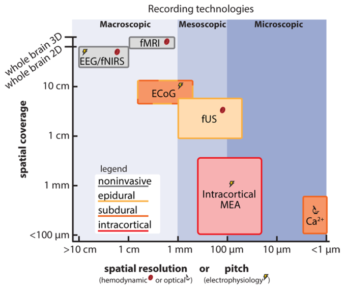

> **扩展数据图 1.** 功能超声成像能够以良好的空间覆盖记录介观神经群体。不同大型动物记录技术在空间覆盖、侵入性与空间分辨率上的比较。空间覆盖指脑体积采样的最大维度。MEA：多电极阵列；Ca2+：钙成像；ECoG：皮层脑电图；EEG：脑电图；fNIRS：功能近红外光谱；fMRI：功能磁共振成像；fUS：功能超声成像。

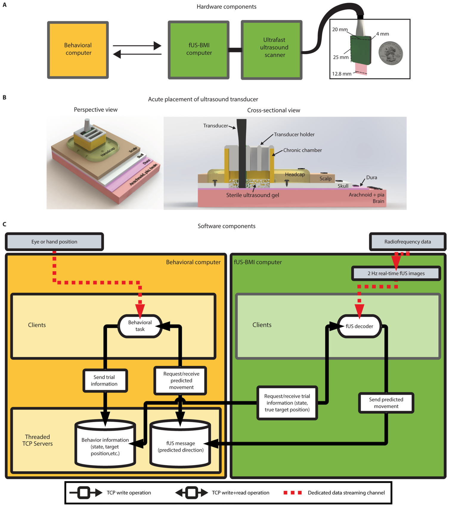

> **扩展数据图 2.** 实时 fUS-BMI 的硬件与软件。(a) 硬件组成。行为计算机通过 TCP 与 fUS-BMI 计算机通信。fUS-BMI 计算机通过专用数据线连接到超快超声扫描仪。fUS-BMI 计算机从超声扫描仪接收射频数据，并实时生成 2 Hz 功率多普勒图像。超快超声扫描仪连接到一台 15.6 MHz 超声换能器并对其进行控制。(b) 超声换能器的急性放置。超声换能器由定制的 3D 打印开槽腔塞固定，该腔塞与猴子记录腔匹配。该记录腔为慢性植入，嵌入固定在猴子颅骨上的头部帽（headcap）内。急性使用的超声换能器连同无菌超声耦合凝胶置于硬脑膜上方。(c) 软件组成。一个运行于 Python 2.7 的多线程 TCP 服务器在运行 PsychoPy 行为软件的计算机与实时 fUS-BMI 计算机之间接收、解析并发送信息。在收到 fUS-BMI 计算机（"fUS 解码器"）的查询时，该服务器会传送必要的任务信息。该客户端–服务器架构是专门为防止数据泄漏而设计的，即在一个成功试次结束之前，实际运动方向从不会传送到 fUS-BMI。TCP 服务器也接收 fUS-BMI 的预测，并在被查询时将其传递给 PsychoPy 软件。在局域网内两台 Windows 计算机之间进行离线测试时，服务器平均写入–读取–解析时间为 31 +/− 1（均值 ± 标准差）ms。

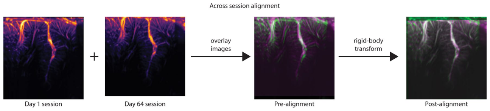

> **扩展数据图 3.** 跨会话对齐算法。我们使用半自动的、基于强度的刚体对齐来求取从既往会话到新成像平面的变换。对齐误差体现在叠加图中：绿色代表旧会话（第 1 天），品红色代表新会话（第 64 天）。

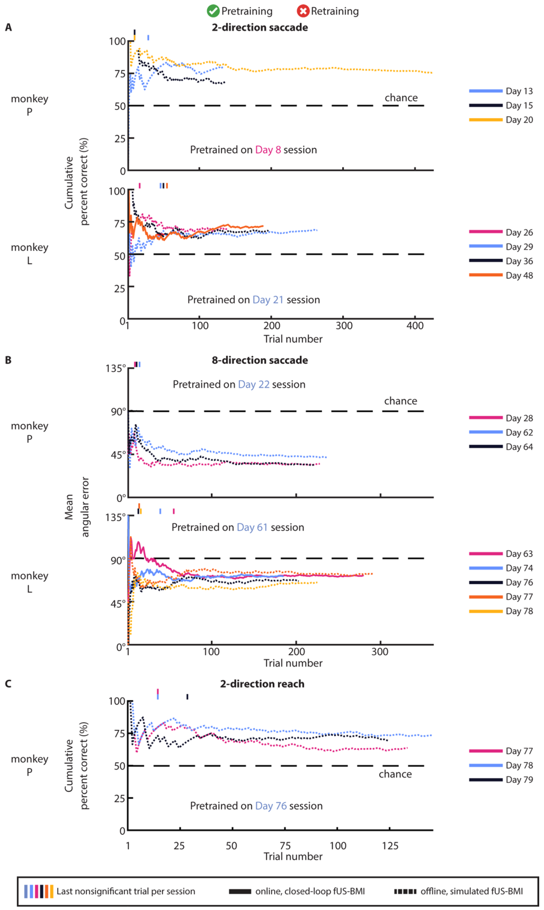

> **扩展数据图 4.** 仅使用预训练模型进行运动方向的闭环实时解码。(a) 仅使用预训练模型时的双方向扫视解码表现。格式与图 3 相同。(b) 仅使用预训练模型时的八方向扫视解码表现。格式与图 5 相同。(c) 仅使用预训练模型时的双方向伸取解码表现。格式与图 7 相同。

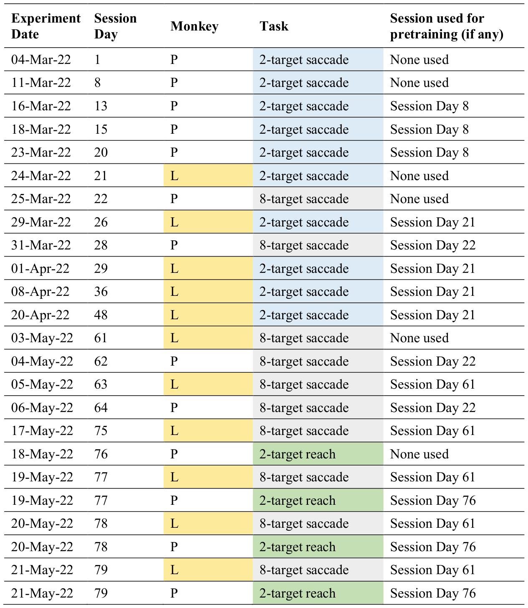

> **扩展数据表 1.** 全部实验会话的记录，包括实验日期、参与猴子、任务以及用于预训练的会话。会话天数为相对于首个会话日的天数。

| 图内标签 | 中文 |
| --- | --- |
| Experiment Date | 实验日期 |
| Session Day | 会话天数 |
| Monkey | 猴子 |
| Task | 任务 |
| Session used for pretraining (if any) | 用于预训练的会话（如有） |
| 2-target saccade | 双目标扫视 |
| 8-target saccade | 八目标扫视 |
| 2-target reach | 双目标伸取 |
| None used | 未使用 |
| Session Day 8 / Session Day 21 / Session Day 22 / Session Day 61 / Session Day 76 | 第 8 天会话 / 第 21 天会话 / 第 22 天会话 / 第 61 天会话 / 第 76 天会话 |

[← 回到首页](..)
