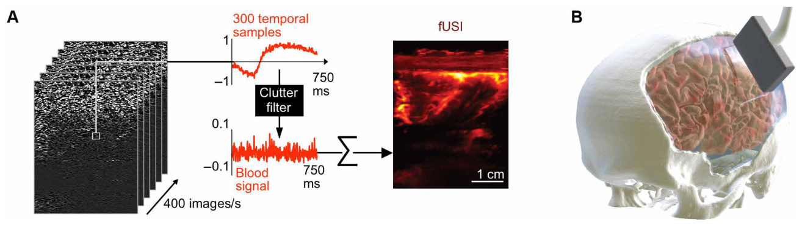
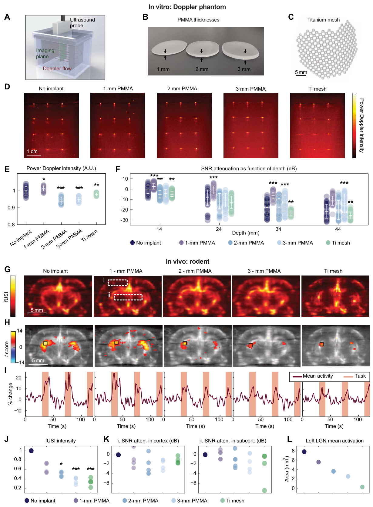
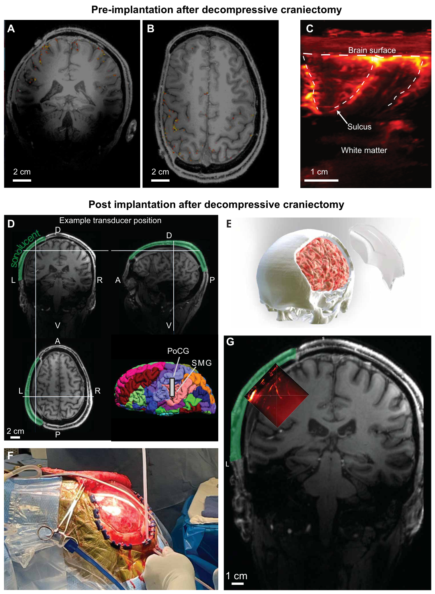
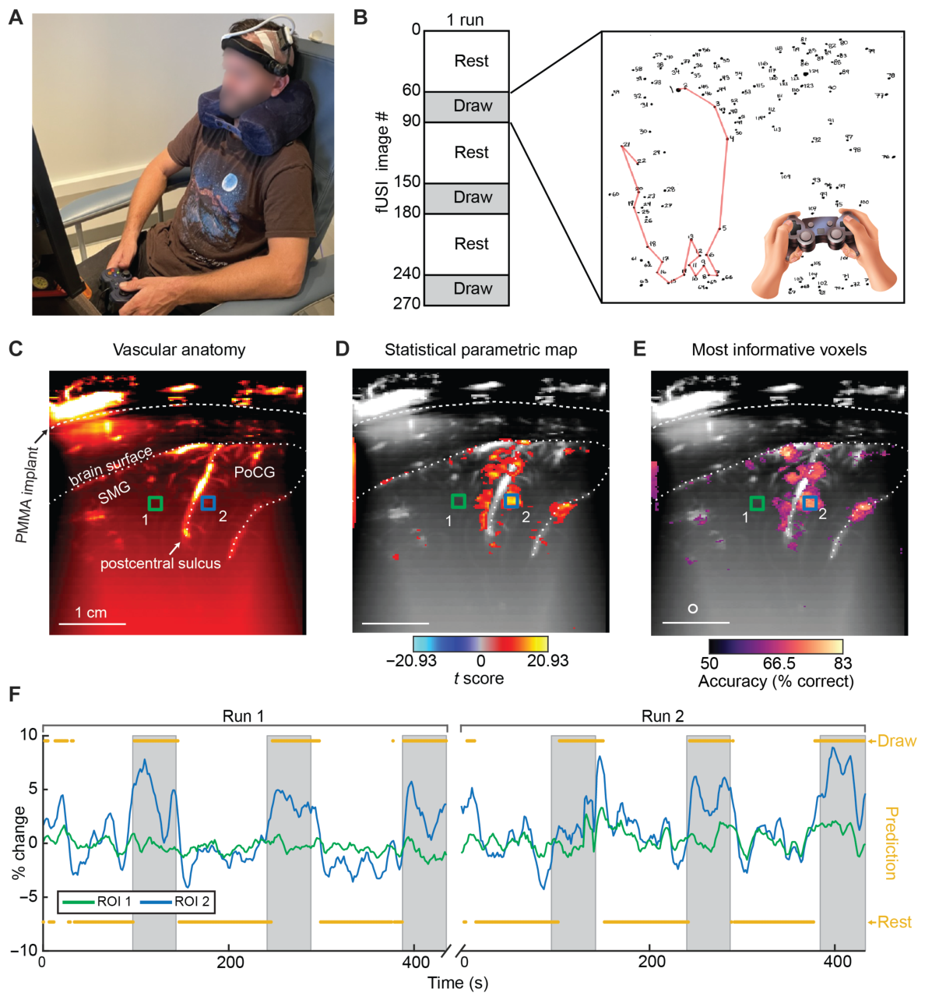
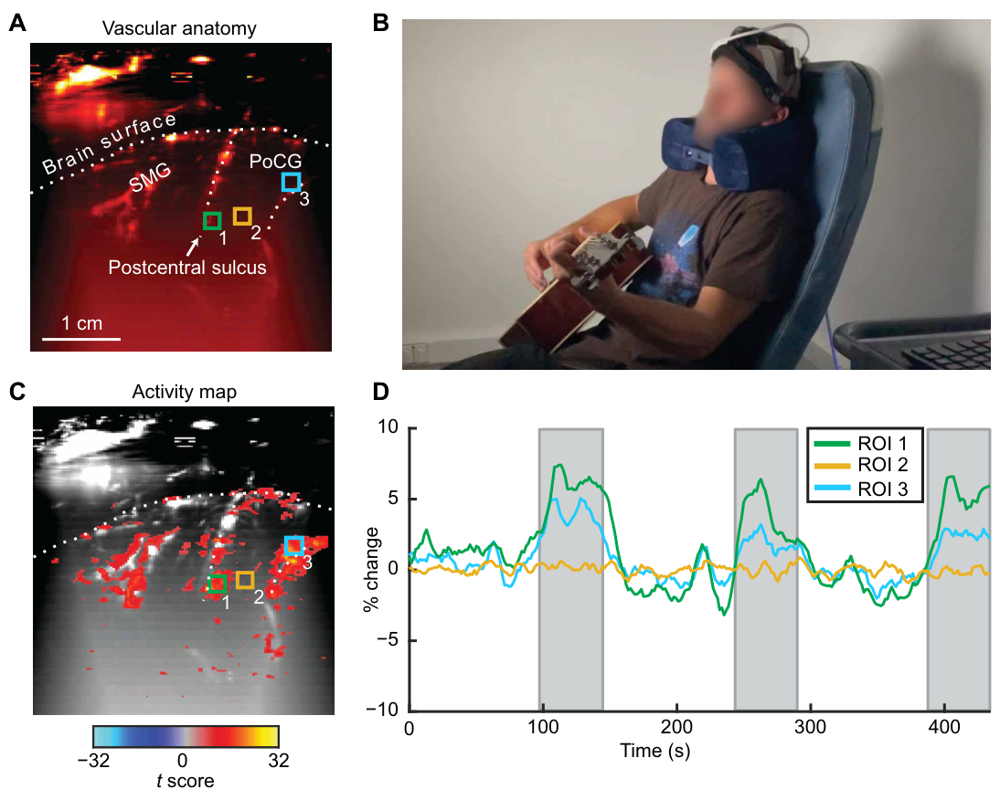

# 经声透明颅窗对人脑活动进行功能性超声成像
[← 回到首页](..)

- **原题**：Functional ultrasound imaging of human brain activity through an acoustically transparent cranial window
- **著者**：Claire Rabut1†, Sumner L. Norman2*†, Whitney S. Griggs2†, Jonathan J. Russin3, Kay Jann4, Vasileios Christopoulos5, Charles Liu2,3,6*, Richard A. Andersen2,7*, Mikhail G. Shapiro1,8,9*　（† 共同第一作者；* 通讯作者）
- **通讯作者**：sumnern@caltech.edu (S.L.N.); cliu@usc.edu (C.L.); richard.andersen@vis.caltech.edu (R.A.A.); mikhail@caltech.edu (M.G.S.)
- **期刊**：Science Translational Medicine 16(749), eadj3143 (2024)
- **DOI**：[10.1126/scitranslmed.adj3143](https://doi.org/10.1126/scitranslmed.adj3143)
- **日期**：投稿 2023-06-19 · 修回 2023-12-01 · 接收 2024-05-07 · 发表 2024-05-29
- **版权**：Copyright © 2024 The Authors, some rights reserved; exclusive licensee American Association for the Advancement of Science. No claim to original U.S. Government Works.
- **单位**：
  - 1 Division of Chemistry and Chemical Engineering, California Institute of Technology, Pasadena, CA 91125, USA（加州理工学院 化学与化学工程系）
  - 2 Division of Biology and Biological Engineering, California Institute of Technology, Pasadena, CA 91125, USA（加州理工学院 生物学与生物工程系）
  - 3 USC Neurorestoration Center and the Departments of Neurosurgery and Neurology, University of Southern California, Los Angeles, CA 90033, USA（南加州大学 神经修复中心、神经外科与神经内科）
  - 4 Stevens Neuroimaging and Informatics Institute, University of Southern California, Los Angeles, CA 90033, USA（南加州大学 Stevens 神经影像与信息学研究所）
  - 5 Department of Bioengineering, University of California Riverside, Riverside, CA 92521, USA（加州大学河滨分校 生物工程系）
  - 6 Rancho Los Amigos National Rehabilitation Center, Downey, CA 90242, USA（Rancho Los Amigos 国家康复中心）
  - 7 T&C Chen Brain-Machine Interface Center, California Institute of Technology, Pasadena, CA 91125, USA（加州理工学院 T&C Chen 脑机接口中心）
  - 8 Cherng Department of Medical Engineering, California Institute of Technology, Pasadena, CA 91125, USA（加州理工学院 Cherng 医学工程系）
  - 9 Howard Hughes Medical Institute, Pasadena, CA 91125, USA（霍华德·休斯医学研究所）

---

> **本系列**：六篇核心论文的完整译文，逐一独立成篇。另见 [清醒灵长类的 fUS 脑活动传播（Dizeux 2019）](fusi-primate-propagation) · [单试次运动意图解码（Norman 2021）](fusi-single-trial-decoding) · [首例闭环超声脑机接口（Griggs 2024）](fusi-closed-loop-bci) · [LIP 扫视的介观组织（Griggs 2025）](fusi-mesoscopic-lip) · [移动中的人脑 fUS 成像（Soloukey 2025）](fusi-mobile-human)

## 摘要

可视化人脑活动对于理解正常与异常的脑功能至关重要。目前可用的神经活动记录方法侵入性高、灵敏度低，且均无法在手术室外进行。功能性超声成像（functional ultrasound imaging，fUSI）是一项新兴技术，可提供灵敏、大范围、高分辨率的神经成像；然而 fUSI 无法穿透成人颅骨。在本研究中，我们使用一种聚合物颅骨置换材料制作出与 fUSI 兼容的声窗，用以监测一名成年人的脑活动。我们首先用模拟脑血管结构的体外脑血管体模与在体啮齿类颅骨缺损模型，评估了经不同厚度聚甲基丙烯酸甲酯（polymethyl methacrylate，PMMA）颅骨植入物或钛网植入物的 fUSI 信号强度与信噪比。我们发现，使用专用的 fUSI 脉冲序列，可经 PMMA 植入物以高灵敏度记录大鼠脑神经活动。随后，我们为一名创伤性脑损伤后接受颅骨重建手术的成年患者设计了一枚定制的超声透声颅窗植入物。我们证明 fUSI 可在手术室外记录清醒人体的脑活动。在"连点成线"（connect the dots）视频游戏任务中，我们演示了对该被试任务调制皮层活动的成像与解码。在吉他扫弦任务中，我们进一步标绘出任务特异的皮层响应。本原理验证（proof-of-principle）研究表明，fUSI 可作为高分辨率（200 μm）的功能成像模态，经声透明颅窗测量成人脑活动。

## 引言

测量成人脑功能对于神经与精神疾病的诊断、监测、治疗和研究都必不可少。现有的脑活动记录技术在灵敏度、覆盖范围、侵入性和被试在成像期间的移动自由度上存在显著取舍。功能磁共振成像（functional magnetic resonance imaging，fMRI）等无创方法可覆盖全脑，但灵敏度与时空分辨率有限，且限制被试在成像期间活动。头皮脑电与功能性近红外光谱（functional near-infrared spectroscopy，fNIRS）虽更便携，但信号质量不稳定，也无法准确测量深部脑功能。颅内脑电与皮层脑电等侵入性技术分辨率更优，但需要在颅骨下或脑内植入电极，可扩展性与功能寿命因此受限。此类侵入性技术虽有优势，却因固有风险而主要限于重度功能障碍的被试。超声定位显微（ultrasound localization microscopy，ULM）可为脑血管成像提供优于 10 μm 的超分辨能力 [[1]](#ref-1)，但其功能应用受制于静脉注射微泡的必要性与较长的数据采集窗口。功能性 ULM 等近期进展通过多试次平均恢复了时间分辨率 [[2]](#ref-2)；然而，实时单试次功能 ULM 成像对多数人体研究和脑机接口应用仍不现实。因此，亟需能够在侵入性与性能之间取得最优平衡的神经技术。

功能性超声成像（fUSI）是一项新兴的神经成像技术，填补了侵入式与非侵入式方法之间的空白。fUSI 基于功率多普勒成像，通过检测运动红细胞的后向散射回波，测量数厘米视野内的脑血容量变化。这些脑血容量变化经神经血管耦合与单神经元活动和局部场电位相关 [[3,4]](#ref-3)。fUSI 的空间精度接近 100 μm，帧率最高可达 10 Hz，因而能够探测小规模神经元群体的功能 [[5]](#ref-5)。该成像模态不使被试暴露于辐射，可便携，并已在多种动物模型中得到验证，包括啮齿类、雪貂、鸟类、非人灵长类与人类 [[6,7]](#ref-6)。

fUSI 脑成像无需使用造影剂或植入电极，成像设备位于脑的硬脑膜保护之外；然而对于颅骨过厚、超声难以有效穿透以实现高分辨率成像的大型动物，fUSI 需要去除一定面积的颅骨。fUSI 的发射频率范围为 5~18 MHz [[6]](#ref-6)，颅骨会带来像差与衰减 [[8]](#ref-8)。使用 500 kHz 量级的频率（如经颅聚焦超声所用频率）可获得更小的像差与衰减 [[9]](#ref-9)；但更低频率意味着更低的空间分辨率（500 kHz 时约 3 mm）与更低的 Doppler 灵敏度 [[10]](#ref-10)，这将使其成像表现不及 fMRI。fUSI 的灵敏度超过 fMRI 的 10 倍 [[11]](#ref-11)，其信号在时间与空间上都能准确反映神经元放电 [[4]](#ref-4)。因此，fUSI 是一种功能性脑成像技术，可在个体运动状态下实现大范围脑覆盖记录并具备单试次灵敏度。在近期工作中，我们从 fUSI 数据中解码出非人灵长类的意图与目标 [[12]](#ref-12)，并随后以 fUSI 为基础构建了超声脑机接口 [[13]](#ref-13)。

> **【译者注】** 缩写歧义：**PD** 在 fUS 语境指 power Doppler（功率多普勒），在 tFUS 参数语境指 pulse duration（脉冲时长）。本文通篇为前者；主材料 §4.1.3 用该缩写指功率多普勒计算步骤，而 §6（神经调控）的参数空间部分则指脉冲时长，跨章阅读时须按语境区分。

因此，本研究的一个重要方向是把基于 fUSI 的神经成像转化为面向人类被试的脑机接口应用。颅骨会显著降低信号灵敏度；因此大多数临床前应用需要开颅 [[14]](#ref-14)，而少数已开展的人体 fUSI 研究都要求颅骨已被去除或缺如。这些研究包括神经外科手术中的术中成像 [[15-17]](#ref-15)，以及经新生儿前囟窗的记录 [[18]](#ref-18)。偏侧去骨瓣减压术（即部分颅骨切除）常用于降低病理性颅内高压，包括创伤性脑损伤（traumatic brain injury，TBI）、卒中和蛛网膜下腔出血所致者 [[19-21]](#ref-19)。去骨瓣减压术后，颅骨缺损由头皮覆盖数周或更久（取决于临床进展），随后行颅骨成形术（即颅骨重建），用多种重建材料之一替换缺失的颅骨。这些材料包括自体骨、钛网、多孔聚乙烯、聚醚醚酮（polyether ether ketone，PEEK）与聚甲基丙烯酸甲酯（PMMA）。近年来，定制颅骨植入物因其无菌性、强度与美观性而日益流行 [[22]](#ref-22)。基于 PMMA 与基于 PEEK 的颅骨植入物已获美国食品药品监督管理局（FDA）批准 [[23,24]](#ref-23)，并且对超声透明，即"透声"（sonolucent）[[25-28]](#ref-25)。

在本研究中，我们着手设计一枚颅骨置换窗，以便对一名清醒成年人无创地实施 fUSI——该被试在去骨瓣减压术后接受颅骨置换手术时，植入了超声透声的"声窗"。我们首先用体外脑血管体模检验了两种经 FDA 批准的颅骨置换材料（PMMA 与钛网）用于 fUSI 的适宜性，随后用在体大鼠颅骨缺损模型比较了二者的信号与对比度特性。之后，我们设计了一枚可在颅骨重建中永久植入患者体内的 PMMA 声窗。经该 PMMA 窗及其上完整的头皮，我们在人类被试执行视觉运动任务时演示了功能性脑信号的记录与解码，任务包括在手术室之外的走动状态下玩视频游戏与弹奏吉他。

> **【译者注】** 术语辨析：本文的 "cranial window / acoustic window" 指**颅骨置换植入物上减薄出的透声区**——永久植入、头皮完整覆盖、硬脑膜未切开；而动物实验中的"开颅窗（cranial window）"需切除颅骨并暴露硬脑膜。主材料 §3.3 把"颅窗"作为上位概念统称两者，§3.3.1 则把本文这类归为"声透明颅骨植入物"。是否保留头皮与硬脑膜，正是本文得以宣称"无创"的前提，阅读时不宜混用。

> **图 1**. 定制颅窗使无创 fUSI 成为可能。(A) fUSI 随时间采集图像、并经杂波滤波器剔除组织运动的数据处理流程示意（左）。经头皮记录的 fUSI 二维重建图像（右）。比例尺，1 cm。(B) 以颅骨透声窗重建的人颅示意，超声探头置于窗的上方。图像由 Blender v2.92 生成。

## 结果

### PMMA 颅骨植入物可实现厚度依赖的血流成像

fUSI 的脑成像通过采集一系列连续的功率多普勒图像来测量脑血容量（图 1A）。这些图像之间的时空变化经神经血管耦合提供神经活动的实时可视化。为确定能否经 PMMA 材料检测到 fUSI 信号（图 1B），我们首先构建了一个超声体模，其流道深度递增（14~44 mm），用以模拟人脑中的血流（图 2A）。这些直径 280 μm 的流道被设计为模拟软脑膜动脉——后者在很大程度上调控脑血流 [[29,30]](#ref-29)。该脑血管体模使我们能够在受控环境中测量 fUSI 所依赖的信号。我们比较了五种成像场景：无植入物、PMMA 植入物（厚 1、2 或 3 mm）与钛网植入物（图 2B、C）。合成红细胞以 27 mm/s 的恒定速度流过直径 280 μm 的管路，覆盖三个横向位置（5、15、25 mm）与四个轴向位置（14、24、34、44 mm）。脑血管体模用发射频率 7.5 MHz 的线阵超声探头成像，记录功率多普勒强度信号（图 2D）。功率多普勒信号强度随 PMMA 植入物厚度增加以及使用钛网而下降（图 2D、E）。信噪比（signal-to-noise ratio，SNR）随成像平面深度增加而下降（图 2F）。在较深位置（34 与 44 mm），钛网相较无植入物使 SNR 下降，而 PMMA 相对于对照相当甚至升高（图 2F）。这些体外结果确认，经不同厚度的颅骨植入物均可检测到功率多普勒信号。

### 颅骨置换窗使 fUSI 可在大鼠模型中成像

为在体检验经不同颅骨植入材料检测功能性脑信号的能力，我们在四只大鼠急性开颅后将上述五种植入物依次置于脑表面，实施 fUSI（图 2G），并对其中一只大鼠采用被动视觉刺激任务以激活视觉系统（图 2H、I）。

全脑的总 fUSI 强度相对无植入物场景分别下降 35%（1 mm PMMA）、50%（2 mm PMMA）、64%（3 mm PMMA）与 66%（钛网）（图 2J）。皮层 SNR［图 2G (i)］随钛网（−1 dB）及 PMMA 植入物厚度增加（−1 dB/mm）而略有下降［图 2K (i)］。图像内的皮层下结构［图 2G (ii)］在不同植入材料间表现出相似的 SNR 趋势［图 2K (ii)］。在全部五种植入条件下，我们都在外侧膝状体（lateral geniculate nucleus，LGN）内识别出光刺激期间激活的体素（图 2H、I）；然而植入物越厚，LGN 内显示显著激活的体素越少，其中经钛网检测到的激活最少［P < 10−3，单因素方差分析（ANOVA）及事后 Tukey 真实显著差异（hsd）检验］（图 2L）。体外脑血管体模与在体啮齿类脑的结果表明，作为 fUSI 的介入材料，PMMA 优于钛网；并且在安全前提下把 PMMA 窗做得尽可能薄，可获得最佳成像性能。

> **图 2**. 聚合物颅骨置换材料使 fUSI 可在血流体模与在体大鼠中实现。(A) 血流体模示意图。(B) PMMA 与 (C) 钛网（Ti mesh）——颅骨重建中常用的两种颅骨植入材料照片。(D) 血流体模在无植入物或标注植入物条件下的功率多普勒图像；色标表示相对功率多普勒信号强度。比例尺，1 cm。(E) 经各植入物采集的血流体模功率多普勒强度。数据以均值 ± 标准差表示；圆点为单次采集，每组 n = 15 次采集。A.U.，任意单位。(F) 各植入物条件下 SNR 衰减随体模内深度的变化。所有数值均以无植入物对照的均值归一化。数据以均值 ± 标准差表示；圆点为单次采集，每组 n = 15 次采集。(G~J) 经标注植入材料在大鼠脑内进行的在体成像。(G) 同一大鼠脑在不同颅骨植入材料下的 fUSI 图像，冠状面：前囟 −3.8 mm。色标表示 fUSI 信号强度。比例尺，5 mm。方框 (i) 与 (ii) 对应 (K) 中研究的皮层与皮层下区域。(H) 叠加彩色显示的 fUSI，彩色表示对视觉刺激的信号强度变化。色标：对视觉刺激有显著响应的体素（Pcorrected < 10−5）叠加 T 值。T 值与显著性由 GLM 计算。黑框标出用于计算 fUSI 均值时间曲线的 LGN 区域（放大图见 fig. S2B）。比例尺，5 mm。(I) 同一大鼠在各颅骨植入条件下，视觉刺激后 LGN 区域功率多普勒变化的时间曲线。栗色线表示一只大鼠功率多普勒信号的平均百分比变化。橙色底纹为光照开启时段。(J) 标准化 fUSI 强度（n = 4 只大鼠）。(K) 各颅骨植入条件下皮层 (G, i) 与皮层下结构 (G, ii) 的归一化 SNR。所有数值均以无植入物对照的均值归一化（n = 4 只大鼠）。(L) 视觉刺激后左侧 LGN 内显著激活像素的面积（mm2）随植入物的变化（P < 0.05）（n = 1 只大鼠）。(E)、(F)、(J)、(K) 的数据用单因素方差分析（ANOVA）及事后 Tukey 真实显著差异（hsd）检验，比较各植入物与无植入物对照（*P < 0.05，**P < 0.01，***P < 0.001）。

| 图内标签 | 中文 |
| --- | --- |
| Power Doppler intensity | 功率多普勒强度 |
| Power Doppler intensity (A.U.) | 功率多普勒强度（任意单位） |
| Depth (mm) | 深度（mm） |
| SNR attenuation as function of depth (dB) | SNR 衰减随深度的变化（dB） |
| i. SNR atten. in cortex (dB) | (i) 皮层 SNR 衰减（dB） |
| ii. SNR atten. in subcort. (dB) | (ii) 皮层下 SNR 衰减（dB） |
| Ultrasound probe | 超声探头 |
| Doppler flow | 多普勒血流 |
| Imaging plane | 成像平面 |
| No implant | 无植入物 |
| 1-mm PMMA / 2-mm PMMA / 3-mm PMMA | 1 mm / 2 mm / 3 mm 厚 PMMA |
| PMMA thicknesses | PMMA 厚度 |
| Titanium mesh (Ti mesh) | 钛网 |
| In vitro: Doppler phantom | 体外：多普勒体模 |
| In vivo: rodent | 在体：啮齿类 |
| Time (s) | 时间（s） |
| % change | 百分比变化 |
| t score | t 值 |
| fUSI intensity | fUSI 强度 |
| Left LGN mean activation | 左侧 LGN 平均激活 |
| Mean activity | 平均活动 |
| Area (mm2) | 面积（mm²） |
| Task | 任务 |
| i / ii | (i) 皮层区 / (ii) 皮层下区 |
| * / ** / *** | P < 0.05 / P < 0.01 / P < 0.001 |
| 1 cm / 5 mm / 1 mm / 2 mm / 3 mm | 比例尺（1 cm / 5 mm / …） |

### 颅骨重建前可经人头皮采集功率多普勒图像

为检验经慢性颅窗实施 fUSI 的可能性，我们招募了一名人类被试——一名三十余岁的成年男性。在颅骨重建前约 30 个月，该被试遭受 TBI，并接受了左侧去骨瓣减压术，骨窗约长 16 cm、高 10 cm（图 1B）。我们用解剖 MRI 与 fMRI 扫描标绘了骨窗边界内的脑结构与功能性皮层区域（图 3A、B）。在以 PMMA 植入物进行颅骨重建之前，我们经完整头皮、无骨组织介入，用功率多普勒超声对被试的脑进行了成像。功率多普勒显示出沿脑沟褶皱走行的大血管与灌注脑沟的较小血管，这是 fUSI 图像的典型特征（图 3C）。由于颅内压缺失以及由此导致的明显脑搏动，我们无法采集功能数据，也无法将超声图像与解剖 MRI 配准。尽管如此，能够采集高质量血管图这一事实，提供了 fUSI 可经完整人头皮实施的证据，并促使我们继续为该被试设计、安装与测试声窗。

### 带 2 mm 厚 PMMA 窗的定制颅骨植入物支持功能成像

为成功经定制颅骨植入物检测功能信号，我们与该被试的主治医师（作者 C.L.）及定制颅骨植入物制造商合作，设计合适的声窗。在一项 fMRI 研究中，我们在颅骨重建前识别出对简单手指敲击任务的皮层响应区（图 3A、B）。fMRI 与 fUSI 测量的都是与底层神经活动相关的神经血管活动 [[11,14-17]](#ref-11)。基于该 fMRI 标绘，我们设计并制造了一枚 PMMA 定制颅骨植入物，厚 2 mm，带有一个 34 mm × 50 mm 的平行四边形透声"窗"。厚 2 mm 的部分位于初级运动皮层、初级躯体感觉皮层与后顶叶皮层之上（图 3D、E）。透声窗周围的 PMMA 植入物厚 4 mm。据制造商计算，该植入物设计可提供足以作为永久颅骨置换物的力学性能。

### PMMA 声窗使 fUSI 可经人类被试的颅骨记录

在以声窗完成颅骨重建后（图 3E、F），我们用 fUSI 对该被试的脑进行了成像（图 3G）。减薄窗的边界通过实时解剖 B 模式超声成像定位——后者产生体内结构的灰度图像。随后用定制设计的帽具将超声探头稳定置于 2 mm 厚声窗的中部之上。然后我们利用已知的超声探头颅外位置与朝向，以及 fUSI 与解剖 MRI 两者的体素尺寸信息，把 fUSI 视野与先前的解剖 MRI 手动对齐。我们观察到了皮层血管，包括沿脑沟褶皱走行的血管与灌注邻近皮层的较小血管（图 3G）。

> **图 3**. 去骨瓣减压术并以定制 PMMA 颅骨植入物重建后，fUSI 可经完整头皮实现血管成像。(A、B) 去骨瓣减压术后、植入 PMMA 颅骨植入物之前的 fMRI 脑成像。冠状面 (A) 与横断面 (B) fMRI 扫描，手指敲击任务中激活的区域以橙色标出。比例尺，2 cm。(C) 经头皮获得的被试脑功率多普勒图像。比例尺，1 cm。(D) 以 PMMA 植入物完成颅骨重建后被试的 MRI 扫描。白色十字标出示例 fUSI 场次中探头的中心位置。绿色阴影表示头部透声的部分，包括头皮、定制颅骨植入物与脑表面之上的脑膜。脑示意图（右下）中的白条为探头位置的估计值。PoCG，中央后回；D，背侧；V，腹侧；A，前；P，后；L，左；R，右。比例尺，2 cm。(E) 4 mm 厚颅骨植入物的示意图，其中 2 mm 厚的平行四边形透声窗置于该成年被试的初级运动皮层、初级躯体感觉皮层与后顶叶皮层之上。图像由 Blender v2.92 生成。(F) 该被试接受 PMMA 定制颅骨植入物的重建手术。(G) fUSI 成像平面与解剖 MRI 的配准。比例尺，1 cm。

| 图内标签 | 中文 |
| --- | --- |
| White matter | 白质 |
| Brain surface | 脑表面 |
| Sulcus | 脑沟 |
| Pre-implantation after decompressive craniectomy | 去骨瓣减压术后 · 植入前 |
| Post implantation after decompressive craniectomy | 去骨瓣减压术后 · 植入后 |
| PoCG | 中央后回 |
| SMG | 缘上回 |
| Example transducer position | 示例探头位置 |
| L / R / A / P / D / V | 左 / 右 / 前 / 后 / 背 / 腹 |
| 1 cm / 2 cm | 比例尺（1 cm / 2 cm） |

基于此前一次 fUSI 记录场次与减薄窗的位置，我们估计探头位于左侧初级躯体感觉皮层（S1）与缘上回（supramarginal gyrus，SMG）之上。S1 参与处理来自身体的躯体感觉信号 [[31,32]](#ref-31)，SMG 参与抓握与工具使用 [[33-37]](#ref-33)；因此，为检测功能性脑信号，我们指示被试执行两项视觉运动任务（图 4A）。被试坐在舒适的椅子上，面向屏幕。在第一项任务中，我们采用区块设计，静息区块 100 s、任务区块 50 s。静息区块中，为尽量减少无关激活，指示被试闭眼放松。任务区块中，被试使用视频游戏手柄的操纵杆在电脑显示器上完成"连点成线"拼图（图 4B）。右手拇指用于推动手柄摇杆以改变光标位置，左手食指用于按下手柄左肩键以模拟鼠标点击。同样的绘画任务重复三个场次，场次之间静息。将两个场次的数据拼接后用一般线性模型（general linear model，GLM）分析，以识别有功能激活的体素。GLM 揭示出若干受任务调制与不受任务调制的脑区（图 4C、D）。在一个未激活的感兴趣区（region of interest，ROI）1 中，信号在整个场次中保持稳定，任务期间无显著变化（P > 0.05，双侧 Student t 检验）。ROI 1 在绘画与静息区块之间的平均差值为 −0.034%（P = 0.67，双侧 t 检验）。GLM 识别出的激活区域表现出任务引起的正向调制，即绘画区块活动升高、静息区块活动降低（ROI 2）。例如 ROI 2 在绘画与静息区块之间的平均差值为 3.68%（P < 10−10，双侧 Student t 检验）。尽管我们观察到的信号与该记录位置预期的大脑响应相符，本研究的设计并非用于揭示损伤是否影响了成像结果。

> **图 4**. PMMA 颅窗使视频游戏任务中的无创 fUSI 成像与解码成为可能。(A) fUSI 记录期间被试以操纵杆完成"连点成线"视频游戏任务的照片。(B) 静息与绘画区块的时间轴。静息区块中被试放松并尽量保持头脑清明；任务区块中被试使用游戏手柄在"连点成线"任务中画线。(C) 成像平面血管解剖的功率多普勒图像。虚线标出标注的特定解剖特征，包括 PMMA 植入物表面、脑表面与脑沟血管。彩色方框为 (D)~(F) 所用的 ROI。比例尺，1 cm。(D) 两段拼接场次中受任务调制的区域。色标为 T 值统计参数图；仅显示 Pcorrected < 10−10 的体素数值。比例尺，1 cm。(E) 探照灯分析，显示图像中哪些小体素子集含有最多的任务信息。叠加解码准确率最高的前 5% 探照灯窗，Pcorrected < 2.8 × 10−4。白圈为 600 μm 的探照灯半径。比例尺，1 cm。(F) 各 ROI 平均缩放 fUSI 信号的百分比变化。白色区域为静息区块，灰色区域为任务区块。橙色标注为线性解码器给出的"draw"（绘画）或"rest"（静息）预测。

为更好地理解图像中哪些体素含有区分任务区块的最多信息，我们实施了半径 600 μm 的探照灯（searchlight）分析（图 4E）。该分析将一圆形窗口（半径 600 μm）滑过整个视野，评估仅用该窗口内体素能多好地解码任务信息。分析显示，信息量最高的 5% 体素分布于整幅图像，并与 GLM 统计参数图的结果高度吻合。作为迈向人脑脑机接口应用的第一步，我们用线性解码器检验了从 fUSI 单试次数据中解码任务状态（静息 vs 连点成线）的能力。我们采用留一交叉验证，以避免用待预测的同一批数据训练解码器。我们以 84.7% 的准确率成功解码任务状态（P < 10−15，单侧二项检验）。在检视该示例场次的解码准确率时，我们的线性解码器对绘画与静息区块都给出了相近的高准确率（图 4F），大多数错误出现在两个任务状态的转换处。这一效应可能部分源于神经活动与随之而来的血流动力学响应之间的潜伏期 [[3,4]](#ref-3)。

> **【译者注】** 此处"解码"的边界须明确：① 它是**二分类**（静息 vs 绘画），不是主材料 §5.2 所述 Norman 2021 那种多方向/多目标的运动意图解码；② 留一交叉验证在**同一被试、同一次记录**内按区块划分，故 84.7% 不能外推为跨被试或跨日的性能；③ 全研究仅 1 名被试。主材料 §8.2.4 据此把本文定位于人体 fUS 证据的"层级 ③④（极弱——仅此单例）"。

在第二项任务中，我们要求被试在记录 fUSI 数据的同时弹奏吉他（图 5A）。静息区块（100 s）中，我们指示被试尽量减少手指或手部动作、闭眼放松。任务区块（50 s）中，被试弹奏即兴或记谱的音乐，右手扫弦、左手手指在指板上移动（图 5B）。用 GLM 分析识别出若干任务激活的脑区，其中一些与"连点成线"任务激活的区域重叠。统计分析在三个 ROI 中显示显著的平均差值与 t 值（P < 10−10，双侧 Student t 检验），表明存在任务相关的神经活动变化。具体而言，ROI 1 与 ROI 3 显示出可观的平均差值（分别为 3.369% 与 4.215%）与高 t 值（分别为 19.661 与 19.886），P 值具有显著性（10−10，双侧 Student t 检验）；而 ROI 2 的平均差值较小（0.254%），P 值亦显著（P = 0.003）（图 5C、D）。由于吉他弹奏任务采集的数据量有限，我们无法实施解码或探照灯分析。

> **图 5**. PMMA 颅骨植入物使 fUSI 可检测吉他弹奏期间的脑活动。(A) 显示成像平面血管解剖的功率多普勒图像。比例尺，1 cm。(B) fUSI 记录期间被试弹奏吉他的照片。(C) 吉他弹奏任务活动的 T 值统计参数图，阈值 Pcorrected < 10−10。彩色方框 1~3 为 (D) 所用的 ROI。(D) 吉他弹奏任务中各 ROI 平均缩放 fUSI 信号的百分比变化。白色区域为静息区块；灰色区域为任务区块。

| 图内标签 | 中文 |
| --- | --- |
| Vascular anatomy | 血管解剖 |
| Activity map | 活动图 |
| Brain surface | 脑表面 |
| Postcentral sulcus | 中央后沟 |
| PoCG | 中央后回 |
| SMG | 缘上回 |
| ROI 1 / ROI 2 / ROI 3 | 感兴趣区 1 / 2 / 3 |
| % change | 百分比变化 |
| Time (s) | 时间（s） |
| t score | t 值 |
| 1 cm | 比例尺 1 cm |

## 讨论

相较于 fMRI 等更成熟的技术，fUSI 具有一系列优势，包括更高的灵敏度、分辨率与便携性（fig. S1）。然而 fUSI 无法穿透成人颅骨并保持足够的灵敏度。在本研究中，我们确立了经聚合物声窗、在非手术环境中对清醒个体实施 fUSI 成像的可行性。在人体试验之前，我们在体外与在体（啮齿类）表征了重建材料的声学性能，以确定经定制颅骨植入物实施无创成像的可行性，并设计合适的声窗。随后，我们在手术环境之外，对一名执行两项任务的清醒成年被试采集了脑功能活动的无创 fUSI 记录。我们还演示了对特定活动中任务相关人脑状态的解码。我们成功用 fUSI 解码脑状态，可作为人体超声脑机接口的前身。此外，我们的整体方法在研究应用与临床应用中都具有潜力。

> **【译者注】** 定位澄清：本文**只有"读"通路**（成像与离线解码），并未实现闭环刺激或实时反馈；主材料 §7.3 记录的首例实时闭环超声脑机接口是 Griggs 2024（猕猴，在线控制最多 8 个方向）。本文所称"脑机接口前身"指的是解码能力，而非闭环系统；主材料 §7.1.2 讨论的读写时序矛盾在人体上仍未解决。

颅骨成形术后的解剖与功能恢复监测目前既困难又昂贵。行为学评估，如认知状态检查、简易精神状态检查或功能独立性评定，常用于评估 TBI 后的神经心理恢复 [[38-40]](#ref-38)，但无法识别具体损伤部位，也无法在这些解剖位置追踪恢复过程。计算机断层扫描（CT）与 MRI 较少用于评估解剖与功能恢复 [[41]](#ref-41)。然而这些方法在评估脑恢复方面的灵敏度与特异度都低，（CT 与 MRI）价格昂贵，且（CT）可能给患者增加风险。未来，fUSI 与带声窗的定制颅骨植入物或可实现术后期间对解剖与功能恢复的常规监测。除普适的术后监测外，部分 TBI 患者会发展出特定病理，受益于更频繁的监测。例如颅骨缺损综合征（syndrome of the trephined，SoT）即是这样一种适应证：由于大范围去骨瓣后脑脊液动力学改变与颅内压变化，患者出现头痛、头晕与认知障碍等神经症状 [[42]](#ref-42)。从这些 TBI 后遗症或 SoT 患者记录脑活动，或可为其疾病过程的病理生理与后续恢复提供洞见。

评估 TBI 后遗症或 SoT 的另一个途径，是开展评估功能连接或两个及以上区域脑信号相似性的实验。功能连接被认为反映直接的神经解剖连接的存在，而神经损伤可影响功能连接 [[43]](#ref-43)。本文展示的人体 fUSI 方法可扩展为同时记录多个脑区的静息态活动，并在数月尺度上评估功能连接的变化，作为 TBI 恢复的征象，或作为检出 SoT 早期征象的手段。

人类神经科学研究与更低侵入性脑机接口开发最重要的瓶颈之一，是获取人类患者神经活动数据的机会有限。能够在颅骨完全重建的成年人体上、于走动状态下测量 fUSI 信号，有望应对这一挑战，为这些研究领域的进展开辟机会。美国每年约有 170 万人遭受重度 TBI [[44]](#ref-44)。若其中仅一小部分患者在接受标准诊疗时植入带声窗的颅骨植入物，就将为在人体上以优异的时空分辨率与高灵敏度测量介观神经活动提供重大机遇。对于长期神经损伤轻微的这类患者，这还将促成对先进神经成像技术与脑机接口的新探索。正如本文所演示的，fUSI 即使经声窗也具有检测任务调制脑信号的高灵敏度。我们不仅可以通过对所有任务区块取平均并用 GLM 识别任务调制区域，还可以用线性解码器基于单幅 fUSI 图像稳健解码当前任务区块。

未来，我们设想该颅窗或可使自由行走的人类被试接受 fUSI。尽管我们的人体记录完全经 PMMA 颅骨植入物完成，我们推测其他超声透声材料 [[26]](#ref-26)（如 PEEK）或许同样可用。

其他人体脑成像模态也存在，包括 fMRI、弥散光学断层成像（diffuse optical tomography，DOT）与 fNIRS。相较 fUSI，这些方法各有取舍。fUSI 的灵敏度约为 fMRI 的 10 倍 [[13]](#ref-13)，更便携，且限制性小于 MRI 孔径。然而 fMRI 可获得全脑图像。目前已有扩展容积 fUSI 视野的工作，当前最佳为 80 mm × 20 mm × 40 mm [[17]](#ref-17)。就目前而言，应对 fUSI 这一局限的一种方案是：先用 fMRI 从全脑识别感兴趣区域，再用 fUSI 精确追踪其中一个或多个感兴趣区内的功能信息。DOT 利用近红外光推断被照组织的光学特性，可用于无创脑成像。该方法相对 fUSI 有若干优势，包括能够穿透完整颅骨成像、视野大。但它也有若干缺点，包括需要求解病态的非线性逆散射问题、空间分辨率低（>1 cm），且深度约限于 1 cm [[45]](#ref-45)。本研究中，我们使用 7.5 MHz 探头以平衡空间分辨率（200 μm）与成像深度（3~5 cm）。若对更深脑区成像变得更重要，可使用更低频的探头。例如 3 MHz 探头仍具有 <1 mm 的空间分辨率，并能在深部皮层下区域提供更好的灵敏度。fNIRS 是一种光学技术，用近红外光谱测量脱氧与氧合血红蛋白浓度。与 DOT 的缺点类似，fNIRS 的空间分辨率（约 2 cm）与脑穿透深度（1~2 cm）都劣于 fUSI。但其优点是便携，且允许个体自由活动并与环境交互 [[46]](#ref-46)。目前 fUSI 需要一台大型推车承载超快超声采集系统，不过已有使所需设备小型化的工作。

我们的研究并非没有局限。本研究提出的方法依赖于在颅骨中植入颅窗。尽管对已在接受颅骨成形术的患者而言，此类植入物可被视为微创，但其手术安装的要求将限制该方法适用的患者人群。此外，由此形成的脑接口的可便携性受限于当前仍需把超声探头连接到扫描仪，而扫描仪又需要电源插座。这种便携性的缺失将阻碍那些依赖摆脱线缆连接的行为学应用。此外，本研究所展示的成像视野限于二维平面，覆盖的脑体积相对较小。这些技术局限凸显了硬件进步的必要性，以实现无束缚、容积、大规模的功能成像。尽管本研究已证明 fUSI 能检测视频游戏与吉他弹奏等多种任务引起的脑激活，仍需未来工作揭示并解码所观察到的脑活动与特定任务刺激和行为之间更精确的联系。例如，我们识别出吉他弹奏区块中被调制的脑区，但尚不清楚究竟是吉他弹奏的哪个成分调制了所观察到的神经血管活动，例如躯体感觉、听觉感知或弹奏吉他的运动。最后，尽管我们在人类被试上成功成像的演示提供了关键的概念验证，仍需未来研究把我们的发现推广到更大、更多样的队列。

我们的结果表明，用于 fUSI 的声窗可以弥合现有高精度但高侵入性的神经记录技术与无创但精度较低的神经记录技术之间的差距。本技术所展示的 38 mm × 50 mm 视野、高空间精度（200 μm）与高灵敏度（单试次解码），使我们在颅骨完全重建的成年人体上获得了脑活动的访问能力。这一访问能力有望直接惠及脑损伤患者，并为神经科学发现以及改进的治疗方法与脑机接口的开发打开新的大门。

## 材料与方法

### 研究设计

本研究的目的是评估在去骨瓣减压术后颅骨置换时安装了超声透声声窗的清醒成年被试身上实施 fUSI 的可行性。我们首先用体外与在体模型评估了经 FDA 批准的颅骨置换材料用于 fUSI 的适宜性。我们设计了一个带流道的超声体模以模拟人脑血流，比较不同厚度 PMMA 植入物与钛网植入物的成像场景。体外采集在每种条件下至少进行 15 次时间功率多普勒重复，以确保数据的稳健性与可靠性。在体 fUSI 实验在四只大鼠中进行（Caltech 机构动物护理与使用委员会方案编号 IA22-1729）。在每只动物中比较各植入材料的信号与对比度特性；颅骨植入材料的顺序在每只动物中随机化。视觉激活记录在单只大鼠中进行。未使用统计检验预先确定样本量，但我们的样本量与既往发表中的报告相近 [[5,14]](#ref-5)。对于人体研究，所有程序均获南加州大学（USC）、Caltech（IR19-0902）与 Rancho Los Amigos 国家康复医院（RLA）的机构审查委员会批准。我们招募并取得了一名患有 TBI 的 35 岁男性被试的知情同意。该被试在装配定制颅骨植入物前后接受了 MRI 与 fUSI 成像，采集次数以获授权方案允许的最大量为限。在 fUSI 记录期间，被试从事两项活动：玩视频游戏与弹奏吉他。

### 植入材料

厚度 1~3 mm 的 PMMA 植入物由 Longeviti Neuro Solutions LLC 提供。体外与啮齿类研究使用平板 PMMA 植入物（图 2B），人体则使用按患者颅骨形状定制的 PMMA。钛网植入物为纯钛，厚度 0.6 mm，具有小圆孔（直径 1.5 mm）与大圆孔（直径 3 mm）交替的蜂窝图案，购自 KLS Martin。

### 功能性超声成像

fUSI 通过标绘脑血容量的局部变化来可视化神经活动——经神经血管耦合 [[47]](#ref-47)，这些变化与神经元活动紧密相关，并通过对脑内功率多普勒变化的计算来评估 [[6]](#ref-6)。fUSI 使用中心频率 7.5 MHz 的超声探头（带宽 >60%，128 阵元，阵元间距 0.300 mm，Vermon），连接由定制 MATLAB（MathWorks）B 模式与 fUSI 采集脚本控制的 Verasonics Vantage 超声系统（Verasonics Inc.）。每幅功率多普勒图像由 300 帧复合帧累加获得，复合帧以 400 Hz 帧率采集。每帧复合帧由两组五次倾斜平面波（−6°、−3°、0°、3°、6°）累加而成。我们使用 4000 Hz 的脉冲重复频率。fUSI 图像每 1.65 s 重复一次。每 300 幅图像的数据块用奇异值分解（singular vector decomposition，SVD）杂波滤波器处理 [[33]](#ref-33)（大鼠记录 SVD 阈值 = 50，人体记录 SVD 阈值 = 40），以分离组织信号与血液信号，从而获得显示整个成像平面内人工血流（体外实验）或脑血容量的最终功率多普勒图像（图 1E）。

> **【译者注】** 引文核对：原文此处把 SVD 杂波滤波器标注为文献 (33)，但本文参考文献第 33 条是 Wandelt 等关于抓握与言语解码的论文，并非 SVD 杂波滤波的原始文献；本文 54 条参考文献中也不含该原始文献（该工作通常引作 Demené 等，*IEEE Trans. Med. Imaging* 34, 2271–2285 (2015)，doi:10.1109/tmi.2015.2428634 ✅ 已核验）。译文按原文照译并保留角标 [[33]](#ref-33)，读者据此追溯文献时请注意甄别。

### 体外组织解剖与多普勒体模

我们把内径 280 μm 的聚乙烯管路按三个横向位置与五个轴向位置（共 15 个网格点）穿过一个中空、盒状、3D 打印的尼龙铸型。随后用 5% 无味明胶、1% 石墨粉与 5% 异丙醇制作明胶体模，以模拟生物软组织的散射效应 [[48]](#ref-48)。明胶先在低温下溶于水，再加热使明胶完全溶解，然后加入其余成分。混合后，溶液冷却至 27°C，倒入模具并冷藏以维持其稠度。体模铸型凝固固化后，我们用蠕动泵经长循环回路（带低通滤波器）使红细胞体模液体（CAE Blue Phantom Doppler Fluid）流过管路，以约 0.1 ml min−1 的速度形成平稳流。所有数值均以无植入物情形的均值归一化。

### 大鼠在体 fUSI 对比研究

本研究使用四只 Long-Evans 大鼠（15~20 周龄，500~650 g，Caltech 方案编号 IA22-1729）。手术及随后的成像场次中，动物先腹腔注射赛拉嗪（10 mg/kg）与氯胺酮（Imalgene，80 mg/kg）麻醉。去除动物头皮，用生理盐水清洁颅骨。用微型钻（Foredom）配合钢制钻头（钻头编号 19007-07，Fine Science Tools）低速钻取，实施开颅以去除 0.5 mm × 1 cm 的颅骨。我们注意避免损伤硬脑膜并防止脑部炎症。术后用无菌生理盐水冲洗脑表面，并在窗口上放置超声耦合凝胶。将线阵超声探头置于颅窗正上方、坐标前囟 −3.8 mm（冠状面）处，实施 fUSI 扫描。随后把 1、2、3 mm 厚的 PMMA 材料或钛网置于脑上方，重复 fUSI 采集。为尽量减少视觉脱敏的任何影响，我们在每只动物中随机化颅骨植入材料的顺序。为定量表征经不同 PMMA 厚度的 fUSI 灵敏度，我们在同一动物的不同植入条件下计算皮层与更深丘脑区域的血管 SNR。每种植入条件选取两个 ROI（i，皮层；ii，皮层下区域）（fig. S2A）。对这些 ROI 的每一条水平线，标绘其横向强度，并识别局部极大值（血管）与极小值（fig. S2B、C）。随后按 SNR = mean (local maxima) / mean (local minima) 计算 SNR。所有数值均以无植入物情形的均值归一化。无植入物与各颅骨植入情形之间标准化 SNR 的差异未显示统计学差异（P > 0.05）。视觉刺激 fUSI 在一只动物中进行。视觉刺激由置于大鼠头部前方 5 cm 的蓝光发光二极管（LED；波长 450 nm）提供。刺激场次由蓝光 LED 周期性闪烁构成（闪烁频率 5 Hz），参数如下：暗 50 s，随后光闪烁 16.5 s，重复三次，总时长 180 s。对各条件标绘 ROI 内功率多普勒信号的变化百分比（图 2H）（图 2I）。在该距离上，光照开启时亮度为 14 lux，关闭时为 0.01 lux。

### fUSI 数据处理

对于啮齿类与人体在体实验，我们使用 GLM 找出受视觉任务调制的体素。为实施该 GLM，我们首先对 fUSI 数据进行刚体运动校正 [[49]](#ref-49) 的预处理，随后进行空间平滑［二维高斯，σ = 1（半高全宽 = 471 μm）］以及逐体素的移动平均时间滤波（大鼠两个时间点；人体五个时间点）。然后按逐体素均值对 fUSI 信号缩放，使所有场次与体素具有相近的信号范围 [[50]](#ref-50)。为生成视觉任务的 GLM 回归量，我们把区块任务设计与单伽马血流动力学响应函数（hemodynamic response function，HRF）卷积 [[51]](#ref-51)。对于啮齿类实验，HRF 时间常数 (τ) = 0.7，时间延迟 (δ) = 1 s，相位延迟 (n) = 3 s。对于人体实验，各值为 τ = 0.7、δ = 3 s、n = 3 s。接着我们用卷积后的回归量与每个体素缩放后的 fUSI 信号拟合 GLM。我们用 T 对比并结合错误发现率（false discovery rate，FDR）校正来确定每个体素 β 系数的统计显著性（啮齿类实验 Pcorrected < 10−5，人体实验 Pcorrected < 10−3）。对于啮齿类与人体实验中比较静息与活动区块的逐体素 GLM 与 T 对比，数据分布被假定为正态，但未作正式检验。

### 人类被试

我们招募并取得了一名既往患 TBI 的 35 岁男性个体（被试 J）的知情同意，参与一项检验经定制颅骨植入物记录功能性超声信号能力的研究。所有程序均获 USC、加州理工学院（Caltech）与 RLA 的机构审查委员会批准。Caltech 参考编号 IR19-0902。所有 fUSI 研究场次均在 Caltech 进行。所有 CT 与 MRI 扫描均在 USC 的 Keck 医院进行。

### 去骨瓣减压术与重建手术

该被试于 2019 年 4 月 9 日在重度 TBI 后接受去骨瓣减压术。骨窗大小约为前后方向 16 cm × 背腹方向 10 cm（图 3B）。去骨瓣减压术后不久采集了 700 μm 各向同性解剖 MRI，并于 2021 年 9 月初经颅窗采集了一次 fUSI 扫描。

该被试于 2021 年 9 月 22 日使用 Longeviti ClearFit 定制颅骨植入物接受了左侧颅骨成形术。手术在 Rancho Los Amigos 国家康复中心实施，按标准方式完成。简言之，全身麻醉诱导后，左侧头部备皮铺巾。打开原去骨瓣减压切口，将头皮自硬脑膜分离，并环形识别颅骨缺损边缘。放置硬膜外手术引流，用钛微型接骨板与螺钉将颅骨成形植入物固定于颅骨，随后分层关闭伤口。与任何颅内手术一样，存在出血、脑脊液漏或硬脑膜穿刺的风险。放置手术引流以尽量减少硬膜外液体积聚，并在 3 天后拔除。

### 颅骨植入物设计

PMMA 颅骨植入物（Longeviti ClearFit）按去骨瓣减压的骨窗设计，并匹配健侧颅骨的几何形状。植入物厚 4 mm，以匹配被试的名义骨厚度，但有一块 34 mm × 50 mm 的平行四边形 2 mm 厚 PMMA 窗，基于一项 fMRI 实验的结果，置于已知在手指敲击时活跃的脑区之上（图 3A、B）。

### 人体 fMRI 任务

该被试接受了一次 fMRI 扫描，其间执行手指敲击任务，区块设计为静息 30 s、随后右手序贯手指敲击 30 s（图 3A）。这些区块重复七次，扫描总时长 8 min。手指敲击时段开始与结束的指令通过 MR 兼容耳机以听觉命令给出。fMRI 采集在 7 T Siemens Magnetom Terra 系统上进行，使用 32 通道接收、1 发射头部线圈，多带梯度回波平面成像 T2* 加权序列，1 mm3 各向同性分辨率，192 mm × 192 mm 视野，92 层轴位，重复时间（TR）3000 ms，回波时间（TE）22 ms，160 个容积，翻转角（FA）80°，前后相位编码方向，整合并行成像技术（iPAT）为 3，同时多层（SMS）为 2。另用 T1 加权 MPRAGE 序列采集解剖扫描，0.7 mm3 各向同性分辨率，224 mm × 224 mm 视野，240 层矢状位，TR/TE 为 2200 ms/2.95 ms，FA 为 7°。fMRI 数据的统计分析用 GLM 在统计参数图软件（SPM12）中完成 [[51]](#ref-51)。预处理包括运动重对齐、线性漂移去除，以及把 fMRI 数据配准到高分辨率解剖扫描。

### 人体 fUSI 任务

颅骨重建后 10~12 个月，被试 J 接受了 fUSI 扫描。被试坐在躺椅上，前方 70 cm 处有一块 27 英寸的额平行屏幕（Acer XB271HU）。被试使用 Logitech F310 游戏手柄控制行为任务。我们用 Gopher（https://github.com/Tylemagne/Gopher360）实现用 Logitech 手柄控制电脑。右手摇杆控制电脑光标位置，左肩键作为鼠标左键。绘画任务采用区块设计，静息区块 100 s，随后用游戏手柄绘画 50 s。我们逐区块口头指示被试进入静息或任务。被试被指示完成多幅"连点成线"图中的一幅（图 4B）。当被试完成一幅画后，我们呈现一幅新图供其完成。静息区块中，我们指示被试闭眼、心境放松地休息。我们以 0.6 Hz（每帧 1.65 s）采集 fUSI 数据。吉他弹奏任务采用相同的区块设计，静息区块 60 帧，随后任务区块 30 帧。任务区块中，被试左手在指板上按和弦，右手扫弦。

### 任务解码

为解码给定时间点处于"任务"还是"静息"区块，我们用主成分分析（principal components analysis，PCA）降维、用线性判别分析（linear discriminant analysis，LDA）分类。我们首先把每个经运动校正的 fUSI 时间点（"样本"）标注为"静息"或"任务"。然后平衡数据集，使静息与任务时间点数量相等。接着把数据集拆分为区块对（1 个区块对 = 静息 + 任务），以避免在紧邻测试时间点的时间点上训练分类器。这有助于确保模型能够泛化，且我们的模型不是在记住每个区块对的局部模式。随后我们对训练集与测试集中的每个样本施加二维高斯平滑滤波（σ = 1）。我们按时间对训练集逐体素做 z 标准化。然后用按区块的留一交叉验证器训练并验证 PCA + LDA 分类器；我们在五个区块上训练，然后在留出的区块对的时间点上测试。PCA 保留 95% 的方差。为生成示例场次的解码结果，我们在静息与绘画样本平衡的五个区块上训练，然后在样本不平衡的最后一个区块（60 帧静息数据与 30 帧绘画任务数据）上测试。

### 探照灯分析

探照灯分析用于识别图像或容积中不同部分含有多少任务信息。它通过测量以每个体素为中心的小窗口（即"探照灯"）内的解码表现来生成信息图 [[52]](#ref-52)。本文所用的探照灯分析中，我们定义一个圆形 ROI（半径 600 μm），并仅用该 ROI 内的像素实施任务解码分析。我们把该 ROI 的正确率指标赋予中心体素。随后在整个图像上重复该过程，使每个图像像素都成为一个 ROI 的中心。为可视化结果，我们把正确率指标叠加到血管图上，并保留最显著的 5% 体素。我们仅对脑体素运行探照灯分析，忽略脑表面之上的所有体素。

### 统计分析

对于 n < 20 的实验，所有原始个体水平数据见数据文件 S1。除另有说明外，显著差异定为 P < 0.01。两组间比较用双侧 Student t 检验。多于两组的比较用单因素 ANOVA 及事后 Tukey hsd 检验。解码分析用二项检验评估统计显著性（P < 10−10）。所有统计分析均在 MATLAB 2021b 中完成。对于 GLM，P 值用错误发现率法进行多重检验校正。对于颅骨植入条件间 SNR 的比较，P 值用 Bonferroni 法进行多重检验校正。

## 补充材料

本 PDF 文件包含：

图 S1 与 S2

参考文献 (54)

本手稿的其他补充材料包括：

数据文件 S1

MDAR 可重复性清单

## 参考文献

> 以下为原文文献表，**保留英文不翻译**；正文角标 `[n]` 即指向此表。

1. C. Errico, J. Pierre, S. Pezet, Y. Desailly, Z. Lenkei, O. Couture, M. Tanter, Ultrafast ultrasound localization microscopy for deep super-resolution vascular imaging. Nature 527, 499–502 (2015).
2. N. Renaudin, C. Demené, A. Dizeux, N. Ialy-Radio, S. Pezet, M. Tanter, Functional ultrasound localization microscopy reveals brain-wide neurovascular activity on a microscopic scale. Nat. Methods 19, 1004–1012 (2022).
3. J. Claron, M. Provansal, Q. Salardaine, P. Tissier, A. Dizeux, T. Deffieux, S. Picaud, M. Tanter, F. Arcizet, P. Pouget, Co-variations of cerebral blood volume and single neurons discharge during resting state and visual cognitive tasks in non-human primates. Cell Rep. 42, 112369 (2023).
4. A. O. Nunez-Elizalde, M. Krumin, C. B. Reddy, G. Montaldo, A. Urban, K. D. Harris, M. Carandini, Neural correlates of blood flow measured by ultrasound. Neuron 110, 1631–1640.e4 (2022).
5. E. Macé, G. Montaldo, I. Cohen, M. Baulac, M. Fink, M. Tanter, Functional ultrasound imaging of the brain. Nat. Methods 8, 662–664 (2011).
6. T. Deffieux, C. Demene, M. Pernot, M. Tanter, Functional ultrasound neuroimaging: A review of the preclinical and clinical state of the art. Curr. Opin. Neurobiol. 50, 128–135 (2018).
7. C. Rabut, S. Yoo, R. C. Hurt, Z. Jin, H. Li, H. Guo, B. Ling, M. G. Shapiro, Ultrasound technologies for imaging and modulating neural activity. Neuron 108, 93–110 (2020).
8. G. Pinton, J.-F. Aubry, E. Bossy, M. Muller, M. Pernot, M. Tanter, Attenuation, scattering, and absorption of ultrasound in the skull bone. Med. Phys. 39, 299–307 (2012).
9. V. Krishna, F. Sammartino, A. Rezai, A review of the current therapies, challenges, and future directions of transcranial focused ultrasound technology: Advances in diagnosis and treatment. JAMA Neurol. 75, 246–254 (2018).
10. F. T. H. Yu, G. Cloutier, Experimental ultrasound characterization of red blood cell aggregation using the structure factor size estimator. J. Acoust. Soc. Am. 122, 645–656 (2007).
11. D. Boido, R. L. Rungta, B.-F. Osmanski, M. Roche, T. Tsurugizawa, D. L. Bihan, L. Ciobanu, S. Charpak, Mesoscopic and microscopic imaging of sensory responses in the same animal. Nat. Commun. 10, 1–13 (2019).
12. S. L. Norman, D. Maresca, V. N. Christopoulos, W. S. Griggs, C. Demene, M. Tanter, M. G. Shapiro, R. A. Andersen, Single-trial decoding of movement intentions using functional ultrasound neuroimaging. Neuron 109, 1554–1566.e4 (2021).
13. W. S. Griggs, S. L. Norman, T. Deffieux, F. Segura, B.-F. Osmanski, G. Chau, V. Christopoulos, C. Liu, M. Tanter, M. G. Shapiro, R. A. Andersen, Decoding motor plans using a closed-loop ultrasonic brain-machine interface, 2022.11.10.515371 (2022).
14. C. Brunner, M. Grillet, A. Urban, B. Roska, G. Montaldo, E. Macé, Whole-brain functional ultrasound imaging in awake head-fixed mice. Nat. Protoc. 16, 3547–3571 (2021).
15. M. Imbault, D. Chauvet, J.-L. Gennisson, L. Capelle, M. Tanter, Intraoperative functional ultrasound imaging of human brain activity. Sci. Rep. 7, 7304 (2017).
16. S. Soloukey, A. J. P. E. Vincent, D. D. Satoer, F. Mastik, M. Smits, C. M. F. Dirven, C. Strydis, J. G. Bosch, A. F. W. van der Steen, C. I. De Zeeuw, S. K. E. Koekkoek, P. Kruizinga, Functional ultrasound (fUS) during awake brain surgery: The clinical potential of intra-operative functional and vascular brain mapping. Front. Neurosci. 13, (2020).
17. S. Soloukey, E. Collée, L. Verhoef, D. D. Satoer, C. M. F. Dirven, E. M. Bos, J. W. Schouten, B. S. Generowicz, F. Mastik, C. I. De Zeeuw, S. K. E. Koekkoek, A. J. P. E. Vincent, M. Smits, P. Kruizinga, Human brain mapping using co-registered fUS, fMRI and ESM during awake brain surgeries: A proof-of-concept study. Neuroimage 283, 120435 (2023).
18. C. Demene, J. Baranger, M. Bernal, C. Delanoe, S. Auvin, V. Biran, M. Alison, J. Mairesse, E. Harribaud, M. Pernot, M. Tanter, O. Baud, Functional ultrasound imaging of brain activity in human newborns. Sci. Transl. Med. 9, eaah6756 (2017).
19. H. Alvis-Miranda, S. M. Castellar-Leones, L. R. Moscote-Salazar, Decompressive craniectomy and traumatic brain injury: A review. Bull Emerg Trauma 1, 60–68 (2013).
20. E. Güresir, P. Schuss, H. Vatter, A. Raabe, V. Seifert, J. Beck, Decompressive craniectomy in subarachnoid hemorrhage. Neurosurg. Focus 26, E4 (2009).
21. L.-P. Pallesen, K. Barlinn, V. Puetz, Role of decompressive craniectomy in ischemic stroke. Front. Neurol. 9, 1119 (2019).
22. C. Iaccarino, A. G. Kolias, L.-G. Roumy, K. Fountas, A. O. Adeleye, Cranioplasty following decompressive craniectomy. Front. Neurol. 10, 1357 (2020).
23. US Food and Drug Administration, Longeviti Neuro Solutions, LLC, 510(k) FDA premarket submission for Longeviti ClearFit Cranial Implant (2019); https://www.accessdata.fda. gov/cdrh_docs/pdf19/K191210.pdf.
24. US Food and Drug Administration, 510(k) FDA premarket submission for OsteoSymbionics PEEK patient-specific cranial implant (2012); https://www.accessdata. fda.gov/cdrh_docs/pdf12/K121102.pdf.
25. T. Shay, K.-A. Mitchell, M. Belzberg, I. Zelko, S. Mahapatra, J. Qian, L. Mendoza, J. Huang, H. Brem, C. Gordon, Translucent customized cranial implants made of clear polymethylmethacrylate: An early outcome analysis of 55 consecutive cranioplasty cases. Ann. Plast. Surg. 85, e27–e36 (2020).
26. M. Belzberg, N. B. Shalom, E. Yuhanna, A. Manbachi, A. Tekes, J. Huang, H. Brem, C. R. Gordon, Sonolucent cranial implants: Cadaveric study and clinical findings supporting diagnostic and therapeutic transcranioplasty ultrasound. J. Craniofac. Surg. 30, 1456–1461 (2019).
27. M. Belzberg, N. B. Shalom, A. Lu, E. Yuhanna, A. Manbachi, A. Tekes, J. Huang, H. Brem, C. Gordon, Transcranioplasty ultrasound through a sonolucent cranial implant made of polymethyl methacrylate: Phantom study comparing ultrasound, computed tomography, and magnetic resonance imaging. J. Craniofac. Surg. 30, e626–e629 (2019).
28. C. Hadley, R. North, V. Srinivasan, P. Kan, J.-K. Burkhardt, Elective sonolucent cranioplasty for real-time ultrasound monitoring of flow and patency of an extra-to intracranial bypass. J. Craniofac. Surg. 31, 622–624 (2020).
29. Imaging of the pial arterial vasculature of the human brain in vivo using high-resolution 7T time-of-flight angiography. eLife 11, e71186 (2022).
30. H. Girouard, C. Iadecola, Neurovascular coupling in the normal brain and in hypertension, stroke, and Alzheimer disease. J. Appl. Physiol. 100, 328–335 (2006).
31. B. P. Delhaye, K. H. Long, S. J. Bensmaia, in Comprehensive Physiology, R. Terjung, Ed. (Wiley, 2018), pp. 1575–1602.
32. W. Penfield, E. Boldrey, Somatic motor and sensory representation in the cerebral cortex of man as studied by electrical stimulation. Brain 60, 389–443 (1937).
33. S. K. Wandelt, S. Kellis, D. A. Bjånes, K. Pejsa, B. Lee, C. Liu, R. A. Andersen, Decoding grasp and speech signals from the cortical grasp circuit in a tetraplegic human. Neuron 110, 1777–1787.e3 (2022).
34. G. A. Orban, F. Caruana, The neural basis of human tool use. Front. Psychol. 5, 310 (2014).
35. J. P. Gallivan, D. A. McLean, K. F. Valyear, J. C. Culham, D. Angelaki, Decoding the neural mechanisms of human tool use. eLife 2, e00425 (2013).
36. F. E. Garcea, L. J. Buxbaum, Gesturing tool use and tool transport actions modulates inferior parietal functional connectivity with the dorsal and ventral object processing pathways. Hum. Brain Mapp. 40, 2867–2883 (2019).
37. S. K. Wandelt, D. A. Bjånes, K. Pejsa, B. Lee, C. Liu, R. A. Andersen, Online internal speech decoding from single neurons in a human participant. MedRxiv, 11.02.22281775 (2022).
38. N. A. Nabors, S. R. Millis, M. Rosenthal, Use of the neurobehavioral cognitive status examination (Cognistat) in traumatic brain injury. J. Head Trauma Rehabil. 12, 79–84 (1997).
39. E. de Guise, N. Gosselin, J. LeBlanc, M.-C. Champoux, C. Couturier, J. Lamoureux, J. Dagher, J. Marcoux, M. Maleki, M. Feyz, Clock drawing and mini-mental state examination in patients with traumatic brain injury. Appl. Neuropsychol. 18, 179–190 (2011).
40. K. Smith-Knapp, J. D. Corrigan, J. A. Arnett, Predicting functional independence from neuropsychological tests following traumatic brain injury. Brain Inj. 10, 651–662 (1996).
41. R. S. Scheibel, Functional magnetic resonance imaging of cognitive control following traumatic brain injury. Front. Neurol. 8, 352 (2017).
42. V. Joseph, P. Reilly, Syndrome of the trephined. J. Neurosurg. 111, 650–652 (2009).
43. R. Mohanty, W. A. Sethares, V. A. Nair, V. Prabhakaran, Rethinking measures of functional connectivity via feature extraction. Sci. Rep. 10, 1298 (2020).
44. A. Georges, J. M. Das, Traumatic Brain Injury (StatPearls Publishing, 2022); https://www. ncbi.nlm.nih.gov/books/NBK459300/.
45. Y. H. M.d, Y. Yamada, Overview of diffuse optical tomography and its clinical applications. J. Biomed. Opt. 21, 091312 (2016).
46. Functional near-infrared spectroscopy reveals brain activity on the move. Proc. Natl. Acad. Sci. U.S.A. 119, e2208729119 (2022).
47. C. Iadecola, The neurovascular unit coming of age: A journey through neurovascular coupling in health and disease. Neuron 96, 17–42 (2017).
48. T. J. Hall, M. Bilgen, M. F. Insana, T. A. Krouskop, Phantom materials for elastography. IEEE Trans. Ultrason. Ferroelectr. Freq. Control 44, 1355–1365 (1997).
49. E. A. Pnevmatikakis, A. Giovannucci, NoRMCorre: An online algorithm for piecewise rigid motion correction of calcium imaging data. J. Neurosci. Methods 291, 83–94 (2017).
50. G. Chen, P. A. Taylor, R. W. Cox, Is the statistic value all we should care about in neuroimaging? Neuroimage 147, 952–959 (2017).
51. G. M. Boynton, S. A. Engel, G. H. Glover, D. J. Heeger, Linear systems analysis of functional magnetic resonance imaging in human V1. J. Neurosci. 16, 4207–4221 (1996).
52. J. A. Etzel, J. M. Zacks, T. S. Braver, Searchlight analysis: Promise, pitfalls, and potential. Neuroimage 78, 261–269 (2013).
53. W. Griggs, “wsgriggs2/window-to-the-brain: First stable version of Window to Brain code,” Zenodo 10.5281/zenodo.10656058 (2024).
54. L. Marshall, “Your Brain on Imagination: It’s a Lot Like Reality,” Neuroscience News, 10 December 2018; https://neurosciencenews.com/imagination-reality-10320/.

## 致谢、资助与数据可用性

**致谢**：我们感谢 K. Pejsa 的行政协助与参与者安排；感谢法国巴黎 INSERM 的 M. Tanter 在整个研究过程中的反馈与支持。最后，我们感谢被试 J 的志愿参与。

**资助**：本工作获以下资助：NIH R01NS123663（R.A.A. 与 M.G.S.）；T&C Chen 脑机接口中心（R.A.A. 与 M.G.S.）；Boswell 基金会（R.A.A.）；美国国家眼科研究所 NEI F30 EY032799（W.S.G.）；Josephine de Karman 奖学金（W.S.G.）；UCLA-Caltech 医学科学家培养项目 NIGMS T32 GM008042（W.S.G.）；Della Martin 博士后奖学金（S.L.N.）；人类前沿科学计划跨学科奖学金 LT000217/2020-C（C.R.）；USC 神经修复中心（C.L.）；以及霍华德·休斯医学研究所（M.G.S.）。

**作者贡献**：C.R.、S.L.N.、W.S.G.、C.L.、R.A.A. 与 M.G.S. 构思研究。C.R. 与 S.L.N. 开发 fUSI 序列。S.L.N. 设计多普勒体模。C.R. 与 S.L.N. 实施体外实验，C.R. 完成啮齿类实验，包括手术与超声数据采集。C.L. 招募研究参与者，C.R.、S.L.N. 与 W.S.G. 记录人体 fUSI 数据。C.L. 与 J.J.R. 实施去骨瓣减压与颅骨成形手术。K.J. 监督结构与功能 MR 成像及分析。W.S.G.、S.L.N. 与 C.R. 处理并分析超声数据。M.G.S.、R.A.A.、C.L. 与 V.C. 监督研究。C.R.、W.S.G.、S.L.N.、M.G.S. 与 R.A.A. 起草手稿，由 C.R.、W.S.G.、S.L.N.、M.G.S.、R.A.A.、C.L. 与 V.C. 审阅与编辑。

**利益冲突**：C.R.、W.S.G.、S.L.N.、R.A.A.、C.L. 与 M.G.S. 已基于本研究提交临时专利申请，申请号 CIT-9020-P，题为"A method for observing brain states using functional ultrasound imaging and a sonolucent material"（一种使用功能性超声成像与透声材料观察脑状态的方法）。其他作者声明无利益冲突。

**数据与材料可用性**：本研究相关的所有数据均可在论文或补充材料中获得。本文所呈现的体外、啮齿类与人体 fUSI 时间序列已存档并可在 CaltechDATA 免费获取（https://doi.org/10.22002/f3y3k-em558）。用于采集 fUSI 数据、分析 fUSI 时间序列以及生成关键图表与结果的代码公开于 GitHub：https://github.com/wsgriggs2/window-to-the-brain，存档版本存于 Zenodo：https://zenodo.org/doi/10.5281/zenodo.10645590 [[53]](#ref-53)。

[← 回到首页](..)
