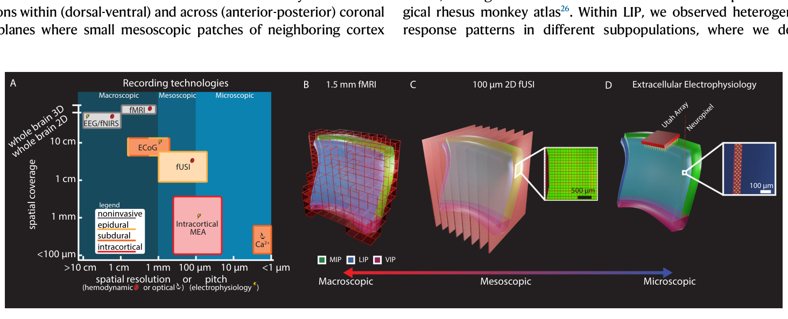
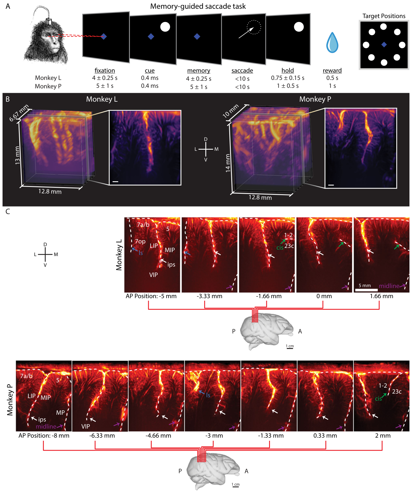
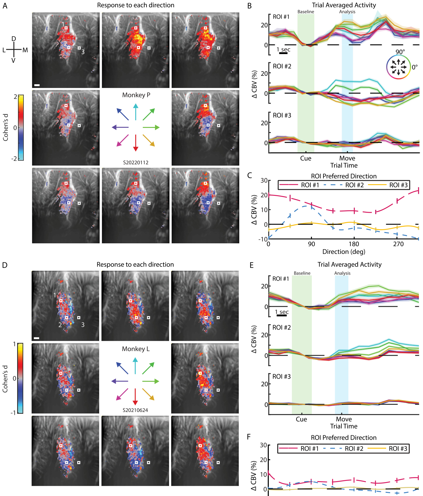
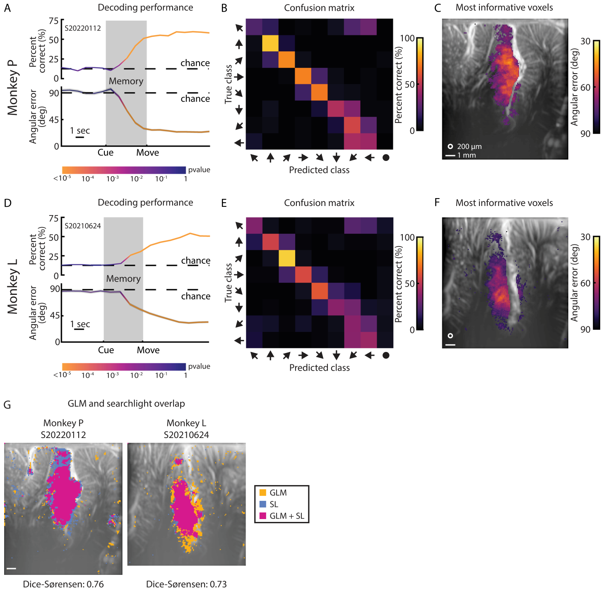
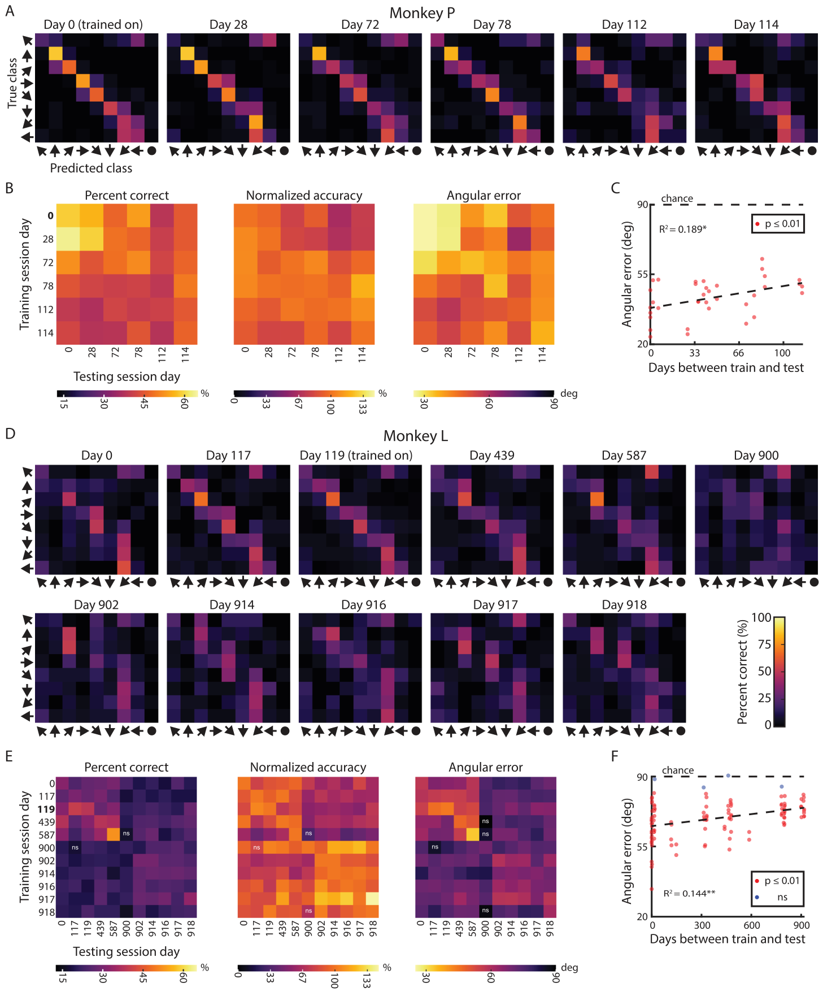
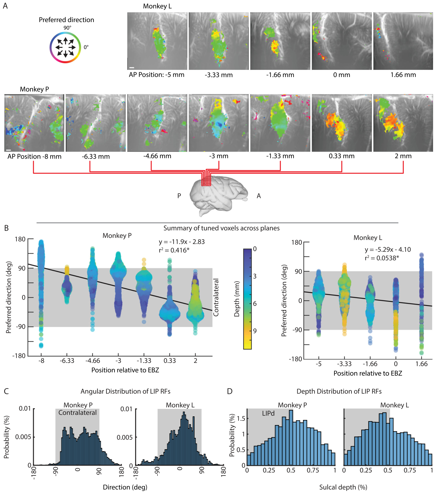
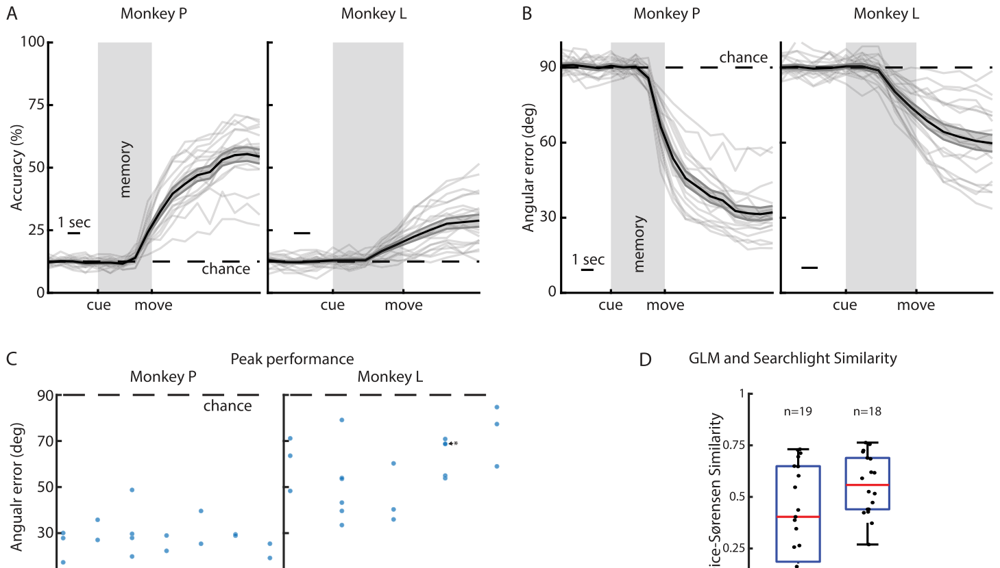

# 功能性超声神经成像揭示顶内沟外侧区（LIP）扫视的介观组织
[← 回到首页](..)

- **原题**：Functional ultrasound neuroimaging reveals mesoscopic organization of saccades in the lateral intraparietal area
- **著者**：Whitney S. Griggs1,2,13, Sumner L. Norman1, Mickael Tanter3,4, Charles Liu1,5,6,7, Vasileios Christopoulos8,9, Mikhail G. Shapiro10,11,12 & Richard A. Andersen1,8（通讯作者：W.S.G.、R.A.A.）
- **通讯作者**：wsgriggs@gmail.com (W.S.G.); richard.andersen@vis.caltech.edu (R.A.A.)
- **期刊**：Nature Communications 16, 8752 (2025)
- **DOI**：[10.1038/s41467-025-63826-z](https://doi.org/10.1038/s41467-025-63826-z)
- **日期**：投稿 2024-10-13 · 接收 2025-08-28 · 发表 2025
- **版权**：© The Author(s) 2025 ｜ 本文依据 Creative Commons Attribution 4.0 International（CC BY 4.0）许可发布。原文：This article is licensed under a Creative Commons Attribution 4.0 International License, which permits use, sharing, adaptation, distribution and reproduction in any medium or format, as long as you give appropriate credit to the original author(s) and the source, provide a link to the Creative Commons licence, and indicate if changes were made. To view a copy of this licence, visit http://creativecommons.org/licenses/by/4.0/.
- **单位**：
  - 1 Biology and Biological Engineering, California Institute of Technology, Pasadena, CA, USA（加州理工学院 生物学与生物工程）
  - 2 Medical Scientist Training Program, David Geffen School of Medicine, University of California Los Angeles, Los Angeles, CA, USA（加州大学洛杉矶分校 David Geffen 医学院 医学科学家训练项目）
  - 3 Physics for Medicine Paris, INSERM, CNRS, ESPCI Paris, PSL Research University, Paris, France（巴黎 医学物理研究所，INSERM / CNRS / ESPCI Paris，PSL 研究型大学）
  - 4 INSERM Technology Research Accelerator in Biomedical Ultrasound, Paris, France（INSERM 生物医学超声技术研究加速器）
  - 5 Department of Neurological Surgery, Keck School of Medicine of USC, Los Angeles, CA, USA（南加州大学 Keck 医学院 神经外科）
  - 6 USC Neurorestoration Center, Keck School of Medicine of USC, Los Angeles, CA, USA（南加州大学 Keck 医学院 神经修复中心）
  - 7 Rancho Los Amigos National Rehabilitation Center, Downey, CA, USA（Rancho Los Amigos 国家康复中心）
  - 8 T&C Chen Brain-Machine Interface Center, California Institute of Technology, Pasadena, CA, USA（加州理工学院 T&C Chen 脑机接口中心）
  - 9 Biomedical Engineering, University of Southern California, Los Angeles, CA, USA（南加州大学 生物医学工程）
  - 10 Chemistry & Chemical Engineering, California Institute of Technology, Pasadena, CA, USA（加州理工学院 化学与化学工程）
  - 11 Andrew and Peggy Cherng Department of Medical Engineering, California Institute of Technology, Pasadena, CA, USA（加州理工学院 Andrew and Peggy Cherng 医学工程系）
  - 12 Howard Hughes Medical Institute, Pasadena, CA, USA（霍华德·休斯医学研究所）
  - 13 Present address: Department of Neurological Surgery, The University of Chicago Medicine, Chicago, IL 60605, USA（现址：芝加哥大学医学院 神经外科）

---

> **本系列**：六篇核心论文的完整译文，逐一独立成篇。另见 [清醒灵长类的 fUS 脑活动传播（Dizeux 2019）](fusi-primate-propagation) · [单试次运动意图解码（Norman 2021）](fusi-single-trial-decoding) · [首例闭环超声脑机接口（Griggs 2024）](fusi-closed-loop-bci) · [经颅窗人脑 fUS 成像（Rabut 2024）](fusi-human-cranial-window) · [移动中的人脑 fUS 成像（Soloukey 2025）](fusi-mobile-human)

## 摘要

外侧顶内沟区（lateral intraparietal cortex，LIP）位于后顶叶皮层（posterior parietal cortex，PPC）之内，是把空间信息转化为扫视眼动的关键区域，但其在运动方向上的功能组织仍不清楚。本研究使用功能性超声成像（functional ultrasound imaging，fUSI）——一种兼具高灵敏度、大空间覆盖与良好空间分辨率的技术——在两只雄性猴执行记忆引导扫视期间记录 PPC 内脑血容量的局部变化，据此标绘整个 PPC 的运动方向编码。我们的分析揭示出一种异质组织，其中相邻 LIP 皮层的小块斑片编码不同的方向。这些亚区在数月到数年间表现出稳定的调谐。一种粗略的拓扑结构随之浮现：前部 LIP 代表更多对侧向下运动，后部 LIP 代表更多对侧向上运动。这些结果填补了我们对 LIP 功能组织认识上的两个根本空白：斑片的邻域组织，以及这些群体在长时间尺度上的稳定性。通过在延长时间跨度上追踪 LIP 群体，我们绘制出此前用 fMRI 或电生理方法无法获得的介观方向特异性图谱。

> **【译者注】** 译名说明：本文题名沿用本项目流水线既定的译名「顶内沟外侧区（LIP）」，而主材料《超声脑机接口技术材料.md》的「术语与缩略语」A 表把 LIP 列为「外侧顶内沟区（Lateral Intraparietal Area）」。二者指同一核团，只是词序不同；正文统一采用「外侧顶内沟区」，「顶内沟外侧区」仅出现在题名中，不构成两种不同结构。

## 引言

后顶叶皮层（PPC）把视觉信息与其他感觉模态整合起来，表征可能的行动计划，并为下游执行决定最优动作 [[1-3]](#ref-1)。PPC 内不同的区域优先编码不同的运动类型 [[4,5]](#ref-4) 或不同的执行器官。外侧顶内沟区（lateral intraparietal area，LIP）优先编码扫视 [[6]](#ref-6)，顶叶够取区（parietal reach region，PRR）优先编码肢体够取 [[2]](#ref-2)，前顶内沟区（anterior intraparietal area，AIP）优先编码抓握动作 [[7]](#ref-7)。这些区域揭示了 PPC 内部一种依赖执行器官的功能组织。

LIP 内扫视方向的介观（约 100 μm~1 mm 尺度 [[8-11]](#ref-8)）功能组织仍鲜有探索 [[5,12]](#ref-5)，多数研究聚焦于空间感受野的拓扑结构 [[13-16]](#ref-13)，且结果各异。视觉感受野与扫视运动野已被证明在很大程度上相互重叠 [[17]](#ref-17)。Savaki 等 2010 [[18]](#ref-18) 虽为扫视方向的拓扑组织提供了证据，但其单轴扫视范式与定量 [14C] 脱氧葡萄糖方法未能解决多个扫视方向在 LIP 中如何表征的问题。这一争论 [[12]](#ref-12) 之所以持续，部分原因在于既有记录技术的视野、灵敏度和/或空间分辨率有限（图 1A）。fMRI 可记录全脑活动，但缺乏进一步细化我们对 LIP 空间组织认识所需的空间分辨率与信号灵敏度（图 1B）。使用高密度微电极阵列（电极间距 16~400 μm）、如 Neuropixels 或 Utah 阵列的皮层内电生理，可测量单神经元活动，但无法充分采样或同时记录大体积脑区，例如灵长类的 PPC（图 1D）。此外，对跨越数月记录的数据进行对齐与重建十分困难，限制了我们在多次记录之间观察解剖学模式的能力。分布式微电极阵列（如 Gray Matter 阵列 [[19]](#ref-19) 或 MePhys 系统 [[20]](#ref-20)）的近期进展，现已允许跨灵长类半球的同步多区域记录。尽管这些分布式微电极阵列平台实现了前所未有的时间分辨率（<1 ms）与容积覆盖，电极杆之间的间距（2~5 mm）仍比在皮层柱与微环路中观察到的约 100~500 μm 功能组织粗一个数量级 [[21]](#ref-21)。这一间距从根本上限制了对精细群体活动模式的连续空间采样。既有记录技术的这些取舍，凸显出需要一种灵敏技术来弥合灵长类皮层微观视野（如单神经元）与宏观视野（如全脑）之间的空间分辨率鸿沟。

本研究使用一项新兴技术——功能性超声成像（fUSI），来确定 LIP 内扫视响应野的介观（即介于微观与宏观之间）空间组织。fUSI 的大视野、出色灵敏度与高空间分辨率（图 1A、C）非常适合这一任务 [[22-25]](#ref-22)。我们在两只恒河猴（猴 L 与猴 P）执行眼动任务期间记录了 fUSI。我们发现，在 LIP 的冠状面内（背-腹方向）与冠状面间（前-后方向）都存在功能上截然不同的亚区，其中相邻皮层的小块介观斑片编码不同的运动方向，且这一编码在数月到数年间保持一致。这些结果填补了我们对 LIP 功能组织认识上的空白，并表明 fUSI 是阐明脑内介观功能的强有力工具。

> **图 1**｜功能性超声可对神经群体进行介观成像。A 不同大型动物记录技术的空间覆盖范围、侵入性与空间分辨率。空间覆盖范围：脑体积采样的最大尺度。MEA：多电极阵列；Ca2+：钙成像；ECoG：皮层脑电；EEG：脑电；fNIRS：功能性近红外光谱；fMRI：功能性磁共振成像；fUSI：功能性超声成像。本图经 Griggs 与 Norman 等 2024 [[25]](#ref-25) 许可修改。B 顶内沟及其邻近皮层的 1.5 mm 各向同性 fMRI。每个红色方框代表一个体素。C 15.6 MHz 二维 fUSI。每个红色薄片代表一个冠状成像平面。插图显示体素尺寸为 100 μm × 100 × 400 μm。D 用于记录顶内沟的 Utah 阵列与 Neuropixel 1.0 记录方法。插图显示 Neuropixel 1.0 电极（黄色）的尺寸。a 图改编自 Griggs, W.S., Norman, S.L., Deffieux, T. 等，Decoding motor plans using a closed-loop ultrasonic brain–machine interface，Nat Neurosci 27, 196–207 (2024)，(https://doi.org/10.1038/s41593-023-01500-7)，依据 CC BY 许可：(https://creativecommons.org/licenses/by/4.0/)。

| 图内标签 | 中文 |
| --- | --- |
| Recording technologies | 记录技术 |
| Macroscopic / Mesoscopic / Microscopic | 宏观 / 介观 / 微观 |
| spatial coverage or pitch (electrophysiology) | 空间覆盖范围或电极间距（电生理） |
| spatial resolution (hemodynamic or optical) | 空间分辨率（血流动力学或光学） |
| noninvasive / epidural / subdural / intracortical | 无创 / 硬膜外 / 硬膜下 / 皮层内 |
| Intracortical MEA | 皮层内多电极阵列（MEA） |
| Ca2+ | 钙成像（Ca2+） |
| ECoG | 皮层脑电（ECoG） |
| EEG/fNIRS | 脑电 / 功能性近红外光谱（EEG/fNIRS） |
| fMRI | 功能性磁共振成像（fMRI） |
| fUSI | 功能性超声成像（fUSI） |
| 1.5 mm fMRI | 1.5 mm fMRI |
| 100 μm 2D fUSI | 100 μm 二维 fUSI |
| Extracellular Electrophysiology | 细胞外电生理 |
| Utah Array | Utah 阵列 |
| Neuropixel | Neuropixel |
| LIP | 外侧顶内沟区（LIP） |
| MIP | 内侧顶内沟区（MIP） |
| VIP | 腹侧顶内沟区（VIP） |
| whole brain 3D / whole brain 2D | 全脑三维 / 全脑二维 |
| legend | 图例 |
| >10 cm / 1 cm / 1 mm / 100 μm / 10 μm / <1 μm | 坐标轴刻度（>10 cm / 1 cm / 1 mm / 100 μm / 10 μm / <1 μm） |

## 结果

我们使用 fUSI 记录两只恒河猴（猴 L 与猴 P）执行记忆引导扫视期间多个 PPC 亚区脑血容量（cerebral blood volume，CBV）的高分辨率变化（图 2A）。这些区域包括外侧顶内沟区（LIP）、腹侧顶内沟区（ventral intraparietal area，VIP）、内侧顶内沟区（medial intraparietal area，MIP，PRR 的一个亚区）、5 区、7 区与内侧顶叶皮层（medial parietal cortex，MP）。任务中，每只猴注视中央线索，随后收到 8 个外周方向之一的线索，记住该线索位置，并在中央注视点熄灭后向记住的位置执行扫视。

我们使用一枚微型线性超声换能器阵列，它具备高空间分辨率（平面内 100 μm × 100 μm）与大视野（宽 12.8 mm，128 阵元，空间间距 100 μm，穿透深度 16 mm，平面厚度 400 μm）[[24,25]](#ref-24)，即每个体素约为 100 × 100 × 400 μm。我们把换能器表面垂直于脑、置于硬脑膜之上，以 1 Hz 记录 fUS 图像。我们从左侧 PPC 的多个等间距冠状面进行记录（图 2B、C）。每个场次（表 S1）记录单个冠状面。我们把记录腔室居中置于顶内沟之上，以便尽可能多地记录后顶叶皮层——既包括内外侧方向，也包括前后方向（图 2B 与补充影片 1、2）。

### 是否存在调谐到不同方向的介观群体？

为识别整个 PPC 的介观方向调谐模式，我们用一般线性模型（general linear model，GLM）找出对 8 个方向响应不同的体素。在两只猴中，介观 PPC 群体都表现出清晰的方向调谐。在猴 P 的一个示例场次中（图 3A~C），解剖学定义的 LIP 内大多数体素（>75% 的体素）表现出方向调谐，而 LIP 之外的区域（如 VIP、MIP、5 区、7 区与 MP）含有方向调谐的体素少得多（任一给定区域内 <10% 的体素）（图 S1）。所有区域边界均依据一份组织学恒河猴图谱估计 [[26]](#ref-26)。在 LIP 内，我们观察到不同亚群体中的异质响应模式；我们把「亚群体」定义为一组一个或多个相邻体素，它们对不同方向的响应高度相似，即调谐特性高度相似。部分 LIP 亚群体表现出 CBV 相对基线的显著升高（>20%），幅度取决于运动方向，而另一些则表现出依赖方向的抑制（图 3B）。为凸显这种方向响应的多样性，我们在 LIP 与 MIP 内定义了若干个 400 × 400 μm 的示例感兴趣区（region of interest，ROI）（图 3A 白框、图 3B），并对记忆期最后一秒（记忆结束前 +/−0.5 s 内的单个时间点）内各方向的响应在该 ROI 全部体素上取平均，生成区域调谐曲线（图 3C）。同一冠状面内不同的群体具有不同的偏好方向与调谐曲线宽度。一些亚群体对整片对侧半视野广调谐（图 3B、C —— ROI 1），而另一些亚群体则对狭窄的方向窗口锐调谐（图 3B、C —— ROI 2）。猴 L 的示例场次表现出类似现象（图 3D~F）。LIP 内大多数体素（>70% 的体素）表现出方向调制，这些体素聚集成多个调谐曲线各异的 LIP 亚群体。LIP 之外的区域（如 VIP、MIP 与 7 区）含有方向调谐的体素少得多（任一给定区域内 <10% 的体素）。与猴 L 类似，LIP 内的区域调谐曲线具有不同的偏好方向与调谐曲线宽度。例如，ROI 1 表现出广调谐，而 ROI 2 对 45° 与 90° 表现出较窄的调谐（图 3D~F）。在猴 L 中，紧邻脑沟的中部 MIP 有一些方向调谐的血管响应，但该活动未深入更深的皮层层次。

> **图 2**｜猴在 fUSI 采集期间执行记忆引导扫视任务。A 记忆引导扫视任务。一个试次以猴注视中央蓝色菱形开始。猴注视后，一个白色圆形线索在 8 个外周位置之一闪烁 400 ms。中央注视菱形一旦熄灭，猴即向记住的线索位置执行扫视，并保持注视外周位置。若扫视到正确位置，外周线索重新出现，猴获得液体奖赏。示例场次扫视潜伏期中位数［四分位距］：猴 P——399［363, 430］ms，猴 L——530［500, 569］ms。B 猴 L 与猴 P 的三维血管图。视野涵盖两只猴的顶内沟。白色比例尺 1 mm。D 背侧。V 腹侧。L 外侧。M 内侧。C 猴 L 与猴 P 的冠状成像平面。相对估计耳杆零点（ear-bar zero，EBZ）的位置叠加于一份非人灵长类脑图谱 [[91]](#ref-91) 之上。解剖标注依据 Saleem 等 [[26]](#ref-26)。LIP 外侧顶内沟区，VIP 腹侧顶内沟区，MIP 内侧顶内沟区，MP 内侧顶叶区，ls 外侧沟，cis 扣带沟，ips 顶内沟。A 图中的猴示意图由 Krissta Passanante 绘制。B 图中的脑示意图通过可扩展脑图谱（Scalable Brain Atlas）[[92]](#ref-92) 与一份公开可获取的恒河猴 MRI 图谱 [[91]](#ref-91) 生成。

| 图内标签 | 中文 |
| --- | --- |
| Memory-guided saccade task | 记忆引导扫视任务 |
| fixation / cue / memory / saccade / hold / reward | 注视 / 线索 / 记忆 / 扫视 / 保持 / 奖赏 |
| Target Positions | 目标位置 |
| Monkey L / Monkey P | 猴 L / 猴 P |
| ips | 顶内沟（ips） |
| cis | 扣带沟（cis） |
| ls | 外侧沟（ls） |
| midline | 中线 |
| LIP | 外侧顶内沟区（LIP） |
| MIP | 内侧顶内沟区（MIP） |
| VIP | 腹侧顶内沟区（VIP） |
| MP | 内侧顶叶区（MP） |
| 5 | 5 区 |
| 7a/b | 7a/b 区 |
| 7op | 7op 区 |
| 1-2 | 1-2 区 |
| 23c | 23c 区 |
| D / V / L / M | 背侧 / 腹侧 / 外侧 / 内侧 |
| A / P | 前 / 后 |
| AP Position: -5 mm / AP Position: -8 mm | 前后位置：−5 mm / 前后位置：−8 mm |
| 12.8 mm / 14 mm / 13 mm / 6.67 mm | 视野尺寸标注（12.8 mm / 14 mm / 13 mm / 6.67 mm） |
| 4 ± 0.25 s / 5 ± 1 s / 0.75 ± 0.15 s / 1 ± 0.5 s | 时长标注（4 ± 0.25 s / 5 ± 1 s / 0.75 ± 0.15 s / 1 ± 0.5 s） |
| 1 cm / 5 mm / 2 mm | 比例尺（1 cm / 5 mm / 2 mm） |

> **图 3**｜PPC 含有多个各不相同的方向调谐介观群体。A 统计参数图，显示记忆期内的平均活动。体素阈值由 GLM F 检验确定，取 p < 0.00001（FDR 校正）的体素。ROI 尺寸为 400 × 400 μm。白色比例尺 1 mm。中央箭头指示所检验的 8 个方向。Cohen's d 是各方向响应强度的标准化度量，正值（负值）对应 CBV 相对基线升高（降低）。B 各 ROI 内活动的事件相关平均值。每条线代表一个方向。环形色标指示每条线所对应的方向。误差底纹为均值标准误。绿色底纹表示用于计算基线的时间点，蓝色底纹表示用于分析对不同方向记忆响应的时间点。C 调谐曲线。每条线为各 ROI 内记忆期末尾方向响应的三次样条拟合。误差棒为均值标准误。A~C 的图基于 n = 468 个试次。D~F 猴 L 的示例场次。图基于 n = 555 个试次。格式同 (A~C)。源数据以源数据文件提供。

为更好地理解每个体素处的响应野，我们为每个体素计算了若干数据分布量（图 S2）。我们首先求出每个体素的峰值偏好方向。在两只猴中，这些峰值调谐方向的图都与我们上述发现一致——我们发现不同的体素小组团调谐到不同方向。随后我们可视化了峰值运动方向的响应强度（Cohen's d）与统计强度（F 分数），发现所有显著体素的峰值方向强度相似。如果调谐强度在编码同一方向的斑片中央最强、在斑片之间最弱，那就说明整个 PPC 的调谐是平滑过渡的。然而，在 LIP 的已调谐体素中观察到的高而均匀的幅度，提示相邻体素斑片之间的调谐转变十分迅速，支持斑块状拓扑，而非相邻体素斑片之间调谐的平滑梯度。接着我们检查了逐体素的响应野是否偏好对侧 [[27,28]](#ref-27)，即对向右的扫视更活跃（因为我们记录的是左侧 PPC）。如预期，LIP 内大多数体素偏好对侧（猴 P —— 74%；猴 L —— 77%）。在猴 P 中，我们还观察到腹侧 LIP 内有一小块斑片强烈偏好同侧。最后我们计算并标绘了圆标准差、角偏度与角峰度。这些图支持 LIP 内与其他图所识别的相似的斑块状、异质拓扑。

由于猴 L 各记录场次之间差异较大，我们对来自另一冠状面的一个示例场次重复了上述分析（图 S3）。我们观察到与前两个示例场次相同的许多模式。解剖学定义的 LIP 内许多体素（>30% 的体素）表现出方向调谐，而非 LIP 区域中极少体素（任一给定区域内 ≤2% 的体素）表现出方向调制的活动（图 S1、S3A）。在 LIP 中，存在调谐曲线各异的紧密相邻体素斑片（图 S3B、C）。统计叠加图（方向、响应强度、统计强度、圆标准差、角偏度、角峰度与偏侧化指数）显示出与其他示例场次所识别的相似的斑块状拓扑（图 S3D）。

### 一个场次内这种方向调谐有多一致？

在两只猴中都观察到具有方向偏好的清晰介观群体后，我们希望更好地理解这些体素亚群体内的信息含量及其逐试次响应的一致性。为此，我们对每个示例场次实施解码分析。我们在每个示例场次的部分试次上训练一个模型来解码预期运动方向，然后检验该模型在留出的测试试次上预测预期运动方向的效果。如果该模型在测试试次上具有统计显著高于随机的解码准确率，就表明视野内方向的编码是逐试次一致的。在该解码分析中，我们用主成分分析（principal component analysis，PCA）对 fUSI 数据降维，用线性判别分析（linear discriminant analysis，LDA）基于 PCA 变换后的数据预测 8 个运动方向之一。我们检验了整个试次期间解码预期运动方向的能力（图 4），发现在方向线索出现后 3 s 内即可显著高于随机地解码预期运动方向（p < 0.01；单侧二项检验；留一交叉验证）（图 4A、D）。在两只猴中，正确率都超过 50%（留一交叉验证；猴 P —— 59.6% 正确，猴 L —— 54.1%）。错误预测通常紧邻真实运动方向（图 4B、E）。为量化这一点，我们给出预测运动方向与真实运动方向之间的平均绝对角度误差。与正确率一样，平均角度误差在方向线索出现后 3 s 内达到显著（p < 0.01；单侧置换检验）。两只猴的平均角度误差都收敛到 <35°（猴 P —— 23.7°，猴 L —— 32.8°，图 4A 下、D 下）。猴 L 的第二个示例场次（图 S3）表现出与其他示例场次相似的趋势，但解码表现更差。解码表现仍在方向线索出现后 3 s 内达到显著，但正确率与角度误差分别只达到 30% 与 55°（图 S3E）。错误预测仍紧邻真实运动方向，但离散程度高于猴 L 的第一个示例场次（图 S3F）。

> **图 4**｜以高准确率对 8 个预期运动方向进行单试次解码。A 解码表现随时间的变化。上图显示正确率百分比。下图显示平均角度误差。平均角度误差周围的阴影误差带为留一分析各折之间的标准误。虚线为随机水平表现。线条颜色表示统计显著性（单侧二项检验或置换检验）。B 以试次最后一个时间点进行解码的混淆矩阵。表现以百分比表示（各行之和为 100%）。圈出的预测类别对应多重编码器方法所产生的「中心」位置。C 试次结束时的探照灯分析。平均角度误差最低的前 10% 体素。白圈为 200 μm 的探照灯半径。白线为 1 mm 比例尺。被掩蔽的体素对应 p < 10−5 的阈值（单侧二项检验，FDR 校正）。对于 (A~C)，图基于 n = 468 个试次。D~F 猴 L 的解码表现。格式同 (A~C)。被掩蔽的体素对应 p < 0.005 的阈值（单侧二项检验，FDR 校正）。图基于 n = 555 个试次。G GLM 分析与探照灯分析统计掩模的重叠（p < 0.001，FDR 校正）。重叠用 Dice-Sørenson 相似度计算。源数据以源数据文件提供。

我们用每个时间点的整幅图像在单个试次上解码预期运动方向。一种可能是预测由少数保持一致的体素驱动，而其他体素在波动。为理解图像的哪些部分（即血管解剖）对解码表现的贡献最大，我们实施了探照灯分析。我们让一个圆柱形窗（半径 200 μm）在整幅图像上移动，评估每个圆柱窗解码预期运动方向的能力（图 4C、F 与 S3G）。换言之，我们逐一检验半径 200 μm 圆柱窗内的每一组独特体素单独能多好地解码预期运动方向。为区分不同脑区内所含的信息，对给定的探照灯圆柱窗，我们只分析位于脑沟同一侧的体素。例如，以 LIP 体素为中心的圆柱窗只包含 LIP 体素，而以 MIP 体素为中心的圆柱窗只包含 MIP 体素。我们发现，这些半径 200 μm 的圆柱窗（即体素斑片）中有许多能稳健地解码预期运动方向（p < 0.01），在我们的示例场次中许多体素斑片的角度误差接近 30°（图 4C、F）。在补充示例场次中（图 S3G），探照灯仍识别出能解码预期运动方向的体素斑片，但角度误差只接近 75°。换言之，这些探照灯结果表明，许多 PPC 体素编码预期运动方向，并能驱动准确的单试次预测。LIP 含有最多有信息量的体素，且这些有信息量的体素与先前 GLM 分析所识别的体素高度重叠（图 4G 与 S3H），重叠程度用 Dice-Sørenson 相似度衡量。此外，所有示例场次中的体素都表现出 F 分数（GLM 分析）与角度误差（探照灯分析）之间强且显著的相关（图 S4）。在两只动物中，LIP 之外区域的体素都落在最显著的 10% 体素之内（图 4C、F）。在猴 P 中，这些区域包括 7 区（最显著体素的 14%）、MIP（11%）、VIP（5%）与 MP（2%）。在猴 L 中，这些区域包括 MIP（8%）、VIP（5%）与 7 区（4%）。MIP 内的显著体素位于沿脑沟的浅层皮层中，未延伸至更深的皮层层次，这与猴 L 的 GLM 分析结果一致。为理解这些探照灯结果如何随试次时间演变，我们在注视后的每个时间点重复了探照灯分析（图 S5）。与使用整幅图像的解码器表现一样，探照灯图在注视后 3 s 内在 LIP 内开始出现显著体素。显著体素在更晚的试次时间点出现于其他区域，包括 7 区、VIP、MIP 与 MP。显著体素的数目与解码器表现在运动期结束时达到平台。

探照灯分析识别出对解码表现有贡献的体素，但未指明哪些体素对区分特定运动方向是关键的。为解决这一点，我们检查了在完整 fUSI 图像上训练的 PCA-LDA 解码器的权重（图 S6）。LDA 权重代表成对运动方向之间的边界（如 0°–45°、45°–315°），并定义了最能区分这些方向的特征。由于我们在 PCA 变换后的数据上训练 LDA 模型，我们用逆 PCA 变换把 LDA 权重投影回原始血管图像空间，以可视化不同体素在 LDA 模型中的重要性（图 S6）。权重较强的体素对区分特定方向对更重要，而权重接近零的体素相关性较低。我们发现，不同 PPC 亚区专长于区分特定的方向对，而不是对所有方向对均匀贡献。例如，两只猴的中部 LIP 体素对相邻方向表现出最强的权重（如方向 1 的同侧向上对比方向 2 的其他方向；图 S6）。这一模式表明 PPC 内存在对特定方向具有强调谐的独特群体。此外，LDA 权重最强的体素与 GLM 识别的体素紧密吻合（图 S6 —— Dice-Sørenson 图），进一步支持介观 LIP 亚群体稳健地编码运动方向。这些发现凸显出 PCA + LDA 解码器与 GLM 在揭示 PPC 内专用于运动方向编码的特化亚区方面的协同作用。

### 这些介观群体在多个日间是否稳定？

在示例场次中，PPC 亚群体稳健地调谐到各个运动方向，但每个群体的功能随时间是否稳定？在此前一篇论文中，我们证明 PPC 群体即便在训练解码器模型 60 天以上之后仍可用于控制超声脑机接口，提示 PPC 群体在 1~2 个月内是稳定的 [[25]](#ref-25)。为扩展这一结果并更好地理解数月到数年间的稳定性，我们收集了同一冠状面跨 4~30 个月的数据。随后我们在一个场次的数据上训练解码器，并在同一平面的其他场次上检验其表现，而不重新训练模型。我们检验了所有场次组合。如果这些亚群体的功能随时间不变，则在某一场次上训练的解码器应能准确预测同一冠状成像平面另一场次数据的预期运动方向。

在猴 P 中，解码器在超过 100 天内表现高于随机水平（图 5A），且在全部训练-测试场次对上均如此（p < 10−5；36/36 对）（图 5B）。在猴 L 中，解码器在训练与测试场次之间相隔超过 900 天时仍表现高于随机水平（图 5D），该效应在几乎所有训练-测试场次对上都持续存在（p < 0.01；117/121 对）（图 5E）。交叉验证的解码表现在每个训练场次内各不相同（表现矩阵的对角线；图 5B、E），因此我们也给出以各训练场次交叉验证准确率归一化的跨场次解码准确率。我们在绝对准确率与归一化准确率之间未观察到明显差异。有趣的是，在猴 L 中，在 Day 119 场次上训练的解码器在训练集中对三个方向（对侧向上、对侧向下与同侧向下）表现最好，并在整个测试场次中持续对这同样的三个方向解码最好（图 5D）。我们看到这种模式——即便训练场次自身的交叉验证表现很差，解码器仍能最好地预测某些方向（图 S7）。我们还在两只猴中观察到，时间上相邻的场次表现出更好的表现（图 5C、F 与 S8）。

在猴 L 中，表现聚成两个时间组（Day 900 之前与之后）。这一表现变化是源于成像平面的物理变化，还是源于亚群体功能的变化？尽管我们尽力把记录对齐到逐日完全相同的成像平面，偶尔我们的对齐仍不完美，且相对先前场次存在离面偏差。目视检查发现大血管（如小动脉）一致，但介观血管不一致（图 S9A、D）。重要的是，物理变化会提示 (a) 我们解码的是略有不同的神经群体，以及 (b) 相邻的小神经群体编码不同的方向信息。为检验「成像平面的物理差异（因而血管解剖的差异）导致解码器表现下降」这一假设，我们用一种图像相似度指标——复小波结构相似性指数（complex-wavelet structural similarity index measure，CW-SSIM）[[29]](#ref-29)——测量血管解剖随时间的相似性。CW-SSIM 把血管图像聚成离散的组（图 S9B、E），与我们对图像相似性的定性评估相符。该相似性分组也与猴 L 的成对解码表现分组相符（图 5E）。解码器表现与图像相似性相关（图 S9C、F）。训练场次与各测试场次之间的图像相似性越低，解码器表现也越低。这支持我们的假设：解码器表现的下降源于成像平面的变化，而不是各亚群体调谐的漂移。

这些纵向解码结果共同表明，调谐到特定运动方向的亚区在数月到数年间保持一致。我们的分析揭示了三项关键发现。第一，整幅图像解码器依赖 LIP 中最强调谐到特定运动方向的亚区（图 S5）。第二，探照灯与 GLM 分析所识别的体素表现出大量重叠（图 4G 与 S5H）。第三，整幅图像解码器在延长时间跨度上保持稳定，表明支撑解码器表现的体素随时间同样稳定。

> **图 5**｜PPC 在数月到数年间稳定编码运动方向。A 猴 P 的解码器稳定性示例。在 Day 0 数据上训练解码器，并在同一成像平面的其他场次上检验该已训练解码器，不做任何重新训练。B 猴 P 在每个场次上训练与测试的解码器稳定性。ns 为不显著的解码表现（α = 0.01）。加粗文字代表图 5A 所示的示例场次。C 猴 P 的平均角度误差随训练场次与测试场次之间天数（时间差的绝对值）的变化。虚线为数据的线性拟合。*p = 0.0079，**p = 1.76e-5（双侧 t 检验）。D 猴 L 的解码器稳定性示例。在 Day 119 数据上训练解码器，并在同一成像平面的其他场次上检验该已训练解码器，不做任何重新训练。E 猴 L 在每个场次上训练与测试的解码器稳定性。格式同图 5B。F 猴 L 的解码器稳定性。格式同图 5C。源数据以源数据文件提供。

### 介观群体调谐在 PPC 的前部与后部之间如何变化？

在证明了一个成像平面内存在稳健调谐到各个运动方向的 PPC 亚群体、且这些亚群体的调谐在数月到数年间一致之后，我们接着追问方向调谐在不同的前-后冠状成像平面之间如何变化。我们对从 PPC 内均匀间隔的冠状面采集的数据重复了同样的 GLM 分析（图 2B、C 与补充影片 1、2），并求出每个体素的峰值偏好方向（图 6A）。几种模式随之出现。第一，每个冠状面都含有带方向调制的 LIP 体素。第二，两只猴中每个解剖平面都含有多个调谐特性不同的 LIP 亚群体。第三，后部平面编码更多对侧向上运动，而前部平面编码更多对侧向下运动。第四，在两只猴中，LIP 之外的区域都含有方向调制的体素。在猴 P 中，这些区域包括 7 区、MIP、MP 与 5 区皮层。在猴 L 中，我们观察到腹侧 7a 区的一小块区域。我们在猴 L 的 5 区内未观察到任何活动，且仅在单个冠状面（EBZ −3.33 mm）的 MIP 内观察到非常表浅的活动。遗憾的是，猴 L 的记录腔室位置更靠外侧，不包含我们在猴 P 中观察到活动的同一块 MP 后部区域。

为进一步理解不同冠状面之间的方向编码，我们提取了 LIP 内方向调制的体素，并绘制了一张蜜蜂群图（beeswarm chart），其中含每个体素的方向偏好（图 6B）。如预期，给定平面内的某些方向被过度代表，即蜜蜂群图中出现成簇的相似调谐神经元。在两只猴中，我们都发现前后位置与偏好方向之间存在统计显著的关系（p < 1e−40），即更靠前的平面有更多调谐到向下方向的 LIP 体素，而更靠后的平面有更多调谐到向上方向的 LIP 体素。大多数 LIP 体素编码对侧运动（−90° 至 +90°），不过也有一些体素对同侧运动响应最强，即 CBV 升高。每个平面都含有对侧运动的宽广且相互重叠的表征。为更好地量化这些观察，我们跨平面合并体素（图 6C），发现 >85% 的已调谐 LIP 体素偏好对侧（猴 P —— 87.7%；猴 L —— 89.4%）。接着我们检查了每个冠状面的数据分布（图 S10、S11）。与示例场次（图 S2、S3）类似，调谐与统计强度指标（图 S10A、B）在已调谐体素中显示出高而均匀的幅度，提示相邻体素斑片之间的调谐转变十分迅速，支持斑块状拓扑，而非相邻体素斑片之间调谐的平滑梯度。如主要分析所示，大多数体素偏好对侧（图 S10C）。与示例场次（图 S2、S3）一样，圆标准差、角偏度与角峰度都支持 LIP 内的斑块状、异质拓扑。

> **图 6**｜极坐标方向沿 LIP 前后轴呈拓扑组织。A 彩色叠加图，显示对不同运动方向响应有统计显著差异的体素的偏好方向。阈值依据 GLM 双侧 F 检验，p < 0.01（FDR 校正）。B 每个冠状面内所有显著体素的偏好方向。颜色代表距脑表面的深度。灰色阴影区域为对侧角度。黑线为最佳拟合线，方程如图所示。*p < 1e-40（双侧 F 检验，FDR 校正）。C LIP 内响应野的角度分布。灰色阴影区域为对侧角度。D 已调谐 LIP 体素的深度。灰色阴影区域为近似的 LIPd。源数据以源数据文件提供。A 图中的脑示意图通过可扩展脑图谱 [[92]](#ref-92) 与一份公开可获取的恒河猴 MRI 图谱 [[91]](#ref-91) 生成。

某些前/后冠状面对特定方向的表征更好，因此我们追问：在不同解剖平面上训练的 fUSI 解码器是否会有任何表现差异。如果特定的前/后区域更适合方向解码，这将具有转化意义。我们把解码分析应用于每一个记录场次（图 7）。在猴 P 中，所有场次都达到统计显著（18/18 场次）。在猴 L 中，除一个场次外其余都达到统计显著（19/20 场次）。在猴 P 中，单个场次内的峰值角度误差范围为 17°~55°（29.97° ± 2.32°，均值 ± 均值标准误）。在猴 L 中，角度误差范围为 33°~85°（57.98° ± 3.35°，均值 ± 均值标准误）。正确率或角度误差在不同平面之间没有统计差异（单因素 ANOVA，α = 0.01）（图 7C）。这些结果提示，我们采样的所有解剖 PPC 平面都含有足够信息，可在单试次基础上准确解码至少 8 个预期运动方向。

> **图 7**｜无论 PPC 平面如何，线性解码器都能从大多数 fUSI 场次中解码预期运动方向。A 各场次的正确率百分比。黑色实线与灰色包络为均值 ± 均值标准误。每条灰线为单个场次的表现。虚线为随机水平。B 各场次的平均角度误差。格式同 (A)。C 平均角度误差随冠状面的变化。* 为两个紧密重叠的点 (D)。D 所有场次中 GLM 与探照灯分析重叠情况的汇总。每个点代表 1 个场次。箱体显示第 25~75 百分位数，红线为中位数 Dice-Sørenson 值。须线延伸至最远的非离群点（超出第 25 或第 75 百分位数 ± 1.5*IQR）。最小值［最大值］为超出第 25［第 75］百分位数的 −1.5*IQR［+1.5*IQR］。猴 L 的一个场次因 GLM 或探照灯分析中无显著体素而被排除。源数据以源数据文件提供。

接着我们比较了 GLM 与探照灯分析所识别的显著体素之间的相似性（图 7D）。与示例场次一样，两项分析所识别的体素之间有很高的相似度。在猴 L 中，Dice-Sørenson 相似度的中位数［四分位距］为 0.40［0.19, 0.65］。在猴 P 中，Dice-Sørenson 相似度的中位数［四分位距］为 0.56［0.44, 0.69］。这进一步说明解码器与 GLM 分析在揭示 PPC 内专用于运动方向编码的特化亚区方面如何有效地相互补充。

### 背侧与腹侧 LIP 是否表现出不同的调谐特性？

背侧 LIP（LIPd）与腹侧 LIP（LIPv）被认为具有不同的功能：LIPd 参与视觉处理，而 LIPv 参与注意与视觉-扫视处理 [[30,31]](#ref-30)。依据拓扑编码理论 [[12]](#ref-12)，我们预期 LIPd 与 LIPv 内会有运动方向的分离表征。我们在 LIP 中部未观察到清晰的功能分割，因此沿用先前以 53% 沟深作为定义的做法，来比较 LIPd 与 LIPv 内的活动 [[30]](#ref-30)。我们发现前部 LIPd 比后部 LIPd 更活跃。LIP 中部，即所定义的 LIPd 与 LIPv 的交界处，在所有平面上一致表现出最多的活动。为量化这一观察，我们用每个 LIP 体素距脑表面的深度标注蜜蜂群图（图 6B）。我们在数据中未观察到任何清晰趋势足以明确区分 LIPd 与 LIPv 的功能差异。我们还跨平面合并所有已调谐体素，考察它们在脑沟内的深度百分比（图 6D）。我们并未观察到 LIPd 与 LIPv 之间的清晰分离，而是观察到一个同质群体，其活动最多处的峰值位于 LIPd 与 LIPv 的边界，提示 LIPd 与 LIPv 可能共享一种拓扑表征，和/或它们接受共同的输入。

## 讨论

我们的结果表明，PPC 含有调谐到不同方向的亚区。这些已调谐体素主要位于 LIP 内，并成组为连续的介观亚群体。给定冠状面内存在多个亚群体，即每个平面内有多个偏好方向。存在一种粗略的拓扑结构：前部 LIP 有更多体素调谐到对侧向下扫视，后部 LIP 有更多体素调谐到对侧向上扫视。这些群体在超过 100~900 天内保持稳定。

### fUSI 的特有性质

fUSI 的灵敏度。我们观察到很大的效应量，CBV 相对基线活动的变化达 10~30% 量级（图 3）。这比 BOLD fMRI 所观察到的大得多——在类似的基于扫视的事件相关任务中，fMRI 的效应量约为 0.4~2% [[27,32]](#ref-27)。我们的结果支持一个不断增长的证据基础，该证据把 fUSI 确立为一种灵敏的神经成像技术，可在多种模式生物中检测介观功能活动，包括鸽、大鼠、小鼠、非人灵长类、雪貂以及婴儿与成人 [[23-25,33-40]](#ref-23)。

介观功能成像——空间分辨率与视野的平衡。若干研究报告了方向选择性中的斑块性：许多相邻神经元调谐到大致相同的方向，随后突然转变到偏好方向不同的另一块斑片 [[13,14,41]](#ref-13)。这些结果与本研究观察到的结果非常吻合——我们在给定平面内发现 LIP 内成簇调谐到一个方向的体素，其近旁就是调谐到不同方向的簇。这些结果进一步凸显了 fUSI 在神经元活动功能标绘方面的高空间分辨率。这些结果也与先前一项研究密切吻合：该研究用 fUSI 识别清醒雪貂听皮层与下丘的频率拓扑映射，作者发现体素响应性的功能分辨率为 100 μm，体素频率调谐的功能分辨率为 300 μm [[34]](#ref-34)。

### 方向调谐随时间的稳定性

fUSI 允许在数月到数年间对同一脑区反复纵向成像，便于研究功能群体随时间的稳定性。在本研究中，我们利用这一特性证明，用在相隔数月到数年的另一场次数据上训练的解码器，可以解码预期运动方向。这强烈提示 LIP 亚群体的方向偏好在介观尺度上保持稳定。当训练与测试场次在时间上接近时，解码器表现最好。我们对此有三种可能的解释。第一，亚群体内方向的表征随时间以难以预测的方式漂移。按这一解释，随着时间推移，由于模型中使用的已调谐体素去相关，我们预期解码器预测的运动方向会变得越来越随机。第二种解释是亚群体确实漂移，但它们以相同的速率、朝相同的方向漂移。这会导致已调谐体素保持相关，但编码的方向发生了改变。按这一解释，我们预期解码器犯的错会越来越多，但以一种一致的方式犯错。例如，解码器可能形成一种误差偏置：它不去预测正确的类别，而是一致地预测另一个方向作为替代。第三种解释是，血管相对于我们记录平面的位置随时间改变（与成像平面的变化一致），而我们解码的是略有不同的神经群体。按这一解释，解码误差应会在相邻方向上增大，因为本研究所观察到的已调谐介观群体在前后两个方向上都延展，并平滑地过渡到编码不同方向，而不是在相邻体素编码完全不同的方向处出现陡峭转变。这种平滑过渡意味着用于解码的群体仍将与所测量的原始群体相似，与成像平面的变化相符。

我们的数据最支持第三种解释：记录平面随时间发生了物理位移。误差并未随时间推移越来越随机，混淆矩阵仍有很强的对角线成分，即正确预测，只是该对角线周围的方差更大。此外，图像相似度指标随时间漂移，证实尽管我们尽力在每个场次采集完全相同的成像平面，成像平面仍发生了改变（图 S9）。最后，解码器表现与图像相似度正相关。这支持如下解释：亚群体随时间保持稳定，我们的解码器表现下降源于成像平面的变化。

### 对侧空间的偏好

先前研究发现 LIP 对对侧刺激与运动的响应最强。在单神经元层面，约 80~90% 的 LIP 神经元调谐到对侧方向 [[13,14]](#ref-13)。值得注意的是，Platt 与 Glimcher 1998 [[42]](#ref-42) 报告其记录的 LIP 神经元对侧与同侧并无偏置。在宏观群体层面，LIP 的 BOLD 响应也几乎完全偏好对侧 [[15,16,27]](#ref-15)。在本研究中，我们也发现 LIP 具有强烈偏侧化的响应，约 88% 的 LIP 体素偏好对侧方向。与 Platt 与 Glimcher 1998 [[42]](#ref-42) 之间这一表面上的不一致，其原因仍不清楚。

### 解剖学考量

前后梯度。我们的结果扩展了先前研究关于 LIP 内拓扑结构的证据 [[12]](#ref-12)。两项先前的 fMRI 研究 [[15,16]](#ref-15) 与一项电生理研究 [[14]](#ref-14) 发现了视野编码的前后梯度：下视野中的视觉物体在前部 LIP 内引起活动，而上视野中的视觉物体在后部 LIP 内引起活动。我们的 fUSI 数据（图 6）发现了类似的前后梯度，但针对的是眼动的计划与执行，而不是视觉物体的位置。不过，视觉感受野与扫视运动野已被证明相互重叠 [[43]](#ref-43)，提示扫视方向也存在类似的前后梯度。

两项研究 [[13,18]](#ref-13) 发现了不同的模式。Blatt 等 1990 [[13]](#ref-13) 考察了视觉感受野的方向与相对中央凹的距离，主要采样顶内沟外侧壁内比本研究更靠后的区域，与猴 P 仅有很小的重叠范围（约 4 mm 的重叠，EBZ −4 至 −8 mm）。Savaki 等 2011 [[18]](#ref-18) 发现眼动空间的上部表征在背-前部 LIP，而眼动空间的下部表征在腹-后部 LIP。在这一范围内，Blatt 等 1990 [[13]](#ref-13) 发现上、下视野的视觉感受野都在前部 LIP 内引起活动，其中下视野更靠背侧。在后部 LIP 内，上视野的视觉感受野位于腹侧，下视野的位于背侧。Savaki 等 2011 [[18]](#ref-18) 发现眼动空间的上部表征在背-前部 LIP，而眼动空间的下部表征在腹-后部 LIP。Arcaro 等 2011 [[16]](#ref-16) 通过指出差异完全源于记录位点位置的不同——即两篇电生理论文记录的是 LIP 前后范围内不同而相互重叠的区段——来调和其 fMRI 数据与这两项电生理研究。我们的合并记录范围与 Arcaro 等 2011 对视觉拓扑 LIP（visuotopic LIP，LIPvt）与顶内沟后部皮层（caudal intraparietal cortex，CIP-2）所展示的结果一致。在与 Blatt 等 1990 重叠的范围内，我们观察到腹侧 LIP 对同侧向上有相似的调谐。综合来看，我们的结果支持如下解释：记录位点位置的差异解释了前后梯度的差异。

> **【译者注】** 引文核对：原文对同一篇文献在不同段落分别写作「Savaki et al. 2010」与「Savaki et al. 2011」，共出现三次（2010 一次、2011 两次）。角标序号 [[18]](#ref-18) 本身与文献表一致——第 18 条为 Savaki, H. E. 等，The place code of saccade metrics in the lateral bank of the intraparietal sulcus，J. Neurosci. 30, 1118–1127 (2010)。即年份在原文中前后不一致，序号无误；译文照原文保留两种年份写法，未作统一。

LIP 背侧与腹侧之间的差异。先前研究发现，外周目标表征在 LIPv 内，而中央凹与旁中央凹目标表征在 LIPd 内 [[13-16]](#ref-13)。在本研究中，我们聚焦于朝向单一偏心度（20°）的运动准备，并在 LIPd 与 LIPv 内都观察到活动。在两只猴中，我们在更靠后的平面（EBZ <−3.33 mm）观察到较少的 LIPd 活动。已调谐 LIP 体素的总体分布未显示 LIPd 与 LIPv 之间的清晰分离。本研究的设计并非用于考察偏心度的编码，因此未来需要针对中央凹、旁中央凹与外周目标的 fUSI 研究，来探索 LIP 与 PPC 内扫视偏心度的介观表征。

先前研究发现，LIPd 主要参与处理视觉相关信息，而 LIPv 参与注意、视觉与眼动过程 [[30,31]](#ref-30)。我们的任务旨在理解 LIP 内不同方向的眼动表征，但设计上并非用于分离注意与眼动计划的作用。在本研究中，我们未能证明 LIPd 与 LIPv 在方向表征上的分离，活动最多处的峰值位于 LIPd 与 LIPv 的边界。这提示 LIPd 与 LIPv 可能共享一种共同的拓扑表征，而不是各自拥有重复的角方向表征。

LIP 之外的方向性扫视活动。在两只猴中，我们在示例场次与聚合数据中都观察到 LIP 之外的方向调制活动，涉及 VIP、MIP 与 7 区。在猴 P 中，我们还观察到 MP 内的方向调制活动。MP 先前已在单单位电生理与 fUSI 研究中被识别为与扫视相关的区域 [[24,44]](#ref-24)。猴 L 的记录腔室位于 MP 区域的外侧。尽管如此，我们在猴 P 中的结果结合先前研究的观察，支持 MP 可能是一个探索不足的眼动计划区域。MP 体素偏好对侧方向，其响应野未显示出任何清晰的组织。

后-内侧 MIP 也含有方向调谐的活动。其中一些活动（EBZ −8 mm，猴 P）位于浅层皮层，或许反映了把方向信息从上游脑区传递至 MIP 的输入。我们还在两只猴的后-腹侧 MIP 深层内观察到活动，这与此前在 MIP 内发现视觉与扫视相关活动的文献一致 [[45,46]](#ref-45)。不过，先前工作还发现，功能定义的顶叶够取区（PRR）与解剖定义的 MIP 重叠，且主要对够取运动做出响应 [[2,4,45]](#ref-2)。我们的任务是记忆引导扫视任务，不含够取成分。猴 P 坐在开放式椅中，双手与双臂自由；猴 L 坐在封闭式椅中，双手与双臂受约束。尽管猴 P 可以自由活动手臂，我们并未观察到任何与任务本身相关的手臂运动。未来开展把够取与扫视混合起来的任务的 fUSI 研究，将有助于阐明视觉刺激、扫视与够取对 MIP 内所观察到的方向调制活动各自的贡献。

VIP 内不同的亚区在两只猴中也含有方向调谐的活动，但哪个 VIP 亚区表现出方向调制活动，在各冠状面之间与两只猴之间都没有一致的模式。先前研究显示，VIP 对运动刺激的方向具有高度选择性，而对呈现在其感受野内的静止刺激几乎没有（若有也极小）活动 [[47]](#ref-47)。此外，VIP 对平滑追踪眼动而非扫视眼动具有选择性 [[48]](#ref-48)。未来使用运动刺激与平滑追踪眼动的工作，将有必要阐明我们任务中哪些成分引起了 VIP 内的活动。

在我们的实验中，假定的 7a 区在两只猴中都对侧运动方向表现出方向调谐的活动。这与先前发现 7a 区神经元具有视觉感受野并表现出扫视相关活动的文献一致 [[49-52]](#ref-49)。我们不知道为什么猴 P 中只有 7a 区的小区域表现出方向调谐，也不知道为什么猴 L 中表现出 7a 区方向调谐活动的冠状面更少。一种可能是，7a 区单个体素内的神经元在其响应野上高度异质，以致在介观群体层面不呈现出一致的调谐。

### 应用于超声脑机接口

我们先前证明，可以在单试次基础上以高准确率同时解码运动时序（记忆/非记忆）、方向（对侧/同侧）与执行器官（手/眼）[[24]](#ref-24)。我们近期还证明，可以训练猴使用实时 fUSI 脑机接口（brain-machine interface，BMI）控制最多 8 个方向的眼动 [[25]](#ref-25)。在此，我们在若干方面扩展了这些论文的结果。

第一，我们证明，用离线记录的数据可以达到比在线实时 fUSI-BMI 数据所报告准确率（约 38% 正确）更好的解码表现（50~60% 正确）。这一表现提升的一种解释是运动校正。在本研究中，我们使用事后运动校正来尽量减少一个场次内成像平面的移动。在实时 fUSI-BMI 研究中，我们没有实施运动校正。在本研究中，我们展示了介观群体为何能耐受少量运动：相似调谐的体素在空间上更常相邻。然而，即便中等程度的运动也会改变解码器可获得的信息，从而降低表现。一种可能很适合这一问题的未来方法是卷积神经网络——它能利用图像中的局部结构来维持高性能，而不是像我们现有假设特征不随时间移动的解码算法那样。

> **【译者注】** 性能可比性提示：原文此处的 50~60% 是「离线」解码准确率（事后分析，含整段试次的时间窗信息与事后运动校正），约 38% 是 Griggs 与 Norman 等 2024 [[25]](#ref-25) 的「在线」实时闭环 fUSI-BMI 准确率，二者不可直接比较。主材料 §7.3 记录的首例实时闭环超声脑机接口即该文（猕猴，在线控制最多 8 个方向）；§5.2 亦指出离线单试次解码指标不能外推为闭环在线性能。阅读时不宜把 50~60% 当作闭环 BMI 的实际可用准确率。

第二，我们证明，即便在数年后，静态解码器模型仍能以高于随机的水平解码。在 Griggs 与 Norman 等 2024 [[25]](#ref-25) 中，我们收集了 79 天的数据，远少于本文报告的 900 天。这提示未来的超声 BMI 可以持续更新已有模型，而不必每日重新校准。这是基于成像的 BMI 相对于基于皮层内电极的 BMI 的一项现有优势。基于皮层内电极的 BMI 通常需要频繁校准或重新训练，因为它们无法在多日间记录到同一批神经元 [[53]](#ref-53)。只要把基于成像的 BMI 与图像对齐（二维平面，并可能扩展到三维容积）到先前场次的视野相结合，我们就能在长时间跨度上稳定 BMI。

在猴 L 中，我们观察到解码器表现在各场次之间高度可变（图 7）。我们探索了若干因素，包括解剖平面、给定场次中错误试次数（作为动机的代理）、星期几，以及一个场次内的脑移动量，但始终未能找出任何能解释猴 L 日间变异的因素。未来工作需要识别这种跨场次变异的成因，例如两只猴之间注视性眼动的差异是否可能解释解码器的变异。

### 研究局限

PPC 亚区的解剖标注。我们的解剖标注依赖标准化的非人灵长类（non-human primate，NHP）图谱与先前文献 [[26,30]](#ref-26)，而不是被试特异的组织学。可能存在细微的边界变化（如 LIPd-LIPv 过渡），未来结合组织学与功能连接的研究可以细化这些分区。

对比度变化的影响。已知猴的 LIP 既由运动驱动，也由随时间变化的对比度驱动 [[16]](#ref-16)，且已知 LIP 的视觉变化是拓扑组织的，即 LIP 按视网膜拓扑排列 [[16]](#ref-16)。在我们的任务设计中，当猴把眼睛移向视野周边时，视觉输入会发生剧烈变化，尤其是在屏幕边缘附近。为处理基于对比度的变化对 CBV 信号的潜在影响，我们把 GLM 分析聚焦于记忆期末尾、扫视起始之前的一个时间窗。这一时序最大程度减少了与扫视相关的视觉输入变化的污染，因为扫视潜伏期通常在 go 线索后约 500 ms。此外，显著解码在运动起始之前就被观察到（图 4A、D），且先前一项研究在没有扫视的条件下报告了相似的解码表现 [[25]](#ref-25)，这进一步支持对比度变化不太可能是所观察到的 CBV 模式的主要驱动因素。然而，我们无法排除对比度变化对所观察结果的影响，这值得未来研究加以考察。

视觉与运动计划。尽管我们的任务设计通过使用较短的线索（400 ms）与较长的记忆期（>4 s）在时间上分离了视觉线索处理与扫视准备阶段，fUSI 在完全解离这些成分方面仍面临固有约束。神经血管耦合给 CBV 信号引入了约 2~4 s 的平滑效应 [[54-56]](#ref-54)，使视觉成分与运动成分之间出现时间重叠。我们看到 CBV 在视觉刺激后早期即升高，随后在整个记忆期保持升高，这提示我们可能同时具有早期的视觉响应与持续的运动准备响应。未来需要采用修改后的任务或同步电生理的实验，以更好地解缠视觉与运动成分。

> **【译者注】** 时序量级对比：原文记神经血管耦合（Neurovascular Coupling，NVC）给 CBV 信号引入约 2~4 s 的平滑效应，主材料「术语与缩略语」B 表「神经血管耦合」条则记「其约 2 s 的响应延迟构成读通路的延迟下限」。两者不矛盾：2 s 指 NVC 响应的典型峰值延迟（延迟下限的来源），2~4 s 是本文在事件相关设计中观察到的平滑窗宽度（引文 [[54-56]](#ref-54)）。不宜把 2~4 s 当作读通路延迟下限，也不能据此认为主材料的 2 s 偏小。

### 未来研究

沿顶内沟轴记录。在本研究以及大多数先前关于 LIP 响应野的研究中，拓扑结构沿前后轴变化。未来研究可以使用三维 fUSI，或把二维 fUSI 成像平面沿顶内沟对齐，以获取 LIP 更大的前后切面。由于超声换能器的尺寸以及我们的腔室相对于顶内沟偏轴安置，这在当前动物中无法实现。与本研究相比，这项未来研究可显著提高纵向分辨率，并同时改善效应量，因为能够同步记录前后方向的群体（相比之下，本研究是在许多场次上重建这些数据）。

fUSI 体素的空间自相关。每个体素（约 100 μm × 约 100 μm × 约 400 μm）含约 65 个神经元与 130 个胶质细胞 [[57]](#ref-57)，而每个 1~1.5 mm3 的 fMRI 体素含约 16,000~24,000 个神经元与 32,000~48,000 个胶质细胞。这提示 fUSI 能检测神经环路内非常局部的活动，包括来自不同皮层层次的活动。然而 fUSI 测量的是 CBV 变化，而神经血管耦合十分复杂 [[58-60]](#ref-58)。尽管脑内每个神经元都位于距血管 15 μm 之内 [[61]](#ref-61)，但不同细胞类型的贡献尚未被充分理解，无法解缠它们对 CBV 信号的贡献。此外，相邻体素由同一神经血管系统供氧与供能。这可能以未知程度贡献于 fUSI 编码的空间自相关（图 S12），从而妨碍我们精确识别已调谐群体的尺寸与空间间隔。我们成像平面的运动与空间平滑进一步增加了这种空间自相关。针对 fMRI，已有多种方法被提出，用以处理空间自相关的统计后果并计算簇级推断的准确统计阈值 [[62-65]](#ref-62)。然而据我们所知，尚无方法被设计出来以分离空间自相关的各种贡献来源，包括相关的神经元活动。未来需要实验来消歧相关神经元与其他贡献来源对具有相似调谐的神经血管斑片尺寸的贡献。每个体素最可能含有响应野各异、且偏向特定响应野的神经元混合。同步记录 fUSI 信号、局部场电位与单神经元，对于理解单个体素内以及相似调谐体素斑片内的响应特性将至关重要。近来已有旨在获取中等尺度组织的新型电生理方法被开发出来 [[19,20]](#ref-19)，它们将极大地有助于理解本文所识别的介观神经血管群体与分布于整个 PPC 的底层神经元活动之间的关系。

簇级推断。在本文中，我们采用逐体素 FDR 校正，但簇级推断方法很可能对假阳性提供更好的控制 [[63,66]](#ref-63)，尤其是考虑到 fUSI 数据中存在的空间自相关以及 fUSI 数据与 fMRI 数据的许多其他相似之处。例如，图 3A、D 或图 6A 中较小而分散的簇可能是假阳性。未来探索把现有簇级推断技术 [[67-70]](#ref-67) 适配并验证于 fUSI 的研究——同时考虑该模态的独特性——将极具价值。

偏心度轴。许多研究发现了沿偏心度轴的拓扑结构：中央凹与旁中央凹目标的表征位于外周目标表征的前方 [[13-16,18]](#ref-13)。在本研究中，我们把刺激呈现在单一偏心度上。未来研究可以比较中央凹、旁中央凹与外周目标在 LIP 内的表征，这有可能增进该领域对角方向与偏心度如何在空间上组织的理解。探索扫视的中央凹表征可能还需要与本研究所用不同的实验任务，因为追踪与测量小幅扫视存在困难 [[71]](#ref-71)。此外，实施连续 fUSI 解码（相对于预测离散的方向或偏心度）可以扩展我们的发现，方法是考察介观 LIP 活动的逐试次变异是否能预测扫视眼动的终点误差分布。这将使得能够在分类性的方向或偏心度之外，研究介观 LIP 群体如何编码运动精度。

皮层层次的方向调谐。超高场（ultra-high field，UHF）fMRI 已实现亚毫米体素分辨率，使研究者得以研究皮层层次特异的的活动 [[72-74]](#ref-72)，尤其是结合基于 CBV 的 fMRI [[75,76]](#ref-75)。由于 fUSI 测量 CBV，且比 UHF fMRI 具有更高的时空分辨率与灵敏度，类似的层状分析在 fUSI 中也可行。迄今只有一项 fUSI 研究开始探索这一可能。Blaize 等 2020 [[77]](#ref-77) 依据距脑沟的皮层深度推断皮层层次，并在深部视觉皮层内发现层次特异的眼优势。在本研究中，我们在 LIP 内观察到广泛的活动，似乎并不遵循皮层内的任何层界。在两只猴中，我们在 MIP 较浅的层次内检测到一些方向特异的的活动（图 3D、4C、F、6A）。这可能反映了浅层输入层内的活动。我们可以依据血管图中所观察到的有组织介观血管的量，定性估计白质与灰质的边界。然而，皮层厚度在成像平面内与平面间都存在变化，这妨碍了依据皮层深度可靠估计细胞层次。未来需要研究来更好地理解如何用 fUSI 定义皮层层次，包括识别超声可检测的层次特异性质的研究。

### 讨论小结

在此，我们用 fUSI 证明后顶叶皮层（PPC）含有调谐到不同运动方向的介观神经元群体。这种组织沿前后梯度变化，并在数月到数年间保持稳定。这些结果统一了先前在宏观（fMRI）与微观（电生理）层面考察 LIP 拓扑组织的发现。在一只猴中，我们还在内侧顶叶（MP）皮层内发现了稳健的扫视相关活动，这是一个值得进一步研究的顶叶区域。利用本文所建立的方法在数月到数年间追踪同一批群体，将有可能应用脑机接口以及其他因跨时间稳定记录而受益的技术。

## 材料与方法

### 实验模型与被试信息

所有训练、记录、手术与动物护理程序均经加州理工学院机构动物护理与使用委员会批准，并遵守《公共卫生服务关于实验动物人道护理与使用的政策》。我们使用两只恒河猴（Macaca mulatta；14 岁，雄性，14~17 kg）。猴 L 参加过两项先前的 fUSI 实验 [[24,25]](#ref-24)。猴 P 参加过一项先前的 fUSI 实验 [[25]](#ref-25)。

> **【译者注】** 数据复用提示：猴 L 曾参与文献 [[24]](#ref-24)（Norman 等 2021，单试次运动意图解码）与 [[25]](#ref-25)（Griggs 与 Norman 等 2024，闭环超声脑机接口）两项实验，猴 P 曾参与 [[25]](#ref-25)。即本文两只动物的部分数据与既往发表存在重叠，本文与 [[24,25]](#ref-24) 并非完全独立的样本。评估证据强度时（参见主材料 §8 实验验证与性能基准、§5.2 单试次解码），应把这三篇视为同一批动物的连续工作，而非三次独立复现。

一般动物准备与植入物。我们在全身麻醉与无菌手术条件下，在每只猴的颅骨上植入一枚钛制头柱与定制方形记录腔室。我们为猴 L 用 Onyx 线材（Markforged）打印或机加工了一个 24 × 24 mm（内径）的腔室，为猴 P 制作了一个类似的 PEEK 腔室。我们把记录腔室置于以左侧顶内沟为中心的开颅窗之上。

行为学设置与任务。每只猴头部固定，坐在暗封闭记录间中定制的灵长类椅内，面向约 30 cm 外的 LCD 屏（HP L2025；250 尼特；对比度 350:1）。我们使用基于 PsychoPy [[78]](#ref-78) 的定制 Python 2.7 软件控制行为任务与视觉刺激。我们用红外眼动仪以 500 Hz 追踪其左眼位置（EyeLink 1000，Ottawa，Canada）。眼位与刺激信息同步记录以供离线分析。

猴执行记忆引导扫视任务（图 2A）：它们注视一个半径 2° 的中央圆点（注视态），在 8 个位置之一（偏心度 20°，沿圆周等间距）的外周线索（半径 2°）闪烁 400 ms 期间保持注视，继续注视中央圆点（记忆态），最后向记住的线索位置执行扫视（运动态）。如果它们正确地扫视到线索位置，外周线索会重新呈现，猴保持注视外周目标，直至液体奖赏送达（30% 果汁；猴 L 0.35 mL，猴 P 0.75 mL）。在每个任务状态中，猴必须把眼睛保持在注视点或目标 6° 之内，即容差窗为 6°。为避免猴预测状态转换，我们对每个任务状态使用从均匀分布采样的可变时长。在猴 L 中，注视期与记忆期为 4 ± 0.25 s，目标保持期为 0.75 ± 0.15 s，试次间隔（intertrial interval，ITI）为 5 ± 1 s。对猴 P，注视期与记忆期为 5 ± 1 s，目标保持期为 1 ± 0.5 s，ITI 为 8 ± 2 s。两只猴都被允许在记忆期之后最多 10 s 内完成扫视。对每个任务状态，时长从各自的均匀分布中随机抽取，这意味着同一试次中注视与记忆的长度可能不同，例如猴 L 某一试次的注视长度为 4.15 s、记忆长度为 3.9 s。

### 功能性超声成像

我们使用一台可编程高帧率超声扫描仪（Vantage 256；Verasonics，Kirkland，WA）驱动超声换能器并采集脉冲回波射频数据。我们使用定制的平面波成像序列采集 1 Hz 的功率多普勒图像。我们使用 7500 Hz 的脉冲重复频率，采用 5 个等间距倾斜角（−6°~6°）并做 3 次累积，以生成一幅高对比度复合超声图像。我们以 500 Hz 采集这些高对比度复合图像，并保存图像以供离线构建功率多普勒图像。我们用 0.5 s 内采集的 250 幅复合图像构建每幅功率多普勒图像。为把血液回波与背景组织运动分离，我们使用 SVD 杂波滤波器 [[79]](#ref-79)。关于功能超声成像序列与功率多普勒图像形成的更多细节，请参见先前文献 [[24,80]](#ref-24)。

我们使用一枚 15.6 MHz 超声换能器（128 阵元微型线性阵列探头，100 μm 间距，Vermon，France）。该换能器与成像序列为我们提供 12.8 mm（宽）与 13~20 mm（高）的视野。平面内分辨率约为 100 μm × 100 μm，平面厚度约 400 μm。在每个记录场次（表 S1）中，我们把超声换能器用无菌超声凝胶置于硬脑膜上，并从单个成像平面采集图像。我们用一枚 3D 打印的开槽腔室塞持握换能器，以尽量减少换能器相对脑的运动。槽间距为 1.66 mm。这一开槽腔室塞使我们能够在各场次间一致地采集特定的成像平面。为便于后续离线数据拼接，我们用单幅功率多普勒图像采集血管图，并调整换能器，直至所采集的血管图与该腔室槽先前采集的血管图像密切吻合。

### 跨场次对齐与拼接

我们为每个成像平面拼接多个场次的数据。我们首先实施半自动的基于强度的刚体配准，以在场次之间对齐血管解剖。如上所述，在采集期间，我们通过把每个场次的成像平面匹配到该腔室槽先前采集的模板图像，来尽量减少场次之间的离面移动。更多细节见 Griggs 与 Norman 等 2024 [[25]](#ref-25)。在对齐解剖之后，我们按时间顺序把给定冠状面的所有数据拼接在一起，即较晚日期记录的场次在拼接数据集中靠后。拼接期间未对数据做任何重缩放。

### 3D 可视化

我们用 MATLAB 把血管图像导出为 NIFTI 格式。我们用 Napari [[81]](#ref-81)、“napari-nifti”插件 [[82]](#ref-82) 与定制 Python 代码可视化三维重建并保存为图像。这些图像用 Da Vinci Resolve 17.4.4 Build 7（Blackmagic Design）合成为视频。对于图 1B~D，我们在 MacOS 上使用 Blender v3.5.0、在 Microsoft Windows 上使用 v2.92.0 创建皮层与不同记录技术的表示。

### 量化与统计分析

除另有说明外，汇总统计量以均值 ± 均值标准误报告。

解剖。PPC 亚区（如 LIP、VIP、MIP、5 区、7 区与 MP）的所有标注均依据一份恒河猴神经解剖图谱进行解剖学定义 [[26]](#ref-26)。这避免了使用功能定义的边界来评估某区域内有多少活动的循环论证。

一般线性模型（GLM）。在构建用于解释数据的 GLM 之前，我们实施了若干预处理步骤。我们首先施加高斯空间滤波（半高全宽 —— 100 μm）。然后我们施加逐体素的高通时间滤波（1/128 Hz）以去除低频漂移。最后我们用总均值缩放把每个体素的强度缩放到共同尺度 [[83,84]](#ref-83)。为构建一般线性模型，我们把感兴趣的回归量与血流动力学响应函数（hemodynamic response function，HRF）卷积。我们使用单伽马函数，时间常数 (τ) 为 1 s，纯延迟 (δ) 为 1 s，相位延迟 (n) 为 3 s，依据此前一项猴事件相关 fMRI 研究 [[27]](#ref-27)。感兴趣的回归量为注视期、记忆期、运动期与奖赏送达。对记忆期与运动期，我们为每个方向使用单独的回归量。随后我们用卷积后的回归量与缩放后的 fUSI 数据拟合 GLM 模型。我们用 F 检验找出在记忆期对 8 个方向具有统计显著差异的体素。

多重比较校正。对所有使用与报告的逐体素 p 值，我们都用错误发现率校正（false discovery rate，FDR）来校正同时进行的多重比较。这通过 MATLAB 的“mafdr”函数实现。

偏好方向。我们用质心法找出每个体素的偏好调谐。对每个体素，我们首先通过把记忆期最后一秒（记忆结束前 ±0.5 s 内的单个时间点）的响应与基线（相对线索出现 −1 至 1 s）比较，计算效应量的 Cohen's d 指标。正值（负值）对应 CBV 相对基线升高（降低）。这为我们给出了每个方向响应强度的标准化度量。随后我们把每个体素的峰值响应缩放到 1。接着我们求出每个体素的质心，它同时提供方向与幅度。方向代表峰值调谐方向，而幅度代表该调谐的强度。接近 0 的值意味着无调谐，接近 1 的值意味着高度调谐到某一特定方向。该方法尽量减少了关于响应野形状（例如是否为高斯）的假设。随后我们用圆柱形空间滤波器（1 体素半径）对所得统计图做平滑。

数据分布的统计量。我们依据先前论文所用的公式计算偏侧化指数 [[27,28]](#ref-27)。

Laterality index = (Response~contra~ − Response~ipsi~) / (|Response~contra~| + |Response~ipsi~|)　(1)

我们用 Circular Statistics Toolbox [[85]](#ref-85)（可在 https://github.com/circstat/circstat-matlab 获取）计算圆标准差、角峰度与角偏度。

跨场次统计分析。对每个冠状面，我们拼接从该平面记录的所有场次。随后我们实施与上述相同的统计分析方法。在计算每个体素的偏好调谐与其他数据分布统计量时，我们考察最后一个时间点。对于使用 FDR 的多重比较校正，我们同时在所有冠状面的所有体素上施加校正，而不是仅在单个冠状面内施加。

### 场次内解码分析

在单试次基础上解码预期运动方向有五个步骤：1) 把 fUSI 数据与行为学数据对齐；2) 预处理；3) 选择要分析的数据；4) 降维与类别分离；5) 交叉验证。

第一，我们通过把 fUSI 数据与行为学数据在时间上对齐来创建行为标签。随后我们可以为每个 fUSI 时间点标注其对应的任务状态与运动方向。

第二，我们通过施加若干操作对数据做预处理。第一个操作是运动校正。我们用 NoRMCorre 在一个场次内所有功率多普勒图像之间做刚体配准 [[86]](#ref-86)。随后我们对每幅功率多普勒图像施加时间去趋势（50 个时间点）与圆柱形空间滤波器（2 体素半径）。

第三，我们接着选择把数据的哪些空间与时间部分用于解码器模型。我们始终使用整幅图像，其中每个体素是一个特征。我们使用整幅图像而不是从特定的解剖定义亚区解码，以避免我们解剖边界近似所引入的任何偏置。通过纳入整幅图像，我们没有主动让解码器偏向依赖特定区域，而是让数据本身告诉我们最重要的特征。我们使用动态时间窗。在线索之前的每个时间点，我们使用自试次开始以来的所有时间点。例如，为检验我们在试次开始后 3 s 的解码能力，我们使用 0、1、2 与 3 s 的 fUS 图像。在线索之后的每个时间点，我们使用该试次中线索之后的所有先前时间点。例如，为检验我们在线索出现后 2 s 的解码能力，我们把线索后 0、1 与 2 s 的数据拼接起来。我们把这些时间点当作解码器模型中的额外特征。换言之，我们解码器模型的输入有 N*T 个特征，其中 N 是单幅功率多普勒图像的体素数，T 是时间点数。

第四，我们依据留一或 10 折交叉验证方案把数据拆分为训练折与测试折。对测试集，我们剥离行为标签。随后我们通过施加拟合于训练数据的 z 分数操作来缩放训练与测试划分。我们用整幅图像作为特征，即每个体素的活动是一个特征。为在训练数据上训练线性解码器，我们用主成分分析（PCA）降维，用线性判别分析（LDA）做类别分离。对于 PCA，我们保留 95% 的方差。保留的成分数取决于训练数据集，通常在 330~450 个成分之间变化（图 S13）。对于 LDA，我们使用 MATLAB 的“fitcdiscr”函数及其默认参数。我们使用多重编码器（multicoder）方法，其中水平分量（左、中、右）与垂直分量（下、中、上）分别预测，再合并形成最终预测。由于水平与垂直运动分量这样分开解码，中心预测是可能的（水平——中心与垂直——中心），尽管这并不是 8 个可能的外周目标位置之一。随后我们计算测试数据中每个样本的正确率与绝对角度误差。

第五，我们接着对每一连续的数据折重复模型训练与测试。最后我们求出所有折的平均准确率指标，即平均准确率与平均角度误差。为校正对每个试次时间点检验表现所带来的问题，我们使用 Bonferroni 校正。

我们用单侧二项检验计算与正确率结果相关的 p 值，用 100,000 次重复的置换检验计算与角度误差结果相关的 p 值。尽管多重编码器架构可以生成 9 个可能的类别，由于训练集中的类别不平衡，解码器准确率的经验随机水平介于 1/9 与 1/8 之间。因此我们为二项检验选取了更保守的 1/8 随机水平阈值。对于置换检验，每次重复是通过从 8 个可能方向的均匀分布中依次抽取 X 个方向猜测来创建的，其中 X 是该场次的试次数。随后我们通过统计有多少次重复小于我们观察到的平均角度误差，来计算我们每个结果的单侧 p 值。

这些方法的更多细节见 Norman 与 Maresca 等 2021 [[24]](#ref-24) 与 Griggs 与 Norman 等 2024 [[25]](#ref-25)。

LDA 权重的可视化。为可视化成对类别之间的 LDA 边界，我们通过逆 PCA 变换把水平与垂直 LDA 解码器的边界投影回去。对每个类别-类别对，我们获得 LDA 边界权重（常数分量与线性分量），它对每个主成分有一个权重。我们丢弃常数分量，用 LDA 权重的线性分量对每个主成分加权，并把所有主成分相加。随后我们把所得水平与垂直解码器权重图像相乘。为在所有成对类别组合之间保持相近的尺度，对垂直或水平类别在两个类别中不同的成对类别，我们取所得绝对值的平方根，然后乘以原值的符号以保留平方根之前的符号。我们执行这一平方根操作，是因为否则垂直或水平类别都相同的成对类别会大约大一个平方根。最后我们对每幅图像施加阈值，保留 10% 最极端的值（正或负）。

### 跨场次解码分析

为检验我们能否用在另一场次数据上训练的解码器解码不同场次中的运动意图，我们实施了与场次内解码分析相同的步骤，但有两处不同。第一，训练集是某个特定场次的全部数据，测试集是另一个特定场次的全部数据。第二，为评估同一训练与测试场次内的表现，我们使用 10 折交叉验证而不是留一交叉验证。较晚场次的数据（2022 年 3 月 25 日之后；表 S2）曾用于先前一篇论文，以 2 Hz 成像率、采用略有不同的采集参数采集。关于这些数据采集的更多细节见 Griggs 与 Norman 等 2024 [[25]](#ref-25)。对于跨场次解码分析，我们把这一 2 Hz 数据降采样到 1 Hz，以便于在两组数据之间比较容易比较相同的试次时间点。

### 图像相似度

我们用复小波结构相似性指数（CW-SSIM）比较不同场次血管图像的成对相似性。CW-SSIM 量化两幅图像的相似性，其中 0 表示不相似，1 表示同一幅图像 [[29]](#ref-29)。我们使用 CW-SSIM 而非其他形式的 SSIM，因为它在纳入图像分辨率变化、亮度变化、对比度变化、旋转与平移方面更灵活。我们使用 MATLAB Central File Exchange 上可免费获取的实现 [[87]](#ref-87)，采用 4 个层级与 16 个方向。

### 探照灯分析

我们定义一个圆形感兴趣区（ROI），并仅用该 ROI 内的体素，用 10 折交叉验证实施场次内解码分析。我们把该 ROI 的正确率与角度误差指标赋予中心体素。随后我们在整幅图像上重复这一过程，使每个图像体素都成为一个 ROI 的中心。为可视化结果，我们把表现指标（角度误差或正确率）叠加到血管图上，并保留最多 10% 最显著的体素。作为这一探照灯分析的一部分，我们忽略脑沟褶皱内的活动或脑沟褶皱另一侧的活动。为此，我们用 MATLAB 中的定制 GUI 定义脑沟褶皱的边界，并只使用与探照灯中心位于脑沟褶皱同一侧的体素。这在原理上类似于为 fMRI 开发的基于皮层表面的探照灯解码 [[88]](#ref-88)。

### GLM 与探照灯相似度

为评估 GLM 与探照灯结果之间的相似性，我们计算两项分析统计掩模的重叠。为与 GLM 分析保持相似，我们使用一种修改的探照灯分析，在其中分析运动期结束时（而不是试次结束时）的解码表现，不忽略脑沟褶皱内的活动，并允许脑沟褶皱两侧的活动处于同一探照灯窗内。在这一修改的探照灯分析之后，我们用 FDR 校正的 p 值与 p ≤0.001 的阈值，为 GLM 与探照灯结果创建阈值掩模。随后我们计算 Dice-Sørenson 系数（Dice-Sørenson coefficient，DSC）来衡量两个阈值掩模之间的相似性，其中 A 与 B 是两个掩模。

DSC = 2|A ∩ B| / (|A| + |B|)　(2)

我们对每个场次都实施这一分析。我们排除了一个场次，其中 GLM 与探照灯掩模中都没有体素，即没有体素在 GLM 或探照灯分析中显示出显著的方向编码。

### 空间自相关

对图像中的每个体素，我们考察距种子体素不同距离处的体素。对每个所检验的距离，我们识别出位于 max(0, i−0.1) mm 与 i mm 之间的体素。随后我们在这些所识别的体素与种子体素之间做 Pearson 线性相关。然后我们把平均相关值赋予种子体素。为计算每个距离的平均相关值，我们取整幅图像上的均值与标准差。

### 报告摘要

关于研究设计的更多信息见与本文关联的 Nature Portfolio Reporting Summary。

## 数据可用性

本研究生成的经处理的功能超声神经成像数据已存入 CaltechDATA 数据库，登录号为 (https://doi.org/10.22002/p5jan-02r60) [[89]](#ref-89)。图表的源数据随本文提供。源数据随本文提供。

## 代码可用性

用于生成关键图表与结果的代码可在 (https://github.com/wsgriggs2/PPC_directional_tuning) 获取，并已存档 [[90]](#ref-90) 于 Zenodo：(https://doi.org/10.5281/zenodo.15122174)。

## 参考文献

> 以下为原文文献表，**保留英文不翻译**；正文角标 `[n]` 即指向此表。

1. Colby, C. L. & Duhamel, J.-R. Spatial representations for action in parietal cortex. Cogn. Brain Res. 5, 105–115 (1996).
2. Snyder, L. H., Batista, A. P. & Andersen, R. A. Coding of intention in the posterior parietal cortex. Nature 386, 167–170 (1997).
3. Whitlock, J. R. Posterior parietal cortex. Curr. Biol. 27, R691–R695 (2017).
4. Cui, H. & Andersen, R. A. Posterior parietal cortex encodes autonomously selected motor plans. Neuron 56, 552–559 (2007).
5. Hadjidimitrakis, K., Bakola, S., Wong, Y. T. & Hagan, M. A. Mixed spatial and movement representations in the primate posterior parietal cortex. Front. Neural Circuits 13, (2019).
6. Gnadt, J. W. & Andersen, R. A. Memory related motor planning activity in posterior parietal cortex of macaque. Exp. Brain Res. 5 (1988).
7. Taira, M., Mine, S., Georgopoulos, A. P., Murata, A. & Sakata, H. Parietal cortex neurons of the monkey related to the visual guidance of hand movement. Exp. Brain Res. 83, (1990).
8. Chang, E. F. Towards Large-Scale, Human-Based, Mesoscopic Neurotechnologies. Neuron 86, 68–78 (2015).
9. Engel, T. A., Schölvinck, M. L. & Lewis, C. M. The diversity and specificity of functional connectivity across spatial and temporal scales. NeuroImage 245, 118692 (2021).
10. Haueis, P. Multiscale modeling of cortical gradients: The role of mesoscale circuits for linking macro- and microscale gradients of cortical organization and hierarchical information processing. NeuroImage 232, 117846 (2021).
11. Mitra, P. P. The Circuit Architecture of Whole Brains at the Meso-scopic Scale. Neuron 83, 1273–1283 (2014).
12. Patel, G. H., Kaplan, D. M. & Snyder, L. H. Topographic organization in the brain: Searching for general principles. Trends Cogn. Sci. 18, 351–363 (2014).
13. Blatt, G. J., Andersen, R. A. & Stoner, G. R. Visual receptive field organization and cortico-cortical connections of the lateral intraparietal area (area LIP) in the macaque. J. Comp. Neurol. 299, 421–445 (1990).
14. Ben Hamed, S., Duhamel, J.-R., Bremmer, F. & Graf, W. Representation of the visual field in the lateral intraparietal area of macaque monkeys: A quantitative receptive field analysis. Exp. Brain Res. 140, 127–144 (2001).
15. Patel, G. H. et al. Topographic organization of macaque area LIP. Proc. Natl. Acad. Sci. 107, 4728–4733 (2010).
16. Arcaro, M. J., Pinsk, M. A., Li, X. & Kastner, S. Visuotopic organization of macaque posterior parietal cortex: A functional magnetic resonance imaging study. J. Neurosci. 31, 2064–2078 (2011).
17. Barash, S., Bracewell, R. M., Fogassi, L., Gnadt, J. W. & Andersen, R. A. Saccade-related activity in the lateral intraparietal area. II. Spatial properties. J. Neurophysiol. 66, 1109–1124 (1991).
18. Savaki, H. E., Gregoriou, G. G., Bakola, S., Raos, V. & Moschovakis, A. K. The place code of saccade metrics in the lateral bank of the intraparietal sulcus. J. Neurosci. 30, 1118–1127 (2010).
19. Dotson, N. M., Hoffman, S. J., Goodell, B. & Gray, C. M. A large-scale semi-chronic microdrive recording system for non-human primates. Neuron 96, 769–782.e2 (2017).
20. Teichert, T. et al. Volumetric mesoscopic electrophysiology: a new imaging modality for the non-human primate. bioRxiv 2024.05.13.593946 https://doi.org/10.1101/2024.05.13. 593946 (2024)
21. Mountcastle, V. The columnar organization of the neocortex. Brain 120, 701–722 (1997).
22. Rabut, C. et al. Ultrasound technologies for imaging and modulating neural activity. Neuron 108, 93–110 (2020).
23. Macé, E. et al. Functional ultrasound imaging of the brain. Nat. Methods 8, 662–664 (2011).
24. Norman, S. L. et al. Single-trial decoding of movement intentions using functional ultrasound neuroimaging. Neuron https://doi.org/ 10.1016/j.neuron.2021.03.003 (2021)
25. Griggs, W. S. et al. Decoding motor plans using a closed-loop ultrasonic brain–machine interface. Nat. Neurosci. 27, 196–207 (2024).
26. Saleem, K. S. A Combined MRI and Histology Atlas of the Rhesus Monkey Brain: In Stereotaxic Coordinates. (Academic Press, 2012).
27. Kagan, I., Iyer, A., Lindner, A. & Andersen, R. A. Space representation for eye movements is more contralateral in monkeys than in humans. Proc. Natl. Acad. Sci. 107, 7933–7938 (2010).
28. Schluppeck, D., Glimcher, P. & Heeger, D. J. Topographic Organization for Delayed Saccades in Human Posterior Parietal Cortex. J. Neurophysiol. 94, 1372–1384 (2005).
29. Sampat, M. P., Zhou, W., Gupta, S., Bovik, A. C. & Markey, M. K. Complex wavelet structural similarity: A new image similarity index. IEEE Trans. Image Process. 18, 2385–2401 (2009).
30. Liu, Y., Yttri, E. A. & Snyder, L. H. Intention and attention: Different functional roles for LIPd and LIPv. Nat. Neurosci. 13, 495–500 (2010).
31. Chen, M. et al. Two subdivisions of macaque LIP process visual-oculomotor information differently. Proc. Natl. Acad. Sci. 113, E6263–E6270 (2016).
32. Wilke, M., Kagan, I. & Andersen, R. A. Functional imaging reveals rapid reorganization of cortical activity after parietal inactivation in monkeys. Proc. Natl. Acad. Sci. 109, 8274–8279 (2012).
33. Dizeux, A. et al. Functional ultrasound imaging of the brain reveals propagation of task-related brain activity in behaving primates. Nat. Commun. 10, 1400 (2019).
34. Bimbard, C. et al. Multi-scale mapping along the auditory hierarchy using high-resolution functional UltraSound in the awake ferret. eLife 7, e35028 (2018).
35. Demené, C. et al. Multi-parametric functional ultrasound imaging of cerebral hemodynamics in a cardiopulmonary resuscitation model. Sci. Rep. 8, 16436 (2018).
36. Rau, R. et al. 3D functional ultrasound imaging of pigeons. NeuroImage 183, 469–477 (2018).
37. Demene, C. et al. Functional ultrasound imaging of the brain activity in human neonates. in 2016 IEEE International Ultrasonics Symposium (IUS) 1–3. https://doi.org/10.1109/ULTSYM.2016. 7728657 (2016)
38. Imbault, M., Chauvet, D., Gennisson, J.-L., Capelle, L. & Tanter, M. Intraoperative functional ultrasound imaging of human brain activity. Sci. Rep. 7, 7304 (2017).
39. Macé, E. et al. Whole-brain functional ultrasound imaging reveals brain modules for visuomotor integration. Neuron 100, 1241–1251.e7 (2018).
40. Rabut, C. et al. Functional ultrasound imaging of human brain activity through an acoustically transparent cranial window. Sci. Transl. Med. 16, eadj3143 (2024).
41. Pezaris, J. S., Sahani, M. & Andersen, R. Extracellular Recording from Multiple Neighboring Cells: Response Properties in Parietal Cortex. in Computational Neuroscience (ed. Bower, J. M.) 483–489 (Springer US, Boston, MA, 1998). https://doi.org/10.1007/978-14615-4831-7_80.
42. Platt, M. L. & Glimcher, P. W. Response fields of intraparietal neurons quantified with multiple saccadic targets. Exp. Brain Res. 121, 65–75 (1998).
43. Barash, S., Bracewell, R. M., Fogassi, L., Gnadt, J. W. & Andersen, R. A. Saccade-related activity in the lateral intraparietal area. I. Temporal properties; comparison with area 7a. J. Neurophysiol. 66, 1095–1108 (1991).
44. Thier, P. & Andersen, R. A. Electrical microstimulation distinguishes distinct saccade-related areas in the posterior parietal cortex. J. Neurophysiol. 80, 1713–1735 (1998).
45. Snyder, L. H., Batista, A. P. & Andersen, R. A. Saccade-related activity in the parietal reach region. J. Neurophysiol. 83, 1099–1102 (2000).
46. Colby, C. L. Action-Oriented Spatial Reference Frames in Cortex. Neuron 20, 15–24 (1998).
47. Colby, C. L., Duhamel, J. R. & Goldberg, M. E. Ventral intraparietal area of the macaque: anatomic location and visual response properties. J. Neurophysiol. 69, 902–914 (1993).
48. Duhamel, J. R., Bremmer, F., Ben Hamed, S. & Graf, W. Spatial invariance of visual receptive fields in parietal cortex neurons. Nature 389, 845–848 (1997).
49. Andersen, R. A., Essick, G. K. & Siegel, R. M. Neurons of area 7 activated by both visual stimuli and oculomotor behavior. Exp. Brain Res. 67, (1987).
50. Hyvarinen, J. Regional distribution of functions in parietal association area 7 of the monkey. Brain Res. 206, 287–303 (1981).
51. Motter, B. C. & Mountcastle, V. B. The functional properties of the light-sensitive neurons of the posterior parietal cortex studied in waking monkeys: Foveal sparing and opponent vector organization. J. Neurosci. 1, 3–26 (1981).
52. Andersen, R. A., Essick, G. K. & Siegel, R. M. Encoding of spatial location by posterior parietal neurons. Science 230, 456–458 (1985).
53. Downey, J. E., Schwed, N., Chase, S. M., Schwartz, A. B. & Collinger, J. L. Intracortical recording stability in human brain-computer interface users. J. Neural Eng. 15, 046016 (2018).
54. Nunez-Elizalde, A. O. et al. Neural correlates of blood flow measured by ultrasound. Neuron https://doi.org/10.1016/j.neuron.2022. 02.012 (2022).
55. Claron, J. et al. Co-variations of cerebral blood volume and single neurons discharge during resting state and visual cognitive tasks in non-human primates. Cell Rep. 42, (2023).
56. Aydin, A.-K. et al. Transfer functions linking neural calcium to single voxel functional ultrasound signal. Nat. Commun. 11, 2954 (2020).
57. Shapson-Coe, A. et al. A petavoxel fragment of human cerebral cortex reconstructed at nanoscale resolution. Science 384, eadk4858 (2024).
58. Hillman, E. M. C. Coupling mechanism and significance of the BOLD signal: A status report. Annu. Rev. Neurosci. 37, 161–181 (2014).
59. Iadecola, C. The neurovascular unit coming of age: a journey through neurovascular coupling in health and disease. Neuron 96, 17–42 (2017).
60. Kaplan, L., Chow, B. W. & Gu, C. Neuronal regulation of the blood–brain barrier and neurovascular coupling. Nat.Rev.Neurosci. 1–17 https://doi.org/10.1038/s41583-020-0322-2 (2020).
61. Tsai, P. S.et al. Correlations of neuronal and microvascular densities in murine cortex revealed by direct counting and colocalization of nuclei and vessels. J. Neurosci. 29, 14553–14570 (2009).
62. Worsley, K. J. et al. A unified statistical approach for determining significant signals in images of cerebral activation. Hum. Brain Mapp. 4, 58–73 (1996).
63. Eklund, A., Nichols, T. E. & Knutsson, H. Cluster failure: Why fMRI inferences for spatial extent have inflated false-positive rates. Proc. Natl. Acad. Sci. 113, 7900–7905 (2016).
64. Gopinath, K., Krishnamurthy, V. & Sathian, K. Accounting for non-gaussian sources of spatial correlation in parametric functional magnetic resonance imaging paradigms I: Revisiting cluster-based inferences. Brain Connect. 8, 1–9 (2018).
65. Gopinath, K., Krishnamurthy, V., Lacey, S. & Sathian, K. Accounting for non-gaussian sources of spatial correlation in parametric functional magnetic resonance imaging paradigms II: A method to obtain first-level analysis residuals with uniform and gaussian spatial autocorrelation function and independent and identically distributed time-series. Brain Connect. 8, 10–21 (2018).
66. Chumbley, J. R. & Friston, K. J. False discovery rate revisited: FDR and topological inference using Gaussian random fields. NeuroImage 44, 62–70 (2009).
67. Park, J. Y. & Fiecas, M. CLEAN: Leveraging spatial autocorrelation in neuroimaging data in clusterwise inference. NeuroImage 255, 119192 (2022).
68. Andreella, A., Hemerik, J., Finos, L., Weeda, W. & Goeman, J. Permutation-based true discovery proportions for functional magnetic resonance imaging cluster analysis. Stat. Med. 42, 2311–2340 (2023).
69. Holmes, A. P., Blair, R. C., Watson, J. D. G. & Ford, I. Nonparametric Analysis of Statistic Images from Functional Mapping Experiments. J. Cereb. Blood Flow. Metab. 16, 7–22 (1996).
70. Blain, A., Thirion, B. & Neuvial, P. Notip: Non-parametric true discovery proportion control for brain imaging. NeuroImage 260, 119492 (2022).
71. Poletti, M., Intoy, J. & Rucci, M. Accuracy and precision of small saccades. Sci. Rep. 10, 16097 (2020).
72. Dumoulin, S. O., Fracasso, A., van der Zwaag, W., Siero, J. C. W. & Petridou, N. Ultra-high field MRI: Advancing systems neuroscience towards mesoscopic human brain function. NeuroImage 168, 345–357 (2018).
73. Yu, X., Qian, C., Chen, D., Dodd, S. J. & Koretsky, A. P. Deciphering laminar-specific neural inputs with line-scanning fMRI. Nat. Methods 11, 55–58 (2014).
74. Plagwitz, L. et al. Data-driven signal analysis of sensory cortical processing using high-resolution fMRI across different studies. bioRxiv 2023–08 (2023).
75. Huber, L. et al. Cortical lamina-dependent blood volume changes in human brain at 7T. NeuroImage 107, 23–33 (2015).
76. He, Y. et al. Ultra-Slow Single-Vessel BOLD and CBV-Based fMRI Spatiotemporal Dynamics and Their Correlation with Neuronal Intracellular Calcium Signals. Neuron 97, 925–939.e5 (2018).
77. Blaize, K. et al. Functional ultrasound imaging of deep visual cortex in awake nonhuman primates. Proc. Natl. Acad. Sci. 117, 14453–14463 (2020).
78. Peirce, J. W. PsychoPy—Psychophysics software in Python. J. Neurosci. Methods 162, 8–13 (2007).
79. Demené, C. et al. Spatiotemporal clutter filtering of ultrafast ultra-sound data highly increases Doppler and fUltrasound sensitivity. IEEE Trans. Med. Imaging 34, 2271–2285 (2015).
80. Macé, E. et al. Functional ultrasound imaging of the brain: Theory and basic principles. IEEE Trans. Ultrason. Ferroelectr. Freq. Control 60, 492–506 (2013).
81. Sofroniew, N. et al. napari: A multi-dimensional image viewer for Python. Zenodo https://doi.org/10.5281/ZENODO.3555620 (2022).
82. Gotkowski, K. napari-nifti. (2023).
83. Statistical Parametric Mapping: The Analysis of Functional Brain Images. (Academic Press, Amsterdam; Boston, 2006).
84. Ashby, F. G. Statistical Analysis of fMRI Data. (The MIT Press, Cam-bridge, MA, 2019).
85. Berens, P. CircStat: A MATLAB Toolbox for Circular Statistics. J. Stat. Softw. 31, 1–21 (2009).
86. Pnevmatikakis, E. A. & Giovannucci, A. NoRMCorre: An online algorithm for piecewise rigid motion correction of calcium imaging data. J. Neurosci. Methods 291, 83–94 (2017).
87. Wang, Z., Sampat, M. & Bovik, A. Complex-Wavelet Structural Similarity Index (CW-SSIM). MATLAB Central File Exchange https:// www.mathworks.com/matlabcentral/fileexchange/43017complex-wavelet-structural-similarity-index-cw-ssim (2023).
88. Chen, Y. et al. Cortical surface-based searchlight decoding. NeuroImage 56, 582–592 (2011).
89. Griggs, W. S. et al. Dataset for: Functional ultrasound neuroimaging reveals mesoscopic organization of saccades in the lateral intraparietal area. CaltechDATA, https://doi.org/10.22002/p5jan02r60 (2025).
90. Griggs, W. S. et al. Functional ultrasound neuroimaging reveals mesoscopic organization of saccades in the lateral intraparietal area. Zenodo https://doi.org/10.5281/zenodo.15122174 (2025).
91. Calabrese, E. et al. A diffusion tensor MRI atlas of the postmortem rhesus macaque brain. NeuroImage 117, 408–416 (2015).
92. Bakker, R., Tiesinga, P. & Kötter, R. The Scalable Brain Atlas: Instant Web-Based Access to Public Brain Atlases and Related Content. Neuroinformatics 13, 353–366 (2015).

## 致谢

我们感谢 Kelsie Pejsa 在动物护理、手术与训练方面的协助。我们感谢 Tyson Aflalo、Claire Rabut、Ernesto Criado Hidalgo、Di Wu 与 Geeling Chau 有益的讨论与见解。W.S.G. 由 NEI F30（NEI F30 EY032799）、Josephine de Karman 奖学金与 UCLA-Caltech MSTP（NIGMS T32 GM008042）资助。S.L.N. 由 Della Martin 基金会资助。本研究由美国国立卫生研究院 BRAIN Initiative（资助号 1R01NS123663-01，授予 R.A.A.、M.G.S. 与 M.T.）、T&C Chen 脑机接口中心（R.A.A.）与 Boswell 基金会（R.A.A.）资助。

## 作者贡献

W.S.G.、S.L.N.、V.C.、M.G.S. 与 R.A.A. 构思研究；W.S.G. 训练非人灵长类并采集数据；W.S.G. 与 S.L.N. 完成数据处理与分析；W.S.G. 起草手稿，S.L.N.、M.G.S. 与 R.A.A. 做出实质性贡献，所有作者编辑并批准手稿最终版本。V.C.、C.L.、M.T.、M.G.S. 与 R.A.A. 监督研究。

## 利益冲突

M.T. 是 Iconeus 公司的联合创始人与股东。M.T. 是神经功能超声与超快超声领域若干专利的共同发明人。M.T. 无其他经济利益冲突，也无任何非经济利益冲突。其余所有作者均无任何经济或非经济利益冲突。

[← 回到首页](..)
