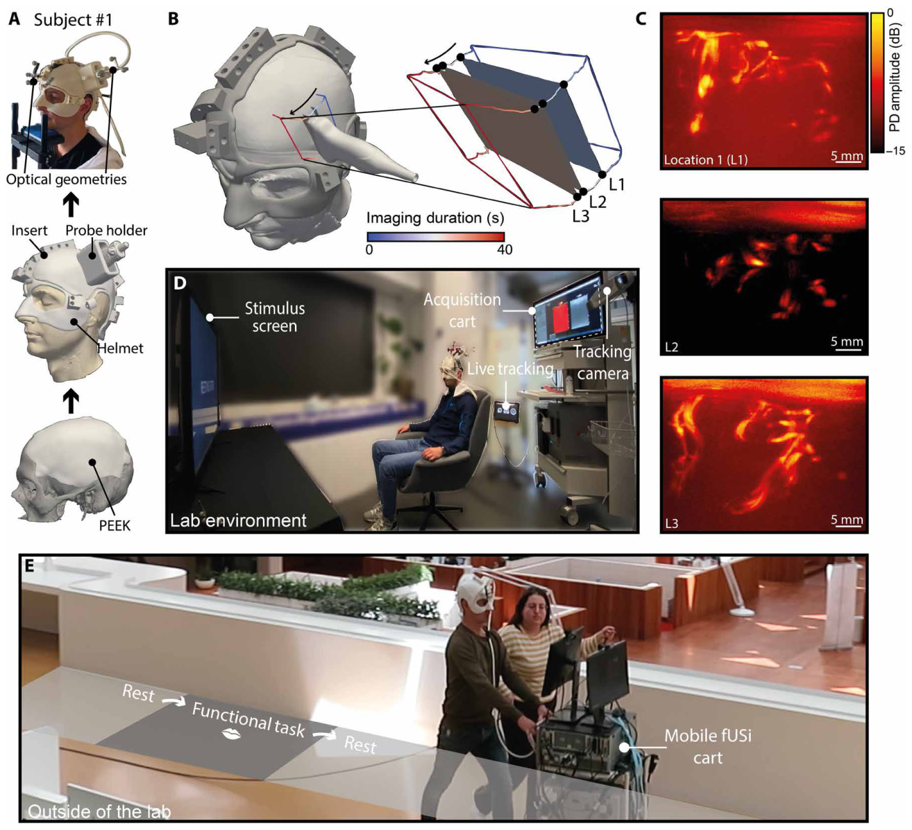
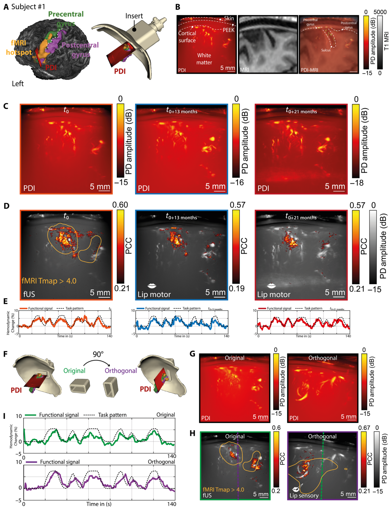
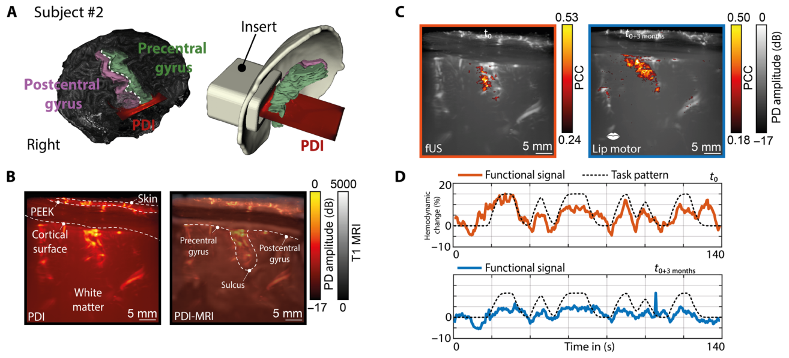
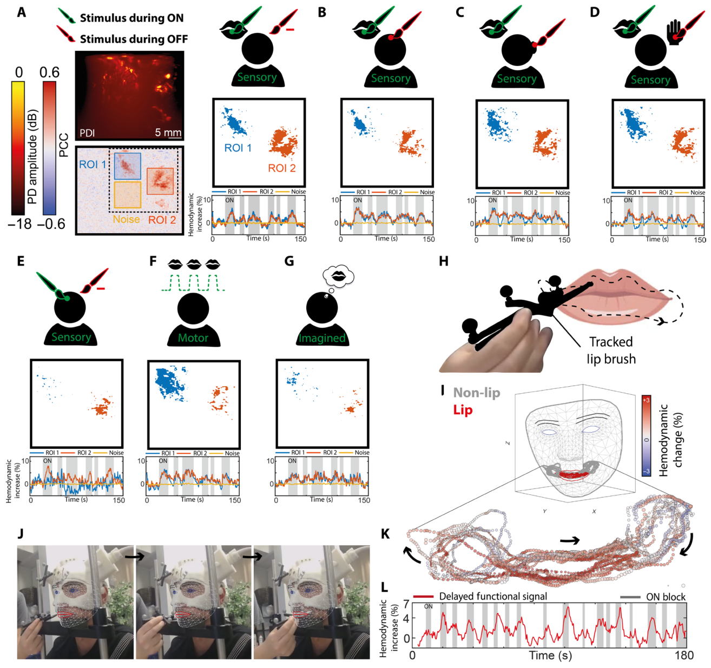
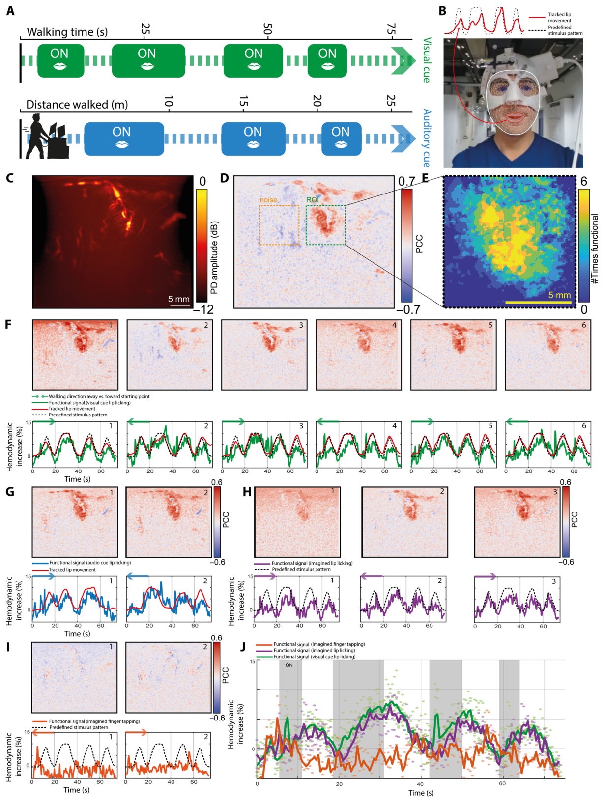

# 使用功能性超声的移动式人脑成像
[← 回到首页](..)

- **原题**：Mobile human brain imaging using functional ultrasound
- **著者**：Sadaf Soloukey1,2, Luuk Verhoef1, Frits Mastik1, Michael Brown1, Geert Springeling3, Bastian S. Generowicz1, Djaina D. Satoer2, Clemens M. F. Dirven2, Marion Smits4, Borbála Hunyadi5, Sebastiaan K. E. Koekkoek1,6, Arnaud J. P. E. Vincent2, Chris I. De Zeeuw1,7, Pieter Kruizinga1,2,5*　（* 通讯作者）
- **通讯作者**：p.kruizinga@erasmusmc.nl (P.K.)
- **期刊**：Science Advances 11(25), eadu9133 (2025)
- **DOI**：[10.1126/sciadv.adu9133](https://doi.org/10.1126/sciadv.adu9133)
- **日期**：投稿 2024-11-26 · 接收 2025-05-19 · 发表 2025-06-18
- **版权**：Copyright © 2025 The Authors, some rights reserved; exclusive licensee American Association for the Advancement of Science. No claim to original U.S. Government Works. Distributed under a Creative Commons Attribution License 4.0 (CC BY).
- **单位**：
  - 1 Department of Neuroscience, Erasmus MC, Wytemaweg 80, 3015 CN, Rotterdam, Netherlands（鹿特丹伊拉斯姆斯大学医学中心 神经科学系）
  - 2 Department of Neurosurgery, Erasmus MC, Wytemaweg 80, 3015 CN, Rotterdam, Netherlands（鹿特丹伊拉斯姆斯大学医学中心 神经外科）
  - 3 Department of Experimental Medical Instrumentation (EMI), Erasmus MC, Wytemaweg 80, 3015 CN, Rotterdam, Netherlands（鹿特丹伊拉斯姆斯大学医学中心 实验医学仪器系）
  - 4 Department of Radiology and Nuclear Medicine, Erasmus MC, Wytemaweg 80, 3015 CN, Rotterdam, Netherlands（鹿特丹伊拉斯姆斯大学医学中心 放射与核医学系）
  - 5 Signal Processing Systems, Delft University of Technology, Mekelweg 4, 2628 CD, Delft, Netherlands（代尔夫特理工大学 信号处理系统组）
  - 6 CCO of BlinkLab Ltd., 216 St. George, Perth, Australia（BlinkLab Ltd. 首席商务官）
  - 7 Netherlands Institute for Neuroscience, Royal Dutch Academy for Arts and Sciences, Meibergdreef 47, 1105 BA, Amsterdam, Netherlands（荷兰皇家艺术与科学院 荷兰神经科学研究所）

---

> **本系列**：六篇核心论文的完整译文，逐一独立成篇。另见 [清醒灵长类的 fUS 脑活动传播（Dizeux 2019）](fusi-primate-propagation) · [单试次运动意图解码（Norman 2021）](fusi-single-trial-decoding) · [首例闭环超声脑机接口（Griggs 2024）](fusi-closed-loop-bci) · [经颅窗人脑 fUS 成像（Rabut 2024）](fusi-human-cranial-window) · [LIP 扫视的介观组织（Griggs 2025）](fusi-mesoscopic-lip)

## 摘要

设想一下，能够在被试表现出运动、社交互动或空间导航等自然行为的真实世界场景中研究人脑。超快超声成像的出现，以功能性超声成像（functional ultrasound imaging，fUSi）这一可移动的神经成像技术，让我们离这一目标更近了一步。本文报告了对一名植入了经临床批准的声透明颅骨植入物的被试在步行期间脑活动的实时 fUSi 监测。我们的方法包括：为保证稳定性而定制的 3D 打印 fUSi 头盔；用于与功能磁共振成像进行跨模态验证的光学追踪；用于估计血流动力学响应的先进信号处理；以及对舔唇范式的面部追踪。这些手段相结合，使我们能够在 20 个月的时间跨度内展示出一致的 fUSi 信号，即使是在步行这类高运动量活动中也是如此。这些结果证明了 fUSi 在真实世界场景中监测脑活动的可行性，为基于 fUSi 的临床与神经科学研究洞见树立了一个重要里程碑。

## 引言

能够在被试表现出运动、社交互动或空间导航等自然行为的真实世界场景中研究人脑，对我们从临床与神经科学层面理解人脑活动可能具有巨大价值 [[1,2]](#ref-1)。遗憾的是，功能性脑成像技术存在技术上的取舍，而迄今为止，这些取舍使人们无法在这些生态化场景中对人脑活动进行高质量的成像。脑电图（electroencephalography，EEG）[[3]](#ref-3) 或功能近红外光谱（functional near-infrared spectroscopy，fNIRS）[[4,5]](#ref-4) 等无创、可穿戴技术确实允许被试活动，但无法对更深的脑结构进行高分辨率成像。弥散光学断层成像（diffuse optical tomography，DOT）[[5,6]](#ref-5) 等光学技术可实现大视场（field of view，FOV）的无创成像，但分辨率低、穿透深度有限。皮层脑电（electrocorticography）[[7]](#ref-7) 或颅内脑电（intracranial EEG）[[8]](#ref-8) 等侵入性技术可对脑进行高分辨率标绘，但需要在颅骨下植入器件，且植入物寿命有限。最后，脑磁图（magnetoencephalography，MEG）[[9]](#ref-9)，尤其是功能磁共振成像（functional magnetic resonance imaging，fMRI）[[10]](#ref-10) 这类无创、全脑技术，虽主导着当前的人体功能脑成像格局，却需要极其庞大昂贵的设备，并严重限制被试在成像期间的活动。许多功能范式，例如运动或言语，只能以“想象”的方式实施，即要求被试改为想象自己在执行该功能任务 [[11-13]](#ref-11)。

随着超快多普勒超声成像的出现，一种名为功能性超声成像（fUSi）的脑成像技术已在神经科学 [[14,15]](#ref-14) 与临床 [[16-18]](#ref-16) 应用中崭露头角。fUSi 利用非聚焦发射的高帧率采集方案来提升传统多普勒超声的灵敏度 [[14]](#ref-14)。这一灵敏度增益使得检测脑（微）血管中血流动力学的细微变化成为可能；经由神经血管耦合原理，这些变化可作为功能脑活动的替代指标 [[14,19,20]](#ref-14)。fUSi 的独特之处在于，它能够把高分辨率（空间分辨率约 200 μm）与深部（视场约 5 cm）的功能脑成像，同高度的便携性与灵活性结合起来 [[16,18]](#ref-16)。同时，fUSi 无需造影剂，并具备传统超声的全部其他已知优点：实时、无创、易用且相对经济。目前已有的脑成像技术中，没有任何一种能同时具备所有这些有益特性 [[15,17]](#ref-15)。

鉴于这些优势，fUSi 在不到十年间便从临床前研究走进了人体神经外科应用 [[16,18,21]](#ref-16)。在清醒开颅的肿瘤切除手术中，fUSi 已被成功用于在患者执行语言、运动与感觉任务时，以介观尺度标绘基于血流动力学的功能脑活动 [[16,18,22]](#ref-16)。迄今为止，神经外科场景对 fUSi 而言不仅是一个有趣的使用场景，更是一个必需的场景。鉴于超声信号经人颅骨的显著衰减与像差 [[23]](#ref-23)，开颅术是通向人脑的必要声学窗口，这使得 fUSi 至今仍无法在手术室外应用。因此，fUSi 被局限于清醒脑外科手术这一极为有限的情境中——那里时间有限，患者的活动也受到身体限制 [[17]](#ref-17)。

临床实践与科学文献表明，还有其他途径可在手术室外获得对脑的声学通路。骨孔或颅骨成形术的临床使用，也作为一种“副产品”提供了通向人脑的人工声学窗口 [[24]](#ref-24)。颅骨成形术在临床上用于一系列病因，即当颅骨缺损（skull bone defect，SBD）无法用患者自体颅骨骨瓣覆盖时，例如创伤性脑损伤后或颅内肿瘤术后的骨瓣感染 [[25]](#ref-25)。此时 SBD 可用钛网、聚甲基丙烯酸甲酯（polymethyl methacrylate，PMMA）或聚醚醚酮（polyetheretherketone，PEEK）等材料制成的、患者特异的人工植入物覆盖 [[26]](#ref-26)。后两种塑料远比人颅骨均质，且声学信号衰减小得多 [[27]](#ref-27)，因而具有声透明性。已有少数研究证明了 PMMA 与 PEEK 用于常规 B 型超声成像的潜力，例如在神经创伤患者的床旁脑室大小监测中 [[28-32]](#ref-28)。最近，Rabut 等 [[33]](#ref-33) 首次展示了经一枚定制的减薄 PMMA 窗在人体上实施 fUSi——该窗被植入一名创伤后 SBD 患者体内。作者展示了 fUSi 在涉及游戏与吉他弹奏的功能任务中，经 PMMA 标绘并解码任务调制皮层活动的可行性 [[33]](#ref-33)。

本文展示的是下一步：在人体被试的移动过程中成功使用 fUSi。我们展示了一枚常规的 PEEK 颅骨成形物如何提供足够的声学透射，从而对唇部感觉运动皮层实施细致的 fUSi，并在多次重复中、在接近 2 年的时间跨度内保持一致。我们首先介绍一种个性化的三维（three-dimensional，3D）打印 fUSi 头盔，用于把超声探头固定在被试头部，以确保步行任务期间探头的稳定性，并使同一切二维成像平面可在各次测量间重现。接着，我们搭建了一套对被试面部与超声探头进行光学追踪的流水线，由此实现了 fUSi 数据与计算机断层扫描（computed tomography，CT）/（功能）MRI 的配准，以及在功能任务期间对面部运动的追踪。功能任务聚焦于唇部的感觉运动激活，包括舔唇、噘嘴与唇部感觉刺激。我们在接近 2 年的时间跨度内实施了一整套内容广泛的测量，其中包含若干任务变体与功能对照。我们的工作显示，fUSi 信号在超过 20 个月的期间内可重复且一致，即使在高运动量场景（如本文所示的步行）中也能稳健采集到功能脑信号。这些结果证明了 fUSi 在生态化场景中监测人脑活动的可行性，并成为一个重要的里程碑，指向基于 fUSi 在临床与神经科学情境中发现人脑的奥秘。

> **【译者注】** 术语对照：本文贯穿三种唇部范式，须与主材料 §8.2.5 的范式行对齐——**lip licking**（舔唇，本文的核心范式，既是步行任务也是想象任务的载体）、**lip pouting**（噘嘴，运动任务）、**lip brushing**（刷唇，由研究者用毛刷施加的感觉任务）。三者不可互译：噘嘴与刷唇分别对应运动通路与感觉通路，而舔唇兼有执行与想象两种条件。

## 结果

### 被试招募

我们招募了两名 30 余岁、植入了 PEEK 颅骨成形物（Johnson & Johnson，DePuy Synthes）的男性被试参与本研究。被试 #1 在高速外伤后接受了左侧偏侧去骨瓣减压术并植入 PEEK，该外伤造成多处脑挫伤与术后神经功能缺损。最突出的是该被试的失语症，基于基线语言评估（数据 S1），其失语症被认为属重度。此外，尽管该被试保留了独立行走的能力，其右臂与右腿存在运动缺损，导致右侧跛行。被试 #2 在手术切除右侧岛叶区低级别星形细胞瘤后，于右侧额颞区植入了 PEEK 植入物。纳入时，该被试已多年无肿瘤进展。基线时未报告、也未能客观查出任何认知、运动或语言缺损。

实验在接近 2 年的时间跨度内进行。在此期间，被试 #1 共参与七次测量。被试 #2 在研究过程中因肿瘤再生而去世，共参与两次测量场次。本文展示这些测量的结果。不过，所呈现数据的主要部分——包括步行实验——仅涉及被试 #1。关于被试特征的更多细节见数据 S1。

> **【译者注】** 被试数澄清：源文明确为**两名**被试（`We recruited two male subjects`），摘要中作单数是因为步行数据集仅来自被试 #1（源文：`the main portion of the presented data, including the walking experiments, will involve subject #1 only`）。主材料 §8.2.5 的表同样记作“2 名 30 余岁男性”，§3.3.1 的证据分级表把本篇记为 **n = 2**。译文按源文保留两名被试，仅在步行与移动成像相关叙述中使用单数。

### fUSi 头盔设计

为使测量可在时间上重现，我们首先设计并测试了个性化的 3D 打印聚乳酸（polylactic acid，PLA）头盔（dddrop bv，CAD2M），用于把 fUSi 探头相对于每名被试的脑解剖加以固定。该头盔基于从 MRI 扫描中提取的被试头部轮廓，并包含光学追踪所需的两套光学几何标记（图 1A）。为确保功能任务期间探头的稳定性、并使同一切二维成像平面可在各次测量间重现，我们在功能任务的目标感兴趣区（region of interest，ROI）的基础上设计了探头插件（图 1A）。关于设计与 3D 打印个性化头盔及探头插件的流水线的更多细节，见数据 S2。

### 光学追踪与实验装置

我们使用一台光学追踪相机（Polaris Vega，Northern Digital Inc.，加拿大）配合自研软件（数据 S3），连续追踪超声探头（GEL9-D，General Electric，美国）与头盔的位置和朝向。追踪数据也被保存以供后续使用，从而支持对超声路径的离线重建，如图 1B 与影片 S1 所示。这些重建使我们能够在例如探头在被试头部上方做线性平移的过程中（图 1B），确定每一个所采集的功率多普勒图像（power Doppler image，PDI）所对应的超声探头相对于被试解剖的位置。

fUSi 采集最初在我们专用于人体成像的实验室环境中进行（图 1C）。我们的目标是营造一个生态化的环境，使被试可以在被超声探头线缆束缚这一限制之内自由活动。一旦信号与头盔被证明足够稳健，我们便数次走出实验室，使用我们实验研究系统的移动推车版本，在移动过程中进行实验采集（图 1D）。在采集期间，我们同步采集并存储了若干数据流，如数据 S4 所示。这些数据流包括被试面部的视频记录，其运动被追踪用于功能分析。

> **【译者注】** 图 1 面板编号存疑：正文此处（以及材料与方法“实验环境”一节同样两处）称实验室环境为 “Fig. 1C”、称移至室外为 “Fig. 1D”；但图 1 的图注中 (C) 是三个展示位置（L1~L3）的功率多普勒图像、(D) 才是实验室环境中的装置总览、(E) 是室外使用移动推车的采集示例。按图注，正文这两处应分别指 (D) 与 (E)——正文此后的 “(Fig. 1E)” 与图注 (E) 一致，可佐证错位仅发生在这两处。译文按原文照译角标，未擅自改动。

> **图 1**. 我们实验装置的关键组成部分。(A) 为使 fUSi 在整个实验过程中保持稳定且可重复，我们依据被试的 MRI 设计了一顶定制的 3D 打印头盔。该头盔包含一个探头插件，使我们能够随时间推移重访同一切二维平面；插件被定位在用于功能任务的脑感兴趣区之上。头盔与探头上都安装了光学几何标记，用于监测二者的相对位置，从而支持 fUSi-MRI 配准以及超声路径的离线三维重建。(B) 使用我们的离线光学追踪数据重建出的超声路径示例。在此例中，探头通过一次线性平移在被试头部上方移动（见箭头方向）。该路径内标出了三个在血管形态方面值得关注的位置（L1 至 L3），作为展示示例。(C) 三个展示位置（L1 至 L3，如 (B) 中所标）所见有趣脑血管的功率多普勒图像（PDI）。该路径内所采集血管图像的完整概览见影片 S1。(D) 我们实验室环境中实验装置的总览。被试坐在显示刺激的屏幕前方。图中还显示了相关设备，包括我们的追踪相机、定制的 fUSi 采集推车，以及基于光学追踪的实时追踪工具。(E) 在实验室环境之外使用我们的移动式 fUSi 推车进行实验采集的示例。推车由被试本人在执行任务时推动。发表这些图像已获被试许可。

| 图内标签 | 中文 |
| --- | --- |
| L1 / L2 / L3 | 三个展示位置（L1~L3） |
| Ultrasound path | 超声路径 |
| Custom 3D-printed helmet | 定制 3D 打印头盔 |
| Optical tracking geometry | 光学追踪几何标记 |
| Power Doppler image (PDI) | 功率多普勒图像（PDI） |
| Mobile fUSi cart | 移动式 fUSi 推车 |

### 探头解剖定位的验证

在两名被试中，我们设计的插件都把探头与 fUSi 平面直接置于左侧（被试 #1）（图 2A）与右侧（被试 #2）（图 3A）半球的中央前回与中央后回之上。中央前回与中央后回分别对应初级运动皮层与初级感觉皮层；我们在规划插件时特意使其覆盖矮人图（homunculus）的下部（该区域传统上参与口、唇与舌的感觉运动控制）[[34]](#ref-34)。文献中有多项研究证明了唇部感觉运动激活的躯体定位 [[34,35]](#ref-34)，尽管对于上唇与下唇、或唇的右侧与左侧是否存在躯体定位，尚无有力证据，且常见双侧半球的异质激活 [[36-42]](#ref-36)。这一感觉运动区之所以特别受关注，是因为两名被试体内 PEEK 的解剖位置使我们能够轻松触及该区。此外，我们希望用 fUSi 执行一项与 fMRI 中类似的任务以进行验证，而口部感觉运动皮层似乎对此特别有用。最后，我们此前在清醒神经外科手术情境中的 fUSi 工作涉及大量噘嘴或舔唇任务的重复，这确保了我们对 fUSi 情境下该功能范式的熟悉 [[18,22]](#ref-18)。fUSi 探头的正确位置通过我们的光学追踪系统实时核验（数据 S4）。PDI 与对应 MRI 层面的配准，依据沿脑回与脑沟走行的血管形态确认了定位的正确性（图 2B 与图 3B）。

PEEK 的声学性质与脑组织截然不同，这会使我们的超声信号经 PEEK 材料发生畸变。在数据 S5 中，我们研究了这些畸变的性质，并给出了一种快速修正方案与一种精确的算法解，用于经 PEEK 获得无畸变的超声图像，以便与其他模态（在我们的情形中是 fMRI）匹配。在本研究余下部分——即只研究 fUSi 数据、不与其他模态对照的部分——我们使用了该快速修正方案，其做法是用更高的全局声速进行图像重建，以补偿 PEEK 相对于脑组织更高的声速。该快速修正方案所允许观察到的分辨率与血管细节与像差校正方法相当（对比见数据 S5），但计算时间要短得多，因而支持实验期间的实时反馈与结果的快速后处理。

> **图 2**. 被试 #1 唇部感觉运动信号的功能定位及其随时间推移的可重复性。(A) ROI 规划在口部感觉运动皮层周围，与同一被试此前一次噘嘴任务中发现的 fMRI 热点重叠。(B) PDI 定位的准确性可由其与 MRI 中脑回、脑沟轮廓的重叠得到确认。(C) 在被试 #1 中，我们能够在三个时间点（t0、t0+13 个月与 t0+21 个月）重访同一切 PDI 平面，证明了该个性化头盔与插件组合随时间推移的可靠性。(D) 在这同样的三个时间点上，我们也能一致地标绘出运动性噘嘴任务期间的功能脑活动，证明了 fUSi 信号的稳健性与可重复性。第一个面板还展示了 fUSi 所发现的功能区域如何与一次类似噘嘴任务中发现的 fMRI 热点重叠（橙色轮廓）。各时间点所示色标的范围分别基于各数据集中的最小与最大 PCC 值。(E) 与 (C)、(D) 中每个时间点对应的功能信号。(F) 为进一步研究信号的稳健性，我们设计了一个新的正交插件，把探头相对于原 ROI 旋转 90° 放置，用于一项唇部感觉任务。(G) 原插件与正交插件的 PDI 平面。(H) 原插件与正交插件的功能图，橙色轮廓显示与 fMRI 热点的相对重叠［另见 (A)］。绿色与紫色虚线表示原 PDI 与正交 PDI 之间的交切面。(I) 与 (H) 中功能图对应的功能信号。

| 图内标签 | 中文 |
| --- | --- |
| ROI | 感兴趣区 |
| Precentral gyrus | 中央前回 |
| Postcentral gyrus | 中央后回 |
| t0 / t0+13 months / t0+21 months | 时间点 t0 / t0+13 个月 / t0+21 个月 |
| fMRI hotspot (orange contour) | fMRI 热点（橙色轮廓） |
| Intersectional plane between original and orthogonal PDI (green and purple dotted lines) | 原 PDI 与正交 PDI 的交切面（绿色与紫色虚线） |
| Original insert / Orthogonal insert | 原插件 / 正交插件 |

> **图 3**. 被试 #2 唇部感觉运动信号的功能定位及其随时间推移的可重复性。(A) ROI 规划在口部感觉运动皮层周围。(B) PDI 定位的准确性既可从解剖上确认，也可由与 MRI 中脑回、脑沟轮廓的重叠得到确认。(C) 在被试 #2 中，我们能够在两个时间点（t0 与 t0+3 个月）重访同一切 PDI 平面，证明了该个性化头盔与插件组合随时间推移的可靠性。在这同样的两个时间点上，我们也能一致地标绘出运动性噘嘴任务期间的功能脑活动。(D) 与 (C) 中每个时间点（t0 与 t0+3 个月）对应的功能信号。

| 图内标签 | 中文 |
| --- | --- |
| ROI | 感兴趣区 |
| Precentral gyrus | 中央前回 |
| Postcentral gyrus | 中央后回 |
| t0 / t0+3 months | 时间点 t0 / t0+3 个月 |
| Gyri and sulci contour | 脑回与脑沟轮廓 |

### 用 fMRI 验证探头的功能定位

使用 fUSi 进行功能标绘，是通过采集一系列连续的 PDI 来测量脑血流动力学的变化而实现的。这些图像之间的时空变化经由神经血管耦合过程，作为神经活动的替代指标 [[14,19,20]](#ref-14)。在近期所展示的这些实验中，PDI 的成像帧率为 4 Hz。

在扩展实验之前，我们希望先确认 fUSi 图像中存在功能活动。因此，我们在两名被试中实施了一项简单的 ON-OFF 噘嘴（运动）与刷唇（感觉）任务（图 2 的 C~E、图 3 的 C 与 D），以生成描绘功能像素的 fUSi 图［功能像素定义为皮尔逊相关系数（Pearson correlation coefficient，PCC）值 > 噪音区内体素平均 PCC 值的 3 倍标准差（SD）的像素］。为进行 PCC 分析，刺激模式首先与一个估计的血流动力学响应函数（hemodynamic response function，HRF）卷积 [[43-47]](#ref-43)。据我们所知，目前尚无关于人体 fUSi 的 HRF 的数据。因此，我们用四个训练数据集自行估计了一个 HRF，这些数据集是被试在步行时执行舔唇任务所采集的（在此处所示实验的 1 周前获得）。该 HRF 通过最小化实测 fUSi 信号与经 HRF 核卷积后的任务时间过程之间的误差得到。HRF 核本身被建模为基函数的加权和。该过程的细节见数据 S6。

我们能够证明，基于 fUSi 的功能区域与配准后的 fMRI 热点存在重叠——该 fMRI 热点来自此前在 fMRI 中执行的噘嘴任务（图 2 的 A 与 D）。我们团队此前的工作显示，在清醒神经外科手术期间成像的被试中，fUSi 与 fMRI 区域之间也存在类似的一致性重叠 [[22]](#ref-22)。关于用于 fUSi 与 fMRI 的功能任务的更多细节见数据 S7。

鉴于我们单个二维平面的视场有限，我们选择通过为被试 #1 设计一个新的插件来进一步确认功能热点的稳健性——该插件把探头相对于原 ROI 旋转 90° 放置，位置依据我们的光学追踪数据确定。正交放置的 PDI 同样与 fMRI 热点相交，并再次确认了在一项感觉性刷唇任务中存在功能区域（图 2 的 F 与 G）。

### fUSi 信号随时间推移的可重复性与一致性

在被试 #1 与被试 #2 中，我们都能在直至 21 个月的期间内可重复地标绘感觉（刷唇）任务与运动（噘嘴）任务的功能脑活动（图 2 的 C~E、图 3 的 C 与 D）。这表明，借助我们的头盔与插件组合，fUSi 信号可以在更长的时间尺度上可重复且一致地采集。对于被试 #1，在 t0+21 个月时观察到血管细节略有改善（图 2C），这是由于超声探头与皮肤之间的声耦合得到改善。在全部测量中，我们都使用超声凝胶（AquaSonic）来改善声耦合；不过，诸如头发长度等因素会对声耦合质量随时间的变化产生轻微影响（另见材料与方法）。

### fUSi 信号的功能特异性

在运动任务（噘嘴；图 2 的 B~E）中标定出的功能区域主要定位于中央前回，符合预期。然而，在被试 #1 中实施的感觉任务（图 2 的 G 与 H，左）则同时定位于中央前回与中央后回，提示感觉与运动皮层可能都参与其中。尽管这可能引出“基于血流动力学的 fUSi 标绘在空间上究竟有多大的选择性”这一问题，但应当注意，初级感觉皮层显著地投射到运动皮层，在电刺激下常引起共激活 [[48-51]](#ref-48)。

为进一步研究 fUSi 功能信号的特异性，我们在被试 #1 中引入了若干任务变体，如图 4 所示。一项经典的 ON（刷唇）-OFF（静息）感觉性唇部任务引出了可重复的功能 fUSi 图，其中包含两个截然不同的功能区域（ROI 1 与 ROI 2；图 4A），这与图 2 中所见一致。将 ON 任务分别与不同的 OFF 任务交替——例如刷额头（图 4B）、刷右耳（图 4C）或刷手（图 4D）——并未明显改变功能图。

> **图 4**. 展示被试 #1 中 fUSi 信号的功能特异性。(A) 唇部感觉任务的一系列任务变体。ON（刷唇）-OFF（静息）的感觉性唇部任务引出可重复的功能 fUSi 图，其中包含两个截然不同的功能区域［ROI 1（中央前回）与 ROI 2（中央后回）］。用于功能阈值化的相邻噪音区以黄色标出。阈值化后的功能图（PCC > 噪音信号的 3 倍 SD）凸显出两个截然不同的功能区域。(B) 让 ON 条件（刷唇）与刷额头的 OFF 任务交替，得到类似的功能图。(C) 让 ON 条件（刷唇）与刷右耳的 OFF 任务交替，得到类似的功能图。(D) 让 ON 条件（刷唇）与刷手的 OFF 任务交替，得到类似的功能图。(E) 仅刷额头（ON），OFF 时段为静息条件，导致的功能激活远少得多，且仅存在于 ROI 2。(F) 一项运动任务（噘嘴）确实给出了功能活动，但空间模式不同，更突出地定位于中央前回（ROI 1）。(G) (A) 中任务的想象版本得到的功能图与 (A) 至 (D) 中所见类似，尽管不那么显著。(H) 接着，我们实施了一项连续刷唇任务，使用光学追踪来确定毛刷位置。(I) 我们使用 Google 的 MediaPipe 库 [[52]](#ref-52)，把刷唇轨迹投影到被试面部解剖的网格表示上。(J) 三个毛刷位置不同的示例时间点。(K) 把我们 ROI 内平均血流动力学百分比变化标绘为毛刷位置的函数，显示只有当唇部本身被刷到时血流动力学信号才会特异性地升高。(L) 当毛刷位于唇部区域（定义为“ON 区块”）时，在 ROI 中发现的延迟功能信号。

| 图内标签 | 中文 |
| --- | --- |
| ROI 1 (precentral gyrus) | ROI 1（中央前回） |
| ROI 2 (postcentral gyrus) | ROI 2（中央后回） |
| Noise region (yellow) | 噪音区（黄色） |
| ON / OFF | ON（刺激）/ OFF（静息） |
| PCC > 3× SD of noise signal | PCC > 噪音信号的 3 倍 SD |
| Brush trace | 毛刷轨迹 |
| ON blocks | ON 区块 |
| Delayed functional signal | 延迟功能信号 |

作为对照，我们只实施了刷额头任务、不涉及唇部（图 4E），此时几乎观察不到激活，仅在 ROI 2 中存在少量功能像素。这些发现提示，我们所成像的感觉运动皮层区域似乎是唇特异的，不涉及感觉运动矮人图上相邻区域的功能活动。

一段与上述相同任务模式的运动任务（噘嘴），如图 3A 所示，确实在我们的 ROI 同一区域内给出了功能活动，但空间模式不同（图 3F），更多地涉及中央前回，符合预期。要求被试在 ON 时段想象噘嘴——类似于 fMRI 研究中所做的想象任务变体（图 3G）[[11-13]](#ref-11)——得到了与图 3 的 A~D 类似的功能图，尽管不那么显著。关于这些功能任务确切规格的细节见数据 S7。

> **【译者注】** 图号存疑：本段连续三处写作 “Fig. 3A”“Fig. 3F”“Fig. 3G”与“Fig. 3 (A to D)”，但其描述与图 4 的图注逐字对应——图 4(F) 为“噘嘴……空间模式不同，更突出地定位于中央前回（ROI 1）”，图 4(G) 为“想象的版本……得到了类似的功能图……尽管不那么显著”。而图 3 整图（A~D）是被试 #2 的结果，与此处讨论被试 #1 功能特异性的段落不符。译文按原文照译，未擅自改动图号。

### 连续任务中的功能信号标绘

一旦功能信号的特异性得到确认，我们便着手实施一项没有可预测 ON-OFF 模式的功能任务，以进一步研究功能信号的稳健性。该任务由一名研究者（S.S.）连续刷唇（图 4H）。被追踪的毛刷以不可预测的模式在上唇、下唇以及面部相邻部位连续移动数分钟。利用对头盔以及毛刷本身的光学追踪，我们可以在实验的每个时间点准确确定毛刷相对于被试面部解剖的位置。随后，我们使用 Google 的 MediaPipe 库 [[52]](#ref-52)，从实验期间拍摄的面部视频文件中提取 FaceMesh、Blendshape 系数与旋转矩阵（Rotationmatrix）等面部参数（对此的更多说明见材料与方法）。据此，我们得以把毛刷轨迹投影到被试面部的网格模型上，从而分辨出毛刷触及唇部与触及相邻面颊的时间点（图 4I）。把我们的 ROI 内平均血流动力学百分比变化标绘为毛刷位置的函数，显示只有当唇部本身被刷到时、而非刷到周围面部时，血流动力学信号才会特异性地升高（图 4 的 J 与 K），这再次印证了该信号的特异性。

### 使用移动推车以支持步行的 fUSi

在坐姿下用头盔对 fUSi 信号进行了广泛研究之后，我们进而搭建了一套步行期间的实验装置。超声采集系统可由被试 #1 自己推动，同时他仍通过超声探头与采集系统相连（图 1E）。推车上装有两块独立的屏幕，分别显示功能任务视频与采集期间的实时 PDI。我们使用一根长 100 m 的延长线以支持大范围的活动。关于采集系统的更多细节见材料与方法。

在每次持续一分多钟的记录中，被试（图 5A）被要求一边推动移动式 fUSi 推车、一边观看屏幕上显示的功能任务视频，沿一条最长为 30 m 的连续直线行走。被试在这条连续直线上往返行走（既远离出发点、也朝向出发点），以避免连续记录迭代之间出现不必要的延误。一台摄像机连续记录被试的面部，以便事后对面部、尤其是唇部运动进行功能分析（图 5B）。被试首先被要求在步行时执行一项简单的 ON-OFF 舔唇任务，其提示既来自视频形式的视觉 ON-OFF 线索，也来自听觉 ON-OFF 线索——后者由实验者根据地面上的某些地标口头给出（图 5A）。所用功能任务的更多细节见数据 S7 与影片 S2。

### 步行期间可重复且一致的 fUSi 信号

我们能够在移动过程中采集舔唇功能信号的同时，生成高质量的 PDI（图 5C）与功能图（图 5 的 D 与 E）。这些功能图在多次迭代中一致且可重复，无论使用视觉线索（图 5F）还是听觉线索（图 5G）都是如此。在 PDI 数据栈的预处理过程中几乎不需要运动校正，表明图像采集期间具有很高的平面内稳定性（数据 S8）。当要求被试一边观看功能视频一边想象舔唇、而不实际执行任务时，也能采集到类似的信号（图 5H）。以想象手指敲击作为对照任务，则未导致任何功能激活，再次确认了信号对想象舔唇的特异性（图 5I）。图 5J 的总结性散点图展示了步行期间采集到的唇部相关功能信号的特异性。影片 S2 展示了如图 5F 所示舔唇任务的示例功能记录。

> **图 5**. 步行期间采集的 fUSi 信号。(A) 实验条件总览：ON 区块（舔唇、手指敲击或想象舔唇）的提示要么是视觉提示（屏幕上播放视频），要么是听觉提示（根据地面上的地标口头给出 ON-OFF）。(B) 从被试步行期间拍摄的视频中截取的示例画面，用于借助 Google 的 MediaPipe 库 [[52]](#ref-52) 分析面部运动。红色轨迹为被追踪唇部运动的一个示例。(C) 步行期间采集的平均 PDI 示例。(D) 视觉舔唇任务［见 (A)］期间采集的 fUSi 图示例，ROI 以绿色标出。用于功能阈值化的相邻噪音区以黄色标出。(E) 共实施了六次如 (D) 所示任务的迭代。这里我们总结六次迭代中 ROI 内功能像素（> 噪音信号的 3 倍 SD）的出现情况。汇总值更高的像素出现在更多次任务迭代中，凸显了其功能参与的稳健性。(F) 与 (D) 所示相同功能任务（基于视觉的舔唇）的六次示例迭代，展示了移动过程中所捕捉功能信号的可重复性与稳健性。(G) 基于听觉的舔唇任务的示例曲线。(H) 想象舔唇任务三次迭代的功能图与信号，其激活与 (E) 中类似，尽管信号幅度略不那么显著。(I) 作为对照条件，想象手指敲击未引出任何功能信号。(J) 总结性散点图，展示舔唇任务（绿色）、想象舔唇任务（紫色）与想象手指敲击任务（橙色）中的功能信号。

| 图内标签 | 中文 |
| --- | --- |
| ON / OFF | ON（刺激）/ OFF（静息） |
| ROI (green) | 感兴趣区（绿色） |
| Noise region (yellow) | 噪音区（黄色） |
| Tracked lip movement (red trace) | 被追踪的唇部运动（红色轨迹） |
| Lip licking / Imagined lip licking / Imagined finger tapping | 舔唇 / 想象舔唇 / 想象手指敲击 |
| >3× SD of the noise signal | > 噪音信号的 3 倍 SD |
| Averaged PDI | 平均 PDI |

## 讨论

本文证明了在步行期间对人脑活动进行稳健且可重复的 fUSi。使用常规超声探头与 3D 打印的个性化头盔，我们能够在两名被试中一致地重访相同的 ROI，尽管重复的二维成像会带来种种挑战。我们能够证明口部感觉运动皮层在运动与感觉任务中均被激活，并通过与相应 fMRI 热点的共定位加以确认。功能图及其背后的功能信号在长达 21 个月的期间内可重复。我们实施了感觉性唇部任务的多种变体，确认了该功能区对唇部的特异响应。我们还能够在受控实验室环境之外采集到稳健且可重复的功能数据——采集期间我们的被试正在行走，且未遇到与运动相关的问题。

与我们团队所习惯的神经外科场景相比，能够接触到可被束缚但自由活动、并可在多个场次中被成像的被试，是一个颠覆性的变化。本文展示的许多对照或重复测量，在术中情境下由于时间有限以及清醒被试的体力所限，根本不可能完成。然而，从技术开发与验证的角度看，重复恰恰是关键。我们的每一次功能测量都产生了一致的结果，即使测量场次之间相隔数月，也证明了结果的稳健性。

我们实验中的一个显著观察是：如 fUSi 所成像的那样，唇部相关的感觉运动皮层激活在主动与想象两种条件下都表现出明显的特异性。尽管文献告诉我们，有理由预期我们的血流动力学技术能够在空间上区分感觉运动矮人图中彼此靠近的躯体代表区 [[37,53]](#ref-37)，我们最初的 fUSi 观察仍激发了进一步研究。例如，进一步厘清本文所展示的想象功能任务条件将很有意义。尽管 fMRI 文献高度依赖运动想象范式来研究感觉运动脑活动 [[11-13,54]](#ref-11)，我们的想象图与实际运动范式的图如此相似仍值得注意，尤其是在图 5 的 F 与 H 中。一种解释可能是被试对任务的误解：尽管我们在想象条件的视频记录中未观察到舌或唇有任何可检出的运动，被试仍可能在口腔内、闭着嘴执行了该任务的一个类似版本。

同样地，感觉任务中相当于中央前回区域的持续共激活（如图 2 与图 3 所示），以及仅对额头施加感觉刺激时仍然存在的功能区（如图 4E 所示），都值得进一步研究。与 Penfield 和 Boldrey 在 1930 年代用电刺激绘制出的第一个矮人图相似 [[34]](#ref-34)，明确我们在用 fUSi 这一基于血流动力学的信号对人皮层成像时究竟能达到多大的空间选择性，将很有意义。考虑到诸如面向脑机接口的 fUSi 引导脑信号解码这类未来目标，这些观察可能极具启发性。在非人灵长类中基于 fUSi 解码运动意图的首批例证看来颇具前景 [[55,56]](#ref-55)。

在上述任何目标真正实现之前，我们需要走出空间上受限且对平面外运动敏感的二维情境，转向使用实时三维探头。为克服本研究中二维成像的挑战，我们把自制的 3D 打印头盔用作：(i) 探头相对于被试神经解剖位置的参照；(ii) 任务期间在物理上把探头稳定在 ROI 之上的支架；(iii) 在多次成像场次中重访完全同一切二维平面的手段。尽管当前的头盔已经实现了这三项功能，具备三维 fUSi 能力的探头很可能进一步改善对运动、平面外运动和/或多次成像场次间不一致所导致伪影的校正。此外，三维 fUSi 将使我们能够对人脑进行更具动态性的移动标绘，从而开启诸如在移动过程中对感觉运动皮层进行动态解码之类的可能性——这对于在肿瘤或神经创伤患者的康复计划中监测并主动引导功能可塑性可能极具价值。然而，要实现这一应用，克服对海量三维 fUSi 数据进行实时处理的挑战将尤为关键。

最终，我们的抱负是不仅经 PEEK 这类颅骨成形物成像，而是以本文所展示的同等甚至更好的成像质量经颅成像。目前无法做到这一点，是基于超声的人体技术的主要局限之一。尽管文献表明该局限可以通过使用造影剂并实施所谓的经颅超声定位显微成像（ultrasound localization microscopy，ULM）来克服 [[57,58]](#ref-57)，但在功能成像场景中 ULM 仍不具优势，因为需要静脉注射微泡，且数据采集的时间窗口很长。

尽管如此，我们的工作确认了未经改装的临床级颅骨成形物与 fUSi 实验的兼容性。PEEK 的吸引力之一，除了其声透明性之外，还在于它在临床上已被广泛使用——这可能使颅骨成形术成为一项新的临床标准诊疗手段，例如用于术后监测目的。以创伤性脑损伤为例，对脑的持续声学通路可以为重症监护病房（intensive care unit，ICU）中昏迷患者的功能连接监测增加一种成像模态，从而有助于预测功能结局并据此做出治疗决策。目前，ICU 中用于这些目的的只有昂贵且在流程上难以实施的 fMRI 扫描或 EEG 测量 [[59,60]](#ref-59)。

除了功能成像之外，我们使用市售超声设备经 PEEK 获得的解剖图像（见数据 S9）还可能为肿瘤（再）生长的术后监测开辟一条新途径，而无需依赖定期、昂贵的 MRI 扫描——这一方向迄今为止在临床情境中似乎基本未被发掘 [[29]](#ref-29)。

本文紧随 Rabut 等 [[33]](#ref-33) 发表于 Science Translational Medicine 的研究之后不久 [[33]](#ref-33)——该研究是在同一时期开展的。在他们题为 “Functional ultrasound imaging of human brain activity through an acoustically transparent cranial window” 的论文中，作者展示了他们为一名创伤后偏侧颅骨切除的被试开发并植入一枚减薄的实验性 PMMA 颅骨成形物。作者展示了他们在游戏与吉他扫弦任务中捕捉功能活动的能力。我们的研究与之不同之处在于，我们展示了人体移动式 fUSi：我们能够捕捉行走中的人脑功能活动。此外，我们更长的测量时间跨度使我们得以对 fUSi 信号的功能效度进行深入分析，并纳入了大量数据集重复与功能任务验证，以确保信号的稳健性、可靠性与可重复性。我们多年来设计的各种任务变体，使我们能够自信地把功能信号与口部感觉运动控制相关的有意义脑活动联系起来。Rabut 等的研究 [[33]](#ref-33) 与本文的迅速接续传递出一个明确而统一的讯息：经已有可用的临床级颅骨成形物使用 fUSi，为通达人脑功能提供了独特途径。

在此，我们证明 fUSi 使我们能够在植有声透明 PEEK 颅骨成形物的被试行走期间、在数厘米的深度上，以稳健且可重复的方式标绘人脑功能。这些观察进一步推动本领域把 fUSi 视为不仅是一种术中工具，而是推动发展移动式人体 fUSi，作为在临床与神经科学情境中解开人脑奥秘的新手段。

## 材料与方法

### 被试招募

从鹿特丹 Erasmus MC 神经外科招募了两名植有 PEEK 颅骨成形物的被试。纳入前，按《国家医学伦理条例》（MEC-2019-0689 与 MEC-2022-0087，NL80307.078.22）取得书面知情同意。

### 基线语言与认知评估

为确定两名被试的基线语言与认知能力，由受过训练的临床语言学家（D.D.S.）实施了一套标准临床测验组合，其中包含 DIMA 与 DuLIP（Diagnostic Instrument for Mild Aphasia，轻度失语诊断工具；Dutch Linguistic Intraoperative Protocol，荷兰语术中语言方案）等语言测验，以及连线测验（Trail Making test）等认知测验（数据 S1）。

### 3D 打印个性化头盔

我们设计了一顶个性化的 3D 打印 PLA 头盔，用于把 fUSi 探头相对于被试的脑解剖加以固定。该头盔基于从 MRI 扫描中提取的被试头部轮廓，并包含光学追踪（Northern Digital Inc.，加拿大）所需的两套光学几何标记。关于生产流水线的分步说明见数据 S2。

### PEEK 颅骨成形术

被试 #1 的 PEEK 颅骨成形物是定制设计的，用于覆盖左侧偏侧颅骨切除区，由制造商（Johnson & Johnson，DePuy Synthes）依据 CT 扫描、按照该被试对侧未受损颅骨建模。尺寸为 130 mm × 162 mm × 44 mm，植入物厚度均匀一致，为 4 mm。关于该植入物的更多细节见数据 S1。

### 光学追踪与超声路径重建

我们使用 NDI（Northern Digital Incorporated）Polaris Vega 光学追踪系统（序列号 P9-04539，Northern Digital Inc.，加拿大）连续追踪 fUSi 探头与头盔的位置和朝向；该系统被配置为追踪附着在 fUSi 探头与头盔上的红外反射参考几何标记。我们设计了自研软件来记录追踪信息，其具有六个自由度，平均速率 20 Hz。

为了能在实验期间实时可视化 fUSi 探头相对于被试脑的位置，我们把追踪信息与使用可视化工具包（Visualization Toolkit）[[61]](#ref-61) 的自研软件结合使用。追踪数据也被保存以供后续使用，从而支持对超声路径的离线三维重建，如图 1B 所示。关于我们光学追踪流水线的更多细节见数据 S3。

### 实验环境

fUSi 采集大多在我们专用于人体成像的实验室环境中进行（图 1C）。我们的目标是营造一个生态化的环境，使被试可以在被超声探头线缆束缚这一限制之内自由活动。有若干次，我们把移动式实验研究系统移到外部地点（我们实验楼的门厅），在移动过程中进行实验采集（图 1D）。在采集期间，我们同步采集并存储了若干数据流（超声、光学追踪与视频），如数据 S4 所示。

### fUSi 采集

fUSi 采集使用一套实验研究系统（Vantage-256，Verasonics），搭配 9L-D 线阵换能器（GE Healthcare；5.3 MHz）。对于所有扫描，我们采用连续倾斜平面波采集（在 −12° 与 12° 之间等间距取 10 个角度），脉冲重复频率（pulse repetition frequency，PRF）为 800 Hz。用于计算单幅 PDI 的平均集合长度（ensemble size，即帧数）设为 200 帧，据此计算实时 PDI，提供约 4 Hz 的实时多普勒帧率（frame rate，FR）。PDI 以及经角度复合的原始波束合成帧被存储到一块高速 PCIe SSD 硬盘上，以供离线处理。

### fUSi 移动推车

为便于在步行期间测量，我们把 Vantage-256 与分析用 PC 装载到一辆小推车上，由被试本人推动。电力通过一根 100 m 长的延长线与一台安全隔离变压器提供。推车上装有两块屏幕，一块朝向被试显示功能视频，另一块朝向实验团队显示采集期间的实时 PDI。移动推车配备了若干摄像机，其画面通过 OBS Studio 录屏软件（OBS Studio Contributors）与 PDI 数据同步采集（见数据 S4）。

### （功能）MRI 采集

每名被试在 fUS 采集前接受一次最长 60 min 的 fMRI 扫描。MRI 在 3.0 T 下使用八通道头部线圈（Discovery MR750，GE Healthcare，美国威斯康星州密尔沃基）进行。全脑功能 MR 图像使用对血氧水平依赖对比敏感的单次激发 T2* 加权回波平面成像（echo planar imaging，EPI）序列获取，参数如下：重复时间（repetition time，TR）= 3000 ms，回波时间（echo time，TE）= 30 ms，翻转角 = 90°，采集矩阵 = 96 × 64，FOV = 240 mm × 180 mm。我们采集了 54 层，层厚 2.2 mm，层间距 0.3 mm。此外还执行了一次时间分辨率更高的扫描，TR = 1500 ms，27 层，覆盖 SBD 下方的脑实质。所有功能数据采集开始时都先做五次预备扫描（dummy scans），并从后续分析中剔除。被试在 MRI 扫描前与一名研究者一起接受指导并练习 fMRI 任务。扫描期间，刺激在扫描仪外通过一块与 MR 兼容的显示器视觉呈现，该显示器可经安装在头部线圈上的镜子看到。此外，我们采集了高分辨率三维 T1 加权反转恢复快速梯度回波（inversion recovery fast spin gradient recalled echo，IR FSPGR）结构 MRI，在轴位平面上采集，参数如下：TR = 7.93 ms，TE = 3.07 ms，反转时间 = 450 ms，翻转角 = 12°，采集矩阵 = 240 × 240，FOV = 240 mm × 240 mm。共采集 176 层连续层面，层厚 1 mm。

### 功能范式

基于两名被试体内 PEEK 的解剖定位，以及为验证目的而在 fMRI 中执行类似任务的愿望，我们选择聚焦于口部感觉运动皮层，使用运动（噘嘴）与感觉（刷唇）任务。对于运动性噘嘴任务，被试被要求跟随一段任务视频，视频在 ON 区块演示噘嘴。对于感觉任务，由一名研究者（S.S.）在 ON 时段用一支经光学追踪的细毛刷刺激被试的唇部。在本文所示大多数坐姿的、基于 fUSi 的功能任务中，使用的是 140 s 的任务模式，ON-OFF 区块经过随机化，长度在 4.1 s 与 15.4 s 之间。对于 fMRI 采集，则与我们院内的临床 fMRI 采集方案保持一致，使用每个 30 s 的更长的 ON-OFF 区块。步行期间使用的功能任务专门聚焦于舔唇，包含两种任务变体，每种总时长 74 s。fUSi 与 fMRI 采集所用功能任务模式的详细描述见数据 S7。

### fMRI 数据处理

fMRI 分析使用在 MATLAB（vR2015b）中实现的统计参数图（Statistical Parametric Mapping，SPM8，Functional Imaging Laboratory，UCL，英国）离线完成。对每名被试，我们首先对所有 fMRI 图像进行空间重对齐，并使用 SPM8 中实现的刚体变换把这些图像与个体的 T1 加权图像配准。功能图像用 6 mm × 6 mm × 6 mm 的三维高斯半高全宽滤波器平滑。所有 fMRI 数据都用一般线性模型分析，以区块设计对实验条件与对照条件建模（确切任务模式见数据 S7）。区块与 HRF 卷积，并按时间自相关加以校正，再经截止周期 128 s 的高通滤波器滤波。运动参数作为无关回归量纳入模型，以减少运动可能带来的混杂效应。生成实验条件与对照条件比较的个体 t 对比图像，并按各自最大 t 值的约 60% 分别取阈值。所得阈值化图像被投影到三维 T1 加权图像上，由一位具有 20 年以上 fMRI 经验的神经放射科医师（M.S.）目视检查，以评估是否检出了预期的激活模式，必要时调整阈值。

### 估计 fUSi 的 HRF

我们基于四个训练数据集估计了一个 fUSi 特异的 HRF，这些数据集是被试在步行时执行舔唇任务所采集的，与图 5 所示类似。该训练集在用于图 5 的数据集之前 1 周获得。该 HRF 通过最小化实测 fUSi 信号与经 HRF 核卷积后的任务时间过程之间的误差得到。HRF 核本身被建模为基函数的加权和。该过程的细节见数据 S6。

### 用 Blendshape 从视频中提取唇部运动

所有视频流都使用名为 OBS Studio 的开源广播软件（https://obsproject.com/）以每秒 60 帧同步录制。在后处理阶段，我们用一段 MATLAB（vR2020b）脚本，配合用于无损切分的 FFmpeg（Fast Forward moving picture experts group），把各个流重新分离为不同的子视频（面部、提示等）。随后，我们使用 Google 的 MediaPipe 库 [[52]](#ref-52)，从面部视频文件中提取 FaceMesh、Blendshape 系数与旋转矩阵（Rotationmatrix）等面部参数。这些参数使用一个 Python 程序获取，并保存到 HDF5 文件中，以便与 MATLAB（vR2020b）中的整体 fUSi 处理流程结合、做进一步处理。我们使用 “mouthSmileRight” 和/或 “mouthSmileLeft” Blendshape 系数来生成刺激信号。在相关分析之前，我们先使用 0.5 s（31 帧）的滑动中值滤波剔除离群值并填补缺失数据点，随后把输出与我们所估计的 HRF 卷积。对视频与 Blendshape 系数之间的仔细检查发现，系数相对视频存在 0.4 的滞后（原文未标单位）。我们在后续处理与绘图中考虑了该延迟。

### 超声畸变校正

我们能够经 PEEK 颅骨成形物可视化功能活动；然而，有必要提高延迟叠加（delay-and-sum）重建中所用的体声速，以补偿植入物层更高的声速。这会导致重建出的血管结构发生畸变，并可能在配准到结构 MRI 时产生误差。我们测试了是否可能校正这种畸变——做法是从重建的 B 模式图像中分割出颅骨植入物，并使用一个简单的多层射线追踪模型来更新每个体素的延迟 [[62]](#ref-62)。我们发现，该方法使图像与 MRI 的对齐更好，如数据 S5 所示。

### fUSi 数据处理

所有 PDI 及相关结果都是通过对实验期间记录到磁盘的连续超快超声数据进行后处理得到的。尽管实验与数据集多样、量身定制的处理会有益，但为清晰起见，我们对所示所有数据集采用相同的处理流水线与参数，唯一例外是图 4K——那里需要对信号做额外调理才能得到所需结果。每幅 PDI 都用包含 800 帧超快超声帧的集合计算，相邻帧之间有一半重叠，因而帧率为 2 Hz。这一相对较大的集合长度提供了非常稳定的功能信号，考虑到我们所观察到的相对缓慢的血流动力学响应（见数据 S6），它似乎是合适的。一半重叠又可挽回一点时间分辨率上的损失。多普勒信号通过一种奇异值分解（singular value decomposition，SVD）秩截断技术获得，其原理是从帧集合中移除张成静止组织信号的最初若干主奇异向量，只留下血液信号。对所有数据集，我们移除了最前的 56 个向量（7%）与最后的 40 个向量（5%）以降低噪声。与其他 fUSi 论文（包括我们自己的）类似，这些具体阈值并非绝对，也不是最终结果的关键。我们发现，对某些数据集，10% 的更高杂波截断会给出相关性更高、更好的功能数据集，而对另一些则不然。为简化起见，我们因此对所有数据集选定了一个高截断值与一个低截断值。在此多普勒滤波步骤之后，我们按每帧的中位绝对偏差（median absolute deviation，MAD）丢弃了 40 帧 MAD 最高的多普勒帧。这一步骤确保在后续平均步骤中剔除可能的离群帧。我们发现该步骤给出了略为平滑的像素时间过程，有利于之后的功能分析。余下的 760 帧随后通过在频率域补零插值到 100 μm 的网格上。这一插值步骤有助于获得各向同性像素与更美观的 PDI。所得 PDI 随后通过对所有剩余帧求每个复像素信号幅值的平均来计算。在计算 PDI 之前进行插值，得到的 PDI 比在 PDI 上插值要平滑得多、分辨率也更高。随后我们通过计算每幅 PDI 相对于所有 PDI 中位数的 MAD 来检查离群 PDI。MAD 得分为 2 × 1.48 的 PDI 用中位数 PDI 替换 [[63]](#ref-63)。其他论文中引入的这一流程 [[63]](#ref-63) 只影响了少数几种情况，即头部突然运动产生强离群 PDI 时。随后使用一种可在频率域高效计算的互相关技术，对每幅 PDI 相对于中位数 PDI 施加亚像素运动补偿 [[64]](#ref-64)。这一步骤在时间上给出了更平滑的像素信号与略高的功能相关值。图 5 所示所有数据集在 x 与 z 方向上的运动标准差分别为 60 μm 与 10 μm。这些数据集运动的详细曲线见数据 S8。

对于 PDI 中的每个像素，我们计算刺激信号（与我们所估计的 fUSi HRF 卷积；见上文）与像素强度随时间的 PCC “r”。在每幅 PDI 中定义一个不可能有血管或响应信号的噪音区。功能像素被判定为 PCC > 噪音区 PCC 值 3 倍 SD 的像素。我们基于一种启发式方法确定了该阈值：我们用不同的截断值研究每个数据集，并选定一个可统一应用于本文所示所有数据集的阈值，以确保跨时间点的数据集比较准确。文献中还报道过其他对 fUSi 功能像素做分类的方法，例如 PCC 结合 Fisher 变换来计算 z 分数 [[65]](#ref-65)。我们生成“叠加图”，把功能像素叠加显示在平均 PDI（灰度）之上。

图 2 至图 5 所示平均血流动力学时间曲线（即“功能信号”）描绘的是相对于基线信号的相对变化；在我们的情形中，基线定义为最初 10 s 内的平均信号幅度 [[18]](#ref-18)。

### 连续刷唇任务

对于图 4K，我们把血流动力学信号映射到毛刷相对于被试面部的位置上。为此，我们首先实施了一项与图 4A 所示类似的 ON-OFF 测试，以识别功能上显著的像素。这些像素随后被用于连续刷唇测试。平均血流动力学时间曲线按上文所述计算，并用 5 s 的滑动中值滤波进一步平滑，以使映射更稳健。从我们所估计的 HRF 中得到的平均血流动力学延迟被加到追踪数据的时间向量上，以确保追踪数据与超声数据之间具有血流动力学上有意义的映射。血流动力学时间曲线随后被插值到与追踪数据相同的时间采样上。在该实验中，由于我们聚焦于唇部与部分面颊，且深度方向（z 维度）的变化非常小，我们只使用追踪数据的 x 与 y 坐标。这三个向量（x、y 追踪坐标与血流动力学信号）随后被用于图 4K 所示的散点图；图中每个 x、y 坐标得到一个点，其颜色由血流动力学信号的幅度决定，此外每个点的大小按血流动力学信号的幅度缩放。为了让散点图在面部/唇部位置与随之而来的功能信号预期升高之间具有恰当的血流动力学关系，血流动力学信号被延迟了平均血流动力学延迟（3.8 s）。因此，在图 4L 中，该功能信号被标注为“延迟功能信号” [[66-70]](#ref-66)。

> **【译者注】** 引文核对：原文把“延迟功能信号”标注为 (66–70)，但参考文献第 66–70 条依次为 Treeby 等（任意连续波源声场的快速计算）、Berthon 等（可编程超声扫描仪的时空矩阵成像）、Besson 等（超快超声成像的逆问题重建）、Kyriacou 等（颅骨所致相位像差的数值与实验补偿综述）、Jones 等（基于 CT 像差校正的颅骨腔内被动声成像）——**全部是声场计算、图像重建与经颅像差校正的方法学文献，无一条涉及血流动力学延迟**。本文中讨论 HRF 与血流动力学延迟的文献是第 43–47 条。译文按原文保留角标 [[66-70]](#ref-66)，读者据此追溯时请注意甄别。

## 补充材料

本 PDF 文件包含：

数据 S1~S10

表 S1~S3

图 S1~S13

影片 S1 与 S2 的图注

本手稿的其他补充材料包括：

影片 S1 与 S2

## 参考文献

> 以下为原文文献表，**保留英文不翻译**；正文角标 `[n]` 即指向此表。

1. M. Stangl, S. L. Maoz, N. Suthana, Mobile cognition: Imaging the human brain in the ‘real world. Nat. Rev. Neurosci. 24, 347–362 (2023).
2. S. Aliko, J. Huang, F. Gheorghiu, S. Meliss, J. I. Skipper, A naturalistic neuroimaging database for understanding the brain using ecological stimuli. Sci. Data 7, 347 (2020).
3. J. H. Shin, J. Kwon, J. U. Kim, H. Ryu, J. Ok, S. Joon Kwon, H. Park, T.-i. Kim, Wearable EEG electronics for a brain–AI closed-loop system to enhance autonomous machine decision-making. npj Flex. Electron 6, 32 (2022).
4. J. Sakai, Functional near-infrared spectroscopy reveals brain activity on the move. Proc. Natl. Acad. Sci. U.S.A. 119, e2208729119 (2022).
5. E. E. Vidal-Rosas, A. von Lühmann, P. Pinti, R. J. Cooper, Wearable, high-density fNIRS and diffuse optical tomography technologies: A perspective. Neurophotonics 10, 023513 (2023).
6. H. DeVore, A. Agato, M. Hedlund, W. Hamic, A. O’Sullivan, C. Svoboda, J. Trobaugh, A. T. Eggebrecht, E. T. Richter, J. P. Culver, “High performance wearable diffuse optical tomography with 2x2 source-detector modules,” in Bio-Optics: Design and Application in Proceedings Biophotonics Congress: Optics in the Life Sciences 2023, OMA, NTM, BODA, OMP, BRAIN 2023 (Optica Publishing Group, 2023).
7. S. Duraivel, S. Rahimpour, C. H. Chiang, M. Trumpis, C. Wang, K. Barth, S. C. Harward, S. P. Lad, A. H. Friedman, D. G. Southwell, S. R. Sinha, J. Viventi, G. B. Cogan, High-resolution neural recordings improve the accuracy of speech decoding. Nat. Commun. 14, 6938 (2023).
8. U. Topalovic, S. Barclay, C. Ling, A. Alzuhair, W. Yu, V. Hokhikyan, H. Chandrakumar, D. Rozgic, W. Jiang, S. Basir-Kazeruni, S. L. Maoz, C. S. Inman, M. Stangl, J. Gill, A. Bari, A. Fallah, D. Eliashiv, N. Pouratian, I. Fried, N. Suthana, D. Markovic, A wearable platform for closed-loop stimulation and recording of single-neuron and local field potential activity in freely moving humans. Nat. Neurosci. 26, 517–527 (2023).
9. A. L. Fred, S. N. Kumar, A. K. Haridhas, S. Ghosh, H. P. Bhuvana, W. K. J. Sim, V. Vimalan, F. A. S. Givo, V. Jousmäki, P. Padmanabhan, B. Gulyás, A brief introduction to magnetoencephalography (MEG) and its clinical applications. Brain Sci. 12, 788 (2022).
10. L. Pasquini, K. K. Peck, M. Jenabi, A. Holodny, Functional MRI in neuro-oncology: State of the art and future directions. Radiology 308, e222028 (2023).
11. K. Jahn, A. Deutschländer, T. Stephan, M. Strupp, M. Wiesmann, T. Brandt, Brain activation patterns during imagined stance and locomotion in functional magnetic resonance imaging. Neuroimage 22, 1722–1731 (2004).
12. H. M. Blumen, R. Holtzer, L. L. Brown, Y. Gazes, J. Verghese, Behavioral and neural correlates of imagined walking and walking-while-talking in the elderly. Hum. Brain Mapp. 35, 4090–4104 (2014).
13. P. Boyne, S. Doren, V. Scholl, E. Staggs, D. Whitesel, T. Maloney, O. Awosika, B. Kissela, K. Dunning, J. Vannest, Functional magnetic resonance brain imaging of imagined walking to study locomotor function after stroke. Clin. Neurophysiol. 132, 167–177 (2021).
14. E. Macé, G. Montaldo, I. Cohen, M. Baulac, M. Fink, M. Tanter, Functional ultrasound imaging of the brain. Nat. Methods 8, 662–664 (2011).
15. T. Deffieux, C. Demene, M. Pernot, M. Tanter, Functional ultrasound neuroimaging: A review of the preclinical and clinical state of the art. Curr. Opin. Neurobiol. 50, 128–135 (2018).
16. M. Imbault, D. Chauvet, J. L. Gennisson, L. Capelle, M. Tanter, Intraoperative functional ultrasound imaging of human brain activity. Sci. Rep. 7, 7304 (2017).
17. S. Soloukey, A. J. P. E. Vincent, M. Smits, C. I. De Zeeuw, S. K. E. Koekkoek, C. M. F. Dirven, P. Kruizinga, Functional imaging of the exposed brain. Front. Neurosci. 17, 1087912 (2023).
18. S. Soloukey, A. J. P. E. Vincent, D. D. Satoer, F. Mastik, M. Smits, C. M. F. Dirven, C. Strydis, J. G. Bosch, A. F. W. van der Steen, C. I. De Zeeuw, S. K. E. Koekkoek, P. Kruizinga, Functional ultrasound (fUS) during awake brain surgery: The clinical potential of intra-operative functional and vascular brain mapping. Front. Neurosci. 13, 1384 (2020).
19. A. O. Nunez-Elizalde, M. Krumin, C. B. Reddy, G. Montaldo, A. Urban, K. D. Harris, M. Carandini, Neural correlates of blood flow measured by ultrasound. Neuron 110, 1631–1640.e4 (2022).
20. C. Iadecola, The neurovascular unit coming of age: A journey through neurovascular coupling in health and disease. Neuron 96, 17–42 (2017).
21. C. Demene, J. Baranger, M. Bernal, C. Delanoe, S. Auvin, V. Biran, M. Alison, J. Mairesse, E. Harribaud, M. Pernot, M. Tanter, O. Baud, Functional ultrasound imaging of brain activity in human newborns. Sci. Transl. Med. 9, eaah6756 (2017).
22. S. Soloukey, E. Collée, L. Verhoef, D. D. Satoer, C. M. F. Dirven, E. M. Bos, J. W. Schouten, B. S. Generowicz, F. Mastik, C. I. De Zeeuw, S. K. E. Koekkoek, A. J. P. E. Vincent, M. Smits, P. Kruizinga, Human brain mapping using co-registered fUS, fMRI and ESM during awake brain surgeries: A proof-of-concept study. Neuroimage 283, 120345 (2023).
23. G. Pinton, J. F. Aubry, E. Bossy, M. Muller, M. Pernot, M. Tanter, Attenuation, scattering, and absorption of ultrasound in the skull bone. Med. Phys. 39, 299–307 (2012).
24. R. P. Lee, M. Meggyesy, J. Ahn, C. Ritter, I. Suk, A. J. Machnitz, J. Huang, C. Gordon, H. Brem, M. Luciano, First experience with postoperative transcranial ultrasound through sonolucent burr hole covers in adult hydrocephalus patients. Neurosurgery 92, 382–390 (2023).
25. J. Zhang, W. Tian, J. Chen, J. Yu, J. Zhang, J. Chen, The application of polyetheretherketone (PEEK) implants in cranioplasty. Brain Res. Bull. 153, 143–149 (2019).
26. G. Spena, F. Guerrini, G. Grimod, A. Salmaggi, L. A. Mazzeo, Polymethyl methacrylate cranioplasty is an effective ultrasound window to explore intracranial structures: Preliminary experience and future perspectives. World Neurosurg. 127, e1013–e1019 (2019).
27. J. E. Carlson, J. Van Deventer, A. Scolan, C. Carlander, Frequency and temperature dependence of acoustic properties of polymers used in pulse-echo systems. Proc. IEEE Ultrason. Symp. 1, 885–888 (2003).
28. F. Signorelli, G. M. Della Pepa, G. Marziali, E. Ioannoni, A. Olivi, A. Caricato, M. Visocchi, N. Montano, Bedside ultrasound for ventricular size monitoring in patients with PEEK cranioplasty: A preliminary experience of technical feasibility in neurotrauma setting. Neurocrit. Care 37, 705–713 (2022).
29. K. Mursch, J. Behnke-Mursch, Polyether ether ketone cranioplasties are permeable to diagnostic ultrasound. World Neurosurg. 117, 142–143 (2018).
30. M. Belzberg, N. B. Shalom, E. Yuhanna, A. Manbachi, A. Tekes, J. Huang, H. Brem, C. R. Gordon, Sonolucent cranial implants: Cadaveric study and clinical findings supporting diagnostic and therapeutic transcranioplasty ultrasound. J. Craniofac. Surg. 30, 1456–1461 (2019).
31. C. P. Rossitto, A. Devarajan, J. Y. Zhang, R. Benowitz, G. Price, M. Ali, H. Tabani, T. Hardigan, J. W. Liang, N. S. Dangayach, A. S. Reynolds, J.-K. Burkhardt, C. P. Kellner, Transcranioplasty ultrasonography through a sonolucent prosthesis: A review of feasibility, safety, and benefits. World Neurosurg. 178, 152–161.e1 (2023).
32. A. L. Williams, N. Abu-Bonsrah, R. P. Lee, O. Raji, M. Luciano, J. Huang, M. L. Groves, Letter: The role of sonolucent implants in global neurosurgery. Neurosurgery 94, e1–e5 (2024).
33. C. Rabut, S. L. Norman, W. S. Griggs, J. J. Russin, K. Jann, V. Christopoulos, C. Liu, R. A. Andersen, M. G. Shapiro, Functional ultrasound imaging of human brain activity through an acoustically transparent cranial window. Sci. Transl. Med. 16, eadj3143 (2024).
34. W. Penfield, E. Boldrey, Somatic motor and sensory representation in the cerebral cortex of man as studied by electrical stimulation. Brain 60, 389–443 (1937).
35. M. Zhao, M. Marino, J. Samogin, S. P. Swinnen, D. Mantini, Hand, foot and lip representations in primary sensorimotor cortex: A high-density electroencephalography study. Sci. Rep. 9, 19464 (2019).
36. D. Muret, V. Root, P. Kieliba, D. Clode, T. R. Makin, Beyond body maps: Information content of specific body parts is distributed across the somatosensory homunculus. Cell Rep. 38, 110523 (2022).
37. K. Grabski, L. Lamalle, C. Vilain, J. L. Schwartz, N. Vallée, I. Tropres, M. Baciu, J. F. Le Bas, M. Sato, Functional MRI assessment of orofacial articulators: Neural correlates of lip, jaw, larynx, and tongue movements. Hum. Brain Mapp. 33, 2306–2321 (2012).
38. C. Baumgartner, D. S. Barth, M. F. Levesque, W. W. Sutherling, Human hand and lip sensorimotor cortex as studied on electrocorticography. Electroencephalogr. Clin. Neurophysiol. 84, 115–126 (1992).
39. E. A. Disbrow, L. B. N. Hinkley, T. P. L. Roberts, Ipsilateral representation of oral structures in human anterior parietal somatosensory cortex and integration of inputs across the midline. J. Comp. Neurol. 467, 487–495 (2003).
40. P. T. Fox, A. Huang, L. M. Parsons, J. H. Xiong, F. Zamarippa, L. Rainey, J. L. Lancaster, Location-probability profiles for the mouth region of human primary motor-sensory cortex: Model and validation. Neuroimage 13, 196–209 (2001).
41. C. Kitayama, E. Shimada, H. Hihara, A. Kanno, N. Nakasato, Y. Imai, A. Sato, R. Kawashima, K. Igarashi, H. Kanetaka, Magnetoencephalographic evaluation of repaired lip sensation in patients with cleft lip. PLOS ONE 17, e0274405 (2022).
42. A. Mogilner, M. Nomura, U. Ribary, R. Jagow, F. Lado, H. Rusinek, R. Llinás, Neuromagnetic studies of the lip area of primary somatosensory cortex in humans: Evidence for an oscillotopic organization. Exp. Brain Res. 99, 137–147 (1994).
43. S. E. Kotti, A. Erol, B. Hunyadi, “Modeling nonlinear evoked hemodynamic responses in functional ultrasound,” in ICASSPW 2023 -2023 IEEE International Conference on Acoustics, Speech and Signal Processing Workshops, Proceedings (IEEE, 2023).
44. G. K. Aguirre, E. Zarahn, M. D’Esposito, The variability of human, BOLD hemodynamic responses. Neuroimage 8, 360–369 (1998).
45. R. B. Buxton, E. C. Wong, L. R. Frank, Dynamics of blood flow and oxygenation changes during brain activation: The balloon model. Magn. Reson. Med. 39, 855–864 (1998).
46. A. Erol, C. Soloukey, B. Generowicz, N. van Dorp, S. Koekkoek, P. Kruizinga, B. Hunyadi, Deconvolution of the functional ultrasound response in the mouse visual pathway using block-term decomposition. Neuroinformatics 21, 247–265 (2023).
47. A. Erol, S. Van Eyndhoven, S. Koekkoek, P. Kruizinga, B. Hunyadi, Joint estimation of hemodynamic response and stimulus function in functional ultrasound using convolutive mixtures, in 2020 54th Asilomar Conference on Signals, Systems, and Computers (IEEE, 2020), pp. 246–250. https://doi.org/10.1109/IEEECONF51.
48. N. D. Shelchkova, J. E. Downey, C. M. Greenspon, E. V. Okorokova, A. R. Sobinov, C. Verbaarschot, Q. He, C. Sponheim, A. F. Tortolani, D. D. Moore, M. T. Kaufman, R. C. Lee, D. Satzer, J. Gonzalez-Martinez, P. C. Warnke, L. E. Miller, M. L. Boninger, R. A. Gaunt, J. L. Collinger, N. G. Hatsopoulos, S. J. Bensmaia, Microstimulation of human somatosensory cortex evokes task-dependent, spatially patterned responses in motor cortex. Nat. Commun. 14, 7270 (2023).
49. T. P. Pons, J. H. Kaas, Corticocortical connections of area 2 of somatosensory cortex in macaque monkeys: A correlative anatomical and electrophysiological study. J. Comp. Neurol. 248, 313–335 (1986).
50. S. Ghosh, C. Brinkman, R. Porter, A quantitative study of the distribution of neurons projecting to the precentral motor cortex in the monkey (M. fascicularis). J. Comp. Neurol. 259, 424–444 (1987).
51. C. A. Porro, M. P. Francescato, V. Cettolo, M. E. Diamond, P. Baraldi, C. Zuiani, M. Bazzocchi, P. E. Di Prampero, Primary motor and sensory cortex activation during motor performance and motor imagery: A functional magnetic resonance imaging study. J. Neurosci. 16, 7688–7698 (1996).
52. C. Lugaresi, J. Tang, H. Nash, C. McClanahan, E. Uboweja, M. Hays, F. Zhang, C.-L. Chang, M. G. Yong, J. Lee, W.-T. Chang, W. Hua, M. Georg, M. Grundmann, MediaPipe: A framework for building perception pipelines. arXiv:1906.08172 [cs.DC] (2019).
53. V. Hesselmann, B. Sorger, K. Lasek, O. Guntinas-Lichius, B. Krug, V. Sturm, R. Goebel, K. Lackner, Discriminating the cortical representation sites of tongue and lip movement by functional MRI. Brain Topogr. 16, 159–167 (2004).
54. A. J. Szameitat, S. Shen, A. Sterr, Motor imagery of complex everyday movements. An fMRI study. Neuroimage 34, 702–713 (2007).
55. S. L. Norman, D. Maresca, V. N. Christopoulos, W. S. Griggs, C. Demene, M. Tanter, M. G. Shapiro, R. A. Andersen, Single-trial decoding of movement intentions using functional ultrasound neuroimaging. Neuron 109, 1554–1566.e4 (2021).
56. W. S. Griggs, S. L. Norman, T. Deffieux, F. Segura, B.-F. Osmanski, G. Chau, V. Christopoulos, C. Liu, M. Tanter, M. G. Shapiro, R. A. Andersen, Decoding motor plans using a closed-loop ultrasonic brain–machine interface. Nat. Neurosci. 27, 196–207 (2024).
57. C. Demené, J. Robin, A. Dizeux, B. Heiles, M. Pernot, M. Tanter, F. Perren, Transcranial ultrafast ultrasound localization microscopy of brain vasculature in patients. Nat. Biomed. Eng. 5, 219–228 (2021).
58. N. Renaudin, C. Demené, A. Dizeux, N. Ialy-Radio, S. Pezet, M. Tanter, Functional ultrasound localization microscopy reveals brain-wide neurovascular activity on a microscopic scale. Nat. Methods 19, 1004–1012 (2022).
59. J. T. Giacino, J. J. Fins, S. Laureys, N. D. Schiff, Disorders of consciousness after acquired brain injury: The state of the science. Nat. Rev. Neurol. 10, 99–114 (2014).
60. B. L. Edlow, J. Claassen, N. D. Schiff, D. M. Greer, Recovery from disorders of consciousness: Mechanisms, prognosis and emerging therapies. Nat. Rev. Neurol. 17, 135–156 (2021).
61. W. Schroeder, K. Martin, B. Lorensen, The Visualization Toolkit. Open Source (2018).
62. M. D. Brown, B. S. Generowicz, S. Dijkhuizen, S. K. E. Koekkoek, C. Strydis, J. G. Bosch, P. Arvanitis, G. Springeling, G. J. T. Leus, C. I. De Zeeuw, P. Kruizinga, Four-dimensional computational ultrasound imaging of brain hemodynamics. Sci. Adv. 10, eadk7957 (2024).
63. É. Macé, G. Montaldo, S. Trenholm, C. Cowan, A. Brignall, A. Urban, B. Roska, Whole-brain functional ultrasound imaging reveals brain modules for visuomotor integration. Neuron 100, 1241–1251.e7 (2018).
64. M. Guizar-Sicairos, S. T. Thurman, J. R. Fienup, Efficient subpixel image registration algorithms. Opt. Lett. 33, 156–158 (2008).
65. A. Urban, C. Dussaux, G. Martel, C. Brunner, E. Mace, G. Montaldo, Real-time imaging of brain activity in freely moving rats using functional ultrasound. Nat. Methods 12, 873–878 (2015).
66. B. E. Treeby, J. Budisky, E. S. Wise, J. Jaros, B. T. Cox, Rapid calculation of acoustic fields from arbitrary continuous-wave sources. J. Acoust. Soc. Am. 143, 529–537 (2018).
67. B. Berthon, P. Morichau-Beauchant, J. Porée, A. Garofalakis, B. Tavitian, M. Tanter, J. Provost, Spatiotemporal matrix image formation for programmable ultrasound scanners. Phys. Med. Biol. 63, 03NT03 (2018).
68. A. Besson, D. Perdios, F. Martinez, Z. Chen, R. E. Carrillo, M. Arditi, Y. Wiaux, J. P. Thiran, Ultrafast ultrasound imaging as an inverse problem: Matrix-free sparse image reconstruction. IEEE Trans. Ultrason. Ferroelectr. Freq. Control 65, 339–355 (2018).
69. A. Kyriakou, E. Neufeld, B. Werner, M. M. Paulides, G. Szekely, N. Kuster, A review of numerical and experimental compensation techniques for skull-induced phase aberrations in transcranial focused ultrasound. Int. J. Hyperthermia 30, 36–46 (2014).
70. R. M. Jones, M. A. O’Reilly, K. Hynynen, Experimental demonstration of passive acoustic imaging in the human skull cavity using CT-based aberration corrections. Med. Phys. 42, 4385–4400 (2015).

## 致谢、资助与数据可用性

**致谢**：我们感谢 E. Collée 参与被试的神经语言学筛查与 fMRI 扫描。此外，我们感谢 Erasmus MC 放射科团队成员为 fMRI 测量提供便利。最后，我们感谢本研究中两名被试付出的时间与努力。

**资助**：本工作获荷兰科学研究组织（NWO）的 NWO-Groot 基金支持，该基金授予 CUBE（Center for Ultrasound and Brain-Imaging @ Erasmus MC，基金号 175.2017.008，授予 C.I.d.Z.、S.S.、S.K.E.K. 与 P.K.）、NWO-TTW-OTP（TOUCAN，基金号 17208，授予 M.B. 与 P.K.）以及 TKI-LSH（RELAY-4DBrain，无可用基金号，授予 S.S.、L.V. 与 P.K.）。C.I.d.Z. 与 S.S. 获荷兰医学科学研究组织（ZonMw 基金号 91120067，授予 C.I.d.Z.）、DBI2（NWO Gravitation Program，基金号 024.005.022，授予 C.I.d.Z.）、ERC-advanced（基金号 GA-294775，授予 C.I.d.Z.）、INTENSE（LSH，TTW/00798883，授予 C.I.d.Z.）以及 Erasmus MC 的 BIG（无可用基金号，授予 C.I.d.Z.）资助。

**作者贡献**：S.S.、S.K.E.K. 与 P.K. 提出研究设计。S.S. 与 A.J.P.E.V. 参与被试招募。S.S. 与 G.S. 负责头盔设计。S.S.、L.V.、F.M.、B.S.G.、S.K.E.K. 与 P.K. 负责 fUSi 数据采集。S.S. 与 M.S. 负责 fMRI 数据采集。D.D.S. 负责被试的语言学评估。S.S.、L.V.、F.M.、M.B. 与 P.K. 参与总体数据分析。B.H. 负责 HRF 估计。M.B. 负责超声畸变校正。S.S.、L.V.、F.M.、C.I.d.Z.、C.M.F.D.、S.K.E.K. 与 P.K. 参与数据解读。S.S. 与 P.K. 撰写手稿初稿。S.S.、L.V.、F.M.、M.B.、G.S.、B.S.G.、D.D.S.、C.M.F.D.、M.S.、B.H.、S.K.E.K.、A.J.P.E.V.、C.I.d.Z. 与 P.K. 为最终稿提供意见并批准最终稿。

**利益冲突**：作者声明无利益冲突。

**数据与材料可用性**：评估本文结论所需的全部数据均存在于本文和/或补充材料中。本文提供了一个展示全部处理步骤的示例数据集。其他数据可在 https://datadryad.org/share/f2Q1t2BwTM9tBhDd1S8afbK_IGiLJaKRFkHH-aWPCO0 获取。

[← 回到首页](..)
