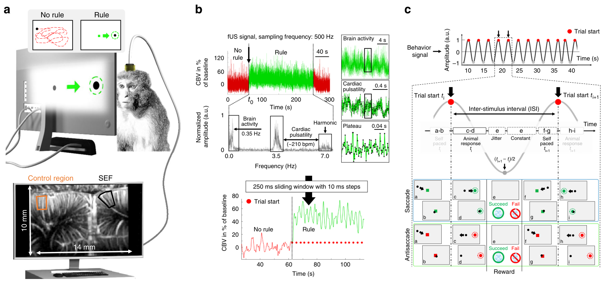
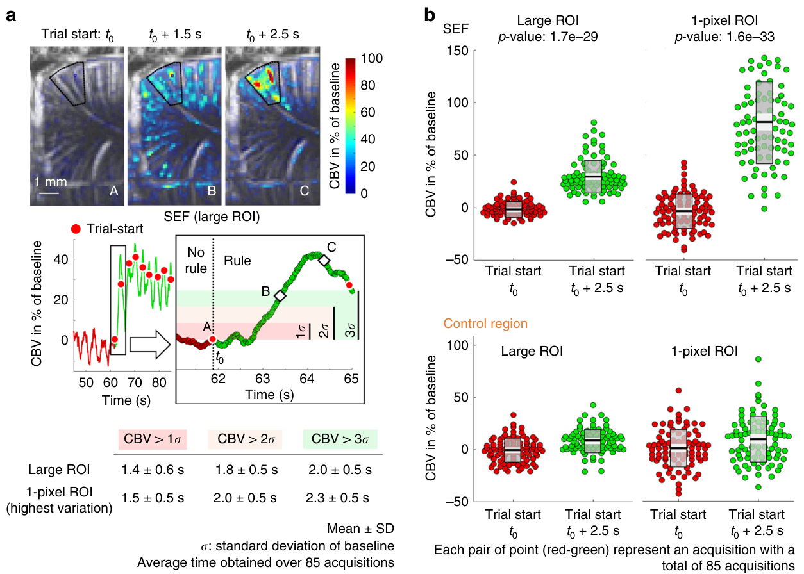
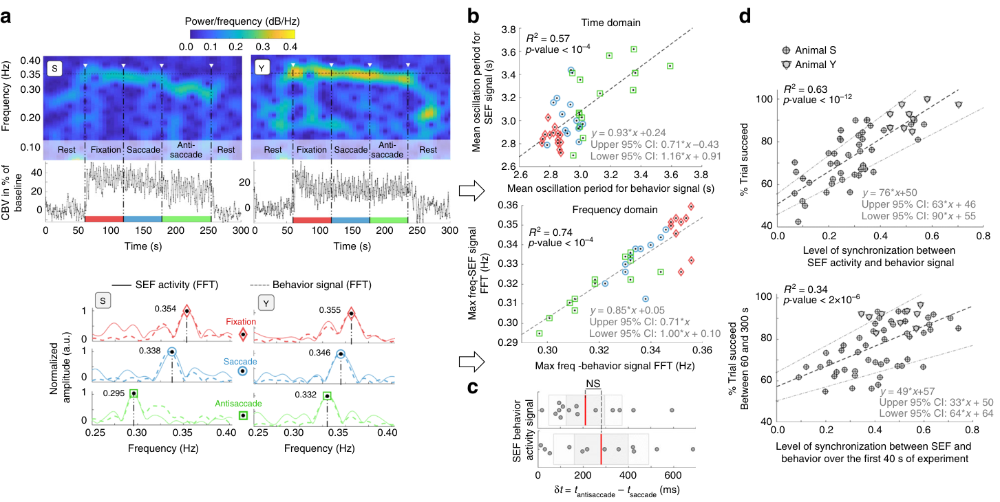
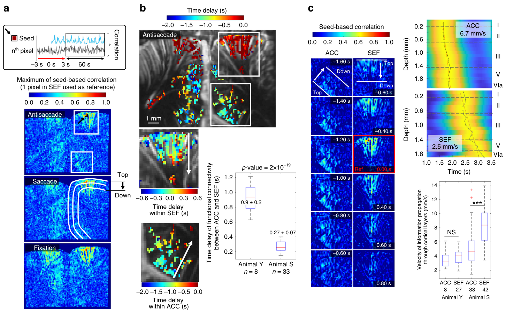

# 功能性超声成像揭示清醒灵长类中任务相关脑活动的传播
[← 回到首页](..)

- **原题**：Functional ultrasound imaging of the brain reveals propagation of task-related brain activity in behaving primates
- **著者**：Alexandre Dizeux1, Marc Gesnik1, Harry Ahnine2, Kevin Blaize3, Fabrice Arcizet3, Serge Picaud3, José-Alain Sahel3,4, Thomas Deffieux1, Pierre Pouget2, Mickael Tanter1　（Pierre Pouget 与 Mickael Tanter 共同指导本工作）
- **通讯作者**：alexandre.dizeux@gmail.com (A.D.); pierre.pouget@upmc.fr (P.P.); mickael.tanter@gmail.com (M.T.)
- **期刊**：Nature Communications 10, 1400 (2019)
- **DOI**：[10.1038/s41467-019-09349-w](https://doi.org/10.1038/s41467-019-09349-w)
- **日期**：投稿 2018-08-08 · 接收 2019-03-04
- **版权**：Copyright © 2019 The Author(s)（© 2019 作者）。本文为开放获取论文，以 Creative Commons Attribution 4.0 International License（CC BY 4.0，https://creativecommons.org/licenses/by/4.0/）发布。
- **单位**：
  - 1 Physics for Medicine, ESPCI, INSERM, CNRS, PSL Research University, Paris, France（物理与医学实验室，巴黎高等物理化工学院（ESPCI）、法国国家健康与医学研究院（INSERM）、法国国家科学研究中心（CNRS）、PSL 研究型大学，巴黎，法国）
  - 2 INSERM 1127, CNRS 7225, Institut du Cerveau et de la Moelle épinière, Sorbonne Université, Paris, France（INSERM 1127、CNRS 7225，脑与脊髓研究所，索邦大学，巴黎，法国）
  - 3 INSERM, CNRS, Institut de la Vision, Sorbonne Université, Paris, France（INSERM、CNRS，视觉研究所，索邦大学，巴黎，法国）
  - 4 Department of Ophthalmology, The University of Pittsburgh School of Medicine, Pittsburgh, PA, USA（匹兹堡大学医学院 眼科学系，美国宾夕法尼亚州匹兹堡）

---

> **本系列**：六篇核心论文的完整译文，逐一独立成篇。另见 [单试次运动意图解码（Norman 2021）](fusi-single-trial-decoding) · [首例闭环超声脑机接口（Griggs 2024）](fusi-closed-loop-bci) · [经颅窗人脑 fUS 成像（Rabut 2024）](fusi-human-cranial-window) · [LIP 扫视的介观组织（Griggs 2025）](fusi-mesoscopic-lip) · [移动中的人脑 fUS 成像（Soloukey 2025）](fusi-mobile-human)

## 摘要

磁共振成像（magnetic resonance imaging，MRI）与脑电图（electroencephalography，EEG）等神经成像模态能够记录整个大脑，但代价或是有限的时空分辨率，或是有限的灵敏度。在本文中，我们表明脑的功能性超声（functional ultrasound，fUS）成像能够在认知任务期间评估脑血容量（cerebral blood volume，CBV）的局部变化，且其时间分辨率足以测量信号的方向性传播。在两只猕猴中，当要求动物随扫视任务的变化而改变其行为时，我们观察到辅助眼动区（supplementary eye field，SEF）活动出现突发的一过性变化。SEF 激活可在单试次中观察到，无需平均。对前扣带皮层（anterior cingulate cortex，ACC）与 SEF 的同时成像揭示，两只动物的定向功能连接时间延迟分别为 0.27 ± 0.07 s 与 0.9 ± 0.2 s。使用 fUS 可以高时空分辨率测量大脑大范围区域的脑血流动力学。

## 引言

测量脑活动的神经科学技术即使不是全部、也有大多数，在成像视野的大小、时间与空间特异性、灵敏度以及对动物的物理约束之间做出折衷。电生理技术，以及较晚近的双光子显微技术，如今已能以高采样率记录神经元活动；然而其视场受限于可植入电极的数量或组织中的光散射 [[1,2]](#ref-1)。另有若干成像技术可用于在神经活动之后检测代谢活动的变化，包括灌注 fMRI 与对比剂 fMRI。血氧水平依赖（blood oxygen level-dependent，BOLD）对比成像 fMRI 是目前使用最广的功能磁共振成像（functional magnetic resonance imaging，fMRI）方法。尽管 BOLD fMRI 只提供神经元活动的间接测量，但有强力的经验证据表明 BOLD 信号确实与神经元活动高度相关 [[3]](#ref-3)。灌注 fMRI 的信号也被描述为相较 BOLD 响应更稳定 [[4]](#ref-4)，并具有更好的空间特异性。然而这些方法需要很长的采集序列，限制了它们在人体或清醒行为动物中的使用，且其灵敏度低于 BOLD。这些技术相对较弱的信噪比也仍是一项严重约束。这意味着必须对多次试次/条件取平均才能统计分析活动的变化，而实时调制无法被明确归因于某一给定脑区。最新的功能性超声成像技术（fUS）基于超快多普勒，为监测脑血流动力学 [[5-7]](#ref-5) 与功能连接 [[7]](#ref-7) 提供了另一条途径。该技术已在啮齿类中成功用于以高时空分辨率与高灵敏度测量 CBV，但从未用于非人灵长类。

> **图 1**. 实验设置与信号信息。(A) fUS（功能性超声）成像对脑血容量（CBV）变化的高灵敏度，使其能够在视觉任务期间以单试次检测辅助眼动区（SEF）的激活。动物依次执行基线（静息期）、注视、扫视与反向扫视试次，同时以 10 × 14 mm 的视场用 fUS 记录 CBV 变化。(B) fUS 信号以 500 Hz 的采样频率在 SEF 区域记录；下方为视觉任务期间 SEF 信号对应的频谱（快速傅里叶变换）。在 0.35 与 3.5 Hz 处观察到的峰值频率分别与脑活动及心搏脉动（约 210 bpm）有关（7 Hz 为心搏脉动的一个谐波频率）。为获得更干净的信号，先用截止滤波器去除心搏脉动，然后在图像的每个像素上应用 250 ms 滑动窗口、时间步长 10 ms。(C) 行为信号由一条正弦波构成，其每个周期由试次起始 ti 与下一个试次起始 ti+1 之间的时间定义。抖动与固定时间在所有类型任务中相似；视觉任务之间唯一显著的变异是动物反应时间（RT）。每个视觉任务由动物自行启动（a、b）：扫视任务中它须击中线索（c、d），反向扫视任务中它须击中线索出现的相反一侧（c、d），最后注视任务中（图中未展示）它须将眼位保持在初始线索上。视结果而定，动物获得奖赏（e），随后可以启动新的试次序列（f–i）。

| 图内标签 | 中文 |
| --- | --- |
| No rule / Rule | 无规则 / 有规则 |
| CBV in % of baseline | CBV（占基线的百分比） |
| fUS signal, sampling frequency: 500 Hz | fUS 信号，采样频率 500 Hz |
| 250 ms sliding window with 10 ms steps | 250 ms 滑动窗口、步长 10 ms |
| Cardiac pulsatility (~210 bpm) | 心搏脉动（约 210 bpm） |
| Brain activity | 脑活动 |
| Harmonic | 谐波 |
| Normalized amplitude (a.u.) | 归一化幅度（任意单位） |
| Amplitude (a.u.) | 幅度（任意单位） |
| Plateau | 平台期 |
| Frequency (Hz) | 频率（Hz） |
| Time (s) | 时间（s） |
| Animal response | 动物反应 |
| Constant | 固定时间 |
| Jitter | 抖动 |
| Self paced | 自定步速 |
| Inter-stimulus interval (ISI) | 刺激间间隔（ISI） |
| Trial start ti / ti+1 | 试次起始 ti / ti+1 |
| Saccade / Antisaccade | 扫视 / 反向扫视 |
| Succeed / Fail | 成功 / 失败 |
| Reward | 奖赏 |
| Behavior signal | 行为信号 |
| SEF | 辅助眼动区 |
| Control region | 对照区域 |
| 14 mm × 10 mm | 视场 14 mm × 10 mm |

另一条途径是使用超快多普勒（神经功能超声），其信号与采样体积内运动的红细胞（red blood cell，RBC）数量成正比，换言之与局部血容量成正比 [[8]](#ref-8)。超快多普勒可测得实时的 CBV 变化，低至典型的 5% 增幅；而在基于刺激的或脑内源性活动期间，超快超声评估的 CBV 变化在小血管中通常达到 50% 以上的增幅，由此带来非常高的灵敏度。这一 CBV 增加在微动脉与毛细血管中均存在。传统观点认为脑血流（cerebral blood flow，CBF）仅由毛细血管前微动脉调节，这一观点近来受到视网膜与小脑切片研究的挑战 [[9]](#ref-9)。Kleinfeld 及其同事使用双光子激光扫描显微术对大鼠初级躯体感觉皮层软脑膜下单个毛细血管内 RBC 的运动成像，表明在高流量值下 RBC 的平均速度与密度均高于低流量值 [[10]](#ref-10)。尽管 fUS 无法分辨单个毛细血管，但它能检测单个像素内极微小的血流变化（低至 0.5 mm/s 的血流速度）。超快超声技术的微型化近来使这一全脑神经成像得以推广到清醒自由活动的大鼠 [[6]](#ref-6)。然而，在认知过程中对内源性脑信号的即时监测从未得到演示，尽管使用该模态探索脑网络动力学的价值是明确的。fUS 所提供的高灵敏度、高时空分辨率（典型为 100 μm 与 10 ms）与大视场（field of view，FOV；从 cm2 到数十 cm2）三者的结合，正是我们在此展示的、对视觉任务期间内源性脑信号与模式的动态研究的关键。

在本研究中，我们提供了首批从清醒、行为中的非人灵长类（non-human primate，NHP）执行复杂任务时采集的 fUS 图像。SEF 是背内侧额叶皮层的一个区域，在眼动任务中活动 [[11,12]](#ref-11)。来自神经记录与刺激的证据表明，SEF 参与习得任意的眼动刺激—反应规则 [[13]](#ref-13)、奖赏或错误监测 [[14-16]](#ref-14)、编码以物体为中心的扫视方向 [[17]](#ref-17)、平滑追踪 [[18,19]](#ref-18)、自定步速的眼动 [[20]](#ref-20)、不可预测的序列眼动 [[21]](#ref-21)、反向扫视 [[22]](#ref-22)，以及执行记忆引导的扫视序列 [[23]](#ref-23)。在人类中，只有少数研究试图通过检查病灶累及该区域的患者的扫视表现缺陷来确定 SEF 的功能 [[24]](#ref-24)。猕猴 ACC 的神经元对视觉刺激以及随后的扫视性眼动作出放电反应 [[25]](#ref-25)。人类功能成像描述过与视觉引导扫视相关的后扣带皮层激活 [[26]](#ref-26)。另有证据表明前扣带皮层的一个尾侧区参与注视控制 [[27]](#ref-27)。对扣带沟上缘、紧邻 SEF 腹侧的一个区域（24c 区）实施电微刺激可诱发扫视性眼动 [[28]](#ref-28)。此外，功能性脑成像研究也报道过在产生由任意线索引导的自发扫视时前扣带皮层出现激活 [[29]](#ref-29)。在本研究中，我们同时记录了自由执行认知任务的猕猴 SEF 与 ACC 区域的 fUS 图像。我们记录了单次任务中由神经元活动诱发的 CBV 变化，而无须像 fMRI 或电生理那样对多次任务重复做统计平均。我们表明，能够以高时空分辨率（100 μm、10 ms）与高灵敏度记录脑血流动力学，并通过眼动追踪同步监测任务相关表现。我们首先介绍该实验框架的细节，以及 fUS 成像精确成像"无任务/任务"转换的能力（图 1、2）。随后我们证明，fUS 在低与高眼动控制任务期间记录的 CBV 变化波动在时间上与各个试次同步（图 3），并证明这一同步水平与成功率相关、甚至可预测成功率。最后，我们表明神经功能超声能够检测局部 CBV 变化经皮层分层以及 SEF 与 ACC 之间的动态传播（图 4）。

> **图 2**. fUS 能从单个首个试次检测规则变化。(A) 第一个视觉线索的出现诱导 SEF 中 CBV 在 2.5 s 内产生约 40% 的强烈变化（在黑色实线勾画的大 ROI，约 240 像素中量化），且在 1.5 s 后 CBV 就已达到基线标准差（σ）的两倍以上。无论 CBV 是在大 ROI 中还是在 1 像素 ROI 中量化（该像素依实验中 CBV 变化最大者选取），观察到 CBV 超过某一 σ 范围所需的延迟都相似（对 85 次采集取平均）。(B) 在 SEF 中（大 ROI 与 1 像素 ROI），首个试次起始与其后 2.5 s 之间的 CBV 变化高度显著，而在对照区域未观察到差异（配对样本 t 检验）。原始数据（红、绿圆点）以均值（黑色实线）、95% 置信区间（浅灰区域）与一个标准差（透明灰区域）概括。

| 图内标签 | 中文 |
| --- | --- |
| Large ROI | 大感兴趣区 |
| 1-pixel ROI (highest variation) | 1 像素感兴趣区（变化最大者） |
| SEF (large ROI) | SEF（大感兴趣区） |
| Control region | 对照区域 |
| No rule / Rule | 无规则 / 有规则 |
| Trial start t0 / t0 + 1.5 s / t0 + 2.5 s | 试次起始 t0 / t0 + 1.5 s / t0 + 2.5 s |
| CBV in % of baseline | CBV（占基线的百分比） |
| σ: standard deviation of baseline | σ：基线标准差 |
| CBV > 1σ / 2σ / 3σ | CBV > 1σ / 2σ / 3σ |
| Mean ± SD | 均值 ± 标准差 |
| Average time obtained over 85 acquisitions | 对 85 次采集取平均所得时间 |
| Each pair of point (red-green) represent an acquisition with a total of 85 acquisitions | 每一对点（红—绿）代表一次采集，共 85 次采集 |
| p-value: 1.6e−33 | p 值：1.6e−33 |
| p-value: 1.7e−29 | p 值：1.7e−29 |
| 1 mm | 比例尺 1 mm |

## 结果

### fUS 揭示与认知任务相关的脑激活

我们首先在清醒行为灵长类被指示启动一项眼动任务时，对 SEF 中线索诱发的血流动力学响应成像。实验执行了二十个连续试次（注视、扫视与反向扫视试次）。我们用插入 20 × 20 mm2 电生理记录腔的 15 MHz 超声阵列（见图 1a）以 fUS 成像观察这些响应。fUS 成像带来的高时间采样率（10 ms）意味着，出现在不同多普勒频率上的心搏脉动与呼吸运动伪影可以从采集数据中被明确地扣除（图 1b；采集可重复性见补充图 1a）。对全部试次在"无规则"与"有规则"试次之间的相关图揭示，规则试次期间 SEF 区域出现强烈激活（图 2a）。在全部 85 个记录场次中，SEF 中 CBV 信号的峰值幅度相对基线平均升高，在大感兴趣区（region of interest，ROI；约 240 像素）中为 31.3% ± 15.2%，在 1 像素 ROI 中为 84.8% ± 38.7%（在 6 像素与 12 像素 ROI 中得到相似结果，但为清晰起见未展示数据）。在大的与 1 像素的对照区域中，平均变化与标准差分别为 8.8% ± 10.9% 与 8.7% ± 21.6%（图 2b）。

> **【译者注】** 时间分辨率的含义：本文反复强调 10 ms，但该数值是**采样间隔**——平面波复合图像每 2 ms 一幅，最终多普勒图按 250 ms 滑窗、10 ms 步长给出，对应 100 Hz 帧率（本文方法节）。fUS 所测 CBV 响应本身受神经血管耦合限制：主材料 §2.3.3 记载"血流动力学模态典型滞后 1–2 s"，并收录 Norman 2021 实测的"神经活动 → 显著解码"2.08 ± 0.82 s 与 fUS 在线刷新率 1–2 Hz。因此本文所述"定向传播"的 0.27 ± 0.07 s 与 0.9 ± 0.2 s 是**相关信号之间的相对延迟**，不是神经事件的绝对时刻；10 ms 也不代表可分辨 10 ms 量级的神经事件。

### fUS 可从单个首个试次检测规则变化

该技术的高灵敏度还使得从单个首个试次即可检测规则变化期间的快速 CBV 动力学。CBV 变化揭示，在"无规则/有规则"条件转换处，SEF 区域出现一过性、突发且局部的激活（图 2a）。我们量化了每个区块条件首个试次内的这一突发活动变化，以评估认知 fUS 在 3 s 窗口内监测指令变化的能力（图 2a）。在每个条件区块内，我们量化了单个试次内的活动，以评估 fUS 的灵敏度。CBV 信号与线索出现之间相关性的脑激活图揭示，SEF 区域出现强烈且突发的显著激活变化（图 2a）。CBV 信号在线索出现后迅速达到最大值，并在 1.8 ± 0.5 s 之后即超过基线的两个标准差（均值 ± 标准差，图 2a）。

### fUS 信号的振荡反映动物的反应时间

除了在区块设计层面（"有规则/无规则"条件）对 CBV 变化做相关分析之外，我们还利用 fUS 的时间分辨率与灵敏度，更精细地分析每个注视、扫视与反向扫视区块内各试次之间的 CBV 变化。结果发现，每个区块内的 CBV 变化以一个与有效试次重复频率同步的瞬时频率波动。SEF 中 CBV 信号的频谱图显示，注视、扫视与反向扫视任务的重复频率分别为 0.354、0.338 与 0.295 Hz（图 3a；对照区域见补充图 2a）。对每 20 个连续试次的小区块所估计的这一 CBV 时间演化，与眼动追踪系统测得的试次间平均时间高度相关（R2 = 0.74，p < 10−4，Pearson 相关检验，图 3b）。我们发现 fUS 成像能够固有地捕捉扫视与反向扫视实验之间任务反应时间的微小差异（fUS 测得 δt = tantisacc − tsacc = 280 ± 210 ms，对比眼动追踪系统估计的试次间平均时间与标准差 δt = 210 ± 160 ms，两种方法之间无显著差异：p = 0.36，配对 t 检验，图 3c）。此外，我们测量了试次间时序与 SEF 中 CBV 响应之间的同步程度，发现其与成功试次百分比显著相关（R2 = 0.63，p < 10−12，Pearson 相关检验，图 3d）。结果发现，对前 40 s（即注视区块期间）这一同步程度的估计，能够预测 60 至 300 s 之间（即扫视与反向扫视区块期间）未来的成功试次百分比（R2 = 0.34，p < 10−5，Pearson 相关检验，图 3d）。因此，注视期间的同步性可以揭示动物在某一特定场次中的注意程度。

> **图 3**. CBV 振荡、行为与成功率之间的关系。fUS 成像能够利用 SEF 中 CBV 变化的频率分析区分注视/扫视与反向扫视的任务反应时间，并同样给出成功率。(A) 展示了两只动物（S 与 Y）SEF 中（大 ROI，约 240 像素）CBV 振荡的两幅频谱图示例。视觉任务期间，SEF 中的 CBV 在 0.35 Hz 附近振荡，并在静息期下降。对每种视觉任务，将 SEF 中时间信号的快速傅里叶变换与相关行为信号作图并叠加。SEF 信号与行为信号峰值频率的吻合，表明脑活动与行为之间的同步。行为信号通过绘制一条正弦波生成，其每个周期由试次起始 ti 与 ti+1 之间的延迟定义；如图 1c 所示，该信号包含动物的反应时间。(B) 无论在时域还是频域，都有一组 13 次采集凸显出 SEF 中 CBV 振荡与相关行为信号之间的显著相关。(C) 使用有限的 20 个连续试次，fUS 成像得以评估扫视与反向扫视实验之间任务反应时间的细微变化（δt = tantisacc − tsacc = 280 ± 210 ms），与行为数据（δt = 210 ± 160 ms，无显著差异，p = 0.36）一致；原始数据（灰色圆点）以均值（红色实线）、95% 置信区间（灰色区域）与一个标准差（白色区域）概括。(D) 对全部采集绘制了 SEF 信号与行为信号之间的相关性（同步水平），其与动物的成功率显著相关。甚至可以仅凭实验前 40 s 的脑—行为同步来预测动物的成功率。相关系数与 p 值用 Pearson 相关检验计算。

| 图内标签 | 中文 |
| --- | --- |
| Fixation / Saccade / Antisaccade | 注视 / 扫视 / 反向扫视 |
| Rest | 静息 |
| Animal S / Animal Y | 动物 S / 动物 Y |
| SEF activity (FFT) | SEF 活动（FFT） |
| Behavior signal (FFT) | 行为信号（FFT） |
| Time domain / Frequency domain | 时域 / 频域 |
| Max freq-SEF signal FFT (Hz) | SEF 信号 FFT 峰值频率（Hz） |
| Max freq -behavior signal FFT (Hz) | 行为信号 FFT 峰值频率（Hz） |
| Mean oscillation period for SEF signal (s) | SEF 信号平均振荡周期（s） |
| Mean oscillation period for behavior signal (s) | 行为信号平均振荡周期（s） |
| % Trial succeed | 试次成功百分比 |
| Level of synchronization between SEF activity and behavior signal | SEF 活动与行为信号之间的同步水平 |
| Level of synchronization between SEF and behavior over the first 40 s of experiment | 实验前 40 s 内 SEF 与行为之间的同步水平 |
| Between 60 and 300 s | 60 至 300 s 之间 |
| δt = tantisacc − tsacc (ms) | δt = tantisacc − tsacc（ms） |
| Upper / Lower 95% CI | 95% 置信区间上界 / 下界 |
| NS | 不显著 |

### fUS 追踪定向功能连接

我们还研究了 fUS 成像能否提供 SEF 与 ACC 信息在皮层分层之内以及皮层区域之间的方向性传播信息。将 SEF 一个种子像素在 20 个连续试次中 CBV 变化的时间曲线与所有其他像素的时间曲线做相关，揭示皮层区域之间（SEF 与 ACC）的功能连接在注视、扫视与反向扫视实验中相似（图 4a）。分析相关信号随皮层结构深度的变化曲线，清楚地揭示出动物 Y 在注视、扫视与反向扫视任务中，SEF 各层内最大相关值呈自上而下的传播（见补充影片 1）（图 4b；动物 S 见补充图 3a）。对动物 Y 位于 ACC（n = 8）与 SEF（n = 33）内不同深度的像素提取这些信号，显示出上、下区域之间存在精确的传播时序，速度为 4.0 ± 1.2 与 3.6 ± 1.3 mm/s（均值 ± 标准差，图 4c）。动物 S 在 ACC（n = 33）与 SEF（n = 42）内也发现相似的传播速度（5.2 ± 2.6 与 8.4 ± 2.6 mm/s，图 4c）。

在动物 S 与 Y 中，ACC 与 SEF 之间的定向功能连接平均时间延迟分别为 0.27 ± 0.07 s 与 0.9 ± 0.2 s（均值 ± 标准差，图 4a）。未发现这些差异与成功率或其他行为参数相关。

对动物 Y，部分实验揭示出从 SEF 到 ACC 的定向功能连接时间延迟为 1.6 ± 0.2 s（见补充图 3b）。在动物 Y 与 S 中，分别有 30%（8/27）与 79%（33/42）的视觉任务区块发现 SEF 相关信息在 ACC 与 SEF 之间以某一方向传播（在 ACC 中未检测到 SEF 相关信息的示例见补充图 3c）。

> **图 4**. fUS 使皮层分层的定向功能连接得以被测量。(A) 从基于种子点的相关图中提取出 ACC 与 SEF 之间及各自内部的时间延迟，取相关系数高于 0.3 的像素（SEF 中的参考像素依实验中 CBV 变化最大者选取）。(B) 动物 Y 与 S 中，ACC 与 SEF 之间信息传播的平均时间延迟分别为 1.0 ± 0.3 与 0.26 ± 0.08 s。(C) 得益于 fUS 的时间分辨率（10 ms），可以追踪相关信息在皮层分层内的传播并计算传播速度。连续的截图揭示信息先在 ACC 中传播，随后在 SEF 中传播。参考时刻（红色边框的截图）对应 1 像素 SEF 的自相关系数为 1 的时刻。动物 Y 中信息经 ACC 与 SEF 皮层分层传播的平均速度分别为 3.6 ± 1.3 与 4.0 ± 1.2 mm s−1，动物 S 中为 5.2 ± 2.6 与 8.4 ± 2.6 mm s−1。NS 表示不显著，结果以均值 ± 标准差表示。数据以箱线图概括，展示最小值、下四分位数、均值（红线）、上四分位数与最大值。*** 表示双样本 t 检验的 p 值 < 5 × 10−4。箱线图 x 轴上的数字表示测量次数。皮层分层依据文献 [[57]](#ref-57) 划分。

| 图内标签 | 中文 |
| --- | --- |
| Time delay within ACC (s) | ACC 内的时间延迟（s） |
| Time delay within SEF (s) | SEF 内的时间延迟（s） |
| Time delay of functional connectivity between ACC and SEF (s) | ACC 与 SEF 之间功能连接的时间延迟（s） |
| Maximum of seed-based correlation (1 pixel in SEF used as reference) | 基于种子点相关的最大值（以 SEF 中 1 个像素作参考） |
| Seed-based correlation | 基于种子点的相关 |
| Seed / Correlation | 种子点 / 相关性 |
| Ref | 参考时刻 |
| Top / Down | 上 / 下 |
| Depth (mm) | 深度（mm） |
| Time (s) | 时间（s） |
| ACC / SEF | 前扣带皮层 / 辅助眼动区 |
| Animal S / Animal Y | 动物 S / 动物 Y |
| I / II / III / V / VIa | 皮层分层 I / II / III / V / VIa |
| Velocity of information propagation through cortical layers (mm/s) | 信息经皮层分层的传播速度（mm/s） |
| n = 8 / 12 / 27 / 33 / 42 | 测量次数 n = 8 / 12 / 27 / 33 / 42 |
| *** | p < 5 × 10−4 |
| NS | 不显著 |

## 讨论

在本研究中，我们强调了使用 fUS 成像监测非人灵长类前额叶皮层（prefrontal cortex，PFC；即 SEF 与 ACC）在静息时或执行视觉任务（注视、扫视与反向扫视）时活动的优势。基于 SEF 中 CBV 幅度的事件相关变化，我们仅凭单个试次即可检测到神经元活动（图 2a、b）。高采样率（10 ms）使我们能够表明，区块设计序列期间 SEF 中 CBV 的振荡频率与动物的反应时间（response time，RT）相关（图 3b、c）。此外，SEF 与行为的同步水平与动物的成功率强烈相关，且前 40 s（注视任务的一部分）期间的这一同步水平甚至可以预测未来的成功率（图 3d）。最后，对基于种子点（SEF）相关的滞后计算，凸显出两只动物中相关信息从 ACC 向 SEF 的传播。

如图 2a 所示，在单个试次之后即可追踪到 CBV 幅度相对基线水平的显著升高。由于 fUS 成像灵敏度极高，无须对多个试次取平均来降低噪声水平。使用 fMRI 的多数认知研究测量与任务诱发响应相关的 BOLD 变化，通常需要对许多试次取平均（区块设计），以提高对"BOLD 变化并非伪影"的把握。还可采用其他技术在采集期间降低非神经元活动带来的信号，例如通过线性回归从 BOLD 信号中测量并去除生理参数（呼吸与心脏活动）[[30,31]](#ref-30)，或设计采样率更高的采集序列以避免较高频率生理活动的混叠 [[32,33]](#ref-32)。这甚至可以在后处理中完成，例如使用独立成分分析（independent component analysis，ICA）[[34]](#ref-34) 之类的算法，或回归掉所有体素共有的信号 [[35]](#ref-35)。然而，尽管 fMRI 中的事件相关方法为认知心理学开辟了新的研究领域，仍然需要复杂的信号后处理来对抗 fMRI 有限的时空分辨率与灵敏度。正如 Huette 所解释的，此类方法被批评为"将 fMRI 分析嵌入层层抽象之中——使研究者离自己的数据越来越远" [[36]](#ref-36)。

如图 3a 的频谱图所示，改变视觉任务的规则时，CBV 振荡频率出现显著偏移。我们通过将 SEF 中 CBV 信号频谱的峰值频率与每种视觉任务的行为信号频谱相比较，验证了该偏移与动物 RT 直接相关的假设（图 3a、b；关于行为信号的详细描述见方法部分与图 1c）。有人可能会争辩，SEF 中 CBV 信号的这一频率偏移可能与动物的疲劳有关，而非与其反应时间有关。但如补充图 2b 所示，我们做过若干次仅含基线、随后直接进入反向扫视的采集，结果发现整个采集期间 CBV 振荡频率都在 0.3 Hz 左右，而这正是与反向扫视 RT 相关的典型频率（图 3b）。在未来的工作中，我们将用新的灵长类动物颠倒视觉任务的顺序，并增大两个试次起始之间的抖动。

fUS 成像即便在行为非人灵长类的事件相关研究中，也无须实施任何复杂的信号处理来从噪声中提取感兴趣的信号，这是一个重要的特点。确实，如补充图 4 所总结，fUS 在脑外区域测得的噪声水平，其幅度变化仅为 4%，比在不参与视觉任务的皮层区域测得的内源性相干 CBV 波动（幅度变化 40%）低十倍，比在 SEF 区域测得的 CBV 变化（从基线到任务的变化为 80%）低二十倍。与事件相关研究一样，fMRI 中记录自发性脑活动颇具挑战，因为 BOLD 信号可能被非神经元的生理波动等伪影污染、甚至由这些伪影造成。尽管我们并未研究不同深度的 CBV 振荡低频与高频之间的关系，fUS 成像的灵敏度已足以（补充图 4）凸显行为动物中的内源性相干 CBV 振荡。再次如补充图 4 的例子所示，噪声信号与内源性 CBV 振荡之间的幅度差为十倍，而后者与 SEF 活动之间的幅度差为两倍。

> **【译者注】** 措辞边界："无须实施任何复杂的信号处理"是相对 fMRI 事件相关分析（ICA、生理噪声回归等）而言。本文方法节自身即使用了**基于 SVD 的时空杂波滤波**、刚体运动校正与逐体素归一化；主材料 §4.1.2 把时空 SVD 杂波滤波列为 fUS 信号链的标准环节（组织回波比血细胞回波强 40–60 dB，必须抑制），§4.1 全节共列 6 步流程。此处不应读作"fUS 无需任何处理"。

最后，fUS 成像被证明能够实时追踪定向功能连接。这种定向功能连接长期以来一直是 fMRI 所追求的目标。Mitra 等考察了 fMRI BOLD 信号中自发性波动的潜伏期结构 [[37]](#ref-37)。他们揭示，内在活动以约 0.5 s 的时间尺度在区域内与区域间传播。他们发现这一活动的潜伏期结构会随感觉状态的操控（睁眼 vs. 闭眼）、前置运动任务（按键）的执行以及一天中的时段（早晨 vs. 傍晚）而变化，清楚表明 BOLD 信号的滞后反映的是神经元过程而非血流动力学延迟。他们的结果强调了脑自发性活动时间结构的重要性。在追寻不同皮层分层（laminae）中动态激活的过程中，此类分层定向 fMRI 的终极挑战在于：通过比较不同分层对给定皮层斑块内信号的相对贡献，提供关于信息流方向的信息。然而，跨越相邻分层的信号传递比 fMRI 所能测量的快一个数量级，这可能危及分层 fMRI 的全部努力 [[38]](#ref-38)。绕过这一时间分辨率问题，Huber 等近来提出另一种策略，使用 CBV 加权 fMRI 方法与不同的刺激范式来为分层 fMRI 提供证据 [[39]](#ref-39)。在本研究中，我们证明 fUS 可以利用其优越（高一个数量级）的时间分辨率来追踪 ACC 与 SEF 之间定向功能连接的延迟。在 SEF 区域内，发现基于种子点的相关信息在不同层之间传播，导致皮层顶部与较低层之间出现典型为 210 ± 70 与 440 ± 150 ms（均值 ± 标准差）的延迟（考虑距离为 1.6 mm），凸显出 fMRI 在捕捉这一信息方向性传播方面的实际极限。由于在任务诱发采集中滞后结构的时间尺度为秒级，有人可能争辩这是一种纯血管效应，源于血管内传导性或逆行性扩张 [[40]](#ref-40)。然而有若干理由表明，此处对滞后结构的贡献极可能主要是神经源性的。

第一，由血管舒缩引起的血管波传播，将彻底质疑 fUS 成像对脑激活进行局部测量的能力。这将与众多研究相矛盾——那些研究报道 fUS 成像可检测大鼠 [[41,42]](#ref-41)、雪貂 [[43]](#ref-43) 与人类 [[44]](#ref-44) 皮层或深部区域的局部激活。特别是，Bimbard 等近来报道 fUS 能够以 100 μm 的分辨率重建皮层与深部结构（如下丘）的声调拓扑图。在听觉刺激期间，Bimbard 等报道 fUS 成像能够区分雪貂中相邻体素的响应性，功能分辨率精细至 100 μm。此外，发现 fUS 成像能够以每个频率仅 10 次重复，在 300 μm 的距离内依据体素的调谐曲线区分体素。重要的是，他们将该测量报告为功能分辨率的保守估计，因为它很大程度上取决于底层功能组织本身（声调拓扑）的平滑程度以及试次数量。纯血管波传播穿过全部皮层分层，将与这些关于 fUS 空间分辨率的既往研究相矛盾。

第二，可能有人反对说，观察到的滞后结构源自神经血管耦合潜伏期的区域差异 [[45-47]](#ref-45)。这一假设虽不能被完全驳倒，但在此处并不成立。同一动物同一区域的滞后结构与传播速度，在自发性活动与任务诱发活动之间明显不同，无法用神经血管耦合的区域异质性来解释。fUS 成像在自发性活动期间观察到的潜伏期延迟（数百毫秒）比任务诱发活动期间测得的潜伏期延迟（数秒）快一个数量级，这已在文献中报道过 [[48]](#ref-48)。fMRI 中观察到的滞后结构结果通常限于 0.5 s 的范围，而任务诱发响应中的潜伏期处于数秒量级 [[48]](#ref-48)。

第三，而且更重要的是，我们在此发现的自发性活动的快速传播速度与其他研究 [[49-52]](#ref-49) 高度一致。Mohajerani 等证明，在小鼠中使用电压敏感染料（voltage-sensitive dye，VSD）钙成像可以测得自发性活动期间的传播速度（典型为 0.2 m/s）。他们的结果绕开了神经血管耦合的问题，并确认了静息态功能磁共振成像（resting-state fMRI，rs-fMRI）中 BOLD 测量的神经元贡献。我们的结果是用一种血流成像方法获得的，其时间分辨率（约 10 ms）可与追踪神经元活动的 VSD 钙成像相比。两种方法给出的传播速度处于同一量级（两只灵长类的 fUS 为 0.43 ± 0.26 与 0.36 ± 0.09 m/s，相比之下 VSD 钙成像为 0.2 m/s [[53,54]](#ref-53)，睡眠期间为 0.4–6.3 m/s [[51,52]](#ref-51)）。重要的是，在 ACC/SEF 区域内及区域之间观察到的潜伏期轨迹，无法仅用血管成分的传播从解剖上加以解释。补充影片 1 清楚地展示出 ACC 中自上而下的定向连接，随后是 SEF 中自上而下的定向连接。这些结果支持这样的模型：ACC 在准备期更早被激活，而 PFC 在刺激加工与反应选择期间监测冲突 [[55,56]](#ref-55)。

> **【译者注】** 引文核对：原文此处把"VSD 钙成像"标注为文献 53、54，但第 53 条是 Montaldo 等关于相干平面波复合的超快成像方法论文（*IEEE Trans. Ultrason. Ferroelectr. Freq. Control* 56, 489–506 (2009)），第 54 条是 Demené 等关于 SVD 时空杂波滤波的论文（*IEEE Trans. Med. Imaging* 34, 2271–2285 (2015)），二者均非 VSD 钙成像研究，且这两条在本文方法节中已被正确引用。本文"VSD 钙成像 0.2 m/s"这一数值实际出自第 49、50 条：Mohajerani 等，*J. Neurosci.* 30, 3745–3751 (2010)，doi:10.1523/JNEUROSCI.6437-09.2010（✅ 已核验）；Mohajerani 等，*Nat. Neurosci.* 16, 1426–1435 (2013)，doi:10.1038/nn.3499（✅ 已核验）。译文按原文照译并保留角标 [[53,54]](#ref-53)，读者据此追溯时请注意甄别。

> **【译者注】** 数值口径：此处给出 fUS 的传播速度为 0.43 ± 0.26 与 0.36 ± 0.09 m/s（即 430 与 360 mm/s），而本文结果节报告的是皮层分层内传播速度 3.6 ± 1.3 至 8.4 ± 2.6 mm/s，两者相差约两个数量级；结果节并未给出 m/s 量级的传播速度，该数值可能来自补充材料中的自发性活动分析。主材料 §2.3.3 只收录了本文的 ACC↔SEF 时间延迟（0.27 ± 0.07 s 与 0.9 ± 0.2 s），未收录传播速度。译文照原文保留这两个数值，引用时请注意其与结果节数值的口径差异。

图 4b 中展示的原始空间相关图展示了 ACC 中像素水平的激活。尽管可以增大空间滤波以进一步改善激活图的平滑度，但保持高空间分辨率对若干应用可能至关重要，尤其是在进行电生理测量时需要精确引导电极的情况下。

尽管这些论据使潜伏期结构的神经元基础相当可信，我们的 fUS 数据只提供了间接证据。今后涉及多模态采集（EEG、双光子与 fUS）的研究应能明确确认潜伏期结构的生理基础。这种高时间分辨率的定向功能连接神经成像，为研究脑区间信息流的全脑研究提供了广阔前景。在本研究中，由于使用 15 MHz 探头，用 fUS 成像对脑功能的探索仅限于皮层区域，但如补充图 4a 所示，可以使用频率更低的超声探头来记录非人灵长类全切面的 CBV 波动。fUS 成像的高时空特异性与高灵敏度意味着它非常适合行为 NHP 研究以及复杂实验范式的开发，例如在区域激活与实验范式之间建立近实时的反馈回路。尽管当前的 fUS 成像技术与 MRI 相比有一些缺点——它目前只能是二维的，且需要开颅——但其高灵敏度、高分辨率，以及同样重要的高便携性与对其他实验设备（包括电生理）的兼容性 [[6]](#ref-6)，使其成为 NHP 神经科学领域行为研究中创新性、交互式多模态方法的有力工具 [[57]](#ref-57)。

> **【译者注】** 展望非实做：此处"近实时的反馈回路"是作者给出的**未来应用方向**，本文并未实现闭环刺激或实时反馈——全文只有"读"通路（离线相关分析、滞后计算与组块设计比较）。主材料 §7.3 记载，首例实时闭环超声脑机接口为 Griggs 2024（2 只猕猴在线控制最多 8 个方向），且 §7.3.1 指出"真正用 fUS 自身做闭环反馈的完整系统，尚未见报道"。引用本文时不应把它算作闭环 BCI 的实现。

## 材料与方法

### 动物模型与行为数据

所有实验均经法国"高等教育与研究部"伦理批准，项目编号为 APAFIS #561_2015042717569705 与 #6355-2016080911065046。功能数据采集自两只圈养出生的猕猴（Maccaca mulatta）S 与 Y，二者经训练执行多种视觉任务（图 1c）。在扫视任务中，动物须将注视点固定在屏幕右侧或左侧呈现的线索物体上；在反向扫视任务中，它须将注视点固定在与线索出现位置相反的一侧；最后，在注视任务中（图中未展示），它须在初始线索上保持稳定的注视。每只动物依次执行基线（静息期）、注视、正向扫视与反向扫视试次，采用每段 60 s 的区块设计（约 20 试次/任务），该区块在每个采集日重复五次。数据采集期间，灵长类的眼位用红外视频眼动仪（Eyelink 1k，SR-Research）以 1 kHz 监测，从而可以实时控制行为范式，并依据视觉任务的成败给予奖赏。"行为信号"这一称谓指的是一个振荡信号，其周期等于试次起始之间的时间，如图 1c 所示。该周期包含有关灵长类反应时间的信息。

### 清醒行为猴 fUS 成像的植入物与探头

头部固定系统为钛制头柱（非牙科丙烯酸植入物，Crist Instrument，美国马里兰州）。动物完成行为训练后，在辅助区上方实施 20 mm × 20 mm 的开颅（内外侧：0；前后：+26），并植入电生理记录腔（CILUX 腔，Crist Instrument）。将定制的微型 15 MHz 超声探头（图 1a）（128 阵元，15 MHz，空间分辨率 100 × 100 μm2）涂抹声耦合凝胶后置于腔内。所采集图像的像素尺寸为 100 × 100 μm，层厚 400 μm，视场为 14 mm × 10 mm（不同探头频率对应的不同 FOV 见补充图 4a）。我们微型探头的 FOV 允许对浅层与深层皮层区域（包括 SEF 与 ACC）成像。

### 功能性超声（fUS）

我们使用一种由既往所用功率多普勒序列 [[53]](#ref-53) 修改而来的 fUS 序列测量 CBV 变化。由于 fUS 信号与 CBV 成正比 [[5]](#ref-5)，我们将采集到的图像称为"CBV 图像"。数据通过超快超声研究扫描仪（256 个电子通道，60 MHz 采样率）发射连续的、倾斜角度从 −10 度变化到 10 度的 11 组平面超声波来采集。超声回波被求和以生成单幅复合图像，每 2 ms 采集一幅。在基于这些超声图像奇异值分解的时空滤波 [[54]](#ref-54)（以精细区分血流与组织运动）之后，通过对 125 幅复合超声图像在 250 ms 滑动窗口上取平均、重叠 10 ms，生成最终的 Doppler 图像。在 100 Hz 帧率下，每个 300 s 采集时段生成 30,000 幅 Doppler 图像的最终序列。

### 数据处理

通过计算 fUS 所得局部功率多普勒信号与视觉刺激的时间区块模式（无规则 vs. 有规则）之间的归一化相关系数，映射出激活像素，从而在空间上定位 SEF。随后将功率多普勒信号在 SEF 的一个大感兴趣区（ROI；约 240 像素）与一个 1 像素 ROI 内取平均，并在对侧对照区域的类似 ROI 内取平均（图 1a）。SEF 中的参考像素依据记录序列期间 CBV 变化最大者来选取。我们生成一个行为信号，以使 SEF 区域的 CBV 波动能够与猴的行为在时间上相关。行为信号由一条正弦波构成，其周期由试次起始 ti 与下一个试次起始 ti+1 之间的延迟定义（见图 1c）。不同类型任务之间刺激间间隔（inter-stimulus interval，ISI）的变异主要受动物反应时间（RT）影响，因为抖动与自定步速时段保持相似。脑—行为同步水平通过计算 SEF 活动与行为信号的相关性来评估。对每个视觉任务区块，在 SEF 活动（y 轴）与行为信号（x 轴）之间绘制线性回归（图 3b），可分别在频域（峰值频率）或时域（CBV 振荡平均周期）中进行。对所有实验，将 SEF 活动与行为之间的相关性对相应的成功率作图（图 3d）。

频谱图使用 MATLAB 内置函数绘制，对整体采集时间使用 15% 的汉明窗、对重叠样本使用 80%（图 3a、补充图 2a–d），以研究视觉任务期间感兴趣区内 CBV 振荡的频率偏移。

### 数据可用性

支持本研究结论的所有数据与软件均可向通讯作者索取。

## 参考文献

> 以下为原文文献表，**保留英文不翻译**；正文角标 `[n]` 即指向此表。

1. Kerr, J. N. D. & Nimmerjahn, A. Functional imaging in freely moving animals. Curr. Opin. Neurobiol. 22, 45–53 (2012).
2. Packer, A. M., Russell, L. E., Dalgleish, H. W. P. & Häusser, M. Simultaneous all-optical manipulation and recording of neural circuit activity with cellular resolution in vivo. Nat. Methods 12, 140–146 (2015).
3. Logothetis, N. K. What we can do and what we cannot do with fMRI. Nature 453, 869–878 (2008).
4. Aguirre, G. K., Detre, J. A., Zarahn, E. & Alsop, D. C. Experimental design and the relative sensitivity of BOLD and perfusion fMRI. Neuroimage 15, 488–500 (2002).
5. Macé, E. et al. Functional ultrasound imaging of the brain. Nat. Methods 8, 662–664 (2011).
6. Sieu, L.-A. et al. EEG and functional ultrasound imaging in mobile rats. Nat. Methods 12, 831–834 (2015).
7. Rungta, R. L., Osmanski, B.-F., Boido, D., Tanter, M. & Charpak, S. Light controls cerebral blood flow in naive animals. Nat. Commun. 8, 14191 (2017).
8. Rubin, J. M. et al. Normalizing fractional moving blood volume estimates with power Doppler US: defining a stable intravascular point with the cumulative power distribution function. Radiology 205, 757–765 (1997).
9. Peppiatt, C. M., Howarth, C., Mobbs, P. & Attwell, D. Bidirectional control of CNS capillary diameter by pericytes. Nature 443, 700–704 (2006).
10. Kleinfeld, D., Mitra, P. P., Helmchen, F. & Denk, W. Fluctuations and stimulus-induced changes in blood flow observed in individual capillaries in layers 2 through 4 of rat neocortex. Proc. Natl Acad. Sci. USA 95, 15741–15746 (1998).
11. Schlag, J. & Schlag-Rey, M. Evidence for a supplementary eye field. J. Neurophysiol. 57, 179–200 (1987).
12. Tehovnik, E. J., Sommer, M. A., Chou, I. H., Slocum, W. M. & Schiller, P. H. Eye fields in the frontal lobes of primates. Brain Res. Brain Res. Rev. 32, 413–448 (2000).
13. Chen, L. L. & Wise, S. P. Neuronal activity in the supplementary eye field during acquisition of conditional oculomotor associations. J. Neurophysiol. 73, 1101–1121 (1995).
14. Amador, N., Schlag-Rey, M. & Schlag, J. Reward-predicting and reward-detecting neuronal activity in the primate supplementary eye field. J. Neurophysiol. 4, 2166–2170 (2000).
15. Curtis, C. E., Cole, M. W., Rao, V. Y. & D’Esposito, M. Canceling planned action: an FMRI study of countermanding saccades. Cereb. Cortex 15, 1281–1289 (2005).
16. Stuphorn, V., Taylor, T. L. & Schall, J. D. Performance monitoring by the supplementary eye field. Nature 408, 857–860 (2000).
17. Olson, C. R. & Gettner, S. N. Neuronal activity related to rule and conflict in macaque supplementary eye field. Physiol. Behav. 77, 663–670 (2002).
18. Heinen, S. J. & Liu, M. Single-neuron activity in the dorsomedial frontal cortex during smooth-pursuit eye movements to predictable target motion. Vis. Neurosci. 14, 853–865 (1997).
19. Missal, M. & Heinen, S. J. Facilitation of smooth pursuit initiation by electrical stimulation in the supplementary eye fields. J. Neurophysiol. 86, 2413–2425 (2001).
20. Petit, L., Clark, V. P., Ingeholm, J. & Haxby, J. V. Dissociation of saccade-related and pursuit-related activation in human frontal eye fields as revealed by fMRI. J. Neurophysiol. 77, 3386–3390 (1997).
21. Hwang, K., Ghuman, A. S., Manoach, D. S., Jones, S. R. & Luna, B. Cortical neurodynamics of inhibitory control. J. Neurosci. 34, 9551–9561 (2014).
22. Schlag-Rey, M., Amador, N., Sanchez, H. & Schlag, J. Antisaccade performance predicted by neuronal activity in the supplementary eye field. Nature 390, 398–401 (1997).
23. Hikosaka, O., Takikawa, Y. & Kawagoe, R. Role of the basal ganglia in the control of purposive saccadic eye movements. Physiol. Rev. 80, 953–978 (2000).
24. Gaymard, B., Ploner, C. J., Rivaud-Péchoux, S. & Pierrot-Deseilligny, C. The frontal eye field is involved in spatial short-term memory but not in reflexive saccade inhibition. Exp. Brain Res. 129, 288–301 (1999).
25. Olson, C. R., Musil, S. Y. & Goldberg, M. E. Single neurons in posterior cingulate cortex of behaving macaque: eye movement signals. J. Neurophysiol. 76, 3285–3300 (1996).
26. Mort, D. J. et al. Differential cortical activation during voluntary and reflexive saccades in man. Neuroimage 18, 231–246 (2003).
27. Ito, S., Stuphorn, V., Brown, J. W. & Schall, J. D. Performance monitoring by the anterior cingulate cortex during saccade countermanding. Science 302, 120–122 (2003).
28. Mitz, A. R. & Godschalk, M. Eye-movement representation in the frontal lobe of rhesus monkeys. Neurosci. Lett. 106, 157–162 (1989).
29. Paus, T., Petrides, M., Evans, A. C. & Meyer, E. Role of the human anterior cingulate cortex in the control of oculomotor, manual, and speech responses: a positron emission tomography study. J. Neurophysiol. 70, 453–469 (1993).
30. Birn, R. M., Diamond, J. B., Smith, M. A. & Bandettini, P. A. Separating respiratory-variation related fluctuations from neuronal-activity-related fluctuations in fMRI. Neuroimage 29, 54–66 (2006).
31. Lund, T. E., Madsen, K. H., Sidaros, K., Luo, W. & Nichols, T. E. Non-white noise in fMRI: does modelling have an impact? Neuroimage 29, 54–66 (2006).
32. Biswal, B., Yetkin, F., Haughton, V. & Hyde, J. Functional connectivity in the motor cortex of resting human brain using echo-planar MRI. Magn. Reson. Med. 34, 537–541 (1995).
33. Lowe, M. J., Mock, B. J. & Sorenson, J. A. Functional connectivity in single and multislice echoplanar imaging using resting-state fluctuations. Neuroimage 7, 119–132 (1998).
34. Kiviniemi, V., Kantola, J. H., Jauhiainen, J., Hyvarinen, A. & Tervonen, O. Independent component analysis of nondeterministic fMRI signal sources. Neuroimage 19, 253–260 (2003).
35. Macey, P. M., Macey, K. E., Kumar, R. & Harper, R. M. A method for the removal of global effects from fMRI time series. Neuroimage 22, 360–366 (2004).
36. Huettel, S. A. Event-related fMRI in cognition. Neuroimage 62, 1152–1156 (2012).
37. Mitra, A., Snyder, A. Z., Hacker, C. D. & Raichle, M. E. Lag structure in resting-state fMRI. J. Neurophysiol. 111, 2374–2391 (2014).
38. Dumoulin, S. O. Layers of neuroscience. Neuron 96, 1205–1206 (2017).
39. Huber, L. et al. High-resolution CBV-fMRI Allows mapping of laminar activity and connectivity of cortical input and output in human M1. Neuron 96, 1253–1263.e7 (2017).
40. O’Herron, P. et al. Neural correlates of single-vessel haemodynamic responses in vivo. Nature 534, 372–382 (2016).
41. Osmanski, B.-F., Pezet, S., Ricobaraza, A., Lenkei, Z. & Tanter, M. Functional ultrasound imaging of intrinsic connectivity in the living rat brain with high spatiotemporal resolution. Nat. Commun. 5, 5023 (2014).
42. Urban, A. et al. Chronic assessment of cerebral hemodynamics during rat forepaw electrical stimulation using functional ultrasound imaging. Neuroimage 101, 138–149 (2014).
43. Bimbard, C. et al. Multi-scale mapping along the auditory hierarchy using high-resolution functional UltraSound in the awake ferret. eLife 7, e35028 (2018).
44. Imbault, M., Chauvet, D., Gennisson, J.-L., Capelle, L. & Tanter, M. Intraoperative functional ultrasound imaging of human brain activity. Sci. Rep. 7, 7304 (2017).
45. Friston, K. Causal modelling and brain connectivity in functional magnetic resonance imaging. PLoS Biol. 7, e33 (2009).
46. Friston, K. Dynamic causal modeling and Granger causality. Comments on: The identification of interacting networks in the brain using fMRI: model selection, causality and deconvolution. Neuroimage 58, 303–305 (2011).
47. Friston, K., Moran, R. & Seth, A. K. Analysing connectivity with Granger causality and dynamic causal modelling. Curr. Opin. Neurobiol. 23, 172–178 (2013).
48. Raichle, M. E. The restless brain. Brain Connect. 1, 3–12 (2011).
49. Mohajerani, M. H., McVea, D. A., Fingas, M. & Murphy, T. H. Mirrored bilateral slow-wave cortical activity within local circuits revealed by fast bihemispheric voltage-sensitive dye imaging in anesthetized and awake mice. J. Neurosci. 30, 3745–3751 (2010).
50. Mohajerani, M. H. et al. Spontaneous cortical activity alternates between motifs defined by regional axonal projections. Nat. Neurosci. 16, 1426–1435 (2013).
51. Massimini, M., Huber, R., Ferrarelli, F., Hill, S. & Tononi, G. The sleep slow oscillation as a traveling wave. J. Neurosci. 24, 6862–6870 (2004).
52. Murphy, M. et al. Source modeling sleep slow waves. PNAS 106, 1608–1613 (2009).
53. Montaldo, G., Tanter, M., Bercoff, J., Benech, N. & Fink, M. Coherent plane-wave compounding for very high frame rate ultrasonography and transient elastography. IEEE Trans. Ultrason. Ferroelectr. Freq. Control 56, 489–506 (2009).
54. Demené, C. et al. Spatiotemporal clutter filtering of ultrafast ultrasound data highly increases Doppler and fUltrasound sensitivity. IEEE Trans. Med. Imaging 34, 2271–2285 (2015).
55. Hopfinger, J. B., Buonocore, M. H. & Mangun, G. R. The neural mechanisms of top-down attentional control. Nat. Neurosci. 3, 284–291 (2000).
56. Miller, E. K. & Cohen, J. D. An integrative theory of prefrontal cortex function. Annu. Rev. Neurosci. 24, 167–202 (2001).
57. Ninomiya, T., Dougherty, K., Godlove, D. C., Schall, J. D. & Maier, A. Microcircuitry of agranular frontal cortex: contrasting laminar connectivity between occipital and frontal areas. J. Neurophysiol. 113, 3242–3255 (2015).

## 致谢

本工作获欧洲研究理事会 SYNERGY 资助计划（HELMHOLTZ，ERC 资助协议 #610110）以及 Program (FP7/2007–2013)/ERC 资助协议 no. 339244-FUSIMAGINE 的支持。

## 作者贡献

M.T.、P.P. 与 T.D. 构思研究；M.G. 与 T.D. 开发序列采集；A.D. 与 H.A. 采集数据；A.D. 完成数据处理。M.T.、P.P.、T.D.、J-.A.S.、S.P. 与 A.D. 解读结果；M.T.、P.P. 与 A.D. 撰写手稿初稿，T.D.、M.G.、F.A. 与 K.B. 作出实质性贡献。所有作者编辑并批准了手稿的最终版本。

**利益冲突**：T.D. 与 M.T. 是 ICONEUS 公司的联合创始人与股东。其余作者声明无利益冲突。

[← 回到首页](..)
