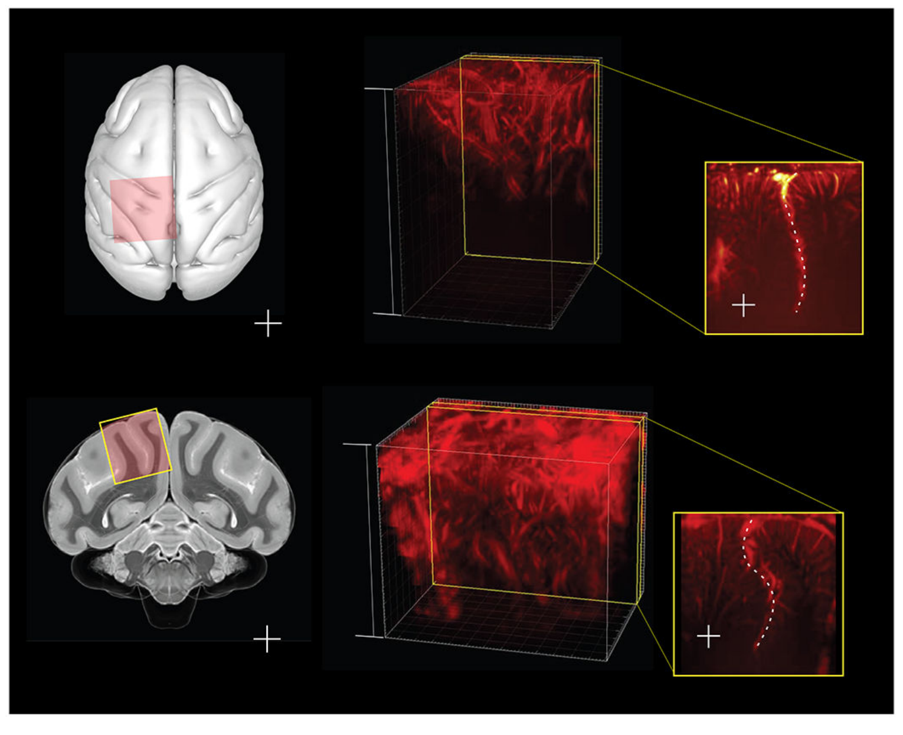
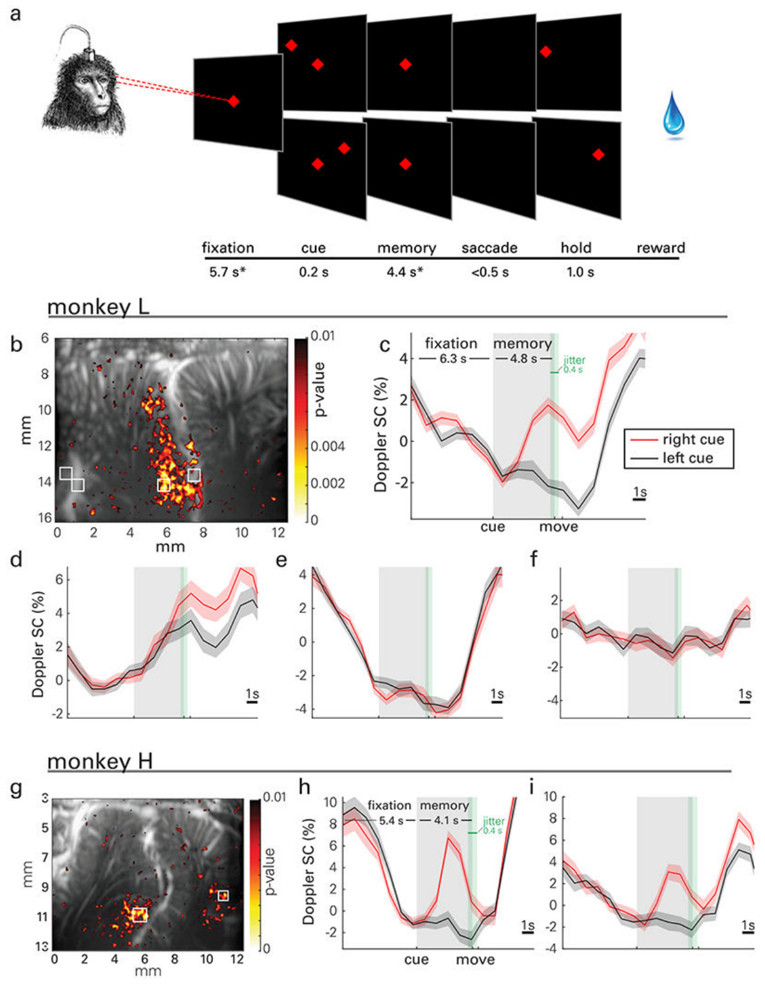
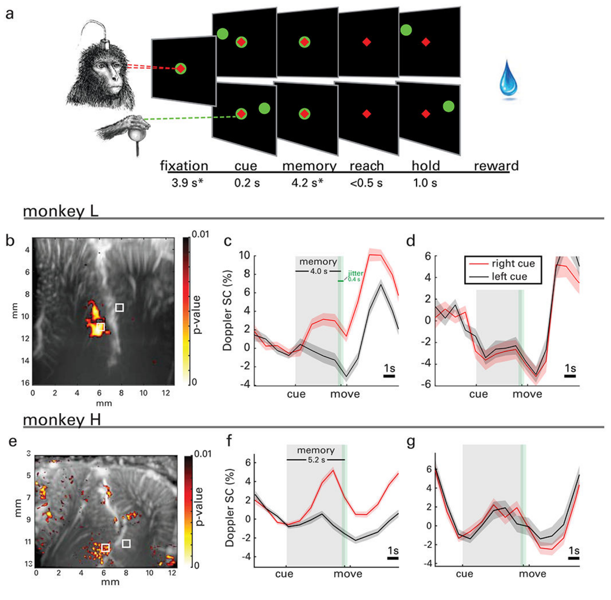
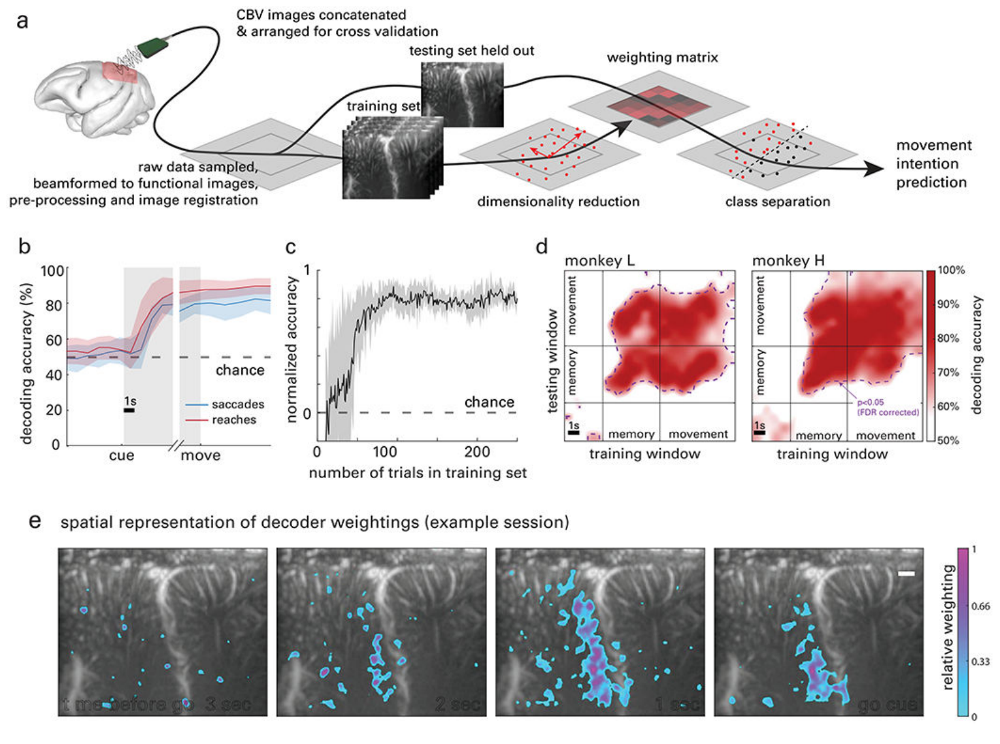
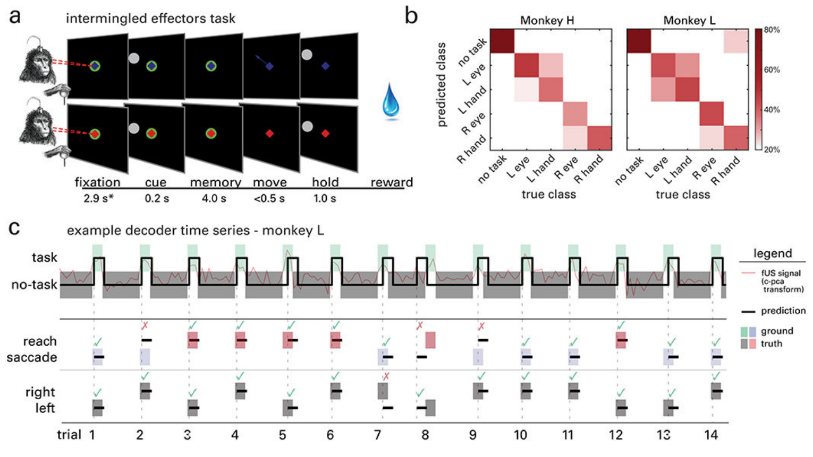
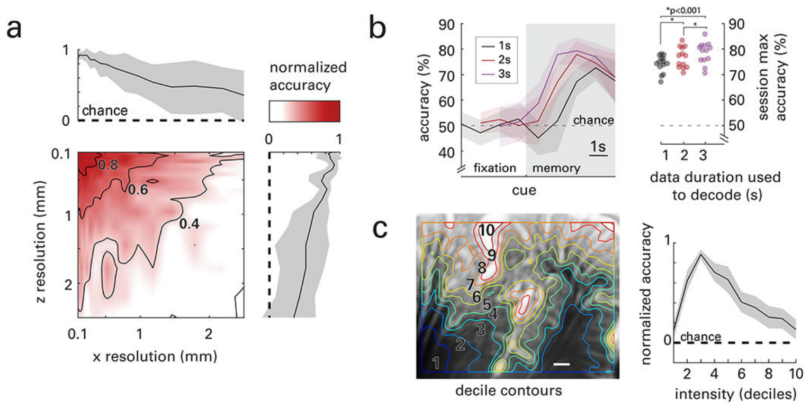

# 用功能性超声神经成像进行运动意图的单试次解码
[← 回到首页](..)

- **原题**：Single-trial decoding of movement intentions using functional ultrasound neuroimaging
- **著者**：Sumner L. Norman1,⋄, David Maresca5,⋄,†, Vasileios N. Christopoulos1,2,⋄,‡, Whitney S. Griggs1, Charlie Demene3,4, Mickael Tanter3,4, Mikhail G. Shapiro5,*, Richard A. Andersen1,2,6,*　（⋄ 共同第一作者；* 通讯作者；† 现隶属：荷兰代尔夫特理工大学成像物理系；‡ 现隶属：美国加州大学河滨分校生物工程系）
- **通讯作者**：mikhail@caltech.edu (M.G.S.); richard.andersen@vis.caltech.edu (R.A.A.)
- **期刊**：Neuron 109(9), 1554–1566.e4 (2021)
- **DOI**：[10.1016/j.neuron.2021.03.003](https://doi.org/10.1016/j.neuron.2021.03.003)
- **日期**：发表 2021-05-05（NIH 作者手稿版未载投稿与接收日期）
- **版权**：NIH 作者手稿版（Author Manuscript），PMC8105283。出版方免责声明：本 PDF 为一份未经编辑、已被接收发表的手稿，由出版方提供给读者；该手稿将经过编辑排版与校对，可能发现影响内容的错误；适用于本刊的所有法律免责声明同样适用。正式发表版：Cell Press / Elsevier 出版的 Neuron 109(9), 1554–1566.e4。
- **单位**：
  - 1 Biology & Biological Engineering, California Institute of Technology, Pasadena, CA 91125, USA（加州理工学院 生物学与生物工程系）
  - 2 T&C Chen Brain-Machine Interface Center, California Institute of Technology, Pasadena, CA 91125, USA（加州理工学院 T&C Chen 脑机接口中心）
  - 3 Physics for Medicine Paris, Inserm, CNRS, ESPCI Paris, PSL Research University, 75012 Paris, France（法国巴黎 医学物理实验室，Inserm / CNRS / ESPCI Paris / PSL 研究型大学）
  - 4 INSERM Technology Research Accelerator in Biomedical Ultrasound, Paris, France（法国巴黎 Inserm 生物医学超声技术研究加速器）
  - 5 Chemistry & Chemical Engineering, California Institute of Technology, Pasadena, CA 91125, USA（加州理工学院 化学与化学工程系）
  - 6 Lead Contact（牵头联系人）

---

> **本系列**：六篇核心论文的完整译文，逐一独立成篇。另见 [清醒灵长类的 fUS 脑活动传播（Dizeux 2019）](fusi-primate-propagation) · [首例闭环超声脑机接口（Griggs 2024）](fusi-closed-loop-bci) · [经颅窗人脑 fUS 成像（Rabut 2024）](fusi-human-cranial-window) · [LIP 扫视的介观组织（Griggs 2025）](fusi-mesoscopic-lip) · [移动中的人脑 fUS 成像（Soloukey 2025）](fusi-mobile-human)

## 摘要

新技术是理解脑内神经环路与系统动态活动的关键。在此，我们表明，一种基于超声的微创方法可用于检测运动规划的神经相关信号，其中包括运动方向与效应器。在非人灵长类（non-human primate，NHP）执行记忆引导运动的过程中，我们使用功能性超声（functional ultrasound，fUS）神经成像，以 100 μm 的分辨率记录了脑血容量（cerebral blood volume，CBV）的变化。我们在后顶叶皮层（posterior parietal cortex，PPC）——一个对空间知觉、多感觉整合与运动规划都重要的脑区——上方的硬脑膜外完成了记录。随后，我们利用运动之前延迟期的 fUS 信号，解码出动物意图的运动方向与效应器。单试次解码是脑机接口（brain-machine interface，BMI）的前提——后者正是能够受益于该技术的一项关键应用。这些结果是发展侵入性更低、分辨率更高、可扩展的神经记录与脑接口工具的关键一步。

> **【译者注】** 侵入性口径：本文的 “minimally invasive”（微创）是相对**皮层内电极**而言——本研究的猕猴实验需开颅并植入慢性腔室、头部固定，探头经腔室置于**硬脑膜外**。主材料 §1.2.1（3）据此把现阶段的 fUS-BCI 归为**半侵入（硬膜外或经颅窗）**而非无创，§1.2.1（5）给出读、写两侧侵入性不对称的物理原因。读者不宜把本文的 “minimally invasive” 读作“无创”。

## 引言

与脑接口的新技术，是理解神经环路与系统动态活动、诊断与治疗神经系统疾病的关键。许多神经接口基于皮层内电生理，它能在优异的时间分辨率下直接获取神经元的电信号。然而，电极必须经由风险显著的开放性脑手术植入。该过程会造成急性与慢性的局部组织损伤（Polikov et al., 2005），且植入物随时间发生材料降解（Barrese et al., 2013; Kellis et al., 2019）。侵入式电极也难于扩展，在采样密度与脑覆盖范围上都受限。这些因素限制了其寿命与性能（Kellis et al., 2019; Welle et al., 2020; Woolley et al., 2013）。

脑电图（electroencephalography，EEG）与功能磁共振成像（functional magnetic resonance imaging，fMRI）等无创技术在研究场景中已取得相当大的成功。即便如此，它们仍受限于低空间分辨率、对大体积脑区活动的求和，以及信号在多种组织与骨中的弥散。硬膜外皮层脑电（electrocorticography，ECoG）等微创技术处于中间地带，在保持相对高性能的同时不损伤健康脑组织（Benabid et al., 2019; Shimoda et al., 2012）。然而，难以有空间特异性地分辨来自深部皮层或皮层下结构的信号。此外，硬膜下 ECoG 仍需穿透硬脑膜并暴露其下的脑组织，因而依然属于侵入式。

在此，我们评估功能性超声（fUS）成像——一项新近发展起来的微创神经成像技术——在提供运动意图单试次解码方面的潜力；运动意图是一种在脑机接口（BMI）中兼具根本重要性与适用性的神经信号过程。fUS 成像是一种血流动力学技术，它利用超快多普勒血管成像（ultrafast Doppler angiography）可视化区域血容量的变化（Bercoff et al., 2011; Mace et al., 2013;  Macé et al., 2011）。与现有的功能神经成像技术相比，它具有优异的时空分辨率（< 100 μm 与 100 ms），并在数厘米的大视场内具有高灵敏度（可探测约 1 mm/s 的速度（Boido et al., 2019））。自 2011 年被提出以来（Macé et al., 2011），fUS 已被用于成像癫痫发作（Macé et al., 2011）、嗅觉刺激（Osmanski et al., 2014）以及自由活动啮齿类执行行为任务（Sieu et al., 2015; Urban et al., 2015）期间的神经活动。它也被应用于非啮齿类物种，包括雪貂（Bimbard et al., 2018）、鸽子（Rau et al., 2018）、非人灵长类（NHP）（Blaize et al., 2020; Dizeux et al., 2019）与人类（Demene et al., 2017; Imbault et al., 2017; Soloukey et al., 2020）。与 fMRI 不同，fUS 可用微型头戴式换能器在自由活动的受试者上实施（Sieu et al., 2015）。此外，在时空分辨率与灵敏度方面，fUS 的血流动力学成像性能约比 fMRI 好 5 至 10 倍（Deffieux et al., 2018; Macé et al., 2011; Rabut et al., 2020）。

> **【译者注】** 术语并置：本文通篇写作 “fUS”／“fUS imaging”，主材料术语表 A 的条目为 **FUS / fUS / fUSI**（（功能）超声，fUS 特指功能成像），二者同指。本文的 “ultrafast Doppler angiography”（超快多普勒血管成像）与 “power Doppler”（功率多普勒）指同一条测量流程的两面——前者强调超快平面波采集，后者强调对多普勒信号功率的估计；主材料 §4.1.1~4.1.3 把该流程拆为采集、杂波滤波与功率多普勒计算三步，其中本文的杂波滤波用 SVD 实现，与主材料 §4.1.2 所述主流方法一致。

在本研究中，我们利用 fUS 成像的高灵敏度来检测 NHP 的运动意图。我们训练两只动物执行记忆延迟的指示性眼动（扫视）与手部运动（伸够），目标是外周目标。与此同时，我们在整个任务期间经颅窗记录后顶叶皮层（PPC）上方的血流动力学活动。PPC 是位于视觉皮层与运动皮层之间的联合皮层区域，参与包括空间注意（Colby and Goldberg, 1999）、多感觉整合（Andersen and Buneo, 2002）与运动规划中的感觉运动变换（Andersen and Cui, 2009）在内的高级认知功能。PPC 的功能特性已通过电生理技术（Andersen et al., 1987; Andersen and Buneo, 2002; Colby and Goldberg, 1999; Gnadt and Andersen, 1988; Snyder et al., 1997）与功能磁共振技术（Kagan et al., 2010; Wilke et al., 2012）得到充分研究，为与 fUS 数据的比较提供了充足的证据。PPC 包含若干在解剖上特化的亚区，其中包括参与规划扫视运动的外侧顶内沟区（lateral intraparietal area，LIP）与参与规划伸够运动的顶叶伸够区（parietal reach region，PRR）（Andersen and Buneo, 2002; Calton et al., 2002; Snyder et al., 2000, 1997）。重要的是，二者的活动可在单帧 fUS 成像内被同时记录（近似层体积 12.8 × 13 × 0.4 mm）。

通过记录动物执行运动任务期间的脑活动，我们提供了 fUS 能够检测 NHP 运动之前运动规划活动的证据。我们把这一结果拓展到在单试次水平上解码行为的若干维度，包括：(1) 猴子何时进入任务阶段，(2) 它们意图使用哪个效应器（眼或手），以及 (3) 它们意图朝哪个方向运动（左或右）。这些结果首次表明，fUS 能够以足够的灵敏度对大型动物的血流动力学进行成像，从而解码一次意图运动的时间与目标。这些发现也代表着朝向把 fUS 用于 BMI 的关键一步。此类接口通过解读与用户意图相关的神经活动，在脑与机器之间提供直接的因果联系。它们既是神经科学研究的出色工具（Sakellaridi et al., 2019），也可作为神经假体，使瘫痪者能够控制辅助设备，包括计算机光标与假肢（Aflalo et al., 2015; Collinger et al., 2013; Hochberg et al., 2012, 2006）。随着 fUS 硬件与软件的发展使实时成像与处理成为可能，fUS 有望成为未来 BMI 的一项有价值的工具。

## 结果

为在 PPC 中寻找与目标相关的血流动力学信号，我们使用一枚微型化的 15 MHz 线阵换能器，经颅窗置于硬脑膜上，从 NHP 采集 fUS 图像。该换能器提供 100 μm × 100 μm 的面内空间分辨率与约 400 μm 的层厚，覆盖宽度 12.8 mm、穿透深度 16 mm 的一个平面。

我们把探头的表面法向以冠状方位置于 PPC 上方（图 1a、b）。随后，我们从每只动物可用的体积数据中选取感兴趣的平面（图 1c~f）。具体而言，我们选择的平面能在单幅图像内同时覆盖顶内沟（intraparietal sulcus，ips）的外侧岸与内侧岸，并表现出受行为调制的血流动力学活动。我们使用平面波成像序列，脉冲重复频率（pulse repetition frequency，PRF）为 7500 Hz，并把每秒中 500 ms 时段内采集的帧相干复合成功率多普勒图像，刷新率为 1 Hz。

> **图 1**. 解剖成像区域。(a) 轴状面与 (b) 冠状切面上开颅视野的示意图，叠加在 NHP 脑图谱之上（Calabrese et al., 2015）。24 × 24 mm（内径）的腔室以表面法向置于开颅后的颅骨之上。(c、d) 猴子 L 与猴子 H 的三维血管图。两只猴子的视野都覆盖了中央沟与顶内沟。(e、f) 猴子 L 与猴子 H 的代表性切面，显示顶内沟（虚线，标注为 ips）及方位标记（l = 外侧或左，r = 右，m = 内侧，v = 腹侧，d = 背侧，a = 前，p = 后）。

### 记忆引导扫视期间的血流动力学响应

为在单试次内分辨目标特异的血流动力学变化，我们训练两只 NHP 执行记忆延迟的指示性扫视。我们采用了与既往实验相似的任务设计——那些实验用 fMRI 血氧水平依赖（BOLD）信号（Kagan et al., 2010; Wilke et al., 2012）与可逆药物失活（Christopoulos et al., 2015）研究 PPC 各区域的作用。具体而言，猴子需要记住出现在左侧或右侧半视野中的线索的位置，并在中央注视线索消失后执行该运动（图 2a）。记忆期被设定得足够长（依动物的训练程度与成功率，为 4.0~5.1 s，各场次均值 4.4 s），以便捕捉血流动力学变化。我们在每只动物（N = 2）执行记忆延迟扫视的同时采集 fUS 数据。我们在 16 天内采集了 2441 个试次（猴子 H 1209 个，猴子 L 1232 个）。

我们使用基于 Student t 检验的统计参数图（单侧，并经错误发现率校正）来可视化 PPC 中偏侧化活动的模式（图 2b、g）。我们从局部区域观察到整个任务过程中 CBV 的事件相关平均（event-related average，ERA）变化（图 2c~f、h~i）。偏侧化调制的血流动力学活动的空间响应场出现在 ips 的外侧岸（即 LIP 内）。这些响应场与 ERA 波形在两只动物之间相似，并与既往电生理（Graf and Andersen, 2014）与 fMRI BOLD（Wilke et al., 2012）结果一致。具体而言，来自 LIP 的 ERA 显示，记忆期对侧（右）线索试次的响应高于同侧（左）线索试次（对记忆期曲线下面积做单侧 t 检验，p < 0.001）。

猴子 H 在推测的内侧顶叶区（medial parietal area，MP）——半球内侧壁上一小块皮层——表现出相似的朝向调制响应（我们未在猴子 L 中记录到这一区域效应，因为 MP 位于成像平面之外）。这种调制支持了既往研究中观察到的 MP 参与方向性眼动的证据（Thier and Andersen, 1998）。相比之下，LIP 区之外的局灶微血管区域也对任务起始表现出强事件相关响应，但未受目标方向调制（例如图 2e）。

> **图 2**. 扫视任务、事件相关响应图与波形。(a) 一个试次开始时，动物注视中央线索（红色菱形）。随后，目标线索（红色菱形）在左侧或右侧视野短暂闪现。在记忆期，动物需在继续注视中央线索的同时记住目标的位置。当中央线索熄灭（执行信号）后，动物朝记忆中的外周目标位置执行扫视，并在获得奖赏之前保持注视。*所示为各场次的均值；注视期与记忆期在每个场次内保持一致，但在不同场次之间分别于 5.4~6.3 s 与 4.0~5.1 s 之间变化，取决于动物的训练程度。注视期与记忆期加入 400 ms 的抖动（绿色阴影区，均匀分布），以避免动物预期试次阶段的切换。(b~f) 猴子 L 在记忆引导扫视期间 CBV 变化的代表性活动图与事件相关平均（ERA）波形。(g~i) 猴子 H 的活动图与 ERA 波形。(b) 统计图显示，在记忆延迟期，右侧线索相较左侧线索的扫视在若干局部区域具有显著更高的信号变化（SC）（曲线下面积的单侧 t 检验，p < 0.01），即对侧调制的血管斑块。(c、d) LIP 中的 ERA 波形显示出局部群体特异的偏侧化调制。(e) LIP 之外的小血管表现出与任务结构相关的事件相关结构，但不受目标方向调制。(f) 灌注大片皮层的血管不表现事件相关信号。(g) 猴子 H 的图。(h) ERA 波形显示 LIP 中的偏侧化调制。(i) 猴子 H 的内侧顶叶区（MP）也出现目标调制。(c~f) 各面板共用同一量程（9% 信号变化），(h、i) 亦然（14%）。ERA 以跨试次均值显示，阴影区表示标准误（s.e.m.）。

### 记忆延迟伸够

在第二项实验中，我们也在每只 NHP 执行记忆伸够时采集了 fUS 信号。我们在 8 个场次中共采集了 1480 个试次（猴子 H 543 个，猴子 L 937 个）。该任务与扫视任务相似，但动物的注视在整个试次中保持不变，包括注视期、记忆期与伸够运动期（图 3a）。记忆期为 3.2~5.2 s，依动物的训练程度与成功率而定（各场次均值 4.2 s）。ips 外侧岸的 ERA 揭示出具有方向特异调制的神经元群体（图 3c、d、f、g）。对猴子 H 的扫视规划有响应的 MP 区（图 2i），对伸够规划没有响应。推测的顶叶伸够区（PRR）内侧岸上的群体未表现出偏侧化调制，但确实对运动表现出双侧调制（图 3d、g）。这些结果与电生理记录一致：作为群体，PRR 神经元编码两侧半空间，而 LIP 神经元主要编码对侧空间（Quiroga et al., 2006）。

> **图 3**. 伸够任务、事件相关响应图、波形与解码准确率。(a) 猴子使用二维操纵杆执行记忆引导伸够任务。试次开始时，动物注视中央线索（红色菱形）并把操纵杆移动到其中心（绿色圆圈）。随后，目标（绿色圆圈）在左侧或右侧视野短暂闪现。动物需在把眼与手都注视在中央线索上的同时记住其位置。当手部中央线索熄灭（执行信号）后，动物朝记忆中的目标位置执行伸够，并在获得奖赏之前保持该位置。重要的是，整个试次期间都保持注视。*所示为各场次的均值；注视期与记忆期在每个场次内保持一致，但在不同场次之间分别于 2.5~5.9 s 与 3.2~5.2 s 之间变化。注视期与记忆期加入 400 ms 的抖动（绿色阴影区，均匀分布），以避免动物预期试次阶段的切换。(b) 统计图显示，在记忆延迟期，右侧线索相较左侧线索的伸够在若干局部区域具有显著更高的信号变化（SC）（曲线下面积的单侧 t 检验，p < 0.01，按图像像素数做 FDR 校正），即对侧调制的血管斑块。(c) 来自 ips 外侧岸的 ERA 波形揭示出伸够运动中的偏侧化调制。(d) ips 内侧岸的 ERA 波形显示出一个对伸够运动双侧调制的群体。ERA 以跨试次均值显示，阴影区表示标准误（s.e.m.）。(e~g) 猴子 H 的统计图与 ERA 波形。

### 单试次解码

我们使用单试次的 fUS 数据预测即将发生的运动的方向（图 4a）。简言之，我们使用类间主成分分析（classwise principal component analysis，CPCA）降低数据维度。我们选择 CPCA，是因为它非常适合高维度、小样本的判别问题（Das and Nenadic, 2009, 2008）。随后，我们使用普通最小二乘回归（ordinary least squares regression，OLSR）把（来自记忆延迟期的）变换后 fUS 数据回归到运动方向（即类别标签）上。最后，我们使用线性判别分析（linear discriminant analysis，LDA）把每个试次得到的数值分类为推测的左向或右向运动计划。所有报告的结果都用 10 折交叉验证生成。

> **图 4**. 单试次解码。(a) 交叉验证的单试次运动方向解码的数据流程图。按所用的交叉验证技术把训练图像与测试数据分开。运动意图的预测针对单个试次作出，基于降维以及由训练数据连同相应类别标签（即实际运动方向）构建的分类模型。(b) 解码准确率随时间的函数，覆盖全部数据集。(c) 解码准确率随用于训练解码器的试次数的函数。(b)、(c) 中的数据点为均值，阴影区表示跨场次的标准误（s.e.m.）。(d) 跨时间解码器准确率，使用训练与测试数据在 1 s 滑动窗下的所有组合。结果按每只动物的一个示例场次显示。显著性阈值以等值线表示（p < 0.05，FDR 校正）。在记忆期或运动期训练分类器，均能成功解码记忆期与运动期。(e) 代表性解码器权重图（猴子 L）。在给出执行信号之前，按空间与时间显示权重最高的前 10% 体素，叠加在血管图上。另见图 S1 与补充视频。

在一个场次内（即从记忆延迟期解码），扫视方向的预测准确率在给定的 30 分钟记录中为 61.5%（相对随机水平的二项检验，p = 0.012）至 100%（p < 0.001）。全部场次与记录的平均准确率为 78.6%（p < 0.001）。伸够方向的预测准确率为 73.0%（相对随机水平的二项检验，p < 0.001）至 100%（p < 0.001）。全部场次与记录的平均准确率为 88.5%（p < 0.001）。

为分析 PPC 中方向特异信息的时间演化，我们尝试在试次的各个阶段——注视、记忆与运动——沿时间解码运动方向。对每个时间点，我们累加之前的数据。例如，在 t = 2 s 时，我们纳入 t = 0~2 s 的成像数据（其中 t = 0 s 对应注视的开始）。所得的交叉验证准确率曲线（图 4b）显示：注视期的准确率处于随机水平，记忆期的可判别性升高，运动期的解码准确率得以保持。在记忆期，解码器准确率提高，对扫视任务而言，在猴子收到目标线索后 2.08 s ± 0.82 s 时超过显著性（即运动前 2.32 s ± 0.82 s；相对随机水平的二项检验，p < 0.05，对跨时间的 18 次比较做 Bonferroni 校正），对伸够任务而言为 1.92 s ± 1.4 s（运动前 2.28 s ± 1.4 s）。扫视与伸够之间的解码准确率无显著差异。

为确定达到最大解码准确率所需的数据量，我们从训练集中逐步剔除试次（图 4c）。仅用 27 个试次，全部数据集的解码器准确率就达到显著（二项检验，p < 0.05），并继续上升。平均而言，当训练数据达到 75 个试次时，解码器准确率达到最大。

我们解码的究竟是位置、轨迹，还是目标的神经相关信号？为回答这一问题，我们使用了跨时间解码技术。我们用 1 s 的数据滑动窗训练解码器，然后尝试从另一个 1 s 滑动窗中解码意图方向。我们对试次时长内的所有时间点重复该过程，得到一个 n × n 的准确率矩阵，其中 n 为所检验的时间窗数量。交叉验证准确率在记忆期与运动期全程均显著高于随机水平（图 4d，紫线；相对随机水平的二项检验，p < 0.05，对 18 个时间点做 Bonferroni 校正）。换言之，我们从该脑区解码出的信息，在运动准备与运动执行期间高度相似。这一结果表明，该区域编码的是运动计划（Snyder et al., 1997）、视空间注意（Colby and Goldberg, 1999），或二者兼有。尽管意图与注意是相互重叠的抽象概念，本实验设计无法将其区分开，但分离二者的贡献并不会从根本上改变我们的解释。PPC 内不同的空间位置编码这些信息，这一点反映在我们的解码算法为每个体素赋予的不同权重上。解码器把最高的权重放在 LIP 区（图 4e）。这也与该区域的经典功能相符（Andersen and Buneo, 2002; Gnadt and Andersen, 1988）。

### 同步解码记忆期、效应器与方向

为展示 fUS 从单试次数据中解码行为多个维度的能力，我们训练同样的两只动物执行一项记忆延迟、效应器交替出现的任务。该任务在时间结构上与扫视任务和伸够任务相似。但除了在注视期保持视线注视之外，动物还需用右手把操纵杆移动到中央线索处。该线索的颜色指示当执行信号出现时应运动哪个效应器：蓝色表示扫视，红色表示伸够。如果猴子把正确的效应器（眼/手）移动到正确的方向（左/右），就能获得液体奖赏（图 5a）。在该任务中，我们共采集了 1576 个试次（猴子 H 831 个，猴子 L 745 个），来自四个场次（每只动物两个）。

> **图 5**. 同步解码任务、效应器与方向。(a) 记忆延迟扫视与伸够交替混排的任务。试次开始时，动物注视中央线索，并用手把操纵杆移动到中央线索处。中央注视线索或为蓝色（提示扫视，上排），或为红色（提示伸够，下排），逐试次随机，即非区组设计。随后，目标（白色圆圈）在左侧或右侧视野短暂闪现。动物需在继续把眼与手注视在中央线索上的同时记住其位置。当中央线索熄灭（执行信号）后，动物朝记忆中的外周目标位置执行眼或手的运动。*所示为各场次的均值；注视期在每个场次内保持一致，但在不同场次之间于 2.4~4.3 s 之间变化。(b) 以百分比表示的解码准确率混淆矩阵（各列之和为 100%）。(c) 连续 14 个试次的分类示例。分类预测以线条表示，阴影区表示真值。经分类器子空间变换后的 fUS 图像时间序列示例以红色显示。在预测任务时段之后，分类器仅用来自所预测任务时段（第一行）的数据解码效应器（第二行）与运动方向（第三行）。

我们使用一个决策树解码器，解码 (a) 任务结构、(b) 效应器与 (c) 动物的目标方向这三者的时间进程。首先，我们预测任务的记忆期相对于非记忆期（包括运动、试次间隔、注视等）。我们把这一区分称为“有任务/无任务”（图 5c，有任务/无任务）。为预测猴子何时进入记忆期，解码器使用连续数据，其中每幅功率多普勒图像都被标注为有任务或无任务。在预测出动物进入任务阶段之后，决策树的第二层使用来自所预测任务阶段的数据来分类效应器与方向（图 5c，伸够/扫视、左/右）。这些解码各自都沿用与前述相同的策略：交叉验证的 CPCA。图 5b 描绘了猴子 H 与猴子 L 各分类解码准确率的混淆矩阵。分类器对无任务期的预测正确率分别为猴子 H 85.9%、猴子 L 88.8%；对左/右的判别分别在这两只动物的 72.8% 与 81.5% 试次上正确；对眼/手的判别分别在 65.3% 与 62.1% 的试次上正确。三项解码都显著高于随机水平（p < 0.05，相对随机的二项检验，对三次比较做 Bonferroni 校正）。

> **【译者注】** “3 个自由度”的口径：本文的 3 自由度指**任务状态（有任务/无任务）+ 效应器（眼/手）+ 方向（左/右）**，由决策树**级联**给出而非同时输出；后两项只在**已预测**的任务时段内解码，且该时段被强制假定持续 3 s（见方法“用于效应器交替混排任务的多解码器”）。主材料 §5.2 与 §8.2.1 所述“多解码器级联”即指此结构。

### 血流动力学信号与信息含量

与成熟神经成像技术相比，fUS 被宣称的优势在于更高的分辨率与灵敏度。为检验提高分辨率带来的收益，我们在系统性降低图像分辨率的同时对运动目标进行分类。我们沿成像平面的每个维度对图像做低通滤波后重采样：x——沿探头表面方向，z——沿图像深度方向。随后我们使用整幅图像——降采样后的图像包含更少的像素——来解码运动方向。准确率随体素尺寸增大而持续下降（图 6a）。该效应是各向同性的，即在 x 与 z 两个方向上相似。

> **图 6**. 空间分辨率、时间窗与平均功率多普勒强度的影响。(a) 准确率随 x 方向（横跨成像平面）与 z 方向（平面内深度）分辨率的降低而下降，且下降方式各向同性。(b) 解码准确率随解码器时间窗长度的函数（1、2、3 s 窗分别以黑、红、紫表示）。数据对齐到解码所用时间窗的末端。圆点表示每个场次在每种窗长下的最大解码准确率。星号表示各组之间的统计显著性（Student t 检验，所有组合均 p < 0.001）。(c) 一幅典型血管图，叠加把图像按平均功率多普勒强度划分为十分位数的等值线。解码准确率随平均功率多普勒强度变化。信息量在第 3 分位数最大，该分位数主要包含皮层内的小血管。皮层下与一级单元血管（即第 1 与第 10 十分位数）对运动方向的解码信息量最小。所有数据均表示均值；阴影区（如有）表示跨场次的标准误（s.e.m.）。

我们假设，对解码有用的功能信息主要位于成像平面内低于分辨率的血管（< 100 μm）之中。这一假设基于充血反应的生理机制：充血始于脑实质小动脉与一级毛细血管，即直径 < 50 μm 的血管（Rungta et al., 2018）。为检验该假设，我们按平均功率多普勒强度对体素排序，并按十分位数分割，得到一幅排序十分位数的空间图（图 6c）。第 1~2 十分位数主要覆盖皮层下区域。第 3~8 十分位数主要覆盖皮层各层。第 9 与第 10 十分位数则基本局限于大动脉，常见于皮层表面与脑沟内。随后，我们用每个十分位数的数据对运动目标进行分类。我们对每个场次的准确率做了归一化，其中 0 代表随机水平（50%），1 代表各十分位数中达到的最大准确率。当使用平均多普勒功率位于第 3 十分位数之内的图像区域来解码运动方向时，准确率达到峰值。该十分位数主要由皮层血管构成，其中大部分处于或低于 fUS 的分辨率极限。这一结果与我们的假设一致，即功能性充血源自低于分辨率的血管（Boido et al., 2019; Maresca et al., 2020），也与既往在大鼠（Demené et al., 2016）与雪貂（Bimbard et al., 2018）中的研究相符。

## 讨论

### 与既往工作相比的贡献

本工作把超声神经成像的灵敏度推向新高，其基础是此前两项在非人灵长类中开展的 fUS 研究。重要进展包括：(1) 用单试次的 fUS 数据分类行为；(2) 在行为发生之前检测其神经相关信号；(3) 首次用 fUS 研究运动规划；(4) 在用于单试次与实时成像的超快超声成像方面取得重要进展，为 BMI 打下前身。Dizeux 等（2019）首次在 NHP 中使用 fUS，发现眼动任务期间辅助眼动区（supplementary eye field，SEF）的 CBV 变化，并绘制了皮层各层内的方向性功能连接（Dizeux et al., 2019）。Blaize 等（2020）记录 NHP 视觉皮层（V1、V2、V3）的 fUS 图像以重建视网膜拓扑图（Blaize et al., 2020）。这两项研究都探索了 fUS 灵敏度的边界。Dizeux 等表明，SEF 的 fUS 信号与行为信号的相关性在统计上可预测动物的成功率。然而，该预测需要 40 s 的数据。Blaize 等使用二分类技术（随机水平 50%）来确定构建视网膜拓扑图所需的试次数。一只猴子在平均 10 个试次后达到 89% 的准确率，第二只为 91.8%。

本研究首次仅用单试次的数据就成功分类 fUS 活动。此外，除了检测任务本身，我们还预测了多个任务变量（例如效应器、方向）之间的差异。我们还在动物执行行为之前解码了其行为。与既往对刺激或任务的多试次检测相比，从单试次中检测认知状态变量为 fUS 神经成像树立了新的标杆。本研究是首次用 fUS 考察运动规划与执行的工作，因而也是未来用 fUS 研究大型动物运动学习与运动控制的神经相关信号这一研究方向的第一个范例。最后，本文发展的方法本身即是技术成就：它引入了最小延迟（补充视频 1、图 S1），并在不同动物与任务范式之间保持稳健（图 2~5）。因此，它们可应用于一系列需要实时信号检测的任务与应用。

### 效应器与方向的同步解码

PPC 位于背侧通路之中，这提示：视空间变量在该区得到良好表征，而效应器等其它运动变量可能更难检测。确实，方向的解码准确率（左 vs. 右）高于效应器的解码准确率（手 vs. 眼）（图 5b）。观察到的性能差异很可能源于 PPC 对侧的偏好，以及某些区域中效应器群体的部分混杂。除了方向与效应器，我们还解码了有任务与无任务阶段。这是迈向 BMI 等闭环反馈环境的关键一步：在这类环境中，用户自行门控其运动，或者解码器无从知晓运动或任务时序信息。此外，任务状态、方向与效应器的同步解码，为把 fUS 用于复杂行为与 BMI 都迈出了有希望的一步。

### fUS 与电生理的比较

fUS 监测有几项明显的优势。fUS 可用单个探头同时可靠地记录脑的大片区域（例如 LIP 与 PRR 两个皮层区）。fUS 也比皮层内电极侵入性低得多：它不需要穿透硬脑膜。这是一项重要特性，因为它大大降低了该技术的风险水平。此外，尽管组织反应会随时间使慢性电极的性能退化（Woolley et al., 2013），fUS 在硬脑膜外工作，从而避免了这些反应。另外，得益于超声声束可重构的电子聚焦与宽视场，我们的方法适应性很强，这使定位感兴趣区域容易得多。fUS 还能触及深藏于脑沟内的皮层区以及电生理极难定位的皮层下脑结构。最后，fUS 所提供的神经群体介观视角可能有利于解码器的泛化。因此，跨天和/或跨被试地训练与使用解码器，将是一个令人兴奋且重要的未来研究方向。

其他技术，例如无创头皮 EEG，已被用于单试次解码并作为 BMI 系统控制的神经基础（Norman et al., 2018; Wolpaw et al., 1991; Wolpaw and McFarland, 2004）。最早的基于 EEG 的概念验证 BMI 实现了一位的解码（Nowlis and Kamiya, 1970）。现代 EEG BMI 的性能在被试之间差异很大（Ahn and Jun, 2015），但可实现两个自由度、70~90% 的准确率（Huang et al., 2009）。这一性能与本文用 fUS 所报道的性能相当。

然而，作为一项仍在演进的神经成像技术，fUS 的性能正在迅速提高，包括近期在三维 fUS 神经成像方面的突破（Rabut et al., 2019; Sauvage et al., 2018）。这些技术进步很可能预示着 fUS 单试次解码与未来 BMI 的改进。

硬膜外 ECoG 是一种微创技术，被用于神经科学研究、临床诊断，以及作为 BMI 的记录手段。在侵入性更强的硬膜下 ECoG 取得成功的基础上，早期在猴子中实施的硬膜外 ECoG 已能解码连续的三维手部轨迹，准确率略低于硬膜下 ECoG（Shimoda et al., 2012）。更晚近，覆盖人躯体感觉皮层的双侧硬膜外 ECoG 支持解码 8 个自由度（每臂 4 个自由度，包括机械臂的三维平移与腕部屈曲），准确率约 70%（Benabid et al., 2019）。在本研究中，我们证明单侧 fUS 成像 PPC 即可支持 3 个自由度，准确率与之相近。这比现代双侧 ECoG 栅格所能达到的自由度数少。但它表明，作为一项年轻的技术，fUS 拥有极佳的潜力。例如，未来的工作可以把这些发现拓展到同样记录双侧皮层与皮层下结构，如 M1、PPC 与基底节。随着 fUS 记录技术迅速朝着高速、宽覆盖、三维扫描方向发展，这类记录将变得司空见惯。

### fUS 技术的进展

fUS 成像与计算能力的改进持续加速着功能帧率与灵敏度。新的扫描仪样机有望带来更快的刷新率，目前已达 6 Hz（Brunner et al., 2020）。尽管高时间分辨率会对血流动力学响应过度采样，但它能检测到新型特征，例如脑区间功能连接的方向性映射（Dizeux et al., 2019）。用户也可以有意识地牺牲帧率，把更多帧复合进功能图像，从而提高图像灵敏度。因此我们预计：尽管这些结果是单试次脑状态解码的关键一步，它们也只是众多即将到来的改进中的第一步。

### 面向 BMI 的目标解码

本文呈现的结果提示，fUS 有潜力作为 BMI 的记录技术。一个潜在的局限是神经活动所引发的血流动力学响应在时间上的潜伏。解码意图肢体运动速度的基于电生理的 BMI 需要尽可能小的潜伏。然而在许多情况下，目标解码绕开了对瞬时更新的需求。例如，若 BMI 解码的是目标的视空间位置（正如我们在此所做的），外部效应器（例如机械臂）可以在没有低层、短潜伏信息（例如关节角度）的情况下完成该运动。此外，PPC 中发现的目标信息可表征连续运动的序列（Baldauf et al., 2008）以及同时存在的多个效应器（Chang and Snyder, 2012）。最后，未来的目标解码器有可能利用腹侧流通路各区域的信息直接解码物体语义（Bao et al., 2020）。因此，目标解码的这些独特优势可以在不需要短潜伏信号的条件下提高 BMI 的效能。

> **【译者注】** 延迟归属：本文关于血流动力学潜伏的讨论与主材料 §5.4.1 一致——神经血管耦合的 ~2 s 延迟是**物理约束、不可压缩**，其中 2.08 ± 0.82 s 这一实测值正出自本文（主材料 §8.2.1 记为“不是估计值，是数据”）。但须区分：本文的解码**全部为离线**（10 折交叉验证，无在线回路、无刺激反馈）；主材料 §7.3 记录的首例实时闭环超声脑机接口是 Griggs 2024（主材料 §8.2.2）。

本研究形态的 fUS BMI 还可能使 BMI 走出运动系统。最佳应用或许需要在与血流动力学相匹配的时间尺度上触及深部脑结构或大视场。例如，诸如情绪及其他精神状态解码之类的认知 BMI（Shanechi, 2019）因精神障碍的患病率高得惊人而备受关注。与 fUS 一样，认知 BMI 是一个规模小但发展迅速的研究领域（Andersen et al., 2019; Musallam et al., 2004）。我们的愿景是让这些研究领域共同成熟，因为它们在时间尺度与空间覆盖上十分匹配。

关于目标解码的一个顾虑是：一次错误以及随后的运动计划改变发生在很短的时间尺度上。无论采用何种记录方法，这类突变都难以解码；直到最近，它才作为慢性植入式电生理 BMI 中的一个潜在特征出现（Even-Chen et al., 2017）。动作抑制通常被归因于皮层下核团，例如基底节（Jin and Costa, 2010）与丘脑底核（Aron et al., 2016），而非最常用于 BMI 的皮层区域。fUS 或许能同时成像皮层与这些皮层下核团，但仍将受制于血流动力学延迟。降低系统潜伏并用互补方法检测错误信号，将是未来研究的一个重要课题。

### 扫视规划期间后顶叶皮层的活动

激活图揭示了扫视规划期间 PPC 内的一些区域（约 100 μm 至约 1 cm），它们对侧目标的响应强于同侧目标。这些区域在记忆延迟期的对侧调制与既往 fMRI 研究的发现一致（Kagan et al., 2010; Wilke et al., 2012）。我们的结果也与 NHP 电生理记录的大量证据一致——那些证据表明 LIP 参与扫视运动的规划与执行（Quiroga et al., 2006; Snyder et al., 1997）。值得注意的是，在记忆延迟扫视任务中，ERA 波形所显示的目标特异差异显著大于 fMRI 信号，即 2~5% 对 0.1~0.5%（Kagan et al., 2010; Wilke et al., 2012），且空间分辨率精细得多。尽管所关注的深部亚区延伸至探头表面以下 16 mm，仍能获得这样的灵敏度。在该深度处，信号衰减约为 −7.2 dB（假设组织均匀，使用 15 MHz 探头）。使用中心频率更低的探头可以增加成像深度，代价是时空分辨率下降。使用微泡（Errico et al., 2016）或生物分子对比剂（Maresca et al., 2020）或许能增强血流动力学对比度，从而在不牺牲分辨率的前提下实现更深的成像。

除了已被充分研究的 PPC 亚区之外，我们还识别出内侧顶叶区（MP）——位于内侧顶叶区 PG（PGm）之内（Pandya and Seltzer, 1982）——中的若干活动斑块。这些功能区域在尺寸与幅度上都比靠近 ips 的区域小得多。这可能是既往 fMRI 研究未报道 MP 活动的一个潜在原因。然而，电生理研究已表明，刺激该区域可诱发目标导向的扫视，说明它参与眼动（Thier and Andersen, 1998）。此处补充的血流动力学结果，是关于 MP 功能的第一个血流动力学证据。该发现的一个局限是，我们未在第二只动物中观察到此类活动，很可能是因为 MP 不在成像平面内。

发展三维 fUS 成像的当前努力（Rabut et al., 2019）将消除这一局限，使我们能依据响应特性识别新的区域。

### 伸够规划期间后顶叶皮层的活动

我们也在记忆延迟伸够任务期间采集了数据。ERA 波形识别出 ips 内侧区域在记忆期 CBV 的升高。顶叶伸够区（PRR）位于 ips 的内侧岸，其特点是功能上对效应器（即手臂）具有选择性（Christopoulos et al., 2015）。我们在该区域观察到的响应是效应器特异的：它们未出现在扫视数据中。然而，这些响应不是方向特异的：左侧线索与右侧线索试次都出现 CBV 活动的升高。这种双侧的伸够响应可以用记录方法的空间尺度来解释。PRR 的单细胞电生理揭示出对侧手部运动规划调制的单个神经元，但相当一部分 PRR 神经元同样受同侧运动规划调制（Quiroga et al., 2006）。在 fUS 的分辨率极限（约 100 μm）之内，每个体素记录的是该体素（约 100 μm × 100 μm × 400 μm）内神经元活动之和的血流动力学响应。因此，结合既往文献，我们的结果提供了如下证据：(1) 同侧调制与对侧调制神经元的群体大致相当；(2) 这些群体在低于分辨率的尺度（100 μm）上是混杂的。我们还在 ips 外侧岸发现了编码即将发生的伸够目标方向的活动，即响应对侧目标更强。尽管该区域主要参与扫视运动，神经生理学研究也报道过 LIP 区内编码伸向外周目标的伸够的神经元（Colby and Duhamel, 1996; Snyder et al., 1997）。该区域在 ips 外侧岸上位于扫视相关区域更靠腹侧的位置，可能处于腹侧顶内沟区（ventral intraparietal area，VIP）之内。VIP 是视觉与触觉的双模态区域（Duhamel et al., 1998），电刺激它会产生躯体运动（Cooke et al., 2003; Thier and Andersen, 1996），这与它可能在伸够运动中发挥作用相符。

### 指示性运动与自由运动

我们解码的是猴子执行指示性运动时的活动，而非内部驱动的（“自由”）运动。一项既往的 fMRI 研究表明，自由选择运动在 LIP 中产生相似的激活模式，但左/右目标之间的信号差异小于指示性运动（Wilke et al., 2012）。鉴于 fUS 所带来的信号改善，从自由选择运动的单试次中解码运动方向或许是可能的，不过准确率可能受到影响。由于自由选择运动更有利于 BMI 的使用，这是一个重要的未来研究方向。

## 结论

本文所呈现的贡献，要求在具有单试次灵敏度的大规模血流动力学活动记录方面取得重大进展。其解码能力可与现有成熟技术竞争，从而确立了 fUS 作为一项适用于需要单试次分析、实时神经反馈或 BMI 的任务范式的神经科学研究技术的地位。

尽管本文呈现的神经生理学结果来自 NHP，我们预期所述方法能很好地迁移到人类神经成像、单试次解码，并最终迁移到 BMI。我们最初用 NHP 电生理描述了 PPC 的视运动规划功能（Gnadt and Andersen, 1988; Snyder et al., 1997），后来又实现了基于 PPC 电生理的 BMI 控制（Aflalo et al., 2015; Sakellaridi et al., 2019）。把这些发现转化为人类神经成像与 BMI 是一个重要的未来研究方向。除了在神经科学研究中的用途之外，脑机接口还是为患有神经损伤与疾病的人们恢复运动的一项有前景的技术。本文呈现的进展是开启一个侵入性更低、分辨率更高、可扩展的 BMI 新时代的关键第一步。这些工具将赋能研究者，对脑环路的功能与功能障碍——包括神经损伤与疾病——形成独到的洞见。此外，推进这些发现的未来工作，可能通过开发与推广高性能、微创的 BMI，在神经假体领域产生重大影响。

> **【译者注】** 定位与文献核对：主材料 §8.2.1 把本文定为 fUS 单试次解码的**奠基性验证**（表中标注为“离线”，非闭环），并记载过本文 DOI 的一处勘误——早先版本误写为 10.1016/j.neuron.2021.03.026，经 Crossref 核验该 DOI 指向一篇 Tau 蛋白聚集的无关论文，**正确 DOI 为 10.1016/j.neuron.2021.03.003**（已核验）。本次翻译另把正文中 80 条互不相同的作者-年份引用，加图注所引的 Calabrese et al., 2015，与 refs_en.json 的 81 条文献逐条核对：81 条全部有对应，既无找不到条目的引用，也无未被引用的孤立条目，故本文不涉及编号制角标的换算。

## 材料与方法（STAR Methods）

## 资源可用性

**牵头联系人**——关于资源的进一步信息与索取请求，请发送给牵头联系人 Richard A. Andersen（richard.andersen@vis.caltech.edu），由其负责答复。

**材料可用性**——本研究未产生新的独特材料。

**数据与代码可用性**——用于复现主要结果的数据与分析软件，可向 Sumner Norman（sumnern@caltech.edu）索取后共享。

### 实验模型与受试者信息

我们为两只健康的成年雄性恒河猴（Macaca mulatta）植入装置，体重 10~13 kg。全部手术与动物照护程序均依照美国国立卫生研究院《实验动物照护与使用指南》执行，并经加州理工学院动物照护与使用委员会批准。

### 方法细节

**动物准备与植入**——我们为两只动物植入以钛螺钉锚定于颅骨的聚醚醚酮头帽。随后，我们在头帽的正中前部放置定制的聚醚酮（猴子 H）或不锈钢（猴子 L）头部固定器。最后，我们在左侧顶内沟上方的开颅窗之上放置一个单侧方形腔室，内径 2.4 cm，材质为聚醚酰亚胺（猴子 H）或尼龙（猴子 L）。开颅窗下方的硬脑膜保持完整。为指导腔室的位置，我们在术前使用西门子 3T MR 扫描仪采集了高分辨率（700 μm）解剖 MRI 图像，并以基准标记把动物的脑配准到立体定位坐标。

**行为学装置**——在每个记录场次中，猴子被置于一个黑暗的消声室内。它们坐在定制的灵长类座椅中，头部固定，面向约 30 cm 外的 LCD 显示器。视觉刺激由基于 PsychoPy 的自编 Python 软件呈现（Peirce, 2009）。眼位用微型红外相机（Resonance Technology，美国加州 Northridge）与 ViewPoint 瞳孔追踪软件（Arrington Research，美国亚利桑那州 Scottsdale）以 60 Hz 监测。伸够通过一个二维操纵杆（Measurement Systems）完成。眼位与光标位置都与刺激及时序信息同步记录，并存储以供离线访问。数据分析在标准台式计算机上用 Matlab 2020a（MathWorks，美国马萨诸塞州 Natick）完成。

**行为任务**——动物执行朝向外周目标的记忆引导眼动（图 2a）。每个试次以出现在屏幕中央的注视线索（红色菱形，边长 1.5 cm）开始（注视期）。动物依训练程度注视 5.35~6.33 s（各场次均值 5.74 s）。随后，单个线索（红色菱形，边长 1.5 cm）在左侧或右侧半视野出现 200 ms，指示目标位置。两个目标与中央注视线索等距（离心率 23°）。线索消失后，动物需在保持注视的同时记住目标位置（记忆期）。该时段被设定为足够长，以便捕捉血流动力学瞬变。记忆期在各场次内一致，但随动物训练程度在不同场次间为 4.02~5.08 s（各场次均值 4.43 s）。一旦中央注视线索消失（即执行信号），动物需在 500 ms 内朝记忆中的目标位置执行一次直接眼动（扫视）。若眼位到达目标的 5° 半径之内，目标会重新点亮并保持至保持期结束（1 s）。若动物在执行信号出现前破坏注视（即视线移出 7.5 cm 的窗口，对应 14° 视角），该试次即被中止。成功试次后给予液体奖赏。注视期与记忆期均加入 400 ms 的抖动，抖动从均匀分布中采样，以避免动物预期试次阶段的切换。

两只动物还使用一个二维操纵杆执行朝向外周目标的记忆引导伸够运动，操纵杆置于座椅前方，手柄位于膝部高度。每个试次以出现在屏幕中央的两个注视线索开始。动物用眼注视红色菱形线索（边长 1.5 cm），并用右手在操纵杆上移动一个方形光标（边长 0.3 cm）去获取绿色线索（注视期）。动物依训练程度注视 2.53~5.85 s（各场次均值 3.94 s）。随后，单个绿色目标（边长 1.5 cm）在左侧或右侧视野短暂出现（300 ms）。线索消失后，动物需在保持眼与手注视的同时，在一个记忆期内记住目标位置。记忆期在各场次内一致，但随场次不同为 3.23~5.20 s（各场次均值 4.25 s）。一旦中央绿色线索消失，动物需在 500 ms 内朝记忆中的目标位置执行一次直接伸够，且不破坏注视。若它们把光标移动到正确的目标位置，目标会重新点亮并保持至保持期结束（1 s）。

目标的位置与扫视试次相同。若光标移出目标位置，目标熄灭，试次即被中止。任何在执行信号出现前破坏注视或启动伸够运动、或未能到达目标位置的试次都被中止。成功试次后给予与扫视试次相同的液体奖赏。注视期与记忆期均加入 400 ms 的抖动，抖动从均匀分布中采样，以避免动物预期试次阶段的切换。

我们还训练两只动物执行一项把记忆延迟扫视与伸够交替混排的任务（图 5a）。与伸够任务相似，每个试次以出现在屏幕中央的两个注视线索开始：一个用于眼，一个用于右手。目标尺寸沿用伸够任务。关键区别在于，注视菱形的颜色被随机设为蓝色或红色：蓝色提示扫视，红色提示伸够。经过 4.3 s 的记忆期后，单个白色目标（边长 1.5 cm）在左侧或右侧视野短暂出现（300 ms）。线索消失后，动物需在记忆期时长内记住目标位置。两只猴子全部场次的记忆期均为 4.0 s。一旦中央绿色线索消失，动物需在 500 ms 内经扫视或经操纵杆伸够到达记忆中的目标位置，且不破坏非提示效应器的注视。若它们把光标移动到正确的目标位置，目标会重新点亮并保持至保持期结束（1 s）。若被提示的效应器移出目标位置，目标熄灭，试次即被中止。任何在执行信号出现前破坏非提示效应器注视、或启动被提示效应器运动、或未能到达目标位置的试次都被中止。成功试次后给予与扫视、伸够试次相同的液体奖赏。注视期与记忆期均加入 400 ms 的抖动，抖动从均匀分布中采样，以避免动物预期试次阶段的切换。

> **【译者注】** 原文存疑：此处原文作 “After a 4.3 s memory period, a single white target … was presented”，即“经过 4.3 s 的记忆期后呈现目标”；但按任务时序，目标线索应在**注视期**之后、记忆期之前出现，且图 5 图注把 2.4~4.3 s 记为**注视期**的范围，紧接的下一句又把记忆期记为 4.0 s。译文照原文直译，读者须知此处“4.3 s 记忆期”疑为“4.3 s 注视期”之误。另，同段末尾的执行线索原文写作 “central green cue”（中央绿色线索），而该任务的注视线索按设计为**蓝/红**两色，该处亦疑为沿用伸够任务措辞所致。

**功能性超声序列与记录**——在每个记录场次中，我们把超声探头（128 阵元线阵探头，中心频率 15.6 MHz，阵元间距 0.1 mm，Vermon，法国）涂以声耦合凝胶后放入腔室。这使我们能以 12.8 mm 的孔径、最深 23 mm 的深度（本文呈现的结果最深至 16 mm）采集后顶叶皮层（PPC）的图像。这一大视场使我们能同时成像若干 PPC 区域。这些浅层与深层皮层区域包括但不限于：5d 区、外侧顶内沟（LIP）区、内侧顶内沟（medial intraparietal，MIP）区、内侧顶叶区（MP）与腹侧顶内沟（VIP）区。

我们使用一台可编程的高帧率超声扫描仪（Verasonics 公司的 Vantage 128，美国华盛顿州 Kirkland）驱动一枚 128 阵元 15 MHz 探头，采集脉冲回波射频数据。我们使用平面波成像序列，脉冲重复频率为 7500 Hz。我们以 −6° 至 6° 的倾斜角、3° 步进发射平面波。随后，我们把来自各角度的数据相干复合，得到一幅高对比度 B 模式超声图像（Mace et al., 2013）。每幅高对比度 B 模式图像在 2 ms 内形成，即帧率为 500 Hz。

神经血管耦合所引发的区域脑血容量变化，可由超快功率多普勒超声成像捕捉（Macé et al., 2011）。我们实现了一套超快功率多普勒序列，使用时空调制滤波器把血液回波与组织后向散射分离开。我们用 0.5 s 内采集的 250 幅复合 B 模式图像形成 NHP 脑的功率多普勒图像。图像重建与数据存储均在脉冲序列之后进行，耗时约 0.5 s。因此，脉冲序列加上图像重建/保存，使 NHP 脑的功率多普勒功能成像达到 1 Hz 的刷新率。

解剖学上的 PPC 区域依据术前 MRI 的立体定位位置进行空间定位。这些功能区的响应通过标绘本工作实验阶段获得的激活体素加以确认。必要时，会调整成像平面以记录响应最强的区域。每次采集由 900~3600 个 250 帧的数据块组成，每块代表 1 s 的数据（相当于 15~60 分钟的运行时长）。最后，我们把正交解调（in-phase and quadrature）采样数据存储到高速固态硬盘上以供离线处理。

**功率多普勒图像处理**——我们使用奇异值分解（singular value decomposition，SVD）把红细胞运动与组织运动区分开，并在每 250 幅相干复合帧的集合中提取多普勒信号（Demené et al., 2015; Montaldo et al., 2009）。所得图像随后以时间序列形式存入由二维图像组成的三维数组。在某些实验中，我们观察到整个成像帧的位移。这些位移提示探头/组织界面的位置因动物异常用力的运动而发生了变化。我们使用基于开源 NoRMCorre 包的刚体图像配准来校正这些事件（Pnevmatikakis and Giovannucci, 2017），所用经验模板由同一场次的前 20 帧构建。我们也测试了非刚体图像配准，但发现改进甚微，这确认了所观察到的运动源于探头/硬脑膜界面之间的小幅移动，而非温度或脑形态的变化。

### 量化与统计分析

所有分析均使用 MATLAB 2020a 完成。

**ERA 波形与统计参数图**——我们展示功率多普勒变化相对于基线的百分比变化的事件相关平均（ERA）波形（图 2c~f、h~i；图 3c、d、f、g）。基线由任意给定试次中方向线索给出后所获第一幅多普勒图像之前的 3 s 构成。ERA 波形以实线表示，其周围的阴影区表示均值与标准差。我们通过逐体素做单侧 t 检验生成激活图（图 2b、g；图 3b、e），并依据所检验的体素数做错误发现率（false discovery rate，FDR）校正。在该检验中，我们比较事件相关响应记忆期功率多普勒变化的曲线下面积。运动方向代表被比较的两种条件，每个试次代表每种条件的一个样本。我们选择单侧检验，是因为我们的假设是对侧运动规划会比同侧规划在 LIP 中引起更强的血流动力学响应。

（依据 LIP 的经典功能。）这样做还有一个额外的好处，即结果易于解释：激活区域代表对侧调制。p < 0.01 的体素以热图形式叠加在背景血管图上显示，供解剖参照。

**单试次解码**——解码单试次运动意图包含三个部分：1) 把 CBV 图像时间序列与行为标签对齐；2) 特征选择、降维与类别判别；3) 交叉验证与性能评估（图 4a）。首先，我们把成像数据集拆分为每个试次的事件对齐响应，即每个试次随时间变化的二维功率多普勒图像。随后，我们按 10 折交叉验证方案把试次划分为训练集与测试集。训练集附带代表被解码行为变量的类别标签。例如，运动方向会被标注为左或右。测试集则剥离此类标签。特征在训练集中通过比较训练数据中记忆期响应与目标方向、对各体素的 q 值排序来选取。受方向调制的体素（按图像像素数做 FDR 校正，q < 0.05）中最多占总图像 10% 的部分被保留为特征。我们也测试了通过在相关解剖结构（例如 LIP）周围勾画感兴趣区来选取特征的做法。尽管该方法可能优于 q 图，但它更费力且依赖使用者的技巧，因此我们在此不呈现其结果。对于效应器交替混排任务，我们使用了全部特征（即整幅图像），因为它不需要合并多个 t 图。在降维与类别分离方面，我们分别使用类间主成分分析（CPCA）与线性判别分析（LDA）（Das and Nenadic, 2009）。该解码方法已在许多实时 BMI 中成功实现（Do et al., 2013, 2011; King et al., 2015; Wang et al., 2019, 2012），且在高维度应用中尤为有用。CPCA 以分段方式分别对每一类的训练数据计算主成分（principal component，PC）。我们保留能够解释 > 95% 方差的主成分。我们通过对 CPCA 变换后的数据运行线性判别分析（LDA）来提高类别可分性。在数学上，每个试次变换后的特征可表示为 f = TLDA ΦCPCA(d)，其中 d ∈ R1 是单个试次展平后的成像数据，ΦCPCA 是分段线性的 CPCA 变换，TLDA 是 LDA 变换。ΦCPCA 在物理上与空间和时间相关，因而可在生理意义的语境中加以审视（图 4e）。我们随后使用贝叶斯法则，在给定所观测特征空间的条件下计算每一类的后验概率。由于 CPCA 是分段函数，这一计算要做两次，每一类各一次，得到四个后验似然：PL(L|f*)、PL(R|f*)、PR(L|f*)、PR(R|f*)，其中 f* 代表观测，PL 与 PR 分别代表用左向试次与右向试次的训练数据所构建的 CPCA 子空间中的后验概率。最后，我们保存来自后验概率最高的子空间的最优 PC 向量与相应的判别超平面。随后我们用这些结果预测测试集中每个试次的感兴趣行为变量。也就是说，我们由测试集中每个试次的 fUS 成像数据计算 f*，以预测即将发生的运动方向。最后，我们按 k 折验证轮换训练集与测试集，保存每次迭代的 BMI 性能指标。我们报告平均解码准确率，即预测正确试次的百分比（图 4b）。在跨多个场次、且正在检验某个自变量的指标中，

（例如训练集中的试次数），我们使用线性缩放到【0, 1】的归一化准确率，其中 0 为随机水平（50%），1 为该自变量所用取值集合中的最大准确率（例如图 4c）。这是为了对跨多个场次与动物的原始准确率值做规范化所必需的。

**训练集样本量分析**——随着 BMI 模型复杂度的提高，其对数据的需求也随之增加。为展示我们的分段线性解码方案对有限数据的稳健性，我们系统性地减少训练集中所用的数据量（图 4c）。我们以交叉验证的方式在训练集中使用 N-i 个试次、在测试集中使用 i 个试次，对 i = 1, 2, … N−10 轮换训练/测试集 i 次。我们在 N−10 处停止，因为此时准确率已降至随机水平；而且当训练集少于 10 个试次时，出现某一类别表征不足甚至完全缺失（即某一运动方向只有很少或没有试次）的可能性越来越大。我们报告两只动物与全部记录场次的平均归一化准确率及其均值标准误（standard error of the mean，SEM），作为训练集试次数（N−i）的函数（图 4c）。

**用于效应器交替混排任务的多解码器**——对于效应器交替混排任务（图 5），我们使用上述相同的解码方案来解码效应器与方向。但我们没有使用由实验定义的时段的数据，而是用决策树来定义任务时段。也就是说，我们首先从非记忆期预测记忆期（即有任务时段 vs. 无任务时段）。为此，我们把训练集中每一帧 fUS 都标注为有任务或无任务。随后我们用上述相同的解码方案对测试集中的每一帧进行解码。这里需要注意的主要区别是，我们使用的是单个数据帧，而不是已知任务时段内累积的帧。随后我们对这些预测进行细化，其假设是：任何时候分类器预测动物已进入任务状态，它们就会在该任务状态中持续 3 s。这使我们能够用 3 s 的数据来训练并解码效应器与方向变量。请注意，有任务/无任务分类器每 1 s 做一次预测，而效应器与方向则为由有任务/无任务分类器定义的每个试次做一次预测。

**跨时间解码**——我们还使用跨时间解码技术做了一项分析，以确定 PPC 中血流动力学编码的性质。在该分析中，我们使用训练与测试数据在时间上的所有组合，采用 1 s 的滑动窗。我们用全部试次中 1 s 的数据训练解码器，然后尝试从整个试次中每一个 1 s 的测试数据窗中解码。随后我们更新训练窗并重复该过程。该分析得到一个 n × n 的准确率矩阵，其中 n 为试次中时间窗的数量。我们报告 10 折交叉验证准确率，即预测正确试次的百分比（图 4d）。为评估这些结果的统计显著性，我们使用经 Bonferroni 校正的、相对随机水平（0.5）的二项检验，其中比较次数为 n2。我们叠加了一条 p = 0.05 的等值线，以指示显著解码准确率的时间边界。

**降低空间分辨率的解码**——使用 fUS 的部分动机在于其空间分辨率。为检验提高分辨率的效应，我们用高斯滤波器人为降低面内成像数据的分辨率。

我们在 x 与 z 方向（分别为宽度与深度）的所有组合上进行该分析，从真实分辨率（即 100 μm）起始，直到最差情形 5 mm 分辨率。我们把这些 10 折交叉验证准确率随分辨率下降的变化，报告为二维热图，以及 x 与 z 两个方向上平均准确率的一维曲线，阴影区表示标准误（s.e.m.）（图 6a）。该方法的一个局限是我们无法对平面外维度做降采样。因此，所报告的准确率值很可能高于具有各向同性体素尺寸的技术（例如 fMRI）所能达到的水平。

**不同时间窗的解码**——为分析累积式解码器与定长解码器的差异，我们使用不同的滑动数据窗（1 s、2 s、3 s），以记忆延迟期的数据解码即将发生的运动方向（左或右）。我们用准确率随试次时间的变化，以及每个场次在记忆期内达到的最大准确率来报告这些结果（图 6b）。准确率在注视期与记忆期各时间点上的表示，使用的是与解码所用时间窗末端对齐的数据。例如，使用 3 s 数据的解码器在 t = 3 s 处的准确率，代表用 t = 0~3 s 数据训练出的结果。为评估不同条件之间的显著性，我们使用 Student 双尾 t 检验。

**功率多普勒分位数**——我们还通过按平均功率多普勒信号分割图像来考察血流动力学信息含量的来源，以此作为给定区域内平均脑血流的代理量。具体而言，我们在一个场次内按平均功率多普勒信号把图像分割为十分位数，其中较高的十分位数代表较高的功率，因而代表较高的平均血流量（图 6c）。各十分位数按体素数划分，即每个分段内的体素数相同且互不重叠。仅使用各十分位分段内的体素，我们计算每个记录场次的平均准确率。我们报告全部记录场次的平均归一化准确率（图 4c），其中阴影误差棒表示 SEM。

**补充材料**：请参见 PubMed Central 网络版中的补充材料。

## 致谢与资助

我们感谢 Kelsie Pejsa 在动物照护、手术与训练方面的协助。我们感谢 Thomas Deffieux 对使本工作得以实现的超声神经成像方法所做的贡献。我们感谢 Igor Kagan 在植入规划方面的协助。最后，我们感谢 Krissta Passanante 绘制插图。SN 获 Della Martin 博士后奖学金资助。DM 获人类前沿科学计划跨学科博士后奖学金资助（资助号 LT000637/2016）。WG 获 UCLA-Caltech 医学科学家培养项目资助（NIGMS T32 GM008042）。本研究获美国国立卫生研究院 BRAIN Initiative（资助号 U01NS099724，授予 MGS）、T&C Chen 脑机接口中心以及 Boswell 基金会（授予 RAA）资助。

**作者贡献**：S.L.N.、D.M.、V.N.C.、M.T.、M.G.S. 与 R.A.A. 构思本研究；S.N.、D.M.、C.D. 与 M.T. 开发成像序列；S.L.N.、V.N.C. 与 W.G. 训练动物。S.L.N.、V.N.C.、D.M. 与 W.G. 采集数据；S.L.N.、D.M. 与 V.N.C. 完成数据处理；S.L.N.、D.M. 与 V.N.C. 起草手稿，M.G.S. 与 R.A.A. 作出了实质性贡献；全体作者编辑并批准了手稿的最终版本。M.T.、M.G.S. 与 R.A.A. 监督本研究。

**利益声明**：M.T. 是 Iconeus 公司的联合创始人及股东，该公司销售超声神经成像扫描仪。D.M. 现隶属荷兰代尔夫特理工大学。V.C. 现隶属美国加州大学河滨分校。

## 参考文献

> 以下为原文文献表，**保留英文不翻译**；正文角标 `[n]` 即指向此表。

1. Aflalo T, Kellis S, Klaes C, Lee B, Shi Y, Pejsa K, Shanfield K, Hayes-Jackson S, Aisen M, Heck C, 2015. Decoding motor imagery from the posterior parietal cortex of a tetraplegic human. Science 348, 906–910. [PubMed: 25999506]
2. Ahn M, Jun SC, 2015. Performance variation in motor imagery brain–computer interface: A brief review. J. Neurosci. Methods 243, 103–110. 10.1016/j.jneumeth.2015.01.033 [PubMed: 25668430]
3. Andersen R, Essick G, Siegel R, 1987. Neurons of area 7 activated by both visual stimuli and oculomotor behavior. Exp. Brain Res 67, 316–322. [PubMed: 3622691]
4. Andersen RA, Aflalo T, Kellis S, 2019. From thought to action: The brain–machine interface in posterior parietal cortex. Proc. Natl. Acad. Sci 116, 26274–26279. 10.1073/pnas.1902276116
5. Andersen RA, Buneo CA, 2002. Intentional maps in posterior parietal cortex. Annu. Rev. Neurosci 25, 189–220. [PubMed: 12052908]
6. Andersen RA, Cui H, 2009. Intention, action planning, and decision making in parietal-frontal circuits. Neuron 63, 568–583. [PubMed: 19755101]
7. Aron AR, Herz DM, Brown P, Forstmann BU, Zaghloul K, 2016. Frontosubthalamic circuits for control of action and cognition. J. Neurosci 36, 11489–11495. [PubMed: 27911752]
8. Baldauf D, Cui H, Andersen RA, 2008. The Posterior Parietal Cortex Encodes in Parallel Both Goals for Double-Reach Sequences. J. Neurosci 28, 10081–10089. 10.1523/JNEUROSCI.3423-08.2008 [PubMed: 18829966]
9. Bao P, She L, McGill M, Tsao DY, 2020. A map of object space in primate inferotemporal cortex. Nature 583, 103–108. 10.1038/s41586-020-2350-5 [PubMed: 32494012]
10. Barrese JC, Rao N, Paroo K, Triebwasser C, Vargas-Irwin C, Franquemont L, Donoghue JP, 2013. Failure mode analysis of silicon-based intracortical microelectrode arrays in non-human primates. J. Neural Eng 10, 066014. [PubMed: 24216311]
11. Benabid AL, Costecalde T, Eliseyev A, Charvet G, Verney A, Karakas S, Foerster M, Lambert A, Morinière B, Abroug N, 2019. An exoskeleton controlled by an epidural wireless brain–machine interface in a tetraplegic patient: a proof-of-concept demonstration. Lancet Neurol. 18, 1112–1122. [PubMed: 31587955]
12. Bercoff J, Montaldo G, Loupas T, Savery D, Mézière F, Fink M, Tanter M, 2011. Ultrafast compound Doppler imaging: Providing full blood flow characterization. IEEE Trans. Ultrason. Ferroelectr. Freq. Control 58, 134–147. [PubMed: 21244981]
13. Bimbard C, Demene C, Girard C, Radtke-Schuller S, Shamma S, Tanter M, Boubenec Y, 2018. Multiscale mapping along the auditory hierarchy using high-resolution functional UltraSound in the awake ferret. Elife 7, e35028. [PubMed: 29952750]
14. Blaize K, Arcizet F, Gesnik M, Ahnine H, Ferrari U, Deffieux T, Pouget P, Chavane F, Fink M, Sahel J-A, Tanter M, Picaud S, 2020. Functional ultrasound imaging of deep visual cortex in awake nonhuman primates. Proc. Natl. Acad. Sci 117, 14453–14463. 10.1073/pnas.1916787117 [PubMed: 32513717]
15. Boido D, Rungta RL, Osmanski B-F, Roche M, Tsurugizawa T, Le Bihan D, Ciobanu L, Charpak S, 2019. Mesoscopic and microscopic imaging of sensory responses in the same animal. Nat. Commun 10, 1–13. [PubMed: 30602773]
16. Brunner C, Grillet M, Sans-Dublanc A, Farrow K, Lambert T, Macé E, Montaldo G, Urban A, A Platform for Brain-wide Volumetric Functional Ultrasound Imaging and Analysis of Circuit Dynamics in Awake Mice. Neuron 0. 10.1016/j.neuron.2020.09.020
17. Calabrese E, Badea A, Coe CL, Lubach GR, Shi Y, Styner MA, Johnson GA, 2015. A diffusion tensor MRI atlas of the postmortem rhesus macaque brain. Neuroimage 117, 408–416. [PubMed: 26037056]
18. Calton JL, Dickinson AR, Snyder LH, 2002. Non-spatial, motor-specific activation in posterior parietal cortex. Nat. Neurosci 5, 580–588. [PubMed: 12021766]
19. Chang SWC, Snyder LH, 2012. The representations of reach endpoints in posterior parietal cortex depend on which hand does the reaching. J. Neurophysiol 107, 2352–2365. 10.1152/jn.00852.2011 [PubMed: 22298831]
20. Christopoulos VN, Bonaiuto J, Kagan I, Andersen RA, 2015. Inactivation of parietal reach region affects reaching but not saccade choices in internally guided decisions. J. Neurosci 35, 11719– 11728. [PubMed: 26290248]
21. Colby CL, Duhamel J-R, 1996. Spatial representations for action in parietal cortex. Cogn. Brain Res
22. Colby CL, Goldberg ME, 1999. Space and attention in parietal cortex. Annu. Rev. Neurosci 22, 319– 349. [PubMed: 10202542]
23. Collinger JL, Wodlinger B, Downey JE, Wang W, Tyler-Kabara EC, Weber DJ, McMorland AJ, Velliste M, Boninger ML, Schwartz AB, 2013. High-performance neuroprosthetic control by an individual with tetraplegia. The Lancet 381, 557–564.
24. Cooke DF, Taylor CS, Moore T, Graziano MS, 2003. Complex movements evoked by microstimulation of the ventral intraparietal area. Proc. Natl. Acad. Sci 100, 6163–6168. [PubMed: 12719522]
25. Das K, Nenadic Z, 2009. An efficient discriminant-based solution for small sample size problem. Pattern Recognit. 42, 857–866.
26. Das K, Nenadic Z, 2008. Approximate information discriminant analysis: A computationally simple heteroscedastic feature extraction technique. Pattern Recognit. 41, 1548–1557.
27. Deffieux T, Demene C, Pernot M, Tanter M, 2018. Functional ultrasound neuroimaging: a review of the preclinical and clinical state of the art. Curr. Opin. Neurobiol 50, 128–135. [PubMed: 29477979]
28. Demene C, Baranger J, Bernal M, Delanoe C, Auvin S, Biran V, Alison M, Mairesse J, Harribaud E, Pernot M, 2017. Functional ultrasound imaging of brain activity in human newborns. Sci. Transl. Med 9, eaah6756. [PubMed: 29021168]
29. Demené C, Deffieux T, Pernot M, Osmanski B-F, Biran V, Gennisson J-L, Sieu L-A, Bergel A, Franqui S, Correas J-M, 2015. Spatiotemporal clutter filtering of ultrafast ultrasound data highly increases Doppler and fUltrasound sensitivity. IEEE Trans. Med. Imaging 34, 2271–2285. [PubMed: 25955583]
30. Demené C, Tiran E, Sieu L-A, Bergel A, Gennisson JL, Pernot M, Deffieux T, Cohen I, Tanter M, 2016. 4D microvascular imaging based on ultrafast Doppler tomography. NeuroImage 127, 472– 483. 10.1016/j.neuroimage.2015.11.014 [PubMed: 26555279]
31. Dizeux A, Gesnik M, Ahnine H, Blaize K, Arcizet F, Picaud S, Sahel J-A, Deffieux T, Pouget P, Tanter M, 2019. Functional ultrasound imaging of the brain reveals propagation of task-related brain activity in behaving primates. Nat. Commun 10, 1400. [PubMed: 30923310]
32. Do AH, Wang PT, King CE, Abiri A, Nenadic Z, 2011. Brain-computer interface controlled functional electrical stimulation system for ankle movement. J. Neuroengineering Rehabil 8, 49.
33. Do AH, Wang PT, King CE, Chun SN, Nenadic Z, 2013. Brain-computer interface controlled robotic gait orthosis. J. Neuroengineering Rehabil 10, 111.
34. Duhamel J-R, Colby CL, Goldberg ME, 1998. Ventral intraparietal area of the macaque: congruent visual and somatic response properties. J. Neurophysiol 79, 126–136. [PubMed: 9425183]
35. Errico C, Osmanski B-F, Pezet S, Couture O, Lenkei Z, Tanter M, 2016. Transcranial functional ultrasound imaging of the brain using microbubble-enhanced ultrasensitive Doppler. NeuroImage 124, 752–761. [PubMed: 26416649]
36. Even-Chen N, Stavisky SD, Kao JC, Ryu SI, Shenoy KV, 2017. Augmenting intracortical brain-machine interface with neurally driven error detectors. J. Neural Eng 14, 066007. 10.1088/1741-2552/aa8dc1 [PubMed: 29130452]
37. Gnadt JW, Andersen RA, 1988. Memory related motor planning activity in posterior parietal cortex of macaque. Exp. Brain Res 70, 216–220. [PubMed: 3402565]
38. Graf AB, Andersen RA, 2014. Brain–machine interface for eye movements. Proc. Natl. Acad. Sci 111, 17630–17635. [PubMed: 25422454]
39. Hochberg LR, Bacher D, Jarosiewicz B, Masse NY, Simeral JD, Vogel J, Haddadin S, Liu J, Cash SS, van der Smagt P, 2012. Reach and grasp by people with tetraplegia using a neurally controlled robotic arm. Nature 485, 372–375. [PubMed: 22596161]
40. Hochberg LR, Serruya MD, Friehs GM, Mukand JA, Saleh M, Caplan AH, Branner A, Chen D, Penn RD, Donoghue JP, 2006. Neuronal ensemble control of prosthetic devices by a human with tetraplegia. Nature 442, 164–171. [PubMed: 16838014]
41. Huang D, Lin P, Fei D-Y, Chen X, Bai O, 2009. Decoding human motor activity from EEG single trials for a discrete two-dimensional cursor control. J. Neural Eng 6, 046005. 10.1088/1741-2560/6/4/046005 [PubMed: 19556679]
42. Imbault M, Chauvet D, Gennisson J-L, Capelle L, Tanter M, 2017. Intraoperative functional ultrasound imaging of human brain activity. Sci. Rep 7, 7304. [PubMed: 28779069]
43. Jin X, Costa RM, 2010. Start/stop signals emerge in nigrostriatal circuits during sequence learning. Nature 466, 457–462. [PubMed: 20651684]
44. Kagan I, Iyer A, Lindner A, Andersen RA, 2010. Space representation for eye movements is more contralateral in monkeys than in humans. Proc. Natl. Acad. Sci 107, 7933–7938. [PubMed: 20385808]
45. Kellis S, Rieth L, Baker B, Bashford L, Pejsa KW, Lee B, Liu C, 2019. Quantitative scanning electron microscopy analysis of intracortical microelectrode arrays after five years in human neocortex, in: Society for Neuroscience. Presented at the Neuroscience, Chicago, IL.
46. King CE, Wang PT, McCrimmon CM, Chou CC, Do AH, Nenadic Z, 2015. The feasibility of a brain-computer interface functional electrical stimulation system for the restoration of overground walking after paraplegia. J. Neuroengineering Rehabil 12, 80.
47. Macé E, Montaldo G, Cohen I, Baulac M, Fink M, Tanter M, 2011. Functional ultrasound imaging of the brain. Nat. Methods 8, 662–664. [PubMed: 21725300]
48. Mace E, Montaldo G, Osmanski B-F, Cohen I, Fink M, Tanter M, 2013. Functional ultrasound imaging of the brain: theory and basic principles. IEEE Trans. Ultrason. Ferroelectr. Freq. Control 60, 492– 506. [PubMed: 23475916]
49. Maresca D, Payen T, Lee-Gosselin A, Ling B, Malounda D, Demené C, Tanter M, Shapiro MG, 2020. Acoustic biomolecules enhance hemodynamic functional ultrasound imaging of neural activity. NeuroImage 209, 116467. [PubMed: 31846757]
50. Montaldo G, Tanter M, Bercoff J, Benech N, Fink M, 2009. Coherent plane-wave compounding for very high frame rate ultrasonography and transient elastography. IEEE Trans. Ultrason. Ferroelectr. Freq. Control 56, 489–506. [PubMed: 19411209]
51. Musallam S, Corneil B, Greger B, Scherberger H, Andersen R, 2004. Cognitive control signals for neural prosthetics. Science 305, 258–262. [PubMed: 15247483]
52. Norman SL, McFarland DJ, Miner A, Cramer SC, Wolbrecht ET, Wolpaw JR, Reinkensmeyer DJ, 2018. Controlling pre-movement sensorimotor rhythm can improve finger extension after stroke. J. Neural Eng 15, 056026. [PubMed: 30063219]
53. Nowlis DP, Kamiya J, 1970. The Control of Electroencephalographic Alpha Rhythms Through Auditory Feedback and the Associated Mental Activity. Psychophysiology 6, 476–484. 10.1111/ j.1469-8986.1970.tb01756.x [PubMed: 5418812]
54. Osmanski B-F, Martin C, Montaldo G, Lanièce P, Pain F, Tanter M, Gurden H, 2014. Functional ultrasound imaging reveals different odor-evoked patterns of vascular activity in the main olfactory bulb and the anterior piriform cortex. Neuroimage 95, 176–184. [PubMed: 24675645]
55. Pandya DN, Seltzer B, 1982. Intrinsic connections and architectonics of posterior parietal cortex in the rhesus monkey. J. Comp. Neurol 204, 196–210. 10.1002/cne.902040208 [PubMed: 6276450]
56. Peirce JW, 2009. Generating stimuli for neuroscience using PsychoPy. Front. Neuroinformatics 2, 10.
57. Pnevmatikakis EA, Giovannucci A, 2017. NoRMCorre: An online algorithm for piecewise rigid motion correction of calcium imaging data. J. Neurosci. Methods 291, 83–94. [PubMed: 28782629]
58. Polikov VS, Tresco PA, Reichert WM, 2005. Response of brain tissue to chronically implanted neural electrodes. J. Neurosci. Methods 148, 1–18. [PubMed: 16198003]
59. Quiroga RQ, Snyder LH, Batista AP, Cui H, Andersen RA, 2006. Movement intention is better predicted than attention in the posterior parietal cortex. J. Neurosci 26, 3615–3620. [PubMed: 16571770]
60. Rabut C, Correia M, Finel V, Pezet S, Pernot M, Deffieux T, Tanter M, 2019. 4D functional ultrasound imaging of whole-brain activity in rodents. Nat. Methods 1–4. [PubMed: 30573832]
61. Rabut C, Yoo S, Hurt RC, Jin Z, Li H, Guo H, Ling B, Shapiro MG, 2020. Ultrasound Technologies for Imaging and Modulating Neural Activity. Neuron 108, 93–110. 10.1016/j.neuron.2020.09.003 [PubMed: 33058769]
62. Rau R, Kruizinga P, Mastik F, Belau M, de Jong N, Bosch JG, Scheffer W, Maret G, 2018. 3D functional ultrasound imaging of pigeons. Neuroimage 183, 469–477. [PubMed: 30118869]
63. Rungta RL, Chaigneau E, Osmanski B-F, Charpak S, 2018. Vascular compartmentalization of functional hyperemia from the synapse to the pia. Neuron 99, 362–375. [PubMed: 29937277]
64. Sakellaridi S, Christopoulos VN, Aflalo T, Pejsa KW, Rosario ER, Ouellette D, Pouratian N, Andersen RA, 2019. Intrinsic Variable Learning for Brain-Machine Interface Control by Human Anterior Intraparietal Cortex. Neuron 102, 694–705.e3. 10.1016/j.neuron.2019.02.012 [PubMed: 30853300]
65. Sauvage J, Flesch M, Ferin G, Nguyen-Dinh A, Poree J, Tanter M, Pernot M, Deffieux T, 2018. A large aperture row column addressed probe for in vivo 4D ultrafast doppler ultrasound imaging. Phys. Med. Biol 63, 215012. [PubMed: 30353889]
66. Shanechi MM, 2019. Brain–machine interfaces from motor to mood. Nat. Neurosci 22, 1554–1564. [PubMed: 31551595]
67. Shimoda K, Nagasaka Y, Chao ZC, Fujii N, 2012. Decoding continuous three-dimensional hand trajectories from epidural electrocorticographic signals in Japanese macaques. J. Neural Eng 9, 036015. [PubMed: 22627008]
68. Sieu L-A, Bergel A, Tiran E, Deffieux T, Pernot M, Gennisson J-L, Tanter M, Cohen I, 2015. EEG and functional ultrasound imaging in mobile rats. Nat. Methods 12, 831. [PubMed: 26237228]
69. Snyder LH, Batista AP, Andersen RA, 2000. Intention-related activity in the posterior parietal cortex: a review. Vision Res. 40, 1433–1441. [PubMed: 10788650]
70. Snyder LH, Batista AP, Andersen RA, 1997. Coding of intention in the posterior parietal cortex. Nature 386, 167. [PubMed: 9062187]
71. Soloukey S, Vincent AJ, Satoer DD, Mastik F, Smits M, Dirven CM, Strydis C, Bosch JG, van der Steen AF, De Zeeuw CI, 2020. Functional Ultrasound (fUS) During Awake Brain Surgery: The Clinical Potential of Intra-Operative Functional and Vascular Brain Mapping. Front. Neurosci 13, 1384. [PubMed: 31998060]
72. Thier P, Andersen RA, 1998. Electrical microstimulation distinguishes distinct saccade-related areas in the posterior parietal cortex. J. Neurophysiol 80, 1713–1735. [PubMed: 9772234]
73. Thier P, Andersen RA, 1996. Electrical microstimulation suggests two different forms of representation of head-centered space in the intraparietal sulcus of rhesus monkeys. Proc. Natl. Acad. Sci 93, 4962–4967. 10.1073/pnas.93.10.4962 [PubMed: 8643512]
74. Urban A, Dussaux C, Martel G, Brunner C, Mace E, Montaldo G, 2015. Real-time imaging of brain activity in freely moving rats using functional ultrasound. Nat. Methods 12, 873–878. [PubMed: 26192084]
75. Wang PT, Camacho E, Wang M, Li Y, Shaw SJ, Armacost M, Gong H, Kramer D, Lee B, Andersen RA, 2019. A benchtop system to assess the feasibility of a fully independent and implantable brain-machine interface. J. Neural Eng 16, 066043. [PubMed: 31585451]
76. Wang PT, King CE, Chui LA, Do AH, Nenadic Z, 2012. Self-paced brain–computer interface control of ambulation in a virtual reality environment. J. Neural Eng 9, 056016. [PubMed: 23010771]
77. Welle CG, Gao Y-R, Ye M, Lozzi A, Boretsky A, Abliz E, Hammer DX, 2020. Longitudinal neural and vascular structural dynamics produced by chronic microelectrode implantation. Biomaterials 238, 119831. 10.1016/j.biomaterials.2020.119831 [PubMed: 32045783]
78. Wilke M, Kagan I, Andersen RA, 2012. Functional imaging reveals rapid reorganization of cortical activity after parietal inactivation in monkeys. Proc. Natl. Acad. Sci 109, 8274–8279. [PubMed: 22562793]
79. Wolpaw JR, McFarland DJ, 2004. Control of a two-dimensional movement signal by a noninvasive brain-computer interface in humans. Proc. Natl. Acad. Sci 101, 17849–17854. [PubMed: 15585584]
80. Wolpaw JR, McFarland DJ, Neat GW, Forneris CA, 1991. An EEG-based brain-computer interface for cursor control. Electroencephalogr. Clin. Neurophysiol 78, 252–259. [PubMed: 1707798]
81. Woolley AJ, Desai HA, Otto KJ, 2013. Chronic intracortical microelectrode arrays induce nonuniform, depth-related tissue responses. J. Neural Eng 10, 026007. [PubMed: 23428842]

[← 回到首页](..)
