# 机器学习快速入门——数学部分
[← 回到首页](..)


## 0. 从一个问题开始

想象你面前有一堆照片，每张照片上要么是一只猫，要么是一只狗。你闭着眼睛抽一张，当然不知道答案。但如果我告诉你，有一台机器可以「看」照片并告诉你这是猫还是狗，你不好奇它是怎么做到的吗？

这台机器内部发生的事，概括起来只有三步：

1. **把照片变成数字**（线性代数）
2. **根据数字做出猜测，并量化有多大把握**（概率论）
3. **从错误中学习改进**（微积分 + 优化）

这三步就是整个机器学习的骨架。这篇文章的目的是让你理解每一步背后的数学——不是推导，是**直觉**。

每个知识点都会通过**至少两个不同角度的例子**来帮你建立理解。文中所有的数学图表都使用 Python 绘制并伴随在侧。

读完这篇文章后，你再去读博客里的 Transformer、扩散模型、世界模型等文章，就不会被数学符号吓到了。你会知道每个符号「想干什么」。

---

## 1. 把世界变成数字

### 1.1 从标量到向量：打包一组信息

你从小就认识数字：`3`、`-7.5`、`π`。数学上，单个数字叫**标量**（scalar）。标量很好用——一个数字可以描述一个属性：你的身高、你的年龄、今天的气温。

但现实中的事物很少能用一个数字说清楚。

**例子一：描述一个人。** 你需要的不只是身高，还有体重、年龄、月收入……这些数字不是孤立的，它们共同描述同一个对象。把它们打包在一起，就是**向量**（vector）：

$$\mathbf{x} = [170,\ 65,\ 20,\ 5000] \quad \text{（身高cm, 体重kg, 年龄, 月收入元）}$$

**例子二：描述一个像素的颜色。** 屏幕上任何一个像素点都需要三个数字来描述——红(R)、绿(G)、蓝(B)三个通道的强度。比如 `[255, 0, 0]` 就是纯红色，`[0, 0, 0]` 是黑色。一张 4K 显示器有超过 800 万个像素，每个像素都是一个三维向量。

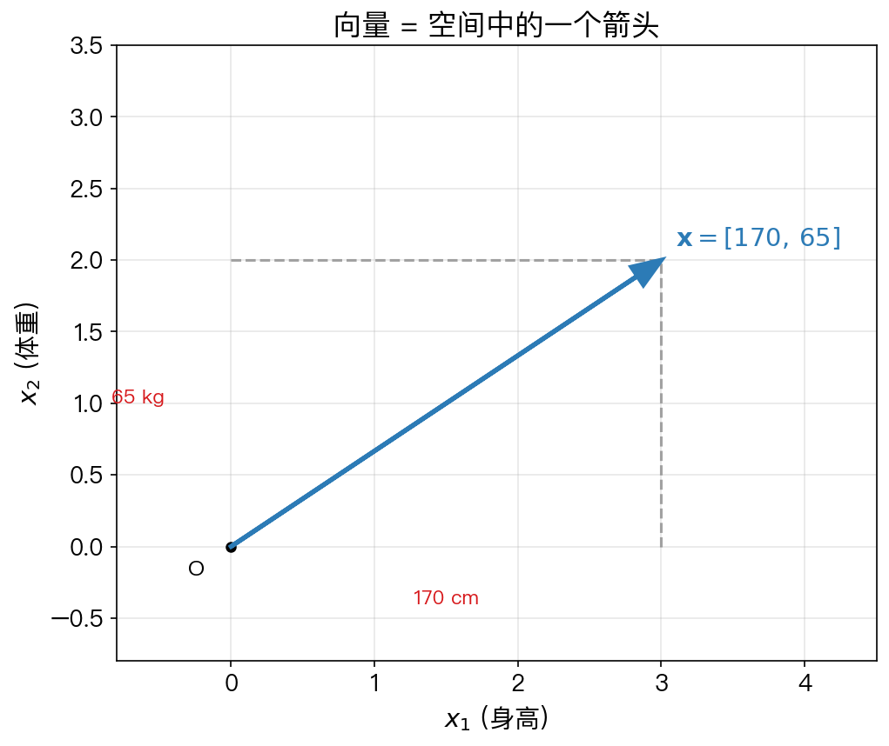

> **看图要点：** 蓝色箭头就是向量 $\mathbf{x} = [170, 65]$（身高 170cm，体重 65kg）。红色虚线分别投影到横轴和纵轴，告诉你每个分量单独有多大——水平虚线对应「身高 170cm」，垂直虚线对应「体重 65kg」。箭头的总长度（也叫**模长**或**范数**）可以用勾股定理算出来：$\|\mathbf{x}\| = \sqrt{170^2 + 65^2} \approx 182.0$。这个长度综合反映了一个人的「体格大小」——身高和体重共同决定。

把向量想象成空间中的一个箭头：箭头的**方向**由各分量的相对大小决定（比如「身高占主导」还是「体重占主导」），箭头的**长度**由分量的绝对值决定。

> **符号约定** 向量通常用小写粗体字母表示，如 $\mathbf{x}$、$\mathbf{w}$。向量的第 $i$ 个分量写作 $x_i$（注意，粗体的 $\mathbf{x}$ 表示整个向量，不粗体的 $x_i$ 表示其中一个数字）。在博客中，你还会看到 $\mathbf{x} \in \mathbb{R}^d$ 这种写法，意思是「这个向量属于 $d$ 维实数空间」，即它有 $d$ 个数字分量。$\mathbb{R}$ 表示实数，上标的 $d$ 表示维度。

*关键直觉：向量 = 把描述同一个东西的多个数字打包在一起。*

### 1.2 从向量到矩阵：打包很多条数据

现在你有 1000 个人的数据。每个人的向量有 4 个数字，叠在一起就是一张 1000×4 的大表格：

$$\mathbf{X} = \begin{bmatrix} 170 & 65 & 20 & 5000 \\ 165 & 55 & 25 & 6000 \\ 180 & 80 & 30 & 8000 \\ \vdots & \vdots & \vdots & \vdots \end{bmatrix}$$

这就是**矩阵**（matrix）——一个 $n \times d$ 的二维数组，其中 $n$ 是样本数（行数），$d$ 是特征数（列数）。上面这个矩阵 $\mathbf{X}$ 中：第 1 行 $[170, 65, 20, 5000]$ 是第一个人的完整数据，第 2 行是第二个人，以此类推。矩阵中的每个元素 $X_{ij}$ 由两个下标定位：$i$ 是行号（第几个人），$j$ 是列号（第几个属性）。比如 $X_{1,4} = 5000$ 表示第 1 个人的第 4 个属性（月收入）是 5000 元。

> **符号约定** 矩阵通常用大写粗体字母表示，如 $\mathbf{X}$、$\mathbf{W}$。矩阵的尺寸写成 $n \times d$ 或 $\mathbf{X} \in \mathbb{R}^{n \times d}$，意思是「这个矩阵有 $n$ 行 $d$ 列，每个元素是实数」。矩阵中第 $i$ 行第 $j$ 列的元素写作 $X_{ij}$。博客中常见的 $\mathbf{Q}, \mathbf{K}, \mathbf{V}$ 都是矩阵——它们分别代表 Transformer 注意力机制中的「查询」「键」和「值」矩阵。

*关键直觉：矩阵 = 把很多条数据整齐地排在一起。*

### 1.3 矩阵乘法：信息的重新组合

这是机器学习中最常见的运算，也是初学者最容易困惑的地方。但含义非常直观。

先看最简单的形式：**一个向量乘以一个矩阵，得到一个新的向量**：

$$\mathbf{y} = \mathbf{W}\mathbf{x}$$

**例子一：用身高体重预测衣服尺码。** 输入是 `[身高, 体重]`，我们想要判断这个人适合 S/M/L 哪个尺码。

矩阵 $\mathbf{W}$ 是一个 $3\times 2$ 的权重矩阵——3 行对应 3 种尺码，2 列对应 2 种输入。矩阵的**每一行定义了一种「配方」**，告诉你如何用身高和体重调配出该尺码的得分：

> **$\mathbf{W}$ 是什么？它的取值从哪来？** $\mathbf{W}$ 叫**权重矩阵**（weight matrix），它是模型的「知识」所在。上例中 $0.3, 0.1, 0.5, \dots$ 这些数字不是人手工设定的，而是模型从数据中**学来的**：一开始随机初始化（全是乱七八糟的数），然后在训练过程中，通过梯度下降（第5章）一步步调整，使得预测越来准。训练完成后，$\mathbf{W}$ 里的数字就固化了——它们编码了「身高和体重如何映射到尺码」的规律。正是这个「自动学习权重」的过程，让机器学习区别于传统的规则编程。

$$\mathbf{W} = \begin{bmatrix} 0.3 & 0.1 \\ 0.5 & 0.2 \\ 0.2 & 0.7 \end{bmatrix} \quad
\mathbf{y} = \mathbf{W} \cdot \begin{bmatrix} 170 \\ 65 \end{bmatrix} = \begin{bmatrix} 57.5 \\ 98.0 \\ 79.5 \end{bmatrix}$$

- S 码得分：$0.3 \times 170 + 0.1 \times 65 = 57.5$
- M 码得分：$0.5 \times 170 + 0.2 \times 65 = 98.0$（最高！）
- L 码得分：$0.2 \times 170 + 0.7 \times 65 = 79.5$

所以预测结果是 M 码。

**例子二：图像卷积——从照片中提取边缘。** 如果你在手机相册中编辑过照片，可能用过「锐化」或「边缘增强」功能。背后的数学就是一个小矩阵（叫卷积核）在图像上滑动，对每个像素的邻域做矩阵乘法。例如：

$$\mathbf{K} = \begin{bmatrix} -1 & -1 & -1 \\ -1 & 8 & -1 \\ -1 & -1 & -1 \end{bmatrix}$$

这个 3×3 的矩阵扫过图片的每个位置，将中心像素的值乘以 8，周围像素乘以 -1，加起来。我们来看一个具体的数字例子——假设图片中有一个 3×3 的小区域：

$$\text{平坦区域（所有像素值相同）:}\quad \begin{bmatrix} 100 & 100 & 100 \\ 100 & 100 & 100 \\ 100 & 100 & 100 \end{bmatrix}$$

边缘检测输出 = $8 \times 100 + (-1) \times 100 \times 8 = 800 - 800 = 0$ ——平坦区域输出为零。

$$\text{边缘区域（从亮到暗的垂直边界）:}\quad \begin{bmatrix} 200 & 200 & 200 \\ 200 & 200 & 200 \\ 10 & 10 & 10 \end{bmatrix}$$

边缘检测输出 = $8 \times 200 + (-1) \times (200\times 4 + 10\times 4) = 1600 - 840 = 760$ ——边缘处输出很大的正值！

$$\text{边缘区域（从暗到亮）:}\quad \begin{bmatrix} 10 & 10 & 10 \\ 10 & 10 & 10 \\ 200 & 200 & 200 \end{bmatrix}$$

边缘检测输出 = $8 \times 10 + (-1) \times (10\times 4 + 200\times 4) = 80 - 840 = -760$ ——反方向的边缘输出很大的负值。

*关键直觉：矩阵乘法就是**信息的重新组合**。矩阵的每一行定义了如何使用输入的各种「材料」调配出对应的输出。*

在神经网络中：
- 一张图片 → 展平成几十万个数字的向量 → 乘以很多层矩阵 → 最终得到「猫/狗」的得分
- 一句话 → 每个词变成一个向量 → 向量之间通过矩阵乘法互相「关注」→ 理解上下文含义

**神经网络说到底，就是一连串的矩阵乘法，中间穿插一些非线性操作。**

### 1.4 线性变换：矩阵乘法的几何直觉

如果把向量看成空间中的箭头，那么乘以一个矩阵就是对这个箭头做以下几种操作的组合：

- **旋转**：改变箭头的方向（比如逆时针转 90°）
- **缩放**：拉长或缩短箭头（比如水平方向拉长 2 倍，垂直方向压缩一半）
- **剪切**：像推倒一摞扑克牌那样倾斜空间
- **投影**：把箭头「拍扁」到更低的维度（比如把三维物体投影到二维平面上）

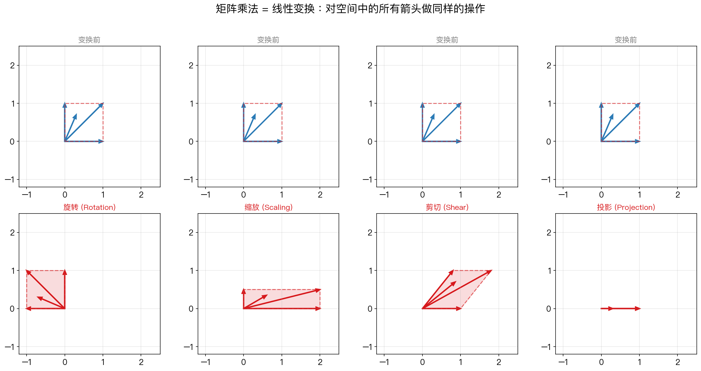

> **看图要点：** 上图：这是一个 $2 \times 4$ 的网格，每列对应一种变换类型，上排是变换前（蓝色箭头和红色虚线单位正方形），下排是变换后（红色箭头和红色阴影区域）。重点观察：
> - **旋转**：箭头转了 90° 但长度不变——旋转矩阵 $\begin{bmatrix}0&-1\\1&0\end{bmatrix}$ 是**保长**的。
> - **缩放**：水平拉长 2 倍，垂直压缩一半——正方形变成了矩形，面积也变了。
> - **剪切**：正方形被推成平行四边形——x 方向不变但 y 方向被「拖着走」。
> - **投影**：正方形被压扁成一条线——信息从二维「降维」到一维，所有箭头都落到了 x 轴上。

当你说「神经网络学习了一个表示」，本质就是说：**通过很多层矩阵乘法（线性变换），把原始输入旋转、缩放、投影到一个更容易分类的新空间里。**

---

## 2. 分数与概率：描述「有多大把握」

### 2.1 模型输出的是分数，不是概率

回到刚才的尺码预测。模型输出 `[57.5, 98.0, 79.5]`，直观上 M 码得分最高。但 98 分比 79 分「高多少」？是碾压式领先还是略胜一筹？这组数字本身无法回答这个问题。

我们需要一种方法，把**任意范围的分数转化为 0 到 1 之间、且加起来等于 1 的概率**。

**例子一：考试成绩 vs 排名。** 小明数学考了 85 分。他排第几名？这取决于别人的分数。假设另有四人的成绩构成一组：$[85, 60, 92, 78, 55]$。我们直接计算 Softmax：

$$\begin{aligned}
\text{第一步（指数化）: } & e^{85}\approx8.2\times10^{36},\; e^{60}\approx1.1\times10^{26},\; e^{92}\approx9.0\times10^{39},\; e^{78}\approx7.5\times10^{33},\; e^{55}\approx7.7\times10^{23} \\
\text{第二步（求和）: } & e^{85}+e^{60}+e^{92}+e^{78}+e^{55} \approx 9.1\times10^{39} \quad(\text{e}^{92}\text{完全主导}) \\
\text{第三步（归一化）: } & p_{92} \approx \frac{9.0\times10^{39}}{9.1\times10^{39}} \approx 0.989,\; p_{85} \approx 0.009,\; \text{其余 } \approx 0
\end{aligned}$$

结果：92 分的人拿到了约 98.9% 的「概率权重」，85 分的小明只分到约 0.9%。Softmax 通过指数运算把分数差距放大到了近乎「赢家通吃」的程度。

**例子二：面试评分。** 三位面试官给候选人打分：A 给了 9 分，B 给了 7 分，C 给了 10 分。我们计算 Softmax 来量化谁的评价最「突出」：

$$\text{Softmax}([9,7,10]) = \frac{[e^9, e^7, e^{10}]}{e^9+e^7+e^{10}} = \frac{[8103, 1096, 22026]}{31225} \approx [0.260, 0.035, 0.705]$$

C 的 10 分拿到了约 70.5% 的权重，A 的 9 分只拿到 26%，而 B 的 7 分几乎被忽略（3.5%）。注意看：原始分数差分别是 1 分和 3 分，但概率差异远大于此——这就是指数运算的放大效果。

这两个例子揭示了一个道理：**一个数值的意义取决于它相对于其他数值的位置。** 而 Softmax 函数就是做这件事的。

### 2.2 Softmax：把分数转化为概率的翻译器

给定 $n$ 个分数 $[s_1, s_2, \dots, s_n]$，Softmax 对每个分数计算：

$$\text{Softmax}(s_i) = \frac{e^{s_i}}{e^{s_1} + e^{s_2} + \cdots + e^{s_n}}$$

公式看起来复杂，但逻辑很简单：
1. 对每个分数取指数 $e^{s_i}$（把它变成正数，同时放大高分与低分之间的差距）
2. 除以所有人的总和（确保最终结果是 0~1 且总和为 1）

$e^x$ 有一个很好的性质：$e^{100} / e^{99} \approx 2.718$，即使原始分数只差 1 分，指数化后差异也显著。

> **符号约定** $e$ 是自然常数（约 2.718），$e^x$ 是指数函数。$\sum_{i=1}^n$ 是求和符号——把 $i$ 从 1 到 $n$ 的所有项加起来。在复杂公式中写成 $\sum_i$ 表示「对所有 $i$ 求和」。$s_i$ 的下标 $i$ 表示「第 $i$ 个分数」——下标是数学中最常见的索引方式，在向量、矩阵、概率分布中都用。

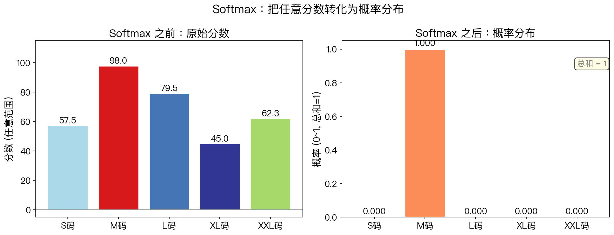

> **看图要点：** 左图是 Softmax 之前的原始分数——M 码得分最高（98），L 码次之（79.5），S 码第三（57.5）。此时分数单位是任意的（可能从负数到正无穷），无法直观判断 M 码比 L 码「好多少」。右图是 Softmax 之后——M 码的概率飙升到约 0.986，L 码和 S 码被压缩到近乎为 0（分别是约 0.014 和约 $9.3\times10^{-9}$）。Softmax 的指数运算把原本 18.5 分的差距放大成了 70 倍的倍数关系，产生了「赢家几乎通吃」的效果，简化了最终的决策。

在尺码预测中，Softmax 给出了 M 码约 99% 的概率——模型非常自信。而在另一个例子中，如果分数很接近，比如 `[8.1, 8.0, 7.9]`，Softmax 会给出大约 `[0.35, 0.32, 0.33]` 的概率——模型表示「我不太确定，三种都有可能」。

**温度参数：控制模型的「自信度」。** 你可以通过一个叫「温度」的参数 $T$ 来调节 Softmax 的平滑程度：
- $T < 1$（低温）：放大分数之间的差异，让模型更「尖锐」、更果断
- $T = 1$：标准 Softmax
- $T > 1$（高温）：缩小差异，让模型更「平滑」、更保守

下图展示了三个温度值对同一组分数的作用。原始分数为 $[2.0, 3.0, 1.0, 1.5, 0.5]$（即 B 最高、A 次之、E 最低）。可以看到：$T=0.3$ 时概率几乎全部集中在 B 上；$T=1.0$ 时 B 仍然最高但其他也有一定份额；$T=3.0$ 时各项概率趋于均匀。

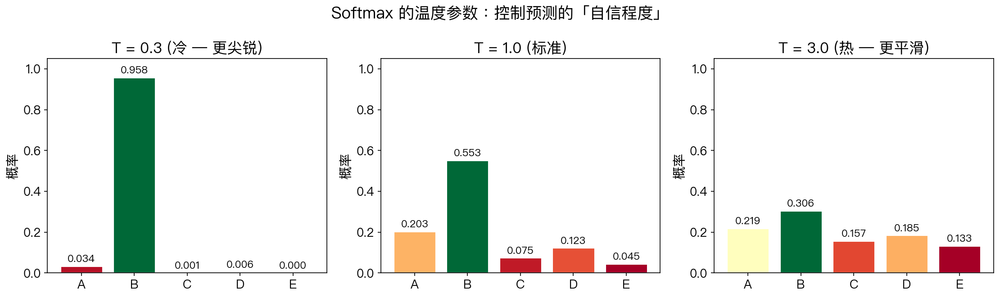

> **看图要点：** 三个子图使用同一组原始分数 $[2.0, 3.0, 1.0, 1.5, 0.5]$（B 始终最高），但温度不同。$T=0.3$ 时 B 几乎独占所有概率（≈0.87），其他项几乎为 0——这就是「低温使模型更果断」；$T=1.0$ 时 B 仍居首位但 A、D 也有一定份额；$T=3.0$ 时五个选项趋向均匀（B ≈ 0.27, A ≈ 0.23）——模型「不确定，给谁都差不多」。温度 T 不改变排序，但改变分数之间的差异被放大还是缩小。

> 在 Transformer 的**注意力机制**中，Softmax 是绝对的核心——它决定了每个词应该「注意」其他哪些词，以及注意多少。你会在几乎所有 LLM 相关的博客中反复遇到它。注意力机制中的「温度」除以 $\sqrt{d_k}$，本质上也是一种温度缩放。

### 2.3 概率分布：一张「会发生什么」的说明书

当你面对一个不确定的事件时（比如「明天会不会下雨」），你需要一种语言来描述各种可能结果出现的几率。**概率分布**就是这种语言。

**例子一：公平的六面骰子 vs 灌铅的骰子。**

一个公平骰子的概率分布是均匀的——六个面各有 1/6 ≈ 0.167 的概率。但如果你在骰子里灌了铅（让 6 更重、更可能朝下），分布就变了——6 朝上的概率可能飙到 50%，而 1~4 每个面只有 5%。下面这张图对比了这两种分布：

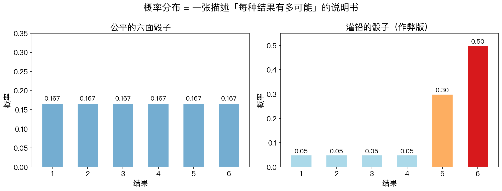

> **看图要点：** 左图公平骰子——所有六个面的概率完全相等（各约 0.167），条形高度一致，这是物理学对称性（质量均匀）的直接体现。右图灌铅骰子——铅块使 6 朝上的概率飙至 50%（红色柱子），5 获得 30%（橙色），而 1~4 被压制到各 5%。验证：$0.05\times4 + 0.30 + 0.50 = 0.20 + 0.30 + 0.50 = 1.00$ ✓ 总面积始终为 1。

数学上，一个概率分布就是一个向量 $\mathbf{p} = [p_1, p_2, \dots, p_n]$，满足：
- 每个 $p_i \ge 0$（概率不能是负数）
- 所有 $p_i$ 加起来等于 1（几件事里一定有一件会发生）

你已经见过了——**Softmax 的输出正是一个概率分布**。

**例子二：离散 vs 连续随机变量。** 两个骰子的点数之和是一个离散随机变量——可能的值是有限的几个（2 到 12）。我们来算 7 点的概率：

$$P(\text{和为 }7) = \frac{\text{两个骰子加起来等于 7 的组合数}}{\text{总组合数}} = \frac{6}{36} = \frac{1}{6} \approx 0.167$$

组合是 (1,6), (2,5), (3,4), (4,3), (5,2), (6,1)，恰好 6 种。

而明天中午的气温是一个连续随机变量——理论上可以是 25.1°C、25.17°C、25.1723°C……无限多个可能的值。

对于连续变量，有两个关键区别：

**第一，不能说「精确等于某个值的概率」。** 就像你不可能恰好画出一条宽度为 0 的线——如果气温是连续变量，那么P(气温 = 精确 25.000000...°C) = 0。但我们可以说「气温在 24.5°C 到 25.5°C 之间的概率是 30%」。

**第二，用面积代替高度。** 离散概率分布看「柱子的高度」，连续概率分布看**曲线下的面积**。描述连续分布的函数叫**概率密度函数**（Probability Density Function, PDF）——它本身的值不是概率，但曲线下方某段区间内的面积等于该区间内的概率。就像地图上的等高线：一条等高线本身的「高度标注」不直接告诉你面积，但被它围住的区域面积就是某个海拔以上的陆地大小。

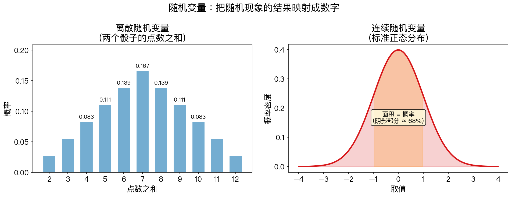

> **看图要点：** 左图是离散分布——两个骰子点数之和的概率。共 11 个可能的取值（2 到 12），每个值上方标注了精确概率（如和为 7 时概率 0.167，和最小/最大时仅 0.028）。柱子的高度直接就是概率。右图是连续分布（标准正态）——曲线本身是概率密度函数，但**柱子的高度不能直接读作概率**。阴影区域（x 在 -1 到 1 之间）的面积 ≈ 0.68——这意味着从该分布中随机抽一个数，约有 68% 的概率落在 $[-1, 1]$ 内。对于连续分布，**曲线下的面积 = 概率**，这是和离散分布的根本区别。

> Softmax 处理的是**离散概率分布**（有限个类别），而在扩散模型的博客中，你会遇到大量的**连续概率分布**（比如高斯分布，用来描述图像的像素值分布）。

---

## 3. 衡量「错得有多离谱」

### 3.1 损失函数：一个「错误打分器」

有了概率分布（模型对猫 vs 狗的预测），我们需要一个数字来衡量这个预测和正确答案之间的差距。这个数字就是**损失**（loss）。损失越小，模型越好。

最常用的分类损失是**交叉熵**（cross-entropy）。公式看起来有点吓人：

$$H = -\sum_i y_i \log p_i$$

但直觉非常简单：**取正确答案对应的那个预测概率，对它取负对数。**

> **符号约定** $H$ 在信息论中代表「熵」（Entropy），表示不确定性。$\log$ 在机器学习中默认是**自然对数**（以 $e$ 为底，有时写作 $\ln$）。$-\log(p)$ 的形状是：$p$ 越接近 1，值越接近 0；$p$ 越接近 0，值急剧增大——完美地惩罚了「自信的错误」。$y_i$ 和 $p_i$ 的下标 $i$ 表示「第 $i$ 个类别」，对各类别求和。$p_i$ 是模型预测第 $i$ 类的概率，$y_i$ 是真实标签（正确答案的类别 $y_i=1$，其他 $y_i=0$，这叫**独热编码** one-hot encoding）。
>
> **为什么用 $\log$？** 如果直接用概率的差值（比如 $1-p$）作为惩罚，$p=0.99$ 的惩罚是 0.01，$p=0.5$ 的惩罚是 0.5——惩罚随错误线性增长。但 $\log$ 带来了一个关键的非线性：$p=0.01$ 时 $-\log(0.01) \approx 4.6$，是 $p=0.5$ 时的约 7 倍——**对数函数对接近 0 的值特别敏感**。这恰好吻合我们想要的：模型说「100% 确定是猫」结果却是狗，这种错误应该比「不太确定」受到**不成比例**的严厉惩罚。如果不用 $\log$ 而用线性惩罚，模型在训练中就不会有足够强的动力去纠正那些「自信的错误」。
**例子一：四种预测场景的对比。**

| 场景 | 真实答案 | 模型对正确答案的预测概率 | 交叉熵损失 |
|------|----------|------------------------|-----------|
| 完全正确且自信 | 猫 | 0.99 | $-\log(0.99) \approx 0.01$ |
| 正确但不太确定 | 猫 | 0.70 | $-\log(0.70) \approx 0.36$ |
| 完全瞎猜 | 猫 | 0.50 | $-\log(0.50) \approx 0.69$ |
| 自信地错 | 猫 | 0.01 | $-\log(0.01) \approx 4.6$ |

规律很明显：**模型越自信地正确，损失越小；一旦自信地错了（给正确答案极低的概率），损失就会飙升。** 这就是为什么交叉熵是分类任务的标准损失函数——它特别严厉地惩罚「自信的错误」。

四种场景的直观对比：

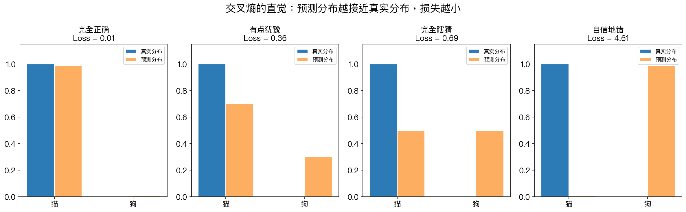

> **看图要点：** 四组图对比了四个场景。每组中蓝色柱子是真实标签（猫=1, 狗=0，即这是一张猫图），橙色柱子是模型预测的概率分布。Loss = $-\log(p_{\text{正确}})$。仔细观察：
> - 左上（Loss=0.01）：蓝色和橙色几乎重叠——模型完美预测。
> - 右上（Loss=0.36）：模型给了猫 70% 概率，虽然还算正确但没把握——惩罚较轻。
> - 左下（Loss=0.69）：模型各给 50%——完全在瞎猜，惩罚中等。
> - 右下（Loss=4.61）：模型极度自信地给猫仅 1%（即 99% 认为是狗），但实际上是猫——损失飙升到 4.61。这个极端惩罚驱动模型在训练中「不敢」做出过于自信的错误预测。

负对数惩罚曲线：

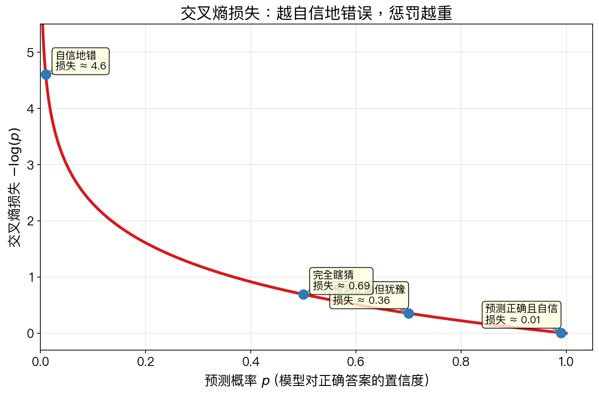

> **看图要点：** 横轴是模型给正确答案的预测概率 $p$，纵轴是 $-\log(p)$。四个标注点对应上方的四种场景。关键特征是曲线的**不对称形状**：$p$ 从 1 降到 0.7 时（橙色区域），损失从 0 缓慢增长到 0.36——模型不太确定但不至于受重罚；$p$ 从 0.1 降到 0 时，损失从 2.3 陡峭飙升到无穷大——自信地错到极致会被无限惩罚。正是这种「左松右紧」的不对称性，让 $\log$ 成为完美的分类损失函数。

**例子二：竞猜游戏的得分机制。** 假设你参加一个竞猜节目，主持人说「下一张牌是红桃 A，你猜中的概率你觉得是多少？」如果你说「我 100% 确定是红桃 A」（预测概率 = 1.0），结果真的翻开是红桃 A——你不扣分。但如果你说 100% 确定，结果翻开是方块 3——你会被扣很重的分。而如果你说「我不确定，只有 1/52 的概率」，说错了也只扣一点点分。交叉熵的 $-log(p)$ 数学完美地捕捉了这种奖惩直觉。

### 3.2 KL 散度：两个概率分布有多「不像」

交叉熵衡量的是「预测分布 $Q$ 和真实分布 $P$ 之间的差别」。它有一个更精确的名字——**KL 散度**（Kullback-Leibler Divergence）：

$$D_{KL}(P \parallel Q) = \sum_i P(i) \log\frac{P(i)}{Q(i)}$$

KL 散度衡量两个分布之间的「距离」（加引号是因为它不对称，不满足交换律）。

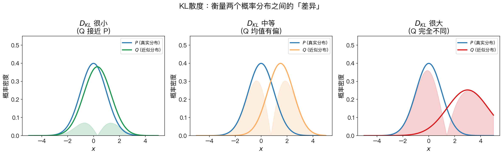

> **看图要点：** 蓝色曲线是真实分布 $P$（标准正态分布），其他三色是三个不同的近似分布 $Q$。阴影区域表示局部差异的绝对值。从左到右 $D_{KL}$ 逐渐增大：
> - 左：$Q$ 的均值仅偏离 0.3，方差接近——$D_{KL}$ 很小（两曲线基本重合）。
> - 中：$Q$ 的均值偏移了 1.5——曲线中心错位，差异明显增大。
> - 右：$Q$ 的均值偏移 3 且方差扩大到 5——分布变得又扁又偏，几乎不重叠，$D_{KL}$ 最大。
> 核心规律：$D_{KL}$ 对「分布中心的偏移」和「分布宽度的变化」都很敏感。

关键性质：
- $P = Q$ 时（两个分布完全一样），$D_{KL} = 0$
- $D_{KL}$ 越大，两个分布越不像
- $D_{KL}(P \parallel Q) \neq D_{KL}(Q \parallel P)$：不对称

**例子：天气预报。** 真实天气是「下雨」。气象局 A 预测「100% 下雨」，气象局 B 预测「50% 下雨」。KL 散度告诉我们：B 的预测和真实分布之间差异更大。但如果反过来真值是「50% 下雨」而 A 预测「100%」，这个 KL 散度的值和前一个不一样——惩罚的方向不同。

> 在博客中，你会频繁遇到 KL 散度。它在**变分自编码器（VAE）**中被用来约束潜在变量的分布，在**扩散模型**中被用来推导训练目标，在**PPO/GRPO 强化学习**中被用来防止策略更新太激进。

### 3.3 它们的关系

实际上，交叉熵 = KL散度 + 真实分布自身的熵：

$$H(P, Q) = D_{KL}(P \parallel Q) + H(P)$$

真实分布 $P$ 的熵 $H(P)$ 是一个常数。所以**最小化交叉熵等价于最小化 KL 散度**——它们在训练模型时效果完全相同，只是差一个常数。

### 3.4 损失景观：把损失想象成地形

当我们训练一个神经网络时，损失函数可以看作一片**地形**——参数是坐标（x, y），损失值是地形高度（z）。训练的目标就是走到最低的谷底。

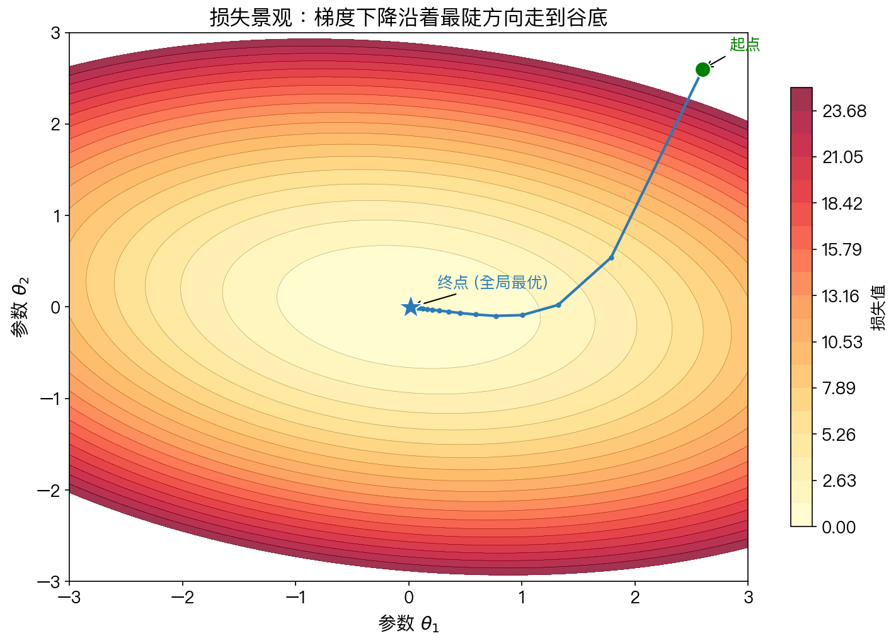

> **看图要点：** 这是一张**等高线填充图**——颜色越深代表损失值越高。等高线呈椭圆形（为什么是椭圆？因为损失函数是 $f(\theta_1,\theta_2)=\theta_1^2+3\theta_2^2+0.6\theta_1\theta_2$，$\theta_2$ 方向的系数 3 使得该方向更「陡峭」）。蓝色圆点轨迹是从起点 (2.6, 2.6) 出发的梯度下降路径（学习率=0.12，共 18 步）。注意路径并不垂直于等高线——因为梯度方向被协方差项 $0.6\theta_1\theta_2$ 稍稍扭转了。绿色圆点是起点，蓝色星号是终点（全局最优，约在原点）。等高线越密的地方（椭圆的长轴两端）梯度越大，步长也越大。

这片地形可能有很多个山谷（局部最优），理想情况下我们希望走到最深的那一个（全局最优）。而梯度下降就是在告诉你：「从当前位置出发，最陡的下山路在哪？」

---

## 4. 最重要的概率工具

### 4.1 期望：用概率加权的平均

「期望」听起来玄乎，但其实就是我们小学就学过的**加权平均**——把每个可能的结果乘以它发生的概率，再加起来。

**例子一：抽奖游戏。**
- 有 30% 的概率赢 100 元
- 有 70% 的概率赢 0 元

期望收益 = $0.3 \times 100 + 0.7 \times 0 = 30$ 元

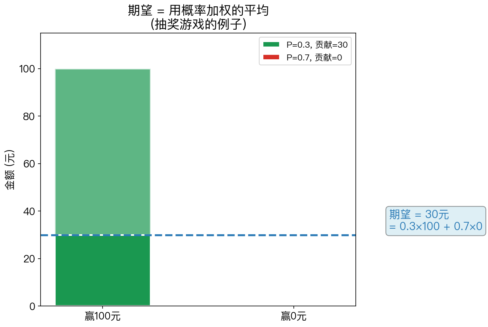

> **看图要点：** 浅色半透明大柱子代表每种结果的金额（赢 100 元 vs 赢 0 元），深色实心柱子代表该结果的**概率加权贡献**（$100\times0.3 = 30$ 和 $0\times0.7 = 0$）。蓝色虚线标注了期望值 30 元——它是所有概率加权贡献的总和。注意：期望 30 元并不是任何一个可能发生的结果——你永远不会正好拿到 30 元。期望是一个**理论均值**，重复抽奖足够多次后，你的平均收益会趋近于 30。

写成数学形式：

$$\mathbb{E}[X] = \sum_i P(X = x_i) \cdot x_i$$

> **符号约定** $\mathbb{E}$ 是花体字母 E（Expectation 的首字母）。$\mathbb{E}[X]$ 读作「随机变量 $X$ 的期望」。在博客中，你经常会看到带下标的期望，如 $\mathbb{E}_{x \sim p}[f(x)]$，意思是「从分布 $p$ 中采样 $x$，然后计算 $f(x)$ 的期望」。下标 $\sim$ 读作「服从」，$x \sim p$ 就是「$x$ 服从分布 $p$」。

**例子二：保险公司的保费定价。** 假设一家保险公司承保 10 万人的医疗保险。历史数据显示，每千人中有 5 人会在一年内发生大额理赔（平均 20 万元）。那么：
- 每人发生大额理赔的概率 = 0.5%
- 每人期望理赔金额 = 0.005 × 200,000 = 1,000 元

所以保险公司至少要把保费设在每人 1,000 元以上才能覆盖赔付。保费中超出这 1,000 元的部分就是保险公司的利润和运营成本。

*关键直觉：期望告诉你「平均而言会发生什么」——如果你把这个实验重复无数次，结果的均值会趋近于期望。*

在机器学习中，你能见到的几乎所有损失函数，本质上都是期望。比如交叉熵损失 = 在真实分布下，$-\log p$ 的期望。

### 4.2 方差：数据有多「散」

同样的期望，可能对应完全不同的实际情况：

- 班级 A 的成绩：`[60, 60, 60, 60, 60]` → 平均 = 60，方差 = 0（所有人一样）
- 班级 B 的成绩：`[100, 40, 90, 20, 50]` → 平均 = 60，方差很大（成绩悬殊）

**例子一：两个班级的成绩分布。**

班级 A：`[60, 60, 60, 60, 60]`，均值 = 60，方差 = 0。五个数完全一致，没有任何波动。
班级 B：`[100, 40, 90, 20, 50]`，我们来手算：

$$\begin{aligned}
\mathbb{E}[X] &= \frac{100+40+90+20+50}{5} = \frac{300}{5} = 60 \\
\text{Var}(X) &= \frac{(100-60)^2 + (40-60)^2 + (90-60)^2 + (20-60)^2 + (50-60)^2}{5} \\
&= \frac{1600 + 400 + 900 + 1600 + 100}{5} = \frac{4600}{5} = 920
\end{aligned}$$

方差 920，标准差 = $\sqrt{920} \approx 30.3$ 分——成绩波动非常大。

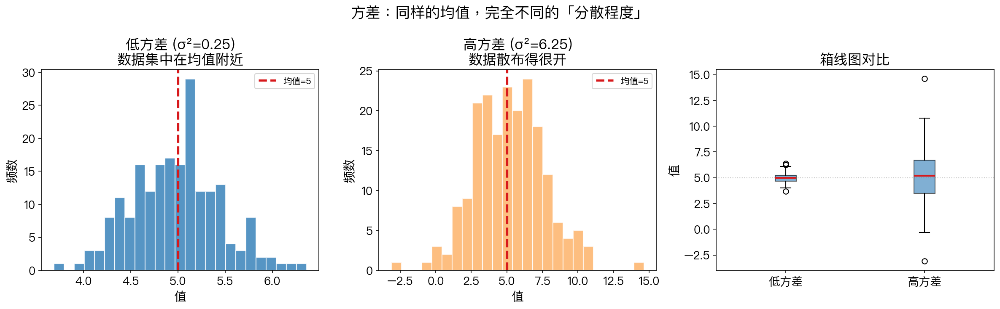

> **看图要点：** 左图（低方差 σ²=0.25）：数据紧密聚集在均值 5 周围，直方图又高又窄，几乎全部落在 [4, 6] 区间内。中图（高方差 σ²=6.25）：数据散落得很开——从约 -3 到约 13 都有分布，直方图矮而宽。右图（箱线图）：直观对比两个分布的四分位距（盒子宽度）——高方差的盒子宽得多，说明数据在中位数周围也更加分散。核心结论：**同样的均值（都是 5），但数据的聚集程度可以天差地别。**

$$\text{Var}(X) = \mathbb{E}[(X - \mathbb{E}[X])^2]$$

平方操作确保正负偏离都被计入，并且放大了大偏差的影响。

**例子二：投资组合风险的度量。** 两只股票的年化收益率期望都是 8%。

股票 A 近 5 年收益：$[7\%, 9\%, 8\%, 7\%, 9\%]$ $\\$
股票 B 近 5 年收益：$[-18\%, 35\%, -8\%, 40\%, -9\%]$

计算各自的方差和标准差：

$$\begin{aligned}
\text{股票 A: } \sigma_A^2 &= \frac{(-1)^2 + (1)^2 + 0^2 + (-1)^2 + (1)^2}{5} = \frac{4}{5} = 0.8\%^2,\quad \sigma_A = 0.89\% \\
\text{股票 B: } \sigma_B^2 &= \frac{(-26)^2 + (27)^2 + (-16)^2 + (32)^2 + (-17)^2}{5} = \frac{2974}{5} = 595\%^2,\quad \sigma_B = 24.4\%
\end{aligned}$$

两只股票期望收益相同（都是 8%），但 B 的标准差是 A 的 27 倍。金融学中的夏普比率 = $\frac{\mathbb{E}[R] - R_f}{\sigma}$（超额收益除以风险），B 的夏普比率远低于 A。这就是为什么养老金从不投高波动股票——方差度量了「不确定性中的不确定性」。

### 4.3 高斯分布（正态分布）

你很可能见过这个钟形曲线：

$$p(x) = \frac{1}{\sqrt{2\pi\sigma^2}} \exp\!\left(-\frac{(x - \mu)^2}{2\sigma^2}\right)$$

虽然公式看起来很复杂，但它只有两个参数：
- $\mu$（均值）：钟形曲线的中心在哪里
- $\sigma$（标准差）：钟形曲线有多「胖」

> **符号约定** $\mathcal{N}(\mu, \sigma^2)$ 是高斯分布的标准写法——花体 $\mathcal{N}$ 代表「Normal distribution」。**注意第二个参数是方差 $\sigma^2$，不是标准差 $\sigma$**——这是初学者最容易混淆的地方。$\sigma^2$ 控制分布的「宽度」：越大越扁平。$\exp(x)$ 和 $e^x$ 是同一个意思，在长公式里用 $\exp$ 更清晰。$\sqrt{}$ 表示平方根，$2\pi\sigma^2$ 是归一化因子——确保曲线下的总面积等于 1（所有可能情况的概率总和一定是 1）。

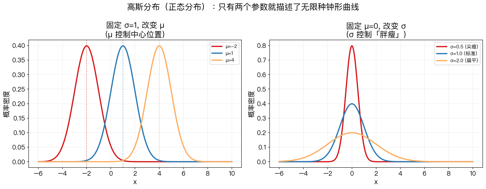

> **看图要点：** 左图固定 σ=1，三个不同的 μ（-2, 1, 4）——曲线形状完全相同，只是水平平移了。钟形曲线的峰值始终在 $x = \mu$ 处。右图固定 μ=0，三个不同的 σ（0.5, 1.0, 2.0）——σ 越小曲线越尖瘦（数据高度集中），σ 越大曲线越扁平（数据高度分散）。记住：**μ 决定「在哪」**（位置参数），**σ 决定「多宽」**（尺度参数）。

**例子一：人类身高。** 一个成年男性的身高大致服从 $\mu = 170\text{cm},\ \sigma = 7\text{cm}$ 的高斯分布。代入高斯公式，我们可以算出任意区间的人数比例：

$$P(163 < \text{身高} < 177) = P(-1\sigma < x < 1\sigma) \approx 68.3\%$$

即在 163~177cm（$\mu\pm1\sigma$）之间的男性约占 68%——这与 68-95-99.7 规则完全吻合。同样，身高超过 184cm（$\mu+2\sigma$）的人只占约 2.3%（因为 95.4% 的人在 $\mu\pm2\sigma$ 内，所以每边尾部各约 2.3%）。

**例子二：测量误差。** 桌子的真实宽度是 80.0cm。你测量了 5 次，得到：$[80.2, 79.7, 80.1, 79.9, 80.1]$。计算均值：$(80.2+79.7+80.1+79.9+80.1)/5 = 400.0/5 = 80.0$cm——恰好等于真实值，说明没有系统偏差。样本方差：$\sigma^2 \approx [(0.2)^2 + (-0.3)^2 + (0.1)^2 + (-0.1)^2 + (0.1)^2] / 4 = 0.16/4 = 0.04$，标准差 $\sigma = 0.2$cm。这就是「测量精度」——任何单次测量有约 68% 概率落在 $80.0 \pm 0.2$cm 范围内。

**高斯分布的 68-95-99.7 规则：**

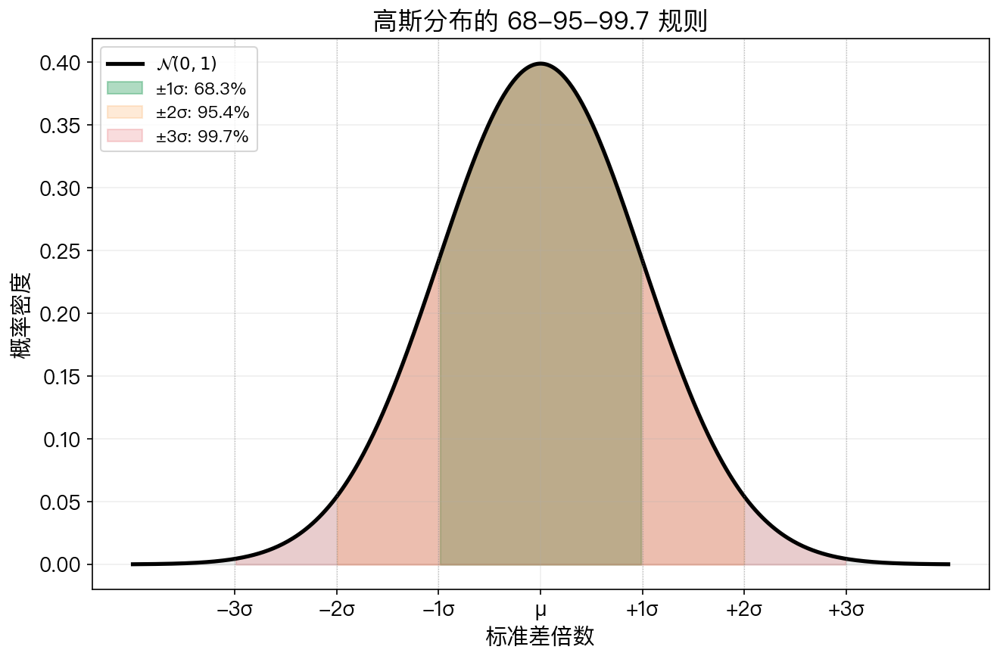

> **看图要点：** 这是标准正态分布 $\mathcal{N}(0,1)$ 的三条彩色分层带——绿色（±1σ）占曲线下总面积的 68.3%，橙色（±2σ）占 95.4%，红色（±3σ）占 99.7%。实践意义：测一个成年男性的身高（$\mu=170$cm，$\sigma=7$cm），则 68% 的人身高在 163~177cm 之间；95% 的人在 156~184cm 之间；只有 0.3% 的人身高低于 149cm 或高于 191cm。这就是统计学中判断「异常值」的核心依据。

- 68.3% 的数据落在 $\mu \pm 1\sigma$ 内
- 95.4% 的数据落在 $\mu \pm 2\sigma$ 内
- 99.7% 的数据落在 $\mu \pm 3\sigma$ 内

为什么高斯分布无处不在？因为有**中心极限定理**：大量独立随机变量的和，无论它们各自是什么分布，最终都趋近于高斯分布。

**中心极限定理的演示：** 掷单个骰子是均匀分布（每个面概率相同），但如果你掷 10 个骰子取平均值，再重复这个实验一万次，平均值的分布就趋近于高斯了。

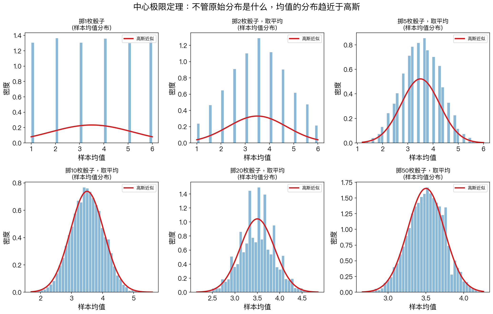

> **看图要点：** 六张子图展示了中心极限定理的渐进过程。左上角（n=1 个骰子）——直方图是均匀分布（六个等高的条形），红色曲线是理论上该均值应趋近的高斯分布，此时两者差异巨大。随着 n 增大（n=2, 5, 10, 20, 50 个骰子求平均），直方图逐渐变成钟形，红色高斯曲线越来越贴合。到 n=50 时，直方图几乎完美匹配高斯曲线。核心结论：**无论原始分布是什么形状（骰子本来是均匀的、完全不是钟形的），只要取足够多样本的平均值，平均值的分布就趋近于正态分布**——这就是正态分布无处不在的数学原因。

> 在机器学习中，高斯分布是默认的「猜测」——当你不知道一个连续变量的分布时，先假设它是高斯的通常不会太离谱。在**扩散模型**中，高斯噪声被反复添加和去除；在**变分自编码器**中，潜在变量的分布被假设为高斯；在**强化学习**中，策略网络通常输出一个高斯分布的参数。

### 4.4 多维高斯分布：从一条曲线到一座山

前面讲的是一维高斯——一个随机变量的钟形曲线。但在机器学习中，我们经常同时处理**成百上千个变量**，比如一张图有 256×256 个像素，每个像素都是一个随机变量。我们需要一种能描述所有这些变量**联合分布**的工具——这就是**多维高斯分布**。

**直觉比喻：** 一维高斯是一条钟形曲线。二维高斯就是**一座真正的三维山**——两个方向上都有钟形轮廓，而且两个方向之间还可能有「联动关系」。

二维高斯分布的公式：

$$p(\mathbf{x}) = \frac{1}{(2\pi)^{d/2} |\boldsymbol{\Sigma}|^{1/2}} \exp\!\left(-\frac{1}{2}(\mathbf{x} - \boldsymbol{\mu})^T \boldsymbol{\Sigma}^{-1} (\mathbf{x} - \boldsymbol{\mu})\right)$$

不要被公式吓到——它和一维高斯的逻辑完全相同，只是参数更丰富了：

| | 一维高斯 $\mathcal{N}(\mu,\sigma^2)$ | 多维高斯 $\mathcal{N}(\boldsymbol{\mu}, \boldsymbol{\Sigma})$ |
|---|---|---|
| 中心位置 | 一个数 $\mu$ | 一个向量 $\boldsymbol{\mu}$（ $d$ 维） |
| 散布程度 | 一个数 $\sigma^2$ | 一个矩阵 $\boldsymbol{\Sigma}$（ $d\times d$） |

$\boldsymbol{\Sigma}$ 叫**协方差矩阵**，它做两件事：
1. **对角线元素 $\Sigma_{ii}$**：每个变量自己的方差（在该方向上的散布宽度）
2. **非对角线元素 $\Sigma_{ij}$**（$i\neq j$）：两个变量之间的协方差——如果 $\Sigma_{12} > 0$，意味着 $x_1$ 大的时候 $x_2$ 往往也大（正相关）；如果是负数则反向变动。

**例子一：像素之间的关系。** 一张人脸上相邻像素的颜色不是互相独立的——左边的眉毛和右边的眉毛通常都是深色，而嘴唇区域是红色。协方差矩阵 $\boldsymbol{\Sigma}$ 就是用来捕捉这种「相邻像素一起变色」的关联。如果 $\Sigma_{ij}=0$，那两个像素之间完全独立（各变各的）。在扩散模型的博客中，你看到的「各向同性高斯噪声」（$\boldsymbol{\Sigma} = \sigma^2 \mathbf{I}$）意味着每个像素独立加噪，互不影响——协方差矩阵是对角矩阵。

**例子二：身高和体重的联合分布。** 假设我们同时测量 1000 个人的身高 $x_1$ 和体重 $x_2$。如果用一个二维高斯来建模 $(x_1, x_2)$ 的分布：$\mu_1 \approx 170$cm，$\mu_2 \approx 65$kg。协方差矩阵的非对角线元素 $\Sigma_{12}$ 是正的——因为身高高的人体重通常也大。这个「通常也大」在数学上就是协方差。

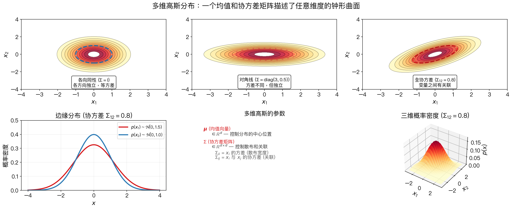

> **看图要点：** 上图三张等高线填充图对照 4.4 节中的三种协方差矩阵特例，虚线椭圆是 1-σ 等概率轮廓线：
> - **各向同性**（左）：等高线是正圆形——两个方向方差相同且独立。无论从哪个角度看，散布都一样。
> - **对角协方差**（中）：等高线是拉长的椭圆，但主轴与坐标轴平行——$x_1$ 方向方差 3（扁平），$x_2$ 方向方差 0.5（集中）。两个方向独立（协方差=0）。
> - **全协方差**（右）：等高线是倾斜的椭圆——$\Sigma_{12}=0.8$ 意味着 $x_1$ 和 $x_2$ 正相关。当 $x_1$ 大时 $x_2$ 通常也大，所以椭圆沿对角线方向拉伸。
> 
> 左下角边缘分布图展示了 $x_1$ 和 $x_2$ 各自单独的分布（「切下二维高斯的一个剖面」）——注意 $x_1$ 的边缘方差（1.5）大于 $x_2$（1.0），宽度不同。右下角是完整的三维概率密度曲面——最高的峰顶对应均值 $\boldsymbol{\mu}=(0,0)$ 的位置。

三个关键特例（见上图）：
- **各向同性** ($\boldsymbol{\Sigma} = \mathbf{I}$)：两个方向独立且方差相同 → 同心圆轮廓
- **对角协方差** ($\boldsymbol{\Sigma} = \mathrm{diag}(3, 0.5)$)：两个方向独立但方差不同 → 拉长的椭圆（轴与坐标轴平行）
- **全协方差** ($\Sigma_{12} = 0.8$)：两个方向相关 → 倾斜的椭圆

> **符号约定** $\boldsymbol{\mu}$（粗体 mu）是多维均值向量，$\boldsymbol{\Sigma}$（粗体大写 Sigma）是协方差矩阵。$|\boldsymbol{\Sigma}|$ 表示矩阵的行列式（一个正数），$\boldsymbol{\Sigma}^{-1}$ 表示矩阵的逆。$\mathbf{x}^T$ 表示向量的转置（列向量变成行向量）。$\mathcal{N}(\mathbf{0}, \mathbf{I})$ 是**标准多维高斯**——均值为零向量，协方差为单位矩阵（各方向独立、等方差），这也是扩散模型中加噪声的默认分布。

---

## 5. 如何进步：导数与梯度

### 5.1 导数：瞬间的变化率

假设你开车从北京去天津，已经行驶的距离是 $f(t)$，随时间变化。在某个时刻，你的车速是多少？这就是导数：

$$f'(t) = \lim_{\Delta t \to 0} \frac{f(t + \Delta t) - f(t)}{\Delta t}$$

用大白话：**在一段极短的时间内，距离的变化量除以时间的变化量。**

**例子一：开车去天津。** 假设你的行驶距离函数是 $f(t) = t^3 - 3t^2 + 4t$（公里），其中 $t$ 是时间（小时）。注意这条曲线并不单调——它有一段先上升后变缓再上升的形状，模拟了途中遇到堵车减速再加速的过程。在 $t=2.5$ 小时时，求导数：

$$f'(t) = 3t^2 - 6t + 4,\quad f'(2.5) = 3\times6.25 - 6\times2.5 + 4 = 18.75 - 15 + 4 = 7.75\ \text{km/h}$$

所以第 2.5 小时那个「瞬间」，你的车速是 7.75 km/h——不是「前两个半小时的平均速度」（$\frac{f(2.5)-f(0)}{2.5} \approx 5.6$ km/h），而是**那一瞬间的瞬时速度**。

**例子二：水箱的注水速度。** 一个水箱正在被注水，水位 $h(t) = 5t - t^2$（厘米，$t$ 以分钟计）。求导数：$h'(t) = 5 - 2t$。在 $t=0$ 时刻（刚开始注水），$h'(0) = 5$ cm/min——水面快速上升；在 $t=2$ 分钟时，$h'(2) = 1$ cm/min——上升变慢了；到 $t=2.5$ 分钟时，$h'(2.5) = 0$——水面到达最高点，暂时静止（此时流入和流出恰好平衡）。$t > 2.5$ 后 $h'(t) < 0$，水位开始下降。

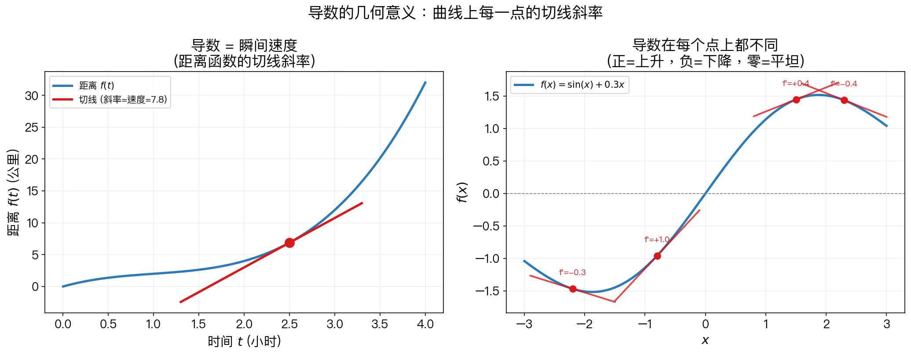

> **看图要点：** 左图演示了「导数 = 瞬时速度」的几何直觉。蓝色曲线是距离函数 $f(t)=t^3-3t^2+4t$，红色切线在 $t=2.5$ 处触及曲线——切线的斜率 7.75 等于瞬时时速。切线比曲线更「直」，因为它只关心**当前时刻**的变化趋势，而不关心过去或将来的曲线形态。右图展示了同一条曲线（蓝色为 $f(x)=\sin(x)+0.3x$）上多个点的切线。在绿色标注的 $f'=+1.3$ 处切线向右上倾斜——函数在快速增长；在 $f'=-0.3$ 处切线向右下倾斜——函数在下降；在 $f' \approx 0$ 处切线几乎水平——函数暂时平坦。记住：**切线斜率 > 0 → 上升，< 0 → 下降，= 0 → 可能是峰顶或谷底。**

在机器学习中，你不需要手动求导（编程框架帮你做），但你**必须理解导数的意义**——它告诉你「往这个方向走一步，函数值会变化多少」。

> **符号约定** 导数有多种写法但含义相同：$f'(x)$（拉格朗日记号）、$\frac{df}{dx}$（莱布尼兹记号）、$\dot{f}$（牛顿记号，对时间求导时用）。博客中最常见的是 $\frac{df}{dx}$ 和 $f'$。关键区分：$\frac{d}{dx}$ 是**全导数**（对单变量函数），$\frac{\partial}{\partial x}$ 是**偏导数**（对多变量函数中某一个变量求导，暂时把其他变量视为常数）。$a'$、$\dot{a}$ 上的撒号和点也是导数记号。

### 5.2 梯度：多维空间中的「最陡方向」

当你有多个变量时，每个变量都有自己的偏导数。把所有偏导数打包在一起，就是**梯度**（gradient）：

$$\nabla f = \begin{bmatrix} \frac{\partial f}{\partial x_1} \\ \frac{\partial f}{\partial x_2} \\ \cdots \\ \frac{\partial f}{\partial x_n} \end{bmatrix}$$

**例子：站在山上。** 你正站在一座起伏的山坡上，手里有一个指南针。你问：「往哪个方向走，海拔上升最快？」答案就是**梯度的方向**。梯度的长度告诉你这个方向的坡度有多陡。反过来，**负梯度方向**就是下山最快的方向。

梯度有两个关键性质：
1. **梯度的方向** = 函数值增长最快的方向（「最陡的上山路」）
2. **梯度的长度** = 在该方向上的增长率（「这条路有多陡」）

> **符号约定** $\nabla$（nabla，读作「纳布拉」）就是倒三角符号，是梯度的标准记号。$\nabla f$ 表示函数 $f$ 的梯度（一个向量）。$\nabla_{\mathbf{x}} f$ 表示「对 $\mathbf{x}$ 求梯度」——因为 $f$ 是标量而 $\mathbf{x}$ 是向量，所以 $\nabla_{\mathbf{x}} f$ 的结果仍然是一个向量（每个分量是 $f$ 对 $\mathbf{x}$ 的一个分量的偏导数：$\nabla_{\mathbf{x}} f = [\frac{\partial f}{\partial x_1}, \frac{\partial f}{\partial x_2}, \dots]$）。在扩散模型中你会看到 $\nabla_{\mathbf{x}} \log p(\mathbf{x})$，意为「对数概率密度对输入求梯度」。梯度中的每个分量 $\frac{\partial f}{\partial x_i}$ 叫**偏导数**，用 $\partial$（读作「偏」或英文 partial）而不是 $d$——提醒你这是一个多变量函数，只对其中一个变量求导。

### 5.3 梯度下降：一步一步走到谷底

既然负梯度指向最快下降的方向，沿着它走就能走向谷底：

$$\mathbf{x}_{\text{新}} = \mathbf{x}_{\text{旧}} - \eta \cdot \nabla f(\mathbf{x}_{\text{旧}})$$

其中 $\eta$ 是**学习率**（learning rate），控制每一步的大小。

**例子一：一维梯度下降。** 函数 $f(x) = x^4 - 3x^2 + x$，从 $x_0 = 1.8$ 出发，学习率 $\eta = 0.05$。梯度为 $f'(x) = 4x^3 - 6x + 1$。前几步的实际计算：

$$\begin{aligned}
x_0 &= 1.8, \quad f'(1.8) = 4\times5.832 - 10.8 + 1 = 23.328 - 9.8 = 13.528 \\
x_1 &= 1.8 - 0.05 \times 13.528 = 1.8 - 0.676 = 1.124 \\
x_2 &: f'(1.124) = 4\times1.420 - 6.744 + 1 = 5.680 - 5.744 = -0.064 \\
x_2 &= 1.124 - 0.05\times(-0.064) = 1.124 + 0.003 = 1.127 \quad (\text{坡度很平，几乎不动了})
\end{aligned}$$

经过 12 步，$x$ 一路下行到约 -1.3 附近的局部最小值点。

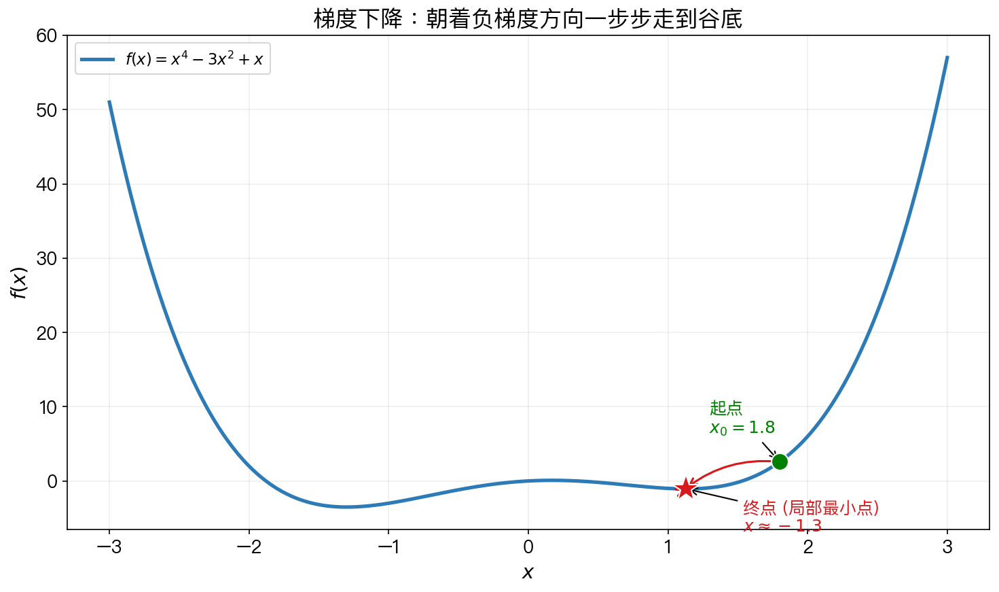

> **看图要点：** 蓝色曲线是函数 $f(x)=x^4-3x^2+x$——它有两个「谷」（局部最小值）和一个「峰」（局部最大值）。绿色圆点是起点 $x_0=1.8$，红色箭头表示每一步沿负梯度方向的移动。注意最初的几步幅很大（梯度陡），越靠近谷底步幅越小（梯度逐渐趋于 0）。蓝色星号是终点——它停在了左谷（约 $x\approx -1.3$），而非右谷。为什么？因为起点的梯度指向左下方——梯度下降是**局部**贪心算法，它只看得见脚下的坡度，并不知道更远处可能有更低的谷。

**例子二：二维等高线。** 就像看一张地形图，梯度总是指向下一层等高线的方向。动画展示梯度下降在二维曲面上从起点螺旋下降到最优点的过程。

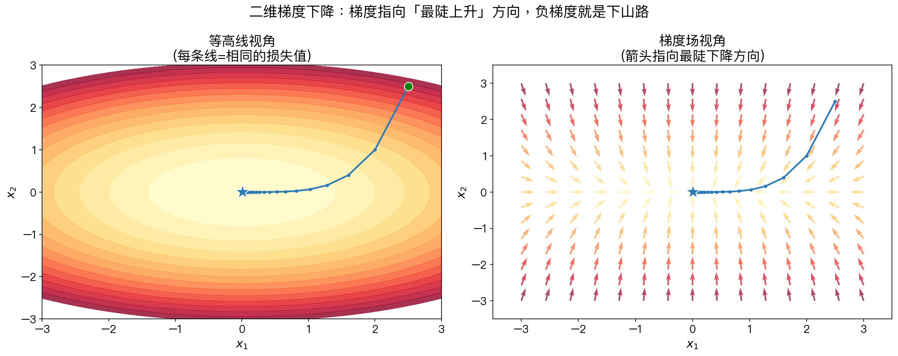

> **看图要点：** 左图是等高线视角——每条颜色带对应相同的损失值。梯度下降路径（蓝点连线）从 (2.5, 2.5) 出发，每一步都垂直穿过等高线向颜色最淡（损失最低）的区域前进。注意路径呈弯曲的螺旋形——因为 $f(x_1,x_2)=x_1^2+3x_2^2$ 中 $x_2$ 方向的系数更大（3 > 1），所以 $x_2$ 方向的梯度更大、下降更快，路径被「拉」向 $x_2$ 方向。右图是梯度场视角——每个小箭头指向该位置的负梯度方向（下山方向），颜色深浅表示梯度的大小（越红越大）。对比两图可发现：越远离原点，箭头越长（梯度大），路径步幅越大；越靠近原点（全局最优），箭头越短，步幅越小，最终收敛到原点。

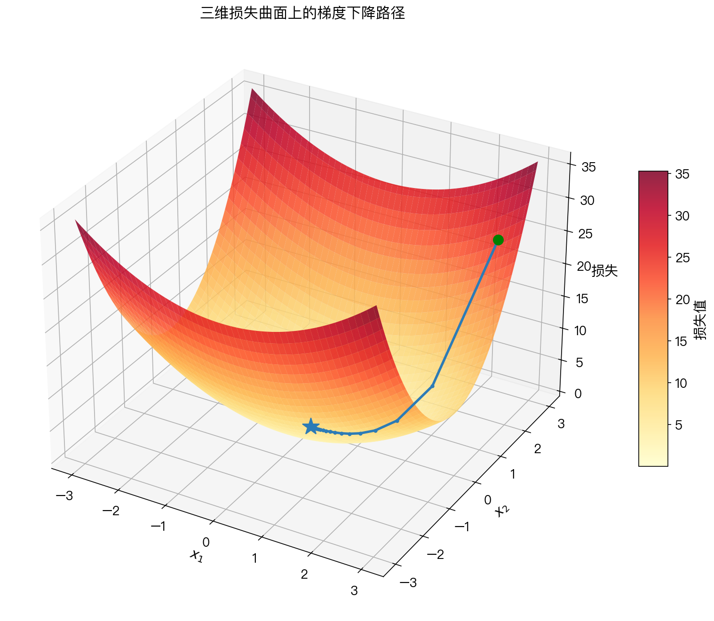

> **看图要点：** 这是同一损失函数的三维立体展示——曲面像一只拉长的碗。蓝色路径从碗的斜面上蜿蜒下降，每一步都落在较低的高度（损失逐渐减小）。注意 $\theta_2$ 方向（纵轴）的曲面更陡峭——在三维中表现为 $\theta_2$ 方向的斜率更大。路径之所以不是笔直下到碗底，而是先沿 $\theta_2$ 陡坡快速下降一段再沿 $\theta_1$ 缓坡慢慢收敛，正是因为两个方向有**不同的曲率**。

**学习率 $\eta$ 的选择是关键实践智慧：**
- 太大：可能「跳过头」，在谷底附近来回振荡甚至发散
- 太小：走得太慢，需要很多步才能到达谷底
- 刚好：快速、稳定地收敛

> 这就是机器学习训练的**核心算法**：不断地计算损失函数关于模型参数的梯度，然后往负梯度方向更新参数。重复几万次到几十万次，模型就越来越好了。在**扩散模型**的博客中，你会看到 $\nabla_{\mathbf{x}}\log p(\mathbf{x})$ 这个符号——它叫**得分函数（score function）**，含义是「往哪个方向走可以最快地走到更真实的数据区域」。这就是扩散模型逆向生成图像的根本数学原理。

### 5.4 链式法则与反向传播

如果 $y = f(u)$ 且 $u = g(x)$，那么 $y$ 对 $x$ 的导数是：

$$\frac{dy}{dx} = \frac{dy}{du} \cdot \frac{du}{dx}$$

这就是**链式法则**——复合函数的导数等于各层导数之积。

**例子一：多米诺骨牌。** 推倒第一张骨牌，它会触发第二张，第二张触发第三张……最终的力是每一层传递的积累。数学上，导数也是这样一层层「传递」的。

**例子二：公司层级中的影响。** 你在公司的底层，你想知道自己的工作如何影响 CEO 的收入。链式法则的逻辑是：你的工作 → 影响你的主管 → 影响部门经理 → 影响 VP → 影响 CEO。每一层的影响（偏导数）相乘，就是你到 CEO 的总影响。

一个神经网络本质上就是一堆函数的嵌套：

$$\text{输出} = f_n(\cdots f_3(f_2(f_1(\text{输入}))) \cdots)$$

**反向传播**就是用链式法则，从输出端（损失）出发，一层一层往回算每个参数的梯度：

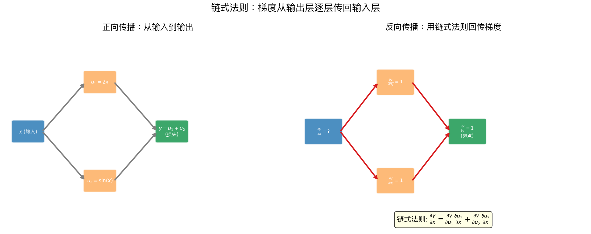

> **看图要点：** 左图（正向传播）：数据从输入 $x$ 沿灰色箭头流经 $u_1=2x$ 和 $u_2=\sin(x)$，汇合到输出 $y = u_1 + u_2$（损失）。这是计算函数值的方向——从输入到输出。右图（反向传播）：红色箭头方向完全相反——从输出 $y$ 出发，通过链式法则将梯度逐层传回输入。关键在中下方的链式法则公式：$\frac{\partial y}{\partial x} = \frac{\partial y}{\partial u_1}\frac{\partial u_1}{\partial x} + \frac{\partial y}{\partial u_2}\frac{\partial u_2}{\partial x} = 1\cdot 2 + 1\cdot\cos(x) = 2 + \cos(x)$。注意加法——因为 $y$ 依赖 $u_1$ 和 $u_2$ 两条路径，所以两条路径的梯度要**加起来**。这正是链式法则在多路径情况下的完整形式。

```
正向传播：输入 x → u₁ → u₂ → 输出 y = 损失
反向传播：∂y/∂y = 1  →  ∂y/∂u₂  →  ∂y/∂u₁  →  ∂y/∂x
```

这就是深度学习框架如 PyTorch 和 TensorFlow 自动完成的工作——自动微分（Autograd）。你只需要定义前向计算，框架自动帮你算出所有梯度。

---

## 6. 贝叶斯公式：用证据更新信念

### 6.1 罕见病检测的悖论

假设有一种罕见病，发病率为万分之一（0.01%）。你做了一个检测，准确率是 99%（真有病的被查出阳性的概率，没病被查出阴性的概率都是99%）。检查结果是**阳性**。你患病了吗？

直觉可能会说：「99% 准确率，阳性了，那大概率是病了。」但这个直觉是**错的**。一起用贝叶斯公式算一下。

**贝叶斯公式：**

$$P(\text{有病} \mid \text{阳性}) = \frac{P(\text{阳性} \mid \text{有病}) \cdot P(\text{有病})}{P(\text{阳性})}$$

> **符号约定** $P(A \mid B)$ 读作「在 B 发生的条件下，A 发生的概率」——中间那个竖线 $\mid$ 就是「条件于」的意思。$\propto$（花体无穷符号）读作「正比于」，$P(A \mid B) \propto P(B \mid A) P(A)$ 意思是「后验正比于似然乘以先验」——省略了分母中的归一化常数。博客中常见的 $p(\mathbf{x} \mid \mathbf{z})$ 和 $p(\mathbf{z} \mid \mathbf{x})$ 分别表示「给定潜在变量 $\mathbf{z}$ 时，数据 $\mathbf{x}$ 的分布」和「给定数据 $\mathbf{x}$ 时，潜在变量 $\mathbf{z}$ 的分布（后验）」。

代入实际数据：
- **先验概率** $P(\text{有病})$ = 1/10000 = 0.0001（万分之一）
- **似然** $P(\text{阳性} \mid \text{有病})$ = 0.99（真有病时被查出的概率）
- **边缘分布** $P(\text{阳性})$ = 0.0001 × 0.99 + 0.9999 × 0.01 ≈ 0.0101
  - 第一部分：真有病的人中被查出的（真阳性 ≈ 0.01/万人）  
  - 第二部分：没病但被误诊的（假阳性 ≈ 100/万人）

代入：

$$P(\text{有病} \mid \text{阳性}) = \frac{0.99 \times 0.0001}{0.0101} \approx 0.0098 \approx 0.98\%$$

**检查阳性后，你实际患病的概率只有约 1%，不是 99%！** 为什么？

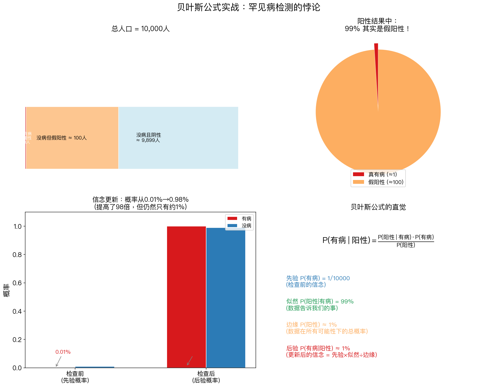

> **看图要点：** 这是一个四象限图解析罕见病悖论。左上：人口柱状图——10000 人中只有约 1 个真阳性（红色窄条），却有约 100 个假阳性（橙色宽条），真阳性淹没在假阳性中。右上：饼图——阳性结果中 99% 其实是假阳性！左下：柱状对比——检查前患病概率 0.01%，检查后仅升为 0.98%，虽然翻了 98 倍但绝对概率仍然很低。右下：贝叶斯公式的直观拆解——先验 × 似然 ÷ 边缘 = 后验。核心教训：**不要只看检验准确率，还要看疾病本身有多罕见。**

因为这种病实在太罕见了（万分之一），所以即使检测准确率高达 99%，**假阳性的绝对人数（约 100 人）远超真阳性人数（约 1 人）**。阳性结果中的 99% 其实是假阳性。

这个例子揭示了贝叶斯思想的核心：**新证据（阳性检测结果）更新了我们的信念（从 0.01% 到 0.98%），但并不会完全推翻先验知识。**

**例子二：法庭上的 DNA 证据。** 在犯罪审判中，检察官可能出示 DNA 匹配证据，声称「DNA 随机匹配的概率只有百万分之一！」我们套用贝叶斯公式计算。假设城市有 200 万人口，其中只有 1 人是真凶。

$$\begin{aligned}
P(\text{有罪}) &= \frac{1}{2,000,000} = 0.0000005 \quad (\text{先验：200万人中只有一个真凶}) \\
P(\text{DNA匹配} \mid \text{有罪}) &= 1.0 \quad (\text{真凶的DNA一定匹配}) \\
P(\text{DNA匹配} \mid \text{无罪}) &= \frac{1}{1,000,000} = 0.000001 \quad (\text{随机匹配概率}) \\
P(\text{DNA匹配}) &= 1.0 \times 0.0000005 + 0.000001 \times 0.9999995 \approx 0.0000015
\end{aligned}$$

代入贝叶斯公式：

$$P(\text{有罪} \mid \text{DNA匹配}) = \frac{1.0 \times 0.0000005}{0.0000015} \approx 0.333 = 33.3\%$$

DNA 匹配后，嫌疑人实际有罪的概率只有约 33%——远非「铁证」！为什么？因为 200 万人中约有 2 人会产生随机 DNA 匹配（假阳性），而真凶只有 1 人。在 3 个匹配者中，只有 1 个是真凶。先验概率（无辜人口基数）不能被忽略。

### 6.2 贝叶斯更新：每次看到新数据，信念都被修正

现在把这个思想延伸到机器学习中。假设我们在猜一枚硬币的正面概率 $p$ 是多少（这枚硬币可能不公平）。

**例子：逐步观察硬币翻转。**

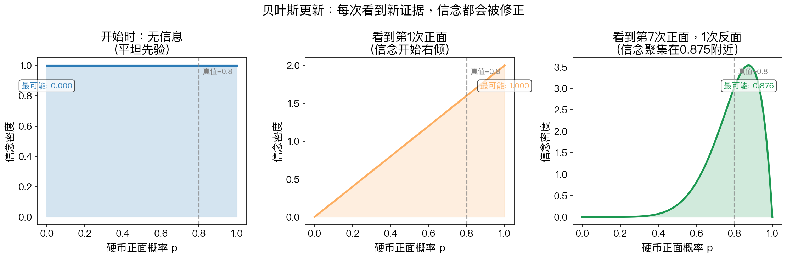

> **看图要点：** 三张子图展示了贝叶斯更新如何随着数据积累而渐进收敛。每张图的横轴是硬币正面概率 $p$（0 到 1），纵轴是信念密度——曲线越高代表我们对那个 $p$ 值越相信。第一张"平坦先验"：在没看到任何数据前，所有 $p$ 值一视同仁（均匀分布）。第二张：看到 1 次正面后，信念开始右倾（高 $p$ 值更可信），但曲线仍然很宽——只有一条数据时我们还不确定。第三张：看到 7 次正面 1 次反面后，信念高度聚集在 $p\approx0.875$（即观察到的正频率）附近，曲线变得很窄——不确定性大幅减小。灰色虚线标记了真实参数 $p_{\text{true}}=0.8$，可见随着数据增加，信念逐渐收敛到真值。

- **开始前**：我们对 $p$ 一无所知，假设所有可能的值（0 到 1）概率相同（平坦先验）
- **看到第 1 次正面**：信念开始右倾——$p$ 可能大于 0.5
- **看到 7 次正面、1 次反面**：信念聚集在 0.875 附近（87.5% 的正面率），但仍然有一定宽度（表示不确定性）

如果我们继续翻转这个硬币，看到第 70 次正面、10 次反面，信念就会更尖锐地集中在 0.875 附近——数据越多，不确定性越小。

### 6.3 先验、似然与后验

贝叶斯更新中三个角色的互动关系：

$$\text{后验} \propto \text{先验} \times \text{似然}$$

- **先验**：看到数据前已有的信念（越弱越容易被数据改变）
- **似然**：数据告诉我们的事（「在这些参数下，观测到这些数据的概率」）
- **后验**：更新后的新信念

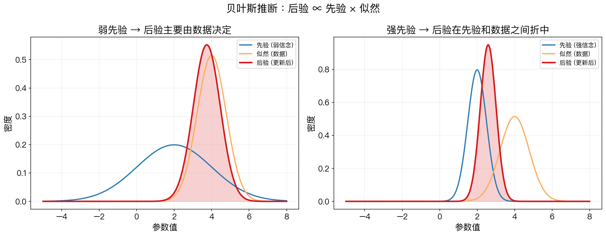

> **看图要点：** 左右两张图展示了先验强度如何影响后验结果。左图（弱先验）：蓝色先验很宽很平——表示「我几乎一无所知」。橙色似然（数据）有明确的峰值在 $x\approx 4$。红色后验紧紧跟随似然——当先验很弱时，数据主导结论，后验几乎就是似然本身。右图（强先验）：蓝色先验窄而尖，峰值在 $x\approx 2$——表示「我非常确定参数在 2 附近」。同一份橙色似然数据（峰值仍在 $x\approx 4$），但红色后验被「拉回」到先验和似然之间（峰值在 $x\approx 2.5$）。结论：**先验越强，新证据越难改变信念；先验越弱，数据越能主导结论。** 这就是贝叶斯推断中「先验」和「数据」的博弈。

- **弱先验**（左图）：一个大而宽的先验分布意味着「我不确定参数在哪」，所以后验分布主要由数据决定
- **强先验**（右图）：一个窄而高的先验意味着「我很确定参数在这附近」，即使数据指向另一个方向，后验也会在两者之间折中

> 在机器学习中，贝叶斯公式的应用无处不在：变分推断用简单分布近似复杂后验；扩散模型每一步去噪隐含着贝叶斯更新；分类模型输出 $P(\text{类别} \mid \text{输入})$ 本身就是贝叶斯语言。

---

## 7. 选读：通往更高处

以下概念在博客中偶尔出现，但不需要在入门阶段完全掌握。这里只建立直觉。

### 7.1 ODE 与 SDE：确定的流动 vs 随机的漂移

在扩散模型的博客中，你会频繁看到 **ODE（常微分方程）** 和 **SDE（随机微分方程）**。直觉并不难：

**ODE** 描述事情如何随时间连续变化：

$$\frac{d\mathbf{x}}{dt} = \mathbf{v}(\mathbf{x}, t)$$

方程说：状态 $\mathbf{x}$ 每一刻的变化方向和速率由函数 $\mathbf{v}$ 决定。**粒子在流水中随波逐流**——每个位置的水流方向都是确定的。

**SDE** 在 ODE 基础上增加了一个随机扰动项：

$$d\mathbf{x} = \mathbf{v}(\mathbf{x}, t)\ dt + \mathbf{g}(\mathbf{x}, t)\ dW$$

多出来的项代表**随机噪声**。一片树叶在河水中漂流：水流决定大方向，但随机湍流让轨迹不是完全确定的。

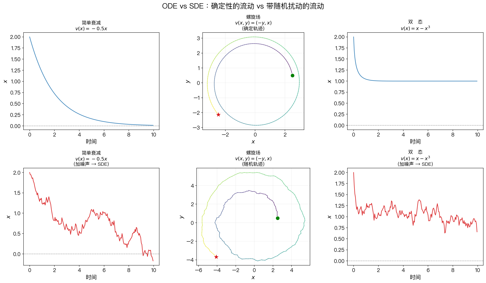

> **看图要点：** 这是一个 $2 \times 3$ 的对比网格。上排是 ODE（确定，无噪声），下排是 SDE（随机，有噪声）。三列分别是三种不同的动态系统：
> - **左列（简单衰减）**：ODE 版曲线平滑地衰减到 0；SDE 版则在衰减趋势上叠加了随机抖动——整体仍向下，但每一步都在随机波动。
> - **中列（螺旋场）**：ODE 版是一条完美的螺旋线稳定收敛到原点（绿色→红色表示时间流逝）；SDE 版轨迹变得不规则、像醉汉走路，不再完美闭合。
> - **右列（双稳态）**：ODE 版粒子从 $x=2$ 出发稳定收敛到右侧稳态 $x=1$；SDE 版则可能在两个稳态之间被噪声推来推去，有时甚至会「跳」到另一个稳点。
> 
> 核心对比：**ODE = 完全可预测，SDE = 有随机性的 ODE。扩散模型的前向加噪是 SDE（确定性漂移 + 随机噪声），反向去噪也是 SDE。**

**在扩散模型中的角色：**
- **前向过程**（加噪声）：SDE——确定性漂移 + 随机噪声 = 数据逐渐变为噪声
- **反向过程**（去噪声）：SDE——确定性漂移 - 去噪修正 = 噪声逐渐变回数据
- **概率流 ODE**：与反向 SDE 有相同的概率分布演化，但**完全确定**——没有了随机性，采样更快

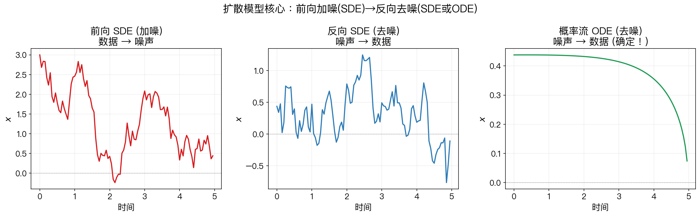

> **看图要点：** 三张子图对应扩散模型的三个核心过程（横轴=时间，纵轴=信号值 $x$）：
> - **左图（前向 SDE）**：从 $x_0=3$ 出发，在确定性漂移（向着 $x=0$ 衰减）和随机噪声共同作用下，信号逐渐退化为纯噪声（围绕 0 无规律波动）。
> - **中图（反向 SDE）**：从最终噪声状态出发，通过学到的得分函数引导，**逆向**去噪。注意曲线仍有随机性（抖动），这是 SDE 采样的特征——每次生成的样本路径都不完全一致。
> - **右图（概率流 ODE）**：同样的逆向过程，但**完全确定**——没有随机噪声，路径平滑。ODE 版保有了和 SDE 版相同的概率分布演化，但采样更快更稳定。这就是扩散模型在实践中的加速采样技巧。

你不需要在入门阶段完全理解 SDE，只需要记住：**SDE = ODE + 随机扰动，扩散模型的前向和反向过程都可用 SDE 精确描述，而概率流 ODE 提供了一种更快的确定性采样替代方案。**

### 7.2 SVD 与低秩近似：用小矩阵表示大矩阵

在讨论模型压缩（LoRA）或高效注意力（MLA/DeepSeek）时，你会看到「低秩」这个词。

**秩（rank）**衡量一个矩阵有多少「独立信息」。秩越高，信息量越大。一个 $n \times n$ 的满秩矩阵需要存 $n^2$ 个参数。但如果它的有效秩很低（大部分信息冗余），我们可以用两个小得多的矩阵近似它。

**例子：压缩一张照片。** JPEG 压缩的基本思想就是用更少的数据近似原图。SVD（奇异值分解）就是一种更一般的方法：

$$\mathbf{W} \approx \mathbf{U}_r \boldsymbol{\Sigma}_r \mathbf{V}_r^T$$

- $\mathbf{U}_r$ 是 $d \times r$ 的矩阵
- $\mathbf{V}_r^T$ 是 $r \times d$ 的矩阵
- $r \ll d$：秩远小于原始维度
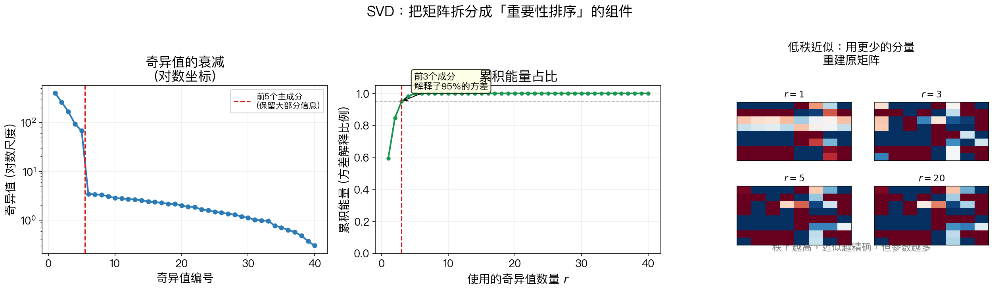

> **看图要点：** 三张子图一起说明 SVD 做低秩近似的原理。
> - **左图（奇异值衰减）**：纵轴是对数尺度——前 5 个奇异值远大于后面的噪声（红色虚线分割），说明矩阵的「有效信息」集中在前几个主成分，后面的可以丢弃。
> - **中图（累积能量）**：前 4 个奇异值已经解释了 95% 的方差（红色虚线标注），也就是说用秩-4 近似就能保住原矩阵 95% 的「信息」。后面的 36 个奇异值只贡献了 5%。
> - **右图（低秩重建对比）**：用不同秩 $r$ 重建同一块 8×8 子矩阵——$r=1$ 只能捕捉最粗糙的轮廓，$r=3$ 开始出现结构，$r=5$（只用 5 个分量！）已经很接近原图，$r=20$ 几乎完美还原。这就是 LoRA ( $r=16$ ) 之所以有效的实验依据。

**前几个奇异值通常解释了绝大多数的方差**——这说明矩阵的大部分信息是冗余的、可以用低秩形式压缩的。

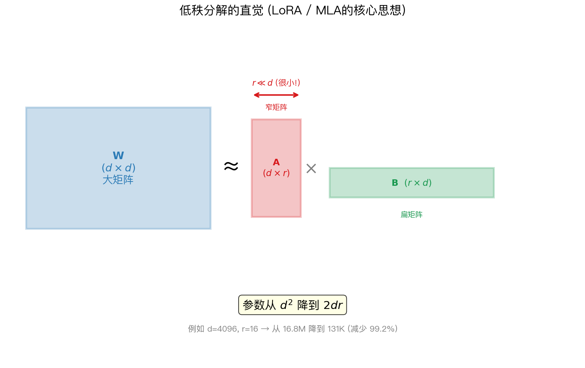

> **看图要点：** 这张图直观解释了 LoRA 的核心公式 $\mathbf{W} \approx \mathbf{A} \times \mathbf{B}$。左边蓝色大方块是原始权重矩阵 $\mathbf{W}$（$d\times d$），中间用「≈」连接右侧两个小矩阵的**乘积**：红色的 $\mathbf{A}$（窄矩阵 $d\times r$）和绿色的 $\mathbf{B}$（扁矩阵 $r\times d$），中间用「×」号明确表示矩阵乘法。$r \ll d$ 标注在 $\mathbf{A}$ 的宽度上——$r$ 就是那个极窄的「瓶颈」。底部文字给出了一个真实数字：$d=4096, r=16$ 时参数从 16.8M 降到 131K（两个小矩阵参数之和 $2dr = 131072$），减少了 99.2%。

**在博客中的应用：**
- **LoRA（低秩适应）**：微调大模型时，不修改原参数，而是添加两个小矩阵的乘积——参数从 $d^2$ 降到 $2dr$（比如 d=4096, r=16 时，从 16.8M 降到 131K，减少了 99.2%）
- **MLA（多头潜在注意力，DeepSeek-V2/V3/V4）**：将 Key 和 Value 压缩到低维潜在空间，大幅减少推理时的 KV 缓存

---

## 8. 知识地图：每个概念在博客中的落脚点

当你开始阅读本项目的博客（Transformer 注意力机制、扩散模型、YOLO 目标检测、世界模型、链式推理等），你会反复遇到以下数学符号和概念。这张地图帮你快速定位：

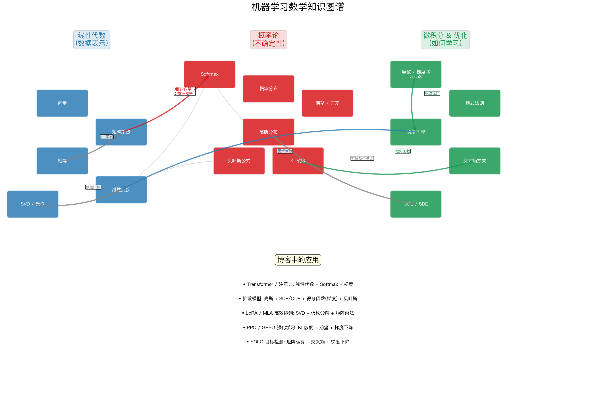

> **看图要点：** 这是一张全景知识地图——所有数学概念用彩色节点按三大领域分组（蓝色=线性代数，红色=概率论，绿色=微积分/优化）。带文字的箭头表示跨领域联系（如「矩阵×向量→分数→概率」串起了线性代数和概率论，「驱动优化」和「更新参数」形成了微分→优化的闭环）。节点之间的连线密度反映了学科交织的深度——线性代数提供数据表示，概率论处理不确定性，微积分驱动学习。下方列出了五个主要博客主题及其依赖的数学工具组合，帮你建立「这篇博客大概需要什么数学」的快速索引。

- **向量** — 词嵌入、图像展平、潜在表示。常见记号：$\mathbf{x}$, $\mathbf{z}$, $\mathbf{h}$
- **矩阵乘法** — 全连接层、注意力中的 $\mathbf{Q}\mathbf{K}^T$。常见记号：$\mathbf{W}\mathbf{x}$, $\mathbf{Q}\mathbf{K}^T$
- **Softmax** — 注意力权重归一化、分类输出。常见记号：$\text{softmax}(\mathbf{Q}\mathbf{K}^T/\sqrt{d_k})$
- **梯度 $\nabla$** — 损失优化、扩散得分函数。常见记号：$\nabla_{\theta}\mathcal{L}$, $\nabla_{\mathbf{x}}\log p$
- **期望 $\mathbb{E}$** — 损失定义、概率生成。常见记号：$\mathbb{E}_{\mathbf{x} \sim p}[\cdot]$
- **高斯分布** — VAE 潜在变量、扩散噪声。常见记号：$\mathcal{N}(\mu, \sigma^2)$, $\mathcal{N}(\boldsymbol{\mu}, \boldsymbol{\Sigma})$
- **KL 散度** — VAE、扩散、PPO/GRPO。常见记号：$D_{\text{KL}}(q \parallel p)$
- **交叉熵** — 分类损失、语言模型训练。常见记号：$H(p, q)$, $\mathcal{L}_{\text{CE}}$
- **链式法则** — 反向传播。常见记号：$\frac{\partial \mathcal{L}}{\partial x} = \frac{\partial \mathcal{L}}{\partial y}\frac{\partial y}{\partial x}$
- **ODE / SDE** — 扩散模型理论、Flow Matching。常见记号：$\frac{d\mathbf{x}}{dt}$, $d\mathbf{x}= \dots dt + \dots dW$
- **贝叶斯公式** — 变分推断、后验推导。常见记号：$P(A\mid B) \propto P(B\mid A)P(A)$
- **SVD / 低秩** — LoRA 微调、MLA 高效注意力。常见记号：$\mathbf{W} = \mathbf{U}\boldsymbol{\Sigma}\mathbf{V}^T$

---

## 9. 最后的话

这篇文章没有、也不可能讲完所有的东西。数学是工具，不是目的。

当你读博客遇到不懂的符号时，回到这篇文章找它的**直觉含义**——知道一个概念「在干什么」，比知道它「怎么推导出来的」，重要一百倍。推导可以查，但直觉需要建立。

记住三条最重要的直觉，它们贯穿了现代机器学习的每个角落：

1. **一切都始于把事物表示为数字**（向量和矩阵），然后在数字上做变换（矩阵乘法）来提取模式和关系。神经网络是一连串可学习的线性变换。

2. **概率是描述不确定性的语言**。从 Softmax 输出到损失函数，从高斯噪声到贝叶斯更新——概率论提供了处理「不完美信息」的通用语言。

3. **梯度告诉我们如何变得更好**。几乎所有机器学习训练归根结底都是在做同一件事：计算损失关于参数的梯度，然后沿负梯度方向更新参数。重复、重复、再重复。

带着这三条直觉去读博客吧。你不需要先成为数学家才能理解机器学习——你只需要知道每个数学工具在解决什么问题。

祝你读得开心 🚀

---

*本文的所有图表均由 Python/matplotlib 生成，脚本位于 `scripts/` 目录下。*

[← 回到首页](..)
