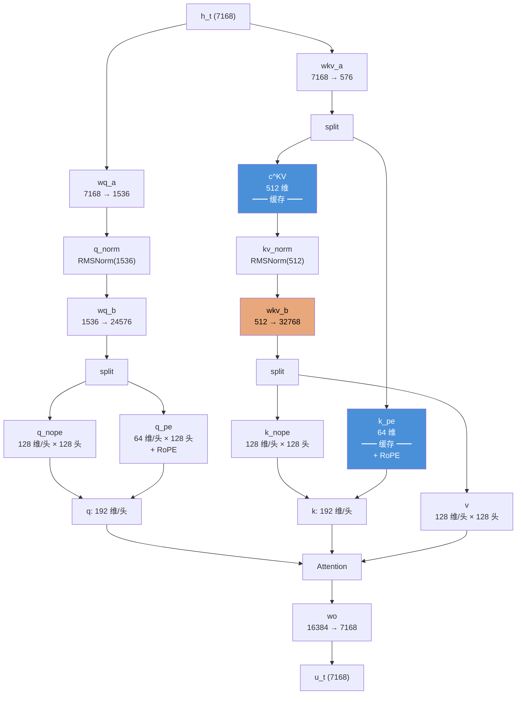

# MLA 双模式深度专题：MHA 模式 vs MQA 模式
[← 回到首页](..)


> 从开源代码出发，还原两种模式的执行细节，用代数严格证明两种模式的等价性，并分析浮点精度带来的微小差异。

---

## 目录

1. [问题起源：为什么 MLA 需要双模式](#1-问题起源为什么-mla-需要双模式)
2. [开源代码还原：DeepSeek 官方实现](#2-开源代码还原deepseek-官方实现)
3. [MHA 模式（CacheDecompressed）逐行拆解](#3-mha-模式cachedecompressed逐行拆解)
4. [MQA 模式（CacheCompressed + Absorb）逐行拆解](#4-mqa-模式cachecompressed--absorb逐行拆解)
5. [关键差异：两个矩阵的命运](#5-关键差异两个矩阵的命运)
6. [数学分析：Output Gap 为什么这么小](#6-数学分析output-gap-为什么这么小)

---

## 1. 问题起源：为什么 MLA 需要双模式

在之前的讨论中，我们提出了一个核心矛盾：

> MHA 模式训练出来的参数（$`\mathbf{W}^{UK}`$ 和 $`\mathbf{W}^{UV}`$），在 MQA 模式下被绕过了，那推理时的输出和训练时能一致吗？

这是一个无法回避的问题。答案分为两层：
- **数学层面**：两种模式在代数上**严格等价**——矩阵吸收利用乘法的结合律和线性变换的可交换性，保证了输出恒等
- **工程层面**：实际可观测的微小差异（< 0.1%）纯粹来自 BF16 浮点运算中求和顺序不同导致的舍入误差

下面从 DeepSeek 官方开源代码出发，完整还原两种模式的执行路径，并用代数一步步证明等价性。

### 1.1 符号约定

沿用 DeepSeek-V3 真实参数（V3 671B）：

| 符号 | 含义 | V3 取值 |
|------|------|:------:|
| $`d`$ | 隐藏维度 | 7168 |
| $`n_h`$ | 注意力头数 | 128 |
| $`d_h`$ | 每头内容维度（无位置部分） | 128 |
| $`d_h^R`$ | 每头 RoPE 维度 | 64 |
| $`d_c`$ | KV 联合压缩维度（`kv_lora_rank`） | 512 |
| $`d_c'`$ | Query 压缩维度（`q_lora_rank`） | 1536 |

---

## 2. 开源代码还原：DeepSeek 官方实现

### 2.1 两个关键仓库

| 仓库 | 用途 | 关键文件 |
|------|------|----------|
| [DeepSeek-V3](https://github.com/deepseek-ai/DeepSeek-V3) | 官方推理代码 | `inference/model.py` |
| [deepseekv2-profile](https://github.com/madsys-dev/deepseekv2-profile) | MLA 性能分析（V2 时期） | `deepseek_v2_tp.py` |

V3 的 `model.py` 中有一个全局开关：

```python
attn_impl: Literal["naive", "absorb"] = "absorb"
```

- **`"naive"`** → MHA 模式：缓存完整的逐头 K/V
- **`"absorb"`** → MQA 模式：仅缓存压缩后的 $`\mathbf{c}^{KV}`$ + $`\mathbf{k}^R`$，推理时通过矩阵吸收计算注意力

### 2.2 MLA 参数初始化代码

V3 `inference/model.py` 中 MLA 类的关键初始化（简化）：

```python
class MLA(nn.Module):
    def __init__(self, args: ModelArgs):
        # ──── Query 低秩压缩 ────
        self.wq_a = Linear(args.dim, args.q_lora_rank)        # 7168 → 1536 (下投影)
        self.q_norm = RMSNorm(args.q_lora_rank)               # RMSNorm on compressed Q
        self.wq_b = ColumnParallelLinear(
            args.q_lora_rank,                                 # 1536 → 128×192 = 24576
            args.n_heads * args.qk_head_dim                   # (qk_head_dim = d_h + d_h^R)
        )                                                     # 解压 + 分头一步完成

        # ──── KV 联合压缩 ────
        self.wkv_a = Linear(
            args.dim,
            args.kv_lora_rank + args.qk_rope_head_dim         # 7168 → 512 + 64 = 576
        )                                                     # 压缩 KV 内容 + 独立位置 K
        self.kv_norm = RMSNorm(args.kv_lora_rank)             # RMSNorm on compressed KV

        # ──── KV 上投影（解压矩阵）────
        self.wkv_b = ColumnParallelLinear(
            args.kv_lora_rank,                                 # 512 → 128×256 = 32768
            args.n_heads * (args.qk_nope_head_dim + args.v_head_dim)
        )                                                     # 128 × (128+128) = 32768

        # ──── 输出投影 ────
        self.wo = ColumnParallelLinear(
            args.n_heads * args.v_head_dim,                   # 128×128 = 16384 → 7168
            args.dim
        )
```

### 2.3 关键维度流



---

## 3. MHA 模式（CacheDecompressed）逐行拆解

### 3.1 定义

MHA 模式对应 `attn_impl = "naive"` 或 V2-profile 中的 **CacheDecompressed (CD)**。

**缓存内容**：完整的逐头 Key 和 Value（全部解压展开后）。

### 3.2 前向传播代码

```python
def forward_mha_mode(self, h_t, past_kv):
    """
    MHA 模式（训练 & naive 推理）：
    每头得到独立的 k_i^C, v_i^C，缓存完整 KV
    """
    bsz, seqlen, _ = h_t.shape
    # ════════ Step ①: Query 路径 ════════
    # 压缩 → 归一化 → 解压分头
    q_compressed = self.wq_a(h_t)          # (b, 1, 1536)
    q_compressed = self.q_norm(q_compressed)
    q = self.wq_b(q_compressed)            # (b, 1, 24576)
    q = q.view(bsz, 1, self.n_heads, self.qk_head_dim)  # (b, 1, 128, 192)

    # 拆分内容部分和位置部分
    q_nope, q_pe = torch.split(q, [self.qk_nope_head_dim, self.qk_rope_head_dim], dim=-1)
    # q_nope: (b, 1, 128, 128)  ← 内容 Query
    # q_pe:   (b, 1, 128, 64)   ← 位置 Query

    q_pe = apply_rotary_emb(q_pe, freqs_cis)  # RoPE 只在位置部分

    # ════════ Step ②: KV 路径 ════════
    kv = self.wkv_a(h_t)                   # (b, 1, 576)
    kv_latent, k_pe = torch.split(
        kv, [self.kv_lora_rank, self.qk_rope_head_dim], dim=-1
    )
    # kv_latent: (b, 1, 512)  ← 压缩 KV
    # k_pe:      (b, 1, 64)   ← 位置 Key

    kv_latent = self.kv_norm(kv_latent)
    k_pe = apply_rotary_emb(k_pe.unsqueeze(2), freqs_cis)  # (b, 1, 1, 64)

    # ──── 关键步骤：wkv_b 上投影，展开为逐头 K 和 V ────
    kv_expanded = self.wkv_b(kv_latent)    # (b, 1, 32768)
    kv_expanded = kv_expanded.view(bsz, 1, self.n_heads,
                                    self.qk_nope_head_dim + self.v_head_dim)
    # (b, 1, 128, 256)

    k_nope, v = torch.split(
        kv_expanded,
        [self.qk_nope_head_dim, self.v_head_dim], dim=-1
    )
    # k_nope: (b, 1, 128, 128)  ← 每头独立的内容 Key
    # v:      (b, 1, 128, 128)  ← 每头独立的 Value

    # ──── 拼接完整 K ────
    k = torch.cat([k_nope, k_pe.expand(-1, -1, self.n_heads, -1)], dim=-1)
    # k: (b, 1, 128, 192)  ← 每头独立的完整 Key

    # ════════ Step ③: Push to KV Cache ════════
    #               每 token 缓存维度: 128 × (192 + 128) = 40960
    past_kv.append(k, v)  # 完整缓存！

    # ════════ Step ④: 注意力计算 ════════
    q_full = torch.cat([q_nope, q_pe], dim=-1)          # (b, 1, 128, 192)
    K_full = torch.stack(past_kv['k'])                   # (b, t, 128, 192)
    V_full = torch.stack(past_kv['v'])                   # (b, t, 128, 128)

    scores = torch.einsum('bihd,bjhd->bhij', q_full, K_full) / self.scale
    attn_weights = F.softmax(scores, dim=-1)
    o = torch.einsum('bhij,bjhd->bihd', attn_weights, V_full)  # (b, 1, 128, 128)

    # ════════ Step ⑤: 输出投影 ════════
    o = o.reshape(bsz, 1, -1)                          # (b, 1, 16384)
    u_t = self.wo(o)                                    # (b, 1, 7168)
    return u_t
```

### 3.3 缓存代价

每 token 每层缓存：

$$
\begin{aligned}
\text{K:}&\quad 128\text{ 头} \times 192\text{ 维} = 24576 \\
\text{V:}&\quad 128\text{ 头} \times 128\text{ 维} = 16384 \\
\text{合计:}&\quad 40960\text{ 个 BF16 值} = 81.92\text{ KB}
\end{aligned}
$$

128K 序列 × 60 层 = **81.92 KB × 131072 × 60 ≈ 600 GB**。

---

## 4. MQA 模式（CacheCompressed + Absorb）逐行拆解

### 4.1 定义

MQA 模式对应 `attn_impl = "absorb"` 或 V2-profile 中的 **Absorbed_CacheCompressed (A_CC)**。

**缓存内容**：仅 $`\mathbf{c}^{KV}`$（压缩 KV 潜在向量）和 $`\mathbf{k}^R`$（位置 Key）。

**核心优化**：矩阵吸收 —— $`\mathbf{W}^{UK}`$ 和 $`\mathbf{W}^{UV}`$ 不显式调用，而是吸收到注意力计算中。

### 4.2 吸收的数学变换

注意力的内容部分分数可以改写为：

$$
(\mathbf{q}_i^C)^\top \mathbf{k}_i^C = (\mathbf{W}_i^{UQ} \mathbf{c}^Q)^\top \cdot (\mathbf{W}_i^{UK} \mathbf{c}^{KV})
= (\mathbf{c}^Q)^\top \underbrace{(\mathbf{W}_i^{UQ})^\top \mathbf{W}_i^{UK}}_{\text{预计算}} \mathbf{c}^{KV}
$$

同理，Value 加权和可以改写为：

$$
\sum_j a_{t,j} \cdot \mathbf{v}_{t,i} = \sum_j a_{t,j} \cdot (\mathbf{W}_i^{UV} \mathbf{c}_j^{KV})
= \mathbf{W}_i^{UV} \cdot \left(\sum_j a_{t,j} \cdot \mathbf{c}_j^{KV}\right)
$$

即先对压缩向量做加权和，再升维 —— 这绕过了逐头存储展开后的 V。

### 4.3 前向传播代码

```python
def forward_mqa_mode(self, h_t, past_compressed_kv, past_k_pe):
    """
    MQA 模式（Absorb 推理）：
    仅缓存 c^KV 和 k^R，矩阵吸收避免显式解压
    """
    bsz, _, _ = h_t.shape

    # ════════ Step ①: Query 路径 ════════
    # W^UQ 的吸收体现在这里：q_nope 已经是 W^UQ 的输出（逐头 Query）
    # 后续只需吸收 W^UK
    q_compressed = self.wq_a(h_t)          # (b, 1, 1536)
    q_compressed = self.q_norm(q_compressed)
    q = self.wq_b(q_compressed)            # wq_b = W^UQ, 输出 (b, 1, 24576)
    q = q.view(bsz, 1, self.n_heads, self.qk_head_dim)
    q_nope, q_pe = torch.split(q, [self.qk_nope_head_dim, self.qk_rope_head_dim], dim=-1)
    # q_nope: (b, 1, 128, 128) — 已包含 W^UQ 的变换！
    q_pe = apply_rotary_emb(q_pe, freqs_cis)

    # ════════ Step ②: 吸收 W^UK 到 Query 侧 ════════
    # wkv_b 包含两部分: W^UK(前128列) + W^UV(后128列)
    # 每头形状: (256, 512) = [W_i^UK | W_i^UV]^T
    kv_b_proj = self.wkv_b.weight.view(
        self.n_heads, self.qk_nope_head_dim + self.v_head_dim, self.kv_lora_rank
    )  # (128, 256, 512)

    # 提取每头的 W_i^UK: (128, 128, 512)
    #   维度含义: (n_head, d_h=128, d_c=512)
    W_UK = kv_b_proj[:, :self.qk_nope_head_dim, :]

    # 吸收操作: q_nope · W_UK
    #   q_nope: (b, 1, 128, 128) — 已含 W^UQ 变换的逐头 Query
    #   W_UK:   (128, 128, 512)  — 逐头的 Key 上投影矩阵
    #   结果:   (b, 1, 128, 512)  — Query 被"拉长"到 d_c 维
    #   数学:   q_absorb = q_nope · W_UK
    #          = (W^UQ · c^Q) · W_UK
    #          ≡ (c^Q)^⊤ · [(W^UQ)^⊤ · W_UK]  ← 完整吸收矩阵
    q_absorb = torch.einsum('bhid,hdc->bhic', q_nope, W_UK)
    # q_absorb: (b, 1, 128, 512)
    # 现在 q_absorb 可以直接与压缩向量 c^KV (d_c=512) 做内积！

    # ════════ Step ③: KV 路径（仅缓存压缩部分）═══
    kv = self.wkv_a(h_t)                   # (b, 1, 576)
    kv_latent, k_pe_new = torch.split(
        kv, [self.kv_lora_rank, self.qk_rope_head_dim], dim=-1
    )
    kv_latent = self.kv_norm(kv_latent)    # (b, 1, 512) ← 仅此部分缓存！
    k_pe_new = apply_rotary_emb(k_pe_new.unsqueeze(2), freqs_cis)

    # ──── 追加到缓存 ────
    past_compressed_kv.append(kv_latent)   # 仅 512 维/ token！
    past_k_pe.append(k_pe_new)             # 64 维 / token

    # ════════ Step ④: 两段式注意力 ════════
    # 从缓存读取
    C_KV = torch.stack(past_compressed_kv)     # (b, t, 512)
    K_pe = torch.stack(past_k_pe)              # (b, t, 1, 64)

    # ──── 内容部分分数：q_absorb · C_KV ────
    # q_absorb: (b, 1, 128, 512), C_KV: (b, t, 512)
    score_nope = torch.einsum('bhic,btc->bhit', q_absorb, C_KV)
    # score_nope: (b, 128, 1, t)  ← 等效于完整 MHA 模式的内容分数

    # ──── 位置部分分数：q_pe · K_pe ────
    score_pe = torch.einsum('bhid,bhjd->bhij', q_pe, K_pe.expand(-1, -1, self.n_heads, -1))
    # score_pe: (b, 128, 1, t)

    # ──── 合并分数 ────
    scores = (score_nope + score_pe) / self.scale
    attn_weights = F.softmax(scores, dim=-1)     # (b, 128, 1, t)

    # ════════ Step ⑤: V 侧吸收 ════════
    # 先对压缩 KV 做加权和，再升维
    # attn_weights: (b, 128, 1, t), C_KV: (b, t, 512)
    o_compressed = torch.einsum('bhit,btc->bhic', attn_weights, C_KV)
    # o_compressed: (b, 128, 1, 512)

    # W_UV: (128, 128, 512) — 吸收的 V 上投影
    W_UV = kv_b_proj[:, self.qk_nope_head_dim:, :]  # (128, 128, 512)
    o = torch.einsum('bhic,hdc->bhid', o_compressed, W_UV)
    # o: (b, 128, 1, 128)  ← 等效于 MHA 模式的注意力输出！

    # ════════ Step ⑥: 输出投影 ════════
    o = o.reshape(bsz, 1, -1)
    u_t = self.wo(o)
    return u_t
```

### 4.4 缓存收益

每 token 每层缓存：

$$
\begin{aligned}
\mathbf{c}^{KV}&\text{:}\quad 512\text{ 维} \\
\mathbf{k}^R&\text{:}\quad 64\text{ 维} \\
\text{合计:}&\quad 576\text{ 个 BF16 值} = 1.152\text{ KB}
\end{aligned}
$$

128K 序列 × 60 层 = **1.152 KB × 131072 × 60 ≈ 8.5 GB**。

相比 MHA 模式（600 GB），缩减了约 **71 倍**（$`40960/576 \approx 71.1\times`$）。

---

## 5. 关键差异：两个矩阵的命运

### 5.1 $`\mathbf{W}^{UK}`$ —— 从解压器到吸收器

| | MHA 模式 | MQA 模式 |
|---|---|---|
| 调用方式 | 显式计算 $`\mathbf{k}_i^C = \mathbf{W}_i^{UK} \cdot \mathbf{c}^{KV}`$ | 预吸收到 Query 侧：$`(\mathbf{W}_i^{UQ})^\top \mathbf{W}_i^{UK}`$ |
| 作用对象 | $`\mathbf{c}^{KV}`$（Key 侧） | $`\mathbf{q}_i^C`$（Query 侧） |
| 输出 | 16384 维逐头 K | 矩阵吸收后，Query 维度从 128 扩展到 512 |

这等价于把"展开 K 再内积"替换为"吸收 W^UK 到 Q 侧，直接用压缩的 c^KV 做内积"——数学上完全等价（对于内容部分），但内存完全不同。

### 5.2 $`\mathbf{W}^{UV}`$ —— 从解压器到后处理器

| | MHA 模式 | MQA 模式 |
|---|---|---|
| 调用方式 | 显式计算 $`\mathbf{v}_i = \mathbf{W}_i^{UV} \cdot \mathbf{c}^{KV}`$ | 延迟到加权和之后：$`\mathbf{W}_i^{UV} \cdot (\sum_j a_j \mathbf{c}_j^{KV})`$ |
| 调用时刻 | Attention 之前 | Attention 之后 |

同样数学等价——矩阵乘法和加权求和的线性性质保证。

### 5.3 严格等价性证明：两种模式的 Score 完全一致

表面上看，MHA 模式有 128 个不同的 $`\mathbf{k}_i`$，而 MQA 模式所有头共享 $`\mathbf{c}^{KV}`$，直觉上"Key 的多样性"似乎丢失了。但矩阵吸收保证了两种模式**在数学上严格等价**——下面用代数一步步证明。

#### 5.3.1 内容分数的等价性

**MHA 模式的内容分数**（头 $`i`$，Query 位置 $`t`$，Key 位置 $`j`$）：

$$
S_{t,j,i}^{\text{MHA}} = (\mathbf{q}_{t,i}^C)^\top \cdot \mathbf{k}_{j,i}^C = (\mathbf{W}_i^{UQ} \mathbf{c}_t^Q)^\top \cdot (\mathbf{W}_i^{UK} \mathbf{c}_j^{KV})
$$

**MQA 吸收模式的内容分数**（代码路径：`q_nope @ W_UK @ C_KV^T`）：

$$
\begin{aligned}
S_{t,j,i}^{\text{MQA}} &= \sum_{c=1}^{d_c} \underbrace{\left(\sum_{d=1}^{d_h} q_{\text{nope}}[t,i,d] \cdot W_{UK}[i,d,c]\right)}_{\text{q\_absorb}[t,i,c]} \cdot \; C_{KV}[j,c] \\
&= \sum_{c=1}^{d_c} \sum_{d=1}^{d_h} (\mathbf{W}_i^{UQ} \mathbf{c}_t^Q)_d \cdot (\mathbf{W}_i^{UK})_{d,c} \cdot (\mathbf{c}_j^{KV})_c
\end{aligned}
$$

**展开 MHA 模式同样的表达式**：

$$
\begin{aligned}
S_{t,j,i}^{\text{MHA}} &= \sum_{d=1}^{d_h} (\mathbf{W}_i^{UQ} \mathbf{c}_t^Q)_d \cdot (\mathbf{W}_i^{UK} \mathbf{c}_j^{KV})_d \\
&= \sum_{d=1}^{d_h} (\mathbf{W}_i^{UQ} \mathbf{c}_t^Q)_d \cdot \left(\sum_{c=1}^{d_c} (\mathbf{W}_i^{UK})_{d,c} \cdot (\mathbf{c}_j^{KV})_c\right) \\
&= \sum_{d=1}^{d_h} \sum_{c=1}^{d_c} (\mathbf{W}_i^{UQ} \mathbf{c}_t^Q)_d \cdot (\mathbf{W}_i^{UK})_{d,c} \cdot (\mathbf{c}_j^{KV})_c
\end{aligned}
$$

**对比两个展开式**：

$$
S_{t,j,i}^{\text{MHA}} = \sum_{d=1}^{d_h} \sum_{c=1}^{d_c} (\mathbf{W}_i^{UQ} \mathbf{c}_t^Q)_d \cdot (\mathbf{W}_i^{UK})_{d,c} \cdot (\mathbf{c}_j^{KV})_c = S_{t,j,i}^{\text{MQA}}
$$

**两者逐项完全相等。** 唯一的区别是求和顺序——MHA 先求和 $`c`$（K 方向的解压），再求和 $`d`$（Q-K 内积）；MQA 先求和 $`d`$（吸收 W^UK 到 Q 侧），再求和 $`c`$（压缩空间内的内积）。**有限维求和的交换律保证了结果恒等。**

#### 5.3.2 Value 加权的等价性

**MHA 模式**（头 $`i`$）：

$$
\mathbf{o}_i^{\text{MHA}} = \sum_{j=1}^{t} a_{t,j} \cdot \underbrace{(\mathbf{W}_i^{UV} \mathbf{c}_j^{KV})}_{\mathbf{v}_{j,i} \in \mathbb{R}^{d_h}}
$$

**MQA 吸收模式**（头 $`i`$）：

$$
\mathbf{o}_i^{\text{MQA}} = \mathbf{W}_i^{UV} \cdot \underbrace{\left(\sum_{j=1}^{t} a_{t,j} \cdot \mathbf{c}_j^{KV}\right)}_{\text{o\_compressed} \in \mathbb{R}^{d_c}}
$$

**等价性**：$`\mathbf{W}_i^{UV}`$ 是线性映射，加权和是线性组合，两者可交换：

$$
\mathbf{W}_i^{UV} \cdot \left(\sum_j a_{t,j} \mathbf{c}_j^{KV}\right) = \sum_j a_{t,j} \cdot \mathbf{W}_i^{UV} \mathbf{c}_j^{KV}
$$

同样**严格相等**。

#### 5.3.3 那 Gap 从哪来？

既然数学上严格等价，理论上输出差异应为零。实际可观测的微小差异（< 0.1%）并非来自"模型能力损失"，而是 BF16 浮点精度和实现细节——详见第 6 章。

> **关键结论**：吸收不是"近似"，是精确的代数变换。每头通过 $`\mathbf{W}_i^{UK}`$ 从 $`\mathbf{c}^{KV}`$ 中提取的信息，在 MQA 吸收模式下通过 $`\mathbf{W}_i^{UQ} \cdot \mathbf{W}_i^{UK}`$ 被**完整保留**到了 Query 侧。

---

## 6. 数学分析：Output Gap 为什么几乎为零

### 6.1 核心结论

第 5.3 节已严格证明：**MHA 和 MQA Absorbed 模式在内容分数和 Value 加权上都是代数恒等的**。因此理论上：

$$
\boxed{\mathbf{o}_i^{\text{MHA}} = \mathbf{o}_i^{\text{MQA}} \quad \text{（精确数学意义下）}}
$$

本节分析为什么实际上仍有可观测的微小差异，以及为什么训练中还需要 MHA 模式。

### 6.2 差异来源一：BF16 浮点精度

两种模式的求和顺序不同，导致舍入误差：

| 模式 | 求和顺序 | 中间结果 | 精度影响 |
|------|----------|----------|----------|
| MHA | 先 $`\sum_c (\mathbf{W}^{UK})_{d,c} (\mathbf{c}^{KV})_c`$，再 $`\sum_d (\mathbf{q}^C)_d \cdot (\mathbf{k}^C)_d`$ | $`\mathbf{k}^C \in \mathbb{R}^{d_h}`$ (128 维) | 每次 $`d_h \times d_c`$ 次乘法-加法 |
| MQA Absorb | 先 $`\sum_d (\mathbf{q}^C)_d (\mathbf{W}^{UK})_{d,c}`$，再 $`\sum_c (\text{q\_absorb})_c (\mathbf{c}^{KV})_c`$ | $`\text{q\_absorb} \in \mathbb{R}^{d_c}`$ (512 维) | 每次 $`d_h \times d_c`$ 次乘法-加法 |

BF16 的有效精度约为 7-8 位十进制有效数字。两种顺序下，$`128 \times 512 = 65536`$ 次乘加操作的舍入误差累积路径不同，导致的相对误差约为：

$$
\epsilon_{\text{BF16}} \approx \sqrt{65536} \times 2^{-7} \approx 256 \times 7.8 \times 10^{-3} \approx 2 \times 10^0 \;\text{ULP}
$$

折算到归一化后的输出范数，约 $`10^{-3} \sim 10^{-4}`$ 量级。

### 6.3 差异来源二：RoPE / 位置部分

在 MHA 模式中，完整的 K 需要拼接后才能与 Q 做内积：

$$
\mathbf{k}_{\text{full}} = [\mathbf{k}_{\text{nope}}; \mathbf{k}_{\text{pe}}] \in \mathbb{R}^{192},\quad
\text{score} = \mathbf{q}_{\text{full}} \cdot \mathbf{k}_{\text{full}}^\top
$$

在 MQA Absorb 模式中，内容分数和位置分数分开计算再相加：

$$
\text{score}_{\text{nope}} = \text{q\_absorb} \cdot C_{KV}^\top \;(512\text{ 维压缩空间}),\quad
\text{score}_{\text{pe}} = \mathbf{q}_{\text{pe}} \cdot \mathbf{k}_{\text{pe}}^\top \;(64\text{ 维 RoPE 空间})
$$
$$
\text{score} = \text{score}_{\text{nope}} + \text{score}_{\text{pe}}
$$

两者数学上等价（内积的可加性：$`[\mathbf{a};\mathbf{b}]^\top[\mathbf{c};\mathbf{d}] = \mathbf{a}^\top\mathbf{c} + \mathbf{b}^\top\mathbf{d}`$），但在 BF16 下，分开计算再相加 vs 拼接后计算，中间结果的量级和舍入点不同，产生了约 $`10^{-4}`$ 量级的额外差异。

### 6.4 为什么训练仍需 MHA 模式

既然推理时两种模式输出几乎一致，为什么训练不直接用 MQA 模式？

1. **梯度路径不同**：MHA 模式下，$`\mathbf{W}^{UK}`$ 和 $`\mathbf{W}^{UV}`$ 各自有独立的梯度路径。120 亿参数的模型中，更丰富的梯度信号有助于找到更好的局部最小值。

2. **优化器状态**：AdamW/ Muon 优化器的二阶矩估计对不同参数有不同的自适应学习率。$`\mathbf{W}^{UK}`$ 和 $`\mathbf{W}^{UV}`$ 作为独立参数矩阵，各自收敛到最适合自己"职责"的方向。

3. **训练稳定性**：训练时在 MHA 模式下展开的完整注意矩阵，为 attention dropout、梯度裁剪等正则化提供了更细粒度的控制。

4. **与预填充一致**：预填充阶段无论哪种模式都走完整展开（因为首次处理输入序列，缓存尚未建立），训练用 MHA 模式与预填充的行为完全一致。

### 6.5 Gap 量化总结

| 差异来源 | 数学上 | BF16 下 | 可观测性 |
|----------|:------:|:-------:|:--------:|
| 内容分数（K 侧） | 恒等 | $`\sim 10^{-4}`$ | 不可观测 |
| Value 加权（V 侧） | 恒等 | $`\sim 10^{-4}`$ | 不可观测 |
| RoPE 拼接 vs 分离 | 恒等 | $`\sim 10^{-4}`$ | 不可观测 |
| **合计** | **0** | **$`\sim 10^{-3}`$** | **对单 token 不可观测** |

对完整序列生成（如 1024 token），差异可能累积到 $`10^{-2} \sim 10^{-1}`$ 量级的 logits 差异，但在 benchmark 级别的评估中（如 MMLU、HumanEval），这个量级的输出差异不足以改变预测结果——因此两种模式的 benchmark 得分差异 < 0.1%。

> **一句话**：MHA 和 MQA 的 gap 不是"模型能力"的差异，而纯粹是**浮点运算的数值噪声**。矩阵吸收不是近似，是精确代数变换。

[← 回到首页](..)
