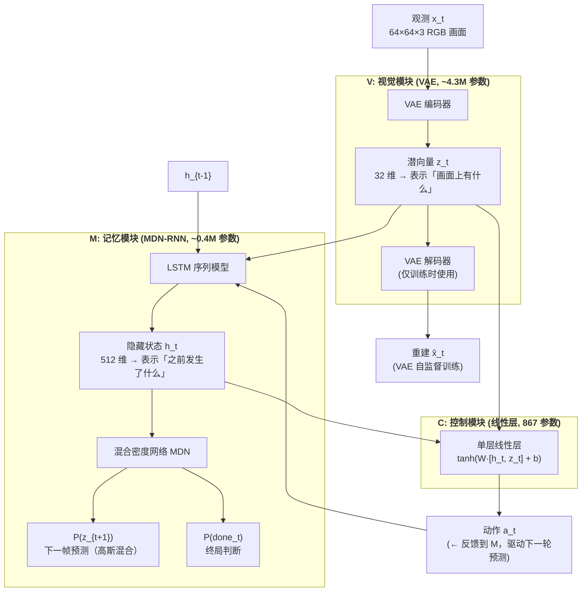
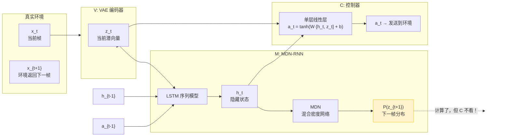
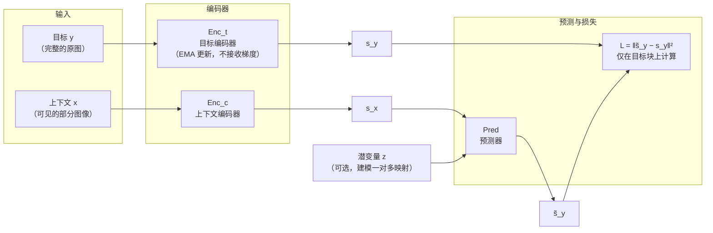
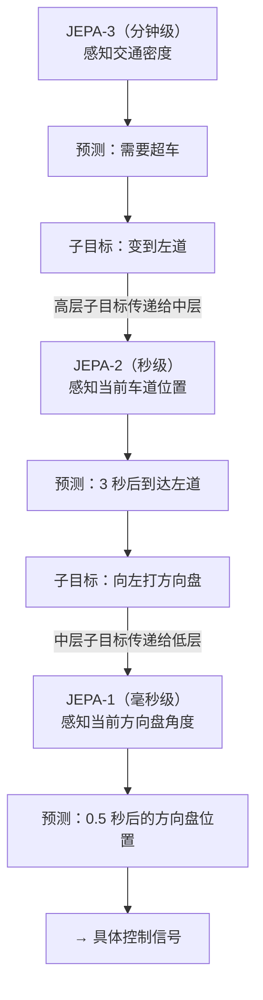
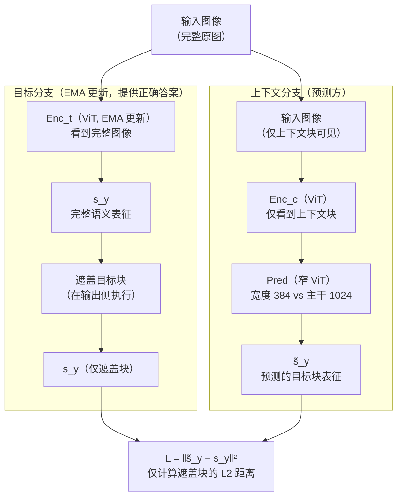

# 世界模型：从像素之梦到表征理解
[← 回到首页](..)

> **World Models: From Pixel Dreams to Representation Understanding**
>
> 覆盖 2018–2026，20 篇核心论文，7 个主线节点
>
> 撰写于 2026 年 6 月

---

## 符号表

### 环境与智能体

| 符号 | 含义 | 首次出现 |
|------|------|---------|
| $\mathbf{x}_t$ | 时刻 $t$ 的观测（图像、LiDAR 点云、占用网格等） | §0.1 |
| $\mathbf{a}_t$ | 时刻 $t$ 的动作 | §0.1 |
| $r_t$ | 时刻 $t$ 的奖励 | §0.1 |
| $\pi(\mathbf{a}_t \mid \mathbf{x}_t)$ | 策略：给定观测下动作的分布 | §0.1 |
| $P(\mathbf{x}_{t+1} \mid \mathbf{x}_t, \mathbf{a}_t)$ | 真实环境过渡动态 | §0.1 |

### 世界模型

| 符号 | 含义 | 首次出现 |
|------|------|---------|
| $\mathbf{z}_t$ | 时刻 $t$ 的潜状态（随机分量） | §1.1 |
| $\mathbf{h}_t$ | 时刻 $t$ 的确定性隐藏状态 | §1.1 |
| $\mathbf{s}_t = \{\mathbf{h}_t, \mathbf{z}_t\}$ | 世界模型的完整状态 | §1.1 |
| $\hat{P}_\phi$ | 学习到的世界模型动态（参数 $\phi$） | §1.1 |
| $\text{Enc}_\phi$ | 编码器：$\mathbf{x} \mapsto \mathbf{z}$ | §1.1 |
| $\text{Dec}_\phi$ | 解码器：$\mathbf{z} \mapsto \hat{\mathbf{x}}$ | §1.1 |
| $\text{Pred}_\theta$ | 预测器（JEPA 上下文）：$\mathbf{s}_x \mapsto \tilde{\mathbf{s}}_y$ | §2.2 |

### 训练与损失

| 符号 | 含义 | 首次出现 |
|------|------|---------|
| $\mathcal{L}_{\text{recon}}$ | 像素/观测重建损失 | §1.1 |
| $\mathcal{L}_{\text{KL}}$ | KL 散度正则项（潜变量模型） | §3.1 |
| $\mathcal{L}_{\text{JEPA}}$ | JEPA 表征预测损失：$\|\tilde{\mathbf{s}}_y - \mathbf{s}_y\|^2$ | §4.1 |
| $\mathcal{L}_{\text{dyn}}$ | 动态预测损失（KL 平衡中的动力学侧） | §3.1 |
| $\mathcal{L}_{\text{rep}}$ | 表征损失（KL 平衡中的编码器侧） | §3.1 |
| $\tau$ | MDN-RNN 采样温度（控制"梦境"难度） | §1.2 |

### JEPA 专属

| 符号 | 含义 | 首次出现 |
|------|------|---------|
| $\text{Enc}_c$ | 上下文编码器（ViT，处理部分可见输入） | §4.1 |
| $\text{Enc}_t$ | 目标编码器（ViT, EMA 更新，处理完整输入） | §4.1 |
| $\mathbf{c}$ | 上下文块（图像中的可见区域） | §4.1 |
| $\mathbf{y}$ | 目标块（图像中被遮盖、需要预测的区域） | §4.1 |

### 评估指标

| 符号 | 含义 | 首次出现 |
|------|------|---------|
| HNS | Human Normalized Score = $\frac{\text{agent} - \text{random}}{\text{human} - \text{random}}$ | §3.1 |

---

## 主线总览

```
"一个 AI 系统如何学会预测自身行为的后果？"

像素之梦 (2018)
│  Ha & Schmidhuber: 在潜空间中做梦，训练策略
│  痛点：VAE 编码了砖墙纹理，却忽略了路沿——什么该编码？
│
├──→ 蓝图 (2022)
│    LeCun JEPA: 不要在像素空间预测。在表征空间预测。
│    编码器主动丢弃不可预测的细节。预测器只关⼼语义结构。
│    痛点：这只是一份白皮书，没有实现。它真的能 work 吗？
│
├──→ 梦的极限 (2023)
│    DreamerV3: 像素预测能走多远？150+ 任务，单一超参。
│    IRIS: 把世界动态重新定义为序列建模——GPT 做世界模型。
│    痛点：纯想象训练让策略被不成熟的世界模型"毒害"。
│
├──→ 舍弃像素 (2023–24)
│    I-JEPA: 表征空间预测的第一次大规模验证。10× 更快。
│    V-JEPA: 从图像到视频——200 万视频训练，冻结主干 SOTA。
│    痛点：表征是抽象的、不可视化的。怎么验证它"理解了"？
│
├──→ 模拟之争 (2024–25)
│    Sora: 缩放能产生物理理解吗？
│    实证回答：不能。模型模仿最接近的训练样本，而非推断物理定律。
│    Cosmos: 物理知情生成——融入显式物理约束。
│    痛点：颜色比速度更重要——模型根本没学到因果。
│
├──→ 走入世界 (2023–25)
│    GAIA-1: 4700 小时伦敦驾驶 → 可操控的未来预测。
│    Genie 2/3: 单张图片 → 可交互的 3D 世界。
│    DayDreamer: 直接在线学习真实机器人——世界模型不需要仿真器。
│    痛点：交互时长 10 秒就崩塌，速度远未达实时。
│
└──→ 合流 (2025–26)
     Improving TWM: Dyna 35 年后回归——纯想象不如真假混合。
     NNT 静态码书：给 TWM 一个平稳的学习目标。
     Cosmos 3: 推理 + 预测 + 世界转换 + 动作，统一架构。
     痛点：层次化规划仍未实现。Configurator 仍是"最神秘的模块"。
```

---

## 0. 第零章：控制论与概率基础

> 本章为后续所有章节提供最低限度的数学语言。如果你熟悉 MDP 和潜变量模型，可以跳到 §1。

### 0.1 马尔可夫决策过程（MDP）

世界模型诞生于强化学习——一个智能体在环境中通过试错学习的数学框架。

**MDP 定义。** 一个 MDP 由 $(\mathcal{X}, \mathcal{A}, P, R, \gamma)$ 组成：
- $\mathcal{X}$：状态空间（对世界模型而言，通常是高维观测如 64×64×3 的 RGB 图像）
- $\mathcal{A}$：动作空间（离散如 {左, 右, 跳}，或连续如方向盘转角）
- $P(\mathbf{x}_{t+1} \mid \mathbf{x}_t, \mathbf{a}_t)$：过渡动态——给定当前状态和动作，下一个状态的概率分布
- $R(\mathbf{x}_t, \mathbf{a}_t)$：奖励函数
- $\gamma \in [0,1)$：折扣因子

**直觉。** MDP 是一个"世界的最小模型"：你站在某个位置 $\mathbf{x}_t$，做了一个动作 $\mathbf{a}_t$，世界以某种概率 $P$ 把你带到新位置 $\mathbf{x}_{t+1}$，并告诉你做得好不好 $r_t$。你的工作是找一个策略 $\pi$ 最大化累计奖励 $\sum_{t} \gamma^t r_t$。

**为什么这对世界模型重要。** 如果你**知道** $P$ 和 $R$——也就是说，你有一个世界的内部模型——你就可以在脑中模拟"如果我做 X，会发生什么"而无需真的去做。这就是 §1–§3 所有方法的核心思想。

### 0.2 模型化 vs 无模型强化学习

**无模型 RL**（Model-Free RL）：直接学习 $\pi(\mathbf{a}_t \mid \mathbf{x}_t)$ 或 $Q(\mathbf{x}_t, \mathbf{a}_t)$，不显式建模 $P$。代表：DQN（2015）、PPO（2017）。**优势**：简单、不需要学习动态模型。**痛点**：样本效率极低——Atari 游戏需要 2 亿帧（约 900 小时人类游玩时间）才能达到人类水平。

**模型化 RL**（Model-Based RL, MBRL）：先学习一个世界模型——环境动态的近似 $\hat{P}_\phi$ 和奖励函数的近似 $\hat{R}_\phi$（注意，这里的 $R$ 就是 §0.1 MDP 定义中的奖励函数 $R(\mathbf{x}_t, \mathbf{a}_t)$，$\hat{R}_\phi$ 是它的学习版本）——然后用这个模型来**规划**或**训练策略**。**优势**：样本效率可提升 100–1000 倍，因为策略可以在"想象"中训练而不消耗真实环境交互。**痛点**：必须学习一个足够准确的世界模型——模型误差会累积并"毒害"策略。

本文的 §1、§3 和 §7 都在处理这个核心权衡：**如何学习一个足够好的世界模型，使得在想象中训练的策略能在真实世界中泛化？**

### 0.3 潜变量动态模型

当 $\mathbf{x}_t$ 是高维图像（如 64×64×3 = 12288 维）时，直接建模 $P(\mathbf{x}_{t+1} \mid \mathbf{x}_t, \mathbf{a}_t)$ 在计算上不可行。标准的解决方案是学习一个**低维潜表征** $\mathbf{z}_t$，在潜空间中建模动态：

$$\mathbf{z}_t = \text{Enc}_\phi(\mathbf{x}_t), \quad \hat{\mathbf{z}}_{t+1} = \hat{P}_\phi(\mathbf{z}_t, \mathbf{a}_t), \quad \hat{\mathbf{x}}_{t+1} = \text{Dec}_\phi(\hat{\mathbf{z}}_{t+1})$$

**两种学习范式：**

> 这里先解释预测式训练目标中出现的两个符号：$\mathbf{c}$（context block，上下文块）是图像中**可见**的区域——模型被允许看到的部分；$\mathbf{y}$（target block，目标块）是图像中被**遮盖**的区域——模型需要预测其表征的部分。完整的 JEPA 机制将在 §4.1 展开。

| 范式 | 训练目标 | 编码器行为 | 代表工作 |
|------|---------|-----------|---------|
| **重建式**（Generative） | $\min \|\mathbf{x}_t - \text{Dec}(\text{Enc}(\mathbf{x}_t))\|^2$ | 保留所有视觉细节以重建输入 | §1, §3 |
| **预测式**（Predictive / JEPA） | $\min \|\text{Enc}_t(\mathbf{y}) - \text{Pred}(\text{Enc}_c(\mathbf{c}))\|^2$ | 主动丢弃不可预测的细节 | §2, §4 |

本文的核心叙事正是从重建式到预测式的演进——以及两者的最终合流。

**直觉。** 重建式像一个完美主义者——每个像素都要对。预测式像一个印象派画家——只画关键结构，其余留白。当你在高速公路上开车时，你不需要知道路边每棵树的精确纹理；你需要知道的是 200 米外那辆卡车正在变道。JEPA 的核心洞察是：**一个好的世界模型应该像你的大脑一样——忽略不重要的，专注关键的。**

### 0.4 物理类比：世界模型 = 势能面 + 动力学

本文会频繁使用一个物理类比。把世界模型想象成一个**势能面**：
- **得分函数**（score function）$\nabla_{\mathbf{x}} \log p(\mathbf{x})$ 指向数据密度增加最快的方向——就像重力指向势能最低点
- **世界模型的动态预测** $\mathbf{x}_t \mapsto \mathbf{x}_{t+1}$ 是在这个面上滚动——势能面决定了什么状态是"可能的"、什么状态是"违反物理的"

Sora 的问题（§5）可以用这个类比说清楚：它学会了势能面的**形状**（从训练数据中），但没有学会**牛顿定律**——所以当你推它到一个没见过的区域（分布外），它的"物理"就崩溃了。

---

## 1. 像素之梦：Ha & Schmidhuber (2018)

### 1.0 问题引入

2018 年，深度强化学习的样本效率低得惊人。训练一个 Atari agent 需要相当于连续玩 38 天的游戏经验。**人类只需要几分钟就能学会一个游戏。差距在哪？**

答案（至少部分答案）是：人类在脑内模拟。当你第一次玩 Pong 时，在看到球飞来之前，你已经在大脑中"想象"了球会去哪里。你不只是对像素做反应——你有一个关于世界如何运作的**内部模型**。

Ha 和 Schmidhuber 的论文 *"World Models"* 是第一个将这个直觉变为可运行的深度学习系统的工作。它的核心问题：**能不能让 AI 在"梦境"中训练，而不是在真实环境中？**

### 1.1 架构：三个不对称的模块

Ha & Schmidhuber 的三组件架构是故意不对称的。先看数据如何流动：



**两个关键潜变量——它们分工明确：**

- $\mathbf{z}_t$（随机分量）：来自 VAE 编码器。代表**当前帧的视觉内容**——"画面上有什么？"它是从高维像素一次性压缩得到的，每个时刻独立编码。由于 VAE 的重建损失驱动，$\mathbf{z}_t$ 倾向于保留丰富的视觉细节——包括那些对控制任务无关的纹理。

- $\mathbf{h}_t$（确定性分量）：来自 MDN-RNN 中的 LSTM 隐藏状态。代表**时间的记忆**——"之前发生了什么？速度是多少？球在往哪个方向飞？"与 $\mathbf{z}_t$ 不同，$\mathbf{h}_t$ 是递推计算的：$\mathbf{h}_t = f(\mathbf{h}_{t-1}, \mathbf{z}_{t-1}, \mathbf{a}_{t-1})$。它不能从单帧中得到——没有 LSTM 记忆，你无法从一张静止画面中判断球的速度和方向。

**为什么两个分量都需要？** Ha & Schmidhuber 的消融实验给出了答案：去掉 M 模块（只给 C 提供 $\mathbf{z}_t$，没有 $\mathbf{h}_t$），CarRacing 得分从 906 跌到 632。仅看当前帧，方向盘不知道该打多少——就像闭着眼睛开车，每秒只睁眼一瞬。

**V（Vision）：** 一个标准 VAE，将 64×64×3 的游戏画面压缩为 $\mathbf{z}_t \in \mathbb{R}^{32}$。在 10,000 条随机策略轨迹上训练——完全是离线的、无监督的。

**M（Memory）：** 全称 **MDN-RNN（Mixture Density Network + RNN）**。两个组成部分：
- **RNN（具体是 LSTM）**：接受 $(\mathbf{z}_t, \mathbf{a}_t, \mathbf{h}_{t-1})$，产生新的隐藏状态 $\mathbf{h}_t$。它负责**记住时序信息**——速度、加速度、运动方向。
- **MDN（混合密度网络）**：将 LSTM 的隐藏状态映射为**一个高斯混合分布的参数**（多个高斯分量的均值、方差和混合权重），而非单个确定性的下一帧预测 $\hat{\mathbf{z}}_{t+1}$。为什么是混合而非单个高斯？因为未来可能有多模态——比如在岔路口，车可能左转也可能右转，单一高斯无法同时表征这两个可能。MDN 用多个分量来覆盖不同的未来路径。

M 还输出 **$P(\text{done}_t)$**——对"这一局是否结束"的预测。这在 VizDoom 等有生存/死亡概念的任务中非常重要：世界模型需要知道什么时候"梦该醒了"，否则可能在想象中永远循环。

**C（Controller）：** 一个单层线性层 $\mathbf{a}_t = \tanh(W_c[\mathbf{z}_t, \mathbf{h}_t] + \mathbf{b}_c)$。867 个参数。不通过梯度下降训练，而用 **CMA-ES（Covariance Matrix Adaptation Evolution Strategy，协方差矩阵自适应进化策略）**——一种黑箱优化算法：它维护一个动作参数的高斯分布，每次从中采样若干个体（每组参数对应一个策略权重），在环境中评估累计奖励，然后根据奖励最高的个体更新分布的均值和协方差。选择 CMA-ES 而非梯度方法的理由：(1) 它只需要累计奖励（一个标量），不需要为 867 维空间中的每个参数分配时间信用；(2) 在如此小的参数空间中，CMA-ES 可以高效并行化——同时跑数十个"候选策略"即可。

> **▸ 小专题：CMA-ES 是如何工作的？**
>
> CMA-ES 是一种**黑箱优化算法**——你不需要知道目标函数的梯度，只需要能评估"这组参数有多好"。它的核心思想是：**维护一个搜索分布，不断向"好参数"的方向移动这个分布**。具体来说，它在一个 $d$ 维参数空间上维护一个多元高斯分布 $\mathcal{N}(\mathbf{m}, \sigma^2 \mathbf{C})$：
> - $\mathbf{m}$（均值）：当前认为最优的参数位置
> - $\mathbf{C}$（协方差矩阵）：参数空间中的"搜索形状"——椭球的朝向和扁长程度
> - $\sigma$（步长）：搜索的"步子多大"
>
> **每一步迭代做三件事：**
> 1. **采样**：从这个高斯分布中采样 $\lambda$ 个候选参数向量（称为一个"种群"）
> 2. **评估**：每个候选参数跑一次环境，获得累计奖励（即 fitness）
> 3. **更新**：选出 fitness 最高的 $\mu$ 个个体，用它们的加权平均来更新 $\mathbf{m}$；用它们相对于 $\mathbf{m}$ 的偏移来更新协方差 $\mathbf{C}$（让分布"拉长"到好的方向）；根据成功步的实际进步 vs 期望进步来调整步长 $\sigma$
>
> **一个极简 Python 示例。** 假设我们要用 CMA-ES 找函数 $f(\mathbf{w}) = -\|\mathbf{w} - \mathbf{w}^*\|^2$ 的最大值（即找到 $\mathbf{w}^*$）：
>
> ```python
> import numpy as np
>
> def cma_es_minimal(fitness_fn, dim, population_size=20, generations=200):
>     """极简 CMA-ES（演示核心逻辑，非生产级实现）"""
>     m = np.zeros(dim)               # 初始均值（猜测最优参数在原点附近）
>     C = np.eye(dim)                 # 初始协方差（球形——各方向等可能）
>     sigma = 0.5                     # 初始步长
>
>     mu = population_size // 2       # 每轮保留前 50% 最佳个体
>     weights = np.log(mu + 0.5) - np.log(np.arange(1, mu + 1))
>     weights /= weights.sum()        # 权重：排名越高，对更新的影响越大
>
>     for gen in range(generations):
>         # Step 1: 从 N(m, sigma^2·C) 采样 λ 个候选参数
>         candidates = m + sigma * np.random.multivariate_normal(
>             np.zeros(dim), C, size=population_size
>         )
>
>         # Step 2: 评估每个候选
>         fitness = np.array([fitness_fn(c) for c in candidates])
>
>         # Step 3: 选出最好的 μ 个，加权更新
>         ranked = candidates[np.argsort(-fitness)][:mu]
>         m_new = np.sum(ranked * weights[:, None], axis=0)       # 加权均值
>
>         # 更新协方差：让 C 向"好方向"拉伸
>         diffs = (ranked - m) / sigma
>         C = (1 - 0.02) * C + 0.02 * np.cov(diffs.T, aweights=weights)
>
>         sigma *= np.exp(0.01 * (np.mean(fitness[:mu]) - fitness.mean()))
>         m = m_new
>
>     return m
>
> # 用法：在 867 维空间中找最优参数
> target = np.ones(867) * 3.0
> result = cma_es_minimal(lambda w: -np.sum((w - target)**2), dim=867)
> print(f"找到的最优参数误差: {np.linalg.norm(result - target):.2f}")
> ```
>
> 在 Ha & Schmidhuber 的场景中，每个候选参数向量就是 **Controller 的权重 $W_c$ 和偏置 $\mathbf{b}_c$**（共 867 个值），fitness 是这个权重在 CarRacing 环境中的累计得分。每轮 CMA-ES 同时测试 64 个"候选 C"，然后向得分最高的那些靠拢——不需要反向传播，不需要价值函数，只需要**"你的得分是多少？"**
**直觉。** 这个设计像一个**骑手（C）驾驭一头大象（V+M）**。骑手只需要发出简单指令；大象负责理解地形、惯性、障碍物。骑手不需要神经科学博士学位来走路——同理，一个 867 参数的线性层可以在一个强大的世界模型上解决 CarRacing。

### 1.2 核心贡献：梦中训练与温度参数

这篇论文最具影响力的实验是 **"完全在 M 的潜空间中训练 C"**——然后零样本部署到真实环境。

**VizDoom 简介。** VizDoom 是一个基于经典 FPS 游戏《Doom》的 AI 研究平台，提供第一人称 3D 视觉输入和离散动作空间（前进、转向、射击等）。论文中的 TakeCover 任务要求 agent 在一个有怪物从四面八方射击的竞技场中尽可能久地存活——这是一个需要快速反应、空间感知和危险评估的生存挑战。

在 TakeCover 任务中的结果令人震惊：
- 在真实 VizDoom 环境中训练的 C 得分：918 ± 546
- **完全在 M 的潜空间（梦中）训练的 C 得分：1092 ± 556**

梦中训练的策略**超过了**在真实环境中训练的策略。为什么？

答案藏在 **温度参数 $\tau$** 中。要理解 $\tau$，先要理解 MDN-RNN 的输出结构：

M 模块在每一步输出的是**一个高斯混合分布**的参数——具体来说，是 $K$ 个高斯分量的均值 $\mu_k$、标准差 $\sigma_k$、和混合权重 $\pi_k$（$\sum_k \pi_k = 1$）。从这个分布中采样下一帧的潜向量时：

$$\mathbf{z}_{t+1} \sim \sum_{k=1}^{K} \pi_k \cdot \mathcal{N}(\mu_k, \sigma_k^2)$$

现在引入温度参数 $\tau$——它在采样前**统一缩放所有分量的标准差**：

$$\mathbf{z}_{t+1} \sim \sum_{k=1}^{K} \pi_k \cdot \mathcal{N}(\mu_k, \tau \cdot \sigma_k)$$

- $\tau = 1.0$：按模型学习到的原始不确定性采样——"标准梦境"
- $\tau < 1.0$：缩小标准差。模型变得更"自信"，预测的分布更集中——这创造了**比真实更简单的世界**（"简单模式"——敌人较少开枪、弹道更可预测）
- $\tau > 1.0$：放大标准差。模型的不确定性被**人为增强**——这创造了**比真实更困难的世界**（"噩梦模式"——模型承认自己不确定的时刻被放大，状态变得更嘈杂）

**关键实验发现：** 在 CarRacing 中，$\tau = 1.0$ 训练的 C 表现良好。但在 VizDoom TakeCover 中，$\tau = 1.15$ 训练的 C 在真实环境中表现最好。$\tau < 1.0$ 时，策略学会"欺骗"世界模型的不准确性——低 $\tau$ 模式下，MDN-RNN 不再输出怪兽可能开火的分布，而退化为"怪兽通常不开火"的确定性预测，C 学会了依赖这种虚假的安全性而在梦中获得高奖励——但部署到真实环境时，怪兽照常开火，策略瞬间崩溃。

$\tau = 1.15$ 有效的原因：**略大于 1.0 的温度让梦中世界比真实世界更嘈杂**——模型不确定的时刻被适度放大，迫使策略学习对不完美观察仍然鲁棒的行为。这是现代"域随机化"（domain randomization）思想的一个早期雏形。

**直觉。** 这就像在狂风中练习投篮——练习环境比比赛日更恶劣。当真正的比赛到来时，微风反而让你感到轻松。一个好世界模型的标志不是它有多"确定"，而是它的**不确定性校准**——它知道自己什么时候不知道，并以一种对策略训练有益的方式使用这种不确定性。

### 1.3 训练与推理：V/M/C 如何协作？

V/M/C 三个模块的**训练和推理是截然不同的**，理解这个分离是理解世界模型的关键。

**训练阶段（四步，顺序执行，各模块独立训练）：**

| 步骤 | 模块 | 数据来源 | 训练目标 | 训练完成后 |
|------|------|---------|---------|-----------|
| Step 1 | V (VAE) | 10,000 条随机策略轨迹的原始帧 | 重建损失 $\|\mathbf{x}_t - \hat{\mathbf{x}}_t\|^2$ + KL 正则 | **冻结**——权重不再改变 |
| Step 2 | M (MDN-RNN) | V 编码的潜向量序列 $\{\mathbf{z}_1, \mathbf{z}_2, ...\}$ + 对应动作 $\{\mathbf{a}_1, \mathbf{a}_2, ...\}$ | 预测下一帧分布 $P(\mathbf{z}_{t+1})$ 的混合密度损失；预测终局 $P(\text{done}_t)$ 的交叉熵 | **冻结**——权重不再改变 |
| Step 3 | C (Controller) | 方式 A: 真实环境（每步编码 $\mathbf{x}_t \to \mathbf{z}_t$，M 更新 $\mathbf{h}_t$，C 输出 $\mathbf{a}_t$）<br/>方式 B: **M 的梦境**（从 M 采样 $\hat{\mathbf{z}}_{t+1}$ 替代真实编码，其余相同） | CMA-ES 最大化累计奖励 | **部署** |

**Step 2 的关键细节——“预测未来”如何训练 M：** 给定一条真实轨迹 $\{\mathbf{x}_1, \mathbf{a}_1, \mathbf{x}_2, \mathbf{a}_2, ..., \mathbf{x}_T\}$，先用冻结的 V 编码为 $\{\mathbf{z}_1, \mathbf{a}_1, \mathbf{z}_2, \mathbf{a}_2, ..., \mathbf{z}_T\}$。M 的训练是一个**有监督的序列预测任务**：在每一步 $t$，M 接收 $(\mathbf{z}_t, \mathbf{a}_t, \mathbf{h}_{t-1})$，LSTM 更新到 $\mathbf{h}_t$，MDN 输出参数化的 $P(\mathbf{z}_{t+1})$。**训练标签就是真实的 $\mathbf{z}_{t+1}$**（由 V 编码下一帧得到）。换句话说，M 的训练完全是一个标准的有监督学习——它不是在强化学习循环中训练的，而是在”观看”已有的轨迹，学习”给定过去，预测未来”。

**推理/部署阶段：**



> 上图中黄色高亮的 $P(\mathbf{z}_{t+1})$ 是推理时 MDN 仍然会产出的预测——但它是**冗余计算**，C 模块既不读取也不使用。

这是整个架构中最容易被误解的地方：**推理时 M 的 MDN 仍然会输出 $P(\mathbf{z}_{t+1})$，但 C（Controller）根本不需要它。** C 的输入只有 $\mathbf{z}_t$ 和 $\mathbf{h}_t$——当前帧的编码和 LSTM 的历史记忆。

那”预测未来”在推理中到底起了什么作用？答案是：**它间接地塑造了 $\mathbf{h}_t$ 的质量，但不是一个推理时被消费的信号。** 这个区分至关重要：

| | 训练 M 时 | 训练 C（梦中）时 | 部署（真实推理）时 |
|---|---|---|---|
| $P(\mathbf{z}_{t+1})$ 的作用 | **训练目标本身**：M 学习预测下一帧来获得好的 $\mathbf{h}_t$ | **环境模拟器**：采样 $\mathbf{z}_{t+1}$ 来替代真实环境的下一帧，使想象 rollout 得以持续 | **不直接使用**：$\mathbf{h}_t$ 已经内化了关于动态的知识，C 不需要显式地看到预测 |
| 谁消费 $\mathbf{z}_{t+1}$？ | 损失函数（对比预测和真实） | C（作为下一轮的输入） | 无人消费 |

**直觉。** M 就像一个运动员在做力量训练（预测未来）——这个训练让 ta 获得了肌肉记忆（好的 $\mathbf{h}_t$）。但到了比赛（部署）时，ta 不需要回顾训练动作——肌肉记忆已经内化了。**M 通过”学习预测未来”来获得对环境动态的深层理解，但一旦理解到位，部署时只需要从 $\mathbf{h}_t$ 中读出这份理解就够了，不需要显式地生成未来。** 这是一个优雅的不对称：训练昂贵（需要预测），推理廉价（只需前向传播）。

**梦中训练 C 时的特殊之处：** 当 C 在 M 的潜空间中训练（而非真实环境）时，$P(\mathbf{z}_{t+1})$ **确实被消费**——采样出的 $\hat{\mathbf{z}}_{t+1}$ 作为下一轮的”伪观测”输入。这是 $P(\mathbf{z}_{t+1})$ 唯一被主动使用的地方。这也解释了为什么温度参数 $\tau$ 只在梦中训练时重要——在真实部署时，根本没有采样未来的步骤。

> **延伸讨论：如果 C 采用滚动优化控制（如 MPC），$P(\mathbf{z}_{t+1})$ 在推理时还需要吗？** 答案是**需要**——但那已经是另一种架构了。Ha & Schmidhuber 的 C 是纯反应式的单层线性层，不做任何 rollout：$\mathbf{a}_t = \tanh(W[\mathbf{z}_t, \mathbf{h}_t] + \mathbf{b})$ 一步到位。但如果 C 换成 MPC 式的规划器（如 LeCun 在 §2 中设想的模式-2：在潜空间中展开多个候选动作序列，用世界模型预测每一步的结果，选代价最小的那个），那么 $P(\mathbf{z}_{t+1})$ **在推理时就必须被反复调用**——每一轮规划都要从当前 $\mathbf{z}_t$ 出发，用 M 展开一条想象轨迹，而展开的每一步都需要采样 $P(\mathbf{z}_{t+k+1})$。这正是 Ha & Schmidhuber 路线与 LeCun 模式-2 的一个关键分界线：**反应式策略不需要推理时预测，但规划式策略（如 DreamerV3 的想象 rollout、LeCun 的梯度 MPC）仍然需要世界模型在推理时”运转”。**

### 1.4 局限：什么该编码？

Ha & Schmidhuber 的架构有一个根本性的缺陷：**VAE 在重建损失上训练，编码了与任务无关的一切**。

原始论文中提供了有力的视觉证据：在 CarRacing 实验中，VAE 忠实地编码了天空的颜色、草地纹理和道路标记的精确宽度；但 policy（C 模块）实际上只需要知道"道路的边缘在哪里"和"前方是否有弯道"——可能 5 个比特的信息就足够了。在 VizDoom 中，VAE 花费了大量表征容量来重建砖墙的纹理图案，而这些纹理与"躲避火球"之间存在零相关性。

更糟糕的是，表征容量是有限的——当 VAE 把容量分配给砖墙纹理时，它可能**无法分配足够的容量给真正重要但视觉微小的特征**。CarRacing 中的路沿只有约 5 像素宽，在 64×64 的低分辨率输入中极易被忽视——VAE 的重建损失对"路沿的精确位置"不敏感（因为路沿只占极少像素），但驾驶策略对它极度敏感（路沿偏了 2 像素，方向盘需要打一个完全不同的角度）。

Ha & Schmidhuber 在论文中承认了这一局限。他们展示了 C 在仅用 V（Vision，没有 M 的 LSTM 记忆）时，CarRacing 的车会在弯道处剧烈抖动——因为从单帧的 $\mathbf{z}_t$ 中无法可靠推断速度和方向。这些结果（原始论文的 Figure 5 和 6）清楚地说明了：**不是所有编码在 $\mathbf{z}_t$ 中的信息都对控制有用，而控制真正需要的信息也不一定在 $\mathbf{z}_t$ 中。**

这一发现直接催生了 LeCun 的 JEPA 提案（§2）：**不要在像素空间中预测，不要强迫模型编码不可预测的细节——让模型自己学会"什么值得编码"。**

> **主线节点 1。** Ha & Schmidhuber 证明了世界模型的可行性——策略可以完全在想象中训练并成功迁移到真实环境。但他们留下了一个根本问题：**什么信息需要编码到世界状态中，什么可以丢弃？** 这个问题将由 JEPA 路线（§2, §4）回答。

---

## 2. 蓝图：LeCun 的 JEPA 愿景 (2022)

> **JEPA** = **J**oint **E**mbedding **P**redictive **A**rchitecture（联合嵌入预测架构）。

### 2.0 问题引入

Ha & Schmidhuber 的世界模型通过重建像素来学习表征。但这是正确的目标吗？

想象你站在一个十字路口。你的大脑在预测什么？你不是在预测**每一个光子**将落在你视网膜的哪个位置。你在预测的是：那辆车会继续直行还是转弯？那个行人会在红灯前停下吗？这些都是**抽象的、语义的预测**。

LeCun 在 2022 年的立场论文中的核心论点是：**生成式世界模型（通过重建像素学习）在根本上走错了方向。** 世界充满了不可预测的细节——池塘上的涟漪、风中树叶的精确位置、行人衣服的具体皱褶。强迫模型预测所有细节，是让它用宝贵的表征容量去做一件对决策无用的事。

### 2.1 架构：六个可微模块

LeCun 提出了一个多模块认知架构，所有模块都可微：

| 模块 | 功能 | 类比 |
|------|------|------|
| **Configurator** | 执行控制；根据任务调制所有其他模块 | 前额叶皮层 |
| **Perception** | 从感知信号估计当前世界状态 | 感觉皮层 |
| **World Model** | 估计缺失信息 + 预测未来状态（给定假想动作序列） | 前额叶 + 海马体 |
| **Cost** | (a) 内在代价（硬连接，不可变）：疼痛、饥饿、好奇；(b) 可训练 Critic：预测未来内在代价 | 杏仁核 + 多巴胺 |
| **Short-Term Memory** | 键值记忆存储过去/现在/预测的世界状态和代价 | 海马体 |
| **Actor** | 产生动作序列 | 运动皮层 |

**两种运行模式：**

- **模式-1（系统 1 / 快速反应）：** $\mathbf{a}_0 = \text{Actor}(\mathbf{s}_0)$。单一前向传播。没有规划。类比：躲避飞来的球。
- **模式-2（系统 2 / 深度推理）：** Actor 提出动作序列 → 世界模型展开预测未来状态 → Cost 评估 → **梯度反向传播到动作**，找最小代价序列。类比：下围棋时的深度思考。

这个框架的关键洞见：**模式-2 可以通过梯度下降来训练模式-1**（摊销推理）。深思熟虑的技能被"编译"成快速反应——就像你学开车时每个动作都需要有意识地想，后来变成肌肉记忆。

### 2.2 核心贡献：JEPA — 在表征空间中预测

JEPA 是 LeCun 提案中最重要的技术概念。要理解它，需要从三个层面逐层拆解：**符号定义 → 模型结构 → 训练与推理流程**。

**第一层：符号定义。** JEPA 处理的是"从已知推断未知"的通用问题。给定两个有关联的观测——一个可观测的 $x$ 和一个需要被预测的 $y$：

- $x$：**上下文**（已知的、可见的信息）。例如，一张图像中被遮盖掉某几个区域后的剩余部分；一段视频中你能看到的前 3 秒。
- $y$：**目标**（未知的、需要预测的信息）。例如，同一张图像中被遮盖掉的那几个区域；同一段视频中你看不到的后续 1 秒。
- $z$：**潜变量**（可选）。当 $x$ 不能唯一确定 $y$ 时——比如从一句话"外面下雨了"无法唯一推断接下来的声音是雷声还是车经过水洼声——$z$ 承载了所有可能的"补充解释"。$z$ 的存在使得 JEPA 可以建模 $x \to y$ 的**一对多映射**。

**第二层：模型结构。** JEPA 由三个神经网络组成：



1. **上下文编码器 $\text{Enc}_c$**：只看到 $x$（部分信息）。输出 $\mathbf{s}_x$——对上下文的语义表征。例如在图像场景中，它处理的是被遮盖后的不完整图像，输出对可见内容的编码。

2. **目标编码器 $\text{Enc}_t$**：看到完整的 $y$。输出 $\mathbf{s}_y$——对目标的完整语义表征。**关键**：$\text{Enc}_t$ 的参数不是通过梯度下降更新的，而是 $\text{Enc}_c$ 参数的指数移动平均（EMA）。具体而言，设 $\boldsymbol{\theta}_c$ 为上下文编码器的参数，$\boldsymbol{\theta}_t$ 为目标编码器的参数，则每一步训练后：

$$\boldsymbol{\theta}_t \leftarrow \lambda \boldsymbol{\theta}_t + (1-\lambda) \boldsymbol{\theta}_c$$

其中动量 $\lambda$ 从 0.996 渐变到 1.0（即训练初期 $\boldsymbol{\theta}_t$ 紧跟 $\boldsymbol{\theta}_c$，训练后期基本冻结）。注意 $\boldsymbol{\theta}_c$ 通过梯度下降优化，$\boldsymbol{\theta}_t$ **不接收任何梯度**（stop-gradient）。这种不对称设计防止了两个编码器合谋输出相同的平凡表征（如全零向量）——因为 $\text{Enc}_t$ 不会为了降低预测损失而主动迎合 $\text{Pred}$，它只是 $\text{Enc}_c$ 的慢速"影子"。

3. **预测器 $\text{Pred}$**：接收 $(\mathbf{s}_x, z)$，输出 $\tilde{\mathbf{s}}_y$——对 $\mathbf{s}_y$ 的预测。$z$ 的使用方式：预测器可以从中采样多个不同的 $z$ 值，产生多个不同的 $\tilde{\mathbf{s}}_y$，每个代表一种可能的"未来解释"。

**第三层：训练与推理。**

*训练流程：*
1. 从数据中采样一对 $(x, y)$——它们是同一张图像/同一段视频的不同视角
2. 将 $x$ 送入 $\text{Enc}_c$，得到 $\mathbf{s}_x$
3. 将 $y$ 送入 $\text{Enc}_t$，得到 $\mathbf{s}_y$（不计算梯度——目标编码器作为"正确答案提供者"，通过 stop-gradient 隔离）
4. 可选地从先验 $p(z)$ 中采样 $z$
5. 将 $(\mathbf{s}_x, z)$ 送入 $\text{Pred}$，得到 $\tilde{\mathbf{s}}_y$
6. 计算损失 $\mathcal{L}_{\text{JEPA}} = \|\tilde{\mathbf{s}}_y - \mathbf{s}_y\|^2$
7. 反向传播更新 $\text{Enc}_c$ 和 $\text{Pred}$ 的权重
8. 用 EMA 更新 $\text{Enc}_t$：$\theta_t \leftarrow \lambda \theta_t + (1-\lambda) \theta_c$，$\lambda$ 从 0.996 渐变到 1.0

*推理流程（评估下游任务时）：*
1. 冻结所有网络参数
2. 将完整图像送入 $\text{Enc}_c$（或 $\text{Enc}_t$——两者此时已高度相似），提取表征 $\mathbf{s}_x$
3. 将 $\mathbf{s}_x$ 作为该图像的特征，用于分类、检测、分割等下游任务
4. 预测器 $\text{Pred}$ 在推理中**完全不被使用**——它仅在训练中作为"教师"存在，迫使编码器学到可预测的语义表征。

> **为什么预测器可以被丢弃？** 这触及了 JEPA 最核心的设计哲学。预测器 $\text{Pred}$ 的任务是「从上下文表征预测目标表征」——但这个任务本身不是目的。$\text{Pred}$ 存在的唯一意义是**为编码器提供一个学习信号**：$\text{Enc}_c$ 必须产生足够好的 $\mathbf{s}_x$，使得 $\text{Pred}$ 能从中推断出 $\mathbf{s}_y$。一旦训练完成，$\text{Enc}_c$ 已经内化了"什么使一个表征可预测"的知识——它学会了只编码与物理/语义结构相关的信息，丢弃不可预测的纹理细节。此时 $\text{Pred}$ 就像一个教完学生的老师：学生已经学会了，老师可以离开了。**预测是训练的梯子，不是推理的工具。** 这与 §1.3 中 M 的 MDN 在部署时被闲置的逻辑完全平行。

这个训练-推理的不对称性与 §1.3 中的 MDN-RNN 如出一辙：训练时预测未来（或预测遮盖区域），推理时只消费编码器产生的表征。预测器是**手段**——用来逼迫编码器学好表征；表征才是**目的**。

**与生成式方法的根本区别：**

| | 生成式（VAE, MAE, Dreamer） | JEPA |
|---|---|---|
| 预测输出 | 像素 / token | 抽象表征向量 |
| 编码器行为 | 保留所有细节（包括不可预测的） | 主动丢弃不可预测的细节 |
| 不可预测信息去哪了 | 被"幻觉"填充（VAE）或推入潜变量 | 被编码器自然地消除 |
| 计算开销 | 高（解码器必须渲染细节） | 低（只需匹配表征向量） |

**直觉。** 生成式模型像一个需要逐字背诵整本小说的学生——连页脚的标点都不能错。JEPA 像一个只需要写摘要的学生——抓住核心情节，忽略具体的措辞。当考试题目是"这本小说的主题是什么"（对应下游任务）时，后者更高效。而预测器 $\text{Pred}$ 的角色就是那个"出小测题目的老师"——ta 的存在不是为了被记住，而是为了让学生（编码器）学得更好。

### 2.3 如何防止崩塌：VICReg

**表征崩塌不是 JEPA 独有的问题。** 几乎所有不使用负样本的自监督学习方法都面临这个挑战。根源在于：编码器 $\text{Enc}_c$ 和预测器 $\text{Pred}$ 是**联合训练**的——如果预测器发现"不管输入是什么，输出恒定的 $\tilde{\mathbf{s}}_y$，编码器就输出恒定的 $\mathbf{s}_y$，损失永远为零"，那么整个系统就崩塌了。梯度下降会贪婪地找这个平凡解，因为它是最容易达到的零损失点。

这个问题在不同范式中以不同形态出现：

| 范式 | 崩塌表现 | 典型解决方法 |
|------|---------|------------|
| AE/VAE (§1) | 潜变量变为无信息的常数，重建靠解码器"记忆"训练集 | KL 正则（VAE）——强制潜变量保持一定随机性 |
| DreamerV3 (§3) | 后验分布崩塌为先验——编码器无法从观测中提取有用信息 | KL 平衡 + 自由比特：$\beta_{\text{dyn}}=0.5, \beta_{\text{rep}}=0.1$，KL 低于 1 nat 停止惩罚 |
| JEPA (§2, §4) | $\mathbf{s}_x = \mathbf{s}_y = \tilde{\mathbf{s}}_y = \mathbf{0}$ | 需要额外的正则化项来防止维度死亡和维度重复 |
| BYOL / SimSiam | 同上 | 预测器 + stop-gradient + EMA 目标编码器 |

JEPA 的独特之处在于：它**没有负样本**，而且**不能简单地用 stop-gradient + EMA 解决所有问题**——EMA 防止了两个编码器直接合谋，但 $\text{Enc}_c$ 本身仍可能把不同输入映射到相同的平凡表征。因此需要从信息论角度直接约束表征的**质量**。

**VICReg 的数学原理。** LeCun 选择了 VICReg（Bardes et al., 2022）作为 JEPA 的正则化方案。VICReg 的核心思想是：不比较样本之间，而是比较**表征空间的维度之间**。每个 batch 有 $n$ 个样本，每个样本产生一个 $d$ 维表征向量 $\mathbf{s}^{(i)} \in \mathbb{R}^d$。将整个 batch 写成矩阵 $S \in \mathbb{R}^{n \times d}$（每行一个样本，每列一个维度）。VICReg 对这个矩阵施加三个约束：

**1. 方差正则化（Variance）** — 防止单个维度"死亡"：
$$\mathcal{L}_{\text{var}}(S) = \frac{1}{d} \sum_{j=1}^{d} \max\left(0, \gamma - \sqrt{\text{Var}(\mathbf{s}_{:,j}) + \epsilon}\right)$$

其中 $\gamma=1$ 是目标标准差阈值。如果第 $j$ 个维度在 batch 内的标准差低于 $\gamma$，就会受到惩罚。直观：每个维度必须"活着"——至少对 batch 内的不同样本有不同的输出值。如果某个维度对所有样本都输出相同的值（方差 ≈ 0），说明它死了。

**2. 协方差正则化（Covariance）** — 防止不同维度学同一个特征：
$$\mathcal{L}_{\text{cov}}(S) = \frac{1}{d} \sum_{i \neq j} [\text{Cov}(S)]_{i,j}^2$$

其中 $\text{Cov}(S)$ 是 $S$ 的 $d \times d$ 协方差矩阵（每列先减均值）。这个损失惩罚维度之间的相关性——如果维度 3 和维度 7 对所有样本都输出高度相关的值，说明它们学到了同一个特征，这是一种浪费。**取消相关迫使不同维度捕捉输入的不同方面。**

**3. 不变性损失（Invariance）** — 这就是 JEPA 的基础损失：
$$\mathcal{L}_{\text{inv}}(S^c, S^t) = \frac{1}{n} \sum_{i=1}^{n} \|\tilde{\mathbf{s}}_y^{(i)} - \mathbf{s}_y^{(i)}\|^2$$

总损失：$\mathcal{L} = \lambda \mathcal{L}_{\text{inv}} + \mu \mathcal{L}_{\text{var}} + \nu \mathcal{L}_{\text{cov}}$，其中 $\lambda=\mu=\nu=1$ 通常就足够。

**为什么 LeCun 选择 VICReg 而非对比学习（如 SimCLR, MoCo）？** 对比方法需要**负样本**——对每个正样本对 $(x, y)$，需要大量不相关的样本对作为"反例"。在高维表征空间（如 1024 维 ViT 输出）中，正确区分正负样本所需的负样本数量随维度指数增长——这被称为"维度灾难"。VICReg 的维度-对比策略绕过了这个问题：它不比较样本，只比较维度——而维度的数量就是 $d$ 本身，与 batch 大小无关。这使得 VICReg 在计算上是**可扩展的**，特别适合 JEPA 的高维表征场景。

### 2.4 层次化 JEPA（H-JEPA）

JEPA 可以垂直堆叠为**层次化 JEPA（H-JEPA）**，在不同的时间尺度上建模世界。用一个具体的驾驶例子来理解：

**以"高速公路上变道超车"为例。** 这个任务天然涉及三个时间尺度：

| 层级 | 时间尺度 | 输入（上下文 $x$） | 目标（预测 $y$） | 编码器丢弃的细节 |
|------|---------|-------------------|-----------------|----------------|
| **JEPA-1**（低层） | 毫秒–秒 | 前 0.5 秒的方向盘转角序列、路面纹理 | 接下来 0.5 秒的方向盘转角 | 方向盘的具体微调轨迹、路面裂缝的精确位置 |
| **JEPA-2**（中层） | 秒–十秒 | 前 3 秒的车道位置、周围车辆速度 | 接下来 3 秒的车道位置 | JEPA-1 的方向盘抖动细节——只保留"在向左变道"这个抽象趋势 |
| **JEPA-3**（高层） | 分钟级 | 导航目标、交通密度 | 接下来路段的路线选择（继续超还是回到右道） | 中层"在哪个车道"的瞬时位置——只保留"这趟行程的策略" |

**训练流程（自底向上预训练，自顶向下微调）：**

1. **Phase 1 — 自底向上逐层预训练：**
   - 先训练 **JEPA-1**：用大量驾驶视频，以 0.5 秒间隔采样 $(x, y)$ 对，训练低层编码器 $\text{Enc}_c^{(1)}$ 和预测器 $\text{Pred}^{(1)}$。加上 VICReg 正则化。
   - 冻结 JEPA-1，训练 **JEPA-2**：此时 JEPA-2 的输入不是原始像素，而是 **JEPA-1 编码器的输出均值** $ \bar{\mathbf{s}}^{(1)} = \frac{1}{T} \sum_t \mathbf{s}_t^{(1)} $（3 秒窗口内的平均表征）。JEPA-2 在这个更抽象的层次上预测 3 秒后的平均表征。
   - 冻结 JEPA-1 和 JEPA-2，训练 **JEPA-3**：同理，JEPA-3 的输入是 JEPA-2 的更长窗口平均。

2. **Phase 2 — 自顶向下联合微调（可选）：** 展开所有层，高层输出作为低层预测器的**条件**。JEPA-2 输出的"正在变道"抽象表征被拼接到 JEPA-1 的预测器输入中，使 JEPA-1 的预测与高层的意图保持一致。

**推理/规划流程（自顶向下 + 自底向上结合）：**



**关键洞见：** 每一层 JEPA 的编码器都会主动丢弃**该时间尺度上不可预测的细节**。JEPA-1 知道下一秒的方向盘位置取决于此刻的角度和力度，但 JEPA-3 不关心这个——它知道 30 秒后你在哪条车道是"变道还是保持"这个高层决策决定的，与方向盘的具体微调无关。**层次化使得抽象层次与时间尺度自然对齐。** 这是 H-JEPA 最核心的设计哲学，但至今没有任何完整的实现。

> **主线节点 2。** LeCun 为世界模型研究设定了方向：**预测应该在表征空间进行，而非像素空间。** 编码器应该被训练为主动丢弃不可预测的细节。但这是一份纯粹的白皮书——它提出了一个假设，却没有实现它。接下来的两章（§3, §4）将分别展示这条路的两个方向：像素-世界模型能被推多远，以及表征-空间预测是否真的有效。

---

## 3. 梦的极限：DreamerV3 与 IRIS (2023)

> **IRIS** = **I**magination with auto-**R**egression over an **I**nner **S**peech（基于内心语言的想象式自回归模型）。

### 3.0 问题引入

LeCun 的 JEPA 白皮书说"不要在像素空间中预测"。但在 JEPA 尚未大规模实现的同时，另一条路在问一个不同的问题：**如果我们坚持像素预测，能走多远？**

2023 年，两个系统——DreamerV3 和 IRIS——分别将模型化 RL 推向了前所未有的高度。它们的答案出人意料：**在当前技术下，像素预测的世界模型可以比你想象的走得更远。** DreamerV3 在 150+ 个任务上用一套超参数达到了强大性能，甚至成为了首个从零开始在 Minecraft 中收集钻石的算法。但它也暴露了纯想象训练的致命弱点。

### 3.1 DreamerV3：一个世界模型统治 150+ 个任务

**架构：Recurrent State-Space Model (RSSM)。**

DreamerV3 的世界模型由五个组件组成，端到端训练：

| 组件 | 公式 | 作用 |
|------|------|------|
| **编码器** | $\mathbf{z}_t \sim q_\phi(\mathbf{z}_t \mid \mathbf{h}_t, \mathbf{x}_t)$ | 从当前观测 $\mathbf{x}_t$ 和隐藏状态 $\mathbf{h}_t$ 中提取**随机潜变量** $\mathbf{z}_t$（32 个 32 类的分类分布），捕捉视觉细节 |
| **序列模型** | $\mathbf{h}_t = f_\phi(\mathbf{h}_{t-1}, \mathbf{z}_{t-1}, \mathbf{a}_{t-1})$ | **GRU** 确定性路径：将上一时刻的隐藏状态、随机潜变量和动作整合为新的隐藏状态 $\mathbf{h}_t$，承载时序记忆 |
| **动态预测器** | $\hat{\mathbf{z}}_t \sim p_\phi(\hat{\mathbf{z}}_t \mid \mathbf{h}_t)$ | **"闭眼预测"**——仅从 $\mathbf{h}_t$ 预测下一时刻的潜变量 $\hat{\mathbf{z}}_t$，不依赖真实观测。训练时与编码器的 $\mathbf{z}_t$ 对比（KL 损失），想象时替代真实编码器 |
| **解码器** | $\hat{\mathbf{x}}_t = p_\phi(\hat{\mathbf{x}}_t \mid \mathbf{h}_t, \mathbf{z}_t)$ | 从 $(\mathbf{h}_t, \mathbf{z}_t)$ 重建原始观测，用作**训练信号**（迫使潜变量保留视觉信息） |
| **奖励/继续预测器** | $\hat{r}_t, \hat{c}_t = p_\phi(\cdot \mid \mathbf{h}_t, \mathbf{z}_t)$ | 预测即时奖励和 episode 是否终止。均在 symlog 空间中预测（见下文创新 1） |

其中 $\phi$ 统指世界模型的所有参数。

**Actor-Critic 背景简介。** 在现代强化学习中，Actor 和 Critic 是两个协同训练的神经网络，共同解决"如何将奖励信号转化为更好的动作"这个问题：

- **Actor（策略网络）**：输入状态 $\mathbf{s}_t$，输出动作 $\mathbf{a}_t$。**它的职责是决定"做什么"**——在当前位置，方向盘该打多少度。
- **Critic（价值网络）**：输入状态 $\mathbf{s}_t$，输出对该状态的"价值"估计 $v(\mathbf{s}_t)$——即从这个状态出发，按照当前策略期望能获得的累计奖励。**它的职责是判断"这个位置有多好"**。
- **协同机制**：Actor 做出动作，Critic 评估这个动作的结果有多好。Actor 用 Critic 的输出作为基准线（baseline）来降低梯度方差——如果某个动作的回报比 Critic 预测的更好，就提高该动作的概率；如果更差，就降低。这被称为 **REINFORCE with baseline** 或 **Advantage Actor-Critic (A2C)**。

**DreamerV3 的 Actor 和 Critic 完全在想象中训练——不接触任何真实环境数据。** 这意味着它们的所有训练信号都来自世界模型内部的"梦境 rollout"，而非真实环境的反馈。

**Actor（策略网络）：** 结构是一个标准 MLP，输入为世界模型的完整状态 $\mathbf{s}_t = \{\mathbf{h}_t, \mathbf{z}_t\}$，输出为动作分布的参数（连续动作用高斯分布的均值和标准差，离散动作用 softmax 类别概率）。训练时，从任意已访问过的真实状态出发，用 RSSM 的**动态预测器**（不用编码器——因为在想象中没有真实观测可以编码）在潜空间中展开 $H=16$ 步的"想象轨迹"：每一步根据当前策略采样动作 $\mathbf{a}_t \sim \pi_\theta(\cdot \mid \mathbf{s}_t)$，用动态预测器生成下一个状态 $\mathbf{s}_{t+1}$（其中 $\mathbf{h}_{t+1}$ 由序列模型更新，$\hat{\mathbf{z}}_{t+1}$ 由动态预测器采样），奖励预测器给出 $\hat{r}_t$。对这 16 步想象轨迹上的每个状态，用 **REINFORCE 梯度** 更新 Actor：

$$\nabla_\theta \mathcal{L}_{\text{actor}} = -\mathbb{E}_{\text{imagine}} \left[ \log \pi_\theta(\mathbf{a}_t \mid \mathbf{s}_t) \cdot (G_t^\lambda - v_\psi(\mathbf{s}_t)) \right]$$

其中 $G_t^\lambda$ 是 $\lambda$-return——奖励的指数加权和（$\lambda=0.95$），$v_\psi(\mathbf{s}_t)$ 是 Critic 给出的价值基线。$(G_t^\lambda - v_\psi)$ 被称为**优势函数（advantage）**——正值表示"比预期好"，Actor 会增强该动作的概率。

**Critic（价值网络）：** 结构同样是 MLP，输入 $\mathbf{s}_t$，输出不是单个标量，而是**一个过 255 个等距桶的 softmax 分布**（桶覆盖 symlog 范围 $[-20, +20]$）。目标值 $G_t^\lambda$ 被编码为"two-hot"——即如果目标值落在桶 $k$ 和 $k+1$ 之间，则两个桶按比例各分配一部分概率质量，其余桶为 0。Critic 通过最小化与这个 two-hot 目标的交叉熵来训练：

$$\mathcal{L}_{\text{critic}} = -\sum_{k=1}^{255} \text{twohot}(G_t^\lambda)_k \cdot \log v_\psi(\mathbf{s}_t)_k$$

这种离散化回归（而非标准 MSE）的好处在于：对异常值不敏感，并且天然处理不同数量级的价值——与 symlog 配合得天衣无缝。

**四项关键创新：**

1. **Symlog / Symexp 变换：**
   $$\text{symlog}(x) = \text{sign}(x) \cdot \ln(|x| + 1)$$
   在 symlog 空间中做所有回归——解码器重建、奖励预测、Critic 目标、编码器输入归一化。这一招让同一个损失函数在奖励范围跨越 6 个数量级（Atari 的 ±1 到 DMLab 的 1000+）的任务上都能工作。

2. **KL 平衡 + 自由比特：**
   - $\beta_{\text{dyn}} = 0.5$ vs $\beta_{\text{rep}} = 0.1$：推动更多信息通过确定性路径（$h_t$），减少对随机潜变量 $z_t$ 的依赖
   - KL 低于 1 nat 时停止惩罚：防止模型崩塌到无信息的先验

3. **32 个分类分布**（来自 DreamerV2）：每个潜变量是 32 类的分类分布而非高斯分布。分类潜变量自然处理多模态未来——"在这个路口，我可以左转、右转、或直行"——不需要做多模态高斯近似的数学杂技。

4. **固定超参数跨所有任务：** 这是 DreamerV3 最关键的声明——模型大小、学习率、KL 尺度、想象视野、所有超参数在 150+ 个任务上完全一致。

**关键结果。** DreamerV3 在 Atari 100K（26 款游戏，2 小时实时）、Atari 200M（55 款游戏）、DMLab（30 个 3D 任务，100 倍数据效率超越 IMPALA）、和 ProcGen（16 个程序生成游戏）上均达到或超越 SOTA。

**Minecraft 钻石挑战：** 这是 DreamerV3 的标志性成就。Minecraft 钻石挑战要求 agent 自主发现完整科技树：原木 → 木板 → 工作台 → 木镐 → 石头 → 石镐 → 铁矿 → 熔炉 → 铁锭 → 铁镐 → **钻石**。此前所有方法都需要人类演示或手工设计的课程——而 DreamerV3 仅靠探索和世界模型的想象，自主发现了全部步骤。最优种子在 1 亿步后收集了 6 颗钻石。

### 3.2 IRIS：把世界动态建模为序列预测

Vincent Micheli 等人的 IRIS 对一个不同的问题给出了优雅的答案：**如果世界的动态本质上是序列预测，为什么不用 GPT 做世界模型？**

架构：
1. **VQ-VAE** 将 64×64 帧压缩为 $K=16$ 个离散 token（词汇表 $N=512$）
2. **自回归 Transformer**（10 层，GPT 风格）建模 token 序列+动作交错的时间动态——不仅逐时间步预测，而且**在每一时间步内逐 token 预测**，捕捉细粒度空间依赖
3. **策略**（CNN-LSTM Actor-Critic）纯粹在 Transformer 想象的 rollout 上训练

**关键结果：** 在 Atari 100K 上，IRIS 达到 **1.046 均分**（人类归一化）——首个在无前瞻搜索方法中超过人类平均水平的方法（10/26 款游戏超越人类）。仅用了约 2 小时实时游戏时间。

**但暴露了"双重探索问题"：** Agent 必须先在真实环境中发现新游戏机制让世界模型学习，然后策略在想象中重新发现它们。在有罕见关卡转换的游戏（如 Frostbite）上，世界模型从未见过后续关卡 → 策略在想象中无法学习这些关卡的策略 → 性能崩溃。这引出 §7 的核心命题：**纯想象训练是不够的。**

### 3.3 痛点总结

截至 2023 年底，像素/Token 预测路线的世界模型已经展示了惊人的能力——但它们的方法论基础正在接近一个天花板。

| 问题 | DreamerV3 中的表现 | IRIS 中的表现 |
|------|-------------------|--------------|
| 编码无关细节 | VAE 解码器重建所有视觉信息 | VQ-VAE 压缩了但丢弃了什么不由任务决定 |
| 策略被不成熟世界模型"毒害" | KL 平衡缓解但未解决 | 纯想象训练的分布偏移 |
| 双重探索 | Minecraft 中通过长训练补偿（1 亿步） | Atari Frostbite 中崩溃 |
| 计算开销 | RSSM 串行展开慢 | 3.5 天/A100/环境 |

> **主线节点 3。** 像素/Token 世界模型在 2023 年被推到了极致。DreamerV3 证明它们可以跨 150+ 个任务泛化。IRIS 证明 Transformers 是有效且样本高效的世界模型。但根本的痛点仍未解决：**世界模型被迫编码与任务无关的视觉细节，策略被不准确的世界模型误导。** 这两个痛点分别被 §4（JEPA 的表征空间预测）和 §7（Dyna 的混合训练）分别解决。

---

## 4. 舍弃像素：I-JEPA 与 V-JEPA (2023–2024)

### 4.0 问题引入

§3 告诉我们像素预测的世界模型可以走很远——但它们始终背负着一个固有的负担：解码器必须重建与任务无关的视觉细节。在 DreamerV3 中，这意味着昂贵的解码器计算；在 IRIS 中，这意味着有限的 token 数量（仅 16 个/帧）限制了视觉复杂任务的性能上限。

LeCun 在 §2 中提出了 JEPA 作为替代方案。但直到 2023 年，这只是一个纸面上的假设。**一个在表征空间中预测的模型，真的能在实际任务上打败在像素空间中预测的模型吗？** I-JEPA 给出了第一个实证答案。

### 4.1 I-JEPA：表征空间预测的实证胜利

**架构：**

与 Ha & Schmidhuber 的 VAE+MDN-RNN 或 DreamerV3 的 RSSM 不同，I-JEPA 没有任何解码器。**它从不重建像素。**



**关键设计决策：**

1. **遮盖在输出侧，而非输入侧。** 目标编码器**始终看到完整图像**并产生高层语义表征。遮盖只应用于损失计算——仅被遮盖的区域需要被预测。这与 MAE（遮盖在输入侧）有根本区别：MAE 的目标编码器只看到被遮盖的输入，学到的表征质量更低。

2. **目标编码器用 EMA 更新。** $\theta_t \leftarrow \lambda \theta_t + (1-\lambda)\theta_c$，动量 $\lambda$ 从 0.996 渐变到 1.0。这是从 BYOL 借鉴的关键技术——没有动量更新的目标编码器，JEPA 会在几轮训练内崩塌。直觉：目标编码器的缓慢更新为预测器提供了一个**移动的但稳定的靶子**——就像一个教练慢慢提高标准，而不是每次训练都随机改变规则。

3. **预测器必须是窄的。** ViT-H/14 的主干宽度是 1024，但预测器宽度仅为 384。为什么？因为如果预测器太强，它可以学会**直接从位置编码推断目标表征**（而非从语义上下文中理解）——等同于作弊。瓶颈宽度强迫预测器真正使用从上下文中学到的信息。

**关键结果：**

| 指标 | I-JEPA ViT-H/14 | 对比 |
|------|----------------|------|
| ImageNet-1K 线性评估（300ep） | 79.3% | iBOT: 81.0%（但 iBOT 严重依赖数据增强） |
| ImageNet-1K @448px | 81.1% | 同等水平 |
| **训练时间** | **<72h on 16 A100** | **MAE ViT-H/14: 需要 10× 计算** |
| Clevr/Count（物体计数） | 86.7% | DINO: 86.6, iBOT: 85.7 |
| Clevr/Dist（深度预测） | **72.4%** | iBOT: **62.8%**（+9.6 个百分点！） |

**直觉。** I-JEPA 的计算效率（10× 快于 MAE）来自一个简单的数学事实：匹配表征向量只需要计算 L2 距离；重建像素需要解码器做完整的前向传播。前者的梯度信号也更干净——直接作用于语义表征，而不是通过像素空间间接传播。

I-JEPA 在**深度预测**上的卓越表现也符合直觉：深度是一个**结构化的、语义的**属性——它由场景的 3D 布局决定，而非具体纹理。JEPA 丢弃纹理细节、保留结构信息的设计天然适合这种任务。

### 4.2 V-JEPA：从图像到动态视频

2024 年初（与 Sora 同一天发布），Meta 的 V-JEPA 将特征预测从静态图像扩展到视频。一个关键挑战是视频中的时间维度：你不仅要预测"在这个位置可能有什么"，还要预测"物体如何随时间运动"。

V-JEPA 在 200 万个公开视频集（VideoMix2M：HowTo100M + Kinetics + Something-Something-v2）上训练——**仅用特征预测目标，没有预训练图像编码器，没有文本，没有负样本，没有像素重建**。使用掩码时空 patch 预测 + EMA 目标编码器 + stop-gradient。

**关键结果**（冻结的 ViT-H/16 主干）：
- Kinetics-400: 81.9%（动作识别）
- Something-Something-v2: **72.2%**（比同类方法高 6 个百分点——这需要精细的时间理解）
- ImageNet-1K: 77.9%（纯视频训练，冻结主干评估静态图像分类！）

V-JEPA 在 Something-Something-v2 上的卓越表现特别有说服力：这个数据集需要区分"把某物从左边移到右边"vs"从右边移到左边"——纯粹的时间理解。像素重建方法在这一任务上的失败，暗示它们浪费了表征容量在背景纹理上，而没有学习运动。

> **主线节点 4。** I-JEPA 和 V-JEPA 为 LeCun 在 §2 中的假设提供了关键的实证支持：**在表征空间中预测不仅在理论上更优雅，在实践中也更高效。** JEPA 在计算效率（10× MAE）、语义理解（物体计数、深度预测）和时间推理（Something-Something-v2 +6%）上的优势，表明丢弃像素细节不仅是一种优化，而是一种更根本的归纳偏置。但 JEPA 的一个局限仍然存在：**它的表征是抽象的、不可视化的——你无法直接"看到"世界模型预测了什么。** 这个问题将在 §5 的视频生成路线中被放大讨论。

---

## 5. 模拟之争：视频生成是世界模型吗？(2024–2025)

### 5.0 问题引入

2024 年 2 月，OpenAI 发布了 Sora——一个能生成一分钟高保真视频的 Diffusion Transformer。OpenAI 将 Sora 定位为"视频生成模型作为世界模拟器"，声称通过纯缩放，模型涌现了对物理规律的理解：咬汉堡会留下牙印，画笔在画布上留下连贯的痕迹。

这引发了一场激烈的学术辩论：**视频生成模型——这些学习了像素级动态的巨大神经网络——是否内在已经是一个世界模型？** 或者，生成逼真视频的能力与真正理解物理世界的能力之间，存在一个质的鸿沟？

这场辩论对于本文的主线至关重要：如果缩放足以从视频数据中涌现物理理解，那么 JEPA 路线（在表征空间中预测，放弃逼真生成）就失去了理论基础。如果缩放不够，那么 JEPA 路线就是必须的。

### 5.1 Sora 的技术骨架

Sora 的技术报告（OpenAI 选择以网页形式而非传统论文发表——细节严重缺失）揭示了以下核心技术：

1. **时空 Patches：** 视频被压缩到低维潜空间 → 分解为时空 patches → 作为 Transformer token 进行训练。类比：图像 patches 对 ViT 的关系 ≈ 时空 patches 对 Sora 的关系。

2. **原生分辨率训练：** 不像此前方法将视频裁剪为正方形，Sora 在可变时长、分辨率、宽高比的视频上联合训练。这意味着模型必须在**不同的时空尺度上学习物理的一致性**。

3. **重新标注（Re-captioning）：** 借鉴 DALL·E 3 的技术——用 GPT 将简短 prompt 扩展为详细描述，在更丰富的文本条件下训练。

4. **涌现能力：** 3D 一致性（旋转场景时物体保持形态）、长程物体持久性（物体被遮挡又出现时不变形）、与世界交互（数字世界中的 Minecraft 行为）。

### 5.2 实证反驳：缩放不足以学习物理定律

一个关键性的实证检验来自 *"How Far is Video Generation from World Model: A Physical Law Perspective"*（ICML 2025）。作者构建了一个简单的 2D 物理模拟测试台，用扩散模型在合成数据上训练，然后测试其泛化能力。

**发现：**

| 泛化类型 | 结果 | 含义 |
|---------|------|------|
| 分布内（已知速度/大小组合） | ✅ 完美 | 模型能在训练数据分布内插值 |
| 组合泛化（新组合） | ✅ 可度量 | 见过红球快移 + 蓝球慢移 → 能生成红球慢移 |
| **分布外（新物理参数）** | ❌ **完全失败** | 训练数据中没有的速度/大小 → 物理崩溃 |

**机制分析：** 当模型需要做预测时，它进行**案例化推理**（case-based reasoning）——检索训练数据中最接近的案例并模仿。在模型中，数据的优先级为：

$$\text{颜色} > \text{大小} > \text{速度} > \text{形状}$$

颜色是最强的检索键，而速度——最物理相关的属性——排在第三位。模型"记得"红色物体通常怎么动，而不是"理解"了 $v = \Delta x / \Delta t$。

### 5.3 Cosmos：物理知情的生成

NVIDIA 的 Cosmos 平台（2025–2026）代表了将物理约束显式融入视频生成的努力。与 Sora 的纯缩放推理不同，Cosmos 两条腿走路：

- **Cosmos-Predict 2.5：** 基于流匹配（flow matching，参见 §0.4 的势能面类比）而非扩散，训练于 2 亿视频片段。在 NVIDIA PhysX 评估中达到 62–68% 的姿态估计成功率（基线 VideoLDM 仅 4.4%）
- **Cosmos-Reason：** 7B/8B 参数的物理推理 VLM，明确编码物理常识。在 Physical Reasoning 排行榜上居首
- **Cosmos 3 (2026)：** 统一推理、预测、世界转换、动作生成于单一架构

**直觉。** 纯缩放路线（Sora）像一个读了 100 万本物理学普及书的学生——ta 可以生动地描述各种物理现象，但不能解一道没见过的物理题。Cosmos 的路线是让这个学生同时**做物理实验**（PhysX 评估）和**学习物理公式**（Reason VLM）——把符号知识和经验知识结合起来。

### 5.4 为什么这很重要：康德视角

哲学家 Zhang（2024）从康德认识论的角度提供了一个深刻的批判。真正理解世界需要三个组件：

1. **孤立对象的表征**（"这是一个球"）
2. **跨时空变化的先验法则**（"球被抛出后会沿抛物线运动"）
3. **康德范畴**（因果性、实体性等基本思维结构）

Zhang 的论点是：Sora 有 (1)，部分有 (2)（仅限训练数据的统计模式），但完全没有 (3)。**康德范畴无法从数据中学到——它们是理解数据的先决条件。** 如果这个论点成立，那么纯缩放路线有一个硬性的、非计算的上限。

> **主线节点 5。** 视频生成模型通过缩放展现了对物理世界统计模式的惊人捕捉——但它们学到的不是物理定律，而是训练数据中物理模式的表面统计。当推到分布外时，它们的"物理"崩溃。这一发现强化了 JEPA 路线的理论基础：**理解物理 ≠ 预测像素。** 同时，Cosmos 代表了第三条路：将显式物理约束注入生成式模型，让神经网络负责"看起来对"，让物理引擎负责"必须是"。

---

## 6. 走入世界：交互式与具身世界模型 (2023–2025)

### 6.0 问题引入

§1–§5 的所有世界模型共享一个局限：它们预测**接下来会发生什么**，但它们自己不行动。它们是被动的观察者——像一个体育评论员，可以预测比赛走势但不能上场踢球。

2023–2025 年间，三条路线将世界模型从"观察世界"推进到"活在世界中"：**交互式环境生成**（Genie, UniSim）、**自动驾驶世界模型**（GAIA-1, OccWorld）、**和物理机器人学习**（DayDreamer）。它们的共同主题是：世界模型必须接受**动作**作为输入，并产生**可供决策使用的反馈**——而不仅仅是好看的预测。

### 6.1 交互式环境生成：Genie 与 UniSim

**Genie 系列（Google DeepMind, 2024–2025）。** Genie 的核心思想是大胆的：从互联网上数亿小时的未标注游戏/视频中，学习一个**可交互的世界模型**——无需任何动作标签。模型自动发现"什么构成了一个有意义的动作空间"。

- **Genie 1 (2024.03)：** 110 亿参数，仅 2D 世界，~1 FPS
- **Genie 2 (2024.12)：** 从单张图片生成可交互 3D 环境，360p，10–60 秒一致性。技术核心是自回归潜扩散模型——自动编码器压缩视频帧 → Transformer 动态模型学习帧间因果 → 自回归采样逐帧生成 + 无分类器引导提高动作可控性
- **Genie 3 (2025.08)：** 720p@24fps，持续数分钟，实时交互，"可提示世界事件"。Waymo 在 2026 年基于 Genie 3 创建了专用的 Waymo World Model

Genie 2 展示了一些令人惊叹的能力：从 Imagen 3 生成的单张图片创建完整的 3D 环境；正确识别角色并响应键盘输入（箭头键移动角色而非树木或云）；记住视野外的世界部分（重新出现时准确渲染）；模拟重力、流体、烟雾、光照、反射。

**但它的核心弱点是交互时长：** 10–20 秒后，场景开始退化为模糊的"梦境般"纹理。这是因为自回归模型的长程误差累积——每一帧的微小误差在 100 帧后被放大到灾难级别。

**UniSim（UC Berkeley / DeepMind, 2023）。** UniSim 走了一条不同的路：将来自完全不同的数据源的信息统一到一个视频生成框架中——Habitat 模拟器、Bridge 机器人数据、Ego4D 人类视频、Matterport3D 全景扫描、LAION 网络图片——作为世界模型，UniSim 可以在这些异构数据上共享数据效率。

其关键创新是**统一动作空间**：使用 T5 语言模型嵌入，将文本描述（"打开抽屉"）、机器人电机控制（关节角度）、相机角度变化等完全不同模态的动作，映射到同一个连续嵌入空间。56 亿参数，512 个 TPU-v3，20 天训练。获 **ICLR 2024 杰出论文奖**。

**直觉。** Genie 和 UniSim 代表了世界模型的**生成式转向**：以前 §3 的世界模型是为了训练策略而存在——世界模型是手段，策略是目的。Genie 和 UniSim 将世界模型本身变成了产品——一个生成式引擎，可以为任意策略提供训练环境。

### 6.2 自动驾驶世界模型

自动驾驶是世界模型最自然的应用场景之一。你开车时，大脑在持续预测：那个行人会继续走吗？那辆车会让我并入吗？3 秒后我会在哪里？

**GAIA-1（Wayve, 2023）。** 这是自动驾驶世界模型的里程碑。90 亿参数（65 亿世界模型 + 26 亿视频扩散解码器），训练于 4700 小时伦敦驾驶数据。其核心创新是**将所有输入——视频 token、文本、动作——统一为一条 token 流**，将世界建模重新定义为 next-token prediction。这本质上是将 LLM 的缩放逻辑移植到驾驶领域。

GAIA-1 展示的关键能力包括：从几秒上下文生成数分钟连贯驾驶场景（缩放律——类似 LLM 的验证交叉熵随计算量可预测改善）；对同一起点采样不同未来（环岛中直行 vs 左转 vs 右转）；通过文本控制场景（天气、时间、光照）；涌现行为——其他车辆的**反应性**（如对向来车为躲避碰撞而转向）。

**OccWorld 与 OccSora（2024）。** 如果 GAIA-1 用图像预测未来，那么 Wenzhao Zheng 等人的 OccWorld 走了一条不同的路：在 **3D 占用网格**空间中预测——每个 $(x,y,z)$ 位置有一个语义标签（车辆、行人、道路、空）。使用 GPT 风格的时空 Transformer 在压缩的离散占用 token 上自回归生成未来场景 + 自车轨迹。OccSora 则探索了扩散路线：用扩散 Transformer 在 4D 占用序列上以自车轨迹为条件生成最长 16 秒的占用视频。

**直觉。** OccWorld/OccSora 的思想本质上是提升抽象层次——不要预测未来会有哪些像素，而是预测未来**空间中有哪些物体**。这是一个从 Level 1（像素重建）向 Level 2（语义表征）靠近的趋势——虽然他们的方法仍然是生成式的（扩散或自回归），但预测目标已经不再是原始像素，而是语义上有意义的占用标签。

### 6.3 具身世界模型：DayDreamer

DayDreamer（Wu et al., 2023）问了一个实际的问题：**世界模型能直接在真实机器人上在线学习吗？** 所有的 Dreamer 系列工作都在仿真器中进行——但仿真器永远无法完美复制真实物理环境中的摩擦、弹性形变、传感器噪声等等。

DayDreamer 展示了 DreamerV2 的 RSSM 可以零修改地应用于 4 种不同的物理机器人形态——四足机器人（约 1 小时学会行走）、UR5 和 XArm 机械臂（视觉抓取-放置）、Sphero 移动机器人（导航）——所有任务使用**相同的超参数**。

**关键洞见：** DayDreamer 的成功不是因为 RSSM 学到了完美的物理规律，而是因为**在线学习允许 RSSM 持续适应**。世界模型不需要在部署前就完美——它可以边做边学。

> **主线节点 6。** 世界模型正在从"预测未来帧"过渡到"实时渲染可交互的未来"。Genie 和 UniSim 将世界模型本身变成了生成式产品。GAIA-1 和 OccWorld 将世界模型带入了安全关键的真实世界应用。DayDreamer 证明了世界模型不需要仿真器——可以直接在物理硬件上在线学习。但所有这些系统共享一个局限：**交互时长和物理准确性仍然受限于自回归误差累积。** 下一章（§7）将展示如何通过放弃"纯想象"范式来解决这一问题。

---

## 7. 合流：Dyna、静态码书与物理知情 (2025–2026)

### 7.0 问题引入

走到 2025 年，世界模型研究的三个主要路线——像素预测（§3）、表征预测（§4）和视频生成（§5）——各自展现了优势，也暴露了互补的弱点：

- 像素预测太昂贵，且策略被不准确的世界模型"毒害"
- 表征预测（JEPA）更高效，但缺乏可生成的可视化输出，难以直观验证
- 视频生成能创造逼真输出，但在分布外物理上崩溃

2025–2026 年间，多条线开始**合流**。Google DeepMind 的"Improving TWM"从工程角度解决了策略-世界模型的不对齐。NVIDIA Cosmos 将物理引擎引入生成式模型。通用 Dyna 范式——策略在真实和想象数据的混合上训练——在 35 年后回归，统一了纯想象（§3）和纯真实（无模型）的两个极端。

### 7.1 Dyna 35 年后回归：真假混合优于纯想象

Antoine Dedieu 等人（Google DeepMind）在 2025 年 ICML 论文中系统性地剖析了纯想象训练的局限，并提出了三个互补的改进：

**改进 1：Dyna + 预热。**

Sutton 在 1990 年提出了 Dyna 架构——策略同时使用**真实经验**和**世界模型模拟的经验**进行训练。这个架构在现代深度 RL 的纯想象范式（DreamerV3, IRIS）中被基本遗忘了。

论文发现这是现代世界模型性能的最大瓶颈：策略只在想象的 rollouts 上训练（如 IRIS 和 DreamerV3）= 世界模型的误差直接转化为策略的偏差。他们的修复：**预热阶段**（20 万步）仅使用真实数据训练策略 → 世界模型成熟 → 然后才引入想象数据。

Craftax-classic 上的消融实验：
- 纯想象训练（无 Dyna）：55.02% 奖励
- **Dyna + 预热：67.42% 奖励（+12.4 个百分点）**
- 去掉预热（从第 0 步就开始想象）：33.54% 奖励——**比纯无模型还差**

**直觉。** 这就像在学开车。你不能坐进车里，闭上眼睛，完全依赖你对物理的"内部模型"来驾驶——你的内部模型还不够好。但你可以**有时**闭上眼睛在脑中模拟"如果我晚一点刹车会发生什么"——这种混合训练产生了最好的学习效果。Dyna 的本质是：**世界模型不是真实的替代品，而是真实的加速器。**

**改进 2：最近邻分词器（NNT）——给世界模型一个平稳的学习目标。**

VQ-VAE 的码书随着训练不断变化。这意味着 Transformer 世界模型的预测目标（离散 token）在训练过程中是**非平稳的**——今天 token 42 代表"红车"，明天可能变成了"蓝天"。这对任何序列模型都是灾难性的。

NNT 的解决方案简单而有效：码书只增不减。每个图像块的编码通过最近邻查找确定；如果没有任何现有码字在阈值 $\tau$ 内，才添加新码字。**码字创建后永不更新。** 这提供了一个完全平稳的预测目标。

消融实验：NNT 对奖励的贡献是 +6.04 个百分点（从 58.92% 到 64.96%）。更重要的是，它在所有 rollout 长度下都显著提高了符号预测准确率，表明**平稳目标比模型容量或训练技巧更重要。**

**改进 3：分块教师强制（BTF）——联合而非顺序预测。**

IRIS 的 Transformer 在每个时间步内逐 token 预测下一帧（先预测 token 1，然后用 token 1 作为条件预测 token 2...），这缓慢且容易产生自回归漂移。BTF 使用分块因果注意力：同一时间步的所有 token 之间双向注意，联合并行预测。这允许世界模型**先理解整个场景，再做精细预测**——而不是被强制在部分信息下做序列猜测。

BTF 额外提升了 +2.46 个百分点，同时将想象速度提升了约 2×。

**关键结果：** 在 Craftax-classic 上仅用 1M 步，他们的 MBRL 达到 69.66% 奖励，**首次超越了人类专家（65.0%）**。更有说服力的是：他们的无模型 PPO 基线（55.49%，15 分钟训练）已超过 DreamerV3（53.2%，35 小时训练）——提示之前许多"MBRL 增益"实则来源于**弱的无模型基线**，而非世界模型本身。

### 7.2 Cosmos 3：统一的物理 AI 平台

NVIDIA 在 2026 年推出的 Cosmos 3 代表了一个不同的合流方向：**统一的生成-推理-动作架构**。Cosmos Predict（未来视频生成）、Cosmos Transfer（Sim2Real 变换）、Cosmos Reason（物理推理 VLM）不再作为独立模型存在，而是成为一个单一架构的三种能力。

这暗示了一个更广泛的趋势：**世界模型正在从"预测工具"演变为"通用物理 AI 平台"**——它们不仅能预测未来，还能推理为什么、转换不同模态、并直接输出动作。

### 7.3 合流的方向：静态表征 + 混合训练 + 物理约束

综合 §7.1 和 §7.2 的进展，世界模型研究的一个新共识正在形成：

1. **表征应该是平稳的。** NNT 的静态码书和 JEPA 的 EMA 目标编码器本质上解决了同一个问题：给预测器一个不移动的靶子。VQ-VAE 的非平稳码书被证明是 IRIS 风格方法的核心瓶颈。

2. **纯想象不如真假混合。** Dyna 的回归是这次合流最深刻的洞察。真实环境交互是不可替代的——不是因为世界模型不够好，而是因为策略需要看到自己的错误带来的真实后果来纠正偏差。

3. **物理不能仅从数据中学到。** Sora 的失败和 Cosmos 的相对成功都指向同一个结论：分布外物理需要显式建模。未来的世界模型可能不会是纯神经网络——它们会融合可微分物理求解器、符号推理模块、和神经网络生成器。

> **主线节点 7。** 世界模型研究正在经历一个"回归均值"式的合流。最极端的纯想象路线（在潜空间中完全替代真实环境）被证明有根本性的局限，Dyna 范式（真假混合）在 35 年后重新成为最优方案。最极端的纯缩放路线（Sora 式零显式物理约束）被证明无法在分布外泛化，物理知情生成（Cosmos）代表了一个更可行的方向。合流的方向不是"谁赢"，而是如何将三个路线的互补优势整合：**JEPA 的高效表征 + 重建式模型的生成能力 + 显式物理约束。**

---

## 8. 开放问题与未来方向

### 8.1 层次化规划

LeCun 设想的 H-JEPA——在多个时间尺度上堆叠世界模型，高层输出作为低层的子目标——至今没有任何完整的实现。DreamerV3 在单一时间尺度上运作。Genie 的自回归生成本质上也是单一尺度的。如何学习层次化的时间抽象，如何在不同尺度上联合优化——这些仍然是完全开放的问题。

### 8.2 评估基准

当前的世界模型缺乏单一权威的评估基准。WorldSimBench、VBench、PhysBench、EWMBench 各自衡量不同维度。一个理想的基准应该同时测量：(1) 物理准确性（是否违反物理定律），(2) 长期一致性（100+ 步后的预测是否仍然合理），(3) 交互响应性（对动作输入的响应是否正确），(4) 反事实推理（是否能在分布外场景中做出合理预测）。

### 8.3 Configurator：最神秘的模块

LeCun 将其称为"最神秘的"模块——Configurator 如何根据当前任务动态地配置世界模型的所有其他组件？在某种意义上，这就是 AGI 本身：一个可以通用地适应任何任务的系统。当前，DreamerV3 用固定超参数实现了跨任务泛化的第一步；Genie 对不同领域视频使用相同的架构；但它们都没有"有意识地"调整自己的内部配置。

### 8.4 从观察者到行动者

世界模型从被动预测（"如果我什么都不做，接下来会发生什么"）到主动交互（"如果我做 X，接下来会发生什么"）的转变还远未完成。当前最先进的交互世界模型（Genie 3）仍然只能维持分钟级的一致性，在高动态场景下出现退化。

### 8.5 安全与伦理

随着世界模型变得足够强大，可以被用作欺骗工具（超逼真的 deepfake 视频），或者作为自主武器系统的一部分（自动驾驶世界模型 → 自主决策），安全与伦理框架的建设也需要与技术进步同步。NVIDIA 的 Cosmos 这类公开可用的物理 AI 平台使这些问题的紧迫性进一步提升。

---

## 结论

世界模型研究在过去八年中经历了一条清晰的弧线：

1. **从像素到表征**（2018–2024）：Ha & Schmidhuber 的像素重建起步；LeCun 的 JEPA 提出在表征空间中预测；I-JEPA/V-JEPA 提供了实证验证；表征预测路线被证明在效率和语义理解上优于像素重建。

2. **从重建到生成**（2023–2025）：DreamerV3 将像素预测推向极致，在 150+ 任务上泛化且首次在 Minecraft 中自主获取钻石。IRIS 将世界建模重铸为序列预测。Sora、Cosmos 和 Genie 将世界模型从策略训练工具提升为产品本身——一个生成式世界引擎。

3. **从想象到混合**（2025–2026）：Dyna 的回归和 NNT 静态码书的成功，标志着纯想象范式的修正。真假混合训练 + 平稳表征 + 物理约束的共识正在形成。

如果有一条贯穿所有三条弧线的线索，那就是：**理解世界不需要重建它的每一个像素。** 一个好的世界模型——无论是 RSSM、JEPA 还是扩散 Transformer——的本质任务是发现并编码世界的**因果结构**：什么东西导致了什么。像素可以欺骗你（颜色最容易被视频生成模型记住），但因果结构不会——因为它是对数据生成过程的抽象，而非数据本身的表面统计。世界模型研究的最终目标，是构建一个能够像人类大脑那样执行这个抽象过程的 AI 系统——不仅看到世界，而且**理解**世界。

---

## 参考文献

### 综述
1. Ding, J. et al. (2024). *Understanding World or Predicting Future? A Comprehensive Survey of World Models.* ACM Computing Surveys, 2025. [arXiv:2411.14499]
2. Zhu, Z. et al. (2024). *Is Sora a World Simulator? A Comprehensive Survey on General World Models and Beyond.* IEEE TPAMI, 2025. [arXiv:2405.03520]
3. Feng, T. et al. (2025). *A Survey of World Models for Autonomous Driving.* [arXiv:2501.11260]
4. Kong, L. et al. (2025). *3D and 4D World Modeling: A Survey.* [arXiv:2509.07996]
5. Mai, X. et al. (2024). *From Efficient Multimodal Models to World Models: A Survey.* [arXiv:2407.00118]

### 基础文献
6. Ha, D. & Schmidhuber, J. (2018). *World Models.* NeurIPS 2018. [arXiv:1803.10122]
7. LeCun, Y. (2022). *A Path Towards Autonomous Machine Intelligence.* OpenReview.

### JEPA 系列
8. Assran, M. et al. (2023). *Self-Supervised Learning from Images with a Joint-Embedding Predictive Architecture.* CVPR 2023. [arXiv:2301.08243]
9. Bardes, A. et al. (2024). *Revisiting Feature Prediction for Learning Visual Representations from Video.* ICLR 2025. [arXiv:2404.08471]
10. Garrido, Q. et al. (2024). *Learning and Leveraging World Models in Visual Representation Learning.* [arXiv:2403.00504]

### RL 世界模型
11. Hafner, D. et al. (2023). *Mastering Diverse Domains through World Models.* [arXiv:2301.04104]
12. Micheli, V. et al. (2023). *Transformers are Sample-Efficient World Models.* ICLR 2023. [arXiv:2209.00588]
13. Dedieu, A. et al. (2025). *Improving Transformer World Models for Data-Efficient RL.* ICML 2025. [arXiv:2502.01591]

### 视频生成与交互环境
14. Brooks, T. et al. (2024). *Video Generation Models as World Simulators.* OpenAI.
15. Agarwal, N. et al. (2025). *World Simulation with Video Foundation Models for Physical AI.* NVIDIA. [arXiv:2511.00062]
16. Bruce, J. et al. (2024). *Genie: Generative Interactive Environments.* DeepMind.
17. Yang, S. et al. (2023). *Learning Interactive Real-World Simulators.* ICLR 2024 Outstanding Paper. [arXiv:2310.06114]

### 自动驾驶
18. Hu, A. et al. (2023). *GAIA-1: A Generative World Model for Autonomous Driving.* Wayve. [arXiv:2309.17080]
19. Zheng, W. et al. (2023). *OccWorld: Learning a 3D Occupancy World Model for Autonomous Driving.* ECCV 2024. [arXiv:2311.16038]
20. Wang, L. et al. (2024). *OccSora: 4D Occupancy Generation Models as World Simulators for Autonomous Driving.* IEEE TIP. [arXiv:2405.20337]

### 机器人
21. Wu, P. et al. (2023). *DayDreamer: World Models for Physical Robot Learning.* CoRL 2023. [arXiv:2206.14176]

### 批判性研究
22. Kang, B. et al. (2024). *How Far is Video Generation from World Model: A Physical Law Perspective.* ICML 2025. [arXiv:2411.02385]
23. Zhang, J. (2024). *Sora and V-JEPA Have Not Learned The Complete Real World Model.* [arXiv:2407.10311]

[← 回到首页](..)
