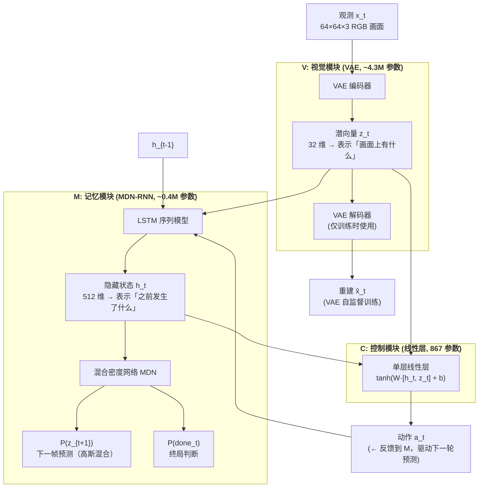
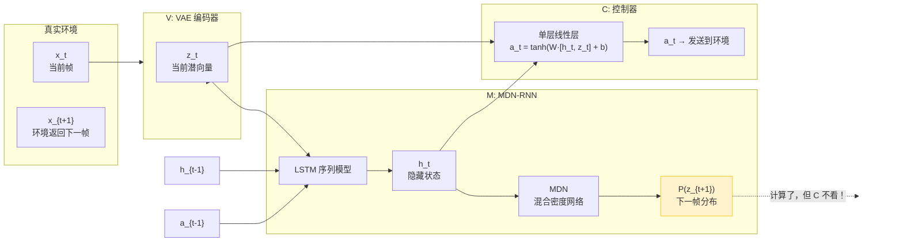
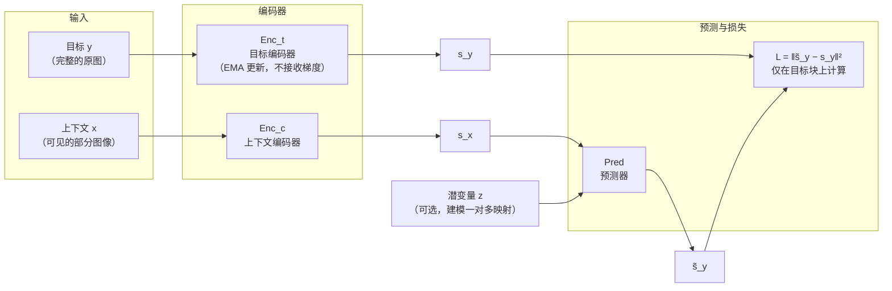
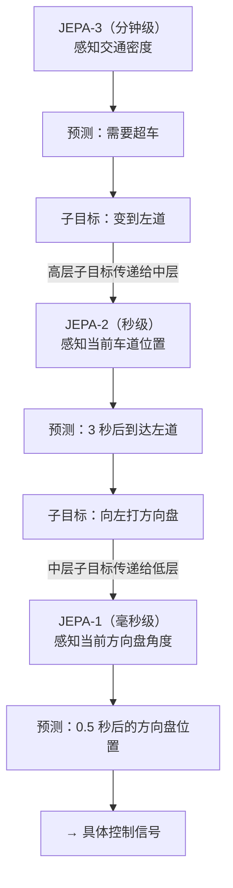
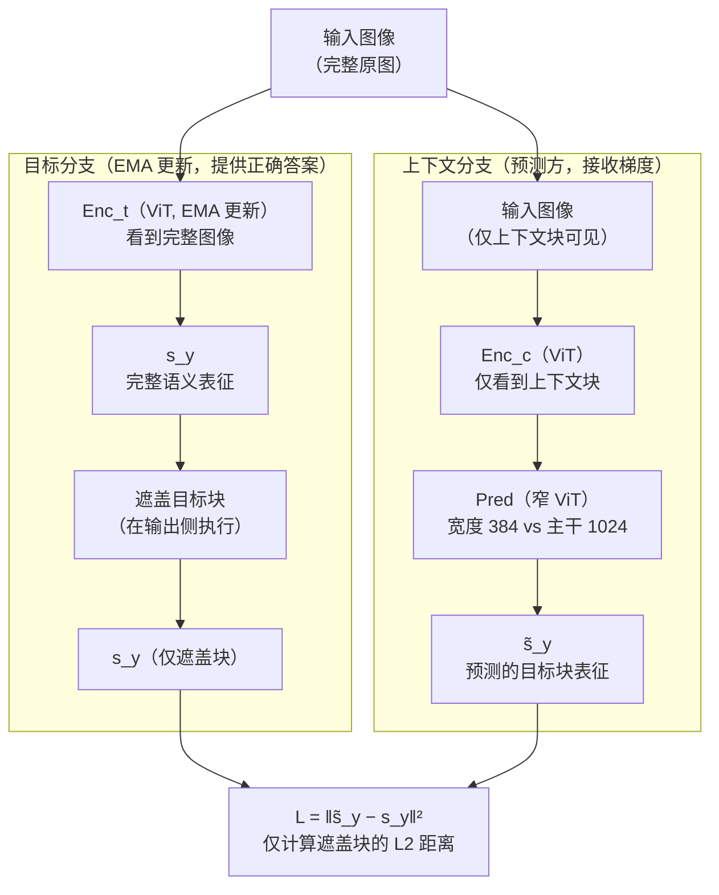
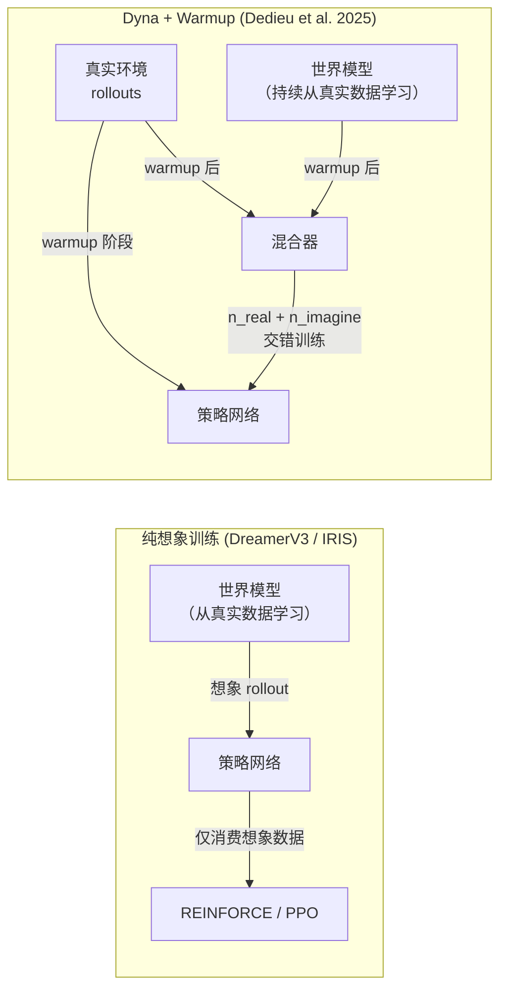
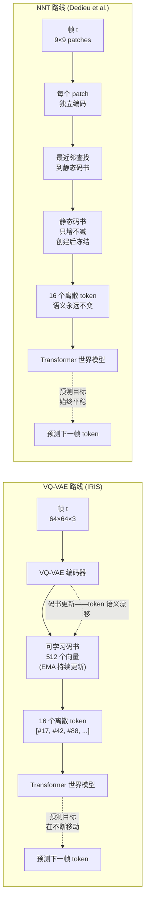
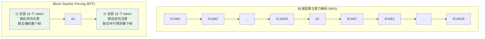

# 世界模型：从像素之梦到表征理解
[← 回到首页](..)

> **World Models: From Pixel Dreams to Representation Understanding**
>
> 覆盖 2018–2026，20 篇核心论文，6 个主线节点
>
> 撰写于 2026 年 6 月

---

## 符号表

### 环境与智能体

| 符号 | 含义 | 首次出现 |
|------|------|---------|
| $\mathbf{x}_t$ | 时刻 $t$ 的观测（图像、LiDAR 点云、占用网格等） | §0.1 |
| $\mathbf{a}_t$ | 时刻 $t$ 的动作 | §0.1 |
| $r_t$ | 时刻 $t$ 的奖励 | §0.1 |
| $\pi(\mathbf{a}_t \mid \mathbf{x}_t)$ | 策略：给定观测下动作的分布 | §0.1 |
| $P(\mathbf{x}_{t+1} \mid \mathbf{x}_t, \mathbf{a}_t)$ | 真实环境过渡动态 | §0.1 |

### 世界模型

| 符号 | 含义 | 首次出现 |
|------|------|---------|
| $\mathbf{z}_t$ | 时刻 $t$ 的潜状态（随机分量） | §1.1 |
| $\mathbf{h}_t$ | 时刻 $t$ 的确定性隐藏状态 | §1.1 |
| $\mathbf{s}_t = \{\mathbf{h}_t, \mathbf{z}_t\}$ | 世界模型的完整状态 | §1.1 |
| $\hat{P}_\phi$ | 学习到的世界模型动态（参数 $\phi$） | §1.1 |
| $\text{Enc}_\phi$ | 编码器：$\mathbf{x} \mapsto \mathbf{z}$ | §1.1 |
| $\text{Dec}_\phi$ | 解码器：$\mathbf{z} \mapsto \hat{\mathbf{x}}$ | §1.1 |
| $\text{Pred}_\theta$ | 预测器（JEPA 上下文）：$\mathbf{s}_x \mapsto \tilde{\mathbf{s}}_y$ | §3.2 |

### 训练与损失

| 符号 | 含义 | 首次出现 |
|------|------|---------|
| $\mathcal{L}_{\text{recon}}$ | 像素/观测重建损失 | §1.1 |
| $\mathcal{L}_{\text{KL}}$ | KL 散度正则项（潜变量模型） | §2.1 |
| $\mathcal{L}_{\text{JEPA}}$ | JEPA 表征预测损失：$\|\tilde{\mathbf{s}}_y - \mathbf{s}_y\|^2$ | §4.1 |
| $\mathcal{L}_{\text{dyn}}$ | 动态预测损失（KL 平衡中的动力学侧） | §2.1 |
| $\mathcal{L}_{\text{rep}}$ | 表征损失（KL 平衡中的编码器侧） | §2.1 |
| $\tau$ | MDN-RNN 采样温度（控制"梦境"难度） | §1.2 |

### JEPA 专属

| 符号 | 含义 | 首次出现 |
|------|------|---------|
| $\text{Enc}_c$ | 上下文编码器（ViT，处理部分可见输入） | §4.1 |
| $\text{Enc}_t$ | 目标编码器（ViT, EMA 更新，处理完整输入） | §4.1 |
| $\mathbf{c}$ | 上下文块（图像中的可见区域） | §4.1 |
| $\mathbf{y}$ | 目标块（图像中被遮盖、需要预测的区域） | §4.1 |

### 评估指标

| 符号 | 含义 | 首次出现 |
|------|------|---------|
| HNS | Human Normalized Score = $\frac{\text{agent} - \text{random}}{\text{human} - \text{random}}$ | §2.1 |

---

## 主线总览

```
"一个 AI 系统如何学会预测自身行为的后果？"

像素之梦 (2018)
│  Ha & Schmidhuber: 在潜空间中做梦，训练策略
│  痛点：VAE 编码了砖墙纹理，却忽略了路沿——什么该编码？
│
├──→ 梦的极限 (2023)
│    DreamerV3: 像素预测能走多远？150+ 任务，单一超参。
│    IRIS: 把世界动态重新定义为序列建模——GPT 做世界模型。
│    痛点：纯想象训练让策略被不成熟的世界模型"毒害"。
│
├──→ 蓝图 (2022)
│    LeCun JEPA: 不要在像素空间预测。在表征空间预测。
│    编码器主动丢弃不可预测的细节。预测器只关⼼语义结构。
│    痛点：这只是一份白皮书，没有实现。它真的能 work 吗？
│
├──→ 舍弃像素 (2023–24)
│    I-JEPA: 表征空间预测的第一次大规模验证。10× 更快。
│    V-JEPA: 从图像到视频——200 万视频训练，冻结主干 SOTA。
│    痛点：表征是抽象的、不可视化的。怎么验证它"理解了"？
│
├──→ 模拟之争 (2024–25)
│    Sora: 缩放能产生物理理解吗？
│    实证回答：不能。模型模仿最接近的训练样本，而非推断物理定律。
│    Cosmos: 物理知情生成——融入显式物理约束。
│    痛点：颜色比速度更重要——模型根本没学到因果。
│
└──→ 走入世界与合流 (2023–26)
     Genie 2/3: 单张图片 → 交互式 3D 世界。UniSim: 异构数据统一空间。
     GAIA-1 / OccWorld: 自动驾驶的未来预测。DayDreamer: 真实硬件在线学习。
     Dyna 回归: 纯想象不如真假混合。NNT 静态码书: 平稳表征 > 容量。
     Cosmos 3: 推理 + 预测 + 世界转换 + 动作，统一物理 AI 平台。
     痛点：层次化规划、Configurator、评估基准——合流之后的下一程。
```

---

## 0. 第零章：控制论与概率基础

> 本章为后续所有章节提供最低限度的数学语言。如果你熟悉 MDP 和潜变量模型，可以跳到 §1。

### 0.1 马尔可夫决策过程（MDP）

世界模型诞生于强化学习——一个智能体在环境中通过试错学习的数学框架。

**MDP 定义。** 一个 MDP 由 $(\mathcal{X}, \mathcal{A}, P, R, \gamma)$ 组成：
- $\mathcal{X}$：状态空间（对世界模型而言，通常是高维观测如 64×64×3 的 RGB 图像）
- $\mathcal{A}$：动作空间（离散如 {左, 右, 跳}，或连续如方向盘转角）
- $P(\mathbf{x}_{t+1} \mid \mathbf{x}_t, \mathbf{a}_t)$：过渡动态——给定当前状态和动作，下一个状态的概率分布
- $R(\mathbf{x}_t, \mathbf{a}_t)$：奖励函数
- $\gamma \in [0,1)$：折扣因子

**直觉。** MDP 是一个"世界的最小模型"：你站在某个位置 $\mathbf{x}_t$，做了一个动作 $\mathbf{a}_t$，世界以某种概率 $P$ 把你带到新位置 $\mathbf{x}_{t+1}$，并告诉你做得好不好 $r_t$。你的工作是找一个策略 $\pi$ 最大化累计奖励 $\sum_{t} \gamma^t r_t$。

**为什么这对世界模型重要。** 如果你**知道** $P$ 和 $R$——也就是说，你有一个世界的内部模型——你就可以在脑中模拟"如果我做 X，会发生什么"而无需真的去做。这就是 §1–§3 所有方法的核心思想。

### 0.2 模型化 vs 无模型强化学习

**无模型 RL**（Model-Free RL）：直接学习 $\pi(\mathbf{a}_t \mid \mathbf{x}_t)$ 或 $Q(\mathbf{x}_t, \mathbf{a}_t)$，不显式建模 $P$。代表：DQN（2015）、PPO（2017）。**优势**：简单、不需要学习动态模型。**痛点**：样本效率极低——Atari 游戏需要 2 亿帧（约 900 小时人类游玩时间）才能达到人类水平。

**模型化 RL**（Model-Based RL, MBRL）：先学习一个世界模型——环境动态的近似 $\hat{P}_\phi$ 和奖励函数的近似 $\hat{R}_\phi$（注意，这里的 $R$ 就是 §0.1 MDP 定义中的奖励函数 $R(\mathbf{x}_t, \mathbf{a}_t)$，$\hat{R}_\phi$ 是它的学习版本）——然后用这个模型来**规划**或**训练策略**。**优势**：样本效率可提升 100–1000 倍，因为策略可以在"想象"中训练而不消耗真实环境交互。**痛点**：必须学习一个足够准确的世界模型——模型误差会累积并"毒害"策略。

本文的 §1、§2 和 §6.5 都在处理这个核心权衡：**如何学习一个足够好的世界模型，使得在想象中训练的策略能在真实世界中泛化？**

### 0.3 潜变量动态模型

当 $\mathbf{x}_t$ 是高维图像（如 64×64×3 = 12288 维）时，直接建模 $P(\mathbf{x}_{t+1} \mid \mathbf{x}_t, \mathbf{a}_t)$ 在计算上不可行。标准的解决方案是学习一个**低维潜表征** $\mathbf{z}_t$，在潜空间中建模动态：

$$\mathbf{z}_t = \text{Enc}_\phi(\mathbf{x}_t), \quad \hat{\mathbf{z}}_{t+1} = \hat{P}_\phi(\mathbf{z}_t, \mathbf{a}_t), \quad \hat{\mathbf{x}}_{t+1} = \text{Dec}_\phi(\hat{\mathbf{z}}_{t+1})$$

**两种学习范式：**

> 这里先解释预测式训练目标中出现的两个符号：$\mathbf{c}$（context block，上下文块）是图像中**可见**的区域——模型被允许看到的部分；$\mathbf{y}$（target block，目标块）是图像中被**遮盖**的区域——模型需要预测其表征的部分。完整的 JEPA 机制将在 §4.1 展开。

| 范式 | 训练目标 | 编码器行为 | 代表工作 |
|------|---------|-----------|---------|
| **重建式**（Generative） | $\min \|\mathbf{x}_t - \text{Dec}(\text{Enc}(\mathbf{x}_t))\|^2$ | 保留所有视觉细节以重建输入 | §1, §2 |
| **预测式**（Predictive / JEPA） | $\min \|\text{Enc}_t(\mathbf{y}) - \text{Pred}(\text{Enc}_c(\mathbf{c}))\|^2$ | 主动丢弃不可预测的细节 | §3, §4 |

本文的核心叙事正是从重建式到预测式的演进——以及两者的最终合流。

**直觉。** 重建式像一个完美主义者——每个像素都要对。预测式像一个印象派画家——只画关键结构，其余留白。当你在高速公路上开车时，你不需要知道路边每棵树的精确纹理；你需要知道的是 200 米外那辆卡车正在变道。JEPA 的核心洞察是：**一个好的世界模型应该像你的大脑一样——忽略不重要的，专注关键的。**

### 0.4 物理类比：世界模型 = 势能面 + 动力学

本文会频繁使用一个物理类比。把世界模型想象成一个**势能面**：
- **得分函数**（score function）$\nabla_{\mathbf{x}} \log p(\mathbf{x})$ 指向数据密度增加最快的方向——就像重力指向势能最低点
- **世界模型的动态预测** $\mathbf{x}_t \mapsto \mathbf{x}_{t+1}$ 是在这个面上滚动——势能面决定了什么状态是"可能的"、什么状态是"违反物理的"

Sora 的问题（§5）可以用这个类比说清楚：它学会了势能面的**形状**（从训练数据中），但没有学会**牛顿定律**——所以当你推它到一个没见过的区域（分布外），它的"物理"就崩溃了。

---

## 1. 像素之梦：Ha & Schmidhuber (2018)

### 1.0 问题引入

2018 年，深度强化学习的样本效率低得惊人。训练一个 Atari agent 需要相当于连续玩 38 天的游戏经验。**人类只需要几分钟就能学会一个游戏。差距在哪？**

答案（至少部分答案）是：人类在脑内模拟。当你第一次玩 Pong 时，在看到球飞来之前，你已经在大脑中"想象"了球会去哪里。你不只是对像素做反应——你有一个关于世界如何运作的**内部模型**。

Ha 和 Schmidhuber 的论文 *"World Models"* 是第一个将这个直觉变为可运行的深度学习系统的工作。它的核心问题：**能不能让 AI 在"梦境"中训练，而不是在真实环境中？**

### 1.1 架构：三个不对称的模块

Ha & Schmidhuber 的三组件架构是故意不对称的。先看数据如何流动：



**两个关键潜变量——它们分工明确：**

- $\mathbf{z}_t$（随机分量）：来自 VAE 编码器。代表**当前帧的视觉内容**——"画面上有什么？"它是从高维像素一次性压缩得到的，每个时刻独立编码。由于 VAE 的重建损失驱动，$\mathbf{z}_t$ 倾向于保留丰富的视觉细节——包括那些对控制任务无关的纹理。

- $\mathbf{h}_t$（确定性分量）：来自 MDN-RNN 中的 LSTM 隐藏状态。代表**时间的记忆**——"之前发生了什么？速度是多少？球在往哪个方向飞？"与 $\mathbf{z}_t$ 不同，$\mathbf{h}_t$ 是递推计算的：$\mathbf{h}_t = f(\mathbf{h}_{t-1}, \mathbf{z}_{t-1}, \mathbf{a}_{t-1})$。它不能从单帧中得到——没有 LSTM 记忆，你无法从一张静止画面中判断球的速度和方向。

**为什么两个分量都需要？** Ha & Schmidhuber 的消融实验给出了答案：去掉 M 模块（只给 C 提供 $\mathbf{z}_t$，没有 $\mathbf{h}_t$），CarRacing 得分从 906 跌到 632。仅看当前帧，方向盘不知道该打多少——就像闭着眼睛开车，每秒只睁眼一瞬。

**V（Vision）：** 一个标准 VAE，将 64×64×3 的游戏画面压缩为 $\mathbf{z}_t \in \mathbb{R}^{32}$。在 10,000 条随机策略轨迹上训练——完全是离线的、无监督的。

**M（Memory）：** 全称 **MDN-RNN（Mixture Density Network + RNN）**。两个组成部分：
- **RNN（具体是 LSTM）**：接受 $(\mathbf{z}_t, \mathbf{a}_t, \mathbf{h}_{t-1})$，产生新的隐藏状态 $\mathbf{h}_t$。它负责**记住时序信息**——速度、加速度、运动方向。
- **MDN（混合密度网络）**：将 LSTM 的隐藏状态映射为**一个高斯混合分布的参数**（多个高斯分量的均值、方差和混合权重），而非单个确定性的下一帧预测 $\hat{\mathbf{z}}_{t+1}$。为什么是混合而非单个高斯？因为未来可能有多模态——比如在岔路口，车可能左转也可能右转，单一高斯无法同时表征这两个可能。MDN 用多个分量来覆盖不同的未来路径。

M 还输出 **$P(\text{done}_t)$**——对"这一局是否结束"的预测。这在 VizDoom 等有生存/死亡概念的任务中非常重要：世界模型需要知道什么时候"梦该醒了"，否则可能在想象中永远循环。

**C（Controller）：** 一个单层线性层 $\mathbf{a}_t = \tanh(W_c[\mathbf{z}_t, \mathbf{h}_t] + \mathbf{b}_c)$。867 个参数。不通过梯度下降训练，而用 **CMA-ES（Covariance Matrix Adaptation Evolution Strategy，协方差矩阵自适应进化策略）**——一种黑箱优化算法：它维护一个动作参数的高斯分布，每次从中采样若干个体（每组参数对应一个策略权重），在环境中评估累计奖励，然后根据奖励最高的个体更新分布的均值和协方差。选择 CMA-ES 而非梯度方法的理由：(1) 它只需要累计奖励（一个标量），不需要为 867 维空间中的每个参数分配时间信用；(2) 在如此小的参数空间中，CMA-ES 可以高效并行化——同时跑数十个"候选策略"即可。

> **▸ 小专题：CMA-ES 是如何工作的？**
>
> CMA-ES 是一种**黑箱优化算法**——你不需要知道目标函数的梯度，只需要能评估"这组参数有多好"。它的核心思想是：**维护一个搜索分布，不断向"好参数"的方向移动这个分布**。具体来说，它在一个 $d$ 维参数空间上维护一个多元高斯分布 $\mathcal{N}(\mathbf{m}, \sigma^2 \mathbf{C})$：
> - $\mathbf{m}$（均值）：当前认为最优的参数位置
> - $\mathbf{C}$（协方差矩阵）：参数空间中的"搜索形状"——椭球的朝向和扁长程度
> - $\sigma$（步长）：搜索的"步子多大"
>
> **每一步迭代做三件事：**
> 1. **采样**：从这个高斯分布中采样 $\lambda$ 个候选参数向量（称为一个"种群"）
> 2. **评估**：每个候选参数跑一次环境，获得累计奖励（即 fitness）
> 3. **更新**：选出 fitness 最高的 $\mu$ 个个体，用它们的加权平均来更新 $\mathbf{m}$；用它们相对于 $\mathbf{m}$ 的偏移来更新协方差 $\mathbf{C}$（让分布"拉长"到好的方向）；根据成功步的实际进步 vs 期望进步来调整步长 $\sigma$
>
> **一个极简 Python 示例。** 假设我们要用 CMA-ES 找函数 $f(\mathbf{w}) = -\|\mathbf{w} - \mathbf{w}^*\|^2$ 的最大值（即找到 $\mathbf{w}^*$）：
>
> ```python
> import numpy as np
>
> def cma_es_minimal(fitness_fn, dim, population_size=20, generations=200):
>     """极简 CMA-ES（演示核心逻辑，非生产级实现）"""
>     m = np.zeros(dim)               # 初始均值（猜测最优参数在原点附近）
>     C = np.eye(dim)                 # 初始协方差（球形——各方向等可能）
>     sigma = 0.5                     # 初始步长
>
>     mu = population_size // 2       # 每轮保留前 50% 最佳个体
>     weights = np.log(mu + 0.5) - np.log(np.arange(1, mu + 1))
>     weights /= weights.sum()        # 权重：排名越高，对更新的影响越大
>
>     for gen in range(generations):
>         # Step 1: 从 N(m, sigma^2·C) 采样 λ 个候选参数
>         candidates = m + sigma * np.random.multivariate_normal(
>             np.zeros(dim), C, size=population_size
>         )
>
>         # Step 2: 评估每个候选
>         fitness = np.array([fitness_fn(c) for c in candidates])
>
>         # Step 3: 选出最好的 μ 个，加权更新
>         ranked = candidates[np.argsort(-fitness)][:mu]
>         m_new = np.sum(ranked * weights[:, None], axis=0)       # 加权均值
>
>         # 更新协方差：让 C 向"好方向"拉伸
>         diffs = (ranked - m) / sigma
>         C = (1 - 0.02) * C + 0.02 * np.cov(diffs.T, aweights=weights)
>
>         sigma *= np.exp(0.01 * (np.mean(fitness[:mu]) - fitness.mean()))
>         m = m_new
>
>     return m
>
> # 用法：在 867 维空间中找最优参数
> target = np.ones(867) * 3.0
> result = cma_es_minimal(lambda w: -np.sum((w - target)**2), dim=867)
> print(f"找到的最优参数误差: {np.linalg.norm(result - target):.2f}")
> ```
>
> 在 Ha & Schmidhuber 的场景中，每个候选参数向量就是 **Controller 的权重 $W_c$ 和偏置 $\mathbf{b}_c$**（共 867 个值），fitness 是这个权重在 CarRacing 环境中的累计得分。每轮 CMA-ES 同时测试 64 个"候选 C"，然后向得分最高的那些靠拢——不需要反向传播，不需要价值函数，只需要**"你的得分是多少？"**
**直觉。** 这个设计像一个**骑手（C）驾驭一头大象（V+M）**。骑手只需要发出简单指令；大象负责理解地形、惯性、障碍物。骑手不需要神经科学博士学位来走路——同理，一个 867 参数的线性层可以在一个强大的世界模型上解决 CarRacing。

### 1.2 核心贡献：梦中训练与温度参数

这篇论文最具影响力的实验是 **"完全在 M 的潜空间中训练 C"**——然后零样本部署到真实环境。

**VizDoom 简介。** VizDoom 是一个基于经典 FPS 游戏《Doom》的 AI 研究平台，提供第一人称 3D 视觉输入和离散动作空间（前进、转向、射击等）。论文中的 TakeCover 任务要求 agent 在一个有怪物从四面八方射击的竞技场中尽可能久地存活——这是一个需要快速反应、空间感知和危险评估的生存挑战。

在 TakeCover 任务中的结果令人震惊：
- 在真实 VizDoom 环境中训练的 C 得分：918 ± 546
- **完全在 M 的潜空间（梦中）训练的 C 得分：1092 ± 556**

梦中训练的策略**超过了**在真实环境中训练的策略。为什么？

答案藏在 **温度参数 $\tau$** 中。要理解 $\tau$，先要理解 MDN-RNN 的输出结构：

M 模块在每一步输出的是**一个高斯混合分布**的参数——具体来说，是 $K$ 个高斯分量的均值 $\mu_k$、标准差 $\sigma_k$、和混合权重 $\pi_k$（$\sum_k \pi_k = 1$）。从这个分布中采样下一帧的潜向量时：

$$\mathbf{z}_{t+1} \sim \sum_{k=1}^{K} \pi_k \cdot \mathcal{N}(\mu_k, \sigma_k^2)$$

现在引入温度参数 $\tau$——它在采样前**统一缩放所有分量的标准差**：

$$\mathbf{z}_{t+1} \sim \sum_{k=1}^{K} \pi_k \cdot \mathcal{N}(\mu_k, \tau \cdot \sigma_k)$$

- $\tau = 1.0$：按模型学习到的原始不确定性采样——"标准梦境"
- $\tau < 1.0$：缩小标准差。模型变得更"自信"，预测的分布更集中——这创造了**比真实更简单的世界**（"简单模式"——敌人较少开枪、弹道更可预测）
- $\tau > 1.0$：放大标准差。模型的不确定性被**人为增强**——这创造了**比真实更困难的世界**（"噩梦模式"——模型承认自己不确定的时刻被放大，状态变得更嘈杂）

**关键实验发现：** 在 CarRacing 中，$\tau = 1.0$ 训练的 C 表现良好。但在 VizDoom TakeCover 中，$\tau = 1.15$ 训练的 C 在真实环境中表现最好。$\tau < 1.0$ 时，策略学会"欺骗"世界模型的不准确性——低 $\tau$ 模式下，MDN-RNN 不再输出怪兽可能开火的分布，而退化为"怪兽通常不开火"的确定性预测，C 学会了依赖这种虚假的安全性而在梦中获得高奖励——但部署到真实环境时，怪兽照常开火，策略瞬间崩溃。

$\tau = 1.15$ 有效的原因：**略大于 1.0 的温度让梦中世界比真实世界更嘈杂**——模型不确定的时刻被适度放大，迫使策略学习对不完美观察仍然鲁棒的行为。这是现代"域随机化"（domain randomization）思想的一个早期雏形。

**直觉。** 这就像在狂风中练习投篮——练习环境比比赛日更恶劣。当真正的比赛到来时，微风反而让你感到轻松。一个好世界模型的标志不是它有多"确定"，而是它的**不确定性校准**——它知道自己什么时候不知道，并以一种对策略训练有益的方式使用这种不确定性。

### 1.3 训练与推理：V/M/C 如何协作？

V/M/C 三个模块的**训练和推理是截然不同的**，理解这个分离是理解世界模型的关键。

**训练阶段（四步，顺序执行，各模块独立训练）：**

| 步骤 | 模块 | 数据来源 | 训练目标 | 训练完成后 |
|------|------|---------|---------|-----------|
| Step 1 | V (VAE) | 10,000 条随机策略轨迹的原始帧 | 重建损失 $\|\mathbf{x}_t - \hat{\mathbf{x}}_t\|^2$ + KL 正则 | **冻结**——权重不再改变 |
| Step 2 | M (MDN-RNN) | V 编码的潜向量序列 $\{\mathbf{z}_1, \mathbf{z}_2, ...\}$ + 对应动作 $\{\mathbf{a}_1, \mathbf{a}_2, ...\}$ | 预测下一帧分布 $P(\mathbf{z}_{t+1})$ 的混合密度损失；预测终局 $P(\text{done}_t)$ 的交叉熵 | **冻结**——权重不再改变 |
| Step 3 | C (Controller) | 方式 A: 真实环境（每步编码 $\mathbf{x}_t \to \mathbf{z}_t$，M 更新 $\mathbf{h}_t$，C 输出 $\mathbf{a}_t$）<br/>方式 B: **M 的梦境**（从 M 采样 $\hat{\mathbf{z}}_{t+1}$ 替代真实编码，其余相同） | CMA-ES 最大化累计奖励 | **部署** |

**Step 2 的关键细节——“预测未来”如何训练 M：** 给定一条真实轨迹 $\{\mathbf{x}_1, \mathbf{a}_1, \mathbf{x}_2, \mathbf{a}_2, ..., \mathbf{x}_T\}$，先用冻结的 V 编码为 $\{\mathbf{z}_1, \mathbf{a}_1, \mathbf{z}_2, \mathbf{a}_2, ..., \mathbf{z}_T\}$。M 的训练是一个**有监督的序列预测任务**：在每一步 $t$，M 接收 $(\mathbf{z}_t, \mathbf{a}_t, \mathbf{h}_{t-1})$，LSTM 更新到 $\mathbf{h}_t$，MDN 输出参数化的 $P(\mathbf{z}_{t+1})$。**训练标签就是真实的 $\mathbf{z}_{t+1}$**（由 V 编码下一帧得到）。换句话说，M 的训练完全是一个标准的有监督学习——它不是在强化学习循环中训练的，而是在”观看”已有的轨迹，学习”给定过去，预测未来”。

**推理/部署阶段：**



> 上图中黄色高亮的 $P(\mathbf{z}_{t+1})$ 是推理时 MDN 仍然会产出的预测——但它是**冗余计算**，C 模块既不读取也不使用。

这是整个架构中最容易被误解的地方：**推理时 M 的 MDN 仍然会输出 $P(\mathbf{z}_{t+1})$，但 C（Controller）根本不需要它。** C 的输入只有 $\mathbf{z}_t$ 和 $\mathbf{h}_t$——当前帧的编码和 LSTM 的历史记忆。

那”预测未来”在推理中到底起了什么作用？答案是：**它间接地塑造了 $\mathbf{h}_t$ 的质量，但不是一个推理时被消费的信号。** 这个区分至关重要：

| | 训练 M 时 | 训练 C（梦中）时 | 部署（真实推理）时 |
|---|---|---|---|
| $P(\mathbf{z}_{t+1})$ 的作用 | **训练目标本身**：M 学习预测下一帧来获得好的 $\mathbf{h}_t$ | **环境模拟器**：采样 $\mathbf{z}_{t+1}$ 来替代真实环境的下一帧，使想象 rollout 得以持续 | **不直接使用**：$\mathbf{h}_t$ 已经内化了关于动态的知识，C 不需要显式地看到预测 |
| 谁消费 $\mathbf{z}_{t+1}$？ | 损失函数（对比预测和真实） | C（作为下一轮的输入） | 无人消费 |

**直觉。** M 就像一个运动员在做力量训练（预测未来）——这个训练让 ta 获得了肌肉记忆（好的 $\mathbf{h}_t$）。但到了比赛（部署）时，ta 不需要回顾训练动作——肌肉记忆已经内化了。**M 通过”学习预测未来”来获得对环境动态的深层理解，但一旦理解到位，部署时只需要从 $\mathbf{h}_t$ 中读出这份理解就够了，不需要显式地生成未来。** 这是一个优雅的不对称：训练昂贵（需要预测），推理廉价（只需前向传播）。

**梦中训练 C 时的特殊之处：** 当 C 在 M 的潜空间中训练（而非真实环境）时，$P(\mathbf{z}_{t+1})$ **确实被消费**——采样出的 $\hat{\mathbf{z}}_{t+1}$ 作为下一轮的”伪观测”输入。这是 $P(\mathbf{z}_{t+1})$ 唯一被主动使用的地方。这也解释了为什么温度参数 $\tau$ 只在梦中训练时重要——在真实部署时，根本没有采样未来的步骤。

> **延伸讨论：如果 C 采用滚动优化控制（如 MPC），$P(\mathbf{z}_{t+1})$ 在推理时还需要吗？** 答案是**需要**——但那已经是另一种架构了。Ha & Schmidhuber 的 C 是纯反应式的单层线性层，不做任何 rollout：$\mathbf{a}_t = \tanh(W[\mathbf{z}_t, \mathbf{h}_t] + \mathbf{b})$ 一步到位。但如果 C 换成 MPC 式的规划器（如 LeCun 在 §3 中设想的模式-2：在潜空间中展开多个候选动作序列，用世界模型预测每一步的结果，选代价最小的那个），那么 $P(\mathbf{z}_{t+1})$ **在推理时就必须被反复调用**——每一轮规划都要从当前 $\mathbf{z}_t$ 出发，用 M 展开一条想象轨迹，而展开的每一步都需要采样 $P(\mathbf{z}_{t+k+1})$。这正是 Ha & Schmidhuber 路线与 LeCun 模式-2 的一个关键分界线：**反应式策略不需要推理时预测，但规划式策略（如 DreamerV3 的想象 rollout、LeCun 的梯度 MPC）仍然需要世界模型在推理时”运转”。**

### 1.4 局限：什么该编码？

Ha & Schmidhuber 的架构有一个根本性的缺陷：**VAE 在重建损失上训练，编码了与任务无关的一切**。

原始论文中提供了有力的视觉证据：在 CarRacing 实验中，VAE 忠实地编码了天空的颜色、草地纹理和道路标记的精确宽度；但 policy（C 模块）实际上只需要知道"道路的边缘在哪里"和"前方是否有弯道"——可能 5 个比特的信息就足够了。在 VizDoom 中，VAE 花费了大量表征容量来重建砖墙的纹理图案，而这些纹理与"躲避火球"之间存在零相关性。

更糟糕的是，表征容量是有限的——当 VAE 把容量分配给砖墙纹理时，它可能**无法分配足够的容量给真正重要但视觉微小的特征**。CarRacing 中的路沿只有约 5 像素宽，在 64×64 的低分辨率输入中极易被忽视——VAE 的重建损失对"路沿的精确位置"不敏感（因为路沿只占极少像素），但驾驶策略对它极度敏感（路沿偏了 2 像素，方向盘需要打一个完全不同的角度）。

Ha & Schmidhuber 在论文中承认了这一局限。他们展示了 C 在仅用 V（Vision，没有 M 的 LSTM 记忆）时，CarRacing 的车会在弯道处剧烈抖动——因为从单帧的 $\mathbf{z}_t$ 中无法可靠推断速度和方向。这些结果（原始论文的 Figure 5 和 6）清楚地说明了：**不是所有编码在 $\mathbf{z}_t$ 中的信息都对控制有用，而控制真正需要的信息也不一定在 $\mathbf{z}_t$ 中。**

这一发现直接催生了 LeCun 的 JEPA 提案（§3）：**不要在像素空间中预测，不要强迫模型编码不可预测的细节——让模型自己学会"什么值得编码"。**

> **主线节点 1。** Ha & Schmidhuber 证明了世界模型的可行性——策略可以完全在想象中训练并成功迁移到真实环境。但他们留下了一个根本问题：**什么信息需要编码到世界状态中，什么可以丢弃？** 这个问题将由 JEPA 路线（§2, §4）回答。

---

## 2. 梦的极限：DreamerV3 与 IRIS (2023)

> **IRIS** = **I**magination with auto-**R**egression over an **I**nner **S**peech（基于内心语言的想象式自回归模型）。

### 2.0 问题引入

§1 证明了世界模型可以在脑中"做梦"来训练策略——一个 867 参数的线性控制器，在一个学习了环境动态的潜空间中，可以学会驾驶赛车和在弹幕中求生。但 Ha & Schmidhuber 的架构只是一个起点——三个模块被独立训练，VAE 编码了与任务无关的视觉细节，控制器没有规划能力。

2023 年，两个系统——DreamerV3 和 IRIS——将模型化 RL 推向了前所未有的高度。它们问了一个看似矛盾的问题：**如果我们坚持像素预测——而不是放弃它——能走多远？** 答案出人意料：比任何人预期的都远。DreamerV3 在 150+ 个任务上用一套超参数达到了强大性能，甚至成为了首个从零开始在 Minecraft 中收集钻石的算法。但它也暴露了纯想象训练的致命弱点——这为 §3 中 JEPA 路线的必要性提供了实证。

### 2.1 DreamerV3：一个世界模型统治 150+ 个任务

在深入 DreamerV3 的架构之前，先解决一个将在本节反复出现的计算问题：**不同任务的奖励数值可能在完全不同的数量级上。** Atari 游戏的奖励范围是 $[-1, +1]$，而 DMLab 的 3D 导航任务奖励可达 $10^3$ 甚至更高。如果用同一个网络直接回归这些原始数值，大奖励会产生巨大的梯度，淹没小奖励任务的训练信号。

DreamerV3 的解决方案是把**所有回归问题都搬到一个"压缩"空间里做**。它定义了两个互逆的变换函数：

$$\text{symlog}(x) = \text{sign}(x) \cdot \ln(|x| + 1)$$

$$\text{symexp}(x) = \text{sign}(x) \cdot (\exp(|x|) - 1)$$

**symlog 的作用（以 Atari $\pm 1$ vs DMLab $1000$ 为例）：**
- symlog: $1 \mapsto 0.69$, $1000 \mapsto 6.91$ → 把跨越三个数量级的值压缩到同一小区间
- symexp: $0.69 \mapsto 1$, $6.91 \mapsto 1000$ → 还原（只在需要输出真实值时使用）

对绝对值小于 1 的值，$\ln(|x|+1) \approx |x|$，所以 symlog 是**近似线性的**——常用范围内的精度不会牺牲。DreamerV3 在所有回归任务中统一使用 symlog 空间：解码器在 symlog 空间中预测像素值、奖励预测器在 symlog 空间中预测 $\hat{r}_t$、Critic 在 symlog 空间中预测价值。网络的预测值通过 symexp 恢复到原始空间，但**损失函数和梯度始终在 symlog 空间中计算**。这意味着不管原始奖励是 1 还是 1000，它们在损失函数中的贡献是量级相近的。

有了这个工具，现在来看 DreamerV3 的完整架构。

---

**架构：Recurrent State-Space Model (RSSM)。**

DreamerV3 的世界模型继承了 DreamerV1/V2 的 RSSM 架构，由五个子网络组成，所有参数统记为 $\phi$，端到端联合训练：

| 组件 | 公式 | 输入 → 输出 | 作用 |
|------|------|-----------|------|
| **编码器** | $\mathbf{z}_t \sim q_\phi(\mathbf{z}_t \mid \mathbf{h}_t, \mathbf{x}_t)$ | 当前观测 $\mathbf{x}_t$ + 隐藏状态 $\mathbf{h}_t$ → 随机潜变量 $\mathbf{z}_t$ | 从像素中提取视觉信息。$\mathbf{z}_t$ 是**32 个独立的 32 类分类分布**（而非高斯），可自然处理多模态场景 |
| **序列模型** | $\mathbf{h}_t = f_\phi(\mathbf{h}_{t-1}, \mathbf{z}_{t-1}, \mathbf{a}_{t-1})$ | 上一步隐藏状态 $\mathbf{h}_{t-1}$ + 上一步潜变量 $\mathbf{z}_{t-1}$ + 上一步动作 $\mathbf{a}_{t-1}$ → 当前隐藏状态 $\mathbf{h}_t$ | **确定性时序记忆**（GRU）。$\mathbf{h}_t$ 承载速度、加速度、方向等无法从单帧推断的信息 |
| **动态预测器** | $\hat{\mathbf{z}}_t \sim p_\phi(\hat{\mathbf{z}}_t \mid \mathbf{h}_t)$ | 仅从 $\mathbf{h}_t$ 预测 $\hat{\mathbf{z}}_t$ | **"闭眼预测"**——不看真实观测，仅凭历史记忆猜测下一秒的视觉状态。想象 rollout 时**替代编码器**使用 |
| **解码器** | $\hat{\mathbf{x}}_t = p_\phi(\hat{\mathbf{x}}_t \mid \mathbf{h}_t, \mathbf{z}_t)$ | 状态 $(\mathbf{h}_t, \mathbf{z}_t)$ → 观测重建 $\hat{\mathbf{x}}_t$ | 在 symlog 空间中重建输入图像，产生的梯度迫使 $\mathbf{z}_t$ 保留足够视觉信息 |
| **奖励/继续预测器** | $\hat{r}_t, \hat{c}_t = p_\phi(\cdot \mid \mathbf{h}_t, \mathbf{z}_t)$ | 状态 $(\mathbf{h}_t, \mathbf{z}_t)$ → 奖励预测 $\hat{r}_t$ + 终止概率 $\hat{c}_t$ | 均在 symlog 空间中预测 |

其中，我们把 RSSM 的完整状态记为 $\mathbf{s}_t = \{\mathbf{h}_t, \mathbf{z}_t\}$（符号表 §1.1 中已定义），它包含了世界模型在时刻 $t$ 对环境的全部知识——确定性记忆 $\mathbf{h}_t$（"之前发生了什么"）和随机视觉快照 $\mathbf{z}_t$（"画面上有什么"）。Actor 和 Critic 都只消费 $\mathbf{s}_t$，不直接接触像素。

---

**世界模型的训练：KL 平衡与自由比特。**

RSSM 的训练涉及一个核心张力。编码器 $q_\phi(\mathbf{z}_t \mid \mathbf{h}_t, \mathbf{x}_t)$ 在**看到真实观测后**产生后验潜变量 $\mathbf{z}_t$；动态预测器 $p_\phi(\hat{\mathbf{z}}_t \mid \mathbf{h}_t)$ 在**不看真实观测的情况下**产生先验预测 $\hat{\mathbf{z}}_t$。世界模型的 KL 损失衡量先验与后验之间的距离：

$$\mathcal{L}_{\text{KL}} = D_{\text{KL}}\!\big(q_\phi(\mathbf{z}_t \mid \mathbf{h}_t, \mathbf{x}_t) \;\big\|\; p_\phi(\hat{\mathbf{z}}_t \mid \mathbf{h}_t)\big)$$

如果这个损失被不加区分地最小化，编码器可能崩溃——把所有 $\mathbf{x}_t$ 映射到同一个 $\mathbf{z}_t$，使得先验和后验都退化到无信息的先验分布。DreamerV3 用两个机制来解决：

**KL 平衡（KL Balancing）。** 把 KL 损失拆成两部分，分配不同的权重：

$$\mathcal{L}_{\text{dyn}} = \beta_{\text{dyn}} \cdot D_{\text{KL}}\!\big(\text{sg}[q_\phi] \;\big\|\; p_\phi\big), \quad \mathcal{L}_{\text{rep}} = \beta_{\text{rep}} \cdot D_{\text{KL}}\!\big(q_\phi \;\big\|\; \text{sg}[p_\phi]\big)$$

其中 $\text{sg}[\cdot]$ 表示 stop-gradient（该侧不接收梯度）。$\beta_{\text{dyn}} = 0.5$（动力学侧），$\beta_{\text{rep}} = 0.1$（表征侧）。$\beta_{\text{rep}} < \beta_{\text{dyn}}$ 意味着：**让动态预测器追赶编码器的力度，大于让编码器迁就动态预测器的力度。** 换句话说——"宁可让编码器保留更多信息，然后让预测器努力跟上，而非让编码器偷懒去迎合预测器。"

**自由比特（Free Bits）。** 即使有 KL 平衡，当 KL 散度已经很小（$\approx$ 1 nat，即约 1.44 bits）时，继续惩罚已经没有意义——编码器已经从观测中提取了足够的信息。DreamerV3 在 KL 低于 1 nat 时**截断梯度**：$\max(\mathcal{L}_{\text{KL}} - 1, 0)$。这防止了编码器在训练后期被过度正则化而丢失关键信息。

---

**Actor 和 Critic：纯想象训练。**

世界模型训练好后，DreamerV3 的策略训练**完全不接触真实环境数据**。Actor 和 Critic 的所有学习都发生在大脑的"梦境"中。

**为什么需要 Actor-Critic？** 回顾 §0.2：RL 的核心是在环境中找到最大化累计奖励的策略。Actor-Critic 是解决这个问题的最主流范式：Actor（策略网络 $\pi_\theta$）负责**做决策**——给定当前状态 $\mathbf{s}_t$，输出动作 $\mathbf{a}_t$。Critic（价值网络 $v_\psi$）负责**评估局面**——给定状态 $\mathbf{s}_t$，估计从这个状态出发按当前策略能获得多少累计奖励。Critic 的输出作为"基线"，帮助 Actor 判断每个动作是"好于平均"还是"差于平均"，从而降低梯度方差。

**想象轨迹的生成。** 从真实环境 replay buffer 中随机抽取一个已访问过的真实状态 $\mathbf{s}_t$ 作为起点，然后**关闭眼睛**——只用动态预测器展开 $H=16$ 步的未来：

$$t = 0: \quad \mathbf{s}_0 = \{\mathbf{h}_0, \mathbf{z}_0\} \quad\text{(来自 replay buffer 的真实状态)}$$

$$t = 1, 2, ..., H{:} \quad \mathbf{a}_{t-1} \sim \pi_\theta(\cdot \mid \mathbf{s}_{t-1}) \quad\text{(Actor 决定动作)}$$

$$\mathbf{h}_t = f_\phi(\mathbf{h}_{t-1}, \mathbf{z}_{t-1}, \mathbf{a}_{t-1}) \quad\text{(序列模型：确定性更新)}$$

$$\hat{\mathbf{z}}_t \sim p_\phi(\cdot \mid \mathbf{h}_t) \quad\text{(动态预测器：采样潜变量)}$$

$$\mathbf{s}_t = \{\mathbf{h}_t, \hat{\mathbf{z}}_t\}, \quad \hat{r}_{t-1} = p_\phi(\cdot \mid \mathbf{h}_{t-1}, \mathbf{z}_{t-1}) \quad\text{(构成新状态 + 预测奖励)}$$

这 16 步构成一条"想象轨迹" $\{(\mathbf{s}_0, \mathbf{a}_0, \hat{r}_0), (\mathbf{s}_1, \mathbf{a}_1, \hat{r}_1), \dots, (\mathbf{s}_H)\}$。

**$\lambda$-return 的计算。** 给定一条想象轨迹上的奖励序列 $\{\hat{r}_0, \hat{r}_1, ..., \hat{r}_{H-1}\}$ 和最后一个状态的 Critic 估计 $v_\psi(\mathbf{s}_H)$，$\lambda$-return $G_t^\lambda$ 是对**从 $t$ 时刻到未来的累计奖励**的一种平滑估计，它通过递归计算：

$$G_H^\lambda = v_\psi(\mathbf{s}_H) \quad\text{(最后一步，靠 Critic 估计剩余价值)}$$

$$G_{k}^\lambda = \hat{r}_{k} + \gamma \Big((1-\lambda) \cdot v_\psi(\mathbf{s}_{k+1}) + \lambda \cdot G_{k+1}^\lambda\Big)$$

其中 $\gamma=0.997$ 是折扣因子，$\lambda=0.95$ 控制"使用真实奖励 vs 使用 Critic 估计"的权衡：
- $\lambda=0$：$G_k^\lambda$ 完全依赖单步奖励 + Critic 估计（低方差但可能偏倚）
- $\lambda=1$：$G_k^\lambda$ 完全依赖实际采样的多步奖励（无偏倚但高方差）
- $\lambda=0.95$：DreamerV3 的选择——几乎全用实际奖励，但在最后几步平滑过渡到 Critic 估计

**Actor 的更新。** 对于轨迹上的每个状态 $\mathbf{s}_t$，计算**优势** $A_t = G_t^\lambda - v_\psi(\mathbf{s}_t)$。如果 $A_t > 0$（实际回报高于预期），提高 $\mathbf{a}_t$ 的概率；如果 $A_t < 0$，降低。梯度公式为：

$$\mathcal{L}_{\text{actor}} = -\mathbb{E}_{\text{imagine}}\!\Big[\log \pi_\theta(\mathbf{a}_t \mid \mathbf{s}_t) \cdot \text{sg}\!\big(G_t^\lambda - v_\psi(\mathbf{s}_t)\big)\Big]$$

> **▸ 小专题：策略梯度定理与 DreamerV3 的 Actor 损失**
>
> 这个损失公式源自 **REINFORCE 算法**（Williams, 1992）和**策略梯度定理**（Sutton et al., 1999）。核心思想是：策略（Actor）不直接知道每个动作"应该值多少分"，它只能通过采样后的实际回报来**事后判断**每个动作的好坏。
>
> **一个极简例子（推车任务——连续动作）。** 一辆小车停在轨道上，你可以控制一个连续值 $a \in \mathbb{R}$（推力大小和方向）来推动小车。最优推力是 $a^* = 3.0$（推力过小推不动，过大浪费能量，3.0 最节能）。但 Agent 不知道这个最优值——它只能每次选一个推力，观察"耗了多少能源"（奖励 = 负消耗），然后凭经验调整。
>
> 策略是一个**高斯分布**：$\pi_\theta(a) = \mathcal{N}(a \mid \mu = \theta, \sigma = 0.5)$。整个策略只有一个可学参数 $\theta$——高斯均值的位置。$\theta$ 和 $a$ 的关系始终如一：$\theta$ 变大 → 高斯右移 → 采出更大推力的概率升高；$\theta$ 和 $\log\pi_\theta(a)$ 的公式也始终是同一个（高斯概率密度取对数），**不论采出什么动作，数学形式都不变**。这和 DreamerV3 中 Actor 用 MLP 输出高斯均值和标准差来建模连续方向盘转角是一模一样的思路。
> **一个关键陷阱——奖励的中心化。** 如果用 $G = -(a - a^*)^2$ 作为奖励，所有奖励都 ≤ 0。REINFORCE 对负奖励的解释是"这个动作差，远离它"——但**所有动作的奖励都是负的**，策略被推开的方向取决于采样噪声而非真实梯度。$\theta = 3.0$（最优位置）处奖励 $G \approx 0$，梯度消失；但一旦 $\theta$ 被噪声推离 3.0，两边采出的动作都获得近乎相等的负奖励，梯度信号淹没在采样方差中——$\theta$ 做随机游走，可能收敛到任意一个远离最优点的区域。这正是**为什么 DreamerV3 需要 Advantage（$A_t = G_t^\lambda - v_\psi$）而不仅仅用原始回报**：Advantage 将奖励**中心化**——好的动作得正优势（增强），差的动作得负优势（减弱），解决了"全是负奖励"下的梯度迷失问题。
>
> 下面的代码将奖励中心化处理（距最优越近分越高，越远分越低），让 REINFORCE 有清晰的梯度方向：
>
> ```python
> import torch
> import math
>
> # 设置：最优推力 a* = 3.0，策略是 N(μ=θ, σ=0.5)
> a_star = 3.0
> sigma = 0.5
> theta = torch.tensor([0.0], requires_grad=True)  # 初始均值=0，Agent 还不知道该推多大
>
> for episode in range(200):
>     # Step 1: 从高斯策略中采样一个连续推力
>     a = torch.normal(mean=theta, std=sigma)       # a ~ N(θ, 0.5²)
>
>     # Step 2: 执行推力，奖励 = 距最优越近分越高（带噪声）
>     G = 1.0 - 0.1 * (a - a_star).pow(2) + torch.randn(1).item() * 0.05
>
>     # Step 3: 计算高斯密度下的 log 概率
>     log_prob = -0.5 * ((a - theta) / sigma).pow(2) \
>                - math.log(sigma * math.sqrt(2 * math.pi))
>     loss = -log_prob * G.detach()   # ← REINFORCE 损失，G 用 detach 切断梯度
>     loss.backward()
>
>     # Step 4: 更新
>     with torch.no_grad():
>         theta -= 0.01 * theta.grad    # 学习率 0.01
>         theta.grad.zero_()
>
> print(f"θ = {theta.item():.2f}  (最优 a* = {a_star})")
> # 输出: θ ≈ 3.0  ← 策略的均值从 0 漂移到了最优推力！
> ```
>
> **发生了什么？** 奖励函数 $G(a) = 1.0 - 0.1 \cdot (a-3)^2$ 在 $a=3$ 处取最大值 $1.0$，偏离越远分越低（$a=-1$ 时 $G \approx -0.6$）。当 Agent 偶然采到接近 3.0 的推力时，$G \approx 1.0$（正奖励），`loss = -log_prob · (+1.0)`，梯度使该动作更可能被选中——**策略被"拉向"好动作**。当采到远离 3.0 的推力时，$G$ 为负，梯度将策略推离该区域。正负分明的梯度信号让 $\theta$ 在 200 轮内稳定收敛到 3.0。
>
> **策略梯度定理的正式形式**（Sutton & Barto, 2018, §13.3）：
> $$\nabla_\theta J(\theta) = \mathbb{E}_{\pi_\theta}\!\Big[ \nabla_\theta \log \pi_\theta(\mathbf{a} \mid \mathbf{s}) \cdot Q^{\pi_\theta}(\mathbf{s}, \mathbf{a}) \Big]$$
> 即：期望回报 $J$ 对策略参数 $\theta$ 的梯度，等于"对数概率的梯度"乘以"该动作的质量 $Q$"的期望。这是 RL 中极少数**不需要知道环境动态就能计算**的梯度——你只需要采样动作并观察回报。
>
> **从定理到 DreamerV3 的损失函数。** 在深度学习中，我们通常不手动计算 $\nabla_\theta$，而是写一个损失函数让自动微分去做。因为 $\nabla_\theta \mathcal{L} = -\nabla_\theta \log \pi_\theta \cdot A \iff \mathcal{L} = -\log \pi_\theta \cdot A$（$A$ 视为常数，通过 $\text{sg}$ 切断梯度），所以 DreamerV3 的 Actor 损失就是定理在引入 Advantage 基线后的直接翻译：
> $$\mathcal{L}_{\text{actor}} = -\log \pi_\theta(\mathbf{a}_t \mid \mathbf{s}_t) \cdot \text{sg}(A_t)$$
> 其中 $\text{sg}[A_t]$（stop-gradient）确保 $A_t$ 只作为标量权重，不产生梯度——否则 Actor 可以通过"让 Critic 高估价值"来降低损失而无需真正改进策略。这是一个实现上的优雅技巧：**定理说"对数概率的梯度 × 回报"，代码写"−log_prob × 回报 的损失"，自动微分自动算出相同的梯度。**

**Critic 的更新。** Critic 只需要学习预测 $\lambda$-return。DreamerV3 采用**离散回归**：将 symlog 空间的范围 $[-20, +20]$ 等分为 255 个桶。对于目标值 $G_t^\lambda$（已在 symlog 空间中），先做 **two-hot 编码**——如果 $G_t^\lambda = 3.4$，它在桶 3 和桶 4 之间，则桶 3 分配 $0.6$ 的概率质量、桶 4 分配 $0.4$，其余桶为 0。Critic 输出对这 255 个桶的 softmax 分布，用交叉熵损失拟合这个 two-hot 目标：

$$\mathcal{L}_{\text{critic}} = -\sum_{k=1}^{255} \text{twohot}\!\big(\text{symlog}(G_t^\lambda)\big)_k \cdot \log v_\psi(\mathbf{s}_t)_k$$

> **▸ 小专题：为什么 Critic 不用 MSE，而用离散 two-hot 回归？**
>
> 标准做法是用 MSE 直接回归标量价值：$\mathcal{L} = (G_t^\lambda - v_\psi(\mathbf{s}_t))^2$。DreamerV3 放弃了这个方案，原因有二：
>
> **问题 1：异常值放大。** MSE 对误差是平方惩罚。当奖励范围跨越数量级时（DMLab 中某一步奖励突然从 1 跳到 1000），MSE 梯度 $\propto \|G_t^\lambda - v\|$ 会产生巨大的更新步，导致训练不稳定。symlog 压缩缓解了这一点，但仍不够。
>
> **问题 2：多模态价值分布。** 世界模型是不完美的——从同一个状态出发，不同的想象 rollout 可能产生差异很大的 $G_t^\lambda$。此时 Critic 的最优输出应该是**价值分布**而非单个点估计。标准 MSE 隐式假设了一个高斯分布，但真实分布可能多模态。
>
> **离散回归的解决方案。** $v_\psi(\mathbf{s}_t)$ 输出一个在 255 个桶上的 softmax 分布——每个桶 $k$ 代表一个价值区间。目标也是一个概率分布（two-hot 编码）。Critic 通过交叉熵学习匹配这个分布：
>
> $$\mathcal{L} = -\sum_{k=1}^{255} p_{\text{target}}(k) \cdot \log v_\psi(k)$$
>
> **直觉。** 这不再是"猜一个数字，猜错扣分"，而是"猜一个概率分布，与正确答案的分布越接近越好"。255 个桶提供了足够的粒度来精确定位价值，同时将预测任务从"回归实数值"转化为"分类到区间"——
> - **对异常值鲁棒**：交叉熵对单点极端值不敏感，因为误差是以信息论方式（$\log$ 空间）计算的，而非平方。
> - **天然的多模态**：$v_\psi$ 可以在多个桶上分配非零概率来编码不确定性——比如在桶 3（低价值）和桶 200（高价值）上各分 0.5，表示"这个状态要么通向失败，要么通向成功"。
> - **与 symlog 配合**：symlog 把 $G_t^\lambda$ 从可能是 $[-1000, +1000]$ 的范围压缩到 $[-7, +7]$，255 个桶均分 $[-20, +20]$ 提供了足够的覆盖。

离散回归配合 symlog 的优势是：不论 $G_t^\lambda = 1$ 还是 $1000$，symlog 将其压缩到 0.69 和 6.91，都在 $[-20,+20]$ 范围内，同一个 255 桶的离散头统一处理。

---

**固定超参数与关键结果。**

DreamerV3 最引人注目的声明是：以上所有设计——模型大小、学习率、KL 系数、想象视野 $H=16$、$\lambda=0.95$、自由比特阈值 1 nat——在 **150+ 个任务上完全一致**，没有任何逐任务调参。这在 RL 领域几乎是史无前例的。

结果：DreamerV3 在 Atari 100K（26 款游戏，相当于 2 小时实时游戏）、Atari 200M（55 款游戏，首个超越顶级无模型方法的基于模型方法）、DMLab（30 个 3D 任务，以 **100× 数据效率** 超越 IMPALA——仅用 100M 帧达到 IMPALA 在 10B 帧的性能）、DeepMind Control Suite 和 ProcGen 上均达到或超越 SOTA。

**Minecraft 钻石挑战**是 DreamerV3 的标志性成就。从一无所知到收集钻石，agent 必须自主发现并执行一个包含十多个步骤的技术树：原木 → 木板 → 工作台 → 木镐 → 石头 → 石镐 → 铁矿 → 熔炉 → 铁锭 → 铁镐 → **钻石**。此前所有成功方法都需要人类演示或手工设计的课程。DreamerV3 仅靠探索和世界模型的想象，自主发现了全部步骤。最佳种子在 1 亿环境步后收集了 6 颗钻石。

### 2.2 IRIS：把世界动态建模为序列预测

Vincent Micheli 等人的 IRIS（Imagination with auto-Regression over an Inner Speech）对一个不同的问题给出了优雅的答案：**如果世界的动态本质上是序列预测，为什么不用 GPT 做世界模型？**

这个直觉比它听起来更激进。DreamerV3 的 RSSM 用专门的 GRU 来建模时序动态——这是一个为连续潜空间设计的递归架构。IRIS 说：不需要。把每帧画面压缩成 16 个离散 token，把动作也转为 token，把所有 token 串成一条序列，然后让一个 GPT 风格的 Transformer 做它最擅长的事——自回归地预测下一个 token。**世界模型的动态学习，本质上和语言模型的下一个词预测是同一个数学问题。**

**VQ-VAE 的原理——将画面变成"单词"。** 要让 GPT 做世界模型，首先需要将连续的 64×64×3 的游戏画面转化为离散的"视觉词汇"。这正是 VQ-VAE（Vector Quantized Variational AutoEncoder, Van den Oord et al., 2017）的用途。

VQ-VAE 的核心组件是一个**可学习的码书** $\mathcal{C} = \{\mathbf{e}_1, \mathbf{e}_2, ..., \mathbf{e}_N\}$，其中 $N=512$ 是词汇表大小，每个码字 $\mathbf{e}_k \in \mathbb{R}^{d}$ 是一个可学习的嵌入向量。编码流程如下：

```
原始帧 (64×64×3)
    │
    ▼
CNN 编码器 → 连续特征图 (16×16×d)
    │
    ▼
对每个空间位置的 d 维向量，找码书中最近的码字
    z_i,j = argmin_k ‖Enc(x)_{i,j} - e_k‖²   ← 离散化：将连续向量"四舍五入"到最近码字
    │
    ▼
离散 token 网格 (16×16 个 token ID，每个 ∈ {0,...,511})
    │
    ▼
CNN 解码器 → 重建帧 (64×64×3)
```

IRIS 将特征图的空间维度进一步压缩，最终每帧只保留 **$K=16$ 个 token**（从 16×16 网格中选用子集，或通过额外的空间池化）。这意味着 GPT 每处理一帧，只需要处理 16 个 token——这刚好在自回归 Transformer 的二次复杂度可承受的范围内。

**VQ-VAE 的训练——三条损失线。** VQ-VAE 的训练涉及三个相互竞争的损失项：

1. **重建损失** $\mathcal{L}_{\text{recon}} = \|\mathbf{x} - \hat{\mathbf{x}}\|^2$（或 L1 + 感知损失）：强制码书保留足够视觉信息。如果一个码字没有出现在任何帧中，它对应的视觉模式就无法被重建。
2. **码书损失** $\mathcal{L}_{\text{codebook}} = \|\text{sg}[\text{Enc}(\mathbf{x})] - \mathbf{e}_z\|^2$：将选中的码字 $\mathbf{e}_z$ 拉向编码器的输出。$\text{sg}[\cdot]$ 表示 stop-gradient——这条损失**只更新码书，不更新编码器**。如果码字离编码器输出太远，这条损失把它拉近。
3. **承诺损失** $\mathcal{L}_{\text{commit}} = \|\text{Enc}(\mathbf{x}) - \text{sg}[\mathbf{e}_z]\|^2$：将编码器输出拉向选中的码字。这条损失**只更新编码器，不更新码书**。防止编码器的输出在不同码字之间来回摇摆（"承诺"给一个码字）。

这三条损失的相互作用决定了 VQ-VAE 的训练质量——以及它的隐藏问题。码书损失在**持续更新码字**：$\mathbf{e}_{42}$ 今天代表"红车的前保险杠"，明天可能被拉向一个不同的视觉模式变成了"蓝天的纹理"。这就是 §6.5.2 分析的**码书非平稳性**问题——训练 VQ-VAE 时这不是问题（因为重建损失和承诺损失会一起适应），但当 VQ-VAE 和 Transformer 世界模型被交替训练时，Transformer 面对的 token 语义在不断漂移，序列预测任务变成了"预测一个移动靶子的下一个位置"。

**Transformer 世界模型——GPT 做环境动态。** VQ-VAE 训练好之后，IRIS 的核心是世界模型——一个 10 层的 GPT 风格自回归 Transformer（嵌入维度 256，4 个注意力头）。它处理的序列结构如下：

$$[t_1^{(1)}, t_2^{(1)}, ..., t_{16}^{(1)}, \mathbf{a}_1, t_1^{(2)}, t_2^{(2)}, ..., t_{16}^{(2)}, \mathbf{a}_2, ...]$$

即：每帧的 16 个 image token，后面跟一个 action token，然后是下一帧的 16 个 image token……动作被当作一种特殊的"词"插入到视觉 token 流中。Transformer 对这条序列做标准的下一个 token 预测：

$$\mathcal{L}_{\text{WM}} = -\sum_{\text{每个 token}} \log P_\phi(\text{token} \mid \text{所有前面的 token})$$

注意这不是仅预测下一帧——这是**在 token 级别**，逐 token 预测下一个画面 token 和下一个动作 token。对 image token 的预测产生了对下一帧的视觉内容的预测；对 action token 的预测被忽略（动作已知），但 Transformer 仍然通过这个统一目标学习了视觉和动作之间的联合分布。

**三种训练的交替——以及隐藏的张力。** IRIS 的训练是一个交替循环：

```
Loop:
  1. 用当前策略收集新轨迹 → 存入 replay buffer
  2. 重新训练 VQ-VAE（码书被更新！）→ 重新编码 buffer 中所有帧为新的 token
  3. 用新 token 重新训练 Transformer 世界模型
  4. 在 Transformer 的想象 rollout 中训练策略
```

步骤 2 中的"重新编码"是关键——因为 VQ-VAE 的码书被更新了，**同一帧画面在两次编码之间的 token 序列可能完全不同**。Transformer 在第 $t$ 轮训练的序列语义与第 $t+1$ 轮不同。Dedieu et al. (§6.5.2) 后来证明，这个**码书非平稳性是 IRIS 风格世界模型的最大瓶颈**——平稳的码书（NNT）带来的增益（+21.60 个百分点）甚至超过了训练策略的选择（Dyna, +11.43）。

**纯粹想象中训练的策略。** 策略网络（CNN-LSTM Actor-Critic，使用 DreamerV2 风格的 REINFORCE + λ-return）完全在 Transformer 的想象 rollout 中训练——与 DreamerV3 相同的纯想象范式。它只看到 VQ-VAE **重建**的帧（而非真实帧），确保输入分布在训练和想象中一致。

**关键结果与暴露的问题。** 在 Atari 100K 上，IRIS 达到 **1.046 均分**（人类归一化）——首个在无前瞻搜索方法中超过人类平均水平的方法（10/26 款游戏超越人类），仅用了约 2 小时实时游戏时间。扩展到 10M 帧时提升至 7.488（15/26 款超越人类）。

但它暴露了一个**双重探索问题**：Agent 必须先在真实环境中发现新游戏机制让世界模型学习，然后策略在想象中重新发现它们。在有罕见关卡转换的游戏（如 Frostbite——需要穿过几个屏幕才能到达新关卡）上，世界模型从未在训练数据中见过后续关卡 → 想象中的后续关卡完全是幻觉 → 策略在幻觉中学习应对幻觉关卡 → 部署到真实后续关卡时完全失败。这引出 §6.5 的核心命题：**纯想象训练是不够的，策略必须定期回到真实世界校准。**

### 2.3 痛点总结

截至 2023 年底，像素/Token 预测路线的世界模型已经展示了惊人的能力——但它们的方法论基础正在接近一个天花板。

| 问题 | DreamerV3 中的表现 | IRIS 中的表现 |
|------|-------------------|--------------|
| 编码无关细节 | VAE 解码器重建所有视觉信息 | VQ-VAE 压缩了但丢弃了什么不由任务决定 |
| 策略被不成熟世界模型"毒害" | KL 平衡缓解但未解决 | 纯想象训练的分布偏移 |
| 双重探索 | Minecraft 中通过长训练补偿（1 亿步） | Atari Frostbite 中崩溃 |
| 计算开销 | RSSM 串行展开慢 | 3.5 天/A100/环境 |

> **主线节点 2。** 像素/Token 世界模型在 2023 年被推到了极致。DreamerV3 证明它们可以跨 150+ 个任务泛化。IRIS 证明 Transformers 是有效且样本高效的世界模型。但根本的痛点仍未解决：**世界模型被迫编码与任务无关的视觉细节，策略被不准确的世界模型误导。** 这两个痛点分别被 §4（JEPA 的表征空间预测）和 §6.5（Dyna 的混合训练）解决。

---

## 3. 蓝图：LeCun 的 JEPA 愿景 (2022)

> **JEPA** = **J**oint **E**mbedding **P**redictive **A**rchitecture（联合嵌入预测架构）。

### 3.0 问题引入

§2 刚刚展示了像素预测路线的惊人成就：DreamerV3 在 150+ 个任务上只用一套超参数就达到 SOTA，IRIS 只用了 2 小时游戏时间就在 Atari 上超越人类平均水平。但你注意到了 §2 末尾那个"痛点总结"表格的第一行吗？——"编码无关细节"。DreamerV3 的 VAE 解码器在每个时间步都忠实地重建天空颜色、地面纹理、和墙壁图案，这些信息与驾驶、跳跃、开火没有任何关系。表征容量——那个有限的潜空间——被浪费了。

想象你站在一个十字路口。你的大脑在预测什么？你不是在预测**每一个光子**将落在你视网膜的哪个位置。你在预测的是：那辆车会继续直行还是转弯？那个行人会在红灯前停下吗？这些都是**抽象的、语义的预测**。

LeCun 在 2022 年的立场论文中的核心论点是：**生成式世界模型（通过重建像素学习）在根本上走错了方向。** 世界充满了不可预测的细节——池塘上的涟漪、风中树叶的精确位置、行人衣服的具体皱褶。强迫模型预测所有细节，是让它用宝贵的表征容量去做一件对决策无用的事。而且——更重要的是——§2 已经用 DreamerV3 和 IRIS 的实证结果暗示了这一点：像素预测能走很远，但它背着一个越来越重的包袱。接下来两章（§4 和 §5）将分别从两条相反的路线探索"如何卸下这个包袱"。

### 3.1 架构：六个可微模块

LeCun 提出了一个多模块认知架构，所有模块都可微：

| 模块 | 功能 | 类比 |
|------|------|------|
| **Configurator** | 执行控制；根据任务调制所有其他模块 | 前额叶皮层 |
| **Perception** | 从感知信号估计当前世界状态 | 感觉皮层 |
| **World Model** | 估计缺失信息 + 预测未来状态（给定假想动作序列） | 前额叶 + 海马体 |
| **Cost** | (a) 内在代价（硬连接，不可变）：疼痛、饥饿、好奇；(b) 可训练 Critic：预测未来内在代价 | 杏仁核 + 多巴胺 |
| **Short-Term Memory** | 键值记忆存储过去/现在/预测的世界状态和代价 | 海马体 |
| **Actor** | 产生动作序列 | 运动皮层 |

**两种运行模式：**

- **模式-1（系统 1 / 快速反应）：** $\mathbf{a}_0 = \text{Actor}(\mathbf{s}_0)$。单一前向传播。没有规划。类比：躲避飞来的球。
- **模式-2（系统 2 / 深度推理）：** Actor 提出动作序列 → 世界模型展开预测未来状态 → Cost 评估 → **梯度反向传播到动作**，找最小代价序列。类比：下围棋时的深度思考。

这个框架的关键洞见：**模式-2 可以通过梯度下降来训练模式-1**（摊销推理）。深思熟虑的技能被"编译"成快速反应——就像你学开车时每个动作都需要有意识地想，后来变成肌肉记忆。

### 3.2 核心贡献：JEPA — 在表征空间中预测

JEPA 是 LeCun 提案中最重要的技术概念。要理解它，需要从三个层面逐层拆解：**符号定义 → 模型结构 → 训练与推理流程**。

**第一层：符号定义。** JEPA 处理的是"从已知推断未知"的通用问题。给定两个有关联的观测——一个可观测的 $x$ 和一个需要被预测的 $y$：

- $x$：**上下文**（已知的、可见的信息）。例如，一张图像中被遮盖掉某几个区域后的剩余部分；一段视频中你能看到的前 3 秒。
- $y$：**目标**（未知的、需要预测的信息）。例如，同一张图像中被遮盖掉的那几个区域；同一段视频中你看不到的后续 1 秒。
- $z$：**潜变量**（可选）。当 $x$ 不能唯一确定 $y$ 时——比如从一句话"外面下雨了"无法唯一推断接下来的声音是雷声还是车经过水洼声——$z$ 承载了所有可能的"补充解释"。$z$ 的存在使得 JEPA 可以建模 $x \to y$ 的**一对多映射**。

**第二层：模型结构。** JEPA 由三个神经网络组成：



1. **上下文编码器 $\text{Enc}_c$**：只看到 $x$（部分信息）。输出 $\mathbf{s}_x$——对上下文的语义表征。例如在图像场景中，它处理的是被遮盖后的不完整图像，输出对可见内容的编码。

2. **目标编码器 $\text{Enc}_t$**：看到完整的 $y$。输出 $\mathbf{s}_y$——对目标的完整语义表征。**关键**：$\text{Enc}_t$ 的参数不是通过梯度下降更新的，而是 $\text{Enc}_c$ 参数的指数移动平均（EMA）。具体而言，设 $\boldsymbol{\theta}_c$ 为上下文编码器的参数，$\boldsymbol{\theta}_t$ 为目标编码器的参数，则每一步训练后：

$$\boldsymbol{\theta}_t \leftarrow \lambda \boldsymbol{\theta}_t + (1-\lambda) \boldsymbol{\theta}_c$$

其中动量 $\lambda$ 从 0.996 渐变到 1.0（即训练初期 $\boldsymbol{\theta}_t$ 紧跟 $\boldsymbol{\theta}_c$，训练后期基本冻结）。注意 $\boldsymbol{\theta}_c$ 通过梯度下降优化，$\boldsymbol{\theta}_t$ **不接收任何梯度**（stop-gradient）。这种不对称设计防止了两个编码器合谋输出相同的平凡表征（如全零向量）——因为 $\text{Enc}_t$ 不会为了降低预测损失而主动迎合 $\text{Pred}$，它只是 $\text{Enc}_c$ 的慢速"影子"。

3. **预测器 $\text{Pred}$**：接收 $(\mathbf{s}_x, z)$，输出 $\tilde{\mathbf{s}}_y$——对 $\mathbf{s}_y$ 的预测。$z$ 的使用方式：预测器可以从中采样多个不同的 $z$ 值，产生多个不同的 $\tilde{\mathbf{s}}_y$，每个代表一种可能的"未来解释"。

**第三层：训练与推理。**

*训练流程：*
1. 从数据中采样一对 $(x, y)$——它们是同一张图像/同一段视频的不同视角。**这一步骤的具体实现（即"如何将输入分割为上下文和目标的遮盖协议"）在 LeCun 的概念性框架中是未指定的**——他只定义了 $(x, y)$ 的抽象关系（部分 → 完整），但没有规定遮盖的具体形状、数量或面积。这个工程落地由后来的 I-JEPA（§4.1）完成。
2. 将 $x$ 送入 $\text{Enc}_c$，得到 $\mathbf{s}_x$
3. 将 $y$ 送入 $\text{Enc}_t$，得到 $\mathbf{s}_y$（不计算梯度——目标编码器作为"正确答案提供者"，通过 stop-gradient 隔离）
4. 可选地从先验 $p(z)$ 中采样 $z$
5. 将 $(\mathbf{s}_x, z)$ 送入 $\text{Pred}$，得到 $\tilde{\mathbf{s}}_y$
6. 计算损失 $\mathcal{L}_{\text{JEPA}} = \|\tilde{\mathbf{s}}_y - \mathbf{s}_y\|^2$
7. 反向传播更新 $\text{Enc}_c$ 和 $\text{Pred}$ 的权重
8. 用 EMA 更新 $\text{Enc}_t$：$\theta_t \leftarrow \lambda \theta_t + (1-\lambda) \theta_c$，$\lambda$ 从 0.996 渐变到 1.0

*推理流程（评估下游任务时）：*
1. 冻结所有网络参数
2. 将完整图像送入 $\text{Enc}_c$（或 $\text{Enc}_t$——两者此时已高度相似），提取表征 $\mathbf{s}_x$
3. 将 $\mathbf{s}_x$ 作为该图像的特征，用于分类、检测、分割等下游任务
4. 预测器 $\text{Pred}$ 在推理中**完全不被使用**——它仅在训练中作为"教师"存在，迫使编码器学到可预测的语义表征。

> **为什么预测器可以被丢弃？** 这触及了 JEPA 最核心的设计哲学。预测器 $\text{Pred}$ 的任务是「从上下文表征预测目标表征」——但这个任务本身不是目的。$\text{Pred}$ 存在的唯一意义是**为编码器提供一个学习信号**：$\text{Enc}_c$ 必须产生足够好的 $\mathbf{s}_x$，使得 $\text{Pred}$ 能从中推断出 $\mathbf{s}_y$。一旦训练完成，$\text{Enc}_c$ 已经内化了"什么使一个表征可预测"的知识——它学会了只编码与物理/语义结构相关的信息，丢弃不可预测的纹理细节。此时 $\text{Pred}$ 就像一个教完学生的老师：学生已经学会了，老师可以离开了。**预测是训练的梯子，不是推理的工具。** 这与 §1.3 中 M 的 MDN 在部署时被闲置的逻辑完全平行。

这个训练-推理的不对称性与 §1.3 中的 MDN-RNN 如出一辙：训练时预测未来（或预测遮盖区域），推理时只消费编码器产生的表征。预测器是**手段**——用来逼迫编码器学好表征；表征才是**目的**。

**与生成式方法的根本区别：**

| | 生成式（VAE, MAE, Dreamer） | JEPA |
|---|---|---|
| 预测输出 | 像素 / token | 抽象表征向量 |
| 编码器行为 | 保留所有细节（包括不可预测的） | 主动丢弃不可预测的细节 |
| 不可预测信息去哪了 | 被"幻觉"填充（VAE）或推入潜变量 | 被编码器自然地消除 |
| 计算开销 | 高（解码器必须渲染细节） | 低（只需匹配表征向量） |

**直觉。** 生成式模型像一个需要逐字背诵整本小说的学生——连页脚的标点都不能错。JEPA 像一个只需要写摘要的学生——抓住核心情节，忽略具体的措辞。当考试题目是"这本小说的主题是什么"（对应下游任务）时，后者更高效。而预测器 $\text{Pred}$ 的角色就是那个"出小测题目的老师"——ta 的存在不是为了被记住，而是为了让学生（编码器）学得更好。

### 3.3 如何防止崩塌：VICReg

**表征崩塌不是 JEPA 独有的问题。** 几乎所有不使用负样本的自监督学习方法都面临这个挑战。根源在于：编码器 $\text{Enc}_c$ 和预测器 $\text{Pred}$ 是**联合训练**的——如果预测器发现"不管输入是什么，输出恒定的 $\tilde{\mathbf{s}}_y$，编码器就输出恒定的 $\mathbf{s}_y$，损失永远为零"，那么整个系统就崩塌了。梯度下降会贪婪地找这个平凡解，因为它是最容易达到的零损失点。

这个问题在不同范式中以不同形态出现：

| 范式 | 崩塌表现 | 典型解决方法 |
|------|---------|------------|
| AE/VAE (§1) | 潜变量变为无信息的常数，重建靠解码器"记忆"训练集 | KL 正则（VAE）——强制潜变量保持一定随机性 |
| DreamerV3 (§2) | 后验分布崩塌为先验——编码器无法从观测中提取有用信息 | KL 平衡 + 自由比特：$\beta_{\text{dyn}}=0.5, \beta_{\text{rep}}=0.1$，KL 低于 1 nat 停止惩罚 |
| JEPA (§3, §4) | $\mathbf{s}_x = \mathbf{s}_y = \tilde{\mathbf{s}}_y = \mathbf{0}$ | 需要额外的正则化项来防止维度死亡和维度重复 |
| BYOL / SimSiam | 同上 | 预测器 + stop-gradient + EMA 目标编码器 |

JEPA 的独特之处在于：它**没有负样本**，而且**不能简单地用 stop-gradient + EMA 解决所有问题**——EMA 防止了两个编码器直接合谋，但 $\text{Enc}_c$ 本身仍可能把不同输入映射到相同的平凡表征。因此需要从信息论角度直接约束表征的**质量**。

**VICReg 的数学原理。** LeCun 选择了 VICReg（Bardes et al., 2022）作为 JEPA 的正则化方案。VICReg 的核心思想是：不比较样本之间，而是比较**表征空间的维度之间**。每个 batch 有 $n$ 个样本，每个样本产生一个 $d$ 维表征向量 $\mathbf{s}^{(i)} \in \mathbb{R}^d$。将整个 batch 写成矩阵 $S \in \mathbb{R}^{n \times d}$（每行一个样本，每列一个维度）。VICReg 对这个矩阵施加三个约束：

**1. 方差正则化（Variance）** — 防止单个维度"死亡"：
$$\mathcal{L}_{\text{var}}(S) = \frac{1}{d} \sum_{j=1}^{d} \max\left(0, \gamma - \sqrt{\text{Var}(\mathbf{s}_{:,j}) + \epsilon}\right)$$

其中 $\gamma=1$ 是目标标准差阈值。如果第 $j$ 个维度在 batch 内的标准差低于 $\gamma$，就会受到惩罚。直观：每个维度必须"活着"——至少对 batch 内的不同样本有不同的输出值。如果某个维度对所有样本都输出相同的值（方差 ≈ 0），说明它死了。

**2. 协方差正则化（Covariance）** — 防止不同维度学同一个特征：
$$\mathcal{L}_{\text{cov}}(S) = \frac{1}{d} \sum_{i \neq j} [\text{Cov}(S)]_{i,j}^2$$

其中 $\text{Cov}(S)$ 是 $S$ 的 $d \times d$ 协方差矩阵（每列先减均值）。这个损失惩罚维度之间的相关性——如果维度 3 和维度 7 对所有样本都输出高度相关的值，说明它们学到了同一个特征，这是一种浪费。**取消相关迫使不同维度捕捉输入的不同方面。**

**3. 不变性损失（Invariance）** — 这就是 JEPA 的基础损失：
$$\mathcal{L}_{\text{inv}}(S^c, S^t) = \frac{1}{n} \sum_{i=1}^{n} \|\tilde{\mathbf{s}}_y^{(i)} - \mathbf{s}_y^{(i)}\|^2$$

总损失：$\mathcal{L} = \lambda \mathcal{L}_{\text{inv}} + \mu \mathcal{L}_{\text{var}} + \nu \mathcal{L}_{\text{cov}}$，其中 $\lambda=\mu=\nu=1$ 通常就足够。

**为什么 LeCun 选择 VICReg 而非对比学习（如 SimCLR, MoCo）？** 对比方法需要**负样本**——对每个正样本对 $(x, y)$，需要大量不相关的样本对作为"反例"。在高维表征空间（如 1024 维 ViT 输出）中，正确区分正负样本所需的负样本数量随维度指数增长——这被称为"维度灾难"。VICReg 的维度-对比策略绕过了这个问题：它不比较样本，只比较维度——而维度的数量就是 $d$ 本身，与 batch 大小无关。这使得 VICReg 在计算上是**可扩展的**，特别适合 JEPA 的高维表征场景。

### 3.4 层次化 JEPA（H-JEPA）

JEPA 可以垂直堆叠为**层次化 JEPA（H-JEPA）**，在不同的时间尺度上建模世界。用一个具体的驾驶例子来理解：

**以"高速公路上变道超车"为例。** 这个任务天然涉及三个时间尺度：

| 层级 | 时间尺度 | 输入（上下文 $x$） | 目标（预测 $y$） | 编码器丢弃的细节 |
|------|---------|-------------------|-----------------|----------------|
| **JEPA-1**（低层） | 毫秒–秒 | 前 0.5 秒的方向盘转角序列、路面纹理 | 接下来 0.5 秒的方向盘转角 | 方向盘的具体微调轨迹、路面裂缝的精确位置 |
| **JEPA-2**（中层） | 秒–十秒 | 前 3 秒的车道位置、周围车辆速度 | 接下来 3 秒的车道位置 | JEPA-1 的方向盘抖动细节——只保留"在向左变道"这个抽象趋势 |
| **JEPA-3**（高层） | 分钟级 | 导航目标、交通密度 | 接下来路段的路线选择（继续超还是回到右道） | 中层"在哪个车道"的瞬时位置——只保留"这趟行程的策略" |

**训练流程（自底向上预训练，自顶向下微调）：**

1. **Phase 1 — 自底向上逐层预训练：**
   - 先训练 **JEPA-1**：用大量驾驶视频，以 0.5 秒间隔采样 $(x, y)$ 对，训练低层编码器 $\text{Enc}_c^{(1)}$ 和预测器 $\text{Pred}^{(1)}$。加上 VICReg 正则化。
   - 冻结 JEPA-1，训练 **JEPA-2**：此时 JEPA-2 的输入不是原始像素，而是 **JEPA-1 编码器的输出均值** $ \bar{\mathbf{s}}^{(1)} = \frac{1}{T} \sum_t \mathbf{s}_t^{(1)} $（3 秒窗口内的平均表征）。JEPA-2 在这个更抽象的层次上预测 3 秒后的平均表征。
   - 冻结 JEPA-1 和 JEPA-2，训练 **JEPA-3**：同理，JEPA-3 的输入是 JEPA-2 的更长窗口平均。

2. **Phase 2 — 自顶向下联合微调（可选）：** 展开所有层，高层输出作为低层预测器的**条件**。JEPA-2 输出的"正在变道"抽象表征被拼接到 JEPA-1 的预测器输入中，使 JEPA-1 的预测与高层的意图保持一致。

**推理/规划流程（自顶向下 + 自底向上结合）：**



**关键洞见：** 每一层 JEPA 的编码器都会主动丢弃**该时间尺度上不可预测的细节**。JEPA-1 知道下一秒的方向盘位置取决于此刻的角度和力度，但 JEPA-3 不关心这个——它知道 30 秒后你在哪条车道是"变道还是保持"这个高层决策决定的，与方向盘的具体微调无关。**层次化使得抽象层次与时间尺度自然对齐。** 这是 H-JEPA 最核心的设计哲学，但至今没有任何完整的实现。

> **主线节点 3。** LeCun 为世界模型研究设定了方向：**预测应该在表征空间进行，而非像素空间。** 编码器应该被训练为主动丢弃不可预测的细节。但这是一份纯粹的白皮书——它提出了一个假设，却没有实现它。§2 已经展示了像素-世界模型能被推多远——以及它的包袱（解码无关细节、策略被不准确世界模型误导）。§4 将展示 JEPA 的第一个大规模实证验证——表征空间预测是否真的更高效。

---

## 4. 舍弃像素：I-JEPA 与 V-JEPA (2023–2024)

### 4.0 问题引入

§2 证明了像素预测的世界模型能走很远——DreamerV3 统治了 150+ 个任务，IRIS 把世界建模重铸为序列预测。但它们始终背负着一个固有的负担：解码器必须重建与任务无关的视觉细节。

这个负担不是理论上的吹毛求疵，而是实实在在的计算和性能瓶颈。DreamerV3 的 RSSM 解码器需要从 $(\mathbf{h}_t, \mathbf{z}_t)$ 中完整重建 64×64×3 帧——即使 SSIM 足够高，大量 GPU 周期花在了渲染"对驾驶决策无关紧要的天空颜色"上。IRIS 的 VQ-VAE 只分配 16 个 token 给每帧——不是不想多给，而是 Transformer 的自回归复杂度随 token 数平方增长。16 个 token 在 Asterix 这类需要精确物体交互的游戏中，意味着世界模型看到的不是"罗马士兵在移动"，而是"几个模糊的色块在挪动"。

LeCun 在 §3 中提出了 JEPA 作为替代方案。但直到 2023 年，这只是一个纸面上的假设。**一个在表征空间中预测的模型，真的能在实际任务上打败在像素空间中预测的模型吗？** 换句话说：一个"不做梦"的世界模型——不生成任何图像、只预测抽象表征——能学到有用的知识吗？

I-JEPA 是第一个对这个问题给出大规模实证答案的工作。而 V-JEPA 则将这个答案从静态图像推到了动态视频。

### 4.1 I-JEPA：表征空间预测的实证胜利

> **I-JEPA** = **I**mage-based **J**oint **E**mbedding **P**redictive **A**rchitecture（基于图像的联合嵌入预测架构）。与 §3 中 LeCun 的概念性 JEPA 相比，I-JEPA 做了四项关键的工程化落地：将遮盖策略从抽象概念落地为 **4 个具体目标块 + 集中在输出侧计算损失**；将 EMA 目标编码器从 BYOL 引入 JEPA 上下文来**防止合谋崩塌**；通过**窄预测器形成信息瓶颈**防止作弊；以及用 VICReg 替代概念性的潜变量正则化来**防止表征崩塌**。

Mahmoud Assran 等人（Meta FAIR, CVPR 2023）的 I-JEPA 是 LeCun 世界模型愿景的第一个大规模实现。要理解它的设计，需要回到 §3.2 中 JEPA 的核心公式——但这次，我们有了一个具体的、可运行的架构。

**回顾 JEPA 的核心思想。** 给定两个有关联的观测——上下文 $x$（可见部分）和目标 $y$（被遮盖部分）——JEPA 的训练目标是：

$$\mathcal{L}_{\text{JEPA}} = \|\text{Pred}(\text{Enc}_c(x)) - \text{Enc}_t(y)\|^2$$

其中 $\text{Enc}_c$ 是上下文编码器，$\text{Enc}_t$ 是目标编码器（EMA 更新），$\text{Pred}$ 是预测器。关键：**损失只在表征空间中计算，没有像素重建。**

**I-JEPA 的具体架构。** 与 Ha & Schmidhuber 的 VAE+MDN-RNN 或 DreamerV3 的 RSSM 不同，I-JEPA 没有任何解码器。**它从不重建像素。** 以下 Mermaid 图展示了数据如何流动：



**关键设计决策（每条都有消融实验支撑）：**

在逐条展开之前，先看 I-JEPA 如何将 §3.2 中抽象的"从上下文预测目标"落地为一个具体的遮盖协议——这恰好是 LeCun 的概念性 JEPA 没有定义的工程细节。I-JEPA 的遮盖方案如下：

1. 随机选择 **4 个目标块**——这 4 个块**合计**覆盖 15–20% 的图像面积（每个约 4–5%），宽高比在 0.75–1.33 之间随机变化，目标块之间不允许重叠
2. **上下文块** = 整张图像**减去**这 4 个目标块——$\text{Enc}_c$ 看到的是一个被挖掉 4 块区域的"镂空"图像，覆盖剩余约 80–85% 的图像面积
3. **目标编码器** $\text{Enc}_t$ 看到的是**完整的、未被遮盖的原始图像**
4. 损失 $\mathcal{L} = \|\tilde{\mathbf{s}}_y - \mathbf{s}_y\|^2$ **仅在**这 4 个目标块的 patch 表征上计算——其余区域（上下文编码器可见的 80–85%）不参与损失

这个遮盖协议直接继承了 §3.2 中 JEPA 的 $x \to y$ 预测框架：上下文（$\mathbf{x}$）是部分可见的图像，目标（$\mathbf{y}$）是被遮盖的区域。而 I-JEPA 的独特贡献在于确定了**具体的遮盖形状、数量和面积**。有了这个基础，三条设计决策的意义才能被充分理解。

**决策 1：遮盖在输出侧，而非输入侧。** 在以上遮盖方案中，关键之处在于：**遮盖是施加在 $\text{Enc}_t$ 的输出上，而非 $\text{Enc}_t$ 的输入上。** $\text{Enc}_t$ 始终处理完整图像，产生 $\mathbf{s}_y$（对整张图的高层语义表征），然后才从 $\mathbf{s}_y$ 中**摘出**被遮盖区域对应的 patch 子集来计算损失。这与 MAE（He et al., 2022）有根本区别：MAE 是**先遮盖输入，再编码**——输入图像中 75% 的 patch 被直接丢弃，编码器只看到剩余的 25%。结果差异是显著的：MAE 的目标表征来自"残缺输入 → 编码器 → 表征"，这个表征可能已经丢失了"这是一只猫"的全局语义；I-JEPA 的目标表征来自"完整输入 → 编码器 → 表征 → 摘出被遮盖块"，编码器知道"这是一只猫在沙发上"，所以被遮盖块的语义自然包含了丰富的上下文。

**决策 2：目标编码器用 EMA 更新。** $\text{Enc}_t$ 的参数 $\boldsymbol{\theta}_t$ 不接收梯度，而是 $\text{Enc}_c$ 参数 $\boldsymbol{\theta}_c$ 的指数移动平均：

$$\boldsymbol{\theta}_t \leftarrow \lambda \boldsymbol{\theta}_t + (1-\lambda) \boldsymbol{\theta}_c$$

其中动量 $\lambda$ 从 0.996 渐变到 1.0。这个设计源自 BYOL（Grill et al., 2020），但动机不同：BYOL 用 EMA 防止两个相同架构的网络直接合谋；I-JEPA 用 EMA 确保 $\text{Enc}_t$ 提供一个**缓慢移动但稳定的靶子**——如果 $\text{Enc}_t$ 通过梯度下降更新，它会主动迎合 $\text{Pred}$，两个网络合谋输出简单表征（如全零），损失降到零但什么都没学到。

**决策 3：预测器必须比主干窄。** ViT-H/14 的主干宽度是 1024，但预测器宽度仅为 384。这不是参数预算的限制——而是有意为之。如果预测器宽度 = 主干宽度，$\text{Pred}$ 有足够的自由度"记住"每个遮盖位置的统计模式（"位置 (3,5) 在 ImageNet 中通常对应蓝色天空"），而不是从 $\mathbf{s}_x$ 中推理语义内容。宽度减到 384 形成**信息瓶颈**：$\text{Pred}$ 被迫依赖 $\text{Enc}_c$ 提供的上下文信息，因为仅凭位置编码无法在 384 维中编码所有可能的训练样本。

> **▸ 小专题：为什么遮盖在输出侧比输入侧更好？一个直观验证。**
>
> 把一张猫的照片输入 MAE 和 I-JEPA。MAE 的目标编码器只看到 25% 的 patch——可能是猫的耳朵尖和一片背景。I-JEPA 的目标编码器看到整张照片。当两个模型被要求预测被遮盖区域时：
>
> - MAE 的目标表征来自"残缺输入 → 编码器 → 表征"，这个表征可能已经丢失了"这是一只猫"的全局语义——因为编码器根本没见过猫的身体。
> - I-JEPA 的目标表征来自"完整输入 → 编码器 → 表征 → 摘出被遮盖块"，编码器知道"这是一只猫在沙发上"，所以被遮盖块的语义自然包含了猫身体的上下文。
>
> 二者的区别在于：MAE 的编码器被迫在"看不清"的条件下工作；I-JEPA 的编码器在"看清楚"的条件下工作，只是损失的梯度只流向被遮盖块。后者的表征更完整，在下游任务上表现更好。

**训练流程。** I-JEPA 的训练是一个纯自监督过程：
1. 从 ImageNet-1K 中取一张图像，按上文所述的遮盖协议选出 4 个目标块（合计覆盖 15–20% 的图像面积）和对应的上下文块（覆盖剩余 80–85%）
3. 上下文块送入 $\text{Enc}_c$ → $\mathbf{s}_x$；完整图像送入 $\text{Enc}_t$ → $\mathbf{s}_y$
4. $\mathbf{s}_x$ + 位置掩码 token 送入 $\text{Pred}$ → $\tilde{\mathbf{s}}_y$
5. 损失 $\mathcal{L} = \|\tilde{\mathbf{s}}_y - \mathbf{s}_y\|^2$ 仅在被遮盖的目标块 patch 上计算
6. 反向传播更新 $\text{Enc}_c$ 和 $\text{Pred}$，EMA 更新 $\text{Enc}_t$
7. 同时加 VICReg 正则化（§3.3）防止表征崩塌

在 16 块 A100 GPU 上，ViT-H/14 的训练在 72 小时内完成——比同规模的 MAE 快约 10 倍。训练完成后，$\text{Pred}$ 被丢弃，$\text{Enc}_c$（或 $\text{Enc}_t$）被冻结用于下游任务。

**推理/评估流程。** I-JEPA 的推理是一个简单的单路径前向传播：冻结的 $\text{Enc}_c$ 接收完整图像（此时不做任何遮盖），输出 $\mathbf{s}_x$ 作为该图像的特征。这个特征被送入一个在冻结特征上训练的线性分类器（linear probe）或进行微调（fine-tuning）。$\text{Pred}$ 完全不在推理路径中——它是训练时的梯子，不是推理时的工具。

**关键结果与解读：**

| 指标 | I-JEPA ViT-H/14 | 对比 |
|------|----------------|------|
| ImageNet-1K 线性评估（300ep） | 79.3% | iBOT: 81.0%（但 iBOT 严重依赖数据增强） |
| ImageNet-1K @448px | 81.1% | 同等水平 |
| **训练时间（ViT-H/14）** | **<72h on 16 A100** | **MAE ViT-H/14: 需要 10× 计算** |
| Clevr/Count（物体计数） | 86.7% | DINO: 86.6, iBOT: 85.7 |
| Clevr/Dist（深度预测） | **72.4%** | iBOT: **62.8%**（+9.6 个百分点） |
| ImageNet 1% 低样本分类 | **77.3%** | MAE: 46.3% |

**直觉解读。** I-JEPA 在**深度预测**上的巨大优势（+9.6 个百分点 vs iBOT）不是偶然的。深度是一个**结构化、语义的**属性——它由场景的 3D 布局决定，与墙纸的纹理无关。重建式方法（MAE）浪费了表征容量来记忆纹理细节，而 I-JEPA 的 JEPA 设计天然丢弃纹理、保留结构——深度预测恰恰只需要结构。在**物体计数**任务上（Clevr/Count: 86.7%），I-JEPA 同样优于依赖数据增强的方法——因为增强（如随机裁剪、颜色抖动）可能破坏物体的空间关系，而 JEPA 的"遮盖目标块 → 从上下文推理"天然训练了空间推理能力。

**在低样本场景下的优势。** ImageNet 1% 低样本分类（每类仅约 13 张图片）下 I-JEPA 达到 77.3%，而 MAE 仅 46.3%。这个差异反映了表征的**语义纯度**：I-JEPA 的表征在高层次上区分不同类别，不需要大量样本去"平均掉"纹理噪声；MAE 的表征混杂了大量纹理信息，在样本稀少时无法可靠去噪。

### 4.2 V-JEPA：从静态图像到动态视频

2024 年 2 月 15 日——与 Sora 同一天——Meta 发布了 V-JEPA（Bardes et al., ICLR 2025）。将 JEPA 从静态图像扩展到视频的关键挑战是：你不仅要预测"在这个位置可能有什么"（空间预测），还要预测"物体如何随时间运动"（时空预测）。

**从 I-JEPA 到 V-JEPA 的架构变化。** I-JEPA 处理的是空间维度上的遮盖：在一张静态图像中遮盖几个 2D 块，从可见上下文预测被遮盖块的表征。V-JEPA 处理的是**时空维度**上的遮盖：在一段视频中，遮盖若干个 **3D 时空管**（在空间和时间维度上同时延伸的 tube），从可见的 3D 上下文中预测被遮盖管的表征。

具体而言，V-JEPA 的输入是一个视频片段（如 16 帧 × 224×224 分辨率），$\text{Enc}_c$ 看到的上下文中约有 50% 的时空 patch 被遮盖（以时空管为单位随机遮盖），$\text{Enc}_t$ 看到完整视频。$\text{Pred}$ 需要从部分可见的 3D 时空表征中，预测被遮盖区域的完整时空表征。

**训练数据与规模。** V-JEPA 的训练仅使用 **VideoMix2M**——200 万个公开视频的混合集（HowTo100M + Kinetics-400/600/700 + Something-Something-v2），**没有任何预训练图像编码器、没有文本、没有负样本、没有像素重建**。这 200 万个视频涵盖了从烹饪教程到体育运动到物体操作的多样化动态场景。

**训练流程的核心：时空管遮盖 + 特征预测。** 与 I-JEPA 完全平行的逻辑——但没有解码器，没有像素损失。$\text{Pred}$ 的任务是"从部分可见的时空表征推断被遮盖区域的表征"。训练完成后，$\text{Pred}$ 被丢弃，冻结的 $\text{Enc}_c$ 用作视频理解下游任务的特征提取器。

**关键结果**（冻结 ViT-H/16 主干，不做任何微调）：

| 任务 | 数据集 | V-JEPA 准确率 | 关键对比 |
|------|--------|-------------|---------|
| 动作识别 | Kinetics-400 | **81.9%** | 与使用像素重建的视频预训练方法持平 |
| 细粒度时序理解 | Something-Something-v2 | **72.2%** | 比同类方法高 **+6 个百分点** |
| 静态图像分类 | ImageNet-1K | **77.9%** | 纯视频训练，零样本评估静态图像——证明时空表征没有丢失空间理解 |

**Something-Something-v2 上的 +6% 是最有说服力的结果。** 这个数据集要求区分"把某物从左边移到右边"vs"从右边移到左边"、"把某物从上面移到下面"vs"从下面移到上面"。这些都是**纯粹的时序因果关系**——物体本身不变，变的只是运动方向。像素重建方法在这类任务上的系统性失败，暗示它们的主要表征容量被背景外观（桌子颜色、房间光线）占据，而非被运动本身的结构占据。V-JEPA 的 +6% 优势来自一个简单的事实：**特征预测天然隔离了外观和运动**——编码器不需要重建桌子的纹理，只需要产出一个能区分"左→右"和"右→左"的表征。换句话说，编码器被预测目标驱动，学会了只编码与**运动因果性**相关的信息。

**在 ImageNet 上的 77.9% 同样值得注意。** V-JEPA 从未在静态图片上训练——它只见过动态视频。但它从视频中学到的表征，在静态图像分类上同样有竞争力。这说明它没有"忘记"空间结构——时空管遮盖迫使模型同时理解空间布局（物体长什么样）和时间演化（物体怎么动）。这是一个"两者兼得"的结果，与直觉相反——直觉上，专注于运动预测可能会牺牲静态外观理解，但实验证明良好的时空表征同时增强了两种能力。

> **主线节点 4。** I-JEPA 和 V-JEPA 为 LeCun 在 §3 中的假设提供了关键的实证支持：**在表征空间中预测不仅在理论上更优雅，在实践中也更高效。** JEPA 的核心优势——计算效率（10× MAE）、语义理解（+9.6% 深度预测）、时序推理（+6% Something-Something-v2）——都来源于同一个设计选择：抛弃像素解码器，让编码器自由决定"什么是值得保留的"。但 JEPA 的一个局限也由此暴露：**它的表征是抽象的、不可视化的——你无法直接"看到"世界模型预测了什么。** 表征是否"正确"只能通过下游任务间接验证。这个问题在 §5 将被放大：当视频生成模型（如 Sora）声称自己也是世界模型时，整个领域面临一个核心认识论问题——**"理解世界"和"能画出世界"之间，到底是什么关系？**

---

## 5. 模拟之争：视频生成是世界模型吗？(2024–2025)

### 5.0 问题引入

2024 年 2 月，OpenAI 发布了 Sora——一个基于 Diffusion Transformer 的视频生成模型，能生成最长一分钟的高保真视频。OpenAI 的官方表述是："Video generation models as world simulators"——视频生成模型可以作为世界模拟器。报告中展示了令人印象深刻的例子：咬过的汉堡留下了牙印，画笔在画布上留下连贯的笔触轨迹，Minecraft 中的角色与世界自然地交互。

这引发了一场影响深远的学术辩论：**一个学会了生成逼真视频的神经网络，是否内在已经是一个世界模型？** 还是说，生成逼真视频的能力与真正理解物理世界的能力之间，存在一个质的——而非量的——鸿沟？

这场辩论对本文的主线至关重要。回顾 LeCun 在 §3 中提出的 JEPA 路线的核心论证：在像素空间中预测是低效的，因为你浪费了表征容量在不可预测的细节上。Sora 似乎用它的涌现能力反驳了这个论点——如果一个纯像素预测模型能学会咬汉堡留牙印，那么 JEPA 的'不要预测像素'就失去了理论基础。**但如果 Sora 的'物理理解'只是表面幻象呢？**

### 5.1 Sora 的技术骨架

Sora 的技术报告（OpenAI 选择以网页而非传统论文发表——关键的架构参数、训练数据规模、训练时长均未公开）揭示了以下核心技术支柱：

**支柱 1：时空 Patches。** 借鉴了 ViT 将图像切割为 2D patches 的思路，Sora 将视频切割为**3D 时空 patches**——每个 patch 同时跨越空间和时间的小块。例如，一个 60 秒 × 1920×1080 的视频可以被分解为数以万计的时空 tokens。Transformer 在训练时看到的不是像素，而是这些压缩后的时空 token 序列。

**支柱 2：Diffusion Transformer（DiT）。** Sora 基于扩散模型——从纯噪声出发，逐步去噪生成连贯的时空 token 序列，然后解码为视频帧。但与标准 UNet 扩散不同，Sora 使用 Transformer 作为去噪骨干——这是一个关键的设计选择，使模型的容量可以随数据和计算平滑缩放。

**支柱 3：原生分辨率与可变时长训练。** 此前的方法将视频裁剪为固定正方形（如 256×256），Sora 在原始宽高比和可变时长上联合训练。这意味着模型必须同时学会"一个竖屏手机视频中的物理定律"和"一个横屏电影中的物理定律"——物理应该是不依赖于分辨率和宽高比的。

**支柱 4：重新标注与 GPT 扩展。** 借鉴 DALL·E 3 的技术——用 GPT 将简短的 prompt（"一个人走路"）扩展为详细描述（"一个中年男性穿着深蓝色大衣，在秋日午后的纽约街道上大步行走，阳光从摩天楼的间隙中斜射下来"），Sora 在更丰富的文本条件下训练。

OpenAI 展示的涌现能力包括：3D 一致性（旋转场景时物体保持三维形态）、长程物体持久性（被遮挡后重新出现的物体不变形）、与世界交互（咬汉堡留下牙印）、模拟数字世界（Minecraft 中的物品栏与操作同步）。

### 5.2 实证反驳：缩放不足以学习物理定律

一个决定性的实证检验来自 *"How Far is Video Generation from World Model: A Physical Law Perspective"*（Kang et al., ICML 2025）。这篇论文设计了一个极简的 2D 物理模拟测试台——一个球在平面上运动——来隔离"模型真的理解了物理"还是"模型在模仿训练数据中的物理模式"。

**实验设计。** 训练数据是数百万条合成视频，每条展示一个球以特定速度、大小、颜色在平面上运动（物理规律是恒定速度 $v = \Delta x / \Delta t$）。训练一个扩散模型在这些视频上，然后测试它在三种不同难度的泛化场景下的表现：

| 泛化类型 | 测试内容 | 结果 | 含义 |
|---------|------|------|------|
| **分布内（已知组合）** | 训练集中见过的球颜色 + 速度 + 大小组合 | ✅ 完美 | 模型能记住并再现训练数据中的模式 |
| **组合泛化（新组合）** | 见过"红球快移"和"蓝球慢移" → 测试"红球慢移" | ✅ 可度量 | 模型能插值——将见过的属性以新方式组合 |
| **分布外（新物理参数）** | 训练集中从未出现过的速度值或质量值 | ❌ **完全失败** | 物理完全崩溃——球要么不动，要么飞出屏幕 |

**关键的机制分析：模型到底学到了什么？** 论文进一步分析了模型在做预测时，内部到底在"注意"什么。他们发现了一个惊人的优先级排序——当模型从训练数据中检索信息时，使用的键是：

$$\text{颜色} > \text{大小} > \text{速度} > \text{形状}$$

颜色——最物理无关的属性——是最强的检索键。速度——直接决定物理运动的属性——排在第三位。模型记住了"红色物体通常怎么动"（因为它把训练数据中所有红色物体的运动模式平均了），而不是理解了 $v = \Delta x / \Delta t$。当被要求生成一个**新的速度**——不在任何训练样本中出现过——它无法从颜色中推断出新的运动模式。

> **▸ 小专题：案例化推理——为什么缩放不能自动产生物理理解？**
>
> Kang et al. 的发现触及了深度学习的一个基本限制：**案例化推理**（case-based reasoning）vs **规则化推理**（rule-based reasoning）。扩散模型（包括 Sora 在内的这一家族）的生成过程本质上是在做 case-based reasoning——在潜空间中检索最接近输入条件的训练样本，然后在它们之间插值。
>
> 用一个类比来理解。一个在 100 万道算术题上训练的模型，可以准确回答"37 × 42 = ?"——只要训练集中有足够多的类似题目。但如果你问"193948 × 284759 = ?"，一个永远没见过这类数字组合的模型会给出一个随机数。因为它学到的是"乘法题的答案通常落在这个数值范围"，而不是**乘法算法**。
>
> 物理定律之于视频生成模型 ≈ 乘法算法之于算术题模型。Sora 学会了"球在训练视频中通常这样飞"（物理的统计外观），但没有学会 $\mathbf{F} = m\mathbf{a}$（物理的因果结构）。缩放带来的是更准确的统计模式匹配——不是更深的因果理解。
>
> 这一发现同时也是对纯 JEPA 路线的一个间接验证：**JEPA 在表征空间中预测，天然避免了"预测详细的像素级物理外观"的诱惑**——它只关心"这个块的表征应该是什么"，而不关心它的精确纹理。从这个角度看，JEPA 不是"做不了视频生成"，而是"主动不做"——因为它认为逼真的像素细节是理解物理的干扰，而非助手。

### 5.3 Cosmos：物理知情的生成

如果说 Sora 代表的是"让缩放解决一切"的路线，那么 NVIDIA 的 Cosmos 平台（2025–2026）代表的是**将显式物理约束注入视频生成**的路线。

**Cosmos 不是单一模型，而是一个多模型的物理 AI 平台：**

**Cosmos-Predict 2.5（2025 年 10 月）。** 基于**流匹配**（flow matching）而非扩散的视频生成。流匹配的核心思想（回看 §0.4 的势能面类比）是学习一个从噪声到数据的**速度场**——"在势能面的每个位置，数据应该以什么速度流动"。与扩散的随机去噪不同，流匹配的轨迹是**确定性**的（ODE 而非 SDE），这带来了更稳定的长期预测。训练于 2 亿视频片段，最长生成 30 秒的多视角同步视频。在 NVIDIA PhysX 评估中的 3D 一致性达到 62-68% 姿态估计成功率——基线 VideoLDM 仅 4.4%。

**Cosmos-Transfer 2.5。** 世界变换模型——可以执行 Sim2Real（将仿真中的粗糙渲染转化为逼真画质）或 Real2Real（如白天→夜晚、晴天→雨天）。在自动驾驶场景中，用 Transfer 2.5 对训练数据做数据增强后，**下游感知模型**（在增强数据上训练的 3D 车道线检测器和 3D 立体框检测器）的准确率提升高达 60%。注意：这里的 60% 提升属于下游任务模型——Cosmos-Transfer 本身的输出是增强后的视频帧，它不直接做检测。但它的输出质量决定了检测模型能学到多少。

**Cosmos-Reason。** 一个 7B/8B 参数的物理推理 VLM，明确编码物理常识。"推了桌子上的杯子后它可能掉下来"——这种人类几岁就学会的物理直觉，Cosmos-Reason 将它编码为结构化的符号知识，而不是依赖从视频中隐式学习。在 Physical Reasoning 排行榜上居首。

**Cosmos 3（2026）。** 统一 Predict + Transfer + Reason + Action 为单一架构。这标志着世界模型从独立的"预测工具"演变为**通用物理 AI 平台**。

**直觉。** 纯缩放路线（Sora）像一个读了 100 万本物理学普及书的学生——ta 可以生动地描述各种物理现象，甚至画出逼真的示意图，但不能解一道没见过的物理题。Cosmos 的路线是让这个学生同时**做物理实验**（Predict 的 PhysX 评估）、**学习物理公式**（Reason 的符号知识）、和**在实践中验证**（Transfer 的 Sim2Real 闭环）。三条腿走路——神经网络负责"看起来对"，物理引擎负责"必须是"。

> **▸ 小专题：Cosmos 的实际应用——从数据增强到端到端驾驶**
>
> Cosmos 不仅是一个研究项目，它已经在真实的自动驾驶和机器人产线中运行。以下是一些具体的应用案例，展示物理 AI 平台如何从实验室走向产线：
>
> **自动驾驶中的闭环仿真与数据增强。** 中国造车新势力 Li Auto 已在部署中使用 Cosmos 进行神经场景重建——每天超过 **1000 次**从车队数据中重建 3D 场景，并基于这些重建场景执行超过 **30 万次**渲染和仿真。NVIDIA 的 OmniDreams（动作条件的生成式世界模型）实时生成响应策略动作的摄像头画面——这意味着一个自动驾驶策略可以在 Cosmos 的想象环境中被评估，而不仅是在真实路上。另一个配套工具 AlpaGym 是一个开源闭环 RL 框架，连接策略 rollout 和高保真仿真，可跨数千个 GPU 扩展。
>
> **端到端驾驶基础模型。** NVIDIA 的 **Alpamayo 2 Super** 是一个 320 亿参数的视觉-语言-动作（VLA）模型，覆盖完整的驾驶栈——从推理、规划到动作执行，目标支持 L4 级自动驾驶。它的训练数据部分来自 Cosmos-Predict 和 Cosmos-Transfer 生成的合成数据，覆盖了长尾的罕见驾驶场景。
>
> **机器人操作数据生成。** Cosmos 3 原生支持**动作生成**——不仅输出未来视频，还输出关节角度、夹爪位置、轨迹点等数值化动作数据，直接描述"机器人应该如何完成这个任务"。工业机器人公司 **Agile Robots** 利用 Cosmos 3 为人形机器人和工业操作臂（Thor 3/FR3）生成动作条件的多样化任务轨迹。**Pegatron** 报告使用 Cosmos 后训练与部署时间减少 **67%**；**Foxconn** 的首次通过率提升约 **3%**。
>
> **Cosmos 3 的双塔架构。** Cosmos 3 的技术核心是一个**双塔混合架构**："推理塔（Reasoner Tower）"首先用自回归 VLM 分析场景中"正在发生什么"——动作、物体交互、时空关系；然后"生成塔（Generator Tower）"基于扩散模型，利用推理塔的上下文生成物理上连贯的视频和动作。这确保了生成器不是在"盲目猜测"，而是在"先理解后生成"——一架飞机穿过云层的物理后果与一个篮球弹地的物理后果完全不同，推理塔在做生成之前就已经区分了这两者。
>
> **规模与部署灵活性。** Cosmos 3 提供三种规模：**Super**（640 亿参数，数据中心 H100/B200 GPU，最高物理精度）、**Nano**（160 亿参数，工作站级 RTX PRO 6000，实时机器人推理）、**Edge**（即将发布，边缘设备）。所有模型在 Hugging Face 开源，可通过 GitHub 下载训练脚本和配置，通过 NVIDIA NIM 微服务做生产级部署。配套的 Isaac Sim 6.0 提供仿真、数据采集、环境验证的一站式工作流。

### 5.4 为什么这很重要：康德视角

哲学家 Zhang（2024）的 *"Sora and V-JEPA Have Not Learned The Complete Real World Model"* 从康德认识论的角度提供了一个深刻的批判框架。在康德看来，真正理解世界需要三个组件：

1. **直觉中的杂多**（"这是一个球"）——对孤立对象的感知。Sora 和 V-JEPA 都具备。
2. **知性的先验范畴**（因果性、实体性等）——**跨时空变化的先验法则**。这是理解"球被抛出后会沿抛物线运动"的前提——不是因为你在数据中见过足够多的抛物线，而是因为你在概念层次上理解了抛体运动必须服从牛顿定律。Sora 只有从训练数据中统计出的近似——它不是"知道"球必须怎么飞，而是"记得"类似的球在类似场景中通常怎么飞。
3. **理性的调节性理念**（世界的统一性）——认知框架本身的先验结构。

Zhang 的核心论点是：**Sora 有 (1)，部分有 (2)（仅限训练数据的统计模式），但完全没有 (3)。** (3) 中的康德范畴——因果关系、实体性、交互作用——不是从经验中学到的，而是让经验成为可能的先决条件。你不可能从观看再多的视频中学会"每一个事件都有原因"，因为你必须先有"因果关系"这个框架，才能理解你看到的画面是"事件"而非"随机像素闪烁"。

这个论证如果成立，意味着纯缩放路线有一个**硬性的、非计算的上限**——无论你投喂多少数据，模型都无法学到那些它是理解数据的前提条件的东西。如 Zhang 所说："只有以物理先验作为前提的因果推理，才能发现真正的物理定律——因为先验决定了什么才算是一个'定律'、什么才算是一个'解释'。"

> **主线节点 5。** 视频生成模型通过缩放展现了对物理世界统计模式的惊人捕捉——但它们学到的不是物理定律，而是训练数据中物理模式的表面统计。Kang et al. 的实证研究证明：当推到分布外时，模型做的是案例化模仿而非规则化推理，颜色比速度更重要。Zhang 的哲学分析提出了一个更深层次的问题：有些认知结构可能根本不能从数据中学到。但同时，Cosmos 代表了第三条路——将显式物理约束注入生成式模型，让神经网络和物理引擎各司其职。**理解物理 ≠ 预测像素；但给像素预测模型装上物理骨骼，可能比纯 JEPA 和纯生成各自走得更远。**

---

## 6. 走入世界与合流：从交互到统一 (2023–2026)

### 6.0 问题引入

§1–§5 的所有世界模型共享一个局限：它们预测**接下来会发生什么**，但它们自己不行动。Ha & Schmidhuber 的 M 模块预测 $\mathbf{z}_{t+1}$，但只为了训练 C——部署时 C 是纯反应式的单层线性层。DreamerV3 在想象中展开 16 步，但也只为了训练 Actor——部署时 Actor 是一个前向传播。I-JEPA 和 V-JEPA 从未被设计为交互式的——它们是纯粹的表征学习器，预测器在训练完成后就被丢弃。

但世界模型的终极意义不是"旁观"，而是**参与**。一个真正的世界模型应该能回答：**"如果我做 X，接下来会发生什么？"**

2023–2026 年间，世界模型研究走过了一条清晰的弧线：首先挣脱"旁观者"的身份，走入真实世界（§6.1–§6.3）；然后在三个主流路线的交界处，发现它们各自暴露的弱点恰好是彼此互补的（§6.4）；最终在 2025–2026 年间形成一次合流——Dyna 范式回归、平稳表征成为共识、物理约束被显式注入（§6.5）。而这次合流暴露的新问题（§6.6），定义了世界模型研究的下一阶段。

### 6.1 交互式环境生成：Genie 与 UniSim

Genie 的核心思想是大胆且反直觉的：**从互联网上未标注的游戏视频中学习一个可交互的世界模型——无需任何动作标签。** 想象你在 YouTube 上看了 100 万个 Mario 游戏视频，但所有视频都没有告诉你玩家当时按了什么键。你能从这些纯像素流中学会"怎么玩 Mario"吗？

Genie 的答案是：能。它通过一个**可学习的潜在动作编码器**，从连续的视频帧中自动推断"什么构成了有意义的动作单元"——向前走、跳跃、射击等。结合 VQ-VAE 视频分词和因果时空 Transformer，Genie 建模了"过去的帧 + 推断的潜在动作 → 未来的帧"。Genie 的三个迭代版本从 2D 平台游戏（Genie 1, 2024.03, 110 亿参数, ~1 FPS）进化到从单张图片生成可交互 3D 环境（Genie 2, 2024.12, 360p, 10–60 秒, 自回归潜扩散模型），再到实时交互的 720p@24fps（Genie 3, 2025.08, 数分钟一致性，Waymo 基于它创建了驾驶仿真世界模型）。

**Genie 的原则性贡献是：证明了像素流本身包含足够的信息来推断动作空间的结构。** 这是"世界模型可以从被动观察中学习"的一个重要理论证明。但它的核心弱点是自回归误差累积——10-20 秒后，场景开始退化为模糊的"梦境般"纹理。每一帧的微小预测误差在 100 帧后被放大到完全脱离真实潜空间。

如果说 Genie 解决了"无标注视频 → 交互世界"的问题，UniSim（UC Berkeley / DeepMind, 2023, ICLR 2024 杰出论文）解决了一个不同的问题：**如何将来自完全不同来源的数据编织成同一个世界模型的训练信号？** UniSim 的训练数据包括 Habitat 模拟器、Bridge 真实机器人数据、Ego4D 人类视频、Matterport3D 全景扫描和 LAION 网络图片——动作格式完全不同（电机控制 vs 无动作标注的纯视频 vs 视角变化）。UniSim 的关键创新是用 T5 语言模型将所有动作信号统一嵌入到同一个连续潜空间——"打开抽屉"的语言嵌入和"关节 3 旋转 15°"的电机嵌入在动作空间中位于相近的位置，因为它们产生了相似的视觉后果。56 亿参数，在 512 个 TPU-v3 上训练了 20 天，可以被用作**生成式视觉模拟器**——训练好的策略可以在 UniSim 中零样本运行。

**直觉。** Genie 和 UniSim 代表了世界模型的**生成式转向**：在 §2 中，世界模型是为训练策略而存在的手段；Genie 和 UniSim 将世界模型本身变成了**产品**——一个为任意策略提供无限多样化训练环境的生成式引擎。

### 6.2 自动驾驶世界模型

自动驾驶是世界模型最自然的应用场景之一——你开车时，大脑在持续模拟：那边的行人会穿马路吗？那辆打左转灯的车会不会突然并入？3 秒后我会在哪里？

**GAIA-1（Wayve, 2023）。** 这是自动驾驶世界模型的一个里程碑。90 亿参数（65 亿世界模型 + 26 亿视频扩散解码器），训练于 4700 小时伦敦驾驶数据。它的核心洞察是把驾驶变成一个**token 预测问题**——将视频 token、文本 token、动作 token 统一为一条 token 流，做 next-token prediction，本质上将 LLM 的缩放逻辑移植到了驾驶领域。GAIA-1 展示的缩放律是这篇论文最重要的发现之一：验证交叉熵随计算量可预测地改善，外推显示显著改善空间。涌现能力包括对向车辆为躲避碰撞而主动转向（反应性行为）、通过减速带时车身有自然的俯仰和侧倾（3D 几何理解）、以及从同一起点采样多种不同未来。

**OccWorld 与 OccSora（Tsinghua, 2024）。** 如果 GAIA-1 在图像空间中预测，OccWorld 走了一条不同的路：在**3D 语义占用网格**空间中预测——每个 $(x,y,z)$ 位置有一个语义标签。为什么要做这个转换？图像空间中的驾驶预测面临视角依赖性——同一个行人在不同相机中出现在完全不同的像素位置。3D 占用空间消除了这个耦合：无论相机怎么动，行人的占用格从 $(3,4,0)$ 移动到 $(3,4.5,0)$——一个干净的 3D 位移。OccWorld 用 GPT 风格的时空 Transformer 在压缩的离散占用 token 上自回归生成未来场景；OccSora 则用扩散 Transformer 生成最长 16 秒的 4D 占用序列。

**直觉。** OccWorld 和 OccSora 本质上在提升世界模型的抽象层次：像素 → VQ-VAE token → 占用标签。每一步都在丢弃更多不可预测的像素细节，保留更多可预测的语义结构。这不是巧合——这是世界模型研究的一条暗线，从 §1 的 VAE（重建所有像素）→ §2 的 VQ-VAE（压缩为 16 个 token）→ §3 的 JEPA（只预测表征）→ OccWorld（预测语义占用而非像素）。

### 6.3 具身世界模型：DayDreamer

DayDreamer（Wu et al., CoRL 2023）问了一个最实际的问题：**世界模型能不能直接在真实的物理机器人上——不是仿真器里——在线学习？** 所有 Dreamer 系列工作都在仿真器中进行，但仿真器永远无法完美复制真实物理——摩擦系数、弹性形变、电缆寄生效应——这就是 sim-to-real gap。DayDreamer 的答案是：跳过仿真器，直接在真实硬件上用 RSSM 在线学习。在 4 种不同形态的机器人上使用**完全相同的超参数**：四足机器人 A1（~1 小时学会行走）、UR5 和 XArm 机械臂（~10 小时视觉抓取-放置）、Sphero 移动机器人（~2 小时导航）。

**关键洞见。** DayDreamer 的成功不是因为 RSSM 学到了完美的物理规律（它没有），而是因为**在线学习允许 RSSM 持续适应。** 训练的前 10 分钟，RSSM 对四足机器人的动力学几乎一无所知——预测机器人向前滑行，实际腿打滑摔倒。但在线收集的真实数据持续更新 RSSM，60 分钟后模型的想象 rollout 与真实轨迹基本一致。**世界模型不需要在部署前就完美——它可以边做边学。** 这一洞见与 §6.5 中 Dyna 范式的回归形成了强烈呼应。

### 6.4 三条路线的互补弱点

走到 2025 年，上述所有进展——Genie、GAIA-1、DayDreamer——以及前五章的三条主要研究路线——在各自的方向上取得了惊人成就，但也暴露了彼此互补的弱点：

| 路线 | 核心优势 | 核心弱点 | 谁来弥补 |
|------|---------|---------|---------|
| **像素预测**（§2 DreamerV3/IRIS） | 150+ 任务跨域泛化，Minecraft 钻石 | 纯想象训练让策略被不成熟的世界模型"毒害"；无真实纠正信号 | Dyna 混合训练（§6.5） |
| **表征预测**（§3–§4 JEPA） | 10× 计算效率，卓越语义/时间理解 | 表征不可视化，预测器在推理时被丢弃，无法做想象 rollout | 重建式模型的生成能力 |
| **视频生成**（§5 Sora/Cosmos） | 逼真视觉输出，能建模复杂动态 | 分布外物理崩溃；案例化推理替代规则化推理 | 显式物理约束（Cosmos PhysX） |

这三条路线各自的弱点，恰好是另一条路线的优势。2025–2026 年间，Google DeepMind 的 *"Improving Transformer World Models for Data-Efficient RL"*（Dedieu et al., ICML 2025）从工程角度系统性地发起了一次合流。与此同时，NVIDIA 的 Cosmos 3（2026）代表了另一维度的合流：将生成、推理、动作统一于单一架构。

### 6.5 合流：Dyna 回归、平稳表征与物理知情

Google DeepMind 的 *"Improving Transformer World Models for Data-Efficient RL"*（Dedieu et al., ICML 2025）是一项系统性的消融研究。它没有提出全新的架构，而是**逐一拆解了 IRIS 风格的 Transformer 世界模型的三个隐藏瓶颈**，并证明每个瓶颈的修复都比"更复杂的模型"或"更精巧的训练技巧"带来更大的性能提升。最终，三个修复合在一起，使一个简单的 MBRL agent 在 Craftax-classic 上仅用 1M 环境步就首次超越了人类专家。以下是三项改进的完整叙述。

#### 6.5.1 Dyna + 预热：Sutton 1990 年在 2025 年的回归

1989–1990 年间，Richard Sutton 提出了**Dyna 架构**：一个 RL agent 应该同时使用**真实环境经验**和**世界模型模拟的经验**来训练策略——两者混合，而非只取其一。在 2025 年的深度 RL 中，这个思想被基本遗忘了（DreamerV3 和 IRIS 都是"纯想象"）。

Dedieu et al. 发现这是现代世界模型性能最大的瓶颈。要理解为什么，先看数据在两个训练范式下如何流动：



**纯想象的问题在数学上是清晰的。** 世界模型的预测误差 $\epsilon_t = \hat{\mathbf{z}}_t - \mathbf{z}_t$ 在每个想象步中被累积。经过 $H=16$ 步想象 rollout：
$$\|\mathbf{s}_H^{\text{imagine}} - \mathbf{s}_H^{\text{real}}\| = \mathcal{O}(\epsilon \cdot H)$$

这个误差直接转化为策略的偏差——Actor 在脑海中完美执行了一个动作，但现实中因为世界模型不准确而失败了。更糟的是，这个偏差是**自反馈的**：策略基于有偏的世界模型学到的行为，会产生新的分布外状态，世界模型在这些状态上的误差更大，进一步加剧偏差。

**Dyna with warmup 的具体机制。** 算法分两个阶段：

```
Phase 1: Warmup（前 T_BP = 200K 步）
  for step in range(T_BP):
      a_t = policy(s_t)                         # 策略选动作
      s_{t+1}, r_t = env.step(a_t)              # 真实环境执行
      buffer.add(s_t, a_t, r_t, s_{t+1})         # 存入 replay buffer
      world_model.update(buffer)                 # 世界模型从真实数据学习
      policy.update(real_rollouts_from_buffer)    # 策略只从真实数据学习 ← 关键

Phase 2: Dyna（T_BP 步之后）
  for step in range(T_BP, total_steps):
      # 同上：真实交互 + 世界模型学习
      a_t = policy(s_t)
      s_{t+1}, r_t = env.step(a_t)
      buffer.add(s_t, a_t, r_t, s_{t+1})
      world_model.update(buffer)

      # 新增：在想象中训练
      for k in range(n_imagine):
          s_start = buffer.sample()              # 从真实状态出发
          rollout = world_model.imagine(s_start, policy, H=16)  # 闭眼展开 16 步
          policy.update(rollout)                  # 策略从想象数据学习

      # 继续从真实数据训练
      for k in range(n_real):
          real_batch = buffer.sample()
          policy.update(real_batch)               # 策略也从真实数据学习 ← 关键混合
```

> **▸ 小专题：为什么 warmup 的 200K 步这么重要？一个数值实验。**
>
> 考虑一个简化的一维追踪任务：最优策略参数 $\theta^* = 3.0$，世界模型误差 $\epsilon(t)$ 随训练步数 $t$ 呈指数衰减 $\epsilon(t) = \epsilon_0 \cdot e^{-t/\tau}$（$\tau = 100\text{K}$ 步指世界模型每 100K 步将误差减半）。
>
> 在纯想象训练中，策略梯度 $\nabla_\theta \mathcal{L} \propto (G_t^\lambda - v_\psi) \cdot \nabla_\theta \log\pi_\theta$。由于 $G_t^\lambda$ 是在误差为 $\epsilon(t)$ 的世界模型中计算的，它包含一个系统性偏倚 $\delta(t) \propto \epsilon(t) \cdot H$。在 $t=0$ 时，$\epsilon(0)$ 很大（世界模型一无所知），$\delta(0)$ 在 16 步 rollout 后可能将 $\theta$ 推往完全错误的方向。即使 $\epsilon(t)$ 后续指数衰减，策略已经被早期的错误信号"污染"了——这在优化理论中被称为"早期梯度偏差"（early gradient bias），在非凸损失面上是不可逆的。
>
> warmup 的作用就是**等待 $\epsilon(t)$ 下降到可接受水平**，然后才让策略依赖想象数据。Dedieu et al. 的消融实验中，$T_{\text{BP}} = 200\text{K}$ 是最优选择——比 $T_{\text{BP}} = 100\text{K}$（+4.3 个百分点）和 $T_{\text{BP}} = 400\text{K}$（+1.1 个百分点，因为过长的 warmup 浪费了世界模型已经可用的想象加速能力）都要好。而 $T_{\text{BP}} = 0$（无 warmup）的结果——33.54%——低于纯无模型 PPO 基线（55.49%），说明**在错误的时间引入想象数据比完全不加想象更糟**。

**Craftax-classic 消融实验的核心数据：**

| 配置 | 奖励分数（%, 1M 步） | 与纯无模型 PPO 基线（55.49%）对比 |
|------|---------------------|----------------------------------|
| 纯想象（基线，无 Dyna） | 55.02% | ≈ 持平——世界模型的增益被误差抵消 |
| Dyna 无 warmup（$T_{\text{BP}}=0$） | **33.54%** | **−21.95 pp**——不成熟世界模型是毒药 |
| Dyna + warmup（$T_{\text{BP}}=200\text{K}$） | **67.42%** | **+11.93 pp**——世界模型成为真正的加速器 |

最后一行是这篇论文对世界模型研究的核心判决：纯想象训练不是最优方案。世界模型是**真实的加速器，不是替代品**。35 年前 Sutton 的直觉——真假混合——被一个精心设计的消融实验证明仍然是正确的。

**直觉。** 学开车的第一天就闭眼想象驾驶——你的内部模型对方向盘和车轮之间的关系只有模糊的直觉，想象只会强化错误的肌肉记忆。练习 20 小时后，你对"打 30 度方向盘，车会转多少"有了真实的理解——此时在脑中先想一遍"如果我晚一点刹车"才是有建设性的。**Dyna + warmup 的数学本质是：让世界模型的误差 $\epsilon(t)$ 在 warmup 阶段从 $\epsilon_0$ 衰减到 $\epsilon_0 \cdot e^{-200\text{K}/\tau}$（约衰减至 1/4），然后再让策略开始依赖想象数据。世界模型不是真实的替代品，而是真实的加速器。**

#### 6.5.2 最近邻分词器（NNT）：平稳码书颠覆 VQ-VAE

> **NNT** = **N**earest **N**eighbor **T**okenizer（最近邻分词器）。**码书**（codebook）是 VQ-VAE 中的核心概念——一个由 $K$ 个可学习向量组成的离散词汇表，将连续的图像区域"翻译"为离散的 token ID。**VQ-VAE**（Vector Quantized Variational AutoEncoder, Van den Oord et al., 2017）是一种将图像压缩为离散 token 的自编码器，广泛用于图像/视频生成和表示学习——也是 §2.2 中 IRIS 使用的视觉分词器。

这是 Dedieu et al. 论文中最深刻但最容易被忽略的洞察。要理解为什么 NNT 贡献了 +21.60 个百分点（甚至超过 Dyna 的 +11.43），先要理解它解决了什么。

**技术背景：VQ-VAE 码书为什么是非平稳的？** VQ-VAE（Van den Oord et al., 2017）通过一个可学习的离散码书将连续图像压缩为一组离散 token。码书 $\mathcal{C} = \{\mathbf{e}_1, \mathbf{e}_2, ..., \mathbf{e}_K\}$（通常是 512 个向量）在训练过程中通过 EMA（指数移动平均）或梯度下降持续更新。每次更新后，$\mathbf{e}_{42}$ 所代表的视觉模式发生微调——这本身是 VQ-VAE 的正常训练行为，为了让码字更好地覆盖数据分布。

**但这对 Transformer 世界模型是隐性的灾难。** IRIS 的 Transformer 接收的是上一帧 VQ-VAE 编码的 token 序列作为输入，预测下一帧的 token 序列。它的学习目标可以概括为：给定 token 序列 $[t_1, t_2, ..., t_{16}]$ 和动作 $\mathbf{a}$，预测 $[t'_1, t'_2, ..., t'_{16}]$。但如果 VQ-VAE 的码书在训练过程中漂移——今天 $t_{42}$ 代表"红车的前保险杠"，几轮 VQ-VAE 更新后 $t_{42}$ 可能变成了"蓝天的纹理"——那么 Transformer 面对的序列预测任务本身的**语义在不断变化**。这不是"预测下一帧的视觉内容"——这是"预测一个不断移动的靶子的下一个位置"。



**NNT 的编码算法——极简但关键每一步都有原因：**

```python
class NearestNeighborTokenizer:
    """NNT：最近邻分词器。码书从空开始，只增不减。"""
    def __init__(self, patch_size=7, threshold=0.1):
        self.patch_size = patch_size
        self.threshold = threshold
        self.codebook = []          # 空码书——从零开始构建

    def encode(self, image):
        """将一帧图像编码为离散 token 序列。"""
        patches = self._extract_patches(image)  # 如 9×9 网格 → 81 个 patch
        tokens = []
        for patch in patches:
            token = self._encode_patch(patch)
            tokens.append(token)
        return tokens

    def _encode_patch(self, patch):
        """编码单个 patch：最近邻匹配 + 条件插入。"""
        if len(self.codebook) == 0:
            # 码书为空 → 第一个 patch 自动成为第一个码字
            self.codebook.append(patch)
            return 0

        # Step 1: 计算 patch 到所有现有码字的欧氏距离
        distances = [torch.norm(patch - code) for code in self.codebook]
        min_dist, nearest_idx = min(distances), argmin(distances)

        # Step 2: 判断是否足够接近现有码字
        if min_dist <= self.threshold:
            return nearest_idx          # 复用现有码字
        else:
            # Step 3: 距离过大 → 创建新码字，永不更新
            self.codebook.append(patch)
            return len(self.codebook) - 1
```

**关键设计决策（每条都有对应的消融实验）：**

- **为什么阈值 $\tau$ 不能太小？** 若 $\tau \to 0$，每个 patch 都创建新码字，码书爆炸到与训练集大小相当——Transformer 的词汇表退化为"每个输入样本是一个不同的 token"，完全失去了泛化能力。
- **为什么阈值 $\tau$ 不能太大？** 若 $\tau \to \infty$，所有 patch 映射到同一个码字——表征崩塌为零信息。
- **为什么码字创建后永不更新？** 这是 NNT 与 VQ-VAE 最根本的分歧点。VQ-VAE 更新码字是为了让码书更好地覆盖数据分布——但代价是非平稳性。NNT 放弃了"码书覆盖"的目标，转而追求"码书平稳"——因为后者对一个序列预测模型来说比前者重要得多。如果 Transformer 必须在"一个不完美的但平稳的词汇表"（NNT）和"一个完美的但不断变化的词汇表"（VQ-VAE）之间选择，消融实验的结果是压倒性的——选择平稳。

**NNT vs VQ-VAE 的核心差异：**

| 维度 | VQ-VAE | NNT |
|------|--------|-----|
| 码书大小 | 固定（如 512） | 持续增长（随数据复杂度自然增大，无预设上限） |
| 码字是否更新 | 是（EMA 或梯度） | **否——创建后冻结** |
| 预测目标的平稳性 | 非平稳——今天 #42 ≠ 明天 #42 | **平稳——#42 永远代表同一种视觉模式** |
| 训练稳定性 | 需要 EMA 衰减 + 承诺损失来平衡码书学习与编码精度 | 天然平稳——无需任何辅助损失 |
| 泛化 vs 平稳的权衡 | 偏向"覆盖"——码字学习数据分布 | 偏向"平稳"——码字是对特定视觉模式的快照 |

**消融实验的贡献分解（每步累加）：**
```
M1（基线 IRIS-style TWM）：      31.93%
M2（+Dyna + warmup）：           43.36%（+11.43）
M3（+Patches 而非 VQ-VAE）：    58.92%（+15.56）← 单个最大贡献！
M4（+NNT 静态码书）：           64.96%（+6.04）
M5（+BTF fast）：               67.42%（+2.46）
M5（+BTF slow）：               69.66%（+2.24）
```
注意：patches + NNT 合起来的贡献（+21.60 个百分点）超过了 Dyna（+11.43）近一倍。**平稳表征比想象 vs 真实的训练策略选择更重要——这是整个合流部分最深刻的技术教训。**

这个发现的深层含义：它证实了**表征的平稳性是世界模型训练的最大瓶颈**——不是模型容量，不是训练技巧，不是超参数。这与 Ha & Schmidhuber 在 §1.3 中的问题——"VAE 编码了砖墙纹理却忽略了路沿"——形成了跨越 7 年的呼应。当时的问题是"无法控制编码器编码什么"；NNT 提供了一个更深刻的答案：**不控制编码的内容，但控制编码的稳定性。** 只要 token 语义不漂移，Transformer 可以在不完美的码书上通过序列建模能力补偿编码的粗糙。但如果 token 语义不断漂移，任何序列模型都无法在一个移动的靶子上做准确预测。

#### 6.5.3 Block Teacher Forcing（BTF）：联合并行预测

> **BTF** = **B**lock **T**eacher **F**orcing。**Teacher Forcing**是序列建模中的标准训练技术——在训练时，将真实的前一步输出（而非模型自己的预测）作为下一步的输入，避免误差级联。Block 指将同一时间步的所有 token 视为一个整体块，在块内使用双向注意力联合预测，而非逐 token 串行生成。简单说，BTF 就是"逐块"而非"逐 token"的教师强制——每个时间块作为一个整体被一次性预测出来。

Dedieu et al. 的第三项改进解决的是 IRIS 的一个**时序建模低效**：在每个时间步内，下一帧的 16 个 token 是被逐 token 自回归预测的。这个设计的动机是合理的——同一帧的不同空间区域之间理论上存在依赖关系（"知道左上角是什么有助于猜测右下角"）。但它带来了两个实际问题：**慢**（16 个 token 需要 16 次串行 Transformer 前向传播）和**逐 token 误差累积**（token 1 的微小误差流入 token 2 的条件，token 2 的误差再流入 token 3，16 步串联后等效误差 $\propto 16 \cdot \epsilon_{\text{per-token}}$）。

**技术背景：标准因果注意力 vs BTF。** 自回归 Transformer 的标准注意力掩码是**下三角矩阵**——位置 $i$ 只能注意位置 $j \leq i$（包括自己）。这确保了在生成时，当前 token 不能"偷看"未来的 token。对于一个交错"时序 + 空间"的序列（16 个帧 1 token + 动作 + 16 个帧 2 token + 动作 + ...），标准因果掩码允许帧 1 的所有 token 看到彼此，但在帧 2 内部——这 16 个 token 属于**同一时刻的不同空间位置**——它们之间被因果掩码强制为串行预测。



**BTF 的掩码构造。** 标准因果掩码是一个 $N \times N$ 的下三角矩阵（$M_{ij} = 1$ iff $i \geq j$）。BTF 将其修改为**分块下三角矩阵**：同一个时间步（block）内的所有 token 之间，掩码填为 1（双向注意——可以互看）；不同时间步之间，保持因果约束（$t$ 只能看 $\leq t$ 的块）。在这个掩码下，预测 $t+1$ 时刻的帧时，所有 16 个 token 被**联合并行生成**——Transformer 在同一轮前向传播中输出整个帧的所有 token，每个 token 的预测都以上下文帧的所有 token 和前一帧的所有 token 为条件。

**为什么 BTF 的贡献（+2.46 pp）比 Dyna（+11.43）或 NNT（+6.04）小，但仍然不可或缺？** 因为 BTK 解决的不是"世界模型能否准确预测"的问题，而是"世界模型预测的速度和误差传播"的问题。逐 token 预测时，token $k$ 的误差 $\delta_k$ 会通过因果链向 token $k+1, k+2, ..., 16$ 传播：$\|\mathbf{s}_{t+1}^{\text{AR}} - \mathbf{s}_{t+1}^{\text{true}}\| = \mathcal{O}(\sum_{k=1}^{16} \delta_k \cdot (16-k))$（后面的 token 累积了前面所有 token 的误差）。BTF 消除了这个逐 token 误差级联——所有 16 个 token 的预测误差是**独立**的：$\|\mathbf{s}_{t+1}^{\text{BTF}} - \mathbf{s}_{t+1}^{\text{true}}\| = \mathcal{O}(\max_k \delta_k)$。在 16 步时间维度上展开后，这个差异被放大——这是 BTF 贡献的主要来源。

**BTF 的推理加速。** 逐 token 自回归预测时，16 个 token 需要 16 次前向传播。BTF 联合并行预测整个帧——1 次前向传播输出 16 个 token。这使想象速度提升了约 2×（实际加速不到 16×，因为还有一些共享的编码和注意计算）。

**最终结果。** 最慢的模型（BTF slow，在联合预测后额外用一次精炼 pass）在 Craftax-classic 上仅用 1M 环境步达到 69.66% 奖励，**首次超越了人类专家（65.0% ± 10.5%）**。在 Craftax-full 上达到 7.20%（之前 SOTA 为 6.59%）。更具启示意义的是：无模型 PPO 基线（55.49%，仅需 15 分钟训练）已经超过了他们复现的 DreamerV3（53.2%，需要 35 小时训练）——提示之前许多报告的"MBRL 增益"实则来源于**弱的无模型基线**，而非世界模型架构本身的优势。

---

NVIDIA 在 2026 年推出的 **Cosmos 3** 代表了合流的另一个维度：Cosmos Predict（视频生成）、Cosmos Transfer（Sim2Real 变换）、Cosmos Reason（物理推理 VLM）不再作为独立模型存在，而是成为一个**双塔混合架构**的不同能力头——"推理塔"先用自回归 VLM 分析场景中的动作、物体交互和时空关系，"生成塔"基于推理上下文做物理上连贯的视频和动作生成。Cosmos 3 提供 Super（640 亿参数，数据中心）、Nano（160 亿参数，工作站）和 Edge（即将推出，边缘设备）三种规模，HuggingFace 开源，在 Li Auto 的产线中每天执行超过 1000 次神经场景重建和 30 万次渲染仿真。

#### 6.5.4 合流的三个原则

综合以上所有进展，世界模型研究在 2025–2026 年间形成了一个新共识——三个原则贯穿了看似独立的不同路线：

**原则 1：表征必须是平稳的。** NNT 的静态码书和 JEPA 的 EMA 目标编码器在本质上解决了同一个问题——给预测器一个不移动的靶子。平稳目标比模型容量或训练技巧更重要。

**原则 2：纯想象不如真假混合。** Dyna 在 35 年后回归，证明纯想象训练有一个硬性的 $\mathcal{O}(\epsilon \cdot H)$ 误差累积天花板。唯一能打破这个累积的，是定期回到真实世界重新校准。

**原则 3：物理不能仅从数据中学到。** Sora 在分布外物理上的系统失败（§5.2）——模型做的是"案例化推理"（颜色 > 大小 > 速度 > 形状）——证明纯神经网络从视频数据中学习物理的归纳偏置不足以支持分布外泛化。未来的世界模型将融合可微分物理求解器、符号推理模块和神经网络生成器。

> **主线节点 6。** 世界模型研究在 2023–2026 年间完成了一个完整的闭环：从被动的像素预测（§1–§2）和表征学习（§3–§4），到主动走入世界（Genie, GAIA-1, DayDreamer），再到三条路线在同一批实证发现面前合流（Dyna + NNT + Cosmos）。合流揭示的核心原则——平稳表征、真假混合、物理知情——不是某个路线的胜利，而是对"什么是世界模型的根本瓶颈"这个问题的跨路线共识。**表征的平稳性（而非容量）、训练的真实性（而非纯度）、和物理的先验（而非数据量）——这三者被证明是比任何单一架构选择更根本的决定因素。**

---

## 总结

世界模型研究在过去八年中经历了一条清晰的弧线：

1. **从像素到表征**（2018–2024）：Ha & Schmidhuber 的像素重建起步；LeCun 的 JEPA 提出在表征空间中预测；I-JEPA/V-JEPA 提供了实证验证；表征预测路线被证明在效率和语义理解上优于像素重建。

2. **从重建到生成**（2023–2025）：DreamerV3 将像素预测推向极致，在 150+ 任务上泛化且首次在 Minecraft 中自主获取钻石。IRIS 将世界建模重铸为序列预测。Sora、Cosmos 和 Genie 将世界模型从策略训练工具提升为产品本身——一个生成式世界引擎。

3. **从想象到混合**（2025–2026）：Dyna 的回归和 NNT 静态码书的成功，标志着纯想象范式的修正。真假混合训练 + 平稳表征 + 物理约束的共识正在形成。

如果有一条贯穿所有三条弧线的线索，那就是：**理解世界不需要重建它的每一个像素。** 一个好的世界模型——无论是 RSSM、JEPA 还是扩散 Transformer——的本质任务是发现并编码世界的**因果结构**：什么东西导致了什么。像素可以欺骗你（颜色最容易被视频生成模型记住），但因果结构不会——因为它是对数据生成过程的抽象，而非数据本身的表面统计。世界模型研究的最终目标，是构建一个能够像人类大脑那样执行这个抽象过程的 AI 系统——不仅看到世界，而且**理解**世界。

---

## 参考文献

### 综述
1. Ding, J. et al. (2024). *Understanding World or Predicting Future? A Comprehensive Survey of World Models.* ACM Computing Surveys, 2025. [arXiv:2411.14499]
2. Zhu, Z. et al. (2024). *Is Sora a World Simulator? A Comprehensive Survey on General World Models and Beyond.* IEEE TPAMI, 2025. [arXiv:2405.03520]
3. Feng, T. et al. (2025). *A Survey of World Models for Autonomous Driving.* [arXiv:2501.11260]
4. Kong, L. et al. (2025). *3D and 4D World Modeling: A Survey.* [arXiv:2509.07996]
5. Mai, X. et al. (2024). *From Efficient Multimodal Models to World Models: A Survey.* [arXiv:2407.00118]

### 基础文献
6. Ha, D. & Schmidhuber, J. (2018). *World Models.* NeurIPS 2018. [arXiv:1803.10122]
7. LeCun, Y. (2022). *A Path Towards Autonomous Machine Intelligence.* OpenReview.

### JEPA 系列
8. Assran, M. et al. (2023). *Self-Supervised Learning from Images with a Joint-Embedding Predictive Architecture.* CVPR 2023. [arXiv:2301.08243]
9. Bardes, A. et al. (2024). *Revisiting Feature Prediction for Learning Visual Representations from Video.* ICLR 2025. [arXiv:2404.08471]
10. Garrido, Q. et al. (2024). *Learning and Leveraging World Models in Visual Representation Learning.* [arXiv:2403.00504]

### RL 世界模型
11. Hafner, D. et al. (2023). *Mastering Diverse Domains through World Models.* [arXiv:2301.04104]
12. Micheli, V. et al. (2023). *Transformers are Sample-Efficient World Models.* ICLR 2023. [arXiv:2209.00588]
13. Dedieu, A. et al. (2025). *Improving Transformer World Models for Data-Efficient RL.* ICML 2025. [arXiv:2502.01591]

### 视频生成与交互环境
14. Brooks, T. et al. (2024). *Video Generation Models as World Simulators.* OpenAI.
15. Agarwal, N. et al. (2025). *World Simulation with Video Foundation Models for Physical AI.* NVIDIA. [arXiv:2511.00062]
16. Bruce, J. et al. (2024). *Genie: Generative Interactive Environments.* DeepMind.
17. Yang, S. et al. (2023). *Learning Interactive Real-World Simulators.* ICLR 2024 Outstanding Paper. [arXiv:2310.06114]

### 自动驾驶
18. Hu, A. et al. (2023). *GAIA-1: A Generative World Model for Autonomous Driving.* Wayve. [arXiv:2309.17080]
19. Zheng, W. et al. (2023). *OccWorld: Learning a 3D Occupancy World Model for Autonomous Driving.* ECCV 2024. [arXiv:2311.16038]
20. Wang, L. et al. (2024). *OccSora: 4D Occupancy Generation Models as World Simulators for Autonomous Driving.* IEEE TIP. [arXiv:2405.20337]

### 机器人
21. Wu, P. et al. (2023). *DayDreamer: World Models for Physical Robot Learning.* CoRL 2023. [arXiv:2206.14176]

### 批判性研究
22. Kang, B. et al. (2024). *How Far is Video Generation from World Model: A Physical Law Perspective.* ICML 2025. [arXiv:2411.02385]
23. Zhang, J. (2024). *Sora and V-JEPA Have Not Learned The Complete Real World Model.* [arXiv:2407.10311]

[← 回到首页](..)
