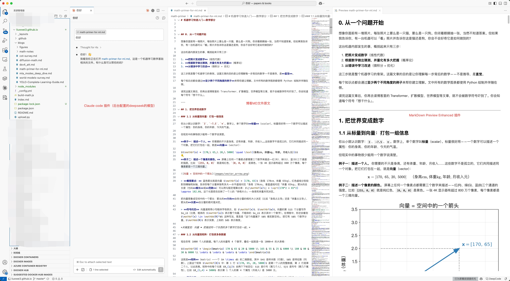

# 大伟的AI学习日志

---

## 文章目录

- [机器学习快速入门——数学部分](blogs/math-primer-for-ml)（约 1.6 万字）
- [Diffusion 模型的数学主线：从马尔可夫链到概率流](blogs/diffusion-math)（约 1.9 万字）
- [YOLO 目标检测算法：一文读懂十年演进 (2015–2026)](blogs/YOLO-Complete-Learning-Guide)（约 3.2 万字）
- [MLA 双模式深度专题：MHA 模式 vs MQA 模式](blogs/mla_modes_deep_dive)（约 0.3 万字）
- [DeepSeek-V4 注意力机制深度解析](blogs/dsv4_att)（约 0.9 万字）
- [世界模型综述：从像素之梦到表征理解（2018–2026）](blogs/world-models-survey)（约 3.6 万字）
- [思维链：从提示工程到推理时训练](blogs/cot-survey)（约 1.8 万字）

---

## 建议使用 AI Agent 阅读

这个仓库最适合的打开方式是：**用 VS Code + Claude Code 把文章下载到本地，逐段精读。** 你不需要安装 git、不需要懂命令行——全程在 VS Code 里用自然语言对话就能完成。

### 两步开始

<ol class="ai-steps">
  <li>
    <strong>安装 VS Code 并配置 Claude Code</strong> 
    <strong>①</strong> 下载安装 <a href="https://code.visualstudio.com/">VS Code</a>。 
    <strong>②</strong> 在 VS Code 扩展商店（<code>Ctrl+Shift+X</code>）搜索并安装 <a href="https://marketplace.visualstudio.com/items?itemName=anthropic.claude-code">Claude Code</a>（发布者 Anthropic，标识符 <code>anthropic.claude-code</code>）和 <code>Markdown Preview Enhanced</code>（用于漂亮的文章渲染预览）。重启 VS Code。 
    
  </li>
</ol>

<strong>⚙️ 可选：配置 DeepSeek 作为后端模型（中国大陆地区用户必读）</strong>  
Claude Code 默认通过 Anthropic 官方 API（<code>api.anthropic.com</code>）调用 Claude 模型。由于网络限制，中国大陆地区无法直接访问该端点。推荐使用 <strong>DeepSeek</strong> 作为替代后端——DeepSeek API 国内可直接访问，模型能力强、性价比极高，且与 Claude Code 兼容。如果你不在大陆且已拥有 Anthropic API 额度，可以跳过本节。  
<strong>① 获取 DeepSeek API Key</strong> 
访问 <a href="https://platform.deepseek.com/">DeepSeek 开放平台</a> 注册账号，进入「API Keys」页面创建 API Key。新用户通常有免费额度，后续按量计费，价格远低于海外模型。<strong>创建后立刻复制 Key 保存好</strong>，关掉页面就看不到了。  
<strong>② 关闭登录提示</strong> 
打开 VS Code 设置（<code>Cmd+,</code> 或 <code>Ctrl+,</code>），搜索 <code>claude code login</code>，勾选 <strong>Disable Login Prompt</strong>。  
<strong>③ 创建配置文件并写入配置</strong> 
注意：配置要写在 Claude Code 自己的配置文件里（<code>~/.claude/settings.json</code>），<strong>不是</strong> VS Code 的 <code>settings.json</code>。后者经常会失效。  
<em>Mac：</em>打开终端，运行： 
<code>mkdir -p ~/.claude && touch ~/.claude/settings.json && open ~/.claude/settings.json</code> 
<em>Windows：</em>按 <code>Win+R</code>，输入 <code>cmd</code> 回车，运行： 
<code>md %USERPROFILE%\.claude 2>nul & echo {} > %USERPROFILE%\.claude\settings.json & start %USERPROFILE%\.claude\settings.json</code>  
在打开的文件中填入以下内容（把 <code>sk-xxx</code> 换成你的 API Key）： 
<pre style="background:#fff; padding:0.6em 1em; border-radius:4px; border:1px solid #d0d7de; overflow-x:auto;"><code>{
  "env": {
    "ANTHROPIC_BASE_URL": "https://api.deepseek.com/anthropic",
    "ANTHROPIC_AUTH_TOKEN": "sk-你的DeepSeek-API-Key填这里",
    "ANTHROPIC_MODEL": "DeepSeek-V4-Pro[1m]",
    "ANTHROPIC_DEFAULT_HAIKU_MODEL": "DeepSeek-V4-Pro[1m]",
    "ANTHROPIC_DEFAULT_SONNET_MODEL": "DeepSeek-V4-Pro[1m]",
    "ANTHROPIC_DEFAULT_OPUS_MODEL": "DeepSeek-V4-Pro[1m]"
  }
}</code></pre>
保存后<strong>完全退出 VS Code 再重新打开</strong>，配置即可生效。如果 DeepSeek 后续推出新模型，把上面 <code>ANTHROPIC_MODEL</code> 和 <code>ANTHROPIC_DEFAULT_*_MODEL</code> 里的模型名换成新的即可。

<ol class="ai-steps" start="2">
  <li>
    <strong>用 Claude Code 一键下载文章</strong> 
    随便用 VS Code 打开一个空白文件夹，按 <code>Cmd+Shift+P</code>（Mac）或 <code>Ctrl+Shift+P</code>（Windows）打开命令面板，输入 <code>Claude Code: Open</code> 启动对话。在对话框中输入： 
    <code>请 clone 仓库 https://github.com/liuwwei3/liuwwei3.github.io.git 到当前文件夹下的 liuwwei3.github.io 子目录</code> 
    Claude Code 执行完毕后，用 VS Code 打开 <code>liuwwei3.github.io</code> 文件夹。所有文章都在 <code>blogs/</code> 目录下。选中 <code>.md</code> 文件，用 <code>Ctrl+K V</code>（Mac: <code>Cmd+K V</code>）开启 Markdown 预览，边看边向 Claude Code 提问。
    配置完成之后，工作界面如下： 
    
  </li>
  <li>
    <strong>使用文中注释实现精细问答</strong> 
    本项目的每篇文章都天然适合 AI 辅助阅读——你可以在阅读时用自然语言向 AI 提问。但需要注意：文章包含大量数学公式，如果直接在聊天窗口里复制包含公式的段落提问，公式经常会因格式转换而变形，导致 AI 理解错误，阅读体验很差。  
	    更好的做法是：你直接在原文中插入 HTML 注释 <code>&lt;!--你的问题--&gt;</code>，然后让 Claude Code 读取原文并逐条解答。这样公式直接从文件中读取，不会变形。 
    例如在不容易理解的部分后面加一行：<code>&lt;!--这里为什么用 log 而不是线性惩罚？--&gt;</code>，然后对 Claude Code 说「找出文中所有注释并解答」。
  </li>
</ol>
